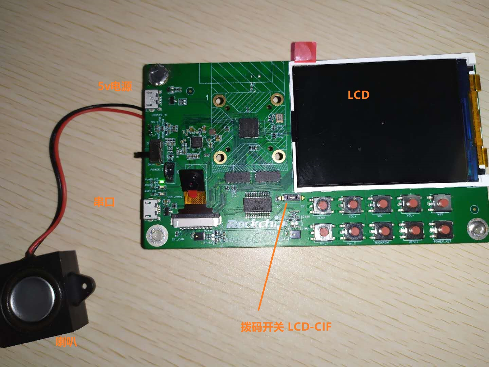
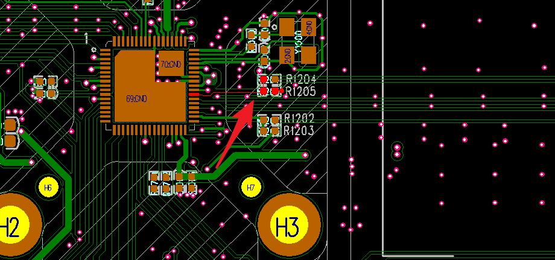

# RK2206 EVB V11 工厂测试说明

文件标识：RK-SM-YF-339

发布版本：V1.1.0

日期：2020-06-23

文件密级：□绝密   □秘密   □内部资料   ■公开

**免责声明**

本文档按“现状”提供，瑞芯微电子股份有限公司（“本公司”，下同）不对本文档的任何陈述、信息和内容的准确性、可靠性、完整性、适销性、特定目的性和非侵权性提供任何明示或暗示的声明或保证。本文档仅作为使用指导的参考。

由于产品版本升级或其他原因，本文档将可能在未经任何通知的情况下，不定期进行更新或修改。

**商标声明**

“Rockchip”、“瑞芯微”、“瑞芯”均为本公司的注册商标，归本公司所有。

本文档可能提及的其他所有注册商标或商标，由其各自拥有者所有。

**版权所有 © 2020 瑞芯微电子股份有限公司**

超越合理使用范畴，非经本公司书面许可，任何单位和个人不得擅自摘抄、复制本文档内容的部分或全部，并不得以任何形式传播。

瑞芯微电子股份有限公司

Rockchip Electronics Co., Ltd.

地址：     福建省福州市铜盘路软件园A区18号

网址：     [www.rock-chips.com](http://www.rock-chips.com)

客户服务电话： +86-4007-700-590

客户服务传真： +86-591-83951833

客户服务邮箱： [fae@rock-chips.com](mailto:fae@rock-chips.com)

---

**前言**

**概述**

本文旨在介绍**RK2206_EVB_V11_20191204**开发板**工厂测试模式**相关操作说明和注意事项。
需要了解工厂模式详细原理，请查看《Rockchip_RK2206_Developer_Guide_PCBA_CN》。

**产品版本**

| **芯片名称** | **内核版本** |
| ------------ | ------------  |
| RK2206       | FreeRTOS  V10.0.1 |

**读者对象**

本文档（本指南）主要适用于以下工程师：

技术支持工程师

软件开发工程师

**修订记录**

| **日期**   | **版本** | **作者** | **修改说明**           |
| ---------- | -------- | --------  | ---------------------- |
| 2020-02-26 | V1.0.0   | Conway Chen | 初始版本             |
| 2020-06-23 | V1.1.0   | Conway Chen | 增加LCD测试说明      |

---

**目录**

[TOC]

---

## RK2206_EVB_V11_20191204

RK2206_EVB_V11_20191204 平面图如下:



电池ADC通道触点



## 工厂模式编译设置

工厂测试模式需在编译前配置开启。

- 开启工厂测试模式

```
cd app/story_robot/gcc/
make distclean                                                 #清除编译垃圾
make rk2206_defconfig                                          #指定配置rk2206_defconfig

make menuconfig                                                #选择单板 RK2206 EVB_V11
#路径：(top menu) → Target Options → Board Options → Hardware Board Config                                                       Rockchip RKOS V2.0.0 SDK Configuration
( ) RK2206 FPGA
( ) RK2206 EVB
(X) RK2206 EVB_V11
( ) RK2206 STORY
( ) RK2206 STORY_V11

#路径：(top menu) → Components Confisg → Enable FACTORY TEST 选上开启厂测功能
下面是默认配置项，根据需要修改
[*] Enable FACTORY TEST
[*]     Enable debug                                            #debug
[*]     Enable Wi-FI                                            #Wi-Fi test module
-*-     Enable TF card                                          #TF card test module
[*]     Enable LCD
[*]     Enable camera                                           #camera test module
[ ]         camera save multiple photos in TF card              #照片保存多张，不选默认最新一张
[*]     Enable Battery Check                                    #启动电量测试
[*]     Enable record                                           #record test module
[ ]         record data save in TF card                         #录音数据是否保存
(4)         record time                                         #录音时间设置
(32)    Set volumn                                              #音量设置

make build -j32                                                 #编译
```

## 按键与测试项

- 按键丝印与下表一致

| **MENU**  | **VOL+**  | **MIC**     | **VOL-**  | **WIFI**      |
| --------- | --------- | ----------- | --------- | ------------- |
| **fun_1** | **fun_2** | **MASKROM** | **RESET** | **POWER_KEY** |

- 按键及触发功能

| 测试项           | 操作说明                                   |
| ----------       | ----------------------------------------   |
| 进入MaskROM | 按住MASKROM键不动，然后按住RESET键，再松开RESET键 |
| 启动工厂测试模式 | 开机按住MENU键和VOL+键不动                   |
| 摄像头测试       | 短按fun_2键                                 |
| 录音             | 长按fun_2键松开，录音；长按MIC键松开，播放录音 |
| TF卡             | 摄像拍照后，会再TF卡生成文件。PC端检查     |
| LCD              | 短按fun_1键，LCD会切换一种颜色               |

- 工厂模式测试流程

1. 进入MaskROM，烧录固件
2. 将拨码开关调至LCD功能(丝印标记LCD)
3. 长按MENU键和VOL+键，再按RESET键开机。自动启动Wi-Fi,TF卡，电量。测试结果语音播报，LCD会显示蓝色，短按fun_1键就会切换颜色，共红绿蓝三种显示。
4. 长按fun_2键松开，录音;长按MIC键松开，播放录音
5. 将拨码开关调至CIF功能(丝印标记CIF)，短按fun_2键进行摄像头测试，保存文件在TF卡