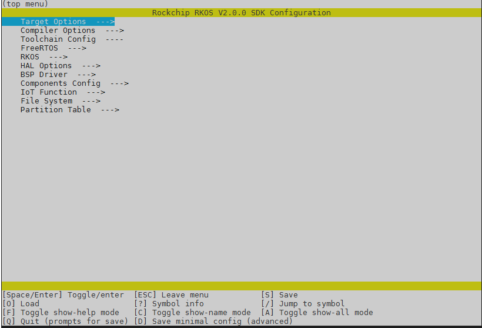
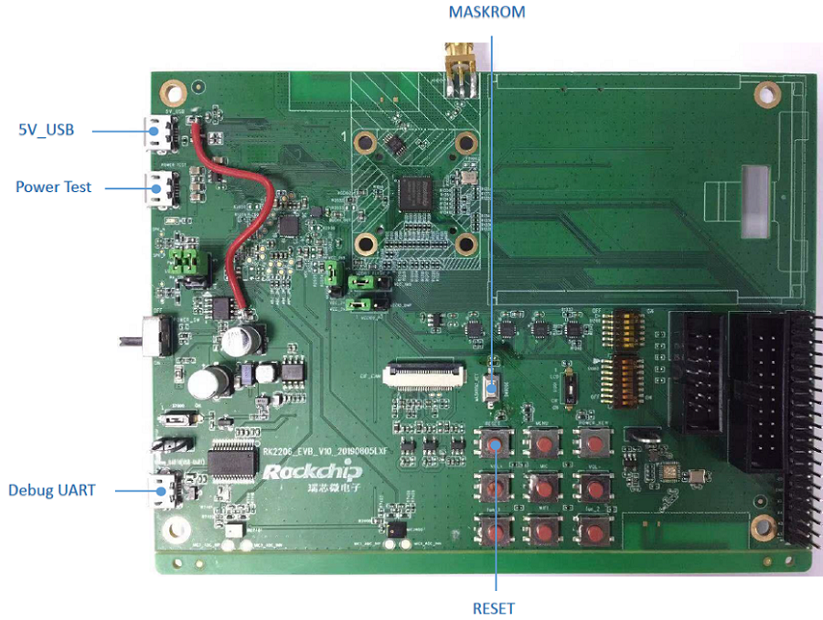
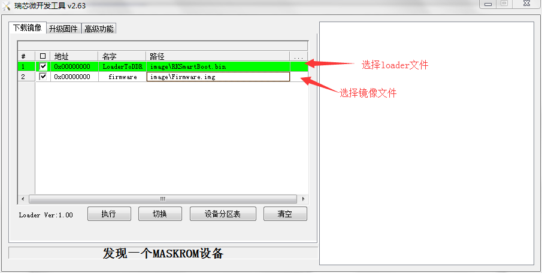
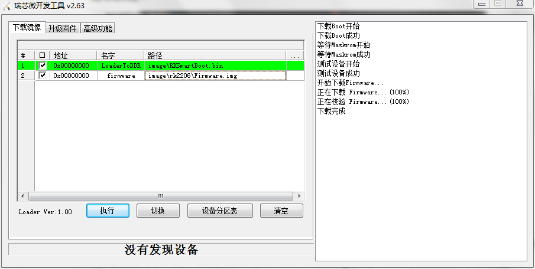
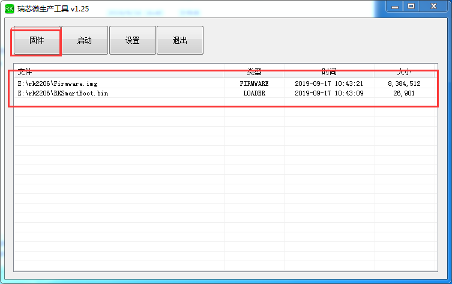
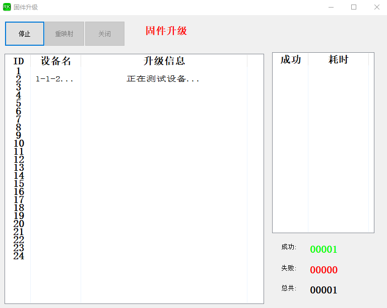
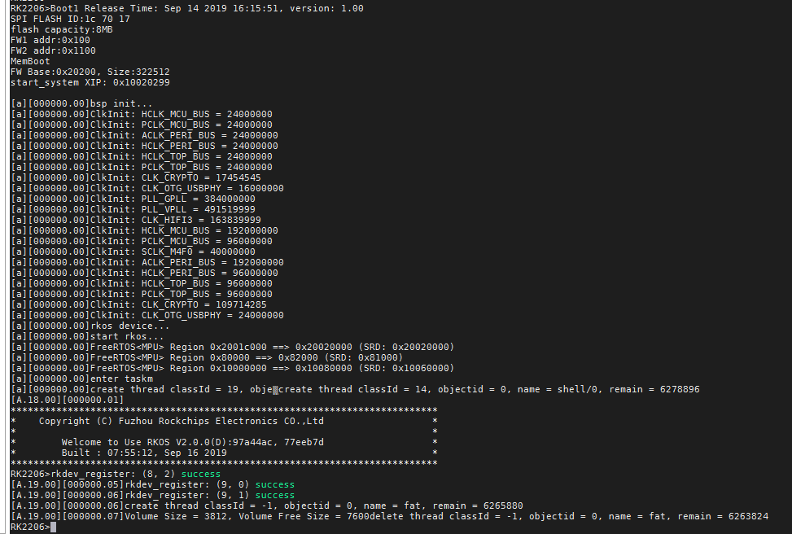

# Rockchip RK2206 FreeRTOS 快速入门

文件标识：RK-JC-CS-001

发布版本：V1.1.0

日期：2020-03-11

文件密级：□绝密   □秘密   □内部资料   ■公开

---

## **免责声明**

本文档按“现状”提供，福州瑞芯微电子股份有限公司（“本公司”，下同）不对本文档的任何陈述、信息和内容的准确性、可靠性、完整性、适销性、特定目的性和非侵权性提供任何明示或暗示的声明或保证。本文档仅作为使用指导的参考。

由于产品版本升级或其他原因，本文档将可能在未经任何通知的情况下，不定期进行更新或修改。

**商标声明**

“Rockchip”、“瑞芯微”、“瑞芯”均为本公司的注册商标，归本公司所有。

本文档可能提及的其他所有注册商标或商标，由其各自拥有者所有。

**版权所有** **© 2019** **福州瑞芯微电子股份有限公司**

超越合理使用范畴，非经本公司书面许可，任何单位和个人不得擅自摘抄、复制本文档内容的部分或全部，并不得以任何形式传播。

福州瑞芯微电子股份有限公司

Fuzhou Rockchip Electronics Co., Ltd.

地址：     福建省福州市铜盘路软件园A区18号

网址：     www.rock-chips.com

客户服务电话： +86-4007-700-590

客户服务传真： +86-591-83951833

客户服务邮箱： fae@rock-chips.com

---

## **前言**

 **概述**

 本文主要描述了RK2206的基本使用方法，旨在帮助开发者快速了解并使用RK2206 SDK开发包。

**产品版本**

| **芯片名称** | **内核版本**     |
| ------------ | ---------------- |
| RK2206       | FreeRTOS V10.0.1 |

**读者对象**

本文档（本指南）主要适用于以下工程师：

​        技术支持工程师

​        软件开发工程师

## **修订记录**

| **日期**   | **版本** | **作者**   | **修改说明**                                               |
| ---------- | -------- | :--------- | ---------------------------------------------------------- |
| 2019-09-18 | V0.0.1   | HuangZihan | 初始版本                                                   |
| 2019-09-22 | V0.0.2   | CWW        | 增加工程配置说明                                           |
| 2019-11-27 | V1.0.0   | CWW        | 修改文档排版                                               |
| 2020-03-05 | V1.0.1   | Chad.Ma    | 增加3.5小节                                                |
| 2020-03-11 | V1.1.0   | Aaron.sun  | 修改4.1增加输出信息的说明，增加4.3描述脚本，修订标题，标点 |

---

## **目录**

[TOC]

---

## **1 开发环境搭建**

### **1.1 开发环境选择**

 Linux环境：Ubuntu14.2以上 + GCC

### **1.2 编译工具链选择**

 版本号：gcc-arm-none-eabi-7-2018-q2-update

 Linux 版本：

<https://developer.arm.com/-/media/Files/downloads/gnu-rm/7-2018q2/gcc-arm-none-eabi-7-2018-q2-update-linux.tar.bz2>

### **1.3 编译工具安装与配置**

1. 下载工具链压缩包并解压到指定目录:

   RK2206 SDK工具链安装包默认位置为SDK包的tools目录下，如下：

   ```
   ├── tools
      └── gcc-arm-none-eabi-7-2018-q2-update
          ├── arm-none-eabi
          ├── bin
          ├── lib
          └── share
   ```

2. 下载工具链压缩包并解压到指定目录：

   如果用户将工具链解压并安装到指定目录，需要在根目录gcc.mk文件中指定其工具链安装位置，如下配置“CROSS_COMPILE”变量：

   ```makefile
   # --------------------------------------------------------------------
   # cross compiler
   # --------------------------------------------------------------------
   ifneq ($(wildcard ${ROOT_PATH}/tools/gcc-arm-none-eabi-7-2018-q2-update/bin),)
   CROSS_COMPILE ?= $(ROOT_PATH)/tools/gcc-arm-none-eabi-7-2018-q2-update/bin/arm-none-eabi-
   else
   CROSS_COMPILE ?= arm-none-eabi-
   endif
   ```

## **2 目录结构**

### **2.1 目录结构和说明**

```bash
.
├── app..............................#上层应用代码目录
│   ├── common
│   ├── linker_script................#代码编译链接文件
│   ├── wlan_demo
│   ├── story_robot
│   ├── test_demo
│   └── resource
├── bin..............................#分区表
│   ├── RK2108
│   └── RK2206
├── Docs.............................#说明文档
│   ├── avl
│   ├── develop
├── include..........................#公共头文件目录
│   ├── ai
│   ├── app
│   ├── driver
│   ├── dsp
│   ├── kernel
│   ├── linker
│   ├── shell
│   ├── subsys
│   └── sys
├── lib
├── src..............................#第三方组件，公共源文件目录，包含内核代码
│   ├── bsp..........................#板级支持
│   ├── components...................#第三方组件
│   ├── driver.......................#驱动
│   ├── subsys
│   │   ├── delay
│   │   ├── shell....................#终端命令集合以及模块和驱动的测试命令
│   │   ├── sysinfo_save
│   │   └── usb_server
│   ├── kernel
│   │   ├── FreeRTOS.................#FreeRTOS内核源码
│   │   ├── fwmgr....................#固件管理
│   │   ├── oal......................#抽象层接口
│   │   ├── pm.......................#电源管理
│   │   └── service
│   └── libc.........................#部分标准C函数的Wrap处理
└── tools ...........................#工具目录，包含开发升级、量产升级、固件打包、SN/MAC写号等工具
    ├── Rockchip_Develop_Tool_v2.63..#Window烧录工具和驱动
    ├── bin_split_tool_linux.........#二进制程序转txt工具
    ├── debug
    ├── firmware_merger..............#固件打包工具
    ├── Linux_Upgrade_Tool_v1.42.....#Linux烧录工具
    ├── ProductionTool_v1.25.........#生产烧录工具
    └── rk_provision_tool_V1.01......#SN/MAC写号工具
```

## **3 工程编译配置**

### **3.1 工程配置**

进入到对应的工程目录，如*wlan_demo*目录下，并运行工程配置工具*menuconfig*。

```bash
cd app/wlan_demo/gcc
make rk2206_defconfig   # (defconfig位置位于于各project gcc/defconfigs目录）
make menuconfig
```

如果没有问题，则会显示下面的菜单：



*menuconfig* 工具的常见操作如下：

- 上下箭头：移动

- 回车：进入子菜单

- ESC 键：返回上级菜单或退出

- 英文问号：调出帮助菜单（退出帮助菜单，请按回车键）

- 空格、Y 键``或``N 键：使能/禁用 [*] 配置选项

- 英文问号：调出有关高亮选项的帮助菜单

- / 键：寻找配置项目

- S键：保存当前配置

<div style="page-break-after: always;"></div>
### **3.2 保存配置**

以app/wlan_demo工程，rk2206_defconfig为默认配置为例：

```bash
cd app/wlan_demo/gcc
make rk2206_defconfig
make menuconfig
make savedefconfig # 保存配置到对应的默认配置文件rk2206_defconfig
```

### **3.3 配置项说明**

Kconfig配置主入口为工程根目录下Kconfig文件。

一级菜单配置项说明如下，可根据模块定义检索及添加新模块配置：

| 一级配置项        | 配置定义                                                 |
| ----------------- | -------------------------------------------------------- |
| Target Options    | 定义芯片平台、选用的硬件板型                             |
| Compiler Options  | 定义编译配置项、如log等级、优化等级                      |
| Toolchain Config  | 定义编译工具链配置                                       |
| FreeRTOS          | 定义FreeRTOS系统配置                                     |
| HAL Options       | 定义HAL功能开关及配置                                    |
| BSP Driver        | 定义BSP Driver功能开关及配置                             |
| Components Config | 定义系统组件功能开关及配置，如网络组件、播放器、编解码等 |
| IoT Function      | 定义第三方云平台功能开关及配置                           |
| File System       | 定义文件系统开关及配置                                   |
| Partition Table   | 定义系统使用分区表配置                                   |

### **3.4 Kconfig生成配置**

编译后会生成供代码引用头文件：

```c
include/sdkconfig.h
```

生成供Makefile引用的配置文件（存放至对应工程目录下）：

```bash
app/wlan_demo/gcc/.config
```

### **3.5 资源文件的打包**

根据项目是否支持GUI，将需要加入用户分区的资源文件放入对应工程目录的resource/userdata/或resource/userdata_gui目录中。例如：

```bash
app/wlan_demo/resource/userdata      #不支持GUI的资源路径
app/wlan_demo/resource/userdata_gui  #支持GUI的资源路径
```

项目Makefile中会根据项目配置来选择对应的userdata路径。

```makefile
ifeq ($(CONFIG_COMPONENTS_GUI), y)
USERDATA_PATH := app/$(PROJECT)/resource/userdata_gui
else
USERDATA_PATH := app/$(PROJECT)/resource/userdata
endif
```

配置文件中，确定分区表以后，若项目编译成功，会根据设置的分区表信息自动解析并打包当前指定工程中的资源文件，生成相应的用户分区文件系统（FAT 12）的userdata.img，并最终合并到Firmware.img固件中。

相关Makefile：

```bash
app/project.mk   #工程Makefile
```

生成用户分区userdata.img镜像：

```makefile
echo "Making $(USERDATA_NAME) from $(RESOURCE_PATH) with size($(USERDATA_PART_SIZE) K)"
dd of=$(USERDATA_NAME) bs=1K seek=$(USERDATA_PART_SIZE) count=0 2>&1 || fatal "Failed to dd image!"
mkfs.fat -F 12 $(USERDATA_NAME)
MTOOLS_SKIP_CHECK=1 mcopy -bspmn -D s -i $(USERDATA_NAME) $(RESOURCE_PATH)/* ::/
mv $(USERDATA_NAME) $(IMAGE_TOOL_PATH)
```

生成后userdata.img的路径：

```bash
Path_to_SDK/tools/firmware_merger/userdata.img
```

## **4 工程编译**

### **4.1 工程编译**

在SDK的目录中，有许多例子： story_robot，test_demo，wlan_demo等，了解更多请参考《Rockchip_RK2206_Developer_Guide_RKOS_App_Structure_CN》本实例使用wlan_demo来做示范：

工程编译文件在各自私有工程的gcc目录下，如wlan_demo的编译工程：

```bash
cd app/wlan_demo/gcc        #进入工程的目录下
make build	                #编译代码和生成烧录固件
```

编译成功后，将在wlan_demo工程的gcc目录下生成bin、elf及map等文件。

更多详细的编译命令：

```bash
make rk2206_defconfig	#设置编译的默认配置
make menuconfig	        #修改编译配置
make savedefconfig	    #保存配置
make	                #编译代码
make build	            #编译代码和生成烧录固件
make clean	            #清除生成的编译文件
make distclean	        #清除生成的编译文件、配置文件以及生成的固件
make help               #打印详细命令说明
make htmldocs           #生成系统API接口说明文档
```

在 SDK的根目录/image 中会生成固件，image目录有三个文件和一个debug目录：

| **文件名**       | **备注**       |
| ---------------- | -------------- |
| Firmware.img     | 镜像文件       |
| RKSmartBoot.bin  | Loader文件     |
| update.img       | OTA差异包文件  |

debug目录下的文件：

| **文件名**       | **备注**                     |
| ---------------- | ---------------------------- |
| .config          | 当前固件对应的config文件     |
| rk2206_defconfig | 当前固件默认保存的config文件 |
| wlan_demo.elf    | elf文件                      |
| wlan_demo.map    | map文件                      |

### **4.2 清除编译**

清除编译生成的文件:

```bash
make clean	    #清除生成的编译文件
make distclean	#清除生成的编译文件、配置文件、Doxygen文档以及生成的固件
```

### 脚本编译

在SDK根目录下执行./script/build.sh可以进行脚本编译，其参数如下：

| **参数**               | **备注**                                                     |
| ---------------------- | ------------------------------------------------------------ |
| -l, --list             | 列出所有工程下的所有defconfig：./script/build.sh -l          |
| -h, --help             | 帮助命令: ./script/build.sh -l                               |
| -a, --all              | 编译默认chip下的所有defconfig: ./script/build.sh -a          |
| -p, --project          | 编译默认工程下的所有默认chip的defconfig: ./script/build.sh -p |
| 版本号，工程名，配置名 | 指定版本号，工程名，配置名称的编译: ./script/build.sh V1.10.0 story_robot rk2206_story_defconfig |
| 空                     | 不输入任何参数按默认信息编译                                 |

vi ./scribpt/build.sh可以修改默认配置信息

```bash
#!/bin/bash
  2
  3 TOP_DIR=$(pwd)
  #DVERSION默认版本号
  4 DVERSION=V1.10.0
  #DIC默认芯片名
  5 DIC=rk2206
  #DPROJECT默认APP名称
  6 DPROJECT=story_robot
  #DCONFIG默认配置名称
  7 DCONFIG=rk2206_story_defconfig
  8 VERSION=$1
  9 VERSION=${VERSION:-$DVERSION}
 10 TARGET_PROJECT=$2
 11 TARGET_PROJECT=${TARGET_PROJECT:-$DPROJECT}
 12 TARGET_BOARD_CONFIG=$3
 13 TARGET_BOARD_CONFIG=${TARGET_BOARD_CONFIG:-$DCONFIG}
 14 TARGET_PROJECT_DIR=app/$TARGET_PROJECT/gcc
```

编译结果存在根目录下的IMAGE_RELEASE目录中, 以下以./script/build.sh -a为例进行说明

RK2206_ALL_V1.10.0_20200310.1415_RELEASE_TEST

| **字段**      | **备注**                                                     |
| ------------- | ------------------------------------------------------------ |
| RK2206        | 芯片名                                                       |
| ALL           | 所有APP的统称，非-a 参数时，ALL会被APP名称替代，比如：STORY_ROBOT |
| V1.10.0       | 固件版本                                                     |
| 20200310.1415 | 固件日期                                                     |
| RELEASE_TEST  | 固件用途                                                     |
固件目录中包含的内容如下：

| **文件名**                               | **备注**                                                     |
| ---------------------------------------- | ------------------------------------------------------------ |
| IMAGE-STORY_ROBOT-RK2206_STORY_DEFCONFIG | 固件目录，内容详见 4.1 工程编译中描述的image，格式如下：IMAGE -- 固定标识，STORY_ROBOT -- APP名称，非-a参数时，APP名称显示在上级目录，RK2206_STORY_DEFCONFIG--固件默认配置 |
| PATCHES                                  | 按照SDK目录的组织方式，存放相对于远程仓库的本地提交以及本地未提交的补丁 |
| build_cmd_info                           | 编译信息                                                     |
| manifest_20200311.1431.xml               | 本地所有仓库的mainifest                                      |

## **5 固件烧录**

RK2206开发板进入升级模式的方法有以下两种：

- 1 未烧录过的设备，上电后自动进入MaskRom升级模式
- 2 烧录过的设备，先插入USB上电按住MaskRom按键并同时按下Reset键，进入MaskRom升级模式

### **5.1 Windows USB驱动安装**

开发调试阶段，需要将设备切换至Loader模式或是MaskRom模式，并且正确安装Rockusb驱动才能正常识别设备。

 Rockchip USB驱动安装助手存放在tools/Rockchip_Develop_Tool_v2.63.zip压缩包的DriverAssitant_v4.91文件夹里，支持xp, win7_32, win7_64, win8_32, win8_64操作系统。

RK2206_EVB板：



安装步骤如下：

1. 打开并执行Rockusb驱动软件，界面如下：

   

2. 点击“驱动安装”直到驱动安装成功，参考如下：

   

3. 安装成功

   

 注意：在安装驱动的时候，部分windows系统的版本，需要绕过数字签名，重启电脑按F8，选择**强制禁用驱动程序签名强制**，再安装驱动。

### **5.2 Windows开发工具烧录**

Windows开发升级工具存储路径为：/tools/Rockchip_Develop_Tool_v2.63.zip

选择4.1章节所编译生成的Loader和image文件，点击“执行”按钮开始升级。



 烧写成功后：



### **5.3 Windows量产工具烧录**

Windows量产升级工具存储路径为：/tools/ProductionTool_v1.25/ProductionTool.exe

执行界面如下：



点击“固件”按钮，同时选择RKSmartBoot.bin文件与Firmware.img文件；

点击“启动”开始进入量产工具自动升级模式，此时开始会自动检测是否有升级设备插入，并自动执行升级过程。

界面如下：



量产工具可同时支持多台设备升级，升级结束后，点击“停止”并“关闭”升级窗口。

### **5.4 Linux开发工具烧录**

更多的细节描述，请参考\tools\Linux_Upgrade_Tool_v1.42\目录下文档：《Linux开发工具使用手册_v1.32.pdf》。

## **6 运行调试**

### **6.1 系统启动**

系统启动方式有以下几种：

1. 固件升级后，自动重新启动；
2. 插入USB供电直接启动；
3. 有电池供电的设备，按Reset键启动；

[^注]: 不同的硬件设计，其上电启动方式也会有不同的区别。

### **6.2 系统调试**

RK2206支持串口调试。不同的硬件设备，其串口配置也会有所不同。

串口通信配置信息如下：

波特率：115200

数据位：8

停止位：1

奇偶校验：none

流控：none

成功进入调试的截图：



