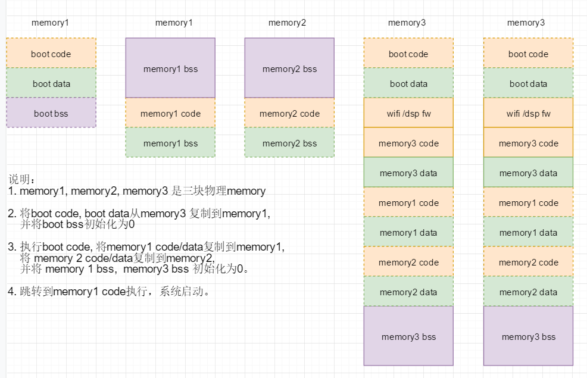

# **Rockchip RK2206 Firmware Structure User Guide**

文件标识：RK-KF-YF-310

发布版本：1.0.2

日       期：2020.2

文件密级：公开资料

---

**免责声明**

本文档按“现状”提供，福州瑞芯微电子股份有限公司（“本公司”，下同）不对本文档的任何陈述、信息和内容的准确性、可靠性、完整性、适销性、特定目的性和非侵权性提供任何明示或暗示的声明或保证。本文档仅作为使用指导的参考。

由于产品版本升级或其他原因，本文档将可能在未经任何通知的情况下，不定期进行更新或修改。

**商标声明**

“Rockchip”、“瑞芯微”、“瑞芯”均为本公司的注册商标，归本公司所有。

本文档可能提及的其他所有注册商标或商标，由其各自拥有者所有。

**版权所有** **© 2019** **福州瑞芯微电子股份有限公司**

超越合理使用范畴，非经本公司书面许可，任何单位和个人不得擅自摘抄、复制本文档内容的部分或全部，并不得以任何形式传播。

福州瑞芯微电子股份有限公司

Fuzhou Rockchip Electronics Co., Ltd.

地址：     福建省福州市铜盘路软件园A区18号

网址：     www.rock-chips.com

客户服务电话： +86-4007-700-590

客户服务传真： +86-591-83951833

客户服务邮箱： fae@rock-chips.com

---

## **前言**

**概述**

本文档主要介绍了Rockchip 2206芯片平台的固件结构形式，方便开发者直观的了解固件的构成。

**产品版本**

| **芯片名称** | **内核版本**     |
| ------------ | ---------------- |
| RK2206       | FreeRTOS V10.0.1 |

**读者对象**

本文档（本指南）主要适用于以下工程师：

​        技术支持工程师

​        软件开发工程师

**修订记录**

| **日期**   | **版本** | **作者** | **修改说明**                                                 |
| ---------- | -------- | -------- | ------------------------------------------------------------ |
| 2018-12-28 | 1.0.0    | MLC      | 初始版本                                                     |
| 2019-11-15 | 1.0.1    | MLC      | 支持RK2206，修改软件版本                                     |
| 2020-2-5   | 1.0.2    | sch      | 增加固件结构的说明，ld.s文件编写指南，固件的备份与修复，OTA升级 |

## **目录**

[TOC]

## **1 概述**

RK2206的固件采用分区表进行分区管理,支持AB固件备份。生成的固件文件是可以直接运行，只要从目标存储0地址开始烧录全部固件内容，就可完成固件升级。

### **1.1 固件结构**

固件分区结构具体详见下表：
| 0 – 7 扇区            | 分区表    |
| --------------------- | --------- |
| 8 -  63 扇区          | Vendor区  |
| 64 – 255 扇区         | IDBlock区 |
| 分区1起始 - 分区1结束 | 分区1     |
| …                     | …         |
| 分区n起始 - 分区n结束 | 分区n     |


### **1.2 分区表介绍**

分区表由分区表头(1个扇区)和分区表项(7个扇区)组成，一个扇区可以存放4个分区表项， RKOS最多可以支持28个分区。

分区表头结构具体如下：

```c
typedef struct {
	UINT	uiFwTag;
	STRUCT_DATETIME	dtReleaseDataTime;
	UINT	uiFwVer;
	UINT	uiSize;/*分区表头结构大小,字节单位,固定512*/
	UINT	uiPartEntryOffset;/*分区项偏移,扇区单位,固定1*/
	UINT	uiBackupPartEntryOffset;
	UINT	uiPartEntrySize;/*分区项大小,字节单位,固定128*/
	UINT	uiPartEntryCount;
	UINT	uiFwSize;/*unit of byte*/
	BYTE    noBackupHeader;
	char	szChip[4];
	char    szModel[32];
	BYTE	reserved[427];
	UINT	uiPartEntryCrc;/*所有分区项Crc*/
	UINT	uiHeaderCrc;
} STRUCT_FW_HEADER, *PSTRUCT_FW_HEADER;
```

分区表项结构：

```c
typedef struct {
	char	szName[32];
	ENUM_PARTITION_TYPE emPartType;/*分区类型*/
	UINT	uiPartOffset;/*分区基址,单位扇区*/
	UINT	uiPartSize;/*分区大小,单位扇区*/
	ULONGLONG uiDataLength;/*分区数据大小*/
	UINT	uiPartProperty;/*分区属性*
	BYTE	reserved[72];
} STRUCT_PART_ENTRY, *PSTRUCT_PART_ENTRY;
```

### **1.3 分区表详细配置**

固件中各个分区表在固件中位置可在setting-story-machine-8M.ini文件中详细配置：

配置文件位置为：

```
Path_to_SDK/bin/RK2206/setting-story-machine-8M.ini
```

此处，根据Flash容量大小，配置了8M Flash的分区表，后续实际开发中可根据实际使用的Flash大小做配置上的调整。

分区大小的计算公式：
$$
PartSize * 512 （512为sector大小，单位Byte）
$$

该配置文件会在系统编译前拷贝至tools/firmware_merger/目录中。

分区表的选择可用menuconfig来配置。

```
(top menu)
    Partition Table  --->
        Partition Table (Two Firmware, Data, User for 8MB Flash)  --->
			( ) Two Firmware, Data, User for 4MB Flash
			(X) Two Firmware, Data, User for 8MB Flash
			( ) Two Firmware, Data, No User for 8MB Flash
			( ) Custom partition table
```

## **2 分区介绍**

### **2.1  Vendor区**

Vendor区是一块可读可写区域，可以在PC端工具和在系统的应用中进行读写，主要用于保存序列号,网卡地址等数据。在工具升级固件和OTA更新固件中都会对这部分数据进行保护。

### **2.2  IDBlock区**

IDBlock区是系统引导区，主要存储引导相关的数据和一级loader代码，系统上电后，芯片内的固化代码会查找这个数据,进行校验和引导。RK2206固件在IDBlock区存放着两份这样的引导数据，分别在64扇区和128扇区。

### **2.3  Firmware1区**

Firmware1分区是用来存放系统固件的区域，系统固件是指打包了可执行程序的代码与数据。系统运行起来后，会一直运行Firmware1分区中的程序与数据，当Firmware1分区损坏或者Firmware2分区通过OTA升级成功后需要Firmware2分区固件恢复到Firmware1分区。

### **2.4 Firmware2**

Firmware2分区是Firmware1固件分区的备份。通过OTA升级总是更新Firmware2固件分区。当Firmware1分区损坏或者OTA升级成功后，系统会从Firmware2分区启动，并恢复Firmware1固件分区。

### **2.5  Data区**

Data分区用来存放系统全局配置信息，wifi配置信息等数据。系统运行后会从该分区中读取全局配置信息及Wi-Fi配置信息等。

### **2.6  Userdata区**

Userdata分区是用来存放一些用户数据或者文件，比如提示音，歌曲文件等。该分区一定是最后一个分区。

### **2.7  其他分区**

用户可以根据使用场景增加其他一些分区，这些分区需要放在Data分区与Userdata分区之间。例如，如果使用带屏显示的使用场景，需要添加一些字库、菜单、UI等资源数据，可以在Data分区之后，Userdata分区前增加一些资源分区。

## **3 固件结构**

### **3.1  总体框图**



上图中的方框叫段，段是section的容器，section 又是code, data, bss的容器， linker的最小单元是以section为单元的。每个段有3个属性，即存储域地址，执行域地址，段大小。bss 段不出现在存储域。把3个名称相同的code, data, bss 段放在一起，定义一个ID，按照ID信息顺序放在一起，便构成段信息数组存于固件中。

段信息结构体：

```c
//Code Info Table
typedef struct _SEGMENT_INFO_T
{
    uint32 *CodeLoadBase;/*code段 存储域地址*/
    uint32 *CodeImageBase；/*code段 执行域地址*/
    uint32 *CodeImageLength;/*code段 大小*/
    uint32 *DataLoadBase;/*data段 存储域地址*/
    uint32 *DataImageBase;/*data段 执行域地址*/
    uint32 *DataImageLength;/*data段 大小*/

    uint32 *BssImageBase;/*bss段 执行域地址*/
    uint32 *BssImageLength;/*bss段 大小*/
    uint8  Name[16];/*段名称*/
} SEGMENT_INFO_T;
```

ld 文件就是对这些预设段进行排序，lilnker按照ld中指定的规则，将section放进指定的段中。

### **3.2  启动方式的选择**

rk2206一共有3块存储空间，分别是128K的sram, 8m 的psram 和 8m spi flash， 可以灵活的和上图的3个memory 所对应，从而产生不同的应用环境，可以通过kconfig 来选择对应关系。

```
(top menu) → Compiler Options → Linker Section Features → Enable Load System → Load System From
                                                                                                  Rockchip RKOS V2.0.0 SDK Configuration
( ) SRAM
( ) PSRAM
(X) XIP
```

XIP: memory3 对应spi flash, 主要应用在量产的产品上。

PSRAM: memory3 对应psram. 主要应用在直接将代码通过jtag 或者其他方式直接下载到psram上。

SRAM: memory3 对应sram, 主要应用在直接将代码通过jtag 或者其他方式直接下载到sram上。

### **3.3 ld.s文件规则**

系统中提供了3个ld.s文件，分别是sram.ld.s, psam.ld.s, xip.ld.s，这些文件记录了ld文件的生成规则，通过以下kconfig 来选择对应关系

```
(top menu) → Compiler Options → Linker Section Features → Linker Script Name
                                                                                                  Rockchip RKOS V2.0.0 SDK Configuration
( ) SRAM
( ) PSRAM
(X) XIP
```

XIP: 对应xip.ld.s, 未指定段的section（用户自定义的section 除外） 将被定位在xip相关的段中。

PSRAM: 对应psram.ld.s, 未指定段的section（用户自定义的section 除外）将被定位在psram相关的section

SRAM:  对应sram.ld.s, 未指定段的section（用户自定义的section 除外）将被定位在sram相关的section

以上3个文件均支持用户自定义section, 用户自定义section必须在ld.s文件中指定相应得段容器，否则无法生成固件。

系统提供的自定义section如下：

```c
#ifdef CONFIG_LINKER_SRAM_SECTION
#define SECTION_SRAM_CODE __attribute__((section(".sram_code")))
#define SECTION_SRAM_DATA __attribute__((section(".sram_data")))
#define SECTION_SRAM_BSS  __attribute__((section(".sram_bss")))
#else
#define SECTION_SRAM_CODE
#define SECTION_SRAM_DATA
#define SECTION_SRAM_BSS
#endif

#ifdef CONFIG_LINKER_PSRAM_SECTION
#define SECTION_PSRAM_CODE __attribute__((section(".psram_code")))
#define SECTION_PSRAM_DATA __attribute__((section(".psram_data")))
#define SECTION_PSRAM_BSS  __attribute__((section(".psram_bss")))
#else
#define SECTION_PSRAM_CODE
#define SECTION_PSRAM_DATA
#define SECTION_PSRAM_BSS
#endif

#ifdef CONFIG_LINKER_XIP_SECTION
#define SECTION_XIP_CODE __attribute__((section(".xip_code")))
#else
#define SECTION_XIP_CODE
#endif

#define SECTION_BOOT __attribute__((section(".boot")))
#define WIFI_FIRMWAVE  __attribute__((section(".wifi_firmwave")))
#define DSP_FIRMWAVE  __attribute__((section(".dsp_firmwave")))
```

其中xip, psram, sram 相关的section可以通过kconfig 进行使能。

```
(top menu) → Compiler Options → Linker Section Features
                                                                                                  Rockchip RKOS V2.0.0 SDK Configuration
[*] Enable SRAM Section
[*] Enable PSRAM Section
[ ] Enable XIP Section
[*] Enable Load System  --->
    Linker Script Name (XIP)  --->
```

Enable SRAM Section： 使能sram section, 该section 在三个ld.s 文件中均被定位到sram memory上。

Enable PSRAM Section：使能psram section, 该sepction 在三个ld.s 文件中均被定位到psram memory上。

Enable XIP Section：使能xip section, 该sepction 在三个ld.s 文件中均被定位到spi flash上。

除了系统提供的默认自定义的section外，也可以自行增加，但必须在ld.s中指定相应的段容器。

ld.s 原理和编写方式，请参考：

《Rockchip_Developer_Guide_FreeRTOS_Link_Script_CN.md》。

### **3.4 物理内存的配置**

由于RK2206内部有3个处理器，M4, M0, DSP， 内存结构及其复杂，物理内存共享，为了更改分配每个处理的内存大小，使用kconfig来分配每个内存的起始位置和大小。

```
(top menu) → Target Options → Chip Options
                                                                                                  Rockchip RKOS V2.0.0 SDK Configuration
(0x00088C00) sram icache base
(0x20008C00) sram dcache base
(0x00017400) sram size
(0x18100000) psram icache base
(0x38100000) psram dcache base
(0x00600000) psram size
(0x10000000) xip icache base
(0x30000000) xip dcache base
(0x00200000) xip size
```

icache 和  dcache 看的是同一块物理内存。

### **3.5  固件备份和修复**

rk2206上的spiflash 划分了2个固件分区，第二个分区用来备份固件用的， 前级loader会对固件进行HASH校验，默认重第一份固件启动，如果第一份固件坏了，则从备份固件启动，并设置标志，RKOS检测该标志，用备份固件恢复第二份固件，相反如果备份固件坏了，则重新备份一下。这里只用HASH值比对来确认固件的完整性，不做全盘比较，从而很好的支持了OTA升级。

### **3.6  OTA升级**

云端推送OTA升级链接，OTA升级线程下载固件头，并做版本校验，如果需要升级，则下载整个固件到备份分区，然后做HASH校验，校验通过后，设置标记，重启。前级loader根据所设置的标记，通过备份固件启动，启动后将备份固件覆盖第一份固件，复制完后，设置升级OK标记，重启系统，完成OTA升级。

