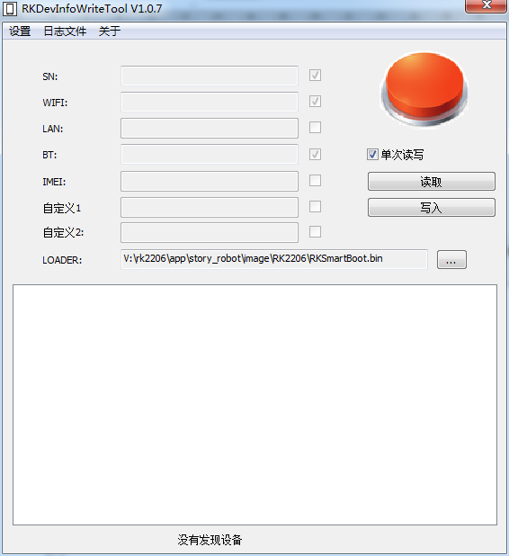
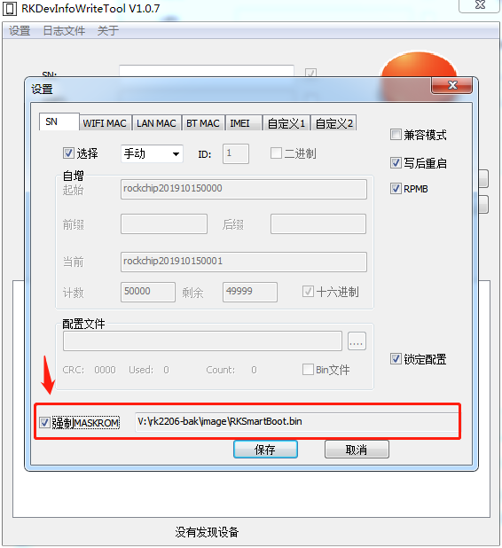
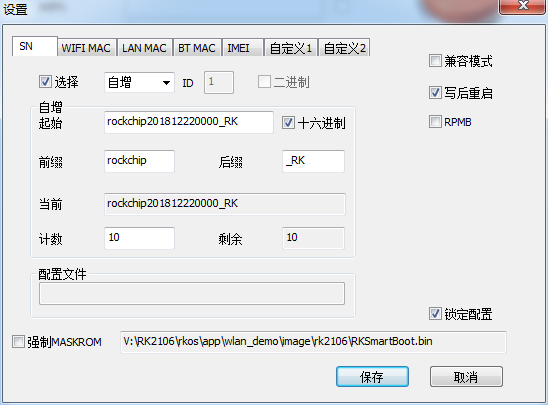

# **Rockchip RKDevInfoWriteTool User Guide**

文件标识：RK-KF-YF-311

发布版本：1.0.2

日       期：2019.11

文件密级：公开资料

---

**免责声明**

本文档按“现状”提供，福州瑞芯微电子股份有限公司（“本公司”，下同）不对本文档的任何陈述、信息和内容的准确性、可靠性、完整性、适销性、特定目的性和非侵权性提供任何明示或暗示的声明或保证。本文档仅作为使用指导的参考。

由于产品版本升级或其他原因，本文档将可能在未经任何通知的情况下，不定期进行更新或修改。

**商标声明**

“Rockchip”、“瑞芯微”、“瑞芯”均为本公司的注册商标，归本公司所有。

本文档可能提及的其他所有注册商标或商标，由其各自拥有者所有。

**版权所有** **© 2019** **福州瑞芯微电子股份有限公司**

超越合理使用范畴，非经本公司书面许可，任何单位和个人不得擅自摘抄、复制本文档内容的部分或全部，并不得以任何形式传播。

福州瑞芯微电子股份有限公司

Fuzhou Rockchip Electronics Co., Ltd.

地址：     福建省福州市铜盘路软件园A区18号

网址：     www.rock-chips.com

客户服务电话： +86-4007-700-590

客户服务传真： +86-591-83951833

客户服务邮箱： fae@rock-chips.com

---

## **前言**

**概述**

本文档主要介绍Rockchip 2206芯片平台适用的写号工具RKDevInfoWriteTool 的使用。

**产品版本**

| **芯片名称** | **内核版本**     |
| ------------ | ---------------- |
| RK2206       | FreeRTOS V10.0.1 |
| RK2108       | RT-Thread 3.0.x  |

**读者对象**

本文档（本指南）主要适用于以下工程师：

​        技术支持工程师

​        软件开发工程师

**修订记录**

| **日期**   | **版本** | **作者** | **修改说明**               |
| ---------- | -------- | -------- | -------------------------- |
| 2018-12-28 | 1.0.0    | MLC      | 初始版本                   |
| 2019-06-27 | 1.0.1    | CWW      | 修改文档名以及客户服务邮箱 |
| 2019-10-15 | 1.0.2    | MLC      | 支持RK2206，修改软件版本   |

---

## **目录**

[TOC]

---

## **1 RKDevInfoWriteTool工具**

### **1.1 概述**

RKDevInfoWriteTool工具用于在 VENDOR 分区写入用户定义数据，如机器的 SN、Wi-Fi、BT、IMEI、用户自定义等信息，这些信息在设备恢复出厂设置后，不会丢失。

工具可以工作在Maskrom或者Loader这两种RK USB模式下。

#### **1.1.1 工具位置**

工程根目录Path_To_SDK/tools/RKDevInfoWriteTool_Setup_V1.0.7_0926。打开后安装到指定目录后，运行工具。

#### **1.1.2 工具主界面及说明**



**1. 单次读写** 勾选“单次读写”，每次接入设备之后，需要再次按“读取”或者“写入”才能读号或者写号；

**2. 连续读写** 不勾选“单次读写”，接入新设备自动触发读写操作。写号时候，在手动输入模式下面，全部项都输完之后，敲回车键，也会触发写入操作，这个操作，方便用户使用扫描枪写号，注意要设置扫描枪末尾自动回车功能；

**3. Loader**: 设备在 Maskrom模式 下，必须选择正确的 MiniLoader 文件。Loader模式不需要选择。

**注意事项**：

目前RK2206平台作为非Linux系统平台，只能在Maskrom模式下正常使用该工具。



### **1.2 目录结构**

RKDevInfoWriteTool安装后的目录结构如下：

```
├── adb.exe
├── AdbWinApi.dll
├── AdbWinUsbApi.dll
├── config.ini
├── DEVNAME.bin
├── Language
│   ├── Chinese.ini
│   └── English.ini
├── log
├── plugs
├── unins000.dat
├── unins000.exe
├── RKDevInfoWriteTool使用指南.pdf
├── RKDevInfoWriteTool.exe
└── RKUpgrade.dll
```

其中

- Language目录:语言文件

- Config.ini ：工具配置文件

- RKDevInfoWriteTool.exe：写号主程序

### **1.3 写号设置**



写号配置

写号工具支持同时写入 7 个项，其中五个是预定义的（ID 是固定的，不能修改），剩下两个可以用户通过修改 ID 自定义写入。

每项的配置：

1、选择：用户选择是否写入，选择后，用户可以选择“自增”、“手动”、“文件”方式这三种方式写号。

2、ID：用于区分不同的项，其中“SN”、“LAN MAC”、“WIFI MAC”、“BT MAC”、“IMEI”的ID 固定不变，剩下两个是可以用户自己修改的，但是不能与前面预定义的重复。

**注意事项：**

- 通用模式：“兼容模式”与“RPMB”都不勾选。
- 若遇到某项ID无法写入时，请检查当前ID下的串号是否被重复写入，工具中做了防呆处理，相同串号不能重复写入，若需重复写入，请删除工具目录下plugs/*.db文件。
