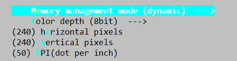
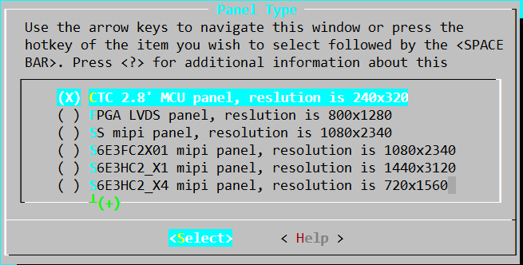

# RT-Thread ASR 应用开发指南

文件标识：RK-KF-YF-364

发布版本：V1.2.0

日期：2020-08-11

文件密级：□绝密   □秘密   □内部资料   ■公开

**免责声明**

本文档按“现状”提供，瑞芯微电子股份有限公司（“本公司”，下同）不对本文档的任何陈述、信息和内容的准确性、可靠性、完整性、适销性、特定目的性和非侵权性提供任何明示或暗示的声明或保证。本文档仅作为使用指导的参考。

由于产品版本升级或其他原因，本文档将可能在未经任何通知的情况下，不定期进行更新或修改。

**商标声明**

“Rockchip”、“瑞芯微”、“瑞芯”均为本公司的注册商标，归本公司所有。

本文档可能提及的其他所有注册商标或商标，由其各自拥有者所有。

**版权所有 © 2020 瑞芯微电子股份有限公司**

超越合理使用范畴，非经本公司书面许可，任何单位和个人不得擅自摘抄、复制本文档内容的部分或全部，并不得以任何形式传播。

瑞芯微电子股份有限公司

Rockchip Electronics Co., Ltd.

地址：     福建省福州市铜盘路软件园A区18号

网址：     [www.rock-chips.com](http://www.rock-chips.com)

客户服务电话： +86-4007-700-590

客户服务传真： +86-591-83951833

客户服务邮箱： [fae@rock-chips.com](mailto:fae@rock-chips.com)

---

**前言**

**概述**

本文档主要介绍RT-Thread ASR的应用开发实例。

**产品版本**

| **芯片名称** | **RT Thread 版本** |
| ------------ | ----------------- |
| RK2108       | RT-Thread v3.1.3 及以上      |

**读者对象**

本文档（本指南）主要适用于以下工程师：

技术支持工程师

软件开发工程师

**修订记录**

| **版本** | **作者** | **日期**   | **修改说明**              |
| -------- | -------- | ---------- | ------------------------- |
| V1.0.0   | 马龙昌   | 2019-09-06 | 初始发布                  |
| V1.0.1   | 马龙昌   | 2020-03-30 | 更新第2章节               |
| V1.1.0   | 马龙昌   | 2020-05-27 | 更新文档格式，更新第2章节 |
| V1.2.0   | 吴佳健   | 2020-08-11 | 更新文档格式，更新配置说明 |

---

** 目录**

[TOC]

---

## 概述

本文介绍了Rockchip 应用实例基于 RT-Thread 实现的ASR语音唤醒功能(思必驰语音固件）、并结合ASR语音唤醒功能实现带屏显示语音唤醒交互结果的功能。

通过本文介绍的应用实例，开发者可了解并掌握关于Rockchip RT-Thread开发平台的基于语音唤醒功能、带显示的应用使用功能，以便参考。

## ASR应用实例

### 代码路径

```bash
./applications/
├── rk_iot_app/asr
```

### 配置说明

bsp/rockchip/rk2108目录下，执行scons --menuconfig，参考配置如下：

- 开启DSP配置（选中其中标注*的项，下同）

```bash
> RT-Thread rockchip rk2108 drivers > Enable DSP >
[*] Enable DSP
[*]   Enable firmware loader to dsp  #使能将固件加载到dsp
        Dsp firmware path (Store firmware data in builtin)  --->
(rkdsp_fw.c) Dsp firmware file name  #此处填入dsp_fw目录下固件文件名
[ ]   Enable dsp send trace to cm4
(0)   Config dsp debug uart port
```

这里dsp debug uart的port配置根据实际使用中调试串口端口保持一致。

若这里使用uart0作为M4调试端口，DSP同样也需配置成端口0，否则无法接收DSP端的调试信息。

- 开启codec

```bash
> RT-Thread rockchip rk2108 drivers > Enable Audio > Audio Card >
[*] Audio Cards
[ ]   Enable Internal ADC audio card
[ ]   Enable AUDIOPWM audio card
[ ]   Enable I2S Ditigal Mic audio card
[*]   Enable PDM Digital Mic audio card     #选择PDM MIC
[ ]   Enable Everest Semi ES7243 audio card
[*]   Enable Everest Semi ES8311 audio card #选择es8311 声卡
[ ]   Enable Everest Semi ES8388 audio card
[ ]   Enable mix audio card with Interal ADC + ES8311
[ ]   Enable mix audio card with PDM Mics + ES8388
```

根据硬件具体情况选择使能声卡。

- 开启APP

```bash
> RT-Thread application
    Display demo select (Applications disable)  --->
[*] rk iot app
[*]   system info save to flash
[*]   boot app automatically
[ ]   network and wlan enable
[ ]   Enable aispeech
      Select asr wake up mode (use xiaodu wake up words)  ---> #选择唤醒词
(es8311p) Playback sound card   #播放声卡设置
(pdmc) ASR sound card	        #录音声卡设置
[ ]   dsp get data through vad path
[ ] Enable dual-tracking
```

- 开启Audio Server

```bash
> RT-Thread third party package
[*] Audio server  --->
    --- Audio server
        Compile type (Use static library)  --->  #选择使用静态库
```

### 思必驰固件配置说明

思必驰固件使用dsp_fw/rkdsp_fw_speech.c，需在[配置说明](# 配置说明)基础上修改如下配置：

**固件选择**

```bash
> RT-Thread rockchip rk2108 drivers > Enable DSP >
...
(rkdsp_fw_speech.c) Dsp firmware file name  #此处选择思必驰dsp固件文件
...

> RT-Thread application
...
      Select asr wake up mode (use speech wake up words)  ---> #使用思必驰唤醒词
...
```

**替换setting.ini**

使用bsp/rockchip/rk2108/board/common/setting_speech.ini替换bsp/rockchip/rk2108/board/common/setting.ini，并保持setting.ini名称不变。

**修改内存地址**

由于思必驰固件较大，需要使用部分SRAM，因此将CPU可用内存SRAM缩小。

```bash
> RT-Thread board config  --->
    (audio_demo_rk2108_v11) the board name of you use #同board目录下定义的板型名称
    (0x200E0000) the address of sram end #调整SRAM的结束地址到0x200E0000,默认为0x20100000
    [ ] Enable Cortex M4 JTAG
    [ ] Enable DSP JTAG
```

### 声卡接口说明

声卡接口具体实现在`bsp/rockchip/common/drivers/audio/rk_audio.c`，使用示例可参考`bsp/rockchip/common/tests/tinyplay.c`和`bsp/rockchip/common/tests/tinycap.c`。

#### 接口说明

rk_audio.c文件内接口不能直接调用，而是通过RT-Thread Audio设备框架进行调用，相关接口有：

| 接口名称| 用途 |
| ------------------------------------------------------------ | ------------------------------- |
| rt_device_t rt_device_find(const char* name);                | 根据 Audio 设备名称获取设备句柄 |
| rt_err_t rt_device_open(rt_device_t dev, rt_uint16_t oflags); | 通过设备句柄打开或关闭设备      |
| rt_err_t rt_device_control(rt_device_t dev, rt_uint8_t cmd, void* arg); | 通过设备句柄操作设备 |
| rt_size_t rt_device_write(rt_device_t dev, rt_off_t pos, const void* buffer, rt_size_t size); | 写入音频数据 |
| rt_size_t rt_device_read(rt_device_t dev, rt_off_t pos, void* buffer, rt_size_t size); | 获取音频数据 |
|rt_err_t rt_device_close(rt_device_t dev); | 关闭音频设备 |

接口详细说明请查看RT-Thread官方文档 [Audio设备篇](https://www.rt-thread.org/document/site/programming-manual/device/audio/audio/)。

#### 注意事项

音频读写所需环形内存由调用者维护，即需要调用者申请内存，并在使用结束后释放，申请或释放需要使用`rt_malloc_uncache`和`rt_free_uncache`接口，使用其他接口申请的内存可能会因为读写速度的影响导致声音卡顿。

读写音频数据时传入的`size`为帧大小，与bytes的关系为`frames = bytes / (bits >> 3 * channels)`，例如16bits、2ch的情况下，帧字节数为2048，则读写时传递的size应为`2048 / (16 >> 3 * 2) = 512`。

## Display应用实例

### 代码路径

```
./applications/
├── rk_iot_app
├── rk_iot_display
```

### 配置说明

显示实例相关配置如下：

**进入工程目录，执行menuconfig命令：**

```
usr@host:~/path to sdk/$ cd bsp/rockchip/rk2108/
usr@host:~/path to sdk/bsp/rockchip/rk2108$ scons --menuconfig
```

- **LittlevGL组件的配置：**

```
Location:
  -> RT-Thread Components
      -> System
         -> LittlevGL2RTT: The LittlevGl gui lib adapter RT-Thread (RT_USING_LITTLEVGL2RTT [=y])
            -> LittlevGL2RTT Component Options
```

具体配置如上图所示：使用MCU屏，配置成宽高240*240像素，8bit色深。



按照以下配置，选择240x320 MCU屏幕:

```
Location:
    -> RT-Thread rockchip common drivers
        Panel Type (CTC 2.8' MCU panel, reslution is 240x320)  --->
```

需先配置RGB与VOP相关驱动。



- **相关驱动配置**：

```
-> RT-Thread rockchip rk2108 drivers
    [*] Enable RGB
    [*] Enable VOP
```

因io复用的关系，若使用显示功能需关闭codec相关的配置。

- **关闭codec：**

```
> RT-Thread rockchip rk2108 drivers
    > Enable Audio  --->
        Enable Audio Card  --->
            [ ]   Enable es8388 audio card
```

- **版型配置**：

```
-> RT-Thread board config
    -> Board Type
        (X) Enable RK2108B_EVB board
```

- **ASR唤醒通路配置：**

```
-> RT-Thread rockchip rk2108 drivers
    [*] Enable PCM
    [*] Enable I2STDM
    [*]   Enable I2STDM0
        Enable Audio Card  --->
        [*] Audio Cards
        [*]   Enable internal adc audio card
        [ ]   Enable digital mic audio card
        [ ]   Enable es8388 audio card
```

- **开启app：**

```
-> RT-Thread application
[*] IoT display enable
[*] rk iot app
```

### 应用开机启动

RT-Thread 开机启动应用的代码在applications/start_app/application.c中，test_thread_entry接口。

## 文件系统打包

bsp/rockchip/rk2108目录下，执行`./mkroot.sh resource/userdata/normal`，即会在Image目录下生成root.img文件。

该脚本将bsp/rockchip/rk2108/resource/userdata/normal目录下的文件或目录制作成Fat12格式的文件系统，大小为setting.ini中设定的root分区 PartSize的大小。

## 固件编译与生成

bsp/rockchip/rk2108目录下执行

```
./build.sh
```

编译无误后，固件将自动调用./mkimage.sh生成固件。

固件路径在当前Image/Firmware.img。

## 固件烧录

| 地址       | 名称        | 文件                       |
| ---------- | ----------- | -------------------------- |
| 0x00000000 | LoaderToDDR | Image/rk2108_db_loader.bin |
| 0x00000000 | firmware    | Image/Firmware.img         |
| 0x0000xxxx | root        | Image/root.img             |

注：0x0000xxxx 为root分区的在setting.ini中设置的PartOffset偏移地址。

​       文件系统仅需烧写一次，后续可以只烧写loader和Firmware。

​       root.img 在Display实例中可不烧录。

## 运行测试

固件烧录成功，运行启动，对着EVB板说出如下命令词：（思必驰固件）

```bash
"xiao you xiao you" ,
"da kai re shui qi" ,
"guan bi re shui qi" ,
"tiao gao wen du" ,
"tiao di wen du" ,
"si shi wu du" ,
"liu shi wu du" ,
"qi shi wu du" ,
"da kai yi jun" ,
"guan bi yi jun" ,
"da kai chen yu" ,
"guan bi chen yu" ,
"da kai wan yu" ,
"guan bi wan yu" ,
"wo yao xi zao" ,
"da kai su re bu shui" ,
"guan bi su re bu shui",
```

可看到经过DSP处理，并成功唤醒后在ASR实例中会播放如下内容的应答提示音；

在显示应用实例中，在MCU显示屏上显示如下内容的应答字符。

```bash
"我在/在的/请吩咐/您请说" (随机出现)
"已为您打开热水器",
"已为您关闭热水器",
"已为您调高温度",
"已为您调低温度",
"已为您调至45°",
"已为您调至65°",
"已为您调至75°",
"已为您打开抑菌",
"已为您关闭抑菌",
"已为您打开晨浴",
"已为您关闭晨浴",
"已为您打开晚浴",
"已为您关闭晚浴",
"好的,已为您打开热水器",
"已为您打开速热补水",
"已为您关闭速热补水",
```

## 参考文档

1. [Rockchip_Developer_Guide_RT-Thread_Display_CN.md](../driver/display/Rockchip_Developer_Guide_RT-Thread_Display_CN.md)
2. [Rockchip_Developer_Guide_RT-Thread_Display_APP_CN.md](./Rockchip_Developer_Guide_RT-Thread_Display_APP_CN.md)
