# RT-Thread Display 应用开发指南

文件标识：RK-KF-YF-342

发布版本：V1.3.0

日期：2020-05-13

文件密级：□绝密   □秘密   □内部资料   ■公开

---

**免责声明**

本文档按“现状”提供，福州瑞芯微电子股份有限公司（“本公司”，下同）不对本文档的任何陈述、信息和内容的准确性、可靠性、完整性、适销性、特定目的性和非侵权性提供任何明示或暗示的声明或保证。本文档仅作为使用指导的参考。

由于产品版本升级或其他原因，本文档将可能在未经任何通知的情况下，不定期进行更新或修改。

**商标声明**

“Rockchip”、“瑞芯微”、“瑞芯”均为本公司的注册商标，归本公司所有。

本文档可能提及的其他所有注册商标或商标，由其各自拥有者所有。

**版权所有** **© 2019** **福州瑞芯微电子股份有限公司**

超越合理使用范畴，非经本公司书面许可，任何单位和个人不得擅自摘抄、复制本文档内容的部分或全部，并不得以任何形式传播。

福州瑞芯微电子股份有限公司

Fuzhou Rockchip Electronics Co., Ltd.

地址：     福建省福州市铜盘路软件园A区18号

网址：     [www.rock-chips.com](http://www.rock-chips.com)

客户服务电话： +86-4007-700-590

客户服务传真： +86-591-83951833

客户服务邮箱： [fae@rock-chips.com](mailto:fae@rock-chips.com)

---

**前言**

**概述**

本文通过几个简单的用例，向开发者提供了关于Rockchip RT-Thread开发平台的显示应用参考。

**产品版本**

| **芯片名称** | **内核版本** |
| ------------ | ------------ |
| RK2108       | RT-Thread V3.1.3 |

**读者对象**

本文档（本指南）主要适用于以下工程师：

技术支持工程师
软件开发工程师

**修订记录**

| **版本号** | **作者** | **修改日期** | **修改说明** |
| ---------- | --------| :--------- | ------------ |
| V1.0.0    | 郑永智 | 2019-09-20 | 初始版本     |
| V1.1.0    | 郑永智 | 2019-03-09 | 文档格式整理     |
| V1.2.0 | 钟勇汪 | 2020-05-08 | 修改编译命令 |
| V1.3.0    | 郑永智 | 2019-05-13 | 同步代码更新配置   |

**目录**

---
[TOC]
---

## clock_demo显示用例

clock_demo显示用例是在RK2108B_EVB + ST7703_DS(720x1280) Pannel硬件环境下，运行一个时钟界面的显示参考用例。

### 代码路径

```shell
.
├── applications
    └── clock_demo
```

### 编译配置

进入工程目录，执行menuconfig命令，开始进行该用例的编译配置：

```shell
usr@host:~/rt-thread$ cd bsp/rockchip/rk2108/
usr@host:~/rt-thread/bsp/rockchip/rk2108$ scons --menuconfig
```

1）Board配置

```shell
Location:
    -> RT-Thread board config
```

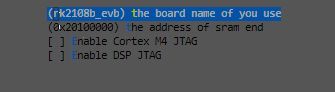

2）显示配置

使能显示功能：

```shell
Location:
    -> RT-Thread rockchip rk2108 drivers
```

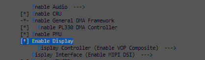

显示接口选择：

```shell
Location:
    -> RT-Thread rockchip rk2108 drivers
         -> Enable Display (RT_USING_DISPLAY [=y])
            -> Display Controller (<choice> [=y])
```

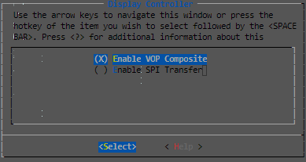

显示类型选择：

```shell
Location:
    -> RT-Thread rockchip rk2108 drivers
         -> Display Interface (<choice> [=y])
```

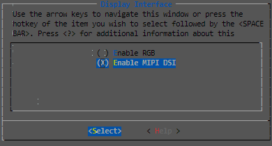

显示屏幕驱动选择：

```shell
Location:
    -> RT-Thread rockchip common drivers
        -> Panel Type (<choice> [=y])
```

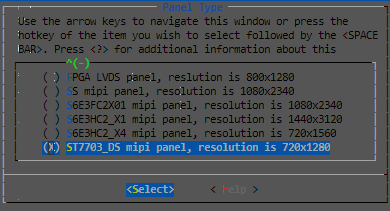

3）Touch配置（可选）

使能touch：

```shell
Location:
    -> RT-Thread Components
        -> Device Drivers
```


选择touch驱动：

```shell
Location:
    -> RT-Thread rockchip common drivers
```


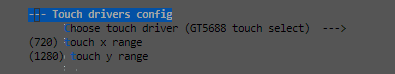

4）LittlevGL组件的配置

```shell
Location:
  -> RT-Thread Components
      -> System
         -> LittlevGL2RTT: The LittlevGl gui lib adapter RT-Thread (RT_USING_LITTLEVGL2RTT [=y])
            -> LittlevGL2RTT Component Options
```

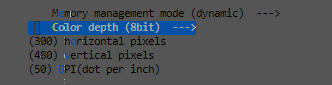

5）显示应用配置

```shell
Location:
    -> RT-Thread application
```


## RK_IoT_Display显示用例

rk_iot_display显示用例是在RK2108_EVB + CTC_2.8'(240x320) Pannel硬件环境下，针对iot应用场景，运行一个AI对讲显示界面。

### 代码路径

```shell
.
├── applications
    └── rk_iot_display
```

进入工程目录，执行menuconfig命令，开始进行该用例的编译配置：

```shell
usr@host:~/rt-thread$ cd bsp/rockchip/rk2108/
usr@host:~/rt-thread/bsp/rockchip/rk2108$ scons --menuconfig
```

1）Board配置

```shell
Location:
    -> RT-Thread board config
```

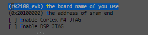

2）显示配置

使能显示功能：

```shell
Location:
    -> RT-Thread rockchip rk2108 drivers
```


显示接口选择：

```shell
Location:
    -> RT-Thread rockchip rk2108 drivers
         -> Enable Display (RT_USING_DISPLAY [=y])
            -> Display Controller (<choice> [=y])
```


显示类型选择：

```shell
Location:
    -> RT-Thread rockchip rk2108 drivers
         -> Display Interface (<choice> [=y])
```

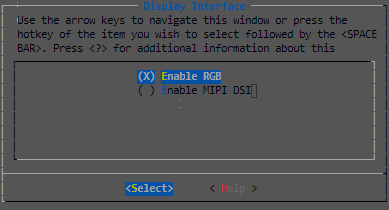

显示屏幕驱动选择：

```shell
Location:
    -> RT-Thread rockchip common drivers
        -> Panel Type (<choice> [=y])
```

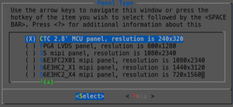

3）LittlevGL组件的配置

```shell
Location:
  -> RT-Thread Components
      -> System
         -> LittlevGL2RTT: The LittlevGl gui lib adapter RT-Thread (RT_USING_LITTLEVGL2RTT [=y])
            -> LittlevGL2RTT Component Options
```

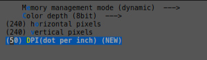

4）显示应用配置

```shell
Location:
    -> RT-Thread application
```

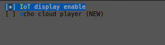

## 固件编译与下载

### 编译

配置完成之后，在工程目录下执行以下命令，完成编译与打包过程：

```shell
usr@host:~/rt-thread/bsp/rockchip/rk2108$ ./build.sh
```

编译完成之后，在工程目录下的image/目录下，生成需要下载的固件：

```shell
├── Image
    ├── Firmware.img
    └── rk2108_db_loader.bin
```

### 固件下载

1）Windows下固件下载

Windows下使用Rockchip AndroidTool_Release_vx.xx固件下载工具进行下载：
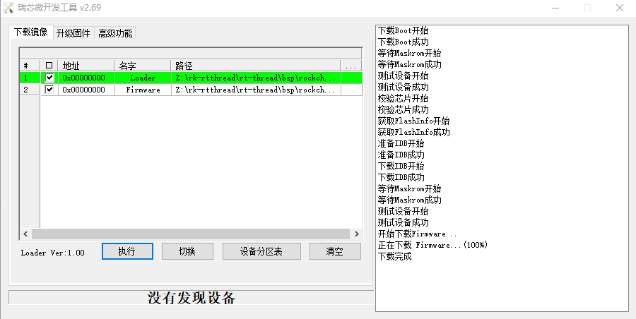

## 参考文档

1. [LittlevGL GUI 参考文献](https://littlevgl.com/)
