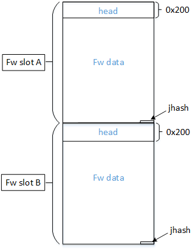
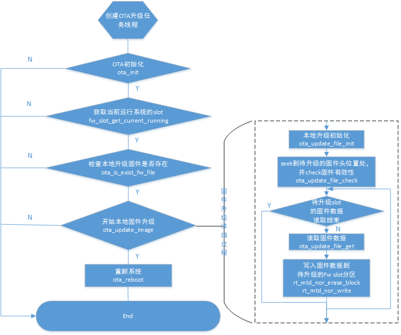
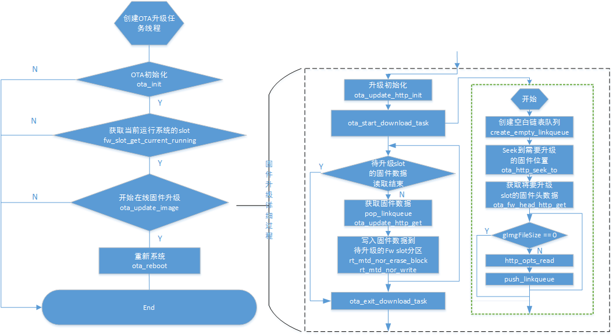

# Rockchip RT-Thread OTA升级开发指南

文件标识：RK-KF-YF-354

发布版本：V1.1.0

日期：2020-03-31

文件密级：□绝密   □秘密   □内部资料   ■公开

---

**免责声明**

本文档按“现状”提供，福州瑞芯微电子股份有限公司（“本公司”，下同）不对本文档的任何陈述、信息和内容的准确性、可靠性、完整性、适销性、特定目的性和非侵权性提供任何明示或暗示的声明或保证。本文档仅作为使用指导的参考。

由于产品版本升级或其他原因，本文档将可能在未经任何通知的情况下，不定期进行更新或修改。

**商标声明**

“Rockchip”、“瑞芯微”、“瑞芯”均为本公司的注册商标，归本公司所有。

本文档可能提及的其他所有注册商标或商标，由其各自拥有者所有。

**版权所有** **© 2020 **福州瑞芯微电子股份有限公司**

超越合理使用范畴，非经本公司书面许可，任何单位和个人不得擅自摘抄、复制本文档内容的部分或全部，并不得以任何形式传播。

福州瑞芯微电子股份有限公司

Fuzhou Rockchip Electronics Co., Ltd.

地址：     福建省福州市铜盘路软件园A区18号

网址：     [www.rock-chips.com](http://www.rock-chips.com)

客户服务电话： +86-4007-700-590

客户服务传真： +86-591-83951833

客户服务邮箱： [fae@rock-chips.com](mailto:fae@rock-chips.com)

---

## 前言

**概述**

本文介绍了基于rtthread系统，固件ota升级的开发流程与相关配置。

**产品版本**

| **芯片名称** | **内核版本** |
| ------------ | ------------ |
| RK2108    | RT-Thread 3.0.1 |

**读者对象**

本文档（本指南）主要适用于以下工程师：

技术支持工程师
软件开发工程师

**修订记录**

| **版本号** | **作者** | **修改日期** | **修改说明** |
| ---------- | --------| :--------- | ------------ |
| V1.0.0    | 马龙昌 | 2020-02-20 | 初始版本     |
| V1.0.1 | 陈谋春 | 2020-03-05 | 调整“接口说明”的样式 |
| V1.1.0 | 马龙昌 | 2020-03-31 | 更新2.2、2.3小节 |

## 目录

---

[TOC]

---

## OTA概述

OTA模块为系统提供设备端本地或在线升级固件的功能。此文档用以解释说明 OTA 模块相关概念和定义，介绍并指导开发者使用 SDK 中的 OTA 方案。OTA 模块的开发需要开发者了解固件分区结构，相关的内容可以参考文档《RK2206_Firmware_Structure_User_Guide.pdf》。

### OTA升级原理

RK2108 RT-Thread SDK 中的 OTA 采用A/B系统更新的方案，也称为无缝更新，类似Android系统的OTA升级。A/B升级确保可运行的启动系统在OTA更新期间能够保留在Flash上。这样就降低更新之后设备无法启动的可能性，也就是说，用户需要将设备送到维修/保修中心进行更换和刷机的情况将有所减少。

用户在 OTA 期间可以继续使用设备。即使 OTA 失败，设备也仍然可以使用，因为它会启动到 OTA 之前的固件分区。用户可以再次尝试下载 OTA。A/B系统方案的固件结构简单示意图如下所示：



两个 Firmware固件均有三部分构成，Firmware head头部结构信息、Firmware data固件数据、Firmware jhash该固件分区的jhash校验值。固件区域应该与Flash可擦除块对齐。Firmware Head大小为512字节，记录了Firmware的相关信息。该部分的详细说明见后面章节。Firmware data是可执行的程序与数据。Firmware jhash是对Firmware head与Firmware data做的哈希计算结果，大小为4个字节。

实际需要OTA升级时，会检测当前运行在哪个Fw slot，从当前运行的固件slot去升级另外一个固件slot。升级成功后，并校验通过，将激活已升级的Fw slot，系统软复位后尝试从已激活的升级过的Fw slot启动系统，若成功启动，标记该slot为成功启动；若启动失败，标记为不可启动状态，并尝试从另外一个Fw slot启动（回到升级前）系统。

系统首先从Fw slot A分区加载程序与数据，根据配置选择从本地或通过网络更新另外一个Fw slot的固件数据。

### 相关概念与定义

#### OTA protocol

OTA protocol 表示 OTA 升级时下载固件的协议。在 ota.h 中定义如下：

```c
typedef enum ota_protocol {
    OTA_PROTOCOL_FILE   = 0,
    OTA_PROTOCOL_HTTP   = 1,
} ota_protocol;
```

其中OTA_PROTOCOL_FILE 表示从文件升级，即本地升级，将制作好的升级包Firmware.img放在某一存储介质中（如SD卡，eMMc Flash等），调用升级接口写入固件分区进行本地升级。升级成功后，可删除升级包。

OTA_PROTOCOL_HTTP 表示通过http协议升级，即下载升级，通过http协议获取到Firmware.img的升级包数据然后写入固件分区升级。

#### OTA verify

OTA verify 表示对下载完固件的校验算法。为保证固件在 OTA 下载和升级 Flash 过程中不出错，采用 Jhash 算法对固件进行校验。

```c
typedef enum ota_verify {
    OTA_VERIFY_NONE     = 0,
    OTA_VERIFY_JHASH    = 1,
} ota_verify;
```

哈希校验的接口在 Fwupdate.c中定义如下：

```c
unsigned int jshash(unsigned int hash, char *str, unsigned int len)
```

#### Firmware header结构体

```c
typedef struct _FIRMWARE_HEADER
{
	unsigned char  magic[8]; //'RESC'
	unsigned char  chip[16];
	unsigned char  model[32];
	unsigned char  desc[16]; //description
	STRUCT_VERSION version;
	STRUCT_DATE release_date;
	unsigned int data_offset; //raw firmware offset
	unsigned int data_size;  //raw firmware size
	unsigned char  reserved1[4];
	unsigned char  digest_flag; //digest algorithm,default is 1(js_hash)
	unsigned char  reserved2[421];
}FIRMWARE_HEADER, *PFIRMWARE_HEADER;//head is 512 bytes
```

## 接口使用说明

### 代码位置

OTA相关代码请参考：

Path_to_SDK/components/ota/

```bash
.
├── Kconfig
├── link_queue.c
├── link_queue.h
├── ota.c
├── ota_file.c
├── ota_file.h
├── ota.h
├── ota_http.c
├── ota_http.h
├── ota_opt.h
├── rkdebug.h
└── SConscript
```

### 接口说明

下面简要说明 OTA 模块提供的接口。

- 初始化 OTA 模块的私有全局参数结构体指针。根据当前正在运行的系统固件信息初始化image分区的大小，当前正在运行的分区编号、以及需要升级的分区的起始地址。

```c
ota_status ota_init(void)
```

- 反初始化 OTA 模块。

```c
void ota_deinit(void)
```

- 通过指定协议下载固件。输入参数 protocol 为所选择的下载固件的协议。输入参数 url 为固件统一资源定位符。下载成功，返回 OTA_STATUS_OK；下载失败，返回 OTA_STATUS_ERROR。

```c
ota_status ota_update_image(ota_protocol protocol, void *url)
```

- 通过指定算法校验下载的固件，输入参数 verify 为指定的校验算法。校验成功返回OTA_STATUS_OK；校验失败返回 OTA_STATUS_ERROR。

```c
ota_status ota_verify_img(ota_verify verify)
```

- 重启系统。输入参数为升级的Fw slot 索引。

```c
void ota_reboot(int system_running)
```

- 系统分区A/B slot数据的校验。

```c
rt_bool_t fw_ab_data_verify(fw_ab_data *src, fw_ab_data *dest)
```

- 系统分区A/B slot 相关标志的数据初始化。

```c
void fw_ab_data_init(fw_ab_data *data)
```

- 系统分区A/B slot 相关数据的写入，将AB系统启动相关数据写入AB_DATA_PART_OFFSET指定的Flash区域。

```c
int fw_ab_data_write(const fw_ab_data *data)
```

- 判断系统分区A/B slot是否为可启动状态。

```c
rt_bool_t fw_slot_is_bootable(fw_ab_slot_data *slot)
```

- 读取系统分区A/B slot 相关数据。将AB系统启动相关数据从AB_DATA_PART_OFFSET指定的Flash区域读入到指定数据结构中。

```c
int fw_ab_data_read(fw_ab_data *data)
```

- 根据指定的系统分区Fw slot 索引设置Fw slot的标志为挂起态。

```c
int fw_slot_set_pending(uint32_t slot)
```

- 根据指定的系统分区Fw slot 索引设置Fw slot的标志为激活态。

```c
int fw_slot_set_active(uint32_t slot)
```

- 获取当前正在运行的系统分区是哪个slot。

```c
int fw_slot_get_current_running(uint32_t* cur_slot)
```

- 用户分区A/B slot 相关标志的数据初始化。

```c
void user_ab_data_init(user_ab_data *data)
```

- 用户分区A/B slot数据的校验。

```c
rt_bool_t user_ab_data_verify(user_ab_data *src, user_ab_data *dest)
```

- 用户分区数据的写入，将AB用户启动相关数据写入USER_AB_DATA_OFFSET指定的Flash区域。

```c
int user_ab_data_write(const user_ab_data *data)
```

- 判断用户分区A/B slot是否为可启动状态。

```c
rt_bool_t user_slot_is_bootable(user_ab_slot_data *slot)
```

- 读取用户分区A/B slot 相关数据。将AB系统使用的相关数据从USER_AB_DATA_OFFSET指定的Flash区域读入到指定数据结构中。

```c
int user_ab_data_read(user_ab_data *data)
```

- 根据指定的用户分区slot 索引设置该 slot分区的标志为挂起态。

```c
int user_slot_set_pending(uint32_t slot)
```

- 根据指定的用户分区 slot 索引设置该slot分区的标志为激活态。

```c
int user_slot_set_active(uint32_t slot)
```

### 使用示例

#### 本地升级

假设固件存放在eMMC Flash中，且挂载的路径为/sdcard，固件路径path为“/sdcard/Firmware.img”。

相关配置如下：

OTA相关配置：

```bash
-> RT-Thread Components
    [*] Enable Ota upgrade
    [*]   Enable ota upgrade from loacl file
    [ ]   Enable ota upgrade from http server
    [ ]   Enable support root A/B partition #若支持用户分区AB升级，打开该项配置
-*- Enable firmware analysis
```

本地升级流程如下图所示：



#### 在线升级

在线升级是指升级固件存放在远程某个http 服务器中，通过指定升级固件的URL下载来升级固件的方式。

OTA相关配置：

```bash
-> RT-Thread Components
    [*] Enable http
    [*] Enable Ota upgrade
    [ ]   Enable ota upgrade from loacl file
    [*]   Enable ota upgrade from http server
    [ ]   Enable support root A/B partition #若支持用户分区AB升级，打开该项配置
    (http://172.16.21.157/rk2108-Firmware.img) Url of firmware from http server
-*- Enable firmware analysis
```

在线升级的前提是需要设备连接上Wi-Fi。

`http://172.16.21.157/rk2108-Firmware.img` 此处配置的是服务器端升级包的URL地址。

在线升级流程如下图所示：



## 固件编译与生成

### 编译固件

如果使用OTA功能，需要使用更新后的编译脚本。

```shell
cd Path_to_SDK/bsp/rockchip/rk2108

./build.sh
```

若使用scons --menuconfig过程中遇到如下问题：

```bash
scons --menuconfig
scons: Reading SConscript files ...
ImportError: No module named configparser:
 File "/home/chris/data/home/chris/2108/release/bsp/rockchip/rk2108/SConstruct", line 11:
  from buildutil import *
 File "/home/2108/release/bsp/rockchip/rk2108/../tools/buildutil.py", line 2: import configparser
```

请执行一下命令，安装python-configparser包

```shell
sudo apt-get install python-configparser
```

执行成功后即生成可烧录与OTA升级的固件Firmware.img。