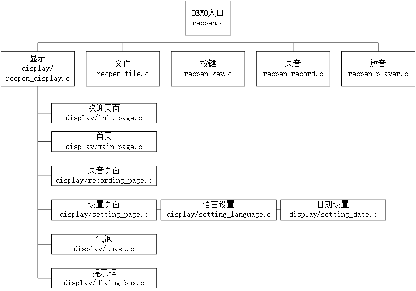

# Rockchip  Recording Pen DEMO开发指南

文件标识：RK-KF-YF-350

发布版本：V1.0.0

日期：2020-03-29

文件密级：□绝密   □秘密   □内部资料   ■公开

---

**免责声明**

本文档按“现状”提供，福州瑞芯微电子股份有限公司（“本公司”，下同）不对本文档的任何陈述、信息和内容的准确性、可靠性、完整性、适销性、特定目的性和非侵权性提供任何明示或暗示的声明或保证。本文档仅作为使用指导的参考。

由于产品版本升级或其他原因，本文档将可能在未经任何通知的情况下，不定期进行更新或修改。

**商标声明**

“Rockchip”、“瑞芯微”、“瑞芯”均为本公司的注册商标，归本公司所有。

本文档可能提及的其他所有注册商标或商标，由其各自拥有者所有。

**版权所有** **© 2020** **福州瑞芯微电子股份有限公司**

超越合理使用范畴，非经本公司书面许可，任何单位和个人不得擅自摘抄、复制本文档内容的部分或全部，并不得以任何形式传播。

福州瑞芯微电子股份有限公司

Fuzhou Rockchip Electronics Co., Ltd.

地址：     福建省福州市铜盘路软件园A区18号

网址：     [www.rock-chips.com](http://www.rock-chips.com)

客户服务电话： +86-4007-700-590

客户服务传真： +86-591-83951833

客户服务邮箱： [fae@rock-chips.com](mailto:fae@rock-chips.com)

## 前言

**概述**

本文档主要介绍RT-Thread Recording Pen DEMO的配置和开发方法。

**产品版本**

| **芯片名称** | **内核版本**    |
| :----------- | --------------- |
| RK2108       | RT-Thread 3.1.3 |
|              |                 |

**读者对象**

本文档（本指南）主要适用于以下工程师：

技术支持工程师
软件开发工程师

**修订记录**

| **版本号** | **作者** | **修改日期** | **修改说明** |
| ---------- | -------- | :----------- | ------------ |
| V1.0.0     | 吴佳健   | 2020-03-29   | 初始版本     |

## 目录

---

[TOC]

---

## 1 基于LITTLEVGL2RTT的录音笔DEMO示例

### 1.1 代码路径

基于LITTLEVGL2RTT的录音笔DEMO示例的代码路径为applications/recording_pen。

目录结构如下：

```bash
applications
└── recording_pen    存放DEMO入口函数，及文件管理、按键管理、录放音管理相关文件
     └── display     存放显示相关源文件
       └──resource   存放图片、字库文件
```

### 1.2 工程配置

进入menuconfig，进行如下配置。

#### 1.2.1 LITTLEVGL2RTT配置

开启RT_USING_LITTLEVGL2RTT，并参考如下配置：

```bash
> RT-Thread Components > System > LittlevGL2RTT: The LittlevGl gui lib adapter RT-Thread > LittlevGL2RTT Component Options
    Memory management mode (dynamic)  --->
    Color depth (16bit)  --->
(80) horizontal pixels
(160) vertical pixels
(50) DPI(dot per inch)
```

其中出现的数值请根据实际硬件情况进行设置。

#### 1.2.2 音频配置

开启RT_USING_AUDIO_SERVER。

编辑third_party/audio/audio_server/SConscript，参考如下修改：

```c
@@ -12,7 +12,7 @@ CPPPATH = [cwd]
 libs = []
 libpath = []
 if GetDepend(['AUDIO_USING_STATIC_LIBRARY']):
-    libs = ['libAudio_server_gcc']
+    libs = ['libAudio_server_gcc_cpu']
     libpath = [cwd + '/lib']
```

开启RT_USING_AUDIO_CARD，关闭RT_USING_VAD，并参考如下配置：

```bash
> RT-Thread rockchip rk2108 drivers > Enable Audio > Audio Cards
[*] Audio Cards
[ ]   Enable Internal ADC audio card
[ ]   Enable AUDIOPWM audio card
[ ]   Enable I2S Ditigal Mic audio card
[*]   Enable PDM Digital Mic audio card
[ ]   Enable Everest Semi ES7243 audio card
[*]   Enable Everest Semi ES8311 audio card
[ ]   Enable Everest Semi ES8388 audio card
[ ]   Enable mix audio card with Interal ADC + ES8311
[ ]   Enable mix audio card with PDM Mics + ES8388
```

或参考Rockchip_Developer_Guide_RT-Thread_Audio_CN.md进行配置。

#### 1.2.3 按键配置

开启RT_USING_KEYCTRL。

#### 1.2.4 屏幕配置

开启RT_USING_DISPLAY，并参考如下配置：

```bash
> RT-Thread rockchip rk2108 drivers
[*] Enable Display
      Display Controller (Enable SPI Transfer)  --->

> RT-Thread rockchip common drivers
    SPI Panel Type (KGM281G44PVAA SPI panel, resolution is 80x160)  --->
```

具体选项请根据实际硬件情况进行选择。

#### 1.2.5 DEMO配置

开启RT_USING_RECORDING_PEN_APP。

### 1.3 硬件配置

显示屏的配置，请参考Rockchip_Developer_Guide_RT-Thread_SPI_Screen_CN.md。

## 2 开发基础

### 2.1 DEMO整体框架



### 2.2 显示相关框架

显示处理函数为applications/recording_pen/display/recpen_display.c中的`display_task`函数，负责屏幕的初始化，lvgl的初始化，页面的显示、切换，转发刷新、按键事件等。

#### 2.2.1 页面

在applications/recording_pen/recpen.h中定义了如下页面：

```c
enum recpen_app_menu_page
{
    MENU_NONE_PAGE = -1,
    MENU_WELCOME_PAGE = 0,
    MENU_MAIN_PAGE,
    MENU_SETTING_PAGE,
    MENU_SETTING_DATE_PAGE,
    MENU_SETTING_LANGUAGE_PAGE,
    MENU_REC_PAGE,
    MENU_FILE_PAGE,
    MENU_MAX_PAGE,
};
```

界面相关函数都定义在独立的C文件中，以首页为例，其相关函数定义在applications/recording_pen/display/main_page.c中：

| 函数名                                             | 函数说明                           |
| -------------------------------------------------- | ---------------------------------- |
| void main_page_init(int p_page);                   | 初始化函数，用于创建窗体           |
| void main_page_deinit(void);                       | 反初始化函数，用于删除LVGL对象     |
| void main_page_refresh(size_t type, size_t value); | 刷新函数，用于刷新LVGL对象         |
| void main_page_key(size_t type, size_t value);     | 按键处理函数，用于触发按键对应事件 |

在applications/recording_pen/display/recpen_display.c中记录了各个页面的相关函数，其中为空即代表当前页面没有相关函数，如欢迎页面即对按键等事件不响应。

```c
struct lvgl_page_func page_func[MENU_MAX_PAGE] =
{
    {"MENU_WELCOME_PAGE", welcome_page_init, welcome_page_deinit, NULL, NULL},
    {"MENU_MAIN_PAGE", main_page_init, main_page_deinit, main_page_refresh, main_page_key},
    {"MENU_SETTING_PAGE", setting_page_init, setting_page_deinit, NULL, setting_page_key},
    {"MENU_SETTING_DATE_PAGE", setting_date_init, setting_date_deinit, NULL, setting_date_key},
    {"MENU_SETTING_LANGUAGE_PAGE", setting_language_init, setting_language_deinit, NULL, setting_language_key},
    {"MENU_REC_PAGE", recording_page_init, recording_page_deinit, NULL, recording_page_key},
    ...
};
```

#### 2.2.2 气泡

气泡相关函数定义在applications/recording_pen/display/toast.c中：

| 函数名                                      | 函数说明                                            |
| ------------------------------------------- | --------------------------------------------------- |
| void toast_create(char *text, uint32_t ms); | 由页面调用，创建或更新Toast文本，ms指定显示时长     |
| void toast_reflash(void);                   | 由display_task调用，用于刷新Toast，判断是否需要删除 |
| void toast_destory(void);                   | 用于删除Toast对象，一般不主动调用                   |

#### 2.2.3 提示框

提示框相关函数定义在applications/recording_pen/display/dialog_box.c中：

| 函数名                                         | 函数说明                         |
| ---------------------------------------------- | -------------------------------- |
| void dialog_box_init(char *str);               | 由页面调用，创建一个提示框       |
| void dialog_box_deinit(void);                  | 由提示框自己调用，删除提示框     |
| int dialog_box_key(size_t type, size_t value); | 由页面调用，传递按键信息给提示框 |

dialog_box_key返回值如下：

| 宏                 | 值   | 说明                             |
| ------------------ | ---- | -------------------------------- |
| DIALOG_BOX_NONE    | 0    | 当前没有提示框                   |
| DIALOG_BOX_SELECT  | 1    | 键值为方向键，提示框的值发生改变 |
| DIALOG_BOX_CONFIRM | 2    | 确认                             |
| DIALOG_BOX_CANCEL  | 3    | 取消                             |

以设置中的格式化提示为例，详见applications/recording_pen/display/setting_page.c：

```c
创建一个格式化提示框
37 static void format_disk(void)
38 {
39     if (g_app_info.language == RECPEN_APP_LANG_CN)
40         dialog_box_init("格式化");
41     else
42         dialog_box_init("Format");
43     wait_dialog = 1;
44 }

有新的按键传入需要先调dialog_box_key确认当前是否有提示框存在
107 void setting_page_key(size_t type, size_t value)
108 {
109     int ret;
110
111     ret = dialog_box_key(type, value);
112     if (ret)
113         goto DIALOG_EXIT;
114 ...

最后根据提示框返回的值进行处理
153 DIALOG_EXIT:
154     if (ret == DIALOG_BOX_CONFIRM)
155     {
156         if (wait_dialog == 1)
157         {
158             dfs_mkfs("elm", "root");
159             mkdir(RECORD_DIR_PATH, 0);
160             memset(&g_app_info.file, 0x0, sizeof(struct recpen_file_info));
161             sprintf(g_app_info.file.cur_file_name, "No recording file");
162         }
163         ...
168     }
```

### 2.3 文件管理

文件管理相关函数定义在applications/recording_pen/recpen_file.c中：

| 函数名                                                       | 函数说明                 |
| ------------------------------------------------------------ | ------------------------ |
| void get_app_info(void);                                     | 获取系统设置信息         |
| void save_app_info(void);                                    | 保存系统设置信息         |
| uint32_t scan_audio(const char *path);                       | 扫描目标文件夹的音频数量 |
| uint32_t get_audio(const char *path, char *file_name, uint32_t index); | 获取指定序号的文件名     |
| uint32_t remove_file(const char *path, char *file_name);     | 删除文件并返回剩余文件数 |
| rt_err_t recpen_increase_file();                             | 文件数加一               |
| rt_err_t recpen_decrease_file();                             | 删除文件，文件数减一     |
| rt_err_t recpen_next_file();                                 | 查找下一文件             |
| rt_err_t recpen_prev_file();                                 | 查找上一文件             |

### 2.4 按键处理

按键相关函数定义在applications/recording_pen/recpen_key.c中。

在`recpen_key_task`中通过key device获取键值，或直接读取GPIO获取键值，然后发送至`display_task`，由`display_task`转发至当前页面的按键处理函数。不同板型按键不同，需根据具体板型修改。目前使用的键值如下：

| 键值（press/long press） | 按键       |
| ------------------------ | ---------- |
| 0x01/0x08                | KEY_RECORD |
| 0x02/0x09                | KEY_UP     |
| 0x05/0x0C                | KEY_MENU   |
| 0x06/0x0D                | KEY_PLAY   |
| 0x07/0x0E                | KEY_DOWN   |

不同页面按键对应的功能不同，详见下表：

| 按键                  | 首页                       | 录音页面 | 设置页面 | 提示框   |
| --------------------- | -------------------------- | -------- | -------- | -------- |
| KEY_RECORD            | 进入录音页面开始录音       | 停止录音 | 无       | 无       |
| KEY_UP                | 上一个文件                 | 无       | 上一选项 | 上一选项 |
| KEY_MENU              | 进入设置页面/取消删除文件  | 无       | 退出     | 取消     |
| KEY_PLAY              | 开始/暂停播放/确认删除文件 | 无       | 确认     | 确认     |
| KEY_PLAY LONG PRESS   | 删除文件                   | 无       | 无       | 无       |
| KEY_DOWN              | 下一个文件                 | 无       | 下一选项 | 下一选项 |

### 2.5 录音

录音相关函数定义在applications/recording_pen/recpen_record.c中：

| 函数名                                         | 函数说明                                                     |
| ---------------------------------------------- | ------------------------------------------------------------ |
| int recpen_recorder_init(void);                | 录音器初始化，在DEMO启动时被调用                             |
| void recpen_recorder_prepare(char *file_path); | 开始录音，录音文件保存在RECORD_DIR_PATH目录下。file_path并非由外部指定，而是由recpen_recorder_prepare依据时间戳生成后导出 |
| void recpen_recorder_stop(void);               | 停止录音，录音结束后会产生回调，调用recpen_callback          |
| void recpen_recorder_deinit(void);             | 录音器反初始化                                               |

录音声卡默认使用`pdmc`，可修改`RECORD_CARD_NAME`进行配置，文件格式默认为`wav`，可修改`ENCODE_TYPE`进行配置。

### 2.6 播放

播放相关函数定义在applications/recording_pen/recpen_player.c中：

| 函数名                                       | 函数说明                                                 |
| -------------------------------------------- | -------------------------------------------------------- |
| int recpen_player_init(void);                | 播放器初始化，在DEMO启动时被调用                         |
| void recpen_player_prepare(char *file_path); | 开始播放file_path指定的文件                              |
| void recpen_player_stop(void);               | 停止播放，播放结束后会产生回调，调用recpen_play_callback |
| void recpen_player_deinit(void);             | 播放器反初始化                                           |

播放声卡默认使用`es8388p`，可修改`PLAYBACK_CARD_NAME`进行配置。
