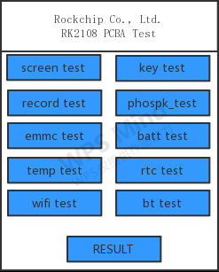
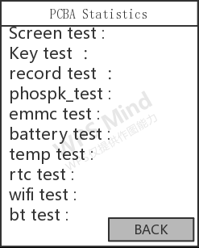

# Rockchip PCBA测试开始指南

文件标识：RK-KF-YF-370

发布版本：V1.0.0

日期：2020-06-18

文件密级：□绝密   □秘密   □内部资料   ■公开

**免责声明**

本文档按“现状”提供，瑞芯微电子股份有限公司（“本公司”，下同）不对本文档的任何陈述、信息和内容的准确性、可靠性、完整性、适销性、特定目的性和非侵权性提供任何明示或暗示的声明或保证。本文档仅作为使用指导的参考。

由于产品版本升级或其他原因，本文档将可能在未经任何通知的情况下，不定期进行更新或修改。

**商标声明**

“Rockchip”、“瑞芯微”、“瑞芯”均为本公司的注册商标，归本公司所有。

本文档可能提及的其他所有注册商标或商标，由其各自拥有者所有。

**版权所有 © 2020 瑞芯微电子股份有限公司**

超越合理使用范畴，非经本公司书面许可，任何单位和个人不得擅自摘抄、复制本文档内容的部分或全部，并不得以任何形式传播。

瑞芯微电子股份有限公司

Rockchip Electronics Co., Ltd.

地址：     福建省福州市铜盘路软件园A区18号

网址：     [www.rock-chips.com](http://www.rock-chips.com)

客户服务电话： +86-4007-700-590

客户服务传真： +86-591-83951833

客户服务邮箱： [fae@rock-chips.com](mailto:fae@rock-chips.com)

---

**前言**

**概述**

本文档主要介绍RT-Thread Recording Pen PCBA测试的配置和测试方法。

**产品版本**

| **芯片名称** | **内核版本** |
| ------------ | ------------ |
| RK2108    | RT-Thread 3.1.3 |

**读者对象**

本文档（本指南）主要适用于以下工程师：

技术支持工程师

软件开发工程师

**修订记录**

| **版本号** | **作者** | **修改日期** | **修改说明** |
| ---------- | --------| :--------- | ------------ |
| V1.0.0    | 马龙昌 | 2020-06-18 | 初始版本     |

---

**目录**

[TOC]

---

## 基于LITTLEVGL2RTT的录音笔PCBA测试

### 代码路径

基于LITTLEVGL2RTT的录音笔 PCBA 测试示例的代码路径为applications/pcba_test。

目录结构如下：

```bash
pcba_test/
├── battery_test_page.c			电池测试页面
├── battery_test_page.h
├── bt_test_page.c				蓝牙测试页面
├── bt_test_page.h
├── emmc_test_page.c			eMMC存储测试页面
├── emmc_test_page.h
├── Kconfig
├── key_test_page.c				按键功能测试页面
├── key_test_page.h
├── main_page.c					主测试项页面
├── main_page.h
├── pcba_app.c					PCBA主程序
├── pcba_app.h
├── pcba_def.h
├── pcba_disp.c					PCBA显示任务处理
├── pcba_disp.h
├── pcba_key.c					按键功能
├── pcba_key.h
├── pcba_player.c				播放API接口
├── pcba_player.h
├── pcba_public.c				PCBA公用接口
├── pcba_public.h
├── pcba_record.c				录音API接口
├── pcba_record.h
├── phospk_test_page.c			耳机/扬声器测试页面
├── phospk_test_page.h
├── record_test_page.c			录音测试页面
├── record_test_page.h
├── resource
├── result_page.c				测试结果显示界面
├── result_page.h
├── rtc_test_page.c				RTC测试界面
├── rtc_test_page.h
├── SConscript
├── screen_test_page.c			LCD显示屏测试界面
├── screen_test_page.h
├── temperate_test_page.c		电池温度测试界面
├── temperate_test_page.h
├── wifi_test_page.c			WIFI测试界面
└── wifi_test_page.h
```

### 工程配置

使用board/recording_pen_v10/recording_pen_pcba_defconfig作为 PCBA 测试的默认配置。

在 Path_to_SDK/bsp/rockchip/rk2108 下执行：

```bash
cp ./board/recording_pen_v10/recording_pen_pcba_defconfig .config
```

进入 menuconfig 可看到 PCBA 测试相关的具体配置。

#### LITTLEVGL2RTT配置

开启RT_USING_LITTLEVGL2RTT，并参考如下配置：

```bash
> RT-Thread Components > System > LittlevGL2RTT: The LittlevGl release v6.1.2 gui lib adapter RT-Thread > LittlevGL2RTT Component Options
    Memory management mode (dynamic)  --->
    Color depth (16bit)  --->
(176) horizontal pixels
(220) vertical pixels
(50) DPI(dot per inch)
```

其中出现的数值请根据实际硬件情况进行设置。

#### 音频配置

开启RT_USING_AUDIO_CARD，关闭RT_USING_VAD，并参考如下配置：

```bash
> RT-Thread rockchip rk2108 drivers > Enable Audio > Audio Cards
[*] Audio Cards
[*]   Enable Internal ADC audio card
		iface type (I2STDM1)  --->
[*]   Enable AUDIOPWM audio card
[ ]   Enable I2S Ditigal Mic audio card
[*]   Enable PDM Digital Mic audio card
[ ]   Enable Everest Semi ES7243 audio card
[ ]   Enable Everest Semi ES8311 audio card
[ ]   Enable Everest Semi ES8388 audio card
[ ]   Enable mix audio card with Interal ADC + ES8311
[ ]   Enable mix audio card with PDM Mics + ES8388
```

或参考Rockchip_Developer_Guide_RT-Thread_Audio_CN.md进行配置。

#### 按键配置

开启RT_USING_KEYCTRL。

#### 屏幕配置

开启RT_USING_DISPLAY，并参考如下配置：

```bash
> RT-Thread rockchip rk2108 drivers
[*] Enable Display
      Display Controller (Enable SPI Transfer)  --->

> RT-Thread rockchip common drivers
      SPI Panel Type (H20B1301A SPI panel, resolution is 176x220)  --->
```

panel 根据具体硬件设置配置。

#### WIFI 、BT配置

开启cypress 模块的WIFI、 BT配置：

```
> RT-Thread third party packag
	--- support cyress modules
	[*]   enable cyress wifi
	[ ]     Enable cypress wifi for sdio interface
	[*]     Enable cypress wifi for spi interface
	[*]   Enable cypress bt
	[ ]     Internal development mode
	[ ]     trace build information
	(audpwmp) play device
	(pdmc)  recorder device
	(/dev/uart0) setup uart name for HCI Bluetooth
	[ ]     enable Bluetooth Factory test command
	[*]     choose one desired DEMO  --->
```

#### PCBA 应用配置

```bash
> RT-Thread application  --->
   	 	Display demo select (pcba test enable)  --->	#选择 PCBA test demo
    (pdmc) Recording sound card							#设置录音声卡
    (audpwmp) Playback sound card						#设置播放声卡
    (/sdcard/pcba_test) Recording file path				#设置 PCBA 测试录音文件的保存路径
    (wav) Recordind file type							#设置支持的录音文件格式
    [ ] rk iot app
    [ ] Enable dual-tracking
```

## PCBA 测试

### 整体框架

- 测试入口

  applications/pcba_test/pcba_app.c 中`pcba_app`接口为 PCBA 测试的入口。

- 显示框架

  显示处理函数为applications/pcba_test/pcba_display.c中的`display_task`函数，负责屏幕的初始化，lvgl的初始化，页面的显示、切换，转发刷新、按键事件等。

- 测试主页

  在applications/pcba_test/main_page.h中定义了以下测试项：

  ```c
  enum pcba_test_items
  {
      ITEM_SCREEN,
      ITEM_KEY,
      ITEM_RECORD,
      ITEM_PHO_SPK,   //phone & speaker
      ITEM_EMMC,
      ITEM_BATTERY,
      ITEM_TEMP,
      ITEM_RTC,
      ITEM_WIFI,
      ITEM_BT,
      ITEM_RESULT,
      ITEM_MAX,
  };
  ```

  applications/pcba_test/main_page.c中：

  | 函数名                                              | 函数说明                           |
  | --------------------------------------------------- | ---------------------------------- |
  | void index_page_init(int p_page);                   | 初始化函数，用于创建窗体           |
  | void index_page_deinit(void);                       | 反初始化函数，用于删除LVGL对象     |
  | void index_page_refresh(size_t type, size_t value); | 刷新函数，用于刷新LVGL对象         |
  | void index_page_key(size_t type, size_t value);     | 按键处理函数，用于触发按键对应事件 |

  主页测试界面示意图：

  

  使用按键 FUN_2，FUN_3 控制上下，选择某一具体测试项，按键 FUN_1 按键确认，进入某一具体测试项测试。

- 测试项

  各测试项界面示意图：

  

  其中，“XXXX”表示某一具体测试项。按键 FUN_2 按下表示测试成功，测试结束，返回测试主页面。按键 FUN_3 按下表示测试失败，测试结束，返回测试主页面。

- 测试结果

  测试项测试结果汇总界面示意图：

  

### 测试项说明

#### 测试项接口

在`applications/pcba_test/pcba_display.c`中记录了各个页面的相关函数，其中为空即代表当前页面没有相关函数。

```c
struct lvgl_page_func pcba_page_func[MENU_MAX_PAGE] =
{
    {"MENU_NO_PAGE",            NULL, NULL, NULL, NULL},
    {"MENU_MAIN_PAGE",          index_page_init, index_page_deinit, index_page_refresh, index_page_key},
    {"MENU_SCREEN_TEST_PAGE",   screen_page_init, screen_page_deinit, screen_page_refresh, screen_page_key},
    {"MENU_KEY_TEST_PAGE",      key_page_init, key_page_deinit, key_page_refresh, key_page_key},
    {"MENU_RECORD_TEST_PAGE",   record_page_init, record_page_deinit, record_page_refresh, record_page_key},
    {"MENU_PHONE_SPEAK_TEST_PAGE", phospk_page_init, phospk_page_deinit , phospk_page_refresh, phospk_page_key},
    {"MENU_EMMC_TEST_PAGE",     emmc_page_init, emmc_page_deinit , emmc_page_refresh, emmc_page_key},
    {"MENU_BATTERY_TEST_PAGE",  batt_page_init, batt_page_deinit , batt_page_refresh, batt_page_key},
    {"MENU_TEMPERATE_TEST_PAGE",temp_page_init, temp_page_deinit , temp_page_refresh, temp_page_key},
    {"MENU_RTC_TEST_PAGE",      rtc_page_init, rtc_page_deinit , rtc_page_refresh, rtc_page_key},
    {"MENU_WIFI_TEST_PAGE",     wifi_page_init, wifi_page_deinit , wifi_page_refresh, wifi_page_key},
    {"MENU_BT_TEST_PAGE",       bt_page_init, bt_page_deinit , bt_page_refresh, bt_page_key},
    {"MENU_RESULT_PAGE",        result_page_init, result_page_deinit , result_page_refresh, result_page_key},
    {NULL,  NULL, NULL, NULL}
};
```

#### 显示屏测试

进入显示屏测试页面后，循环刷新屏的窗体背景色为红、绿、蓝、黑、白、黄，观察是否正常显示，无异常噪点、黑点。

#### 按键测试

进入按键测试页面后，窗体中根据硬件设置按键个数，显示6个按键按钮，按下对应功能按键后，窗体中对应按键按钮显示绿色背景。测试成功后按下 FUN_2 按键，结束测试，表示测试成功；按下 FUN_3 按键，结束测试，表示测试失败。

#### 录音测试

进入录音测试页面，按下 FUN_1 按键开始录音，录音文件保存在/sdcard/pcba_test/目录下。测试成功后按下 FUN_2 按键，结束测试，表示测试成功；按下 FUN_3 按键，结束测试，表示测试失败。

#### 放音测试

进入放音测试页面，按下播放按键 FUN_5 开始播放/sdcard/pcba_test/中保存的录音文件。测试成功后按下 FUN_2 按键，结束测试，表示测试成功；按下 FUN_3 按键，结束测试，表示测试失败。

#### eMMC测试

进入eMMC测试页面，将自动计算并显示出当前 eMMC Flash 的总容量。测试成功后按下 FUN_2 按键，结束测试，表示测试成功；按下 FUN_3 按键，结束测试，表示测试失败。

#### 电池测试

进入电池测试页面，将显示出当前设备电池充电状态（百分比）、电池总容量、当前充电电流、电池电压。测试成功后按下 FUN_2 按键，结束测试，表示测试成功；按下 FUN_3 按键，结束测试，表示测试失败。

#### 电池温度测试

进入电池温度测试页面，将显示出当前设备电池温度。电池温度需要根据电池规格书，提供电池的NTC table。测试成功后按下 FUN_2 按键，结束测试，表示测试成功；按下 FUN_3 按键，结束测试，表示测试失败。

电池NTC Table请参考Rockchip_Developer_Guide_RT-Thread_RK816_CN.md。

#### RTC 测试

进入 RTC 测试页面，将显示出当前设备中RTC的时间与日期。测试成功后按下 FUN_2 按键，结束测试，表示测试成功；按下 FUN_3 按键，结束测试，表示测试失败。

#### WIFI 测试

进入 WIFI 测试页面，将启动 WIFI，自动扫描并显示扫描到的SSID，目前最大显示6个SSID。测试成功后按下 FUN_2 按键，结束测试，表示测试成功；按下 FUN_3 按键，结束测试，表示测试失败。

#### BT 测试

进入 BT 测试页面，将启动 BT ，扫描设备周边设备，实时显示扫描到的设备个数。测试成功后按下 FUN_2 按键，结束测试，表示测试成功；按下 FUN_3 按键，结束测试，表示测试失败。

#### 测试结果

进入测试结果页面，显示所有测试项的测试结果。按下 FUN_1 按键，返回主测试页面。

