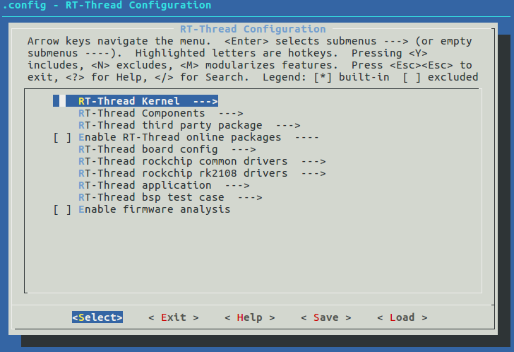
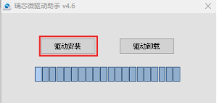
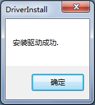
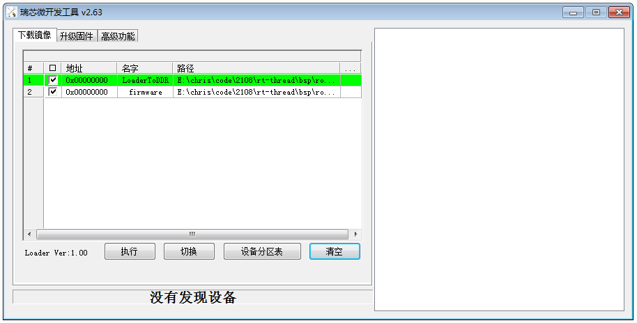
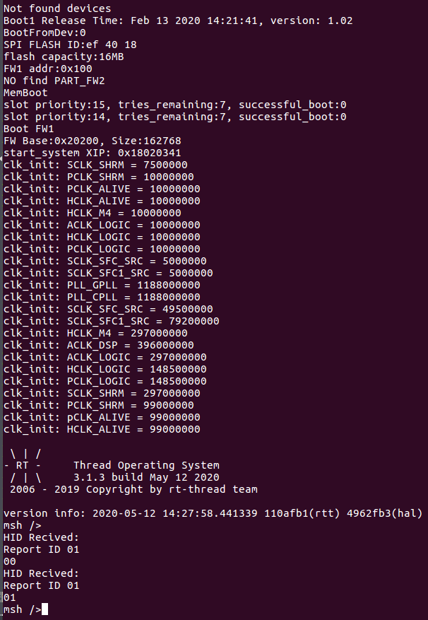

# Rockchip RK2108 RT-Thread 快速入门

文档标识：RK-JC-YF-362

发布版本：V1.2.0

日期：2020-06-11

文件密级：□绝密   □秘密   □内部资料   ■公开

**免责声明**

本文档按“现状”提供，瑞芯微电子股份有限公司（“本公司”，下同）不对本文档的任何陈述、信息和内容的准确性、可靠性、完整性、适销性、特定目的性和非侵权性提供任何明示或暗示的声明或保证。本文档仅作为使用指导的参考。

由于产品版本升级或其他原因，本文档将可能在未经任何通知的情况下，不定期进行更新或修改。

**商标声明**

“Rockchip”、“瑞芯微”、“瑞芯”均为本公司的注册商标，归本公司所有。

本文档可能提及的其他所有注册商标或商标，由其各自拥有者所有。

**版权所有 © 2020 瑞芯微电子股份有限公司**

超越合理使用范畴，非经本公司书面许可，任何单位和个人不得擅自摘抄、复制本文档内容的部分或全部，并不得以任何形式传播。

瑞芯微电子股份有限公司

Rockchip Electronics Co., Ltd.

地址：     福建省福州市铜盘路软件园A区18号

网址：     www.rock-chips.com

客户服务电话： +86-4007-700-590

客户服务传真： +86-591-83951833

客户服务邮箱： fae@rock-chips.com

---

## 前言

**概述**

本文主要描述了 RK2108 的基本使用方法，旨在帮助开发者快速了解并使用 RK2108 SDK 开发包。

注：可通过 RKDocs/RK2108_RT-Thread_Release_Note.txt 查看当前 SDK 的版本。

**各芯片系统支持状态**

| **芯片名称** | **内核版本**     |
| ------------ | :--------------- |
| RK2108       | RT-Thread v3.1.x |

**读者对象**

本文档（本指南）主要适用于以下工程师：

技术支持工程师

软件开发工程师

**修订记录**

| **日期**   | **版本** | **作者**    | **修改说明** |
| ---------- | -------- | ----------- | ------------ |
| 2019-02-20 | V1.0.0   | Cliff Chen  | 初始版本     |
| 2020-05-14 | V1.1.0   | Chris Zhong | 删除冗余章节 |
| 2020-06-11 | V1.2.0   | Ruby Zhang  | 更新公司名称 |

---

**目录**

[TOC]

---

## 1 开发环境搭建

### 1.1 开发环境选择

本 SDK 推荐的编译环境是64位的 Ubuntu16.04 或 Ubuntu18.04。

### 1.2 编译工具链选择

编译工具选用的是 RT-Thread 官方推荐的 SCons + GCC，SCons 是一套由 Python 语言编写的开源构建系统， GCC 交叉编译器由 ARM 官方提供，可直接使用以下命令安装所需的所有工具：

```shell
sudo add-apt-repository ppa:team-gcc-arm-embedded/ppa
sudo apt-get update
sudo apt-get install gcc-arm-embedded scons clang-format astyle libncurses5-dev build-essential python-configparser
```

 如无法安装 toolchain，还可从 ARM 官网下载编译器，通过环境变量指定 toolchain 的路径即可，具体如下：

```shell
wget https://developer.arm.com/-/media/Files/downloads/gnu-rm/7-2018q2/gcc-arm-none-eabi-7-2018-q2-update-linux.tar.bz2
tar xvf gcc-arm-none-eabi-7-2018-q2-update-linux.tar.bz2
export RTT_EXEC_PATH=/path/to/toolchain/gcc-arm-none-eabi-7-2018-q2-update/bin
```

## 2 目录结构

以下是SDK主要目录对应的说明：

```shell
├── applications           # Rockchip应用demo源码
├── AUTHORS
├── bsp                    # 所有芯片相关代码
│   ├── rockchip
│   │   ├── common
│   │   │   ├── drivers    # Rockchip OS适配层通用驱动
│   │   │   ├── hal        # Rockchip HAL(硬件抽象层)实现
│   │   │   └── tests      # Rockchip 驱动测试代码
│   │   ├── rk2108         # RK2108 主目录
│   │   │   ├── board      # 板级配置
│   │   │   ├── build      # 编译主目录，存放中间文件
│   │   │   ├── build.sh   # RK2108 编译脚本
│   │   │   ├── drivers    # RK2108 私有驱动目录
│   │   │   ├── dsp_fw     # 存放 dsp 固件
│   │   │   ├── Image      # 存放固件
│   │   │   ├── tests      # RK2108 私有测试代码
│   │   │   ├── start      # 启动相关代码
│   │   └── tools          # Rockchip 通用工具
├── ChangeLog.md
├── components             # 系统各个组件，包括文件系统，shell和框架层等驱动
│   ├── hifi3
│   │   └── rkdsp          # DSP工程目录，使用方法请参考文档《Rockchip_Developer_Guide_RTOS_DSP_CN.pdf》
├── documentation          # RT-Thread官方文档
├── examples               # RT-Thread例子程序和测试代码
├── include                # RT-Thread官方头文件目录
├── Kconfig
├── libcpu
├── LICENSE
├── README.md
├── README_zh.md
├── RKDocs                # Rockchip 文档
├── src                   # RT-Thread内核源码
├── third_party           # Rockchip增加的第三方代码的目录
└── tools                 # RT-Thread官方工具目录，包括menuconfig和编译脚本
```

## 3 工程编译配置

   RT-Thread 用 SCons 来实现编译控制，SCons 是一套由 Python 语言编写的开源构建系统，类似于 GNU Make。它采用不同于通常 Makefile 文件的方式，而使用 SConstruct 和 SConscript 文件来替代。这些文件也是 Python 脚本，能够使用标准的 Python 语法来编写，所以在 SConstruct、SConscript 文件中可以调用 Python 标准库进行各类复杂的处理。

### 3.1 工程配置

   进入到对应的工程目录，如 bsp/rockchip/rk2108 目录下，并运行工程配置工具 menuconfig。

```shell
cd bsp/rockchip/rk2108
cp board/rk2108_evb/defconfig .config   #(位于各个board目录下的defconfig文件是默认配置)
scons --menuconfig
```

   会弹出如下界面，这个过程会从 .config 载入当前的默认配置，退出保存配置时会覆盖 .config，同时自动生成一个 rtconfig.h 文件，这2个文件包含了我们选中的各种配置，最终参与编译的只有这个 rtconfig.h。



menuconfig 工具的常见操作如下：

- 上下箭头：移动

- 回车：进入子菜单

- ESC 键：返回上级菜单或退出

- 英文问号：调出帮助菜单（退出帮助菜单，请按回车键）。

- 空格、Y 键``或``N 键：使能/禁用 [*] 配置选项

- / 键：寻找配置项目

  每个板级目录下都有一个默认的配置文件 defconfig，里面包含了这个板子的常规配置，可以基于这个配置去修改。

### 3.2 保存配置

在每一个板级配置目录下都有一个默认配置 defconfig，如果没有执行 scons menuconfig，会用默认的 rtconfig.h 参与编译。要修改板子的 defconfig，可以先用它的 defconfig 文件覆盖 .config，通过 menuconfig 修改后再使用新的 .config 更新 defconfig 文件，下面是具体例子：

```shell
cp board/xxx/defconfig .config             ; 拷贝要修改的板子的默认配置
scons menuconfig                           ; 修改配置项
cp .config board/xxx/defconfig             ; 保存配置为板子的默认配置
```

## 4 工程编译

### 4.1 编译命令

   编译命令如下：

```shell
cd bsp/rockchip/rk2108
./build.sh     # 调用soncs完成编译和打包
```

   以上命令将使用当前目录的 rtconfig.h 作为编译配置，最后会在当前目录下生成如下文件：

```shell
ls -l rtthread*
-rwxrwxr-x 1 cmc cmc 599616 Feb 15 19:45 rtthread.elf    #elf可执行文件，可用于jtag调试
-rw-rw-r-- 1 cmc cmc 489470 Feb 15 19:45 rtthread.map    #符号表
-rwxrwxr-x 1 cmc cmc  56760 Feb 15 19:45 rtthread.bin    #RT-Thread系统固件
```

   以及在Image目录下生成文件：

```shell
Firmware.img
```

   其中 Firmware.img 是我们下载到机器上的二进制固件，它由 Loader（rk2108_loader.bin）和 RT-Thread 系统固件（rtthread.bin）打包而成。

   SCons 构建系统默认是通过 MD5 来判断文件是否需要重新编译，如果代码文件内容没变，而只是时间戳变了（例如通过 touch 更新时间戳），是不会重新编译这个文件及其依赖的。另外，如果仅修改无关内容，例如代码注释，则只会编译，而不会链接，因为 obj 文件内容未发生变化。因此，在开发过程中如果碰到各种修改后实际并未生效的问题，建议在编译前做一次清理，命令如下：

```shell
scons -c
```

   如果做完上面的清理以后，还有异常，可以强制删除所有中间文件，命令如下：

```shell
rm -rf build
```

   其他 SCons 命令，可以看帮助或文档

```shell
scons -h
```

### 4.2 固件打包

   固件打包是为了把系统需要的各种固件打包在一起，如分区表、loader、OS和根文件系统，RK2108 的固件打包脚本是：bsp/rockchip/rk2108/mkimage.sh 。目前的编译脚本在编译完成后会自动触发固件打包，因此只需执行一次 ./build.sh 命令即可完成编译和打包。

## 5 固件烧录

   在烧录固件前，需要让板子进入到升级模式，RK2108 支持两种升级模式：Loader 模式和 MaskRom 模式。下面是进入到2种模式的方法：

1. 在 USB 口连着电脑的前提下，按住 RECOVERY 键不松开，短按 RESET 键，让板子进入到 Loader 模式后松开 RECOVERY 键；
2. 在 USB 口连着电脑的前提下，按住 MASROM 键不松开，短按 RESET 键，让板子进入到 MaskRom 模式后松开 MASROM 键。未烧录过的固件的设备，上电后会自动进入到 MaskRom 模式。

### 5.1 Windows USB驱动安装

开发调试阶段，需要将设备切换至 Loader 模式或是 MaskRom 模式，并且正确安装 Rockusb 驱动才能正常识别设备。

 Rockchip USB 驱动安装助手存放在 bsp/rockchip/tools/Rockchip_Develop_Tool_v2.63.zip 压缩包的DriverAssitant_v4.91 文件夹里，支持 xp, win7_32, win7_64, win8_32, win8_64 操作系统。

安装步骤如下：

1. 打开并执行 Rockusb 驱动软件，界面如下：

   

2. 点击“驱动安装”直到驱动安装成功。

3. 安装成功：

   

 注意：在安装驱动的时候，部分 windows 系统的版本，需要绕过数字签名，重启电脑按F8，选择**强制禁用驱动程序签名强制**，再安装驱动。

### 5.2 Windows版升级工具

   打开 bsp/rockchip/tools 目录下的 Rockchip_Develop_Tool_v2.63，如首次使用此工具，需要安装它目录下的驱动：DriverAssitant_v4.91。打开升级工具：



第1项“LoaderToDDR”选择 bsp/rockchip/rk2108/Image/rk2108_db_loader.bin。

第2项“Firmware”选择 bsp/rockchip/rk2108/Image/Firmware.img。

### 5.3 Linux版烧录工具及命令

   Linux 系统下可以使用如下脚本完成固件烧录：

```shell
bsp/rockchip/rk2108/update_fimeware.sh
```

它实际是调用以下命令完成烧录：

```shell
#!/bin/sh
../tools/upgrade_tool db Image/rk2108_db_loader.bin
../tools/upgrade_tool wl 0 Image/Firmware.img
../tools/upgrade_tool rd
```

## 6 运行调试

### 6.1 系统启动

系统启动方式有以下几种：

1. 固件升级后，自动重新启动；
2. 插入USB供电直接启动；
3. 有电池供电的设备，按Reset键启动；

[^注]: 不同的硬件设计，其上电启动方式也会有不同的区别。

### 6.2 系统调试

RK2108 支持串口调试。不同的硬件设备，其串口配置也会有所不同。

串口通信配置信息如下：

波特率：115200

数据位：8

停止位：1

奇偶校验：none

流控：none

成功进入调试的截图：


