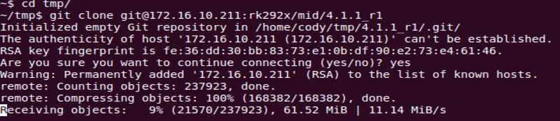

# Rockchip RK625 RT-Thread SDK  Release Note

ID: RK-FB-YF-901

Release Version: V0.1.0

Release Date: 2021-03-12

Security Level: □Top-Secret   □Secret   □Internal   ■Public

**DISCLAIMER**

THIS DOCUMENT IS PROVIDED “AS IS”. ROCKCHIP ELECTRONICS CO., LTD.(“ROCKCHIP”)DOES NOT PROVIDE ANY WARRANTY OF ANY KIND, EXPRESSED, IMPLIED OR OTHERWISE, WITH RESPECT TO THE ACCURACY, RELIABILITY, COMPLETENESS,MERCHANTABILITY, FITNESS FOR ANY PARTICULAR PURPOSE OR NON-INFRINGEMENT OF ANY REPRESENTATION, INFORMATION AND CONTENT IN THIS DOCUMENT. THIS DOCUMENT IS FOR REFERENCE ONLY. THIS DOCUMENT MAY BE UPDATED OR CHANGED WITHOUT ANY NOTICE AT ANY TIME DUE TO THE UPGRADES OF THE PRODUCT OR ANY OTHER REASONS.

**Trademark Statement**

"Rockchip", "瑞芯微", "瑞芯" shall be Rockchip’s registered trademarks and owned by Rockchip. All the other trademarks or registered trademarks mentioned in this document shall be owned by their respective owners.

**All rights reserved. ©2021. Rockchip Electronics Co., Ltd.**

Beyond the scope of fair use, neither any entity nor individual shall extract, copy, or distribute this document in any form in whole or in part without the written approval of Rockchip.

Rockchip Electronics Co., Ltd.

No.18 Building, A District, No.89, software Boulevard Fuzhou, Fujian,PRC

Website:     [www.rock-chips.com](http://www.rock-chips.com)

Customer service Tel:  +86-4007-700-590

Customer service Fax:  +86-591-83951833

Customer service e-Mail:  [fae@rock-chips.com](mailto:fae@rock-chips.com)

---

**Preface**

**Overview**

The document presents Rockchip RK625 RT-Thread SDK release notes, aiming to help engineers get started with RK625 RT-Thread SDK development and debugging faster.

**Intended Audience**

This document (this guide) is mainly intended for:

Technical support engineers

Software development engineers

**Chipset and System Support**

| **Chipset** | **Kernel Version** |
| ----------- | :-------------- |
| RK625 | RT-Thread v3.1.x |

**Revision History**

| Version | Author | Date | **Revision History** |
| -----------| :-------------- | :------------- | :---------- |
| V0.1.0 | Hans Yang | 2021-03-12 | Initial BETA V0.1.0 version |

---

**Contents**

[TOC]

---

## Overview

This SDK is based on RT-Thread v3.1.3, which contains system source code, drivers, tools, and application software packages used for RT-Thread system development, and it also contains development documents and tool usage documents. Adapting to RK625 chip platform, it is suitable for RK625 EVB development board and all products developed based on RK625 platform.

## Main Functions

| **Functions** | **Module Name** |
| ----------- | :-------------- |
| Data Communication | USB |
| Image Processing | ISP、JPEG encoder |
| Camera Interface | MIPI CSI |
| Application Demo | UVC |

## How to Get the SDK

Rockchip SDKs are released by Rockchip server. Please refer to Chapter 5 [SDK Building Introduction](# SDK Building Instructions) to build a development environment.

To get RK625 RT-Thread SDK software package, customers need an account to access the source code repository provided by Rockchip. In order to be able to obtain code synchronization, please provide SSH public key for server authentication and authorization when apply for SDK from Rockchip technical window(e-Mail: [fae@rock-chips.com](mailto:fae@rock-chips.com)). About Rockchip server SSH public key authorization, please refer to Chapter 6 [SSH  Public Key Operation Introduction](# SSH Public Key Operation Introduction).

### SDK Download Command

Repo, a tool built on Python script by Google to help manage git repositories, is mainly used to download and manage software repository of projects. The download address is as follows:

```shell
git clone ssh://git@www.rockchip.com.cn/repo/rk/tools/repo
```

RK625 RT-Thread SDK download command:

```shell
repo init --repo-url ssh://git@www.rockchip.com.cn/repo/rk/tools/repo -u ssh://git@www.rockchip.com.cn/rtos/rt-thread/rk/platform/release/manifests -b master -m rk625_release.xml
```

After the code  repository is initialized, you can use the following command to synchronize the code:

```shell
.repo/repo/repo sync
```

### SDK Code Compression Package

For quick access to SDK source code, Rockchip Technical Window usually provides corresponding version of SDK initial compression package. In this way, developers can get SDK source code through decompressing the initial compression package, which is the same as the one downloaded by repo.

Take RK625_RT-Thread_SDK_Beta_V0.1.0_20210312.tar.gz as an example. After getting an initialization package, you can get the source code by running the following command:

```shell
tar zxvf RK625_RT-Thread_SDK_Beta_V0.1.0_20210312.tar.gz
cd RK625_RT-Thread_SDK_Beta_V0.1.0_20210312
.repo/repo/repo sync -l
.repo/repo/repo sync
```

### To Get the SDK Version

Please get the SDK release version through project xml file by the following command:

```shell
cd .repo/manifests
git log rk625_release.xml
```

Or check the current SDK version through RKDocs/RK625_RT-Thread_Release_Note.txt.

### SDK Code Update

```shell
.repo/repo/repo sync
```

## RK625 RT-Thread  Project Directory Introduction

The following is the main SDK directory:

```shell
|-- applications            # Rockchip application demo source code
├── AUTHORS
|-- bsp                     # Chip related source code
│   ├── rockchip
│   │   ├── common
│   │   │   ├── drivers    # Universal driver of rockchip OS adaptation layer
│   │   │   ├── hal        # Rockchip HAL (hardware Abstraction Layer) implementation
│   │   │   └── tests      # Rockchip driver test code
│   │   ├── swallow        # RK625 main directory
│   │   │   ├── applications # RK625 application code
│   │   │   ├── board      # Board level configuration
│   │   │   ├── build      # Build main directory and store the intermediate files
│   │   │   ├── build.sh   # RK625 build script
│   │   │   ├── drivers    # RK625 Private driver directory
│   │   │   └── Image      # Firmware
│   │   └── tools          # Rockchip commonly used tools
├── ChangeLog.md
|-- components              # Various components of the system,including file system, shell and framework layer and other drivers
|-- documentation           # RT-Thread Official documents
|-- examples                # RT-Thread example program and test code
|-- include                 # RT-Thread official header file directory
├── Kconfig
|-- libcpu
├── LICENSE
├── README.md
├── README_zh.md
|-- RKDocs                  # Rockchip documents
|-- src                     # RT-Thread kernel source code
|-- third_party             # Directory of third-party code added by Rockchip
|-- tools                   # RT-Thread official tool directory, including menuconfig and building scripts
```

## SDK Building Instructions

### Set up the Building Environment

It is recommended to take 64-bit Ubuntu 16.04 or Ubuntu 18.04 system as an building environment, for other Linux systems have not been tested yet, it is recommended to install the release version consistent with Rockchip developers.

The building tool are SCons + GCC officially recommended by RT-Thread. SCons is an open source build system written in Python language. And GCC cross building tool is officially provided by ARM. You can directly install all the required tools by the following commands:

```shell
sudo add-apt-repository ppa:team-gcc-arm-embedded/ppa
sudo apt-get update
sudo apt-get install gcc-arm-embedded scons clang-format astyle libncurses5-dev build-essential python-configparser
```

If the toolchain can not be installed, you can also download them from ARM official website and specify their path through environment variables as follows:

```shell
wget https://developer.arm.com/-/media/Files/downloads/gnu-rm/7-2018q2/gcc-arm-none-eabi-7-2018-q2-update-linux.tar.bz2
tar xvf gcc-arm-none-eabi-7-2018-q2-update-linux.tar.bz2
export RTT_EXEC_PATH=/path/to/toolchain/gcc-arm-none-eabi-7-2018-q2-update/bin
```

### Basic Building and Packaging Commands

The building command is as follows:

```shell
cd RK625_RT-Thread_SDK_Beta_V0.1.0_20210312
cd bsp/rockchip/swallow
cp board/usb_camera/defconfig .config
scons --menuconfig  #Modify the switch of building modules, after exiting, the rtconfig.h file will be generated.
./build.sh
```

The generated firmware is located in:

```
Image/Firmware.img
```

For more detailed buildings, debugs, and flashes instructions about RK625 RT-Thread SDK,  please refer to the following document:

<SDK>/RKDocs/manuals/Rockchip_RK625_Quick_Start_RT-Thread_CN.pdf

## SSH Public Key Operation Introduction

Please follow the introduction in the “Rockchip SDK Application and Synchronization Guide” to generate an SSH public key and send the email to [fae@rock-chips.com](mailto:fae@rock-chips.com), applying for permission to download SDK code.
This document will be released to customers during the process of applying for permission.

### Multi-device Use the Same SSH Public Key

If the same SSH public key should be used in different devices, you can copy the SSH private key file id_rsa to “~/.ssh/id_rsa” of the device you want to use.

If the following prompt appears when using a wrong private key, please be careful to replace it with the correct private key.

</left>

After adding the correct private key, you can use git to clone code, as shown below.

</left>

Adding SSH private key may result in the following error.

```
Agent admitted failture to sign using the key
```

Please enter the following command in console to solve:

```shell
ssh-add ~/.ssh/id_rsa
```

### Switch Different SSH Public Keys on the Same Device

You can configure SSH according to the ssh_config documentation.

```shell
~$ man ssh_config
```

</left>

Run the following command to configure SSH configuration of current user.

```shell
~$ cp /etc/ssh/ssh_config ~/.ssh/config
~$ vi .ssh/config
```

As shown in the figure, SSH uses the file “~/.ssh1/id_rsa” of another directory as an authentication private key. In this way, different keys can be switched.

</left>

### Key Authority Management

Server can monitor download times and IP information of a key in real time. If an abnormality is found, download permission of the corresponding key will be disabled.

Keep the private key file properly. Do not grant second authorization to third parties.

### Reference Documents

For more details, please refer to the document :

<SDK>/RKDocs/Others/Rockchip_User_Guide_SDK_Application_And_Synchronization_CN.pdf