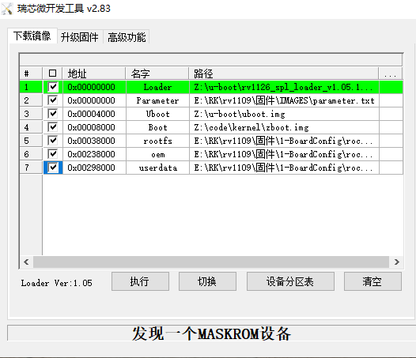

# Rockchip RV1126's MCU RT-Thread User Guide

ID: RK-YH-YF-181

Release Version: V1.0.0

Release Date: 2021-05-19

Security Level: □Top-Secret   □Secret   □Internal   ■Public

**DISCLAIMER**

THIS DOCUMENT IS PROVIDED “AS IS”. ROCKCHIP ELECTRONICS CO., LTD.(“ROCKCHIP”)DOES NOT PROVIDE ANY WARRANTY OF ANY KIND, EXPRESSED, IMPLIED OR OTHERWISE, WITH RESPECT TO THE ACCURACY, RELIABILITY, COMPLETENESS,MERCHANTABILITY, FITNESS FOR ANY PARTICULAR PURPOSE OR NON-INFRINGEMENT OF ANY REPRESENTATION, INFORMATION AND CONTENT IN THIS DOCUMENT. THIS DOCUMENT IS FOR REFERENCE ONLY. THIS DOCUMENT MAY BE UPDATED OR CHANGED WITHOUT ANY NOTICE AT ANY TIME DUE TO THE UPGRADES OF THE PRODUCT OR ANY OTHER REASONS.

**Trademark Statement**

"Rockchip", "瑞芯微", "瑞芯" shall be Rockchip’s registered trademarks and owned by Rockchip. All the other trademarks or registered trademarks mentioned in this document shall be owned by their respective owners.

**All rights reserved. ©2021. Rockchip Electronics Co., Ltd.**

Beyond the scope of fair use, neither any entity nor individual shall extract, copy, or distribute this document in any form in whole or in part without the written approval of Rockchip.

Rockchip Electronics Co., Ltd.

No.18 Building, A District, No.89, software Boulevard Fuzhou, Fujian,PRC

Website:     [www.rock-chips.com](http://www.rock-chips.com)

Customer service Tel:  +86-4007-700-590

Customer service Fax:  +86-591-83951833

Customer service e-Mail:  [fae@rock-chips.com](mailto:fae@rock-chips.com)

---

**Preface**

**Overview**

The document presents Rockchip RV1126's MCU RT-Thread SDK release notes, aiming to help engineers get started with RV1126's MCU RT-Thread SDK development and debugging faster.

**Intended Audience**

This document (this guide) is mainly intended for:

Technical support engineers

Software development engineers

**Chipset and System Support**

| **Chipset** | **Kernel Version** |
| ----------- | -------------- |
| RV1126 | RT-Thread v3.1.x |

**Revision History**

| Version | Author | Date | **Revision History** |
| -----------| -------------- | ------------- | ---------- |
| V1.0.0 | Jason Zhu | 2021-05-19 | Initial BETA V1.0.0 version |

---

**Contents**

[TOC]

---

## Tools

Install tools in ubuntu.

scons:

```shell
sudo apt-get install scons
```

Get the `riscv64-unknown-elf-gcc-8.2.0-2019.05.3-x86_64-linux` toolchain，it can be got from website as follow:

```
https://static.dev.sifive.com/dev-tools/riscv64-unknown-elf-gcc-8.2.0-2019.05.3-x86_64-linux-ubuntu14.tar.gz
```

Then put it in the path:

```
prebuilts/gcc/linux-x86/riscv64/riscv64-unknown-elf-gcc-8.2.0-2019.05.3-x86_64-linux
```

The prebuilts is the same level directory as RT-Thread.

## Compile

Get the RT-Thread with HAL from Rockchip. Then

```shell
cd rt-thread/bsp/rockchip/rv1126-riscv
scons -c         // clean up the project
scons --menuconfig
scons -j8        // compile the project
```

## Pack

Copy the rtthread.bin to 'rkbin/bin/rv11/'，then modify the 'rkbin/RKTRUST/RV1126TOS.ini' as follow:

```
[TOS]
TOSTA=bin/rv11/rv1126_tee_ta_v1.17.bin
[MCU]
MCU=bin/rv11/rtthread.bin,0x8700000,okay
```

Enter the u-boot.  Execute:

```shell
./make.sh rv1126
```

The rtthread.bin will be packed into the uboot.img.

## Upgrade Device

Select firmware as follow and upgrade the device.



## Notice

- Kernel Reserve the memory as follow:

```
reserved-memory {
        #address-cells = <0x00000001>;
        #size-cells = <0x00000001>;
        mcu@8700000 {
                reg = <0x08700000 0x00100000>;
        };
};
```

If you want change the MCU execution address, update the link.lds in the RT-Thread, rkbin/RKTRUST/RV1126TOS.ini and the kernel dts.
