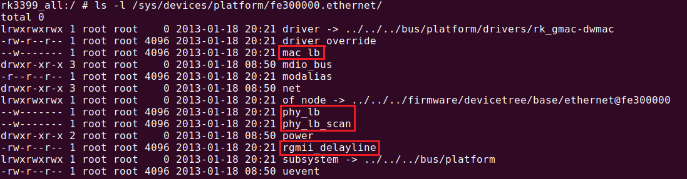
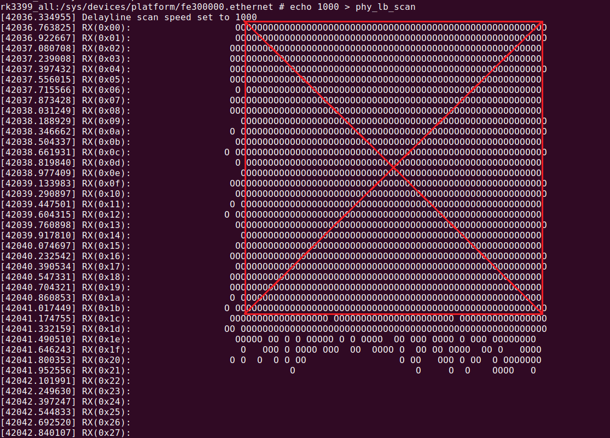
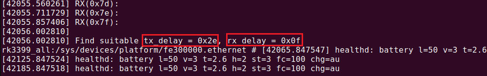
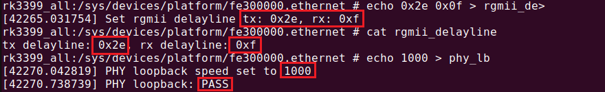

# Rockchip GMAC RGMII Delayline Guide

ID: RK-KF-YF-013

Release Version: V1.1.0

Release Date: 2020-06-24

Security Level: □Top-Secret   □Secret   □Internal   ■Public

**DISCLAIMER**

THIS DOCUMENT IS PROVIDED “AS IS”. ROCKCHIP ELECTRONICS CO., LTD.(“ROCKCHIP”)DOES NOT PROVIDE ANY WARRANTY OF ANY KIND, EXPRESSED, IMPLIED OR OTHERWISE, WITH RESPECT TO THE ACCURACY, RELIABILITY, COMPLETENESS,MERCHANTABILITY, FITNESS FOR ANY PARTICULAR PURPOSE OR NON-INFRINGEMENT OF ANY REPRESENTATION, INFORMATION AND CONTENT IN THIS DOCUMENT. THIS DOCUMENT IS FOR REFERENCE ONLY. THIS DOCUMENT MAY BE UPDATED OR CHANGED WITHOUT ANY NOTICE AT ANY TIME DUE TO THE UPGRADES OF THE PRODUCT OR ANY OTHER REASONS.

**Trademark Statement**

"Rockchip", "瑞芯微", "瑞芯" shall be Rockchip’s registered trademarks and owned by Rockchip. All the other trademarks or registered trademarks mentioned in this document shall be owned by their respective owners.

**All rights reserved. ©2020. Rockchip Electronics Co., Ltd.**

Beyond the scope of fair use, neither any entity nor individual shall extract, copy, or distribute this document in any form in whole or in part without the written approval of Rockchip.

Rockchip Electronics Co., Ltd.

No.18 Building, A District, No.89, software Boulevard Fuzhou, Fujian,PRC

Website:     [www.rock-chips.com](http://www.rock-chips.com)

Customer service Tel:  +86-4007-700-590

Customer service Fax:  +86-591-83951833

Customer service e-Mail:  [fae@rock-chips.com](mailto:fae@rock-chips.com)

---

**Preface**

**Overview**

The product of Rockchip has the function of Gigabit Ethernet and uses the RGMII interface. In order to be compatible with the signal differences brought by various hardware, the chip adds the  function adjustment (TX / RX) RGMII delayline. This document describes how to get a suitable set of delayline to achieve the best performance of Gigabit Ethernet, and how to improve the hardware to get the maximum delayline window.

**Product Version**

| **Chipset**  | **Kernel Version**           |
| ------------ | ---------------------------- |
| ALL  chipset | All version |

**Intended Audience**

This document (this guide) is mainly intended for:

Technical support engineers

Software development engineers

---

**Revision History**

| **Version** | **Author** | **Date**   | **Change Description**     |
| ----------- | ---------- | :--------- | -------------------------- |
| V1.0.0      | David Wu   | 2020-02-07 | Initial version            |
| V1.1.0      | David Wu   | 2020-06-24 | Support all kernel version |

---

**Contents**

[TOC]

---

## How To Get RGMII Delayline

If your project features a Gigabit Ethernet and uses the RGMII interface, as long as there is a hardware difference, you need to reset the delayline configuration. Because if the configured delayline value does not match the hardware of your project, it will affect your Gigabit Ethernet performance and even normal network functions.

### Checking Code

The implementation code is all in the file `drivers/net/ethernet/stmicro/stmmac/dwmac-rk-tool.c`, so it is also more convenient to transplant. If your project does not have this part of the code, please request a patch on Redmine, which has kernel-4.4 and kernel-3.10 versions, the others after kernel-4.4 should have supported it.

- Kernel-4.4 patch: Rockchip_RGMII_Delayline_Kernel4.4.tar.gz
  The kernel-4.4 performance has been optimized, the patch code is generated based on the current code. If there is a problem that it cannot be compiled, please try to patch`kernel4.4_stmmac_optimize_output_performances_20191119.zip` at first.

- Kernel-3.10 patch: Rockchip_RGMII_Delayline_Kernel3.10.tar.gz

### Checking Node

After the code in the previous step is confirmed and compiled, it will generate several sysfs nodes. If it is not generated, it means there is a problem with the patch. Taking RK3399 as an example, you can see these nodes in the directory `/sys/devices/platform/fe300000.ethernet` :



### Usage

Note that if you are using `RTL8211E phy`, you need to remove the network cable before testing.

#### Scanning Delayline Window

Scanning through the `phy_lb_scan` node will get an window, then get the coordinates in the center of this window, which needs to be scanned with a Gigabit speed of 1000.

```c
echo 1000 > phy_lb_scan
```

The horizontal axis represents the delayline in the TX direction (coordinate range <0x00, 0x7f>), and the vertical axis represents the delayline in the RX direction (coordinate range is also <0x00, 0x7f>). The "O" indicates that the coordinates of the point can be Okay, and all the other blank spaces indicate loopback failed. Taking RK3399 as an example, through the Gigabit scan command, discard rows or columns with blank spaces in between, you can get a rectangular window, and get the coordinates of the center point. The RX coordinates of the vertical axis have been printed, and the horizontal axis coordinates are not printing due to screen width. It is not displayed, you need to find it manually, starting from RX(0xXX): of:.



And the center point of coordinate will be printed after the scanning window:



The hardware signal of the RK3399 board tested in this picture is not very good, so the window is not very large. Similarly, RGMII 100M can also get a window. `Echo 100 > phy_lb_scan` can see that the 100M window is very large, occupying almost all the coordinates, because 100M is not as demanding as Gigabit on the signal.

#### Testing Scanned Result

Secondly, configure the scanned value to the `rgmii_delayline` node through the command, and then test whether the TX/RX data transmission under this configuration is normal through the `phy_lb` node test, at least this test needs pass first.

```shell
echo (tx delayline) (rx delayline) > rgmii_delayline
cat rgmii_delayline
echo 1000 > phy_lb
```



After testing pass, fill the delayline into dts respectively: `tx_delay = <0x2e>;` and `rx_delay = <0x0f>;`, re-burn the firmware, and then continue to test the ping or iperf performance test, generally test to this step will be enough.

```c
&gmac {
        assigned-clocks = <&cru SCLK_RMII_SRC>;
        assigned-clock-parents = <&clkin_gmac>;
        clock_in_out = "input";
        phy-supply = <&vcc_lan>;
        phy-mode = "rgmii";
        pinctrl-names = "default";
        pinctrl-0 = <&rgmii_pins>;
        snps,reset-gpio = <&gpio3 RK_PB7 GPIO_ACTIVE_LOW>;
        snps,reset-active-low;
        snps,reset-delays-us = <0 10000 50000>;
        tx_delay = <0x2e>;
        rx_delay = <0x0f>;
        status = "okay";
};
```

#### Auto Scanning

If a set of delayline values cannot be adapted to all hardware, the reason may be poor hardware and a small window with poor redundancy; you can turn on the automatic  function scanning and open `CONFIG_DWMAC_RK_AUTO_DELAYLINE` on menuconfig. It should be noted here that if the problem of the small window is not resolved, opening this macro will not completely solve the problem. Generally speaking, it is not necessary to open this macro.

```shell
    Device Drivers →
        Network device support →
            Ethernet driver support →
                [*]           Auto search rgmii delayline
```

This function will only make a detection at the first boot, and will store the delayline value to vendor storage after detection. Each subsequent boot will directly obtain the value from vendor storage and override the dts configuration. Only after the vendor storage is erased，the operation will  be performed once after the next boot.

Log printing for the first boot:

```c
[   23.532138] Find suitable tx_delay = 0x2f, rx_delay = 0x10
```

Log printing for subsequent boot:

```c
[   23.092358] damac rk read rgmii dl from vendor tx: 0x2f, rx: 0x10
```

## Hareware Checking

### Check reference draw

Please check the hardware on Redmine window with Rockchip FAE whether you are using the latest released reference drawings; for example, our reference drawings have changed the default RTL8211E PHY to RTL8211F, because RTL8211E has the following problems:

-RTL8211F is compatible with 1.8V and 3.3V IO, RTL8211E only supports 3.3V;
-RTL8211E PHY eye diagram test failed;
-RTL8211E needs to unplug the network cable when performing the delayline test mentioned above.

The latest reference drawings also include modifications if 3.3V IO is used, IO needs to be divided and etc.
If TX_CLK bypass from MAC_CLK, the voltage divider is to reserve the ground resistance at MAC_CLK where closed to the main control direction to avoid the long wiring, which leads to the duty cycle of the receiving end of the Rockchip platform of 125M sent by the PHY has exceeded the specification or the edge is too slow and the TX_CLK signal output by the bypass is not good enough. And after leaving the ground resistance, regulating the amplitude of MAC_CLK through voltage division can change the signal quality of TX_CLK.

### Test RGMII Timing Specifics

According to the latest RGMII protocol, you need to meet the following timing requirements. Please test your board for compliance. If you know nothing about test or do not have an oscilloscope to test, please make a request on Redmine.


For example, to confirm the signal quality of CLK at Gigabit, you should measure the waveforms of the signals at where close to the receiving end (do not measure at the sending end, the signal reflection at the sending end is serious, and the waveform cannot reflect the actual signal quality). Measuring the signal MAC_CLK, TX_CLK, RX_CLK, you should focus on duty cycle, amplitude, and rise and fall time, the bandwidth of the measuring oscilloscope and probe must be more than 5 times of 125M. For single-ended probes, the ground loop should be as short as possible. It is best to use a differential probe to control the duty cycle at 45 % ~ 55%. When the test environment is normal, the signal measured should be a square wave instead of a sine wave. Generally, the customer self-test is a positive sine wave with a 50% duty cycle, which is basically incorrect.

#### RX_CLK/MAC_CLK

MAC_CLK or RXCLK is provided by PHY. If the integrity of the received CLK measurement signal have defects, there is generally no register to regulate on the PHY side, it may only be adjusted by hardware. You can string high-frequency inductance at the transmitting end to improve the edge too slow （the bandwidth is only available if it meets the requirement so here cannot use ordinary inductance), and regulate the duty ratio and reduce the amplitude by modify voltage by resistance at the transmitting end.

#### TX_CLK

If there is a problem with TX_CLK, the edge is too slow, you can read the corresponding register through IO to check if the IO drive strength has been adjusted to the maximum, you can connect it with an oscilloscope; at the same time, directly regulate the drive strength through the IO command to observe the waveform change. If the improvement is not obvious by regulating driver, you can try for the string high-frequency inductance, or change and increase the series 22ohm resistor; if the duty cycle is not within the specification and TX_CLK bypass from MAC_CLK, you can adjust the TX_CLK duty cycle by dividing the MAC_CLK amplitude, the divided value is 100 ohm, the ground resistance value varies with the layout, different board have different value, you can regulate up from 100, until the oscilloscope observes that the duty cycle meets the requirements. If the above methods are not significant, and the IO currently used is 3.3V, in the case that both the PHY and RK platform support 1.8V IO, you can change the IO power to 1.8V and then observe the signal integrity because 1.8V IO signal indicator stronger than 3.3V, 1.8V IO is recommended.

## FAQ

### Scanning Window size

We hope that the larger the window, the better, indicating that the hardware signal is good and the redundancy is large. If the window cannot be scanned or the window scanned is too small, there are generally hardware problems, please refer to the hardware section.

### PHY Selection

There are no special requirements for the selection of PHY, as long as it conforms to RGMII. However, there are two points to note:

- If your project plans to use the RTL8211E Gigabit PHY, it is recommended that you change to RTL8211F or other PHY, for reasons explained in section 2.1 above.

- If the PHY you are using does not have a loopback function, please refer to the following method to obtain the delayline:

    PHY can be debugged based on the oscilloscope measurement signal. Use an oscilloscope with a bandwidth greater than 125M and 5 times the bandwidth to measure the phase difference between TXC and TXD near the PHY end. Regulate the phase within the range of 1.5ns ~ 2ns by IO command (the specification is 1 ~ 2.6 ns should be left in a certain amount), TX will be fine; and due to RX delayed inside the SoC, as loopback is not used, it can only be judged with the help of throughput. When the tx_delay register is determined, firstly set rx_delay to 0x10. After the change, use iperf to run the down link throughput. The result may be unsatisfactory at the beginning, continue to use the IO command to change the register rxdelay and increase it in steps of 5 (0x10 ~ 0x7f interval). After the IO writes the register, when it is measured that the throughput is greater than 900M, then narrow down by 2 steps to find the register interval that can go up to 900M, and then take the intermediate value and set it to dts.

TXC&TXD phase waveform figure：
