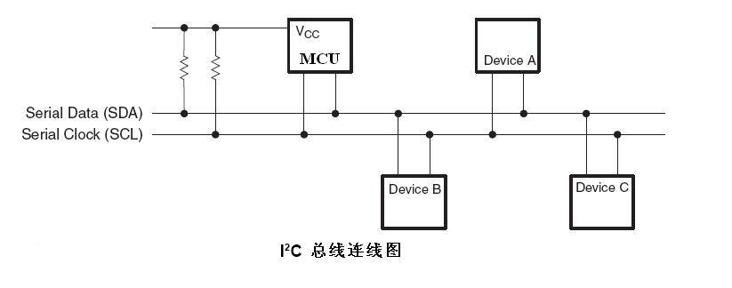
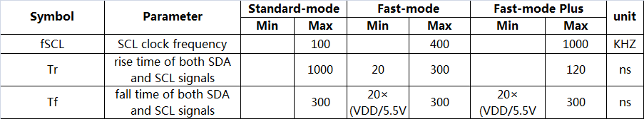
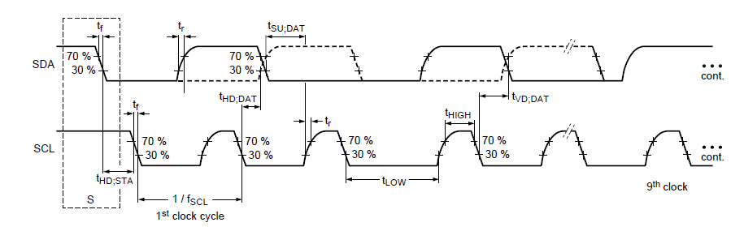

# **ROCKCHIP I2C 开发指南**

发布版本: 1.0

作者邮箱：david.wu@rock-chips.com

日期：2018.06

文档密级：公开文档

---

**前言**
ROCKCHIP系列芯片为客户提供了标准I2C 总线，方便客户实现对不同外接设备的控制和访问。I2C总线控制器通过串行数据（SDA）线和串行时钟 （SCL）线在连接到总线的器件间传递信息。每个器件都有一个唯一的地址识别（无论是微控制器——MCU、LCD 驱动器、存储器或键盘接口），而且都可以作为一个发送器或接收器（由器件的功能决定）。
Rockchip I2C 控制器支持下列功能︰

- 兼容 I2C 与 SMBus 总线
- 仅支持主模式下的 I2C 总线
- 软件可编程时钟频率支持到400kbps,部分芯片可高达 1000kbps
- 支持 7 位和 10 位寻址模式
- 一次中断或轮询至多32个字节的数据传输

下图为I2C总线的硬件连接方式，需要上拉电阻，改变上拉电阻大小可调节I2C总线的上拉强度。

ROCKCHIP I2C在不同芯片，不同内核版本上的驱动不一样，I2C可以跑的最高频率也有区别。

**产品版本**

| **芯片名称** | **内核版本** |   **Driver**   | **Max Frequency** |
| :------: | :------: | :------------: | :---------------: |
|  RK3066  |   3.x    | i2c-rockchip.c |       400K        |
|  RK3066  |   4.4    |   i2c-rk3x.c   |       400K        |
|  RK3188  |   3.x    | i2c-rockchip.c |       400K        |
|  RK3188  |   4.4    |   i2c-rk3x.c   |       400K        |
|  RK3288  |   3.10    | i2c-rockchip.c |       400K        |
|  RK3288  |   4.4    |   i2c-rk3x.c   |       400K        |
|  RK3036  |   3.10    | i2c-rockchip.c |       400K        |
|  RK3036  |   4.4    |   i2c-rk3x.c   |       400K        |
|  RK312x  |   3.10    | i2c-rockchip.c |       400K        |
|  RK312x  |   4.4    |   i2c-rk3x.c   |       400K        |
|  RK322x  |   3.10    | i2c-rockchip.c |       400K        |
|  RK322x  |   4.4    |   i2c-rk3x.c   |       400K        |
|  RK3368  |   3.10    | i2c-rockchip.c |       400K        |
|  RK3368  |   4.4    |   i2c-rk3x.c   |       400K        |
|  RK3366  |   4.4    |   i2c-rk3x.c   |       400K        |
|  RK3399  |   4.4    |   i2c-rk3x.c   |       1000K       |
|  RV1108  |   3.10    |   i2c-rk3x.c   |       1000K       |
|  RV1108  |   4.4    |   i2c-rk3x.c   |       1000K       |
| RK3228H  |   3.10    | i2c-rockchip.c |       1000K       |
| RK3328  |   4.4    |   i2c-rk3x.c   |       1000K       |
| RK3326/PX30  |   4.4    |   i2c-rk3x.c   |       1000K       |
| RK3308  |   4.4    |   i2c-rk3x.c   |       1000K       |

**读者对象**
本文档（本指南）主要适用于以下工程师：
技术支持工程师
软件开发工程师

**修订记录**

| **日期**    | **版本** | **作者** | **修改说明** |
| --------- | ------ | ------ | -------- |
| 2018.06.08 | V1.0   | 吴达超    |          |

---
[TOC]
---

## I2C 流程

I2C 的流程在两个驱动上大致是一样，写是单纯的 TX 模式 (I2C_CON[1:0]=2’b00)，而读一般使用TRX 模式(I2C_CON[1:0]=2’b01)。下面的 I2C 控制器操作流程图是描述软件如何通过这个 I2C 控制器寄存器来配置和执行 I2C 任务。描述分为3部分,传输模式，混合模式和接收模式。

### 1. Trasmint only mode(I2C_CON[1:0]=2’b00)


### 2. Mix mode (I2C_CON[1:0]=2’b01 or I2C_CON[1:0]=2’b11)


### 3. Receive only mode (I2C_CON[1:0]=2’b10)


以上为 I2C 的主要流程，详细实现参考驱动代码。

## I2C 驱动参数配置

I2C 的参数配置最主要就是 I2C 频率的配置，可配 I2C frequency 除了与芯片有关外，主要是由 I2C SCL rise time 决定的，因为 I2C 协议标准里面对上升沿和下降沿时间有规定要求特别是上升沿时间，如果超过了协议规定的最大值，则 I2C 通讯可能失败，下面是协议里面规定的最大最小值范围，下图表示了二者之间的关系：



上升沿 Tr 和下降沿 Tf，需要用示波器测量，参考下面示图：



I2C 的驱动 i2c-rk3x.c 与 i2c-rockchip.c 两个配置方式是不一样的，区别如下：

### 1. i2c-rk3x.c 配置

i2c-rk3x.c 驱动的配置都在 DTS，参考文件Documentation/devicetree/bindings/i2c/i2c-rk3x.txt。重点说明其中配置项，i2c-scl-rising-time-ns，i2c-scl-falling-time-ns：

- clock-frequency： 默认frequency 为100k 可不配置，其它 I2C 频率需要配置，最大可配置频率由 i2c-scl-rising-time-ns 决定；例如配置400k，clock-frequency=<400000>。
- i2c-scl-rising-time-ns：SCL 上升沿时间由硬件决定，改变上拉电阻可调节该时间，需通过示波器量测，参考上图；例如测得 SCL 上升沿 365ns，i2c-scl-rising-time-ns=<365>。(默认可以不配置，但必须保证当前的上升沿时间不能超过所配置频率下的 I2C 标准所定义的最大上升沿时间)
- i2c-scl-falling-time-ns:  SCL 下降沿时间, 一般不变, 等同于 i2c-sda-falling-time-ns。(默认也可以不配置）

```c
&i2c1 {
	status = "okay";
	i2c-scl-rising-time-ns = <265>;
	i2c-scl-falling-time-ns = <11>;
	clock-frequency = <400000>;

	es8316: es8316@10 {
		#sound-dai-cells = <0>;
		compatible = "everest,es8316";
		reg = <0x10>;
		clocks = <&cru SCLK_I2S_8CH_OUT>;
		clock-names = "mclk";
		spk-con-gpio = <&gpio0 11 GPIO_ACTIVE_HIGH>;
		hp-det-gpio = <&gpio4 28 GPIO_ACTIVE_LOW>;
	};
};
```

### 2. i2c-rockchip.c 配置

i2c-rockchip.c 驱动仍然遵循 I2C frequency 与 SCL 上升沿的约束关系，能否用更高的频率取决于 i2c-scl-rising-time-ns；I2C 频率在代码上面配置，直接配置 i2c_msg 结构体上的 scl_rate 成员， 默认 frequency 仍为100k，例如下面的 200K 配置配置：

```c
        struct i2c_msg xfer_msg;

        xfer_msg[0].addr = client->addr;
        xfer_msg[0].len = num;
        xfer_msg[0].flags = client->flags;
        xfer_msg[0].buf = buf;
        xfer_msg[0].scl_rate = 200 * 1000; /* 200K i2c clock frequency */
```

## I2C 使用

对于 I2C 的使用说明在 Documentation/i2c/ 有比较详细的，查阅，下面重点提下读写部分：

### 1. Kernel space

Rockchip I2C 的读写通信都是使用的是 linux 的标准接口，请参考 kernel 下面的 Documentation/i2c/writing-clients 文档说明，里面的 Sending and receiving 部分有系统的介绍。

### 2. User space

通常, I2C 设备由内核驱动程序控制。但也可以从用户态访问总线上的所有设备，通过 “/dev/i2c-%d” 接口来访问，kernel 下面的 Documentation/i2c/dev-interface 文档有详细说明与示例。

## I2C tools

I2C tool 是一个开源工具，需自行下载进行交叉编译，代码下载地址：
	<https://www.kernel.org/pub/software/utils/i2c-tools/>
或者
	<git clone git://git.kernel.org/pub/scm/utils/i2c-tools/i2c-tools.git>

编译后会生成 i2cdetect，i2cdump，i2cset，i2cget 等工具，可以直接在命令行上调试使用：

- i2cdetect – 用来列举 I2C bus 和上面所有的设备
- i2cdump – 显示 i2c 设备所有 register 的值
- i2cget – 读取 i2c 设备某个 register 的值
- i2cset – 写入 i2c 设备某个 register 的值

I2C tool 都是开源的，编译与使用请参考里面的 README 与帮助说明。

## GPIO 模拟 I2C

I2C 用 GPIO 模拟，内核已经有实现，请参考文档：
Documentation/devicetree/bindings/i2c/i2c-gpio.txt

下面是使用的例子，dts 下配置 I2C 节点。

```c
        i2c@4 {
                compatible = "i2c-gpio";
                gpios = <&gpio5 9 GPIO_ACTIVE_HIGH>, /* sda */
                        <&gpio5 8 GPIO_ACTIVE_HIGH>; /* scl */
                i2c-gpio,delay-us = <2>;        /* ~100 kHz */
                #address-cells = <1>;
                #size-cells = <0>;
                pinctrl-names = "default";
                pinctrl-0 = <&i2c4_gpio>;
                status = "okay";

                gt9xx: gt9xx@14 {
                        compatible = "goodix,gt9xx";
                        reg = <0x14>;
                        touch-gpio = <&gpio5 11 IRQ_TYPE_LEVEL_LOW>;
                        reset-gpio = <&gpio5 10 GPIO_ACTIVE_HIGH>;
                        max-x = <1200>;
                        max-y = <1900>;
                        tp-size = <911>;
                        tp-supply = <&vcc_tp>;
                        status = "okay";
                };
        };
```

一般不推荐使用 GPIO，效率不高。

## I2C 常见问题

因为我们有两个 i2c 驱动，所以仍然分两部分：

### 1. i2c-rk3x.c 驱动：

如果调用 I2C 传输接口返回值为 -6(-ENXIO)时候，表示为 NACK 错误，即对方设备无应答响应，这种情况一般为外设的问题，常见的有以下几种情况：

- I2C 地址错误；
- I2C slave 设备处于不正常工作状态，比如没有上电，错误的上电时序以及设备异常等；
- I2C 时序不符合slave设备所要求也会产生 NACK 信号，比如 slave 设备需要的是 stop 信号,而不是 repeat start 信号的时候；
- I2C 总线受外部干扰导致的，用示波器测量可以看到是一个ACK波形。

当出现 I2C 的 log："timeout, ipd: 0x00, state: 1"时，此时 I2C 控制器工作异常，无法产生中断状态，start 时序无法发出，有以下几种可能：

- I2C SCL或者SDA Pin 脚iomux错误；
- I2C 的上拉电压不对，如电压不够或者上拉电源没有等；
- I2C Pin 脚被外设拉住，电压不对；
- I2C 时钟未开，或者时钟源太小；
- I2C 同时配置了CON_START 和 CON_STOP 位。

当出现 I2C 的 log："timeout, ipd: 0x10, state: 1"时，此时 I2C 控制器工作正常，但是 cpu 无法响应 I2C 中断，此时可能cpu0被阻塞了（一般 I2C 中断都在 cpu0上面，通过cat /proc/interrups 可以查看），或者可能是 I2C 中断位被关闭了。

当出现 I2C 的 log 类似："timeout, ipd: 0x80, state: 1"时，看到 ipd 为 0x80 打印，可以说明当前 SCL 被 slave 拉住，要判断被哪个 slave 拉住：

- 一是排除法，适用于外设不多的情况，而且复现概率高；
- 二是需要修改硬件，在 SCL 总线上串入电阻，通过电阻两端产生的压差来确定，电压更低的那端外设为拉低的 slave，电阻的选取以不影响 I2C 传输且可以看出压差为标准，一般上拉电阻的1/20 以上都可以，如果是 host 拉低也可以看出。另外在此基础上通过示波器来抓取波形更加直观，比较不同 slave 和 host 的低电平大小，与最后出问题时的低电平大小比较，相等的就是拉低总线的”元凶“。

常见的情况是sda被拉低，证明是谁拉低的，同样参考上面 “SCL 被拉低" 的方法两种。

### 2. i2c-rockchip.c 驱动：

如果调用 I2C 传输接口返回值为 -11(-EAGAIN )时候，表示为 NACK 错误，即对方设备无应答响应，这种情况一般为外设的问题，常见的有以下几种情况：

- I2C 地址错误；
- I2C slave 设备处于不正常工作状态，比如没有上电，错误的上电时序以及设备异常等；
- I2C 时序不符合slave设备所要求也会产生 NACK 信号，比如 slave 设备需要的是 stop 信号,而不是 repeat start 信号的时候；
- I2C 总线受外部干扰导致的，用示波器测量可以看到是一个 ACK 波形。

当出现 I2C 的 log："timeout, ipd: 0x00, state: 1"时，此时 I2C 控制器工作异常，无法产生中断状态，start 时序无法发出，有以下几种可能：

- I2C SCL或者SDA Pin 脚iomux错误；
- I2C 的上拉电压不对，如电压不够或者上拉电源没有等；
- I2C Pin 脚被外设拉住，电压不对；
- I2C 时钟未开，或者时钟源太小；
- I2C 同时配置了CON_START 和 CON_STOP位。

**当出现 I2C 的 log**："timeout, ipd: 0x10, state: 1"时，此时 I2C 控制器工作正常，但是 cpu 无法响应 I2C 中断，此时可能 cpu0 被阻塞了（一般 I2C 中断都在 cpu0 上面，通过 cat /proc/interrups 可以查看），或者可能是 I2C 中断位被关闭了。

**当出现 I2C 的log类似**："timeout, ipd: 0x80, state: 1"时，看到 ipd 为 0x80 打印，或者看到"scl  was hold by slave”的打印，可以说明当前 SCL 被 slave 拉住，要判断被哪个 slave 拉住：

一是排除法，适用于外设不多的情况，而且复现概率高；
二是需要修改硬件，在 SCL 总线上串入电阻，通过电阻两端产生的压差来确定，电压更低的那端外设为拉低的slave，电阻的选取以不影响 I2C 传输且可以看出压差为标准，一般上拉电阻的1/20以上都可以，如果是 host 拉低也可以看出。另外在此基础上通过示波器来抓取波形更加直观，比较不同 slave 和 host 的低电平大小，与最后出问题时的低电平大小比较，相等的就是拉低总线的”元凶“。

常见的情况是 SDA 被拉低，证明是谁拉低的，同样参考上面 “ scl  was hold by slave"的方法两种。

当出现 log “i2c is not in idle(state = ×)”的 log 时，表示 I2C 总线至少一个为低，解决办法参考上面：

- “state=1” 表示 SDA 为低；
- “state=2” 表示 SCL 为低；
- “state=3” 表示 SCL 和 SDA 都为低。

### 3. Debug 之 I2C 波形：

如果遇到的 I2C 问题以上情况都不是，最好的办法是抓取 I2C  出错时候的波形，通过波形来分析 I2C 问题，I2C 的波形非常有用，大部分的问题都能分析出来；可以在出错的地方让 cpu 卡住（比如 while(1) 等），不发起新的 I2C 任务，最后抓到的波形应该就是出错的波形，如果需要过滤还可以加入设备 I2C 地址的判断条件等。