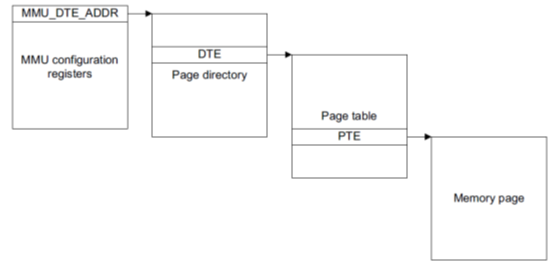
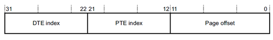
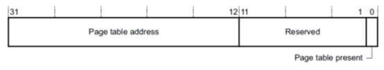
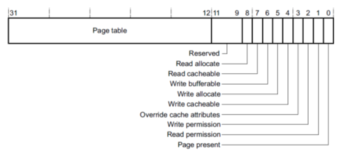

# **Rockchip Developer Guide Linux IOMMU**

文件标识：RK-KF-YF-077

发布版本：V1.0.0

日期：2019-12-23

文件密级：公开资料

---

**免责声明**

本文档按“现状”提供，福州瑞芯微电子股份有限公司（“本公司”，下同）不对本文档的任何陈述、信息和内容的准确性、可靠性、完整性、适销性、特定目的性和非侵权性提供任何明示或暗示的声明或保证。本文档仅作为使用指导的参考。

由于产品版本升级或其他原因，本文档将可能在未经任何通知的情况下，不定期进行更新或修改。

**商标声明**

“Rockchip”、“瑞芯微”、“瑞芯”均为本公司的注册商标，归本公司所有。

本文档可能提及的其他所有注册商标或商标，由其各自拥有者所有。

**版权所有© 2019福州瑞芯微电子股份有限公司**

超越合理使用范畴，非经本公司书面许可，任何单位和个人不得擅自摘抄、复制本文档内容的部分或全部，并不得以任何形式传播。

福州瑞芯微电子股份有限公司

Fuzhou Rockchip Electronics Co., Ltd.

地址：     福建省福州市铜盘路软件园A区18号

网址：     [www.rock-chips.com](http://www.rock-chips.com)

客户服务电话： +86-4007-700-590

客户服务传真： +86-591-83951833

客户服务邮箱： [fae@rock-chips.com]

---

**前言**

IOMMU用于32位虚拟地址和物理地址的转换，它带有读写控制位，能产生缺页异常以及总线异常中断。

**产品版本**

| **芯片名称**    | **内核版本** |
| :---------- | -------- |
| ROCKCHIP 芯片  | 4.4/4.19 |

**读者对象**
本文档（本指南）主要适用于以下工程师：
技术支持工程师
软件开发工程师

**修订记录**

| **日期**     | **版本** | **作者** | **修改说明** |
| ---------- | ------ | ------ | -------- |
| 2019.12.23 | V1.0   | 薛小明 | 初始发布 |

---
[TOC]
---

## IOMMU结构

使用二级页表结构， 如下：





32位地址结构，前10位第一级页表偏移，中间10位二级页表偏移，最后12位页内偏移

DTE结构：



bit0：下一级页表是否存在

PTE结构：



bit0：实际的物理页是否存在

bit1：读允许

bit2：写允许

## IOMMU驱动

### 驱动文件

驱动文件所在位置：
`drivers/iommu/rockchip-iommu.c`

### DTS 节点配置

DTS 配置参考文档 为`Documentation/devicetree/bindings/iommu/rockchip,iommu.txt`，本文主要说明如下参数:

- `compatible = "rockchip,iommu";`
  对于所有设备的iommu，compatible字段值相同

- `interrupts = <GIC_SPI 119 IRQ_TYPE_LEVEL_HIGH 0>;`
  用于异常中断，比如缺页中断

- `clocks = <&cru ACLK_VOP1>, <&cru HCLK_VOP1>;`
- `clock-names = "aclk", "hclk";`
  iommu和master共享clock，这里用于iommu驱动单独控制clock

- `power-domains = <&power RK3399_PD_VOPL>;`
  用于iommu驱动操作pd功能

- `iommu-cells = <0>;`
  必须为0，详见iommu.txt

## IOMMU使用

ROCKCHIP IOMMU驱动依赖IOMMU框架(`drivers/iommu/iommu.c`)，主要实现`struct iommu_ops rk_iommu_ops`当中的回调函数，然后master调用iommu框架提供的API对iommu进行操作，如下:

1. iommu attach
   `iommu_attach_device -> rk_iommu_attach_device`	/* enable iommu */

2. iommu detach
   `iommu_detach_device -> rk_iommu_detach_device`	/* disable iommu */

3. iommu map
   `iommu_map -> rk_iommu_map`
   创建页表，建立虚拟地址和物理地址的映射关系，debug时候将iommu_map里面的dbg打印打开，观察mapping过程

4. iommu unmap
   `iommu_unmap -> rk_iommu_unmap`
   解除虚拟地址和物理地址的映射关系，释放虚拟地址空间，debug时候将iommu_unmap里面的dbg打印打开，观察
   unmapping过程

5. domain alloc
   `iommu_domain_alloc -> rk_iommu_domain_alloc`
   申请页表基地址，用于attach/detach操作

6. domain free
   `iommu_domain_free -> rk_iommu_domain_free`
   释放页表空间

7. dump iommu页表
   以3399 vopl_iommu为例，假设当前访问的虚拟地址VA为0x00001000，依照如下顺序dump页表：
   a. 获取一级页表基地址: DT
      io -4 0xff8f3f00
   b. 计算一级页表偏移
      index1 = VA >> 22
   c. 计算一级页表物理地址: DTE
      DTE = index1 * 4 + DT
   d. 获取二级页表基地址：PT
      PT = io -4 DTE
   e. 计算二级页表偏移
      index2 = VA && 0x3ff000
   e. 计算二级页表物理地址: PTE
      PTE = index2 * 4 + PT
   f. 获取PAGE物理地址: page
      page = io -4 PTE
   g. 计算页内偏移: offset
      offset = page + (VA && 0xfff)
   offset就是虚拟地址0x00001000对应的物理地址，master可以用此来分析数据是否正确

8. dma-mapping
   a. dev为非iommu设备
   ARM32: `dev->dma_ops = arm_dma_ops;`
   ARM64: `dev->dma_ops = arm64_swiotlb_dma_ops;`
   b. dev为iommu设备
   ARM32: `dev->dma_ops = iommu_ops;`
   ARM64: `dev->dma_ops = iommu_dma_ops;`
   以dma_alloc_attrs函数为例：
   1. 非iommu dev，从a的dma_ops调用alloc回调申请连续物理内存和内核态虚拟地址

   2. iommu dev，从b的dma_ops调用alloc回调申请物理内存，并通过iommu框架调用
   iommu_map来创建iommu页表，建立虚拟地址和物理地址映射关系，返回iommu虚拟地址首
   地址和内核态虚拟地址

一个最简单的使用iommu的步骤

```
1. domain = iommu_domain_alloc(&platform_bus_type);
2. iommu_map(domain, iova, paddr, size, prot)；
3. iommu_attach_device(domain, dev)；
4. master启动访问iommu
```

iommu是一个基础的部件，可以嵌入各种内存分配的框架中，比如ion/drm，以ARM64环境下drm为例，一次完整的iommu buffer分配以及映射过程如下：

```
rockchip_gem_alloc_buf ->
rockchip_gem_get_pages ->
rockchip_gem_iommu_map ->
iommu_map_sg ->
iommu_map
```

通过传递fd的iommu映射过程如下：

```
1. struct dma_buf *dmabuf = dma_buf_get(fd) ->
dma_buf_attach -> dma_buf_map_attachment ->
map_dma_buf -> drm_gem_map_dma_buf ->
dma_map_sg_attrs -> map_sg ->
__iommu_map_sg_attrs ->
iommu_dma_map_sg ->
iommu_map_sg ->
iommu_map
```

## 内核配置

```c
Symbol: ROCKCHIP_IOMMU [=y]
Type  : boolean
Prompt: Rockchip IOMMU Support
	Location:
		-> Device Drivers
			-> IOMMU Hardware Support (IOMMU_SUPPORT [=y])
	Defined at drivers/iommu/Kconfig:211
    Depends on: IOMMU_SUPPORT [=y] && (ARM || ARM64 [=y]) && (ARCH_ROCKCHIP [=y] ||
                COMPILE_TEST [=n])
    Selects: IOMMU_API [=y] && ARM_DMA_USE_IOMMU
```

## IOMMU常见问题

1. pagefault中断
   出现pagefault中断，说明当前iommu产生了缺页异常，即当前正在访问的虚拟地址没有创建对
   应的映射关系。有三种可能，一是访问unmap的地址，二是越界访问，三是没有map就开始访
   问，历史上这三种情况master都有出现过。

2. iommu enable stall异常
   这个很有可能是iommu已经出现pagefault异常，然后master没有处理异常，继续访问，从log
   可以看出该问题。

3. iommu寄存器不能访问
   很有可能是master对pd的处理即pm_runtime_get_sync/pm_runtime_put_sync使用不合理导
   致，即没有开iommu power domain的情况下去访问iommu寄存器。

4. iommu持续报中断
   DTS中断号填写错误。

5. 开机闪屏
   在vop显示过程中，使能iommu，导致vop取数异常，在没有帧生效功能的芯片中，需要等到
   vop没有取数再使能iommu。

6. iommu寄存器异常
   很有可能是master越界访问iommu寄存器，或者master复位整个IP。

7. iommu集成device link操作，将PD的操作权限交给master，master需要注意
   pm_runtime_get/pm_runtime_put的使用。

8. ARM32环境下，共享iommu的master需要维护独立的页表，比如vepu和vdpu，每次访问之前
   需要attach对应的页表，ARM64则是共享页表，不需要每次attach。