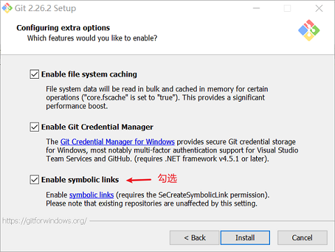
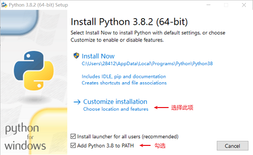
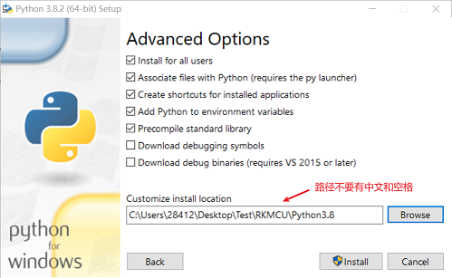
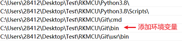
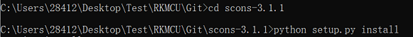
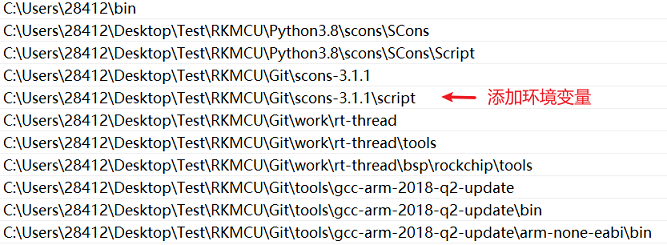
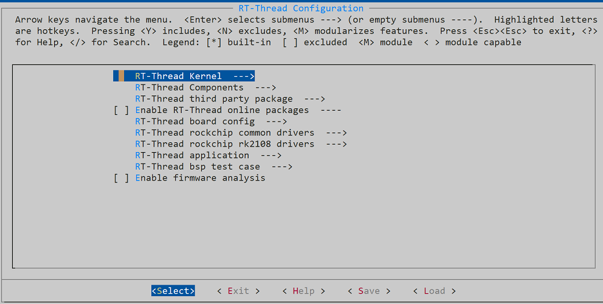
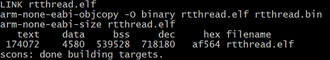
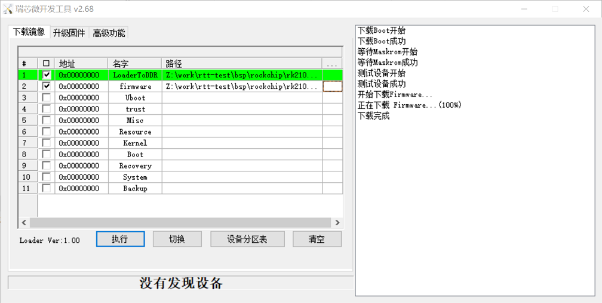

# MCU Windows开发环境搭建

文件标识：RK-KF-YF-107

发布版本：V1.0.0

日期：2020-04-29

文件密级：□绝密   □秘密   □内部资料   ■公开

---

**免责声明**

本文档按“现状”提供，福州瑞芯微电子股份有限公司（“本公司”，下同）不对本文档的任何陈述、信息和内容的准确性、可靠性、完整性、适销性、特定目的性和非侵权性提供任何明示或暗示的声明或保证。本文档仅作为使用指导的参考。

由于产品版本升级或其他原因，本文档将可能在未经任何通知的情况下，不定期进行更新或修改。

**商标声明**

“Rockchip”、“瑞芯微”、“瑞芯”均为本公司的注册商标，归本公司所有。

本文档可能提及的其他所有注册商标或商标，由其各自拥有者所有。

**版权所有© 2019福州瑞芯微电子股份有限公司**

超越合理使用范畴，非经本公司书面许可，任何单位和个人不得擅自摘抄、复制本文档内容的部分或全部，并不得以任何形式传播。

福州瑞芯微电子股份有限公司

Fuzhou Rockchip Electronics Co., Ltd.

地址：     福建省福州市铜盘路软件园A区18号

网址：     [www.rock-chips.com](http://www.rock-chips.com)

客户服务电话： +86-4007-700-590

客户服务传真： +86-591-83951833

客户服务邮箱： [fae@rock-chips.com](mailto:fae@rock-chips.com)

---

**前言**

**概述**

**产品版本**

| **支持芯片**  | **RT-Thread 版本** |
| -------------- | ---------------------- |
| RK2108  | lts-v3.1.x/master  |
| RK2206  | lts-v3.1.x/master  |

**读者对象**

本文档（本指南）主要适用于以下工程师：

软件开发工程师

**修订记录**

| **版本** | **作者** | **日期**   | **修改说明** |
| --------- | --------- | ---------- | -------------- |
|  V1.0.0   | 刘诗舫   | 2020-04-29 | 初始版本     |

---

[TOC]

---

## 介绍

Rockchip MCU在Windows下的开发环境搭建主要包括SDK源码下载、编译、下载固件和调试。

1. SDK源码下载和编译工作主要在Git For Windows中的Git Bash上进行。
2. 代码的查看和编辑工作可以使用Git Bash自带的Vim编辑器，也可以根据用户习惯使用任意编辑器，如VScode、Source Insight等。
3. 下载固件的工具由Rockchip提供。
4. 调试工作主要使用JTAG在Ozone、Eclipse等软件上进行。

## 下载Rockchip RT-Thread源码

### 安装Git For Windows

从Git官网（[点击进入](https://git-scm.com/download/win)）下载Git For Windows安装程序（版本信息：Git-2.26.2-64-bit）。开始安装：



**注意：一定要启用符号链接。**

### 安装Python 3

从Python官网（[点击进入](https://www.python.org/downloads/)）下载Python 3安装程序（版本信息：python-3.8.2-amd64）。开始安装：





**注意：安装路径不能有中文和空格。**

### 添加环境变量

在Windows设置中添加环境变量：系统属性（菜单栏->高级）->环境变量（系统变量->Path）->选中后点击编辑->新建。



**注意：需要重启电脑使修改后的环境变量生效。**

### 安装repo

使用管理员权限，打开Git For Windows中的组件Git Bash，下载repo工具。将~/bin的绝对路径加入环境变量。

```
mkdir ~/bin
curl https://storage.googleapis.com/git-repo-downloads/repo > ~/bin/repo
chmod a+rx ~/bin/repo
```

### 添加ssh key

在~/.ssh/路径下添加ssh key，添加git config配置。详细内容建议参考SDK相关文档。

### 下载Rockchip RT-Thread源码

使用Git Bash下载Rockchip RT-Thread源码，详细内容建议参考SDK相关文档。**注意：源码下载过程非常慢，请耐心等待，期间不要进行任何操作。**
Git安装目录相当于Git Bash下的根目录“/”，打开Git安装路径就可以找到下载好的源码。

## 编译Rockchip RT-Thread源码

### 安装scons工具

从scons官网（[点击进入](https://www.scons.org/)）下载scons安装程序（版本信息：scons-3.1.1）。解压scons工具到Git安装路径，进入Windows命令行（win+R cmd）切换到scons工具路径，使用python 3安装：python setup.py install



### 安装ARM交叉编译工具链

从ARM官网（[点击进入](https://developer.arm.com/tools-and-software/open-source-software/developer-tools/gnu-toolchain/gnu-rm/downloads)）下载ARM交叉编译工具链安装程序（版本信息：gcc-arm-none-eabi-7-2018-q2-update-win32）。**注意：请与开发人员保持一致，最新版本的ARM交叉编译工具链与源码不兼容。**
在Git安装路径下新建文件夹tools，存放工具。安装ARM交叉编译工具链，注意安装路径。这样能在Git Bash路径/tools下找到。


### 添加环境变量

在Windows设置中添加环境变量：系统属性（菜单栏->高级）->环境变量（系统变量->Path）->选中后点击编辑->新建。



**注意：需要重启电脑使修改后的环境变量生效。**

### 使用ENV工具修改menuconfig

从RT-Thread官网（[点击进入](https://www.rt-thread.org/page/download.html)）下载ENV工具（版本信息：env_released_1.2.0）。解压到Git\work\rt-thread\bsp\rockchip\tools路径下，打开env.exe，切换到BSP路径，使用menuconfig。

```
cd ../../rk2108
menuconfig
```



### 使用scons编译

回到Git Bash，切换到BSP路径，如RK2108：cd /work/bsp/rk2108。添加ARM交叉编译工具链路径：`export RTT_EXEC_PATH=/tools/gcc-arm-2018-q2-update/bin`。使用命令`scons -j8`编译，生成rtthread.elf文件可用于JTAG调试，生成rtthread.bin文件可用于打包固件。



**注意：每次重新打开Git Bash时需要重新添加ARM交叉编译工具链路径。**

### 生成并下载固件

需要的工具为resource_header_tool_v1.0、firmware_merger_v1.35，放在Git\work\rt-thread\bsp\rockchip\tools路径下。使用命令`./mkimg.sh`打包固件，在Git\work\rt-thread\bsp\rockchip\rk2108\Image路径下能找到生成的固件。使用Rockchip_Develop_Tool_v2.68工具下载固件。



## 调试

调试主要使用JTAG在Ozone、Eclipse等软件上进行。详情参考《Rockchip_User_Guide_J-Link_CN》、《Rockchip_Developer_Guide_OpenOCD_CN》等对应文档。

## Q&A

### 为什么不直接在ENV上进行开发？

我们对RT-Thread进行了各方面的优化，与原生的RT-Thread差异较大，ENV工具不能较好地适配。并且ENV工具使用的Python 2版本太旧，很多语法已经与现在常用的Python 3脚本不兼容，与repo、scons等工具的新版本也不能很好地兼容。在之后的优化中，会考虑将menuconfig集成到Git Bash。

## 参考资料

[Git符号链接](https://github.com/git-for-windows/git/wiki/Symbolic-Links)