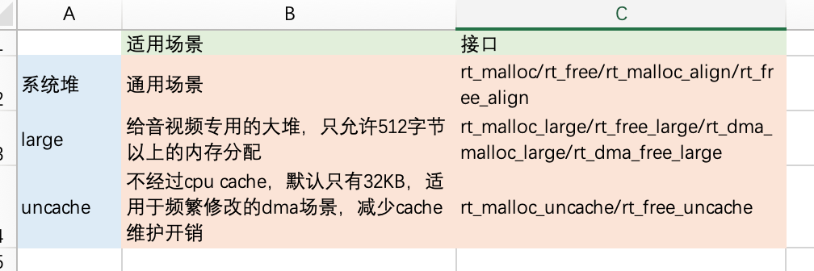

# RT-Thread 开发向导

发布版本：1.0

作者邮箱：<cmc@rock-chips.com>

日期：2019.02

文件密级：内部资料

---

**前言**

**概述**

**产品版本**

| **支持芯片** | **RT-Thread 版本** |
| ------------- | ----------------- |
| RK2108/Pisces | 3.11/4.0          |

**读者对象**

本文档（本指南）主要适用于以下工程师：

软件开发工程师

**修订记录**

| **日期**   | **版本** | **作者** | **修改说明**                       |
| ---------- | -------- | -------- | ---------------------------------- |
| 2019-02-20 | V1.0     | 陈谋春   | 初始版本                           |
| 2019-04-30 | v1.1     | 陈谋春   | 更新公共驱动路径                   |
| 2019-05-14 | v1.2     | 陈谋春   | 更新测试用例描述，增加调试说明     |
| 2019-06-17 | v1.3     | 陈谋春   | 更新模块配置说明，增加编译脚本配置 |
| 2019-07-08 | v1.4     | 陈谋春   | 增加静态库编译说明                 |
| 2019-08-12 | v1.5     | 陈谋春   | 修正准备工作：下载工程、保存配置   |
| 2019-08-23 | v1.6     | 陈谋春   | 增加Cache问题注意事项              |

---

[TOC]

---

## 1 介绍

   RT-Thread 是一个开源的 RTOS，主要开发成员来自中国，大家主要利用业余时间进行 RT-Thread 的开发和维护，同时也接受开发者，爱好者，以及专业嵌入式领域公司向 RT-Thread 捐赠代码。目前我司只有 RK2108 支持，后续其他 MCU 芯片可能也会加入。

## 2 准备工作

### 2.1 下载工程

   目前 RT-Thread 的移植实际上被我们分成两个部分，HAL(Hardware abstraction layer)和 BSP(Board Support Package)，前者是各个 IP 基本功能的实现，目标是能无缝兼容不同的 RTOS，后者则实现了 HAL 和 RT-Thread 系统的桥接，包括各种驱动的注册和整个系统的启动引导。现在这两个部分是分成两个仓库，通过 repo 来管理。

   具体下载命令如下：

1. repo 工具下载，如果已经安装了 repo ，请略过

```shell
git clone ssh://10.10.10.29:29418/android/tools/repo -b stable
export PATH=/path/to/repo:$PATH
```

2. 工程下载

```shell
mkdir rt-thread
cd rt-thread
repo init --repo-url ssh://10.10.10.29:29418/android/tools/repo -u ssh://10.10.10.29:29418/rtos/rt-thread/manifests -b master
.repo/repo/repo sync
```

### 2.2 编译环境配置

   目前有两台服务器：172.16.12.243 和 10.10.10.110，都已经搭建好 RT-Thread 的编译环境，所以使用这两个服务器的工程师可以跳过这一节，直接开始开发。

   RT-Thread 使用 SCons 作为编译脚本，并支持 ARMCC、GCC、IAR 三种编译器，我们主要用 GCC 来开发，所以这里以 GCC 举例，后续如果确实有另外两个编译的需求，会在补上配置。最后还需要安装两个代码格式检查工具，具体的安装配置命令如下：

```shell
sudo add-apt-repository ppa:team-gcc-arm-embedded/ppa
sudo apt-get update
sudo apt-get install gcc-arm-embedded scons clang-format astyle
```

   如果不想安装 toolchain ，还可以通过下载的方式，通过环境变量指定一下 toolchain 的路径即可，具体如下：

```shell
export RTT_EXEC_PATH=/path/to/toolchain/gcc-arm-none-eabi-7-2018-q2-update/bin
```

   由于 RT-Thread 使用 menuconfig 做配置工具，所以需要安装如下软件包，如果已经配置过 Linux 或 Android 的开发环境，请跳过这一步：

```shell
sudo apt-get install libncurses5-dev build-essential
```

### 2.3 编译

   传统开源软件一般用 Makefile 作为编译脚本，如 Linux，有些会加上 Autoconf、Automake 来实现更灵活方便的配置和编译；而 RT-Thread 用 SCons 来实现编译控制，SCons 是一套由 Python 语言编写的开源构建系统，类似于 GNU Make。它采用不同于通常 Makefile 文件的方式，而使用 SConstruct 和 SConscript 文件来替代。这些文件也是 Python 脚本，能够使用标准的 Python 语法来编写。所以在 SConstruct、SConscript 文件中可以调用 Python 标准库进行各类复杂的处理，而不局限于 Makefile 设定的规则。

   编译命令如下：

```shell
cd bsp/rockchip/rk2108
scons -j8
```

   以上命令将会用默认的配置来编译，最后会在当前目录下生成如下文件：

```shell
ls -l rtthread*
-rwxrwxr-x 1 cmc cmc 599616 Feb 15 19:45 rtthread.elf
-rw-rw-r-- 1 cmc cmc 489470 Feb 15 19:45 rtthread.map
-rwxrwxr-x 1 cmc cmc  56760 Feb 15 19:45 rtthread.bin
```

   其中 rtthread.bin 是我们下载到机器上的二进制固件，另外两个分别是 ELF 文件和符号表。

   有些芯片是支持 XIP ，即代码可以直接下载到 NOR FLASH 执行，是否支持这种模式需要查询芯片的规格书，控制编译生成 XIP 格式的固件有两种方式：直接修改 rtconfig.py 和设置环境变量 RTT_BUILD_XIP，具体如下：

```shell
# method 1: modify rtconfig.py, set XIP = 'Y'
XIP = 'Y'
#XIP = 'N'

# method 2: export RTT_BUILD_XIP
export RTT_BUILD_XIP=Y
```

   SCons 构建系统默认是通过 MD5 来判断文件是否需要重新编译，如果你的文件内容没变，而只是时间戳变了（例如通过 touch 去更新时间戳），是不会重新编译这个文件及其依赖的。还有就是如果只修改无关内容，例如代码注释，则只会编译，而不会链接，因为 obj 文件内容没变。同时我有收到几次反馈，代码内容有变，但是没有重新编译，暂时还没有找到问题规律，所以不好查，在开发过程中如果碰到这种异常情况，建议做一次清理，命令如下：

```shell
scons -c
```

   如果做完上面的清理以后，还有异常，可以强制删除所有中间文件，命令如下：

```shell
rm -rf build
```

   其他 SCons 命令，可以看帮助或文档

```shell
scons -h
```

### 2.4 静态库编译

   RT-Thread 支持静态库编译，==模块可以先剥离成一个独立的 Group==，每一个 Group 都是一个独立的编译单元，可以有自己的编译标志和链接标志，也可以很方便的编译成静态库，下面以 FileTest 模块为例，先看看这个模块的编译脚本*/path/to/rtthread/examples/file/SConscript*，具体如下：

```python
Import('RTT_ROOT')
Import('rtconfig')
from building import *

cwd = GetCurrentDir()
src = Glob('*.c')
CPPPATH = [cwd, str(Dir('#'))]

group = DefineGroup('FileTest', src, depend = ['RT_USING_FILE_TEST'], CPPPATH = CPPPATH)

Return('group')
```

   从上面可以看到，==静态库不需要特殊的编译脚本==，也不需要设置标志说明要编译成静态库，是否编译成静态库完全取决于编译命令，例如，要把这个模块编译成一个静态库，只需要在编译的时候用如下命令：

```shell
scons --buildlib=FileTest      # FileTest即编译脚本中我们定的Group名字
```

   成功编译的话，会有如下输出：

```shell
scons: Reading SConscript files ...
scons: done reading SConscript files.
scons: Building targets ...
scons: building associated VariantDir targets: build
AR libFileTest_gcc.a
ranlib libFileTest_gcc.a
Install compiled library... FileTest_gcc
Copy libFileTest_gcc.a => /path/to/rt-thread/examples/file/libFileTest_gcc.a
scons: done building targets.
```

   可以看到 RTT 直接把生成的静态库放到编译脚本的同级目录下，要使用这个静态库也简单，只需要把这个静态库加入到 RTT 的静态库列表中，路径加入到 RTT 的静态库搜索路径中，具体如下：

```python
from building import *

cwd     = GetCurrentDir()

src     = []
CPPPATH = [cwd]

LIBS    = ['libFileTest_gcc.a']
LIBPATH = []

if GetDepend('SOC_RK2108'):
    LIBPATH = [cwd + '/rk2108']

elif GetDepend('SOC_RK1808'):
    LIBPATH = [cwd + '/rk1808']

group = DefineGroup('file-test', src, depend = ['RT_USING_FILE_TEST'], CPPPATH = CPPPATH, LIBS = LIBS, LIBPATH = LIBPATH)
```

   所以，一些不想开源的模块，可以按上面的方法做成静态库，以动态库的形式对外发布。

### 2.5 模块配置

   RT-Thread 沿用了 Linux 的 Kconfig 作为模块配置开关，具体命令如下：

```shell
cd bsp/rockchip/rk2108
scons --menuconfig
```

   会弹出如下界面，操作方法和 Linux 是一样，这个过程会从 .config 载入当前的默认配置，退出保存配置的时候会覆盖 .config ，同时自动重新生成一个 rtconfig.h 文件，这个文件包含了我们选中的各种配置，最终参与编译的只有这个 rtconfig.h ，具体界面如下图所示：


​    上图中各个分类的名字很清晰，这里就不具体描述了，其中前三个是 RT-Thread 公版的配置，后面都是我们 BSP 的驱动配置和测试用例。需要额外说明的是：第三项 online packages，这些包不是随 RT-Thread 源码发布的，而是自己独立仓库维护，需要的时候，我们需要先在这里把配置打开，然后再通过 pkgs 命令下载或更新，把工程下载到本地，最后才能编译，并且这些包并不保证每个都能用，有的可能连编译都无法成功。主要是有些包编译器兼容性较差，有些则是太久没维护了。下面以 Wi-Fi 模块为例，演示一下具体操作：

- 先选上我们要的 Wi-Fi 驱动，然后退出并保存配置：


- 再通过 pkgs 命令下载驱动：

```shell
source ~/.env/env.sh
pkgs --update
```

- 编译

```shell
scons -j8
```

  可以看到下载下来的 Wi-Fi 驱动在如下目录：

```shell
/path/to/rt-thread/bsp/rockchip/rk2108/packages/wlan_wiced-latest
```

   其他 pkgs 命令如下：

```shell
pkgs -h
usage: env.py package [-h] [--force-update] [--update] [--list] [--wizard]
                      [--upgrade] [--printenv]

optional arguments:
  -h, --help      show this help message and exit
  --force-update  force update and clean packages, install or remove the
                  packages by your settings in menuconfig
  --update        update packages, install or remove the packages by your
                  settings in menuconfig
  --list          list target packages
  --wizard        create a new package with wizard
  --upgrade       upgrade local packages list and ENV scripts from git repo
  --printenv      print environmental variables to check
```

   除了上面用到的 update 外，另外有几个常用：list 可以看到当前我们选中的包列表；upgrade 用来更新到最新的包列表，以及 ENV 脚本（pkgs 在这里实现）；wizard 是用来创建自己的包。

### 2.6 保存配置

   上一节我们看到配置信息是保存在 .config ，同时在每一个板级配置目录下都有一个默认配置 defconfig，如果没有执行 menuconfig ，会用默认的 rtconfig.h 参与编译。==在提交配置修改的时候，如果配置需要应用于所有的板级，则三个都要提交，否则只要提交相应板级的 defconfig==。

   ==在线包经常变动，所以如果在线包选上了，每个工程师的在线包起点不一样，其配置信息中的在线包选项也会差异很大，导致review变得不方便，所以默认我们是不选上在线包的，需要某个在线包功能的时候，请移植到third_party下，并修改Kconfig配置项名字，减少和在线包冲突，这样也方便修改在线包的代码==

   下面是无效配置的例子：

```shell
/* RT-Thread online packages */

/* IoT - internet of things */

/* PKG_USING_PAHOMQTT is not set */
/* PKG_USING_WEBCLIENT is not set */
/* PKG_USING_WEBNET is not set */
/* PKG_USING_MONGOOSE is not set */
/* PKG_USING_WEBTERMINAL is not set */
/* PKG_USING_CJSON is not set */
/* PKG_USING_JSMN is not set */
/* PKG_USING_LJSON is not set */
/* PKG_USING_EZXML is not set */
/* PKG_USING_NANOPB is not set */
```

   要修改板子的 defconfig，可以先用它覆盖 .config，通过 menuconfig 改完以后再保存回去，下面是具体例子：

```shell
cp board/xxx/defconfig .config             ; 拷贝要修改的板子的默认配置
scons menuconfig                           ; 修改配置项
cp .config board/xxx/defconfig             ; 保存配置为板子的默认配置
```

### 2.7 Scons 编译脚本

   大部分驱动和应用并不需要关心编译脚本，目前的编译脚本会自动搜索驱动、板级配置、应用和测试等目录的所有源文件进行编译，所以即使增加模块，一般也不需要改脚本。只有在目录结构有变更，或者需要修改编译标志的时候会需要改动编译脚本。

   BSP 的主目录下有一个 rtconfig.py，这里可以修改 toolchain 和全局的编译链接标志，具体如下：

```python
if  CROSS_TOOL == 'gcc':
    PLATFORM    = 'gcc'
    EXEC_PATH       = '/usr/bin'   # 配置toolchain的路径
elif CROSS_TOOL == 'keil':
    PLATFORM    = 'armcc'
    EXEC_PATH   = 'C:/Keil'

if os.getenv('RTT_EXEC_PATH'):
    EXEC_PATH = os.getenv('RTT_EXEC_PATH')

#BUILD = 'debug'
BUILD = 'release'            # 默认是release配置，O2优化级别

XIP = 'Y'       # xip启用开关，开启的时候大部分代码都会放在flash里跑，可以节省内存
#XIP = 'N'
if os.getenv('RTT_BUILD_XIP'):
    XIP = os.getenv('RTT_BUILD_XIP').upper()

if PLATFORM == 'gcc':
    # toolchains
    PREFIX = 'arm-none-eabi-'    # 默认toolchain名字
    CC = PREFIX + 'gcc'
    AS = PREFIX + 'gcc'
    AR = PREFIX + 'ar'
    CXX = PREFIX + 'g++'
    LINK = PREFIX + 'gcc'
    TARGET_EXT = 'elf'
    SIZE = PREFIX + 'size'
    OBJDUMP = PREFIX + 'objdump'
    OBJCPY = PREFIX + 'objcopy'

    DEVICE = ' -mcpu=cortex-m4 -mthumb -mfpu=fpv4-sp-d16 -mfloat-abi=hard -ffunction-sections -fdata-sections'      # cpu相关的编译选项
    CFLAGS = DEVICE + ' -g -Wall -Wno-cpp -Werror=maybe-uninitialized -Werror=implicit-function-declaration -Werror=return-type -Werror=address -Werror=int-to-pointer-cast -Werror=pointer-to-int-cast '    # 全局编译标志
    AFLAGS = ' -c' + DEVICE + ' -x assembler-with-cpp -Wa,-mimplicit-it=thumb -D__ASSEMBLY__ '                              # 全局汇编编译标志
    LFLAGS = DEVICE + ' -lm -lgcc -lc' + ' -nostartfiles -Wl,--gc-sections,-Map=rtthread.map,-cref,-u,Reset_Handler -T gcc_arm.ld'
                               # 全局链接标志

    CPATH = ''
    LPATH = ''

    if XIP == 'Y':
        AFLAGS += ' -D__STARTUP_COPY_MULTIPLE '
        CFLAGS += ' -D__STARTUP_COPY_MULTIPLE '
        LFLAGS += ' -T gcc_xip.ld'
    else:
        LFLAGS += ' -T gcc_ram.ld'

    if BUILD == 'debug':
        CFLAGS += ' -O0 -gdwarf-2'
        AFLAGS += ' -gdwarf-2'
    else:
        CFLAGS += ' -O2'
```

   接下来一级的编译脚本是 BSP 根目录下的 SConscript，具体如下：

```python
import os
Import('RTT_ROOT')

PROJECT = 'RK2108'
Export('PROJECT')
cwd = str(Dir('#'))
objs = []
list = os.listdir(cwd)

# HAL的编译脚本
objs = SConscript(os.path.join(cwd, '../common/HalSConscript'), variant_dir = 'common/hal', duplicate=0)

# 搜索所有包含SConscript文件的一级子目录，全部都会加入编译
for d in list:
    path = os.path.join(cwd, d)
    if os.path.isfile(os.path.join(path, 'SConscript')):
        objs = objs + SConscript(os.path.join(d, 'SConscript'))

# 添加BSP主目录外的模块：公共驱动、测试和examples
objs = objs + SConscript(os.path.join(RTT_ROOT, 'bsp/rockchip/common/drivers/SConscript'), variant_dir = 'common/drivers', duplicate=0)
objs = objs + SConscript(os.path.join(RTT_ROOT, 'bsp/rockchip/common/tests/SConscript'), variant_dir = 'common/tests', duplicate=0)
objs = objs + SConscript(os.path.join(RTT_ROOT, 'examples/kernel/SConscript'), variant_dir = 'examples/kernel', duplicate=0)

Return('objs')
```

   如果要修改某个子模块的编译标志，可以把这个子模块的编译独立一个 GROUP，然后修改局部标志，下面是一个加局部宏定义的例子：

```python
Import('RTT_ROOT')
Import('rtconfig')
from building import *

cwd = GetCurrentDir()
src = Glob('*.c')
CPPPATH = [cwd]                                    # 配置头文件搜索目录，全局有效
LOCAL_CPPDEFINES = ['BOARD_M1_TEST_MARCO']         # 局部宏定义，局部有效

group = DefineGroup('BoardConfig', src, depend = ['RT_USING_BOARD_RK2108_EVB'], CPPPATH = CPPPATH, LOCAL_CPPDEFINES = LOCAL_CPPDEFINES )     # 这个宏只会在BoardConfig编译的时候生效

Return('group')
```

   其他一些局部和全部定义，可以参考下面的列表介绍：

```shell
LOCAL_CCFLAGS                                      # 局部编译标志
LOCAL_CPPPATH                                      # 局部头文件搜索路径
LOCAL_CPPDEFINES                                   # 局部宏定义
LOCAL_ASFLAGS                                      # 局部汇编标志
CCFLAGS                                            # 全局编译标志
CPPPATH                                            # 全局头文件搜索路径
CPPDEFINES                                         # 全局宏定义
ASFLAGS                                            # 全部汇编标志
```

### 2.8 固件打包和烧写

   前面步骤编译生成的只是 elf 和 bin ，需要打包成固件才能烧写到设备上，下面以 RK2108 为例介绍一下固件打包和烧写，其他芯片可能略有差别，以产品文档为主：

```shell
cd bsp/rockchip/rk2108
./mkimage.sh                                              # 打包固件
upgrade_tool db Image/rk2108_db_loader.bin                # 下载烧写loader，这个loader只用于下载，重启后自毁
upgrade_tool wl 0 ./Image/Firmware.img                    # 下载固件
upgrade_tool rd                                           # 重启
```

   以上是 linux 的下载，另外我们还封装了一个脚本，简化下载流程：

```shell
./update_fimeware.sh
```

   固件打包的配置文件位于 Image/setting.ini ，具体如下：

```shell
#Flag   1:skip flag,2:reserved flag,4:no partition size flag
#type can suppot 32 partiton types,0x0:undefined 0x1:Vendor 0x2:IDBlock ,bit3:bit31 are available
#PartSize and PartOffset unit by sector
#Gpt_Enable 1:compact gpt,0:normal gpt
#Backup_Partition_Enable 0:no backup,1:backup
#Loader_Encrypt 0:no encrypt,1:rc4
#nano 1:generate idblock in nano format
[System]    #gpt分区，不允许修改
FwVersion=1.0
Gpt_Enable=
Backup_Partition_Enable=
Nano=
Loader_Encrypt=
Chip=
Model=
[UserPart1]   #loader分区，不允许修改
Name=IDBlock
Type=0x2
PartOffset=0x80
PartSize=0x80
Flag=
File=rk2108_loader.bin,Boot2_Fake.bin
[UserPart2]   #固件分区，允许部分修改
Name=rtthread
Type=0x8
PartOffset=0x100    # 起始位置，单位sector=512
PartSize=0x200      # 分区大小，单位sector=512，max=0x1000，即最大固件是2MB，如果需要更大，需要同步调整root起始位置，需要保证64KB对齐
Flag=
File=rtthread.img
[UserPart3]   # 根文件系统，允许部分修改
Name=root
Type=
PartOffset=0x1100   # 一般不需要修改，如果一定要改，需要确保64KB对齐，并且同步修改board/xxx/mnt.c的root起始位置
PartSize=0x6f00     # 分区大小=flash总大小-起始位置
Flag=1              # root不打包到固件里，独立烧写
File=root.img
```

### 2.9 根文件系统制作和烧写

   目前我们默认的根文件系统是 fat 格式的，所以这里以 fat 的根文件系统为例，具体如下：

```shell
dd if=/dev/zero of=./root.img bs=4096 count=1024
mkfs.msdos -S 4096 root.img
mkdir rootfs
sudo mount -t vfat ./root.img ./rootfs
cp -r /path/to/your/root/dir/* ./rootfs
sudo umount ./rootfs
# 此时root.img就是你要的根文件系统了
```

   烧写的命令也很简单：

```shell
./mkimage.sh                                              # 打包固件
upgrade_tool db Image/rk2108_db_loader.bin                # 下载烧写loader
upgrade_tool wl 0 ./Image/Firmware.img                    # 下载固件
upgrade_tool wl 0x1100 ./Image/root.img                   # 下载根文件系统，这里的地址要和固件打包的配置文件setting.ini里定义的root分区地址一致
upgrade_tool rd
```

   打包和下载根文件系统这一步不是必须的，如果没有文件需要烧下去，完全可以直接格式化文件系统，然后复位，即可自动挂载文件系统，来节省烧写时间：

```shell
mkfs -t elm root                                          # 格式化root分区
```

## 3 驱动开发

   驱动的开发实际上分两个部分：HAL 和 Driver，前者可以参考 HAL 的开发指南，这里主要说明后者开发过程中的注意事项：

   首先，所有工程师开发前都应该看一下 RT-Thread 的 coding style 文档，路径如下：

```shell
cd path/to/rt-thread
ls documentation/coding_style_cn.md -l
-rw-rw-r-- 1 cmc cmc 8101 Jan  7 18:38 documentation/coding_style_cn.md
```

   tools/as.sh 是 RTT 提供的代码风格检查的脚本，不需要手动调用 astyle。

   其次，在开始开发前有必要看一下 RT-Thread 的官方开发指南，了解一下驱动会用的一些系统接口，例如同步与通信、内存管理和中断管理，需要后台线程的话，可以看一下系统的线程和任务管理。这些都可以在开发指南找到介绍，也有一些简单的 demo 可以参考。同时各类驱动，特别是总线型驱动要看一下系统是否有现成的驱动框架，如果有则要按框架要求来实现，所有的驱动框架都在 path_to_rtthread/components 目录下，目前可以看到如下驱动都有现成的框架：serial、can、timer、i2c、gpio、pwm、mtd、rtc、sd/mmc、spi、watchdog、audio、wifi、usb 等；反之如果 RT-Thread 没有现成的框架，在自己实现前也可以找一下其他 BSP 目录下是否已经有相关驱动可以作为参考。

   目前驱动程序被分为两类：公共和私有，前者指的是多个芯片可以共用的驱动，可以放如下目录：

```shell
/path/to/rt-thread/bsp/rockchip/common/drivers
```

   而私有驱动，则只适用特定芯片，可以放到这个芯片 BSP 主目录下的 drivers 目录，例如：

```shell
/path/to/rt-thread/bsp/rockchip/rk2108/drivers
/path/to/rt-thread/bsp/rockchip/rk1808/drivers
```

   所有的驱动都要以 drv_xxx.c 和 drv_xxx.h，其中 xxx 为模块名或相应缩写，要求全部小写，不能有特殊字符存在，如果必要可以用"_"分割长模块名，如“drv_sdio_sd.c”。各个模块不需要修改编译脚本，目前的脚本已经可以自动搜索 drivers 下所有的源文件，自动完成编译，但是推荐模块加上自己的 Kconfig 配置开关，并且考虑多芯片之间的复用，方便裁剪和调试，具体可以参考如下实现：

```shell
$ cat drivers/Kconfig
menu "RT-Thread bsp drivers"

config RT_USING_UART0
    bool "Enable UART0"
    default y

config RT_USING_UART1
    bool "Enable UART1"
    default y

config RT_USING_UART2
    bool "Enable UART2"
    depends on RKMCU_RK2108
    default y

config RT_USING_DSP
    bool "Enable DSP"
    default n

endmenu
```

   此外，HAL 目前是通过 hal_conf.h 来做模块开关的，为了方便配置，可以让 Kconfig 和 hal_conf.h 做一个关联，例如串口的 hal_conf.h 配置如下：

```c
#if defined(RT_USING_UART0) || defined(RT_USING_UART1) || defined(RT_USING_UART2)
#define HAL_UART_MODULE_ENABLED
#endif
```

   驱动的源文件 drv_xxx.c，一定要用 Kconfig 的开关包起来，并且公共驱动要考虑多芯片复用，例如：

```c
#if defined(RT_USING_I2C)

#if defined(RKMCU_RK2108)
void do_someting(void)
{

}
#endif

#endif
```

   如果驱动有汇编文件，尽量三种编译器都支持：gcc、keil(armcc)、iar，文件名可以按如下规则：xxx_gcc.S、xxx_arm.s、xxx_iar.s，目前汇编文件不会自动加入编译，要手动修改编译脚本，参考 bsp/rockchip/rk2108/drivers/SConscript：

```python
Import('RTT_ROOT')
Import('rtconfig')
from building import *

cwd     = os.path.join(str(Dir('#')), 'drivers')

src = Glob('*.c')
if rtconfig.CROSS_TOOL == 'gcc':
    src += Glob(RTT_ROOT + '/bsp/rockchip/common/drivers/drv_cache_gcc.S')
elif rtconfig.CROSS_TOOL == 'keil':
    src += Glob(RTT_ROOT + '/bsp/rockchip/common/drivers/drv_cache_arm.s')
elif rtconfig.CROSS_TOOL == 'iar':
    src += Glob(RTT_ROOT + '/bsp/rockchip/common/drivers/drv_cache_iar.s')

CPPPATH = [cwd]

group = DefineGroup('PrivateDrivers', src, depend = [''], CPPPATH = CPPPATH)

Return('group')
```

   还有就是设备驱动中的定时器延迟，可以简单的使用系统的 tick，如 rt_thread_delay 和 rt_thread_sleep 来实现，但注意不能在中断上下文使用，也不能用 rt_tick_get 代替，因为默认情况 tick 中断的优先级不会比其他中断高，有可能出现某个中断太耗时，导致 tick 出现没有及时更新的情况。中断上下文可以用循环来实现一个简单延迟，例如：

```c
static void udelay(unsigned long usec) {
  unsigned long count = 0;
  unsigned long utime = SystemCoreClock / 1000000 * usec;

  while(++count < utime) ;
}
```

   最后，RT-Thread 提供了一个自动初始化的接口，驱动如果需要自动初始化，可以调用这些宏：

```c
/* board init routines will be called in board_init() function */
#define INIT_BOARD_EXPORT(fn)           INIT_EXPORT(fn, "1")

/* pre/device/component/env/app init routines will be called in init_thread */
/* components pre-initialization (pure software initilization) */
#define INIT_PREV_EXPORT(fn)            INIT_EXPORT(fn, "2")
/* device initialization */
#define INIT_DEVICE_EXPORT(fn)          INIT_EXPORT(fn, "3")
/* components initialization (dfs, lwip, ...) */
#define INIT_COMPONENT_EXPORT(fn)       INIT_EXPORT(fn, "4")
/* environment initialization (mount disk, ...) */
#define INIT_ENV_EXPORT(fn)             INIT_EXPORT(fn, "5")
/* appliation initialization (rtgui application etc ...) */
#define INIT_APP_EXPORT(fn)             INIT_EXPORT(fn, "6")
```

   如上所示，其初始化顺序是从上到下，我们约定 BOARD 组只放板级的初始化如 CLK，需要注意在 BOARD 组的初始化过程中由于系统调度子系统还没有初始化，不能使用系统的互斥和同步模块，如 MUTEX 等，此时系统的中断还没有开，所有操作都是串行的，不需要考虑并发和竞争。而 PREV 组我们可以放一些总线驱动的初始化，如 I2C、SDIO 等，而大部分设备驱动用 INIT_DEVICE_EXPORT 就够了。

   如果两个模块有先后顺序以来，可以放到上面的不同初始化组里，来控制顺序。当然也自己在代码里去控制，举例，如果有两个模块 A 和 B，A 的初始化依赖于 B 的初始化，则最好只把 B 的初始化 EXPORT 出来，然后在 B 里再去调用 A 的初始化。

## 4 测试用例

   提交驱动的同时，最好同步提交测试程序，目前我们的 BSP 测试被分为两个部分：公共和私有，前者是可以多个芯片共用的测试，后者是这个芯片特有的测试，目录分别如下：

```shell
/path/to/rt-thread/bsp/rockchip/common/tests
/path/to/rt-thread/bsp/rockchip/rk2108/tests
```

   可以把测试程序做成 RTT 的 shell 命令，文件名可以命名为 test_xxx.c，其中 xxx 是模块名，例如串口可以用 test_uart.c。下面是一个简单例子：

```c
#include <rthw.h>
#include <rtthread.h>

/* 可以沿用驱动的宏定义开关，确保在驱动未启用的时候不会被编译 */
#ifdef RT_USING_DEMO_TEST

#include <stdint.h>

void demo_test(void)
{
    rt_kprintf("this is demo_test\n");
}

#ifdef RT_USING_FINSH
#include <finsh.h>
/* 导出finsh shell命令：demo_test, 系统默认是msh shell看不到，推荐使用 */
FINSH_FUNCTION_EXPORT(demo_test, demo test for driver);
/* 导出msh shell命令：demo_test, 一般只要导出到一个shell就够了 */
MSH_CMD_EXPORT(dma_test, demo test for driver);
#endif

#endif
```

   要启动测试，只需要在命令行按如下命令操作：

```shell
msh /> demo_test
this is demo_test
msh /> exit
finsh >> demo_test()
this is demo_test
```

   ==注意，默认配置下启用的 msh，如果测试用例导出到 finsh，需要先通过 exit 命令推出 msh，会自动切到 finsh。要重新切回 msh，可以输入 msh()==

 测试用例如果需要传参数，可以这样修改：

```c
int demo_test(char* param)
{
    printf("%s world\n", param);
    return 0;
}
FINSH_FUNCTION_EXPORT(demo_test, demo test for driver);
```

   测试命令如下：

```shell
msh /> exit
finsh >> demo_test("hello")
hello world
finsh >> msh()
msh />
```

   RTT 还提供了一个简单的测试框架，通过 RT_USING_TC 来开启，具体实现在：*/path/to/rt-thread/examples/kernel/tc_comm.c*，方便多个测试用例的集成，下面是一个简单的例子，定义了一个_tc_sample 的测试用例，完整代码请参考*/path/to/rt-thread/examples/kernel/tc_sample.c*：

```c
int _tc_sample()
{
    /* 通过测试框架，设置测试用例的清理函数，如内存释放，线程清理等 */
    tc_cleanup(_tc_cleanup);
    /* 实际测试用例的实现，可以直接调用，可以创建一个线程调用（比如默认线程的堆栈太小） */
    sample_init();

    return 25;
}
/* 命名必须以_tc_开头，否则测试框架不认 */
FINSH_FUNCTION_EXPORT_ALIAS(_tc_sample, __cmd__tc_sample, a thread testcase example.);
```

   下面是通过测试框架来调用的命令：

```shell
msh /> exit
finsh >> list_tc()            ； 列出所有测试用例
__cmd__tc_sample
finsh >> tc_start("sample")   ； 调用测试用例“sample”
finsh >> tc_loop("sample")    ;  循环调用测试用例"sample"
```

   通过测试框架调用测试的时候，不需要给出完整的测试用例名称，例如上面的例子，如果只给"samp"，效果也是一样，所以这里要求我们的测试用例如果调用测试框架，都要遵守如下命名规则：_tc_bsp_module_name，其中 bsp 表示这是一个 bsp 测试，module 是这个测试的模块如 uart、spi 等，name 则是测试用例的名字。这样就可以用这个实现分级分类调用，例如：

```shell
msh /> exit
finsh >> list_tc()
_tc_bsp_spi_test1
_tc_bsp_spi_test2
_tc_bsp_i2c_test1
finsh >> tc_start("bsp")      ;  遍历所有bsp测试用例
finsh >> tc_start("bsp_spi")  ;  遍历所有spi测试用例
```

## 5 调试

### 5.1 内存问题

   目前 RTT 上我们配置了三种堆：系统堆、large和uncache，后两者是可选的。下面通过一个表格来说明三者的差异：



​    查看堆内存分配情况，有两个命令：free 和 list_memheap，前者对应系统堆，后者可以查看large和uncache的分配情况，具体如下：

```shell
msh />free
total memory: 462312                             # 系统堆总大小，单位byte
used memory : 14360                              # 系统堆当前使用大小，单位byte
maximum allocated memory: 16728                  # 系统堆峰值使用大小，单位byte

msh />list_memheap
memheap  pool size  max used size available size # 堆名  堆总大小 峰值使用大小 当前可用大小
------- ---------- ------------- --------------
large   524288     48            524240
ucheap  32768      48            32720
```

   针对最常见的两种内存问题：内存泄漏和访问越界，RTT 另外提供了辅助调试手段，需要打开 RT_USING_MEMTRACE 开关，具体如下：


   重新编译后，MSH 会多出两个命令：memtrace 和 memcheck，前者可以导出当前系统的动态内存分配情况，包括当前已用内存大小、最大使用内存大小和内存跟踪情况，具体如下：

```shell
msh />memtrace
total memory: 462312                  # 系统堆总大小
used memory : 14360                   # 系统堆当前使用大小
maximum allocated memory: 16728       # 系统堆峰值使用大小

memory heap address:
heap_ptr: 0x200871f8                  # 堆起始地址
lfree   : 0x200871f8                  # 最低可用内存地址
heap_end: 0x200f7ff0                  # 堆结束地址

--memory item information --          # [起始地址 - 大小] 线程名
[0x200871f8 -    1K]                  # 线程名为空，表示是free内存
[0x20087698 -   292] init             # 线程名为init，表示是init线程分配的
[0x200877cc -    48] init
[0x2008780c -   128] init
[0x2008789c -   512] init
[0x20087aac -    12] init
[0x20087ac8 -    32] init
[0x20087af8 -   524] init
[0x20087d14 -    48] init
[0x20087d54 -   128] init
[0x20087de4 -   256] init
[0x20087ef4 -    68] init
[0x20087f48 -    36] init
[0x20087f7c -    44] init
[0x20087fb8 -    96] init
[0x20088028 -    64] init
[0x20088078 -   284] init
[0x200881a4 -    36] init
[0x200881d8 -   216] init
[0x200882c0 -    28] init
[0x200882ec -    28] init
[0x20088318 -    32] init
[0x20088348 -    64] init
[0x20088398 -    64] init
[0x200883e8 -    16] init
[0x20088408 -    16] init
[0x20088428 -    24] init
[0x20088450 -    32] init
[0x20088480 -    32] init
[0x200884b0 -    32] init
[0x200884e0 -   112] init
[0x20088560 -    48] init
[0x200885a0 -    92] init
[0x2008860c -   100] init
[0x20088680 -    48] init
[0x200886c0 -    92] init
[0x2008872c -   100] init
[0x200887a0 -    92] init
[0x2008880c -   100] init
[0x20088880 -   428] init
[0x20088a3c -    16] init
[0x20088a5c -    36] init
[0x20088a90 -    12] init
[0x20088aac -    12] init
[0x20088ac8 -    76] init
[0x20088b24 -    12] init
[0x20088b40 -    12] init
[0x20088b5c -    12] init
[0x20088b78 -    4K] init
[0x20089bc4 -    36] init
[0x20089bf8 -   520] init
[0x20089e10 -   128] init
[0x20089ea0 -    4K] init
[0x2008aeb0 -  436K]  
```

   根据上面的信息，可以找到哪个线程吃掉太多内存，也可以找到内存泄漏的可疑线程名称和内存块大小，有了这些信息就可以大大缩小排查范围。

   memcheck 是用来检查越界访问的情况，下面是一个越界访问的例子：

```c
void test_mem(void)
{
  uint32_t *test = NULL;

  test = (uint32_t *)rt_malloc(16);
  test[4] = 0x55aa55aa;
}
```

   放到 shell 里执行后，执行 memcheck，可以看到如下输出：

```shell
Memory block wrong:
address: 0x62028968
  magic: 0x55aa
   used: 21930
  size: 1136
  thread:
Prev:
address: 0x62028948
  magic: 0x1ea0
   used: 1
  size: 16
  thread: tsh
Next:
address: 0x62028de8
  magic: 0x1ea0
   used: 1
  size: 32
  thread: init
```

   分析可以得到如下信息：

```shell
出错地址：0x62028968
出错原因：magic和used被冲，怀疑前面地址越界访问
前面地址：0x62028948，大小为16，线程是tsh，根据这些信息可以缩小范围
```

   ==需要注意的，memcheck 只能检查一小部分的内存越界，即刚好冲了内存块管理结构的前 12 字节才能检查到，所以即使 memcheck 没检查出错误，也不代表没有越界存在。==

### 5.2 死锁问题

   对于死锁问题，RTT 也提供了几个命令，可以列出所有的任务同步和通信的状态，通过这些就可以比较容易定位死锁关系：两个死锁线程的名字，死锁的锁名字，这些信息可以大幅缩小排查范围，具体命令如下：

```shell
msh >list_msgqueue
msgqueue entry suspend thread
-------- ----  --------------
msh >list_mailbox
mailbox entry size suspend thread
------- ----  ---- --------------
msh >list_mutex
mutex      owner  hold suspend thread
-------- -------- ---- --------------
snorLock (NULL)   0000 0
msh >list_event
event      set    suspend thread
-----  ---------- --------------
msh >list_sem
semaphore v   suspend thread
-------- --- --------------
shrx     000 0
heap     001 0
```

### 5.3 模块调试

   RTT 提供了大部分内核模块的调试 log 开关，默认情况下都是关闭的，开发者可以根据需求打开，具体如下：

```c
#define RT_DEBUG     // 总开关
#define RT_DEBUG_COLOR   // log颜色开关，调用dbg_log(level, fmt, ...)等接口，不同level会显示不同颜色
#define RT_DEBUG_INIT_CONFIG  // 开机初始化调试信息
#define RT_DEBUG_THREAD_CONFIG   // 线程状态切换信息，包括start，suspend和resume
#define RT_DEBUG_SCHEDULER_CONFIG    // 调度器调试信息
#define RT_DEBUG_IPC_CONFIG   // 所有任务同步和通信机制的调试信息，调试死锁的时候可以看看
#define RT_DEBUG_TIMER_CONFIG  // 定时器相关信息
#define RT_DEBUG_IRQ_CONFIG   // 调试中断嵌套时可以打开
#define RT_DEBUG_MEM_CONFIG   // 动态内存分配调试信息
#define RT_DEBUG_SLAB_CONFIG  // slab分配器调试信息
#define RT_DEBUG_MEMHEAP_CONFIG   // 内存堆调试信息
#define RT_DEBUG_MODULE_CONFIG   // 动态模块加载的相关信息
```

### 5.4 Fault 调试

   目前我们默认启用了 CMBacktrace，出现 Fault 后会自动打印堆栈和调用信息，可以用自带的测试命令 cmb_test 来看 dump 的格式，具体如下：

```shell
msh >cmb_test DIVBYZERO
thread pri  status      sp     stack size max used left tick  error
------ ---  ------- ---------- ----------  ------  ---------- ---
tshell  20  ready   0x00000090 0x00001000    06%   0x0000000a 000
dma     10  suspend 0x0000005c 0x00000100    35%   0x0000000a 000
tidle   31  ready   0x00000050 0x00000100    43%   0x00000001 000
Firmware name: rtthread, hardware version: 1.0, software version: 1.0
Fault on thread tshell
===== Thread stack information =====
  addr: 20023040    data: 00000000
  addr: 20023044    data: 00000000
  addr: 20023048    data: 040095a6
  addr: 2002304c    data: 20020910
  addr: 20023050    data: 80000000
  addr: 20023054    data: 00000002
  addr: 20023058    data: 04019f6c
  addr: 2002305c    data: 04019f00
  addr: 20023060    data: 04019fd8
  addr: 20023064    data: deadbeef
  addr: 20023068    data: 20021fb0
  addr: 2002306c    data: 0400c329
  addr: 20023070    data: deadbeef
  addr: 20023074    data: 0dadbeef
  addr: 20023078    data: deadbeef
  addr: 2002307c    data: deadbeef
  addr: 20023080    data: deadbeef
  addr: 20023084    data: deadbeef
  addr: 20023088    data: deadbeef
  addr: 2002308c    data: deadbeef
  addr: 20023090    data: deadbeef
  addr: 20023094    data: deadbeef
  addr: 20023098    data: deadbeef
  addr: 2002309c    data: 0400afb1
====================================
=================== Registers information ====================
  R0 : 00000000  R1 : 0401836c  R2 : 0000000a  R3 : 00000000
  R12: ffffffff  LR : 04010aa1  PC : 04010abe  PSR: 61080000
==============================================================
Usage fault is caused by Indicates a divide by zero has taken place (can be set only if DIV_0_TRP is set)
Show more call stack info by run: addr2line -e rtthread.elf -a -f 04010abe 04010a9d 0400c325 0400afad
```

   最后一行的命令直接复制到 bsp 的主目录下执行，就可以看到错误时候的堆栈，从而找到错误位置：

```shell
cd /path_to_rtthread_home/bsp/rockchip/rk2108
addr2line -e rtthread.elf -a -f 04010abe 04010a9d 0400c325 0400afad
```

### 5.5 Backtrace

   为了方便调试，我们封装了一个简单的 Backtrace，提供打印堆栈和高级 ASSERT 功能如下：

```c
void dump_call_stack(void);

#define RT_BACKTRACE_ASSERT(EX)
```

## 5.6 Cache一致性

   RK2108 有两个 Cache：ICache 和 Dcache ，所以外设如果存在和 CPU 共用内存的场景，就必须要考虑 Cache 一致性的问题，在这个过程中需要注意两点：共用的内存要保持 Cache Line 对齐，在合适的位置做 Cache Maintain。

​    由于 Cache 都是以 Cache Line 为单位操作的，如果使用的内存范围不以 Cache Line 对齐，在做 Cache Maintain 操作的时候就会影响到相邻的内存（因为在同一个 Cache Line 内）。而不幸的是，可能由于大部分 MCU 都不带 Cache ，所以 RT-Thread 在这一块做的并不好，所以我们额外增加了几个做了 Cache Line 对齐的分配释放函数，具体如下：

```c
void *rt_dma_malloc(uint32_t size);                /* 在系统堆分配DMA内存 */
void rt_dma_free(void *ptr);

void *rt_dma_malloc_large(rt_size_t size);         /* 在large堆分配DMA内存 */
void rt_dma_free_large(void *ptr);
```

   ==所有需要做 Cache Maintain 操作的内存，动态分配的时候都要用带 dma 名字的分配释放函数，如果是静态分配，也要通过属性来保证对齐==，例如：

```c
/* CACHE_LINE_SIZE定义了Cache Line的大小，内存大小必须是它的整数倍，HAL_CACHELINE_ALIGNED则可以保证起始地址的对齐 */
HAL_CACHELINE_ALIGNED uint8_t setupBuf[CACHE_LINE_SIZE];  
```

   上面一直在提 Cache Maintain ，这其实可以分为两类操作：Clean 和 Invalidate，不同 OS 对它们的叫法可以略有差异，我们这里沿用最通用的叫法。它们的含义分别如下：

- Clean: 如果 Cache Line 的标识是 dirty 的，即数据加载到 Cache 以后被CPU修改过了，这个操作会把数据写回到下一级存储，对RK2108来说就是写回到内部SRAM或外部PSRAM

- Invalidate: 把Cache中的数据置为无效

   理解了上面 Clean 和 Invalidate 的差异以后，对于它们的用途就比较好理解了，下面是一个伪代码的例子（假设Cache 下一级是 sram）：

```c
camera_record_data(buf);               /* camera录制一段视频 */
cache_invalidate(buf);                 /* cpu invalidate这段视频 */
cpu_load_and_modify_data(buf);         /* 由于这段数据被invalidate，cpu修改前会从sram再次加载，此时就能看到camera录制的最新数据，cpu在这个基础对数据做处理，比如加一些特效 */
cache_clean(buf);                      /* cpu clean这段视频, cpu修改过的视频数据会被写回到sram */
vop_display_data(buf);                 /* 此时vop看到的数据就是cpu做过特效处理的数据 */
```

   所以，上面的例子中 invalidate 是为了让 CPU 能看到外设修改过的数据，而 clean 则是为了让外设看到 CPU 修改过的数据，这个关系要理清。除了二者作用不要弄混以外，还要注意在合适的位置操作，请看下面的错误例子：

```c
camera_record_data(buf);               /* camera录制一段视频 */
cache_invalidate(buf);                 /* cpu invalidate这段视频 */
camera_modify_data(buf);               /* camera修改这段数据，比如做一些isp的后处理 */
cpu_load_and_modify_data(buf);         /* 注意这里cpu可能看不到camera修改过的数据 */
cache_clean(buf);                      /* cpu clean这段视频, cpu修改过的视频数据会被写回到sram */
cpu_modify_data(buf);                  /* cpu继续修改视频数据，比如再加一些特效或缩放 */
vop_display_data(buf);                 /* 注意这里vop可能看不到cpu最后修改的数据 */
```

   上面的例子告诉我们：在 Maintain 操作之后的数据修改，很可能会导致数据一致性问题，所以一定要注意在合适的位置做 Maintain 。

   下面介绍一下 RT-Thread 提供的 Cache Maintain 接口，具体如下：

```c
/* ops有两个：RT_HW_CACHE_FLUSH对应我们说的clean操作
 * RT_HW_CACHE_INVALIDATE对应invalidate操作，
 * addr对应你要做maintain操作的起始地址，
 * size对应maintain操作的大小。*/
rt_hw_cpu_dcache_ops(ops, addr, size);  
```

   还有一个要注意的是 maintain 操作的地址范围要覆盖你修改的数据，但不要超过，下面是一个具体例子：

```c
buf = rt_dma_malloc(buf_size);
modify_start = &buf[50];
device_modify_data(modify_start, buf_size-50);
/* 注意起始地址不要用buf，大小也不要用buf_size，只要覆盖你修改的数据范围就够了 */
rt_hw_cpu_dcache_ops(RT_HW_CACHE_INVALIDATE, modify_start, buf_size-50);
```

