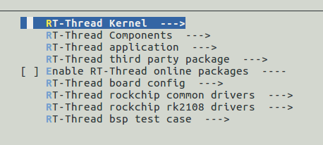

# **RT-Thread开发向导**

发布版本：1.0

作者邮箱：<cmc@rock-chips.com>

日期：2019.02

文件密级：内部资料

---

**前言**

**概述**

**产品版本**

| **芯片名称**  | **RT-Thread版本** |
| ------------- | ----------------- |
| RK2108/Pisces | 3.11/4.0          |

**读者对象**

本文档（本指南）主要适用于以下工程师：

软件开发工程师

**修订记录**

| **日期**   | **版本** | **作者** | **修改说明**                       |
| ---------- | -------- | -------- | ---------------------------------- |
| 2019-02-20 | V1.0     | 陈谋春   | 初始版本                           |
| 2019-04-30 | v1.1     | 陈谋春   | 更新公共驱动路径                   |
| 2019-05-14 | v1.2     | 陈谋春   | 更新测试用例描述，增加调试说明     |
| 2019-06-17 | v1.3     | 陈谋春   | 更新模块配置说明，增加编译脚本配置 |
| 2019-07-08 | v1.4     | 陈谋春   | 增加静态库编译说明                 |

---

[TOC]

---

## 1 介绍

   RT-Thread是一个开源的RTOS，主要开发成员来自中国，大家主要利用业余时间进行RT-Thread的开发和维护，同时也接受开发者，爱好者，以及专业嵌入式领域公司向RT-Thread捐赠代码。目前我司只有RK2108支持，后续其他MCU芯片可能也会加入。

## 2 Pisces和RK2108

   二者本质上是同一颗芯片，其中Pisces是给OPPO专用，RK2108则是我们内部或其他客户使用的，主要区别是后者多了一些特有的驱动，如SDIO、SFC等。

## 3 准备工作

### 3.1 下载工程

   目前RT-Thread的移植实际上被我们分成两个部分，HAL(Hardware abstraction layer)和BSP(Board Support Package)，前者是各个IP基本功能的实现，目标是能无缝兼容不同的RTOS，后者则实现了HAL和RT-Thread系统的桥接，包括各种驱动的注册和整个系统的启动引导。现在这两个部分是分成两个仓库，独立维护的。

   所以下载也需要分开，具体命令如下：

```shell
 git clone ssh://<USERNAME>@10.10.10.29:29418/rtos/rt-thread/rt-thread
 cd rt-thread
 git checkout develop
 cd bsp/rockchip-common
 git clone ssh://<USERNAME>@10.10.10.29:29418/rk/mcu/hal
```

   ==Note: clone的时候需要把用户名换成自己的，不要修改HAL的目标路径，因为BSP是通过符号链接来找到HAL的。==

### 3.2 编译环境配置

   目前有两台服务器：172.16.12.243和10.10.10.110，都已经搭建好RT-Thread的编译环境，所以使用这两个服务器的工程师可以跳过这一节，直接开始开发。

   RT-Thread使用SCons作为编译脚本，并支持ARMCC、GCC、IAR三种编译器，我们主要用GCC来开发，所以这里以GCC举例，后续如果确实有另外两个编译的需求，会在补上配置。最后还需要安装两个代码格式检查工具，具体的安装配置命令如下：

```shell
sudo add-apt-repository ppa:team-gcc-arm-embedded/ppa
sudo apt-get update
sudo apt-get install gcc-arm-embedded scons clang-format astyle
```

### 3.3 编译

   传统开源软件一般用Makefile作为编译脚本，如Linux，有些会加上Autoconf、Automake来实现更灵活方便的配置和编译；而RT-Thread用SCons来实现编译控制，SCons是一套由Python语言编写的开源构建系统，类似于GNU Make。它采用不同于通常Makefile文件的方式，而使用SConstruct和SConscript文件来替代。这些文件也是Python脚本，能够使用标准的Python语法来编写。所以在SConstruct、SConscript文件中可以调用Python标准库进行各类复杂的处理，而不局限于Makefile设定的规则。

   编译命令如下：

```shell
cd bsp/rockchip-pisces
scons -j8
```

   以上命令将会用默认的配置来编译，最后会在当前目录下生成如下文件：

```shell
ls -l rtthread*
-rwxrwxr-x 1 cmc cmc 599616 Feb 15 19:45 rtthread.elf
-rw-rw-r-- 1 cmc cmc 489470 Feb 15 19:45 rtthread.map
-rwxrwxr-x 1 cmc cmc  56760 Feb 15 19:45 rtthread.bin
```

   其中rtthread.bin是我们下载到机器上的二进制固件，另外两个分别是ELF文件和符号表。

   SCons构建系统默认是通过MD5来判断文件是否需要重新编译，如果你的文件内容没变，而只是时间戳变了（例如通过touch去更新时间戳），是不会重新编译这个文件及其依赖的。还有就是如果只修改无关内容，例如代码注释，则只会编译，而不会链接，因为obj文件内容没变。同时我有收到几次反馈，代码内容有变，但是没有重新编译，暂时还没有找到问题规律，所以不好查，在开发过程中如果碰到这种异常情况，建议做一次清理，命令如下：

```shell
scons -c
```

   如果做完上面的清理以后，还有异常，可以强制删除所有中间文件，命令如下：

```shell
rm -rf build
```

   其他SCons命令，可以看帮助或文档

```shell
scons -h
```

### 3.4 静态库编译

   RT-Thread支持静态库编译，==模块可以先剥离成一个独立的Group==，每一个Group都是一个独立的编译单元，可以有自己的编译标志和链接标志，也可以很方便的编译成静态库，下面以FileTest模块为例，先看看这个模块的编译脚本*/path/to/rtthread/examples/file/SConscript*，具体如下：

```python
Import('RTT_ROOT')
Import('rtconfig')
from building import *

cwd = GetCurrentDir()
src = Glob('*.c')
CPPPATH = [cwd, str(Dir('#'))]

group = DefineGroup('FileTest', src, depend = ['RT_USING_FILE_TEST'], CPPPATH = CPPPATH)

Return('group')
```

   从上面可以看到，==静态库不需要特殊的编译脚本==，也不需要设置标志说明要编译成静态库，是否编译成静态库完全取决于编译命令，例如，要把这个模块编译成一个静态库，只需要在编译的时候用如下命令：

```shell
scons --buildlib=FileTest      # FileTest即编译脚本中我们定的Group名字
```

   成功编译的话，会有如下输出：

```shell
scons: Reading SConscript files ...
scons: done reading SConscript files.
scons: Building targets ...
scons: building associated VariantDir targets: build
AR libFileTest_gcc.a
ranlib libFileTest_gcc.a
Install compiled library... FileTest_gcc
Copy libFileTest_gcc.a => /home1/rockchip/rt-thread2/examples/file/libFileTest_gcc.a
scons: done building targets.
```

   可以看到RTT直接把生成的静态库放到编译脚本的同级目录下，要使用这个静态库也简单，只需要把这个静态库加入到RTT的静态库列表中，路径加入到RTT的静态库搜索路径中，具体如下：

```python
from building import *

cwd     = GetCurrentDir()

src     = []
CPPPATH = [cwd]

LIBS    = ['libFileTest_gcc.a']
LIBPATH = []

if GetDepend('SOC_RK2108'):
    LIBPATH = [cwd + '/rk2108']

elif GetDepend('SOC_RK1808'):
    LIBPATH = [cwd + '/rk1808']

group = DefineGroup('wlan-wiced', src, depend = ['RT_USING_FILE_TEST'], CPPPATH = CPPPATH, LIBS = LIBS, LIBPATH = LIBPATH)
```

   所以，一些不想开源的模块，可以按上面的方法做成静态库，以动态库的形式对外发布。

### 3.5 模块配置

   RT-Thread沿用了Linux的Kconfig作为模块配置开关，具体命令如下：

```shell
cd bsp/rockchip-pisces
scons --menuconfig
```

   会弹出如下界面，操作方法和Linux是一样，修改配置以后保存退出，这个过程会自动重新生成一个rtconfig.h文件，这个文件包含了我们选中的各种配置，最后重新编译即可：



​    上图中各个分类的名字很清晰，这里就不具体描述了，其中前三个是RT-Thread公版的配置，后面两个是我们BSP的驱动配置和测试用例。需要额外说明的是：online packages，这些包不是随RT-Thread源码发布的，而是自己独立仓库维护，需要的时候，我们需要先在这里把配置打开，然后再通过pkgs命令下载或更新，把工程下载到本地，最后才能编译，并且这些包并不保证每个都能用，有的可能连编译都无法成功。主要是有些包编译器兼容性较差，有些则是太久没维护了。下面以Wi-Fi模块为例，演示一下具体操作：

- 先选上我们要的Wi-Fi驱动，然后退出并保存配置：


- 再通过pkgs命令下载驱动：

```shell
source ~/.env/env.sh
pkgs --update
```

- 编译

```shell
scons -j8
```

  可以看到下载下来的Wi-Fi驱动在如下目录：

```shell
/home1/rockchip/rt-thread/bsp/rockchip-pisces/packages/wlan_wiced-latest
```

   其他pkgs命令如下：

```shell
pkgs -h
usage: env.py package [-h] [--force-update] [--update] [--list] [--wizard]
                      [--upgrade] [--printenv]

optional arguments:
  -h, --help      show this help message and exit
  --force-update  force update and clean packages, install or remove the
                  packages by your settings in menuconfig
  --update        update packages, install or remove the packages by your
                  settings in menuconfig
  --list          list target packages
  --wizard        create a new package with wizard
  --upgrade       upgrade local packages list and ENV scripts from git repo
  --printenv      print environmental variables to check
```

   除了上面用到的update外，另外有几个常用：list可以看到当前我们选中的包列表；upgrade用来更新到最新的包列表，以及ENV脚本（pkgs在这里实现）；wizard是用来创建自己的包。

### 3.6 保存配置

   目前RTT的menuconfig有个缺陷：第一次执行menuconfig的时候会从网络上下载Online Package的配置，后续不手动更新的话，这些配置不会变更，这就导致了不同工程师的配置信息可能略有差异，最终导致menuconfig生成的.config和rtconfig.h包含大量无效配置，在提交的时候出现互相覆盖，下面是无效配置的例子：

```shell
/* RT-Thread online packages */

/* IoT - internet of things */

/* PKG_USING_PAHOMQTT is not set */
/* PKG_USING_WEBCLIENT is not set */
/* PKG_USING_WEBNET is not set */
/* PKG_USING_MONGOOSE is not set */
/* PKG_USING_WEBTERMINAL is not set */
/* PKG_USING_CJSON is not set */
/* PKG_USING_JSMN is not set */
/* PKG_USING_LJSON is not set */
/* PKG_USING_EZXML is not set */
/* PKG_USING_NANOPB is not set */
```

   可以通过RTT自带的两个命令来去掉这些无效配置，方法如下：

```shell
scons --genconfig                          ; 根据rtconfig.h生成不含无效配置的.config
cp .config board/xxx/defconfig             ; 保存配置为板子的默认配置
scons --useconfig=board/xxx/defconfig      ; 根据保存的配置，生成不含无效配置的rtconfig.h
```

   从上面我们可以看到SOC的BSP主目录下有一个.config文件，在执行menuconfig的时候会从中读取默认配置，保存退出的同时也会更新这个文件，我们目前用这个文件作为最小配置集合。menuconfig保存退出的时候生成的rtconfig.h实际上是根据这个文件生成的，==提交补丁的同时请不要提交.config和rtconfig.h，以防止引入有冲突的配置导致编译失败==。

### 3.7 Scons编译脚本

   大部分驱动和应用并不需要关心编译脚本，目前的编译脚本会自动搜索驱动、板级配置、应用和测试等目录的所有源文件进行编译，所以即使增加模块，一般也不需要改脚本。只有在目录结构有变更，或者需要修改编译标志的时候会需要改动编译脚本。

   BSP的主目录下有一个rtconfig.py，这里可以修改toolchain和全局的编译链接标志，具体如下：

```python
if  CROSS_TOOL == 'gcc':
    PLATFORM    = 'gcc'
    EXEC_PATH       = '/usr/bin'   # 配置toolchain的路径
elif CROSS_TOOL == 'keil':
    PLATFORM    = 'armcc'
    EXEC_PATH   = 'C:/Keil'

if os.getenv('RTT_EXEC_PATH'):
    EXEC_PATH = os.getenv('RTT_EXEC_PATH')

#BUILD = 'debug'
BUILD = 'release'            # 默认是release配置，O2优化级别

if PLATFORM == 'gcc':
    # toolchains
    PREFIX = 'arm-none-eabi-'    # 默认toolchain名字
    CC = PREFIX + 'gcc'
    AS = PREFIX + 'gcc'
    AR = PREFIX + 'ar'
    CXX = PREFIX + 'g++'
    LINK = PREFIX + 'gcc'
    TARGET_EXT = 'elf'
    SIZE = PREFIX + 'size'
    OBJDUMP = PREFIX + 'objdump'
    OBJCPY = PREFIX + 'objcopy'

    DEVICE = ' -mcpu=cortex-m4 -mthumb -mfpu=fpv4-sp-d16 -mfloat-abi=hard -ffunction-sections -fdata-sections'      # cpu相关的编译选项
    CFLAGS = DEVICE + ' -g -Wall -Wno-cpp -Werror=maybe-uninitialized -Werror=implicit-function-declaration -Werror=return-type -Werror=address -Werror=int-to-pointer-cast -Werror=pointer-to-int-cast'    # 全局编译标志
    AFLAGS = ' -c' + DEVICE + ' -x assembler-with-cpp -Wa,-mimplicit-it=thumb -D__ASSEMBLY__ '                              # 全局汇编编译标志
    LFLAGS = DEVICE + ' -lm -lgcc -lc' + ' -nostartfiles -Wl,--gc-sections,-Map=rtthread.map,-cref,-u,Reset_Handler -T gcc_arm.ld'
                               # 全局链接标志

    CPATH = ''
    LPATH = ''

    if BUILD == 'debug':
        CFLAGS += ' -O0 -gdwarf-2'
        AFLAGS += ' -gdwarf-2'
    else:
        CFLAGS += ' -O2'
```

   接下来一级的编译脚本是BSP根目录下的SConscript，具体如下：

```python
import os
Import('RTT_ROOT')

cwd = str(Dir('#'))
objs = []
list = os.listdir(cwd)

# HAL的编译脚本
objs = SConscript(os.path.join(cwd, 'HalSConscript'), variant_dir = '.', duplicate=0)

# 搜索所有包含SConscript文件的一级子目录，全部都会加入编译
for d in list:
    path = os.path.join(cwd, d)
    if os.path.isfile(os.path.join(path, 'SConscript')):
        objs = objs + SConscript(os.path.join(d, 'SConscript'))

# 添加BSP主目录外的模块：公共驱动、测试和examples
objs = objs + SConscript(os.path.join(RTT_ROOT, 'bsp/rockchip-common/drivers/SConscript'), variant_dir = 'common/drivers', duplicate=0)
objs = objs + SConscript(os.path.join(RTT_ROOT, 'bsp/rockchip-common/tests/SConscript'), variant_dir = 'common/tests', duplicate=0)
objs = objs + SConscript(os.path.join(RTT_ROOT, 'examples/kernel/SConscript'), variant_dir = 'examples/kernel', duplicate=0)

Return('objs')
```

   如果要修改某个子模块的编译标志，可以把这个子模块的编译独立一个GROUP，然后修改局部标志，下面是一个加局部宏定义的例子：

```python
Import('RTT_ROOT')
Import('rtconfig')
from building import *

cwd = GetCurrentDir()
src = Glob('*.c')
CPPPATH = [cwd]                                    # 配置头文件搜索目录，全局有效
LOCAL_CPPDEFINES = ['BOARD_M1_TEST_MARCO']         # 局部宏定义，局部有效

group = DefineGroup('BoardConfig', src, depend = ['RT_USING_BOARD_RK2108_EVB'], CPPPATH = CPPPATH, LOCAL_CPPDEFINES = LOCAL_CPPDEFINES )     # 这个宏只会在BoardConfig编译的时候生效

Return('group')
```

   其他一些局部和全部定义，可以参考下面的列表介绍：

```shell
LOCAL_CCFLAGS                                      # 局部编译标志
LOCAL_CPPPATH                                      # 局部头文件搜索路径
LOCAL_CPPDEFINES                                   # 局部宏定义
LOCAL_ASFLAGS                                      # 局部汇编标志
CCFLAGS                                            # 全局编译标志
CPPPATH                                            # 全局头文件搜索路径
CPPDEFINES                                         # 全局宏定义
ASFLAGS                                            # 全部汇编标志
```

## 4 驱动开发

   驱动的开发实际上分两个部分：HAL和Driver，前者可以参考HAL的开发指南，这里主要说明后者开发过程中的注意事项：

   首先，所有工程师开发前都应该看一下RT-Thread的coding style文档，路径如下：

```shell
cd path/to/rt-thread
ls documentation/coding_style_cn.md -l
-rw-rw-r-- 1 cmc cmc 8101 Jan  7 18:38 documentation/coding_style_cn.md
```

   tools/as.sh是RTT提供的代码风格检查的脚本，不需要手动调用astyle。

   其次，在开始开发前有必要看一下RT-Thread的官方开发指南，了解一下驱动会用的一些系统接口，例如同步与通信、内存管理和中断管理，需要后台线程的话，可以看一下系统的线程和任务管理。这些都可以在开发指南找到介绍，也有一些简单的demo可以参考。同时各类驱动，特别是总线型驱动要看一下系统是否有现成的驱动框架，如果有则要按框架要求来实现，所有的驱动框架都在path_to_rtthread/components目录下，目前可以看到如下驱动都有现成的框架：serial、can、timer、i2c、gpio、pwm、mtd、rtc、sd/mmc、spi、watchdog、audio、wifi、usb等；反之如果RT-Thread没有现成的框架，在自己实现前也可以找一下其他BSP目录下是否已经有相关驱动可以作为参考。

   目前驱动程序被分为两类：公共和私有，前者指的是多个芯片可以共用的驱动，可以放如下目录：

```shell
/home1/rockchip/rt-thread/bsp/rockchip-common/drivers
```

   而私有驱动，则只适用特定芯片，可以放到这个芯片BSP主目录下的drivers目录，例如：

```shell
/home1/rockchip/rt-thread/bsp/rockchip-rk2108/drivers
/home1/rockchip/rt-thread/bsp/rockchip-pisces/drivers
```

   所有的驱动都要以drv_xxx.c和drv_xxx.h，其中xxx为模块名或相应缩写，要求全部小写，不能有特殊字符存在，如果必要可以用"_"分割长模块名，如“drv_sdio_sd.c”。各个模块不需要修改编译脚本，目前的脚本已经可以自动搜索drivers下所有的源文件，自动完成编译，但是推荐模块加上自己的Kconfig配置开关，并且考虑多芯片之间的复用，方便裁剪和调试，具体可以参考如下实现：

```shell
$ cat drivers/Kconfig
menu "RT-Thread bsp drivers"

config RT_USING_UART0
    bool "Enable UART0"
    default y

config RT_USING_UART1
    bool "Enable UART1"
    default y

config RT_USING_UART2
    bool "Enable UART2"
    depends on RKMCU_RK2108
    default y

config RT_USING_DSP
    bool "Enable DSP"
    default n

endmenu
```

   此外，HAL目前是通过hal_conf.h来做模块开关的，为了方便配置，可以让Kconfig和hal_conf.h做一个关联，例如串口的hal_conf.h配置如下：

```c
#if defined(RT_USING_UART0) || defined(RT_USING_UART1) || defined(RT_USING_UART2)
#define HAL_UART_MODULE_ENABLED
#endif
```

   驱动的源文件drv_xxx.c，一定要用Kconfig的开关包起来，并且公共驱动要考虑多芯片复用，例如：

```c
#if defined(RT_USING_I2C)

#if defined(RKMCU_PISCES)
void do_someting(void)
{

}
#endif

#endif
```

   如果驱动有汇编文件，尽量三种编译器都支持：gcc、keil(armcc)、iar，文件名可以按如下规则：xxx_gcc.S、xxx_arm.s、xxx_iar.s，目前汇编文件不会自动加入编译，要手动修改编译脚本，参考bsp/rockchip-pisces/drivers/SConscript：

```python
Import('RTT_ROOT')
Import('rtconfig')
from building import *

cwd     = os.path.join(str(Dir('#')), 'drivers')

src = Glob('*.c')
if rtconfig.CROSS_TOOL == 'gcc':
    src += Glob(RTT_ROOT + '/bsp/rockchip-common/drivers/drv_cache_gcc.S')
elif rtconfig.CROSS_TOOL == 'keil':
    src += Glob(RTT_ROOT + '/bsp/rockchip-common/drivers/drv_cache_arm.s')
elif rtconfig.CROSS_TOOL == 'iar':
    src += Glob(RTT_ROOT + '/bsp/rockchip-common/drivers/drv_cache_iar.s')

CPPPATH = [cwd]

group = DefineGroup('PrivateDrivers', src, depend = [''], CPPPATH = CPPPATH)

Return('group')
```

   还有就是设备驱动中的定时器延迟，可以简单的使用系统的tick，如rt_thread_delay和rt_thread_sleep来实现，但注意不能在中断上下文使用，也不能用rt_tick_get代替，因为默认情况tick中断的优先级不会比其他中断高，有可能出现某个中断太耗时，导致tick出现没有及时更新的情况。中断上下文可以用循环来实现一个简单延迟，例如：

```c
static void udelay(unsigned long usec) {
  unsigned long count = 0;
  unsigned long utime = SystemCoreClock / 1000000 * usec;

  while(++count < utime) ;
}
```

   最后，RT-Thread提供了一个自动初始化的接口，驱动如果需要自动初始化，可以调用这些宏：

```c
/* board init routines will be called in board_init() function */
#define INIT_BOARD_EXPORT(fn)           INIT_EXPORT(fn, "1")

/* pre/device/component/env/app init routines will be called in init_thread */
/* components pre-initialization (pure software initilization) */
#define INIT_PREV_EXPORT(fn)            INIT_EXPORT(fn, "2")
/* device initialization */
#define INIT_DEVICE_EXPORT(fn)          INIT_EXPORT(fn, "3")
/* components initialization (dfs, lwip, ...) */
#define INIT_COMPONENT_EXPORT(fn)       INIT_EXPORT(fn, "4")
/* environment initialization (mount disk, ...) */
#define INIT_ENV_EXPORT(fn)             INIT_EXPORT(fn, "5")
/* appliation initialization (rtgui application etc ...) */
#define INIT_APP_EXPORT(fn)             INIT_EXPORT(fn, "6")
```

   如上所示，其初始化顺序是从上到下，我们约定BOARD组只放板级的初始化如CLK，需要注意在BOARD组的初始化过程中由于系统调度子系统还没有初始化，不能使用系统的互斥和同步模块，如MUTEX等，此时系统的中断还没有开，所有操作都是串行的，不需要考虑并发和竞争。而PREV组我们可以放一些总线驱动的初始化，如I2C、SDIO等，而大部分设备驱动用INIT_DEVICE_EXPORT就够了。

   如果两个模块有先后顺序以来，可以放到上面的不同初始化组里，来控制顺序。当然也自己在代码里去控制，举例，如果有两个模块A和B，A的初始化依赖于B的初始化，则最好只把B的初始化EXPORT出来，然后在B里再去调用A的初始化。

   还有一个提示，目前驱动引用HAL的头文件，只需要加“hal_base.h"，而不需要另外在包含芯片头文件，因为会自动根据"hal_conf.h"的定义来包含芯片头文件，例如：

```shell
#include <pisces.h>   /*这一句是可以去掉的*/
#include <rtdevice.h>
#include <rtthread.h>
#include "hal_base.h"
```

## 5 测试用例

   提交驱动的同时，最好同步提交测试程序，目前我们的BSP测试被分为两个部分：公共和私有，前者是可以多个芯片共用的测试，后者是这个芯片特有的测试，目录分别如下：

```shell
/home1/rockchip/rt-thread/bsp/rockchip-common/tests
/home1/rockchip/rt-thread/bsp/rockchip-pisces/tests
```

   可以把测试程序做成RTT的shell命令，文件名可以命名为tc_xxx.c，其中xxx是模块名，例如串口可以用tc_uart.c。下面是一个简单例子：

```c
#include <rthw.h>
#include <rtthread.h>

/* 可以沿用驱动的宏定义开关，确保在驱动未启用的时候不会被编译 */
#ifdef RT_USING_DEMO_TEST

#include <stdint.h>

void demo_test(void)
{
    rt_kprintf("this is demo_test\n");
}

#ifdef RT_USING_FINSH
#include <finsh.h>
/* 导出finsh shell命令：demo_test, 系统默认是msh shell看不到，推荐使用 */
FINSH_FUNCTION_EXPORT(demo_test, demo test for driver);
/* 导出msh shell命令：demo_test, 一般只要导出到一个shell就够了 */
MSH_CMD_EXPORT(dma_test, demo test for driver);
#endif

#endif
```

   要启动测试，只需要在命令行按如下命令操作：

```shell
msh /> demo_test
this is demo_test
msh /> exit
finsh >> demo_test()
this is demo_test
```

   ==注意，默认配置下启用的msh，如果测试用例导出到finsh，需要先通过exit命令推出msh，会自动切到finsh。要重新切回msh，可以输入msh()==

 测试用例如果需要传参数，可以这样修改：

```c
int demo_test(char* param)
{
    printf("%s world\n", param);
    return 0;
}
FINSH_FUNCTION_EXPORT(demo_test, demo test for driver);
```

   测试命令如下：

```shell
msh /> exit
finsh >> demo_test("hello")
hello world
finsh >> msh()
msh />
```

   RTT还提供了一个简单的测试框架，通过RT_USING_TC来开启，具体实现在：*/path/to/rt-thread/examples/kernel/tc_comm.c*，方便多个测试用例的集成，下面是一个简单的例子，定义了一个_tc_sample的测试用例，完整代码请参考*/path/to/rt-thread/examples/kernel/tc_sample.c*：

```c
int _tc_sample()
{
    /* 通过测试框架，设置测试用例的清理函数，如内存释放，线程清理等 */
    tc_cleanup(_tc_cleanup);
    /* 实际测试用例的实现，可以直接调用，可以创建一个线程调用（比如默认线程的堆栈太小） */
    sample_init();

    return 25;
}
/* 命名必须以_tc_开头，否则测试框架不认 */
FINSH_FUNCTION_EXPORT_ALIAS(_tc_sample, __cmd__tc_sample, a thread testcase example.);
```

   下面是通过测试框架来调用的命令：

```shell
msh /> exit
finsh >> list_tc()            ； 列出所有测试用例
__cmd__tc_sample
finsh >> tc_start("sample")   ； 调用测试用例“sample”
finsh >> tc_loop("sample")    ;  循环调用测试用例"sample"
```

   通过测试框架调用测试的时候，不需要给出完整的测试用例名称，例如上面的例子，如果只给"samp"，效果也是一样，所以这里要求我们的测试用例如果调用测试框架，都要遵守如下命名规则：_tc_bsp_module_name，其中bsp表示这是一个bsp测试，module是这个测试的模块如uart、spi等，name则是测试用例的名字。这样就可以用这个实现分级分类调用，例如：

```shell
msh /> exit
finsh >> list_tc()
_tc_bsp_spi_test1
_tc_bsp_spi_test2
_tc_bsp_i2c_test1
finsh >> tc_start("bsp")      ;  遍历所有bsp测试用例
finsh >> tc_start("bsp_spi")  ;  遍历所有spi测试用例
```

## 6 调试

### 6.1 内存问题

   针对最常见的两种内存问题：内存泄漏和访问越界，RTT都提供了辅助调试手段，需要打开RT_USING_MEMTRACE开关，具体如下：


   重新编译后，MSH会多出两个命令：memtrace和memcheck，前者可以导出当前系统的动态内存分配情况，包括当前已用内存大小、最大使用内存大小和内存跟踪情况，具体如下：


   根据上面的信息，可以找到哪个线程吃掉太多内存，也可以找到内存泄漏的可疑线程名称和内存块大小，有了这些信息就可以大大缩小排查范围。

   memcheck是用来检查越界访问的情况，下面是一个越界访问的例子：

```c
void test_mem(void)
{
  uint32_t *test = NULL;

  test = (uint32_t *)rt_malloc(16);
  test[4] = 0x55aa55aa;
}
```

   放到shell里执行后，执行memcheck，可以看到如下输出：

```shell
Memory block wrong:
address: 0x62028968
  magic: 0x55aa
   used: 21930
  size: 1136
  thread:
Prev:
address: 0x62028948
  magic: 0x1ea0
   used: 1
  size: 16
  thread: tsh
Next:
address: 0x62028de8
  magic: 0x1ea0
   used: 1
  size: 32
  thread: init
```

   分析可以得到如下信息：

```shell
出错地址：0x62028968
出错原因：magic和used被冲，怀疑前面地址越界访问
前面地址：0x62028948，大小为16，线程是tsh，根据这些信息可以缩小范围
```

   ==需要注意的，memcheck只能检查一小部分的内存越界，即刚好冲了内存块管理结构的前12字节才能检查到，所以即使memcheck没检查出错误，也不代表没有越界存在。==

### 6.2 死锁问题

   对于死锁问题，RTT也提供了几个命令，可以列出所有的任务同步和通信的状态，通过这些就可以比较容易定位死锁关系：两个死锁线程的名字，死锁的锁名字，这些信息可以大幅缩小排查范围，具体命令如下：

```shell
msh >list_msgqueue
msgqueue entry suspend thread
-------- ----  --------------
msh >list_mailbox
mailbox entry size suspend thread
------- ----  ---- --------------
msh >list_mutex
mutex      owner  hold suspend thread
-------- -------- ---- --------------
snorLock (NULL)   0000 0
msh >list_event
event      set    suspend thread
-----  ---------- --------------
msh >list_sem
semaphore v   suspend thread
-------- --- --------------
shrx     000 0
heap     001 0
```

### 6.3 模块调试

   RTT提供了大部分内核模块的调试log开关，默认情况下都是关闭的，开发者可以根据需求打开，具体如下：

```c
#define RT_DEBUG     // 总开关
#define RT_DEBUG_COLOR   // log颜色开关，调用dbg_log(level, fmt, ...)等接口，不同level会显示不同颜色
#define RT_DEBUG_INIT_CONFIG  // 开机初始化调试信息
#define RT_DEBUG_THREAD_CONFIG   // 线程状态切换信息，包括start，suspend和resume
#define RT_DEBUG_SCHEDULER_CONFIG    // 调度器调试信息
#define RT_DEBUG_IPC_CONFIG   // 所有任务同步和通信机制的调试信息，调试死锁的时候可以看看
#define RT_DEBUG_TIMER_CONFIG  // 定时器相关信息
#define RT_DEBUG_IRQ_CONFIG   // 调试中断嵌套时可以打开
#define RT_DEBUG_MEM_CONFIG   // 动态内存分配调试信息
#define RT_DEBUG_SLAB_CONFIG  // slab分配器调试信息
#define RT_DEBUG_MEMHEAP_CONFIG   // 内存堆调试信息
#define RT_DEBUG_MODULE_CONFIG   // 动态模块加载的相关信息
```

### 6.4 Fault调试

   目前我们默认启用了CMBacktrace，出现Fault后会自动打印堆栈和调用信息，可以用自带的测试命令cmb_test来看dump的格式，具体如下：

```shell
msh >cmb_test DIVBYZERO
thread pri  status      sp     stack size max used left tick  error
------ ---  ------- ---------- ----------  ------  ---------- ---
tshell  20  ready   0x00000090 0x00001000    06%   0x0000000a 000
dma     10  suspend 0x0000005c 0x00000100    35%   0x0000000a 000
tidle   31  ready   0x00000050 0x00000100    43%   0x00000001 000
Firmware name: rtthread, hardware version: 1.0, software version: 1.0
Fault on thread tshell
===== Thread stack information =====
  addr: 20023040    data: 00000000
  addr: 20023044    data: 00000000
  addr: 20023048    data: 040095a6
  addr: 2002304c    data: 20020910
  addr: 20023050    data: 80000000
  addr: 20023054    data: 00000002
  addr: 20023058    data: 04019f6c
  addr: 2002305c    data: 04019f00
  addr: 20023060    data: 04019fd8
  addr: 20023064    data: deadbeef
  addr: 20023068    data: 20021fb0
  addr: 2002306c    data: 0400c329
  addr: 20023070    data: deadbeef
  addr: 20023074    data: 0dadbeef
  addr: 20023078    data: deadbeef
  addr: 2002307c    data: deadbeef
  addr: 20023080    data: deadbeef
  addr: 20023084    data: deadbeef
  addr: 20023088    data: deadbeef
  addr: 2002308c    data: deadbeef
  addr: 20023090    data: deadbeef
  addr: 20023094    data: deadbeef
  addr: 20023098    data: deadbeef
  addr: 2002309c    data: 0400afb1
====================================
=================== Registers information ====================
  R0 : 00000000  R1 : 0401836c  R2 : 0000000a  R3 : 00000000
  R12: ffffffff  LR : 04010aa1  PC : 04010abe  PSR: 61080000
==============================================================
Usage fault is caused by Indicates a divide by zero has taken place (can be set only if DIV_0_TRP is set)
Show more call stack info by run: addr2line -e rtthread.elf -a -f 04010abe 04010a9d 0400c325 0400afad
```

   最后一行的命令直接复制到bsp的主目录下执行，就可以看到错误时候的堆栈，从而找到错误位置：

```shell
cd /path_to_rtthread_home/bsp/rockchip-pisces
addr2line -e rtthread.elf -a -f 04010abe 04010a9d 0400c325 0400afad
```

### 6.5 Backtrace

   为了方便调试，我们封装了一个简单的Backtrace，提供打印堆栈和高级ASSERT功能如下：

```c
void dump_call_stack(void);

#define RT_BACKTRACE_ASSERT(EX)
```
