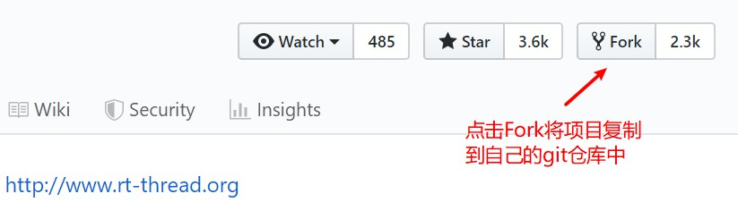
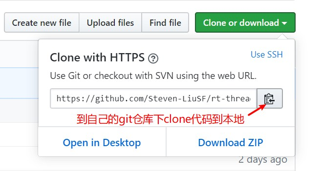
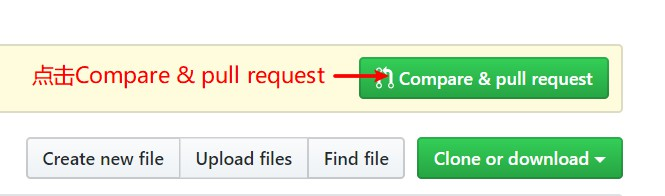
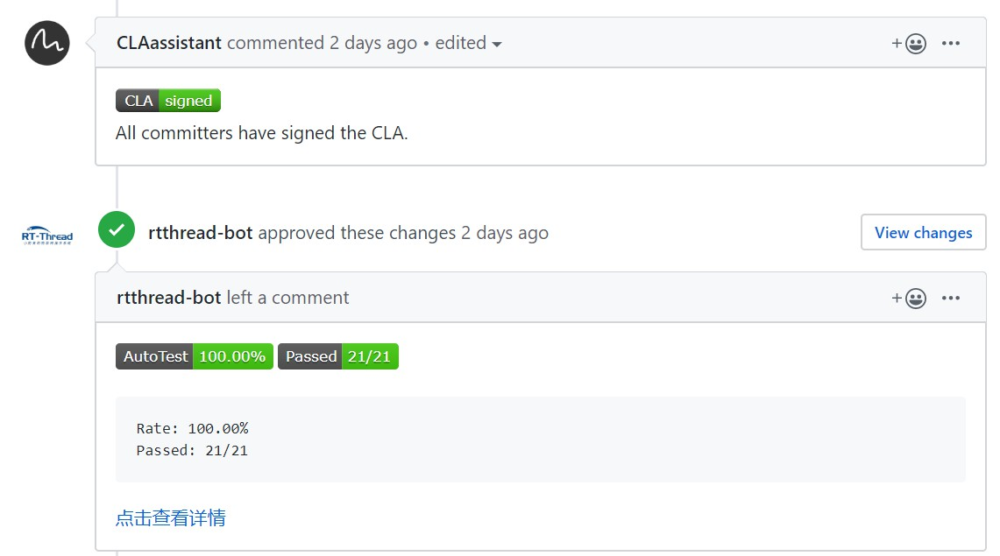
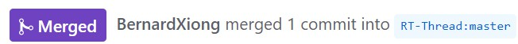

# RT-Thread Upstream 指南

发布版本：1.0

作者邮箱：<steven.liu@rock-chips.com>

日期：2019.11

文件密级：内部资料

---

**前言**

**概述**

**产品版本**

| **支持芯片**  | **RT-Thread 版本** |
| ------------- | ------------------ |
| RK2108/Pisces | 3.11/master        |
| RK2206/Canary | 3.11/master        |

**读者对象**

本文档（本指南）主要适用于以下工程师：

软件开发工程师

**修订记录**

| **日期**   | **版本** | **作者** | **修改说明** |
| ---------- | -------- | -------- | ------------ |
| 2019-11-13 | V1.0     | 刘诗舫   | 初始版本     |

---

[TOC]

---

## 1 介绍

RT-Thread是一个开源的RTOS，具有体积小，成本低，功耗低、启动快速等特点，广泛应用于MCU。RT-Thread代码仓库存放在GitHub上，由上海睿赛德电子科技有限公司主要维护，并处于持续更新中。随着我司RK2108、RK2206等MCU的加入，需要对部分代码进行Upstream。

## 2 准备工作

### 2.1 fork rt-thread仓库

使用自己的GitHub账号，fork [rt-thread仓库](https://github.com/RT-Thread/rt-thread)到自己的git仓库。


### 2.2 clone rt-thread仓库

到自己的git仓库下clone代码到本地。


```
git clone https://github.com/Steven-LiuSF/rt-thread.git
```

### 2.3 创建本地分支

切换到master开发分支，从master分支创建本地分支，创建的本地分支名称需要有意义。

```
git checkout master
git checkout -b fix-name
```

### 2.4 开发并提交commit

软件开发工程师对相关模块进行开发，并提交commit。RT-Thread代码编程风格请参考 rt_thread项目documentation目录下的coding_style_cn.txt文件。如果本地分支有多个commit，需要重新整理这些commit，RT-Thread不接受Pull Request有超过5个及以上个commit。

```
git commit -a -m 'commit message'
```

### 2.5 Push到远程仓库

Push到自己的git远程仓库中的同名分支，git会自动创建新的分支。填写自己GitHub的账号和密码。

```
git push origin fix-name
Username for 'https://github.com': Steven-LiuSF
Password for 'https://Steven-LiuSF@github.com':
```

## 3 Pull Request

### 3.1 发起Pull Request

Pull Request指推送请求，开发者发起Pull Request请求仓库维护人员采用自己提交的代码。Push之后能在自己的git仓库看到Compare & pull request.


### 3.2 填写PR description并创建Pull Request

根据要求填写PR description并核对checklist。在没问题的checklist对应选项复选框填写[x]确认，注意[x]两边没有空格。全部完成后创建Pull Request。


### 3.3 签署 CLA

首次进行RT-Thread Upstream需要签署CLA（Contributor License Agreement）。签署完成后等待编译通过。


### 3.4 审核代码

等待[BernardXiong](https://github.com/BernardXiong)等RT-Thread维护人员对提交的代码进行审核。期间可在Pull Request下的Conversation进行交流，根据修改意见做进一步的代码修改。最终Pull Request会被Merge或者Abandon。Pull Request审核没有问题的代码会被合并到RT-Thread仓库中。至此，整个Upstream流程完成。


## 参考资料

[向RT-Thread贡献代码](https://www.rt-thread.org/document/site/development-guide/github/github/#_5)

[GitHub-对项目做出贡献](https://git-scm.com/book/zh/v2/GitHub-对项目做出贡献)