# Rockchip Application Notes Storage

文件标识:  RK-SM-YF-017

发布版本：1.1.0

日期：2021-03-02

文件密级：□绝密   □秘密   □内部资料   ■公开

**免责声明**

本文档按“现状”提供，瑞芯微电子股份有限公司（“本公司”，下同）不对本文档的任何陈述、信息和内容的准确性、可靠性、完整性、适销性、特定目的性和非侵权性提供任何明示或暗示的声明或保证。本文档仅作为使用指导的参考。

由于产品版本升级或其他原因，本文档将可能在未经任何通知的情况下，不定期进行更新或修改。

**商标声明**

“Rockchip”、“瑞芯微”、“瑞芯”均为本公司的注册商标，归本公司所有。

本文档可能提及的其他所有注册商标或商标，由其各自拥有者所有。

**版权所有 © 2020 瑞芯微电子股份有限公司**

超越合理使用范畴，非经本公司书面许可，任何单位和个人不得擅自摘抄、复制本文档内容的部分或全部，并不得以任何形式传播。

瑞芯微电子股份有限公司

Rockchip Electronics Co., Ltd.

地址：     福建省福州市铜盘路软件园A区18号

网址：     [www.rock-chips.com](http://www.rock-chips.com)

客户服务电话： +86-4007-700-590

客户服务传真： +86-591-83951833

客户服务邮箱： [fae@rock-chips.com](mailto:fae@rock-chips.com)

---

**前言**

**概述**

本文主要指导读者了解启动流程，对存储进行配置和调试。

本文档不尽详实内容还可以参考下列文档：

| 序号 | 文档名称                                      | 内容概要                |
| ---- | --------------------------------------------- | ----------------------- |
| 1    | 《Rockchip_Introduction_Partition》           | 介绍分区配置            |
| 2    | 《Rockchip-Developer-Guide-UBoot-nextdev-CN》 | uboot 开发文档          |
| 3    | 《RK Vendor Storage Application Note》        | Vendor Stroage 应用文档 |
| 4    | 《Rockchip量产烧录指南_v1.2》                 | 量产烧录指南            |

**各芯片 feature 支持状态**

| **芯片名称** | **内核版本** |
| ------------ | ------------ |
| 所有产品     | --           |

**读者对象**

本文档（本指南）主要适用于以下工程师：

技术支持工程师

软件开发工程师

**修订记录**

| **版本号** | **作者**       | **修改日期** | **修改说明**       |
| ---------- | -------------- | :----------- | ------------------ |
| V1.00      | 赵仪峰、林鼎强 | 2018-08-25   | 初始版本           |
| V1.10      | 赵仪峰         | 2021-03-02   | 增加RK3566和RK3568 |

---

**目录**

[TOC]

---

## 设备启动流程

启动流程是指系统上电到系统启动完成的一个软件流程，下面是 linux 系统启动流程：

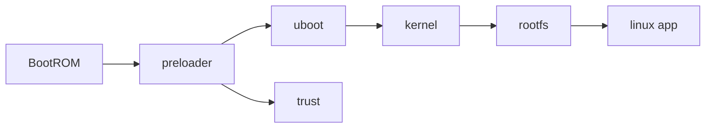

### RK SOC BOOTROM Boot 支持状态

| **芯片名称**  | **Emmc Boot** | **Nand Boot** | **SPI NAND Boot** | **SD Boot** | SPI NOR Boot   |
| ------------- | ------------- | ------------- | ----------------- | ----------- | -------------- |
| RV1108        | Y             | Y             | Y                 | Y           | Y              |
| RV1126/RV1109 | Y             | Y             | Y                 | Y           | Y              |
| RK2108        | Y             | N             | N                 | N           | Y              |
| RK2206        | Y             | N             | N                 | Y           | Y              |
| RK3036        | Y             | Y             | Y                 | Y           | Y              |
| RK3126C       | Y             | Y             | Y<sup>*1</sup>    | Y           | Y              |
| RK3128        | Y             | Y             | Y                 | Y           | Y              |
| RK3229        | Y             | Y             | Y<sup>*1</sup>    | Y           | Y              |
| RK3288        | Y             | Y             | Y                 | Y           | Y              |
| RK3308        | Y             | Y             | Y                 | Y           | Y              |
| RK3326/PX30   | Y             | Y             | Y<sup>*1</sup>    | Y           | Y              |
| RK3328        | Y             | N             | Y<sup>*1</sup>    | Y           | Y              |
| RK3368/PX5    | Y             | Y             | Y<sup>*1</sup>    | Y           | Y<sup>*1</sup> |
| RK3399        | Y             | N             | Y<sup>*1</sup>    | Y           | Y              |
| RK3568/RK3566 | Y             | Y             | Y                 | Y           | Y              |

*1： 芯片硬件支持，SDK release 开发包未做支持。

### RK SOC 存储接口规格

| AP            | NANDC              | SPI0 | SPI1 | SPI2 | SFC  | SD     | SDIO     | EMMC        | USB0          | USB1          |
| ------------- | ------------------ | ---- | ---- | ---- | ---- | ------ | -------- | ----------- | ------------- | ------------- |
| RK3188        | 60bits MLC SLC     | Boot |      | -    | -    | SD 3.0 | SDIO 3.0 | SD50 DDR50  | 2.0 Host      | 2.0 OTG       |
| RK3128        | 60bits MLC SLC     |      | -    | -    | Boot | SD 3.0 | SDIO 3.0 | SD50 DDR50  | 2.0 Host      | 2.0 OTG       |
| RK3126        | 60bits MLC SLC     |      | -    | -    | Boot | SD 3.0 | SDIO 3.0 | SD50 DDR50  | 2.0 Host      | 2.0 OTG       |
| RK3036        | 60bits MLC SLC     |      | -    | -    | Boot | SD 3.0 | SDIO 3.0 | SD50 DDR50  | 2.0 Host      | 2.0 OTG       |
| RK3288        | 60bits MLC SLC     |      |      | Boot | -    | SD 3.0 | SDIO 3.0 | HS200       | 2.0 Host      | 2.0 OTG       |
| RK3399        | -                  | -    | Boot | -    | -    | SD 3.0 | SDIO 3.0 | HS400 HS200 | 3.0 OTG TYPEC | 3.0 OTG TYPEC |
| RK3368        | 60bits MLC SLC     |      |      |      | Boot | SD 3.0 | SDIO 3.0 | HS200       | 2.0 Host      | 2.0 OTG       |
| RK3228 RK3229 | 60bits MLC SLC     | Boot | -    | -    | -    | SD 3.0 | SDIO 3.0 | HS200       | 2.0 Host      | 2.0 OTG       |
| RK3328        | -                  |      |      | Boot |      | SD 3.0 | SDIO 3.0 | HS200       | 2.0 Host      | 3.0 OTG       |
| RK3228H       | -                  |      |      | Boot |      | SD 3.0 | SDIO 3.0 | HS200       | 2.0 Host      | 3.0 OTG       |
| RK3128X       | 60bits MLC SLC     | Boot | -    | -    | -    | SD 3.0 | SDIO 3.0 | SD50 DDR50  | 2.0 Host      | 2.0 OTG       |
| RV1107 RV1108 | 16bits SLC         |      |      |      | Boot | SD 3.0 | SDIO 3.0 | HS200       | -             | 2.0 OTG       |
| RV1109 RV1126 | 16bits SLC         |      |      |      | Boot | SD 3.0 | SDIO 3.0 | HS200       | -             | 2.0 OTG       |
| RK3308        | 16bits SLC         |      |      |      | Boot | SD 3.0 | SDIO 3.0 | HS200       |               |               |
| RK3326        | 70bits TLC MLC SLC |      |      |      | Boot | SD 3.0 | SDIO 3.0 | HS200       |               |               |
| RKPX3         | 60bits MLC SLC     | Boot |      | -    | -    | SD 3.0 | SDIO 3.0 | SD50 DDR50  | 2.0 Host      | 2.0 OTG       |
| RKPX3SE       | 60bits MLC SLC     |      |      |      | Boot | SD 3.0 | SDIO 3.0 | SD50 DDR50  |               |               |
| RKPX5         | 60bits MLC SLC     |      |      |      | Boot | SD 3.0 | SDIO 3.0 | HS200       | 2.0 Host      | 2.0 OTG       |
| RKPX30        | 70bits TLC MLC SLC |      |      |      | Boot | SD 3.0 | SDIO 3.0 | HS200       |               |               |
| RK1608        | -                  | Boot | -    | -    | -    | -      | -        | -           |               |               |
| RK1808        | -                  |      |      |      | Boot | -      | -        | HS200       |               |               |
| RK3568 RK3566 | 70bits TLC MLC SLC |      |      |      | Boot | SD 3.0 | SDIO 3.0 | HS200       | 2.0 HOST      | 3.0 OTG HOST  |

备注：表格中SPIx 和 SFC 有 Boot 标识的表示 BOOTROM 可以从对应的 SPI/SFC 接口启动。

### BOOTROM 流程

AP 和 MCU 内部都有集成一个 BOOTROM，系统上电时先会运行 BOOTROM 代码，然后 BOOTROM 代码会探测外设存储器并加载 Loader 代码。

不同芯片，BOOTROM 探测外设存储器的顺序不同。下图是 BOOTROM 启动流程图一个例子：

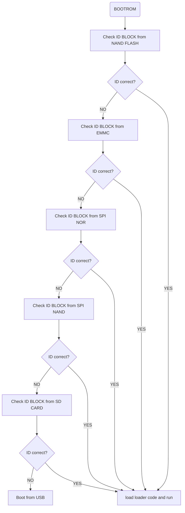

**各芯片 BOOTROM 启动顺序**

| AP        | No.1          | No.2           | No.3           | No.4           | No.5 | No.6 |
| --------- | ------------- | -------------- | -------------- | -------------- | ---- | ---- |
| RK3188    | SD0           | NAND           | SPI NOR(SPI0)  | SPI NAND(SPI0) | EMMC | USB  |
| RK3128    | NAND          | EMMC           | SPI NOR(SFC)   | SPI NAND(SFC)  | SD0  | USB  |
| RK3126(B) | NAND          | EMMC           | SPI NOR(SFC)   | SPI NAND(SFC)  | SD0  | USB  |
| RK3036    | NAND          | EMMC           | SPI NOR(SFC)   | SPI NAND(SFC)  | SD0  | USB  |
| RK3288    | NAND          | EMMC           | SPI NOR(SPI2)  | SPI NAND(SPI2) | SD0  | USB  |
| RK3399    | SPI NOR(SPI2) | SPI NAND(SPI2) | EMMC           | SD0            | USB  | --   |
| RK3368    | NAND          | EMMC           | SPI NOR(SFC)   | SPI NAND(SFC)  | SD0  | USB  |
| RK3228/9  | NAND          | EMMC           | SPI NOR(SPI2)  | SPI NAND(SPI2) | SD0  | USB  |
| RK3328    | EMMC          | SPI NOR(SPI2)  | SPI NAND(SPI2) | SD0            | USB  | --   |
| RK3228H   | EMMC          | SPI NOR(SPI2)  | SPI NAND(SPI2) | SD0            | USB  | --   |
| RK3128X/H | NAND          | EMMC           | SPI NOR(SPI2)  | SPI NAND(SPI2) | SD0  | USB  |
| RV1107/8  | NAND          | EMMC           | SPI NOR(SFC)   | SPI NAND(SFC)  | SD0  | USB  |
| RV1109    | SPI NOR(SFC)  | SPI NAND(SFC)  | NAND           | EMMC           | SD0  | USB  |
| RV1126    | SPI NOR(SFC)  | SPI NAND(SFC)  | NAND           | EMMC           | SD0  | USB  |
| RK3308    | NAND          | EMMC           | SPI NOR(SFC)   | SPI NAND(SFC)  | SD0  | USB  |
| RK3326    | NAND          | EMMC           | SPI NOR(SFC)   | SPI NAND(SFC)  | SD0  | USB  |
| RKPX3     | SD0           | NAND           | SPI NOR(SPI0)  | SPI NAND(SPI0) | EMMC | USB  |
| RKPX3SE   | NAND          | EMMC           | SPI NOR(SFC)   | SPI NAND(SFC)  | SD0  | USB  |
| RKPX5     | NAND          | EMMC           | SPI NOR(SFC)   | SPI NAND(SFC)  | SD0  | USB  |
| RKPX30    | NAND          | EMMC           | SPI NOR(SFC)   | SPI NAND(SFC)  | SD0  | USB  |
| RK1608    | SPI SLAVE     | SPI NOR(SPI2)  | SPI NAND(SPI2) | --             | --   | --   |
| RK1808    | SPI SLAVE     | SPI NOR(SFC)   | SPI NAND(SFC)  | EMMC           | USB  | --   |
| RK3399PRO | SPI NOR(SPI2) | SPI NAND(SPI2) | EMMC           | SD0            | USB  | --   |
| RK3568    | SPI NOR(SFC)  | SPI NAND(SFC)  | NAND           | EMMC           | SD0  | USB  |
| RK3566    | SPI NOR(SFC)  | SPI NAND(SFC)  | NAND           | EMMC           | SD0  | USB  |

### Pre Loader 流程

Pre Loader 目前有 3 个： miniloader（非开源）， uboot spl 和 loader（主要 RV1107/8 使用）。

#### Miniloader

Miniloader 固件是由以下分立固件合成的 RK 非开源 PreLoader 集成固件：

* ddr 初始化固件 —— ddr.bin
* 引导烧录所使用的固件 —— usbplug.bin
* 启动 loader 固件 —— miniloader.bin

其中引导烧录用的 usbplug.bin 和 miniloader.bin 不止一种实现方案。

**rkbin 仓库打包生成 Miniloader**

以 rk3308 为例，进入 SDK 中 rkbin 目录，最终生成 rk3308_loader_v1.xx.1xx.bin：

```
./tools/boot_merger ./RKBOOT/RK3308MINIALL.ini .
./tools/boot_merger ./RKBOOT/RK3308MINIALL_WO_FTL.ini . /* 尾缀为 _WO_FTL 文件、为开源存储方案选用的 Pre Loader，文件系统选择ubifs或者jaffs2 */
./tools/boot_merger ./RKBOOT/RK3326MINIALL_SLC.ini . /* 尾缀为 _SLC 文件、为小容量存储（SLC Nand、SPI Nand、SPI Nor）方案专用的 Pre Loader，内带rk ftl算法，不支持ubifs */
```

**存储探测顺序**

如同 BootRom，为兼容不同存储类型，Preloader 阶段也会去探测不同存储外设：


由于代码没有开源，用户不能自行修改启动顺序。

**启动流程**

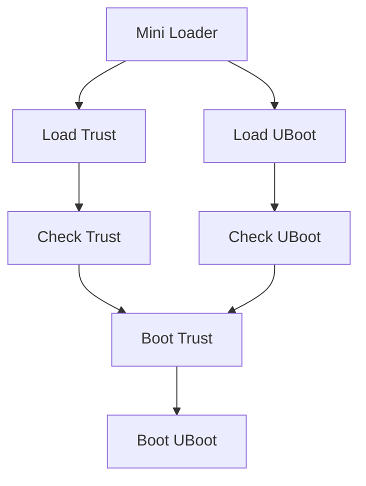

#### u-boot spl

芯片支持情况参考文档《Rockchip-Developer-Guide-UBoot-nextdev-CN》，支持 NAND 和 SPI NAND 时不带 FTL 算法，只用开源 NAND 驱动，建议使用 UBIFS 文件系统。

**存储探测顺序**


**启动流程**

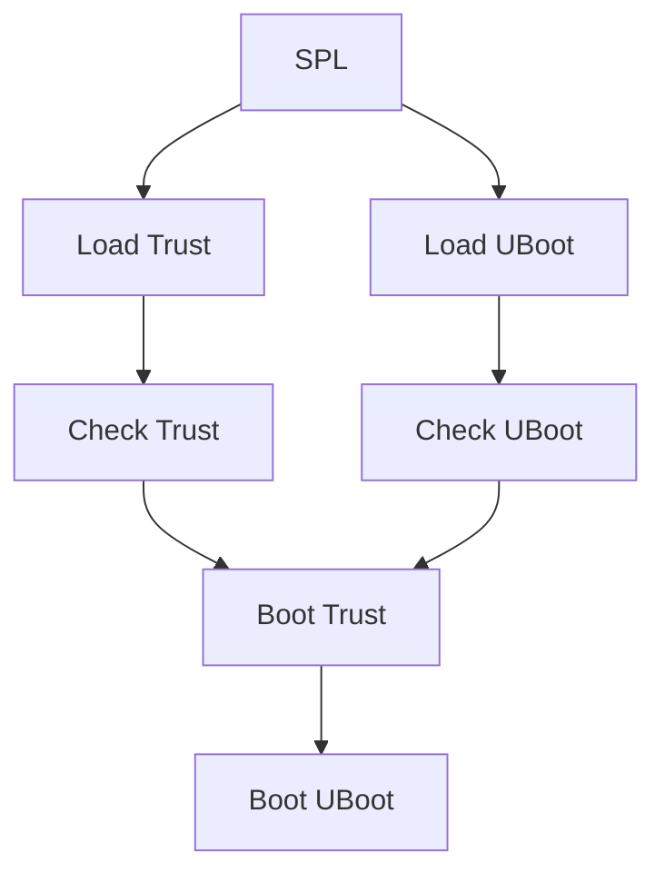

#### loader

支持 RV1107、RV1108、RK3036、RK3128 和 RK3229 等平台，一般用于支持小容量存储，不使用 uboot，直接引导 kernel。

| 芯片     | SD CARD | SLC NAND          | EMMC              | SPI NOR | SPI NAND |
| -------- | ------- | ----------------- | ----------------- | ------- | -------- |
| RV1107/8 | 支持    | 支持              | 支持              | 支持    | 支持     |
| RK3036   | 支持    | 支持<sup>*1</sup> | 支持<sup>*1</sup> | 支持    | 支持     |
| RK3128   | 支持    | 支持<sup>*1</sup> | 支持<sup>*1</sup> | 支持    | 支持     |
| RK3229   | 支持    | 支持<sup>*1</sup> | 支持<sup>*1</sup> | 支持    | 不支持   |

*1 RK3036、RK3128 和 RK3229 使用 SLC NAND 和 EMMC 的项目，一般直接用 miniloader。

**存储探测顺序**


**启动流程**

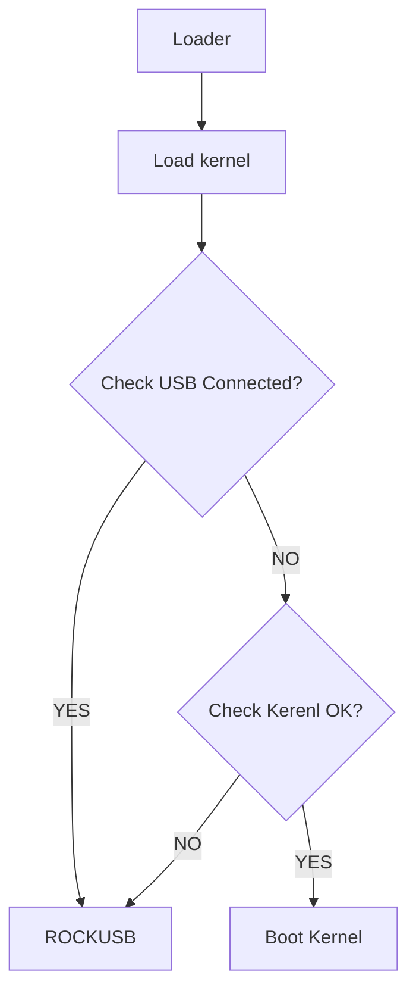

## 分区及数据存储

### 数据存储

#### 地址转换简介

如果对存储有所了解，那么应该会知道存储颗粒大多不是平坦映射，而是由用户逻辑扇区地址（lba）转换到 Flash 物理扇区地址（pba），这种映射过程即 FTL （Flash translation layer）,FTL 需要综合数据磨损、坏块管理、垃圾回收等需求进行地址转换。不论是否有 FTL，用户和文件仅需关心逻辑地址即可，而地址转换细节由软件完成。

假定用户需要访问地址 0x4000 扇区，地址转换关系如下：

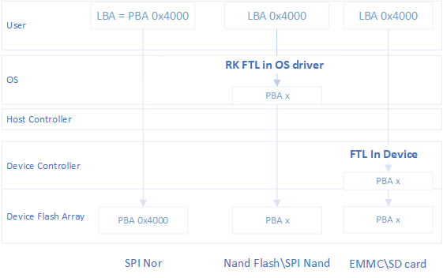

假定文件系统内接口访问地址 0x4000 扇区，地址转换关系如下：

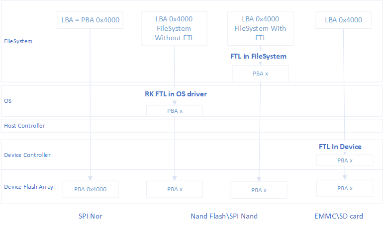

#### 分区及数据逻辑地址存储

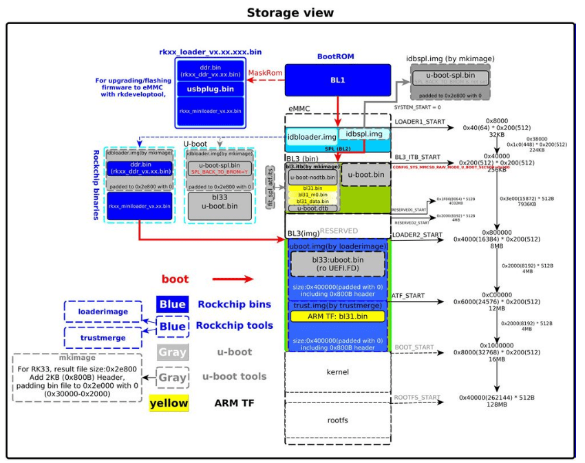

### 分区表分区

RK 存储方案中一共有 3 种分区表可固化到存储分区中：MTD Partition，GPT 和 RK partition。

详细的信息可以参考文档《Rockchip_Introduction_Partition》。

| 分区          | 说明                                                         | 适用平台             | 限制              |
| ------------- | ------------------------------------------------------------ | -------------------- | ----------------- |
| MTD Partition | parameter 文件中定义，通过 cmdline 传递，uboot-next 分支开始不再提供支持 | 所有 AP<sup>*1</sup> | 需要独立分区存放  |
| GPT           | EFI 通用分区表，uboot-next 分支支持                          | 所有 AP<sup>*2</sup> | 占用资源多一点    |
| RK partition  | 参考 GPT 设计，主要用于小容量存储，节省资源                  | RV1107/8, MCU        | RK 自定义，不通用 |

*1 使用 uboot-next 分支的平台不再支持 MTD partition，如果需要使用，需要自己适配。

*2 使用 uboot-next 分支的平台默认都是使用 GPT 做分区表，如果需要使用其他分区表，需要自己适配。

#### MTD Partition

MTD Partition 是通过 parameter 文件定义，需要烧录到 parameter 分区，loader（uboot）会解析分区表并通过 cmdline 传递给 kernel。

分区表示例：

```
FIRMWARE_VER:8.1
MACHINE_MODEL:RK3326
MACHINE_ID:007
MANUFACTURER: RK3326
MAGIC: 0x5041524B
ATAG: 0x00200800
MACHINE: 3326
CHECK_MASK: 0x80
PWR_HLD: 0,0,A,0,1
CMDLINE:mtdparts=rk29xxnand:0x00002000@0x00004000 (uboot),0x00002000@0x00006000 (trust),0x00002000@0x00008000 (misc),0x00008000@0x0000a000 (resource),0x00010000@0x00012000 (kernel),0x00010000@0x00022000 (boot),0x00020000@0x00032000 (recovery),0x00038000@0x00052000 (backup),0x00002000@0x0008a000 (security),0x000c0000@0x0008c000 (cache),0x00300000@0x0014c000 (system),0x00008000@0x0044c000 (metadata),0x000c0000@0x00454000 (vendor),0x00040000@0x00514000 (oem),0x00000400@0x00554000 (frp),-@0x00554400 (userdata)

```

mtdparts 标识固定为 rk29xxnand。

最后一个分区大小未指定，kernel 下解析时会自动根据存储设备的容量进行计算。

分区单位都是 sector（512Bytes）。

#### GPT

GPT 分区表也是通过 parameter 文件配置，结构和 MTD Partition 类似，差异的地方有四个：

1. 设置 TYPE 为 GPT。
2. 没有定义 parameter 分区（如果定义，也不会使用）。
3. 最后一个分区需要增加关键字”grow“。
4. 需要指定 rootfs 的 uuid，不同SDK可能设定值不同，需要和DTS里面定义的rootfs uuid匹配。

```
FIRMWARE_VER:8.1
MACHINE_MODEL:RK3326
MACHINE_ID:007
MANUFACTURER: RK3326
MAGIC: 0x5041524B
ATAG: 0x00200800
MACHINE: 3326
CHECK_MASK: 0x80
PWR_HLD: 0,0,A,0,1
TYPE: GPT /* GPT 分区 */
CMDLINE:mtdparts=rk29xxnand:0x00002000@0x00004000 (uboot),0x00002000@0x00006000 (trust),0x00002000@0x00008000 (misc),0x00008000@0x0000a000 (resource),0x00010000@0x00012000 (kernel),0x00010000@0x00022000 (boot),0x00020000@0x00032000 (recovery),0x00038000@0x00052000 (backup),0x00002000@0x0008a000 (security),0x000c0000@0x0008c000 (cache),0x00300000@0x0014c000 (system),0x00008000@0x0044c000 (metadata),0x000c0000@0x00454000 (vendor),0x00040000@0x00514000 (oem),0x00000400@0x00554000 (frp),-@0x00554400 (userdata:grow)
uuid:rootfs=614e0000-0000-4b53-8000-1d28000054a9

```

GPT 分区表升级流程：

1. 工具读取 parameter 里面的分区定义

2. 从 loader 处获取存储设备的容量

3. 修改最后一个分区大小并创建 gpt 分区表文件

4. 烧写分区表到存储设备的 0 地址和 - 33（末尾）地址

   注： 1. parameter 文件本身不会被烧写到存储设备中。

#### RK partition

RK 自定义的一种分区表，结构和 GPT 类似，占用资源少，初始化更快，主要用在 RV1107/8 平台和 MCU 平台。

下面为 Linux\Android 产品分区定义文件模板：

```
#Flag 目前只有两个值，1 为分区需要下载，0 为不需要下载
#type 目前有 5 种值，0x1=Vendor 分区 0x2=IDBlock 分区 0x4=Kernel 分区 0x8=boot 分区 0x80000000 = 普通分区
#PartSize 和 PartOffset 字段的值都是以扇区为单位
[System]
FwVersion=16.12.23
# 如果 Nano=1, 则生成 nano 的 idblock
Nano=
# 如果 BLANK_GAP＝1, 则生成的 idblock 按每 2k 数据间隔 2k 空白保存
BLANK_GAP=1
#FILL_BYTE 表示分区尾部空白用什么数据填充，默认为 0
FILL_BYTE=
[IDBlock]
Flag=1
DDR_Bin=rk3399_DDR_800MHz_v1.17.bin
Loader_Bin=rk3399_miniloader_spi_nor_v1.14.bin
PartOffset=0x40
PartSize=0x780
[UserPart1]
Name=trust
Type=0x10
Flag=1
File=trust_1MB.img
PartOffset=0x800
PartSize=0x800
[UserPart2]
Name=uboot
Type=0x20
Flag=1
File=uboot_1MB.img
PartOffset=0x1000
PartSize=0x800

```

下面是 RTOS 产品分区定义文件模板，其中 Flag 标志中的 bits [8,10] 规范暂时仅在 RTOS 产品有效：

```
#Flag:
#  bits filed:
#  [0]    : skip                  : 0 - disabled (default), 1 - enable
#  [2]    : no partition size     : 0 - diabled (default), 1 - enable
#  [8, 9] : property              : 0 - do not register (default), 1 - read only, 2 - write only, 3 - rw
#  [10]   : register type         : 0 - block partition (default), 1 - MTD partition
#type can suppot 32 partiton types,0x0:undefined 0x1:Vendor 0x2:IDBlock ,bit3:bit31 are available
#PartSize and PartOffset unit by sector
#Gpt_Enable 1:compact gpt,0:normal gpt
#Backup_Partition_Enable 0:no backup,1:backup
#Loader_Encrypt 0:no encrypt,1:rc4
#nano 1:generate idblock in nano format
[System]
FwVersion=1.0
Gpt_Enable=
Backup_Partition_Enable=
Nano=
Loader_Encrypt=
Chip=
Model=
[UserPart1]
Name=IDBlock
Type=0x2
PartOffset=0x80
PartSize=0x80
Flag=
File=../../Image/rk2108_loader.bin,../../Image/Boot2_Fake.bin
[UserPart2]
Name=rtthread
Type=0x8
PartOffset=0x100
PartSize=0xa00
Flag=
File=../../Image/rtthread.img
[UserPart3]
Name=root
Type=
PartOffset=0x1100
PartSize=0x6f00
Flag=0x305
File=../../Image/root.img
```

#### parameter 分区表修改工具

  分区表修改工具可以用于修改parameter定义的分区，一个分区大小被修改时，其后的分区偏移都会匹配修改。

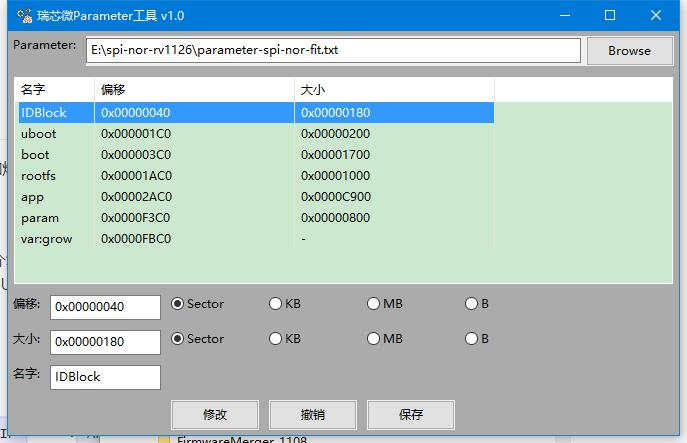

### 分区写保护设置

#### 块设备分区写保护设置

  Linux Kernel下EMMC和SD CARD是块设备，NAND FLASH使用rknand 或者rkflash驱动时也是块设备，可以通过下面命令配置分区的读写属性。

示例1. 设置system分区为只读：

```
./busybox blockdev --setro /dev/block/by-name/system
```

示例2. 设置system分区为可读写：

```
./busybox blockdev --setrw /dev/block/by-name/system
```

注意：分区配置最好在分区mount之前，不然分区mount为可写，在配置分区属性为只读，文件系统会报错。

#### MTD设备分区写保护设置

mtd一般通过cmdline定义分区，可以在分区名后加上字符'ro'来设定这个分区为只读。可以在uboot传递cmdline给kernel的时候修改mtdparts来实现特定分区写保护。

示例：修改分区表，设置boot分区为只读：

```
mtdparts=rk29xxnand:0x00002000@0x00004000(uboot),0x00004000@0x00006000(boot)ro,...
```

## 固件烧录

目前量产烧录固件主要有 3 种方式： USB 升级、SD 卡升级和烧录器烧录。

### USB 升级

USB 升级目前有两种协议：rockusb 和 fastboot。本文档只介绍 rockusb 升级方式，如果需要用 fastboot 升级方式，可以参考 uboot 开发文档《Rockchip-Developer-Guide-UBoot-nextdev-CN》。

#### 流程框图

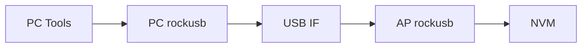

AP rockusb: maskrom rockusb, miniloader rockusb and uboot rockusb。

NVM： SPI NOR， SPI NAND， SLC NAND， EMMC，M/TLC NAND。

#### WIN 开发工具

AP SDK 发布的时候会提供配置好的开发工具，用于开发时烧录完整固件或更新部分分区的数据。工具附带功能比较多，详细功能介绍参考工具自带的文档，这里介绍几个比较实用的功能：

1. 读取设备分区表：在 loader 升级模式，点击按钮 “设备分区表”，可以读取设备的分区表
2. 切换到 loader 升级模式：在 MSC 或者 MTP 模式下，可以点击 “切换” 按钮切换到 loader 升级模式
3. 从 loader 切换到 maskrom 升级模式： 在高级功能里面点击 “进入 maskrom” 按钮可以从 loader 升级模式切换到 maskrom 升级模式
4. 重启设备：在 loader mode 或者 maskrom mode 下，可以点击高级功能 “重启设备”

工具界面：

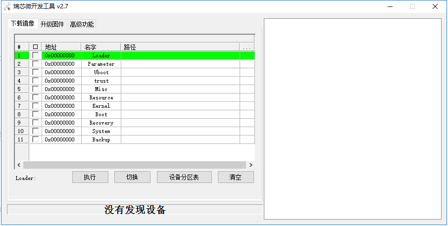

高级功能：

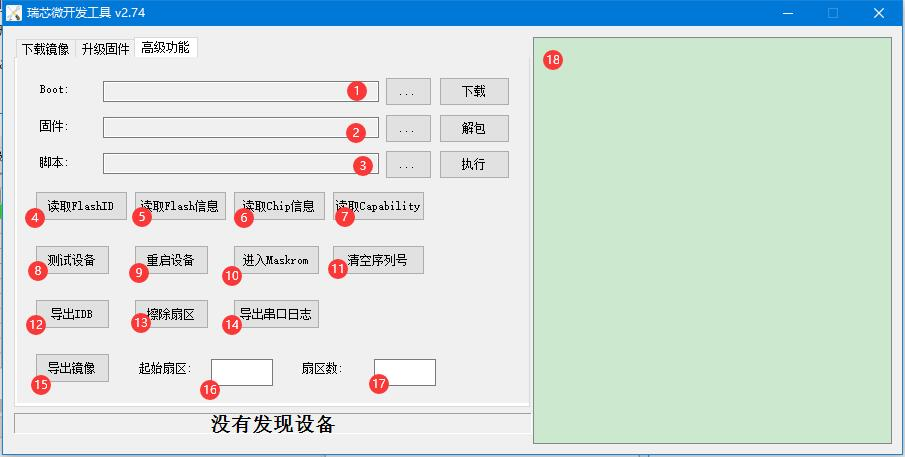

1. maskrom升级模式，需要选择loader文件下载到DDR里面运行
2. update.img 固件解包
3. 支持脚本运行
4. 读取FLASH ID
5. 读取FLASH信息
6. 读取芯片信息
7. 读取loader支持扩展功能
8. 测试测试是否ready
9. 重启设备
10. 重启进去maskrom升级模式，一般从loader升级模式切换到maskrom升级模式
11. 覆盖写数据，清空序列号，可能会破坏固件
12. 导出loader头部IDB结构
13. 根据16和17定义的起始地址和扇区数，擦除扇区，需要对齐到4MB，不然可能会多擦除或者少擦
14. 导出loader运行的串口信息，保存在工具的output目录
15. 根据16和17定义的起始地址和扇区数，导出固件镜像，保存在工具的output目录
16. 定义起始扇区
17. 定义操作操作的扇区数
18. 工具日志

#### LINUX 开发工具

Linux 工具与安卓工具类似，都有相近的功能。

工具界面：

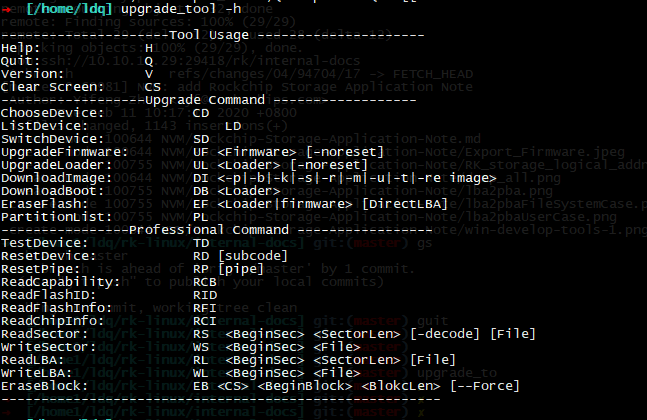

#### 量产工具

量产工具支持一拖多异步烧录固件，工具运行升级功能后，每接上一台设备，工具就会开始升级固件，多台机器之间独立的。

工具界面：

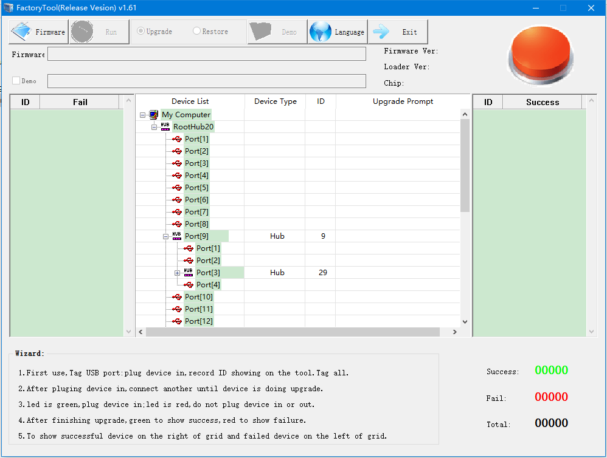

工具目录下有config.ini配置文件，每个选项都有详细注释，这里列举几个常用的配置：

1、FW_BURN_EFUSE 烧录固件的同时烧录efuse，启用secure boot。

AP用OTP，或者PCB没有预留EFUSE电源控制电路时不能开启这个功能。

2、NOTRESET_AFTER_UPGRADE 升级后不重启机器

​	有些产品第一次开机要求不能断电，需要设置升级固件后不重启。

3、FORCE_DATA_BAND 修改USB单包传输数据大小，烧写SPI NOR时如果出现usb超时出错，可以改小这个值。

4、SN_DLL_ON 开启升级固件过程同时烧写SN的功能

5、RB_CHECK_OFF固件升级是否需要回读调用

### SD卡升级

使用  SD_Firmware_Tool  工具把update.img固件烧录到sd卡里面，把制作好的升级用SD（TF）卡插到机器的SD卡口，上电就会从sd卡启动到recovery并升级固件到机器内部存储中。
工具界面：

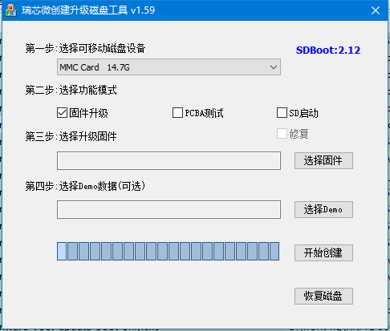

工具功能说明：

1、PCBA测试，勾选这个功能会先进行PCBA测试后再升级固件。

2、SD启动，制作启动卡，完整固件都存在在SD卡里面。

3、恢复磁盘，删除启动卡的启动代码，恢复位普通sd卡。

### EMMC & SPI Nor 镜像烧录

#### EMMC & SPI Nor 制作烧录镜像

用SpiImageTools把update.img转成烧录器用镜像。

工具界面：

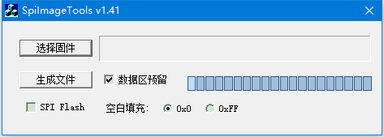

工具配置说明：

1、空白填充： EMMC选择 0x0

2、SPI FLASH：不要勾选

3、数据区预留：需要勾选

如果使用GPT分区的固件，制作镜像时parameter需要配置  DISKSIZE参数 ，具体参考文档《Rockchip量产烧录指南_v1.2》。

录器配置说明：

1、把data.bin烧录到emmc的user分区

2、如果是RK3188/RKPX3,还需要把boot0.bin烧录到emmc的boot1和boot2分区

3、烧录器配置全0的数据跳过不烧录

4、CSD值全部用默认值，不能修改

5、EXT CSD配置：

没有列出的项全部使用默认值，不能修改。
RK3188/RKPX3:
EXT_CSD[167] = 0x1f （如果EMMC颗粒支持，需要配置）
EXT_CSD[162] = 0x1 (启用 reset pin功能)
EXT_CSD[177] = 0x0 (默认值)
EXT_CSD[178] = 0x0 (默认值)
EXT_CSD[179] = 0x8 (0x8,从 boot1 启动)

其他AP：
EXT_CSD[167] = 0x1f （如果EMMC颗粒持，需要配置）
EXT_CSD[162] = 0x0 (默认值)
EXT_CSD[177] = 0x0 (默认值)
EXT_CSD[178] = 0x0 (默认值)
EXT_CSD[179] = 0x0 (默认值)

### SPI Nand 镜像烧录

#### SPI Nand 制作烧录镜像

**输入文件：SDK 输出的用于 PC 工具烧录的镜像**

```shell
➜  [/IMAGES] tree
.
├── parameter.txt               // 生成 gpt.img
├── MiniLoaderAll.bin           // 生成 idblock.img
├── uboot.img
├── boot.img
├── rootfs.img
├── oem.img
└── update.img                  // 过滤
```

**制作镜像**

工具 burner_image_kits 在 SDK rkbin/ 目录下，制作命令如下：

```
./rkbin/tools/burner_image_kits/make_spi_nand.sh <src_path> <dst_path> <soc> <block_size(KB)>
```

* src_path：SDK 输出的用于 PC 工具烧录的镜像路径；
* dst_path：输出路径；
* soc：所属芯片（小写），例如：rv1126
* block_size: flash block size。

例如： rv1126 block size 128KB flash:

```
./rkbin/tools/burner_image_kits/make_spi_nand.sh ./IMAGES ./out rv1126 128
```

**输出文件：用于烧录器烧的镜像**

```
➜  [/out] tree
.
└── 2048B_128KB
    ├── gpt.img
    ├── idblock.img.bak     // IDB 固件，不烧录
    ├── idblocks.img        // idblock.img.bak 的多备份合成镜像，3 个备份，默认要求烧录此镜像
    ├── uboot.img
    ├── boot.img
    ├── rootfs.img
    └── oem.img
```

#### SPI Nand 烧录器烧录

**烧录地址**

假定 block size 为 128KB 的 flash，PC 烧录工具及相应烧录器镜像烧录信息对比如下：

| 烧录器镜像源文件：SDK 默认输出镜像 | PC 烧录工具扇区地址 | 烧录器镜像   | 烧录器块起始地址 | 结束地址 | 固件大小 | 备注       |
| ---------------------------------- | ------------------- | ------------ | ---------------- | -------- | -------- | ---------- |
| paramter.txt                       | 0                   | gpt.img      | 0x0              | 0x1      | 0x1      | Note 1     |
| MiniLoaderAll.bin                  | 0                   | idblocks.img | 0x1              | 0x7      | 0x6      | Note 2     |
| uboot.img                          | 0x2000              | uboot.img    | 0x20             | 0x47     | 0x20     | **Note 3** |
| boot.img                           | 0x4800              | boot.img     | 0x48             | 0xa0     | 0x50     |            |
| ...                                | ...                 | ...          | ...              |          |          |            |
| xxx.img                            | 0x3E000             | xxx.img      | 0x3e0            | 0x3fb    | 0x18     | Note 4     |

表格注释：

1. gpt.img 固定烧录在 block 0；

2. idblocks.img 固定烧录在 block1，要求结束地址为 block 7；

3. 除 gpt.img 和 idblocks.img 由特定的烧录地址要求，其他固件按照 parameter.txt 中的地址烧录，sector 单位为 512B/s，所以烧录器块地址 = sectors * 512B / block_size，简化换算：

   128KB block size：sectors / 0x100；

   256KB block size：sectors / 0x200。

   除了 gpt.img，其余固件均应比分区小 1~2 个 block size，以便冗余块替换分区内可能存在的坏块；

4. 尾部预留 4 flash block size 给坏块表空间，所以用户分区不应达到该区间，可以考虑定义 reverved 分区以避免用户使用或将来误用。

**注意事项**

1. 所有镜像不带 oob 数据，oob 空间烧录器自行填充全 FF；
2. 非空片烧录，烧录器应先擦除所有 flash 好块再烧录镜像；
3. 烧录器要开启烧录校验功能。

### SLC Nand 镜像烧录

#### SLC Nand 制作烧录镜像

**输入文件：SDK 输出的用于 PC 工具烧录的镜像**

```shell
➜  [/IMAGES] tree
.
├── parameter.txt               // 生成 gpt.img
├── MiniLoaderAll.bin           // 生成 idblock.img
├── uboot.img
├── boot.img
├── rootfs.img
├── oem.img
└── update.img                  // 过滤
```

**制作镜像**

工具 burner_image_kits 在 SDK rkbin/ 目录下，制作命令如下：

```
./rkbin/tools/burner_image_kits/make_spi_nand.sh <src_path> <dst_path>  <soc> <block_size(KB)> <page_size(B)> <oob_size(B)>
```

* src_path：SDK 输出的用于 PC 工具烧录的镜像路径；
* dst_path：输出路径；
* soc：所属芯片（小写），例如：rv1126
* block_size：flash block size；
* page_size：flash page size。
* oob_size：flash oob size per page

例如： rv1126，block size 128KB page size 2KB  oob size 64B flash:

```
./rkbin/tools/burner_image_kits/make_slc_nand.sh ./IMAGES ./out rv1126 128 2048 64
```

**输出文件：用于烧录器烧的镜像**

```
➜  [/out] tree
.
└── 2048B_128KB_SLC
    ├── gpt.img
    ├── idblock.img.bak     // IDB 镜像，不烧录
    ├── idblocks.img        // idblock.img.bak 的多备份合成镜像，3 个备份，默认要求烧录此镜像
    ├── uboot.img
    ├── boot.img
    ├── rootfs.img
    └── oem.img
```

#### SLC Nand 烧录器烧录

**烧录地址**

假定 block size 为 128KB 的 flash，PC 烧录工具及相应烧录器镜像烧录信息对比如下：

| 烧录器镜像源文件：SDK 默认输出镜像 | PC 烧录工具扇区地址 | 烧录器镜像   | 烧录器块起始地址 | 结束地址 | 固件大小 | 备注       |
| ---------------------------------- | ------------------- | ------------ | ---------------- | -------- | -------- | ---------- |
| paramter.txt                       | 0                   | gpt.img      | 0x0              | 0x1      | 0x1      | Note 1     |
| MiniLoaderAll.bin                  | 0                   | idblocks.img | 0x1              | 0x7      | 0x6      | Note 2     |
| uboot.img                          | 0x2000              | uboot.img    | 0x20             | 0x47     | 0x20     | **Note 3** |
| boot.img                           | 0x4800              | boot.img     | 0x48             | 0xa0     | 0x50     |            |
| ...                                | ...                 | ...          | ...              |          |          |            |
| xxx.img                            | 0x3E000             | xxx.img      | 0x3e0            | 0x3fb    | 0x18     | Note 4     |

表格注释：

1. gpt.img 固定烧录在 block 0；

2. idblocks.img 固定烧录在 block1，要求结束地址为 block 7；

3. 除 gpt.img 和 idblocks.img 由特定的烧录地址要求，其他固件按照 parameter.txt 中的地址烧录，sector 单位为 512B/s，所以烧录器块地址 = sectors * 512B / block_size，简化换算：

   128KB block size：sectors / 0x100；

   256KB block size：sectors / 0x200。

   除了 gpt.img，其余固件均应比分区小 1~2 个 block size，以便冗余块替换分区内可能存在的坏块；

4. 尾部预留 4 flash block size 给坏块表空间，所以用户分区不应达到该区间，可以考虑定义 reverved 分区以避免用户使用或将来误用。

**注意事项**

1. 所有镜像带 oob 数据；
2. 非空片烧录，烧录器应先擦除所有 flash 好块再烧录镜像；
3. 烧录器要开启烧录校验功能。

## 存储软件驱动配置

RK 主要提供以下存储方案：

| 简称                         | 主要支持的颗粒类型 | 主要支持文件系统   | 支的烧录方式                    |
| ---------------------------- | ------------------ | ------------------ | ------------------------------- |
| eMMC 方案                    | eMMC               | FAT、EXT、SquashFS | USB 升级、SD 卡升级             |
| rknand 方案                  | MLC、TLC Nand      | FAT、EXT、SquashFS | USB 升级、SD 卡升级             |
| rkflash 方案                 | SLC Nand、SPI Nand | FAT、EXT、SquashFS | USB 升级、SD 卡升级             |
| rkflash 方案（SPI Nor 支持） | SPI Nor            | SquashFS、JFFS2    | USB 升级、SD 卡升级、烧录器升级 |
| SLC Nand 开源方案            | SLC Nand           | UBIFS              | USB 升级、SD 卡升级、烧录器升级 |
| SPI Nand 开源方案            | SPI Nand           | UBIFS              | USB 升级、SD 卡升级、烧录器升级 |
| SPI Nor 开源方案             | SPI Nor            | SquashFS、JFFS2    | USB 升级、SD 卡升级、烧录器升级 |

### u-boot

详细参考《Rockchip-Developer-Guide-UBoot-nextdev-CN》 CH05 - 驱动模块 Storage 章节。

### kernel

由于内核 4.4 及旧版本内核对于开源 SPI Flash 的支持不完善，所以内核中关于 flash 的开源方案与 uboot 下的实现方式有所不同：

| 简称                         | 主要支持的颗粒类型 | 主控驱动              | flash 框架            | 注册设备类型          | 主要支持文件系统   | 支持的烧录方式                  |
| ---------------------------- | ------------------ | --------------------- | --------------------- | --------------------- | ------------------ | ------------------------------- |
| rknand 方案                  | MLC TLC Nand       | drivers/rkand         | drivers/rkand         | block 设备            | FAT、EXT、SquashFS | USB 升级、SD 卡升级             |
| rkflash 方案                 | SLC Nand、SPI Nand | drivers/rkflash       | drivers/rkflash       | block 设备            | FAT、EXT、SquashFS | USB 升级、SD 卡升级             |
| rkflash 方案（SPI Nor 支持） | SPI Nor            | drivers/rkflash       | drivers/rkflash       | block 或 mtd 设备     | SquashFS、JFFS2    | USB 升级、SD 卡升级、烧录器升级 |
| SLC Nand 开源方案            | SLC Nand           | drivers/mtd/ nand/raw | drivers/mtd/ nand/raw | mtd                   | UBIFS              | USB 升级、SD 卡升级、烧录器升级 |
| SPI Nand 开源方案            | SPI Nand           | drivers/rkflash       | drivers/rkflash       | mtd                   | UBIFS              | USB 升级、SD 卡升级、烧录器升级 |
| SPI Nor 开源方案             | SPI Nor            | drivers/rkflash       | drivers/rkflash       | mtd 或 mtd block 设备 | SquashFS、JFFS2    | USB 升级、SD 卡升级、烧录器升级 |

#### rknand 方案

配置：

```bash
CONFIG_RK_NAND=y
```

驱动文件：

```
./drivers/rk_nand/
```

#### rkflash 方案

配置：

```
CONFIG_RK_FLASH=y

CONFIG_RK_NANDC_NAND=y   /* 小容量并口 Nand flash */
CONFIG_RK_SFC_NOR=y      /* SPI Nor flash */
CONFIG_RK_SFC_NOR_MTD=y  /* SPI Nor flash 及其分区注册为 mtd 设备，不选中则注册为普通 block 设备（rkflash0pn） */
CONFIG_RK_SFC_NAND=y     /* SPI Nand flash */
CONFIG_RK_SFC_NAND_MTD=y /* SPI Nand flash 及其分区注册为 mtd 设备，不选中则注册为普通 block 设备（rkflash0pn） */
```

如果选用 mtd 设备，则 MTD 相应配置（建议通过 menuconfig 配置，避免遗漏）：

```
CONFIG_MTD=y
CONFIG_MTD_BLOCK=y  /* SPI flash 分区同时注册为 block 设备（mtdblockn），主要为了支持 SquashFSfs 等只读文件系统，挂载在 mtdblock 分区上 */
CONFIG_MTD_CMDLINE_PARTS=y /* 解析 cmdline 中 mtdparts 为注册分区 */
```

MTD 分区设置参考 4.3 章节，如需选用 JFFS2，内核应开启相应支持，参考 5.2 章节。

驱动文件：

```
./drivers/rkflash/
```

注意：

1. SFC（serial flash controller）是 Rockchip 为简便支持 spi flash 所设计的专用模块；
2. rknand / 驱动与 rkflash / 驱动的 ftl 框架不兼容，CONFIG_RK_NAND=y 与 CONFIG_RK_FLASH=y  不能同时配置；
3. 如果相应配置开启，内核启动过程中会有 "rknand" 或 "rkflash"。

#### SLC Nand 开源方案

配置：

```
CONFIG_RK_FLASH=n   /* 不兼容 */
CONFIG_MTD_NAND_ROCKCHIP_V6=y /* NandC v6 可根据 TRM NANDC->NANDC_NANDC_VER 寄存器确认，0x00000801 */
# CONFIG_MTD_NAND_ROCKCHIP_V9=y /* NandC v6 可根据 TRM NANDC->NANDC_NANDC_VER 寄存器确认，0x56393030，目前仅 RK3326 可选改方案 */
CONFIG_MTD_CMDLINE_PARTS=y
```

驱动文件：

```
./drivers/mtd/nand/raw/
```

SLC Nand 坏块管理策略：

Flash 的尾部预留 4 个 block 给坏块表存放，固件应避开该区域，可以考虑 flash 尾部 1MB 空间不使用，详细参考 “MTD 分区表注” 章节内的注意事项。

#### SPI Nand & SPI Nor 开源方案

配置：

```bash
CONFIG_RK_FLASH=y

CONFIG_RK_SFC_NOR=y      /* SPI Nor flash */
CONFIG_RK_SFC_NOR_MTD=y  /* SPI Nor flash 及其分区注册为 mtd 设备，不选中则注册为普通 block 设备（rkflash0pn） */
CONFIG_RK_SFC_NAND=y     /* SPI Nand flash */
CONFIG_RK_SFC_NAND_MTD=y /* SPI Nand flash 及其分区注册为 mtd 设备 */
CONFIG_MTD_CMDLINE_PARTS=y
```

驱动文件：

```
./drivers/rkflash
```

SPI Nand 坏块管理策略：

Flash 的尾部预留 4 个 block 给坏块表存放，固件应避开该区域，可以考虑 flash 尾部 1MB 空间不使用，详细参考 “MTD 分区表注” 章节内的注意事项。

驱动文件:

```
./drivers/rkflash/sfc_nand_mtd_bbt.c
```

### MTD 分区表

#### RK SDK 支持解析 GPT 并生成  MTD 分区表

RK 提供的 SDK 支持 u-boot 中解析 GPT 生成 cmdline mtdparts 信息，并传递给内核。

注意：

* SLC Nand 及 SPI Nand 开源方案每个分区应预留出 2~3 个 flash block size 的冗余空间，以便遇到坏块时，有冗余空间可替换；

* 分区起始地址应做 flash block size 对齐；

* SLC Nand 及 SPI Nand 开源方案预留最后 4 个 flash block 给全局坏块表，所以最后一个用户分区不应包括该区域，具体有以下两种情形：

  parameter.txt 内最后一个分区使用 grow 标志：代码内会自动调整最后一个分区 size，SDK 默认为此方案；

  parameter.txt 内最后一个分区未使用 grow 标志，或未使用 gpt 方案：最后一个用户分区不应定义到 flash 尾部 1MB 空间。

* 分区表要使用GPT表，即parameter.txt 文件中，配置如下字段

  ```
  TYPE: GPT
  ```

### 直接定义 mtdparts

**u-boot:**

./include/configs/rkxxx_common.h 中添加 MTDPARTS_DEFAULT 定义。

**kernel:**

修改 dts 中 rootfs 所在分区、添加 defconfig MTD 相关支持、cmdline 中定义分区。

defconfig 配置：

```
CONFIG_MTD_CMDLINE_PARTS=y
```

dts 配置：

```diff
diff --git a/arch/arm64/boot/dts/rockchip/rk3308-evb-v10.dtsi b/arch/arm64/boot/dts/rockchip/rk3308-evb-v10.dtsi
index c772b8a..25f198f 100644
--- a/arch/arm64/boot/dts/rockchip/rk3308-evb-v10.dtsi
+++ b/arch/arm64/boot/dts/rockchip/rk3308-evb-v10.dtsi
@@ -12,7 +12,7 @@
 	compatible = "rockchip,rk3308-evb", "rockchip,rk3308";

 	chosen {
-		bootargs = "earlycon=uart8250,mmio32,0xff0c0000 swiotlb=1 console=ttyFIQ0 root=PARTUUID=614e0000-0000 rootfstype=squashfs rootwait snd_aloop.index=7";
+		bootargs = "earlycon=uart8250,mmio32,0xff0c0000 swiotlb=1 console=ttyFIQ0 mtdparts=sfc_nor:2m@4m (uboot),2m@6m (trust),10m@8m (boot),6m@18m (rootfs),-(userdata) root=/dev/mtdblock3 rootfstype=squashfs rootwait snd_aloop.index=7";
 	};
```

### 文件系统自动挂载

以下为部分常见的文件系统类型挂载在开源方案的 mtd 分区或 mtdblock 分区上的配置，应确定 root 所在的分区及文件系统类型，并在 dts 中添加以下信息到 bootargs：

```
root=/dev/mtdblock3 rootfstype=squashfs
ubi.mtd=4 root=ubi0:rootfs rootfstype=ubifs
root=/dev/mtdblock4 rootfstype=jffs2
```

注意：

1. suqashfs 默认仅支持挂载在 block 设备上，所以如果使用的存储方案为 mtd 分区，还应使能 CONFIG_MTD_BLOCK，MTD 框架会自动将 mtd 分区同时注册对应的 mtdblock 分区；
2. 如果 mtd 分区由 u-boot 解析 GPT 获取，则与 paramter.txt 中的分区一一对应，从 mtdblock0 开始计数；
3. mtd 为 char 设备，mtdblock 为 block 设备

## 开源方案 OTA

### Shell 命令升级 MTD 分区

首先要确定，如果 MTD  分区内的镜像使用 UBIFS 文件系统，要参考 “Shell 命令升级 UBIFS 镜像分区” 章节，所以该 MTD 分区主要针对 IDB、u-boot、kernel 等只读没有文件系统的固件分区。

**u-boot SLC Nand**

nand info：

```
nand info
```

nand erase：

```shell
nand erase off size
```

* off：block size 对齐，单位为 byte，仅支持十六进制
* size：block size 对齐，单位为 byte，仅支持十六进制

nand write：

```
nand write - addr off|partition size
```

* addr：memory 地址，仅支持十六进制
* off|partition：page size 对齐，单位为 byte，仅支持十六进制
* size：page size 对齐，单位为 byte，用十六进制

nand read：

```
nand read - addr off|partition size
```

* addr：memory 地址，仅支持十六进制
* off|partition：page size 对齐，单位为 byte，仅支持十六进制
* size：page size 对齐，单位为 byte，用十六进制

针对一个分区的升级，建议操作顺序：

```
tftp 0x4000000 rootfs.img
nand erase 0x600000 0x200000						/* 升级分区时先擦除整个分区 */
nand write 0x4000000 0x600000 0x200000
```

**u-boot SPI Nand**

SPI Nand 无法支持 nand cmd 命令，可选用 cmd/mtd.c 接口，依旧能跳过坏块。

mtd erase:

```
mtd erase <name> <off> <size>
```

* name：spi-nand0 for SPI Nand mtd devices

* off：page size 对齐，单位为 byte，仅支持十六进制
* size 对齐，单位为 byte，仅支持十六进制

mtd write:

```
mtd write <name> <addr> <off> <size>
```

* name：spi-nand0 for SPI Nand mtd devices

* addr：memory 地址，仅支持十六进制
* off：page size 对齐，单位为 byte，仅支持十六进制
* size 对齐，单位为 byte，仅支持十六进制

mtd read:

```
mtd read <name> <addr> <off> <size>
```

* name：spi-nand0 for SPI Nand mtd devices

* addr：memory 地址，仅支持十六进制
* off：page size 对齐，单位为 byte，仅支持十六进制
* size 对齐，单位为 byte，仅支持十六进制

针对一个分区的升级，建议操作顺序：

```
tftp 0x4000000 rootfs.img
mtd erase spi-nand0 0x600000 0x200000						/* 升级分区时先擦除整个分区 */
mtd write spi-nand0 0x4000000 0x600000 0x200000
```

kernel

flash_eraseall：

```shell
flash_eraseall
```

nanddump：

```shell
nanddump --bb=skipbad /dev/mtd3
```

1. --bb=METHOD, where METHOD can be 'padbad', 'dumpbad', or'skipbad':
2. padbad:  dump flash data, substituting 0xFF for any bad blocks
3. dumpbad: dump flash data, including any bad blocks
4. skipbad: dump good data, completely skipping any bad blocks (default)

nandwrite：

```shell
nandwrite -p /dev/mtd3 /rockchip_test/rockchip_test.sh
```

针对一个分区的升级，建议操作顺序：

```
flash_eraseall /dev/mtd4						/* 升级分区时先擦除整个分区 */
nandwrite -p /dev/mtd3 /userdata/boot.img
sync
nanddump --bb=skipbad /userdata/boot_read.img
md5sum /userdata/boot_read.img ...				/* 建议添加校验 */
```

### Shell 命令升级 UBIFS 镜像分区

参考 "UBIFS 文件系统" -> "UBIFS OTA" 章节。

### 函数接口升级 MTD 分区

首先要确定，如果 MTD  分区内的镜像使用 UBIFS 文件系统，要参考 “Shell 命令升级 UBIFS 镜像分区” 章节，所以该 MTD 分区主要针对 IDB、u-boot、kernel 等只读没有文件系统的固件分区。

u-boot

建议参考 drivers/mtd/nand/nand_util.c，使用有坏块识别的读写擦除接口。

kernel

建议参考 ./miscutils/nandwrite.c ./miscutils/flash_eraseall.c，使用有坏块识别的读写擦除接口。

user

原则上依旧是参考 ./miscutils/nandwrite.c ./miscutils/flash_eraseall.c，结合 mtd 设备阶段支持的系列 ioctrl 命令，完成有坏块识别的读写擦除应用代码。

mtd device 支持的 ioctrl 选项在 include/uapi/mtd/mtd-abi.h 中。

## 文件系统支持

### UBIFS 文件系统

#### 简介

UBIFS 是 Unsorted Block Image File System 的简称，常应用于 raw nand 上的文件系统支持，作为 jffs2 的后继文件系统之一。UBIFS 通过 UBIFS 子系统处理与 MTD 设备之间动作。

#### 配置

内核支持：

```
CONFIG_MTD_UBI=y
CONFIG_UBIFS_FS=y
CONFIG_UBIFS_FS_ADVANCED_COMPR=y
CONFIG_UBIFS_FS_LZO=y /* 建议选用 lzo 压缩 */
```

#### 镜像制作

**命令详细说明**

```
Usage: mkfs.ubifs [OPTIONS] target
Make a UBIFS file system image from an existing directory tree
Examples:
Build file system from directory /opt/img, writting the result in the ubifs.img file
        mkfs.ubifs -m 512 -e 128KiB -c 100 -r /opt/img ubifs.img
The same, but writting directly to an UBIFS volume
        mkfs.ubifs -r /opt/img/dev/ubi0_0
Creating an empty UBIFS filesystem on an UBIFS volume
        mkfs.ubifs/dev/ubi0_0
Options:
-r, -d, --root=DIR         build file system from directory DIR, 待制作的文件系统目录
-m, --min-io-size=SIZE     minimum I/O unit size，最小输入输出大小, NAND FLASH 的最小读写单元，一般为 page size，有 4096 或 2048
-e, --leb-size=SIZE        logical erase block size 逻辑可擦出块大小，为 block size-2x (page size)，如 block_size 256KB page_size 2KB 应设置 -e 258048，如 block_size 128KB page_size 2KB 应设置 -e 126976
-c, --max-leb-cnt=COUNT    maximum logical erase block count 最大逻辑可擦出块数目，autoresize 时文件系统的的上限
-o, --output=FILE          output to FILE 输出文件名
-j, --jrn-size=SIZE        journal size
-R, --reserved=SIZE        how much space should be reserved for the super-user
-x, --compr=TYPE           compression type - "lzo", "favor_lzo", "zlib" or "none" (default: "lzo")
-X, --favor-percent        may only be used with favor LZO compression and defines how many percent better zlib should compress to make mkfs.ubifs use zlib instead of LZO (default 20%)
-f, --fanout=NUM           fanout NUM (default: 8)
-F, --space-fixup          file-system free space has to be fixed up on first mount(requires kernel version 3.0 or greater),如果是通过 u-boot 烧写需要使能此功能。
-k, --keyhash=TYPE         key hash type - "r5" or "test" (default: "r5")
-p, --orph-lebs=COUNT      count of erase blocks for orphans (default: 1)
-D, --devtable=FILE        use device table FILE
-U, --SquashFS-uids        SquashFS owners making all files owned by root
-l, --log-lebs=COUNT       count of erase blocks for the log (used only for debugging)
-v, --verbose              verbose operation
-V, --version              display version information
-g, --debug=LEVEL          display debug information (0 - none, 1 - statistics, 2 - files, 3 - more details)
-h, --help                 display this help text
```

**流程**

1. 制作 UBIFS 镜像（通常只需配置以下参数）

```
mkfs.ubifs -F -d rootfs_dir -e real_value -c real_value -m real_value -v -o rootfs.ubifs
```

2. 制作为 flash 烧写格式

```
ubinize -o ubi.img -m 2048 -p 128KiB ubinize.cfg
```

* -p：block size。
* -m：NAND FLASH 的最小读写单元，一般为 page size
* -o：输出的 ubi.img 文件

其中，ubinize.cfg 配置：

```
[ubifs-volumn]
mode=ubi
image=rootfs.ubifs
vol_id=0
vol_type=dynamic
vol_alignment=1
vol_name=ubifs
vol_flags=autoresize
```

* mode=ubi： 是强制参数，当前不能输入别的值，保留为以后扩展功能
* image=out/rootfs.ubifs：此文件为源文件
* vol_id=0：表示卷的 ID，UBI 镜像可能包含多个卷，这个用来区别不同的卷
* vol_type=dynamic：表示当前卷类型是可读写的，只读为 static
* vol_name=ubifs：卷的名称
* vol_flags=autosize：表示卷的大小是可扩展的

**实例**

page size 2KB，page per block 64，即 block size 128KB，分区 size 64MB：

```
mkfs.ubifs -F -d /path-to-it/buildroot/output/rockchip_rv1126_rv1109_spi_nand/target -e 0x1f000 -c 0x200 -m 0x800 -v -o rootfs.ubifs
ubinize -o ubi.img -m 2048 -p 128KiB ubinize.cfg
```

page size 2KB，page per block 128，即 block size 256KB，分区 size 64MB：

```
mkfs.ubifs -F -d /path-to-it/buildroot/output/rockchip_rv1126_rv1109_spi_nand/target -e 0x3f000 -c 0x100 -m 0x800 -v -o rootfs.ubifs
ubinize -o ubi.img -m 2048 -p 256KiB ubinize.cfg
```

page size 4KB，page per block 64，即 block size 256KB，分区 size 64MB：

```
mkfs.ubifs -F -d /path-to-it/buildroot/output/rockchip_rv1126_rv1109_spi_nand/target -e 0x3e000 -c 0x100 -m 0x1000 -v -o rootfs.ubifs
ubinize -o ubi.img -m 0x1000 -p 256KiB ubinize.cfg
```

**多卷镜像实例**

以 page size 2KB，page per block 64，即 block size 128KB，分区大小 8MB oem 和 分区大小 8MB userdata 复合的多卷分区为例：

```
mkfs.ubifs -F -d oem -e 0x1f000 -c 0x40 -m 0x800 -v -o oem.ubifs
mkfs.ubifs -F -d userdata -e 0x1f000 -c 0x40 -m 0x800 -v -o userdata.ubifs
ubinize -o oem_userdata.img -p 0x20000 -m 2048 -s 2048 -v ubinize_oem_userdata.cfg
```

设置 ubinize_oem_userdata.cfg 如下：

```
[oem-volume]
mode=ubi
image=oem.ubifs
vol_id=0
vol_size=8MiB
vol_type=dynamic
vol_name=oem

[userdata-volume]
mode=ubi
image=userdata.ubifs
vol_id=1
vol_size=8MiB
vol_type=dynamic
vol_name=userdata
vol_flags=autoresize

```

挂载分区：

```
ubiattach /dev/ubi_ctrl -m 4 -d 4 -b 5
mount -t ubifs /dev/ubi4_0 /oem
mount -t ubifs /dev/ubi4_1 /uesrdata
```

**镜像大小与分区空间**

精确计算：

假定已知制作后镜像为 B 个 flash block，则分区应预留：

```
 (B + 4) * block_size + 2 * page_size * (B - 4)
```

e.g：block size 128KB，page size 2KB，B = 32：

```
 (32 + 4) * 128KB + 2 * 2KB * (32 - 4) = 4720 KB
```

 对齐到 flash block size，则最终应预留 38 blocks。

估算建议：

预留空间：制作后的 UBIFS 镜像 4% 大小 + 4 block size，并向上取整对齐到 block size 。

详细参考：

[Flash space overhead 章节]: http://www.linux-mtd.infradead.org/doc/ubi.html#L_overhead

#### 命令手动挂载 UBIFS 分区

```shell
ubiattach /dev/ubi_ctrl -m 4 -d 4
```

* -m：指定 mtd 分区序号
* -d：绑定后的 ubi 设备编号，建议与 mtd 分区序号一致
* -b, --max-beb-per1024：每1024个eraseblock预期的最大坏块数，注意：
  1. 不带参数，默认为 20；
  2. 如果第一次扫描，冗余空间大于该值，则预留该数值的 block 作为坏块替换区，该区域用户不可获取，如冗余空间小于该值，则冗余空间除了其他必要保留空间外都作为坏块保留区；
  3. SDK 默认值应设定为 10（可能旧版本 SDK 该值未设定）；
  4. 如需优化空间，请灵活设定该值：4 + 分区所占 block 数 * 1%，例如：flash block size 128KB，oem 空间大小 16MB，占 128 flash block，可以考虑填值 5；

```shell
mount -t ubifs /dev/ubi4_0 /oem
```

#### UBI Block 支持 SquashFS

**内核配置**

```
+CONFIG_MTD_UBI_BLOCK=y
```

**dts 指定 rootfs**

```
dts 中 bootargs 参数指定了 cmdline 中相关 ubi 的参数。

- ubi.mtd=4              : 选择 MTD 设备（从0开始）
- ubi.block=0,rootfs     : "rootfs" 是 vol_name (参考 ubinize.cfg), block=0 指定了ubi block的序号
- root=/dev/ubiblock0_0  : 指定 rootfs 分区名；由 ubi block 驱动根据 ubi.block 参数生成的块设备
- rootfstype=squashfs    : 指定文件系统类型
```

**制作 SquashFS UBI volume**

Buildroot 默认会打包 SquashFS image。如需要另行打包，可使用mksquashfs命令，例如：

```shell
sudo mksquashfs squashfs-root/ squashfs.img -noappend -always-use-fragments
```

使用ubinize工具将 SquashFS 镜像打包成ubi image。

首先生成ubinize.cfg文件：

```shell
cat > ubinize.cfg << EOF
[ubifs]
mode=ubi
vol_id=0
vol_type=static
vol_name=rootfs
vol_alignment=1
vol_flags=autoresize
image=/data/rk/projs/rv1126/sdk/buildroot/output/rockchip_rv1126_robot/images/rootfs.squashfs
EOF
```

其中:

* vol_type 为 static 指定为只读
* image 指定 SquashFS image 的路径

然后使用ubinize打包image：

```shell
ubinize -o rootfs.ubi -p 0x20000 -m 2048 -s 2048 -v ubinize.cfg
```

-p：指定flash的物理擦除块大小

-m：指定flash的最小输入输出单元,当为nor flash时，此值应指定为1，当为nand flash时此值应指定为页面大小

-s：指定子页大小,当为nor flash时，此值应指定为1，当为nand flash时需指定此值为nand flash的子页大小

参数

输出 rootfs.ubi 文件即升级所用文件。

注意：

* Nand 产品使用开源方案应将 SquashFS 挂载在 UBI block 上而非 mtdblock，因为 mtdblock 没有加入坏块探测，所以无法跳过坏块.

**手动挂载 UBI block 参考**

```
ubiattach /dev/ubi_ctrl -m 4 -d 4   /* 先挂载 UBI 设备 */
ubiblock -c /dev/ubi4_0             /* UBI 设备上扩展 UBI block 支持 */
mount -t squashfs /dev/ubiblock4_0 /oem
```

#### UBIFS OTA

升级使用 UBIFS 的分区应使用 ubiupdatevol 工具，参考，命令：

```
ubiupdatevol /dev/ubi1_0 rootfs.ubiimg
```

### JFFS2 文件系统支持

#### 简介

JFFS2 的全名为 Journalling Flash FileSystem Version 2（闪存日志型文件系统第 2 版），其功能就是管理在 MTD 设备上实现的日志型文件系统。与其他的存储设备存储方案相比，JFFS2 并不准备提供让传统文件系统也可以使用此类设备的转换层。它只会直接在 MTD 设备上实现日志结构的文件系统。JFFS2 会在安装的时候，扫描 MTD 设备的日志内容，并在 RAM 中重新建立文件系统结构本身。

#### 配置

配置：

```
CONFIG_JFFS2_FS=y
```

#### 镜像制作

```
mkfs.jffs2 -r data/-o data.jffs2 -e 0x10000 --pad=0x400000 -s 0x1000 -n		// --pad 定为分区大小一致，erase size 设置为 64KB
```

```
Options:
 --pad [=SIZE]            Pad output to SIZE bytes with 0xFF. If SIZE is
                          not specified, the output is padded to the end of
                          the final erase block
  -r, -d, --root=DIR      Build file system from directory DIR (default: cwd)
  -s, --pagesize=SIZE     Use page size (max data node size) SIZE.
                          Set according to target system's memory management
                          page size (default: 4KiB)
  -e, --eraseblock=SIZE   Use erase block size SIZE (default: 64KiB)
  -n, --no-cleanmarkers   Don't add a cleanmarker to every eraseblock
```

## Vendor Storage 使用说明

Vendor Storage 是设计来存放一些非安全小数据，比如 SN、MAC 等。需要了解详细信息请参考文档《RK Vendor Storage Application Note》，这里主要描述怎么使用，注意事项和 API。

### Vendor Storage ID

Vendor Storage 是通过 ID（16bits）访问数据，不需要关心数据具体存放在分区的哪个位置，可以简单认为 ID 就是索引或者文件名。ID 0 -31 保留为通用 SDK 功能使用，客户自定义存储时请使用 32-65535.

下表为具体的 ID 功能定义：

| **ID**         | **Function**                   |
| -------------- | ------------------------------ |
| **0**          | **reserved**                   |
| **1**          | **SN**                         |
| **2**          | **WIFI MAC**                   |
| **3**          | **LAN MAC**                    |
| **4**          | **BT MAC**                     |
| **5**          | **HDCP 1.4 HDMI**              |
| **6**          | **HDCP 1.4 DP**                |
| **7**          | **HDCP 2.X**                   |
| **8**          | **DRM KEY**                    |
| **9**          | **PLAYREADY Cert**             |
| **10**         | **ATTENTION KEY**              |
| **11**         | **PLAYREADY ROOT KEY 0**       |
| **12**         | **PLAYREADY ROOT KEY 1**       |
| **13**         | **SENSOR CALIBRATION**         |
| **14**         | **RK reserved for future use** |
| **15**         | **IMEI**                       |
| **16**         | **LAN_RGMII_DL**               |
| **17 – 31**    | **RK reserved for future use** |
| **32 - 65535** | **Vendor use**                 |

### Vendor Storage API

#### Uboot API

```c
int vendor_storage_init (void)
	function: Initialize vendor storage
	input: none
	return: 0, Initialize success
			other, Initialize fail

```

```c
int vendor_storage_read (u32 id, void *pbuf, u32 size)
	function: read vendor storage by id
	input: id, item id; pbuf, data buffer; size, number byte to read.
	return: -1, read fail.
			other: number byte have read.

```

```c
int rk_vendor_write (u32 id, void *pbuf, u32 size)
	function: write vendor storage by id
	input: id, item id; pbuf: data buffer; size: number bytes to write.
	return: 0: write success
			other : write fail

```

#### kernel API

Source code : kernel/drivers/soc/rockchip/rk_vendor_storage.c

Include header：include/linux/soc/rockchip/rk_vendor_storage.h

```c
int vendor_storage_init (void)
	function: Initialize vendor storage
	input: none
	return:  0, Initialize success
			other, Initialize fail

```

```c
int vendor_storage_read (u32 id, void *pbuf, u32 size)
	function: read vendor storage by id
	input: id, item id; pbuf, data buffer; size, number byte to read.
	return: -1, read fail.
			other: number byte have read.

```

```c
int rk_vendor_write (u32 id, void *pbuf, u32 size)
	function: write vendor storage by id
	input: id, item id; pbuf: data buffer; size: number bytes to write.
	return: 0: write success
			other : write fail

```

#### User API

用户应用是通过 IOCTL 接口访问 vendor storage，下面是读写的参考代码。

```c
#include <fcntl.h>
#include <sys/ioctl.h>

#define VENDOR_REQ_TAG	0x56524551
#define VENDOR_READ_IO	_IOW ('v', 0x01, unsigned int)
#define VENDOR_WRITE_IO	_IOW ('v', 0x02, unsigned int)
#define VENDOR_SN_ID		1
#define VENDOR_WIFI_MAC_ID	2
#define VENDOR_LAN_MAC_ID	3
#define VENDOR_BLUETOOTH_ID	4

struct rk_vendor_req {
	u32 tag;
	u16 id;
	u16 len;
	u8 data [1];
};

static void print_hex_data (uint8 *s, uint32 *buf, uint32 len)
{
	uint32 i, j, count;

	ERROR ("% s", s);
	for (i = 0; i < len; i += 4)
		ERROR ("% x % x % x % x", buf [i], buf [i + 1], buf [i + 2], buf [i + 3]);
}

int vendor_storage_read_test (void)
{
	u32 i;
	int ret, sys_fd;
	u8 p_buf [2048];/* malloc req buffer or used extern buffer */
	struct rk_vendor_req *req;

	req = (struct rk_vendor_req *) p_buf;
	sys_fd = open ("/dev/vendor_storage", O_RDWR, 0);
	if (sys_fd < 0){
		ERROR ("vendor_storage open fail\n");
		return -1;
	}

	req->tag = VENDOR_REQ_TAG;
	req->id = VENDOR_SN_ID;
	req->len = 512; /* max read length to read*/
	ret = ioctl (sys_fd, VENDOR_READ_IO, req);
	print_hex_data ("vendor read:", (uint32*) req, req->len + 8);
/* return req->len is the real data length stored in the NV-storage */
	if (ret){
		ERROR ("vendor read error\n");
		return -1;
	}

	return 0;
}

int vendor_storage_write_test (void)
{
	uint32 i;
	int ret, sys_fd;
	uint8 p_buf [2048]; /* malloc req buffer or used extern buffer */
	struct rk_vendor_req *req;

	req = (struct rk_vendor_req *) p_buf;
	sys_fd = open ("/dev/vendor_storage", O_RDWR, 0);
	if (sys_fd < 0){
		ERROR ("vendor_storage open fail\n");
		return -1;
	}

	req->tag = VENDOR_REQ_TAG;
	req->id = VENDOR_SN_ID;
	req->len = 32; /* data len */
	for (i = 0; i < 32; i++)
		req->data [i] = i;
	print_hex_data ("vendor write:", (uint32*) req, req->len + 8);
	ret = ioctl (sys_fd, VENDOR_WRITE_IO, req);
	if (ret){
		ERROR ("vendor write error\n");
		return -1;
	}

	return 0;
}

```

#### PC Tool API

PC 工具有提供参考工程源码，由 C++ 开发，这里列出读写的两个 API 接口。

```c
int RK_ReadProvisioningData (int id, (PBYTE) pbuf, int size)
	function: read vendor storage by id
	input: id, item id; pbuf, data buffer; size, number byte to read.
	return: 0, read data okay.
			other: read fail.

```

```c
int  RK_WriteProvisioningData (int id, (PBYTE) pbuf, int size)
	function: write vendor storage by id
	input: id, item id; pbuf: data buffer; size: number bytes to write.
	return:  0: write success
			other : write fail

```

### 使用注意事项

#### VENDOR 分区单个 item 最大支持数据量

Nand 和 emmc Vendor 分区共 64KB，Nor 为 4KB，存放在 vendor 结构体里：

```CQL
struct vendor_info {
    struct vendor_hdr *hdr; //32byte
    struct vendor_item *item; //8byte * item
    u8 *data; //size = sum (item 1, item 2, ... item n)
    u32 *hash;
    u32 *version2;
};
```

所以如果只写 1 个 item：

1. Nand 和 emmc 单个 item data size 可达 64 * 1024 - 32 - 8 -4 -4 = 65488 bytes
2. Nor 单个 item data size 可达 4 * 1024 - 32 -8 -4 -4= 4048 bytes

## 附录参考

[1] UBI FAQ: <http://www.linux-mtd.infradead.org/faq/ubi.html>

[2] UBIFS FAQ: <http://www.linux-mtd.infradead.org/faq/ubifs.html#L_lebsz_mismatch>

[3] MTD FAQ: <http://www.linux-mtd.infradead.org/faq/general.html>
