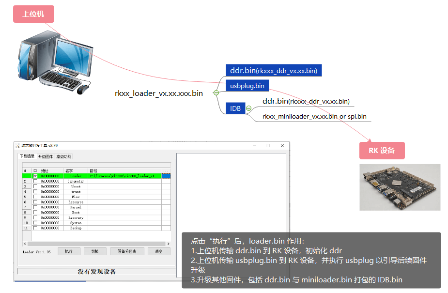
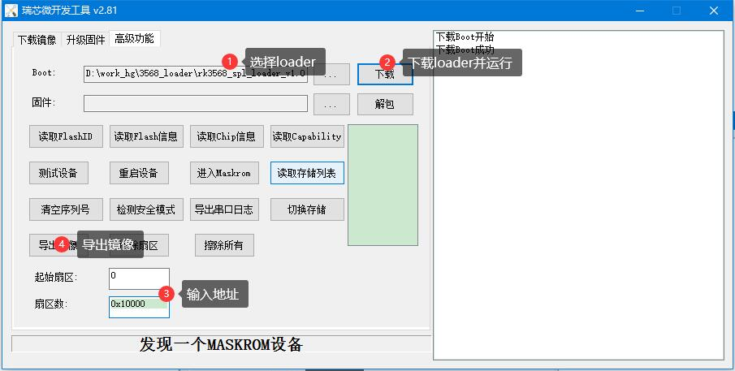
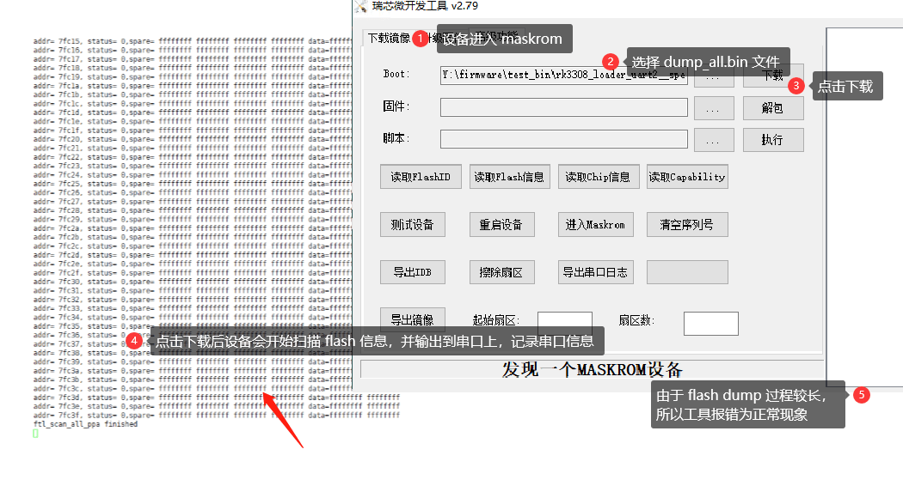
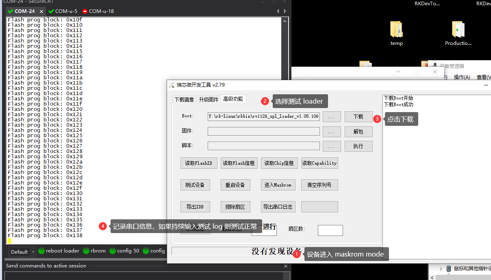
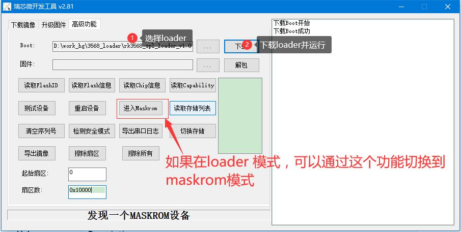
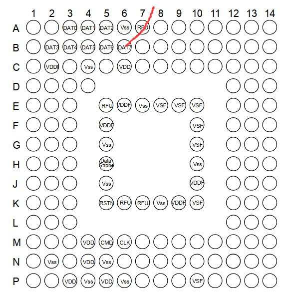

# Rockchip Developer FAQ Storage

文件标识:  RK-PC-YF-133

发布版本：V1.0.0

日期：2021-05-08

文件密级：□绝密   □秘密   □内部资料   ■公开

**免责声明**

本文档按“现状”提供，瑞芯微电子股份有限公司（“本公司”，下同）不对本文档的任何陈述、信息和内容的准确性、可靠性、完整性、适销性、特定目的性和非侵权性提供任何明示或暗示的声明或保证。本文档仅作为使用指导的参考。

由于产品版本升级或其他原因，本文档将可能在未经任何通知的情况下，不定期进行更新或修改。

**商标声明**

“Rockchip”、“瑞芯微”、“瑞芯”均为本公司的注册商标，归本公司所有。

本文档可能提及的其他所有注册商标或商标，由其各自拥有者所有。

**版权所有 © 2021 瑞芯微电子股份有限公司**

超越合理使用范畴，非经本公司书面许可，任何单位和个人不得擅自摘抄、复制本文档内容的部分或全部，并不得以任何形式传播。

瑞芯微电子股份有限公司

Rockchip Electronics Co., Ltd.

地址：     福建省福州市铜盘路软件园A区18号

网址：     [www.rock-chips.com](http://www.rock-chips.com)

客户服务电话： +86-4007-700-590

客户服务传真： +86-591-83951833

客户服务邮箱： [fae@rock-chips.com]

---

**前言**

**概述**

本文主要指导读者了解启动流程，对存储进行配置和调试。

**各芯片 feature 支持状态**

| **芯片名称** | **内核版本** |
| ------------ | ------------ |
| 所有产品     | --           |

**读者对象**

本文档（本指南）主要适用于以下工程师：

技术支持工程师

软件开发工程师

**修订记录**

| **版本号** | **作者**       | **修改日期** | **修改说明** |
| ---------- | -------------- | ------------ | ------------ |
| V1.0.0     | 赵仪峰、林鼎强 | 2021-05-08   | 初始版本     |

---

**目录**

[TOC]

---

## 固件烧录

### 常见问题

#### 烧录过程中 Loader 的作用



#### Flash 无法正常烧录

Flash 无法正常烧录我们建议从串口信息入手来确认实际情况，以下为通用 Flash 烧录串口 log：

```c
ddr.bin log:     DDR Version V1.30 20191125
ddr.bin log:     REG2C: 0x00000031, 0x00000031
ddr.bin log:     In
ddr.bin log:     451MHz
ddr.bin log:     DDR2
ddr.bin log:     Col=10 Bank=2 Row=13 Size=64MB
ddr.bin log:     msch:0
ddr.bin log:     OUT
usbplug log:     Boot1 Release Time: Dec  7 2020 11:25:17, version: 1.25
usbplug log:     chip_id:000000,0
usbplug log:     DPLL = 1300 MHz
usbplug log:     ...nandc_flash_init enter...
usbplug log:     No.1 FLASH ID:ff ff ff ff ff ff                          /* 情形1：并口 Nand flash ID 值，可与手册 “ID Read” 对比 */
usbplug log:     DPLL = 1300 MHz
usbplug log:     sfc nor id: ff ff ff                                     /* 情形2：SPI Nor Jedec ID 值，可与手册对比 */
usbplug log:     DPLL = 1300 MHz
usbplug log:     sfc_nand id: ff ff ff                                    /* 情形3：SPI Nnad ID 值，可与手册对比 */
usbplug log:     UsbBoot ...11943
usbplug log:     powerOn 664713
```

问题分析：

1. ddr.bin log 如有异常，请联系 DDR 工程师
2. 如果所用存储为并口 SLC Nand、SPI Nand 或 SPI Nor，如果升级过程 flash ID 为全 FF，则多为 flash vcc 供电异常、io 电平异常或焊接异常
3. 如果 flash ID 为正确值，且所用颗粒在 《RK SpiNor and  SLC Nand SupportList 》中显示相应平台已支持，则所用固件为旧版本，未添加该颗粒支持，可选：
   1. 同步整个 SDK
   2. 仅同步存储部分代码：redmine 》FAE 项目 》 文档 》 Nand flash支持列表 》选择对应平台的 patches
4. 如果同步后依旧无法正确下载，请联系 RK 存储小组工程师

#### 如何进入 Maskrom 模式

1. 有 maskrom 按键设备：先长按 reset 按键，再按下 maskrom 按键，松 reset（会看到进入工具显示 maskrom），再松 maskrom （次序很重要，避免异常）；
2. 无 maskrom 按键设备：maskrom 按键用 “flash 数据线 io0 短接地代替”。

#### 如何导出分区固件

**Android tool**

Maskrom mode 下导出固件：



Loader mode 下导出固件：

无需下载 loader，工具直接输入地址导出镜像。

**Linux upgrade tool & Android_Console_Tool**

Maskrom mode 下导出固件：

```bash
db MiniloadAll.bin
rl 0x0 0x10000 Exportimage.bin
```

Loader mode 下导出固件：

```
rl 0x0 0x10000 Exportimage.bin
```

注意：

* 扇区地址单位为 512B per sector

## 存储软件驱动

### 常见问题

#### spl 如何确定编译版本为最新编译版本

**更改编译方式**

SDK 使用编译好的 spl 固件，固件地址为 rkbin/bin/xx/ 目录，即使用 ./build.sh u-boot 命令编译出来的 loader 打包所用的 spl 固件非最新编译 spl 固件，可以参考以下命令使用自编译 spl 固件：

```sh
cd uboot

./make.sh rv1126

./make.sh spl-s
```

uboot 路径下输出文件：rv1126_spl_loader_vxxx.xxx.bin    uboot.img，请使用这个 loader.bin 和 uboot.img

**如何确认 spl 已更新成功**

"U-Boot SPL 2017.09-gf899931b5f-201209 #ldq (Dec 10 2020 - 15:34:13)"

可通过 spl log 确认，spl 是否有更新为自行编译的版本。

**如何用自编译 spl 替换 SDK spl**

将编译后的 uboot/spl/u-boot-spl.bin 替换 ./rkbin/bin/xx/xxxx_spl_xxxx.bin

#### 开源框架坏块表管理

**坏块表管理的需求**

Nand flash 几乎所有行为都要感知所要操作的 flash block 是否为坏块，而获取到的坏块信息如不记录，则每次都要从 flash page 中的坏块标记区域去重新判断是否有坏块标记，这样将带来以下几个问题：

* 扫描 flash 坏块标记区域是 io 读行为，需要耗费一定的时间；
* 在使用过程中出现的坏块上记录坏块标记的可靠性有限，flash block 在不稳定情况下不一定能成功标记上可识别的坏块标记。

mtd 框架会将第一次从 io 中获取的坏块信息做一个 bad block table 缓存，然后第二次读重复位置的 flash block 坏块信息可以直接从 bad block table 缓存中获取坏块信息，但重启上电后，bad block table 缓存又要重新建立，所以除此之外还应将 bad block table 贮存在非易失的存储里。（bbt 缓存参考 drivers/mtd/nand/bbt.c）

**SLC Nand bbt in flash**

SLC Nand 开源框架中就集成了可写回 flash 的坏块表管理方式，将坏块信息集中管理和更新

**SPI Nand bbt in flash**

开源框架中并不支持 SPI Nand 可写回 flash 的坏块管理方式，因此，rk 提供了相应的坏块管理支持，且默认开启，详细代码：

u-boot:

```
drivers/mtd/nand/bbt.c
```

kernel:

```
drivers/rkflash/sfc_nand_mtd_bbt.c
```

该坏块表管理方式有以下几个特点：

1. 结合开源框架 drivers/mtd/nand/bbt.c 原有的缓存 flash 坏块信息的 bbt.cache 框架部分；
2. 应预留 Nand flash 最后 4 个 block 为坏块表存储可用块，最后一个分区应有相应调整；
3. 第一次上电在 u-boot 环境下生成坏块表；
4. 每次写回两份坏块表；
5. u-boot 下坏块因为没有真实的 mutex 和多线程情况所以不会涉及死锁问题。

#### 使用特殊 Loader 获取 Flash 信息

##### Dump All

特殊 loader 尾缀为 dump_all.bin，导出 RK ftl 特定的 flash 信息。



##### Flash Stress Test

特殊 loader 尾缀为 stress_test.bin，flash 简单读写擦除压测。



##### Flash Erase All

特殊 loader 尾缀为 erase_all.bin，完全擦除 flash 数据。


## 文件系统支持

### 常见问题

#### UBIFS 分区升级前未擦除整个分区

升级使用 UBIFS 的镜像时要求先将其分区整个擦除或者使用 ubiupdatevol 工具升级（推荐），通常出错信息如下：

```
...
[    4.452318] ubi0: attaching mtd5
[    4.685258] ubi0 error: ubi_attach: bad image sequence number 1251817256 in PEB 543, expected 1051610977
[    4.685317] Erase counter header dump:
[    4.685334]  magic          0x55424923
[    4.685348]  version        1
[    4.685361]  ec             1
[    4.685374]  vid_hdr_offset 2048
[    4.685386]  data_offset    4096
[    4.685400]  image_seq      1251817256
[    4.685413]  hdr_crc        0x88225c8a
[    4.685426] erase counter header hexdump:
[    4.685753] ubi0 error: ubi_attach_mtd_dev: failed to attach mtd5, error -22
[    4.685814] UBI error: cannot attach mtd5
...
[    4.695772] ALSA device list:
[    4.695796]   #7: Loopback 1
[    4.696063] VFS: Cannot open root device "ubi0:rootfs" or unknown-block(0,0): error -19
[    4.696091] Please append a correct "root=" boot option; here are the available partitions:
...
```

建议工具版本：

* windows rkdevtool v2.79 及以上
* Linux_Upgrade_Tool_v1.59 及以上

#### UBIFS 镜像制作不匹配对应 flash 规格

注意制作镜像时使用的 mkfs 命令所带的 -e 和 -m 等与 flash 相关信息是否一致，如不一致，系统启动后将无法找到 UBI 相关信息，通常报错如下：

```
...
[    1.319729] ubi0: attaching mtd3
[    1.549286] ubi0: scanning is finished
[    1.549326] ubi0 error: ubi_read_volume_table: the layout volume was not found
[    1.549464] ubi0 error: ubi_attach_mtd_dev: failed to attach mtd3, error -22
[    1.549499] UBI error: cannot attach mtd3
...
[    1.563848]   #7: Loopback 1
[    1.564173] UBIFS error (pid: 1): cannot open "ubi0:rootfs", error -19VFS: Cannot open root device "ubi0:rootfs" or unknown-block(0,0): error -19
...
```

#### UBIFS 镜像比分区大

减小镜像或增大分区，通常报错如下：

```
[    2.121208] ubi0 error: vtbl_check: too large reserved_pebs 824, good PEBs 767
[    2.121295] ubi0 error: vtbl_check: volume table check failed: record 0, error 9
[    2.121338] Volume table record 0 dump:
[    2.121375]  reserved_pebs   824
[    2.121412]  alignment       1
[    2.121449]  data_pad        0
[    2.121529]  vol_type        1
[    2.121568]  upd_marker      0
[    2.121605]  name_len        6
[    2.121642]  name            rootfs
[    2.121680]  crc             0x9ab0c6a3
[    2.122162] ubi0 error: ubi_attach_mtd_dev: failed to attach mtd3, error -22
[    2.122278] UBI error: cannot attach mtd3
```

#### UBIFS 固件尾部被破坏

该问题需要进一步分析问题，通常报错如下：

```
[    1.867789] ALSA device list:
[    1.867830]   #7: Loopback 1
[    1.916907] UBIFS (ubi0:0): UBIFS: mounted UBI device 0, volume 0, name "rootfs", R/O mode
[    1.917010] UBIFS (ubi0:0): LEB size: 126976 bytes (124 KiB), min./max. I/O unit sizes: 2048 bytes/2048 bytes
[    1.917061] UBIFS (ubi0:0): FS size: 103231488 bytes (98 MiB, 813 LEBs), journal size 9023488 bytes (8 MiB, 72 LEBs)
[    1.917106] UBIFS (ubi0:0): reserved for root: 0 bytes (0 KiB)
[    1.917155] UBIFS (ubi0:0): media format: w4/r0 (latest is w5/r0), UUID 1C1DDBB4-77E6-4AA9-855F-ED8F10EB5916, small LPT model
```

#### UBIFS 日记保留过大

UBIFS 为日志文件系统，如果日志保留过大而分区又小，可能无法正常挂载。

可以考虑调整参数：

```
-j, --jrn-size=SIZE       journal size
```

通常报错如下：

```
[root@RV1126_RV1109:/]# mount -t ubifs /dev/ubi2_0 /record/
[   65.788339] UBIFS error (ubi2:0 pid 890): ubifs_read_superblock: mount: mounting /dev/ubi2_0 on /record/ failed: Invalid argument
too large journal size (8388608 bytes), only 3555328 bytes available in the main area
[   65.78[root@RV1126_RV1109:/]# 8394] UBIFS error (ubi2:0 pid 890): ubifs_read_superblock: bad superblock, error 1
[   65.788413]  magic          0x6101831
[   65.788434]  crc            0x663d9574
[   65.788455]  node_type      6 (superblock node)
[   65.788475]  group_type     0 (no node group)
[   65.788493]  sqnum          1
[   65.788512]  len            4096
[   65.788531]  key_hash       0 (R5)
[   65.788620]  key_fmt        0 (simple)
[   65.788639]  flags          0x4
[   65.788660]  big_lpt        0
[   65.788684]  space_fixup    1
[   65.788706]  min_io_size    2048
[   65.788728]  leb_size       126976
[   65.788755]  leb_cnt        39
[   65.788773]  max_leb_cnt    2048
[   65.788786]  max_bud_bytes  8388608
[   65.788799]  log_lebs       5
[   65.788812]  lpt_lebs       2
[   65.788826]  orph_lebs      1
[   65.788838]  jhead_cnt      1
[   65.788851]  fanout         8
[   65.788864]  lsave_cnt      256
[   65.788877]  default_compr  1
[   65.788890]  rp_size        0
[   65.788905]  rp_uid         0
[   65.788918]  rp_gid         0
[   65.788931]  fmt_version    4
[   65.788945]  time_gran      1000000000
[   65.788961]  UUID           DBC08BA0-15FE-49BD-BC47-8A9200F1D625
```

#### UBI block 建立 SquashFS 缺少 ZLIB 支持

开启宏 CONFIG_SQUASHFS_ZLIB，通常报错如下：

```
[    4.564088] rockchip-mipi-dphy-rx: No link between dphy and sensor
[    4.564102] rkisp0: update sensor failed
[    4.564181] ALSA device list:
[    4.564191]   #0: rockchip,rk809-codec
[    4.564200]   #7: Loopback 1
[    4.566057] squashfs: SQUASHFS error: Filesystem uses "zlib" compression. This is not supported
[    4.566158] List of all partitions:
[    4.566179] fd00           31792 ubiblock0_0
[    4.566181]  (driver?)
[    4.566196] No filesystem could mount root, tried:
[    4.566197]  squashfs
[    4.566206]
[    4.566225] Kernel panic - not syncing: VFS: Unable to mount root fs on unknown-block(253,0)
[    4.570008] CPU: 3 PID: 1 Comm: swapper/0 Not tainted 4.19.149 #3
[    4.570547] Hardware name: Generic DT based system
[    4.570993] [<b010f47c>] (unwind_backtrace) from [<b010b9a8>] (show_stack+0x10/0x14)
[    4.571677] [<b010b9a8>] (show_stack) from [<b0827b68>] (dump_stack+0x90/0xa4)
[    4.572317] [<b0827b68>] (dump_stack) from [<b01264fc>] (panic+0x114/0x2a0)
[    4.572962] [<b01264fc>] (panic) from [<b0c013a8>] (mount_block_root+0x2a4/0x2f4)
[    4.573629] [<b0c013a8>] (mount_block_root) from [<b0c015d0>] (prepare_namespace+0x150/0x1
```

#### UBIFS 空分区容量过小制作镜像后无法挂载

UBIFS 最小分区:

```
Minimum block num = 4（固定预留） + B + 17  /* B - 为坏块替换预留的 f1ash blocks,与 ubiattach - b 参数相关 */
```

可通过 ubiattach 时打印 log 来判断，例如：

```
ubi4: available PEBs: 7, total reserved PEBs: 24, PEBs reserved for bad PEB handling: 20   /* B = 20 */
```

如果分区 available PEBs + total reserved PEBs < Minimum block num，则挂载时会报错：

```
mount: mounting /dev/ubi4_0 on userdata failed: Invalid argument
```

#### UBIFS 选用 LZO 还是 ZLIB

RK SDK 默认选用 LZO 压缩，特定 cace 103M 压缩 到 80M，而 ZLIB 相近，如有更高压缩率需求，可使用 SquashFS。

#### UBIFS 镜像展开大于分区大小

通常制定 UBIFS 镜像时使用 autoresize 特性，如果在以下命令对应的配置文件中指定了镜像大小，很可能造成镜像展开超过分区大小的可能：

```c
ubinize -o ubi.img -m 2048 -p 128kiB -O 2048 ubinize.cfg

//ubinize.cfg
[ubifs]
  mode=ubi
  image=ubifs.img
  vol_id=0
  vol_size=192MB                // 无需指定大小，使用 autoresize 特性
  vol_type=dynamic
  vol_name=rootfs
  vol_flags=autoresize
```

通常报错信息如下：

```shell
[    2.345243] ubi0: attaching mtd2
[    2.415631] ubi0: scanning is finished
[    2.419742] ubi0 error: vtbl_check: too large reserved_pebs 1586, good PEBs 699
[    2.419785] ubi0 error: vtbl_check: volume table check failed: record 0, error 9
[    2.419792] Volume table record 0 dump:
[    2.419798]  reserved_pebs   1586
[    2.419803]  alignment       1
[    2.419808]  data_pad        0
[    2.419813]  vol_type        1
[    2.419818]  upd_marker      0
[    2.419823]  name_len        6
[    2.419829]  name            rootfs
[    2.419835]  crc             0x23e79a61
[    2.420000] ubi0 error: ubi_attach_mtd_dev: failed to attach mtd2, error -22
[    2.420024] UBI error: cannot attach mtd2
```

#### JFFS2 文件系统挂载速度慢

JFFS2 启动过程会做垃圾回收，特性如此，包括 ls 命令都会比较慢，且越用会越慢。

## 其他常见问题分析

### EMMC 常见问题

#### Kernel 下概率性出现 EMMC 通信出错

这个问题可能会有多种原因，目前碰到的情况列举如下：

##### VDDI 外接电容太小

EMMC 颗粒的控制器需要一个 1.2V 左右的工作电压，一般通过 LDO 从 VCCQ 降压得到，VDDI 上的电容就是对 1.2V 工作电压提供滤波。

大部分 EMMC 颗粒封装时内部 VDDI 管脚已经有接一颗小电容，不同厂家和不同型号的 EMMC，由于控制器不同和内部接的电容值不同，对 VDDI 外接电容的要求也会不同。

一般颗粒对外接 VDDI 电容的要求见下表：

| 运行模式      | VDDI 电容                     |
| ------------- | ----------------------------- |
| HS400         | 1 - 2.2uF（个别颗粒 2-4.7uF） |
| 非 HS400 模式 | 0.1uF - 2.2uF                 |

当外接 VDDI 电容太小或者电容失效时，就可能出现用 A 颗粒没有问题，换用 B 颗粒就出现概率性通信出错。

对于 VDDI 电容取值建议（上限值或者接近上限值）：

| 平台     | 运行模式             | VDDI 电容值 |
| -------- | -------------------- | ----------- |
| RK3399   | HS400                | 2.2uF       |
| 其他平台 | HS200，DDR50, SDR 50 | 1uF         |

##### 主控端 VCCQ 上电容未接或太小

EMMC 5.1 读写速度都非常快，而且容量越大，写速度越快，VCC 和 VCCQ 的瞬时电流可能超过 400mA（大部分颗粒在 200mA 左右），如果主控端 VCCQ 上电容未接或者太小，那么在开机上电或者使用时可能会出现主控 VCCQ 塌陷，造成主控读取 EMMC 端数据出错。

##### EMMC DATA 线接了 ESD 器件

SD 卡是需要接 ESD 器件，EMMC 是贴在板上，没有热插拔行为，不需要接 ESD。有些 ESD 器件电容太大，严重影响信号，造成 HS400 和 HS200 通信出错。

##### EMMC CLK/CMD 走线和其他高速信号距离太近

EMMC CLK/CMD 走线和其他高速信号（比如 HDMI）太近，由于信号干扰，造成通信出错。

##### EMMC 走线不等长并在 CMD 或者 CLK 上串接比较大电阻

EMMC 在 HS200 和 HS400 模式时时钟都是 200Mhz，走线不等长并且 CMD 或者 CLK 上串接比较大电阻，会造成 EMMC 读取数据的有效窗口变小，在电压和温度变化时容易出现都数据出错。

#### 升级固件时找不到存储器件或校验出错

造成这个问题的原因也比较多，目前碰到的情况列举如下：

##### VCCQ 电压选择错误

VCCQ 供电支持 1.8V 和 3.3V，同时主控的 IO 也需要配置匹配模式，一般通过一个 IO 接 VCC 或地来选择，具体参考原理图。

| VCCQ 电压 | 主控 IO 工作模式 | 结果                         |
| --------- | ---------------- | ---------------------------- |
| 1.8V      | 1.8V             | 正常                         |
| 1.8V      | 3.3V             | 没法工作                     |
| 3.3V      | 1.8V             | 低速时可能正常，高速时会出错 |
| 3.3V      | 3.3V             | 正常                         |

##### VDDI 电容太小

参考 1.1 VDDI 外接电容太小

##### EMMC 颗粒焊接问题或者损坏

EMMC 颗粒的一些 DNU/NC BALL 是需要保留的，可能是内部是接地或者 VCCQ，如果布板时有和其他 IO 连在一起，可能就会出现个别型号颗粒数据线短路或者电源短路。
手工焊接 EMMC 颗粒时可能存在虚焊，造成主控认不到
贴片过回流焊时温度过高或者颗粒受潮，造成颗粒损坏，主控认不到

#### EMMC 使用一段时候后损坏或固件丢失

主要碰到几种情况：

##### EMMC 颗粒有问题

颗粒问题一般存在两种情况：

1、个别颗粒存在坏块等原因，在使用一段时间后出现数据损坏（重新升级主控固件可以修复）或者 EMMC 颗粒的 FW 出错（这种需要换颗粒），这种出问题概率一般小于千分之一。

2、EMMC 的 FW 存在问题，造成批量的丢数据或者 FW 出错，这种出错概率会比较大，需要 FFU 升级 EMMC 的固件或者重新开卡。

##### 系统写入数据太多，颗粒寿命用完了损坏

应用软件（包含 android）设计不合理或者配置不合理，写入太多日志（小数据随机写），对于 EMMC 来说，写入放大比较大，比如日志一次写 1KB，但是 EMMC 实际需要写入一个 page（16KB），日志一般是写文件，文件系统部分也有更新，实际总写入可能是 3 次，48KB。

EMMC 5.1 颗粒的 EXT CSD 里面有颗粒寿命信息，DEVICE_LIFE_TIME_EST_TYP_B [269] 、PRE_EOL_INFO [267] 和DEVICE_LIFE_TIME_EST_TYP_B [268]  。

###### EXT CSD读取方法：

1、通过mmc-utils工具自己读取，详细参考mmc-utils工具自带的帮助

2、linux控制器cat emmc的ext_csd节点, 不同系统，这个节点的位置可能不同，可以find ext_csd找到。

```sh
cat /sys/kernel/debug/mmc0/mmc0:0001/ext_csd
```

3、maskrom升级模式下，下载文件名带有dump_ext_csd的调试loader，串口会打印出ext csd信息

 **Linux upgrade tool & Android_Console_Tool**

```
db xxxloaderxxx.bin
```

**Android tool**


###### EXT CSD寿命信息：

DEVICE_LIFE_TIME_EST_TYP_B [269]  和  DEVICE_LIFE_TIME_EST_TYP_B [268] 记录EMMC颗粒擦写寿命，详细信息见下表：

| Value  | Description                                     |
| ------ | ----------------------------------------------- |
| 0x00   | Not defined                                     |
| 0x01   | 0% - 10% device life time used                  |
| 0x02   | 10% -20% device life time used                  |
| 0x03   | 20% -30% device life time used                  |
| 0x04   | 30% - 40% device life time used                 |
| 0x05   | 40% - 50% device life time used                 |
| 0x06   | 50% - 60% device life time used                 |
| 0x07   | 60% - 70% device life time used                 |
| 0x08   | 70% - 80% device life time used                 |
| 0x09   | 80% - 90% device life time used                 |
| 0x0A   | 90% - 100% device life time used                |
| 0x0B   | Exceeded its maximum estimated device life time |
| Others | Reserved                                        |

PRE_EOL_INFO [267]  记录EMMC颗粒的保留块是否用完，详细信息见下表：

| Value       | Pre-EOL Info. | Description                    |
| ----------- | ------------- | ------------------------------ |
| 0x00        | Not Defined   |                                |
| 0x01        | Normal        | Normal                         |
| 0x02        | Warning       | Consumed 80% of reserved block |
| 0x03        | Urgent        |                                |
| 0x04 ~ 0xFF | Reserved      |                                |

##### OTA 升级过程异常掉电

ANDROID 7.1 之后 OTA 固件升级时是直接对 system 分区进行块更新（非原来基于文件更新），如果 OTA 升级过程异常掉电，有可能会造成 system 分区数据损坏。

#### 升级完固件后启动不了，还停留在maskrom升级模式

##### EMMC没有焊接好或者PCB有问题

BOOTROM启动会用8线模式，如果EMMC D1-D7有线没有接好，就没法启用8线模式。

###### 焊接不良

个别样机有问题，一般是焊接不良引起

###### PCB问题

所有样机都有问题，一般是PCB问题，比如布线时数据线通过了RFU或者DNU的ball。



##### 未烧录uboot或者trust

uboot或者trust没有烧录，或者烧录位置错误，miniloader没法启动到uboot时会返回maskrom升级模式。通过串口打印信息可以看到有启动到miniloader，然后在重启。

### SPI Flash 常见问题

#### SPI Nand 新物料兼容性初步判断

可支持颗粒有以下要求：

1. 颗粒自身集成 ECC 模块，因为 RK SPI Nand 使用 FSPI (旧称SFC) 主控没有集成 ECC 模块，所以需要颗粒自己负责 ECC
2. 尾部没有连续坏块，部分存储驱动将坏块表建立在 flash 尾部，而一些原厂会将 SPI Nand 坏块集中在 flash 尾部，这可能会造成无法兼容
3. 无需 plane select bits 即可片选 odd plane block，部分颗粒为 2 plane 结构，需要传输地址上置上 plane slect bits 才能选中 odd plane 数据，该颗粒 RK 平台存在兼容问题，驱动需做兼容性处理，不建议使用

#### SPI Nand 软件 ECC 方案的探讨

首先阐明，软件 ECC 对于纠错几乎没有帮助，对于数据有效性的判断有所帮助，但 RK 方案只使用颗粒自带的硬件 ECC。

关于 ECC 简介：

* spinand 的数据需要 ECC 校验，因为会 Nand 介质有一定概率出现位翻转

* 通常为硬件 ECC，可能是集成在颗粒（大部分颗粒都有集成），可能集成在 host（例如海思芯片）

关于 软件 ECC 的需求：

如果 SPI Nand 没有集成硬件 ECC，RK 方案默认不支持该颗粒，因为其可靠性极低，如果颗粒已经有硬件 ECC，还考虑做软件 ECC：

* 对纠错几乎没有帮助，如果颗粒自身的硬件 ECC 出现纠错 fail 那么通常为大面积异常，软件的少量纠错就没有帮助
* 可作为数据是否有效的判断标志，因为有可能在极限情况，传输通路上出现异常（比如异常掉电），这种情况硬件 ECC 未必报错，所以要有类似 UBIFS 内的数据校验机制

软件 ECC 的应用场景：

对于 misc 等无文件系统的分区，如果进行 SPI Nand 读写行为，可以考虑添加 ECC 机制，做极限状况的数据防护，抑或是采用其他行之有效的数据保护机制。

#### SPI Nand 的 plane select 兼容问题

**问题：**

RV1126/RV1109 芯片对于部分 2 plane 物理结构的 spinand 颗粒的支持存在兼容性问题，需要裁剪 IDB size 才能 bring up，所以不推荐使用该类颗粒，这一点 support list 上会体现。

**兼容方案：**

如果一定要用到这种颗粒，RK 有做特殊兼容处理，即裁剪 spl 做相应支持，裁剪后的 defconfig 为 configs/rv1126-spl-spi-nand_defconfig。

主要裁剪：

1.其他存储类型支持：并口 nand、emmc、spinor、SD 卡

2.gpt 支持

3.AB 分区

如果，有以上功能需求，可以考虑，再做裁剪，以便开启以上功能，裁剪方向，去除以下没有用到的原厂颗粒定义：

```
CONFIG_MTD_SPI_NAND=y
CONFIG_SPI_NAND_GIGADEVICE=y
CONFIG_SPI_NAND_MACRONIX=y
CONFIG_SPI_NAND_MICRON=y
CONFIG_SPI_NAND_TOSHIBA=y
CONFIG_SPI_NAND_WINBOND=y
CONFIG_SPI_NAND_DOSILICON=y
CONFIG_SPI_NAND_ESMT=y
CONFIG_SPI_NAND_XTX=y
CONFIG_SPI_NAND_HYF=y
CONFIG_SPI_NAND_FMSH=y
CONFIG_SPI_NAND_FORESEE=y
CONFIG_SPI_NAND_BIWIN=y
```

**确认 spl.bin + ddr.bin 合并的 IDB 大小是否满足要求**：

uboot 目录下输入以下命令，其中 ddr.bin 改为目标

```sh
./tools/mkimage -n rv1126 -T rksd -d ./../rkbin/bin/rv11/rv1126_ddr_924MHz_v1.05.bin:./spl/u-boot-spl.bin rv1126_idb1.bin
```

**已知存在该问题颗粒**：

| **颗粒丝印**                       | **ID0** | **ID1** |
| ---------------------------------- | ------- | ------- |
| MT29F2G01ABA, XT26G02E, F50L2G41XA | 2C      | 24      |
| DS35Q2GA-IB                        | E5      | 72      |
| DS35M2GA-IB                        | E5      | 22      |
| FM25S02A                           | A1      | E5      |

**进一步解释**

bootrom 没法扫描到这些颗粒的 block 1 3 5... 的奇数 block 上的数据

一个 block 是 128KB

所以一旦 IDB size 超过 128KB，必然跨 block，bootrom 肯定是扫不到 IDB 部分数据，无法正确加载 IDB

#### SPI Flash 读写速率

**通用测试（接近最优）:**

dd 工具测试至少 10MB 的空间。

| 颗粒类型 | 测试环境 | 连续读                | 连续写                   |
| -------- | -------- | --------------------- | ------------------------ |
| SLC Nand | Linux    | 16MB/s（IO 30MHz）    | 4MB/s（IO 30MHz）        |
| SPI Nand | Linux    | 10.8MB/s （IO 80MHz） | 4.0 MB/s （IO 48MHz）    |
| SPI Nor  | Linux    | 24.0MB/s（IO 80MHz）  | 100~200 KB/s（IO 48MHz） |
| SPI Nor  | RTT      | 35MB/s (IO 80MHz)     | 100~200KB/s（IO 80MHz）  |

| 颗粒类型 | 测试环境 | 随机 4K 读        | 随机 4K 写 |
| -------- | -------- | ----------------- | ---------- |
| SPI Nor  | RKOS     | 13MB/s (IO 80MHz) |            |

**特殊测试环境写速率 1（接近饱和）**

测试环境：RK3308_V10_EVB

内核：4.4 64 位

用户分区：352MB

FLASH 大小：512MB

测试 cace：

```vbscript
Sub Main
	while (1)
		crt.Screen.Send "rm /userdata/test && sync"
		crt.Screen.Send chr (13)
		crt.Sleep 2000
		crt.Screen.Send "time dd if=/dev/zero of=/userdata/test bs=1M count=350 && sync"
		crt.Screen.Send chr (13)
		crt.Screen.waitForString "real"
		crt.Sleep 2000
	wend
End Sub
```

测试结论：测试半小时， 满载写速率 2.0 MB/s

#### SPI Nor 单线和四线传输性能差异

测试环境：IO 时钟 80MHz。

|                |            |            |                |
| -------------- | ---------- | ---------- | -------------- |
| IO 使用        | io0~3 双向 | io0~1 双向 | io0 收，io1 发 |
| 文件系统读     | 35MB/s     | 19MB/s     | 11MB/s         |
| 文件系统擦除写 | 150KB/s    | 150KB/s    | 150KB/s        |

注意：SPI flash 单线实际上并非指硬件上用于传输的 IO 只有一个，而是指一次单向传输。

#### SPI Flash 写保护功能简介

**SPI Flash 颗粒的写保护功能**

* 软件写保护，颗粒通常支持但实现方式各式各样
* 硬件 wp# 功能脚写保护，部分颗粒支持， RK 主控无法控制该 pin 脚，如果一定要用，必须转 GPIO 控制

**RK 存储方案不添加写保护支持**

因为存储的读写为统一接口，理论上也不会有异常信号能触发完整读写行为，且不同颗粒保护方案大相径庭，所以不添加相应的写保护处理。

### SLC NAND 常见问题

#### 读写速率

**通用测试（接近最优）:**

| 颗粒类型 | 测试环境 | 连续读             | 连续写            |
| -------- | -------- | ------------------ | ----------------- |
| SLC Nand | Linux    | 16MB/s（IO 30MHz） | 4MB/s（IO 30MHz） |

**特殊测试环境写速率 1（接近饱和）**

测试环境：RK3308_V10_EVB

内核：4.4 64 位

用户分区：352MB

FLASH 大小：512MB

测试 cace：

```vbscript
Sub Main
	while (1)
		crt.Screen.Send "rm /userdata/test && sync"
		crt.Screen.Send chr (13)
		crt.Sleep 2000
		crt.Screen.Send "time dd if=/dev/zero of=/userdata/test bs=1M count=350 && sync"
		crt.Screen.Send chr (13)
		crt.Screen.waitForString "real"
		crt.Sleep 2000
	wend
End Sub
```

测试结论：测试半小时， 满载写速率 2.8 MB/s。

#### FTL 空间规划

| 颗粒  | idblock | user data | reserve data | sys block | 冗余  |
| ----- | ------- | --------- | ------------ | --------- | ----- |
| 128MB | 2MB     | 107MB     | 11MB         | 8MB       | 14.8% |
| 256MB | 2MB     | 218MB     | 24MB         | 12MB      | 14%   |
| 512MB | 2MB     | 464MB     | 31MB         | I5MB      | 9%    |

其中 11M 为 flash 做存储交换使用，能提交读写效率，sys block 为 FTL 专用。

#### 客户自测存在连续大量的坏块

客户或原厂将 SLC Nand flash 拆片后用烧录器或者其他工具检测后认为 RK 产品使用后块出现了标记为坏块的块。

实际上这种判断方式时错误的，RK FTL 使用过的 SLC Nand，RK AP使用坏块表管理坏块，被使用的块不能再去判断 spare 0 的值是否是坏块标记,所以拆下颗粒，用第三方工具判断是不准确的，所以实际使用中遇到问题后视具体情况分析。

