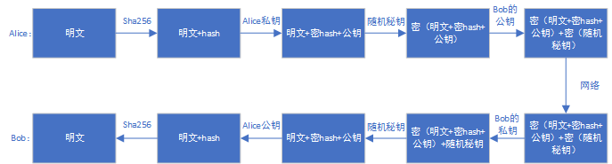
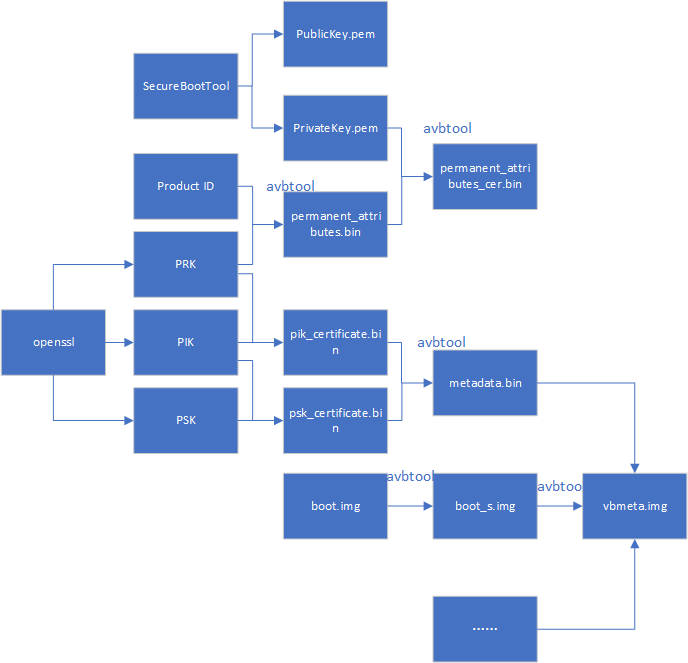
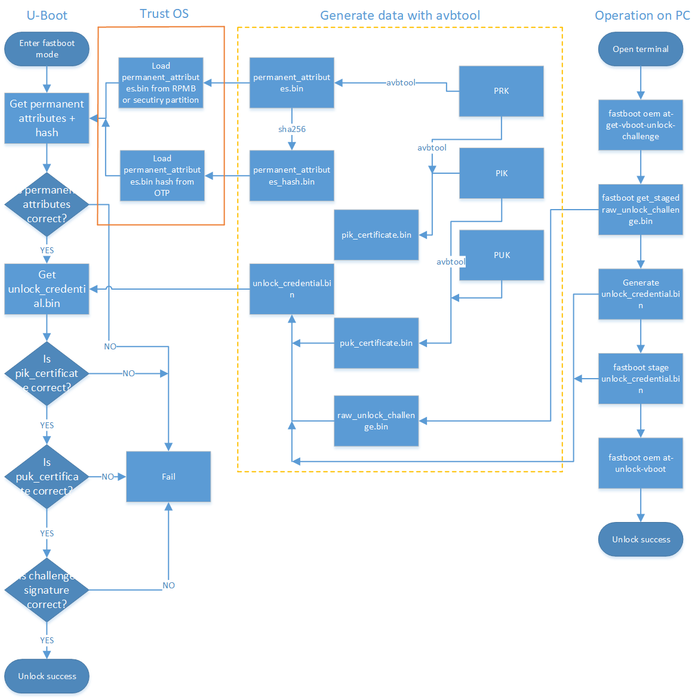
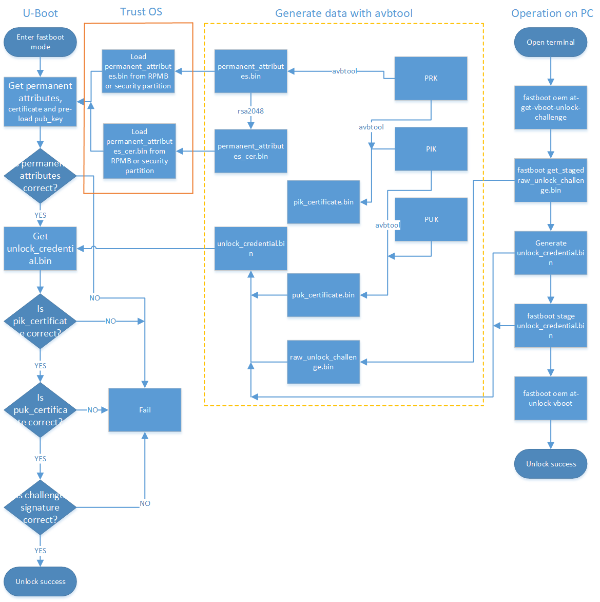
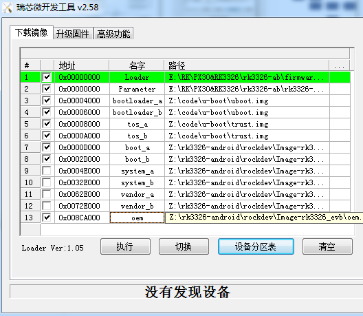
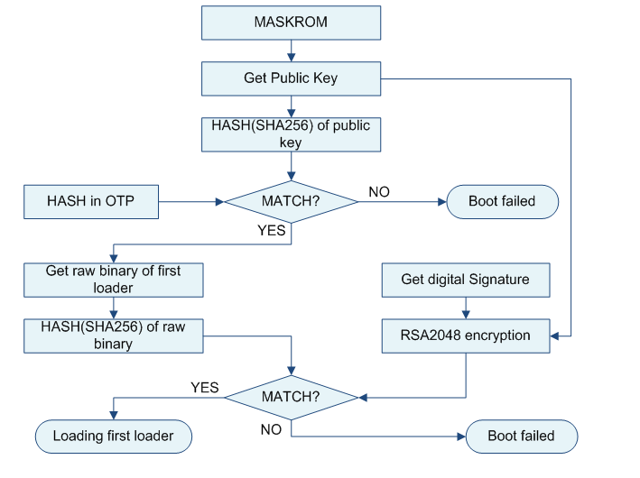
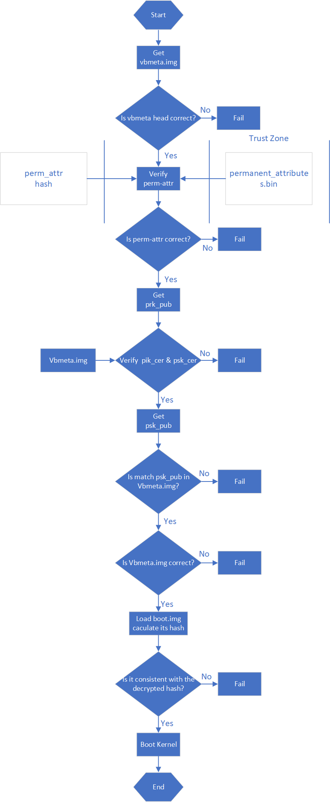
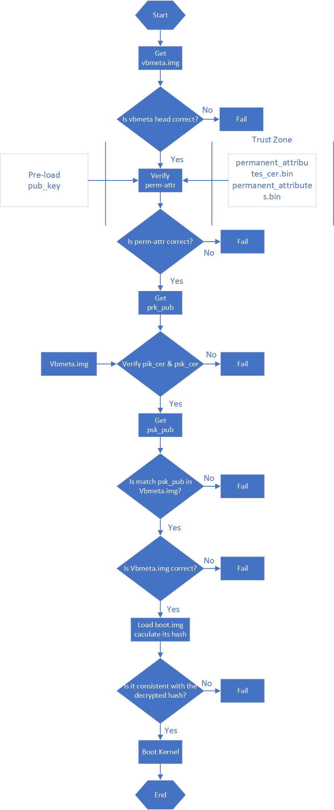
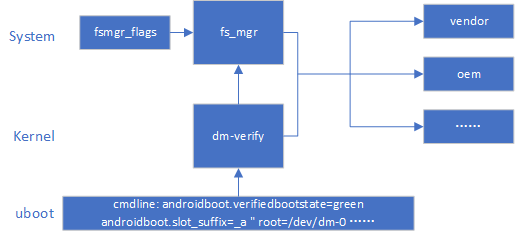

# Rockchip Secure Boot

发布版本：2.0

作者邮箱：jason.zhu@rock-chips.com

日期：2019.09

文件密级：公开资料

------

**前言**

**概述**

本文档将详细介绍基于 Rockchip U-boot next-dev 的 secure boot 流程。

**读者对象**

本文档（本指南）主要适用于以下工程师：

技术支持工程师

软件开发工程师

**产品版本**

**修订记录**

| **日期**   | **版本** | **作者**  | **修改说明**       |
| ---------- | -------- | --------- | ------------------ |
| 2019-01-14 | V1.0     | Jason Zhu | 初始版本           |
| 2019-06-03 | V1.1     | Jason Zhu | 修正一些不恰当描述 |
| 2019-09-19 | V2.0  | Jason Zhu | 版本更新 |

------

[TOC]

------
## 1 引用参考

《Rockchip-Secure-Boot-Application-Note.md》

《Android Verified Boot 2.0》

《Rockchip_Developer_Guide_Linux4.4_SecureBoot_CN.pdf》

## 2 术语

AVB : Android Verified Boot

OTP & efuse : One Time Programmable

Product RootKey (PRK)：AVB 的 root key 由签名 loader，uboot & trust 的 root key 校验

ProductIntermediate Key (PIK)：中间 key，中介作用

ProductSigning Key (PSK)：用于签固件的 key

ProductUnlock Key (PUK)：用于解锁设备

**各种key分离，职责明确，可以降低key被泄露的风险。**

## 3 简介

本文介绍 Rockchip 安全验证引导流程。所谓的安全验证引导流程分为安全性校验与完整性校验。安全性校验是加密公钥的校验，流程为从安全存储（OTP & efuse）中读取公钥 hash，与计算的公钥 hash 对比，是否一致，然后公钥用于解密固件 hash。完整性校验为校验固件的完整性，流程为从存储里加载固件，计算固件的 hash 与解密出来的 hash 对比是否一致。

## 4 通信加密例子

设备的安全验证启动流程与通信中的数据加密校验流程类似，通过该例子可以加速对 avb 校验流程的理解。假如现在 Alice 向 Bob 传送数字信息，为了保证信息传送的保密性、真实性、完整性和不可否认性，需要对传送的信息进行数字加密和签名，其传送过程为：

1.Alice 准备好要传送的数字信息（明文）；

2.Alice 对数字信息进行哈希运算，得到一个信息摘要；

3.Alice 用自己的私钥对信息摘要进行加密得到 Alice 的数字签名，并将其附在数字信息上；

4.Alice 随机产生一个加密密钥，并用此密码对要发送的信息进行加密，形成密文；

5.Alice 用 Bob 的公钥对刚才随机产生的加密密钥进行加密，将加密后的 DES 密钥连同密文一起传送给 Bob；

6.Bob 收到 Alice 传送来的密文和加密过的 DES 密钥，先用自己的私钥对加密的 DES 密钥进行解密，得到 Alice 随机产生的加密密钥；

7.Bob 然后用随机密钥对收到的密文进行解密，得到明文的数字信息，然后将随机密钥抛弃；

8.Bob 用 Alice 的公钥对 Alice 的数字签名进行解密，得到信息摘要；

9.Bob 用相同的哈希算法对收到的明文再进行一次哈希运算，得到一个新的信息摘要；

10.Bob 将收到的信息摘要和新产生的信息摘要进行比较，如果一致，说明收到的信息没有被修改过。

上面提及的 DES 算法可以更换其他算法，如 AES 加密算法，公私钥算法可以采用 RSA 算法，流程如下：



## 5 AVB

AVB 为 Android Verified Boot，谷歌设计的一套固件校验流程，主要用于校验 boot system 等固件。Rockchip Secure Boot 参考通信中的校验方式及 AVB，实现一套完整的 Secure Boot 校验方案。

### 5.1 AVB 支持特性

- 安全校验

- 完整性校验

- 防回滚保护

- persistent partition 支持

- chained partitions 支持，可以与 boot，system 签名私钥一致，也可以由 oem 自己保存私钥，但必须由 PRK 签名

### 5.2 key，固件签名及证书生成

```shell
#!/bin/sh
touch temp.bin
openssl genpkey -algorithm RSA -pkeyopt rsa_keygen_bits:4096 -outform PEM -out testkey_prk.pem
openssl genpkey -algorithm RSA -pkeyopt rsa_keygen_bits:4096 -outform PEM -out testkey_psk.pem
openssl genpkey -algorithm RSA -pkeyopt rsa_keygen_bits:4096 -outform PEM -out testkey_pik.pem
python avbtool make_atx_certificate --output=pik_certificate.bin --subject=temp.bin --subject_key=testkey_pik.pem --subject_is_intermediate_authority --subject_key_version 42 --authority_key=testkey_prk.pem
python avbtool make_atx_certificate --output=psk_certificate.bin --subject=product_id.bin --subject_key=testkey_psk.pem --subject_key_version 42 --authority_key=testkey_pik.pem
python avbtool make_atx_metadata --output=metadata.bin --intermediate_key_certificate=pik_certificate.bin --product_key_certificate=psk_certificate.bin
```

permanent_attributes.bin 生成：

```shell
python avbtool make_atx_permanent_attributes --output=permanent_attributes.bin --product_id=product_id.bin --root_authority_key=testkey_prk.pem
```

其中 product_id.bin 需要自己定义，占 16 字节，可作为产品 ID 定义。

boot.img 签名示例：

```shell
avbtool add_hash_footer --image boot.img --partition_size 33554432 --partition_name boot --key testkey_psk.pem --algorithm SHA256_RSA4096
```

**注意：partition size 要至少比原固件大 64K，大小还要 4K 对齐，且不大于 parameter.txt 定义的分区大小。**

sytem.img 签名示例：

```shell
avbtool add_hashtree_footer --partition_size 536870912 --partition_name system --image system.img --algorithm SHA256_RSA4096 --key testkey_psk.pem
```

生成 vbmeta 包含 metadata.bin，命令示例如下：

```shell
python avbtool make_vbmeta_image --public_key_metadata metadata.bin --include_descriptors_from_image boot.img --include_descriptors_from_image system.img --generate_dm_verity_cmdline_from_hashtree system.img --algorithm SHA256_RSA4096 --key testkey_psk.pem  --output vbmeta.img
```

最终把生成的 vbmeta.img 烧写到对应的分区，如 vbmeta 分区。

通过 SecureBootTool 生成 PrivateKey.pem 和 PublicKey.pem。


对 permanent_attributes.bin 进行签名：

```shell
openssl dgst -sha256 -out permanent_attributes_cer.bin -sign PrivateKey.pem permanent_attributes.bin
```

permanent_attributes.bin 是整个系统的安全认证数据，它需要烧写它的 hash 到 efuse 或 OTP，或它的数据由前级的安全认证（pre-load）。由于 rockchip 平台规划的 efuse 不足，所以 permanent_attributes.bin 的验证由前级的公钥加permanent_attributes.bin 的证书进行认证。而对于有OTP的平台，安全数据空间足够，会直接烧写permanent_attributes.bin 的 hash 到 OTP。

各个平台efuse与OTP支持情况：

| **平台** | **efuse** | **OTP** |
| -------- | --------- | ------- |
| rk3399   | ✔         |         |
| rk3368   | ✔         |         |
| rk3328   |           | ✔       |
| rk3326   |           | ✔       |
| rk3308   |           | ✔       |
| rk3288   | ✔         |         |
| rk3229   | ✔         |         |
| rk3126   | ✔         |         |
| rk3128   | ✔         |         |

efuse 平台 pub_key 烧写：

```
fastboot stage permanent_attributes.bin
fastboot oem fuse at-perm-attr
fastboot stage permanent_attributes_cer.bin
fastboot oem fuse at-rsa-perm-attr
```

OTP 平台 pub_key 烧写：

```
fastboot stage permanent_attributes.bin
fastboot oem fuse at-perm-attr
```

整个签名流程：



### 5.3 AVB lock

```
fastboot oem at-lock-vboot
```

如何进入 fastboot 见 fastboot 命令支持章节。

### 5.4 AVB unlock

目前 Rockchip 采用严格安全校验，需要在对应的defconfig内添加

```
CONFIG_RK_AVB_LIBAVB_ENABLE_ATH_UNLOCK=y
```

否则输入 fastboot oem at-unlock-vboot 就可以解锁设备，启动校验 vbmeta.img，boot.img 失败也会成功启动设备。

首先，需要生成 PUK：

```shell
openssl genpkey -algorithm RSA -pkeyopt rsa_keygen_bits:4096 -outform PEM -out testkey_puk.pem
```

unlock_credential.bin 为需要下载到设备解锁的证书，其生成过程如下：

```shell
python avbtool make_atx_certificate --output=puk_certificate.bin --subject=product_id.bin --subject_key=testkey_puk.pem --usage=com.google.android.things.vboot.unlock --subject_key_version 42 --authority_key=testkey_pik.pem
```

从设备获取 unlock_credential.bin，使用 avb-challenge-verify.py 脚本获取 unlock_credential.bin，执行下列命令获取 unlock_credential.bin：

```shell
python avbtool make_atx_unlock_credential --output=unlock_credential.bin --intermediate_key_certificate=pik_certificate.bin --unlock_key_certificate=puk_certificate.bin --challenge=unlock_challenge.bin --unlock_key=testkey_puk.pem
```

最终可以把证书通过 fastboot 命令下载到设备，并解锁设备，fastboot 命令如下：

```
fastboot stage unlock_credential.bin
fastboot oem at-unlock-vboot
```

最后 OTP 设备解锁流程：



最后 efuse 设备解锁流程：



最后操作流程如下：

1. 设备进入 fastboot 模式，电脑端输入

```
fastboot oem at-get-vboot-unlock-challenge
fastboot get_staged raw_unlock_challenge.bin
```

获得带版本、Product Id 与 16 字节的随机数的数据，取出随机数作为 unlock_challenge.bin。

2. 使用 avbtool 生成 unlock_credential.bin，参考make_unlock.sh。

3. 电脑端输入

```
fastboot stage unlock_credential.bin
fastboot oem at-unlock-vboot
```

**注意**：此时设备状态一直处于第一次进入 fastboot 模式状态，在此期间不能断电、关机、重启。因为步骤 1.做完后，设备存储着生成的随机数，如果断电、关机、重启，会导致随机数丢失，后续校验 challenge signature 会因为随机数不匹配失败。

如果开启：

```
CONFIG_MISC=y
CONFIG_ROCKCHIP_EFUSE=y
CONFIG_ROCKCHIP_OTP=y
```

就会使用 CPUID 作为 challenge number，而 CPUID 是与机器匹配的，数据不会因为关机而丢失，生成的unlock_credential.bin 可以重复使用。省去重复生成unlock_challenge.bin，制作unlock_credential.bin的步骤。再次解锁步骤变为：

```
fastboot oem at-get-vboot-unlock-challenge
fastboot stage unlock_credential.bin
fastboot oem at-unlock-vboot
```

4. 设备进入解锁状态，开始解锁。

make_unlock.sh 参考

```shell
#!/bin/sh
python avb-challenge-verify.py raw_unlock_challenge.bin product_id.bin
python avbtool make_unlock_credential --output=unlock_credential.bin --intermediate_key_certificate=pik_certificate.bin --unlock_key_certificate=puk_certificate.bin --challenge=unlock_challenge.bin --unlock_key=testkey_puk.pem
```

avb-challenge-verify.py 源码

```python
#/user/bin/env python
"This is a test module for getting unlock_challenge.bin"
import sys
import  os
from hashlib import sha256

def challenge_verify():
	if (len(sys.argv) != 3) :
		print "Usage: rkpublickey.py [challenge_file] [product_id_file]"
		return
	if ((sys.argv[1] == "-h") or (sys.argv[1] == "--h")):
		print "Usage: rkpublickey.py [challenge_file] [product_id_file]"
		return
	try:
		challenge_file = open(sys.argv[1], 'rb')
		product_id_file = open(sys.argv[2], 'rb')
		challenge_random_file = open('unlock_challenge.bin', 'wb')
		challenge_data = challenge_file.read(52)
		product_id_data = product_id_file.read(16)
		product_id_hash = sha256(product_id_data).digest()
		print("The challege version is %d" %ord(challenge_data[0]))
		if (product_id_hash != challenge_data[4:36]) :
			print("Product id verify error!")
			return
		challenge_random_file.write(challenge_data[36:52])
		print("Success!")

	finally:
		if challenge_file:
			challenge_file.close()
		if product_id_file:
			product_id_file.close()
		if challenge_random_file:
			challenge_random_file.close()

if __name__ == '__main__':
	challenge_verify()
```

### 5.5 U-boot 使能

开启 avb 需要 trust 支持，需要 U-Boot 在 defconfig 文件中配置：

```c
CONFIG_OPTEE_CLIENT=y
CONFIG_OPTEE_V1=y
CONFIG_OPTEE_ALWAYS_USE_SECURITY_PARTITION=y  // 安全数据存储到security分区
```

CONFIG_OPTEE_V1：适用平台有 312x,322x,3288,3228H,3368,3399。
CONFIG_OPTEE_V2：适用平台有 3326,3308。
CONFIG_OPTEE_ALWAYS_USE_SECURITY_PARTITION：当 emmc 的 rpmb 不能用，才开这个宏，默认不开。

avb 开启需要在 defconfig 文件中配置：

```c
CONFIG_AVB_LIBAVB=y
CONFIG_AVB_LIBAVB_AB=y
CONFIG_AVB_LIBAVB_ATX=y
CONFIG_AVB_LIBAVB_USER=y
CONFIG_RK_AVB_LIBAVB_USER=y
// 上面几个为必选，下面选择为支持 AVB 与 A/B 特性，两个特性可以分开使用。
CONFIG_ANDROID_AB=y //这个支持 A/B
CONFIG_ANDROID_AVB=y //这个支持 AVB
// 下面宏为仅有 efuse 的平台使用
CONFIG_ROCKCHIP_PRELOADER_PUB_KEY=y
// 下面宏需要严格unlock校验时候打开
CONFIG_RK_AVB_LIBAVB_ENABLE_ATH_UNLOCK=y
// 安全校验开启
CONFIG_AVB_VBMETA_PUBLIC_KEY_VALIDATE=y
// 如果需要cpuid作为challenge number，开启以下宏
CONFIG_MISC=y
CONFIG_ROCKCHIP_EFUSE=y
CONFIG_ROCKCHIP_OTP=y
```

### 5.6 kernel 修改

system，vendor，oem 等分区的校验由 kernel 的 dm-verify 模块加载校验，所以需要使能该模块。

使能 AVB 需要在 kernel dts 上配置参数 avb，参考如下：

```c
&firmware_android {
	compatible = "android,firmware";
	boot_devices = "fe330000.sdhci";
	vbmeta {
		compatible = "android,vbmeta";
		parts = "vbmeta,boot,system,vendor,dtbo";
	};
	fstab {
		compatible = "android,fstab";
		vendor {
			compatible = "android,vendor";
			dev = "/dev/block/by-name/vendor";
			type = "ext4";
			mnt_flags = "ro,barrier=1,inode_readahead_blks=8";
			fsmgr_flags = "wait,avb";
		};
	};
};
```

使能 A/B system 需要配置 slotselect 参数，参考如下：

```c
firmware {
	android {
		compatible = "android,firmware";
		fstab {
			compatible = "android,fstab";
			system {
				compatible = "android,system";
				dev = "/dev/block/by-name/system";
				type = "ext4";
				mnt_flags = "ro,barrier=1,inode_readahead_blks=8";
				fsmgr_flags = "wait,verify,slotselect";
			};
			vendor {
				compatible = "android,vendor";
				dev = "/dev/block/by-name/vendor";
				type = "ext4";
				mnt_flags = "ro,barrier=1,inode_readahead_blks=8";
				fsmgr_flags = "wait,verify,slotselect";
			};
		};
	};
};
```

### 5.7 Android SDK 一些配置说明

#### AVB Enable

使能 BOARD_AVB_ENABLE

#### A/B system

这些变量主要有三类：

- `A/B`系统必须定义的变量
  - `AB_OTA_UPDATER := true`
  - `AB_OTA_PARTITIONS := boot system vendor`
  - `BOARD_BUILD_SYSTEM_ROOT_IMAGE := true`
  - `TARGET_NO_RECOVERY := true`
  - `BOARD_USES_RECOVERY_AS_BOOT := true`
  - `PRODUCT_PACKAGES += update_engine update_verifier`
- `A/B`系统可选定义的变量
  - `PRODUCT_PACKAGES_DEBUG += update_engine_client`
- `A/B`系统不能定义的变量
  - `BOARD_RECOVERYIMAGE_PARTITION_SIZE`
  - `BOARD_CACHEIMAGE_PARTITION_SIZE`
  - `BOARD_CACHEIMAGE_FILE_SYSTEM_TYPE`

### 5.8 CMDLINE 新内容

```
Kernel command line: androidboot.verifiedbootstate=green androidboot.slot_suffix=_a dm="1 vroot none ro 1,0 1031864 verity 1 PARTUUID=b2110000-0000-455a-8000-44780000706f PARTUUID=b2110000-0000-455a-8000-44780000706f 4096 4096 128983 128983 sha1 90d1d406caac04b7e3fbf48b9a4dcd6992cc628e 4172683f0d6b6085c09f6ce165cf152fe3523c89 10 restart_on_corruption ignore_zero_blocks use_fec_from_device PARTUUID=b2110000-0000-455a-8000-44780000706f fec_roots 2 fec_blocks 130000 fec_start 130000" root=/dev/dm-0 androidboot.vbmeta.device=PARTUUID=f24f0000-0000-4e1b-8000-791700006a98 androidboot.vbmeta.avb_version=1.1 androidboot.vbmeta.device_state=unlocked androidboot.vbmeta.hash_alg=sha512 androidboot.vbmeta.size=6528 androidboot.vbmeta.digest=41991c02c82ea1191545c645e2ac9cc7ca08b3da0a2e3115aff479d2df61feaccdd35b6360cfa936f6f4381e4557ef18e381f4b236000e6ecc9ada401eda4cae androidboot.vbmeta.invalidate_on_error=yes androidboot.veritymode=enforcing
```

这里说明几个参数：

1. 为什么传递 vbmeta 的 PARTUUID？因为确保后续使用 vbmeta hash-tree 的合法性，需要 kernel 再校验一遍 vbmeta，digest 为 androidboot.vbmeta.digest。

2. skip_initramfs：boot ramdisk 有无打包到 boot.img 问题，在 A/B system 中，ramdisk 是没有打包到 boot.img，cmdline需要传递这个参数。

3. root=/dev/dm-0 开启 dm-verify，指定system。

4. androidboot.vbmeta.device_state：android verify 状态

5. androidboot.verifiedbootstate：校验结果。

green：If in LOCKED state and an the key used for verification was not set by the end user。

yellow：If in LOCKED state and an the key used for verification was set by the end user。

orange：If in the UNLOCKED state。

**这里特别说明一下 dm="1 vroot none ro……"参数生成：**

```shell
avbtool make_vbmeta_image --include_descriptors_from_image boot.img --include_descriptors_from_image system.img --generate_dm_verity_cmdline_from_hashtree system.img --include_descriptors_from_image vendor.img --algorithm SHA512_RSA4096 --key testkey_psk.pem --public_key_metadata metadata.bin --output vbmeta.img
```

avbtool 生成 vbmeta 时，对 system 固件加--generate_dm_verity_cmdline_from_hashtree 即可。dm="1 vroot none ro……"这些信息会保存到 vbmeta。这部分安卓专用，如果分区只校验到 boot.img，无需增加该参数。

Android SDK 开启 BOARD_AVB_ENABLE 会把这些信息加到 vbmeta 内。

## 6 分区参考

新增加 vbmeta 分区与 security 分区，vbmeta 分区存储固件校验信息，security 分区存储加密过的安全数据。

```
FIRMWARE_VER:8.0
MACHINE_MODEL:RK3326
MACHINE_ID:007
MANUFACTURER: RK3326
MAGIC: 0x5041524B
ATAG: 0x00200800
MACHINE: 3326
CHECK_MASK: 0x80
PWR_HLD: 0,0,A,0,1
TYPE: GPT
CMDLINE:mtdparts=rk29xxnand:0x00002000@0x00004000(uboot),0x00002000@0x00006000(trust),0x00002000@0x00008000(misc),0x00008000@0x0000a000(resource),0x00010000@0x00012000(kernel),0x00002000@0x00022000(dtb),0x00002000@0x00024000(dtbo),0x00000800@0x00026000(vbmeta),0x00010000@0x00026800(boot),0x00020000@0x00036800(recovery),0x00038000@0x00056800(backup),0x00002000@0x0008e800(security),0x000c0000@0x00090800(cache),0x00514000@0x00150800(system),0x00008000@0x00664800(metadata),0x000c0000@0x0066c800(vendor),0x00040000@0x0072c800(oem),0x00000400@0x0076c800(frp),-@0x0076cc00(userdata:grow)
uuid:system=af01642c-9b84-11e8-9b2a-234eb5e198a0
```

A/B System 分区定义参考：

```
FIRMWARE_VER:8.1
MACHINE_MODEL:RK3326
MACHINE_ID:007
MANUFACTURER: RK3326
MAGIC: 0x5041524B
ATAG: 0x00200800
MACHINE: 3326
CHECK_MASK: 0x80
PWR_HLD: 0,0,A,0,1
TYPE: GPT
CMDLINE: mtdparts=rk29xxnand:0x00002000@0x00004000(uboot_a),0x00002000@0x00006000(uboot_b),0x00002000@0x00008000(trust_a),0x00002000@0x0000a000(trust_b),0x00001000@0x0000c000(misc),0x00001000@0x0000d000(vbmeta_a),0x00001000@0x0000e000(vbmeta_b),0x00020000@0x0000e000(boot_a),0x00020000@0x0002e000(boot_b),0x00100000@0x0004e000(system_a),0x00300000@0x0032e000(system_b),0x00100000@0x0062e000(vendor_a),0x00100000@0x0072e000(vendor_b),0x00002000@0x0082e000(oem_a),0x00002000@0x00830000(oem_b),0x0010000@0x00832000(factory),0x00008000@0x842000(factory_bootloader),0x00080000@0x008ca000(oem),-@0x0094a000(userdata)
```

## 7 fastboot 命令支持

U-Boot 下可以通过输入命令进入 fastboot：

```
fastboot usb 0
```

### 7.1 fastboot 支持命令速览

```
fastboot flash < partition > [ < filename > ]
fastboot erase < partition >
fastboot getvar < variable > | all
fastboot set_active < slot >
fastboot reboot
fastboot reboot-bootloader
fastboot flashing unlock
fastboot flashing lock
fastboot stage [ < filename > ]
fastboot get_staged [ < filename > ]
fastboot oem fuse at-perm-attr-data
fastboot oem fuse at-perm-attr
fastboot oem fuse at-rsa-perm-attr
fastboot oem at-get-ca-request
fastboot oem at-set-ca-response
fastboot oem at-lock-vboot
fastboot oem at-unlock-vboot
fastboot oem at-disable-unlock-vboot
fastboot oem fuse at-bootloader-vboot-key
fastboot oem format
fastboot oem at-get-vboot-unlock-challenge
fastboot oem at-reset-rollback-index
```

### 7.2 fastboot 具体使用

1. fastboot flash < partition > [ < filename > ]

功能：分区烧写。

例： fastboot flash boot boot.img

2. fastboot erase < partition >

功能：擦除分区。

举例：fastboot erase boot

3. fastboot getvar < variable > | all

功能：获取设备信息

举例：fastboot getvar all （获取设备所有信息）

variable 还可以带的参数：

```
version                               /* fastboot 版本 */
version-bootloader                    /* U-Boot 版本 */
version-baseband
product                               /* 产品信息 */
serialno                              /* 序列号 */
secure                                /* 是否开启安全校验 */
max-download-size                     /* fastboot 支持单次传输最大字节数 */
logical-block-size                    /* 逻辑块数 */
erase-block-size                      /* 擦除块数 */
partition-type : < partition >        /* 分区类型 */
partition-size : < partition >        /* 分区大小 */
unlocked                              /* 设备lock状态 */
off-mode-charge
battery-voltage
variant
battery-soc-ok
slot-count                            /* slot 数目 */
has-slot: < partition >               /* 查看slot内是否有该分区名 */
current-slot                          /* 当前启动的slot */
slot-suffixes                         /* 当前设备具有的slot,打印出其name */
slot-successful: < _a | _b >          /* 查看分区是否正确校验启动过 */
slot-unbootable: < _a | _b >          /* 查看分区是否被设置为unbootable */
slot-retry-count: < _a | _b >         /* 查看分区的retry-count次数 */
at-attest-dh
at-attest-uuid
at-vboot-state
```

fastboot getvar all 举例：

```
PS E:\U-Boot-AVB\adb> .\fastboot.exe getvar all
(bootloader) version:0.4
(bootloader) version-bootloader:U-Boot 2017.09-gc277677
(bootloader) version-baseband:N/A
(bootloader) product:rk3229
(bootloader) serialno:7b2239270042f8b8
(bootloader) secure:yes
(bootloader) max-download-size:0x04000000
(bootloader) logical-block-size:0x512
(bootloader) erase-block-size:0x80000
(bootloader) partition-type:bootloader_a:U-Boot
(bootloader) partition-type:bootloader_b:U-Boot
(bootloader) partition-type:tos_a:U-Boot
(bootloader) partition-type:tos_b:U-Boot
(bootloader) partition-type:boot_a:U-Boot
(bootloader) partition-type:boot_b:U-Boot
(bootloader) partition-type:system_a:ext4
(bootloader) partition-type:system_b:ext4
(bootloader) partition-type:vbmeta_a:U-Boot
(bootloader) partition-type:vbmeta_b:U-Boot
(bootloader) partition-type:misc:U-Boot
(bootloader) partition-type:vendor_a:ext4
(bootloader) partition-type:vendor_b:ext4
(bootloader) partition-type:oem_bootloader_a:U-Boot
(bootloader) partition-type:oem_bootloader_b:U-Boot
(bootloader) partition-type:factory:U-Boot
(bootloader) partition-type:factory_bootloader:U-Boot
(bootloader) partition-type:oem_a:ext4
(bootloader) partition-type:oem_b:ext4
(bootloader) partition-type:userdata:ext4
(bootloader) partition-size:bootloader_a:0x400000
(bootloader) partition-size:bootloader_b:0x400000
(bootloader) partition-size:tos_a:0x400000
(bootloader) partition-size:tos_b:0x400000
(bootloader) partition-size:boot_a:0x2000000
(bootloader) partition-size:boot_b:0x2000000
(bootloader) partition-size:system_a:0x20000000
(bootloader) partition-size:system_b:0x20000000
(bootloader) partition-size:vbmeta_a:0x10000
(bootloader) partition-size:vbmeta_b:0x10000
(bootloader) partition-size:misc:0x100000
(bootloader) partition-size:vendor_a:0x4000000
(bootloader) partition-size:vendor_b:0x4000000
(bootloader) partition-size:oem_bootloader_a:0x400000
(bootloader) partition-size:oem_bootloader_b:0x400000
(bootloader) partition-size:factory:0x2000000
(bootloader) partition-size:factory_bootloader:0x1000000
(bootloader) partition-size:oem_a:0x10000000
(bootloader) partition-size:oem_b:0x10000000
(bootloader) partition-size:userdata:0x7ad80000
(bootloader) unlocked:no
(bootloader) off-mode-charge:0
(bootloader) battery-voltage:0mv
(bootloader) variant:rk3229_evb
(bootloader) battery-soc-ok:no
(bootloader) slot-count:2
(bootloader) has-slot:bootloader:yes
(bootloader) has-slot:tos:yes
(bootloader) has-slot:boot:yes
(bootloader) has-slot:system:yes
(bootloader) has-slot:vbmeta:yes
(bootloader) has-slot:misc:no
(bootloader) has-slot:vendor:yes
(bootloader) has-slot:oem_bootloader:yes
(bootloader) has-slot:factory:no
(bootloader) has-slot:factory_bootloader:no
(bootloader) has-slot:oem:yes
(bootloader) has-slot:userdata:no
(bootloader) current-slot:a
(bootloader) slot-suffixes:a,b
(bootloader) slot-successful:a:yes
(bootloader) slot-successful:b:no
(bootloader) slot-unbootable:a:no
(bootloader) slot-unbootable:b:yes
(bootloader) slot-retry-count:a:0
(bootloader) slot-retry-count:b:0
(bootloader) at-attest-dh:1:P256
(bootloader) at-attest-uuid:
all: Done!
finished. total time: 0.636s
```

4. fastboot set_active < slot >

功能：设置重启的 slot。

举例：fastboot set_active _a

5. fastboot reboot

功能：重启设备，正常启动

举例：fastboot reboot

6. fastboot reboot-bootloader

功能：重启设备，进入 fastboot 模式

举例：fastboot reboot-bootloader

7. fastboot flashing unlock

功能：解锁设备，允许烧写固件

举例：fastboot flashing unlock

8. fastboot flashing lock

功能：锁定设备，禁止烧写

举例：fastboot flashing lock

9. fastboot stage [ < filename > ]

功能：下载数据到设备端内存，内存起始地址为 CONFIG_FASTBOOT_BUF_ADDR

举例：fastboot stage permanent_attributes.bin

10. fastboot get_staged [ < filename > ]

功能：从设备端获取数据

举例：fastboot get_staged raw_unlock_challenge.bin

11. fastboot oem fuse at-perm-attr

功能：烧写 permanent_attributes.bin 及 hash

举例：fastboot stage permanent_attributes.bin

fastboot oem fuse at-perm-attr

12. fastboot oem fuse at-perm-attr-data

功能：只烧写 permanent_attributes.bin 到安全存储区域（RPMB）

举例：fastboot stage permanent_attributes.bin

fastboot oem fuse at-perm-attr-data

13. fastboot oem at-get-ca-request

14. fastboot oem at-set-ca-response

15. fastboot oem at-lock-vboot

功能：锁定设备

举例：fastboot oem at-lock-vboot

16. fastboot oem at-unlock-vboot

功能：解锁设备，现支持 authenticated unlock

举例：fastboot oem at-get-vboot-unlock-challenge
fastboot get_staged raw_unlock_challenge.bin

./make_unlock.sh（见 make_unlock.sh 参考）
fastboot stage unlock_credential.bin
fastboot oem at-unlock-vboot

17. fastboot oem fuse at-bootloader-vboot-key

功能：烧写 bootloader key hash

举例：fastboot stage bootloader-pub-key.bin

fastboot oem fuse at-bootloader-vboot-key

18. fastboot oem format

功能：重新格式化分区，分区信息依赖于$partitions

举例：fastboot oem format

19. fastboot oem at-get-vboot-unlock-challenge

功能：authenticated unlock，需要获得 unlock challenge 数据

举例：参见 16. fastboot oem at-unlock-vboot

20. fastboot oem at-reset-rollback-index

功能：复位设备的 rollback 数据

举例：fastboot oem at-reset-rollback-index

21. fastboot oem at-disable-unlock-vboot

功能：使 fastboot oem at-unlock-vboot 命令失效

举例：fastboot oem at-disable-unlock-vboot

## 8 固件烧写（windows）


A/B System 烧写



## 9 pre loader verified

参见《Rockchip-Secure-Boot-Application-Note.md》



## 10 U-boot verified

OTP 设备校验流程：



efuse设备校验流程：



## 11 系统校验启动



系统启动到 kernel，kernel 首先解析 U-Boot 传递的 cmdline 参数，确认系统启动是否使用 dm-verify。然后加载启用 system 的 fs_mgr 服务。fs_mgr 依据 fsmgr_flags 的参数来校验加载固件，固件 hash & hash tree 存放于 vbmeta.img。主要有如下参数：

avb：使用 avb 的方式加载校验分区

slotselect：该分区分 A/B，加载时会使用到 cmdline 的"androidboot.slot_suffix=_a"这个参数。

## 12 基于 linux 环境的 AVB 操作及验证流程

### 12.1 操作流程

1. 生成整套固件
2. 使用 SecureBootConsole 生成 PrivateKey.pem 与 PublicKey.pem，工具为 rk_sign_tool，命令如下：

```
rk_sign_tool cc --chip 3399
rk_sign_tool kk --out .
```

3. load key

```
rk_sign_tool lk --key privateKey.pem --pubkey publicKey.pem
```

4. 签名 loader

```
rk_sign_tool sl --loader loader.bin
```

5. 签名 uboot.img & trust.img

```
rk_sign_tool si --img uboot.img
rk_sign_tool si --img trust.img
```

6. avb 签名固件准备：准备空的 temp.bin，16 字节的 product_id.bin，待签名的 boot.img，运行下列代码

```
#!/bin/bash
touch temp.bin
openssl genpkey -algorithm RSA -pkeyopt rsa_keygen_bits:4096 -outform PEM -out testkey_prk.pem
openssl genpkey -algorithm RSA -pkeyopt rsa_keygen_bits:4096 -outform PEM -out testkey_psk.pem
openssl genpkey -algorithm RSA -pkeyopt rsa_keygen_bits:4096 -outform PEM -out testkey_pik.pem
python avbtool make_atx_certificate --output=pik_certificate.bin --subject=temp.bin --subject_key=testkey_pik.pem --subject_is_intermediate_authority --subject_key_version 42 --authority_key=testkey_prk.pem
python avbtool make_atx_certificate --output=psk_certificate.bin --subject=product_id.bin --subject_key=testkey_psk.pem --subject_key_version 42 --authority_key=testkey_pik.pem
python avbtool make_atx_metadata --output=metadata.bin --intermediate_key_certificate=pik_certificate.bin --product_key_certificate=psk_certificate.bin
python avbtool make_atx_permanent_attributes --output=permanent_attributes.bin --product_id=product_id.bin --root_authority_key=testkey_prk.pem
python avbtool add_hash_footer --image boot.img --partition_size 33554432 --partition_name boot --key testkey_psk.pem --algorithm SHA256_RSA4096
python avbtool make_vbmeta_image --public_key_metadata metadata.bin --include_descriptors_from_image boot.img --algorithm SHA256_RSA4096 --key testkey_psk.pem  --output vbmeta.img
openssl dgst -sha256 -out permanent_attributes_cer.bin -sign PrivateKey.pem permanent_attributes.bin
```

生成 vbmeta.img，permanent_attributes_cer.bin，permanent_attributes.bin。

该步骤就签名了 boot.img……

7.固件烧写

```
rkdeveloptool db loader.bin
rkdeveloptool ul loader.bin
rkdeveloptool gpt parameter.txt
rkdeveloptool wlx uboot uboot.img
rkdeveloptool wlx trust trust.img
rkdeveloptool wlx boot boot.img
rkdeveloptool wlx system system.img
```

rkdeveloptool 可以参考<https://github.com/rockchip-linux/rkdeveloptool>

8. 烧写 permanent_attributes_cer.bin，permanent_attributes.bin

有OTP平台：

```
fastboot stage permanent_attributes.bin
fastboot oem fuse at-perm-attr
```

有 efuse 平台：

```
fastboot stage permanent_attributes.bin
fastboot oem fuse at-perm-attr
fastboot stage permanent_attributes_cer.bin
fastboot oem fuse at-rsa-perm-attr
```

9. efuse 烧写（efuse 工具目前只有 windows 版本），选择特定的 loader，选择对应的设备，点击启动烧写。


10. OTP 平台 loader public key烧写

参考《Rockchip-Secure-Boot-Application-Note.md》

### 12.2 验证流程

to-do.