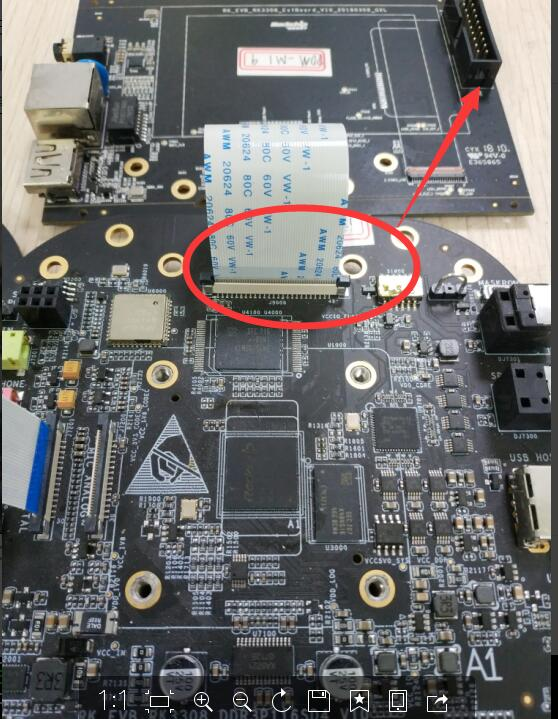
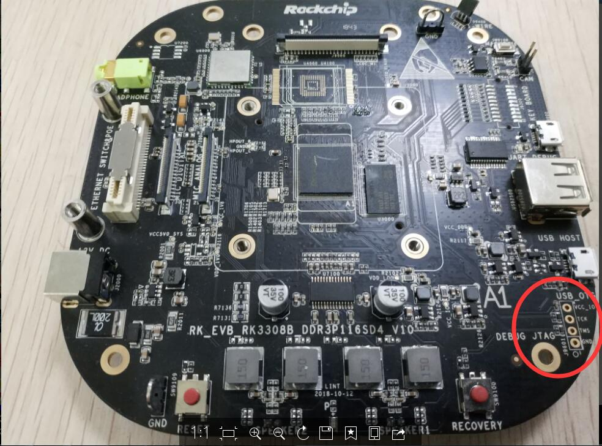

# RK3308 开发汇总

发布版本：1.0

日期：2018.12

作者邮箱：

文件密级：内部资料

**修订记录**

| **日期**    | **版本** | **作者** | **修改说明**         |
| --------- | ------ | ------ | ---------------- |
| 2018.10.14 | V1.0   | 闫孝军  | 初始版本 |

[TOC]

## SOC Features

RK3308 CPU 为四核 A35。带VAD和其他丰富的音频接口，无GPU。SOC目前有4个变种。

| SOC     | Features                                                     |
| ------- | ------------------------------------------------------------ |
| RK3308  | 初始版本                                                     |
| RK3308G | 在RK3308的基础上合封64M DDR2                                 |
| RK3308B | 在RK3308的基础上增加更加灵活的IO复用，比如GMAC和LCDC高位分开，PWM增加到12路 |
| RK3308H | 在RK3308B的基础上合封64M DDR2                                |

以上4个变种还有对应的宽温版本，后缀加K。宽温版本主要是封装上做了增强，其他逻辑不变。

RK3308/RK3308G 与 RK3308B/RK3308H 可以通过GRF_CHIP_ID 区分：

RK3308/RK3308G: 0xcea (3306)

RK3308B/RK3308H: 0x3308

其他更进一步的区分通过OTP。

这些变种在封装上 pin2pin，所以硬件上可以直接互换，比如原来贴 RK3308 的板子可以换成 RK3308B，把板子上贴的 DDR 去掉，可以直接换上内置 DDR2 的 RK3308G/RK3308H。

## AArch32 模式

为了满足64M小容量内存的需求，我们开发了32位的运行模式，具体实现方式为：在Trust 跳转到 U-Boot的时候将CPU从AArch64 切换到 AArch32 模式，之后U-Boot、Linux kernel、userspace都运行于AArch32模式。

## 频率电压

CPU最高运行频率为1296MHZ。

DDR运行频率为：393MHZ、451MHZ、589MHZ，主要考虑避开wifi 2.4G频段。DDR不变频。

ARM/LOGIC 分离供电。

## DS-5 连接

目前RK3308 所有的开发板 上都没有带JTAG接口，需要外接，而且不同的板子，连接方式不同：

RK3308-EVB-V10/V11/V12 通过扩展板接JTAG：



RK3308B-EVB-V10要通过板子右边预留过孔飞线，使用的时候要请硬件确认，因为还涉及到和其他复用跳线的情况。



## EVB板编译参考

[RK3308 SDK编译参考](http://10.10.10.164:9999/bin/view/Home/sdk/sdk%E5%B7%A5%E7%A8%8B%E5%9C%B0%E5%9D%80/RK3308/?tdsourcetag=s_pcqq_aiomsg)

## 启动速度

| Board               | Storage  | Mode    | DDR  | miniloader | trust | u-boot | kernel |
| ------------------- | -------- | ------- | ---- | ---------- | ----- | ------ | ------ |
| RK3308_VOICE_MODULE | SLC NAND | AArch32 | 10   | 242        | 13    | 628    | 530    |
| RK3308_EVB_V10      | eMMC     | AArch64 | 18   | 83         | 19    | 338    | 1125   |
| RK3308_EVB_V11      | SLC NAND | AArch64 | 18   | 270        | 18    | 653    | 1111   |
| RK3308B_EVB_V10     | SPI NAND | AArch64 |      | 420        | 19    | 696    | 1215   |

- 时间单位 ms

- 测试的时候dts中屏蔽掉u2phy，因为发现这个模块对启动速度有几百毫秒的不稳定影响（300或者600）

- DDR初始化时间仅供参考，发现时间不稳定，有时候十几毫秒，有时候打印出来只有1~2毫秒

- 测试固件\\10.10.10.164\Linux_Repository\RK3308\IMAGE\20181212-RK3308-RK3308B，u-boot，kernel自己编译

- u-boot：

  ```c
  commit f70f0bfd86cf8392694a891f5dc4b49db729dde7 (HEAD -> next-dev, origin/next-dev)
  Author: Jason Zhu <jason.zhu@rock-chips.com>
  Date:   Mon Nov 19 22:12:33 2018 +0800

      gpt: repair the gpt table when head or backup gpt table is invalid

      There is some gpt table errors when use open source tools to download
      gpt table or is destroyed by other procedure.
      Such as:
      1.Get error storage size.
      2.Download the gpt table in the error place.
      3.The gpt table is destroyed by other procedure.

      So test the gpt table is correct or not firstly. If the gpt table header is
      error, update the correct gpt table. If the last partition size error in
      the gpt table entry, get the size of current storage by dev_desc and update
      the last partition size.

      Change-Id: I0ef91a0f8462eca52924d17c5aaefcdae602267d
      Signed-off-by: Jason Zhu <jason.zhu@rock-chips.com>
  ```

- kernel：

  ```
  commit b94ecddd31d6d3d4db789f3da6943ac48b (HEAD -> develop-4.4， origin/develop-4.4)
  Author: David.Wu <david.wu@rock-chips.com>
  Date:   Mon Dec 24 19:40:52 2018 +0800

      pinctrl: rockchip: Add gpio3b4 io function recalculated select for RK3308B

      Accroding to the datasheet, the pin of gpio3b4 needs to be
      recalculated for iomux selecting.

      Change-Id: I62cc16cae96fe2f9624d9c5940f9c34b304eaed7
      Signed-off-by: David Wu <david.wu@rock-chips.com>
  ```

## 开发过程中遇到的问题

### 1、CPU Qos 优先级过高导致EMMC 读写超时

**现象**：

在运行memtest的时候同时做文件拷贝读写，内核hung timeout

通过如下stressapptest命令也很容易测到异常：

```c
while true; do stressapptest -f /data/1 -f /data/2 -f /data/3 -f /data/4; done
```

```c

38 copy /data/cfg/rockchip_test/flash_test/src_test_data to /data/cfg/rockchip_test/flash_test/des_test_data/4
38 clean /data/cfg/rockchip_test/flash_test/des_test_data/4 success
38 4 start copy data
38 cp  /data/cfg/rockchip_test/flash_test/src_test_data to /data/cfg/rockchip_test/flash_test/des_test_data/4 success
[  720.104706] INFO: task sync:1834 blocked for more than 120 seconds.
[  720.104788]       Not tainted 4.4.126 #1
[  720.104821] "echo 0 > /proc/sys/kernel/hung_task_timeout_secs" disables this message.
[  720.104858] sync            D ffffff8008084dfc     0  1834    391 0x00000008
[  720.104920] Call trace:
[  720.104968] [<ffffff8008084dfc>] __switch_to+0x84/0xa0
[  720.105017] [<ffffff8008581c90>] __schedule+0x428/0x45c
[  720.105053] [<ffffff8008581d38>] schedule+0x74/0x94
[  720.105091] [<ffffff8008584244>] schedule_timeout+0x28/0x178
[  720.105128] [<ffffff8008581830>] io_schedule_timeout+0x68/0xa0
[  720.105168] [<ffffff80085824c8>] bit_wait_io+0x18/0x60
[  720.105207] [<ffffff8008582194>] __wait_on_bit+0x6c/0xb8
[  720.105245] [<ffffff800810b0e4>] wait_on_page_bit+0x64/0x6c
[  720.105279] [<ffffff800810b1e8>] __filemap_fdatawait_range+0xa8/0x108
[  720.105320] [<ffffff800810d36c>] filemap_fdatawait_keep_errors+0x20/0x2c
[  720.105362] [<ffffff80081600bc>] sync_inodes_sb+0x160/0x174
[  720.105403] [<ffffff800816420c>] sync_inodes_one_sb+0x14/0x20
[  720.105442] [<ffffff80081401bc>] iterate_supers+0xb8/0xe0
[  720.105482] [<ffffff8008164518>] sys_sync+0x38/0x90
[  720.105519] [<ffffff8008082ef0>] el0_svc_naked+0x24/0x28
[  720.105657] Kernel panic - not syncing: hung_task: blocked tasks
[  720.114840] CPU: 0 PID: 30 Comm: khungtaskd Not tainted 4.4.126 #1
[  720.115401] Hardware name: Rockchip RK3308 evb digital-i2s mic board (DT)
```

```
<3>[ 4800.114806] "echo 0 > /proc/sys/kernel/hung_task_timeout_secs" disables this message.
<6>[ 4800.114828] kworker/u8:2    D ffffff8008084dfc     0   411      2 0x00000000
<6>[ 4800.115094] Workqueue: writeback wb_workfn (flush-179:0)
<4>[ 4800.115148] Call trace:
<4>[ 4800.115227] [<ffffff8008084dfc>] __switch_to+0x84/0xa0
<4>[ 4800.115341] [<ffffff8008581c90>] __schedule+0x428/0x45c
<4>[ 4800.115443] [<ffffff8008581d38>] schedule+0x74/0x94
<4>[ 4800.115494] [<ffffff8008584244>] schedule_timeout+0x28/0x178
<4>[ 4800.115547] [<ffffff8008581830>] io_schedule_timeout+0x68/0xa0
<4>[ 4800.115610] [<ffffff80081ce700>] get_request+0x1c8/0x400
<4>[ 4800.115659] [<ffffff80081d0c30>] blk_queue_bio+0x70/0x258
<4>[ 4800.115683] [<ffffff80081cf1c0>] generic_make_request+0xbc/0x1d8
<4>[ 4800.115713] [<ffffff80081cf31c>] submit_bio+0x40/0x168
<4>[ 4800.115783] [<ffffff800816f214>] mpage_bio_submit+0x30/0x40
<4>[ 4800.115810] [<ffffff800816ff88>] __mpage_writepage+0x4c8/0x514
<4>[ 4800.115886] [<ffffff8008113a44>] write_cache_pages+0x22c/0x2c8
<4>[ 4800.115906] [<ffffff800816f9fc>] mpage_writepages+0x7c/0xa0
<4>[ 4800.115976] [<ffffff800819dff0>] ext2_writepages+0x14/0x1c
<4>[ 4800.116018] [<ffffff8008114db0>] do_writepages+0x24/0x3c
<4>[ 4800.116042] [<ffffff80081603b4>] __writeback_single_inode+0x38/0x168
<4>[ 4800.116061] [<ffffff8008160688>] writeback_sb_inodes+0x1a4/0x32c
<4>[ 4800.116086] [<ffffff8008160890>] __writeback_inodes_wb+0x80/0xc4
<4>[ 4800.116109] [<ffffff8008160b08>] wb_writeback+0x194/0x198
<4>[ 4800.116130] [<ffffff8008160f58>] wb_workfn+0x134/0x234
<4>[ 4800.116200] [<ffffff80080abbac>] process_one_work+0x1b0/0x294
<4>[ 4800.116226] [<ffffff80080ac904>] worker_thread+0x2d8/0x398
<4>[ 4800.116266] [<ffffff80080b0f04>] kthread+0xc8/0xd8
<4>[ 4800.116298] [<ffffff8008082e80>] ret_from_fork+0x10/0x50
<0>[ 4800.116343] Kernel panic - not syncing: hung_task: blocked tasks
<4>[ 4800.129690] CPU: 0 PID: 30 Comm: khungtaskd Not tainted 4.4.126 #1
<4>[ 4800.130261] Hardware name: Rockchip RK3308 evb digital-i2s mic board (DT)
```

**处理：**

查阅TRM发现，RK3308 默认CPU Qos优先级位2，一般普通外设优先级位1、比CPU低。在DDR初始化阶段把CPU Qos优先级设置为1，其他外设Qos 优先级设置为2、问题解决。

### 2、eMMC/SDIO控制器状态机信号采样点不同导致Tuning异常

**现象：**

Reboot压力测试过程中过程中发现系统CPU高概率block或者lockup，fiq可以看到系统卡在mmc那边。

```c
/dev/mmcblk0p8: 20/10608 files (0.0% non-contiguous), 1432/65536 blocks
resize2fs 1.43.9 (8-Feb-2018)
The filesystem is already 65536 (1k) blocks long.  Nothing to do!

[    7.397688] EXT4-fs (mmcblk0p9): mounting ext2 file system using the ext4 subsystem
[    7.419687] EXT4-fs (mmcblk0p9): mounted filesystem without journal. Opts: (null)
[    7.424024] EXT4-fs (mmcblk0p8): mounting ext2 file system using the ext4 subsystem
[    7.428019] EXT4-fs (mmcblk0p8): mounted filesystem without journal. Opts: (null)
Starting pulseaudio: W: [pulseaudio] main.c: Running in system mode, but --disallow-exit not set.
W: [pulseaudio] main.c: Running in system mode, but --disallow-module-loading not set.
N: [pulseaudio] main.c: Running in system mode, forcibly disabling SHM mode.
E: [pulseaudio] main.c: Daemon startup failed.
OK
Successfully initialized wpa_supplicant
[  240.293391] INFO: task kworker/u8:1:38 blocked for more than 120 seconds.
[  240.294002]       Not tainted 4.4.120 #190
[  240.294422] "echo 0 > /proc/sys/kernel/hung_task_timeout_secs" disables this message.
[  240.295123] kworker/u8:1    D ffffff80080856c8     0    38      2 0x00000000
[  240.295810] Workqueue: events_power_efficient reg_check_chans_work
[  240.296379] Call trace:
[  240.296615] [<ffffff80080856c8>] __switch_to+0x94/0xbc
[  240.297079] [<ffffff8008b8b71c>] __schedule+0x324/0x624
[  240.297560] [<ffffff8008b8ba8c>] schedule+0x70/0x84
[  240.298001] [<ffffff8008b8bd54>] schedule_preempt_disabled+0x14/0x1c
[  240.298577] [<ffffff8008b8d108>] __mutex_lock_slowpath+0xa4/0x11c
[  240.299123] [<ffffff8008b8d1bc>] mutex_lock+0x3c/0x50
[  240.299603] [<ffffff80089c4fec>] rtnl_lock+0x1c/0x24
[  240.300058] [<ffffff8008af4980>] reg_check_chans_work+0x34/0x2dc
[  240.300624] [<ffffff80080b2e30>] process_one_work+0x218/0x370
[  240.301149] [<ffffff80080b3cec>] worker_thread+0x2e0/0x3a0
[  240.301674] [<ffffff80080b8be8>] kthread+0xdc/0xec
[  240.302117] [<ffffff8008082ef0>] ret_from_fork+0x10/0x20
[  240.302620] Kernel panic - not syncing: hung_task: blocked tasks
[  240.303167] CPU: 2 PID: 29 Comm: khungtaskd Not tainted 4.4.120 #190
[  240.303727] Hardware name: Rockchip RK3308 evb digital-i2s mic board (DT)
[  240.304322] Call trace:
[  240.304554] [<ffffff8008088870>] dump_backtrace+0x0/0x220
[  240.305039] [<ffffff8008088ab4>] show_stack+0x24/0x30
[  240.305489] [<ffffff80083a202c>] dump_stack+0x94/0xbc
[  240.305939] [<ffffff80081614a0>] panic+0xe4/0x238
[  240.306369] [<ffffff800812c058>] watchdog+0x2d8/0x2f0
[  240.306818] [<ffffff80080b8be8>] kthread+0xdc/0xec
[  240.307243] [<ffffff8008082ef0>] ret_from_fork+0x10/0x20
[  240.307718] CPU3: stopping
[  240.307975] CPU: 3 PID: 0 Comm: swapper/3 Not tainted 4.4.120 #190
[  240.308526] Hardware name: Rockchip RK3308 evb digital-i2s mic board (DT)
[  240.309128] Call trace:
[  240.309353] [<ffffff8008088870>] dump_backtrace+0x0/0x220
[  240.309834] [<ffffff8008088ab4>] show_stack+0x24/0x30
[  240.310281] [<ffffff80083a202c>] dump_stack+0x94/0xbc
[  240.310729] [<ffffff800808dbc4>] handle_IPI+0x1e0/0x260
[  240.311199] [<ffffff8008080d88>] gic_handle_irq+0xa0/0xc8
[  240.311678] Exception stack(0xffffffc0003fbe00 to 0xffffffc0003fbf30)
...........................................................................
[  240.318481] bf20: ffffffffffffffff ffffffc0003e27c0
[  240.318917] [<ffffff80080827b4>] el1_irq+0xb4/0x140
[  240.319355] [<ffffff80080850b8>] arch_cpu_idle+0x74/0x108
[  240.319836] [<ffffff80080e1014>] default_idle_call+0x2c/0x30
[  240.320335] [<ffffff80080e12b0>] cpu_startup_entry+0x224/0x2bc
[  240.320858] [<ffffff800808d58c>] secondary_start_kernel+0x198/0x1c4
[  240.321410] [<0000000002b90178>] 0x2b90178
[  240.321781] CPU1: stopping
[  240.322029] CPU: 1 PID: 0 Comm: swapper/1 Not tainted 4.4.120 #190
[  240.322579] Hardware name: Rockchip RK3308 evb digital-i2s mic board (DT)
[  240.323182] Call trace:
[  240.323405] [<ffffff8008088870>] dump_backtrace+0x0/0x220
[  240.323883] [<ffffff8008088ab4>] show_stack+0x24/0x30
[  240.324330] [<ffffff80083a202c>] dump_stack+0x94/0xbc
[  240.324776] [<ffffff800808dbc4>] handle_IPI+0x1e0/0x260
[  240.325244] [<ffffff8008080d88>] gic_handle_irq+0xa0/0xc8
[  240.325721] Exception stack(0xffffffc0003efe00 to 0xffffffc0003eff30)
..........................................................................
[  240.332517] ff20: ffffffffffffffff ffffffc0003e0d40
[  240.332952] [<ffffff80080827b4>] el1_irq+0xb4/0x140
[  240.333388] [<ffffff80080850b8>] arch_cpu_idle+0x74/0x108
[  240.333868] [<ffffff80080e1014>] default_idle_call+0x2c/0x30
[  240.334368] [<ffffff80080e12b0>] cpu_startup_entry+0x224/0x2bc
[  240.334889] [<ffffff800808d58c>] secondary_start_kernel+0x198/0x1c4
[  240.335440] [<0000000002b90178>] 0x2b90178
[  240.335810] CPU0: stopping
[  240.336058] CPU: 0 PID: 247 Comm: dhcpcd Not tainted 4.4.120 #190
[  240.336599] Hardware name: Rockchip RK3308 evb digital-i2s mic board (DT)
[  240.337200] Call trace:
[  240.337423] [<ffffff8008088870>] dump_backtrace+0x0/0x220
[  240.337904] [<ffffff8008088ab4>] show_stack+0x24/0x30
[  240.338350] [<ffffff80083a202c>] dump_stack+0x94/0xbc
[  240.338797] [<ffffff800808dbc4>] handle_IPI+0x1e0/0x260
[  240.339264] [<ffffff8008080d88>] gic_handle_irq+0xa0/0xc8
[  240.339741] Exception stack(0xffffffc01d7031b0 to 0xffffffc01d7032e0)

[  240.346538] 32c0: ffffffc01d7032e0 ffffff8008b8ebe0 0000008000000000 ffffffc01dad6c40
[  240.347230] [<ffffff80080827b4>] el1_irq+0xb4/0x140
[  240.347669] [<ffffff8008b8ebe4>] _raw_spin_unlock_irqrestore+0x28/0x34
[  240.348247] [<ffffff80088f31a0>] dw_mci_start_command+0xe4/0xf8
[  240.348771] [<ffffff80088f5ab8>] __dw_mci_start_request+0x3c4/0x46c
[  240.349323] [<ffffff80088f5c24>] dw_mci_request+0xc4/0xf0
[  240.349804] [<ffffff80088d5644>] __mmc_start_request+0xb0/0xc0
[  240.350327] [<ffffff80088d5854>] mmc_start_request+0x200/0x21c
[  240.350848] [<ffffff80088d5cfc>] mmc_wait_for_req+0x60/0x198
[  240.351350] [<ffffff80088e1708>] mmc_io_rw_extended+0x1e4/0x2d8
[  240.351873] [<ffffff80088e2e4c>] sdio_io_rw_ext_helper+0x174/0x1a4
[  240.352426] [<ffffff80088e2ec0>] sdio_memcpy_fromio+0x44/0x54
[  240.352936] [<ffffff80088e2f7c>] sdio_readl+0x40/0x6c
[  240.353387] [<ffffff800860a8c8>] sdioh_request_word+0x2cc/0x374
[  240.353911] [<ffffff8008608180>] bcmsdh_reg_read+0x88/0x100
[  240.354412] [<ffffff80085cbcd4>] get_erom_ent+0xbc/0xc4
[  240.354881] [<ffffff80085cc0b4>] get_asd.isra.0+0x58/0x13c
[  240.355369] [<ffffff80085cc3c8>] ai_scan+0x230/0x66c
[  240.355818] [<ffffff80085cee40>] si_doattach.isra.5+0x32c/0xa6c
[  240.356339] [<ffffff80085cf66c>] si_attach+0xec/0x13c
[  240.356788] [<ffffff800860dc94>] dhdsdio_probe_attach+0x1c8/0xa5c
[  240.357333] [<ffffff800861891c>] dhd_bus_devreset+0x18c/0x338
[  240.357846] [<ffffff80085dda60>] dhd_net_bus_devreset+0xb8/0x134
[  240.358378] [<ffffff80085fac18>] wl_android_wifi_on+0x1bc/0x1ec
[  240.358901] [<ffffff80085e465c>] dhd_open+0x1bc/0x37c
[  240.359353] [<ffffff80089b9438>] __dev_open+0xf0/0x108
[  240.359814] [<ffffff80089b96e0>] __dev_change_flags+0x9c/0x13c
[  240.360336] [<ffffff80089b97b4>] dev_change_flags+0x34/0x70
[  240.360838] [<ffffff8008a16280>] devinet_ioctl+0x2c4/0x564
[  240.361330] [<ffffff8008a17c50>] inet_ioctl+0xfc/0x108
[  240.361792] [<ffffff80089999d0>] sock_do_ioctl+0x40/0x6c
[  240.362272] [<ffffff800899a0d8>] sock_ioctl+0xbc/0x2b4
[  240.362733] [<ffffff80081b7914>] do_vfs_ioctl+0x9c/0x548
[  240.363213] [<ffffff80081b7e10>] SyS_ioctl+0x50/0x80
[  240.363662] [<ffffff8008082f30>] el0_svc_naked+0x24/0x28
```

**原因：**

DW MMC控制器的状态机有多个执行路径会参考被采用的数据信号，然而由于芯片内部的路径不同，导致多个执行单元看到的数据信号的翻转存在先后时间差，导致执行单元A先执行，执行单元B后执行。在执行单元A执行而单元B未执行的间隔，这个状态机处于设计上的“未定义状态”，最终导致状态机异常，中断无法抛出给CPU，软件的流程依赖于中断进行触发、调度，所以最终的后果是软件流程无法被执行，那么提交数据请求的用户将被阻塞，最终导致系统Hung-up。

理论上这个问题在RK所有采用DW MMC控制的平台上都存在，只不过概率不同，RK3308由于后端设计差异，状态恶化，这个问题在eMMC HS200 tuning和SDIO初始化的时候更加明显。

**处理：**

加定时器做超时检测，如果数据完成即使没有中断产生，我们也继续执行软件流程，并且复位控制器。

```
commit 75e03927eee6cca1c0878e579b4876544e770179
Author: Ziyuan Xu <xzy.xu@rock-chips.com>
Date:   Thu Apr 5 18:34:03 2018 +0800

    mmc: dw_mmc: add xfer timer for avoid DTO without actual data payload

    It has proved the controller has a potention broken state with a DTO
    interrupt comes while the data payload is missing, which was not covered
    by current software state machine. Add a xfer timer to work around
    this buggy behaviour introduced by broken design.

    Change-Id: I5019c5ba0cdeb59adcdd3a5231a2000b448762bc
    Signed-off-by: Ziyuan Xu <xzy.xu@rock-chips.com>

drivers/mmc/host/dw_mmc-rockchip.c
drivers/mmc/host/dw_mmc.c
include/linux/mmc/dw_mmc.h
```

### 3、Soft Reset方案选择

Glb_srstn_1 resets almost all logic

Glb_srstn_2 resets almost all logic except GRF and GPIOs

理论上一般希望Reset尽可能干净彻底，但是RK3308 在应用中会使用GPIO做电源的power hold控制，Soft reset的时候希望这个状态能保持，所以RK3308使用Glb_srstn_2.

RK3308B做了改进，在Glb_srstn_1的情况下，提供了GRF_SOC_CON14可以独立控制在reset的时候不reset GPIO和PWM。所以RK3308B使用Glb_srstn_1.

### 4、VCCIO3 电源域控制

电源域VCCIO3控制着eMMC/NAND FLASH/SFC的工作电压、根据外部颗粒的不同，有的工作电压为3.3V、有的为1.8V。系统上电，默认情况下，这几个控制器通过采集GPIO0_A4的电压来判断供电模式，GPIO0_A4这时候处于输入模式，高电平标示该电源域位1.8V供电，低电平标示该电源域位3.3V供电。

系统启动，软件可以介入控制后，可以通过配置GRF_SOC_CON0的io_vsel3位来控制VCCIO3的电源域，将GPIO0_A4解放出来，用作其他用途。再配置io_vsel3之前，不能切GPIO0_A4, 否则存储模块工作会异常。

### 5、PWM regulator pin脚在Glb_srstn_2 模式下的下拉设置

在低温reboot拷机的过程中，部分机器表现不稳定，在内核随机崩溃。最后发现把调制ARM core电压的pwm pin脚设置为下拉状态，问题解决。

```
commit 7e0f993c89113500144f8b68ed96dd160f37487e
Author: David Wu <david.wu@rock-chips.com>
Date:   Fri May 4 17:30:14 2018 +0800

    dts: rockchip: Set pwm pin pull down when used for negative pwm regulator

    As a second global reset, the GRF is not reset, the iomux and
    pull of PWM pin is still keeping, but PWM controller is reset,
    PWM pin goes into input mode. However, the pull is still none
    changed in kernel, which can cause voltage problems, so should
    always keep the PWM pin pull down mode, with 0~50 μA power
    increase.

    Change-Id: Ibbb9465f7c550d49d416bc3438c5199434df6eba
    Signed-off-by: David Wu <david.wu@rock-chips.com>
diff --git a/arch/arm64/boot/dts/rockchip/rk3308-evb-v10.dtsi b/arch/arm64/boot/dts/rockchip/rk3308-evb-v10.dtsi
index 5882595bb7dd..c86ac1ce8b37 100644
--- a/arch/arm64/boot/dts/rockchip/rk3308-evb-v10.dtsi
+++ b/arch/arm64/boot/dts/rockchip/rk3308-evb-v10.dtsi
@@ -707,6 +707,8 @@

 &pwm0 {
        status = "okay";
+       pinctrl-names = "active";
+       pinctrl-0 = <&pwm0_pin_pull_down>;
 };
```

主要原因是：在硬件设计上，该pwm regulator是负极性的（既低电平时间越长，调制出的电压越高）。在系统采用Second soft reset的时候，pwm控制器会被复位，而且pwm管脚会被复位到输入状态，但是Second soft reset不会复位控制IOMUX的GRF寄存器，即这时候管脚还保持在pwm输入状态，如果不设置为下拉模式，得到的电压会偏低。

### 6、可靠性数据

根据其中一个批次的 1000 小时 HTOL 报告， life time 受工作电压和温度影响。 下表是根据公式推算在 Arm core 1.125V 供电下，不同工作温度(芯片节温)的 life time. 指的是24小时不停工作的寿命。

| Operation Temperature | Operation Voltage | Life Time(Years) |
| --------------------- | ----------------- | ---------------- |
| 55C                   | 1.125V            | 7.85             |
| 65C                   | 1.125V            | 3.77             |
| 75C                   | 1.125V            | 1.89             |
| 85C                   | 1.125V            | 0.99             |
