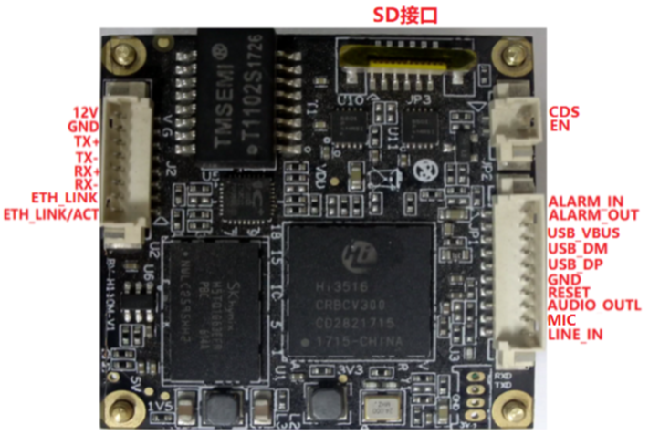
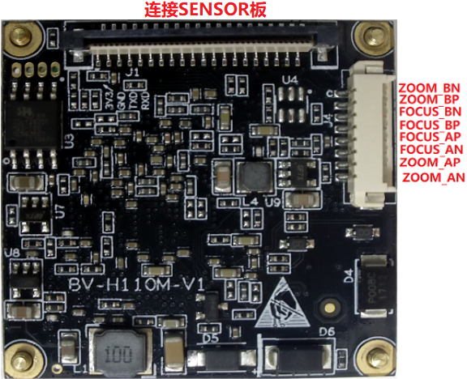
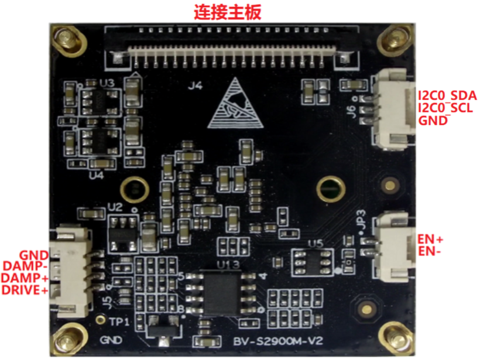
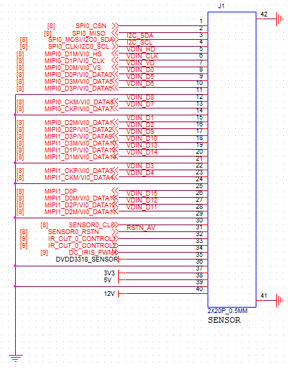
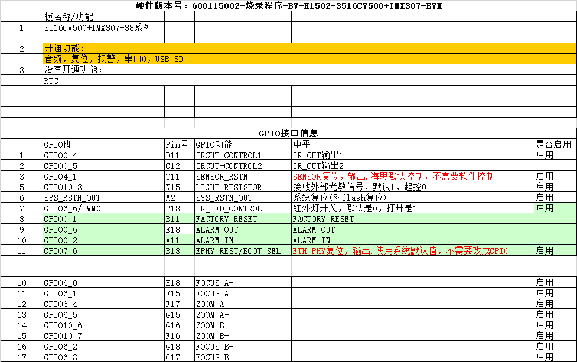
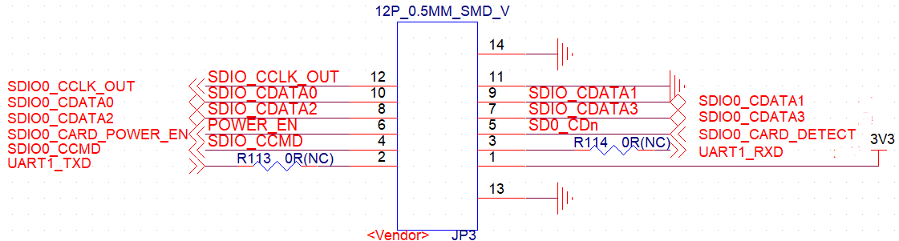
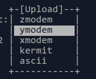
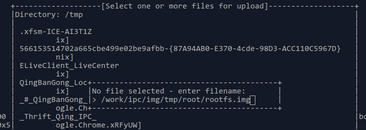
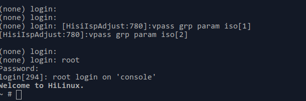
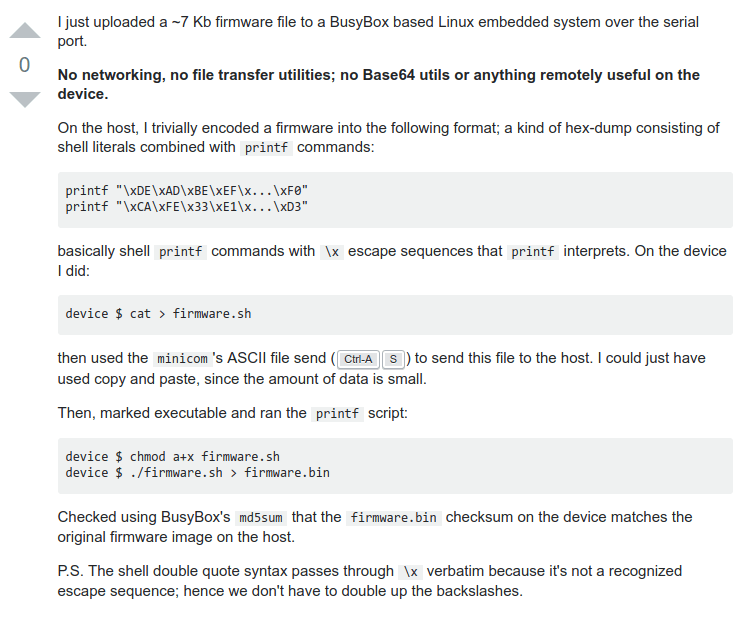

# Rockchip Hi3516 竞品分析说明

发布版本：1.0

日期：2019.05

作者邮箱：cody.xie@rock-chips.com

文件密级：内部资料

---
**前言**
本文档描述调试和分析Hi3516DV300/CV500的记录，以及使用说明

**概述**
涉及部分不可描述手段，仅供内部使用，切不可外传

**产品版本**

| **芯片名称** | **内核版本**|
| ---------|--------------------------------|
| 全平台| 无 |

**读者对象**

本文档（本指南）主要适用于以下对象：

需要分析对比Hi3516的工程师

**修订记录**

| **日期**    | **版本** | **作者** | **修改说明**         |
| --------- | ------ | ------ | ---------------- |
| 2019-05-24 | v1.0   | Cody Xie |  初始版本   |

---

[TOC]

---
## Hi3516CV500采购模组信息

* 淘宝链接


* 淘宝联系人信息

  * 姓  名：刘 文 朝
  * 手  机：133 1682 3520
  * Q   Q：13275 46961
  * 邮  箱：wzliu@ssqvision.com
  * 公  司：深圳市善谦创新技术有限公司

* 基本资料
  * 600115002-BV-H1502-BV38双板-3516CV500+307-中性-20190410.bin
    * 分析得出分区表信息：

      ```console
      BoardType=600115002-BV-H1502 arch=arm baudrate=115200 board=hi3516cv500 board_name=hi3516cv500 bootcmd=sf probe 0;sf read 0x82000000 0x50000 0x380000;bootm 0x82000000 bootdelay=1 cpu=armv7 ethact=eth0 ethaddr=d0:22:12:88:88:88 gateway=192.168.1.1 ipaddr=192.168.1.120 netmask=255.255.255.0 serverip=192.168.1.35 soc=hi3516cv500 stderr=serial stdin=serial stdout=serial vendor=hisilicon verify=n chiptype=hi3516CV500 bootargs=mem=128M console=ttyAMA0,115200 root=/dev/mtdblock3 rootfstype=squashfs rw init=/init mtdparts=hi_sfc:256k(u-boot)ro,64k(env),3072k(kernel),3584k(rootfs),512k(config),-(app) sensortype=imx307 mac=D0:22:12:88:88:88 s),512k(config),-(app) sensortype=imx307
      ```

    * uboot分区有效数据实际大小236KB左右（应该包含ddr初始代码和uboot）
    * linux kernel ：版本Linux-4.9.37，实际大小2.9MB，不知道具体压缩算法，dts是hi3516cv500-demb.dts
    * config 分区为 512KB，不是 app 的备份。从数据上看，像被写过的 jffs2 文件系统，包含被删除的文件

  * 02 Hi3516CV500+IMX327接口说明.rar
    * 主板1
    
    * 主板2
    
    * sensor板
    
    * FPC排线定义
    
    * GPIO接口定义
    
    * TF卡接口定义
    

## 替换rootfs以及修改密码

1. 准备rootfs

    1. 导出固件

        ```console
        #!/bin/bash

        # 256k(u-boot)ro,64k(env),3072k(kernel),3584k(rootfs),512k(config)

        dd if=600115002-BV-H1502-BV38双板-3516CV500+307-中性-20190410.bin of=u-boot.bin skip=0 count=256 bs=1024
        dd if=600115002-BV-H1502-BV38双板-3516CV500+307-中性-20190410.bin of=env.bin skip=256 count=64 bs=1024
        dd if=600115002-BV-H1502-BV38双板-3516CV500+307-中性-20190410.bin of=uImage skip=320 count=3072 bs=1024
        dd if=600115002-BV-H1502-BV38双板-3516CV500+307-中性-20190410.bin of=rootfs.squashfs skip=3392 count=3584 bs=1024
        dd if=600115002-BV-H1502-BV38双板-3516CV500+307-中性-20190410.bin of=config.jffs2 skip=6976 count=512 bs=1024
        dd if=600115002-BV-H1502-BV38双板-3516CV500+307-中性-20190410.bin of=app.jffs2 skip=7488 bs=1024
        ```

    1. 修改rootfs

        ```console
        # 先查看根文件系统信息
        $ unsquashfs -s rootfs.squashfs
        Found a valid SQUASHFS 4:0 superblock on rootfs.squashfs.
        Creation or last append time Mon Dec 10 14:39:58 2018
        Filesystem size 3323.45 Kbytes (3.25 Mbytes)
        Compression xz
        Block size 65536
        Filesystem is exportable via NFS
        Inodes are compressed
        Data is compressed
        Fragments are compressed
        Always-use-fragments option is not specified
        Xattrs are compressed
        Duplicates are removed
        Number of fragments 16
        Number of inodes 287
        Number of ids 1
        ```

        ```console
        unsquashfs rootfs.squashfs
        ```

        ```console
        $ qemu-arm-static -L squashfs-root squashfs-root/usr/bin/mkpasswd --method=md5
        ERROR: ld.so: object 'libgtk3-nocsd.so.0' from LD_PRELOAD cannot be preloaded (cannot open shared object file): ignored.
        mkpasswd: using fallback suid method
        Password: # 输入123456
        $1$mom7ejVC$ALIZtMuMuAQBR59sLmNAg1

        # 修改squashfs-root/etc/passwd
        root:$1$wLCQoXKT$f6CkdaXHJD66ufxsvgekd/:0:0:root:/home:/bin/sh
        sshd:x:74:74:Privilege-separated SSH:/var/empty/sshd:/sbin/nologin

        # 重新打包固件
        $ mksquashfs squashfs-root rootfs.img -comp xz -all-root -b 64k
        ```

1. 查看jffs2分区内容

    ```console
    ./dd.sh 600115002-BV-H1502-BV38双板-3516CV500+307-中性-20190410.bin
    ```

    ```console
    #!/bin/bash
    ## dd.sh

    umount /mnt/loop
    modprobe nandsim first_id_byte=0x2c second_id_byte=0xda third_id_byte=0x00 fourth_id_byte=0x15
    modprobe mtdblock
    modprobe mtdchar
    modprobe mtd mtd=0
    dd if=$1.jffs2 of=/dev/mtd0
    mkdir /mnt/loop
    mount -t jffs2 /dev/mtdblock0 /mnt/loop
    cp -R /mnt/loop/* ./squashfs-root/mnt/$1
    ```

1. 开机uboot，ctrl-c进入uboot命令行

   ```console
   Uncompress Ok!  

   U-Boot 2016.11 (Jan 17 2019 - 11:35:49 +0800)hi3516cv500

   Relocation Offset is: 0f6e5000Relocating to 8fee5000, new gd at 8fea4ef0, sp at 8fea4ed0
   SPI Nor:  Check Flash Memory Controller v100 ... Found
   SPI Nor ID Table Version 1.0
   SPI Nor(cs 0) ID: 0xc2 0x20 0x19
   Block:64KB Chip:32MB Name:"MX25L(256/257)XX"
   SPI Nor total size: 32MB
   NAND:  0 MiB
   MMC:
   In:    serial
   Out:   serial
   Err:   serial
   Net:   eth0
   Hit any key to stop autoboot:  0
   hi3516cv500 #
   ```

1. printenv先查看env，备份

   ```console
   hi3516cv500 # printenv
   BoardType=600115002-BV-H1502
   arch=arm
   baudrate=115200
   board=hi3516cv500
   board_name=hi3516cv500
   bootargs=mem=128M console=ttyAMA0,115200 root=/dev/mtdblock3 rootfstype=squashfs rw init=/init mtdparts=hi_sfc:256k(u-boot)ro,64k(env),3072k(kernel),3584k(ro)bootcmd=sf probe 0;sf read 0x82000000 0x50000 0x380000;bootm 0x82000000
   bootdelay=1
   chiptype=hi3516CV500
   cpu=armv7
   ethact=eth0
   ethaddr=d0:22:12:88:88:88
   gateway=192.168.1.1
   ipaddr=192.168.1.120
   license=eca0d518b967433fd34ac16a9a291fa8
   mac=f0:23:b9:46:2a:9b
   netmask=255.255.255.0
   sensortype=imx307
   serialno=ON327H16CM0FZ20190514001
   serverip=192.168.1.35
   soc=hi3516cv500
   stderr=serial
   stdin=serial
   stdout=serial
   uuid=ec9b2edb-af14-4cf6-8b38-80f829139433
   vendor=hisilicon
   verify=n

   Environment size: 811/65532 bytes
   ```

1. minicom下，uboot命令行输入loady 0x82000000 115200

   ```console
   hi3516cv500 # loady 0x82000000 115200
   ## Ready for binary (ymodem) download to 0x82000000 at 115200 bps...
   CC
   ```

1. minicom用ctrl-s，选择ymodem，把rootfs.img下载下去

   

   

1. UBoot命令行下，修改flash上的rootfs分区

   ```console
   sf probe
   sf erase 0x350000 0x380000(分区大小)
   sf write 0x82000000 0x350000 0x33F000(刚才下载打印的大小）
   ```

1. 用printenv查看的命令行, sf read.... bootm ....引导进入系统

   ```console
   sf probe 0;sf read 0x82000000 0x50000 0x380000;bootm 0x82000000
   ```

1. 用户名，密码是root, 123456

   

## 使用telnet登陆并替换busybox

**>>> 首先，上面的方法本来就可以修改根文件系统，不需要这个方法，仅供无第一种方法时参考**



首先，先准备好文件

```console
$ hd -v busybox > hex.txt
$ vi hex.txt
## 修改并保留16进制，替换文本格式变成 printf "\xDE\xAD"类似格式

$ telnet 192.168.1.120 (IPC ip)
name : root
password : 123456
```

在IPC上，用如下方法接收文件

```console
$ cd /tmp
$ cat > aa.sh
# PC上复制粘贴hex.txt内容，回车，Ctrl+C
$ chmod +x aa.sh
$ ./aa.sh > busybox2
$ chmod +x busybox2
```

在ubuntu上安装tftpd，并将需要传输的文件放到ftp目录，如/srv/ftp/temp.bin

```console
$ sudo apt install -y atftpd
$ sudo sed -e 's/^USE_INETD=true/USE_INETD=false/g' \
       -i /etc/default/atftpd
$ sudo systemctl enable atftpd
$ sudo systemctl restart atftpd
```

在IPC上，使用busybox2 tftp传输文件

```console
./busybox2 tftp -l temp.bin -r temp.bin -g 172.16.21.xxx (tftpd服务器地址)
```

## NFS搭建及挂载

* 安装NFS（Ubuntu 18.04）

  ```console
  $ sudo apt update
  $ sudo apt install nfs-kernel-server
  # 修改/etc/exports，增加配置目录
  $ cat /etc/exports
  /work/hirootfs *(rw,sync,no_root_squash)
  # 配置成nfs v2, 修改RPCNFSDCOUNT和RPCMOUNTDOPTS，增加-V 2
  $ cat /etc/default/nfs-kernel-server
  # Number of servers to start up
  RPCNFSDCOUNT="-V 2 8"

  # Runtime priority of server (see nice(1))
  RPCNFSDPRIORITY=0

  # Options for rpc.mountd.
  # If you have a port-based firewall, you might want to set up
  # a fixed port here using the --port option. For more information,
  # see rpc.mountd(8) or http://wiki.debian.org/SecuringNFS
  # To disable NFSv4 on the server, specify '--no-nfs-version 4' here
  RPCMOUNTDOPTS="-V 2 --manage-gids"

  # Do you want to start the svcgssd daemon? It is only required for Kerberos
  # exports. Valid alternatives are "yes" and "no"; the default is "no".
  NEED_SVCGSSD=""

  # Options for rpc.svcgssd.
  RPCSVCGSSDOPTS=""

  $ sudo service nfs-kernel-server restart
  ```

* 设备端挂载

  ```console
  ~ # mount -t nfs -o nolock -o tcp -o rsize=32768,wsize=32768 172.16.21.234:/work/hirootfs /mnt/nfs
  ```

## 其他调试说明

* proc以及debugfs

海思的内核KO加载成功后，都会在/proc/umap目录下生成所有模块的调试入口，直接cat后可以查看。例如：

```console
cat /proc/umap/nnie
```

* debugfs

海思默认没有挂载debugfs，root登陆后，可以通过以下方式挂载，查看如clk等。

```console
mount -t debugfs debugfs /sys/kernel/debug
```
