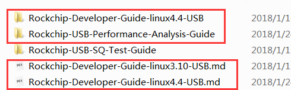
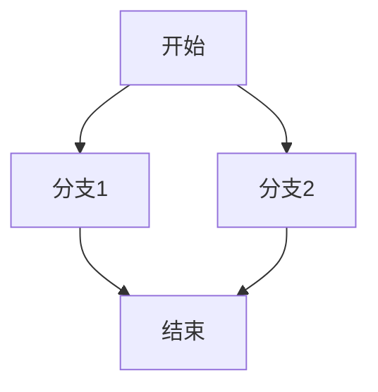
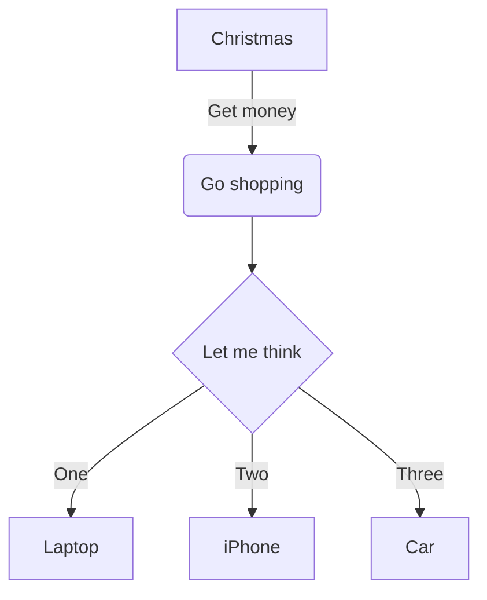
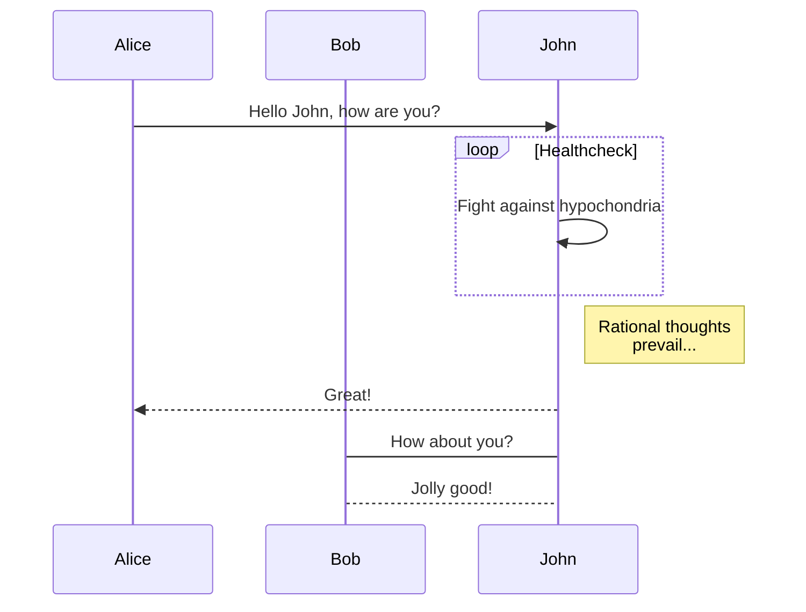
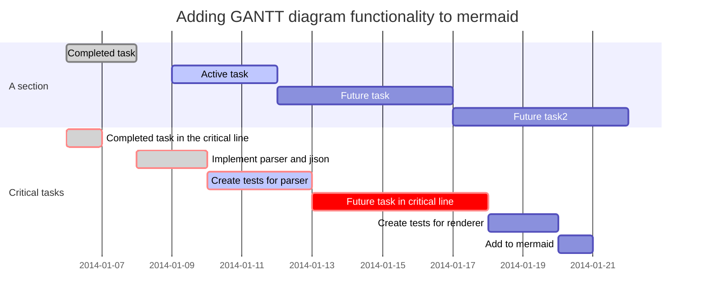

# Rockchip Typora编辑指南

发布版本：2.4

日期：2019.05

作者邮箱：karen.huang@rock-chips.com

文件密级：内部资料

---
**前言**
本文档是基于typora软件，markdown语言的说明和文本模板。可以更改版本信息 ，Karen.huang等相关关键字，将本文档当做其他文档模板使用。

**概述**
typora是一个编辑器，编辑器 ，编辑器而已。并没有很多功能，只是有编辑功能而已。（我说这句话的意思是，目测不能在typora里面直接push到gerrit上，谢谢）

**产品版本**

| **芯片名称** | **内核版本**|
| ---------|--------------------------------|
| 全平台| 本文与内核无关，放在这里只是一个模板 |

**读者对象**

本文档（本指南）主要适用于以下对象：

需要写文档的工程师

老是需要写文档的工程师

需要写**文本文档**的工程师

**修订记录**

| **日期**    | **版本** | **作者** | **修改说明**         |
| --------- | ------ | ------ | ---------------- |
| 2017.9.11 | V1.0   | 黄莹，何灿阳 | 初始版本，<br>先奠定基本资料 </br>    |
| 2018.2.1  | V1.1   | 黄莹     | 添加一些常见问题的答案，完善规范 |
| 2019.1.3  | V2.0   | 黄莹     | 添markdownlint检查及相关信息 |
| 2019.1.16  | V2.1   | 黄莹     | 删除段首tab的要求 |
| 2019.3.4  | V2.2  | 黄莹     | 修改段落删除线 |
| 2019.4.20  | V2.3  | 黄莹     | 增加表格内段落如何换行的说明 |
| 2019.5.23 | V2.3  | 黄莹     | 细节完善校正 |

---

[TOC]

---

## 以下是必读文档规范

### 关于文件名规范^V2.0新增^

:smiley:文件名以==“Rockchip-Developer-Guide-Linux4.4-CPUFreq-CN”==为标准，具体要求如下，头尾是必须有的。**每个单词首字母大写，模块缩写按协议标准，一般情况模块缩写全大写，结尾全大写**

“Rockchip~必须~-Developer~1~-Guide~2~-Linux4.4~3~-CPUFreq-CN~4~”

1：没什么特殊原因就写上，目的是统一写，看起来工整

2：Guide可以看情况修改，按文档性质可以用Tutorial，Introduction之类修改。

3：有版本限制就写，没有就不写

4：CN为中文内容/EN为英文内容。

文件夹名称/文件名全英文。

英文文档：Rockchip-Developer-Guide-Linux3.10-Clock-EN

- 必填打头Rockchip
- 不分内核版本可以不填linux版本

问题排查：Trouble Shooting

教程：Tutorial

用户指南：User Guide

说明：Introduction

注意事项：Notes

### 关于Markdownlint^V2.0新增^

现启用“markdownlint"检查文档规范。Markdownlint安装见

<https://github.com/markdownlint/markdownlint>网站里有相关安装说明，<u>同时需要安装rake和bundler</u>。使用的工具是 markdownlint ，调用参数为：

```shell
mdl -s .mdl.rb FILE.md
```

`.mdl.rb` 为对应配置文件，关闭、调整了一些规则，这个文件位于 internal-docs 的根目录，目前内容为

```ruby
all
exclude_rule 'fenced-code-language' # Fenced code blocks should have a language specified
exclude_rule 'first-line-h1' # First line in file should be a top level header

exclude_rule 'MD013' # Line length
exclude_rule 'MD036' # Emphasis used instead of a header
exclude_rule 'MD010' # Hard tabs
rule 'MD029', :style => "ordered"
```

下面在标题后备注对应的报错原因。

### 关于章节

```c
Head 1 请输入：#空格 head1
head2：请输入：##空格 head 2
生成目录：[toc]回车
斜：*文本*
加粗：**文本**
下划线：<u>文本</u>
```

**note**：两个大章节之间horizonal line用`---回车`来分割输出horizonal line ：----回车  或者***********回车 （有且仅有三个字符，否则会报错）但是，**无论是标题还是段落，不要出现无谓的空格，不然会被纠错**。

---

### 关于段落^V2.2更改^

~~**段落首输入一个tab，表示汉字中的段首空2格。（这个要求，由于新typora识别不到，并且会引起mdl校验错误，所以删掉）**~~如果你一直写下去不打回车的话，typora会自动帮你断句，排列到第二行的，为了行文美观，段落未结束之前尽量不要回车。

```markdown
<br>如果想在表格内部换行，可以使用这个html的转换符号 </br>
```

第二行再真正输入回车，但是为了行文的美观，还是建议大家一段不要写的特别长，（虽然我没看过写特别长的情况）。:smile:段落的结尾不要有空格，否则会触发MD009号错误。

---

### 关于代码

如何得到代码框 code block

整段代码，用三个(`)或者用三个(~)，注意代码框前后要空白行。

```c
void main(void)
{
    printf("hello world\n");
}
```

请输入：```回车

```markdown
#这里会自动配色，假如你在右下角选择你输入的语言种类
#简单的一行或者短代码，用一对(`)包裹住
this is a example code `hello world`
```

---

### 关于文档命名

1. 目前的开发文档命名为：

   **Rockchip-Developer-Guide-Linux-模块名称**

   ==比如==：Rockchip-Developer-Guide-Linux3.10-USB .md

   如果没有版本限制的文档，可以不写版本

   ==比如==：Rockchip-Developer-Guide-Trust.md

2. 文档名是英文的，每个单词首字母大写，专有名词大写，必须小写的名词小写。专有名词的规范参照各自模块的协议等权威资料。

   ==比如==：8Gb_DDR4_SDRAM.pdf

   ==比如==：Rockchip-Developer-Guide-Trust.md

---

### 关于图片命名

同文档命名一样，全英文，每个单词首字母大写。尽量选取**标示性**比较高的单词，让人一看就明白这是属于哪篇文字哪个章节，图片含义的图片名。**墙裂（强烈）抗议使用乱码作为图片文件名。**

图片和文档分开放置 ，便于文档之间切换。优秀范例如下

---

### 关于目录

```markdown
输入[toc]就可以了,source如本文开头的目录。
```

### 关于内部资料

没别的要求，就是得把内部资料单独放在模块目录下的地方，这样不容易被误发出去。

==比如==：\internal-docs\DDR\内部资料

### 关于文档写完^V2.0新增^

1. 提交到gerrit审核
2. 修改完善
3. 作者自行提交到alfresco,并添加类别标签。
4. markdownlint中，如果出现与本文不一致的结果，通常以markdownlint为准，并联系作者修改本文。

## 关于TYPORA使用方法（选读）

### ==快捷键说明 ！==

```markdown
快捷键说明：
按 ctrl + / 可以切换源码和效果显示页面
按F11 全屏
ctrl+L 选中整行
home键-到行首
end键到行尾
ctrl+F 查找
ctrl+H 替换
ctrl+z 撤销
ctrl+/ 可以看markdown的source
ctrl+shift+` 并选中字段，可以快速添加代码块。
```

*斜体*

_也是斜体_ctrl+i

\*避免“\*”号变斜体，加反斜\\* 用来当转义字符

**加粗**ctrl+B

<u>下划线</u>

<u>当然下划线可以用快捷键 ctrl+L选中整行然后ctrl+u</u>来实现

~~删除线~~

~~alt shift 5~~这个有点麻烦

:anger:

这是一段对话测试代码，用于熟悉markdown

> 好的
> 没问题
>
> > ok

---

### 自动列举 list order（MD004 in Rules）

1. 按数字“1，点，空格”就能进入自动序号编码
2. 第二行，回车。
3. 按两次回车跳出自动编码

- [ ] 打一个  -空格和一个[ ] 再打空格得到task
- [x] task1
- [x] task 2

- 其中 - = * + 都能作为列举开头。但是请保持一致，否则会被纠错。

### 关于如何导入、保存文档

```markdown
  文档转换器
  安装包：Download installer from **[Download Page](https://github.com/jgm/pandoc/releases/latest)** and install or update [Pandoc](http://pandoc.org/).pandoc
  输出PDF:FILE->Export->pdf
  输出word：FILE->Export->word
  输入word：文件->导入-word(docx) **注意此条，文件导入会对文档中的代码自动增加转义字符，导入时需要注意代码是否还符合规范。**
  also,输入word：也可以直接复制到md文档中。
  文档中如果图片比较多，可以使用导入，如果代码和文本比较多，可以直接复制到typora，复制代码一般不会产生自动转义字符，（如果更新的版本中也添加了复制代码也转义，那当我没说，你们就随意选择，谢谢- -）
```

### insert Image插入图片

```markdown
edit ->insert-> img


此处使用的是相对地址，可以使用拖曳图片。拖到文档中使用。
比如：audio-mixer-path
```

（单击图片可见地址）通过Edit菜单插入本地图片

拖放的效果

通过输入\的方式插入图片

[^说明]: 以下是各种缩放的效果


还可以修改图片的大小

指定宽度（点击图片可见路径）


指定高度


指定缩放


还可以全部通过\的style方式来实现

指定宽度


指定高度


---
### footnote

[^注意]: Here is the *text* of the **footnote**

---

### ==自动编写标题序号==

目前标准官方autonumbering的方法如下：

- [Auto Numbering for Headings](http://support.typora.io/Auto-Numbering/)

- 使用之前先说下**重点，**auto-numbering的代码目测还需要改一下，因为首标题也会显示1 这不是我们所想要的，另外，现有的文档规则里面对自动编写序号不作要求，所以可以不使用。:v:

  简单的说就是复制css代码到主题文件里，保存，比如我选的是, 将主题重新选中一下GitHub主题，就能使用了。

  

  ```markdown
  /** initialize css counter */
  #write {
      counter-reset: h1
  }

  h1 {
      counter-reset: h2
  }

  h2 {
      counter-reset: h3
  }

  h3 {
      counter-reset: h4
  }

  h4 {
      counter-reset: h5
  }

  h5 {
      counter-reset: h6
  }

  /** put counter result into headings */
  #write h1:before {
      counter-increment: h1;
      content: counter(h1) ". "
  }

  #write h2:before {
      counter-increment: h2;
      content: counter(h1) "." counter(h2) ". "
  }

  #write h3:before,
  h3.md-focus.md-heading:before /** override the default style for focused headings */ {
      counter-increment: h3;
      content: counter(h1) "." counter(h2) "." counter(h3) ". "
  }

  #write h4:before,
  h4.md-focus.md-heading:before {
      counter-increment: h4;
      content: counter(h1) "." counter(h2) "." counter(h3) "." counter(h4) ". "
  }

  #write h5:before,
  h5.md-focus.md-heading:before {
      counter-increment: h5;
      content: counter(h1) "." counter(h2) "." counter(h3) "." counter(h4) "." counter(h5) ". "
  }

  #write h6:before,
  h6.md-focus.md-heading:before {
      counter-increment: h6;
      content: counter(h1) "." counter(h2) "." counter(h3) "." counter(h4) "." counter(h5) "." counter(h6) ". "
  }

  /** override the default style for focused headings */
  #write>h3.md-focus:before,
  #write>h4.md-focus:before,
  #write>h5.md-focus:before,
  #write>h6.md-focus:before,
  h3.md-focus:before,
  h4.md-focus:before,
  h5.md-focus:before,
  h6.md-focus:before {
      color: inherit;
      border: inherit;
      border-radius: inherit;
      position: inherit;
      left:initial;
      float: none;
      top:initial;
      font-size: inherit;
      padding-left: inherit;
      padding-right: inherit;
      vertical-align: inherit;
      font-weight: inherit;
      line-height: inherit;
  }
  ```

### Links超链接

This is [an example](www.baidu.com "百度") inline link

[This link](www.sina.com) has no title attribute

## internal Links内部链接

[goto list](#一级目录) 按住ctrl + goto list

[^说明]: 不管是跳到几级的目录，都是只要一个#就可以了

### Reference Links参考链接

This is [an example 1][1] reference-style link.

and that is [an example 2][2] reference-style link.

```markdown
[1]: www.baidu.com
[2]: www.163.com
[sina]: www.sina.com

[sina][] will goto sina.com
[1][] will goto baidu.com
[2][] will goto 163.com
```

### URLs网站地址

```markdown
<test.com> not works

<www.test.com> also not works

<http://test.com> only URLs format can works
```

---

### paste Visio file

copy a visio file, and paste,  it become a image.

and auto save to the folder

---

### Table 表格

paste excel table 粘贴excel的表格：直接粘贴excel表格，格式会有一些错的,原有的excel的格式也会失效，所以不要用。

```markdown
| 写表格呢 | that is |
| ---- | ------- |
| 写一个字 | 打一个竖杠杠  |
```

---

### 仅内部人员可看的注释功能^V2.0新增^

对md文档可以进行注释语句，转成PDF的情况下是看不见注释语句的。

比如注释<!--在PDF中不显示这句话-->

写法如下`<!--在PDF中不显示这句话-->`

### 上下标

下标要先在File -》 Preference -》 Markdown里选中subscript

再用~包裹住下标内容就可以了 双击可读出source code

V~下标~, log~2~

上标要先在File -》 Preference -》 Markdown里选中superscript

再用^包裹住上标内容就可以了

V^上标^, 2^2^=4

---

### 高亮

高亮要先在File -》 Preference -》 Markdown里选中highlight

再用==包裹住要高亮的内容就可以了

==高亮== 这就实现了

---

### 时序图Sequence

语法

```sequence
title:本文结构
 文档规范 -> 本软件的使用方法: 这两个没有关系
 第二个规范 -> 第三个规范:

```

实践

```sequence
title: ddr变频流程图

kernel->trust: ddr_set_rate()
Note right of trust: Is rate equal 0?
Note left of kernel: Is finish?
Note over kernel: yes
Note over trust, kernel: PSCI message
trust-->kernel:finish!
```

---

### 流程图flowchart

[^注意]: 每个定义后都要有空格，然后才能写内容

```flow
st=>start: 开始
op=>operation: 加1
cond=>condition: 溢出？
io=>inputoutput: 输出
sub=>subroutine: 检查流程
e=>end: 结束

st->op->cond
cond(yes,right)->io(right)->e
cond(no)->sub->op
```

线条加颜色和加宽的语句`io({"stroke":"Red"})@>e({"stroke":"Red","stroke-width":6,"arrow-end":"classic-wide-long"})`没能实验出来

还有框框加颜色的语句也没能实验出来。

`st=>start: 开始|past`框框为灰色

`op=>operation: 加1|approved`框框为绿色

`cond=>condition: 溢出？|rejected`框框为红色

`io=>inputoutput: 输出|invalid`框框为黑色

`sub=>subroutine: 检查流程|future`框框为黄色

`e=>end|current`框框内字体为红色

---

### mermaid（可以做所有事情）

```mermaid
graph TD;
A[graph]-->B[release Doc];
A-->C[interna doc];
C-->D|文档规范|;
```





mermaid的时序图，相对sequence，如果只用->，则不会产生箭头，得用->>才能产生箭头mermaid的时序图，有更直观的颜色，这个比sequence好。



甘特图



很简单的一个。


