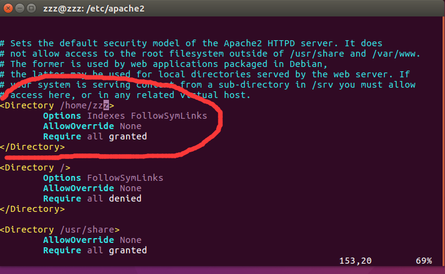

# HTTP FILE SERVER

发布版本：1.0

作者邮箱：jason.zhu@rock-chips.com

日期：2018.06

文件密级：公开资料

------

**前言**

**概述**

​	搭建FTTP文档服务器。

**读者对象**

本文档（本指南）主要适用于以下工程师：

技术支持工程师

软件开发工程师

**产品版本**

**修订记录**

| **日期**     | **版本** | **作者**    | **修改说明** |
| ---------- | ------ | --------- | -------- |
| 2018-06-08 | V1.0   | Jason Zhu | 初始版本     |

------

[TOC]

------

## 1. FTTP文件服务器安装

1.1 apache2安装

```
sudo apt-get install apache2
```

1.2.1 配置apache2 端口

```
cd /etc/apache2
sudo vim apache2.conf
```

再文件末尾输入，配置apache2 http使用的端口

```
ServerName localhost:80
```

保存文件，输入

```
sudo /etc/init.d/apache2 start
```

1.2.2 配置DocumentRoot

```
cd /etc/apache2/sites-available
sudo vim 000-default.conf
```

找到DocumentRoot ，配置自己想设置的路径，例如


输入

```
sudo /etc/init.d/apache2 restart
```

1.2.3 权限配置

在上面配置完后，访问你想要访问/home/zzz路径下的文档，比如/home/zzz目录下的code文件夹，输入

```
本机IP/code
```

会出现

```
Forbidden You don't have permission to access / on this server.
```

这是提示没有目录访问权限，需要修改/etc/apache2/apache2.conf

```
cd /etc/apache2
sudo vim apache2.conf
```

修改如下：



输入

```
sudo /etc/init.d/apache2 restart
```

重新输入想要访问的目录即可。

1.3 参考

```
https://blog.csdn.net/jenyzhang/article/details/51539165
https://stackoverflow.com/questions/35118773/systemd1-failed-to-start-lsb-apache2-web-server
https://www.linuxidc.com/Linux/2016-12/138759.htm
```

