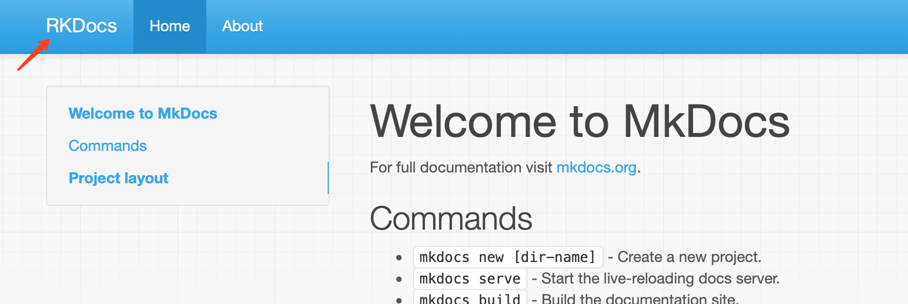
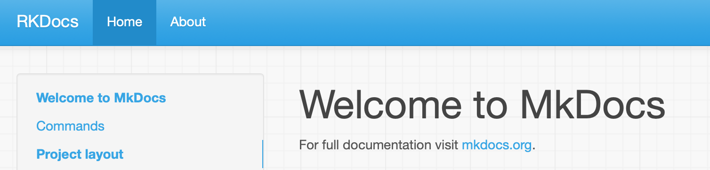
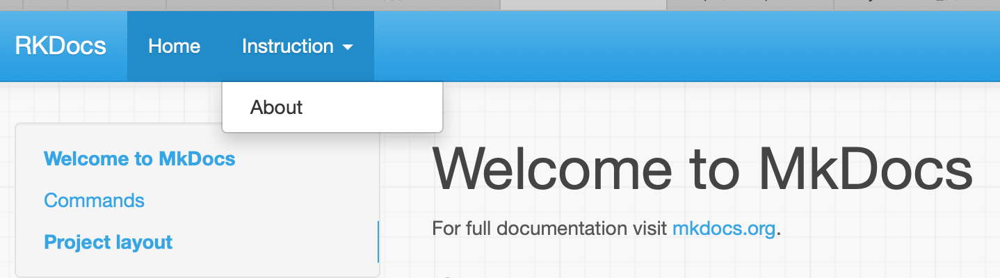

# MkDocs 用户指南

文件标识：RK-XX-XX-nnn

发布版本：V1.0.0

日期：2020-02-20

文件密级：□绝密   □秘密   ■内部资料   □公开

---

**免责声明**

本文档按“现状”提供，福州瑞芯微电子股份有限公司（“本公司”，下同）不对本文档的任何陈述、信息和内容的准确性、可靠性、完整性、适销性、特定目的性和非侵权性提供任何明示或暗示的声明或保证。本文档仅作为使用指导的参考。

由于产品版本升级或其他原因，本文档将可能在未经任何通知的情况下，不定期进行更新或修改。

**商标声明**

“Rockchip”、“瑞芯微”、“瑞芯”均为本公司的注册商标，归本公司所有。

本文档可能提及的其他所有注册商标或商标，由其各自拥有者所有。

**版权所有** **© 2019** **福州瑞芯微电子股份有限公司**

超越合理使用范畴，非经本公司书面许可，任何单位和个人不得擅自摘抄、复制本文档内容的部分或全部，并不得以任何形式传播。

福州瑞芯微电子股份有限公司

Fuzhou Rockchip Electronics Co., Ltd.

地址：     福建省福州市铜盘路软件园A区18号

网址：     [www.rock-chips.com](http://www.rock-chips.com)

客户服务电话： +86-4007-700-590

客户服务传真： +86-591-83951833

客户服务邮箱： [fae@rock-chips.com](mailto:fae@rock-chips.com)

---

**前言**

**概述**

本文提供了 MkDocs 的使用指南，以及 MarkDown 文档集成到 MkDocs 的步骤和注意事项。

**产品版本**

| **芯片名称** | **内核版本** |
| ------------ | ------------ |
| 通用     | 通用     |

**读者对象**

本文档（本指南）主要适用于以下工程师：

技术支持工程师
软件开发工程师

**修订记录**

| **版本号** | **作者** | **修改日期** | **修改说明** |
| ---------- | --------| :--------- | ------------ |
| V1.0.0    | 陈谋春 | 2020-02-20 | 初始版本     |

**目录**

---

[TOC]

---

## 概述

   MkDocs 是一个用于创建项目文档的 **快速**, **简单** , **完美华丽** 的静态站点生成器. 文档源码使用 MarkDown 来撰写, 用一个 YAML 文件作为配置文档。截止到本文完成的时间，最新版本是1.0.4，已经基本稳定，当然还是有一些缺点有待完善，例如：默认的Javascript插件不支持中文全文搜索。

   需要了解更多信息，可以访问其[官网](https://mkdocs.readthedocs.io/en/stable/)。

## 安装

   MkDocs 的安装有两种方式：通过包管理器安装（例如：apt-get、yum），手动安装。官方推荐使用包管理器安装，如果你的 Linux 发行版找不到安装包，或者你想在 Windows 平台安装，则需要用到手动安装。但是，我在安装过程中发现，ubuntu 18.04的 mkdocs 版本非常老，所以实际上我最终用的版本是手动安装的最新版。

   包管理器安装这里以 ubuntu 平台为例，其他平台类似，这里就不细述了，具体命令如下：

```shell
sudo apt-get install mkdocs
# 安装完成后敲如下命令可以查看 mkdocs 的版本
mkdocs --version
# 这里看到成功安装了0.16.3版本
mkdocs, version 0.16.3
```

   手动安装是通过 pip 实现的，所以依赖于 python 和 pip ，请通过如下命令确保 python 和 pip 可正常使用：

```shell
$ python --version
Python 2.7.2
$ pip --version
pip 1.5.2
```

   大部分 linux 发行版本 python 都是默认可用，但是 pip 则不一定有安装，这种情况下，你要先下载一个[get-pip.py](https://bootstrap.pypa.io/get-pip.py)然后运行，具体命令如下：

```shell
$ wget https://bootstrap.pypa.io/get-pip.py
$ python get-pip.py
$ pip --version
pip 1.5.2
```

   python 和 pip 就绪后，就可以通过如下命令来安装 mkdocs：

```shell
$ pip install mkdocs
$ mkdocs --version
mkdocs, version 1.0.4 from /home/cmc/.local/lib/python2.7/site-packages/mkdocs (Python 2.7)
```

## 创建文档工程

   创建一个新的文档工程非常简单，可以通过如下命令完成：

```shell
$ mkdocs new my-project
$ cd my-project
$ tree
.
├── docs                                          #文档源代码目录，用于存放 MarkDown 和 HTML 文件
│   └── index.md                                  #这个文件会作为首页，你可以编辑
└── mkdocs.yml                                    #所有的配置都在这个文件
```

   这个命令生成了一个最简单的文档工程，根目录下有一个名为 mkdocs.yml 的配置文件，同时还有一个名为 docs 的目录用于存放文档的 MarkDown 源码或原始 HTML，并且在这个目录有一个名为 index.md 的文档会被作为这个工程的首页。

   工程创建成功以后，我们可以通过 `mkdocs serve`命令来启动一个最简单的 HTTP 服务，具体如下：

```shell
$ mkdocs serve
INFO    -  Building documentation...
INFO    -  Cleaning site directory
[I 200226 14:26:54 server:283] Serving on http://127.0.0.1:8000
[I 200226 14:26:54 handlers:60] Start watching changes
```

   然后通过浏览器打开 `http://127.0.0.1:8000/`，就可以看到如下页面：


   前面我们知道，首页的源码是在 `docs/index.md` 文件，所以可以直接编辑这个文件，就能修改主页，有双屏幕的工程师可以一个屏幕开浏览器，一个屏幕开 `typora` 编辑 `index.md` ，此时你的修改会实时在浏览器上体现出来，间接实现所见即所得。

   首页的左上角显示 `My Docs` ，这是站点名字，任何时候点击它都可以返回首页，可以通过修改 `mkdocs.yml` 中的 `site_name` 来配置，例如我们改成 `RKDocs`：

```shell
site_name: RKDocs
```

   此时，我们看到首页会变成这样：



### 添加页面

   本节继续上面的例子，给文档工程新增一个页面，这里为了简化流程，直接拉了一个现成的 MarkDown 文档作为页面源码，具体命令如下：

```shell
curl 'https://jaspervdj.be/lorem-markdownum/markdown.txt' > docs/about.md
```

   MkDocs 支持导航栏，每一个页面都会被加入到导航栏中，如果我们不做任何配置，其顺序是按搜索到页面的顺序排列，其标题则是通过文件名或文件内的主题名来匹配。如果我们要改变这个顺序，或者更改标题、又或者想按树形来组织所有页面，则可以在 `mkdocs.yml` 中增加 `nav` 来实现，具体如下：

```yaml
site_name: RKDocs
nav:
    - Home: index.md                             #两个页面主题在导航栏上是并列关系
    - About: about.md                            #两个页面主题在导航栏上是并列关系
```

   Note: ==如果你安装的是旧版本的 MkDocs，则 `nav` 属性要改成 `pages`== 。

   配置文件是 yaml 格式的，有些工程师可能不熟悉 yaml 的语法，可以上网查一些资料来了解，这里只简单介绍几个注意事项：

- 大小写敏感

- 通过缩进来表示层级关系

- 缩进不允许使用`tab` ，一律使用空格

- 缩进的空格数没有规定，但统一使用4个空格可以保持良好可阅读性

   改完之后，我们看到的页面导航栏应该是这个样子的：



   回到 `nav` 的配置，我们可以看到它的值是一个数组，并且这个数组可以迭代，下面是一个迭代的例子:

```yaml
site_name: RKDocs
nav:
    - Home: index.md                             #和下面是并列关系
    - Instruction:                               #父标题，本身不指向具体页面，只用于组织导航栏
        - About: about.md                        #和上面是父子关系
```

   改完以后的页面变成如下样式：



   MkDocs 还支持全文搜索（暂不支持中文），在右上角单机 `search` 控件，即可进入搜索界面，在你输入的过程会实时更新搜索结果。界面如下：


### 配置主题

   MkDocs 目前自带两个主题：mkdocs 和 readthedocs，前者是默认主题，后者用的人也非常的多。同时还有一些第三方的主题可用，还可以支持半定制主题和完全定制主题，本节只介绍如何切换主题，更高级的功能请参见官方的[开发指南](https://mkdocs.readthedocs.io/en/stable/user-guide/custom-themes/)。

   如果要切到 readthedocs，可以这样修改 `mkdocs.yml` ，具体如下：

```yaml
site_name: RKDocs
nav:
    - Home: index.md                             #两个页面主题在导航栏上是并列关系
    - About: about.md                            #两个页面主题在导航栏上是并列关系
theme: readthedocs
```

   改完后的效果如下：


### 修改 Favicon Icon

   默认情况下，MkDocs 会用自己的网站图标，如果你要替换成自己的网站图标，可以把你的图标放到 `docs/img` 目录下，并命名为 `favicon.ico` ，具体命令如下：

```shell
mkdir docs/img
cp /path_to_your_icon/favicon.ico docs/img/
```

### 修改地址格式

   MkDocs 支持两种地址格式：目录和常规，默认是前者。对于搭建网页服务器来说，二者没有差别，都能正常跳转。但是如果没有搭建服务器，而直接通过浏览器本地打开，前者兼容性比较差，在很多浏览器上无法正常跳转。此时就要修改 `mkdocs.yml` ，设置 `use_directory_urls: false` 。

```yaml
site_name: RKDocs
use_directory_urls: false
nav:
    - Home: index.md                             #两个页面主题在导航栏上是并列关系
    - About: about.md                            #两个页面主题在导航栏上是并列关系
theme: readthedocs
```

   下面是两种方式的地址对比：

| Source file      | use_directory_urls: true | use_directory_urls: false |
| ---------------- | ------------------------ | ------------------------- |
| index.md         | /                        | /index.html               |
| api-guide.md     | /api-guide/              | /api-guide.html           |
| about/license.md | /about/license/          | /about/license.html       |

## 撰写MarkDown文档

### 交叉引用

   MkDocs 可以很方便的实现文档交叉引用，例如：你可以从文档 A 跳转到文档 B 的指定章节。方法和 MarkDown 的超链接是一样，只要注意 URL 的格式即可，下面是几种跳转的 URL 格式，具体如下：

```markdown
<!--URL即文档的相对路径，而当前路径是本文档所在路径-->
Please see the [project license](license.md) for further details. <!--跳转到同级目录的license.md-->

Please see the [project license](../about/license.md) for further details. <!--跳转到上级目录的about子目录下的license.md-->

Please see the [project license](about.md#license) for further details. <!--'#'后面是章节地址->
```

   从上面可以看到，要跳转到指定章节，需要在 URL 后面加上章节地址 `#xxx`  ，其是根据你的章节标题来生成的，只支持英文字符和数字，并且所有空格会被 `-` 替代，所有中文字符都会被忽略，下面是一个章节标题到地址的转换例子：

```markdown
## CSR配置                <!--地址：‘#2_CSR’-->
## CSR配置           <!--地址：‘#2_CSR’-->
## 配置                 <!--地址：‘#21’-->
```

   有个小技巧可以获取到章节地址，你可以通过浏览器打开生成的页面，通过导航栏跳转到你要的页面，点击左边的章节标题，跳转到指定章节，此时地址栏会显示这个章节的完整地址，例如：

```markdown
file:///Volumes/home1/rtos/rtthread/rtt-docs/site/quick-start/Rockchip_Developer_Guide_RT-Thread/Rockchip_Developer_Guide_RT-Thread_CN.html#44
```

   这样我们就找到了这个章节的地址是 `#44` ，可以在你的文档里通过如下方式跳转：

```markdown
请参考[板级配置](../path_to_document/Rockchip_Developer_Guide_RT-Thread_CN.md#44) 获取更多细节.
```

### 图片链接

   插入图片的方法遵循 MarkDown 标准 ，这里就不细述，只要其地址格式有两点需要注意：

- 地址格式不支持中文，即你的路径上不能有中文，不管目录还是文件都请用英文名
- 请用 posix 风格的路径，即不能有反斜杆 `\` ，而要用正斜杆 `/`

## 编译和发布

   通过如下命令可以完成编译：

```shell
$ mkdocs build
$ ls site
about  fonts  index.html  license  search.html
css    img    js          mkdocs   sitemap.xml
```

   发布的话，只要把 site 目录下的所有文件拷贝到你的 web 服务器，然后客户端就可以访问到，例如：

```shell
scp -r site cmc@10.10.10.110:/home/cmc
ssh 10.10.10.110
sudo cp -r site /var/www/html/my-docs
```

   这样在客户端就可以通过地址：`http://10.10.10.110/my-docs` 来访问你的文档了。

   当然也可以直接用浏览器打开 `site/index.html` 来查看你的文档，由于是静态网页，二者效果是完全相同的。

   清理可以通过如下命令实现：

```shell
mkdocs build --clean
```


