# Chameleon项目文档

发布版本：1.2

文件密级：内部资料

------

**前言**

**概述**

Chameleon项目各个环节的详细文档。

**读者对象**

本文档（本指南）主要适用于以下工程师：

SDK维护工程师
测试工程师
软件开发工程师

**产品版本**

**修订记录**

| **日期**     | **版本** | **作者** | **修改说明** |
| ---------- | ------ | ------ | -------- |
| 2018-10-09 | V1.0   | 杨凯    | 初始版本     |
| 2019-03-09 | V1.1   | 杨凯    | 新增job详细流程     |
| 2019-04-11 | V1.2 | 陈谋春 | 新增LAVA Server详细实现流程 |

------

[TOC]

------

# 一 Chameleon项目简介

## 1.1 CI自动化测试系统简介

Rockchip的开发模式, 是采用common的BSP, 大部分通用芯片共用kernel, U-Boot, Trust等模块, 一般由同一组人维护, 硬件芯片端会支持十几款芯片和更多的板子, 软件OS端需要支持不同版本的Linux, Android OS,  对于系统可用性, 兼容性, 稳定性, 性能等各方面都是比较大的挑战. Chameleon项目是利用LAVA, Jenkins, Gerrit对系统持续集成进行自动化测试的一个系统, 系统能保证BSP的各个模块, 在日常开发过程中, 做尽量多的验证, 提高整体代码质量. 整体框图如下：


- gerrit server：10.10.10.29
- jenkins server：10.10.10.29/jenkins
- jenkins slave/builder： kernel builder, 172.16.12.246, 127.16.12.247, 172.16.12.248
- lava server： 172.16.12.246
- lava client/worker： 172.16.12.246, 127.16.12.247, 172.16.12.248

另有开发用lava系统:

- lava-dev server: 172.16.12.245
- lava-dev worker: 172.16.12.244

## 1.2 Jenkins简介

Jenkins 是始于Hudson的一个持续集成工具, 下图是一个通用的开发流程.
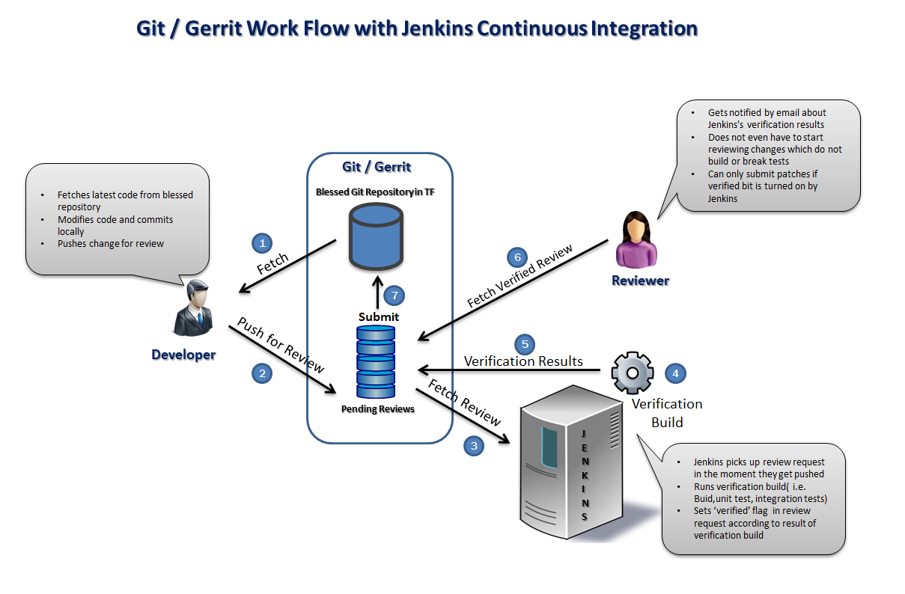
流程说明:

1. 开发工程师从服务器获取最新代码；
2. 本地修改代码后, 把patch通过git commit推送到Gerrit供review；
3. Jenkins监测到新的提交, 自动触发任务, 把gerrit的提交cherry pick下来；
4. Jenkins进行Build验证, 如果没有LAVA, 通常是按脚本要求进行全面build;
5. Jenkins把验证结果返回Gerrit, 得到一个Jenkins Verify +/- 1的comment；
6. Reviewer查看Gerrit上的代码和jenkins验证结果对patch进行review;
7. 代码reveiw通过后, Reviewer把patch合并到git code base.

下图是Gerrit/Jenkins/LAVA在RK系统的实际部署情况, 其中在Jenkins builder进行验证的时候,会发送job给Lava在实际的硬件板上进行测试.
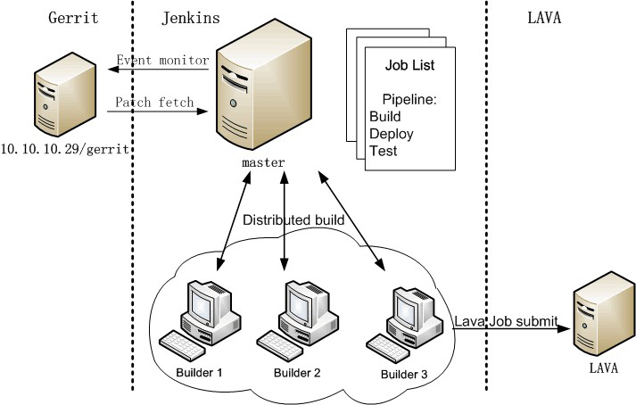

## 1.3 LAVA简述

Linaro Automation and Validation Architecture(LAVA)是由Linaro开发的一个自动验证系统, 结合Gerrit, Jenkins可以形成一个完整的持续集成(CI)自动测试系统.

LAVA是C/S架构, 可以使用一主多从或多主多从的架构. Server端负责接收任务, 调度job,结果存储和显示, 主要包含:

- LAVA Master daemon, 负责监听XMLRPC的job请求和device端ZMQ交互信息；
- LAVA Scheduler, 负责把任务分配给对应的device和worker；
- LAVA dashboard, 负责把结果进行web显示；

Slave端在LAVA里面也叫Worker, 主要是:

- Slave daemon, 用于跟Server Daemon进行交互, 接收任务并返回结果；
- Dispatcher, 负责把job分解后分布执行, 我们依据自己平台需求修改的内容主要集中在这部分.


LAVA运行的HOST推荐的系统是Debian, 参考<http://172.16.10.254/static/docs/v2/installing_on_debian.html>.
Dispatcher的流程可参考<http://172.16.10.254/static/docs/v2/dispatcher-design.html>

## 1.4 Chameleon项目内容

### 1.4.1 主要目标

- 硬件开发板需要连接所有正在维护的SDK对应的SDK板和市场上流行的开发板, 形成一个云验证平台, 顺便解决工程师硬件环境搭建难的问题；
- 日常内部SDK/patch维护(gerrit review), 系统能解决RK发布的SDK所用的主线代码, 处于持续可用状态, 顺便解决工程师在解决非当前开发SDK的软件环境搭建难的问题；
- 内部u-boot/kernel代码版本升级, 直接在全套硬件集合验证升级后的代码可用性;
- upstream u-boot/kernel mainline可用性维护
- 品质批量测试可自动化部分

### 1.4.2 主要测试项

- Boot测试,(u-boot, kernel, trust, system), 用于gerrit代码patch review
  - 能启动到shell, android为adb连接

- Smoke testing(基础功能测试), 考虑合并到Boot测试中
  基于U-Boot, kernel shell进行测试, 涵盖大部分可测模块的基础功能,
  - U-Boot:
    - 网络, EMMC, SD, NAND, SPI, U盘,
    - 显示, 充电, 按键, PMIC
    - fastboot, rockusb,
    - android, rockchip, linux固件引导
  - kernel:
    - 显示, HDMI
    - 音频
    - 视频
    - USB device/host
    - CPU调频调压
    - 网络/wifi/wlan
    - storage读写

以下测试大部分需要基于OS,用于周期性(按天或者周)SDK维护, Android大部分已经有了, Linux严重缺失

- 性能测试
  - benchmark--gpu
  - benchmark--cpu
  - benchmark--mem bandwidth
  - benchmark--antutu, geekbench...
  - mmc/sd/nand读写速度
  - usb 2.0/3.0读写速度

- 压力测试
  - reboot测试
  - 待机唤醒测试
  - monkey测试
  - ddr变频测试
  - ddr stress test
  - usb拔插测试
  - hdmi拔插测试
  - 应用拷机测试(音乐, 视频, 游戏, Camera, WiFi/BT)

- 功耗测试
  - 自定义场景的功耗测试(可配合bus, ddr带宽测试)

- 其他功能兼容性测试
  - LFTP
  - Android CTS
  - 视频格式兼容性测试
  - 显示分辨率兼容性测试
  - OTA/Recovery测试
  - Kernel模块自定义专项白盒测试

# 二 LAVA服务器搭建

参考<https://validation.linaro.org/static/docs/v2/installing_on_debian.html>

## 2.1 LAVA版本介绍

目前LAVA的版本比较多，官方网站主要有四个版本，具体区别如下：

| 版本                | 备注                                                       |
| ------------------- | ---------------------------------------------------------- |
| production-repo | 当前的release版本                                          |
| archive-repo        | 旧版本的备份，例如想用旧的v1版本时用得上                   |
| stretch-backports   | 针对debian stretch的backports版本，一般比release版本旧一点 |
| staging-repo        | 最新版本，可能会不太稳定                                   |

### 添加LAVA签名秘钥

```shell
$ wget https://images.validation.linaro.org/staging-repo/staging-repo.key.asc
$ sudo apt-key add staging-repo.key.asc
OK
$ sudo apt update
```

### 添加release版本apt源

在/etc/apt/sources.list中添加如下apt源：

release版本

```shell
deb https://images.validation.linaro.org/production-repo stretch-backports main
```

然后执行如下命令：

```shell
sudo apt update
```

## 2.2 LAVA Server建立与配置

### 2.2.1 Debian安装LAVA Server

```shell
sudo apt install postgresql
sudo apt install lava-server
sudo a2dissite 000-default
sudo a2enmod proxy
sudo a2enmod proxy_http
sudo a2ensite lava-server.conf
sudo service apache2 restart
```

==注意：升级lava-server并不会覆盖其配置文件/etc/apache2/sites-available/lava-server.conf==

### 2.2.2 卸载lava-server

```shell
sudo apt autoremove postgresql lava-server
sudo a2dismod proxy_http
sudo a2dismod proxy
```

注意：如果要同时删除lava-server的一些配置，例如/etc/lava-server/settings.conf，则可以加上--purge选项，命令如下：

```shell
sudo apt --purge autoremove postgresql lava-server
```

### 2.2.3 lava-server配置

#### 修改时间域

LAVA默认显示使用的是UTC时间，需要修改为本地之间

```shell
vim /usr/lib/python3/dist-packages/lava_server/settings/common.py
#修改如下内容
TIME_ZONE = 'Asia/Shanghai'
USE_TZ = False
```

#### 允许http访问

编辑/etc/lava-server/settings.conf文件，添加如下配置：

```shell
"CSRF_COOKIE_SECURE": false,
"SESSION_COOKIE_SECURE": false
```

重启gunicorn让配置生效：

```shell
sudo service lava-server-gunicorn restart
```

### 2.2.4 检查部署

要检查前面的安装部署是否成功，可以运行如下命令：

```shell
sudo lava-server manage check --deploy
```

会得到类似如下输出：

```shell
System check identified some issues:

WARNINGS:
?: (security.W012) SESSION_COOKIE_SECURE is not set to True. Using a secure-only session cookie makes it more difficult for network traffic sniffers to hijack user sessions.
?: (security.W016) You have 'django.middleware.csrf.CsrfViewMiddleware' in your MIDDLEWARE_CLASSES, but you have not set CSRF_COOKIE_SECURE to True. Using a secure-only CSRF cookie makes it more difficult for network traffic sniffers to steal the CSRF token.

System check identified 2 issues (2 silenced).
```

可以看到有一个安全警告，这是我们之前启用http访问导致的，暂时可以不用管，如果没有其他错误，则代表部署成功。

### 2.2.5 添加superuser

部署成功后，首先要添加一个超级用户来管理这个LAVA服务，命令如下：

```shell
sudo lava-server manage createsuperuser --username cliff
```

这个命令会提示你输入email（用于密码重置）和passwd，之后你就可以通过访问<http://ip_of_lava_server>用这个账号登陆来实现大部分的管理功能。

### 2.2.6 添加base device_type

首先把我们自定义的device_type添加到server对应位置

```shell
cp rkdroid.jinja2 /etc/lava-server/dispatcher-config/device-types/rkdroid.jinja2
```

然后使用命令注册device_type到数据库

```
sudo lava-server manage device-types add rkdroid
```

### 2.2.7 LAVA Server Log

LAVA Server是由几个模块组成的，有各自的log
与lava-slave交互，并接收http请求的是master daemon, log是：
/var/log/lava-server/lava-master.log
scheduler模块的log是：
/var/log/lava-server/lava-scheduler.log
另外每个任务有自己独立的文件夹，目录是
/var/lib/lava-server/default/media/job-output/job-11424/

## 2.3 LAVA Worker建立与配置

为了进行完整的测试，需要LAVA Worker能够保证以下模块/组件能够正常工作：
独立账户，source code访问权限
静态IP
lava-dispatcher
LXC
辅助控制板操作
DUT串口
DUT ADB
RK下载工具

### 2.3.1 新增PC账户

Debian安装完成后，有一个默认用户，我们需要新建一个'lava'的用户，(Debian9默认不支持sudo)．
通过su命令登录到root；

```shell
#安装sudo命令方便后续使用
apt install sudo

#添加用户并增加sudo权限，
adduser lava
passwd lava
vim /etc/group #添加lava到sudo组
```

### 2.3.2 设置静态IP

Worker需要使用静态IP, 以便重启后能够通过同一个地址远程访问．修改/etc/network/interfaces文件，修改IP为静态IP

```shell
#iface enp3s0 inet dhcp
iface enp3s0 inet static
	address 172.16.12.245
	netmask 255.255.255.0
	gateway 172.16.12.1
	dns-nameservers 10.10.10.188 58.22.96.66
```

FIXME: 以上修改可以实现静态IP，但是无法产生正确的DNS server(查询/etc/resolv.conf)，最终通过UI按以上配置来设置network可以正常工作．

### 2.3.3 建立代码环境

安装各种需要用到的基础包

```shell
sudo apt-get install vim apt-transport-https samba　git python-serial
sudo apt-get install simg2img img2simg #android sparse 解包打包
```

在10.10.10.29 Gerrit新增lava用户，并上传lava公钥，
把lava私钥id_rsa放到lava Worker的lava用户目录

```shell
cp id_rsa ~/.ssh/
```

代码中访问服务器时使用默认帐号，使代码更为通用，需要在不同设备设置默认帐号：

```shell
vim ~/.ssh/config
#加入以下内容(jenkins帐号user可以改为jenkins)
host 10.10.10.29
user lava
```

加入以上设置后，git clone代码时不需要带username，系统会默认使用以上user和对应的rsa key来认证．

### 2.3.4 安装dispatcher

由于Debian９默认的dispatcher包版本较旧，我们需要安装back-port版本获取最新的安装包．
/etc/apt/sources.list添加：

```shell
deb http://http.debian.net/debian stretch-backports main
deb https://images.validation.linaro.org/production-repo sid main

wget https://images.validation.linaro.org/staging-repo/staging-repo.key.asc
sudo apt-key add staging-repo.key.asc
sudo apt-mark hold libcurl3-gnutls
sudo apt-get install libcurl3-gnutls=7.38.0-4+deb8u4
sudo apt-get update
```

其中linaro的production-repo用户获取部分linaro后续可能用到的包．

#### 安装官方dispatcher

```shell
sudo apt-get -t stretch-backports install lava-dispatcher
```

#### 下载并安装rk修改后的dispatcher

```shell
git clone ssh://10.10.10.29:29418/rk/lava-dispatcher
cd lava-dispatcher
sudo ./setup.py install
```

#### 配置LAVA服务器信息

```shell
vim /etc/lava-dispatcher/lava-slave
#配置如下信息
MASTER_URL="tcp://172.16.12.245:5556"
LOGGER_URL="tcp://172.16.12.245:5555"

#如果主机名需要设置，编辑如下内容
HOSTNAME="--hostname lava-slave07"

#设置完成后重启服务
sudo service lava-slave restart
```

#### 命令添加user token

首先需要在LAVA server网页添加相应的user和token，然后使用命令注册到数据库：

```shell
sudo lava-tool auth-add http://rktest:iws035h8esh11jlajsfz47sif96t0ciah2fs9zkds18rn022gqga9im7t9wcq1td9cd0n27sfaaaqd0p33bwafhhjnk0kj7hwoduja8sa0dwo8en4sdhnsdqof7787sc@172.16.12.245/RPC2
```

#### lava-slave log

可以通过lava-slave的log查询dispatcher是否工作正常

```shell
vim /var/log/lava-dispatcher/lava-slave.log
#正常启动log
2018-10-15 17:14:34,027    INFO [INIT] LAVA slave has started.
2018-10-15 17:14:34,028    INFO [INIT] Using protocol version 3
2018-10-15 17:14:34,028   DEBUG [INIT] Connection is not encrypted
2018-10-15 17:14:34,029    INFO [BTSP] Connecting to master [tcp://172.16.12.245:5556] as <lava-slave07>
2018-10-15 17:14:34,029    INFO [BTSP] Greeting the master [tcp://172.16.12.245:5556] => 'HELLO'
2018-10-15 17:14:34,029   DEBUG [BTSP] Checking master [172.16.12.245:5556] to create socket for lava-slave07
2018-10-15 17:14:34,029   DEBUG [BTSP] socket IPv4 address: 172.16.12.245
2018-10-15 17:14:34,030    INFO [BTSP] Connection with master [tcp://172.16.12.245:5556] established
2018-10-15 17:14:34,030    INFO Master is ONLINE
2018-10-15 17:14:39,036   DEBUG PING => master (last message 5s ago)
2018-10-15 17:14:39,037   DEBUG master => PONG(20)
```

LAVA Master发送过来的LAVA job以及Job的完成情况，都可以通过这个log来查询．

### 2.3.5 安装LXC

#### Debian中安装LXC

Debian9直接使用默认包安装即可

```shell
sudo apt-get install lxc
```

Debian8使用自行安装lxc　2.06时的注意事项:

- 安装路径使用`--prefix=`, 否则默认会使用`/usr/local'前缀, 与lava-dispatcher中写死的代码冲突
- 默认代码使用iproute时debian模板出错，参考如下代码修改为iproute2，fix后重新编译安装即可解决．

<https://bugs.debian.org/cgi-bin/bugreport.cgi?bug=888788>

#### LXC网络配置

修改网络设置, 使LXC内wget正常使用

```shell
vim /etc/lxc/default.conf
# 修改为如下内容
lxc.network.type = none　#原为empty

# 修改后重启服务
sudo /etc/init.d/lxc-net restart
```

#### 测试LXC

通过命令测试LXC是否正常工作，而且第一次运行时LXC会下载target到本地进行cache，在没有cache的情况下，lava运行job很可能会因为超时而失败．

```shell
sudo lxc-create -t debian -n lxc-test-10894 -- --release sid --arch amd64 --mirror http://ftp2.cn.debian.org/debian/ --security-mirror http://ftp2.cn.debian.org/debian-security/
```

#### LXC Log

LXC的log目录：/var/log/lxc/

### 2.3.6 辅助控制接口

Linaro的设计是使用一个pduclient来对DUT进行一些物理信号控制，如power　on/off, reset等．我们这边直接使用python脚本来给硬件发送信号．
运行dispatcher之前需要先测试辅助的控制命令都可以工作．

#### 基于Arduino的RK TEST板

Arduino板子的固件烧写更新部分略．
Arduino板加上一块RK设计的控制电路，能操作2个三极管开关地路和一个GPIO输出，是通过串口交互控制，连到HOST PC后是ttyUSB设备，设备id有系统顺序分配，我们通过udev映射成固定的设备名．

```shell
vim /etc/udev/rules.d/52-ttyUSB.rules
SUBSYSTEM=="tty", ATTRS{idVendor}=="0403", ATTRS{serial}=="A50658Y6", MODE="0666", OWNER="rk",SYMLINK+="RK-AutoTest_Serial_A50658Y6"
SUBSYSTEM=="tty", ATTRS{idVendor}=="0403", ATTRS{serial}=="A50659DV", MODE="0666", OWNER="rk",SYMLINK+="RK-AutoTest_Serial_A50659DV"

#配置完成后重启服务
sudo service udev restart
```

包含以上配置后，如果有个序列号为"A50658Y6"并且vendor也符合的串口设备接入PC，会在/dev/目录映射出一个设备"/dev/RK-AutoTest_Serial_A50658Y6".

测试时首先从device的dictionary提取命令，然后直接在本地运行命令确认控制信号是否符合预期．如：

```shell
/usr/local/bin/hwctr_arduino.py --hostname=RK-AutoTest_Serial_A50659DV --port=A --command=reboot_to_maskrom
```

#### Chameleon板

介绍测试方法请参考第四章．

### 2.3.7 DUT串口支持

rockchip的DUT均有一个debug uart，用于系统全过程的debug信息输出，lava-dispatcher对DUT串口的支持，是首先将串口转换成一个网络端口设备，然后通过telnet进行访问．

#### udev配置

因为串口在Linux系统的设备名为/dev/ttyUSBn, 其中id n是根据设备接入时顺序生产的，所以一般来说都不固定，需要通过UDEV的rules把串口映射为一个固定的设备名

```shell
vim /etc/udev/rules.d/52-ttyUSB.rules
#　加入类似如下信息，主要是序列号和SYMLINK的名字需要匹配
SUBSYSTEM=="tty", ATTRS{idVendor}=="0403", ATTRS{serial}=="A505N80X", MODE="0666", OWNER="lava",SYMLINK+="ttyUSB-rk3328-evb-01"
# 配置完成后重启服务
sudo service udev restart
```

#### 配置ser2net

ser2net是在安装lava-dispatcher时就已经自动安装了，我们只需要配置设备对应的端口即可

```shell
vim /etc/ser2net.conf
#添加类似如下信息，注意端口号不重复，波特率正确
7001:telnet:0:/dev/ttyUSB-rk3328-evb-01:1500000 8DATABITS NONE 1STOPBIT
7002:telnet:600:/dev/ttyUSB-rk3326-evb-01:1500000 8DATABITS NONE 1STOPBIT
7003:telnet:600:/dev/ttyUSB-rk3288-evb-01:115200 8DATABITS NONE 1STOPBIT
7004:telnet:600:/dev/ttyUSB-rk3399-evb-01:1500000 8DATABITS NONE 1STOPBIT
7005:telnet:600:/dev/ttyUSB-rk3229-evb-01:1500000 8DATABITS NONE 1STOPBIT
7006:telnet:600:/dev/ttyUSB-rk3036-kylin-01:115200 8DATABITS NONE 1STOPBIT
7007:telnet:600:/dev/ttyUSB-rk3308-evb-01:1500000 8DATABITS NONE 1STOPBIT
7008:telnet:600:/dev/ttyUSB-rk3399-firefly-01:115200 8DATABITS NONE 1STOPBIT
7009:telnet:600:/dev/ttyUSB-rk1808-evb-01:1500000 8DATABITS NONE 1STOPBIT
7010:telnet:600:/dev/ttyUSB-rk3399pro-evb-01:1500000 8DATABITS NONE 1STOPBIT
7011:telnet:600:/dev/ttyUSB-rk3188-evb-01:115200 8DATABITS NONE 1STOPBIT
7012:telnet:600:/dev/ttyUSB-px3se-evb-01:115200 8DATABITS NONE 1STOPBIT
7013:telnet:600:/dev/ttyUSB-px5-evb-01:1500000 8DATABITS NONE 1STOPBIT
7014:telnet:600:/dev/ttyUSB-rv1108-evb-01:1500000 8DATABITS NONE 1STOPBIT
7015:telnet:600:/dev/ttyUSB-rk3128-evb-01:115200 8DATABITS NONE 1STOPBIT
```

#### 修改device模板

把下面的信息加入到对应的设备模板中，如rk3328-evb的为：

```shell
connection_command=telnet 172.16.12.249 7001
```

LAVA支持多个串口同时连接的模式，配置格式参考LAVA文档．

#### 测试端口连接

可以用上面命令中的内容直接在shell中运行，测试是否可以连接，(前提是/dev/ttyUSB-rk3328-evb-01设备已出现)

```shell
#以下命令执行后就连接串口了
telnet 172.16.12.249 7001
```

### 2.3.8 DUT ADB支持

#### 安装ADB

需要注意的是PC　host使用的adb和LXC里面使用的adb不是同一个位置的程序，最好保证这两个程序是同一个版本．
一个方法是从最新的Android SDK直接拷贝adb，另外可以

```shell
# 从Debian官方源安装
sudo apt install -t sid android-tools-adb
# 从Google下载，含adb, fastboot等工具包
wget https://dl.google.com/android/repository/platform-tools_r27.0.0-linux.zip
```

#### udev支持rk设备

需要通过修改udev rules来支持rockchip的相关设备

```shell
vim /etc/udev/rules.d/51-android.rules
# 增加如下内容
SUBSYSTEM=="usb", ATTR{idVendor}=="2207", ATTR{idProduct}=="0006", MODE="0666", GROUP="plugdev"

#配置完成后重启服务
sudo service udev restart
```

#### 测试adb设备

把rockchip带adb功能的设备连接到PC，然后运行adb命令测试设备

```shell
adb devices
adb reboot loader
```

### 2.3.9 upgrade_tool

我们使用Linux下的命令行工具upgrade_tool来作为LAVA测试系统的DUT固件下载工具，测试时先手动让设备进入maskrom模式或者loader模式，然后用命令测试是否可以正常烧写设备．

```shell
upgrade_tool -s 201 td
upgrade_tool -s 201 uf update.img
```

#### 获取usb location id

usb location id是由upgrade_tool提供，并配合工具使用的，这个id是由设备所在的usb端口机器parent(hub)端口组合合成，在某个PC上是唯一的，如果拔插设备时换了一个USB端口，这个id会跟着变化．
把rockusb设备接入PC后，不带参数直接运行工具就可以列出设备的信息

```shell
./upgrade_tool
# 命令输出
List of rockusb connected
DevNo=1	Vid=0x2207,Pid=0x330c,LocationID=50604	Mode=Maskrom
Found 1 rockusb,Select input DevNo,Rescan press <R>,Quit press <Q>:
```

其中LocationID就是我们要的usb location id.

# 三 Jenkins服务器搭建

## 3.1 Jenkins job配置

### Jenkins任务管理

Jenkins服务器的job使用jenkins-job-builder进行管理, 官方文档位于:
<https://docs.openstack.org/infra/jenkins-job-builder/>

安装(实测Ubuntu 14.04上有问题, Debian 9正常)

```shell
sudo apt install python-setuptools
sudo easy_install pip
sudo pip install PyYAML
sudo pip install jinja2
sudo pip install jenkins-job-builder
```

Rockchip内部使用独立的代码库进行jenkins任务管理

```shell
ssh://10.10.10.29:29418/rk/jenkins-jobs
```

添加配置文件/etc/jenkins_jobs/jenkins_jobs.ini, (FIXME: 在Debian 9上~/.config/目录放配置文件无效, 不确定原因).

```shell
[job_builder]
ignore_cache=True
keep_descriptions=False
include_path=.:scripts:~/git/
recursive=False
exclude=.*:manual:./development
allow_duplicates=False

[jenkins]
user=USER
password=PWD
url=https://10.10.10.29/jenkins
query_plugins_info=False
##### This is deprecated, use job_builder section instead
#ignore_cache=True
```

提交job之前使用测试命令测试脚本是否合法:

```
jenkins-jobs test rk-u-boot-next-dev-boot.yaml
```

更新配置命令

```
PYTHONHTTPSVERIFY=0 jenkins-jobs update rk-u-boot-next-dev-boot.yaml
```

### Linaro jenkins job

Linaro的CI jenkins上有大量的验证job可参考，支持的系统有Android, Open Embeded(Yocto), Zepher等，除了本地代码，也有对Mainline kernel/u-boot的验证．

```shell
# Jenkins地址：
https://ci.linaro.org/
# job config地址
https://git.linaro.org/ci/job/configs.git
# lkft任务的LAVA server dashboard
https://lkft.validation.linaro.org
```

## 3.2 Jenkins builder配置

### 3.2.1 新增PC账户

PC添加jenkins用户，把jenkins的私钥放入~/.ssh/目录；
修改~/.ssh/config把访问10.10.10.29的user默认设置为jenkins；

### 3.2.2 Jenkins服务器新增builder结点

在Jenkins服务器添加builder，把用户根目录作为builder的$ROOT_DIR．

### 3.2.3 Jenkins builder环境

Jenkins　builder的环境就是保证所有需要在此builder上运行的程序，脚本均可以正常工作．

#### job目录

jenkins的每个Job都有一个独立的workspace, 其目录是builder根目录下的workspace目录新建一个以job命名的文件夹．如build-rk-u-boot-next-dev的workspace目录是:

```shell
~/workspace/build-rk-u-boot-next-dev/
```

#### python库

调用LAVA job处理会使用jinja2,需要提前安装

```shell
sudo pip install jinja2
sudo pip install PyYaml
sudo pip install pyelftools
sudo pip install python-dev
```

#### 交叉编译工具

编译工具是提前从rk29部署好的，需要使用的job可以用链接的方式来获取编译工具的路径．

```shell
mkdir -p ~/workspace/prebuilts/gcc/linux-x86/aarch64
cd ~/workspace/prebuilts/gcc/linux-x86/aarch64
git clone ssh://10.10.10.29:29418/rk/prebuilts/gcc-linaro-6.3.1-2017.05-x86_64_aarch64-linux-gnu
cd ..
mkdir arm
git clone ssh://10.10.10.29:29418/rk/prebuilts/gcc-linaro-6.3.1-2017.05-x86_64_arm-linux-gnueabihf

#需要使用编译工具的工程，可以使用如下命令获取prebuilts目录链接
ln -s ~/workspace/prebuilts/ .
```

#### Kernel/U-Boot编译环境

Kernel/U-Boot编译依赖软件包

```shell
sudo apt-get install git-core gnupg flex bison gperf build-essential zip curl zlib1g-dev gcc-multilib g++-multilib libc6-dev-i386 libssl-dev lib32ncurses5-dev x11proto-core-dev libx11-dev lib32z1-dev ccache libgl1-mesa-dev libxml2-utils xsltproc unzip device-tree-compiler swig liblz4-tool
```

#### Buildroot编译环境

Buildroot编译依赖软件包

```shell
sudo apt install libfile-which-perl sed make binutils gcc g++ bash patch gzip bzip2 perl tar cpio python unzip rsync file bc libmpc3 git texinfo pkg-config cmake tree genext2fs
sudo apt install time
```

另外需要用到repo，Debian9的源不包含，需使用从git仓库下载

编译过程会用到resize2fs程序，是位于/sbin的(如果安装ifconfig也一样)，而/sbin在Debian的非root用户的默认的'$PATH'是没有的，Ubuntu已经把(/usr/local/sbin:/usr/sbin:/sbin:)这几个都默认加入'$PATH'了，所以需要在Debian中修改'$PATH'初始化文件:

```shell
vim /etc/profile
#非root用户原为
/usr/local/bin:/usr/bin:/bin:/usr/local/games:/usr/games
#修改为
/usr/local/sbin:/usr/local/bin:/usr/sbin:/usr/bin:/sbin:/bin:/usr/games:/usr/local/games
```

#### Android 编译环境

如果需要编译Android, 需要安装如下安装包

```shell
sudo apt-get install openjdk-8-jdk git-core gnupg flex bison gperf build-essential zip curl zlib1g-dev gcc-multilib g++-multilib libc6-dev-i386 lib32ncurses5-dev x11proto-core-dev libx11-dev lib32z-dev ccache libgl1-mesa-dev libxml2-utils xsltproc unzip bc lzop liblz4-tool

sudo pip install pycryptodome
```

## 3.3 Apache2 HTTP 服务配置

Jenkins编译生成的固件, 统一通过一个HTTP服务器存放, 方便LAVA job获取使用.

```shell
#安装
sudo apt-get install apache2

#配置
sudo vim /etc/apache2/apache2.conf

#配置apache2 http访问端口, 文件末尾加入如下内容:
ServerName localhost:80

#配置该服务使用的目录权限(目录修改为实际使用目录):
<Directory /home/lava/http>
        Options Indexes FollowSymLinks
        AllowOverride None
        Require all granted
</Directory>
```

通过下面的文件配置服务访问的默认目录路径

```
sudo vim /etc/apache2/sites-available/000-default.conf
```

找到DocumentRoot并把对应目录替换成实际使用目录, 如

```
DocumentRoot /home/lava/http/
```

重启服务后, 可以通过HTTP访问目标IP

```
sudo service apache2 restart
```

## 3.4 NFS配置

为了方便Jenkins的Artifact Deployer插件在编译完成后把固件放到固件服务器, 同时也可以用于U-Boot NFS root测试, 需要搭建NFS服务器.

### Server端

```shell
#安装
sudo apt install nfs-kernel-server

#配置共享目录
sudo vim /etc/exports
#把需要共享的目录填入, 具体选项可通过(man exports)查询, 如
/home/lava/http  172.16.12.*(rw,sync,no_subtree_check)
```

把共享目录设置为第三方可写, 方便上传文件:

```
chmod o+w /home/lava/http
```

配置完后重启服务:

```
sudo service nfs-kernel-server restart
```

确认NFS server已工作

```
$ systemctl status nfs-kernel-server
● nfs-server.service - NFS server and services
   Loaded: loaded (/lib/systemd/system/nfs-server.service; enabled; vendor preset: enabled)
   Active: active (exited) since Tue 2018-10-09 15:43:50 HKT; 1min 31s ago
  Process: 4605 ExecStopPost=/usr/sbin/exportfs -f (code=exited, status=0/SUCCESS)
  Process: 4602 ExecStopPost=/usr/sbin/exportfs -au (code=exited, status=0/SUCCESS)
  Process: 4600 ExecStop=/usr/sbin/rpc.nfsd 0 (code=exited, status=0/SUCCESS)
  Process: 4622 ExecStart=/usr/sbin/rpc.nfsd $RPCNFSDARGS (code=exited, status=0/SUCCESS)
  Process: 4619 ExecStartPre=/usr/sbin/exportfs -r (code=exited, status=0/SUCCESS)
 Main PID: 4622 (code=exited, status=0/SUCCESS)
      CPU: 4ms
```

### Client端

```shell
#安装
sudo apt install nfs-common

#测试是否可以挂载NFS目录
mount -t nfs NFS-SERVER-IP:/var/nfs-export /mnt/nfs/
```

通过修改/etc/fstab, 增加如下信息, 使系统开机自动挂载NFS结点

```
sudo vim /etc/fstab

# 添加自动挂载NFS
172.16.12.248:/home/lava/http /mnt/nfs/			nfs defaults,_rnetdev	1	1
```

# 四 Chameleon硬件辅助板

## 4.1 硬件资源

## 4.2 软件系统

## 4.3 通讯协议

## 4.3 dispatcher控制接口

# 五 添加DUT

每个DUT都有独立的硬件接口，通过USB(ADB), debug uart, wlan等与PC HOST进行交互，同时也有一组受辅助板控制的信号，如power on/off, reset等，所有这些硬件配置，均需要配置到LAVA系统让server可以找到设备，dispatcher可以操作设备．

在LAVA master，每种设备对应有一个类型device_type，每种device_type都定义有一份模板用于表征设备支持的命令和属性，每个设备可以通过对属性进行override定制，以区分不同设备使用的资源，如sn, mac, 硬件控制io和通信端口，这个模板就是device dictionary.

在LAVA Server服务器的’/etc/lava-server/dispatcher-config‘目录存放着设备类型及其health-check job(通过文件名与device_type进行匹配)，device dictionary(下文有描述如何通过命令更新)。

```shell
lava@lava-slave06:~$ cd /etc/lava-server/dispatcher-config/
lava@lava-slave06:/etc/lava-server/dispatcher-config$ ls
devices  device-types  health-checks
lava@lava-slave06:/etc/lava-server/dispatcher-config$ tree
.
├── devices
│   ├── px3se-evb-01.jinja2
│   ├── rk1808-evb-01.jinja2
│   ├── rk3128-fireprime-01.jinja2
│   ├── rk3188-evb-01.jinja2
│   ├── rk3288-firefly-01.jinja2
│   ├── rk3399pro-evb-01.jinja2
│   ├── rv1108-minievb-01.jinja2
│   ├── slave06-rk3036-kylin-01.jinja2
│   ├── slave06-rk3229-evb-01.jinja2
│   ├── slave06-rk3326-evb-01.jinja2
│   ├── slave06-rk3328-evb-01.jinja2
│   ├── slave07-rk3288-evb-01.jinja2
│   ├── slave07-rk3308-evb-01.jinja2
│   ├── slave07-rk3399-excavator-01.jinja2
│   └── slave08-rk3399-firefly-01.jinja2
├── device-types
│   ├── base.jinja2
│   ├── base-uboot.jinja2
│   ├── rk1808-evb.jinja2
│   ├── rk3036-kylin.jinja2
│   ├── rk3128-evb.jinja2
│   ├── rk3188-evb.jinja2
│   ├── rk3229-evb.jinja2
│   ├── rk3288-evb.jinja2
│   ├── rk3288-firefly.jinja2
│   ├── rk3308-evb.jinja2
│   ├── rk3326-evb.jinja2
│   ├── rk3328-evb.jinja2
│   ├── rk3328-rock64.jinja2
│   ├── rk3399-excavator.jinja2
│   ├── rk3399-firefly.jinja2
│   ├── rk3399pro-evb.jinja2
│   └── rkdroid.jinja2
└── health-checks
    ├── px3se-evb.yaml
    ├── rk1808-evb.yaml
    ├── rk3036-kylin.yaml
    ├── rk3229-evb.yaml
    ├── rk3288-evb.yaml
    ├── rk3288-firefly.yaml
    ├── rk3308-evb.yaml
    ├── rk3326-evb.yaml
    ├── rk3328-evb.yaml
    ├── rk3399-excavator.yaml
    └── rv1108-evb.yaml
```

## 5.1 Server Dashboard添加设备

打开Server Dashboard网页并登录，进入administration并打开Add device页，按需要填写信息，没有对应可选项可以直接添加, 添加新的项时注意按照实际情况填写架构，CPU核数量等信息，最重要的是命名请参考本节命名规范．

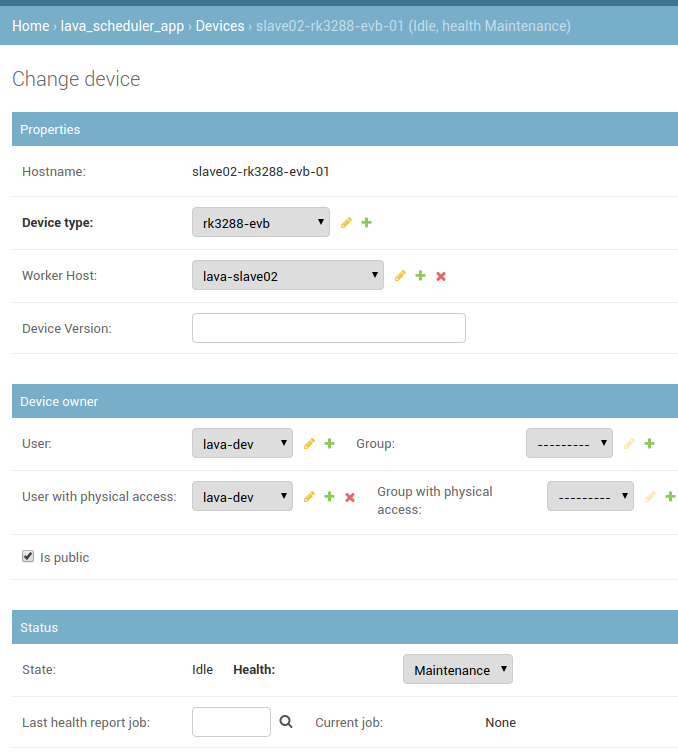

注意：
需要点开Advanced properties并添加与hostname同名的TAG
勾选"Is Public"以便所有用户都能提交任务到该设备．
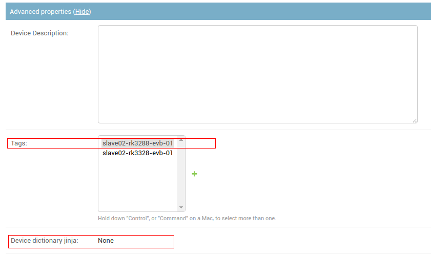

以上信息填完，网页配置就完成了，此时的Device dictionary jinja状态是None, 需要使用命令更新dictionary.

### 命名规范

Device type 为  芯片名-产品形态，　如：

```
rk3288-evb
rk3399-excavator
rk3128-box
```

Hostname 命名为 Worker Ｎame - 'device type'- 序号 中间没有空格，如:

```
slave01-rk3288-evb-01
```

其中Worker Ｎame----截取DUT所在Ｗorker的hostname的有效序列部分，这里是slave01. Worker HOSTNAME的配置参考lava　worker设置部分,　在LAVA Server中的Ｗorker Name允许加一个补充描述字段，用于区分不能部门使用的服务器如：

```
lava-slave02-bsp
lava-slave01-box
lava-slave03-mid
lava-slave04
```

## 5.2 更新device dictionary

### 5.2.1 生成device jinja2

#### 获取代码

为了更好的对device dictionary进行更新，我们提供了一个脚本，放在如下仓库

```
git clone ssh://10.10.10.29:29418/rk/lava-devices
```

主要实现运行add_device.py脚本，会利用device.conf配置文件的信息生成一个yaml格式的

```shell
# DUT设备名
deviceName=slave02-rk3328-evb-01
# LAVA server token
ip=172.16.10.254
userName=yk
key=nk4d12
#用于升级工指定设备的SN或者usb location id
idb_serial_number=slave02-rk3288-evb-01
# 用于adb命令指定设备的SN
adb_serial_number=OVD34OVJ6C
# 串口连接命令
connection_command=telnet 172.16.12.249 7001
# 辅助板的串口设备名和Port id
serialName=RK-AutoTest_Serial_A50658Y6
serialPort=B
```

#### 获取配置信息

由于这份配置用到的硬件信息每个设备都不一样，需要明确信息的来源：
设备SN: 参考5.3.4获取
usb_location_id: 参考2.2.9获取
connection_command: 参考2.2.7
SerialName/Port: 参考2.2.6

#### 生成device jinja配置

根据设备信息修改完device.conf后就可以运行脚本生成配置文件slave02-rk3288-evb-01_rockusb.yaml

```shell
sudo ./add_device.py
```

生成的slave02-rk3288-evb-01_rockusb.yaml文件内容如下:

```









```

其中开头部分表示这是基于'rkdroid.jinja2'的扩展，需要LAVA Server端的base device_type有对应文件和每个项的定义，参考2.2.6节.

### 5.2.2 更新device dictionary到server

通过lava-tool命令行工具(已被cli工具替换)把配置好的设备配置更新到服务器

```shell
sudo lava-tool device-dictionary http://rktest:iws035h8esh11jlajsfz47sif96t0ciah2fs9zkds18rn022gqga9im7t9wcq1td9cd0n27sfaaaqd0p33bwafhhjnk0kj7hwoduja8sa0dwo8en4sdhnsdqof7787sc@172.16.12.245 slave02-rk3288-evb-01 --update slave02-rk3288-evb-01_rockusb.yaml
```

命令执行成功后，在server　dashboard的device页面确认dictionary信息
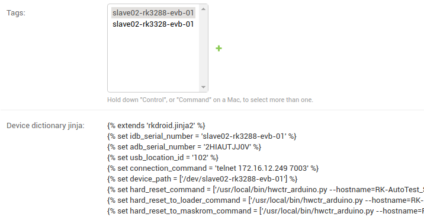

## 5.3 DUT序列号

### 5.3.1 RK序列号

Rockchip的SDK提供一个vendor storage区域，用于存放设备的SN，可直接用于U-Boot　rockusb, Kernel的adb等，Android中使用vendor storage的SN作为USB的SN，是在Android 8.1才合并，早期的版本需要手动加补丁．Rockchip早期使用过IDB区域来存放SN数据，这个方法已被替换，后续不推荐使用．
Rockchip的序列号生成方法是：

－查询vendor storage中是否包含SN，如果有就直接使用；
－从efuse读取cpuid(长度不对)，然后通过一次转换得到SN;
－以上接口都没有，则使用随机产生的SN；

### 5.3.2 序列号的使用

Linux升级工具upgrade_tool的'-s'参数支持指定序列号对特定设备进行操作，这个参数同时支持把usb location  id作为参数，可以根据实际情况使用，如maskrom的rockusb没有提供SN．

adb工具同样使用'-s'选项指定序列号对特定设备进行操作．

### 5.3.3 RK写号工具

烧写设备SN可以使用Windows下的写号工具或UpgradeDllTool，目前没有Linux版本．根据文档烧写序列号，工具默认会同时烧写vendor storage区域和IDB区域．
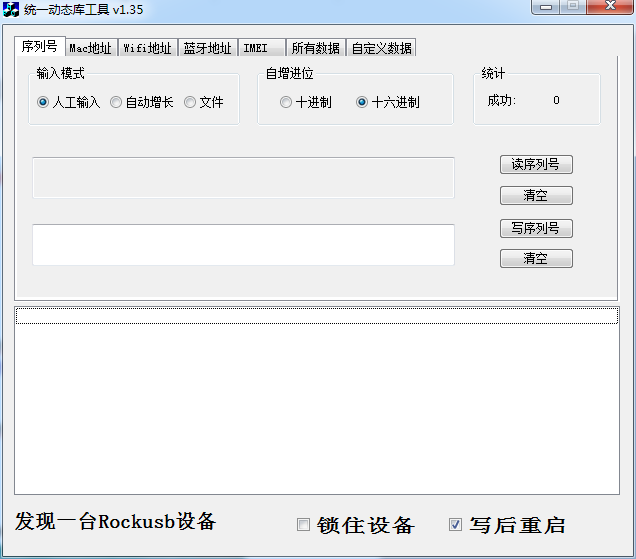
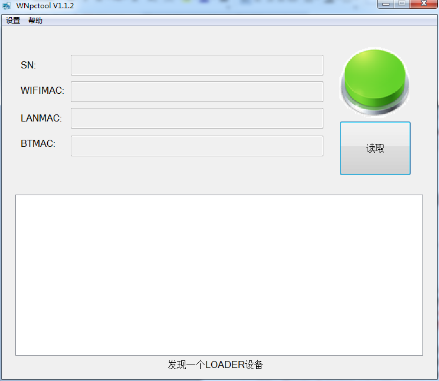

### 5.3.4 确认序列号可用

把烧写序列号后的设备通过USB连接到PC，可以在pc上通过命令查询

```shell
sudo dmesg

# 截取部分log如下
[36833.979693] usb 1-2: new high-speed USB device number 33 using xhci_hcd
[36834.207436] usb 1-2: New USB device found, idVendor=2207, idProduct=0006
[36834.207439] usb 1-2: New USB device strings: Mfr=1, Product=2, SerialNumber=3
[36834.207440] usb 1-2: Product: rk3288
[36834.207442] usb 1-2: Manufacturer: rockchip
[36834.207443] usb 1-2: SerialNumber: 2HIAUTJJ0V

[43265.812107] usb 1-2: USB disconnect, device number 33
[43267.056777] usb 1-2: new high-speed USB device number 34 using xhci_hcd
[43267.293295] usb 1-2: New USB device found, idVendor=2207, idProduct=320a
[43267.293297] usb 1-2: New USB device strings: Mfr=1, Product=2, SerialNumber=3
[43267.293299] usb 1-2: Product: USB download gadget
[43267.293300] usb 1-2: Manufacturer: Rockchip
[43267.293301] usb 1-2: SerialNumber: c3d9b8674f4b94f6
```

如果是adb设备，也可以通过命令查询设备序列号

```
adb devices
```

# 六 LAVA JOB

## 6.1 JOB实现流程

- 任务提交到LAVA Master,
- Master 解析调度任务
- Master 发送任务到Dispatcher
- Dispatcher 解析任务
- Dispatcher执行任务 Deploy-Boot-Test
- 格式化结果输出并反馈给LAVA Server

### 任务提交

任务可以通过XML-RPC接口使用命令行提交给Master, 也可以在网页上直接提交，参考6.2了解详细的提交流程

### LAVA Server解析调度

LAVA Server有多个模块，任务是提交到database，scheduler模块负责查询database中任务状态改变并查询Worker/Device状态后，把任务发给Dispatcher.
<http://172.16.12.246/static/docs/v2/scheduler.html>

### LAVA Dispatcher解析执行

LAVA dispatcher中的daemon收到master的任务后，会开始解析任务，为每个任务建立独立的临时工作目录/环境，把任务细化为不同的action, 最后调用JobRunner一条一条的执行。

### 结果处理

测试输出需要格式化为特定格式的数据，输出由LAVA Server解析的信息。如果有需要，可以在web interface里面使用图表形式进行长期追踪。

## 6.2 JOB提交

### 6.2.1 通过命令提交

为了方便提交任务，我们提供了一个仓库，包含了提交脚本和job模板

```
git clone ssh://10.10.10.29:29418/rk/lava-jobs
```

脚本的使用方法可以参考pytools/post-lava-job/README，主要是需要提供完整的server和token信息，以及任务信息．其中post-lava-job.py会解析JOB_VARS(命令行'-v'内容)的内容，把对应项替换到模板的宏里面，生产一个完整的job描述文件后，利用token验证后发送请求给LAVA server.

```shell
# 使用配置文件传参
python post-lava-job.py -c example-job/memtest.cfg

# 命令行传参
python post-lava-job.py -s 172.16.10.254/RPC2 -u rktest -t iws035h8esh11jlajsfz47sif96t0ciah2fs9zkds18rn022gqga9im7t9wcq1td9cd0n27sfaaaqd0p33bwafhhjnk0kj7hwoduja8sa0dwo8en4sdhnsdqof7787sc -j example-job/memtest.yaml -v '{"device_type":"rk3228b-box", "device_tag":"slave04-rk3228b-box-01", "job_name":"test python submit", "boot_url":"http://172.16.10.254:8000/images/rk322x/stb/4.4/20161026_11/boot.img"}'
```

example-job/memtest.cfg的内容跟命令行是类似的：

```
[LAVA_SERVER]
lava_server = 172.16.10.254/RPC2
lava_user = rktest
lava_token = iws035h8esh11jlajsfz47sif96t0ciah2fs9zkds18rn022gqga9im7t9wcq1td9cd0n27sfaaaqd0p33bwafhhjnk0kj7hwoduja8sa0dwo8en4sdhnsdqof7787sc

# 指定job模板
[LAVA_JOB]
lava_job_yaml = example-job/memtest.yaml

# 以下信息会被post-lava-job.py脚本替换到example-job/memtest.yaml中
[JOB_VARS]
#device_type要跟LAVA Server中定义的device_type一致
device_type = rk3288-evb
# device_tag　要跟LAVA Server中定义的一致
device_tag = rk3288-p977-01
job_name = rk3288-p1-memtest
boot_url = http://172.16.10.254:8000/images/rk3288_P1/boot.img
```

任务提交后会打印出任务在server的dashboard的地址，可以通过该地址查看任务的详细执行情况．

需要注意的是JOB_VAR中的"device_tag"是用于指定某个特定的设备，不是必须的，如果未指定，LAVA Server会从设备列表中找一个device_type符合的可用设备来执行任务．

### 6.2.2 通过网页提交

有效账户登录网页后，可以通过网页接口直接提交job，首先在Scheduler选项下面点击submit, 如下图
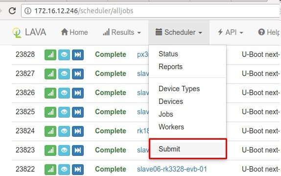

出来的界面如下，把job的详细内容粘贴到中间的文本框中，点击左下放的'Validate', 成功后点击Submit提交。
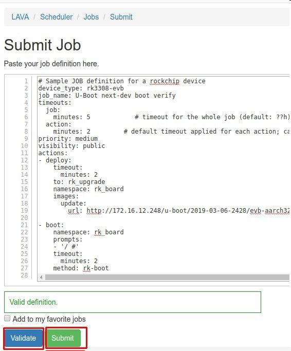

### 6.2.3 网页查看任务内容

job提交后，可以通过job的详细信息页面查询当前执行的任务内容，点击下图中的'Definition'查看。


## 6.3 LAVA job定义

提交给LAVA Server的job是YAML格式的描述，提交的任务格式包含：

- parameters for the job
- list of actions.

### 6.3.1 parameter部分

必需包含的内容有：
device_type, 用于指定测试目标的设备类型
job_name，

另外有一些可选参数：
job_timeout, action_timeout
proirity, 任务优先级
tag, 用于指定具体的device，如果未制定，则按从符合device_type的设备中选取，
metadata，用于传输或者记录一些参数，可以用于建立图表结果时query的过滤条件，一般放文件最末尾，格式是　key: value

```
metadata:
    foo: bar
    bar: foo
```

job parameter示例：

```yaml
device_type: kvm
job_name: kvm-pipeline
job_timeout:
  minutes: 15        # timeout for the whole job (default: ??h)
action_timeout:
  minutes: 5         # default timeout applied for each action;
priority: medium
```

### 6.3.2 actions部分

Actions部分定义了测试任务该使用什么方法，部署什么固件，如何进入测试环境，并测试什么内容。
一般分为3个阶段：

- Deploy
- Boot
- Test

#### Deploy项

负责定义如何部署固件，示例如下，

```yaml
actions:
   - deploy:
       timeout:
         minutes: 20
       to: tmpfs
       image: https://images.validation.linaro.org/kvm/standard/stretch-2.img.gz
       os: debian
```

其中’to‘指定使用部署固件的方法，每种方法需要的属性/键值不一样，由各自分别定义，在代码中通过accept的＠classmethod进行定义。
’image‘一般用于指定需要部署的固件。

#### Boot项

跟Deploy类似，只是对应使用Boot的方法及其所需的项，示例如下

```yaml
   - boot:
       method: kvm
       media: tmpfs
       failure_retry: 2
       prompts:
         - 'linaro-test'
         - 'root@debian:~#'
```

有'method'键指定Boot方法，一般会有'prompts'键用于指定LAVA在串口监测的打印内容，如果有match的内容，就说明已经完成了Boot过程.

#### Test项

```yaml
   - test:
       failure_retry: 3
       name: kvm-basic-singlenode  # is not present, use "test $N"
       timeout:
         minutes: 5 # uses install:deps, so takes longer than singlenode01
       definitions:
           - repository: git://git.linaro.org/lava-team/lava-functional-tests.git
             from: git
             path: lava-test-shell/smoke-tests-basic.yaml
             name: smoke-tests
           - repository: https://git.linaro.org/lava-team/lava-functional-tests.git
             from: git
             path: lava-test-shell/single-node/singlenode03.yaml
             name: singlenode-advanced
```

其中'definitions'定义了测试项的来源和具体内容，在dispatcher的parser阶段，会根据定义下载代码，并把要测试的内容overlay到目标rootfs中。

#### 其他

Android的测试，为了使宿主LAVA Worker不受影响，引入了LXC进行测试，部署阶段需要先Deploy/Boot LXC系统，然后Deploy/Boot DUT系统，并使用lxc的protocol进行连接通信。

Action详细的选项参考如下内容：
<http://172.16.12.246/static/docs/v2/dispatcher-format.html>
<http://172.16.12.246/static/docs/v2/dispatcher-actions.html>

### 6.3.3 job示例

以下几个示例列出了rockchip平台实际使用的job内容。

#### Boot测试job

```yaml
device_type: rk3229-evb
 job_name: U-Boot next-dev boot verify
timeouts:
  job:
    minutes: 5            # timeout for the whole job (default: ??h)
  action:
    minutes: 2         # default timeout applied for each action; can be overriden in the action itself (default: ?h)
priority: medium
visibility: public
actions:
- deploy:
    timeout:
      minutes: 2
    to: rk_upgrade
    namespace: rk_board
    images:
      update:
        url: http://172.16.12.248/u-boot/2019-03-08-2516/evb-rk3229_defconfig/update.img
    os: debian
 - boot:
    namespace: rk_board
    prompts:
    - '/ #'
    - 'Freeing unused kernel memory'
    timeout:
      minutes: 2
    method: rk-boot
```

#### Linux测试job

```yaml
device_type: rk3399-excavator
 job_name: linux dd-wr-speed
timeouts:
  job:
    minutes: 260            # timeout for the whole job (default: ??h)
  action:
    minutes: 155         # default timeout applied for each action; can be overriden in the action itself (default: ?h)
priority: medium
visibility: public
actions:
- deploy:
    timeout:
      minutes: 20
    to: rk_upgrade
    namespace: rk_board
    images:
      update:
        url: http://172.16.12.248/linux_sdk/2019-02-26-25/rk3399-excavator/update.img
      rootfs:
        url: http://172.16.12.248/golden/arm64/linaro-rootfs.img
        apply-overlay: true
    os: debian
 - boot:
    namespace: rk_board
    prompts:
    - '/ #'
    - 'Freeing unused kernel memory'
    - 'root@'
    timeout:
      minutes: 5
    method: rk-boot
 - test:
    namespace: rk_board
    timeout:
      minutes: 160
    definitions:
    - repository: ssh://10.10.10.29:29418/rk/test-definitions
      from: git
      path: automated/linux/dd-wr-speed/dd-wr-speed.yaml
      name: dd-wr-speed
```

#### Android测试job

```yaml
device_type: rk3128h-box
 tags:
  - slave01rk3128hbox01
job_name: rk3128h 9.0 gerrit boot test
timeouts:
  job:
    minutes: 60            # timeout for the whole job (default: ??h)
  action:
    minutes: 15         # default timeout applied for each action; can be overriden in the action itself (default: ?h)
priority: medium
visibility: public
 protocols:
  lava-lxc:
    name: lxc-test
    template: debian
    distribution: debian
    release: sid
    arch: amd64
    mirror: http://ftp2.cn.debian.org/debian/
    security_mirror: http://ftp2.cn.debian.org/debian-security/
 actions:
  - deploy:
      namespace: tlxc
      timeout:
        minutes: 5
      to: lxc
      os: debian
   - boot:
      namespace: tlxc
      prompts:
      - 'root@(.*):/#'
      timeout:
        minutes: 5
      method: lxc
   - deploy:
      timeout:
        minutes: 30
      to: rk_upgrade
      namespace: droid
      connection: lxc
      images:
        update:
          url: http://10.10.10.164:8000/common/auto_build/sdk/internal/rk3128h/atv/9.0/20190309_1011/update.img
      os: debian
   - boot:
      namespace: droid
      prompts:
      - 'root@(.*):/#'
      timeout:
        minutes: 15
      method: rk_upgrade
   - test:
      namespace: tlxc
      timeout:
        minutes: 10
      connection: lxc
      definitions:
      - repository: http://lava-dev@10.10.10.214:8080/r/~lava-dev/test-definitions.git
        from: git
        path: rockchip/automated/android/functional/get-adb-serial/get-adb-serial.yaml
        params:
          ANDROID_SERIAL: "slave01rk3128hbox01"
        name: get-adb-serial
```

## 6.4 LAVA Server详细实现

### 6.4.1 Server状态机

LAVA Master通过Worker, Device, Job这几个状态机来描述和管理各自的状态和健康情况。

#### Workers状态

每个Worker有两个变量来描述其状态

- state:
  - Online
  - Offline
- health:
  - Active
  - Maintenance
  - Retired

'state'是内部变量，由Master根据ping的接收情况来决定。如果Worker处于offline模式，所有发送到挂在这个Worker上设备的任务都会停止调度。
'health'用于用户手工管理，手动设置到'Maintenance'状态后，所有上面的设备自动处于'Maintenance'状态。

#### Devices状态

每个设备有两个变量用于描述当前状态:

- state:
  - Idle: not in use by any test job
  - Reserved: has been reserved for a test job but the test job is not running yet
  - Running: currently running a test job

- health:
  - Good
  - Unknown
  - Looping: should run health-checks in a loop
  - Bad
  - Maintenance
  - Retired

'state'是内部变量，在scheduling, starting, canceling和ending测试任务时由lava-master或者lava-logs设置。
'health'由'health-check'任务设置或者由用户手动管理。

#### Test Jobs状态

每个Job有两个变量描述当前的状态，他们分别是任务状态和健康情况。一个LAVA的Job在其生命周期内，可以分为如下:

- 状态：
  - SUBMITTED: Job在成功提交后的初始状态
  - SCHEDULING: 这个是多节点的Job特有的状态，表示还有子Job还没有得到调度，等所有子Job都完成调度以后，会进SCHEDULED
  - SCHEDULED: Job已经调度成功，分配好Device和Worker
  - RUNNING: Job正在Device上运行
  - CANCELING: 用户中断Job
  - FINISHED: Job已经完成

- health:
  - Unknown: default value that will be overriden when the job is finished.
  - Complete
  - Incomplete
  - Canceled: the test job was canceled.

### 6.4.2 Scheduler

调度器一般由lava-master每20S发起一次，首先调度health-check任务，然后在查询数据库中的其他job情况调度到对应的device.

#### Health-checks job调度

health-check的job会优先被调度，只有满足下面几个条件的设备才会被调度器进行health-check任务调度：

- state is Idle
- health is Good, Unknown or Looping
- worker’s state is Online

#### Test jobs调度

只有满足下面几个条件的设备才会被调度器进行health-check任务调度：

- state is Idle
- health is Good or Unknown
- worker’s state is Online

更多内容可以参考:
<http://172.16.12.246/static/docs/v2/scheduler.html>

#### Scheduler中Submit Job实现

   提交一个Job有两种方式：通过lava-tool或自己写脚本调用XML-RPC接口；在网页上直接填写并提交。这两种方式都不在本节的讨论范围，本节主要分析LAVA服务器端收到Job以后的处理、调度和分发流程。

   提交Job会先调用到lava_scheduler_app.views.job_submit，这个函数会完全用户权限检查和测试用例的检查，具体如下：

```python
@BreadCrumb("Submit", parent=job_list)
def job_submit(request):

    is_authorized = False
    # 用户需要有add_testjob权限，这个需要管理员创建用户的时候勾选，或者用户管理里修改
    if request.user and request.user.has_perm(
            'lava_scheduler_app.add_testjob'):
        is_authorized = True

    response_data = {
        'is_authorized': is_authorized,
        'bread_crumb_trail': BreadCrumbTrail.leading_to(job_submit),
    }

    if request.method == "POST" and is_authorized:
        if request.is_ajax():
            # 网页提交会进这个分支
            try:
                # 这里就是做job的合法性检查
                validate_job(request.POST.get("definition-input"))
                return HttpResponse(simplejson.dumps("success"))
            except Exception as e:
                return HttpResponse(simplejson.dumps(str(e)),
                                    content_type="application/json")

        else:
            # xml-rpc提交进这个分支
            try:
                definition_data = request.POST.get("definition-input")
                job = testjob_submission(definition_data, request.user)

                if isinstance(job, type(list())):
                    response_data["job_list"] = [j.sub_id for j in job]
                    # Refer to first job in list for job info.
                    job = job[0]
                else:
                    response_data["job_id"] = job.id
```

   具体的job合法性检查是在lava_scheduler_app.models.validate_job里完成的，这个函数会调用validate_submission检查Job是否符合规范要求，同时检查一些语义冲突，具体如下：

```python
def validate_submission(data_object):
    """
    Validates a python object as a TestJob submission
    :param data: Python object, e.g. from yaml.load()
    :return: True if valid, else raises SubmissionException
    """
    try:
        data_object = handle_include_option(data_object)
        # 检查语法规范
        schema = _job_schema()
        schema(data_object)
    except MultipleInvalid as exc:
        raise SubmissionException(exc)

    # 检查各种语义冲突，secret不能和visbility=public一起出现
    _validate_secrets(data_object)
    # revision不能和shallow=true一起出现
    _validate_vcs_parameters(data_object)
    # 检查多节点的角色冲突
    _validate_multinode(data_object)
    return True
```

   可以再来看看语法规范检查的具体内容，写测试用例出错，如果在出错信息上看不出原因，都可以参考具体实现，函数实现比较检查，直接贴代码，不细数：

```python
def _job_schema():
    if sys.version_info[0] == 2:
        metadata_types = Any(str, int, unicode)
    else:
        metadata_types = Any(str, int)
    return Schema(
        {
            'device_type': All(str, Length(min=1)),  # not Required as some protocols encode it elsewhere
            Required('job_name'): All(str, Length(min=1, max=200)),
            Optional('include'): str,
            Optional('priority'): Any('high', 'medium', 'low', int),
            Optional('protocols'): _job_protocols_schema(),
            Optional('context'): _context_schema(),
            Optional('metadata'): All({metadata_types: metadata_types}),
            Optional('secrets'): dict,
            Optional('tags'): [str],
            Required('visibility'): visibility_schema(),
            Required('timeouts'): _job_timeout_schema(),
            Required('actions'): _job_actions_schema(),
            Optional('notify'): _job_notify_schema(),
            Optional('reboot_to_fastboot'): bool
        }
    )
```

   完成语法和语义检查后，脚本会检查Job的通知设置，测试用例可以在这里配置什么情况下通知哪些用户，通过哪些方式通知，具体如下：

```python
def validate_yaml(yaml_data):
    if "notify" in yaml_data:
        if "recipients" in yaml_data["notify"]:
            for recipient in yaml_data["notify"]["recipients"]:
                if recipient["to"]["method"] == \
                   NotificationRecipient.EMAIL_STR:
                    if "email" not in recipient["to"] and \
                       "user" not in recipient["to"]:
                        raise SubmissionException("No valid user or email address specified.")
                else:
                    if "handle" not in recipient["to"] and \
                       "user" not in recipient["to"]:
                        raise SubmissionException("No valid user or IRC handle specified.")
                if "user" in recipient["to"]:
                    try:
                        User.objects.get(username=recipient["to"]["user"])
                    except User.DoesNotExist:
                        raise SubmissionException("%r is not an existing user in LAVA." % recipient["to"]["user"])
                elif "email" in recipient["to"]:
                    try:
                        validate_email(recipient["to"]["email"])
                    except ValidationError:
                        raise SubmissionException("%r is not a valid email address." % recipient["to"]["email"])

        # 从代码上看，测试用例可以设置以结果比较作为触发通知的条件，比较适合于性能测试，后续有时间再研究具体语法
        if "compare" in yaml_data["notify"] and \
           "query" in yaml_data["notify"]["compare"]:
            from lava_results_app.models import Query
            query_yaml_data = yaml_data["notify"]["compare"]["query"]
            if "username" in query_yaml_data:
                try:
                    query = Query.objects.get(
                        owner__username=query_yaml_data["username"],
                        name=query_yaml_data["name"])
                    if query.content_type.model_class() != TestJob:
                        raise SubmissionException(
                            "Only TestJob queries allowed.")
                except Query.DoesNotExist:
                    raise SubmissionException(
                        "Query ~%s/%s does not exist" % (
                            query_yaml_data["username"],
                            query_yaml_data["name"]))
            else:  # Custom query.
                if query_yaml_data["entity"] != "testjob":
                    raise SubmissionException(
                        "Only TestJob queries allowed.")
                try:
                    conditions = None
                    if "conditions" in query_yaml_data:
                        conditions = query_yaml_data["conditions"]
                    Query.validate_custom_query(
                        query_yaml_data["entity"],
                        conditions
                    )
                except Exception as e:
                    raise SubmissionException(e)
```

   完成这一系列的检查后，Job就会被添加到一个TestJob的对象列表中，后续服务器调度的时候会遍历这个列表。

#### Schedule Job详细流程

   LAVA服务器在启动时候先完成初始化和配置socket侦听后，会进到一个main_loop中，函数中有个死循环，而这个循环就是Job调度的主入口，其先计算一个超时时间，然后等dispatcher的命令或事件通知，并进相应的处理流程，都完成后才会开始调度TestJob，具体如下：

```python
def main_loop(self, options):
        last_schedule = last_dispatcher_check = time.time()

        while True:
            try:
                try:
                    # 计算超时时间，最长20s，最小1ms
                    now = time.time()
                    timeout = min(SCHEDULE_INTERVAL - (now - last_schedule),
                                  PING_INTERVAL - (now - last_dispatcher_check))
                    # If some actions are remaining, decrease the timeout
                    if self.events["canceling"]:
                        timeout = min(timeout, 1)
                    # Wait at least for 1ms
                    timeout = max(timeout * 1000, 1)

                    # 等待dispatcher的命令或事件通知
                    sockets = dict(self.poller.poll(timeout))
                except zmq.error.ZMQError:
                    continue

                if sockets.get(self.pipe_r) == zmq.POLLIN:
                    self.logger.info("[POLL] Received a signal, leaving")
                    break

                # 处理dispatcher的命令
                if sockets.get(self.controler) == zmq.POLLIN:
                    while self.controler_socket():  # Unqueue all pending messages
                        pass

                # 处理dispatcher的事件通知
                if sockets.get(self.event_socket) == zmq.POLLIN:
                    while self.read_event_socket():  # Unqueue all pending messages
                        pass
                    # Wait for the next iteration to handle the event.
                    # In fact, the code that generated the event (lava-logs or
                    # lava-server-gunicorn) needs some time to commit the
                    # database transaction.
                    # If we are too fast, the database object won't be
                    # available (or in the right state) yet.
                    continue

                # Inotify socket
                if sockets.get(self.inotify_fd) == zmq.POLLIN:
                    os.read(self.inotify_fd, 4096)
                    self.logger.debug("[AUTH] Reloading certificates from %s",
                                      options['slaves_certs'])
                    self.auth.configure_curve(domain='*', location=options['slaves_certs'])

                # 检查dispatcher状态，太久没发消息给server的dispatcher会被offline
                now = time.time()
                if now - last_dispatcher_check > PING_INTERVAL:
                    for hostname, dispatcher in self.dispatchers.items():
                        if dispatcher.online and now - dispatcher.last_msg > DISPATCHER_TIMEOUT:
                            if hostname == "lava-logs":
                                self.logger.error("[STATE] lava-logs goes OFFLINE")
                            else:
                                self.logger.error("[STATE] Dispatcher <%s> goes OFFLINE", hostname)
                            self.dispatchers[hostname].go_offline()
                    last_dispatcher_check = now

                # 开始调度和分发Job，最小间隔也是20s
                if time.time() - last_schedule > SCHEDULE_INTERVAL:
                    if self.dispatchers["lava-logs"].online:
                        # Job调度，符合条件的Job都会进SCHEDULED状态
                        schedule(self.logger)

                        # 分发调度，SCHEDULED状态的Job会被发给dispatcher
                        with transaction.atomic():
                            self.start_jobs(options)
                    else:
                        self.logger.warning("lava-logs is offline: can't schedule jobs")

                    # Handle canceling jobs
                    self.cancel_jobs()

                    # Do not count the time taken to schedule jobs
                    last_schedule = time.time()
                else:
                    # Cancel the jobs and remove the jobs from the set
                    if self.events["canceling"]:
                        self.cancel_jobs(partial=True)
                        self.events["canceling"] = set()

            except (OperationalError, InterfaceError):
                self.logger.info("[RESET] database connection reset.")
                # Closing the database connection will force Django to reopen
                # the connection
                connection.close()
                time.sleep(2)

```

   我们先来看一下调度函数schedule，在这里会完成所有Job和Device的遍历和匹配，并切换符合条件的Job进SCHEDULED状态，先看具体实现：

```python
def schedule(logger):
    available_devices = schedule_health_checks(logger)
    schedule_jobs(logger, available_devices)
```

   可以看到，首先是调用schedule_health_checks做健康检查，这个函数会调用每个device的health check（后面简称hc），并把通过的device加到列表中返回，具体如下：

```python
def schedule_health_checks(logger):
    logger.info("scheduling health checks:")
    available_devices = {}
    hc_disabled = []
    # 遍历所有的device type
    for dt in DeviceType.objects.all().order_by("name"):
        if dt.disable_health_check:
            hc_disabled.append(dt.name)
            # 如果这个device type关闭了健康检查，则所有在idle状态，并且其连接的worker处于online，健康状态处于good或unknown的设备都会进设备列表
            devices = dt.device_set.filter(state=Device.STATE_IDLE)
            devices = devices.filter(worker_host__state=Worker.STATE_ONLINE)
            devices = devices.filter(health__in=[Device.HEALTH_GOOD,
                                                 Device.HEALTH_UNKNOWN])
            devices = devices.order_by("hostname")
            available_devices[dt.name] = list(devices.values_list("hostname", flat=True))

        else:
            with transaction.atomic():
                # 启用健康检查的device type，在这里完成健康检查
                available_devices[dt.name] = schedule_health_checks_for_device_type(logger, dt)

    # Print disabled device types
    if hc_disabled:
        logger.debug("-> disabled on: %s", ", ".join(hc_disabled))

    return available_devices
```

   可以看到进一步会调用到schedule_health_checks_for_device_type函数，这里才是真正做check的地方，具体如下：

```python
def schedule_health_checks_for_device_type(logger, dt):
    # 遍历所有状态idle，worker处于online，健康度good，unknown，looping的设备
    devices = dt.device_set.select_for_update()
    devices = devices.filter(state=Device.STATE_IDLE)
    devices = devices.filter(worker_host__state=Worker.STATE_ONLINE)
    devices = devices.filter(health__in=[Device.HEALTH_GOOD,
                                         Device.HEALTH_UNKNOWN,
                                         Device.HEALTH_LOOPING])
    devices = devices.order_by("hostname")

    print_header = True
    available_devices = []
    for device in devices:
        # 没有hc的设备，直接加到可用设备列表中
        health_check = device.get_health_check()
        if health_check is None:
            available_devices.append(device.hostname)
            continue

        # 检查是否可以跳过健康检查
        scheduling = False
        if device.health in [Device.HEALTH_UNKNOWN, Device.HEALTH_LOOPING]:
            scheduling = True
        elif device.last_health_report_job is None:
            scheduling = True
        else:
            # 每个device type都可以配置自己的检查检查频度，可以根据Job数量，也可以根据时间
            submit_time = device.last_health_report_job.submit_time
            if dt.health_denominator == DeviceType.HEALTH_PER_JOB:
                count = device.testjobs.filter(health_check=False,
                                               start_time__gte=submit_time).count()

                scheduling = count >= dt.health_frequency
            else:
                frequency = datetime.timedelta(hours=dt.health_frequency)
                now = timezone.now()

                scheduling = submit_time + frequency < now

        if not scheduling:
            available_devices.append(device.hostname)
            continue

        # log some information
        if print_header:
            logger.debug("- %s", dt.name)
            print_header = False

        logger.debug(" -> %s (%s, %s)", device.hostname,
                     device.get_state_display(),
                     device.get_health_display())
        logger.debug("  |--> scheduling health check")
        try:
            # 实际的健康检查从这里进去
            schedule_health_check(device, health_check)
        except Exception as exc:
            # If the health check cannot be schedule, set health to BAD to exclude the device
            logger.error("  |--> Unable to schedule health check")
            logger.exception(exc)
            prev_health_display = device.get_health_display()
            device.health = Device.HEALTH_BAD
            device.log_admin_entry(None, "%s 鈫?%s (Invalid health check)" % (prev_health_display, device.get_health_display()))
            device.save()

    return available_devices
```

   这里需要注意的有两个函数，get_health_check和schedule_health_check，前者涉及到hc和device的匹配算法，后者是hc的入口，具体如下：

```python
def get_health_check(self):
        # 获取设备字典，这里实际上就是获取device定义的extends字段
        extends = self.get_extends()
        if not extends:
            return None

        # 从hc的主目录，根据extends去匹配yaml文件
        # HEALTH_CHECK_PATH=“/etc/lava-server/dispatcher-config/health-checks”
        filename = os.path.join(Device.HEALTH_CHECK_PATH, "%s.yaml" % extends)
        # Try if health check file is having a .yml extension
        if not os.path.exists(filename):
            filename = os.path.join(Device.HEALTH_CHECK_PATH,
                                    "%s.yml" % extends)
        try:
            with open(filename, "r") as f_in:
                return f_in.read()
        except IOError:
            return None
```

```python
def schedule_health_check(device, definition):
    user = User.objects.get(username="lava-health")
    # 创建一个pipeline job(本质也是TestJob)，并设为SCHEDULED状态，真正执行检查还要回到前面的start_jobs
    job = _create_pipeline_job(yaml.load(definition), user, [], device_type=device.device_type, orig=definition)
    job.health_check = True
    job.go_state_scheduled(device)
    job.save()
```

   到目前为止，hc的job就创建并调度完成，回到前面我们可以看到下一步是schedule_jobs，先来看一下具体实现：

```python
def schedule_jobs(logger, available_devices):
    logger.info("scheduling jobs:")
    # 遍历所有的device type，并跳过不可用的device
    for dt in DeviceType.objects.all().order_by("name"):
        # Check that some devices are available for this device-type
        if not available_devices.get(dt.name):
            continue
        with transaction.atomic():
            # 实际job调度入口
            schedule_jobs_for_device_type(logger, dt, available_devices[dt.name])

    with transaction.atomic():
        # Transition multinode if needed
        transition_multinode_jobs(logger)

```

   schedule_jobs_for_device_type会遍历指定device type的所有可用设备，进一步调用schedule_jobs_for_device_type，先看一下实际实现：

```python
def schedule_jobs_for_device(logger, device):
    # 遍历所有STATE_SUBMITTED和STATE_SCHEDULING状态的Job，并且其还没有分配device，
    # 同时device type要和device一致，最后做个分组排序
    jobs = TestJob.objects.filter(state__in=[TestJob.STATE_SUBMITTED,
                                             TestJob.STATE_SCHEDULING])
    jobs = jobs.filter(actual_device__isnull=True)
    jobs = jobs.filter(requested_device_type__pk=device.device_type.pk)
    jobs = jobs.order_by("-state", "-priority", "submit_time", "target_group", "id")

    for job in jobs:
        # device可以指定允许的提交者，这里先跳过不匹配的Job
        if not device.can_submit(job.submitter):
            continue

        device_tags = set(device.tags.all())
        job_tags = set(job.tags.all())
        # job的tag必须是device tag的子集
        if not job_tags.issubset(device_tags):
            continue

        job_dict = yaml.load(job.definition)
        # 这里检查vland协议的匹配，对这个协议有兴趣可以参考:
        # http://ip_of_lava_server/static/docs/v2/vland.html
        if 'protocols' in job_dict and 'lava-vland' in job_dict['protocols']:
            if not match_vlan_interface(device, job_dict):
                continue

        logger.debug(" -> %s (%s, %s)", device.hostname,
                     device.get_state_display(),
                     device.get_health_display())
        logger.debug("  |--> [%d] scheduling", job.id)
        if job.is_multinode:
            # TODO: keep track of the multinode jobs
            job.go_state_scheduling(device)
        else:
            # 设置job的状态为SCHEDULED，比较简单，不细诉
            job.go_state_scheduled(device)
        job.save()
        break

```

   到这里为止，Job的调度就完成了，所有SCHEDULED状态的Job都找到自己的device和worker了。

#### Start Job详细流程

   这一步要把已经调度好的Job，发START消息给相应的dispatcher（其主入口在lava-slave[^1]里，所有代码中经常会把dispatcher叫做slave，相应的server的主入口在lava-master[^2]，有时候会简称master），先看总入口：

```python
def start_jobs(self, options):
        """
        Loop on all scheduled jobs and send the START message to the slave.
        """
        # 筛选状态为SCHEDULED和分配到的device online的Job
        query = TestJob.objects.select_for_update()
        # Only select test job that are ready
        query = query.filter(state=TestJob.STATE_SCHEDULED)
        # Only start jobs on online workers
        query = query.filter(actual_device__worker_host__state=Worker.STATE_ONLINE)
        # exclude test job without a device: they are special test jobs like
        # dynamic connection.
        query = query.exclude(actual_device=None)
        # TODO: find a way to lock actual_device

        # Loop on all jobs
        for job in query:
            msg = None
            try:
                self.start_job(job, options)
            except jinja2.TemplateNotFound as exc:
                self.logger.error("[%d] Template not found: '%s'",
                                  job.id, exc.message)
                msg = "Template not found: '%s'" % exc.message
            except jinja2.TemplateSyntaxError as exc:
                self.logger.error("[%d] Template syntax error in '%s', line %d: %s",
                                  job.id, exc.name, exc.lineno, exc.message)
                msg = "Template syntax error in '%s', line %d: %s" % (exc.name, exc.lineno, exc.message)
            except IOError as exc:
                self.logger.error("[%d] Unable to read '%s': %s",
                                  job.id, exc.filename, exc.strerror)
                msg = "Cannot open '%s': %s" % (exc.filename, exc.strerror)
            except yaml.YAMLError as exc:
                self.logger.error("[%d] Unable to parse job definition: %s",
                                  job.id, exc)
                msg = "Cannot parse job definition: %s" % exc

            if msg:
                # Add the error as lava.job result
                metadata = {"case": "job",
                            "definition": "lava",
                            "error_type": "Infrastructure",
                            "error_msg": msg,
                            "result": "fail"}
                suite, _ = TestSuite.objects.get_or_create(name="lava", job=job)
                TestCase.objects.create(name="job", suite=suite, result=TestCase.RESULT_FAIL,
                                        metadata=yaml.dump(metadata))
                job.go_state_finished(TestJob.HEALTH_INCOMPLETE, True)
                job.save()
```

   进一步可以看start_job的实现，这里我们只看普通Job的实现，多节点的类似，这里不细述，可以看到实际的发送实现是在send_multipart_u实现的，下面是具体实现：

```python
def start_job(self, job, options):
        # Load job definition to get the variables for template
        # rendering
        job_def = yaml.load(job.definition)
        job_ctx = job_def.get('context', {})

        device = job.actual_device
        worker = device.worker_host

        # Load configurations
        env_str = load_optional_yaml_file(options['env'])
        env_dut_str = load_optional_yaml_file(options['env_dut'])
        device_cfg = device.load_configuration(job_ctx)
        dispatcher_cfg_file = os.path.join(options['dispatchers_config'],
                                           "%s.yaml" % worker.hostname)
        dispatcher_cfg = load_optional_yaml_file(dispatcher_cfg_file)

        self.save_job_config(job, worker, device_cfg, options)
        self.logger.info("[%d] START => %s (%s)", job.id,
                         worker.hostname, device.hostname)
        # 再进去就是转成字节流通过socket发送了，不细看了
        send_multipart_u(self.controler,
                         [worker.hostname, 'START', str(job.id),
                          self.export_definition(job),
                          yaml.dump(device_cfg),
                          dispatcher_cfg, env_str, env_dut_str])
```

[^1]: 代码可以看/etc/init.d/lava-slave
[^2]: 代码可以看/etc/init.d/lava-master

## 6.5 LAVA dispatcher

### 6.5.1 Dispatcher流程

LAVA的dispatcher由slave daemon(lava-run)收到master发过来的job后启动，主要分为job的parser和runner。
parser解析server发过来的action_data，形成一份可执行的pipeline作为job执行内容。
每一种可执行的类策略(如fastboot deploy, fastboot boot等)都是一个Action类对象，最主要的成员函数是下面几个:

- accept(), 该函数用于匹配类对象和action_data数据，一般使用'name'进行匹配，类似kernel驱动中的compatible name;
- validate(), 该函数用于验证对应执行策略所需的参数是否完整，如某个deploy需要image，则会检查'image'是否存在;
- populate(), 该函数用于插入对应执行策略的子流程action，如rk_upgrade的deploy策略，需要有连接设备，进入rockusb，从服务器下载固件，下载固件到DUT等几个子流程；
- run(),　每个流程的运行实体。

Dispatcher的完整运行流程如下:

1. JobParser.parser首先从'test' action提取test_info, 然后逐个解析’deploy‘, 'boot', 'test'形成pipeline的top level Strategy；
2. 解析action的逻辑是调用各自的select函数来匹配具体要使用的策略，如Deployment.select, Boot.select(), LavaTest.select(), 每个select()函数轮询子类的accept()成员进行匹配；
3. 匹配成功后使用Pipeline.add_action新增流程，add_action()中会调用子类的populate()成员把类策略的子流程加进来，这是一个递归调用，把所有需要的子流程都加进来；
4. 在解析'deploy' action时，如果有test_info,　会根据需求增加overlay子流程，包括把需要使用的测试代码/资源准备在一个临时的overlay tar包的流程，以及准备rootfs时把这个tar包打包进rootfs中；
5. 所有action_data数据都解析完成后，会添加一个FinalizeAction()到Pipeline，用于清理整个测试过程中产生的临时文件；
6. Pipeline建立完成后，Job会调用整个流程的validate()成员验证各个环节所需参数；
7. validate()成功后，job调用run()成员开始执行流程；
8. 运行完成后，Job根据运行情况保存运行结果'pass', 'fail'并返回给上级.

Pipeline效果示例如下：

```
Deploy (1)
   |
   \___ 1.1
   |
   \ __ 1.2
   |     |
   |     \_ 1.2.1
   |     |   |
   |     |   \_ 1.2.1.1
   |     |   |
   |     |   \_ 1.2.1.2
   |     |         |
   |     |         \__ 1.2.1.2.1
   |     |
   |     \__1.2.2
   |
   \____1.3
   |
  Boot (2)
   |
   \_ 2.1
   |
   \_ 2.2
```

### 6.5.2 Pipeline示例

下面通过几个在rockchip平台实际使用的测试用例，来了解测试过程。

#### 系统Boot测试流程

Boot测试用于验证最新代码和补丁是否可以正常启动，是最简单的测试case，测试获取最新的rkbin(), kernel, u-boot(最新代码加gerrit补丁)，然后打包一个带shell的ramdisk，不使用rootfs分区，这样可以做到最快部署和启动，烧写使用的rk烧写工具(kernelci使用的是基于网络的NFS/tftp存放固件)，启动完成匹配到预定义字符即为成功，没有使用test阶段。

```
1 rk-upgrade-deploy
|
\___ 1.1 enter-rockusb-action
\___ 1.2 download-retry
|     \_ 1.2.1 http-download
\___ 1.3 upgrade-tool-apply-update-img-action
|
2 rkboot-action
|
\___ 2.1 rk-arduino-reset
\___ 2.2 connect-device
\___ 2.3 rk-boot-retry
|
3 finalize
|
\___ 3.1 power-off
\___ 3.2 read-feedback
```

#### Linux测试case流程

Linux测试用例在'Boot'测试的基础上，加了'test'阶段，rootfs使用完整的debian rootfs，其中为了部署'test-definition'的内容，在'deploy'阶段增加了'lava-overlay'和’apply-overlay-image‘部分把'test-definition'下载安装好并打包进rootfs。为了适配rootfs的overlay，我们把固件分为2部分，一部分是不带rootfs的update.img，以及独立的一份rootfs，所以烧写固件的时候，可以看到分别烧写了'update.img'和一个partition image.

```
1 rk-upgrade-deploy
|
\___ 1.1 lava-overlay
|     |
|     \_ 1.1.1 lava-vland-overlay
|     \_ 1.1.2 lava-multinode-overlay
|     \_ 1.1.3 test-definition
|     |   \_ 1.1.3.1 git-repo-action
|     |   \_ 1.1.3.2 test-overlay
|     |   \_ 1.1.3.3 test-install-overlay
|     |   \_ 1.1.3.4 test-runscript-overlay
|     \_ 1.1.4 compress-overlay
|     \_ 1.1.5 persistent-nfs-overlay
|
\___ 1.2 enter-rockusb-action
|
\___ 1.3 download-retry
|     \_ 1.3.1 http-download
\___ 1.4 deploy-device-env
\___ 1.5 download-retry
|     \_ 1.5.1 http-download
\___ 1.6 apply-overlay-image
\___ 1.7 deploy-device-env
\___ 1.8 upgrade-tool-apply-update-img-action
\___ 1.9 upgrade-tool-apply-part-img-action
\___ 1.10 upgrade-tool-reboot-action
|
2 rkboot-action
|
\___ 2.1 rk-arduino-reset
\___ 2.2 connect-device
\___ 2.3 rk-boot-retry
|
3 lava-test-retry
|
\___ 3.1 lava-test-shell
|
4 finalize
|
\___ 4.1 power-off
\___ 4.2 read-feedback
```

#### Android测试case流程

Android的测试在Linux测试的基础上加入了LXC的deploy和boot, 需要注意在这里'test-definition'是overlay到LXC的rootfs中。

```
1 lxc-deploy
|
\___ 1.1 lxc-create-action
\___ 1.2 lxc-create-udev-rule-action
\___ 1.3 deploy-device-env
\___ 1.4 lava-overlay
|     \_ 1.4.1 lava-vland-overlay
|     \_ 1.4.2 lava-multinode-overlay
|     \_ 1.4.3 test-definition
|     |   \_ 1.4.3.1 git-repo-action
|     |   \_ 1.4.3.2 test-overlay
|     |   \_ 1.4.3.3 test-install-overlay
|     |   \_ 1.4.3.4 test-runscript-overlay
|     \_ 1.4.4 compress-overlay
|     \_ 1.4.5 persistent-nfs-overlay
\___ 1.5 apply-lxc-overlay
|
2 lxc-boot
|
\___ 2.1 boot-lxc
\___ 2.2 lxc-add-static
\___ 2.3 connect-lxc
\___ 2.4 expect-shell-connection
\___ 2.5 export-device-env
|
3 rk-upgrade-deploy
|
\___ 3.1 enter-rockusb-action
\___ 3.2 download-retry
|     \_ 3.2.1 http-download
\___ 3.3 upgrade-tool-apply-update-img-action
|
4 rk-device-boot
|
\___ 4.1 host-wait-for-adb-device-booted
\___ 4.2 lxc-create-udev-rule-action
\___ 4.3 connect-lxc
\___ 4.4 lxc-wait-for-adb-device
|
5 lava-test-retry
|
\___ 5.1 lava-test-shell
|
6 finalize
|
\___ 6.1 power-off
\___ 6.2 read-feedback
```

可以通过如下地址了解详细信息:
<http://172.16.12.246/static/docs/v2/dispatcher-design.html>

### 6.5.3 Deploy action -- rk_upgrade

为了适配rk的固件类型和烧写工具，开发了一个新的'deploy'方法，名为'rk_upgrade',　使用'upgrade_tool'升级，支持三种类型:

- 完整固件，'update.img', image关键词为'update', 在maskrom模式使用'uf'命令；
- loader文件，image关键词为'loader', 在maskrom模式使用'ul'命令；
- 独立分区的固件，除前面两种image关键词以外的key默认为分区固件，在loader模式使用'di -xxx'命令(xxx为前面的key)，需要保证已有固件中包含可用分区表(并包含一个分区名能匹配image key)；

如果有独立分区固件，dispatcher会在固件路径中查找并下载loader文件用于下载工具，需要保证有loader文件存在(按“*_loader_*”匹配)。

可以支持多个固件烧写，如果同时有update.img和其他固件，会先少些update.img然后烧写其他固件。典型的yaml配置如下，

```yaml
- deploy:
    timeout:
      minutes: 20
    to: rk_upgrade
    namespace: rk_board
    images:
      update:
        url: http://172.16.12.248/linux_sdk/2019-02-26-25/rk3399-excavator/update.img
      rootfs:
        url: http://172.16.12.248/golden/arm64/linaro-rootfs.img
        apply-overlay: true
```

### 6.5.4 Test action -- lava-test-shell

dispatcher在'lava_dispatcher/lava_test_shell/'目录提供了一系列的黑盒工具，用于运行test-definition脚本，在deploy阶段需要进行预编译到可直接执行的状态，然后打包到rootfs中，然后运行测试时由test　action　’lava-test-shell‘(lava_dispatcher/actions/test/shell.py)启用。

lava-test-shell这个test action的主要流程是：

- test action是在boot action之后，默认已经完成了boot流程，并默认已经完成root用户登录，有管理员权限，可以直接进行命令行交互；
- 发送一个check_char(回车)到连接串口，等待预定义的prompt字符串，一般是'root@'或者'/ #';
- 收到预期回应后，查询root文件系统中是否存在预先部署好的测试目录，一般是’/lava-id‘;
- 如果测试目录存在，则调用lava_test_shell的lava-test-runner启动测试流程；

```shell
/lava-23140/bin/lava-test-runner /lava-23140/0
```

- 测试过程中会检测如下字符串，测试程序可以通过以下格式字符串向LAVA传递信息；

```
'(?P<test_case_id>.*-*)\\s+:\\s+(?P<result>(PASS|pass|FAIL|fail|SKIP|skip|UNKNOWN|unknown))'
```

#### lava-test-case

lava-test-case用于记录一条测试case的结果，并传递给lava，对于测试结果处理，要求使用lava-test-case进行格式化，不建议自己写代码处理。
使用方法:

```yaml
run:
  steps:
    - "lava-test-case simpletestcase --result pass"
    - "lava-test-case bottle-count --result pass --measurement 99 --units bottles"
```

参数要求如下:

```
--result $RESULT: $RESULT should be one of pass/fail/skip/unknown
--measurement $MEASUREMENT: A numerical measurement associated with the test result
--units $UNITS: The units of $MEASUREMENT, 这个参数要求必须和'--measurement'同时出现
```

python中使用lava-test-case示例:

```python
#!/usr/bin/env python

from subprocess import call

def test_case():
    """
    Calculate something based on a test
    and return the data
    """
    return {"name": "test-rate", "result": "pass",
        "units": "Mb/s", "measurement": 4.23}

def main():
    data = test_case()
    call(
        ['lava-test-case',
         data['name'],
         '--result', data['result'],
         '--measurement', data['measurement'],
         '--units', data['units']])
    return 0

if __name__ == '__main__':
    main()
```

网页中test-case结果解析如下：
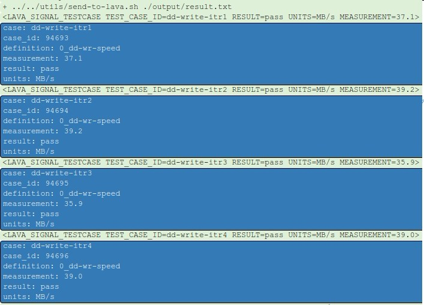

## 6.6 Test-definition

### 6.6.1 代码仓库

前面6.3.2提到LAVA JOB中的'Test'测试项，一般是一个独立的git仓库存放测试代码。我们在linaro代码的基础上，加入了一些自己测试内容，形成自己的仓库，地址如下：

```shell
# Rockchip仓库
ssh://10.10.10.29:29418/rk/test-definitions

# Linaro仓库
https://git.linaro.org/qa/test-definitions.git
```

### 6.6.2 test-definition格式

LAVA Test-definition包含３部分:

- Metadata describing the test definition, used by the test writers but not read by LAVA.
- The actions and parameters to set up the test(s)
- The instructions or steps to run as part of the test(s)

一份典型的简单test-definition示例如下:

```yaml
metadata:
  name: passfail
  format: "Lava-Test-Shell Test Definition 1.0"
  description: "A simple passfail test for demo."
  maintainer:
    - user.user@linaro.org
  os:
    - ubuntu
    - openembedded
  devices:
    - origen
    - panda
  environment:
    - lava-test-shell

params:
  TEST_1: pass

run:
  steps:
    - echo "test-1: $TEST_1"
    - echo "test-2: fail"
    - $(./my-script.sh arguments)

parse:
  pattern: "(?P<test_case_id>.*-*):\\s+(?P<result>(pass|fail))"
```

第1部分Metadata包括下面几个项：

- format: A format string recognised by LAVA
- name: A short name of the purpose of the file
- description A description of the instructions contained in the file.

以及下面一些可选项：

- version: 版本控制
- maintainer: The email address of the maintainer of this file.
- os: A list of the operating systems which this file can support.
- devices: A list of devices which are expected to be able to run these instructions.

第2部分是为了准备运行测试环境的一些操作，可以包括从git仓库下载代码并编译，或者安装一些依赖的package(Debian)，这些lava-test-shell都支持，不过有这类需求的建议自己写一份相对完善和复杂脚本在里面实现，而不是直接在yaml文件实现，建议保留一些运行脚本需要的可配置参数。

第3部分主要是运行步骤，可以逐条运行，如果内容相对复杂，可以调用自己另外写的一份脚本，可以是系统支持的任意格式，如shell或者python。

如果使用独立脚本进行测试，可以调用一些预定义的库函数以减少代码重复，对于测试结果，建议测试脚本按要求格式生成output/result.txt，然后调用utils/send-to-lava.sh ./output/result.txt把信息传给lava, lava解析后得到6.5节的输出效果。

### 6.6.3 库函数

test-definition仓库automated/lib/下面提供了给测试脚本使用的库函数:

- android-test-lib, android测试的公用函数
- py_test_lib.py, python脚本的公用函数
- sh-test-lib, shell脚本的共用函数

如shell脚本使用库函数示例

```shell
#安装不同OS的依赖包，支持debian, fedora等OS
pkgs="e2fsprogs dosfstools"
install_deps "${pkgs}" "${SKIP_INSTALL}"

# 打印信息
error_msg "Unsupported architecture!"
warn_msg "Unsupported architecture"
```

### 6.6.4 Linux测试case示例

Linux系统测试中，'linux-test-shell'和测试项'test-definition'都是打包在DUT的rootfs中，所有程序直接在DUT的系统里面运行。

dd-wr-speed.yaml内容：

```yaml
metadata:
    name: dd-speed-test
    format: "Lava-Test-Shell Test Definition 1.0"
    description: "dd write/read speed test."
    maintainer:
        - chase.qi@linaro.org
    os:
        - debian
        - fedora
        - openembedded
    devices:
        - mustang
        - hi6220-hikey
        - apq8016-sbc
    scope:
        - performance
    environment:
        - lava-test-shell

params:
    # The currenty working directory will be used by default.
    # Use '-p' specify partition that used for dd test.
    # Example: /dev/sdb1
    PARTITION: ""
    # CAUTION: if FS_TYPE not equal to the existing fs type of the partition
    # specified with '-p', the partition will be formatted.
    FS_TYPE: ""
    # You may need to run dd test 4-5 times for an accurate evaluation.
    ITERATION: "5"
    SKIP_INSTALL: "True"

run:
    steps:
        - cd ./automated/linux/dd-wr-speed
        - ./dd-wr-speed.sh -p "${PARTITION}" -t "${FS_TYPE}" -i "${ITERATION}" -s "${SKIP_INSTALL}"
        - ../../utils/send-to-lava.sh ./output/result.txt
```

dd-wr-speed.sh内容：

```shell
#!/bin/sh -e

# shellcheck disable=SC1091
. ../../lib/sh-test-lib
OUTPUT="$(pwd)/output"
RESULT_FILE="${OUTPUT}/result.txt"
export RESULT_FILE
ITERATION="5"

usage() {
    echo "Usage: $0 [-p <partition>] [-t <type>] [-i <iteration>] [-s <true>]" 1>&2
    exit 1
}

while getopts "p:t:i:s:" o; do
  case "$o" in
    # The current working directory will be used by default.
    # Use '-p' specify partition that used for dd test.
    p) PARTITION="${OPTARG}" ;;
    # CAUTION: if FS_TYPE not equal to the existing fs type of the partition
    # specified with '-p', the partition will be formatted.
    t) FS_TYPE="${OPTARG}" ;;
    # You may need to run dd test 4-5 times for an accurate evaluation.
    i) ITERATION="${OPTARG}" ;;
    s) SKIP_INSTALL="${OPTARG}" ;;
    *) usage ;;
  esac
done

prepare_partition() {
    if [ -n "${PARTITION}" ]; then
        device_attribute="$(blkid | grep "${PARTITION}")"
        [ -z "${device_attribute}" ] && error_msg "${PARTITION} NOT found"
        fs_type=$(echo "${device_attribute}" \
            | grep "TYPE=" \
            | awk '{print $3}' \
            | awk -F '"' '{print $2}')

        # If PARTITION specified, its FS_TYPE needs to be specified explicitly.
        [ -z "${FS_TYPE}" ] && \
            error_msg "Please specify ${PARTITION} filesystem with -t"

        # Try to format the partition if it is unformatted or not the same as
        # the filesystem type specified with parameter '-t'.
        if [ -n "${FS_TYPE}" ]; then
            if [ "${FS_TYPE}" != "${fs_type}" ]; then
                umount "${PARTITION}" > /dev/null 2>&1
                info_msg "Formatting ${PARTITION} to ${FS_TYPE}..."

                if [ "${FS_TYPE}" = "fat32" ]; then
                    echo "y" | mkfs -t vfat -F 32 "${PARTITION}"
                else
                    echo "y" | mkfs -t "${FS_TYPE}" "${PARTITION}"
                fi
                info_msg "${PARTITION} formatted to ${FS_TYPE}"
            fi
        fi

         # Mount the partition and enter its mount point.
         mount_point="$(df |grep "${PARTITION}" | awk '{print $NF}')"
         if [ -z "${mount_point}" ]; then
             mount_point="/mnt"
             mount "${PARTITION}" "${mount_point}"
             info_msg "${PARTITION} mounted to ${mount_point}"
         fi
         cd "${mount_point}"
    fi
}

dd_write() {
    echo
    echo "--- dd write speed test ---"
    rm -f dd-write-output.txt
    for i in $(seq "${ITERATION}"); do
        echo "Running iteration ${i}..."
        rm -f dd.img
        echo 3 > /proc/sys/vm/drop_caches
        dd if=/dev/zero of=dd.img bs=1048576 count=1024 conv=fsync 2>&1 \
            | tee  -a "${OUTPUT}"/dd-write-output.txt
    done
}

dd_read() {
    echo
    echo "--- dd read speed test ---"
    rm -f dd-read-output.txt
    for i in $(seq "${ITERATION}"); do
        echo "Running iteration ${i}..."
        echo 3 > /proc/sys/vm/drop_caches
        dd if=dd.img of=/dev/null bs=1048576 count=1024 2>&1 \
            | tee -a "${OUTPUT}"/dd-read-output.txt
    done
    rm -f dd.img
}

parse_output() {
    test_case_id="$1"
    if ! [ -f "${OUTPUT}/${test_case_id}-output.txt" ]; then
        warn_msg "${test_case_id} output file is missing"
        return 1
    fi

    itr=1
    while read -r line; do
        if echo "${line}" | egrep -q "(M|G)B/s"; then
            measurement="$(echo "${line}" | awk '{print $(NF-1)}')"
            units="$(echo "${line}" | awk '{print substr($NF,1,2)}')"
            result=$(convert_to_mb "${measurement}" "${units}")

            add_metric "${test_case_id}-itr${itr}" "pass" "${result}" "MB/s"
            itr=$(( itr + 1 ))
        fi
    done < "${OUTPUT}/${test_case_id}-output.txt"

    # For mutiple times dd test, calculate the mean, min and max values.
    # Save them to result.txt.
    if [ "${ITERATION}" -gt 1 ]; then
        eval "$(grep "${test_case_id}" "${OUTPUT}"/result.txt \
            | awk '{
                       if(min=="") {min=max=$3};
                       if($3>max) {max=$3};
                       if($3< min) {min=$3};
                       total+=$3; count+=1;
                   }
               END {
                       print "mean="total/count, "min="min, "max="max;
                   }')"

        # shellcheck disable=SC2154
        add_metric "${test_case_id}-mean"  "pass" "${mean}" "MB/s"
        # shellcheck disable=SC2154
        add_metric "${test_case_id}-min" "pass" "${min}" "MB/s"
        # shellcheck disable=SC2154
        add_metric "${test_case_id}-max" "pass" "${max}" "MB/s"
    fi
}

# Test run.
! check_root && error_msg "This script must be run as root"
create_out_dir "${OUTPUT}"

info_msg "About to run dd test..."
info_msg "Output directory: ${OUTPUT}"

pkgs="e2fsprogs dosfstools"
install_deps "${pkgs}" "${SKIP_INSTALL}"

prepare_partition
info_msg "dd test directory: $(pwd)"
dd_write
parse_output "dd-write"
dd_read
parse_output "dd-read"
```

### 6.6.5 Android系统测试项

Android测试项与Linux测试不一样，'lava-test-shell'和'test-definition'都是部署在LXC的rootfs，而不是部署到DUT，所有与DUT的交互都是通过ADB完成。测试需要用到的资源和文件，都是通过adb　push推送，命令通过adb shell运行，如果要运行的命令较复杂，则可以把脚本push到DUT后运行，最后结果通过adb pull获取。通过如下示例，可以比较清晰的看出一个测试的完整流程。

dd-wr-speed.yaml

```yaml
metadata:
    name: dd-speed-test
    format: "Lava-Test-Shell Test Definition 1.0"
    description: "dd write/read speed test."
    maintainer:
        - chase.qi@linaro.org
    os:
        - android
    devices:
        - hi6220-hikey
        - apq8016-sbc
    scope:
        - performance
    environment:
        - lava-test-shell
        - local-test-runner

params:
    # /data partition will be tested by default.
    # Use '-p' specify partition. Example "/dev/block/mmcblk1p1"
    PARTITION: ""
    # You may need to run dd test 4-5 times for an accurate evaluation.
    ITERATION: "5"
    # Specify device serial number for adb connection if more than one device
    # connected.
    ANDROID_SERIAL: ""
    # Specify timeout in seconds for wait_boot_completed
    BOOT_TIMEOUT: "300"

run:
    steps:
        - cd ./automated/android/dd-wr-speed
        - ./dd-wr-speed.sh -p "${PARTITION}" -i "${ITERATION}" -s "${ANDROID_SERIAL}" -t "${BOOT_TIMEOUT}"
        - ../../utils/send-to-lava.sh ./output/result.txt
```

dd-wr-speed.sh

```shell
#!/bin/sh -ex

HOST_OUTPUT="$(pwd)/output"
LOCAL_DEVICE_OUTPUT="${HOST_OUTPUT}/device-output"
DEVICE_OUTPUT="/data/local/tmp/dd-wr-speed"
ANDROID_SERIAL=""
BOOT_TIMEOUT="300"
ITERATION="5"
PARTITION=""
RESULT_FILE="${HOST_OUTPUT}/result.txt"
export  RESULT_FILE

usage() {
    echo "Usage: $0 [-p <partition>] [-i <iteration>] [-s <android_serial>] [-t <timeout>]" 1>&2
    exit 1
}

while getopts ":p:i:s:t:" o; do
  case "$o" in
    # "/data" partition will be used by default. Use '-p' to specify an
    # external partition as needed, the partition will be formatted to vfat,
    # and all data will be lost.
    p) PARTITION="${OPTARG}" ;;
    # You may need to run dd test 4-5 times for an accurate evaluation.
    i) ITERATION="${OPTARG}" ;;
    # Specify device serial number when more than one device connected.
    s) ANDROID_SERIAL="${OPTARG}" ;;
    t) BOOT_TIMEOUT="${OPTARG}" ;;
    *) usage ;;
  esac
done

# shellcheck disable=SC1091
. ../../lib/sh-test-lib
# shellcheck disable=SC1091
. ../../lib/android-test-lib

parse_output() {
    test_case_id="$1"
    if ! [ -f "${LOCAL_DEVICE_OUTPUT}/dd-wr-speed/${test_case_id}-output.txt" ]; then
        warn_msg "${test_case_id} result file missing"
        return 1
    fi

    # Parse raw output and add results to ${RESULT_FILE}.
    itr=1
    info_msg "Parsing ${test_case_id} output..."
    while read -r line; do
        if echo "${line}" | grep -E "(M|G)B/s"; then
            # busybox dd print test result in the format "39.8MB/s".
            units=$(echo "${line}" | awk '{print substr($NF,(length($NF)-3),2)}')
            measurement=$(echo "${line}" | awk '{print substr($NF,1,(length($NF)-4))}')
            measurement=$(convert_to_mb "${measurement}" "${units}")
            add_metric "${test_case_id}-itr${itr}" "pass" "${measurement}" "MB/s"
            itr=$(( itr + 1 ))
        fi
    done < "${LOCAL_DEVICE_OUTPUT}/dd-wr-speed/${test_case_id}"-output.txt

    # For multiple times dd test, calculate the mean, min and max values.
    # Save them to ${RESULT_FILE}.
    if [ "${ITERATION}" -gt 1 ]; then
        eval "$(grep "${test_case_id}" "${HOST_OUTPUT}"/result.txt \
            | awk '{
                       if(min=="") {min=max=$3};
                       if($3>max) {max=$3};
                       if($3< min) {min=$3};
                       total+=$3; count+=1;
                   }
               END {
                       print "mean="total/count, "min="min, "max="max;
                   }')"

        # shellcheck disable=SC2154
        add_metric "${test_case_id}-mean" "pass" "${mean}" "MB/s"
        # shellcheck disable=SC2154
        add_metric "${test_case_id}-min" "pass" "${min}" "MB/s"
        # shellcheck disable=SC2154
        add_metric "${test_case_id}-max" "pass" "${max}" "MB/s"
    fi
}

# Test run.
create_out_dir "${HOST_OUTPUT}"
mkdir -p "${LOCAL_DEVICE_OUTPUT}"
echo "${LOCAL_DEVICE_OUTPUT}"

initialize_adb
wait_boot_completed "${BOOT_TIMEOUT}"

detect_abi
# shellcheck disable=SC2154
adb_push  "../../bin/${abi}/busybox" "/data/local/tmp/bin/"
adb_push "./device-script.sh" "/data/local/tmp/bin"

info_msg "About to run dd speed test on device ${ANDROID_SERIAL}"
adb shell "echo /data/local/tmp/bin/device-script.sh ${ITERATION} ${DEVICE_OUTPUT} ${PARTITION} | su" 2>&1 | tee "${HOST_OUTPUT}/device-stdout.log"

adb_pull "${DEVICE_OUTPUT}" "${LOCAL_DEVICE_OUTPUT}"
ls "${LOCAL_DEVICE_OUTPUT}"

parse_output "dd-write"
parse_output "dd-read"
```

DUT上运行的device-script.sh

```shell
#!/system/bin/sh -ex

ITERATION="$1"
OUTPUT="$2"
PARTITION="$3"
export PATH="/data/local/tmp/bin:${PATH}"

if [ "$#" -lt 2 ]; then
    echo "ERROR: Usage: $0 <iteration> <output> <partition>"
    exit 1
fi

[ -d "${OUTPUT}" ] && mv "${OUTPUT}" "${OUTPUT}_$(date -r "${OUTPUT}" +%Y%m%d%H%M%S)"
mkdir -p "${OUTPUT}" && cd "${OUTPUT}"

# If partition specified, format it to vfat, and mount it to /mnt/dd_test.
# Then enter the mount point to do dd test.
if [ -n "${PARTITION}" ]; then
    partition_name=$(basename "${PARTITION}")
    # shellcheck disable=SC2016
    partition_numbers=$(grep "${partition_name}" /proc/partitions | busybox awk '{print $1","$2}')

    if [ -z "${partition_numbers}" ]; then
        echo "ERROR: ${PARTITION} NOT found" && exit 1
    else
        # Attemp to umount it in case it is mounted by Android vold.
        umount "/dev/block/vold/public:${partition_numbers}" > /dev/null 2>&1 || true
        umount "${PARTITION}" > /dev/null 2>&1 || true

        echo "INFO: formatting ${PARTITION} to vfat..."
        busybox mkfs.vfat "${PARTITION}"
        sync && sleep 10

        mkdir -p /mnt/dd_test
        if mount -t vfat "${PARTITION}" /mnt/dd_test/; then
            echo "INFO: Mounted ${PARTITION} to /mnt/dd_test"
        else
            echo "ERROR: failed to mount ${PARTITION}" && exit 1
        fi

        cd /mnt/dd_test
        echo "INFO: dd test directory: $(pwd)"
    fi
fi

# Run dd write/read test.
for i in $(seq "${ITERATION}"); do
    echo
    echo "INFO: Running dd write test [$i/${ITERATION}]"
    echo 3 > /proc/sys/vm/drop_caches
    busybox dd if=/dev/zero of=dd.img bs=1048576 count=1024 conv=fsync 2>&1 \
        | tee  -a "${OUTPUT}"/dd-write-output.txt

    echo
    echo "INFO: Running dd read test [$i/${ITERATION}]"
    echo 3 > /proc/sys/vm/drop_caches
    busybox dd if=dd.img of=/dev/null bs=1048576 count=1024 2>&1 \
        | tee -a "${OUTPUT}"/dd-read-output.txt

    rm -f dd.img
done
```

### 6.6.6 一些建议

- 脚本中所有命令必须是可执行的，如果是跟os有关，需要加以区分，这是为什么yaml中有'os'属性；
- 所有测试必须在特定的目录内完成，如果有测试仓库下载，也需要checkout到同一个目录下面；
- 明确所有依赖项，包括解释器，环境变量，可执行程序等，可以在测试脚本中加入依赖包列表的安装，或者下载编译安装所需的模块来避免预编译好的二进制文件有系统版本和包的依赖问题；
- 保持YAML文件相关性小，独立性强，文件小而多比一个很大但很复杂的文件要好；
- 有已有接口的，优先使用已有接口，如lava-test-case实现；
- 构造测试case，记录每一个测试项的测试结果/测试数据，并保留一定的debug信息；
- 测试case不依赖LAVA，可在本地独立运行；
- LAVA相关的程序只做输入输出;
- "Make each program do one thing well", 不同领域的测试使用不同的case;
- 不同环境的测试使用不同的测试任务；

内容参考：
<http://172.16.12.246/static/docs/v2/lava_test_shell.html>
<http://172.16.12.246/static/docs/v2/writing-tests.html>

### 6.6.7 LTP

The Linux Test Project is a joint project started by SGI, developed and maintained by IBM, Cisco, Fujitsu, SUSE, Red Hat and others, that has a goal to deliver test suites to the open source community that validate the reliability, robustness, and stability of Linux. The LTP testsuite contains a collection of tools for testing the Linux kernel and related features.
代码:

```shell
git clone https://github.com/linux-test-project/ltp.git
```

维护者主要是Linux操作系统厂商和一些产品品牌商，所以侧重与系统层面的测试，如syscall, fs, io, mm, net等，不做benchmark。
一年发布3次，文档请查看<https://github.com/linux-test-project/ltp/wiki/Developers>

### 6.6.8 LTP-DDT

LTP-DDT(Device Driver Tests)是TI基于LTP项目扩展用于测试Linux驱动的项目，基础架构和使用方式完全使用LTP内容，测试用例/场景代码位于'runtest/ddt/'，需要用到的测试代码/脚本位于'testcases/ddt/'.
项目页面<http://processors.wiki.ti.com/index.php/LTP-DDT>, 代码：

```shell
git clone git://arago-project.org/git/projects/test-automation/ltp-ddt.git
```

包括了以下模块的测试：

- alsa
- cpu hotplug
- crypto
- timers
- emmc
- mmc/sd
- ethernet
- fbdev
- gpio
- gstreamer (multimedia)
- hdmi
- i2c
- ipc
- latency under different use cases (important for RT kernel)
- lmbench
- memory tests
- mm (ltp's memory management)
- msata
- nand
- nor
- pci
- pipes (ltp)
- power management
- programmable real-time unit (PRU)
- pwm
- qspi
- realtime (ltp)
- rng
- rtc
- sata
- scheduler (ltp)
- sgx (graphics)
- smp
- vspi
- syscalls (ltp)
- system (use-cases, e.g. multiple tests running in parallel)
- thermal
- timers (ltp)
- touchscreen
- uart
- usb host (multiple tests with different classes)
- usb device
- v4l2
- vlan
- dwt
- wlan

## 6.7 使用测试结果

测试结果通过格式化输出后，可以在LAVA的任务页面看到测试输出，而实际上单个测试的结果数据，通常意义不大，后续的数据处理才更有用处。LAVA对于测试结果的使用提供了：

- 访问结果(LAVA内部，XML-RPC)；
- 导出数据到LAVA外部；
- 用户自定义通知；
- 定制结果处理规则；
- LAVA的数据过滤和列表

### 6.7.1 LAVA Queries

单一的query可以基于如下其中一个对象进行条件过滤:

- Test jobs
- Test suits
- Test Cases

```
1. Incomplete jobs submitted from kernel-ci:
	Condition 1:
		Condition model: test job
		Field name: health
		Operator: Exact match
		Field value: Incomplete
	Condition 2:
		Condition model: test job
		Field name: submitter
		Operator: Exact match
		Field value: kernel-ci
2. Completed jobs that have at least one failed test case on panda NFS using LSK:
	Condition 1:
		Condition model: test job
		Field name: health
		Operator: Exact match
		Field value: Complete
	Condition 2:
		Condition model: test job
		Field name: requested_device_type
		Operator: Exact match
		Field value: panda
	Condition 3:
		Condition model: test case
		Field name: result
		Operator: Exact match
		Field value: Test failed
	Condition 4:
		Condition model: metadata
		Field name: kernel.version
		Operator: Contains
		Field value: lsk
3. List of jobs on vexpress TC2 using LSK 3.14 where boot time exceeds 40 seconds:
	Condition 1:
		Condition model: metadata
		Field name: android.name
		Operator: Contains
		Field value: vexpress-lsk-3.14
	Condition 2:
		Condition model: test case
		Field name: measurement
		Operator: Greater than
		Field value: 40
4. List of jobs stuck in ‘Canceling’ state:
	Condition 1:
		Condition model: testjob
		Field name: state
		Operator: Exact match
		Field value: Canceling
```

添加完成后的'dd-wr-speed'　query示例
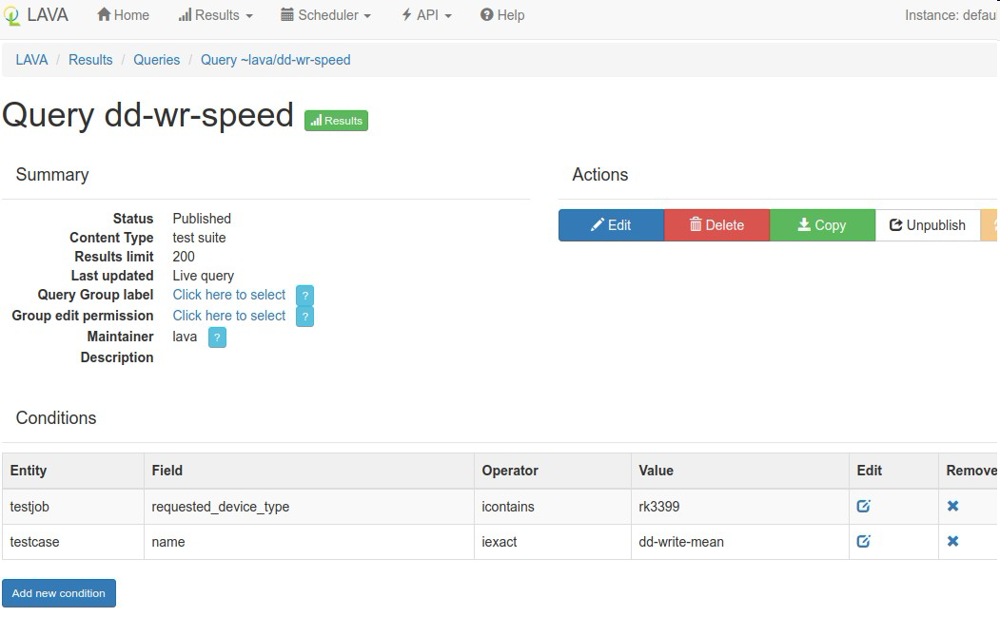

### 6.7.2 LAVA Charts

按要求建立好query后，就可以建立chart来显示query，在Result->Chart页面，点击'Create'输入名字和描述后，就得到如下图的页面：

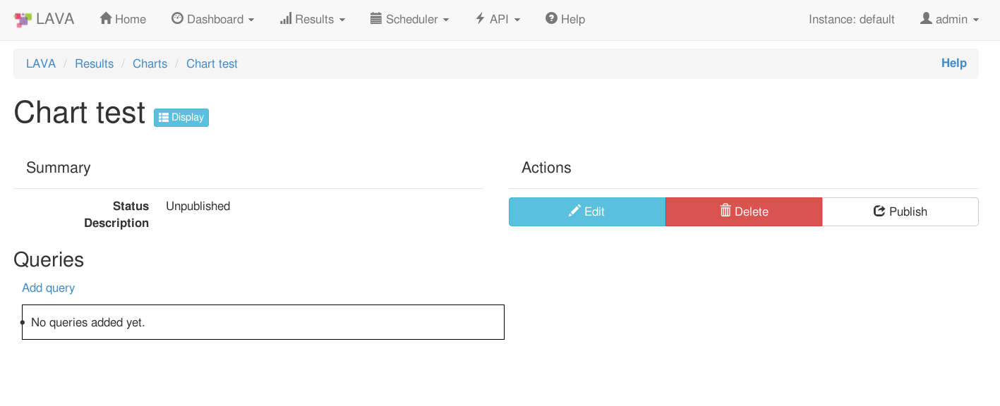

点击'Add query'得到如下表格，找到前面添加的query；
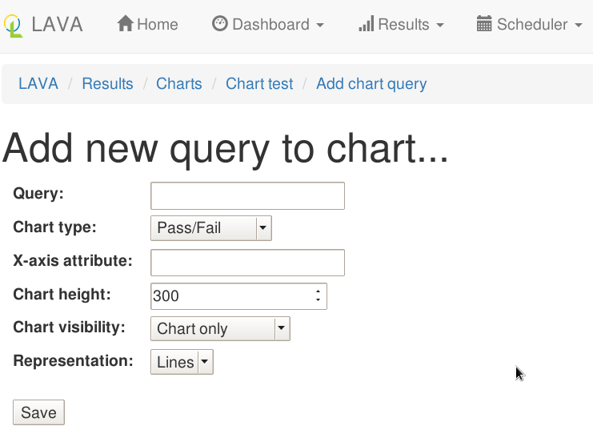

结果示例:
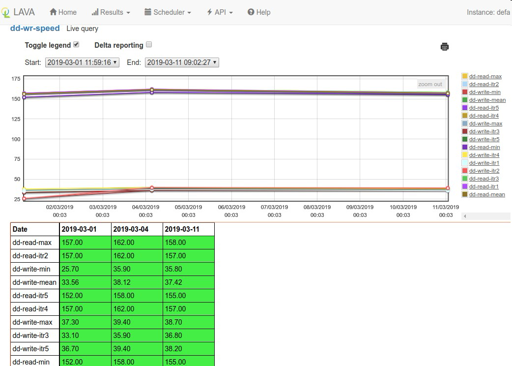

<http://172.16.12.246/static/docs/v2/lava-queries-charts.html>

# 七 常见问题及DEBUG

<http://172.16.12.246/static/docs/v2/lava-scheduler-job.html>
