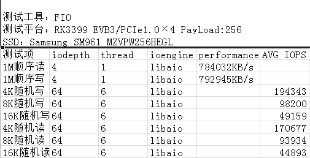
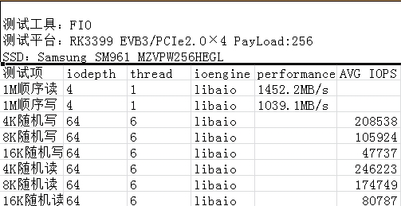

# **PCIe 开发指南**

文件标识：RK-KF-YF-175

发布版本：V1.0.1

日期：2021-04-28

文件密级：□绝密   □秘密   □内部资料   ■公开

**免责声明**

本文档按“现状”提供，瑞芯微电子股份有限公司（“本公司”，下同）不对本文档的任何陈述、信息和内容的准确性、可靠性、完整性、适销性、特定目的性和非侵权性提供任何明示或暗示的声明或保证。本文档仅作为使用指导的参考。

由于产品版本升级或其他原因，本文档将可能在未经任何通知的情况下，不定期进行更新或修改。

**商标声明**

“Rockchip”、“瑞芯微”、“瑞芯”均为本公司的注册商标，归本公司所有。

本文档可能提及的其他所有注册商标或商标，由其各自拥有者所有。

**版权所有 © 2021 瑞芯微电子股份有限公司**

超越合理使用范畴，非经本公司书面许可，任何单位和个人不得擅自摘抄、复制本文档内容的部分或全部，并不得以任何形式传播。

瑞芯微电子股份有限公司

Rockchip Electronics Co., Ltd.

地址：     福建省福州市铜盘路软件园A区18号

网址：     [www.rock-chips.com](http://www.rock-chips.com)

客户服务电话： +86-4007-700-590

客户服务传真： +86-591-83951833

客户服务邮箱： [fae@rock-chips.com](mailto:fae@rock-chips.com)

---

**前言**

**概述**

**产品版本**

| **芯片名称** | **内核版本** |
| ------------ | ------------ |
| RK3399       | 4.4          |

**读者对象**

本文档（本指南）主要适用于以下工程师：

技术支持工程师

软件开发工程师

**修订记录**

| **版本号** | **作者** | **修改日期** | **修改说明**                     |
| ---------- | -------- | ------------ | -------------------------------- |
| V1.0.0     | 林涛     | 2017-11-25   | 初始版本                         |
| V1.0.1     | 黄莹     | 2021-04-28   | 修改格式，更改文件名为支持RK3399 |

---

**目录**

[TOC]

---

## DTS 配置

1. ```ep-gpios = <&gpio3 13 GPIO_ACTIVE_HIGH>;```

此项是设置 PCIe 接口的 PERST#复位信号；不论是插槽还是焊贴的设备，请在原理图上找到该引脚，并正确配置。

否则将无法完成链路建立。

2. ```num-lanes = <4>;```

此配置设置 PCIe 设备所使用的 lane 数量，默认不需要调整，软件可以自己探测并关闭不需要的 lane 以节省功耗。

3. ```max-link-speed = <1>;```

此配置设置 PCIe 的速度登记，1 表示 gen1，2 表示 gen2。RK3399 限制不超过 gen2。另，此配置默认是写在 dtsi，也就是说默认限制为 gen1；原因是 gen2 的 TX 测试指标无法达到标准，所以不推荐客户开启 gen2 模式，以免引起不必要的链路异常。

4. ```status = <okay>;```

此配置需要在 pcie0 和和 pcie_phy 节点同时使能。默认不使能的原因是如果没有外设，pcie 在初始化时有一个较大的检测延时，会额外增加不必要的开机时间。故，有需要 PCIe 的项目自行开启。

5. ```vpcie3v3-supply = <&vdd_pcie3v3>;```

此配置是可选项，用于配置 PCIe 外设的 3V3 供电。如果板级针对 PCIe 外设的 3V3 需要控制使能，则如范例所示定义一组对应的 regulator，regulator 的配置请参考 Documentation/devicetree/bindings/regulator/。

6. ```vpcie1v8-supply = <&vdd_pcie1v8>;```

请参考第五点。

7. ```vpcie0v9-supply = <&vdd_pcie1v8>;```

请参考第五点。

## menuconfig 配置

1. 需要确保如下配置打开，方可正确的使用 PCIe 相关功能

```
CONFIG_PCI=y
CONFIG_PCI_DOMAINS=y
CONFIG_PCI_DOMAINS_GENERIC=y
CONFIG_PCI_SYSCALL=y
CONFIG_PCI_BUS_ADDR_T_64BIT=y
CONFIG_PCI_MSI=y
CONFIG_PCI_MSI_IRQ_DOMAIN=y
CONFIG_PHY_ROCKCHIP_PCIE=y
CONFIG_PCIE_ROCKCHIP=y
CONFIG_PCIEPORTBUS=y
CONFIG_PCIEASPM=y
CONFIG_PCIEASPM_POWERSAVE=y
CONFIG_PCIE_PME=y
CONFIG_GENERIC_MSI_IRQ=y
CONFIG_GENERIC_MSI_IRQ_DOMAIN=y
CONFIG_IRQ_DOMAIN=y
CONFIG_IRQ_DOMAIN_HIERARCHY=y
```

2. 使能 NVMe 设备(建立在 PCIe 接口的 SSD)

```
CONFIG_BLK_DEV_NVME=y
```

3. 使能 AHCI 设备(PCIe 转接成 SATA 的 SSD)

```C
CONFIG_SATA_PMP=y
CONFIG_SATA_AHCI=y
CONFIG_SATA_AHCI_PLATFORM=y
CONFIG_ATA_SFF=y
CONFIG_ATA=y
```

特别说明，默认 4.4 开源内核仅支持 drivers/ata/ahci.c 中列表内的设备，超出部分请找原厂或者代理商支持。

4. 使能 PCIe 接口的 WIFI

请参考各 wifi 的 vendor 文档进行配置。

## cmdline 配置

详细的说明请参考内核中的文档 Documentation/kernel-parameters.txt，这里仅仅列几个重要的进行说明。

1. nomsi

如果希望使用 Legacy 中断模式，请在 parameter 添加 pci=nomsi 即可

2. pcie_bus_safe

如果希望将所有 PCIe 层级中的设备的最大数据负载(MPS)调整到最大，请配置 pci=pcie_bus_safe，可以提高

带宽。

3. pcie_aspm

如果希望关闭 PCIe 链路的动态功耗管理，进行测试，请配置 pcie_aspm=off, 否则默认按照硬件协商自动配置。

## 常见应用问题

Q1： 客户走线的时候不好走，问不同 lane 之间能否交织？

A1： 可以交织，RC 的 lane[1-4]与 EP/switch 的 lane[1-4]随意对应。软件不需要改动。

Q2： 同一个 lane 的差分信号能否交织？比如 RC 的 lane1 的 RX+ 与 EP/Switch 的 RX-对应，TX+与 EP/Switch 的 TX-对应。或者 RX 正负对应，TX 正负对应等等情况，怎么处理？

A2： 可以任意接，软件上不需要再额外处理。PCIe 的探测状态机已经考虑了这些所有情况。

Q3: RK3399 只有一个 RC，但是有四个 lane, 能不能支持把这四个 lane 拆分，比如拆分成四个 1-1-1-1 或者拆分成两个 2-2 或者其他组合

A3: RK3399 不支持此类需求。如果客户希望接多个设备，请选用 PCIe switch，目前我们调试过 Pericom 的 switch，应该是最便宜的一款。

Q4： RK3399 支持 SSD 吗？

A4： 需要大家注意的是，SSD 有两种，一种是 NVMe, 物理信号层走的是 PCIe 总线。另外一种是 mSATA，走 SATA 总线。第二种如果需要支持请客户购买 PCIe 转 SATA 或者 USB 转 SATA。

Q5： 既然支持 NVMe，支持最大容量多少，能不能作为启动盘？

A5： 存储设备的容量大小与文件系统有关，驱动层面没有任何限制。另外，NVMe 在 RK3399 支持从 Uboot 开始启动，也就是意味需要额外加一个 spi-nor 用来保存 miniloader, 因为 maskrom 没有 NVMe 和 PCIe 驱动。

Q6： RK3399 的 PCIe 接入 NVMe 的情况下，带宽如何？怎么测试

A6： 测试采用 fio 程序进行，命令如下（客户需要有自己编译的 fio，并且静态打包了 libaio）

./fio -filename=/dev/block/nvme0n1 -direct=1 -iodepth 4 -thread=1 -rw=write -ioengine=libaio -bs=1M -size=200G -numjobs=30 -runtime=60 -group_reporting -name=my

测试数据大致如下





Q7： RK3399 支不支持独立显卡？

A7： 理论上支持，只要能提供 ARM 版本的驱动。实际支持不了。原因是我们可用于 BAR 的物理总线地址只有 32M，一般独立显卡都超过这个内存的要求。即使转接经过 switch，也没有意义，因为 switch 本身有内存要求，转接之后，对 RC 的 PCIe 总线地址范围要求反而更大。

Q8： PCIe 设备需要的电源使用情况

A8： 一般来说提供四类电源，0.9V，3V3, 3V3_AUX, 12V。其中 0.9V 基本是给 PCIe wifi 设备使用。绝大部分设备都需要 3V3 这路。3V3_AUX 是辅助电源，要求在 suspend 情况下不断电，使得设备继续工作，比如 wifi 需要唤醒主控，这路 AUX 电源就需要常开。 12V 是一些大功率设备使用，比如 switch, 显卡等。实际情况按照 EP/switch 厂家要求进行配置。

Q9： PCIe 设备在 RK3399 上如果动态开关 ASPM 的支持？

A9： 目前有如下几种方法

方法一是在内核的 cmdline 加上 pcie_aspm=off

方法二是在控制台中配置 link_state 节点，但需注意前提 config 中配置了 CONFIG_PCIEASPM_DEBUG=y

\# cat /sys/bus/pci/devices/[0000](tel:0000)\:00\:00.0/power/link_state

7

\# echo 0 > /sys/bus/pci/devices/[0000](tel:0000)\:00\:00.0/power/link_state

方法三是关闭 config 选项中的 CONFIG_PCIEASPM

方法四是使用 setpci 命令：例如 setpci -s 0:0 0xd0.w=0xC00，此方法需要先了解对应设备的 BDF 信息

方法五在控制台输入 echo performance > /sys/module/pcie_aspm/parameters/policy

Q10： 如何在 RK399 上查看 PCIe 设备的相关信息

A10： 请将 lspci 推送进机器，并且添加可执行权限后，执行 lspci 命令的相关信息

常见的操作是 lspci -vvv 和 lspci -t， 分别用于输出设备的属性和各类运行状态，以及输出 PCIe 拓扑的

树形结构。剩余的参数请执行 lspci --help 后阅读帮助文档

Q11： 如何在用户态修改 PCIe 设备的某些寄存器信息

A11： 可以使用 setpci 工具进行修改，修改的前提你需要使用 lspci 获得所需修改设备的 BDF，以及

需要了解协议中对应的寄存器偏移。命令请使用 setpci --help 查看对应帮助文档，此工具属于较为高级的工具，一般不建议客户使用，除非客户足够了解 PCIe 协议。

## 异常排查

1. trainning 失败

```
rockchip-pcie f8000000.pcie: PCIe link training gen1 timeout!
rockchip-pcie: probe of f8000000.pcie failed with error -1
```

异常原因：trainning 失败，外设没有处于工作状态。首先检测下 ep-gpios 这个是否配置对了。
其次，检测下外设的供电是否有，是否足够。3.3V 理论上够，但是我们经常发现有写设备需要
调整到 3.8 甚至 4V 才能工作。最后，即使电压够，也需要排除功率是否够(外接电源进行测试)。

2. config 配置死机

```
[ 0.459371] pci 0000:00:00.0: bridge configuration invalid ([bus 00-00]), reconfiguring
[ 0.459585] pci 0000:01:00.0: reg 0x10: initial BAR value 0x00000000 invalid
[ 0.460043] pci 0000:01:00.1: reg 0x10: initial BAR value 0x00000000 invalid
[ 0.460503] pci 0000:01:00.2: reg 0x10: initial BAR value 0x00000000 invalid
[ 0.460535] pci 0000:01:00.2: reg 0x14: initial BAR value 0x00000000 invalid
[ 0.460904] Bad mode in Error handler detected, code 0xbf000002 -- SError
[ 0.460919] Internal error: Oops - bad mode: 0 [#1] PREEMPT SMP
[ 0.466658] Modules linked in:
[ 0.466938] CPU: 5 PID: 1 Comm: swapper/0 Not tainted 4.4.55 #41
[ 0.467464] Hardware name: Rockchip RK3399 Excavator Board edp (Android) (DT)
[ 0.468089] task: ffffffc0f2160000 ti: ffffffc0f2168000 task.ti: ffffffc0f2168000
[ 0.468752] PC is at rockchip_pcie_rd_conf+0xb8/0x138
[ 0.469200] LR is at pci_bus_read_config_dword+0x78/0xbc
```

这种情况设备工作了，完成了枚举，但是通信过程中挂死。绝大部分情况是电源电压不够或者功率不足导致。

3. RK3399 的 pcie phy 的 pll 无法完成 lock

```
[ 0.440803] rockchip-pcie f8000000.pcie: no vpcie3v3 regulator found
[ 0.440831] rockchip-pcie f8000000.pcie: no vpcie1v8 regulator found
[ 0.440854] rockchip-pcie f8000000.pcie: no vpcie0v9 regulator found
[ 1.443759] pll lock timeout!
[ 1.443826] phy phy-phy@e220.5: phy poweron failed --> -22
[ 1.443847] rockchip-pcie f8000000.pcie: fail to power on phy, err -22
[ 1.443968] rockchip-pcie: probe of f8000000.pcie failed with error -22
```

测量 PCIE_AVDD_0V9 PCIE_AVDD_1V8 电压正常的，供电是否够？这路需要 LDO 供电。

4. RK3399 pcie 与 usb3.0 同时使用出错。

以下是 NVMe 使用过程中插入 USB 设备，系统异常的 log

```
[ 2.801962] Unhandled fault: synchronous external abort (0x96000210) at 0xffffff800936401c
[ 2.801997] Internal error: : 96000210 [#1] PREEMPT SMP
[ 2.803157] Modules linked in:
[ 2.803437] CPU: 2 PID: 146 Comm: nvme Not tainted 4.4.16 #146
[ 2.803949] Hardware name: rockchip,rk3399-firefly-mini (DT)
[ 2.804445] task: ffffffc07187d400 ti: ffffffc071910000 task.ti: ffffffc071910000
[ 2.805108] PC is at nvme_kthread+0x84/0x1f8
[ 2.805484] LR is at nvme_kthread+0x60/0x1f8
```

结论就是 PCIE_AVDD_0V9 供电不够或者不稳，加电容或者加大电压试下。

