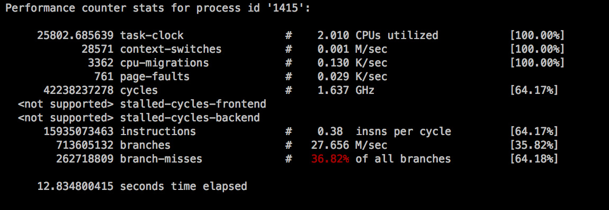
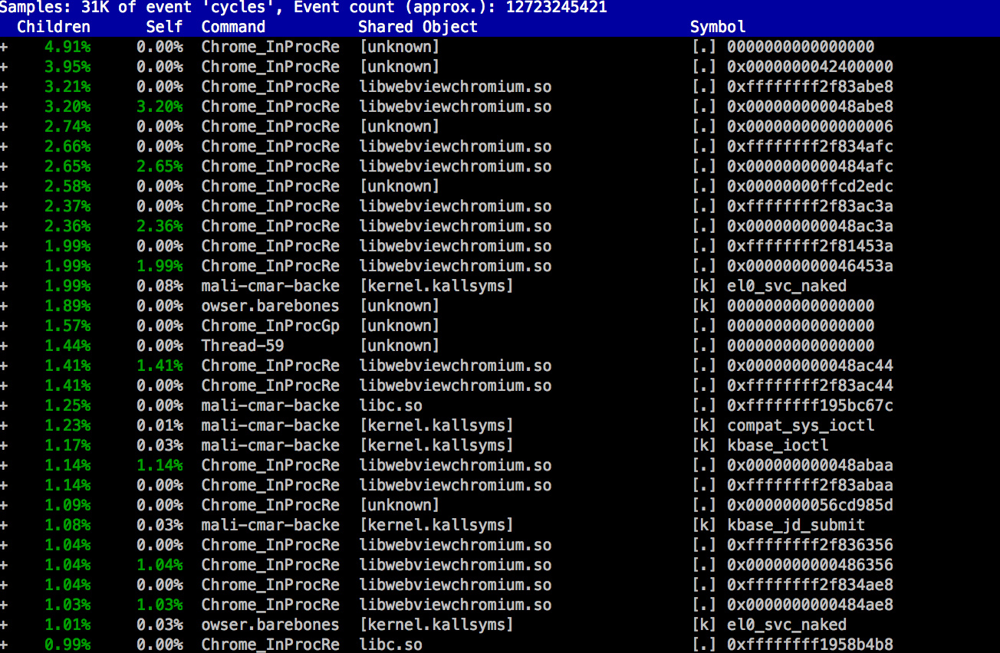

# Perf 使用说明

文件标识：RK-SM-YF-149

发布版本：V1.0.1

日期：2021-03-02

文件密级：□绝密   □秘密   □内部资料   ■公开

**免责声明**

本文档按“现状”提供，瑞芯微电子股份有限公司（“本公司”，下同）不对本文档的任何陈述、信息和内容的准确性、可靠性、完整性、适销性、特定目的性和非侵权性提供任何明示或暗示的声明或保证。本文档仅作为使用指导的参考。

由于产品版本升级或其他原因，本文档将可能在未经任何通知的情况下，不定期进行更新或修改。

**商标声明**

“Rockchip”、“瑞芯微”、“瑞芯”均为本公司的注册商标，归本公司所有。

本文档可能提及的其他所有注册商标或商标，由其各自拥有者所有。

**版权所有 © 2021 瑞芯微电子股份有限公司**

超越合理使用范畴，非经本公司书面许可，任何单位和个人不得擅自摘抄、复制本文档内容的部分或全部，并不得以任何形式传播。

瑞芯微电子股份有限公司

Rockchip Electronics Co., Ltd.

地址：     福建省福州市铜盘路软件园A区18号

网址：     [www.rock-chips.com](http://www.rock-chips.com)

客户服务电话： +86-4007-700-590

客户服务传真： +86-591-83951833

客户服务邮箱： [fae@rock-chips.com](mailto:fae@rock-chips.com)

---

**前言**

**概述**

**产品版本**

| **芯片名称** | **内核版本** |
| ------------ | ------------ |
| 全系列       | 通用         |

**读者对象**

本文档（本指南）主要适用于以下工程师：

技术支持工程师

软件开发工程师

**修订记录**

| **版本号** | **作者** | **修改日期** | **修改说明** |
| ---------- | -------- | :----------- | ------------ |
| V1.0.0     | 陈谋春   | 2017-12-25   | 初始版本     |
| V1.0.1     | 黄莹     | 2021-03-02   | 修改格式     |

---

**目录**

[TOC]

---

## 介绍

   Perf 是从 Linux 2.6 开始引入的一个 profiling 工具，通过访问包括 pmu 在内的软硬件性能计数器来分析性能，支持多架构，是目前 Kernel 的主要性能检测手段，和 Kernel 代码一起发布，所以兼容性良好。

## 功能

   性能瓶颈如果要分类的话，大致可以分为几个大类：cpu／gpu／mem／storage，其中 gpu 用 Perf 没法探测（这个目前比较好用的工具就只有 DS5），storage 只能用 tracepoint 来统计。总的说来，Perf 还是侧重于分析 cpu 的性能，其他功能都不是很好用。

```shell
$ perf

 usage: perf [--version] [--help] COMMAND [ARGS]

 The most commonly used perf commands are:
  annotate        Read perf.data (created by perf record) and display annotated code
  archive         Create archive with object files with build-ids found in perf.data file
  bench           General framework for benchmark suites
  buildid-cache   Manage <tt>build-id</tt> cache.
  buildid-list    List the buildids in a perf.data file
  diff            Read two perf.data files and display the differential profile
  inject          Filter to augment the events stream with additional information
  kmem            Tool to trace/measure kernel memory(slab) properties
  kvm             Tool to trace/measure kvm guest os
  list            List all symbolic event types
  lock            Analyze lock events
  probe           Define new dynamic tracepoints
  record          Run a command and record its profile into perf.data
  report          Read perf.data (created by perf record) and display the profile
  sched           Tool to trace/measure scheduler properties (latencies)
  script          Read perf.data (created by perf record) and display trace output
  stat            Run a command and gather performance counter statistics
  test            Runs sanity tests.
  timechart       Tool to visualize total system behavior during a workload
  top             System profiling tool.

 See 'perf help COMMAND' for more information on a specific command.
```

   其中比较常用的功能有几个：

* record：收集 profile 数据
* report：根据 profile 数据生成统计报告
* stat：打印性能计数统计值
* top：cpu 占有率实时统计

## 在 Android 平台使用

### 准备工作

1. 首先按 Google 或芯片厂商的指导，构建一个完整的 Android 和 Kernel 的编译环境（如果不关心 Kernel 可以忽略）, 这样分析的时候符号表才能匹配上。

2. 编译 Perf

```shell
~$ . build/envsetup.sh
~$ lunch
~$ mmm external/linux-tools-perf
~$ adb root
~$ adb remount
~$ adb push perf /system/bin/
~$ adb shell sync

```

3. 准备符号文件

   符号文件可以简单分为三类：

   a. 平台 native 代码，这部分代码在编译的过程中会自动生成符号表，不需要我们干预

   b. 平台 java 代码，对于 art 虚拟机来说（老版本的 dalvik 就不说了）最终的编译结果是 oat 文件，这也是正规的 elf 文件，但是默认是不带 debug 信息。而新版本的 Android 也提供了自动生成 java 符号表的工具：

  ```shell
bash art/tools/symbolize.sh
  ```

   c. 第三方 apk，如果是来自开源社区，则可以通过修改 makefile 和套用 Android 提供的 java 符号表工具来生成符号表文件，然后拷贝到 Android 的符号表目录，==注意路径必须要和设备上的完全一致==，可以通过 showmap 来获取设备上的路径。

  ```shell
~$ adb shell showmap apk_pid
38540    36296    36296        0        0    36216       80        0    3 /data/app/com.android.webview-2/lib/arm/libwebviewchromium.so
~$ cp libwebviewchromium.so $ANDROID_PRODUCT_OUT/symbols/data/app/com.android.webview-2/lib/arm/libwebviewchromium.so
  ```

  如果是商业的 apk，基本上已经做过混淆和 strip，除非开发商能配合，不然就没招。

4. 稍微新一点的 Android 都开起了 Kernel 的指针保护，这也会影响 Perf 的 record，所以需要临时关闭保护：

  ```shell
  ~$ adb shell echo 0 > /proc/sys/kernel/kptr_restrict
  ```

5. 为了方便分析，一般会把 record 的数据 pull 到 host 端，在 host 端做分析，所以需要在设备端也安装一下 Perf 工具，ubuntu 下安装命令如下：

```shell
~$ sudo apt-get install linux-tools-common
```

6. 目前大部分的 Android 平台默认 Perf 功能都是打开的，所以一般不需要重新配置 Kernel，如果碰到 Perf 被关闭的情况，可以打开下面几个配置

```shell
CONFIG_PERF_EVENTS=y
CONFIG_HW_PERF_EVENTS=y
```

### 获取当前平台支持的事件

```shell
rk3399:/data/local # ./perf list
List of pre-defined events (to be used in -e):
  cpu-cycles OR cycles                               [Hardware event]
  instructions                                       [Hardware event]
  cache-references                                   [Hardware event]
  cache-misses                                       [Hardware event]
  branch-instructions OR branches                    [Hardware event]
  branch-misses                                      [Hardware event]
  bus-cycles                                         [Hardware event]

  cpu-clock                                          [Software event]
  task-clock                                         [Software event]
  page-faults OR faults                              [Software event]
  context-switches OR cs                             [Software event]
  cpu-migrations OR migrations                       [Software event]
  minor-faults                                       [Software event]
  major-faults                                       [Software event]
  alignment-faults                                   [Software event]
  emulation-faults                                   [Software event]
  dummy                                              [Software event]

  L1-dcache-loads                                    [Hardware cache event]
  L1-dcache-load-misses                              [Hardware cache event]
  L1-dcache-stores                                   [Hardware cache event]
  L1-dcache-store-misses                             [Hardware cache event]
  L1-dcache-prefetch-misses                          [Hardware cache event]
  L1-icache-loads                                    [Hardware cache event]
  L1-icache-load-misses                              [Hardware cache event]
  dTLB-load-misses                                   [Hardware cache event]
  dTLB-store-misses                                  [Hardware cache event]
  iTLB-load-misses                                   [Hardware cache event]
  branch-loads                                       [Hardware cache event]
  branch-load-misses                                 [Hardware cache event]
```

实际上 Android 移植的 Perf 还不完整，tracepoint 的事件还不支持，例如：block 事件，所以如果想要抓去一些内核子系统的性能信息就无法满足。Android 7.0 开始已经去掉了 Perf 工具，替代它的是 Simpleperf[^1]工具，对 tracepoint 的支持比原来的好很多。

[^1]: 后面也会简单介绍一些Simpleperf

### 获取系统热点进程

Perf 中的 top 工具可以列出当前 cpu 的热点，还可以附加 Kernel 的符号表让信息可方便分析。命令如下：

```shell
$ adb shell mkdir -p /data/local/symbols
$ adb push vmlinux /data/local/symbols/vmlinux
$ adb shell
# perf top --vmlinux=/path/to/vmlinux -d 2
```

结果输出如下：

</img>

perf top 还可以只抓取指定进程的 pid，这一般是用在要优化某个程序是非常有用，命令如下：

```shell
perf top --vmlinux=/path/to/vmlinux -d 2 -p pid_of_prog
```

perf top 还和系统的 top 一样可以指定刷新间隔[^2], 以上命令中的-d 选项就是这个功能，单位是秒。

[^2]: 这个是指top统计信息的刷新间隔而不是采样间隔

### 获取进程的统计信息

perf stat 用于获取进程某个时间段内的 pmu 统计信息，命令如下：

```shell
# ./perf stat -p 1415
```

ctrl+c 退出，或发信号让 Perf 进程退出都可以看到统计结果，例如：

</img>

一些明显的异常值会被标注为红色，例如上图是浏览器跑 fishtank 时候抓的统计信息，可以看到分支预测的失败率非常高，结合 Perf 的热点分析工具可以进一步缩小范围找到分支预测失败的原因。

### 收集进程的 profile 数据

perf record 用于记录详细的 profile 数据，可以指定记录某个进程，还可以记录调用栈，命令如下：

```shell
# perf record -g -p pid -o /data/local/perf.data
```

也可以指定只抓取某个事件，事件列表可以通过上面的 perf list 得到，例如：

```shell
# ./perf record -e cache-misses -p 1415
```

### 分析 profile 数据

perf report 用户分析抓到的 profile 数据，一般会先把数据发到 pc 上再分析，命令如下：

```shell
adb pull /data/local/perf.data
perf report --objdump=aarch64-linux-android-objdump --vmlinux=/path/to/vmlinux --symfs ANDROID_PRODUCT_OUT/symbols -i perf.data
```

结果如图：

</img>

 上图有‘+’的地方可以用‘enter’键来遍历其调用关系。

### FlameGraph

还可以通过一些脚本来方便分析调用关系，Flame Graph 就是一个比较好用的可视化分析工具。

下载：

```shell
git clone https://github.com/brendangregg/FlameGraph.git
```

生成图形：

```shell
perf script --vmlinux=<kernel_folder>/vmlinux --symfs $ANDROID_PRODUCT_OUT/symbols -i perf.data | FlameGraph/stackcollapse-perf.pl | FlameGraph/flamegraph.pl > flamegraph.html
```

## 在 Linux 平台使用

arm 版本的 linux 发行版很多都没有提供 Perf 的包，所以需要自己手动编译一个 Perf，由于 Perf 依赖的 elfutils/binutils/zlib，所以实际上需要交叉编译四个东西。

首先编译 zlib，[源码地址](http://zlib.net/zlib-1.2.11.tar.gz "zlib")

```shell
CC=aarch64-linux-gnu-gcc ./configure --prefix=/home/cmc/workspace/linaro/toolchain/armlinux/aarch64/gcc-linaro-6.3.1-2017.02-x86_64_aarch64-linux-gnu/aarch64-linux-gnu/libc/usr
make && make install
```

==Note: prefix 要指向你的交叉编译工具的库目录==

编译 elfutils，我直接用的最新的版本的：

```shell
git clone git://sourceware.org/git/elfutils.git
```

配置：

```shell
cd /path/to/elfutils
mkdir build
./configure --enable-maintainer-mode --host=aarch64-linux-gnu --prefix=/home/cmc/workspace/linaro/elfutils/build
```

修改 Makefile： 删除 elfutils 根目录下 Makefile 里面的 libcpu

修改 backends/Makefile： 删除 backends/Makefile 中的 libebl_i386 和 libebl_x86_64 有关的所有东西

编译：

```shell
make && make install
```

编译 binutils，这个要考虑和 gcc 版本的兼容，我用的 2.28.1 的版本，[源代码地址](http://ftp.gnu.org/gnu/binutils/binutils-2.28.1.tar.bz2 "binutils")

```shell
cd /path/to/binutils
mkdir build
../configure --target=aarch64-linux-gnu --host=aarch64-linux-gnu --prefix=/home/cmc/workspace/linaro/binutils-2.28.1/build
make && make install
```

编译 Perf，Perf 是 Kernel 一起发布的，所以直接下载一个 Kernel 就有了，但是交叉编译的话，需要改一些东西：

修改 Makefile.perf，在前面加入：

```shell
EXTRA_CFLAGS=-I/path/to/elfutils/build/inclue -L/path/to/elfutils/build/lib -I/path/to/binutils/build/include -L/path/to/binutils/build/lib
WERROR=0
NO_LIBPERL=1
NO_LIBPYTHON=1
```

编译

```shell
cd /path/to/kernel/tools/perf
make -f Makefile.perf perf ARCH=arm64 CROSS_COMPILE=/home/cmc/workspace/linaro/toolchain/armlinux/aarch64/gcc-linaro-6.3.1-2017.02-x86_64_aarch64-linux-gnu/bin/aarch64-linux-gnu- -j8
```

理论上在 arm 的 linux 发行版上直接编译 Perf 应该也是可以的，但是我没有试过。用法的话和 Android 是一样的，这里就不叙说了。

## Simpleperf 使用

Android 7.0 开始提供了一个更完整的 Perf 版本 Simpleperf：

```shell
source build/envsetup.sh
lunch
mmma system/extras/simpleperf
```

Simpleperf 相对之前 google 移植的 Perf 有以下改进

* 支持剖析 apk 中兼容的共享库，从 .gnu_debugdata 段读取符号表和调试信息
* 提供更方便分析的脚本
* 纯静态，所以和 Android 版本无关，只要指令集兼容都能跑

ndk r13 开始就提供了 Simpleperf 工具，所以也可以直接下载编译好的工具：

```shell
git clone https://aosp.tuna.tsinghua.edu.cn/platform/prebuilts/simpleperf
```

用法上和 Perf 是类似的，命令基本通用，可以直接参考上面 Perf 的命令。

Simpleperf 更多信息， 特别是调试 java 程序的方法，请参考[官方手册](https://android.googlesource.com/platform/system/extras/+/master/simpleperf/doc/README.md "simpleperf")