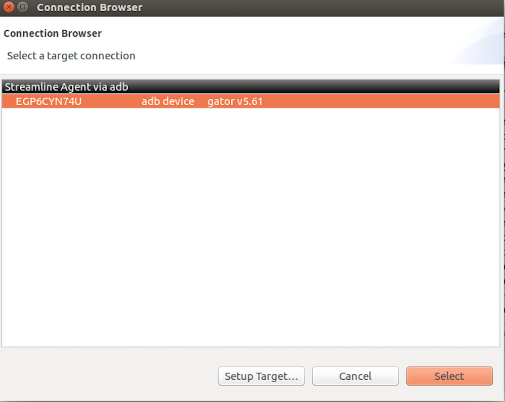
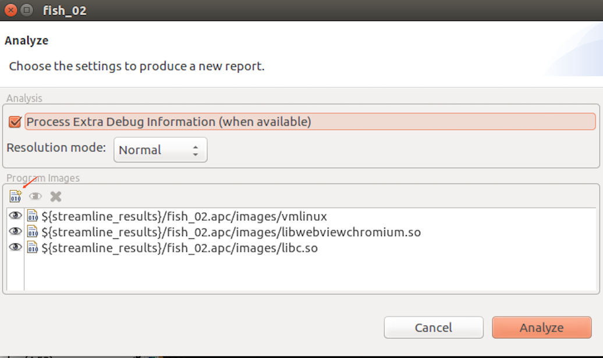
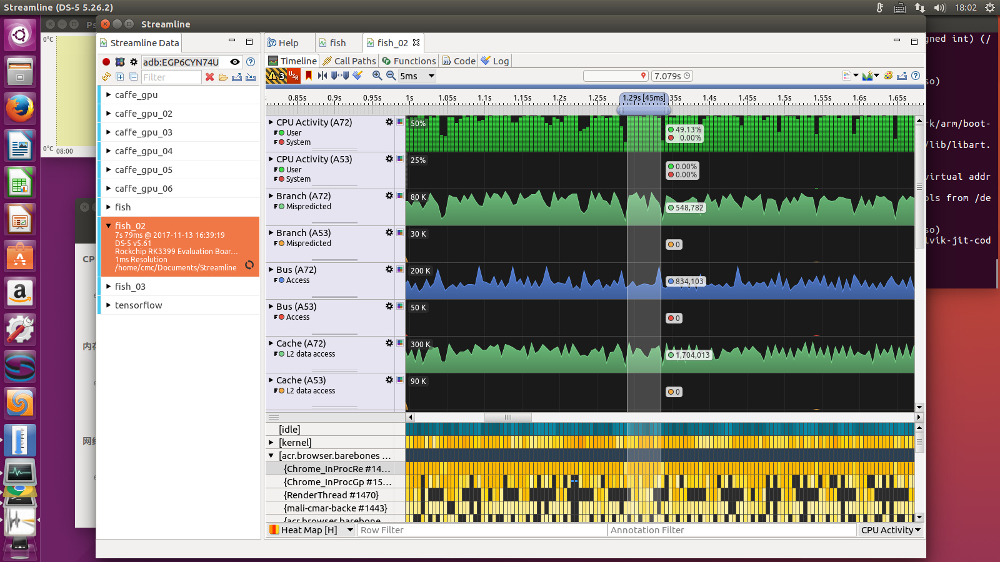
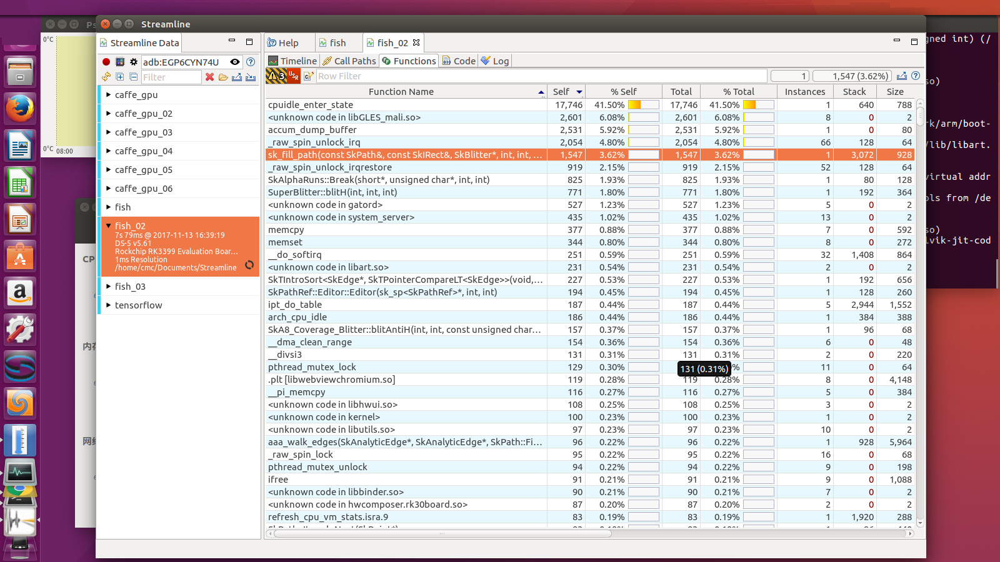

# Streamline 使用说明

发布版本：1.0

作者邮箱：cmc@rock-chips.com

日期：2017.12

文件密级：公开资料

***

**前言**

**概述**

**产品版本**

| **芯片名称** | **内核版本** |
| -------- | -------- |
| 全系列      | 4.4      |

**读者对象**

本文档（本指南）主要适用于以下工程师：

技术支持工程师

软件开发工程师

**修订记录**

| **日期**     | **版本** | **作者** | **修改说明** |
| ---------- | ------ | ------ | -------- |
| 2017-12-25 | V1.0   | 陈谋春    |          |

***

[TOC]

***

## 1. 介绍

   Streamline 是 DS5 提供的一个性能分析工具，通过抓取 cpu 和 gpu 的内部硬件计数器和 Kernel 的一些软件 tracepoint 来实现性能分析，功能比较强大。

## 2. 抓取数据

- 准备工具

  1. 首先需要下载 ds5，一些新的 cpu 和 gpu 可能需要较新的 DS5 才能支持，我目前用的是 5.26 版本。DS5 是需要 license 的，不过可以先申请一个 30 天的全功能试用 license，下载安装和申请 license 的流程就不在这里介绍了。
  2. 设备端需要和 host 建立连接，目前支持两种连接方式：adb 和网络
  3. 需要设备端的 root 权限，不然没法在设备端运行 gatord
  4. 需要和固件匹配的符号表，方便后续的分析

- gatord

  设备端需要运行一个守护进程来和 host 端做交互，早期版本的 mali 驱动或 ds5 版本还需要重新编译 Kernel 的 gpu 驱动来启用 gatord，不过目前新版本的 ds5 已经没有这个问题了。

  ```shell
  $ adb push /path/to/ds5/sw/streamline/bin/$ARCH/gatord /data/local/
  # cd /data/local/
  # ./gatord &
  ```

- 建立连接

  gatord 跑起来之后就可以在 host 端打开 Streamline，在左上角点击</img>按钮，会弹出如下对话框：

  </img>

  选中你要调试的设备，点“select”即可。

- 配置计数器

  Streamline 支持的计数器和设备相关，在连接完成后，可以点击</img>按钮，会弹出对话框，列出所有支持的计数器：

  </img>

  左边是可选的计数器，右边是已选的计数器，在可选计数器上双击即可移动到已选计数器，完成后点“save”按钮即可，全部重选可以点击“load defaults"先恢复默认设置。

- 抓取数据

  计数器选好以后，可以点击</img>开启抓取，结束时点击</img>按钮，这时候会自动跳转到分析界面。

## 3. 分析结果

Streamline 相对于传统的 profile 工具的优势在于：丰富的硬件计数器支持，可以很方便的看到 cache，bus 和 gpu 内部状态。

- 加载符号表

  右键单击左侧的我们抓取到的数据名称，在弹出的菜单中点击”analyze"，会弹出如下对话框：

  </img>

  点击红色箭头指向的按钮就可以添加带符号信息的 elf 文件了。不用全部添加，根据热点添加即可。

- Heat Map

  这个视图可以很方便的找到热点线程，点击左下角的</img>

  点击▶️可以展开各个进程，点击每个线程的名字，可以只显示这个线程的统计值，例如线程的 cpu 占有率，线程的 miss rate 等。

  时间轴上有个滑块，可以拉伸和移动，以显示某个时间段内的统计数据，类似下图：

  </img>

- Core Map

  这个视图可以看到每个线程各个时刻都在那个 core 上跑，对于看调度问题比较方便，比如不合理的 cpu 迁移。

- Cluster Map

  这个视图可以看到每个线程在当前跑在哪个 cluster，可以分析是否有不合理的大小核迁移导致性能下降。

- Samples

  这个视图可以分析每个时间片内函数的 cpu 占比，时间片可以通过上面时间轴上的滑块控制，对于分析热点函数比较有用。

- Processes

  这个视图可以分析热点进程的 cpu 占比。

- Functions

  点击上部的”functions"选项卡，可以看到整个抓取周期内的函数热点统计，如下图所示：

  </img>

- Call Paths

  如果想看函数的调用关系，可以切换到“call paths”选项卡

