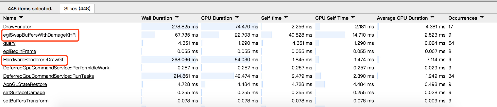
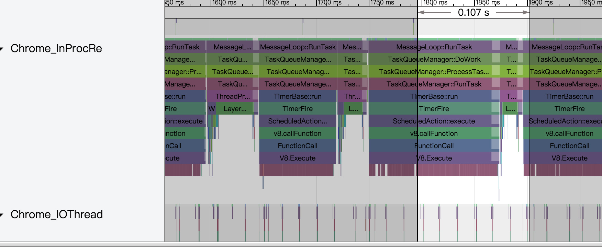
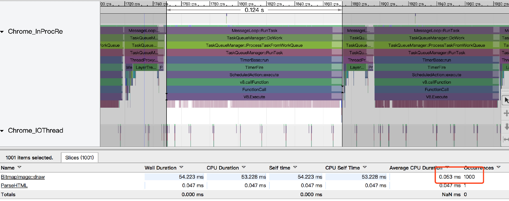
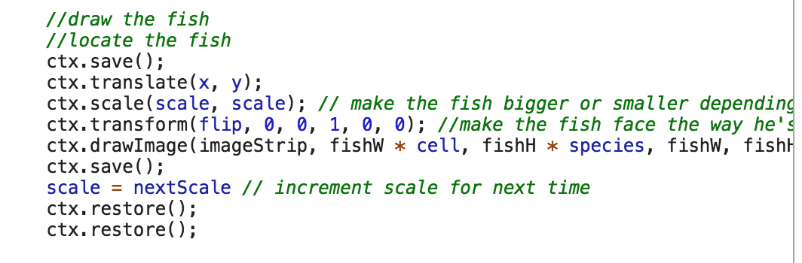

# **Systrace使用说明**

发布版本：1.0

作者邮箱：cmc@rock-chips.com

日期：2017.12

文件密级：公开资料

---

**前言**

**概述**

**产品版本**

| **芯片名称** | **内核版本** |
| -------- | -------- |
| 全系列      | 4.4      |

**读者对象**

本文档（本指南）主要适用于以下工程师：

技术支持工程师

软件开发工程师


**修订记录**

| **日期**     | **版本** | **作者** | **修改说明** |
| ---------- | ------ | ------ | -------- |
| 2017-12-25 | V1.0   | 陈谋春    |          |

---

[TOC]

---

### 1. 介绍

​    Systrace是目前Android上最主要的性能调试手段，有以下优点：

- 完全免费，安装和使用都比较简便
- 由于不需要在设备端运行监控程序，所以不需要root权限[^1]
- 界面友好

​    同时也有一些缺点：

- 基于tracepoint，所以只会收集你加过trace的函数信息，Android在大部分模块的重要函数里都加了trace了，所以大部分情况下还是够用，同时Android也提供了几个函数方便添加自己的trace。
- 看不到pmu计数器的信息，也看不到gpu和memory的信息（理论上内核驱动如果定时收集这些信息并加到trace里，systrace应该也能看到）

### 2. 用法

​    为了更方便介绍Systrace，我这里举一个实际的性能分析例子：fishtank在1000只鱼的情况下帧率很低

#### 准备工作

​    获取systrace有三种方式：

1. 下载[Android_Sdk_Tool](https://dl.google.com/Android/repository/sdk-tools-linux-3859397.zip "sdk-tools-linux")

   路径：/path_to_sdk/platform-tools/systrace

2. 下载[Android Studio](https://dl.google.com/dl/android/studio/ide-zips/3.0.0.18/android-studio-ide-171.4408382-linux.zip "android_studio_ide_linux")

   提供了图形化抓取功能，实际上也是嗲用sdk里的systrace

3. 直接用Android源码里的

   路径：/path_to_android/external/chromium-trace

#### 抓取数据

​    Systrace的命令格式：

```shell
$ cd external/chromium-trace/
$ python ./systrace.py -h
Usage: systrace.py [options] [category1 [category2 ...]]

Example: systrace.py -b 32768 -t 15 gfx input view sched freq

Options:
  -h, --help            show this help message and exit
  -o FILE               write trace output to FILE
  -t N, --time=N        trace for N seconds
  -l, --list-categories
                        list the available categories and exit
  -j, --json            write a JSON file
  --link-assets         (deprecated)
  --from-file=FROM_FILE
                        read the trace from a file (compressed) rather
                        thanrunning a live trace
  --asset-dir=ASSET_DIR
                        (deprecated)
  -e DEVICE_SERIAL_NUMBER, --serial=DEVICE_SERIAL_NUMBER
                        adb device serial number
  --target=TARGET       chose tracing target (android or linux)
  --timeout=TIMEOUT     timeout for start and stop tracing (seconds)
  --collection-timeout=COLLECTION_TIMEOUT
                        timeout for data collection (seconds)

  Atrace and Ftrace options:
    -b N, --buf-size=N  use a trace buffer size  of N KB
    --no-fix-threads    don't fix missing or truncated thread names
    --no-fix-tgids      Do not run extra commands to restore missing thread to
                        thread group id mappings.
    --no-fix-circular   don't fix truncated circular traces

  Atrace options:
    --atrace-categories=ATRACE_CATEGORIES
                        Select atrace categories with a comma-delimited list,
                        e.g. --atrace-categories=cat1,cat2,cat3
    -k KFUNCS, --ktrace=KFUNCS
                        specify a comma-separated list of kernel functions to
                        trace
    -a APP_NAME, --app=APP_NAME
                        enable application-level tracing for comma-separated
                        list of app cmdlines
    --no-compress       Tell the device not to send the trace data in
                        compressed form.
    --boot              reboot the device with tracing during boot enabled.The
                        report is created by hitting Ctrl+C after the
                        devicehas booted up.

  Battor trace options:
    --battor-categories=BATTOR_CATEGORIES
                        Select battor categories with a comma-delimited list,
                        e.g. --battor-categories=cat1,cat2,cat3
    --hubs=HUB_TYPES    List of hub types to check for for BattOr mapping.
                        Used when updating mapping file.
    --serial-map=SERIAL_MAP
                        File containing pregenerated map of phone serial
                        numbers to BattOr serial numbers.
    --battor_path=BATTOR_PATH
                        specify a BattOr path to use
    --update-map        force update of phone-to-BattOr map
    --battor            Use the BattOr tracing agent.

  Ftrace options:
    --ftrace-categories=FTRACE_CATEGORIES
                        Select ftrace categories with a comma-delimited list,
                        e.g. --ftrace-categories=cat1,cat2,cat3
```

Systrace支持的atrace类别有：

```shell
$ adb root 
$ python ./systrace.py -l
         gfx - Graphics
       input - Input
        view - View System
     webview - WebView
          wm - Window Manager
          am - Activity Manager
          sm - Sync Manager
       audio - Audio
       video - Video
      camera - Camera
         hal - Hardware Modules
         app - Application
         res - Resource Loading
      dalvik - Dalvik VM
          rs - RenderScript
      bionic - Bionic C Library
       power - Power Management
          pm - Package Manager
          ss - System Server
    database - Database
     network - Network
       sched - CPU Scheduling
        freq - CPU Frequency
        idle - CPU Idle
        load - CPU Load
  memreclaim - Kernel Memory Reclaim
  binder_driver - Binder Kernel driver
  binder_lock - Binder global lock trace

NOTE: more categories may be available with adb root
```

Note: ==有些事件需要设备的root权限才能操作，所以最好先切到root权限==

除了支持Android在ftrace基础上扩展的atrace，Systrace也是支持kernel原生的ftrace的，还支持单独抓取某个kernel函数，当然前提是这个函数本身有tracepoint，具体可以参见上面的命令帮助信息。还可以直接用trace文件做输入，这种离线分析功能应该在分析Android引导过程的时候比较有用。

在抓取前要先大致确定这个场景涉及到哪些模块，再回到我们这次要分析的场景是：浏览器跑fishtank中开启1000只鱼的时候帧率很低；第一时间能想到的模块有：gfx webview sched freq load workq disk

先在设备上重现问题，然后在host端执行如下命令：

```shell
$ cd external/chromium-trace
$ python ./systrace.py -t 10 -o fishtank.html gfx webview sched freq load workq disk
```

这个fishtank.html即我们抓到的数据。为了方便和本文对照，我上传到[网盘](https://pan.baidu.com/s/1slJUibN "fishtank.html")了。

### 3. 分析

​    分析数据需要chrome浏览器，版本最好要新一些，太旧可能会有兼容问题，因为这个html并不符合w3c的标准。

​    用chrome打开以后，界面如下：

</img>

左列是抓取的线程名或trace名，既然是绘制问题，我们第一个要看肯定是绘制的线程，Android 5.0以前是在ui线程做绘制的，以后的版本都是在render线程做绘制，所以我们先拉到render线程，可以看到如下：

</img>

点击右边的有四个按键，分别对应四种模式如下：

</img>

先用”时间线“模式拉个1s左右的时间线，然后切到“选择”模式，选择这段时间线内render线程的区域，会自动在下方列出这个区域的函数统计：

</img>

可以看到帧率确实很低，这段时间的绘制只有9次（drawgl次数），平均耗时29ms，平均间隔是111ms，所以主要原因是绘制间隔太大。继续往下分析就要根据浏览器的渲染模型了，我们知道chromium里是由光栅化和canvas线程完成实际绘制的（内部叫paint），而ui线程或render线程来完成贴图（内部叫draw）。因为这个网页用的canvas，所以我们先用“时间线”模式拉出绘制间隔，然后顺着时间线往下找绘制线程如下：

</img>

可以看到最近这一次的绘制耗时124ms，拉开看一下具体耗时：

</img>

刚好有1000个绘制，这里会不会就是那1000只鱼，通过查看网页源码，可以确认：

</img>

</img>

javascript是单线程运行的，所以这里无法用到多核，javascript worker技术是让js跑多线程，但是这个网页并没有用到这个技术。

要解决这个问题，要么改网页代码，启用javascript worker技术，这样应该能让帧率提升不少；还有一种办法就是启用chromium的gpu光栅化技术，即不调用skia做2d绘制，直接用gpu来绘制，但是目前这个技术缺陷较多，会导致某些场景下闪屏。

[^1]: 有一些kernel的trace需要root权限操作trace节点

