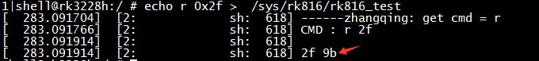

# **RK805 开发指南**

发布版本：1.0

作者邮箱：chenjh@rock-chips.com

日期：2018.05

文档密级：公开资料

---

**前言**

**概述**

本文档主要介绍 RK805 的各个子模块，介绍相关概念、功能、dts 配置和一些常见问题的分析定位。

**产品版本**

| **芯片名称** | **内核版本**  |
| -------- | --------- |
| RK805    | 3.10、 4.4 |

**读者对象**

本文档（本指南）主要适用于以下工程师：

技术支持工程师

软件开发工程师

**修订记录**

| **日期**     | **版本** | **作者** | **修改说明** |
| ---------- | ------ | ------ | -------- |
| 2017.05.28 | V1.0   | 陈健洪    | 初稿       |

---
[TOC]

---

## 1 基础

### 1.1 概述

RK805 是一款高性能 PMIC，RK805 集成 4 个大电流 DCDC、3 个 LDO、1 个 RTC、可调上电时序等功能。

系统中各路电源总体分为两种：DCDC 和 LDO。两种电源的总体特性如下（详细资料请自行搜索）：

1. DCDC：输入输出压差大时，效率高，但是存在纹波比较大的问题，成本高，所以大压差，大电流负载时使用。一般有两种工作模式。PWM 模式：纹波瞬态响应好，效率低；PFM 模式：效率高，但是负载能力差。
2. LDO：输入输出压差大时，效率低，成本低，为了提高 LDO 的转换效率，系统上会进行相关优化如：LDO 输出电压为 1.1V，为了提高效率，其输入电压可以从 VCCIO_3.3V 的 DCDC 给出。所以电路上如果允许尽量将 LDO 接到 DCDC 输出回路，但是要注意上电时序。

### 1.2 功能

从使用者的角度看，RK805 的功能概况起来可以分为 4 个部分：

1. regulator 功能：控制各路 DCDC、LDO 电源状态；
2. rtc 功能：提供时钟计时、定时等功能；
3. gpio 功能：out1 和 out2 两个推挽输出引脚（只能 output），可当普通 gpio 使用；
4. pwrkey 功能：检测 power 按键的按下/释放，可以为 AP 节省一个 gpio。

### 1.3 芯片引脚功能


下面描述中，SLEEP 和 INT 引脚需要重点关注：


### 1.4 重要概念

- I2C 地址

     7 位从机地址：0x18

- PMIC 有 3 种工作模式

    1. PMIC normal 模式

    系统正常运行时 PMIC 处于 normal 模式，此时 pmic_sleep 为低电平。

    2. PMIC sleep 模式

    系统休眠时需要待机功耗尽量低，PMIC 会切到 sleep 模式减低自身功耗，这时候一般会降低某些路的输出电压，或者直接关闭输出，这可以根据实际产品需求进行配置。系统待机时 AP 通过 I2C 指令把 pmic_sleep 配置成 sleep 模式，然后拉高 pmic_sleep 即可让 PMIC 进入 sleep 状态；当 SoC 唤醒时 pmic_sleep 恢复为低电平，PMIC 退出休眠模式。

    3. PMIC shutdown 模式

    当系统进入关机流程的时候，PMIC 需要完成整个系统的电源下电操作。AP 通过 I2C 指令把 pmic_sleep 配置成 shutdown 模式，然后拉高 pmic_sleep 即可让 PMIC 进入 shutdown 状态。

- pmic_sleep 引脚

    常态为低电平，PMIC 处于 normal 模式。当引脚拉高的时候会切换到 sleep 或者 shutdown 的模式。

- pmic_int 引脚

    常态为高电平，当有中断产生的时候变为低电平。如果中断没有被处理，则会一直维持低电平。

- out1/out2 引脚

    这两个引脚可以当普通的 gpio 使用（推挽输出），但是只有 gpio 输出模式。

- pmic_pwron 引脚

    pwrkey 的功能需要硬件上将 power 按键接到这个引脚，驱动通过这个引脚来判断按下/释放。

- 各路 DCDC 的工作模式

    DCDC 有 PWM（也叫 force PWM）、PFM 模式，但是 PMIC 有一种模式会动态切换 PWM、PFM，这就是我们通常所说的 AUTO 模式。PMIC 支持 PWM、AUTO PWM/PFM 两种模式，AUTO 模式效率高但是纹波瞬态响应会差。出于系统稳定性考虑，运行时都是设置为 PWM 模式，系统进入休眠时会选择切换到 AUTO PWM/PFM。

- DCDC3 电压调节

    DCDC3 这路电源比较特殊，不能通过寄存器修改电压，只能通过外部电路的分压电阻进行调节，所以如果需要修改电压请修改外围硬件，在 Rockchip 的方案上一般作为 VCC_DDR 使用。

- DCDC 和 LDO 的运行时电压调节范围

1. DCDC 电压范围不连续：

     | 电压范围(V)       | 步进值(mV) | 具体档位值(V)       |
     | ------------- | ------- | -------------------------------- |
     | 0.7125 ~ 1.45 | 12.5    | 0.7125、0.725、0.737.5、 ……、1.45 |
     | 1.8 ~ 2.2     | 200     | 1.8、 2.0、2.2                     |
     | 2.3           | 无       | 2.3                              |

2. LDO 电压连续：

     | 电压范围(V)   | 步进值(mV) | 具体档位值(V)                         |
     | --------- | ------- | -------------------------------- |
     | 0.8 ~ 3.4 | 100     | 0.8、 0.9、1.0、1.1、 1.2、 …… 3.4 |

### 1.5 上电条件和时序

1. 上电条件

   只要满足下面任意一个条件即可以实现 PMIC 上电：

- EN 信号从低电平变高电平触发
- EN 信号保持高电平，且 RTC 闹钟中断触发
- EN 信号保持高电平，按 PWRON 键触发

2. 上电时序

   每款 SOC 平台对各路电源上电时序要求可能不一样，目前上电时序有如下情况，具体请参考最新的 datasheet：


## 2 配置

### 2.1 驱动和 menuconfig

3.10 内核配置

RK805 驱动文件（复用 RK816 驱动）：

```c
drivers/mfd/rk816.c
drivers/input/misc/rk816-pwrkey.c
drivers/rtc/rtc-rk816.c
drivers/gpio/gpio-rk816.c
drivers/regulator/rk816-regulator.c
```

menuconfig 里对应的宏配置：

```c
CONFIG_MFD_RK816
CONFIG_GPIO_RK816
CONFIG_RTC_RK816
CONFIG_REGULATOR_RK816
CONFIG_INPUT_RK816_PWRKEY
```

4.4 内核配置

RK805 驱动文件：

```c
drivers/mfd/rk808.c
drivers/input/misc/rk8xx-pwrkey.c
drivers/rtc/rtc-rk808.c
drivers/gpio/gpio-rk8xx.c
drivers/regulator/rk818-regulator.c
drivers/clk/clk-rk808.c
```

menuconfig 里对应的宏配置：

```c
CONFIG_MFD_RK808
CONFIG_RTC_RK808
CONFIG_GPIO_RK8XX
CONFIG_REGULATOR_RK818
CONFIG_INPUT_RK8XX_PWRKEY
CONFIG_COMMON_CLK_RK808
```

### 2.2 DTS 配置

3.10 内核配置

DTS 的配置包括：I2C 挂载、主体、regulator、rtc、poweroff 等部分。

```c
&i2c1 {
	rk805: rk805@18 {
		reg = <0x18>;
		status = "okay";
	};
};

#include "../../../arm/boot/dts/rk805.dtsi"
&rk805 {
	gpios = <&gpio2 GPIO_A6 GPIO_ACTIVE_HIGH>, <&gpio2 GPIO_D2 GPIO_ACTIVE_LOW>;
	rk805,system-power-controller;
	gpio-controller;
	#gpio-cells = <2>;

	rtc {
		status = "disabled";
	};

	regulators {
		rk805_dcdc1_reg: regulator@0 {
			regulator-name = "vdd_logic";
			regulator-min-microvolt = <700000>;
			regulator-max-microvolt = <1500000>;
			regulator-initial-mode = <0x1>;
			regulator-initial-state = <3>;
			regulator-boot-on;
			regulator-always-on;
			regulator-state-mem {
				regulator-state-mode = <0x2>;
				regulator-state-enabled;
				regulator-state-uv = <1000000>;
			};
		};
		rk805_dcdc2_reg: regulator@1 {
					.............
		};
		rk805_dcdc3_reg: regulator@2 {
					.............
		};
		.................................
	};
};
```

1. I2C 挂载

    整个完整的 rk805 节点挂在对应的 i2c 节点下面，并且配置 status = "okay";

2. 主体部分

- 不可修改部分

```
    rk805,system-power-controller：声明RK805具备管理系统下电的功能；
    gpio-controller：声明RK805具有GPIO的功能；
    #gpio-cells：使用者引用RK805的GPIO时需要指定的参数个数;
```

**说明：**如果某个节个需要引用 RK805 的 GPIO 进行使用，引用格式如下：

`gpios = <&rk805 0 GPIO_ACTIVE_LOW>;`
    第一个参数： &rk805 固定，不可改动；
    第二个参数： 引用 rk805 的哪个 gpio，只能是 0 或者 1，其中 0：out1， 1：out2；
    第三个参数： gpio 的极性。

- 可修改部分

  gpios：指定 pmic_int（第一个）和 pmic_sleep（第二个）引脚；

3. regulator 部分

- `regulator-name`: 电源名字，建议和硬件图上保持一致，使用 regulator_get 接口时需要匹配这个名字；
- `regulator-min-microvolt`：运行时可调节的最小电压；
- `regulator-max-microvolt`：运行时可调节的最大电压；
- `regulator-initial-mode`：运行时 DCDC 工作模式，一般配置为 1。 1：force pwm，2：auto pwm/pfm；
- `regulator-state-mode`： 休眠时 DCDC 工作模式，一般配置为 2。1：force pwm， 2：auto pwm/pfm；
- `regulator-initial-state`：suspend 时的模式，必须配置成 3；

- `regulator-boot-on`：存在这个属性时，在注册 regulator 的时候就会使能这路电源；
- `regulator-always-on`：存在这个属性时，运行时不允许关闭这路电源且会在注册的时候使能这路电源；
- `regulator-state-enabled`：休眠时保持上电状态，想要关闭该路电源，则改成”regulator-state-disabled”；
- `regulator-state-uv`：休眠不断电情况下的待机电压。

**说明：**

​	如果 regulator-min-microvolt 和 regulator-max-microvolt 的电压相等，则在注册这个 regulator 的时候系统框架默认会把这个电压设置下去并使能这路电源，不需要使用者干预。

​	如果 regulator-boot-on 或者 regulator-always-on 存在，则系统框架在注册这路 regulator 的时候默认会进行 enable，此时的这路 regulator 的电压有 2 种情况：如果 regulator-min-microvolt 和 regulator-max-microvolt 的电压相等，则系统框架会把这路电压设置为当前这个电压值；如果 regulator-min-microvolt 和 regulator-max-microvolt 的电压不相等，则此时的电压是 PMIC 的本身的硬件默认上电电压。

4. rtc 部分

如果不想使能 RTC 的功能（如 box 产品上），则需要像上面那样增加节点，显式指明为 status = "disabled"。如果需要使能的的话则可以把整个 RTC 节点去掉或者设置状态为 status = "okay"即可。

5. poweroff 部分

```c
gpio_poweroff {
	compatible = "gpio-poweroff";
	gpios = <&gpio2 GPIO_D2 GPIO_ACTIVE_HIGH>;
	status = "okay";
};
```

因为 RK805 支持拉高 pmic_sleep 引脚进行整个 PMIC 的下电，所以需要在根节点下增加这个节点。其中 gpios 是可改部分，用于指明 pmic_sleep 引脚。

4.4 内核配置

DTS 的配置包括：i2c 挂载、主体、rtc、pwrkey、gpio、regulator 等部分。

```c
&pinctrl {
	pmic {
		pmic_int_l: pmic-int-l {
		rockchip,pins =
			<2 6 RK_FUNC_GPIO &pcfg_pull_up>;	/* gpio2_a6 */
		};
	};
};

&i2c1 {
	status = "okay";
	rk805: rk805@18 {
		compatible = "rockchip,rk805";
		status = "okay";
		reg = <0x18>;
		interrupt-parent = <&gpio2>;
		interrupts = <6 IRQ_TYPE_LEVEL_LOW>;
		pinctrl-names = "default";
		pinctrl-0 = <&pmic_int_l>;
		rockchip,system-power-controller;
		wakeup-source;
		gpio-controller;
		#gpio-cells = <2>;
		rtc {
			status = "disabled";
		};
		pwrkey {
			status = "disabled";
		};
		gpio {
			status = "okay";
		};
		regulators {
			compatible = "rk805-regulator";
			status = "okay";
			#address-cells = <1>;
			#size-cells = <0>;
			vdd_logic: RK805_DCDC1@0 {
				regulator-compatible = "RK805_DCDC1";
				regulator-name = "vdd_logic";
				regulator-min-microvolt = <712500>;
				regulator-max-microvolt = <1450000>;
				regulator-initial-mode = <0x1>;
				regulator-ramp-delay = <12500>;
				regulator-boot-on;
				regulator-always-on;
				regulator-state-mem {
					regulator-mode = <0x2>;
					regulator-on-in-suspend;
					regulator-suspend-microvolt = <1000000>;
				};
			};

			vdd_arm: RK805_DCDC2@1 {
				.................
			};
			vcc_ddr: RK805_DCDC3@2 {
				.................
			};
			.............................
		};
	};
};
```

1. i2c 挂载

整个完整的 rk805 节点挂在对应的 i2c 节点下面，并且配置 status = "okay";

2. 主体部分

- 不可修改：

```c
compatible = "rockchip,rk805";
reg = <0x18>;
rockchip,system-power-controller;
wakeup-source;
gpio-controller;
#gpio-cells = <2>;

```

- 可修改（按照 pinctrl 规则）

interrupt-parent：pmic_int 隶属于哪个 gpio；
interrupts：pmic_int 在 interrupt-parent 的 gpio 上的引脚索引编号和极性；
pinctrl-names：不修改，固定为 "default"；
pinctrl-0：引用 pinctrl 里定义好的 pmic_int 引脚；

3. rtc、pwrkey、gpio

如果 menuconfig 选中了这几个模块，但是实际又不需要使能这几个驱动，那么可以在 dts 里增加 rtc、pwrkey、gpio 节点，并且显式指明状态为 status = "disabled"，这样就不会使能驱动，但是开机信息会有错误 log 报出，可以忽略；如果要使能驱动，则可以去掉相应的节点，或者设置状态为 status = "okay"。

4. regulator

- `regulator-compatible`：驱动注册时需要匹配的名字，不能改动，否则会加载失败；
- `regulator-name`：电源的名字，建议和硬件图上保持一致，使用 regulator_get 接口时需要匹配这个名字；
- `regulator-min-microvolt`：运行时可以调节的最小电压；
- `regulator-max-microvolt`：运行时可以调节的最大电压；
- `regulator-initial-mode`：运行时 DCDC 的工作模式，一般配置为 1。 1：force pwm，2：auto pwm/pfm；
- `regulator-mode`：休眠时 DCDC 的工作模式，一般配置为 2。1：force pwm， 2：auto pwm/pfm；
- `regulator-initial-state`：suspend 时的模式，必须配置成 3；
- `regulator-boot-on`：存在这个属性时，在注册 regulator 的时候就会使能这路电源；
- `regulator-always-on`：存在这个属性时，表示运行时不允许关闭这路电源且会在注册的时候使能这路电源；
- `regulator-ramp-delay`：DCDC 的电压上升时间，固定配置为 12500；
- `regulator-on-in-suspend`：休眠时保持上电状态，想要关闭该路电源，则改成”regulator-off-in-suspend”；
- `regulator-suspend-microvolt`：休眠不断电情况下的待机电压。

### 2.3 函数接口

如下几个接口基本可以满足日常使用，包括 regulator 开、关、电压设置、电压获取等：

1. 获取 regulator：

   `struct regulator *regulator_get(struct device *dev, const char *id)`

   dev 默认填写 NULL 即可，id 对应 dts 里的 regulator-name 属性。

2. 释放 regulator
   `void regulator_put(struct regulator *regulator)`

3. 打开 regulator
   `int regulator_enable(struct regulator *regulator)`

4. 关闭 regulator

   `int regulator_disable(struct regulator *regulator)`

5. 获取 regulator 电压

  `int regulator_get_voltage(struct regulator *regulator)`

6. 设置 regulator 电压

  `int regulator_set_voltage(struct regulator *regulator, int min_uV, int max_uV)`

  传入的参数时保证 min_uV = max_uV，由调用者保证。

7. 范例

```c
struct regulator *rdev_logic;

rdev_logic = regulator_get(NULL, "vdd_logic");			// 获取vdd_logic
regulator_enable(rdev_logic);							// 使能vdd_logic
regulator_set_voltage(rdev_logic, 1100000, 1100000);	// 设置电压1.1v
regulator_disable(rdev_logic);							// 关闭vdd_logic
regulator_put(rdev_logic);								// 释放vdd_logic
```

## 3 Debug

### 3.10 内核

因为 PMIC 涉及的驱动在使用逻辑上都不复杂，重点都体现在最后的寄存器设置上。所以目前常用的 debug 方式就是直接查看 rk805 的寄存器，通过如下节点：

`/sys/rk816/rk816_test`

读寄存器：

`echo r [addr]  > /sys/rk816/rk816_test`

写寄存器：

`echo w [addr] [value] > /sys/rk816/rk816_test`

范例：

`echo r 0x2f > /sys/rk816/rk816_test			// 读取0x2f寄存器的值，为0x9b`



`echo w 0x2f 0x9c > /sys/rk816/rk816_test	// 设置0x2f寄存器的值为0x9c`

一般写操作执行完之后最好再读一遍确认是否写成功。


### 4.4 内核

命令格式同 3.10 内核一样，只是节点路径不同，4.4 内核上的 debug 节点路径是：

`/sys/rk8xx/rk8xx_dbg`