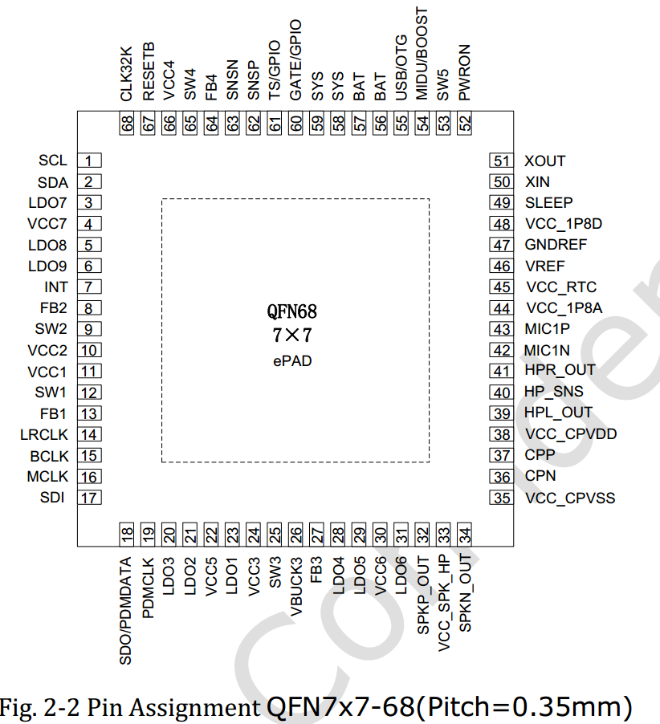
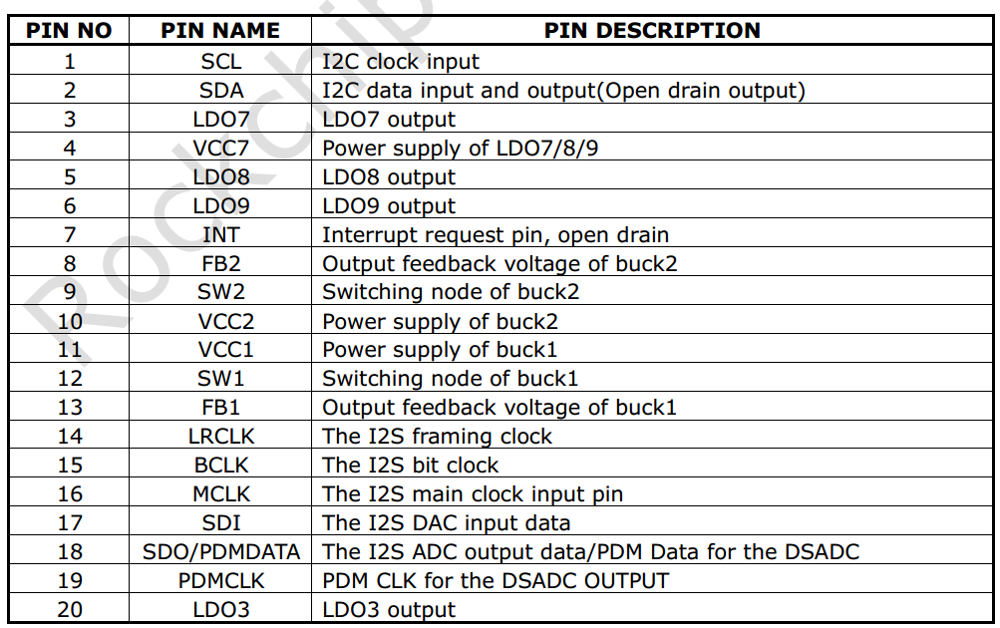
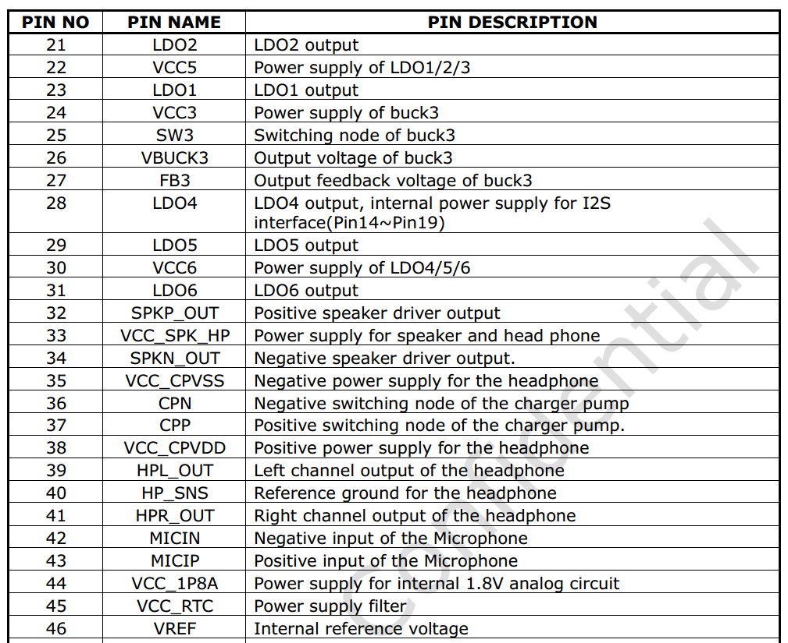
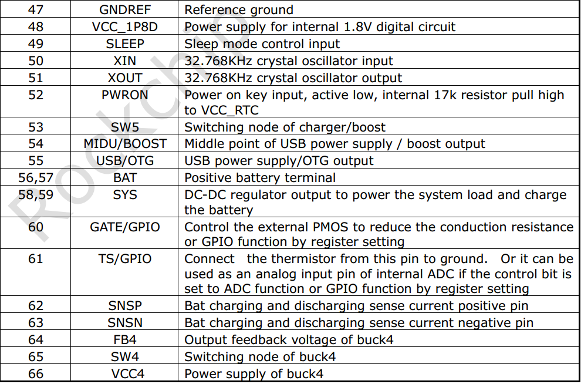
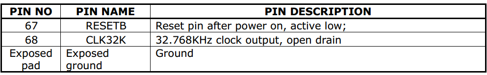
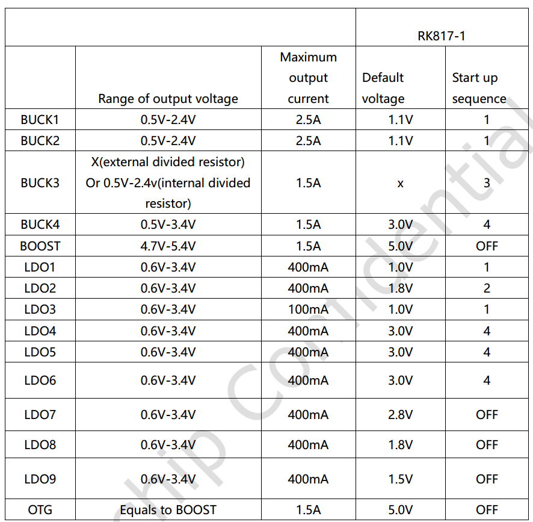

# Rockchip RK817 Developer Guide

文件标识：RK-KF-YF-068

发布版本：V1.0.0

日期：2019-11-26

文件密级：公开资料

---

**免责声明**

本文档按“现状”提供，福州瑞芯微电子股份有限公司（“本公司”，下同）不对本文档的任何陈述、信息和内容的准确性、可靠性、完整性、适销性、特定目的性和非侵权性提供任何明示或暗示的声明或保证。本文档仅作为使用指导的参考。

由于产品版本升级或其他原因，本文档将可能在未经任何通知的情况下，不定期进行更新或修改。

**商标声明**

“Rockchip”、“瑞芯微”、“瑞芯”均为本公司的注册商标，归本公司所有。

本文档可能提及的其他所有注册商标或商标，由其各自拥有者所有。

**版权所有© 2019福州瑞芯微电子股份有限公司**

超越合理使用范畴，非经本公司书面许可，任何单位和个人不得擅自摘抄、复制本文档内容的部分或全部，并不得以任何形式传播。

福州瑞芯微电子股份有限公司

Fuzhou Rockchip Electronics Co., Ltd.

地址：     福建省福州市铜盘路软件园A区18号

网址：     [www.rock-chips.com](http://www.rock-chips.com)

客户服务电话： +86-4007-700-590

客户服务传真： +86-591-83951833

客户服务邮箱： [fae@rock-chips.com](mailto:fae@rock-chips.com)

---

**前言**

**概述**

本文档主要介绍 RK817 的各个子模块，介绍相关概念、功能、dts 配置和一些常见问题的分析定位。

**产品版本**

| **芯片名称** | **内核版本**     |
| ------------ | ---------------- |
| RK817        | 4.4、4.19        |

**读者对象**

本文档（本指南）主要适用于以下工程师：

技术支持工程师

软件开发工程师

**修订记录**

| **日期**   | **版本** | **作者** | **修改说明**     |
| ---------- | -------- | -------- | ---------------- |
| 2019.11.26 | V1.0.0   | 张晴     | 第一次版本发布   |

---
[TOC]

---

## 基础

### 概述

RK817 是一款高性能 PMIC，RK817 集成 4 个大电流 DCDC、9 个 LDO、1 个升压BOOST、1 个 开关SWITCH、 1个 RTC、1个 高性能CODEC、可调上电时序,而且还集成了开关充电，智能功率路径管理，库仑计等功能。

系统中各路电源总体分为两种：DCDC 和 LDO。两种电源的总体特性如下（详细资料请自行搜索）：

1. DCDC：输入输出压差大时，效率高，但是存在纹波比较大的问题，成本高，所以大压差，大电流负载时使用。一般有两种工作模式。PWM 模式：纹波瞬态响应好，效率低；PFM 模式：效率高，但是负载能力差。
2. LDO：输入输出压差大时，效率低，成本低，为了提高 LDO 的转换效率，系统上会进行相关优化如：LDO 输出电压为 1.1V，为了提高效率，其输入电压可以从 VCCIO_3.3V 的 DCDC 给出。所以电路上如果允许尽量将 LDO 接到 DCDC 输出回路，但是要注意上电时序。

### 功能

从使用者的角度看，RK817 的功能概况起来可以分为 4 个部分：

1. regulator 功能：控制各路 DCDC、LDO 电源状态；
2. rtc 功能：提供时钟计时、定时等功能；
3. gpio 功能：可当普通 gpio 使用，有pinctrl的功能；
4. pwrkey 功能：检测 power 按键的按下/释放，可以为 AP 节省一个 gpio；
5. clk 功能：有两个32.768KHZ时钟输出，一个不可以控常开，一个是软件可控；
6. codec 功能：采样率最高支持到192KHZ，支持16bit和32bit，支持DAC、ADC PDM等(此功能暂不在本文档中介绍，后面会有专有文档补充说明)；
7. 充电功能和电量计功能(此功能暂不在本文档中介绍，后面会有专有文档补充说明)。

### 芯片引脚功能



下面描述中，SLEEP 和 INT 引脚需要重点关注，而且具有扩展gpio功能的sleep脚：









### 重要概念

- I2C 地址

     7 位从机地址：0x20

- PMIC 有 3 种工作模式

    1. PMIC normal 模式

    系统正常运行时 PMIC 处于 normal 模式，此时 pmic_sleep 为低电平。

    2. PMIC sleep 模式

    系统休眠时需要待机功耗尽量低，PMIC 会切到 sleep 模式减低自身功耗，这时候一般会降低某些路的输出电压，或者直接关闭输出，这可以根据实际产品需求进行配置。系统待机时 AP 通过 I2C 指令把 pmic_sleep 配置成 sleep 模式，然后拉高 pmic_sleep 即可让 PMIC 进入 sleep 状态；当 SoC 唤醒时 pmic_sleep 恢复为低电平，PMIC 退出休眠模式。

    3. PMIC shutdown 模式

    当系统进入关机流程的时候，PMIC 需要完成整个系统的电源下电操作。AP 通过 I2C 指令把 pmic_sleep 配置成 shutdown 模式，然后拉高 pmic_sleep 即可让 PMIC 进入 shutdown 状态。

- pmic_sleep 引脚

    常态为低电平，PMIC 处于 normal 模式。当引脚拉高的时候会切换到 sleep 或者 shutdown 的模式。
    RK817上这个脚是有复用功能的，可以通过pinctrl切换，选择需要的功能:
    1. SLEEP功能，用于SLEEP模式切换；
    2. 关机功能，用于POWER DOWN；
    3. 复位功能，用于RESET；
    4. 空闲，没有作用；

- pmic_int 引脚

    常态为高电平，当有中断产生的时候变为低电平。如果中断没有被处理，则会一直维持低电平。

- pmic_pwron 引脚

    pwrkey 的功能需要硬件上将 power 按键接到这个引脚，驱动通过这个引脚来判断按下/释放。

- 各路 DCDC 的工作模式

    DCDC 有 PWM（也叫 force PWM）、PFM 模式，但是 PMIC 有一种模式会动态切换 PWM、PFM，这就是我们通常所说的 AUTO 模式。PMIC 支持 PWM、AUTO PWM/PFM 两种模式，AUTO 模式效率高但是纹波瞬态响应会差。出于系统稳定性考虑，运行时都是设置为 PWM 模式，系统进入休眠时会选择切换到 AUTO PWM/PFM。

- DCDC3 电压调节

    DCDC3 这路电源比较特殊，不能通过寄存器修改电压，只能通过外部电路的分压电阻进行调节，所以如果需要修改电压请修改外围硬件，在 Rockchip 的方案上一般作为 VCC_DDR 使用。

- DCDC 和 LDO 的运行时电压调节范围

    1. DCDC 电压范围不连续：

       | 电压范围(V)   | 步进值(mV) | 具体档位值(V)                     |
       | ------------- | ---------- | --------------------------------- |
       | 0.7125 ~ 1.5  | 12.5       | 0.7125、0.725、0.737.5、 ……、1.5  |
       | 1.6 ~ 2.4     | 100        | 1.6、1.7、1.8、1.9、……、2.4       |

    2. LDO 电压连续：

       | 电压范围(V)   | 步进值(mV) | 具体档位值(V)                     |
       | ------------- | ---------- | ----------------------------------|
       | 0.6 ~ 3.4     | 25         | 0.6、0.625、0.65、0.675、…… 、3.4 |

### 上电条件和时序

1. 上电条件

   只要满足下面任意一个条件即可以实现 PMIC 上电：

- EN 信号从低电平变高电平触发
- EN 信号保持高电平，且 RTC 闹钟中断触发
- EN 信号保持高电平，按 PWRON 键触发
- EN 信号保持高电平，充电器插入

2. 上电时序

   每款 SOC 平台对各路电源上电时序要求可能不一样，目前上电时序有如下情况，具体请参考最新的 datasheet：



## 配置

### 驱动和 menuconfig

**4.4 内核配置**

RK817 驱动文件：

```c
drivers/mfd/rk808.c
drivers/input/misc/rk8xx-pwrkey.c
drivers/rtc/rtc-rk808.c
drivers/gpio/gpio-rk8xx.c
drivers/regulator/rk808-regulator.c
drivers/clk/clk-rk808.c
drivers/power/rl817_battery.c
drivers/power/rl817_charger.c
sound/soc/codecs/rl817_codec.c
```

RK817 dts文件（可参考范例）：

```c
arch/arm64/boot/dts/rockchi/rk3326-evb-lp3-v10.dtsi
```

menuconfig 里对应的宏配置：

```c
CONFIG_MFD_RK808
CONFIG_RTC_RK808
CONFIG_GPIO_RK8XX
CONFIG_REGULATOR_RK818
CONFIG_INPUT_RK8XX_PWRKEY
CONFIG_COMMON_CLK_RK808
CONFIG_BATTERY_RK817
CONFIG_CHARGER_RK817
SND_SOC_RK817
```

**4.19 内核配置**

RK817 驱动文件：

```c
drivers/mfd/rk808.c
drivers/input/misc/rk805-pwrkey.c       // 跟4.4内核不同
drivers/rtc/rtc-rk808.c
drivers/pinctrl/pinctrl-rk805.c         // 跟4.4内核不同
drivers/regulator/rk808-regulator.c     // 跟4.4内核不同
drivers/clk/clk-rk808.c
drivers/power/rl817_battery.c
drivers/power/rl817_charger.c
sound/soc/codecs/rl817_codec.c
```

RK817 dts文件（可参考范例）：

```c
arch/arm64/boot/dts/rockchi/rk3326-evb-lp3-v10.dtsi
```

menuconfig 里对应的宏配置：

```c
CONFIG_MFD_RK808
CONFIG_RTC_RK808
CONFIG_PINCTRL_RK805
CONFIG_REGULATOR_RK808
CONFIG_INPUT_RK805_PWRKEY
CONFIG_COMMON_CLK_RK808
CONFIG_BATTERY_RK817
CONFIG_CHARGER_RK817
SND_SOC_RK817
```

### DTS 配置

**4.4 内核 DTS 配置**

DTS 的配置包括：i2c 挂载、主体、rtc、pwrkey、gpio、regulator 等部分。

```c
&pinctrl {
	pmic {
		pmic_int: pmic_int {
			rockchip,pins =
				<0 RK_PA7 RK_FUNC_GPIO &pcfg_pull_up>;
		};

		soc_slppin_gpio: soc_slppin_gpio {
			rockchip,pins =
				<0 RK_PA4 RK_FUNC_GPIO &pcfg_output_low>;
		};

		soc_slppin_slp: soc_slppin_slp {
			rockchip,pins =
				<0 RK_PA4 RK_FUNC_1 &pcfg_pull_none>;
		};

		soc_slppin_rst: soc_slppin_rst {
			rockchip,pins =
				<0 RK_PA4 RK_FUNC_2 &pcfg_pull_none>;
		};
	};
};

&i2c1 {
	status = "okay";
	rk817: pmic@20 {
		compatible = "rockchip,rk817";
		reg = <0x20>;
		interrupt-parent = <&gpio0>;
		interrupts = <7 IRQ_TYPE_LEVEL_LOW>;
		pinctrl-names = "default", "pmic-sleep",
				"pmic-power-off", "pmic-reset";
		pinctrl-0 = <&pmic_int>;
		pinctrl-1 = <&soc_slppin_slp>, <&rk817_slppin_slp>;
		pinctrl-2 = <&soc_slppin_gpio>, <&rk817_slppin_pwrdn>;
		pinctrl-3 = <&soc_slppin_rst>, <&rk817_slppin_rst>;
		rockchip,system-power-controller;
		wakeup-source;
		#clock-cells = <1>;
		clock-output-names = "rk808-clkout1", "rk808-clkout2";
		//fb-inner-reg-idxs = <2>;
		/* 1: rst regs (default in codes), 0: rst the pmic */
		pmic-reset-func = <1>;

		vcc1-supply = <&vccsys>;
		vcc2-supply = <&vccsys>;
		vcc3-supply = <&vccsys>;
		vcc4-supply = <&vccsys>;
		vcc5-supply = <&vccsys>;
		vcc6-supply = <&vccsys>;
		vcc7-supply = <&vcc_3v0>;
		vcc8-supply = <&vccsys>;
		vcc9-supply = <&dcdc_boost>;

		pwrkey {
			status = "okay";
		};

		pinctrl_rk8xx: pinctrl_rk8xx {
			gpio-controller;
			#gpio-cells = <2>;

			rk817_ts_gpio1: rk817_ts_gpio1 {
				pins = "gpio_ts";
				function = "pin_fun1";
				/* output-low; */
				/* input-enable; */
			};

			rk817_gt_gpio2: rk817_gt_gpio2 {
				pins = "gpio_gt";
				function = "pin_fun1";
			};

			rk817_pin_ts: rk817_pin_ts {
				pins = "gpio_ts";
				function = "pin_fun0";
			};

			rk817_pin_gt: rk817_pin_gt {
				pins = "gpio_gt";
				function = "pin_fun0";
			};

			rk817_slppin_null: rk817_slppin_null {
				pins = "gpio_slp";
				function = "pin_fun0";
			};

			rk817_slppin_slp: rk817_slppin_slp {
				pins = "gpio_slp";
				function = "pin_fun1";
			};

			rk817_slppin_pwrdn: rk817_slppin_pwrdn {
				pins = "gpio_slp";
				function = "pin_fun2";
			};

			rk817_slppin_rst: rk817_slppin_rst {
				pins = "gpio_slp";
				function = "pin_fun3";
			};
		};

		regulators {
			vdd_logic: DCDC_REG1 {
				regulator-always-on;
				regulator-boot-on;
				regulator-min-microvolt = <950000>;
				regulator-max-microvolt = <1350000>;
				regulator-ramp-delay = <6001>;
				regulator-initial-mode = <0x2>;
				regulator-name = "vdd_logic";
				regulator-state-mem {
					regulator-on-in-suspend;
					regulator-suspend-microvolt = <950000>;
				};
			};

			vdd_arm: DCDC_REG2 {
				regulator-always-on;
				regulator-boot-on;
				regulator-min-microvolt = <950000>;
				regulator-max-microvolt = <1350000>;
				regulator-ramp-delay = <6001>;
				regulator-initial-mode = <0x2>;
				regulator-name = "vdd_arm";
				regulator-state-mem {
					regulator-off-in-suspend;
					regulator-suspend-microvolt = <950000>;
				};
			};
			vcc_ddr: RK817_DCDC3@2 {
				.................
			};
			.............................
		};
		battery {
			compatible = "rk817,battery";
			ocv_table = <3500 3625 3685 3697 3718 3735 3748
			3760 3774 3788 3802 3816 3834 3853
			3877 3908 3946 3975 4018 4071 4106>;
			design_capacity = <2500>;
			design_qmax = <2750>;
			bat_res = <100>;
			sleep_enter_current = <300>;
			sleep_exit_current = <300>;
			sleep_filter_current = <100>;
			power_off_thresd = <3500>;
			zero_algorithm_vol = <3850>;
			max_soc_offset = <60>;
			monitor_sec = <5>;
			sample_res = <10>;
			virtual_power = <1>;
		};

		charger {
			compatible = "rk817,charger";
			min_input_voltage = <4500>;
			max_input_current = <1500>;
			max_chrg_current = <2000>;
			max_chrg_voltage = <4200>;
			chrg_term_mode = <0>;
			chrg_finish_cur = <300>;
			virtual_power = <0>;
			dc_det_adc = <0>;
			extcon = <&u2phy>;
		};

		rk817_codec: codec {
			#sound-dai-cells = <0>;
			compatible = "rockchip,rk817-codec";
			clocks = <&cru SCLK_I2S1_OUT>;
			clock-names = "mclk";
			pinctrl-names = "default";
			pinctrl-0 = <&i2s1_2ch_mclk>;
			hp-volume = <20>;
			spk-volume = <3>;
			status = "okay";
		};
	};
};
```

1. i2c 挂载

整个完整的 rk817 节点挂在对应的 i2c 节点下面，并且配置 status = "okay";

2. 主体部分

- 不可修改：

```c
compatible = "rockchip,rk817";
reg = <0x20>;
rockchip,system-power-controller;
wakeup-source;
gpio-controller;
#gpio-cells = <2>;
```

- 可修改（按照 pinctrl 规则）

interrupt-parent：pmic_int 隶属于哪个 gpio；
interrupts：pmic_int 在 interrupt-parent 的 gpio 上的引脚索引编号和极性；
pinctrl-names：不修改，固定为 "default"；
pinctrl-0：引用 pinctrl 里定义好的 pmic_int 引脚；

3. rtc、pwrkey、gpio

如果 menuconfig 选中了这几个模块，但是实际又不需要使能这几个驱动，那么可以在 dts 里增加 rtc、pwrkey、gpio 节点，并且显式指明状态为 status = "disabled"，这样就不会使能驱动，但是开机信息会有错误 log 报出，可以忽略；如果要使能驱动，则可以去掉相应的节点，或者设置状态为 status = "okay"。

4. regulator

- `regulator-compatible`：驱动注册时需要匹配的名字，不能改动，否则会加载失败；
- `regulator-name`：电源的名字，建议和硬件图上保持一致，使用 regulator_get 接口时需要匹配这个名字；
- `regulator-init-microvolt`：u-boot阶段的初始化电压，kernel阶段无效；
- `regulator-min-microvolt`：运行时可以调节的最小电压；
- `regulator-max-microvolt`：运行时可以调节的最大电压；
- `regulator-initial-mode`：运行时 DCDC 的工作模式，一般配置为 1。 1：force pwm，2：auto pwm/pfm；
- `regulator-mode`：休眠时 DCDC 的工作模式，一般配置为 2。1：force pwm， 2：auto pwm/pfm；
- `regulator-initial-state`：suspend 时的模式，必须配置成 3；
- `regulator-boot-on`：存在这个属性时，在注册 regulator 的时候就会使能这路电源；
- `regulator-always-on`：存在这个属性时，表示运行时不允许关闭这路电源且会在注册的时候使能这路电源；
- `regulator-ramp-delay`：DCDC 的电压上升时间，固定配置为 12500；
- `regulator-on-in-suspend`：休眠时保持上电状态，想要关闭该路电源，则改成”regulator-off-in-suspend”；
- `regulator-suspend-microvolt`：休眠不断电情况下的待机电压。

5. power off

RK817在关机上比较特殊，因为支持直接拉IO关机，所以内核注册pm_shutdown_prepare_fn，用于关机前一些准备工作，主要包括：关闭RTC中断、设置特殊IO的IOMUX等。
真正的关机是在PCIE中，pm_power_off中直接拉IO关机。

```c
static int rk817_shutdown_prepare(struct rk808 *rk808)
{
	int ret;

	/* close rtc int when power off */
	regmap_update_bits(rk808->regmap,
			   RK817_INT_STS_MSK_REG1,
			   (0x3 << 5), (0x3 << 5));
	regmap_update_bits(rk808->regmap,
			   RK817_RTC_INT_REG,
			   (0x3 << 2), (0x0 << 2));

	if (rk808->pins && rk808->pins->p && rk808->pins->power_off) {
		ret = regmap_update_bits(rk808->regmap,
					 RK817_SYS_CFG(3),
					 RK817_SLPPIN_FUNC_MSK,
					 SLPPIN_NULL_FUN);
		if (ret) {
			pr_err("shutdown: config SLPPIN_NULL_FUN error!\n");
			return 0;
		}

		ret = regmap_update_bits(rk808->regmap,
					 RK817_SYS_CFG(3),
					 RK817_SLPPOL_MSK,
					 RK817_SLPPOL_H);
		if (ret) {
			pr_err("shutdown: config RK817_SLPPOL_H error!\n");
			return 0;
		}
		ret = pinctrl_select_state(rk808->pins->p,
					   rk808->pins->power_off);
		if (ret)
			pr_info("%s:failed to activate pwroff state\n",
				__func__);
		else
			return ret;
	}

	/* pmic sleep shutdown function */
	ret = regmap_update_bits(rk808->regmap,
				 RK817_SYS_CFG(3),
				 RK817_SLPPIN_FUNC_MSK, SLPPIN_DN_FUN);
	return ret;
}
```

6. clk 部分

如果某个节个需要引用 RK817 的 clk 进行使用，引用格式如下：

`clocks = <&rk817 1>;`
    第一个参数： &rk817 固定，不可改动；
    第二个参数： 引用 rk817 的哪个 clk，只能是 0 或者 1，其中 0：rk817-clkout1， 1：rk817-clkout2；

**4.19 内核 DTS 配置**

请参考4.4内核DTS配置。差异点：4.19内核的DTS配置不再需要gpio子节点，但其他模块依然使用`gpios = <&rk817 0 GPIO_ACTIVE_LOW>;`的方式引用和使用rk817的pin脚。

### 函数接口

如下几个接口基本可以满足日常使用，包括 regulator 开、关、电压设置、电压获取等：

1. 获取 regulator：

   `struct regulator *regulator_get(struct device *dev, const char *id)`

   dev 默认填写 NULL 即可，id 对应 dts 里的 regulator-name 属性。

2. 释放 regulator
   `void regulator_put(struct regulator *regulator)`

3. 打开 regulator
   `int regulator_enable(struct regulator *regulator)`

4. 关闭 regulator

   `int regulator_disable(struct regulator *regulator)`

5. 获取 regulator 电压

  `int regulator_get_voltage(struct regulator *regulator)`

6. 设置 regulator 电压

  `int regulator_set_voltage(struct regulator *regulator, int min_uV, int max_uV)`

  传入的参数时保证 min_uV = max_uV，由调用者保证。

7. 范例

```c
struct regulator *rdev_logic;

rdev_logic = regulator_get(NULL, "vdd_logic");		// 获取vdd_logic
regulator_enable(rdev_logic);				// 使能vdd_logic
regulator_set_voltage(rdev_logic, 1100000, 1100000);	// 设置电压1.1v
regulator_disable(rdev_logic);				// 关闭vdd_logic
regulator_put(rdev_logic);				// 释放vdd_logic
```

说明：4.4或者4.19内核还提供了`devm_`开头的regulator接口帮开发者管理要申请的资源。

## Debug

### 内核

命令格式同 3.10 内核一样，只是节点路径不同，4.4 内核上的 debug 节点路径是：

`/sys/rk8xx/rk8xx_dbg`

### 内核

请参考4.4内核命令。
