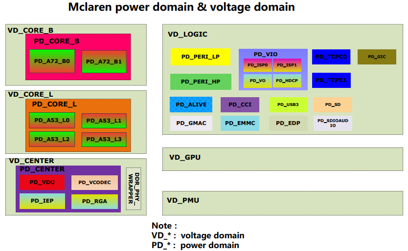
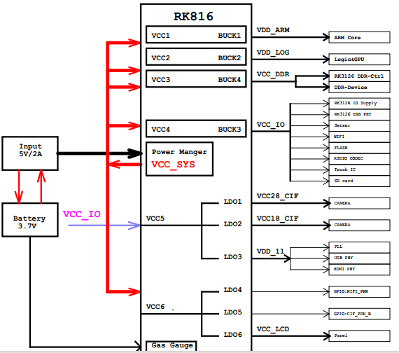
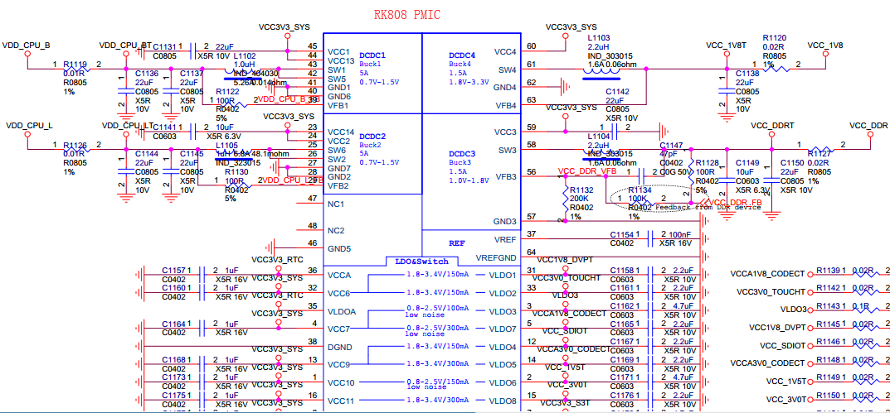
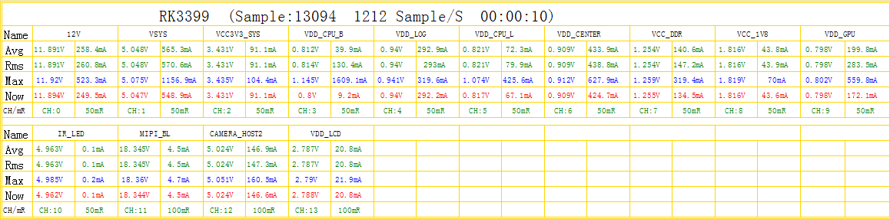
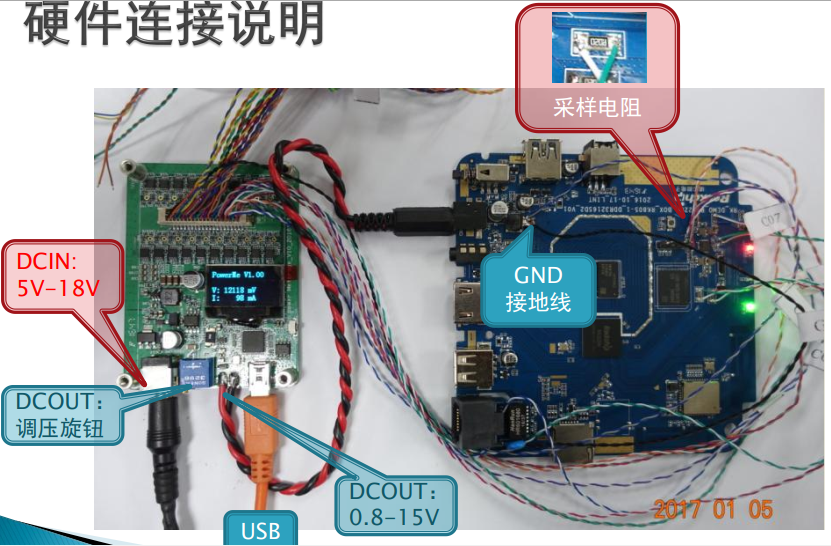

# Power consumption analysis and optimization

ID: RK-KF-YF-177

Release Version: V1.0.1

Release Date: 2021-04-29

Security Level: □Top-Secret   □Secret   □Internal   ■Public

**DISCLAIMER**

THIS DOCUMENT IS PROVIDED “AS IS”. ROCKCHIP ELECTRONICS CO., LTD.(“ROCKCHIP”)DOES NOT PROVIDE ANY WARRANTY OF ANY KIND, EXPRESSED, IMPLIED OR OTHERWISE, WITH RESPECT TO THE ACCURACY, RELIABILITY, COMPLETENESS,MERCHANTABILITY, FITNESS FOR ANY PARTICULAR PURPOSE OR NON-INFRINGEMENT OF ANY REPRESENTATION, INFORMATION AND CONTENT IN THIS DOCUMENT. THIS DOCUMENT IS FOR REFERENCE ONLY. THIS DOCUMENT MAY BE UPDATED OR CHANGED WITHOUT ANY NOTICE AT ANY TIME DUE TO THE UPGRADES OF THE PRODUCT OR ANY OTHER REASONS.

**Trademark Statement**

"Rockchip", "瑞芯微", "瑞芯" shall be Rockchip’s registered trademarks and owned by Rockchip. All the other trademarks or registered trademarks mentioned in this document shall be owned by their respective owners.

**All rights reserved. ©2021. Rockchip Electronics Co., Ltd.**

Beyond the scope of fair use, neither any entity nor individual shall extract, copy, or distribute this document in any form in whole or in part without the written approval of Rockchip.

Rockchip Electronics Co., Ltd.

No.18 Building, A District, No.89, software Boulevard Fuzhou, Fujian,PRC

Website:     [www.rock-chips.com](http://www.rock-chips.com)

Customer service Tel:  +86-4007-700-590

Customer service Fax:  +86-591-83951833

Customer service e-Mail:  [fae@rock-chips.com](mailto:fae@rock-chips.com)

---

**Preface**

**Overview**

This document mainly describes some basic concepts and optimization methods of power consumption for RK platform chips.

**Product version**

| **Product name** | **Kernel version**  |
| ---------------- | ------------------- |
| All chips        | All kernel versions |

**Applicable object**

This document (the guide) is mainly suitable for below engineers:

Field application engineers

Software development engineers

 **Revision history**

| **Version** | **Author**  | **Date**   | **Change Description**                      |
| ----------- | ----------- | ---------- | ------------------------------------------- |
| V1.0.0      | Tim Chen    | 2019-08-31 | Initial version                             |
| V1.0.1      | Karen Huang | 2021-04-29 | Modify format and add copyright information |

---

**Contents**

[TOC]

---

## Basic concept

### Frequency (clk) and voltage

Generally there are many modules inside SoC, such as ARM, GPU, DDR, I2C, SPI, USB and so on. When each module is working, the digital logic part requires an appropriate frequency and corresponding voltage. The higher the module frequency is, the higher the voltage is required. The frequency and voltage are two important parameters of power consumption.

### Voltage domain(VD) and power domain(PD)

Generally all modules inside SoC have digital logic part and IO part. The digital logic part is mainly responsible for computing and status control, and IO part is mainly responsible for the transmission of the interface signal (some modules don't have IO, such as ARM, GPU, etc.). Generally the power supplies of the digital logic and IO are separated. The power consumption of IO part is generally fixed, while the power consumption of digital logic part changes a lot due to the influence of frequency and voltage. In order to optimize the power consumption, the digital logic part inside the chip is divided into voltage domain and power domain according to the module.

- The voltage domain means the domain where several modules inside the chip share one external power supply. It can adjust or turn on/off the voltage independently. Generally the modules with similar running voltage and not large power consumption can be put in the same voltage domain. But if the power consumption is very large, it is better to use a separate voltage domain, which is convenient to manage the power consumption and also avoid the peak current exceeding the limit of external power supply. To ensure that all modules can work normally, need to set the voltage of the voltage domain to the required voltage of the module with the highest voltage requirement (excluding the closed module).

- One voltage domain may contain many modules and these modules generally don't work at the same time. With power supply, the modules not working will have leakage. In order to reduce the leakage, generally we will divide one voltage domain into several areas, and each area can independently turn on/off the power supply. After some area switches off the power supply, it will be isolated from other modules and significantly reduce the leakage. This kind of area is called power domain.

Take RK3399 as example, there are 6 VD:

- VD_CORE_B: including two big cores Contex-A72, the power consumption is relatively large, so separate a voltage domain.

- VD_CORE_L: including four little cores Contex-A53, the power consumption is relatively large, so separate a voltage domain.

- VD_LOGIC: including some peripherals' controller and system bus, such as USB, EMMC, GMAC, SPI, I2C, EDP, VOP, AXI, AHB, APB, and so on.

- VD_CENTER: including vdpu, vepu, iep, rga and DDR controller.

- VD_GPU: including GPU, the power consumption is relatively large, so separate a voltage domain.

- VD_PMU: including PMU, SRAM, GPIO, PVTM and other modules relating to suspend and resume process.

The block diagram is as below:



### DCDC (Direct Current) and LDO (Low dropout regulator)

The external power supply of SoC mainly includes DCDC and LDO:

- DCDC generally means switch power, conversion efficiency is high, the efficiency can be up to ~80%~90%, when the current is relatively large, need to use DCDC to improve the power efficiency.

- The main characteristic of LDO is, the input current equals to output current, so power efficiency = (output voltage)/(input voltage). Assuming input 3.8V, output 1.0V, the power efficiency is 1V/3.8V=26.3%, which indicates this is low efficiency.

Take the power supply solution of RK3126+RK816 as example:

- 4 BUCK of RK816 separately supply power for ARM, LOG, DDR, IO of RK3126, because the current of these modules are all relatively large (BUCK is a kind of voltage drop DCDC).

- 6 LDO of RK816 separately supply power for PLL, PHY and some peripherals of RK3126, because the current of these modules are relatively small.

The block diagram of the power supply is as below:



### Static power consumption and dynamic power consumption

- The static power consumption is the power consumption consumed by the leakage of transistor when the internal modules of SoC are not working. The static power consumption will increase with the increase of the temperature and voltage.

- The dynamic power consumption is the power consumption consumed by the conversion of internal circuit when the internal modules of SoC are working. The dynamic power consumption will increase with the increase of the frequency and voltage.

```c
The format of dynamic power consumption:
    /* C is constant, V is voltage, F is frequency*/
    P(d)= C * V^2 * F
```

### DVFS(Dynamic Voltage and Frequency Scaling), CPUFREQ and DEVFREQ

The higher the module working frequency and the voltage are, the higher the power consumption is. So need dynamically adjust the frequency and voltage to optimize the power consumption. When the system is idle, reduce the frequency and voltage, when the system is busy, increase the frequency and voltage.

- DVFS is the technology of dynamic voltage and frequency scaling, which is the basic technology implementation of CPUFREQ and DEVFREQ.

- CPUFREQ is the software framework of dynamic CPU frequency scaling, including several different frequency scaling strategies. For more details, please refer to the document 《Rockchip-Developer-Guide-Linux4.4-CPUFreq-CN》.
- DEVFREQ is the software framework of dynamic peripheral(not including CPU) frequency scaling, including several different frequency scaling strategies. For more details, please refer to 《Rockchip-Developer-Guide-Linux4.4-Devfreq》.

## Power consumption measurement

Before optimizing the power consumption, need to measure the voltage and current of each power supply, analyze the data and then optimize accordingly.

*Note: the temperature is an important parameter affecting the power consumption, so need to record the real-time temperature when measuring the power consumption. The command to acquire the temperature is as below:*

```c
cat /sys/class/thermal/thermal_zone0/temp
```

### Measurement method

Series connect a resistor R in the circuit to measure the voltage difference U between two sides of the resistor, then the current I=U/R. Generally here we use the resistor with 0.01 ohm,but you need to adjust the resistance according to the current.

Take RK3399 EVB board as example, by this method, series connect 0.01 ohm resistor to the output of VDD_CPU_B, VDD_CPU_L, VCC_1V8 and VCC_DDR, as shown in below picture:



### Measurement tool

As there are many channels of power required to be measured, use multi-channel voltage/current collector can effectively improve the testing efficiency. PowerMeterage is the voltage/current collection tool developed by RockChip and it can measure 20 channels of power consumption data at the same time. The interface is as below:



The hardware connection of PowerMeterage is as below:



## Power consumption data analysis

### Calculate theoretical power consumption

Use PowerMeterage tool to break down the power consumption of each path, convert DCDC to the battery with ~80%~90% efficiency, the output current of LDO is equal to the input current, convert DCDC, LDO and other powers to the battery, and then add them up to estimate the total power consumption. If it is very different from the power consumption actually measured on the battery, maybe there is leakage. Need to analyze further.

Take RK3326 EVB board as example, the static desktop power consumption is as below:

*Note: Because the test result of each path should be converted to the power consumption of the battery, so it is more convenient to compare the actually measured current of the battery with the theoretical current on battery.*

| Type    | power-supply | Voltage(V) | current(mA) | Theoretical current on battery-3.8V(mA) | Remark                                                       |
| ------- | ------------ | ---------- | ----------- | --------------------------------------- | ------------------------------------------------------------ |
| DC/DC   | VDD_ARM      | 0.96       | 10.20       | 3.23                                    | With 80% efficiency, conversion formula:<br>V * I / efficiency / voltage of the battery |
| DC/DC   | VDD_LOG      | 0.96       | 89.30       | 28.20                                   | eg:<br>Theoretical current of VDD_LOG on battery(3.8V)=<br>0.96 * 89.3 / 0.8 / 3.8 = 28.2 |
| DC/DC   | VCC_DDR      | 1.26       | 38.50       | 15.91                                   |                                                              |
| DC/DC   | VCC_IO       | 2.99       | 4.50        | 4.43                                    |                                                              |
| LDO     | VCC_1V8      | 1.81       | 28.80       | 28.80                                   | Output current of LDO is equal to input current              |
| LDO     | VDD_1V0      | 1.00       | 10.90       | 10.90                                   |                                                              |
| LDO     | VCC3V0_PMU   | 3.01       | 1.20        | 1.20                                    |                                                              |
| battery | VBAT         | 3.81       | 94.60       | 92.67                                   | Theoretical value is similar to actually measured value      |

### Compare with EVB data

Break down the power consumption data of each path, compare with the data of EVB in the same scenario, and check if there is problem. For example, the following is the comparison of the static desktop power consumption between RK3326 EVB board and customer device, it can be seen that customer board's power consumption of ARM and LOG are abnormal, and need to analyze further.

| Type    | power-supply | EVB        |             | Customer device |             |
| ------- | ------------ | ---------- | ----------- | --------------- | ----------- |
|         |              | Voltage(V) | Current(mA) | Voltage(V)      | Current(mA) |
| DC/DC   | VDD_ARM      | 0.96       | 10.20       | 1.10            | 212.50      |
| DC/DC   | VDD_LOG      | 0.96       | 89.30       | 1.00            | 151.30      |
| DC/DC   | VCC_DDR      | 1.26       | 38.50       | 1.27            | 40.50       |
| DC/DC   | VCC_IO       | 2.99       | 4.50        | 2.99            | 4.80        |
| LDO     | VCC_1V8      | 1.81       | 28.80       | 1.81            | 29.80       |
| LDO     | VDD_1V0      | 1.00       | 10.90       | 1.00            | 10.20       |
| LDO     | VCC3V0_PMU   | 3.01       | 1.20        | 3.01            | 1.40        |
| battery | VBAT         | 3.81       | 94.60       | 3.81            | 191.6       |

### Data analysis for each path

#### VDD_CORE/VDD_CPU/VDD_ARM

These three names are the same power, that is, ARM core power. This power consumption can be analyzed mainly from the following aspects:

- Confirm if the frequency voltage table (opp-table) is normal or not, if the actually measured voltage is consistent with the set voltage or not.

Relative commands are as below:

```c
/* Acquire the frequency voltage table, target column means the voltage required by some frequency */
cat /sys/kernel/debug/opp/opp_summary
 device                rate(Hz)    target(uV)    min(uV)    max(uV)
-------------------------------------------------------------------
...
 cpu0
                      408000000       950000      950000     1350000
                      600000000       950000      950000     1350000
                      816000000      1000000     1000000     1350000
                     1008000000      1125000     1125000     1350000
                     1200000000      1275000     1275000     1350000
                     1248000000      1300000     1300000     1350000
                     1296000000      1350000     1350000     1350000

/* Check the frequency scaling strategy currently used by cpufreq, cpu frequency scaling is enabled with the default interactive strategy */
cat /sys/devices/system/cpu/cpu0/cpufreq/scaling_governor
interactive

/* Set userspace strategy to fix the frequency of cpu, then set different frequencies, compare the set voltage with the measured voltage */
echo userspace > /sys/devices/system/cpu/cpu0/cpufreq/scaling_governor
cat /sys/devices/system/cpu/cpu0/cpufreq/scaling_governor
userspace

/* Check the frequency point supported by cpufreq */
cat /sys/devices/system/cpu/cpu0/cpufreq/scaling_available_frequencies
408000 600000 816000 1008000 1200000 1248000 1296000

/* Set the fixed frequency */
echo 408000 > /sys/devices/system/cpu/cpu0/cpufreq/scaling_setspeed

/* Confirm current frequency*/
cat /sys/devices/system/cpu/cpu0/cpufreq/scaling_cur_freq
408000

/* Confirm current voltage, and compare with measured value, vdd_arm represents the name of regulator, which is differnt for differnt projects*/
cat /sys/kernel/debug/regulator/vdd_arm/voltage
950000

/* Acquire current voltages of all regulators*/
cat /sys/kernel/debug/regulator/regulator_summary
 regulator                      use open bypass voltage current     min     max
-------------------------------------------------------------------------------
...
 vcc3v8_sys                       0   12      0  3800mV     0mA  3800mV  3800mV
    deviceless                                                      0mV     0mV
    vdd_logic                     0    4      0   950mV     0mA   950mV  1350mV
       dmc                                                        950mV  1350mV
       ff400000.gpu                                               950mV  1350mV
       bus-apll                                                   950mV  1350mV
       deviceless                                                   0mV     0mV
    vdd_arm                       0    2      0   950mV     0mA   950mV  1350mV
       cpu0                                                       950mV  1350mV
       deviceless                                                   0mV     0mV
...
```

- Check cpu loading, analyze if there is irregular task or interrupt.

```c
/* Use top command to check the task loading, the output of top with different versions will have difference, this version of top supports to check the thread and the running cpu of the thread */
top -m 5 -t
User 51%, System 2%, IOW 0%, IRQ 0%
User 712 + Nice 0 + Sys 33 + Idle 634 + IOW 0 + IRQ 0 + SIRQ 0 = 1379

/* PR column represents currently running cpu of the thread, the sum of all cpu loading percentage is equal to 100%, so the highest loading percentage of each cpu is 100%/NR_CPU, the highest loading percentage of each CPU of SoC with 4 cores is 25% */
  PID   TID PR CPU% S     VSS     RSS PCY UID      Thread          Proc
 2631  2631  3  25% R   3104K    552K  fg root     busybox         busybox
 2632  2632  2  25% R   3104K    552K  fg root     busybox         busybox
 2633  2633  1   3% R    740K    400K  fg root     top             /data/top
  255   476  0   0% S  15492K   4988K  fg system   HwBinder:255_1  /vendor/bin/hw/android.hardware.sensors@1.0-service
  419   478  1   0% S 3770752K 256884K  fg system   SensorService   system_server

/* Use cpustats to observe the frequency change of cpu */
cpustats
Total: User 600 + Nice 0 + Sys 3 + Idle 591 + IOW 0 + IRQ 0 + SIRQ 0 = 1194
  408000kHz 0 +
  600000kHz 0 +
  816000kHz 0 +
  1008000kHz 0 +
  1200000kHz 0 +
  1248000kHz 0 +
  1296000kHz 0 +
  1416000kHz 0 +
  1512000kHz 1200 = 1200 /* within the statistic time, there are 1200 system jiffies in total, 1512M running for 1200 jiffies */
/* from below, we can see the loading status of each cpu, including user mode, kernel mode, interrupt and idle time */
cpu0: User 0 + Nice 0 + Sys 1 + Idle 294 + IOW 0 + IRQ 0 + SIRQ 0 = 295
cpu1: User 299 + Nice 0 + Sys 1 + Idle 0 + IOW 0 + IRQ 0 + SIRQ 0 = 300
cpu2: User 1 + Nice 0 + Sys 1 + Idle 296 + IOW 0 + IRQ 0 + SIRQ 0 = 298
cpu3: User 300 + Nice 0 + Sys 1 + Idle 0 + IOW 0 + IRQ 0 + SIRQ 0 = 301

/* check the ratio of running time for each frequency through cpufreq node, time unit: jiffies */
cat /sys/devices/system/cpu/cpu0/cpufreq/stats/time_in_state
408000 718186
600000 548
816000 368
1008000 1578
1200000 1104
1248000 84
1296000 101
1416000 678
1512000 47495

/* check the inturrupt quantity of all peripherals */
cat /proc/interrupts
           CPU0       CPU1       CPU2       CPU3
  1:          0          0          0          0     GICv2  29 Edge      arch_timer
  2:     181898     165057     636772     839244     GICv2  30 Edge      arch_timer
  5:     180743      39000      28905      65189     GICv2  62 Level     rk_timer
 13:     260634          0          0          0     GICv2  39 Level     ff180000.i2c
 14:     354805          0          0          0     GICv2  40 Level     ff190000.i2c
 15:          0          0          0          0     GICv2  41 Level     ff1a0000.i2c
...
```

#### VDD_GPU

The power consumption of VDD_GPU mainly confirms if the the frequency voltage table is normal or not, if the measured voltage is consistent with the set voltage or not, using devfreq node.

*Note: some chips' GPU module doesn't have separate VD and it will put GPU in VDD_LOGIC, here is needed to confirm if the voltage of VDD_LOGIC is normal or not.*

```c
/* acquire the frequency voltage table */
cat /sys/kernel/debug/opp/opp_summary
 device                rate(Hz)    target(uV)    min(uV)    max(uV)
-------------------------------------------------------------------
...
 platform-ff400000.gpu
                      200000000       950000      950000      950000
                      300000000       950000      950000      950000
                      400000000      1025000     1025000     1025000
                      480000000      1100000     1100000     1100000
                      520000000      1150000     1150000     1150000
...

/* check the frequency scaling strategy currently used by gpu devfreq, gpu frequency scaling is enabled with the default simple_ondemand strategy */
cat /sys/class/devfreq/ff400000.gpu/governor
simple_ondemand
Note: ff400000 of ff400000.gpu is the address of gpu register, so the name will be different for differnt chips.

/* Set userspace strategy to fix the frequency of gpu, then set different frequencies, compare the set voltage with measured voltage */
echo userspace > /sys/class/devfreq/ff400000.gpu/governor
cat /sys/class/devfreq/ff400000.gpu/governor
userspace

/* check the frequency points supported by gpu devfreq */
cat /sys/class/devfreq/ff400000.gpu/available_frequencies
520000000 480000000 400000000 300000000 200000000

/* set the fixed frequency */
echo 200000000 > /sys/class/devfreq/ff400000.gpu/userspace/set_freq

/* confirm current frequency */
cat /sys/class/devfreq/ff400000.gpu/cur_freq
200000000

/* confirm current voltage, and compare with measued value */
cat /sys/kernel/debug/regulator/vdd_gpu/voltage
950000

/* check gpu loading */
cat /sys/class/devfreq/ff400000.gpu/load
0@200000000Hz
```

#### VDD_LOGIC

Generally VDD_LOGIC will contain many modules, in order to manage the power consumption conveniently, it will be divided into many PD internally. The power consumption can be analyzed mainly from the following aspects:

- Confirm the running frequency and switch status of each module.

```c
cat /sys/kernel/debug/clk/clk_summary
   clock                         enable_cnt  prepare_cnt        rate   accuracy   phase
----------------------------------------------------------------------------------------
 xin24m                                   9           10    24000000          0 0
...
    pll_gpll                              1            1  1200000000          0 0
       gpll                               9           20  1200000000          0 0
          clk_sdio_div50                  1            1   100000000          0 0
             clk_sdio                     1            5   100000000          0 0
                sdio_sample               0            1    50000000          0 0
                sdio_drv                  0            1    50000000          0 180
          clk_emmc_div50                  1            1   300000000          0 0
             clk_emmc                     1            5   300000000          0 0
                emmc_sample               0            1   150000000          0 42
                emmc_drv                  0            1   150000000          0 180
...
```

- Confirm the switch status of each PD.

```c
cat /sys/kernel/debug/pm_genpd/pm_genpd_summary                                <
domain                          status          slaves
    /device                                             runtime status
----------------------------------------------------------------------
pd_gpu                          off
    /devices/platform/ff400000.gpu                      suspended
pd_vi                           off
    /devices/platform/ff4a8000.iommu                    suspended
pd_vo                           on
    /devices/platform/ff460f00.iommu                    active
    /devices/platform/ff470f00.iommu                    suspended
    /devices/platform/ff2e0000.video-phy                suspended
    /devices/platform/ff450000.dsi                      active
    /devices/platform/ff460000.vop                      active
    /devices/platform/ff470000.vop                      suspended
    /devices/platform/ff480000.rk_rga                   suspended
pd_vpu                          off
    /devices/platform/ff440440.iommu                    suspended
    /devices/platform/ff442800.iommu                    suspended
    /devices/platform/vpu_combo                         suspended
pd_mmc_nand                     on
    /devices/platform/ff380000.dwmmc                    unsupported
    /devices/platform/ff390000.dwmmc                    unsupported
    /devices/platform/ff3b0000.nandc                    active
pd_gmac                         off
pd_sdcard                       off
pd_usb                          on
    /devices/platform/ff300000.usb                      active
```

- Generally DDR module is put in VDD_LOGIC, and the power consumption of DDR module is relatively large, use the same devfreq strategy as GPU to optimize the power consumption, so need to confirm the frequency voltage table and measured voltage. DDR also has some configurations with low power consumption, such as pd_idle, sr_idle, odt switch and some other timing configurations. The debugging process is relatively complex, you need to refer to the detailed DDR document.

```c
cat /sys/kernel/debug/opp/opp_summary
 device                rate(Hz)    target(uV)    min(uV)    max(uV)
-------------------------------------------------------------------
 platform-dmc
                      194000000       950000      950000      950000
                      328000000       950000      950000      950000
                      450000000       950000      950000      950000
                      528000000       975000      975000      975000
                      666000000      1000000     1000000     1000000
...

/* ddr uses dmc_ondemand frequency scaling strategy by default */
cat /sys/class/devfreq/dmc/governor
dmc_ondemand

Other commands to set the frequency and voltage are the same as GPU devfreq.
```

#### VCC_DDR

VCC_DDR supplies power mainly for DDR component and DDR-IO part of SoC. The parameters affecting the power consumption of VCC_DDR include: DDR frequency, DDR loading, DDR low power consumption configuration, DDR component type and so on. Under the same condition, the power consumption of DDR components from different vendors may have big difference.

#### VCC_IO

VCC_IO supplies power mainly for IO Pad of SoC and some peripherals. The power consumption can be analyzed from the following aspects:

- Check the working status of peripheral module, if there is leakage.

- Check if IO pin status of SoC matches with the peripheral or not, for example, IO output is high, but the connected peripheral pin is low level.

### Common scenario analysis

#### Static desktop

It is mainly the display module which is working, CPU, GPU, DDR should be reduced to the lowest frequency, and enter low power consumption mode. Adjust VDD_CPU,VDD_GPU,VDD_LOGIC to the lowest voltage of opp-table, confirm the status of clk_summary and pm_genpd_summary, confirm the peripheral modules (WIFI, BT, etc.) are all closed. The static desktop generally is used as the basic power consumption of other scenarios, so need to firstly optimize its power consumption to the best.

#### Video playback

It is mainly the video decoder (VPU/RKVDEC) which is working, GPU generally is closed. Especially confirm if the running frequency of DDR and voltage of VDD_LOGIC are normal or not.

#### Game

It is mainly CPU and GPU which are working. Especially analyze the loading of CPU and GPU, frequency change, the voltages of VDD_CPU and VDD_GPU are normal or not.

#### Deepsleep

Generally VDD_CPU and VDD_GPU will turn off the power supply, VDD_LOG only reserves the power supply for some resume module, so need to focus on the power consumption analysis of IO, DDR components and some peripherals.

## Power consumption optimization strategy

### CPU optimization

- Adjust cpufreq parameter.

```c
/* the default frequency scaling strategy used is interactive, relative parameters are as follows: */
ls -l /sys/devices/system/cpu/cpu0/cpufreq/interactive
go_hispeed_load	    /* when the loading is larger than go_hispeed_load and the frequency is smaller than hispeed_freq, directly jump to hispeed_freq */
hispeed_freq        /* when jumping from low frequency to high frequency, need to jump to hispedd_freq first */
above_hispeed_delay /* when the frequency is larger than hispeed_freq, the time duration before each frequency increase */
min_sample_time	    /* after each frequency increase, if it is to reduce the frequency next time , the time duration before frequency reduce */
target_loads        /* the target loading of the frequency scaling */
timer_rate          /* the loading sampling time，unit:us */
timer_slack         /* the loading sampling time after cpu entering idle */
boost               /* when the frequency is smaller than hispeed_freq, keep boost to hispeed_freq */
boostpulse          /* when the frequency is smaller than hispeed_freq, boost to hispeed_freq, keep a while */
boostpulse_duration /* time duration of boostpulse, unit:us */
io_is_busy          /* whether to compute io wait to cpu loading */

We mainly adjust three parameters: hispeed_freq，target_loads，timer_rate:

1. hispeed_freq: select an appropriate transition frequency, to make cpu stable in the medium frequency, with the best power consumption, too large or too small will cause cpu jump to high frequency easily and increase the power consumption.
2. target_loads:easier to run with low frequency after this value is increased, both the power consumption and the performance will be reduced.
3. timer_rate: easier to run with low frequency after this value is increased, both the power consumption and the performance will be reduced.
```

- Close some cpu, limit the highest frequency of cpu.

```c
/* close cpu2，cpu3 */
echo 0 > /sys/devices/system/cpu/cpu2/online
echo 0 > /sys/devices/system/cpu/cpu3/online

/* set the max frequency of cpu0 to 1200MHz */
echo 1200000 > /sys/devices/system/cpu/cpu0/cpufreq/scaling_max_freq
```

- SoC with ARM Big-Little architecture can bind the tasks with high loading to little cores through CPUSET since the energy efficiency of the little core is better.

/* Note: SoC with SMP architecture can also bind the tasks to some cpu so that other cpus can enter low power consumption mode, but maybe it will make cpu easy to run with high frequency, which will increase the power consumption. */

```c
/* create group of litte core*/
mkdir /dev/cpuset/little

/* set cpu used by group of little core */
echo 0-3 > /dev/cpuset/little/cpus

/* add pid=1111 task into the group of little core */
echo 1111 > /dev/cpuset/little/tasks

/* Android system creates several groups by default, the framework layer puts the tasks into differenct groups, you can adjust cpus of each group, analyze the power consumption */
ls /dev/cpuset
background
foreground
system-background
top-app
```

- Limit the cpu bandwidth of the tasks with high loading through CPUCTL (need to enable the macro CONFIG_CFS_BANDWIDTH).

```c
/* create the group of bandwidth limitation */
mkdir /dev/cpuctl/mygroup

/* set the cycle of bandwidth limitation as 10ms */
echo 10000 > /dev/cpuctl/mygroup/cpu.cfs_quota_us

/* within each cycle, total running time of the tasks in the group cannot exceed 5ms, this value can be larger than cfs_quota_us, because it is the total running time of multiple cpus */
echo 5000 > /dev/cpuctl/mygroup/cpu.cfs_period_us

/* add relative tasks into the group */
echo 1111 > /dev/cpuctl/mygroup/tasks
echo 1112 > /dev/cpuctl/mygroup/tasks

/* cpu.shares means to limit the bandwidth of the task through weight, used for performance optimization, without affecting the power consumption */
/dev/cpuctl/mygroup/cpu.shares
```

### DDR optimization

- Frequency scaling with scenario: configure different DDR frequencies for different scenarios, such as 4K video, video recording, dual display and so on.

```c
/* scenario definition */
include/dt-bindings/clock/rk_system_status.h
#define SYS_STATUS_NORMAL       (1<<0)
#define SYS_STATUS_SUSPEND      (1<<1)
#define SYS_STATUS_IDLE         (1<<2)
#define SYS_STATUS_REBOOT       (1<<3)
#define SYS_STATUS_VIDEO_4K     (1<<4)
#define SYS_STATUS_VIDEO_1080P  (1<<5)
...

/* configure the frequencies for different scenarios in dts */
arch/arm64/boot/dts/rockchip/px30.dtsi
dmc: dmc {
	compatible = "rockchip,px30-dmc";
	...
	system-status-freq = <
		/*system status         freq(KHz)*/
		SYS_STATUS_NORMAL       528000
		SYS_STATUS_REBOOT       450000
		SYS_STATUS_SUSPEND      194000
		SYS_STATUS_VIDEO_1080P  450000
		SYS_STATUS_BOOST        528000
		SYS_STATUS_ISP          666000
		SYS_STATUS_PERFORMANCE  666000
	>;
	...

/* acquire the current scenario */
cat /sys/class/devfreq/dmc/system_status
0x401
```

- Frequency scaling with loading: monitor the loading, automatically adjust DDR frequency, frequency scaling with loading may cause the reduction of the performance, you can fix DDR frequency in some scenario considering the frequency scaling with scenario.

```c
/* configure the parameter of frequency scaling with loading in dts, need to open dfi node to monitor DDR utility ratio */
dmc: dmc {
	compatible = "rockchip,px30-dmc";
	...

	/* use dfi to monitor the utility ratio of DDR */
	devfreq-events = <&dfi>;

    	/*
	 * the threshold of frequency scaling：
	 * when the utility ratio is over 40%, adjust to the highest frequency.
	 * when the loading is less than 40% and larger than 40%-20%, maintain current frequency.
	 * when the loading is less than 40%-20%, it will adjust the frequency to a certain value to make the loading to be around 40%-2%/2.
	 */
	upthreshold = <40>;
	downdifferential = <20>;

/* check the DDR loading of current system */
cat /sys/class/devfreq/dmc/load                                       <
33@528000000Hz
```

- For more detailed configuration and optimization of DDR DEVFREQ, please refer to the document 《Rockchip-Developer-Guide-Linux4.4-Devfreq》.

### Thermal control optimization

When the temperature is increasing to certain degree, the power consumption will increase dramatically, especially in the case with high voltage.

- Improve the heat dissipation of hardware.
- Optimize the software thermal control strategy to avoid the big temperature fluctuation.
- Avoid the high voltage occurring in the case with high temperature through software limitation.

```c
&cpu0_opp_table {
	/* when the temperature is over 85 degree, limit the max voltage of cpu to 1.1V */
	rockchip,high-temp = <85000>;
	rockchip,high-temp-max-volt = <1100000>;

	/* or directly limit the max frequency to avoid the high voltage */
	rockchip,high-temp-max-freq = <1008000>;
};
```

### Power optimization

- In voltage conversion circuit, when the voltage reduction and current are relatively large, it is recommended to use DCDC to improve the efficiency and reduce the power consumption.

For example:

Input 3.3V, output 1.0V-50mA

| Power Type                | Input Current | Power Consumption |
| ------------------------- | ------------- | ----------------- |
| LDO                       | 50mA          | 165mW             |
| DCDC(with 80% efficiency) | 18.9mA        | 62.4mW            |