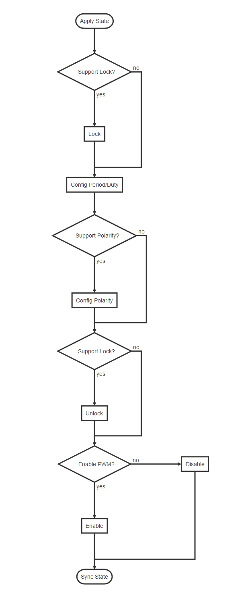

# **PWM Develop Guide**

ID: RK-KF-YF-28

Release Version: V2.0.0

Release Date: 2019-11-14

Security Level: Non-confidential

---

**DISCLAIMER**

THIS DOCUMENT IS PROVIDED “AS IS”. FUZHOU ROCKCHIP ELECTRONICS CO., LTD.(“ROCKCHIP”)DOES NOT PROVIDE ANY WARRANTY OF ANY KIND, EXPRESSED, IMPLIED OR OTHERWISE, WITH RESPECT TO THE ACCURACY, RELIABILITY, COMPLETENESS,MERCHANTABILITY, FITNESS FOR ANY PARTICULAR PURPOSE OR NON-INFRINGEMENT OF ANY REPRESENTATION, INFORMATION AND CONTENT IN THIS DOCUMENT. THIS DOCUMENT IS FOR REFERENCE ONLY. THIS DOCUMENT MAY BE UPDATED OR CHANGED WITHOUT ANY NOTICE AT ANY TIME DUE TO THE UPGRADES OF THE PRODUCT OR ANY OTHER REASONS.

**Trademark Statement**

“Rockchip”, “瑞芯微”, “瑞芯” shall be Rockchip’s registered trademarks and owned by Rockchip. All the other trademarks or registered trademarks mentioned in this document shall be owned by their respective owners.

**All rights reserved. ©2019. Fuzhou Rockchip Electronics Co., Ltd.**

Beyond the scope of fair use, neither any entity nor individual shall extract, copy, or distribute this document in any form in whole or in part without the written approval of Rockchip.

Fuzhou Rockchip Electronics Co., Ltd.

No.18 Building, A District, No.89, software Boulevard Fuzhou, Fujian,PRC

Website：     [www.rock-chips.com](http://www.rock-chips.com)

Customer service Tel： +86-4007-700-590

Customer service Fax： +86-591-83951833

Customer service e-Mail： [fae@rock-chips.com](mailto:fae@rock-chips.com)

---

**Preface**

The Pulse Width Modulation (PWM) function is very common in embedded systems. It is a very effective technology that uses the digital output of a microprocessor to control analog circuits. It is widely used in measurement, Communication into many areas of power control and conversion.
Rockchip PWM supports three modes: **Continuous mode, One-shot mode, and Capture mode **, 4 channels built-in.

**Overview**

**Product Version**

| **Chipset**                         | **Kernel Version** |
| ----------------------------------- | ------------------ |
| All Rockchip product with Linux3.10 | 3.10               |
| All Rockchip product with Linux4.4  | 4.4                |
| All Rockchip product with Linux4.19 | 4.19               |

**Intended Audience**

This document (this guide) is mainly intended for:

Technical support engineers
Software development engineers

---

**Revision History**

| **Version** | **Author** | **Date**   | **Change Description** |
| ----------- | ---------- | :--------- | ---------------------- |
| V1.0.0      | David Wu   | 2019-01-28 | Initial version        |
| V2.0.0      | David Wu   | 2019-11-14 | Support Linux4.19      |

**Content**

---
[TOC]
---

## PWM Driver

### 1. Driver File

The driver file is in: `drivers/pwm/pwm-rockchip.c`

The names of the driver files in the 3.10 and 4.4 kernels are the same. `Pwm-rockchip.c` only supports Continuous mode, but the code inside is slightly different. The 4.4 kernel version wraps `pwm_config()`, `pwm_enable()` and `pwm_disable()` in the `pwm_apply_state()` function. The advantage is that several PWM parameters can be changed at a time and the kernel 3.10 PWM driver still keep the original interface.

### 2. DTS Node Configuration

The different  of Kernel 3.10 and 4.4 DTS nodes is the number of parameters, parameter number in kernel 3.10 is 2, while in kernel 4.4 is 3. The number of parameters is the same as that of the PWM node `pwm-cells`, if the `pwm-cells` configuration is 3, you need to configure the optional polarity; if it is 2, you do not need to configure the polarity.
DTS configuration reference document `Documentation/devicetree/bindings/pwm/pwm.txt`, the main parameters are explained below:

- Parameter 1, which indicates the index (per-chip index of the PWM to request), which is theoretically 0, because each PWM has only one channel.
- Parameter 2, which indicates the time period of the PWM output waveform, the unit is ns; for example, the 25000 configured below means that the desired PWM output period is 40K Hz.
- Parameter 3, which indicates polarity, is an optional parameter;  the configuration in the following example is negative polarity.

```c
        bl: backlight {
                pwms = <&pwm 0 25000 PWM_POLARITY_INVERTED>;
                pwm-names = "backlight";
        };
```

## PWM Flow

The PWM driver process is roughly the same for the two drivers in kernel version 3.10 and kernel version 4.4. The difference is in interface packaging as described above, so here only describes kernel 4.4 process.



The above is the  flow of Continuous mode. If you want to know more, please refer to the Application Notes section of the chapter PWM  in TRM and the register configuration in each mode, which will not be described in detail here.

## Usage of PWM

The PWM kernel and user space introduction are described in `Documentation/pwm.txt`. We focus more on the user space. As stated in the document pwm.txt, PWM provides a user-level interface, which under the `/sys/class/pwm/`  node. After the PWM driver is successfully probed, pwmchip0 directory is generated in the `/sys/class/pwm/` directory; writing 0 to the export file is to open pwm timer 0, which will generate a pwm0 directory. Conversely, writing 0 to unexport will close the pwm timer, and meanwhile the pwm0 directory will be deleted. There are several files in this directory :

- enable: write 1 to enable pwm, write 0 to disable pwm;
- polarity: there are two parameters: normal or inversed, which means that the output pin level is inverted;
- duty_cycle: In normal mode, it means the high-level duration in one cycle (unit: nanosecond). In reversed mode, it means the low-level duration in one cycle (unit: nanosecond);
- period: indicates the period of the pwm wave (unit: nanosecond);

The following is an example of pwmchip0. Set the output frequency of pwm0 to 100K, the duty cycle to 50%, and the polarity to be positive:

```shell
cd /sys/class/pwm/pwmchip0/
echo 0 > export
cd pwm0
echo 10000 > period
echo 5000 > duty_cycle
echo normal > polarity
echo 1 > enable
```

## PWM Backlight

PWM has the most continuous mode use and more frequent backlighting use.

### 1. Backlight DTS

The following are common backlight configuration nodes in DTS files:

```c
backlight: backlight {
		compatible = "pwm-backlight";
		pwms = <&pwm0 0 25000 0>;
		brightness-levels = <
			0   1   2   3   4   5   6   7
			8   9  10  11  12  13  14  15
			16  17  18  19  20  21  22  23
			24  25  26  27  28  29  30  31
			32  33  34  35  36  37  38  39
			40  41  42  43  44  45  46  47
			48  49  50  51  52  53  54  55
			56  57  58  59  60  61  62  63
			64  65  66  67  68  69  70  71
			72  73  74  75  76  77  78  79
			80  81  82  83  84  85  86  87
			88  89  90  91  92  93  94  95
			96  97  98  99 100 101 102 103
			104 105 106 107 108 109 110 111
			112 113 114 115 116 117 118 119
			120 121 122 123 124 125 126 127
			128 129 130 131 132 133 134 135
			136 137 138 139 140 141 142 143
			144 145 146 147 148 149 150 151
			152 153 154 155 156 157 158 159
			160 161 162 163 164 165 166 167
			168 169 170 171 172 173 174 175
			176 177 178 179 180 181 182 183
			184 185 186 187 188 189 190 191
			192 193 194 195 196 197 198 199
			200 201 202 203 204 205 206 207
			208 209 210 211 212 213 214 215
			216 217 218 219 220 221 222 223
			224 225 226 227 228 229 230 231
			232 233 234 235 236 237 238 239
			240 241 242 243 244 245 246 247
			248 249 250 251 252 253 254 255>;
		default-brightness-level = <200>;
		enable-gpios = <&gpio1 13 GPIO_ACTIVE_HIGH>;
};
```

- "pwms = <& pwm0 0 25000 0>" is described in the Chapter [PWM Node Configuration](###DTS Node Configuration) above;

- The array "brightness-levels" , we generally take the value 255 as a scale, so the "general brightness-levels" is an array of 256 elements. When the PWM is set to positive polarity, the back-light is positive from 0 to 255, and the duty cycle is changed from 0% to 100%. The negative polarity of 255 to 0 bits is changed from 100% to 0%. When the PWM is set to negative polarity, the opposite is also conversed.

- The "default-brightness-level" exists in the booting time. For example, when the backlight driver is initialized until the new backlight setting by the Android user layer, it is the backlight brightness of the 200th element.

- The  "enable-gpios" indicates the backlight enable pin, which can be configured according to the circuit schematic; some hardware does not have backlight enable pins, you should delete this configuration, and the back-light driver will configure the backlight by the 0th element of the  array"brightness-levels" to shut down.

### 2. PWM Backlight Min and Max brightness Level

How to determine the brightness-level value of back-light off, which can be regulated by modifying back-light brightness through the command line, `echo xxx > /sys/class/backlight/backlight/brightness`
When the PWM polarity is set to positive, you can use the command ` echo xxx > /sys/class/backlight/backlight/brightness` to fetch the back-light node. The range of "xxx" here is 0 ~ 255. At this time, observe the change situation of brightness. For example, let "x" is to be the point where the back-light brightness is 0. Let "y" to be the brightest point of the back-light accepted by the customer. At this time, regulate the brightness-level table again, the first value of the array can be changed to "x" and the maximum value can be changed to "y". The middle value needs to be evenly changed to 256 elements, and one element of them has to be value of 255. When the PWM is negative polarity, the opposite is also to be converted.

## FAQ

### 1. Connection of PWM Between U-Boot and Kernel

- If U-Boot has the function of PWM voltage regulation, the PWM is still working at the kernel stage, the PWM clock gating count needs to be adjusted to be consistent with the current PWM state according to the current hardware status of the PWM. Otherwise, the clock driver may find that the unused PWM clock,  turn off it, which causing the PWM failed to work. The above patch has been modified to ensure the PWM driver: `drivers/pwm/pwm-rockchip.c`, updated to the following submission points:

  1. kernel-4.4: commit e6f2796ef5b660a70102c02d6c15f65ff8701d76
  2. kernel-3.10: commit 5a3d9257d5e379391eb02457ccd70f28a8fb188b

- The frequency of the clock source used by U-Boot and kernel PWM is different, which will also cause switching in the middle, which may cause the PWM duty cycle to change, and similar crashes caused by insufficient PWM voltage regulation will occur. Consistent with the clock source or clock source of the kernel. Make sure that the PWM  source clock and  source clock frequency of U-Boot PWM  is consistent with the kernel.

- Inconsistencies in the polarity and cycle configured by U-Boot and kernel can also lead to middle-state switching, which can lmake the changes for PWM duty cycle, and dead-machine problems such as a lack of PWM voltage control, so keep the U-Boot consistent with kernel's polarity and cycle.

### 2. PWM Pin PULL State As  PWM Regulator

When the device rebooting, the registers in the GRF may not reset(second global reset), but the PWM controller  reset, which make the PWM pin to be a input state. This  will change the default voltage of the PWM Regulator after rebooting by reseting the PWM pin pull state . Therefore, the PWM pin must be configured the same as the default state(pull-up or pull-down) in the kernel, which cannot be configured as "none". This configuration only needs to be modified when the PWM is used as a voltage regulator, as the other functions can be ignored.

- Confirm the default pull-up and pull-down of this PWM pin through the hardware schematic diagram. For example, the RK3399 excavator board PWM2 is used as a voltage regulation function, and the PWM2 pin is found on the schematic diagram: `GPIO1_C3/PWM2_d`, where "d" means down for the default pull-down; if "u" means up for the default pull-up.


- Define the PWM pull down pinctrl in dtsi:

```c
		pwm2_pin_pull_down: pwm2-pin-pull-down {
			rockchip,pins =
				<1 19 RK_FUNC_1 &pcfg_pull_down>;
		};
```

- Overwrite pinctrl config at dts:

```c
&pwm2 {
	status = "okay";
	pinctrl-names = "active";
	pinctrl-0 = <&pwm2_pin_pull_down>;
};
```

### 3. Oscilloscope Cannot Detect PWM Waveform

If the oscilloscope cannot get the waveform, confirm the following method:

- First check whether the value of the `PWM Counter Register` register is changing. If there is a change, it indicates that the PWM is working. (Note that if you use the io command to read the PWM registers, it need to turn off gating of pclk for RK3328 and the chips later, you can find them in the table of the product documentation , because these chips PWM pclk and the working clock are separated ); if the value of this register has not changed, it means that the PWM is irregular. Generally, these exceptions are divided into the following cases:

  1. Clock error

  2. The register configuration problem of the PWM itself, the PWM is not enabled or the value of the duty count is greater than period, etc .;

  3. RK3368 needs to additionally configure  `bit12` of the register `GRF_SOC_CON15`  in GRF to 1.

- If the read-out value of the `PWM Counter Register` is changing, it means that the PWM is working, but the signal still cannot be measured. It should be a problem with the pinctrl:

  1. iomux error.
  2. io-domain configuration is incorrect;
  3. Interfered by the  hardware;