# Risc-v FreedomStudio IDE调试

发布版本：1.0

作者邮箱：jason.zhu@rock-chips.com

日期：2018.12

文件密级：内部资料

------

**前言**

**概述**

本文参考《FreedomStudio IDE使用说明》，供risc-v调试使用。

**读者对象**

本文档（本指南）主要适用于以下工程师：

技术支持工程师

软件开发工程师

**产品版本**

**修订记录**

| **日期**   | **版本** | **作者**  | **修改说明** |
| ---------- | -------- | --------- | ------------ |
| 2018-12-27 | V1.0     | Jason Zhu | 初始版本     |

------

[TOC]

------

## Hifive1调试

### 安装HIFIVE1上的FTDI驱动

HiFive插到电脑，windows默认把FTDI识别成两个UART，如下：

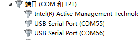

这会导致IDE无法连接设备进行调试，需要把其中一个Dial RS232-HS，解决方法如下：

1. 从<https://sourceforge.net/projects/libusbk/>下载libusbk
2. 安装libusbk
3. 在安装目录下找到libusbK-inf-wizard.exe，运行。
4. 选择安装的libusbk，下一步

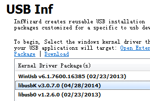

5. 选中Show All Device，可以看到三个Dual RS232-HS。 第一个是父节点， 第二和第三个是两个子节点。如果选中父节点， 则生成的驱动会应用到父节点上。 如果选中某个子节点， 则生成的驱动只应用到相应的子节点上。 HiFive1的第一个FTDI口用作JTAG， 第二个FTDI口作UART。 所以生成驱动时，选择第一个子节点就可以。
6. 运行生成目录Dual_RS232-HS_Interface_0下的InstallDriver.exe
7. 最后可以在设备管理器上查找到对应的设备，如下：

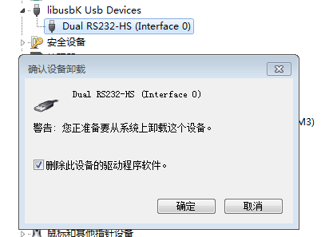

至此，驱动安装完成。

### 基于IDE的工程建立与调试

1.File->New->Project->C Project

2.点开C Project，选择SiFive C/C++ Project，Project name输入工程名，如hello_fifive：

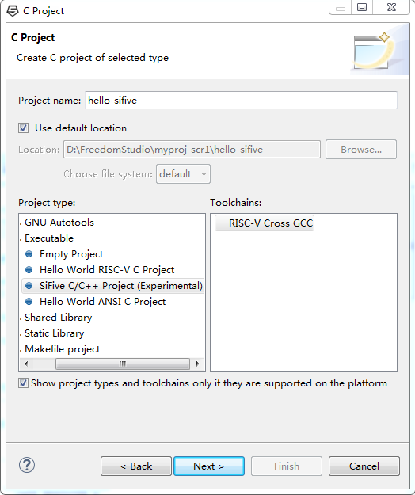

3.点击next

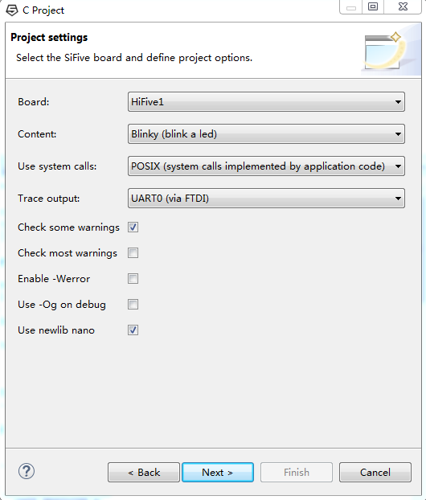

4.后续都采用默认操作，点击next，最后点击finish。

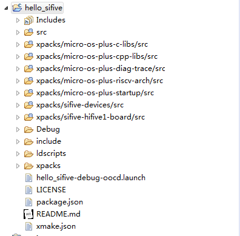

5.点击hello_sifive，右键点击build project，编译工程。

6.调试：连接板子，点击hello_sifive，右键点击Debug configurations

7.点击debug，调试工程。

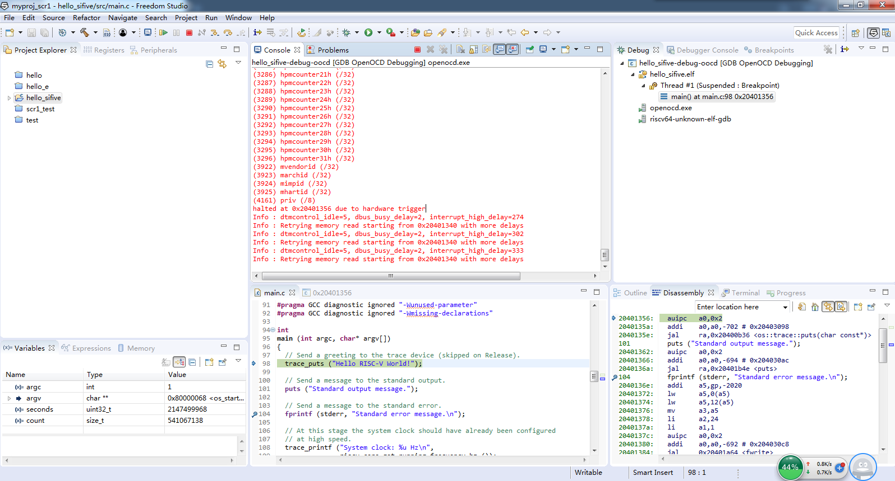

## SCR1调试

### 安装调试器驱动

参考安装HIFIVE1上的FTDI驱动章节安装驱动。

### 基于FreedomStudio IDE的工程建立与调试

1.File->New->Project->C Project，Project name输入hello_scr1，选择Hello World RISC-V C Project

2.一直点击next，finish

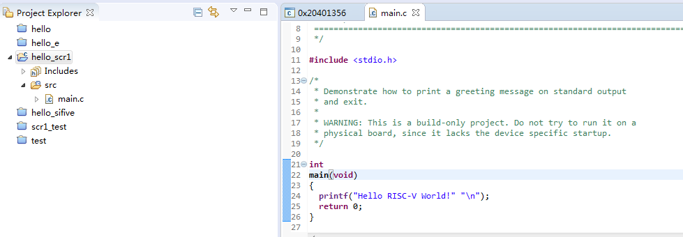

3.拷贝hello_ncore内的include与lib文件夹到工程目录src下，然后点击右键Refresh

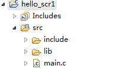

4.点击工程名右键Properties，选择C/C++ Build->Settings，如下配置Target Processor

5.选择GNU RISC-V Cross C Compiler->Includes，配置如下

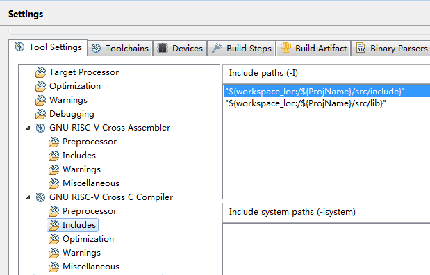

6.选择GNU RISC-V Cross C Linker->General，配置如下

7.选择GNU RISC-V Cross C Linker->Miscellaneous

8.将main.c中的printf改为sc_printf, 同时添加**#include** "sc_print.h"，编译成功。

9.调试：连接板子，点击hello_scr1，右键点击Debug configurations

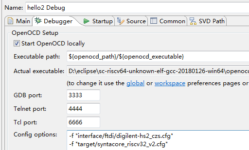

如果连接错误，可以尝试使用绝对路径，配置如下：

10.Debug
