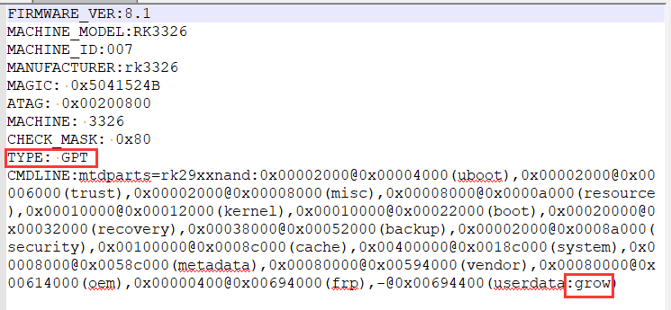

# **Rockchip Parameter File Format**

发布版本:1.4

作者邮箱:zyf@rock-chips.com

发布日期:2018.1

文件密级：公开资料

**产品版本**

| **芯片名称** | **SDK版本** |
| -------- | -------- |
| 全系列      | 全部版本     |

**读者对象**

本文档（本指南）主要适用于以下工程师：

技术支持工程师

软件开发工程师

**修订记录**

| 版本          | 日期         | 描述          | 作者   | 审核   |
| ------- | ---------- | --------------- | ---- | ---- |
| Ver 1.0 | 2011-4-11  | parameter文件说明   | 赵仪峰  |      |
| Ver 1.1 | 2011-9-5   | 完善功能文档          | 赵仪峰  |      |
| Ver 1.2 | 2012-10-16 | 增加RK30和RK292X配置 | 赵仪峰  |      |
| Ver 1.3 | 2013-4-15  | 增加gpio控制定义配置等   | 赵仪峰  |      |
| Ver 1.4 | 2018-1-23  | 删除过时内容，增加GPT等   | 赵仪峰  |      |

---
[TOC]
---

## 1.  概述

Rockchip android系统平台使用parameter文件来配置一些系统参数，比如固件版本，存储器分区信息等。

Parameter文件是非常重要的系统配置文件，最好在能了解清楚各个配置功能时再做修改，避免出现parameter文件配置异常造成系统不能正常工作的问题。

Parameter文件大小有限制，最大不能超过64KB。

## 2.  Parameter文件预览：

下面两个图片分别是GPT和传统分区的parameter文件的内容，不同的项目，不同的平台，parameter文件的内容会有一些差异。下面以RK3326平台的使用参考parameter文件定义来说明每一项的内容：

图一：GPT分区模式

图二：传统cmdline分区模式

## 3.   文件内容说明

### 3.1.  FIRMWARE_VER:8.1

​固件版本，打包updata.img时会使用到，升级工具会根据这个识别固件版本。

### 3.2.  MACHINE_MODEL:RK3326

机器型号，打包updata.img使用，不同的项目，可以自己修改，用于升级工具显示。在recovery里面升级固件时可以用于判断固件是否匹配

### 3.3.  MACHINE_ID:007

产品开发ID，可以为字符和数字组合，打包updata.img使用，不同的项目使用不同的ID，可以用于识别机器机型。在recovery里面升级固件时可以用于判断固件是否匹配。

### 3.4.  MANUFACTURER: rk3326

​厂商信息，打包updata.img使用，可以自己修改，用于升级工具显示。

### 3.5.  MAGIC: 0x5041524B

​魔数MAGIC，不能修改，一些新的AP使用DTS，这一项没有用，为了兼容，不要删除或修改。

### 3.6.  ATAG: 0x60000800

ATAG，不能修改，一些新的AP使用DTS，这一项没有用，为了兼容，不要删除或修改。

### 3.7.  MACHINE: 3226

​内核识别用，不能修改，这个定义和内核匹配。

​RK29xx识别码：MACHINE: 2929

​RK292x识别码：MACHINE: 2928

​RK3066识别码：MACHINE: 3066

​RK3326识别码：MACHINE: 3326

### 3.8.  CHECK_MASK: 0x80

​保留，不能修改。

### 3.9.  TYPE: GPT

​指定该文件CMDLINE里面定义的分区用于创建GPT使用，不会烧录到NVM（NAND，EMMC等）存储器件里面。

### 3.10.  CMDLINE：

​console=ttyFIQ0 androidboot.console=ttyFIQ0，串口定义。

​initrd=0x62000000,0x00800000，第一个参数是boot.img加载到sdram的位置，第二个参数为ramdisk的大小，目前ramdisk大小没有限制。

​androidboot.xxx的定义在android启动时使用，有些平台会在kernel的dts里面定义，这部分定义一般不用修改，只用用发布SDK默认的就可以了。

​MTD分区定义说明：

mtdparts=rk29xxnand:0x00002000@0x00002000(uboot),0x00002000@0x00004000(trust),0x00002000@0x00006000(misc),
0x00008000@0x00008000(resource),0x00010000@0x00010000(kernel),0x00010000@0x00020000(boot),0x00020000@0x00030000(recovery),
0x00038000@0x00050000(backup),0x00002000@0x00088000(security),0x00100000@0x0008a000(cache),0x00400000@0x0018a000(system),
0x00008000@0x0058a000(metadata),0x00080000@0x00592000(vendor),0x00080000@0x00612000(oem),0x00000400@0x00692000(frp),-@0x00692400(userdata)

分区定义说明：

1、为了兼容性，目前RK所有AP都是用rk29xxnand做标识。

2、单个分区说明：

例如：0x00002000@0x00008000(boot)，@符号之前的数值是分区大小，@符号之后的数值是分区的起始位置，括号里面的字符是分区的名字。所有数值的单位是sector，1个sector为512Bytes.上例中，boot分区起始位置为0x8000 sectors位置，大小为0x2000 sectors(4MB).

3、为了性能，每个分区起始地址需要32KB（64 sectors）对齐，大小也需要32KB的整数倍。

4、如果使用sparse格式的镜像，升级时会擦除数据，为了兼容性更好，对应的分区最好按4MB对齐，大小也按4MB整数倍配置。

5、使用GPT分区时，parameter里面定义的地址，都是真实的逻辑地址（LBA），例如uboot定义在0x4000，那么烧录到EMMC和NAND里面时，逻辑地址也是0x4000.

| 名称     | Parameter定义地址 | EMMC逻辑地址 | NAND逻辑地址 | 大小       |
| ------ | ------------- | -------- | -------- | -------- |
| GPT    | --            | 0        | 0        | 32KB     |
| LOADER | --            | 0x40     | 0x40     | 4MB-32KB |
| 保留     | --            | 0x2000   | 0x2000   | 4MB      |
| UBOOT  | 0x4000        | 0x4000   | 0x4000   | 4MB      |
| TRUST  | 0x6000        | 0x6000   | 0x6000   | 4MB      |

最后一个分区需要指定grow参数，工具会把剩余的空间都分配给最后一个分区。

6、使用传统cmdline分区时，如果是EMMC颗粒，0-4MB的空间是保留存放loader的，parameter里面定义的分区都需要加上4MB，例如uboot定义在0x2000，实际烧录到EMMC里面时，和使用GPT分区时烧录的逻辑地址是一样的，也是0x4000。如果是NAND颗粒，为了和原来产品兼容，所有地址都是真实逻辑地址，例如uboot定义在0x2000，实际烧录到NAND里面是，逻辑地址也是0x2000，和使用GPT时不一样。

| 名称        | Parameter定义地址 | EMMC逻辑地址 | NAND逻辑地址 | 大小       |
| --------- | ------------- | -------- | -------- | -------- |
| 保留        | --            | 0        | 0        | 32KB     |
| LOADER    | --            | 0x40     | 0x40     | 4MB-32KB |
| parameter | --            | 0x2000   | 0x0      | 4MB      |
| UBOOT     | 0x2000        | 0x4000   | 0x2000   | 4MB      |
| TRUST     | 0x4000        | 0x6000   | 0x4000   | 4MB      |

​注：NAND FLASH的机器，0x40有可能会写loader的镜像，和parameter在同一个4MB空间内，有效的数据是相互错开存放的，不会覆盖。

