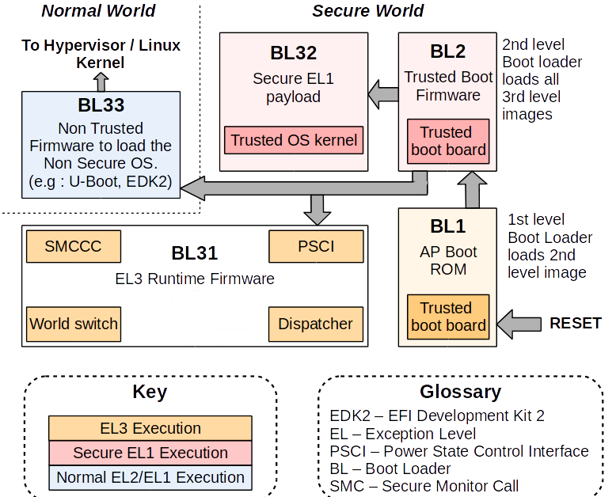

# Trust Developer Guide

Release version：1.1

Author email：chenjh@rock-chips.com

Date：2019.11

Security Class: Public

---

**Preface**

**Overview**

Trust is one of firmware in Rockchip SDK, since it is related to security and confidentiality, the source code is only open to some internal engineers (the basic functions of RK322x/RK3328/RK3368/RK3399/PX30, etc platform have been open source [0]). This document only provides an brief description of Trust (take 64-bit platform as an example), intended to give readers an idea of its role and functions in the overall system architecture. At the same time, it guides readers how to collect and feedback issues when have problems in practice.

**Applicable object**

This document or this guide is mainly suitable for the following engineers：

* Field application engineers

* Software development engineers

**Product version**

| **Chipset model**                                            | **Kernel version** |
| ------------------------------------------------------------ | :----------------- |
| RK3036/RK3126C/RK3288/RK322X/RK3368/RK3328/RK3399/PX30/RK3308 | 3.10、4.4、4.19    |

**Revision history**

| **Date**   | **Version** | **Author**    | **Revision Description**            |
| ---------- | ----------- | ------------- | ----------------------------------- |
| 2017-12-30 | V1.0        | Jianhong Chen | Initial Release                     |
| 2019-11-11 | V1.1        | Jianhong Chen | Update the chip/kernel support list |

---
[TOC]
---

## ARM TrustZone

ARM TrustZone [1] technology is a basic feature of all Cortex-A class processors and is introduced through the ARM architecture security extension. These extensions provide a consistent programmer model across vendors, platforms, and applications while providing a security environment with real hardware support.

ARM TrustZone technology is a system-wide security approach, for a wide range of applications on high-performance computing platforms, including security payments, digital rights management (DRM), enterprise services, and web-based services. TrustZone technology is tightly integrated with Cortex-A processor and extend through AMBA AXI bus and specific TrustZone system IP blocks, so ARM TrustZone technology is a security mechanism provided at hardware level. This system approach means protecting peripherals such as security memory, encryption blocks, keyboards, and screens to protect them from software attacks.

 ARM Trusted Firmware and OP-TEE OS [2] are currently used in ARM open source projects of ARM TrustZone technology, they are the underlying firmware open source projects for ARM chips, which can be used together or use alone.

### System architecture

From system architecture perspective, the following is a 64-bit platform system architecture diagram with ARM TrustZone technology enabled. The system is divided into two worlds: the non- secure world on the left and the secure world on the right. The secure world can access all the resources of the two worlds. The non- secure world can only access the resources of the non- secure world. If the non-secure world accesses the resources of the secure world, an exception such as system hardware bus error will occur, and resources cannot be obtained.

The interaction between these two worlds needs to use ARM Trusted Firmware as a bridge. When CPU is in the non- secure world, if it want to enter the secure world, firstly, you need to enter ARM Trusted Firmware (SMC instructions of ARM). Then, the Secure Monitor code in ARM Trusted Firmware will switch the CPU from non-secure identity to secure identity. And then enter the secure world as a secure identity. vice versa. This is a complete transition from secure identity to non-secure identity at hardware level.

Rockchip Trust can be understood as a collection of features of ARM Trusted Firmware + OP-TEE OS, which implements functionalities we need in the secure world and functionalities of Secure Monitor (the core code for two world transition).


### CPU privilege level

From the CPU perspective, the following is a standard CPU privilege mode level architecture diagram with ARM TrustZone enabled. If it is a 64-bit CPU, its privilege level is divided into EL0, EL1, EL2, EL3, which is divided into secure EL0, secure EL1 or non-secure EL0, non-secure EL1 according to the world in which the CPU is located. If it is a 32-bit CPU, its privilege level is divided into Mon, Hyp, SVC, ABT, IRQ, FIQ, UND, SYS, USER mode, of which SVC, ABT, IRQ, FIQ, UND, SYS, USER are also like 64 bits, there are security and non-security modes difference.

Rockchip Trust can be understood as features collection of EL3 + Secure EL1.


## Trust on Rockchip platform

### Implementation Mechanism

Currently, the combination of ARM Trusted Firmware + OP-TEE OS is used on 64-bit SoC platform of Rockchip platform; the OP-TEE OS is used on 32-bit SoC platform.

### Boot-up process

The ARM Trusted Firmware architecture divides the whole system into four secure levels: EL0, EL1, EL2, and EL3. The process phase of the entire secure boot is defined as: BL1, BL2, BL31, BL32, BL33, and the functions of BL1, BL2, and BL31 are provided in the source code of ARM Trusted Firmware itself. The Rockchip platform only uses the functions of BL31. BL1 and BL2 have their own implementations method. So on the Rockchip platform we can also generally "default" ARM Trusted Firmware refers to BL31, while BL32 uses OP-TEE OS.

If the above phase definition is mapped to Rockchip platform firmware, the corresponding relationship are: Maskrom (BL1), Loader (BL2), Trust (BL31: ARM Trusted Firmware + BL32: OP-TEE OS), U-Boot (BL33).

Android system boot-up sequence:

```
Maskrom -> Loader -> Trust -> U-Boot -> kernel -> Android
```



### Firmware obtain

Currently only binary files are provided, and source code is not provided. Binary files of Trust are submitted in the U-Boot project.

```
./tools/rk_tools/bin/rk30/
./tools/rk_tools/bin/rk31/
./tools/rk_tools/bin/rk32/
./tools/rk_tools/bin/rk33/
```

When compiling uboot.img of a certain platform, the "trust.img" of the corresponding platform will also be packaged and generated in the root directory of U-Boot. When binaries are packaged into "trust.img", it is indexed through the ini file which is located in the U-Boot project:

```
tools/rk_tools/RKTRUST/
```

Note: Developers can download the individual rkbin repository which contains the binaries of all platforms.

### Enable DTS

#### Kernel 3.10

##### bit platform

（1）Add psci node

```c
psci {
	compatible      = "arm,psci";
	method          = "smc";
	cpu_suspend     = <0x84000001>;
	cpu_off         = <0x84000002>;
	cpu_on          = <0x84000003>;
	affinity_info   = <0x84000004>;
};
```

（2）Add in the chosen node or in the parameter: psci=enable

```c
chosen {
	bootargs = "psci=enable vmalloc=496M cma=4M rockchip_jtag";
};
```

##### bit platform

（1）Add psci node：

```c
psci {
        compatible = "arm,psci-0.2";
        method = "smc";
};
```

（2）Inside the cpu node, add: enable-method = "psci";

```c
cpus {
        #address-cells = <2>;
        #size-cells = <0>;

        cpu@0 {
                device_type = "cpu";
                compatible = "arm,cortex-a53", "arm,armv8";
                reg = <0x0 0x0>;
                enable-method = "psci";
                cpu-idle-states = <&CPU_SLEEP>;
        };
        cpu@1 {
                device_type = "cpu";
                compatible = "arm,cortex-a53", "arm,armv8";
                reg = <0x0 0x1>;
                enable-method = "psci";
                cpu-idle-states = <&CPU_SLEEP>;
        };
        cpu@2 {
                device_type = "cpu";
                compatible = "arm,cortex-a53", "arm,armv8";
                reg = <0x0 0x2>;
                enable-method = "psci";
                cpu-idle-states = <&CPU_SLEEP>;
        };
        cpu@3 {
                device_type = "cpu";
                compatible = "arm,cortex-a53", "arm,armv8";
                reg = <0x0 0x3>;
                enable-method = "psci";
                cpu-idle-states = <&CPU_SLEEP>;
        };

		.....
};
```

#### Kernel 4.4+

##### bit platform

Just need to add psci node：

```c
psci {
        compatible = "arm,psci-1.0";
        method = "smc";
};
```

##### bit platform

（1）Add psci node：

```c
psci {
        compatible = "arm,psci-1.0";
        method = "smc";
};
```

（2）Inside the cpu node, add： enable-method = "psci";

```c
cpus {
        #address-cells = <2>;
        #size-cells = <0>;

        cpu@0 {
                device_type = "cpu";
                compatible = "arm,cortex-a53", "arm,armv8";
                reg = <0x0 0x0>;
                enable-method = "psci";
                cpu-idle-states = <&CPU_SLEEP>;
        };
        cpu@1 {
                device_type = "cpu";
                compatible = "arm,cortex-a53", "arm,armv8";
                reg = <0x0 0x1>;
                enable-method = "psci";
                cpu-idle-states = <&CPU_SLEEP>;
        };
        cpu@2 {
                device_type = "cpu";
                compatible = "arm,cortex-a53", "arm,armv8";
                reg = <0x0 0x2>;
                enable-method = "psci";
                cpu-idle-states = <&CPU_SLEEP>;
        };
        cpu@3 {
                device_type = "cpu";
                compatible = "arm,cortex-a53", "arm,armv8";
                reg = <0x0 0x3>;
                enable-method = "psci";
                cpu-idle-states = <&CPU_SLEEP>;
        };

		.....
};
```

#### Kernel Document

The kernel document provides instructions on psci:

```
./Documentation/devicetree/bindings/arm/psci.txt
```

### Running memory and life cycle

#### Running memory

The ARM Trusted Firmware runs in the space where DRAM start offset is 0M~2M, and 0x10000 (64KB) is used as the program entry address.

The OP-TEE OS runs between 132M and 148M of DRAM start offset (the end address depends on the platform requirements) with 0x08400000 (132M) as the entry address.

#### Life cycle

Trust has been resident in memory since it was initialized to complete its mission.

### Security

In the first chapter we introduced that after ARM TrustZone is enabled, the system is divided into a secure world and a non-secure world. So on Rockchip platform, how do you distinguish between which firmware the CPU running is in the secure world or the non-secure world? The method is as follows: Loader and Trust run in the secure world; U-Boot, kernel, and Android run in the non-secure world (except for security drivers and APPs).

### Functions

#### PSCI（Power State Coordination Interface）

Usually, the chips of various SoC vendors have significant differences in IC design, especially the power state management part of CPU. Each SoC vendor has its own set of software processes to manage CPU power state, so this part of code in kernel is fragmented and it is difficult to achieve a high degree of uniformity. Obviously, kernel is very reluctant to maintain the fragmentation status in this respect. Moreover, developers usually are not very concerned about this part of implementation, because this part of the software implementation is closely related to CPU architecture and IC design, it is difficult to fully understand or implement.

For the above reasons, kernel is more inclined to put the power management of CPU into the firmware of each SoC vendor. Kernel only needs to focus on CPU control strategy to make the kernel code more highly unified. Therefore, the kernel framework added PSCI (Power State Coordination Interface) [3] interface to achieve this goal.

PSCI is a set of CPU core power management related interfaces, essentially through ARM SMC instructions into Trust to complete the above related operations: cpu on, cpu off, system suspend, system reset, system off, and so on. mainly includes:

```c
PSCI_VERSION
PSCI_FEATURES
CPU_ON
CPU_OFF
CPU_SUSPEND
SYSTEM_SUSPEND
AFFINITY_INFO
SYSTEM_OFF
SYSTEM_RESET
......
```

4.4+ Kernel related code path

```
./arch/arm/kvm/psci.c
./arch/arm/kernel/smccc-call.S
./arch/arm64/kernel/psci.c
./arch/arm64/kernel/smccc-call.S
./drivers/firmware/psci.c
./drivers/firmware/rockchip_sip.c
```

3.10 Kernel related code path

```
./arch/arm/kernel/psci.c
./arch/arm64/kernel/psci.c
./arch/arm/mach-rockchip/psci.c
```

#### Secure Monitor

Secure Monitor is the bridge between CPU for state transition between the secure world and the non-secure world. The Secure Monitor code is implemented in Trust. Without this part of the code, CPU will not be able to switch between the secure and non-secure state, and ARM TrustZone technology will lose its importance and function.

So how to enter Secure Monitor mode? Need to be implemented by SMC instructions, the following is a clear description in the ARM technical manual:

> The Secure Monitor Call exception is implemented only as part of the Security Extensions. The Secure Monitor Call instruction, SMC, requests a Secure Monitor function, causing the processor to enter Monitor mode.

#### Secure information configuration

In addition to the tight integration of Cortex-A processor itself, ARM TrustZone technology needs to be extended in the system through the AMBA AXI bus and the specific TrustZone system IP block. Therefore, a series of related IP module security information needs to be configured, and they are completed in Trust.

#### Security data protection

Security data protection. For example: storage protection for related security information such as secure payments, digital rights management (DRM), enterprise services, and web-based services.

## Trust troubleshooting on the Rockchip platform

At present, the released firmware is only provided with Trust binary files, and the source code is not provided. Currently, there are few debugging methods for Trust. it usually need to use the special jtag tools for analysis. When have Trust issues, customers generally do not have the ability to debug and solve problems by themselves, so please try to protect the scene when issues occur, collect enough information to feed back to the maintainer responsible for Trust. Therefore, users should generally know which is the print information of Trust, the version number corresponding to Trust, and which is PANIC information of Trust.

### Boot log example

```c
NOTICE:  BL31: v1.3(debug):4c793da
NOTICE:  BL31: Built : 18:13:44, Dec 25 2017
NOTICE:  BL31:Rockchip release version: v1.3
INFO:    ARM GICv2 driver initialized
INFO:    Using opteed sec cpu_context!
INFO:    boot cpu mask: 1
INFO:    plat_rockchip_pmu_init: pd status 0xe
INFO:    BL31: Initializing runtime services
INFO:    BL31: Initializing BL32
INF [0x0] TEE-CORE:init_primary_helper:337: Initializing (1.1.0-127-g27532f4 #54 Mon Dec 18 02:01:14 UTC 2017 aarch64)
INF [0x0] TEE-CORE:init_primary_helper:338: Release version: 1.4
INF [0x0] TEE-CORE:init_teecore:83: teecore inits done
INFO:    BL31: Preparing for EL3 exit to normal world
INFO:    Entry point address = 0x200000
INFO:    SPSR = 0x3c9
```

### Print information identification

Except from the printing information during the boot phase, they are usually during running.

ARM Trusted Firmware print format (without time stamp)

```
INFO: *********
```

OP-TEE OS print format (without time stamp):

```
INF [0x0] TEE-CORE: *********
```

### Firmware version identification

ARM Trusted Firmware version: 4c793da。

```
NOTICE:  BL31: v1.3(debug):4c793da
```

OP-TEE OS version: 27532f4 (ignoring the front g)

```
INF [0x0] TEE-CORE:init_primary_helper:337: Initializing (1.1.0-127-g27532f4 #54 Mon Dec 18 02:01:14 UTC 2017 aarch64)
```

### PANIC information identification

#### ARM Trusted Firmware panic

```c
Unhandled Exception in EL3.
x30 =           0x00000000ff00fff0
x0 =            0x00000000000101c0
x1 =            0x0000000000000000
x2 =            0x0000000000000000
x3 =            0x0000000000000000
x4 =            0x0000000000cd383b
x5 =            0x0000000000080001
x6 =            0x0000000080803520
x7 =            0x00000000000342a0
x8 =            0x00000000000101c0
x9 =            0x0000000000000000
x10 =           0x0000000000000000
x11 =           0x0000000000000000
x12 =           0x0000000000000001
x13 =           0x00000000000101b8
x14 =           0x000000000001a950
x15 =           0x0000000000000000
x16 =           0x00000000000101c0
x17 =           0x0000000000000000
x18 =           0x0000000000000000
x19 =           0x0000000000000000
x20 =           0x0000000040000000
x21 =           0x0000000000000040
x22 =           0x00000000000305b0
x23 =           0x000000000001016c
x24 =           0x00000000000101c0
x25 =           0x0000000000000000
x26 =           0x0000000000000000
x27 =           0x0000000000000000
x28 =           0x0000000000035bf8
x29 =           0x0000000000000000
scr_el3 =       0x00000000000101c0
sctlr_el3 =     0x0000000000000000
cptr_el3 =      0x0000000000000000
tcr_el3 =       0x0000000000000000
daif =          0x0000000000000238
mair_el3 =      0x0000000000cd383b
spsr_el3 =      0x0000000000000000
elr_el3 =       0x0000000080803520
ttbr0_el3 =     0x00000000000101c0
esr_el3 =       0x0000000000000000
far_el3 =       0x0000000000000000
spsr_el1 =      0x00000000000101c0
elr_el1 =       0x0000000000000000
spsr_abt =      0x0000000000000000
......
```

#### OP-TEE OS panic

```c
core data-abort at address 0xc121b16c

 fsr 0x00000805  ttbr0 0x6847446a  ttbr1 0x6847006a  cidr 0x2
 cpu #0          cpsr 0x200001d1
 r0 0x20068000      r4 0x68407195    r8 0x00000000   r12 0x00000000
 r1 0x00000049      r5 0x6848068b    r9 0x6840a3bd    sp 0xc121b1a4
 r2 0x6848068c      r6 0x6848068c   r10 0x684808cc    lr 0x684296a6
 r3 0x0000001f      r7 0x00000001   r11 0x68404f9d    pc 0x6840041c

ERR [0x0] TEE-CORE:tee_pager_handle_fault:125: Unexpected page fault! Trap CPU
PANIC: tee_pager_handle_fault core/arch/arm/include/mm/tee_pager.h:126
```

## Appendix Reference

[0] Open source code download address：

​	ARM Trusted Firmware：<https://github.com/ARM-software/arm-trusted-firmware>
​	OP-TEE OS：<https://github.com/OP-TEE/optee_os>
[1] ARM TrustZone：

​	<https://www.arm.com/products/security-on-arm/trustzone>
​	<https://developer.arm.com/technologies/trustzone>
[2] op-tee official website：<https://www.op-tee.org/>
[3] PSCI：<http://infocenter.arm.com/help/topic/com.arm.doc.den0022c/DEN0022C_Power_State_Coordination_Interface.pdf "Power State Coordination Interface PDD (ARM DEN 0022C)>"