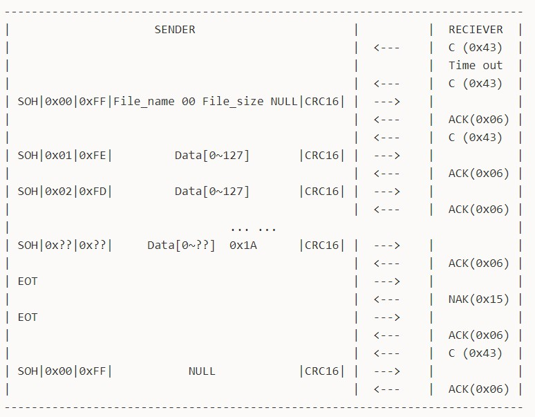
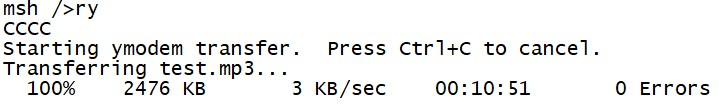
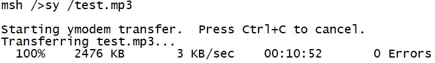

# Ymodem开发指南

文件标识：RK-KF-YF-076

发布版本：V1.0.0

日期：2019-12-20

文件密级：公开资料

---

**免责声明**

本文档按“现状”提供，福州瑞芯微电子股份有限公司（“本公司”，下同）不对本文档的任何陈述、信息和内容的准确性、可靠性、完整性、适销性、特定目的性和非侵权性提供任何明示或暗示的声明或保证。本文档仅作为使用指导的参考。

由于产品版本升级或其他原因，本文档将可能在未经任何通知的情况下，不定期进行更新或修改。

**商标声明**

“Rockchip”、“瑞芯微”、“瑞芯”均为本公司的注册商标，归本公司所有。

本文档可能提及的其他所有注册商标或商标，由其各自拥有者所有。

**版权所有© 2019福州瑞芯微电子股份有限公司**

超越合理使用范畴，非经本公司书面许可，任何单位和个人不得擅自摘抄、复制本文档内容的部分或全部，并不得以任何形式传播。

福州瑞芯微电子股份有限公司

Fuzhou Rockchip Electronics Co., Ltd.

地址：     福建省福州市铜盘路软件园A区18号

网址：     [www.rock-chips.com](http://www.rock-chips.com)

客户服务电话： +86-4007-700-590

客户服务传真： +86-591-83951833

客户服务邮箱： [fae@rock-chips.com](mailto:fae@rock-chips.com)

---

**前言**

**概述**

**产品版本**

| **芯片名称** | **内核版本**    |
| ----------- | --------------- |
|   通用   |   通用   |

**读者对象**

本文档（本指南）主要适用于以下工程师：

技术支持工程师
软件开发工程师

---

**修订记录**

| **版本号** | **作者** | **修改日期** | **修改说明** |
| ---------- | --------| :--------- | ------------ |
| V1.0.0    | 刘诗舫 | 2019-12-20 | 初始版本  |

**目录**

---

[TOC]

---

## 1 基本原理

Ymodem是一种使用串口进行文件传输的协议，由Xmodem演变而来。Ymodem协议数据块通常有128-byte和1024-byte两种，对应的数据包大小有133-byte和1029-byte两种。Ymodem协议采用CRC16校验，校验失败直接结束传输流程。Chuck Forsberg在设计Ymodem协议时考虑增加多项可选的特性，包括数据包大小、校验方式、出错重发机制等。但也正因为这种没有严格规定协议标准的做法，导致Ymodem出现很多亚种。目前很多软件的Ymodem协议可能不兼容。RT-Thread中的Ymodem协议主要兼容SecureCRT软件实现。Ymodem协议通讯流程如图所示，分为接收端和发送端，整个传输过程有三个阶段：握手阶段、传输阶段、结束阶段。



### 1.1 握手阶段

接收端每隔一段时间（这里设为1s）发送请求字符C（0x43），发送端收到请求后发送数据包`SOH|0x00|0xFF|File_name 00 File_size NULL|CRC16|`，这里的SOH（0x01）为128-byte数据块的数据包头，如果使用1024-byte数据块则需要将数据包头改为STX（0x02）。0x00为数据包序号，0xFF为数据包序号的反码，File_name将会是接收端生成文件的文件名，File_size将会是接收端生成文件准备的存储区域大小。需要注意的是Ymodem协议中File_size通常为文件大小（单位为byte）的十六进制ASCII码，而实际上SecureCRT软件中的File_size为文件大小（单位为byte）的十进制ASCII码。数据包最后两位为CRC16校验码。接收端收到数据包后发送应答字符ACK（0x06），再发送请求字符C（0x43）正式开始文件传输。

握手阶段开始时，如果接收端发送请求字符C（0x43）一直没有收到发送端的数据包，则接收端在多次请求失败（这里设为10次）将会超时退出。

### 1.2 传输阶段

发送端发送数据包`SOH|0x01|0xFE| Data[0~127] |CRC16|`，接收端收到数据包后发送应答字符ACK（0x06），发送端继续发送下一个数据包。注意，在SecureCRT软件中的Ymodem协议并没有接收端接收数据包错误后发送NAK（0x15）请求重发的机制，而是在出现错误后直接退出传输流程。但经过测试（测试方案参考应用指南中相关内容），文件大小超过5M，在115200串口波特率的传输条件下，Ymodem协议没有出现过一次错误。文件传输即将结束时，发送端发送最后一个数据包`SOH|0x??|0x??| Data[0~??]  0x1A |CRC16|`。数据块不足128-byte的部分用0x1A补全，0x1A是为了模拟文件结束操作Ctrl+Z。因此，如果发现通过Ymodem协议传输后的文件末尾出现多个0x1A，这是正常现象，不影响文件特性和文件使用。在文件传输阶段，发送端主动发送字符CAN（0x18）可以结束传输，或是在终端软件中使用Ctrl+C主动结束传输。

### 1.3 结束阶段

发送端发送结束字符EOT（0x04），接收端发送错误应答字符NAK（0x15）请求再次确认结束，发送端再次发送结束字符EOT（0x04），接收端发送应答字符ACK（0x06）结束当前文件的传输。接收端发送请求字符C（0x43）请求发送下一个文件，如果发送端没有文件发送，则发送空的数据包`SOH|0x00|0xFF| NULL |CRC16|`，接收端收到后发送应答字符ACK（0x06）。至此，一次Ymodem文件传输结束。

## 2 应用指南

### 2.1 Ymodem配置

Ymodem包括协议层代码和应用示例代码。代码在`/components/utilities/ymodem`路径下，ymodem.c和ymodem.h为协议层代码，ry_sy.c为收发文件的应用示例代码。

使用`scons --menuconfig`在Utilities工具选择列表下启用Ymodem功能。Ymodem在RT-Thread中常用于其他厂商的OTA在线升级，这不需要对DFS文件系统产生依赖。但Rockchip使用Ymodem协议主要用于收发文件，ry_sy.c应用示例代码需要读写DFS文件系统。因此，启用文件传输特性就可以使用ry_sy指令进行文件收发。CRC Table作为可选配置，如果启用此选项，Ymodem协议CRC校验将使用查表法，这种方法相比于直接计算CRC的方法理论上更快，实际上在128-byte数据块、波特率115200的传输环境下不会有显著提升。不启用此选项将会节省存储空间。完成所有配置后下载编译的固件，就可以通过串口使用Ymodem协议进行文件收发了。

```
RT-Thread Components --->
            Utilities --->
                [*] Enable Ymodem
                    [ ] Enable CRC Table in Ymodem
                    [*] Enable file transfer feature
```

### 2.2 接收文件功能使用

使用Ymodem接收文件，默认使用Console控制台，可以通过指令参数使用任意uart设备。在Console控制台输入指令`ry`，可以看到控制台出现请求字符C等待上位机发送文件，点击SecureCRT工具栏Transfer，点击Send Ymodem即可选择文件进行发送。接收文件过程中控制台将会打印进度。整个操作流程如图所示。选择任意uart设备，例如输入指令`ry uart2`即可在uart2设备上进行相应操作。**特别注意，文件传输过程中会临时禁止向串口打印任何内容。**



接收文件默认保存在根目录下，用户可以通过修改ry_sy.c代码中的`_rym_recv_begin`函数修改接收文件保存路径`fpath`。

### 2.3 发送文件功能使用

使用Ymodem发送文件，默认使用Console控制台，可以通过指令参数使用任意uart设备。在Console控制台输入指令`sy file_path`，可以看到控制台等待上位机接收文件，点击SecureCRT工具栏Transfer，点击Receive Ymodem即可开始上位机文件接收。发送文件过程中控制台将会打印进度。整个操作流程如图所示。选择任意uart设备，例如输入指令`sy file_path uart2`即可在uart2设备上进行相应操作。**特别注意，文件传输过程中会临时禁止向串口打印任何内容。**



发送文件的文件路径请使用绝对路径，暂不支持相对路径。接收端生成的新文件的名字会包含整个文件路径，用户可以通过修改ry_sy.c代码中的`_rym_send_begin`函数解析文件路径，从而实现接收端文件名不包含文件路径。

## 3 优化方向

目前Ymodem协议部分和应用示例部分代码已完成Upstream，成功Merge RT-Thread主分支，如图。进一步开发将对Ymodem进行以下几个方面的优化：

1. Ymodem协议支持发送1024-byte数据块的数据包。
2. 目前串口波特率为115200，传输速率稳定在4kB/s左右。提高波特率至1.5M及以上在文件传输过程中会出现错误。
3. 波特率为115200时理论极限速率在11kB/s，实际极限速率在8kB/s，协议开销较大。
4. Ymodem协议支持更多终端软件。


