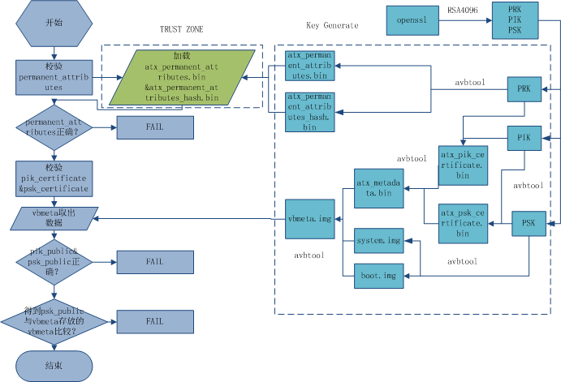

# AVB keys生成指南

发布版本：1.0

作者邮箱：jason.zhu@rock-chips.com

日期：2018.03

文件密级：内部资料

------

**前言**

**概述**

​	该文档基于谷歌avb 2.0编写，并对有关avb keys如何生成做详细描述。谷歌未公开如何生成，所以内部保密，不得对外公开。

**读者对象**

本文档（本指南）主要适用于以下工程师：

技术支持工程师

软件开发工程师

**产品版本**

**修订记录**

| **日期**     | **版本** | **作者**    | **修改说明** |
| ---------- | ------ | --------- | -------- |
| 2018-03-12 | V1.0   | Jason Zhu | 初始版本     |

------

[TOC]

------

## avb keys概述

​	谷歌定义的avb需要用到的keys定义如下：

​	1. Product RootKey (PRK)：所有的key校验或派生都依据此key，谷歌提供保管。如果只用到avb，而没有用到需要谷歌认证的服务，可以由厂商自己生成。

​	2. ProductIntermediate Key (PIK)：中间key，中介作用，谷歌提供保管。如果只用到avb，而没有用到需要谷歌认证的服务，可以由厂商自己生成。

​	3. ProductSigning Key (PSK)：用于签固件的key，谷歌提供保管。如果只用到avb，而没有用到需要谷歌认证的服务，可以由厂商自己生成。

## ATX permanent attributes及vbmeta生成

​	ATX：Android Things Extension for validating public key metadata。

​	ATX permanent attributes保存设备的device id及Product RootKey (PRK)的公钥。

​	vbmeta保存ProductIntermediate Key (PIK)证书，ProductSigning Key (PSK)证书。

​	工具avbtool见android工程下的external\avb\avbtool。

​	三把keys及证书生成。

```
    openssl genpkey -algorithm RSA -pkeyopt rsa_keygen_bits:4096 -outform PEM -out testkey_atx_prk.pem

    openssl genpkey -algorithm RSA -pkeyopt rsa_keygen_bits:4096 -outform PEM -out testkey_atx_psk.pem

    openssl genpkey -algorithm RSA -pkeyopt rsa_keygen_bits:4096 -outform PEM -out testkey_atx_pik.pem

    python avbtool make_atx_certificate --output=atx_pik_certificate.bin --subject=temp.bin --subject_key=testkey_atx_pik.pem --subject_is_intermediate_authority --subject_key_version 42 --authority_key=testkey_atx_prk.pem

    python avbtool make_atx_certificate --output=atx_psk_certificate.bin --subject=atx_product_id.bin --subject_key=testkey_atx_psk.pem --subject_key_version 42 --authority_key=testkey_atx_pik.pem

    python avbtool make_atx_metadata --output=atx_metadata.bin --intermediate_key_certificate=atx_pik_certificate.bin --product_key_certificate=atx_psk_certificate.bin
```

​	其中temp.bin需要自己创建的临时文件，新建temp.bin即可，无需填写数据。

​	atx_permanent_attributes.bin生成：

```
    python avbtool make_atx_permanent_attributes --output=atx_permanent_attributes.bin --product_id=atx_product_id.bin --root_authority_key=testkey_atx_prk.pem
```

​	其中atx_product_id.bin需要自己定义，占16字节，可作为产品ID定义。

​	生成vbmeta包含atx_metadata.bin，命令示例如下：

```
    python avbtool make_vbmeta_image --public_key_metadata atx_metadata.bin --include_descriptors_from_image boot.img --include_descriptors_from_image system.img --generate_dm_verity_cmdline_from_hashtree system.img --algorithm SHA256_RSA4096 --key testkey_atx_psk.pem  --output vbmeta.img
```

​	最终烧写生成的vbmeta烧写到对应的分区，如vbmeta_a分区。

​	生成的atx_permanent_attributes.bin通过fastboot命令烧写：

```
    fastboot stage atx_permanent_attributes.bin
    fastboot oem fuse at-perm-attr
```

​	上位机通过fastboot与loader通信，loader将获得的atx_permanent_attributes.bin通过Tust OS存放于eMMC的RPMB，并计算其hash值（算法为sha256），通过Tust OS烧写到efuse或OTP。

## 校验流程

