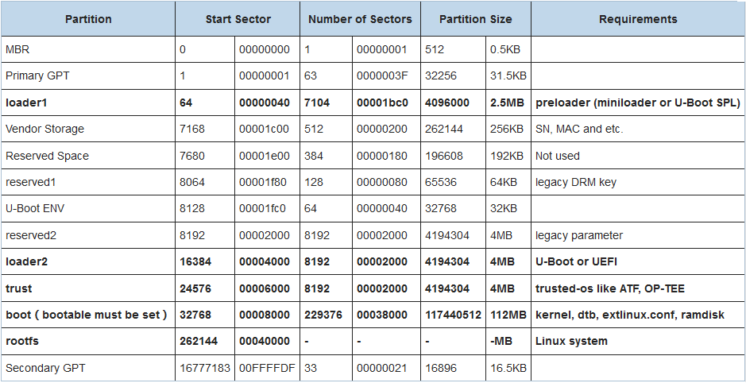

[TOC]

# RK架构

本章主要向用户介绍RK 平台上一些重要的基础情况、feature等。

## 平台文件

平台目录：

```
./arch/arm/include/asm/arch-rockchip/
./arch/arm/mach-rockchip/
./board/rockchip/
./include/configs/
```

defconfig目录：

```
./configs/
```

核心公共板级文件！

```
./arch/arm/mach-rockchip/board.c
```

## 平台配置

**配置文件**

各平台的配置选项、参数通常位于如下几个位置：

```c
// 各平台公共文件（开发者通常不需要修改）
./arch/arm/mach-rockchip/Kconfig
./include/configs/rockchip-common.h

// 各平台独有，以RK3399为例
./include/configs/rk3399_common.h
./include/configs/evb_rk3399.h
./configs/rk3399_defconfig
```

**配置说明**：

如下针对 rockchip-common.h、rkxxx_common.h、evb_rkxxx.h 定义的重要配置给出说明。

- RKIMG_DET_BOOTDEV：存储类型探测命令，以逐个扫描的方式探测当前的存储设备类型；
- RKIMG_BOOTCOMMAND：kernel 启动命令；
- ENV_MEM_LAYOUT_SETTINGS：固件加载地址，包括 ramdisk/fdt/kernel；
- PARTS_DEFAULT：默认的 GPT 分区表，在某些情况下，当存储中没有发现有效的 GPT 分区表时被使用；
- ROCKCHIP_DEVICE_SETTINGS：外设相关命令，主要是指定 stdio（一般会包含显示模块启动命令）；
- BOOTENV：distro 方式启动 linux 时的启动设备探测命令；
- CONFIG_SYS_MALLOC_LEN：malloc 内存池大小；
- CONFIG_SYS_TEXT_BASE：U-Boot 运行的起始地址；
- CONFIG_BOOTCOMMAND：启动命令，一般定义为 RKIMG_BOOTCOMMAND；
- CONFIG_PREBOOT：预启动命令，在 CONFIG_BOOTCOMMAND 前被执行；
- CONFIG_SYS_MMC_ENV_DEV：MMC 作为 ENV 存储介质时的 dev num，一般是 0；

如下以 RK3399 为例进行说明：

./include/configs/rockchip-common.h：

```c
......
#define RKIMG_DET_BOOTDEV \                           // 动态探测当前的存储类型
	"rkimg_bootdev=" \
	"if mmc dev 1 && rkimgtest mmc 1; then " \
		"setenv devtype mmc; setenv devnum 1; echo Boot from SDcard;" \
	"elif mmc dev 0; then " \
		"setenv devtype mmc; setenv devnum 0;" \
	"elif rknand dev 0; then " \
		"setenv devtype rknand; setenv devnum 0;" \
        "elif rksfc dev 0; then " \
                "setenv devtype rksfc; setenv devnum 0;" \
	"fi; \0"

#define RKIMG_BOOTCOMMAND \
	"boot_android ${devtype} ${devnum};" \           // 启动android格式固件
	"bootrkp;" \                                     // 启动RK格式固件
	"run distro_bootcmd;"                            // 启动linux固件
......
```

./include/configs/rk3399_common.h：

```c
......
#ifndef CONFIG_SPL_BUILD
#define ENV_MEM_LAYOUT_SETTINGS \        // 固件的加载地址
	"scriptaddr=0x00500000\0" \
	"pxefile_addr_r=0x00600000\0" \
	"fdt_addr_r=0x01f00000\0" \
	"kernel_addr_r=0x02080000\0" \
	"ramdisk_addr_r=0x0a200000\0"

#include <config_distro_bootcmd.h>
#define CONFIG_EXTRA_ENV_SETTINGS \
	ENV_MEM_LAYOUT_SETTINGS \
	"partitions=" PARTS_DEFAULT \        // 默认的GPT分区表
	ROCKCHIP_DEVICE_SETTINGS \
	RKIMG_DET_BOOTDEV \
	BOOTENV                              // 启动linux时的启动设备探测命令
#endif

#define CONFIG_PREBOOT                   // 在CONFIG_BOOTCOMMAND之前被执行的预启动命令
......
```

./include/configs/evb_rk3399.h：

```c
......
#ifndef CONFIG_SPL_BUILD
#undef CONFIG_BOOTCOMMAND
#define CONFIG_BOOTCOMMAND RKIMG_BOOTCOMMAND // 定义启动命令（设置为RKIMG_BOOTCOMMAND）
#endif
......
#define ROCKCHIP_DEVICE_SETTINGS \           // 使能显示模块
		"stdout=serial,vidconsole\0" \
		"stderr=serial,vidconsole\0"
......
```

## 启动流程

RK平台的U-Boot 启动流程如下，仅列出一些重要步骤：

```c
start.s
	// 汇编环境
	=> IRQ/FIQ/lowlevel/vbar/errata/cp15/gic   // ARM架构相关的lowlevel初始化
	=> _main
		=> stack                               // 准备好C环境需要的栈
		// 【第一阶段】C环境初始化，发起一系列的函数调用
		=> board_init_f: init_sequence_f[]
			initf_malloc
			arch_cpu_init                      // 【SoC的lowlevel初始化】
			serial_init                        // 串口初始化
			dram_init                          // 【获取ddr容量信息】
			reserve_mmu                        // 从ddr末尾开始往低地址reserve内存
			reserve_video
			reserve_uboot
			reserve_malloc
			reserve_global_data
			reserve_fdt
			reserve_stacks
			dram_init_banksize
			sysmem_init
			setup_reloc                        // 确定U-Boot自身要reloc的地址
		// 汇编环境
		=> relocate_code                       // 汇编实现U-Boot代码的relocation
		// 【第二阶段】C环境初始化，发起一系列的函数调用
		=> board_init_r: init_sequence_r[]
			initr_caches                       // 使能MMU和I/Dcache
			initr_malloc
			bidram_initr
			sysmem_initr
			initr_of_live                      // 初始化of_live
			initr_dm                           // 初始化dm框架
			board_init                         // 【平台初始化，最核心部分】
				board_debug_uart_init          // 串口iomux、clk配置
				init_kernel_dtb                // 【切到kernel dtb】！
				clks_probe                     // 初始化系统频率
				regulators_enable_boot_on      // 初始化系统电源
				io_domain_init                 // io-domain初始化
				set_armclk_rate                // __weak，ARM提频(平台有需求才实现)
				dvfs_init                      // 宽温芯片的调频调压
				rk_board_init                  // __weak，由各个具体平台进行实现
			console_init_r
			board_late_init                    // 【平台late初始化】
				rockchip_set_ethaddr           // 设置mac地址
				rockchip_set_serialno          // 设置serialno
				setup_boot_mode                // 解析"reboot xxx"命令、
				                               // 识别按键和loader烧写模式、recovery
				charge_display                 // U-Boot充电
				rockchip_show_logo             // 显示开机logo
				soc_clk_dump                   // 打印clk tree
				rk_board_late_init             // __weak，由各个具体平台进行实现
			run_main_loop                      // 【进入命令行模式，或执行启动命令】
```

## 内存布局

U-Boot 由前级 Loader 加载到 `CONFIG_SYS_TEXT_BASE` 地址，初始化时会探明当前系统的总内存容量，32位平台上认为最大4GB可用（但是不影响内核对容量的识别），64位平台上认为所有内存都可用。然后通过一系列reserve_xxx() 接口从内存末尾往前预留需要的内存，最后把自己relocate到某段reserve的空间上。内存整体使用布局如下，以ARM64为例（常规情况）：

| Name      | Start Addr Offset | Size                  | Usage                | Secure |
| --------- | :---------------- | :-------------------- | :------------------- | ------ |
| ATF       | 0x00000000        | 1M                    | ARM Trusted Firmware | Yes    |
| SHM       | 0x00100000        | 1M                    | SHM, Pstore          | No     |
| OP-TEE    | 0x08400000        | 2M~30M                | 参考 TEE 开发手册    | Yes    |
| FDT       | fdt_addr_r        | -                     | kernel dtb           | No     |
| KERNEL    | kernel_addr_r     | -                     | kernel 镜像          | No     |
| RAMDISK   | ramdisk_addr_r    | -                     | ramdisk 镜像         | No     |
| ……        | -                 | -                     | -                    | -      |
| FASTBOOT  | -                 | -                     | Fastboot buffer      | No     |
| ……        | -                 | -                     | -                    |        |
| SP        | -                 | -                     | stack                | No     |
| FDT       | -                 | sizeof(dtb)           | U-Boot dtb           | No     |
| GD        | -                 | sizeof(gd)            | -                    | No     |
| Board     | -                 | sizeof(bd_t)          | -                    | No     |
| MALLOC    | -                 | CONFIG_SYS_MALLOC_LEN | 系统的堆空间         | No     |
| U-Boot    | -                 | sizeof(mon)           | u-boot 镜像          | No     |
| Video FB  | -                 | fb size               | 32M                  | No     |
| TLB Table | RAM_TOP-64K       | 32K                   | MMU 页表             | No     |

> 上表中的`Start Addr Offset` 一栏表示基于 DDR base 的地址偏移；
>
> Fastboot地址和大小由配置决定：CONFIG_FASTBOOT_BUF_ADDR，CONFIG_FASTBOOT_BUF_SIZE。

- Video FB/U-Boot/Malloc/Board/Gd/Fdt/Sp 由顶向下根据实际需求大小来分配；
- 64 位平台：ATF 是 ARMv8 必需的，OP-TEE 是可选项；32 位平台：只有 OP-TEE；
- kernel fdt/kernel/ramdisk 是 U-Boot 需要加载的固件地址，由```ENV_MEM_LAYOUT_SETTINGS```定义；
- Fastboot 功能需要的 buffer 地址和大小在 defconfig 中定义；
- OP-TEE 占据的空间需要根据实际需求而定，最大为 30M；其中 RK1808/RK3308 上 OP-TEE 放在低地址，不在 0x8400000；

## 存储布局

RK linux方案的存储布局如下，Android方案除了boot/rootfs的定义跟linux平台有差异，其它基本一致，可借鉴参考。



> 图片引用：<http://opensource.rock-chips.com/wiki_Partitions>

## Kernel-DTB

原生的U-Boot只支持使用U-Boot自己的DTB，RK平台增加了kernel DTB机制的支持，即使用kernel DTB 去初始化外设。主要目的是为了兼容外设板级差异，如：power、clock、display 等。

二者的作用：

- U-Boot DTB：负责初始化存储、打印串口等设备；
- Kernel DTB：负责初始化存储、打印串口以外的设备；

U-Boot初始化时先用U-Boot DTB完成存储、打印串口初始化，然后从存储上加载Kernel DTB 并转而使用这份DTB继续初始化其余外设。Kerne DTB 的代码实现在函数：`init_kernel_dtb()`。

开发者一般不需要修改 U-Boot DTB（除非更换打印串口），各平台发布的SDK里使用的 defconfig 都已启用kernel DTB机制。所以通常对于外设的DTS修改，用户应该修改kernel DTB。

**关于U-Boot DTB：**

DTS目录：

```
./arch/arm/dts/
```

启用kernel DTB机制后：编译阶段会把U-Boot DTS里带`u-boot,dm-pre-reloc` 和 `u-boot,dm-spl`属性的节点过滤出来，在此基础上再剔除defconfig中`CONFIG_OF_SPL_REMOVE_PROPS`指定的property，最终生成u-boot.dtb文件并且追加在u-boot.bin的末尾。

用户编译完U-Boot后可以通过`fdtdump`命令检查DTB内容：

```
fdtdump ./u-boot.dtb | less
```

> 更多参考：进阶原理章节。

## Aliases

U-Boot中有些特殊的aliases有别于kernel DTS里的定义。

eMMC/SD在U-Boot中统称为 mmc 设备，使用编号0、1作区分；SD的启动优先级高于eMMC。

```c
mmc1：表示sd
mmc0：表示emmc
```

## Stacktrace

原生的U-Boot不支持调用栈回溯机制，RK平台增加了该功能。目前一共有3种方式触发调用栈打印：

- 系统崩溃时自动触发；
- 用户主动调用`dump_stack()`；
- 使能`CONFIG_ROCKCHIP_DEBUGGER`；

例如系统abort：

```c
"Synchronous Abort" handler, esr 0x96000010

// abort的原因、pc、lr、sp
* Reason:        Exception from a Data abort, from current exception level
* PC         =   000000000028f430
* LR         =   00000000002608d0
* SP         =   00000000f3dceb30

...

// 重点突出PC和LR
Call trace:
  PC:   [< 0028f430 >]
  LR:   [< 002608d0 >]

// 函数调用关系
Stack:
        [< 0028f430 >]
        [< 0028da24 >]
        [< 00211600 >]
        [< 002117b0 >]
        [< 00202910 >]
        [< 00202aa8 >]
        [< 0027698c >]
        [< 002151ec >]
        [< 00201b2c >]

// 指导用户转换上述调用栈信息
Copy info from "Call trace..." to a file(eg. dump.txt), and run
command in your U-Boot project: ./scripts/stacktrace.sh dump.txt
```

用户根据上述说明，把调用栈信息复制到任意txt文件（比如dump.txt）后执行如下命令：

```c
cjh@Ubuntu:~/u-boot$ ./scripts/stacktrace.sh dump.txt

// 符号表来源
SYMBOL File: ./u-boot.sym

// 重点列出PC和LR对应的代码位置
Call trace:
 PC:   [< 0028f430 >]  strncpy+0xc/0x20      ./lib/string.c:98
 LR:   [< 002608d0 >]  on_serialno+0x10/0x1c ./drivers/usb/gadget/g_dnl.c:217

// 转换后得到真实函数名
Stack:
       [< 0028f430 >]  strncpy+0xc/0x20
       [< 0028da24 >]  hdelete_r+0xcc/0xf0
       [< 00211600 >]  _do_env_set.isra.0+0x70/0x1b8
       [< 002117b0 >]  env_set+0x3c/0x58
       [< 00202910 >]  rockchip_set_serialno+0x54/0x140
       [< 00202aa8 >]  board_late_init+0x5c/0xa0
       [< 0027698c >]  initcall_run_list+0x58/0x94
       [< 002151ec >]  board_init_r+0x20/0x24
       [< 00201b2c >]  relocation_return+0x4/0x0
```

**注意事项：**

- 转换命令有三种，具体用哪种请根据调用栈打印之后的指导说明。

  ```c
  ./scripts/stacktrace.sh ./dump.txt        // 解析来自U-Boot的调用栈信息
  ./scripts/stacktrace.sh ./dump.txt tpl    // 解析来自tpl的调用栈信息
  ./scripts/stacktrace.sh ./dump.txt spl    // 解析来自spl的调用栈信息
  ```

  > 执行该命令时，**当前机器上的固件必须和当前代码环境匹配才有意义！**否则会得到错误的转换。

## ATAGS传参

RK平台的启动流程：

```
BOOTROM => ddr-bin => Miniloader => TRUST => U-BOOT => KERNEL
```

RK平台的各级固件之间可以通过ATAGS机制传递一些配置信息。

- 适用范围：ddr-bin、miniloader、trust、U-Boot，不包含Kernel。
- 传递内容：串口配置、存储类型、ATF 和 OP-TEE 占用的内存、ddr 容量等。

代码实现：

```
./arch/arm/include/asm/arch-rockchip/rk_atags.h
./arch/arm/mach-rockchip/rk_atags.c
```

## U-Boot固件

RK平台的U-Boot和trust有两种固件格式：RK和FIT格式分别由Miniloader和SPL负责引导。目前Rockchip发布的SDK以RV1126为分界点，RV1126开始的平台采用FIT格式，之前的平台采用RK格式。

- RK 格式

  Rockchip自定义的固件格式，U-Boot和trust分别打包为uboot.img和trust.img。如下：

  uboot.img 和32位 trust.img 镜像文件的magic为“LOADER”

  ```c
  00000000  4c 4f 41 44 45 52 20 20  00 00 00 00 00 00 00 00  |LOADER  ........|
  00000010  00 00 20 00 78 d0 0f 00  06 99 c2 a8 20 00 00 00  |.. .x....... ...|
  00000020  09 8a b0 e1 89 7a c2 89  0d e8 da ef 86 3e f2 24  |.....z.......>.$|
  ```

  64位 trust.img 镜像文件的magic为“BL3X”

  ```c
  00000000  42 4c 33 58 00 01 00 00  23 00 00 00 f8 00 04 00  |BL3X....#.......|
  00000010  00 00 00 00 00 00 00 00  00 00 00 00 00 00 00 00  |................|
  ```

- FIT 格式

  U-Boot mainline支持的一种灵活性极高的固件格式。U-Boot、trust以及mcu等固件一起打包为 uboot.img。

  uboot.img 的镜像文件的magic 为"d0 0d fe ed"，用命令`fdtdump uboot.img` 可以查看固件头。

  ```c
  00000000  d0 0d fe ed 00 00 06 00  00 00 00 58 00 00 04 c4  |...........X....|
  00000010  00 00 00 28 00 00 00 11  00 00 00 10 00 00 00 00  |...(............|
  ```

  > 更多FIT介绍请参考FIT章节。

- 备份打包

  通常为了应对OTA升级过程断电等可能导致固件损坏的情况，uboot.img和trust.img都做了多备份打包。

  | 固件             | 单份大小 | 打包份数 |
  | ---------------- | -------- | -------- |
  | RK uboot.img     | 1MB      | 4        |
  | RK 32位trust.img | 1MB      | 4        |
  | RK 64位trust.img | 2MB      | 2        |
  | FIT uboot.img    | 2MB      | 2        |

  > 从上述表格可知，uboot.img 和 trust.img 的大小默认都是4MB。

  单份大小和份数的修改方法：

  - RK 格式：编译命令追加参数。例如： `--sz-uboot 2048 1` 和 `--sz-trust 4096 1`，表示uboot.img单份2M，打包1份；trust.img单份4M，打包1份。
  - FIT 格式：更改配置参数：CONFIG_SPL_FIT_IMAGE_KB 和 CONFIG_SPL_FIT_IMAGE_MULTIPLE。分别表示单份大小(单位：KB)和打包份数。

## kernel固件

RK平台的U-Boot支持三种格式的内核固件引导：

- RK格式

  镜像文件的 magic 为”KRNL”：

  ```
  00000000   4B 52 4E 4C  42 97 0F 00  1F 8B 08 00  00 00 00 00  KRNL..y.........
  00000010   00 03 A4 BC  0B 78 53 55  D6 37 BE 4F  4E D2 A4 69  .....xSU.7.ON..i
  ```

  kernel.img = kernel；

  resource.img = dtb + logo.bmp + logo_kernel.bmp；

  boot.img = ramdisk；

  recovery.img = ramdisk(for recovery) ；

- Android格式

  镜像文件的 magic 为”ANDROID!”：

  ```
  00000000   41 4E 44 52  4F 49 44 21  24 10 74 00  00 80 40 60  ANDROID!$.t...@`
  00000010   F9 31 CD 00  00 00 00 62  00 00 00 00  00 00 F0 60  .1.....b.......`
  ```

  boot.img = kernel + ramdisk+ resource + \<dtb\>；

  recovery.img = kernel + ramdisk(for recovery) + resource + \<recovery_dtbo\> + \<dtb\>；

  > 说明：recovery_dtbo：从Android-9.0才开始新增的镜像；dtb：从Android-10.0才开始新增的镜像；

- Distro格式

  目前开源 Linux 的一种通用固件打包格式：将 ramdisk、dtb、kernel 打包成一个镜像。这个镜像通常以某种文件系统格式存在，例如 ext2、ext4、fat 等，U-Boot需要通过文件系统才能访问到它的内容。更多参考：

  ```
  ./doc/README.distro
  ./include/config_distro_defaults.h
  ./include/config_distro_bootcmd.h
  ```

- 引导优先级：android > rk > distro，每一类固件都有对应的启动命令，三个命令会按优先级逐个执行，直到把固件引导起来。如果所有命令都失败，则停在U-Boot命令行模式。

  启动优先级定义：

  ```c
  #define RKIMG_BOOTCOMMAND \
      "boot_android ${devtype} ${devnum};" \
      "bootrkp;" \
      "run distro_bootcmd;"
  ```

## 快捷键

RK平台提供串口组合键触发一些事件用于调试、烧写（如果无法触发，请多尝试几次；启用secure-boot时无效）。**开机时长按**：

- ctrl+c：进入 U-Boot 命令行模式；
- ctrl+d：进入 loader 烧写模式；
- ctrl+b：进入 maskrom 烧写模式；
- ctrl+f：进入 fastboot 模式；
- ctrl+m：打印 bidram/system 信息；
- ctrl+i：使能内核 initcall_debug；
- ctrl+p：打印 cmdline 信息；
- ctrl+s："Starting kernel..."之后进入 U-Boot 命令行；

## MMU-Cache

RK平台默认使能MMU、Dcache、Icache，MMU采用1:1线性映射，Dcache采用write-back策略。相关接口：

```c
// Icache接口：
void icache_enable (void);
void icache_disable (void);
void invalidate_icache_all(void);

// Dcache接口：
void dcache_disable (void);
void dcache_enable(void);
void flush_dcache_range(unsigned long start, unsigned long stop);
void flush_cache(unsigned long start, unsigned long size)；
void flush_dcache_all(void);
void invalidate_dcache_range(unsigned long start, unsigned long stop);
void invalidate_dcache_all(void);
// 重新映射某块内存区间的Dcache属性
void mmu_set_region_dcache_behaviour(phys_addr_t start, size_t size,
                                     enum dcache_option option)
```

## 内核解压

- 64 位平台的机器通常烧写Image，由U-Boot 加载到目标运行地址。但是 RK平台的 U-Boot 还可支持对64位 LZ4格式的压缩内核进行解压。但是用户必须使能：

  ```
  CONFIG_LZ4=y
  ```

  64位LZ4压缩内核的解压前、后地址必须定义在各平台的`rkxxx_common.h`文件中：

  ```c
  #define ENV_MEM_LAYOUT_SETTINGS \
      "scriptaddr=0x00500000\0" \
      "pxefile_addr_r=0x00600000\0" \
      "fdt_addr_r=0x01f00000\0" \
      "kernel_addr_no_bl32_r=0x00280000\0" \
      "kernel_addr_r=0x00680000\0" \        // LZ4解压内核的地址
      "kernel_addr_c=0x02480000\0" \        // LZ4压缩内核的地址
      "ramdisk_addr_r=0x04000000\0"
  ```

- 32 位平台的机器通常烧写zImage，由U-Boot加载到`kernel_addr_r`地址上，再由内核完成自解压。但是RK平台的U-Boot还可支持Image格式，由U-Boot加载到目标运行地址。

  目前各平台的`rkxxx_common.h`文件只定义了`kernel_addr_r` 而没有定义 `kernel_addr_c` 地址。但是用户不需要更改配置，U-Boot会判断当前是zImage还是Image，动态处理这2个地址。但是用户必须关闭：

  ```
  CONFIG_SKIP_RELOCATE_UBOOT
  ```

  32位内核的加载地址定义:

  ```c
  #define ENV_MEM_LAYOUT_SETTINGS \
      "scriptaddr=0x60000000\0" \
      "pxefile_addr_r=0x60100000\0" \
      "fdt_addr_r=0x68300000\0" \
      "kernel_addr_r=0x62008000\0" \       // zImage压缩内核的地址
      "ramdisk_addr_r=0x6a200000\0"
  ```

## bidram/sysmem

U-Boot可以使用系统的所有内存，且从高地址往低地址预留系统所需的内存，预留完后通常还剩余较大的内存空间。U-Boot没有机制去管理这块空间，因此RK平台引入bidram、sysmem内存块机制对这块内存进行管理。

由此，加上U-Boot已有的malloc管理机制，RK平台就把系统所有内存通过sysmem + bidram + malloc 管理起来了，防止出现内存冲突等问题。

```c
low-addr                                                                    high-addr
|-----------------------------------------------------------|-----------------|
|             no management                                 | system used     |
|-----------------------------------------------------------|-----------------|
0x0                                                                          N GB
```

- bidram：管理u-boot、kernel阶段不可用、需要剔除的内存块，例如：ATF、OP-TEE 占用的空间；
- sysmem：管理kernel 可见、可用的内存块。例如：fdt、ramdisk、kernel、fastboot 占用的空间。

相关代码：

```
./lib/sysmem.c
./lib/bidram.c
./include/memblk.h
./arch/arm/mach-rockchip/memblk.c
```

如下是 bidram 和 sysmem 的内存管理信息表，当出现内存块初始化或分配异常时会被 dump 出来。如下做出简单介绍。

bidram 内存信息表：

```c
bidram_dump_all:
    --------------------------------------------------------------------
    // <1> 这里显示了U-Boot从前级loader获取的ddr的总容量信息，一共有2GB
    memory.rgn[0].addr     = 0x00000000 - 0x80000000 (size: 0x80000000)

    memory.total           = 0x80000000 (2048 MiB. 0 KiB)
    --------------------------------------------------------------------
    // <2> 这里显示了被预留起来的各固件内存信息，这些空间对kernel不可见
    reserved.rgn[0].name   = "ATF"
                   .addr   = 0x00000000 - 0x00100000 (size: 0x00100000)
    reserved.rgn[1].name   = "SHM"
                   .addr   = 0x00100000 - 0x00200000 (size: 0x00100000)
    reserved.rgn[2].name   = "OP-TEE"
                   .addr   = 0x08400000 - 0x0a200000 (size: 0x01e00000)

    reserved.total         = 0x02000000 (32 MiB. 0 KiB)
    --------------------------------------------------------------------
    // <3> 这里是核心算法对上述<2>进行的预留信息整理，例如：会对相邻块进行合并
    LMB.reserved[0].addr   = 0x00000000 - 0x00200000 (size: 0x00200000)
    LMB.reserved[1].addr   = 0x08400000 - 0x0a200000 (size: 0x01e00000)

    reserved.core.total    = 0x02000000 (32 MiB. 0 KiB)
    --------------------------------------------------------------------
```

sysmem 内存信息表：

```c
sysmem_dump_all:
    --------------------------------------------------------------------
    // <1> 这里是sysmem可管理的总内存容量，即bidram<3>之外的可用ddr容量，对kernel可见。
    memory.rgn[0].addr     = 0x00200000 - 0x08400000 (size: 0x08200000)
    memory.rgn[1].addr     = 0x0a200000 - 0x80000000 (size: 0x75e00000)

    memory.total           = 0x7e000000 (2016 MiB. 0 KiB)
    --------------------------------------------------------------------
    // <2> 这里显示了各个固件alloc走的内存块信息
    allocated.rgn[0].name  = "U-Boot"
                    .addr  = 0x71dd6140 - 0x80000000 (size: 0x0e229ec0)
    allocated.rgn[1].name  = "STACK"      <Overflow!> // 表明栈溢出
                    .addr  = 0x71bd6140 - 0x71dd6140 (size: 0x00200000)
    allocated.rgn[2].name  = "FDT"
                    .addr  = 0x08300000 - 0x08316204 (size: 0x00016204)
    allocated.rgn[3].name  = "KERNEL"     <Overflow!> // 表明内存块溢出
                    .addr  = 0x00280000 - 0x014ce204 (size: 0x0124e204)
    allocated.rgn[4].name  = "RAMDISK"
                    .addr  = 0x0a200000 - 0x0a3e6804 (size: 0x001e6804)
    // <3> malloc_r/f的大小
    malloc_r: 192 MiB, malloc_f: 16 KiB

    allocated.total        = 0x0f874acc (248 MiB. 466 KiB)
    --------------------------------------------------------------------
    // <4> 这里是核心算法对上述<2>进行的信息整理，显示被占用走的内存块信息
    LMB.reserved[0].addr   = 0x00280000 - 0x014ce204 (size: 0x0124e204)
    LMB.reserved[1].addr   = 0x08300000 - 0x08316204 (size: 0x00016204)
    LMB.reserved[2].addr   = 0x0a200000 - 0x0a3e6804 (size: 0x001e6804)
    LMB.reserved[3].addr   = 0x71bd6140 - 0x80000000 (size: 0x0e429ec0)

    reserved.core.total    = 0x0f874acc (248 MiB. 466 KiB)
    --------------------------------------------------------------------
```

如下是一些常见的错误打印，当出现这些异常时，请结合上述 bidram 和 sysmem dump 内存信息进行分析。

```c
// 期望申请的内存已经被其他固件占用了，存在内存重叠。这说明当前系统的内存块使用规划不合理
Sysmem Error: "KERNEL" (0x00200000 - 0x02200000) alloc is overlap with existence "RAMDISK" (0x00100000 - 0x01200000)

// 期望申请的内存因为一些特殊原因无法申请到（分析sysmem和bidram信息）
Sysmem Error: Failed to alloc "KERNEL" expect at 0x00200000 - 0x02200000 but at 0x00400000 - 0x0420000

// sysmem管理的空间起始地址为0x200000，所以根本申请不到0x100000起始的空间
Sysmem Error: Failed to alloc "KERNEL" at 0x00100000 - 0x02200000

// 重复申请"RAMDISK"内存块
Sysmem Error: Failed to double alloc for existence "RAMDISK"
```

## 分区表

RK平台的U-Boot支持两种分区表：RK paramter格式（旧）和 标准GPT格式（新），当机器上同时存在两种分区表时，优先使用GPT分区表。无论是 GPT 还是 RK parameter，烧写用的分区表文件都叫 parameter.txt。用户可以通过"TYPE: GPT"属性确认是否为 GPT。

```c
FIRMWARE_VER:8.1
MACHINE_MODEL:RK3399
MACHINE_ID:007
MANUFACTURER: RK3399
MAGIC: 0x5041524B
ATAG: 0x00200800
MACHINE: 3399
CHECK_MASK: 0x80
PWR_HLD: 0,0,A,0,1
TYPE: GPT               // 当前是GPT格式的分区表，否则为RK paramter
CMDLINE:mtdparts=rk29xxnand:0x00002000@0x00004000(uboot),0x00002000@0x00006000(trust),0
x00002000@0x00008000(misc),0x00008000@0x0000a000(resource),0x00010000@0x00012000(kernel
),0x00010000@0x00022000(boot),0x00020000@0x00032000(recovery),0x00038000@0x00052000(bac
kup),0x00002000@0x0008a000(security),0x00100000@0x0008c000(cache),0x00500000@0x0018c000
(system),0x00008000@0x0068c000(metadata),0x00100000@0x00694000(vendor),0x00100000@0x007
96000(oem),0x00000400@0x00896000(frp),-@0x00896400(userdata:grow)
```

## HW-ID DTB

RK平台的U-Boot可以根据GPIO或者ADC的硬件状态，从多份DTB文件中筛选与硬件状态匹配的DTB进行加载。

> 更多参考：系统模块章节。

## make.sh

make.sh既是一个编译脚本，也是一个打包、调试工具。可用于反汇编、打包固件。

```c
// 帮助命令
./make.sh --help

// 打包固件的功能
./make.sh trust              // 打包trust
./make.sh loader             // 打包loader
./make.sh trust <ini-file>   // 打包trust时指定ini文件
./make.sh loader <ini-file>  // 打包loader时指定ini文件
./make.sh spl                // 用tpl+spl替换ddr和miniloader，打包成loader
./make.sh spl-s              // 用spl替换miniloader，打包成loader
./make.sh itb                // 打包u-boot.itb（64位平台只支持打包ATF和U-Boot，OP-TEE不打包）
./make.sh env                // 生成fw_printenv工具

// 反汇编的功能
./make.sh elf-[x] [type]     // 反汇编：使用-[x]参数, [type]可选择是否反汇编SPL或TPL
./make.sh elf                // 反汇编u-boot文件，默认使用-D参数
./make.sh elf-S              // 反汇编u-boot文件，使用-S参数
./make.sh elf-d              // 反汇编u-boot文件，使用-d参数
./make.sh elf spl            // 反汇编tpl/u-boot-tpl文件，默认使用-D参数
./make.sh elf tpl            // 反汇编spl/u-boot-tpl文件，默认使用-D参数
./make.sh <addr>             // 需要addr对应的函数名和代码位置
./make.sh map                // 打开u-boot.map
./make.sh sym                // 打开u-boot.sym
```

## vendor storage

RK平台的U-Boot提供了Vendor storage区域给用户保存SN、MAC等信息。存储偏移如下（详见vendor.c）：

```c
#define EMMC_VENDOR_PART_OFFSET		(1024 * 7)
/* --- Spi Nand/SLC/MLC large capacity case define --- */
#define NAND_VENDOR_PART_OFFSET		0
/* --- Spi/Spi Nand/SLC/MLC small capacity case define --- */
#define	FLASH_VENDOR_PART_OFFSET	8
......
```

用户一般不需要关注和修改存储偏移，只需要关注读写接口：

```c
int vendor_storage_read(u16 id, void *pbuf, u16 size)
int vendor_storage_write(u16 id, void *pbuf, u16 size)
```

## AMP

RK平台的U-Boot支持AMP(Asymmetric Multi-Processing) 固件引导。

> 更多参考：驱动模块章节。

## SD/U盘

RK平台的U-Boot支持SD/U盘的固件启动或升级。其中：

- SD启动/升级是从bootrom这一级开始支持
- U盘启动/升级是从U-Boot这一级开始支持

> 更多参考：系统模块章节。

## SysReset

- U-Boot的复位和kernel一样，最终需要陷入trust里完成
- U-Boot 命令行模式可以支持跟kernel一样的reboot xxx命令（依赖于kernel dts中的定义）

## Interrupt

U-Boot的原生代码没有完整支持中断，RK平台完善了该功能，支持GIC-V2、GIC-V3。

> 更多参考：驱动模块章节。

## Timestamp

Kernel的打印信息默认带有时间戳，方便用户关注时间。U-Boot的打印信息默认没有带时间戳，用户有需要的话可以使能配置`CONFIG_BOOTSTAGE_PRINTF_TIMESTAMP`。如下：

```
[    0.324987] U-Boot 2017.09-00019-g9b55ed0-dirty (Dec 26 2019 - 14:31:44 +0800)

[    0.327215] Model: Evb-RK3288
[    0.330039] PreSerial: 2
[    0.332526] DRAM:  2 GiB
[    0.336454] Relocation Offset: 00000000, fdt: 7be22c38
[    0.346981] Using default environment

[    0.351075] dwmmc@ff0c0000: 1, dwmmc@ff0f0000: 0
[    0.394136] Bootdev(atags): mmc 0
[    0.394272] MMC0: High Speed, 52Mhz
[    0.395276] PartType: EFI
[    0.400347] Android 9.0, Build 2019.6
[    0.402070] boot mode: None
[    0.405213] Found DTB in boot part
[    0.407833] DTB: rk-kernel.dtb
[    0.418211] ANDROID: fdt overlay OK
[    0.432128] I2c0 speed: 400000Hz
[    0.435916] PMIC:  RK808
[    0.439113] vdd_arm 1100000 uV
[    0.444148] vdd_gpu 1100000 uV
......

[    1.005018] ## Booting Android Image at 0x02007800 ...
[    1.009917] Kernel load addr 0x02008000 size 8062 KiB
[    1.014981] ## Flattened Device Tree blob at 08300000
[    1.019970]    Booting using the fdt blob at 0x8300000
[    1.025185]    XIP Kernel Image ... OK
[    1.035469]   'reserved-memory' dma-unusable@fe000000: addr=fe000000 size=1000000
[    1.037448]   'reserved-memory' ramoops@00000000: addr=8000000 size=f0000
[    1.044412]    Using Device Tree in place at 08300000, end 08316ed1
[    1.064363] Adding bank: 0x00000000 - 0x08400000 (size: 0x08400000)
[    1.064976] Adding bank: 0x09200000 - 0x80000000 (size: 0x76e00000)
[    1.075259] Total: 812.613 ms

[    1.075279] Starting kernel ...
......：
```

> 注意：时间戳打印的是相对时间，而非绝对时间。

## Relocation

U-Boot会在完成board_f.c的流程后把自己relocate到内存末尾的某个地址上，具体地址视U-Boot内存布局而定。RK的U-Boot默认：

- 32位平台：`CONFIG_SKIP_RELOCATE_UBOOT=y`时不做relocation，否则有做。
- 64位平台有做relocation。

## 总体耗时

U-Boot 初始化结束默认会打印本阶段的总耗时：

```c
## Booting Android Image at 0x02007800 ...
Kernel load addr 0x02008000 size 8062 KiB
## Flattened Device Tree blob at 08300000
   Booting using the fdt blob at 0x8300000
   XIP Kernel Image ... OK
  'reserved-memory' dma-unusable@fe000000: addr=fe000000 size=1000000
  'reserved-memory' ramoops@00000000: addr=8000000 size=f0000
   Using Device Tree in place at 08300000, end 08316ed1
Adding bank: 0x00000000 - 0x08400000 (size: 0x08400000)
Adding bank: 0x09200000 - 0x80000000 (size: 0x76e00000)
Total: 812.613 ms    // U-Boot阶段的总耗时

Starting kernel ...
```

## 详细耗时

用户可以打开`lib/initcall.c` 的`debug()` 和 `DEBUG` 获得如下的流程耗时，函数地址可借助./make.sh进行反汇编获得。

```c
U-Boot 2017.09-00019-g9b55ed0-dirty (Dec 26 2019 - 14:45:33 +0800)

                                         #    5212 us # 137.868 ms
initcall: 0020de1f
                                         #       1 us # 142.636 ms
initcall: 0020e015
Model: Evb-RK3288
                                         #    1646 us # 149. 48 ms
initcall: 0020dd61
PreSerial: 2
                                         #    1213 us # 155. 28 ms
initcall: 0020ddcd
DRAM:                                    #     606 us # 160.401 ms
initcall: 00203719
              // 如下 187 us     是 initcall: 00203719 调用的耗时
              // 如下 165.355 ms 是 initcall: 00203719 为止的U-Boot启动耗时
                                         #     187 us # 165.355 ms
initcall: 0020de81
                                         #       2 us # 169.938 ms
initcall: 0020dc29
                                         #       1 us # 174.703 ms
initcall: 0020dc3d
                                         #       1 us # 179.469 ms
initcall: 0020ddad
                                         #       2 us # 184.237 ms
initcall: 0020de27
                                         #       1 us # 189.  2 ms
......
```

## fuse.programmed

RK平台为了方便调试secure-boot功能，只需要对固件签名就能开启secure-boot模式（可不烧写efuse/otp）。Miniloader 会通过 U-Boot 向 kernel 追加 cmdline 表明当前的 efuse/otp 使能是否被烧写：

- `"fuse.programmed=1"`：开启了secure-boot，efuse/otp已经被烧写。
- `"fuse.programmed=0"`：开启了secure-boot，efuse/otp没有被烧写。
- cmdline中没有`fuse.programmed`：没有开启secure-boot（Miniloader不传递），或者Miniloader太旧没有支持传递。

U-Boot 需要包含如下提交：

```
83c9bd4 board: rockchip: pass fuse programmed state to kernel
```
