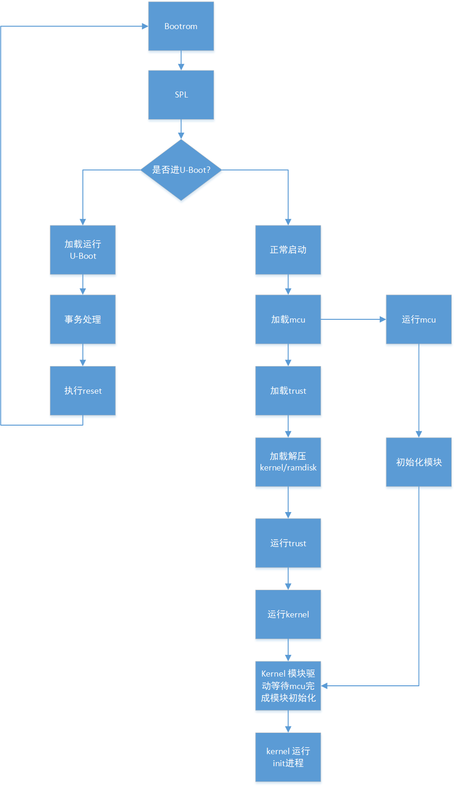

[toc]

# 快速开机

## 芯片支持

- rv1126

## 存储支持

- eMMC
- spi nor

## bootrom 支持

目前 bootrom 的 spi nor 驱动支持四线DMA模式加载下级固件，这项支持已直接在 usbplug 烧写固件时做了配置，客户无需再配置。

eMMC目前无此优化。

## U-Boot SPL 支持

U-Boot SPL 下支持 fit 格式的快速开机，同时支持按键进入loader模式和低电检测。

配置：

```c
CONFIG_SPL_KERNEL_BOOT=y             // 开启快速开机功能
CONFIG_SPL_BLK_READ_PREPARE=y        // 开启预加载功能
CONFIG_SPL_MISC_DECOMPRESS=y         // 开启解压功能
CONFIG_SPL_ROCKCHIP_HW_DECOMPRESS=y
```

U-Boot SPL 支持预加载功能，使能预加载功能后，可以在执行其他程序的同时加载固件。目前主要用来预加载ramdisk。

例如预加载经过 gzip 压缩过的 ramdisk，压缩命令：

```
cat ramdisk | gzip -n -f -9 > ramdisk.gz
```

its文件的配置如下：

```c
ramdisk {
	data = /incbin/("./images-tb/ramdisk.gz");
	compression = "gzip"; // 压缩格式
	type = "ramdisk";
	arch = "arm";
	os = "linux";
	preload = <1>;        // 预加载标志
	comp = <0x5800000>;   // 加载地址
	load = <0x2800000>;   // 解压地址
	decomp-async;         // 异步解压
	hash {
		algo = "sha256";
		uboot-ignore = <1>; // 不做hash校验
	};
};
```

编译固件，比如编译rv1126 eMMC固件：

```c
./make.sh rv1126-emmc-tb && ./make.sh --spl
```

## mcu配置

目前mcu的主要作用是辅助系统启动，对ISP等模块提前做初始化。kernel启动后，会接回这些硬件模块的控制权。

在 rkbin/RKTRUST 对应的芯片文件内配置，以 rv1126 为例：

```c
[MCU]
MCU=bin/rv11/rv1126_mcu_v1.02.bin,0x108000,okay // 配置对应固件位置，启动地址和使能标志
```

mcu程序地址：

```c
https://10.10.10.29/admin/repos/rtos/rt-thread/rt-thread-amp
https://10.10.10.29/admin/repos/rk/mcu/hal
```

U-Boot编译后，会将mcu固件打包到uboot.img内。系统启动时，SPL会从uboot.img中解析加载mcu固件。

## kernel 支持

配置：

```c
CONFIG_ROCKCHIP_THUNDER_BOOT=y           // 开启快速开机功能
CONFIG_ROCKCHIP_THUNDER_BOOT_MMC=y       // 开启支持emmc快速开机优化功能
CONFIG_ROCKCHIP_THUNDER_BOOT_SFC=y       // 开启支持spi nor快速开机优化功能
CONFIG_VIDEO_ROCKCHIP_THUNDER_BOOT_ISP=y // 开启支持ISP快速开机优化功能
```

为了快速开机，SPL不会依据实际的硬件参数修改kernel dtb的参数，所以有些参数需要用户自己配置，具体有：

- memory
- ramdisk解压前后大小

详见：kernel/arch/arm/boot/dts/rv1126-thunder-boot.dtsi

```c
memory: memory {
	device_type = "memory";
	reg = <0x00000000 0x20000000>; // 需要依据真实DDR容量预先定义，SPL不修正
};

reserved-memory {
	trust@0 {
		reg = <0x00000000 0x00200000>; // trust 空间
		no-map;
	};

	trust@200000 {
		reg = <0x00200000 0x00008000>;
	};

	ramoops@210000 {
		compatible = "ramoops";
		reg = <0x00210000 0x000f0000>;
		record-size = <0x20000>;
		console-size = <0x20000>;
		ftrace-size = <0x00000>;
		pmsg-size = <0x50000>;
	};

	rtos@300000 {
		reg = <0x00300000 0x00100000>; // 预留给用户端使用，没有使用可以删掉
		no-map;
	};

	ramdisk_r: ramdisk@2800000 {
		reg = <0x02800000 (48 * 0x00100000)>; // 解压源地址，可以依据实际大小进行更改
	};

	ramdisk_c: ramdisk@5800000 {
		reg = <0x05800000 (20 * 0x00100000)>; // 压缩源地址，可以依据实际大小进行更改
	};
};
```

针对emmc的配置：

```c
/ {
        reserved-memory {
                mmc_ecsd: mmc@20f000 {
                        reg = <0x0020f000 0x00001000>; // SPL 给kernel上传ecsd区域
                };

                mmc_idmac: mmc@500000 {
                        reg = <0x00500000 0x00100000>; // 预加载ramdisk时，预留的idmac的内存区域，预加载完成，该区域内存释放掉
                };
        };

        thunder_boot_mmc: thunder-boot-mmc {
                compatible = "rockchip,thunder-boot-mmc";
                reg = <0xffc50000 0x4000>;
                memory-region-src = <&ramdisk_c>;
                memory-region-dst = <&ramdisk_r>;
                memory-region-idmac = <&mmc_idmac>;
        };
};
```

针对spi nor的配置：

```c
/ {
        thunder_boot_spi_nor: thunder-boot-spi-nor {
                compatible = "rockchip,thunder-boot-sfc";
                reg = <0xffc90000 0x4000>;
                memory-region-src = <&ramdisk_c>;
                memory-region-dst = <&ramdisk_r>;
        };
};
```

## 快速开机流程

