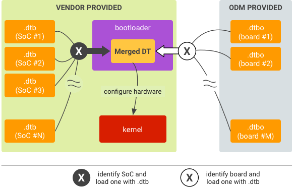
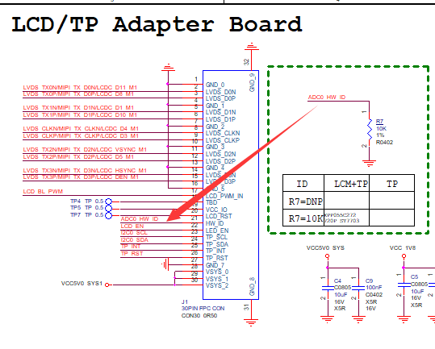

# U-Boot next-dev开发指南

发布版本：1.30

作者邮箱：
​	Joseph Chen <chenjh@rock-chips.com>
​	Kever Yang <kever.yang@rock-chips.com>
​	Jon Lin jon.lin@rock-chips.com
​	Chen Liang cl@rock-chips.com
​	Ping Lin <hisping.lin@rock-chips.com>

日期：2019.03

文件密级：公开资料

-----------

**前言**

**概述**

本文主要指导读者如何在U-Boot next-dev分支进行项目开发。

**读者对象**

本文档（本指南）主要适用于以下工程师：

技术支持工程师

软件开发工程师

**各芯片feature支持状态**

| **芯片名称**    | **Distro Boot** | **RKIMG Boot** | **SPL/TPL** | **Trust(SPL)** | **AVB** |
| ----------- | :-------------- | :------------- | :---------- | :------------- | :------ |
| RV1108      | Y               | N              | Y           | N              | N       |
| RK3036      | Y               | N              | N           | N              | N       |
| RK3126C     | Y               | Y              | N           | N              | N       |
| RK3128      | Y               | Y              | N           | N              | N       |
| RK3229      | Y               | N              | Y           | Y              | Y       |
| RK3288      | Y               | N              | Y           | N              | N       |
| RK3308      | -               | -              | -           | -              | -       |
| RK3326/PX30 | Y               | Y              | N           | N              | Y       |
| RK3328      | Y               | N              | Y           | Y              | N       |
| RK3368/PX5  | Y               | N              | Y           | Y              | N       |
| RK3399      | Y               | N              | Y           | Y              | N       |

**修订记录**

| **日期**   | **版本** | **作者** | **修改说明**                                                 |
| ---------- | -------- | -------- | ------------------------------------------------------------ |
| 2018-02-28 | V1.00    | 陈健洪   | 初始版本                                                     |
| 2018-06-22 | V1.01    | 朱志展   | fastboot说明，OPTEE Client说明                               |
| 2018-07-23 | V1.10    | 陈健洪   | 完善文档，更新和调整大部分章节                               |
| 2018-07-26 | V1.11    | 林鼎强   | 完善Nand、SFC SPI Flash存储驱动部分                          |
| 2018-08-08 | V1.12    | 陈亮     | 增加HW-ID使用说明                                            |
| 2018-09-20 | V1.13    | 张晴     | 增加CLK使用说明                                              |
| 2018-11-06 | V1.20    | 陈健洪   | 增加/更新defconfig/rktest/probe/interrupt/kernel dtb/uart/atags |
| 2019-01-21 | V1.21    | 陈健洪   | 增加dtbo/amp/dvfs宽温/fdt命令说明                            |
| 2019-03-05 | V1.22    | 林平     | 增加optee client说明                                         |
| 2019-03-25 | V1.23    | 陈健洪/朱志展   | 增加kernel cmdline说明                            |
| 2019-03-25 | V1.30    | 陈健洪   | 精简和整理文档、纠正排版问题、完善和调整部分章节内容               |

---
[TOC]
---

## 1. U-Boot next-dev简介

next-dev是Rockchip从U-Boot官方的v2017.09正式版本中切出来进行开发的版本。目前在该平台上已经支持RK所有主流在售芯片。

目前支持的功能主要有：

- 支持RK Android平台的固件启动；
- 支持Android AOSP(如GVA)固件启动；
- 支持Linux Distro固件启动；
- 支持Rockchip miniloader和SPL/TPL两种pre-loader引导；
- 支持LVDS、EDP、MIPI、HDMI等显示设备；
- 支持eMMC、Nand Flash、SPI Nand flash、SPI NOR flash、SD卡、 U盘等存储设备启动；
- 支持FAT、EXT2、EXT4文件系统；
- 支持GPT、RK parameter分区格式；
- 支持开机logo显示、充电动画显示，低电管理、电源管理；
- 支持I2C、PMIC、CHARGE、GUAGE、USB、GPIO、PWM、GMAC、eMMC、NAND、中断等驱动；
- 支持RockUSB 和 Google Fastboot两种USB gadget烧写eMMC；
- 支持Mass storage、ethernet、HID等USB设备；
- 支持使用kernel的dtb；
- 支持dtbo功能；

U-Boot的doc目录向用户提供了丰富的文档，介绍了U-Boot里各个功能模块的概念、设计理念、实现方法等，建议用户阅读这些文档提高开发效率。

## 2. 平台架构

### 2.1 DM架构

DM（Driver Model）是U-Boot标准的device-driver开发模型，跟kernel的device-driver模型非常类似。U-Boot使用DM对各类设备和驱动进行管理，Rockchip提供的这套U-Boot也遵循DM框架进行开发。建议读者先阅读文档理解DM，同时关注实现DM架构的相关代码。

README：

```
./doc/driver-model/README.txt
```

```
Terminology
-----------

Uclass - a group of devices which operate in the same way. A uclass provides
         a way of accessing individual devices within the group, but always
         using the same interface. For example a GPIO uclass provides
         operations for get/set value. An I2C uclass may have 10 I2C ports,
         4 with one driver, and 6 with another.

Driver - some code which talks to a peripheral and presents a higher-level
         interface to it.

Device - an instance of a driver, tied to a particular port or peripheral.
```

总结：

- uclass：设备驱动框架
- driver： 驱动
- device：设备

### 2.2 平台架构文件

平台架构文件主要是Rockchip的芯片级代码，本章重点介绍重要文件的位置，请用户深入了解其作用。

1. 平台目录

```
./arch/arm/include/asm/arch-rockchip/
./arch/arm/mach-rockchip/
./board/rockchip/
```

2. 平台头文件：

```
./arch/arm/include/asm/arch-rockchip/qos_rk3288.h
./arch/arm/include/asm/arch-rockchip/grf_rk3368.h
./arch/arm/include/asm/arch-rockchip/pmu_rk3399.h
......
```

```
./include/configs/rk3368_common.h
./include/configs/rk3328_common.h
./include/configs/rk3128_common.h
......
```

```
./include/configs/evb_rk3368.h
./include/configs/evb_rk3328.h
./include/configs/evb_rk3128.h
......
```

3. 平台驱动文件：

```
./arch/arm/mach-rockchip/rk3288/rk3288.c
./arch/arm/mach-rockchip/rk3368/rk3368.c
./arch/arm/mach-rockchip/rk3399/rk3399.c
......
```

```
./board/rockchip/evb_rk3288/evb_rk3288.c
./board/rockchip/evb_rk3368/evb_rk3368.c
./board/rockchip/evb_rk3399/evb_rk3399.c
......
```

4. 公共板级文件（核心！）：

```
./arch/arm/mach-rockchip/board.c
```

5. README：

```
./board/rockchip/evb_px5/README
./board/rockchip/evb_rv1108/README
./board/rockchip/sheep_rk3368/README
......
```

6. defconfig：

```
./configs/rk3328_defconfig
./configs/rk3036_defconfig
./configs/rk322x_defconfig
......
```

### 2.3 DTB的使用

请务必先阅读[9. U-Boot和kernel DTB支持](#9. U-Boot和kernel DTB支持)，了解引入kernel dtb的相关技术背景。

说明：本文档中提到的“kernel dtb”一词除了表示名词含义：kernel的dtb文件，也表示一种技术：U-Boot阶段使用kernel dtb。

U-Boot的启动分为两个阶段：before relocate和after relocate。如下针对启用/未启用kernel dtb的情况，说明两个启动阶段中dtb的使用情况。

#### 2.3.1 启用kernel dtb

**第一阶段（before relocate）：使用U-Boot的最简dt-spl.dtb**

因为第一阶段通常只加载MMC、NAND、CRU、GRF、UART等基础模块，所以只需要一个最简dtb即可，这样还能节省dtb的扫描时间。U-Boot 自己的dts在编译阶段只保留带有"u-boot,dm-pre-reloc"属性的节点，由此得到一个dt.dtb。然后再删除dt.dtb中被CONFIG_OF_SPL_REMOVE_PROPS指定的property，最后得到一个最简dt-spl.dtb（CONFIG_OF_SPL_REMOVE_PROPS在defconfig中定义）。

通常把带有"u-boot,dm-pre-reloc"的节点放在各平台的rkxxx-u-boot.dtsi中：

```
./arch/arm/dts/rk3328-u-boot.dtsi
./arch/arm/dts/rk3399-u-boot.dtsi
./arch/arm/dts/rk3128-u-boot.dtsi
......
```

./arch/arm/dts/rk3399-u-boot.dtsi：

```
......
&nandc0 {
	u-boot,dm-pre-reloc;
};

&emmc {
	u-boot,dm-pre-reloc;
};

&cru {
	u-boot,dm-pre-reloc;
};
......
```

**第二阶段（after relocate）：使用kernel的dtb**

U-Boot进入第二阶段后，在./arch/arm/mach-rockchip/board.c的board_init()中加载并切换到kernel dtb，后续所有外设的初始化都使用kernel dtb信息，因此一份U-Boot固件可以兼容不同板子的硬件差异。

#### 2.3.2 关闭kernel dtb

U-Boot两个阶段都使用U-Boot自己的dtb（非最简dtb，即所有节点都是有效的）。

### 2.4 平台配置

本章针对rockchip-common.h、rkxxx_common.h、evb_rkxxx.h定义的重要配置给出说明。

- RKIMG_DET_BOOTDEV：存储类型探测命令，以逐个扫描的方式探测当前的存储设备类型
- RKIMG_BOOTCOMMAND：kernel启动命令
- ENV_MEM_LAYOUT_SETTINGS：固件加载地址：包括ramdisk/fdt/kernel
- PARTS_DEFAULT：默认的GPT分区表，在某些情况下，当存储中没有发现有效的GPT分区表时被使用
- ROCKCHIP_DEVICE_SETTINGS：外设相关命令，主要是指定stdio（一般会包含显示模块启动命令）
- BOOTENV：distro方式启动linux时的启动设备探测命令
- CONFIG_SYS_MALLOC_LEN：malloc内存池大小
- CONFIG_SYS_TEXT_BASE：U-Boot运行的起始地址
- CONFIG_BOOTCOMMAND：启动命令，一般定义为RKIMG_BOOTCOMMAND
- CONFIG_PREBOOT：预启动命令，在CONFIG_BOOTCOMMAND前被执行
- CONFIG_SYS_MMC_ENV_DEV：MMC作为ENV存储介质时的dev num，一般是0

如下以RK3399为例进行说明：

./include/configs/rockchip-common.h：

```
......
#define RKIMG_DET_BOOTDEV \                           // 动态探测当前的存储类型
	"rkimg_bootdev=" \
	"if mmc dev 1 && rkimgtest mmc 1; then " \
		"setenv devtype mmc; setenv devnum 1; echo Boot from SDcard;" \
	"elif mmc dev 0; then " \
		"setenv devtype mmc; setenv devnum 0;" \
	"elif rknand dev 0; then " \
		"setenv devtype rknand; setenv devnum 0;" \
        "elif rksfc dev 0; then " \
                "setenv devtype rksfc; setenv devnum 0;" \
	"fi; \0"

#define RKIMG_BOOTCOMMAND \
	"boot_android ${devtype} ${devnum};" \           // 启动android格式固件
	"bootrkp;" \                                     // 启动RK格式固件
	"run distro_bootcmd;"                            // 启动linux固件
......
```

./include/configs/rk3399_common.h：

```
......
#ifndef CONFIG_SPL_BUILD
#define ENV_MEM_LAYOUT_SETTINGS \        // 固件的加载地址
	"scriptaddr=0x00500000\0" \
	"pxefile_addr_r=0x00600000\0" \
	"fdt_addr_r=0x01f00000\0" \
	"kernel_addr_r=0x02080000\0" \
	"ramdisk_addr_r=0x0a200000\0"

#include <config_distro_bootcmd.h>
#define CONFIG_EXTRA_ENV_SETTINGS \
	ENV_MEM_LAYOUT_SETTINGS \
	"partitions=" PARTS_DEFAULT \        // 默认的GPT分区表
	ROCKCHIP_DEVICE_SETTINGS \
	RKIMG_DET_BOOTDEV \
	BOOTENV                              // 启动linux时的启动设备探测命令
#endif

#define CONFIG_PREBOOT                   // 在CONFIG_BOOTCOMMAND之前被执行的预启动命令
......
```

./include/configs/evb_rk3399.h：

```
......
#ifndef CONFIG_SPL_BUILD
#undef CONFIG_BOOTCOMMAND
#define CONFIG_BOOTCOMMAND RKIMG_BOOTCOMMAND // 定义启动命令（设置为RKIMG_BOOTCOMMAND）
#endif
......
#define ROCKCHIP_DEVICE_SETTINGS \           // 使能显示模块
		"stdout=serial,vidconsole\0" \
		"stderr=serial,vidconsole\0"
......
```

### 2.5 调试方法

#### 2.5.1 流程类

##### 2.5.1.1 debug()

如果需要debug()生效，可在各平台rkxxx_common.h中定义：

````
#define DEBUG
````

##### 2.5.1.2 Early Debug UART

请参考本文档[5.10.2 Early Debug UART配置](#5.10.2 Early Debug UART配置)。

##### 2.5.1.3 initcall

U-Boot的启动流程本质上是一系列函数调用，把initcall_run_list()里的debug改成printf可以打印出调用顺序。

例如RK3399：

```
U-Boot 2017.09-01725-g03b8d3b-dirty (Jul 06 2018 - 10:08:27 +0800)

initcall: 0000000000214388
initcall: 0000000000214724
Model: Rockchip RK3399 Evaluation Board
initcall: 0000000000214300
DRAM:  initcall: 0000000000203f68
initcall: 0000000000214410
initcall: 00000000002140dc
....
3.8 GiB
initcall: 00000000002143b8
....
Relocation Offset is: f5c03000
initcall: 00000000f5e176bc
initcall: 00000000002146a4 (relocated to 00000000f5e176a4)
initcall: 0000000000214668 (relocated to 00000000f5e17668)

....
```

虽然只打印出函数地址，但只要结合反汇编就可以对应上函数名。请参考本文档[3.2.6 debug辅助命令](#3.2.6 debug辅助命令)。

#### 2.5.2 读写类

##### 2.5.2.1 命令行模式

U-Boot命令行模式提供了许多命令，输入"?"可列出当前支持的所有命令：

```
=> ?
?       - alias for 'help'
base    - print or set address offset
bdinfo  - print Board Info structure
boot    - boot default, i.e., run 'bootcmd'
boot_android- Execute the Android Bootloader flow.
bootd   - boot default, i.e., run 'bootcmd'
bootefi - Boots an EFI payload from memory
bootelf - Boot from an ELF image in memory
......
```

2种方法进入命令行模式（2选1）：

- 配置CONFIG_BOOTDELAY=\<seconds\>进入命令行倒计时模式，再按ctrl+c进入命令行；
- U-Boot开机阶段长按ctrl+c 组合键，强制进入命令行；

##### 2.5.2.2 io命令

U-Boot中的io命令为：md/mw

```
// 读操作
md - memory display
Usage: md [.b, .w, .l, .q] address [# of objects]

// 写操作
mw - memory write (fill)
Usage: mw [.b, .w, .l, .q] address value [count]
```

其中：

```
 .b 表示的数据长度是： 1 byte;
 .w 表示的数据长度是： 2 byte;
 .l 表示的数据长度是： 4 byte; (推荐)
 .q 表示的数据长度是： 8 byte;
```

范例：

1. 读操作：显示0x76000000地址开始的连续0x10个数据单元，每个数据单元的长度是4-byte。

```
=> md.l 0x76000000 0x10
76000000: fffffffe ffffffff ffffffff ffffffff    ................
76000010: ffffffdf ffffffff feffffff ffffffff    ................
76000020: ffffffff ffffffff ffffffff ffffffff    ................
76000030: ffffffff ffffffff ffffffff ffffffff    ................
```

2. 写操作：对0x76000000地址的数据单元赋值为0xffff0000；

```
=> mw.l 0x76000000 0xffff0000
=> md.l 0x76000000 0x10	// 回读
76000000: ffff0000 ffffffff ffffffff ffffffff    ................
76000010: ffffffdf ffffffff feffffff ffffffff    ................
76000020: ffffffff ffffffff ffffffff ffffffff    ................
76000030: ffffffff ffffffff ffffffff ffffffff    ................
```

3. 写操作（连续）：对0x76000000地址开始的连续0x10个数据单元都赋值为0xffff0000，每个数据单元的长度是4-byte。

```
=> mw.l 0x76000000 0xffff0000 0x10
=> md.l 0x76000000 0x10		// 回读
76000000: ffff0000 ffff0000 ffff0000 ffff0000    ................
76000010: ffff0000 ffff0000 ffff0000 ffff0000    ................
76000020: ffff0000 ffff0000 ffff0000 ffff0000    ................
76000030: ffff0000 ffff0000 ffff0000 ffff0000    ................
```

##### 2.5.2.3 iomem命令

iomem：解析dts节点获取基地址信息后再读取寄存器值，比md更灵活。有2种使用方式：命令行和函数接口。

1. 命令行

```
=> iomem
iomem - Show iomem data by device compatible

Usage:
iomem <compatible> <start offset>  <end offset>
eg: iomem -grf 0x0 0x200
```

@\<compatible\>：支持compatible关键字匹配。例如RK3228平台上读取GRF：

```
=> iomem -grf 0x0 0x20
rockchip,rk3228-grf:
11000000:  00000000 00000000 00004000 00002000
11000010:  00000000 00005028 0000a5a5 0000aaaa
11000020:  00009955
```

2. 函数接口：

```c
void iomem_show(const char *label, unsigned long base, size_t start, size_t end);
void iomem_show_by_compatible(const char *compat, size_t start, size_t end);
```

##### 2.5.2.4 i2c命令

```
CONFIG_CMD_I2C
```

```
=> i2c
i2c - I2C sub-system

Usage:
i2c dev [dev] - show or set current I2C bus
i2c md chip address[.0, .1, .2] [# of objects] - read from I2C device
i2c mw chip address[.0, .1, .2] value [count] ‐ write to I2C device (fill)
......
```

范例：

1. 读操作：

```
=> i2c dev 0                     // 切到i2c0（指定一次即可）
Setting bus to 0

=> i2c md 0x1b 0x2e 0x20         // i2c设备地址为1b(7位地址)，读取0x2e开始的连续0x20个寄存器值
002e: 11 0f 00 00 11 0f 00 00 01 00 00 00 09 00 00 0c    ................
003e: 00 0a 0a 0c 0c 0c 00 07 07 0a 00 0c 0c 00 00 00    ................
```

2. 写操作：

```
=> i2c dev 0                     // 切到i2c0（指定一次即可）
Setting bus to 0

=> i2c mw 0x1b 0x2e 0x10         // i2c设备地址为1b(7位地址)，对0x2e寄存器赋值为0x10
=> i2c md 0x1b 0x2e 0x20         // 回读
002e: 10 0f 00 00 11 0f 00 00 01 00 00 00 09 00 00 0c    ................
003e: 00 0a 0a 0c 0c 0c 00 07 07 0a 00 0c 0c 00 00 00    ................
```

##### 2.5.2.5 fdt读写

U-Boot提供的fdt命令可以实现对当前dtb的读、写操作：

```
=> fdt
fdt - flattened device tree utility commands

Usage:
fdt addr [-c]  <addr> [<length>]    - Set the [control] fdt location to <addr>
fdt print  <path> [<prop>]          - Recursive print starting at <path>
fdt list   <path> [<prop>]          - Print one level starting at <path>
......
NOTE: Dereference aliases by omitting the leading '/', e.g. fdt print ethernet0.
```

其中如下两条组合命令可以把fdt完整dump出来，比较常用：

```
=> fdt addr $fdt_addr_r   // 指定fdt地址
=> fdt print              // 把fdt内容全部打印出来
```

#### 2.5.3 状态类

##### 2.5.3.1 printf 时间戳

```
CONFIG_BOOTSTAGE_PRINTF_TIMESTAMP
```

范例：

```
[    0.259266] U-Boot 2017.09-01739-g856f373-dirty (Jul 10 2018 - 20:26:05 +0800)
[    0.260596] Model: Rockchip RK3399 Evaluation Board
[    0.261332] DRAM:  3.8 GiB
Relocation Offset is: f5bfd000
Using default environment

[    0.354038] dwmmc@fe320000: 1, sdhci@fe330000: 0
[    0.521125] Card did not respond to voltage select!
[    0.521188] mmc_init: -95, time 9
[    0.671451] switch to partitions #0, OK
[    0.671500] mmc0(part 0) is current device
[    0.675507] boot mode: None
[    0.683738] DTB: rk-kernel.dtb
[    0.706940] Using kernel dtb
......
```

注意：

1. U-Boot是单核运行，时间戳打印会增加耗时；
2. 时间戳的时间不是从0开始，只是把当前系统的timer时间读出来而已，所以只适合计算时间差；
3. 建议默认关闭该功能，仅调试打开。

##### 2.5.3.2 dm命令

"dm"命令：查看dm框架管理下的所有device-driver状态。

通过dm命令展示的拓扑图，用户能看到所有device-driver的状态，包含的信息：

- 某个device是否和driver完成bind；
- 某个driver是否已经probe；
- 某个uclass下的所有device；
- 各个device之间的关系；

```
=> dm
dm - Driver model low level access

Usage:
dm tree          Dump driver model tree ('*' = activated)
dm uclass        Dump list of instances for each uclass
dm devres        Dump list of device resources for each device // 暂时无用
```

1. "dm tree"命令：

- 列出所有完成bind的device-driver；
- 列出所有uclass-device-driver的隶属关系；
- [ + ] 表示当前driver已经完成probe；

```
=> dm tree

 Class      Probed        Driver               Name
----------------------------------------------------------
 root       [ + ]   root_driver                root_driver
 syscon     [   ]   rk322x_syscon              |-- syscon@11000000
 serial     [ + ]   ns16550_serial             |-- serial@11030000
 clk        [ + ]   clk_rk322x                 |-- clock-controller@110e0000
 sysreset   [   ]   rockchip_sysreset          |   |-- sysreset
 reset      [   ]   rockchip_reset             |   `-- reset
 mmc        [ + ]   rockchip_rk3288_dw_mshc    |-- dwmmc@30020000
 blk        [ + ]   mmc_blk                    |   `-- dwmmc@30020000.blk
 ram        [   ]   rockchip_rk322x_dmc        |-- dmc@11200000
 serial     [ + ]   ns16550_serial             |-- serial@11020000
 i2c        [ + ]   i2c_rockchip               |-- i2c@11050000
 ......
```

2. "dm uclass"命令：列出uclass下的所有device；

```
=> dm uclass

uclass 0: root
- * root_driver @ 7be54c88, seq 0, (req -1)

uclass 11: adc
- * saradc@ff100000 @ 7be56220, seq 0, (req -1)
......
uclass 40: backlight
- * backlight @ 7be81178, seq 0, (req -1)

uclass 77: key
-   rockchip-key @ 7be811f0
......
```

##### 2.5.3.3 panic cpu信息

系统的panic信息包含CPU现场状态，用户可以通过它们定位问题原因：

```
* Relocate offset = 000000003db55000
* ELR(PC)    =   000000000025bd78
* LR         =   000000000025def4
* SP         =   0000000039d4a6b0

* ESR_EL2    =   0000000040732550
		EC[31:26] == 001100, Exception from an MCRR or MRRC access
		IL[25] == 0, 16-bit instruction trapped

* DAIF       =   00000000000003c0
		D[9] == 1, DBG masked
		A[8] == 1, ABORT masked
		I[7] == 1, IRQ masked
		F[6] == 1, FIQ masked

* SPSR_EL2   =   0000000080000349
		D[9] == 1, DBG masked
		A[8] == 1, ABORT masked
		I[7] == 0, IRQ not masked
		F[6] == 1, FIQ masked
		M[4] == 0, Exception taken from AArch64
		M[3:0] == 1001, EL2h

* SCTLR_EL2  =   0000000030c51835
		I[12] == 1, Icaches enabled
		C[2] == 1, Dcache enabled
		M[0] == 1, MMU enabled

* VBAR_EL2   =   000000003dd55800
* HCR_EL2    =   000000000800003a
* TTBR0_EL2  =   000000003fff0000

x0 : 00000000ff300000 x1 : 0000000054808028
x2 : 000000000000002f x3 : 00000000ff160000
x4 : 0000000039d7fe80 x5 : 000000003de24ab0
......
x28: 0000000039d81ef0 x29: 0000000039d4a910
```

- EC[31:26]表明了CPU异常原因；
- 各寄存器展示了CPU现场状态；
- PC、LR、SP 最重要，用户结合反汇编能定位到出错点，请参考本文档[3.2.6 debug辅助命令](#3.2.6 debug辅助命令)。

##### 2.5.3.4 panic register信息

系统的panic信息也可以包含平台相关的寄存器状态。目前支持打印：CRU、PMUCRU、GRF、PMUGRF。

```
CONFIG_ROCKCHIP_CRASH_DUMP
```

范例：

```
......
* VBAR_EL2   =   000000003dd55800
* HCR_EL2    =   000000000800003a
* TTBR0_EL2  =   000000003fff0000

x0 : 00000000ff300000 x1 : 0000000054808028
x2 : 000000000000002f x3 : 00000000ff160000
......

// 平台寄存器信息：
rockchip,px30-cru:
ff2b0000:  0000304b 00001441 00000001 00000007
ff2b0010:  00007f00 00000000 00000000 00000000
ff2b0020:  00003053 00001441 00000001 00000007
......

rockchip,px30-grf:
ff140000:  00002222 00002222 00002222 00001111
ff140010:  00000000 00000000 00002200 00000033
ff140020:  00000000 00000000 00000000 00000202
......
```

用户想增加更多打印需要修改./arch/arm/lib/interrupts_64.c：

```
void show_regs(struct pt_regs *regs)
{
......
#ifdef CONFIG_ROCKCHIP_CRASH_DUMP
	iomem_show_by_compatible("-cru", 0, 0x400);
	iomem_show_by_compatible("-pmucru", 0, 0x400);
	iomem_show_by_compatible("-grf", 0, 0x400);
	iomem_show_by_compatible("-pmugrf", 0, 0x400);
	/* tobe add here ... */
#endif
}
```

##### 2.5.3.5 卡死信息

U-Boot启动遇到卡死、串口无响应、无有效打印时，用户可以提前使能该功能，串口会每隔5s dump出panic信息（请参考本文档[2.5.3.3 panic cpu信息](#2.5.3.3 panic cpu信息)）。建议默认关闭此功能，仅调试打开。

```
CONFIG_ROCKCHIP_DEBUGGER
```

范例：

```
>>> Rockchip Debugger:
* Relocate offset = 000000003db55000
* ELR(PC)    =   000000000025bd78
* LR         =   000000000025def4
* SP         =   0000000039d4a6b0

* ESR_EL2    =   0000000040732550
		<NULL>		// 因为只是卡住，CPU本身可能状态正常，所以EC[31:26]没有显示异常原因。
		IL[25] == 0, 16-bit instruction trapped

* DAIF       =   00000000000003c0
		D[9] == 1, DBG masked
		A[8] == 1, ABORT masked
		I[7] == 1, IRQ masked
		F[6] == 1, FIQ masked
......
```

##### 2.5.3.6 CRC校验

RK格式打包的固件，hdr里包含了打包工具计算的CRC。如果用户怀疑U-Boot加载的固件存在完整性问题，可打开CRC校验进行确认。CRC校验比较耗时，建议默认关闭此功能，仅调试打开。

```
CONFIG_ROCKCHIP_CRC
```

范例：

```
=Booting Rockchip format image=
kernel image CRC32 verify... okay.		// kernel 校验成功（如果失败则打印“fail！”）
boot image CRC32 verify... okay.		// boot 校验成功（如果失败则打印“fail！”）
kernel   @ 0x02080000 (0x01249808)
ramdisk  @ 0x0a200000 (0x001e6650)
## Flattened Device Tree blob at 01f00000
   Booting using the fdt blob at 0x1f00000
  'reserved-memory' secure-memory@20000000: addr=20000000 size=10000000
   Loading Ramdisk to 08019000, end 081ff650 ... OK
   Loading Device Tree to 0000000008003000, end 0000000008018c97 ... OK
Adding bank: start=0x00200000, size=0x08200000
Adding bank: start=0x0a200000, size=0xede00000

Starting kernel ...
```

##### 2.5.3.7 开机信息

某些情况下，开机信息也可以帮助用户定位一些死机问题。

1. trust跑完后就卡死

trust跑完后就卡死的可能性：固件打包或者烧写有问题，导致trust跳转到错误的U-Boot启动地址。此时，用户可以通过trust启动信息里的U-Boot启动地址来确认。

64位平台U-Boot启动地址一般是偏移0x200000（DRAM起始地址是0x0）：

```
NOTICE:  BL31: v1.3(debug):d98d16e
NOTICE:  BL31: Built : 15:03:07, May 10 2018
NOTICE:  BL31: Rockchip release version: v1.1
INFO:    GICv3 with legacy support detected. ARM GICV3 driver initialized in EL3
INFO:    Using opteed sec cpu_context!
INFO:    boot cpu mask: 0
INFO:    plat_rockchip_pmu_init(1151): pd status 3e
INFO:    BL31: Initializing runtime services
INFO:    BL31: Initializing BL32
INFO:    BL31: Preparing for EL3 exit to normal world
INFO:    Entry point address = 0x200000	 // U-Boot地址
INFO:    SPSR = 0x3c9
```

32位平台U-Boot启动地址一般是偏移0x0（DRAM起始地址是0x60000000）：

```
INF [0x0] TEE-CORE:init_primary_helper:378: Release version: 1.9
INF [0x0] TEE-CORE:init_primary_helper:379: Next entry point address: 0x60000000  // U-Boot地址
INF [0x0] TEE-CORE:init_teecore:83: teecore inits done
```

2. U-Boot版本回溯：

通过U-Boot开机信息可回溯编译版本。如下，对应提交点是commit: b34f08b。

```
U-Boot 2017.09-01730-gb34f08b (Jul 06 2018 - 17:47:52 +0800)
```

开机信息中出现"dirty"，说明编译时有本地改动没有提交进仓库，编译点不干净。

```
U-Boot 2017.09-01730-gb34f08b-dirty (Jul 06 2018 - 17:35:04 +0800)
```

#### 2.5.4 烧写类

当烧写按键无法正常使用时，用户可以通过U-Boot命令行进入烧写模式，请参考本文档[3.2.8 烧写和工具](#3.2.8 烧写和工具)。

### 2.6 ATAGS机制

Pre-loader、trust(bl31/op-tee)、U-Boot之间需要传递和共享某些信息，通过这些信息完成一些特定的功能。目前可通过ATAGS机制进行传递（不会传给kernel），传递内容：串口配置、存储类型、bl31和op-tee的内存布局、ddr容量信息等。

驱动代码：

```
./arch/arm/include/asm/arch-rockchip/rk_atags.h
./arch/arm/mach-rockchip/rk_atags.c
```

### 2.7 Probe机制

U-Boot通过DM管理所有的设备和驱动，它和kernel的device-driver模型非常类似。kernel初始化时使用initcall机制把所有已经bind过的device-driver进行probe，但是U-Boot没有这样的机制。

如果要让U-Boot中某个driver执行probe，用户必须主动调用框架接口发起probe。

```c
// 常用：
int uclass_get_device(enum uclass_id id, int index, struct udevice **devp);
int uclass_get_device_by_name(enum uclass_id id, const char *name,

// 不常用：
int uclass_get_device_by_seq(enum uclass_id id, int seq, struct udevice **devp);
int uclass_get_device_by_of_offset(enum uclass_id id, int node, struct udevice **devp);
int uclass_get_device_by_ofnode(enum uclass_id id, ofnode node, struct udevice **devp);
int uclass_get_device_by_phandle_id(enum uclass_id id,
									int phandle_id, struct udevice **devp);
int uclass_get_device_by_phandle(enum uclass_id id,
								 struct udevice *parent, struct udevice **devp);
int uclass_get_device_by_driver(enum uclass_id id,
								const struct driver *drv, struct udevice **devp);
int uclass_get_device_tail(struct udevice *dev, int ret, struct udevice **devp);
......
```

## 3. 平台编译

### 3.1 前期准备

#### 3.1.1 rkbin 仓库

rkbin仓库用于存放Rockchip不开源的bin（ddr、trust、loader等）、脚本、打包工具等，它只是一个“工具包”仓库 （**注意：bin会不断更新，请用户及时同步，避免因为版本过旧引起问题**）。

- rkbin要跟U-Boot工程保持同级目录关系，否则编译会报错找不到rkbin；
- U-Boot编译时会从rkbin索引相关的bin、配置文件和打包工具，最后在根目录下生成trust.img、uboot.img、loader固件；
- 下载方式见附录[rkbin仓库下载](#rkbin仓库下载) 。

#### 3.1.2 gcc版本

默认使用的编译器是gcc-linaro-6.3.1版本，下载方式见附录[gcc编译器下载](#gcc编译器下载) 。

```
32位编译器：gcc-linaro-6.3.1-2017.05-x86_64_arm-linux-gnueabihf
64位编译器：gcc-linaro-6.3.1-2017.05-x86_64_aarch64-linux-gnu
```

#### 3.1.3 U-Boot分支

请确认U-Boot使用的是next-dev分支：

```
remotes/origin/next-dev
```

U-Boot根目录下的./Makefile可看到版本信息：

```
SPDX-License-Identifier:      GPL-2.0+

VERSION = 2017
PATCHLEVEL = 09
SUBLEVEL =
EXTRAVERSION =
NAME =
```

#### 3.1.4 defconfig选择

目前大部分平台都开启了kernel dtb支持，能兼容板级差异（如：外设、电源、clk、显示等）。虽然不支持kernel dtb的情况下无法兼容板级差异，但却有更优的启动速度和固件大小。

通常情况下，如果没有对速度和固件大小有特别严苛的要求，推荐使用支持kernel dtb的defconfig。

|       芯片       |            defconfig            | kernel dtb 支持 |
| :------------: | :-----------------------------: | :-----------: |
|     rv1108     |      evb-rv1108_defconfig       |       N       |
|     rk1808     |        rk1808_defconfig         |       Y       |
|    rk3128x     |        rk3128x_defconfig        |       Y       |
|     rk3128     |      evb-rk3128_defconfig       |       N       |
|     rk3126     |        rk3126_defconfig         |       Y       |
|     rk322x     |        rk322x_defconfig         |       Y       |
|     rk3288     |        rk3288_defconfig         |       Y       |
|     rk3368     |        rk3368_defconfig         |       Y       |
|     rk3328     |        rk3328_defconfig         |       Y       |
|     rk3399     |        rk3399_defconfig         |       Y       |
| rk3399pro-npu  |     rk3399pro-npu_defconfig     |       Y       |
| rk3308-aarch32 |    rk3308-aarch32_defconfig     |       Y       |
| rk3308-aarch32 |  evb-aarch32-rk3308_defconfig   |       N       |
| rk3308-aarch64 |        rk3308_defconfig         |       Y       |
| rk3308-aarch64 |      evb-rk3308_defconfig       |       N       |
|      px30      |       evb-px30_defconfig        |       Y       |
|      px30      |  px30_defconfig (Android 9.0+)  |       Y       |
|     rk3326     |      evb-rk3326_defconfig       |       Y       |
|     rk3326     | rk3326_defconfig (Android 9.0+) |       Y       |

### 3.2 编译配置

#### 3.2.1 gcc工具链路径指定

默认使用Rockchip提供的prebuilts工具包，请保证它和U-Boot工程保持同级目录关系，gcc-linaro-6.3.1编译器路径：

```
../prebuilts/gcc/linux-x86/arm/gcc-linaro-6.3.1-2017.05-x86_64_arm-linux-gnueabihf/bin
../prebuilts/gcc/linux-x86/aarch64/gcc-linaro-6.3.1-2017.05-x86_64_aarch64-linux-gnu/bin
```

如果需要更改编译器路径，可以修改编译脚本./make.sh：

```
# debug使用
ADDR2LINE_ARM32=arm-linux-gnueabihf-addr2line
ADDR2LINE_ARM64=aarch64-linux-gnu-addr2line

OBJ_ARM32=arm-linux-gnueabihf-objdump
OBJ_ARM64=aarch64-linux-gnu-objdump

# 编译使用
GCC_ARM32=arm-linux-gnueabihf-
GCC_ARM64=aarch64-linux-gnu-

TOOLCHAIN_ARM32=../prebuilts/gcc/linux-x86/arm/gcc-linaro-6.3.1-2017.05-x86_64_arm-linux-gnueabihf/bin
TOOLCHAIN_ARM64=../prebuilts/gcc/linux-x86/aarch64/gcc-linaro-6.3.1-2017.05-x86_64_aarch64-linux-gnu/bin
```

#### 3.2.2 menuconfig支持

U-Boot支持Kbuild，可以使用"make menuconfig"和"make savedefconfig"修改/保存配置。

#### 3.2.3 固件编译

帮助信息：

```
./make.sh --help
```

编译命令：

```
./make.sh [board]               ---- [board]：configs/[board]_defconfig文件。
```

1. 首次编译

无论32位或64位平台，如果是第一次或者想重新指定defconfig进行编译，则必须指定[board]：

```
./make.sh rk3399                ---- build for rk3399_defconfig
./make.sh evb-rk3399            ---- build for evb-rk3399_defconfig
./make.sh firefly-rk3288        ---- build for firefly-rk3288_defconfig
```

编译完成后的提示：

```
......
Platform RK3399 is build OK, with new .config(make evb-rk3399_defconfig)
```

2. 二次编译

无论32位或64位平台，如果想基于当前".config"进行二次编译，则不需要指定[board]：

```
./make.sh
```

编译完成后的提示：

```
......
Platform RK3399 is build OK, with exist .config
```

#### 3.2.4 固件生成

1. 编译完成后，最终打包生成的固件都在U-Boot根目录下：trust、uboot、loader。

```
./uboot.img
./trust.img
./rk3126_loader_v2.09.247.bin
```

2. 根据固件打包的过程信息可以知道bin和INI文件的来源。

uboot.img：

```
 load addr is 0x60000000!	// U-Boot的运行地址会被追加在打包头信息里
pack input rockdev/rk3126/out/u-boot.bin
pack file size: 478737
crc = 0x840f163c
uboot version: v2017.12 Dec 11 2017
pack uboot.img success!
pack uboot okay! Input: rockdev/rk3126/out/u-boot.bin
```

loader：

```
out:rk3126_loader_v2.09.247.bin
fix opt:rk3126_loader_v2.09.247.bin
merge success(rk3126_loader_v2.09.247.bin)
pack loader okay! Input: /home/guest/project/rkbin/RKBOOT/RK3126MINIALL.ini
```

trust.img：

```
 load addr is 0x68400000!	// trust的运行地址会被追加在打包头信息里
pack file size: 602104
crc = 0x9c178803
trustos version: Trust os
pack ./trust.img success!
trust.img with ta is ready
pack trust okay! Input: /home/guest/project/rkbin/RKTRUST/RK3126TOS.ini
```

注意：make clean/mrproper/distclean会把编译阶段的中间文件都清除，包括bin和img文件。

**请用户不要把重要的bin或者img文件放在U-Boot的根目录下。**

#### 3.2.5 pack辅助命令

命令格式：

```
./make.sh	[loader|loader-all|uboot|trust]
```

单独打包命令（不重新编译U-Boot）：

```
./make.sh uboot        --- 打包uboot.img
./make.sh trust        --- 打包trust.img
./make.sh loader       --- 打包loader bin
./make.sh loader-all   --- 打包所有支持的loader bin
```

关于" loader-all"：

有些平台会提供多种loader支持不同的存储启动，而U-Boot在编译时只会生成一个默认的loader（支持大部分存储启动），如果需要生成其余特殊loader，请使用"./make.sh loader-all"命令。

例如RK3399可生成：

```
./rk3399_loader_v1.12.112.bin           // 支持eMMC、NAND的默认loader，可满足大部分产品形态需求
./rk3399_loader_spinor_v1.12.114.bin    // 支持spi nor flash的loader
```

#### 3.2.6 debug辅助命令

编译结束后在根目录下会生成一些符号表、ELF等调试文件：

```
u-boot.map        --- section文件
u-boot.sym        --- SYMBOL TABLE文件
u-boot.lds        --- 链接文件
u-boot            --- ELF文件，类同内核的vmlinux（重要！）
```

**特别注意：**当使用下面介绍的命令进行问题调试时，一定要保证机器上烧写的U-Boot固件和当前代码编译环境是一致的，否则使用下面的调试命令是没有任何意义的，反而会误导分析。

命令格式：

```
./make.sh		[elf|map|sym|addr]
```

为了开发调试方便，make.sh支持一些debug辅助命令：

```
./make.sh elf		--- 反汇编，默认使用-D参数
./make.sh elf-S		--- 反汇编，使用-S参数
./make.sh elf-d		--- 反汇编，使用-d参数
./make.sh elf-[x]	--- 反汇编，使用-[x]参数
./make.sh map		--- 打开u-boot.map
./make.sh sym		--- 打开u-boot.sym
./make.sh <addr>	--- 需要addr对应的函数名和代码位置
```

./make.sh addr：

通过反汇编获取地址对应的函数名和代码位置：

```
guest@ubuntu:~/u-boot$ ./make.sh 000000000024fb1c

000000000024fb1c l     F .text  000000000000004c spi_child_pre_probe
/home/guest/u-boot/drivers/spi/spi-uclass.c:153
```

如果是无效地址，则不会有解析结果：

```
guest@ubuntu:~/u-boot$ ./make.sh 000000000024fb1c

??:0
```

./make.sh elf[option]：

例如：“elf-d”、“elf-D”、“elf-S”等，[option]会被用来做为objdump的参数，如果省略[option]，则默认使用“-D”作为参数。执行如下命令可获取更多支持的[option]选项：

```
./make.sh elf-H		----- 反汇编参数的help信息
```

#### 3.2.7 编译报错处理

make clean/mrproper/distclean的清除强度：distclean > mrproper > clean。

```
1. make clean:
	Delete most generated files Leave enough to build external modules
2. make mrproper:
	Delete the current configuration, and all generated files
3. make distclean:
	Remove editor backup files, patch leftover files and the like Directories & files removed with 'make clean
```

报错1：

```
  UPD     include/config/uboot.release
  Using .. as source for U-Boot
  .. is not clean, please run 'make mrproper'
  in the '..' directory.
  CHK     include/generated/version_autogenerated.h
  UPD     include/generated/version_autogenerated.h
make[1]: *** [prepare3] Error 1
make[1]: *** Waiting for unfinished jobs....
  HOSTLD  scripts/dtc/dtc
make[1]: Leaving directory `/home/guest/uboot-nextdev/u-boot/rockdev'
make: *** [sub-make] Error 2
```

一般是因为改变了编译输出目录后导致新旧目录同时存在，让Makefile对编译依赖产生不清晰的判断。处理方法：make mrproper 。

报错2：

```
make[2]: *** [silentoldconfig] Error 1
make[1]: *** [silentoldconfig] Error 2
make: *** No rule to make target `include/config/auto.conf', needed by `include/ config/kernel.release'.  Stop.
```

一般是因为编译的工程环境不干净。处理方法：make mrproper或make distclean。

#### 3.2.8 烧写和工具

1. 烧写工具：Windows烧写工具版本必须是**V2.5版本或以上**（推荐使用最新的版本）；

2. 按键进入烧写模式：开机阶段插着USB的情况下长按 "音量+"；

3. 命令行进入烧写模式：

- 输入"rbrom"：maskrom烧写模式；
- 输入“rockusb 0 \$devtype $devnum”：loader烧写模式；
- 开机阶段长按ctrl+d：loader烧写模式
- 开机阶段长按ctrl+b：maksrom烧写模式
- 开机阶段长按ctrl+f：fastboot模式

#### 3.2.9 分区表

1. 目前U-Boot支持两种分区表：RK parameter分区表和GPT分区表；
2. 如果想从当前的分区表替换成另外一种分区表类型，则Nand机器必须整套固件重新烧写；eMMC机器可以支持单独替换分区表；
3. GPT和RK parameter分区表的具体格式请参考文档：《Rockchip-Parameter-File-Format-Version1.4.md》和本文的[7.1 分区表](#7.1 分区表)。

## 4. cache机制

### 4.1 on/off

Rockchip平台默认使能icache和dcache。

- CONFIG_SYS_ICACHE_OFF：如果定义，则关闭icache功能；否则打开。

- CONFIG_SYS_DCACHE_OFF：如果定义，则关闭dcache功能；否则打开。

### 4.2 dcache模式

dcache有多种工作模式，Rockchip平台默认使能dcache writeback。

- CONFIG_SYS_ARM_CACHE_WRITETHROUGH：如果定义，则配置为 dcache writethrouch模式；
- CONFIG_SYS_ARM_CACHE_WRITEALLOC：如果定义，则配置为 dcache writealloc模式；
- 如果上述两个宏都没有配置，则默认为dcache writeback 模式；

### 4.3 相关接口

icache：

```c
void icache_enable (void);
void icache_disable (void);
void invalidate_icache_all(void);
```

dcache：

```c
void dcache_disable (void);
void dcache_enable(void);
void flush_dcache_range(unsigned long start, unsigned long stop);
void flush_cache(unsigned long start, unsigned long size)；
void flush_dcache_all(void);
void invalidate_dcache_range(unsigned long start, unsigned long stop);
void invalidate_dcache_all(void);
```

## 5. 驱动支持

### 5.1 中断驱动

#### 5.1.1 框架支持

U-Boot没有完整的中断框架支持，Rockchip自己实现了一套中断框架（支持GICv2/v3，默认使能）。目前用到中断的场景有：

- pwrkey：U-Boot充电时CPU可进入低功耗休眠，需要pwrkey中断唤醒CPU；
- timer：U-Boot充电和测试用例中会用到timer中断；
- debug：CONFIG_ROCKCHIP_DEBUGGER会用到中断；

配置：

```
CONFIG_GICV2
CONFIG_GICV3
CONFIG_IRQ
```

框架代码：

```
./drivers/irq/irq-gpio-switch.c
./drivers/irq/irq-gpio.c
./drivers/irq/irq-generic.c
./drivers/irq/irq-gic.c
./include/irq-generic.h
```

#### 5.1.2 相关接口

1. 开关CPU本地中断

```c
void enable_interrupts(void);
int disable_interrupts(void);
```

2. 申请IRQ

普通外设一般有独立的硬件中断号（比如：pwm、timer、sdmmc等），注册中断时把中断号传入中断注册函数即可。GPIO的各个pin没有独立的硬件中断号，所以需要向中断框架申请。目前支持3种方式申请GPIO的pin脚中断号：

（1）传入struct gpio_desc结构体

```c
// 此方法可以动态解析dts配置，比较灵活、常用。
int gpio_to_irq(struct gpio_desc *gpio);
```

范例：

```
battery {
	compatible = "battery,rk817";
	......
	dc_det_gpio = <&gpio2 7 GPIO_ACTIVE_LOW>;
	......
};
```

```c
struct gpio_desc dc_det;
int ret, irq;

ret = gpio_request_by_name_nodev(dev_ofnode(dev), "dc_det_gpio", 0,
								 &dc_det, GPIOD_IS_IN);
// 为了示例简单，省去返回值判断
if (!ret) {
	irq = gpio_to_irq(&dc_det);
	irq_install_handler(irq, ...);
	irq_set_irq_type(irq, IRQ_TYPE_EDGE_FALLING);
	irq_handler_enable(irq);
}
```

（2）传入gpio的phandle和pin

```c
// 此方法可以动态解析dts配置，比较灵活、常用。
int phandle_gpio_to_irq(u32 gpio_phandle, u32 pin);
```

范例（rk817的中断引脚GPIO0_A7）：

```
rk817: pmic@20 {
	compatible = "rockchip,rk817";
	reg = <0x20>;
	......
	interrupt-parent = <&gpio0>;             // "gpio0": phandle，指向了gpio0节点；
	interrupts = <7 IRQ_TYPE_LEVEL_LOW>;     // "7": pin脚；
	......
};
```

```c
u32 interrupt[2], phandle;
int irq, ret;

phandle = dev_read_u32_default(dev->parent, "interrupt-parent", -1);
if (phandle < 0) {
	printf("failed get 'interrupt-parent', ret=%d\n", phandle);
	return phandle;
}

ret = dev_read_u32_array(dev->parent, "interrupts", interrupt, 2);
if (ret) {
	printf("failed get 'interrupt', ret=%d\n", ret);
	return ret;
}

// 为了示例简单，省去返回值判断
irq = phandle_gpio_to_irq(phandle, interrupt[0]);
irq_install_handler(irq, pwrkey_irq_handler, dev);
irq_set_irq_type(irq, IRQ_TYPE_EDGE_FALLING);
irq_handler_enable(irq);
```

（3）强制指定gpio

```c
// 此方法直接强制指定gpio，传入的gpio必须通过Rockchip特殊的宏来声明才行，不够灵活，比较少用。
int hard_gpio_to_irq(unsigned gpio);
```

范例（GPIO0_A0申请中断）：

```c
int gpio0_a0, irq;

// 为了示例简单，省去返回值判断
gpio = RK_IRQ_GPIO(RK_GPIO0, RK_PA0);
irq = hard_gpio_to_irq(gpio0_a0);
irq_install_handler(irq, ...);
irq_handler_enable(irq);
```

3. 使能/注册/注销handler

```c
void irq_install_handler(int irq, interrupt_handler_t *handler, void *data);
void irq_free_handler(int irq);
int irq_handler_enable(int irq);
int irq_handler_disable(int irq);
```

4. 设置触发电平类型

```c
int irq_set_irq_type(int irq, unsigned int type);
```

### 5.2 Clock驱动

#### 5.2.1 框架支持

clock驱动使用clk-uclass通用框架和标准接口。

配置：

```
CONFIG_CLK
```

框架代码：

```
./drivers/clk/clk-uclass.c
```

平台驱动代码：

```
./drivers/clk/rockchip/clk_rk3128.c
./drivers/clk/rockchip/clk_rk3328.c
./drivers/clk/rockchip/clk_rk3368.c
......
```

平台公共驱动代码：

```
./drivers/clk/rockchip/clk_rkxxx.c
./drivers/clk/rockchip/clk_pll.c
```

#### 5.2.2 相关接口

```c
int clk_get_by_index(struct udevice *dev, int index, struct clk *clk);
int clk_get_by_name(struct udevice *dev, const char *name, struct clk *clk);
int (*set_parent)(struct clk *clk, struct clk *parent);
int clk_enable(struct clk *clk);
int clk_disable(struct clk *clk);
ulong (*get_rate)(struct clk *clk);
ulong (*set_rate)(struct clk *clk, ulong rate);
int (*get_phase)(struct clk *clk);
int (*set_phase)(struct clk *clk, int degrees);
```

范例：

```c
ret = clk_get_by_name(crtc_state->dev, "dclk_vop", &dclk);
if (!ret)
	ret = clk_set_rate(&dclk, mode->clock * 1000);
if (IS_ERR_VALUE(ret)) {
	printf("%s: Failed to set dclk: ret=%d\n", __func__, ret);
	return ret;
}
```

#### 5.2.3 平台时钟初始化

目前一共有3类接口涉及时钟初始化:

1. 平台基础时钟初始化：rkclk_init()

   各平台的CRU驱动probe时调用rkclk_init()对PLL/CPU/BUS进行频率初始化，这些频率定义在cru_rkxxx.h中。例如RK3399：

```c
#define APLL_HZ			(600 * MHz)
#define GPLL_HZ			(800 * MHz)
#define CPLL_HZ			(384 * MHz)
#define NPLL_HZ			(600 * MHz)
#define PPLL_HZ			(676 * MHz)
#define PMU_PCLK_HZ		( 48 * MHz)
#define ACLKM_CORE_HZ	(300 * MHz)
#define ATCLK_CORE_HZ	(300 * MHz)
#define PCLK_DBG_HZ		(100 * MHz)
#define PERIHP_ACLK_HZ	(150 * MHz)
#define PERIHP_HCLK_HZ	( 75 * MHz)
#define PERIHP_PCLK_HZ	(37500 * KHz)
#define PERILP0_ACLK_HZ	(300 * MHz)
#define PERILP0_HCLK_HZ	(100 * MHz)
#define PERILP0_PCLK_HZ	( 50 * MHz)
#define PERILP1_HCLK_HZ	(100 * MHz)
#define PERILP1_PCLK_HZ	( 50 * MHz)
```

```c
static void rkclk_init(struct rk3399_cru *cru)
{
	rk3399_configure_cpu(cru, APLL_600_MHZ, CPU_CLUSTER_LITTLE);

	/* configure perihp aclk, hclk, pclk */
	aclk_div = DIV_ROUND_UP(GPLL_HZ, PERIHP_ACLK_HZ) - 1;

	hclk_div = PERIHP_ACLK_HZ / PERIHP_HCLK_HZ - 1;
	assert((hclk_div + 1) * PERIHP_HCLK_HZ ==
	       PERIHP_ACLK_HZ && (hclk_div <= 0x3));

	pclk_div = PERIHP_ACLK_HZ / PERIHP_PCLK_HZ - 1;
	assert((pclk_div + 1) * PERIHP_PCLK_HZ ==
	       PERIHP_ACLK_HZ && (pclk_div <= 0x7));

	rk_clrsetreg(&cru->clksel_con[14],
		     PCLK_PERIHP_DIV_CON_MASK | HCLK_PERIHP_DIV_CON_MASK |
		     ACLK_PERIHP_PLL_SEL_MASK | ACLK_PERIHP_DIV_CON_MASK,
		     pclk_div << PCLK_PERIHP_DIV_CON_SHIFT |
		     hclk_div << HCLK_PERIHP_DIV_CON_SHIFT |
		     ACLK_PERIHP_PLL_SEL_GPLL << ACLK_PERIHP_PLL_SEL_SHIFT |
		     aclk_div << ACLK_PERIHP_DIV_CON_SHIFT);

	rkclk_set_pll(&cru->gpll_con[0], &gpll_init_cfg);
}
```

2. 平台二次/模块时钟初始化：clk_set_defaults()

    解析当前dev节点的assigned-clocks/assigned-clock-parents/assigned-clock-rates 属性，进行频率设置。目前用到此接口的模块有：CRU、VOP、GMAC。其它有需要的驱动请自行调用clk_set_defaults()。

    **特别注意**：

    当CRU驱动调用clk_set_defaults()时，其实有可能是对PLL/CPU/BUS的又一次调整，但是默认不会设置assigned-clocks指定的ARM频率。如果要设置ARM频率，需要再单独实现当前平台的set_armclk_rate()。关于set_armclk_rate()，请参考下文的CPU提频章节。

    例如PX30：根据cru节点的assigned-clocks属性重新调整总线频率（ARM频率除外）。

```c
static int px30_clk_probe(struct udevice *dev)
{
	......
	ret = clk_set_defaults(dev);
	if (ret)
		debug("%s clk_set_defaults failed %d\n", __func__, ret);
	......
}
```

内核：./arch/arm64/boot/dts/rockchip/px30.dtsi：

```c
cru: clock-controller@ff2b0000 {
	compatible = "rockchip,px30-cru";
	......
	assigned-clocks =
		<&pmucru PLL_GPLL>, <&pmucru PCLK_PMU_PRE>,
		<&pmucru SCLK_WIFI_PMU>, <&cru ARMCLK>,
		<&cru ACLK_BUS_PRE>, <&cru ACLK_PERI_PRE>,
		<&cru HCLK_BUS_PRE>, <&cru HCLK_PERI_PRE>,
		<&cru PCLK_BUS_PRE>, <&cru SCLK_GPU>;
	assigned-clock-rates =
		<1200000000>, <100000000>,
		<26000000>, <600000000>,
		<200000000>, <200000000>,
		<150000000>, <150000000>,
		<100000000>, <200000000>;
	......
}
```

3. 模块时钟初始化：clk_set_rate()

   外设可以在自己的驱动中调用clk_set_rate()设置自己模块的频率。

#### 5.2.4 CPU提频

CPU提频由set_armclk_rate()实现，它会设置CRU节点下assigned-clocks指定的ARM频率。目前CPU提频动作紧跟在regulator初始化之后，这已经是最早能实现CPU提频的时刻点。

set_armclk_rate()是一个weak函数，各平台只在有CPU提频需求时才会实现它。实现的同时要求CRU驱动必须调用clk_set_defaults()，因为ARM频率是通过clk_set_defaults()获取的，在set_armclk_rate()里设置生效。

各平台实现CPU提频的步骤：

- 实现set_armclk_rate()；
- CRU节点的assigned-clocks里指定ARM频率；
- CRU驱动调用clk_set_defaults()；
- ARM对应的regulator节点里增加regulator-init-microvolt=<...>指定初始化电压；

#### 5.2.5 时钟树

U-Boot框架没有提供时钟树管理，目前各平台提供了soc_clk_dump()简单打印时钟状态。如果有其他时钟打印需求，可以在clks_dump[]中增加时钟定义。

范例：

````
CLK: (sync kernel. arm: enter 1200000 KHz, init 1200000 KHz, kernel 800000 KHz)
  apll 800000 KHz
  dpll 392000 KHz
  cpll 1000000 KHz
  gpll 1188000 KHz
  npll 24000 KHz
  ppll 100000 KHz
  hsclk_bus 297000 KHz
  msclk_bus 198000 KHz
  lsclk_bus 99000 KHz
  msclk_peri 198000 KHz
  lsclk_peri 99000 KHz
````

含义说明：

- sync kernel：设置了kernel cru节点里assigned-clocks指定的各总线频率（ARM频率除外）；否则显示：sync uboot；
- enter 1200000 KHz：前级loader跳到U-Boot时的arm频率；
- init 1200000 KHz：U-Boot的arm初始化频率，即APLL_HZ；
- kernel 800000 KHz：实现了set_armclk_rate()，并设置了kernel cru节点里assigned-clocks指定的ARM频率；否则显示："kernel 0N/A"；

### 5.3 GPIO驱动

#### 5.3.1 框架支持

GPIO驱动使用gpio-uclass通用框架和标准接口。GPIO框架管理的核心结构体是struct gpio_desc，它必须依附于device存在，不允许用户直接访问GPIO寄存器。

配置：

```
CONFIG_DM_GPIO
CONFIG_ROCKCHIP_GPIO
```

框架代码：

```
./drivers/gpio/gpio-uclass.c
```

驱动代码：

```
./drivers/gpio/rk_gpio.c
```

#### 5.3.2 相关接口

1. request：获取struct gpio_desc。

```c
int gpio_request_by_name(struct udevice *dev, const char *list_name,
                         int index, struct gpio_desc *desc, int flags);
int gpio_request_by_name_nodev(ofnode node, const char *list_name, int index,
                               struct gpio_desc *desc, int flags);
int gpio_request_list_by_name(struct udevice *dev, const char *list_name,
                              struct gpio_desc *desc_list, int max_count, int flags);
int gpio_request_list_by_name_nodev(ofnode node, const char *list_name,
									struct gpio_desc *desc_list, int max_count,
									int flags);
int dm_gpio_free(struct udevice *dev, struct gpio_desc *desc)
```

2. input/out

```c
// @flags：GPIOD_IS_OUT（输出）和GPIOD_IS_IN（输入）
int dm_gpio_set_dir_flags(struct gpio_desc *desc, ulong flags);
```

3. set/get

```c
int dm_gpio_get_value(const struct gpio_desc *desc)
int dm_gpio_set_value(const struct gpio_desc *desc, int value)
```

dm_gpio_get_value()的返回值：

返回值1或0，并不表示引脚电平的高或低，只表示是否触发了active属性：（GPIO_ACTIVE_LOW或GPIO_ACTIVE_HIGH）。1：触发，0：没触发。

例如：

- gpios = <&gpio2 0 GPIO_ACTIVE_LOW>，引脚电平为低时，返回值为1，引脚电平为高时返回值为0。

- gpios = <&gpio2 1 GPIO_ACTIVE_HIGH>，引脚电平为低时，返回值为0，引脚电平为高时返回值为1。

同理，dm_gpio_set_value()传入的value表示是否把gpio电平设置为active状态，1：active，0：inactive。

4. 范例

```c
struct gpio_desc *gpio;
int value;

// 为了示例简单，省去返回值判断
gpio_request_by_name(dev, "gpios", 0, gpio, GPIOD_IS_OUT);  // 申请gpio
dm_gpio_set_value(gpio, enable);                            // 设置gpio输出电平状态
dm_gpio_set_dir_flags(gpio, GPIOD_IS_IN);                   // 设置gpio输入模式
value = dm_gpio_get_value(gpio);                            // 读取gpio电平状态
```

### 5.4 Pinctrl

#### 5.4.1 框架支持

pinctrl驱动使用pinctrl-uclass通用框架和标准接口。

配置：

```
CONFIG_PINCTRL_GENERIC
CONFIG_PINCTRL_ROCKCHIP
```

框架代码：

```
./drivers/pinctrl/pinctrl-uclass.c
```

驱动代码：

```
./drivers/pinctrl/pinctrl-rockchip.c
```

#### 5.4.2 相关接口

```
int pinctrl_select_state(struct udevice *dev, const char *statename)    // 设置状态
int pinctrl_get_gpio_mux(struct udevice *dev, int banknum, int index)   // 获取状态
```

通常用户很少需要手动切换引脚功能，pinctrl框架会在driver probe时设置pin的"default"状态，一般都能满足使用。

### 5.5. I2C驱动

#### 5.5.1 框架支持

i2c驱动使用i2c-uclass通用框架和标准接口。

配置：

```
CONFIG_DM_I2C
CONFIG_SYS_I2C_ROCKCHIP
```

框架代码：

```
./drivers/i2c/i2c-uclass.c
```

驱动代码：

```
./drivers/i2c/rk_i2c.c
```

#### 5.5.2 相关接口

```c
int dm_i2c_read(struct udevice *dev, uint offset, uint8_t *buffer, int len)
int dm_i2c_write(struct udevice *dev, uint offset, const uint8_t *buffer, int len)

// 对上面接口的另一种格式封装
int dm_i2c_reg_read(struct udevice *dev, uint offset)
int dm_i2c_reg_write(struct udevice *dev, uint offset, unsigned int val);
```

### 5.6 显示驱动

#### 5.6.1 框架支持

Rockchip U-Boot目前支持的显示接口包括：RGB、LVDS、EDP、MIPI和HDMI，未来还会加入CVBS、DP等。U-Boot显示的logo图片来自kernel根目录下的logo.bmp和logo_kernel.bmp，它们被打包在resource.img里。

对图片的要求:

1. 8bit或者24bit BMP格式；
   2. logo.bmp和logo_kernel.bmp的图片分辨率大小一致；
2. 对于rk312x/px30/rk3308这种基于vop lite结构的芯片，由于VOP不支持镜像，而24bit的BMP图片是按镜像存储，所以如果发现显示的图片做了y方向的镜像，请在PC端提前将图片做好y方向的镜像。

配置：

```
CONFIG_DM_VIDEO
CONFIG_DISPLAY
CONFIG_DRM_ROCKCHIP
CONFIG_DRM_ROCKCHIP_PANEL
CONFIG_DRM_ROCKCHIP_DW_MIPI_DSI
CONFIG_DRM_ROCKCHIP_DW_HDMI
CONFIG_DRM_ROCKCHIP_LVDS
CONFIG_DRM_ROCKCHIP_RGB
CONFIG_DRM_ROCKCHIP_RK618
CONFIG_ROCKCHIP_DRM_TVE
CONFIG_DRM_ROCKCHIP_ANALOGIX_DP
CONFIG_DRM_ROCKCHIP_INNO_VIDEO_COMBO_PHY
CONFIG_DRM_ROCKCHIP_INNO_VIDEO_PHY
```

框架代码：

```
drivers/video/drm/rockchip_display.c
drivers/video/drm/rockchip_display.h
```

驱动文件：

```
vop:
  drivers/video/drm/rockchip_crtc.c
  drivers/video/drm/rockchip_crtc.h
  drivers/video/drm/rockchip_vop.c
  drivers/video/drm/rockchip_vop.h
  drivers/video/drm/rockchip_vop_reg.c
  drivers/video/drm/rockchip_vop_reg.h

rgb:
  drivers/video/drm/rockchip_rgb.c
  drivers/video/drm/rockchip_rgb.h

lvds:
  drivers/video/drm/rockchip_lvds.c
  drivers/video/drm/rockchip_lvds.h

mipi:
  drivers/video/drm/rockchip_mipi_dsi.c
  drivers/video/drm/rockchip_mipi_dsi.h
  drivers/video/drm/rockchip-inno-mipi-dphy.c

edp:
  drivers/video/drm/rockchip_analogix_dp.c
  drivers/video/drm/rockchip_analogix_dp.h
  drivers/video/drm/rockchip_analogix_dp_reg.c
  drivers/video/drm/rockchip_analogix_dp_reg.h

hdmi:
  drivers/video/drm/dw_hdmi.c
  drivers/video/drm/dw_hdmi.h
  drivers/video/drm/rockchip_dw_hdmi.c
  drivers/video/drm/rockchip_dw_hdmi.h

panel:
  drivers/video/drm/rockchip_panel.c
  drivers/video/drm/rockchip_panel.h
```

#### 5.6.2 相关接口

1. 显示U-Boot logo和kernel logo：

```
void rockchip_show_logo(void);
```

2. 显示bmp图片，目前主要用于充电图片显示：

```
void rockchip_show_bmp(const char *bmp);
```

3. 将U-Boot中的一些变量通过dtb传给内核。包括kernel logo的大小、地址、格式、crtc输出扫描时序以及过扫描的配置，未来还会加入BCSH等相关变量配置。

```
rockchip_display_fixup(void *blob);
```

#### 5.6.3 DTS配置

```
reserved-memory {
	#address-cells = <2>;
	#size-cells = <2>;
	ranges;

	drm_logo: drm-logo@00000000 {
		compatible = "rockchip,drm-logo";
		//预留buffer用于kernel logo的存放，具体地址和大小在U-Boot中会修改
		reg = <0x0 0x0 0x0 0x0>;
	};
};

&route-edp {
    status = "okay";                      // 使能U-Boot logo显示功能
    logo,uboot = "logo.bmp";              // 指定U-Boot logo显示的图片
    logo,kernel = "logo_kernel.bmp";      // 指定kernel logo显示的图片
    logo,mode = "center";                 // center：居中显示，fullscreen：全屏显示
    charge_logo,mode = "center";          // center：居中显示，fullscreen：全屏显示
    connect = <&vopb_out_edp>;            // 确定显示通路，vopb->edp->panel
};

&edp {
    status = "okay"; //使能edp
};

&vopb {
    status = "okay"; //使能vopb
};

&panel {
    "simple-panel";
    ...
    status = "okay";

    disp_timings: display-timings {
        native-mode = <&timing0>;
        timing0: timing0 {
            ...
        };
    };
};
```

#### 5.6.4 defconfig配置

目前除了RK3308之外的其他平台，U-Boot的defconfig已经默认支持显示，只要在dts中将显示相关的信息配置好即可。RK3308考虑到启动速度等一些原因默认不支持显示，需要在defconfig中加入如下修改：

```
--- a/configs/evb-rk3308_defconfig
+++ b/configs/evb-rk3308_defconfig
@@ -4,7 +4,6 @@ CONFIG_SYS_MALLOC_F_LEN=0x2000
CONFIG_ROCKCHIP_RK3308=y
CONFIG_ROCKCHIP_SPL_RESERVE_IRAM=0x0
CONFIG_RKIMG_BOOTLOADER=y
-# CONFIG_USING_KERNEL_DTB is not set
CONFIG_TARGET_EVB_RK3308=y
CONFIG_DEFAULT_DEVICE_TREE="rk3308-evb"
CONFIG_DEBUG_UART=y
@@ -55,6 +54,11 @@ CONFIG_USB_GADGET_DOWNLOAD=y
CONFIG_G_DNL_MANUFACTURER="Rockchip"
CONFIG_G_DNL_VENDOR_NUM=0x2207
CONFIG_G_DNL_PRODUCT_NUM=0x330d
+CONFIG_DM_VIDEO=y
+CONFIG_DISPLAY=y
+CONFIG_DRM_ROCKCHIP=y
+CONFIG_DRM_ROCKCHIP_RGB=y
+CONFIG_LCD=y
CONFIG_USE_TINY_PRINTF=y
CONFIG_SPL_TINY_MEMSET=y
CONFIG_ERRNO_STR=y
```

**关于upstream defconfig配置的说明：**

upstream维护了一套rockchip U-Boot显示驱动，目前主要支持RK3288和RK3399两个平台：

```
./drivers/video/rockchip/
```

如果要使用这套驱动，可以打开CONFIG_VIDEO_ROCKCHIP，同时关闭CONFIG_DRM_ROCKCHIP。跟我们目前SDK使用的显示驱动对比，后者的优势有：

1. 支持的平台和显示接口更全面；

2. HDMI、DP等显示接口可以根据用户的设定输出指定分辨率，过扫描效果，显示效果调节效果等。

3. U-Boot logo可以平滑过渡到kernel logo直到系统起来；

### 5.7 PMIC/Regulator驱动

#### 5.7.1 框架支持

PMIC/Regulator驱动使用pmic-uclass、regulator-uclass通用框架和标准接口。

支持的PMIC：rk805/rk808/rk809/rk816/rk817/rk818；

支持的Regulator：rk805/rk808/rk809/rk816/rk817/rk818/syr82x/tcs452x/fan53555/pwm/gpio/fixed。

配置：

```
CONFIG_DM_PMIC
CONFIG_PMIC_CHILDREN
CONFIG_PMIC_RK8XX
CONFIG_DM_REGULATOR
CONFIG_REGULATOR_PWM
CONFIG_REGULATOR_RK8XX
CONFIG_REGULATOR_FAN53555
```

框架代码：

```
./drivers/power/pmic/pmic-uclass.c
./drivers/power/regulator/regulator-uclass.c
```

驱动文件：

```
./drivers/power/pmic/rk8xx.c
./drivers/power/regulator/rk8xx.c
./drivers/power/regulator/pwm_regulator.c
./drivers/power/regulator/fan53555_regulator.c
```

#### 5.7.2 相关接口

1. get

```c
// @platname：“regulator-name”指定的名字，如：vdd_arm、vdd_logic；
// @devp：保存获取的regulator device；
// 常用。
int regulator_get_by_platname(const char *platname, struct udevice **devp);

// 不常用。
int regulator_get_by_devname(const char *devname, struct udevice **devp);
```

2. enable/disable

```c
int regulator_get_enable(struct udevice *dev);
int regulator_set_enable(struct udevice *dev, bool enable);
int regulator_set_suspend_enable(struct udevice *dev, bool enable);
int regulator_get_suspend_enable(struct udevice *dev);
```

3. set/get

```c
int regulator_get_value(struct udevice *dev);
int regulator_set_value(struct udevice *dev, int uV);
int regulator_set_suspend_value(struct udevice *dev, int uV);
int regulator_get_suspend_value(struct udevice *dev);
```

#### 5.7.3 init电压

当"regulator-min-microvolt"和"regulator-min-microvolt"不同时，regulator框架不会设置电压。用户可以通过"regulator-init-microvolt = <...>"指定regulator的init电压，此功能一般配合CPU提频使用。

```c
vdd_arm: DCDC_REG1 {
	regulator-name = "vdd_arm";
	regulator-min-microvolt = <712500>;
	regulator-max-microvolt = <1450000>;
	regulator-init-microvolt = <1100000>	// 设置初始化电压为1.1v
	regulator-ramp-delay = <6001>;
	regulator-boot-on;
	regulator-always-on;
	regulator-state-mem {
		regulator-on-in-suspend;
		regulator-suspend-microvolt = <1000000>;
	};
};
```

#### 5.7.4 调试方法

1. regulator初始化阶段

```
./arch/arm/mach-rockchip/board.c
  -> board_init
    -> regulators_enable_boot_on(false);
```

把"false"修改"true"可显示各路regulator状态：


内容说明：

（1）“-61”对应的是错误码：没有找到dts里对应的属性；

```
#define	ENODATA		61	/* No data available */
```

（2）"（ret: -38）"对应的错误码：没有实现对应的回调接口；

```
#define	ENOSYS		38	/* Invalid system call number */,
```

（3）如果对上述各参数的内部含义有疑问，可直接阅读对应的源代码。

```
static void regulator_show(struct udevice *dev, int ret)
```

2. regulator命令

```
CONFIG_CMD_REGULATOR
```

```
=> regulator
regulator - uclass operations

Usage:
regulator list             	   - list UCLASS regulator devices
regulator dev [regulator-name] - show/[set] operating regulator device
regulator info                 - print constraints info
regulator status [-a]          - print operating status [for all]
regulator value [val] [-f]     - print/[set] voltage value [uV] (force)
regulator current [val]        - print/[set] current value [uA]
regulator mode [id]            - print/[set] operating mode id
regulator enable               - enable the regulator output
regulator disable              - disable the regulator output
```

3 rktest regulator命令：请参考本文档[11. rktest测试程序](#11. rktest测试程序)。

### 5.8 充电驱动

#### 5.8.1 框架支持

U-Boot没有完整的充电功能支持，Rockchip自己实现了一套充电框架。模块涉及：Display、PMIC、电量计、充电动画、pwrkey、led、低功耗休眠、中断定时器。目前支持的电量计：RK809/RK816/RK817/RK818/cw201x。

配置：

```
CONFIG_DM_CHARGE_DISPLAY
CONFIG_CHARGE_ANIMATION
CONFIG_DM_FUEL_GAUGE
CONFIG_POWER_FG_CW201X
CONFIG_POWER_FG_RK818
CONFIG_POWER_FG_RK817
CONFIG_POWER_FG_RK816
```

充电框架：

```
./drivers/power/charge-display-uclass.c
```

充电动画驱动：

```
./drivers/power/charge_animation.c
```

电量计框架：

```
./drivers/power/fuel_gauge/fuel_gauge_uclass.c
```

电量计驱动：

```
./drivers/power/fuel_gauge/fg_rk818.c
./drivers/power/fuel_gauge/fg_rk817.c	// rk809复用
./drivers/power/fuel_gauge/fg_rk816.c
......
```

charge_animation.c是通用的充电框架，管理了整个充电过程的所有事件和状态：它会调用电量计上报的电量、充电器类型、pwrkey事件、进入低功耗休眠等。逻辑流程：

```
charge-display-uclass.c
	-> charge_animation.c
		-> fuel_gauge_uclass.c
			->fg_rkxx.c
```

#### 5.8.2 充电图片打包

充电图片位于./tools/images/目录下，需要打包到resource.img才能被充电框架显示。内核编译时默认不打包充电图片，需要另外单独打包。

```
$ ls tools/images/
battery_0.bmp  battery_1.bmp  battery_2.bmp  battery_3.bmp  battery_4.bmp  battery_5.bmp  battery_fail.bmp
```

打包命令：

```
./pack_resource.sh <input resource.img> 或
./scripts/pack_resource.sh <input resource.img>
```

打包信息：

```
./pack_resource.sh  /home/guest/3399/kernel/resource.img

Pack ./tools/images/ & /home/guest/3399/kernel/resource.img to resource.img ...
Unpacking old image(/home/guest/3399/kernel/resource.img):
rk-kernel.dtb logo.bmp logo_kernel.bmp
Pack to resource.img successed!
Packed resources:
rk-kernel.dtb battery_1.bmp battery_2.bmp battery_3.bmp battery_4.bmp battery_5.bmp battery_fail.bmp logo.bmp logo_kernel.bmp battery_0.bmp

resource.img is packed ready
```

命令执行成功后会在U-Boot根目录下生成打包了充电图片的resource.img，用户需要烧写打包图片后的resource.img。通过hd命令可以确认新resource.img是否包含图片：

```
$ hd resource.img | less

00000000  52 53 43 45 00 00 00 00  01 01 01 00 0a 00 00 00  |RSCE............|
00000010  00 00 00 00 00 00 00 00  00 00 00 00 00 00 00 00  |................|
*
......
*
00000400  45 4e 54 52 62 61 74 74  65 72 79 5f 31 2e 62 6d  |ENTRbattery_1.bm|
00000410  70 00 00 00 00 00 00 00  00 00 00 00 00 00 00 00  |p...............|
00000420  00 00 00 00 00 00 00 00  00 00 00 00 00 00 00 00  |................|
*
00000500  00 00 00 00 4d 00 00 00  9c 18 00 00 00 00 00 00  |....M...........|
00000510  00 00 00 00 00 00 00 00  00 00 00 00 00 00 00 00  |................|
*
00000600  45 4e 54 52 62 61 74 74  65 72 79 5f 32 2e 62 6d  |ENTRbattery_2.bm|
00000610  70 00 00 00 00 00 00 00  00 00 00 00 00 00 00 00  |p...............|
00000620  00 00 00 00 00 00 00 00  00 00 00 00 00 00 00 00  |................|
......
```

#### 5.8.3 DTS使能充电

充电驱动使能后，还需要使能charge-animation节点：

```c
charge-animation {
	compatible = "rockchip,uboot-charge";
	status = "okay";

	rockchip,uboot-charge-on = <0>;             // 是否开启U-Boot充电
	rockchip,android-charge-on = <1>;           // 是否开启Android充电

	rockchip,uboot-exit-charge-level = <5>;     // U-Boot充电时，允许开机的最低电量
	rockchip,uboot-exit-charge-voltage = <3650>;// U-Boot充电时，允许开机的最低电压
	rockchip,screen-on-voltage = <3400>;        // U-Boot充电时，允许点亮屏幕的最低电压

	rockchip,uboot-low-power-voltage = <3350>;  // U-Boot无条件强制进入充电模式的最低电压

	rockchip,system-suspend = <1>;              // 是否灭屏时进入trust低功耗待机（要ATF支持）
	rockchip,auto-off-screen-interval = <20>;   // 亮屏超时（自动灭屏），单位秒，默认15s
	rockchip,auto-wakeup-interval = <10>;       // 休眠自动唤醒时间，单位秒。如果值为0或没
	                                            // 有这个属性，则禁止休眠自动唤醒。
	rockchip,auto-wakeup-screen-invert = <1>;   // 休眠自动唤醒时是否需要亮/灭屏
};
```

自动休眠唤醒功能：

- 考虑到有些电量计（比如：adc）需要定时更新软件算法，否则会造成电量统计不准，因此不能让CPU一直处于休眠状态，需要定时唤醒；

- 方便进行休眠唤醒的压力测试；

#### 5.8.4 低功耗休眠

充电过程可以短按pwrkey实现亮灭屏，灭屏时系统会进入低功耗状态，长按pwrkey可开机进入系统。低功耗状态有2种模式可选，通过rockchip,system-suspend = <...> 选择：

- wfi模式：外设不处理，仅仅cpu进入低功耗模式；
- system suspend模式：类同内核的二级待机模式，但是这个功能需要ATF支持才有效；

#### 5.8.5 更换充电图片

1. 更换./tools/images/目录下的图片，图片采用8bit或24bit bmp格式。使用命令“ls |sort”确认图片排列顺序是低电量到高电量，使用pack_resource.sh脚本把图片打包进resource；
2. 修改./drivers/power/charge_animation.c里的图片和电量关系信息：

```c
/*
 * IF you want to use your own charge images, please:
 *
 * 1. Update the following 'image[]' to point to your own images;
 * 2. You must set the failed image as last one and soc = -1 !!!
 */
static const struct charge_image image[] = {
	{ .name = "battery_0.bmp", .soc = 5, .period = 600 },
	{ .name = "battery_1.bmp", .soc = 20, .period = 600 },
	{ .name = "battery_2.bmp", .soc = 40, .period = 600 },
	{ .name = "battery_3.bmp", .soc = 60, .period = 600 },
	{ .name = "battery_4.bmp", .soc = 80, .period = 600 },
	{ .name = "battery_5.bmp", .soc = 100, .period = 600 },
	{ .name = "battery_fail.bmp", .soc = -1, .period = 1000 },
};
```

​	@name：图片的名字；

​	@soc：图片对应的电量；

​	@period：图片刷新时间（单位：ms）；

​	注意：最后一张图片必须是fail图片，且“soc=-1”不可改变。

3. 执行pack_resource.sh获取新的resource.img；

### 5.9 存储驱动

存储驱动使用标准的存储框架，接口对接到block层支持文件系统。目前支持的存储设备：eMMC、Nand flash、SPI Nand flash、SPI Nor flash。

#### 5.9.1 相关接口

获取blk描述符：

```c
struct blk_desc *rockchip_get_bootdev(void)
```

读写接口：

```c
unsigned long blk_dread(struct blk_desc *block_dev, lbaint_t start,
						lbaint_t blkcnt, void *buffer)
unsigned long blk_dwrite(struct blk_desc *block_dev, lbaint_t start,
						lbaint_t blkcnt, const void *buffer)
```

范例：

```c
struct rockchip_image *img;

dev_desc = rockchip_get_bootdev();				// 获取blk描述符
img = memalign(ARCH_DMA_MINALIGN, RK_BLK_SIZE);
if (!img) {
	printf("out of memory\n");
	return -ENOMEM;
}
...
ret = blk_dread(dev_desc, 0x2000, 1, img);		//　读操作
if (ret != 1) {
	ret = -EIO;
	goto err;
}
...
ret = blk_write(dev_desc, 0x2000, 1, img);		// 写操作
if (ret != 1) {
	ret = -EIO;
	goto err;
}
```

#### 5.9.2 DTS配置

```
&emmc {
	u-boot,dm-pre-reloc;
	status = "okay";
}
```

```
&nandc {
	 u-boot,dm-pre-reloc;
	status = "okay";
};
```

```
&sfc {
	u-boot,dm-pre-reloc;
	status = "okay";
};
```

注意：nandc节点是与nand flash设备通信的控制器节点，sfc节点是与spi flash设备通信的控制器节点，如果只用nand flash设备或只用spi flash设备，可以只使能对应节点，而两个节点都使能也是兼容的。

#### 5.9.3 defconfig配置

**rknand**

rknand通常是指drivers/rknand/目录下的存储驱动，是针对大容量Nand flash设备所设计的存储驱动，通过Nandc host与Nand flash device通信，具体适用颗粒选型参考《RKNandFlashSupportList》，适用以下存储：

- SLC、MLC、TLC Nand flash

```
CONFIG_RKNAND=y
```

**rkflash**

rkflash则是drivers/rkflash/目录下的存储驱动，其是针对选用小容量存储的设备所设计的存储驱动，其中Nand flash设备通过Nandc host与Nand flash device通信，SPI flash通过sfc host与SPI flash devices通信，适用的存储设备主要包括：

- 128MB和256MB的SLC Nand flash
- 部分SPI Nand flash
- 部分SPI Nor flash颗粒

具体适用颗粒选型参考《RK SpiNor and  SLC Nand SupportList》。

```
CONFIG_RKFLASH=y
CONFIG_RKNANDC_NAND=y
CONFIG_RKSFC_NOR=y
CONFIG_RKSFC_NAND=y
```

注意：rknand驱动与rkflash驱动的ftl框架不兼容，所以两个框架无法同时配置使能。

### 5.10 串口驱动

U-Boot的串口大致分为两类，我们暂且称之为：

- Console UART：遵循标准serial框架的串口驱动，U-Boot大部分时间都在用这种驱动；
- Early Debug UART：Console UART加载较晚，如果在此之前出现异常就看不到打印。针对这种情况，U-Boot提供了另外一种机制：Early Debug UART，本质上是绕过serial框架，直接往uart寄存器写数据。

目前这两种串口驱动在Rockchip平台都有实现。

#### 5.10.1 Console UART配置

驱动代码：

```c
./drivers/serial/ns16550.c
./drivers/serial/serial-uclass.c
```

配置步骤（uart2为例）：

1. iomux：在board_debug_uart_init()完成uart iomux的配置；
2. clock：在board_debug_uart_init()完成uart clock的配置，时钟源一般配置为24Mhz；
3. baudrate：CONFIG_BAUDRATE 设置波特率。
4. U-Boot uart节点中增加2个必要属性：

```c
&uart2 {
	u-boot,dm-pre-reloc;
	clock-frequency = <24000000>;
};
```

5. U-Boot chosen节点中以stdout-path指定串口：

```c
chosen {
	stdout-path = &uart2;
};
```

注意：默认串口在loader已经配置好，包括时钟源选择24Mhz、iomux的切换。所以如果仅仅在U-Boot阶段更换串口，请务必完成这两项配置。

#### 5.10.2 Early Debug UART配置

1. defconfig中打开CONFIG_DEBUG_UART，指定UART寄存器的基地址、时钟、波特率：

```c
CONFIG_DEBUG_UART=y
CONFIG_DEBUG_UART_BASE=0x10210000  // 更改串口时需要修改
CONFIG_DEBUG_UART_CLOCK=24000000
CONFIG_DEBUG_UART_SHIFT=2
CONFIG_DEBUG_UART_BOARD_INIT=y
CONFIG_BAUDRATE=1500000            // 更改波特率时需要修改
```

2. 在board_debug_uart_init()完成uart 时钟和iomux配置。

#### 5.10.3 Pre-loader serial

Pre-loader serial是实现前级固件“一键更换串口号”的机制（包括：ddr、miniloader、bl31、op-tee、U-Boot），只需要修改ddr里的串口配置即可，后级固件会动态适配。

使用步骤：

- 各级固件之间要支持ATAGS传参；
- ddr支持更改串口号且发起ATAGS传参；
- U-Boot驱动要支持：
1. rkxx-u-boot.dtsi中把使用到的uart节点加上属性“u-boot,dm-pre-reloc;”；
2. aliases建立serial别名，例如：./arch/arm/dts/rk1808-u-boot.dtsi里为了方便，为所有uart都建立别名；

```c
aliases {
	mmc0 = &emmc;
	mmc1 = &sdmmc;

// 必须创建别名
	serial0 = &uart0;
	serial1 = &uart1;
	serial2 = &uart2;
	serial3 = &uart3;
	serial4 = &uart4;
	serial5 = &uart5;
	serial6 = &uart6;
	serial7 = &uart7;
};

.....

// 必须增加u-boot,dm-pre-reloc属性
&uart0 {
	u-boot,dm-pre-reloc;
};
&uart1 {
	u-boot,dm-pre-reloc;
};
&uart2 {
	u-boot,dm-pre-reloc;
	clock-frequency = <24000000>;
	status = "okay";
};
&uart3 {
	u-boot,dm-pre-reloc;
};
&uart4 {
	u-boot,dm-pre-reloc;
};
```

#### 5.10.4 关闭串口打印

```
CONFIG_SILENT_CONSOLE
```

console关闭后仅保留一条提示信息：

```
......
INFO:    Entry point address = 0x200000
INFO:    SPSR = 0x3c9

U-Boot: enable slient console			// 只有一条U-Boot提示信息，没有其余打印信息

[    0.000000] Booting Linux on physical CPU 0x0
[    0.000000] Initializing cgroup subsys cpuset
[    0.000000] Initializing cgroup subsys cpu
......
```

### 5.11 按键支持

#### 5.11.1 框架支持

U-Boot框架默认没有支持按键功能，Rockchip自己实现了一套按键框架。

配置：

```
CONFIG_DM_KEY
CONFIG_RK8XX_PWRKEY
CONFIG_ADC_KEY
CONFIG_GPIO_KEY
CONFIG_RK_KEY
```

框架代码：

```
./include/dt-bindings/input/linux-event-codes.h
./drivers/input/key-uclass.c
./include/key.h
```

驱动代码：

```
./drivers/input/rk8xx_pwrkey.c    // 支持PMIC的pwrkey(RK805/RK809/RK816/RK817)
./drivers/input/rk_key.c          // 支持compatible = "rockchip,key"
./drivers/input/gpio_key.c        // 支持compatible = "gpio-keys"
./drivers/input/adc_key.c         // 支持compatible = "adc-keys"
```

- 上面4个驱动涵盖了Rockchip平台上所有在用的key节点；
- 为了支持充电休眠状态下的CPU唤醒，所有的pwrkey都以中断形式触发；

#### 5.11.2 相关接口

接口：

```
int key_read(int code)
```

code定义：

```
/include/dt-bindings/input/linux-event-codes.h
```

返回值：

```
enum key_state {
	KEY_PRESS_NONE,      // 非完整的短按（没有释放按键）或长按（按下时间不够长）；
	KEY_PRESS_DOWN,      // 一次完整的短按（按下=>释放）；
	KEY_PRESS_LONG_DOWN, // 一次完整的长按（可以不释放）；
	KEY_NOT_EXIST,       // 按键不存在
};
```

KEY_PRESS_LONG_DOWN 默认时长2000ms，目前只用于U-Boot充电的pwrkey长按事件。

```
#define KEY_LONG_DOWN_MS	2000
```

范例：

```c
ret = key_read(KEY_VOLUMEUP);
......
ret = key_read(KEY_VOLUMEDOWN);
......
ret = key_read(KEY_POWER);
...
```

### 5.12  Vendor Storage

Vendor Storage 用于存放SN、MAC等不需要加密的小数据。数据存放在NVM（eMMC、NAND等）的保留分区中，有多个备份，更新数据时数据不丢失，可靠性高。详细的资料参考文档《appnote rk vendor storage》。

#### 5.12.1 原理概述

一共把vendor的存储块分成4个分区，vendor0、vendor1、vendor2、vendor3。每个vendorX（X=0、1、2、3）的hdr里都有一个单调递增的version字段用于表明vendorX被更新的时刻点。每次读操作只读取最新的vendorX（即version最大），写操作的时候会更新version并且把整个原有信息和新增信息搬移到vendorX+1分区里。例如当前从vendor2读取到信息，经过修改后再回写，此时写入的是vendor3。这样做只是为了起到一个简单的安全防护作用。

#### 5.12.2 框架支持

U-Boot框架没有支持Vendor Storage功能，Rockchip自己实现了一套Vendor Storage驱动。

配置：

```
CONFIG_ROCKCHIP_VENDOR_PARTITION
```

驱动文件：

```
./arch/arm/mach-rockchip/vendor.c
./arch/arm/include/asm/arch-rockchip/vendor.h
```

#### 5.12.3 相关接口

```
int vendor_storage_read(u16 id, void *pbuf, u16 size)
int vendor_storage_write(u16 id, void *pbuf, u16 size)
```

关于id的定义和使用，请参考《appnote rk vendor storage》。

#### 5.12.4 功能自测

U-Boot串口命令行下使用"rktest vendor"命令可以进行Vendor Storage功能自测。目的是测试Vendor Storage驱动的基本读写和逻辑功能是否正常，具体请参考本文档[11. rktest测试程序](#11. rktest测试程序)。

### 5.13 OPTEE Client支持

目前一些安全的操作需要在U-Boot这级操作或读取一些数据必须需要OPTEE帮忙获取。U-Boot里面实现了OPTEE Client代码，可以通过该接口与OPTEE通信。

驱动目录：

```
lib/optee_clientApi/
```

#### 5.13.1 宏定义说明

- CONFIG_OPTEE_CLIENT，U-Boot调用trust总开关。
- CONFIG_OPTEE_V1，旧平台使用，如RK312x、RK322x、RK3288、RK3228H、RK3368、RK3399。
- CONFIG_OPTEE_V2，新平台使用，如RK3326、RK3308。
- CONFIG_OPTEE_ALWAYS_USE_SECURITY_PARTITION，当emmc的rpmb不能用，才开这个宏，默认不开。

#### 5.13.2 镜像说明

32位系统在U-Boot编译时会生成trust.img和trust_with_ta.img，trust.img不能运行外部ta，但是节省内存；trust_with_ta.img可以运行外部ta，一般情况下使用trust_with_ta.img。

64位系统只生成一个trust.img，可以运行外部ta，编译完U-Boot生成trust镜像后，建议查看生成镜像的日期，避免烧错。

#### 5.13.3 API文档

Optee client驱动在lib/optee_client目录下，Optee Client Api请参考《TEE_Client_API_Specification-V1.0_c.pdf》。
下载地址为：<https://globalplatform.org/specs-library/tee-client-api-specification/>

#### 5.13.4 共享内存说明

U-Boot与Optee通信时，数据需放在共享内存中，可以通过TEEC_AllocateSharedMemory()来申请共享内存，但各个平台共享内存大小不同，建议不超过1M，若超过则建议分割数据多次传递，使用完需调用TEEC_ReleaseSharedMemory()释放共享内存。

#### 5.13.5 测试命令

测试安全存储功能，需进入U-Boot串口命令，执行：

```
=> mmc testsecurestorage
```

该测试用例将循环测试安全存储读写功能，当硬件使用emmc时将测试rpmb与security分区两种安全存储方式，当硬件使用nand时只测试security分区安全存储。

#### 5.13.6 常见错误打印

```
"TEEC: Could not find device"
```

没有找到emmc或者nand设备，请检查U-Boot中驱动，或者硬件是否损坏。

```
"TEEC: Could not find security partition"
```

当采用security分区安全存储时，加密数据会在该分区，请检查parameter.txt中是否定义了security分区。

```
"TEEC: verify [%d] fail, cleanning ...."
```

第一次使用security分区进行安全存储时，或者security分区数据被非法篡改时出现，security分区数据会全部清空。

```
"TEEC: Not enough space available in secure storage !"
```

安全存储的空间不足，请检查存储的数据是否过大，或者之前是否存储过大量的数据而没有删除。

### 5.14 DVFS宽温

#### 5.14.1 宽温策略

U-Boot框架没有支持DVFS，为了支持某些芯片的宽温功能，我们实现了一套DVFS宽温驱动根据芯片温度调整cpu/dmc频率-电压。但有别于内核DVFS驱动，这套宽温驱动仅仅对触发了最高/低温度阈值的时刻进行控制。

**具体的宽温策略：**

1. 宽温驱动用于调整cpu/dmc的频率-电压，控制策略可同时对cpu和dmc生效，也可只对其中一个生效，由dts配置决定；cpu和dmc的控制策略是一样的；
2. 宽温驱动会解析cpu/dmc节点的opp table、regulator、clock、thermal zone的"trip-point-0"，获取频率-电压档位、最高/低温度阈值、允许的最高电压等信息；
3. 若cpu/dmc的opp table里指定了rockchip,low-temp = <...>或 rockchip,high-temp = <...>，又或者cpu/dmc引用了thermal zone的trip节点，那么cpu/dmc宽温控制策略就会生效；
4. 关键属性：

- rockchip,low-temp：最低温度阈值，下述用TEMP_min表示；
- rockchip,high-temp和thermal zone：最高温度阈值，下述用TEMP_max表示（二者都有效，策略上都会拿当前温度进与之比较）；
- rockchip,max-volt：允许设置的最高电压值，下述用V_max表示；

5. 阈值触发处理：

- 如果温度高于TEMP_max，把频率和电压都降到最低档位；
- 如果温度低于TEMP_min，默认抬压50mv。若抬压50mv会导致电压超过V_max，则电压设定为V_max，同时把频率降低2档；

6. 目前宽温策略应用在2个时刻点：

- regulator和clk框架初始化完成后，宽温驱动进行初始化并且执行一次宽温策略，具体位置在board.c文件的board_init()中调用；
- preboot阶段（即加载固件之前）再执行一次宽温策略：如果dts节点中指定了"repeat"等相关属性（见下文），当执行完本次宽温策略后芯片温度依然不在温度阈值范围内，那就停止系统启动并且不断执行宽温策略，直到芯片温度回归到阈值范围内才继续启动系统。如果没有"repeat"等相关属性，则执行完本次宽温策略后就直接启动系统，目前一般不需要repeat属性。

#### 5.14.2 框架支持

**框架代码：**

```
./drivers/power/dvfs/dvfs-uclass.c
./include/dvfs.h
./cmd/dvfs.c
```

**宽温驱动：**

```
./drivers/power/dvfs/rockchip_wtemp_dvfs.c
```

#### 5.14.3 相关接口

```
// 执行一次dvfs策略
int dvfs_apply(struct udevice *dev);

// 如果存在repeat属性，当温度不在阈值范围内时循环执行dvfs策略
int dvfs_repeat_apply(struct udevice *dev);
```

#### 5.14.4 启用宽温

1. defconfig里使能配置：

```
CONFIG_DM_DVFS=y
CONFIG_ROCKCHIP_WTEMP_DVFS=y
```

   依赖于：

```
CONFIG_DM_THERMAL=y
CONFIG_ROCKCHIP_THERMAL=y
CONFIG_USING_KERNEL_DTB=y
```

2. 对应平台的rkxxx_common.h指定CONFIG_PREBOOT：

```
#ifdef CONFIG_DM_DVFS
#define CONFIG_PREBOOT	"dvfs repeat"
#else
#define CONFIG_PREBOOT
#endif
```

3. 内核dts的宽温节点配置：

```c
uboot-wide-temperature {
	compatible = "rockchip,uboot-wide-temperature";

	// 可选项。表示是否在U-Boot阶段触发cpu的最高/低温度阈值时让宽温驱动停止启动系统，
	// 且不断执行宽温处理策略，直到芯片温度回归到阈值范围内才继续启动系统。
	cpu,low-temp-repeat;
	cpu,high-temp-repeat;

	// 可选项。表示是否在U-Boot阶段触发dmc的最高/低温度阈值时让宽温驱动停止启动系统，
	// 且不断执行宽温处理策略，直到芯片温度回归到阈值范围内才继续启动系统。
	dmc,low-temp-repeat;
	dmc,high-temp-repeat;

	status = "okay";
};
```

   一般情况下不需要配置上述的repeat相关属性。

#### 5.14.5 宽温结果

当cpu温控启用的时候，正确解析完参数后会有如下打印，主要是关键信息的内容：

```
// <NULL>表明没有指定低温阈值
DVFS: cpu: low=<NULL>'c, high=95.5'c, Vmax=1350000uV, tz_temp=88.0'c, h_repeat=0, l_repeat=0
```

当cpu温控触发高温阈值时会有调整信息：

```
DVFS: 90.352'c
DVFS: cpu(high): 600000000->408000000 Hz, 1050000->950000 uV
```

当cpu温控触发低温阈值时会有调整信息：

```
DVFS: 10.352'c
DVFS: cpu(low): 600000000->600000000 Hz, 1050000->1100000 uV
```

同理，当dmc触发高低温阈值时，也会有上述信息打印，信息前缀为"dmc"：

```\
DVFS: dmc: ......
DVFS: dmc(high): ......
DVFS: dmc(low): ......
```

### 5.15 AMP(Asymmetric Multi-Processing)

目前的U-Boot架构只支持单核启动和运行，并不支持AMP运行。如果用户有AMP的需求（这里指的是：不同的core运行在不同的firmwarm上），那么U-Boot阶段可以通过psci_cpu_on()指定core从不同的firmware入口地址启动。

```c
/*
 * psci_cpu_on() - Standard ARM PSCI cpu on call.
 *
 * @cpuid:          cpu id
 * @entry_point:    boot entry point
 *
 * @return 0 on success, otherwise failed.
 */
int psci_cpu_on(unsigned long cpuid, unsigned long entry_point);
```

特别注意：如果上述firmware是在U-Boot阶段加载到DRAM上，那么当加载完成后需要把cache数据全都刷到DRAM上，否则可能引起core启动失败等问题。

cache接口：

```c
void flush_cache(unsigned long start, unsigned long size) // 需要指定刷cache的空间范围
void flush_dcache_all(void)  // 默认全部空间刷cache，推荐用这种方式。
```

### 5.16 DTBO/DTO(Devcie Tree Overlay)

为了便于用户对本章节内容的理解，这里先明确相关的专业术语，本章节更多相关知识可参考：<https://source.android.google.cn/devices/architecture/dto>。

| 名词 | 解释                        |
| ---- | --------------------------- |
| DTB  | 名词。设备树 Blob           |
| DTBO | 名词。用于叠加的设备树 Blob |
| DTC  | 名词。设备树编译器          |
| DTO  | 动词。设备树叠加操作        |
| DTS  | 名词。设备树源文件          |
| FDT  | 名词。扁平化设备树          |

它们之间的关系，可以描述为：

- DTS是用于描述FDT的文件；

- DTS经过DTC编译后可生成DTB/DTBO；

- DTB和DTBO通过DTO操作可合并成一个新的DTB；

通常情况下很多用户习惯把“DTO“这个词的动作含义用“DTBO“来替代，下文中我们避开这个概念混用，明确：DTO是一个动词概念，代表的是操作；DTBO是一个名词概念，指的是用于叠加的次dtb。

#### 5.16.1 原理介绍

DTO是Android P后引入且必须强制启用的功能，可让次设备树 Blob（DTBO） 叠加在已有的主设备树Blob 上。DTO 可以维护系统芯片 SoC设备树，并动态叠加针对特定设备的设备树，从而向树中添加节点并对现有树中的属性进行更改。

主设备树Blob（\*.dtb）一般由Vendor厂商提供，次设备树Blob（\*.dtbo）可由ODM/OEM等厂商提供，最后通过bootloader合并后再传递给kernel。如图：


需要注意：DTO操作使用的DTB和DTBO的编译跟普通的DTB编译有区别，语法上有特殊区别：

使用dtc编译.dts时，您必须添加选项**-@**以在生成的.dtbo中添加\__symbols\__节点。\__symbols\__节点包含带标签的所有节点的列表，DTO库可使用这个列表作为参考。如下示例：

1. 编译主.dts的示例命令：

```
dtc -@ -O dtb -o my_main_dt.dtb my_main_dt.dts
```

2. 编译叠加层 DT `.dts` 的示例命令：

```
dtc -@ -O dtb -o my_overlay_dt.dtbo my_overlay_dt.dts
```

#### 5.16.2 DTO启用

1. defconfig里使能配置：

```
CONFIG_CMD_DTIMG=y
CONFIG_OF_LIBFDT_OVERLAY=y
```

2. board_select_fdt_index()函数的实现。这是一个__weak函数，用户可以根据实际情况重新实现它。函数作用是在多份DTBO中获取用于执行DTO操作的那份DTBO（返回index索引，最小从0开始），默认的weak函数返回的index为0。

```c
/*
* Default return index 0.
*/
__weak int board_select_fdt_index(ulong dt_table_hdr)
{
	/*
	 * User can use "dt_for_each_entry(entry, hdr, idx)" to iterate
	 * over all dt entry of DT image and pick up which they want.
	 *
	 * Example:
	 *	struct dt_table_entry *entry;
	 *	int index;
	 *
	 *	dt_for_each_entry(entry, dt_table_hdr, index) {
	 *
	 *		.... (use entry)
	 *	}
	 *
	 *	return index;
	 */
	return 0;
}
```

#### 5.16.3 DTO结果

1. DTO执行完成后，在U-Boot的开机信息中可以看到结果：

```
// 成功时的打印
ANDROID: fdt overlay OK

// 失败时的打印
ANDROID: fdt overlay failed, ret=-19
```

   通常引起失败的原因一般都是因为主/次设备书blob的内容存在不兼容引起，所以用户需要对它们的生成语法和兼容性要比较清楚。

2. 当DTO执行成功后，会在传递给kernel的cmdline里追加如下内容，表明当前使用哪份DTBO进行DTO操作：

```
androidboot.dtbo_idx=1	// idx从0开始，这里表示选取idx=1的那份DTBO进行DTO操作
```

3. DTO执行成功后如果想进一步确认新生成的dtb内容，用户可通过"fdt"命令把新生成的dtb内容打印出来确认，具体参考[2.5.2.5 fdt读取](#2.5.2.5 fdt读取)。

### 5.17 kernel cmdline

kernel cmdline为U-Boot向kernel传递参数的一个重要手段，诸如传递启动存储，设备状态等。目前kernel cmdline参数有多个来源，并经由U-Boot进行拼接、过滤重复数据之后传递给kernel。U-Boot阶段的cmdline被保存在“bootargs”环境变量里。

U-Boot向kernel传递cmdline的方法是：篡改内核dtb里的/chosen/bootargs节点，把完整的cmdline赋值给/chosen/bootargs。

#### 5.17.1 cmdline来源

- parameter.txt文件

1. 如果是RK格式的分区表，可以在parameter.txt存放kernel cmdline信息，例如：

  ```
  ......
  CMDLINE: console=ttyFIQ0 androidboot.baseband=N/A androidboot.selinux=permissive androidboot.hardware=rk30board androidboot.console=ttyFIQ0 init=/init mtdparts=rk29xxnand:0x00002000@0x00002000(uboot),0x00002000@0x00004000(trust),
  ......
  ```

2. 如果是GPT格式的分区表，parameter.txt存放kernel cmdline信息无效。

- kernel dts的/chosen/bootargs节点，例如：

  ```
  chosen {
      bootargs = "earlyprintk=uart8250,mmio32,0xff160000 swiotlb=1 console=ttyFIQ0
                  androidboot.baseband=N/A androidboot.veritymode=enforcing
                  androidboot.hardware=rk30board androidboot.console=ttyFIQ0
                  init=/init kpti=0";
  };
  ```

- U-Boot：根据当前运行的状态，U-Boot会动态追加一些内容到kernel cmdline。比如：

  ```
  storagemedia=emmc androidboot.mode=emmc ......
  ```

#### 5.17.2 ENV修改

1. env_update()是RK提供的统一处理ENV的接口，具有增、改、覆盖功能。

   ```c
   /**
    * env_update() - update sub value of an environment variable
    *
    * This add/append/replace the sub value of an environment variable.
    *
    * @varname: Variable to adjust
    * @valude: Value to add/append/replace
    * @return 0 if OK, 1 on error
    */
   int env_update(const char *varname, const char *varvalue);
   ```

   使用原则：

- 如果varname不存在，则创建varname和varvalue；
- 如果varname已存在，varvalue不存在，则追加varvalue；
- 如果varname已存在，varvalue已存在，则用当前的varvalue替换原来的。比如：原来存在“storagemedia=emmc”，当前传入varvalue为“storagemedia=rknand”，则最终更新为"storagemedia=rknand"。

2. env_update_filter()是env_update()的扩展版本：更新env时把varvalue里的某个关键字剔除；

   ```c
   /**
    * env_update_filter() - update sub value of an environment variable but
    * ignore some key word
    *
    * This add/append/replace/igore the sub value of an environment variable.
    *
    * @varname: Variable to adjust
    * @valude: Value to add/append/replace
    * @ignore: Value to be ignored that in varvalue
    * @return 0 if OK, 1 on error
    */
   int env_update_filter(const char *varname,
                         const char *varvalue, const char *ignore);
   ```

3. 特别注意：上述两个接口均以空格和“=”作为分隔符对ENV内容进行单元分割，所以处理的单元是：单个词、"key=value"组合词。

- 单个词：sdfwupdate、......
- "key=value"组合词：storagemedia=emmc、 init=/init、androidboot.console=ttyFIQ0、......

   上述两个接口无法处理长字符串单元。比如无法把“console=ttyFIQ0 androidboot.baseband=N/A androidboot.selinux=permissive“作为一个整体单元进行操作。

#### 5.17.3 cmdline含义

- sdfwupdate：用作sd升级卡升级标志
- root=PARTUUID：为kernel指定rootfs(system)在存储中的位置，仅GPT表支持
- skip_initramfs：不使用uboot加载起来的ramdisk，从rootfs(system)读取ramdisk再加载整个rootfs(system)
- storagemedia：传递从哪种存储启动
- console：指定kernel打印的串口节点
- earlycon：在串口节点未建立之前，指定串口及其配置
- loop.max_part：max_part用来设定每个loop的设备所能支持的分区数目
- rootwait：用于文件系统不能立即可用的情况，例如emmc初始化未完成，这个时候如果不设置root_wait的话，就会mount rootfs failed，而加上这个参数的话，则可以等待driver加载完成后，在从存储设备中copy出rootfs，再mount的话，就不会提示失败了
- ro/rw：加载rootfs的属性，只读/读写
- firmware_calss.path：指定驱动位置，如wifi、bt、gpu等
- dm="lroot none 0, 0 4096 linear 98:16 0, 4096 4096 linear 98:32" root=/dev/dm-0：Will boot to a rw dm-linear target of 8192 sectors split across two block devices identified by their major:minor numbers.After boot, udev will rename this target to /dev/mapper/lroot (depending on the rules).No uuid was assigned.参考链接<https://android.googlesource.com/kernel/common/+/android-3.18/Documentation/device-mapper/boot.txt>
- androidboot.slot_suffix：AB System时为kernel指定从哪个slot启动
- androidboot.serialno：为kernel及上层提供序列号，例如adb的序列号等
- androidboot.verifiedbootstate：安卓需求，为上层提供uboot校验固件的状态，有三种状态，如下：

1. green: If in LOCKED state and the key used for verification was not set by the end user
2. yellow: If in LOCKED state and the key used for verification was set by the end user
3. orange: If in the UNLOCKED state

- androidboot.hardware：启动设备，如rk30board
- androidboot.verifymode：指定验证分区的真实模式/状态（即验证固件的完整性）
- androidboot.selinux：SELinux是一种基于域-类型模型（domain-type）的强制访问控制（MAC）安全系统。有三种模式：

1. enforcing：强制模式，代表 SELinux 运作中，且已经正确的开始限制 domain/type 了
2. permissive：宽容模式：代表 SELinux 运作中，不过仅会有警告讯息并不会实际限制 domain/type 的存取。这种模式可以运来作为 SELinux 的 debug 之用
3. disabled：关闭，SELinux 并没有实际运作

- androidboot.mode：安卓启动方式，有normal与charger。

1. normal：正常开机启动
2. charger：关机后接电源开机，androidboot.mode被设置为charger，这个值由uboot检测电源充电后设置到bootargs环境变量内

- androidboot.wificountrycode：设置wifi国家码，如US，CN
- androidboot.baseband：配置基带，RK无此功能，设置为N/A
- androidboot.console：android信息输出口配置
- androidboot.vbmeta.device=PARTUUID：指定vbmeta在存储中的位置
- androidboot.vbmeta.hash_alg：设置vbmeta hash算法，如sha512
- androidboot.vbmeta.size：指定vbmeta的size
- androidboot.vbmeta.digest：给kernel上传vbmeta的digest，kernel加载vbmeta后计算digest，并与此digest对比
- androidboot.vbmeta.device_state：avb2.0指定系统lock与unlock

## 6. USB download

### 6.1 rockusb

从命令行进入Loader烧写模式：

```c
rockusb 0 $devtype $devnum
```

### 6.2 Fastboot

Fastboot 默认使用Google adb的VID/PID，命令行手动启动fastboot：

```c
fastboot usb 0
```

#### 6.2.1 fastboot命令

```
fastboot flash < partition > [ < filename > ]
fastboot erase < partition >
fastboot getvar < variable > | all
fastboot set_active < slot >
fastboot reboot
fastboot reboot-bootloader
fastboot flashing unlock
fastboot flashing lock
fastboot stage [ < filename > ]
fastboot get_staged [ < filename > ]
fastboot oem fuse at-perm-attr-data
fastboot oem fuse at-perm-attr
fastboot oem at-get-ca-request
fastboot oem at-set-ca-response
fastboot oem at-lock-vboot
fastboot oem at-unlock-vboot
fastboot oem at-disable-unlock-vboot
fastboot oem fuse at-bootloader-vboot-key
fastboot oem format
fastboot oem at-get-vboot-unlock-challenge
fastboot oem at-reset-rollback-index
```

#### 6.2.2 fastboot具体使用

1. fastboot flash < partition > [ < filename > ]

功能：分区烧写。

举例： fastboot flash boot boot.img

2. fastboot erase < partition >

功能：擦除分区。

举例：fastboot erase boot

3. fastboot getvar < variable > | all

功能：获取设备信息

举例：fastboot getvar all （获取设备所有信息）

variable 还可以带的参数：

```
version                               /* fastboot 版本 */
version-bootloader                    /* uboot 版本 */
version-baseband
product                               /* 产品信息 */
serialno                              /* 序列号 */
secure                                /* 是否开启安全校验 */
max-download-size                     /* fastboot 支持单次传输最大字节数 */
logical-block-size                    /* 逻辑块数 */
erase-block-size                      /* 擦除块数 */
partition-type : < partition >        /* 分区类型 */
partition-size : < partition >        /* 分区大小 */
unlocked                              /* 设备lock状态 */
off-mode-charge
battery-voltage
variant
battery-soc-ok
slot-count                            /* slot 数目 */
has-slot: < partition >               /* 查看slot内是否有该分区名 */
current-slot                          /* 当前启动的slot */
slot-suffixes                         /* 当前设备具有的slot,打印出其name */
slot-successful: < _a | _b >          /* 查看分区是否正确校验启动过 */
slot-unbootable: < _a | _b >          /* 查看分区是否被设置为unbootable */
slot-retry-count: < _a | _b >         /* 查看分区的retry-count次数 */
at-attest-dh
at-attest-uuid
at-vboot-state
```

fastboot getvar all举例：

```
PS E:\U-Boot-AVB\adb> .\fastboot.exe getvar all
(bootloader) version:0.4
(bootloader) version-bootloader:U-Boot 2017.09-gc277677
(bootloader) version-baseband:N/A
(bootloader) product:rk3229
(bootloader) serialno:7b2239270042f8b8
(bootloader) secure:yes
(bootloader) max-download-size:0x04000000
(bootloader) logical-block-size:0x512
(bootloader) erase-block-size:0x80000
(bootloader) partition-type:bootloader_a:U-Boot
(bootloader) partition-type:bootloader_b:U-Boot
(bootloader) partition-type:tos_a:U-Boot
(bootloader) partition-type:tos_b:U-Boot
(bootloader) partition-type:boot_a:U-Boot
(bootloader) partition-type:boot_b:U-Boot
(bootloader) partition-type:system_a:ext4
(bootloader) partition-type:system_b:ext4
(bootloader) partition-type:vbmeta_a:U-Boot
(bootloader) partition-type:vbmeta_b:U-Boot
(bootloader) partition-type:misc:U-Boot
(bootloader) partition-type:vendor_a:ext4
(bootloader) partition-type:vendor_b:ext4
(bootloader) partition-type:oem_bootloader_a:U-Boot
(bootloader) partition-type:oem_bootloader_b:U-Boot
(bootloader) partition-type:factory:U-Boot
(bootloader) partition-type:factory_bootloader:U-Boot
(bootloader) partition-type:oem_a:ext4
(bootloader) partition-type:oem_b:ext4
(bootloader) partition-type:userdata:ext4
(bootloader) partition-size:bootloader_a:0x400000
(bootloader) partition-size:bootloader_b:0x400000
(bootloader) partition-size:tos_a:0x400000
(bootloader) partition-size:tos_b:0x400000
(bootloader) partition-size:boot_a:0x2000000
(bootloader) partition-size:boot_b:0x2000000
(bootloader) partition-size:system_a:0x20000000
(bootloader) partition-size:system_b:0x20000000
(bootloader) partition-size:vbmeta_a:0x10000
(bootloader) partition-size:vbmeta_b:0x10000
(bootloader) partition-size:misc:0x100000
(bootloader) partition-size:vendor_a:0x4000000
(bootloader) partition-size:vendor_b:0x4000000
(bootloader) partition-size:oem_bootloader_a:0x400000
(bootloader) partition-size:oem_bootloader_b:0x400000
(bootloader) partition-size:factory:0x2000000
(bootloader) partition-size:factory_bootloader:0x1000000
(bootloader) partition-size:oem_a:0x10000000
(bootloader) partition-size:oem_b:0x10000000
(bootloader) partition-size:userdata:0x7ad80000
(bootloader) unlocked:no
(bootloader) off-mode-charge:0
(bootloader) battery-voltage:0mv
(bootloader) variant:rk3229_evb
(bootloader) battery-soc-ok:no
(bootloader) slot-count:2
(bootloader) has-slot:bootloader:yes
(bootloader) has-slot:tos:yes
(bootloader) has-slot:boot:yes
(bootloader) has-slot:system:yes
(bootloader) has-slot:vbmeta:yes
(bootloader) has-slot:misc:no
(bootloader) has-slot:vendor:yes
(bootloader) has-slot:oem_bootloader:yes
(bootloader) has-slot:factory:no
(bootloader) has-slot:factory_bootloader:no
(bootloader) has-slot:oem:yes
(bootloader) has-slot:userdata:no
(bootloader) current-slot:a
(bootloader) slot-suffixes:a,b
(bootloader) slot-successful:a:yes
(bootloader) slot-successful:b:no
(bootloader) slot-unbootable:a:no
(bootloader) slot-unbootable:b:yes
(bootloader) slot-retry-count:a:0
(bootloader) slot-retry-count:b:0
(bootloader) at-attest-dh:1:P256
(bootloader) at-attest-uuid:
all: Done!
finished. total time: 0.636s
```

4. fastboot set_active < slot >

功能：设置重启的slot。

举例：fastboot set_active _a

5. fastboot reboot

功能：重启设备，正常启动

举例：fastboot reboot

6. fastboot reboot-bootloader

功能：重启设备，进入fastboot模式

举例：fastboot reboot-bootloader

7. fastboot flashing unlock

功能：解锁设备，允许烧写固件

举例：fastboot flashing unlock

8. fastboot flashing lock

功能：锁定设备，禁止烧写

举例：fastboot flashing lock

9. fastboot stage [ < filename > ]

功能：下载数据到设备端内存，内存起始地址为CONFIG_FASTBOOT_BUF_ADDR

举例：fastboot stage atx_permanent_attributes.bin

10. fastboot get_staged [ < filename > ]

功能：从设备端获取数据

举例：fastboot get_staged raw_atx_unlock_challenge.bin

11. fastboot oem fuse at-perm-attr

功能：烧写ATX及hash

举例：fastboot stage atx_permanent_attributes.bin

​           fastboot oem fuse at-perm-attr

12. fastboot oem fuse at-perm-attr-data

功能：只烧写ATX到安全存储区域（RPMB）

举例：fastboot stage atx_permanent_attributes.bin

​           fastboot oem fuse at-perm-attr-data

13. fastboot oem at-get-ca-request

14. fastboot oem at-set-ca-response

15. fastboot oem at-lock-vboot

功能：锁定设备

举例：fastboot oem at-lock-vboot

16. fastboot oem at-unlock-vboot

功能：解锁设备，现支持authenticated unlock

举例：fastboot oem at-get-vboot-unlock-challenge
​           fastboot get_staged raw_atx_unlock_challenge.bin

​           ./make_unlock.sh（见make_unlock.sh参考）

​           fastboot stage atx_unlock_credential.bin
​	   fastboot oem at-unlock-vboot

可以参考《how-to-generate-keys-about-avb.md》

17. fastboot oem fuse at-bootloader-vboot-key

功能：烧写bootloader key hash

举例：fastboot stage bootloader-pub-key.bin

​           fastboot oem fuse at-bootloader-vboot-key

18. fastboot oem format

功能：重新格式化分区，分区信息依赖于$partitions

举例：fastboot oem format

19. fastboot oem at-get-vboot-unlock-challenge

功能：authenticated unlock，需要获得unlock challenge 数据

举例：参见16. fastboot oem at-unlock-vboot

20. fastboot oem at-reset-rollback-index

功能：复位设备的rollback数据

举例：fastboot oem at-reset-rollback-index

21. fastboot oem at-disable-unlock-vboot

功能：使fastboot oem at-unlock-vboot命令失效

举例：fastboot oem at-disable-unlock-vboot

## 7. 固件加载

固件加载涉及：RK parameter/GPT分区表、boot、recovery、kernel、resource分区以及dtb文件，本章节会做出详细介绍。

### 7.1 分区表

U-Boot支持两种分区表：RK parameter分区表和GPT分区表。U-Boot优先寻找GPT分区表，如果不存在就再查找RK parameter分区表。

#### 7.1.1 分区表文件

无论是GPT还是RK parameter，烧写用的分区表文件都叫parameter.txt。用户可以通过"TYPE: GPT"属性确认是否为GPT。

```
FIRMWARE_VER:8.1
MACHINE_MODEL:RK3399
MACHINE_ID:007
MANUFACTURER: RK3399
MAGIC: 0x5041524B
ATAG: 0x00200800
MACHINE: 3399
CHECK_MASK: 0x80
PWR_HLD: 0,0,A,0,1
TYPE: GPT				// 当前是GPT分区表
CMDLINE:mtdparts=rk29xxnand:0x00002000@0x00004000(uboot),0x00002000@0x00006000(trust),0x00002000@0x00008000(misc),0x00008000@0x0000a000(resource),0x00010000@0x00012000(kernel),0x00010000@0x00022000(boot),0x00020000@0x00032000(recovery),0x00038000@0x00052000(backup),0x00002000@0x0008a000(security),0x00100000@0x0008c000(cache),0x00500000@0x0018c000(system),0x00008000@0x0068c000(metadata),0x00100000@0x00694000(vendor),0x00100000@0x00796000(oem),0x00000400@0x00896000(frp),-@0x00896400(userdata:grow)
```

GPT和RK parameter分区表的具体格式请参考文档：《Rockchip-Parameter-File-Format-Version1.4.md》。

#### 7.1.2 分区表查看

命令查看分区表：

```
part list $devtype $devnum
```

1. GPT分区表（Partition Type: EFI）：

```
=> part list mmc 0

Partition Map for MMC device 0  --   Partition Type: EFI

Part    Start LBA       End LBA         Name
        Attributes
        Type GUID
        Partition GUID
  1     0x00004000      0x00005fff      "uboot"
        attrs:  0x0000000000000000
        type:   3b600000-0000-423e-8000-128b000058ca
        guid:   727b0000-0000-4069-8000-68d500005dea
  2     0x00006000      0x00007fff      "trust"
        attrs:  0x0000000000000000
        type:   bf570000-0000-440f-8000-42dc000079ef
        guid:   ff3c0000-0000-4d3a-8000-5e9c00006be6
  3     0x00008000      0x00009fff      "misc"
        attrs:  0x0000000000000000
        type:   4f030000-0000-4744-8000-545300000e1e
        guid:   0c240000-0000-4f6a-8000-207e00006722
  4     0x0000a000      0x00011fff      "resource"
        attrs:  0x0000000000000000
        type:   d3460000-0000-4360-8000-37d9000037c0
        guid:   81500000-0000-4f59-8000-166100000c05
  5     0x00012000      0x00021fff      "kernel"
        attrs:  0x0000000000000000
        type:   33770000-0000-401d-8000-505400004c3e
        guid:   464f0000-0000-4317-8000-1f2f00004af7
 ......
```

2. RK parameter分区表（Partition Type: RKPARM）：

```
=> part list mmc 0

Partition Map for MMC device 0  --   Partition Type: RKPARM

Part    Start LBA       Size            Name
  1     0x00004000      0x00002000      uboot
  2     0x00006000      0x00002000      trust
  3     0x00008000      0x00002000      misc
  4     0x0000a000      0x00008000      resource
  5     0x00012000      0x00010000      kernel
  6     0x00022000      0x00010000      boot
......
```

### 7.2 dtb文件

dtb文件可以存放于AOSP的boot/recovery分区中，也可以存放于RK格式的resource分区。关于U-Boot对dtb的使用，请参考本文档[2.3 DTB的使用](#2.3 DTB的使用)。

### 7.3 boot/recovery分区

boot.img和recovery.img有2种打包格式：AOSP格式（Android标准格式）和RK格式。

#### 7.3.1 AOSP格式

Android标准格式，镜像文件的magic为”ANDROID!”：

```
00000000   41 4E 44 52  4F 49 44 21  24 10 74 00  00 80 40 60  ANDROID!$.t...@`
00000010   F9 31 CD 00  00 00 00 62  00 00 00 00  00 00 F0 60  .1.....b.......`
```

boot.img = kernel + ramdisk+ dtb + android parameter；

recovery.img = kernel + ramdisk(for recovery) + dtb；

分区表 = RK parameter或GPT（2选1）；

#### 7.3.2 RK格式

RK格式的镜像单独打包kernel、dtb（从boot、recovery中剥离），镜像文件的magic为”KRNL”：

```
00000000   4B 52 4E 4C  42 97 0F 00  1F 8B 08 00  00 00 00 00  KRNL..y.........
00000010   00 03 A4 BC  0B 78 53 55  D6 37 BE 4F  4E D2 A4 69  .....xSU.7.ON..i
```

kernel.img = kernel；

resource.img = dtb + kernel logo + uboot logo；

boot.img = ramdisk；

recovery.img = kernel + ramdisk(for recovery) + dtb；

分区表 = RK parameter或GPT（2选1）；

#### 7.3.3 优先级

U-Boot启动系统时优先使用“boot_android”加载android格式固件，如果失败就使用“bootrkp”加载RK格式固件，如果失败就使用"run distro"命令加载Linux固件。

```c
#define RKIMG_BOOTCOMMAND \
	"boot_android ${devtype} ${devnum};" \
	"bootrkp;" \
	"run distro_bootcmd;"
```

### 7.4 Kernel分区

这个分区主要存放kernel.img，它是打包过的zImage或者Image。

### 7.5 resource分区

Resource镜像格式是为了能够同时存储多个资源文件（dtb、图片等）而设计的镜像格式，magic为”RSCE”：

```
00000000   52 53 43 45  00 00 00 00  01 01 01 00  01 00 00 00  RSCE............
00000010   00 00 00 00  00 00 00 00  00 00 00 00  00 00 00 00  ................
```

这个分区主要存放resource.img，它打包的资源可能包括：dtb、开机logo、充电图片等。

### 7.6 加载的固件

U-Boot负责加载的固件：ramdisk、dtb、kernel。

### 7.7 固件启动顺序

```
pre-loader => trust => U-Boot => kernel
```

### 7.8 HW-ID适配硬件版本

#### 7.8.1 设计目的

通常，硬件设计上会经常更新版本和一些元器件，比如：屏幕、wifi模组等。如果每一个硬件版本都要对应一套软件，维护起来就比较麻烦。所以需要HW_ID功能实现一套软件可以适配不同版本的硬件。

#### 7.8.2 设计原理

不同硬件版本需要提供对应的dtb文件，同时还要提供ADC/GPIO硬件唯一值用于表征当前硬件版本（比如：固定的adc值、固定的某GPIO电平）。用户把这些和硬件版本对应的dtb文件全部打包进同一个resource.img，U-Boot引导kernel时会检测硬件唯一值，从resource.img里找出和当前硬件版本匹配的dtb传给kernel。

#### 7.8.3 硬件参考设计

目前支持ADC和GPIO两种方式确定硬件版本。

##### 7.8.3.1 ADC参考设计

RK3326-EVB/PX30-EVB主板上有预留分压电阻，不同的电阻分压有不同的ADC值，这样可以确定不同硬件版本:


配套使用的MIPI屏小板预留有另外一颗下拉电阻:



不同的mipi屏会配置不同的阻值，配合EVB主板确定一个唯一的ADC参数值。

目前V1版本的ADC计算方法：ADC参数最大值为1024，对应着ADC_IN0引脚被直接上拉到供电电压1.8V，MIPI屏上有一颗10K的下拉电阻，接通EVB板后ADC=1024*10K/(10K + 51K) =167.8。

##### 7.8.3.2 GPIO参考设计

（目前没有GPIO的硬件参考设计）

#### 7.8.4 软件配置

把ADC/GPIO的硬件唯一值信息放在dtb的文件名里即可（U-Boot会遍历所有dtb文件，从dtb文件名中获得ADC/GPIO硬件唯一值，然后匹配当前硬件版本）。的dtb文件命名规则

##### 7.8.4.1 ADC作为HW_ID

DTB文件命名规则：

1. 文件名以“.dtb”结尾；

2. HW_ID格式： #[controller]_ch[channel]=[adcval]

   ​	\[controller\]: dts里面ADC控制器的节点名字。

   ​	\[channel\]: ADC通道。

   ​	\[adcval\]: ADC的中心值，实际有效范围是：adcval+-30。

3. 上述（2）表示一个完整含义，必须使用小写字母，一个完整含义内不能有空格之类的字符；

4. 多个含义之间通过#进行分隔，最多支持10个完整含义；

合法范例：

```
rk3326-evb-lp3-v10#saradc_ch2=111#saradc_ch1=810.dtb
rk3326-evb-lp3-v10#_saradc_ch2=569.dtb
```

##### 7.8.4.2 GPIO作为HW_ID

DTB文件命名规则：

1. 文件名以“.dtb”结尾；

2. HW_ID格式：#gpio[pin]=[levle]

  ​	\[pin\]: GPIO脚，如0a2表示gpio0a2

  ​	\[levle\]: GPIO引脚电平。

3. 上述（2）表示一个完整含义，必须使用小写字母，一个完整含义内不能有空格之类的字符；

4. 多个含义之间通过#进行分隔，最多支持10个完整含义；

合法范例：

```
rk3326-evb-lp3-v10#gpio0a2=0#gpio0c3=1.dtb
```

#### 7.8.5 代码位置

./arch/arm/mach-rockchip/resource_img.c：

```
static int rockchip_read_dtb_by_gpio(const char *file_name)；
static int rockchip_read_dtb_by_adc(const char *file_name)；
```

#### 7.8.6 打包脚本

通过脚本可以把多个dtb打包进同一个resource.img，脚本位置在kernel工程：scripts/mkmultidtb.py。打开脚本文件，把需要打包的dtb文件写到DTBS字典里面，并填上对应的ADC/GPIO的配置信息。

```p
...
DTBS = {}
DTBS['PX30-EVB'] = OrderedDict([('rk3326-evb-lp3-v10', '#_saradc_ch0=166'),
				('px30-evb-ddr3-lvds-v10', '#_saradc_ch0=512')])
...
```

上述例子中，执行scripts/mkmultidtb.py PX30-EVB 就会生成包含3份dtb的resource.img：:

- rk-kernel.dtb：rk默认的dtb，所有dtb都没匹配成功时默认被使用。打包脚本会使用DTBS的第一个dtb作为默认的dtb；
- rk3326-evb-lp3-v10#_saradc_ch0=166.dtb：包含ADC信息的rk3326 dtb文件；
- px30-evb-ddr3-lvds-v10#_saradc_ch0=512.dtb：包含ADC信息的px30 dtb文件；

#### 7.8.7 确认匹配的dtb

```
......
mmc0(part 0) is current device
boot mode: None
DTB: rk3326-evb-lp3-v10#_saradc_ch0=166.dtb		// 匹配到的文件
Using kernel dtb
......
```

从U-Boot的log可看出当前硬件版本匹配到了resource.img里面的rk3326-evb-lp3-v10#_saradc_ch0=166.dtb，如果匹配失败，则会使用rk-kernel.dtb。

## 8. SPL和TPL

SPL和TPL的介绍可以参考下面两份文档：

```
doc/README.TPL
doc/README.SPL
```

在Rockchip的方案中，TPL和SPL都是由Bootrom加载和引导的，具体引导流程、相关固件的生成方法和存放位置可参考如下链接内容:
<http://opensource.rock-chips.com/wiki_Boot_option>

TPL功能是DDR初始化，代码运行在IRAM中，完成后返回Bootrom；
SPL在没有TPL的情况下需要初始化DDR，然后加载Trust(可选)和U-Boot，并引导进入下一级。

SPL+TPL的组合实现了跟rockchip ddr.bin+miniloader完全一致的功能，可相互替换。

## 9. U-Boot和kernel DTB支持

### 9.1 kernel dtb设计出发点

按照U-Boot的最新架构设计，每一块板子都要有一份对应的dts。为了降低U-Boot在不同项目的维护量，实现一颗芯片在同一类系统中能共用一份U-Boot，因此在U-Boot中增加kernel dtb支持。通过支持kernel dtb可以达到兼容板子差异的目的，如：display、pmic/regulator、pinctrl、clk等。

kernel dtb的启用需要依赖OF_LIVE（见下文）。

```
config USING_KERNEL_DTB
        bool "Using dtb from Kernel/resource for U-Boot"
        depends on RKIMG_BOOTLOADER && OF_LIVE
        default y
        help
          This enable support to read dtb from resource and use it for U-Boot,
          the uart and emmc will still using U-Boot dtb, but other devices like
          regulator/pmic, display, usb will use dts node from kernel.
```

### 9.2 关于live dt

#### 9.2.1 live dt原理

live dt功能是在v2017.07版本合并的，提交记录如下:

<https://lists.denx.de/pipermail/u-boot/2017-January/278610.html>

live dt的原理：在初始化阶段直接扫描整个dtb，把所有设备节点转换成struct device_node节点链表，后续的bind和驱动的dts访问都通过device_node或ofnode（device_node的封装）进行，而不再访问原有dtb。

因为 U-Boot本身有一份dts，如果再加上kernel的dts，那么原有的fdt用法会冲突。同时由于kernel的dts还需要提供给kernel使用，所以不能把U-Boot dts中的某些dts节点overlay到kernel dts上再传给kernel。综合考虑U-Boot的后续发展方向是使用live dt，所以决定启动live dt。

更多详细信息请参考:

```
./doc/driver-model/livetree.txt
```

#### 9.2.2 fdt和live dt转换

ofnode类型（include/dm/ofnode.h）是两种dt都支持的一种封装格式，使用live dt时使用device_node来访问dt结点，使用fdt时使用offset访问dt节点。当需要同时支持两种类型的驱动时，请使用ofnode类型。

ofnode结构：

```c
 /*
  * @np: Pointer to device node, used for live tree
  * @of_offset: Pointer into flat device tree, used for flat tree. Note that this
  *      is not a really a pointer to a node: it is an offset value. See above.
  */
 typedef union ofnode_union {
         const struct device_node *np;   /* will be used for future live tree */
         long of_offset;
 } ofnode;
```

- "dev\_"、"ofnode_"开头的函数为支持两种dt访问方式；
- "of_"开头的函数是只支持live dt的接口；
- "fdtdec\_"、 "fdt_"开头的函数是只支持fdt的接口；

### 9.3 kernel dtb的实现

kernel dtb支持是在./arch/arm/mach-rockchip/board.c的board_init()里实现的。此时U-Boot的dts已经扫描完成，mmc/nand/等存储驱动也可以工作，所以此时能够从存储中读取kernel dtb。kernel dtb读进来后进行live dt建表并bind所有设备，最后更新gd->fdt_blob指针指向kernel dtb。

特别注意：该功能启用后，大部分设备修改U-Boot的dts是无效的，需要修改kernel的dts。

用户可以通过查找.config是否包含CONFIG_USING_KERNEL_DTB确认是否已启用kernel dtb，该功能需要依赖live dt。因为读dtb依赖rk格式固件或rk android固件，所以Android以外的平台未启用。

### 9.4 关于U-Boot dts

#### 9.4.1 dt.dtb和dt-spl.dtb

U-Boot编译完成后会在./dts/目录下生成两个DTB：dt.dtb和dt-spl.dtb。

1. dt.dtb是由defconfig里CONFIG_DEFAULT_DEVICE_TREE指定的dts编译得到的；
2. dt-spl.dtb是把dt.dtb中带"u-boot,dm-pre-reloc"属性的节点全部抽取出来后，去掉defconfig里CONFIG_OF_SPL_REMOVE_PROPS指定的property得到的，是一个用于SPL的最简dtb。最简dtb的好处是可以节省dtb的扫描耗时。

#### 9.4.2 关于dt-spl.dtb

1. dt-spl.dtb一般仅包含DMC、UART、MMC、NAND、GRF、CRU等节点。也就是串口、DDR、存储及其依赖的CRU/GRF；

2. U-Boot自己的dtb被追加打包在u-boot.bin中：不启用CONFIG_USING_KERNEL_DTB的情况下使用dt.dtb；启用CONFIG_USING_KERNEL_DTB的情况下使用dt-spl.dtb。

#### 9.4.3 U-Boot的dts管理

1. U-Boot中所有芯片级dtsi请和kernel保持完全一致，板级dts视情况简化得到一个evb的即可，因为kernel的dts全套下来可能有几十个，没必要全部引进到U-Boot；

2. U-Boot特有的节点（如：UART、eMMC的alias等）请全部加到独立的rkxx-u-boot.dtsi里面，不要破坏原有dtsi。

## 10. U-Boot相关工具

### 10.1 trust_merger工具

trust_merger用于64-bit SoC打包bl30、bl31 bin、bl32 bin等文件，生成trust.img。

#### 10.1.1 ini文件

以RK3368TRUST.ini为例：

```
[VERSION]
MAJOR=0                     ----主版本号
MINOR=1                     ----次版本号
[BL30_OPTION]               ----bl30，目前设置为mcu bin
SEC=1                       ----存在BL30 bin
PATH=tools/rk_tools/bin/rk33/rk3368bl30_v2.00.bin	----指定bin路径
ADDR=0xff8c0000             ----固件DDR中的加载和运行地址
[BL31_OPTION]               ----bl31，目前设置为多核和电源管理相关的bin
SEC=1                       ----存在BL31 bin
PATH=tools/rk_tools/bin/rk33/rk3368bl31-20150401-v0.1.bin----指定bin路径
ADDR=0x00008000             ----固件DDR中的加载和运行地址
[BL32_OPTION]
SEC=0                       ----不存在BL32 bin
[BL33_OPTION]
SEC=0                       ----不存在BL33 bin
[OUTPUT]
PATH=trust.img [OUTPUT]     ----输出固件名字
```

#### 10.1.2 trust的打包和解包

打包命令：

```
./tools/trust_merger <sha> <rsa> <output size> [ini fixup] [ini file]

@<sha>：可选。sha相关，参考make.sh
@<rsa>：可选。rsa相关，参考make.sh
@<output size>：可选，格式：--size [KB] [count]。输出文件大小，省略时默认单份2M，打包2份
@[ini fixup]: 必选，格式："--replace tools/rk_tools/ ./"。ini文件修正参数
@[ini file]: 必选。ini文件
```

范例：

```
./tools/trust_merger --rsa 3 --sha 2 \
                     --replace tools/rk_tools/ ./ RKTRUST/RK3399TRUST.ini
out:trust.img
merge success(trust.img)
```

解包命令：

```
./tools/trust_merger --unpack [input image]

@ [input image]: 解包源固件，一般是trust.img
```

范例：

```
./tools/trust_merger --unpack trust.img

File Size = 4194304
Header Tag:BL3X
Header version:256
Header flag:35
SrcFileNum:4
SignOffset:992
Component 0:
ComponentID:BL31
StorageAddr:0x4
ImageSize:0x1c0
LoadAddr:0x10000
Component 1:
ComponentID:BL31
StorageAddr:0x1c4
ImageSize:0x10
LoadAddr:0xff8c0000
Component 2:
ComponentID:BL31
StorageAddr:0x1d4
ImageSize:0x48
LoadAddr:0xff8c2000
Component 3:
ComponentID:BL32
StorageAddr:0x21c
ImageSize:0x2e0
LoadAddr:0x8400000
unpack success
```

### 10.2 boot_merger工具

boot_merger用于打包loader、ddr bin、usb plug bin等文件，生成烧写工具需要的loader格式固件。

#### 10.2.1 ini文件

以RK3288MINIALL.ini文件为例：

```
[CHIP_NAME]
NAME=RK320A                 ----芯片名称：”RK”加上与maskrom约定的4B芯片型号
[VERSION]
MAJOR=2                     ----主版本号
MINOR=36                    ----次版本号
[CODE471_OPTION]            ----code471，目前设置为ddr bin
NUM=1
Path1=tools/rk_tools/bin/rk32/rk3288_ddr_400MHz_v1.06.bin
[CODE472_OPTION]            ----code472，目前设置为usbplug bin
NUM=1
Path1=tools/rk_tools/bin/rk32/rk3288_usbplug_v2.36.bin
[LOADER_OPTION]
NUM=2
LOADER1=FlashData           ----flash data，目前设置为ddr bin
LOADER2=FlashBoot           ----flash boot，目前设置为miniloader bin
FlashData=tools/rk_tools/bin/rk32/rk3288_ddr_400MHz_v1.06.bin
FlashBoot=tools/rk_tools/bin/rk32/rk3288_miniloader_v2.36.bin
[OUTPUT]                    ----输出文件名
PATH=rk3288_loader_v1.06.236.bin
```

#### 10.2.2 Loader的打包和解包

1. 打包命令：

```
./tools/boot_merger [ini fixup] [ini file]

@[ini fixup]: 必选，格式："--replace tools/rk_tools/ ./"。ini文件修正参数
@[ini file]: 必选。ini文件
```

范例：

```
./tools/boot_merger --replace tools/rk_tools/ ./ RKBOOT/RK3399MINIALL.ini
out:rk3399_loader_v1.17.115.bin
fix opt:rk3399_loader_v1.17.115.bin
merge success(rk3399_loader_v1.17.115.bin)
```

2. 解包命令：

```
./tools/boot_merger --unpack [input image]

@ [input image]: 解包源固件，一般是loader文件
```

范例：

```
./tools/boot_merger --unpack rk3399_loader_v1.17.115.bin
unpack entry(rk3399_ddr_800MHz_v1.17)
unpack entry(rk3399_usbplug_v1.15)
unpack entry(FlashData)
unpack entry(FlashBoot)
unpack success
```

### 10.3 resource_tool工具

resource_tool用于打包任意资源文件，最终生成resource.img。

打包命令：

```
./tools/resource_tool [--pack] [--image=<resource.img>] <file list>
```

范例：

```
./scripts/resource_tool ./arch/arm/boot/dts/rk3126-evb.dtb logo.bmp \
                        logo_kernel.bmp
Pack to resource.img successed!
```

解包命令：

```
./tools/resource_tool --unpack --image=<resource.img> [output dir]
```

范例：

```
./tools/resource_tool --unpack --image=resource.img ./out/

Dump header:
partition version:0.0
header size:1
index tbl:
        offset:1        entry size:1    entry num:3
Dump Index table:
entry(0):
        path:rk-kernel.dtb
        offset:4        size:33728
entry(1):
        path:logo.bmp
        offset:70       size:170326
entry(2):
        path:logo_kernel.bmp
        offset:403      size:19160
Unack resource.img to ./out successed!
```

### 10.4 loaderimage

loaderimage工具用于打包miniloader支持的加载固件格式，支持打包uboot.img和32-bit的trust.img。

#### 10.4.1 打包uboot.img

1. 打包命令：

```
./tools/loaderimage --pack --uboot [input bin] [output image] [load_addr] <output size>

@[input bin]: 必选。bin源文件
@[output image]：必选。输出文件
@[load_addr]：必选。加载地址
@<output size>：可选，格式：--size [KB] [count]。输出文件大小，省略时默认单份1M，打包4份
```

范例：

```
./tools/loaderimage --pack --uboot ./u-boot.bin uboot.img 0x60000000 --size 1024 2

 load addr is 0x60000000!
pack input u-boot.bin
pack file size: 701981
crc = 0xc595eb85
uboot version: U-Boot 2017.09-02593-gb6e59d9 (Feb 18 2019 - 13:58:53)
pack uboot.img success!
```

2. 解包命令：

```
./tools/loaderimage --unpack --uboot [input image] [output bin]
@[input image]: 必选。解包源文件
@[output bin]: 必选。解包输出文件，任意名字均可
```

范例：

```
./tools/loaderimage --unpack --uboot uboot.img uboot.bin
unpack input uboot.img
unpack uboot.bin success!
```

#### 10.4.2 打包32-bit trust.img

1. 打包命令：

```
./tools/loaderimage --pack --trustos [input bin] [output image] [load_addr] <output size>

@[input bin]: 必选。bin文件
@[output image]：必选。输出文件
@[load_addr]：必选。加载地址
@<output size>：可选。格式：--size [KB] [count]，输出文件大小，省略时默认单份1M，打包4份
```

范例：

```
./tools/loaderimage --pack --trustos ./bin/rk32/rk322x_tee_v2.00.bin trust.img \
                       0x80000000  --size 1024 2

 load addr is 0x80000000!
pack input bin/rk32/rk322x_tee_v2.00.bin
pack file size: 333896
crc = 0x2de93b46
pack trust.img success!
```

2. 解包命令：

```
./tools/loaderimage --unpack --trustos [input image] [output bin]
@[input image]: 必选。解包源文件
@[output bin]: 必选。解包输出文件，任意名均可
```

范例：

```
./tools/loaderimage --unpack --trustos trust.img tee.bin
unpack input trust.img
unpack tee.bin success!
```

### 10.5 patman

详细信息参考tools/patman/README。
这是一个python写的工具，通过调用其他工具完成patch的检查提交，是做patch Upstream（U-Boot、Kernel）非常好用的必备工具。主要功能：

- 根据参数自动format补丁；
- 调用checkpatch进行检查；
- 从commit信息提取并转换成upstream mailing list所需的Cover-letter、patch version、version changes等信息；
- 自动去掉commit中的change-id；
- 自动根据Maintainer和文件提交信息提取每个patch所需的收件人；
- 根据'~/.gitconfig'或者'./.gitconfig'配置把所有patch发送出去。

使用'-h'选项查看所有命令选项：

```
$ patman -h
Usage: patman [options]

Create patches from commits in a branch, check them and email them as
specified by tags you place in the commits. Use -n to do a dry run first.

Options:
  -h, --help            show this help message and exit
  -H, --full-help       Display the README file
  -c COUNT, --count=COUNT
                        Automatically create patches from top n commits
  -i, --ignore-errors   Send patches email even if patch errors are found
  -m, --no-maintainers  Don't cc the file maintainers automatically
  -n, --dry-run         Do a dry run (create but don't email patches)
  -p PROJECT, --project=PROJECT
                        Project name; affects default option values and
                        aliases [default: u-boot]
  -r IN_REPLY_TO, --in-reply-to=IN_REPLY_TO
                        Message ID that this series is in reply to
  -s START, --start=START
                        Commit to start creating patches from (0 = HEAD)
  -t, --ignore-bad-tags
                        Ignore bad tags / aliases
  --test                run tests
  -v, --verbose         Verbose output of errors and warnings
  --cc-cmd=CC_CMD       Output cc list for patch file (used by git)
  --no-check            Don't check for patch compliance
  --no-tags             Don't process subject tags as aliaes
  -T, --thread          Create patches as a single thread
```

典型用例，提交最新的3个patch：

```
patman -t -c3
```

命令运行后checkpatch如果有error或者warning会自动abort，需要修改解决patch解决问题后重新运行。

其他常用选项

- '-t' 标题中":"前面的都当成TAG，大部分无法被patman识别，需要使用'-t'选项；
- '-i' 如果有些warning（如超过80个字符）我们认为无需解决，可以直接加'-i'选项提交补丁；
- '-s' 如果要提交的补丁并不是在当前tree的top，可以通过'-s'跳过top的N个补丁；
- '-n' 如果并不是想提交补丁，只是想校验最新补丁是否可以通过checkpatch，可以使用'-n'选项；

patchman配合commit message中的关键字，生成upstream mailing list 所需的信息。
典型的commit：

```
commit 72aa9e3085e64e785680c3fa50a28651a8961feb
Author: Kever Yang <kever.yang@rock-chips.com>
Date:   Wed Sep 6 09:22:42 2017 +0800

    spl: add support to booting with OP-TEE

    OP-TEE is an open source trusted OS, in armv7, its loading and
    running are like this:
    loading:
    - SPL load both OP-TEE and U-Boot
    running:
    - SPL run into OP-TEE in secure mode;
    - OP-TEE run into U-Boot in non-secure mode;

    More detail:
    <https://github.com/OP-TEE/optee_os>
    and search for 'boot arguments' for detail entry parameter in:
    core/arch/arm/kernel/generic_entry_a32.S

    Cover-letter:
    rockchip: add tpl and OPTEE support for rk3229

    Add some generic options for TPL support for arm 32bit, and then
    and TPL support for rk3229(cortex-A7), and then add OPTEE support
    in SPL.

    Tested on latest u-boot-rockchip master.

    END

    Series-version: 4
    Series-changes: 4
    - use NULL instead of '0'
    - add fdt_addr as arg2 of entry

    Series-changes: 2
    - Using new image type for op-tee

    Change-Id: I3fd2b8305ba8fa9ea687ab7f3fd1ffd2fac9ece6
    Signed-off-by: Kever Yang <kever.yang@rock-chips.com>
```

这个patch通过patman命令发送的时候，会生成一份Cover-letter：

```
[PATCH v4 00/11] rockchip: add tpl and OPTEE support for rk3229
```

对应patch的标题如下， 包含version信息和当前patch是整个series的第几封：

```
[PATCH v4,07/11] spl: add support to booting with OP-TEE
```

Patch的commit message已经被处理过了，change-id被去掉、 Cover-letter被去掉、version-changes信息被转换成非正文信息：

```
OP-TEE is an open source trusted OS, in armv7, its loading and
running are like this:
loading:
- SPL load both OP-TEE and U-Boot
running:
- SPL run into OP-TEE in secure mode;
- OP-TEE run into U-Boot in non-secure mode;

More detail:
<https://github.com/OP-TEE/optee_os>
and search for 'boot arguments' for detail entry parameter in:
core/arch/arm/kernel/generic_entry_a32.S

Signed-off-by: Kever Yang <kever.yang@rock-chips.com>
---

Changes in v4:
- use NULL instead of '0'
- add fdt_addr as arg2 of entry

Changes in v3: None
Changes in v2:
- Using new image type for op-tee

 common/spl/Kconfig     |  7 +++++++
 common/spl/Makefile    |  1 +
 common/spl/spl.c       |  9 +++++++++
 common/spl/spl_optee.S | 13 +++++++++++++
 include/spl.h          | 13 +++++++++++++
 5 files changed, 43 insertions(+)
 create mode 100644 common/spl/spl_optee.S
```

更多关键字使用，如"Series-prefix"、 "Series-cc"等请参考README。

### 10.6 buildman工具

详细信息请参考tools/buildman/README。

这个工具最主要的用处在于批量编译代码，非常适合用于验证当前平台的提交是否影响到其他平台。

使用buildman需要提前设置好toolchain路径，编辑'~/.buildman'文件：

```
[toolchain]
arm: ~/prebuilts/gcc/linux-x86/arm/gcc-linaro-6.3.1-2017.05-x86_64_arm-linux-gnueabihf/
aarch64: ~/prebuilts/gcc/linux-x86/aarch64/gcc-linaro-6.3.1-2017.05-x86_64_aarch64-linux-gnu/
```

典型用例：如编译所有Rockchip平台的U-Boot代码：

```
./tools/buildman/buildman rockchip
```

理想结果如下：

```
$ ./tools/buildman/buildman rockchip
boards.cfg is up to date. Nothing to do.
Building current source for 34 boards (4 threads, 1 job per thread)
   34    0    0 /34     evb-rk3326
```

显示的结果中，第一个是完全pass的平台数量（绿色），第二个是含warning输出的平台数量（黄色），第三个是有error无法编译通过的平台数量（红色）。如果编译过程中有warning或者error会在终端上显示出来。

### 10.7 mkimage工具

详细信息参考doc/mkimage.1。
这个工具可用于生成所有U-Boot/SPL支持的固件，如：通过下面的命令生成Rockchip的bootrom所需IDBLOCK格式，这个命令会同时修改u-boot-tpl.bin的头4个byte为Bootrom所需校验的ID：

```
tools/mkimage -n rk3328 -T rksd -d tpl/u-boot-tpl.bin idbloader.img
```

## 11. rktest测试程序

rktest集成了对某些模块的测试命令，可以快速确认哪些模块是否正常。

```
CONFIG_TEST_ROCKCHIP
```

命令格式：

```
=> rktest
Command: rktest [module] [args...]
  - module: timer|key|emmc|rknand|regulator|eth|ir|brom|rockusb|fastboot|vendor
  - args: depends on module, try 'rktest [module]' for test or more help

  - Enabled modules:
     -      timer: test timer and interrupt
     -       brom: enter bootrom download mode
     -    rockusb: enter rockusb download mode
     -   fastboot: enter fastboot download mode
     -        key: test board keys
     -  regulator: test regulator volatge set and show regulator status
     -     vendor: test vendor storage partition read/write
```

1. timer测试：用于确认timer是否正常工作（延时是否准确）、中断是否正常。

```
=> rktest timer

sys timer delay test, round-1
        desire delay 100us, actually delay 100us
        desire delay 100ms, actually delay: 100ms
        desire delay 1000ms, actually delay: 1000ms
sys timer delay test, round-2
        desire delay 100us, actually delay 100us
        desire delay 100ms, actually delay: 100ms
        desire delay 1000ms, actually delay: 1000ms
sys timer delay test, round-3
        desire delay 100us, actually delay 100us
        desire delay 100ms, actually delay: 100ms
        desire delay 1000ms, actually delay: 1000ms
sys timer delay test, round-4
        desire delay 100us, actually delay 100us
        desire delay 100ms, actually delay: 100ms
        desire delay 1000ms, actually delay: 1000ms
timer_irq_handler: round-0, irq=114, period=1000ms
timer_irq_handler: round-1, irq=114, period=1000ms
timer_irq_handler: round-2, irq=114, period=1000ms
timer_irq_handler: round-3, irq=114, period=1000ms
timer_irq_handler: round-4, irq=114, period=1000ms
timer_irq_handler: irq test finish.
```

2. key测试：用于确认按键是否能正常响应。输入命令后可以按下各个按键进行确认；按下ctrl+c组合键可以退出测试。

```
=> rktest key

volume up key pressed..
volume up key pressed..
volume down key pressed..
volume down key pressed..
volume up key pressed..
power key short pressed..
power key short pressed..
power key long pressed..
```

3. eMMC测试：用于确认eMMC读写速度。

   命令格式：rktest	emmc\<start_lba\> \<blocks\>

```
=> rktest emmc 0x2000 2000

Round up to 8192 blocks compulsively

MMC write: dev # 0, block # 8192, count 8192 ... 8192 blocks written: OK
eMMC write: size 4MB, used 187ms, speed 21MB/s

MMC read: dev # 0, block # 8192, count 8192 ... 8192 blocks read: OK
eMMC read: size 4MB, used 95ms, speed 43MB/s
```

注意：测试后对应的被写存储区域的数据已经变化。如果这个区域对应的是固件分区，则固件可能已经被破坏，请重新烧写固件。

4. rknand测试：用于确认rknand读写速度。

   命令格式：rktest rknand \<start_lba\> \<blocks\>

```
=> rktest rknand 0x2000 2000

Round up to 8192 blocks compulsively

rknand write: dev # 0, block # 8192, count 8192 ... 8192 blocks written: OK
rknand write: size 4MB, used 187ms, speed 21MB/s

rknand read: dev # 0, block # 8192, count 8192 ... 8192 blocks read: OK
rknand read: size 4MB, used 95ms, speed 43MB/s
```

5. vendor storage测试：用于确认vendor storage功能是否正常。

```
=> rktest vendor

[Vendor Test]:Test Start...
[Vendor Test]:Before Test, Vendor Resetting.
[Vendor Test]:<All Items Used> Test Start...
[Vendor Test]:item_num=126, size=448.
[Vendor Test]:<All Items Used> Test End,States:OK
[Vendor Test]:<Overflow Items Cnt> Test Start...
[Vendor Test]:id=126, size=448.
[Vendor Test]:<Overflow Items Cnt> Test End,States:OK
[Vendor Test]:<Single Item Memory Overflow> Test Start...
[Vendor Test]:id=0, size=6464.
[Vendor Test]:<Single Item Memory Overflow> Test End, States:OK
[Vendor Test]:<Total memory overflow> Test Start...
[Vendor Test]:item_num=9, size=6464.
[Vendor Test]:<Total memory overflow> Test End, States:OK
[Vendor Test]:After Test, Vendor Resetting...
[Vendor Test]:Test End.
```

6. maskrom下载模式识别测试：用于确认当前环境下能否退回到maskrom模式进行烧写。

```
=> rktest brom

敲完命令可以看下烧写工具是否显示当前处于maskrom烧写模式，且能正常进行固件下载。
```

7. regulator测试：用于显示各路regulator的dts配置状态、当前的实际状态；BUCK调压是否正常。

```
=> rktest regulator
```

打印dts配置和当前实际各路电压情况：


调压精度测试：

```
[DCDC_REG1@vdd_center] set: 900000 uV -> 912500 uV;  ReadBack: 912500 uV
Confirm 'vdd_center' voltage, then hit any key to continue...
[DCDC_REG1@vdd_center] set: 912500 uV -> 937500 uV;  ReadBack: 937500 uV
Confirm 'vdd_center' voltage, then hit any key to continue...
[DCDC_REG1@vdd_center] set: 937500 uV -> 975000 uV;  ReadBack: 975000 uV
Confirm 'vdd_center' voltage, then hit any key to continue...
[DCDC_REG2@vdd_cpu_l] set: 900000 uV -> 912500 uV;  ReadBack: 912500 uV
Confirm 'vdd_cpu_l' voltage, then hit any key to continue...
[DCDC_REG2@vdd_cpu_l] set: 912500 uV -> 937500 uV;  ReadBack: 937500 uV
Confirm 'vdd_cpu_l' voltage, then hit any key to continue...
[DCDC_REG2@vdd_cpu_l] set: 937500 uV -> 975000 uV;  ReadBack: 975000 uV
Confirm 'vdd_cpu_l' voltage, then hit any key to continue..
```

8. ethernet测试

   [TODO]

9. ir测试

   [TODO]

## 附录

### IRAM程序内存分布(SPL/TPL)

bootRom出来后的第一段代码在Intermal SRAM(U-Boot叫IRAM)，可能是TPL或者SPL，同时存在TPL和SPL时描述的是TPL的map、SPL的map类似。

| **Name** | **start addr**            | **size**                 | **Desc**       |
| -------- | :------------------------ | :----------------------- | :------------- |
| Bootrom  | IRAM_START                | TPL_TEXT_BASE-IRAM_START | data and stack |
| TAG      | TPL_TEXT_BASE             | 4                        | RKXX           |
| text     | TEXT_BASE                 | sizeof(text)             |                |
| bss      | text_end                  | sizeof(bss)              | append to text |
| dtb      | bss_end                   | sizeof(dtb)              | append to bss  |
|          |                           |                          |                |
| SP       | gd start                  |                          | stack          |
| gd       | malloc_start - sizeof(gd) | sizeof(gd)               |                |
| malloc   | IRAM_END-MALLOC_F_LEN     | *PL_SYS_MALLOC_F_LEN     | malloc_simple  |

text、bss、dtb的空间是编译时根据实际内容大小决定的；
malloc、gd、SP是运行时根据配置来确定的位置；
一般要求dtb尽量精简,把空间留给代码空间，text如果过大，运行时比较容易碰到的问题是Stack把dtb冲了，导致找不到dtb。

### U-Boot内存分布(relocate后)

U-Boot代码一开始由前级Loader搬到TEXT_BASE的位置，U-Boot在探明实际可用DRAM空间后把自己relocate到ram_top位置，其中Relocation Offset = 'U-Boot start - TEXT_BASE'。

| **Name**        | **start addr**           | **size**                 | **Desc**                  |
| --------------- | :----------------------- | :----------------------- | :------------------------ |
| ATF             | RAM_START                | 0x200000                 | Reserved for bl31         |
| OP-TEE          | 0x8400000                | 2M~16M                   | 参考TEE开发手册                 |
| kernel fdt      | fdt_addr_r               |                          |                           |
| kernel          | kernel_addr_r            |                          |                           |
| ramdisk         | ramdisk_addr_r           |                          |                           |
| fastboot buffer | CONFIG_FASTBOOT_BUF_ADDR | CONFIG_FASTBOOT_BUF_SIZE |                           |
|                 |                          |                          |                           |
| SP              |                          |                          | stack                     |
| FDT             |                          | sizeof(dtb)              | U-Boot自带dtb               |
| GD              |                          | sizeof(gd)               |                           |
| Board           |                          | sizeof(bd_t)             | board info, eg. dram size |
| malloc          |                          | TOTAL_MALLOC_LEN         | 约64M                      |
| U-Boot          |                          | sizeof(mon)              | 含text, bss                |
| Video FB        |                          | fb size                  | 约32M                      |
| TLB table       | RAM_TOP-64K              | 32K                      |                           |

- Video FB/U-Boot/malloc/Board/GD/FDT/SP由顶向下根据实际需求大小来分配，起始地址对齐到4K大小；
- ATF是armv8必需的，属于TEE；armv7没有ATF；
- OP-TEE在armv7属于TA+TOS，可选，根据是否需要TA来确定大小；在armv8属于BL32(TOS)，可选，依据内含TA数量来确定占用内存大小；U-Boot在dram_init_banksize()函数解析实际占用空间；
- kernel fdt/kernel/ramdisk加载地址在include/config/rkxx_common.h中的ENV_MEM_LAYOUT_SETTINGS定义，注意不能和已定义位置重合；
- FASTBOOT/ROCKUSB等下载功能的BUFFER地址，在config/evb-rkxx_defconfig中定义，FASTBOOT_BUF_ADDR注意不能和已定义位置重合，可以跟上一条内容重合；

### fastboot一些参考

make_unlock.sh参考

```
#!/bin/sh
python avb-challenge-verify.py raw_atx_unlock_challenge.bin atx_product_id.bin
python avbtool make_atx_unlock_credential --output=atx_unlock_credential.bin --intermediate_key_certificate=atx_pik_certificate.bin --unlock_key_certificate=atx_puk_certificate.bin --challenge=atx_unlock_challenge.bin --unlock_key=testkey_atx_puk.pem
```

avb-challenge-verify.py源码

```
#/user/bin/env python
"this is a test module for getting unlock challenge"
import sys
import  os
from hashlib import sha256

def challenge_verify():
	if (len(sys.argv) != 3) :
		print "Usage: rkpublickey.py [challenge_file] [product_id_file]"
		return
	if ((sys.argv[1] == "-h") or (sys.argv[1] == "--h")):
		print "Usage: rkpublickey.py [challenge_file] [product_id_file]"
		return
	try:
		challenge_file = open(sys.argv[1], 'rb')
		product_id_file = open(sys.argv[2], 'rb')
		challenge_random_file = open('atx_unlock_challenge.bin', 'wb')
		challenge_data = challenge_file.read(52)
		product_id_data = product_id_file.read(16)
		product_id_hash = sha256(product_id_data).digest()
		print("The challege version is %d" %ord(challenge_data[0]))
		if (product_id_hash != challenge_data[4:36]) :
			print("Product id verify error!")
			return
		challenge_random_file.write(challenge_data[36:52])
		print("Success!")

	finally:
		if challenge_file:
			challenge_file.close()
		if product_id_file:
			product_id_file.close()
		if challenge_random_file:
			challenge_random_file.close()

if __name__ == '__main__':
	challenge_verify()
```

### rkbin仓库下载

1. Rockchip内部工程师：

   登录gerrit -> project -> list -> Filter搜索框输入：“rk/rkbin” -> 下载；

2. 外部工程师：

   （1）下载产品部门发布的完整SDK工程；

   （2）从Github下载：<https://github.com/rockchip-linux/rkbin>。

### gcc编译器下载

1. Rockchip内部工程师：

   登录gerrit -> project -> list -> Filter搜索框输入：“gcc-linaro-6.3.1” -> 下载；

2. 外部工程师：

   下载产品部门发布的完整SDK工程；
