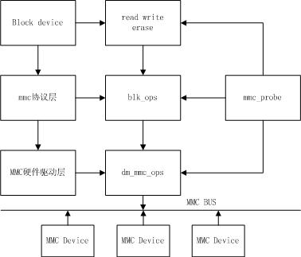

# U-Boot MMC Device Driver Analysis

文件标识：RK-KF-YF-156

发布版本：V1.1.0

日期：2021-03-02

文件密级：□绝密   □秘密   □内部资料   ■公开

**免责声明**

本文档按“现状”提供，瑞芯微电子股份有限公司（“本公司”，下同）不对本文档的任何陈述、信息和内容的准确性、可靠性、完整性、适销性、特定目的性和非侵权性提供任何明示或暗示的声明或保证。本文档仅作为使用指导的参考。

由于产品版本升级或其他原因，本文档将可能在未经任何通知的情况下，不定期进行更新或修改。

**商标声明**

“Rockchip”、“瑞芯微”、“瑞芯”均为本公司的注册商标，归本公司所有。

本文档可能提及的其他所有注册商标或商标，由其各自拥有者所有。

**版权所有 © 2021 瑞芯微电子股份有限公司**

超越合理使用范畴，非经本公司书面许可，任何单位和个人不得擅自摘抄、复制本文档内容的部分或全部，并不得以任何形式传播。

瑞芯微电子股份有限公司

Rockchip Electronics Co., Ltd.

地址：     福建省福州市铜盘路软件园A区18号

网址：     [www.rock-chips.com](http://www.rock-chips.com)

客户服务电话： +86-4007-700-590

客户服务传真： +86-591-83951833

客户服务邮箱： [fae@rock-chips.com](mailto:fae@rock-chips.com)

---

**前言**

**概述**

该文档介绍 Rockchip U-Boot next-dev 的 MMC 驱动，包括协议层，驱动层介绍，DTS 配置。

**产品版本**

| **芯片名称** | **U-Boot版本** |
| ------------ | -------------- |
| 所有芯片      | next-dev |

**读者对象**

本文档（本指南）主要适用于以下工程师：

技术支持工程师

软件开发工程师

**修订记录**

| **版本号** | **作者** | **修改日期** | **修改说明**                                 |
| ---------- | -------- | :----------- | ------------- |
| V1.0.0     | 朱志展     | 2018-08-31   | 初始版本      |
| V1.0.1     | 黄莹     | 2021-03-02   | 修改格式        |

---

**目录**

[TOC]

---

## MMC 设备简介

MMC 为 MultiMedia Card，多媒体存储卡，但后续泛指一个接口协定（一种卡式），能符合这接口的内存器都可称作 mmc 储存体。可以分为三类：

- mmc type card ：1.标准 mmc 卡：闪存卡的一种，使用 mmc 标准；2. emmc：Embedded MultiMediaCard，是 MMC 协会所制定的内嵌式存储器标准规格，带有 mmc 接口，是具备 mmc 协议的芯片。
- sd type card：SD 卡为 Secure Digital Memory Card, 即安全数码卡。它在 MMC 的基础上发展而来，增加了两个主要特色：SD 卡强调数据的安全安全，可以设定所储存的使用权限，防止数据被他人复制。兼容 mmc 接口规范。
- sdio type card：SDIO 是在 SD 标准上定义了一种外设接口，它和 SD 卡规范间的一个重要区别是增加了低速标准。在 SDIO 卡只需要 SPI 和 1 位 SD 传输模式。低速卡的目标应用是以最小的硬件开销支持低速 IO 能力。常见的 sdio 设备有 Wi-Fi card、Bluetooth card 等等。

目前 MMC 设备的可运行的电压有三种：3V、1.8V、1.2V。工作时钟频率范围为 0～200 MHz。

本文主要介绍 U-Boot 下的 MMC 设备驱动。

## DTS 配置说明

U-Boot 下的 MMC 设备驱动支持设备树，驱动的硬件配置需要在对应的 dtsi & dts 内配置。

dtsi 的配置及说明：

```c
emmc: dwmmc@ff390000 {
	compatible = "rockchip,px30-dw-mshc", "rockchip,rk3288-dw-mshc";
	reg = <0x0 0xff390000 0x0 0x4000>;                      //控制器寄存器base address及长度
	max-frequency = <150000000>;                            //eMMC普通模式时钟为50MHz,当配置为eMMC
                                                              HS200模式，该max-frequency生效
	clocks = <&cru HCLK_EMMC>, <&cru SCLK_EMMC>,
		 <&cru SCLK_EMMC_DRV>, <&cru SCLK_EMMC_SAMPLE>;     //控制器对应时钟编号
	clock-names = "biu", "ciu", "ciu-drv", "ciu-sample";    //控制器时钟名
	fifo-depth = <0x100>;                                   //fifo深度，默认配置
	interrupts = <GIC_SPI 53 IRQ_TYPE_LEVEL_HIGH>;          //中断配置
	status = "disabled";
};
```

板级 dts 配置及说明：

```c
&emmc {
	u-boot,dm-pre-reloc;                    //表示这个设备在relocate之前就需要使用
	bus-width = <8>;                        //设备总线位宽
	cap-mmc-highspeed;                      //标识此卡槽支持highspeed mmc
	mmc-hs200-1_8v;                         //支持HS200
	supports-emmc;                          //标识此插槽为eMMC功能，必须添加，否则无法初始化外设。
	disable-wp;                             //对于无物理WP管脚，需要配置
	non-removable;                          //此项表示该插槽为不可移动设备。 此项为必须添加项。
	num-slots = <1>;                        //标识为第几插槽
	pinctrl-names = "default";
	pinctrl-0 = <&emmc_clk &emmc_cmd &emmc_bus8>;
	status = "okay";
};
```

## MMC 初始化

MMC 初始化主要分为两个部分：1，MMC 控制器初始化；2，MMC 设备初始化。

### MMC 控制器初始化

Rockchip 在`uboot/arch/arm/mach-rockchip/board.c`调用 mmc_initialize(gd->bd)。
mmc_initialize(gd->bd)，为硬件驱动 probe 过程，函数位于`uboot/drivers/mmc/mmc.c`。代码如下：

```c
int mmc_initialize(bd_t *bis)
{
	static int initialized = 0;
	int ret;
	if (initialized)	/* Avoid initializing mmc multiple times */
		return 0;
	initialized = 1;

#if !CONFIG_IS_ENABLED(BLK)
#if !CONFIG_IS_ENABLED(MMC_TINY)
	mmc_list_init();
#endif
#endif
	ret = mmc_probe(bis);
	if (ret)
		return ret;

#ifndef CONFIG_SPL_BUILD
	print_mmc_devices(',');
#endif

	mmc_do_preinit();
	return 0;
}
```

mmc_probe(bis)主要做了：

- MMC 控制器的初始化及获取 MMC 设备配置
- 时钟初始化
- GPIO 初始化

MMC 控制器公用代码位于`uboot/drivers/mmc/dw_mmc.c`，平台代码位于`uboot/drivers/mmc/rockchip_dw_mmc.c`。

时钟框架代码位于`uboot/drivers/clk/rockchip/clk_xxx.c`，每个平台有自己的时钟框架，对应不同文件。

目前 Rockchip 平台只做了 MMC 控制器的初始化及时钟初始化，GPIO 使用 pre-loader 的配置。

defconfig 内会有 CONFIG_OF_SPL_REMOVE_PROPS 的配置，为移除 DTS 内的某些配置。当驱动 probe 时，移除的配置就不会初始化。示例如下：

```c
CONFIG_OF_SPL_REMOVE_PROPS="pinctrl-0 pinctrl-names interrupt-parent assigned-clocks assigned-clock-rates assigned-clock-parents"
```

mmc_do_preinit()主要做了 static struct mmc mmc_static 初始化，注册 MMC 设备。

### MMC 设备初始化

MMC 控制器初始化，调用 mmc_init 对 MMC 卡做初始化，运行到相应的模式。函数位于`uboot/drivers/mmc/mmc.c`。

```c
int mmc_init(struct mmc *mmc)
{
	int err = 0;
	__maybe_unused unsigned start;
#if CONFIG_IS_ENABLED(DM_MMC)
	struct mmc_uclass_priv *upriv = dev_get_uclass_priv(mmc->dev);

	upriv->mmc = mmc;
#endif
	if (mmc->has_init)
		return 0;

	start = get_timer(0);

	if (!mmc->init_in_progress)
		err = mmc_start_init(mmc);

	if (!err)
		err = mmc_complete_init(mmc);
	if (err)
		printf("%s: %d, time %lu\n", __func__, err, get_timer(start));

	return err;
}
```

mmc_start_init：MMC 有多种类型，该函数为查询是哪个类型的 MMC 设备。

mmc_complete_init：初始化设备，获取设备信息。

## MMC 设备读写调用

mmc 挂载在 block 下，框架如下：



U-Boot 下读写擦除调用：

```c
struct blk_desc *dev_desc;
dev_desc = rockchip_get_bootdev();
unsigned long blk_dwrite(struct blk_desc *block_dev, lbaint_t start,lbaint_t blkcnt, const void *buffer);
unsigned long blk_dread(struct blk_desc *block_dev, lbaint_t start,lbaint_t blkcnt, void *buffer);
unsigned long blk_derase(struct blk_desc *block_dev, lbaint_t start,lbaint_t blkcnt);
```

## 常见问题排查

1. U-Boot 下如何配置使用 MMC 设备

- **请先按照 DTS 配置说明进行配置**
- MMC HS200 模式，注意 CONFIG_OF_SPL_REMOVE_PROPS 的配置，需要 remove clock-names。高速模式、SDR52，DDR52 无需 remove clock-names。

2. 初始化 MMC 设备失败

- 先查看 MMC device 端的电压是否正常，控制器的 logic 电压是否在 1.0V 以上
- 查看寄存器配置是否正确
- 查看时钟配置是否正确，可以在 clock 模块内打印出相应的时钟配置

3. 初始化成功，但读取固件失败

- 先查看 MMC device 端的电压是否正常，控制器的 logic 电压是否在 1.0 以上。
- 查看时钟配置是否正确，可以在 clock 模块内打印出相应的时钟配置
- MMC HS200 模式，查看 max-frequency 是否过高。
- 硬件是否虚焊

4. 当 U-Boot 作为 pre-loader 或 usbplug 使用时，emmc 初始化失败，命令停留在 CMD8

- Rockchip 平台 SDRAM 的前 1MB 位置为安全区域，加载起来的 pre-loader 或 usbplug 在此区域运行，而 emmc 为非安全的 IP，是无法访问该区域，需要配置允许 emmc 读数据到该区域，才能初始化成功。