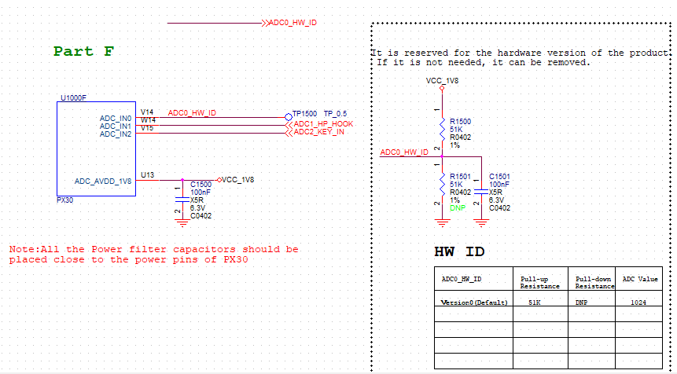

# U-Boot next-dev(v2017)开发指南

发布版本：1.44

作者邮箱：
​	Joseph Chen <chenjh@rock-chips.com>
​	Kever Yang <kever.yang@rock-chips.com>
​	Jon Lin jon.lin@rock-chips.com
​	Chen Liang cl@rock-chips.com
​	Ping Lin <hisping.lin@rock-chips.com>

日期：2019.10

文件密级：公开资料

-----------

**前言**

**概述**

本文主要指导读者如何在 U-Boot next-dev 分支进行项目开发。

**读者对象**

本文档（本指南）主要适用于以下工程师：

技术支持工程师

软件开发工程师

**各芯片 feature 支持状态**

| **芯片名称**    | **Distro Boot** | **RKIMG Boot** | **SPL/TPL** | **Trust(SPL)** | **AVB** |
| ----------- | :-------------- | :------------- | :---------- | :------------- | :------ |
| RV1108      | Y               | N              | Y           | N              | N       |
| RK3036      | Y               | N              | N           | N              | N       |
| RK3126C     | Y               | Y              | N           | N              | N       |
| RK3128      | Y               | Y              | N           | N              | N       |
| RK3229      | Y               | N              | Y           | Y              | Y       |
| RK3288      | Y               | N              | Y           | N              | N       |
| RK3308      | -               | -              | -           | -              | -       |
| RK3326/PX30 | Y               | Y              | N           | N              | Y       |
| RK3328      | Y               | N              | Y           | Y              | N       |
| RK3368/PX5  | Y               | N              | Y           | Y              | N       |
| RK3399      | Y               | N              | Y           | Y              | N       |

**修订记录**

| **日期**   | **版本** | **作者** | **修改说明**                                                 |
| ---------- | -------- | -------- | ------------------------------------------------------------ |
| 2018-02-28 | V1.00    | 陈健洪   | 初始版本                                                     |
| 2018-06-22 | V1.01    | 朱志展   | fastboot 说明，OPTEE Client 说明                               |
| 2018-07-23 | V1.10    | 陈健洪   | 完善文档，更新和调整大部分章节                               |
| 2018-07-26 | V1.11    | 林鼎强   | 完善 Nand、SFC SPI Flash 存储驱动部分                          |
| 2018-08-08 | V1.12    | 陈亮     | 增加 HW-ID 使用说明                                            |
| 2018-09-20 | V1.13    | 张晴     | 增加 CLK 使用说明                                              |
| 2018-11-06 | V1.20    | 陈健洪   | 增加/更新 defconfig/rktest/probe/interrupt/kernel dtb/uart/atags |
| 2019-01-21 | V1.21    | 陈健洪   | 增加 dtbo/amp/dvfs 宽温/fdt 命令说明                            |
| 2019-03-05 | V1.22    | 林平     | 增加 optee client 说明                                         |
| 2019-03-25 | V1.23    | 陈健洪/朱志展   | 增加 kernel cmdline 说明                                |
| 2019-03-25 | V1.30    | 陈健洪   | 精简和整理文档、纠正排版问题、完善和调整部分章节内容         |
| 2019-04-23 | V1.31    | 朱志展   | 增加硬件 CRYPTO 说明                                           |
| 2019-05-14 | V1.32    | 朱志展   | 补充 kernel cmdline 说明                                       |
| 2019-05-29 | V1.33    | 朱志展   | 增加 MMC 命令小节、AVB 与 A/B 系统说明，术语说明                           |
| 2019-06-20 | V1.40    | 陈健洪        | 增加/更新：memblk/sysmem/bi dram/statcktrace/hotkey/fdt param/run_command/distro/led/reset/env/wdt/spl/amp/crypto/efuse/Android compatible/io-domain/bootflow/pack image |
| 2019-08-21 | V1.41    | 朱志展        | 增加 secure otp 说明 |
| 2019-08-27 | V1.42    | 朱志展        | 增加存储设备/MTD 设备说明 |
| 2019-10-08 | V1.43   | 朱志展        | 增加 BCB 说明 |
| 2019-10-015 | V1.44  | 朱志展        | 增加 SPL 驱动与功能支持说明 |
---
[TOC]
---

## 1. U-Boot next-dev 简介

### 1.1 Feature

next-dev 是 Rockchip 从 U-Boot 官方的 v2017.09 正式版本中切出来进行开发的版本。目前在该平台上已经支持 RK 所有主流在售芯片。

目前支持的功能主要有：

- 支持 RK Android 平台的固件启动；
- 支持 Android AOSP(如 GVA)固件启动；
- 支持 Linux Distro 固件启动；
- 支持 Rockchip miniloader 和 SPL/TPL 两种 pre-loader 引导；
- 支持 LVDS、EDP、MIPI、HDMI 等显示设备；
- 支持 eMMC、Nand Flash、SPI Nand flash、SPI NOR flash、SD 卡、 U 盘等存储设备启动；
- 支持 FAT、EXT2、EXT4 文件系统；
- 支持 GPT、RK parameter 分区格式；
- 支持开机 logo 显示、充电动画显示，低电管理、电源管理；
- 支持 I2C、PMIC、CHARGE、GUAGE、USB、GPIO、PWM、GMAC、eMMC、NAND、中断等驱动；
- 支持 RockUSB 和 Google Fastboot 两种 USB gadget 烧写 eMMC；
- 支持 Mass storage、ethernet、HID 等 USB 设备；
- 支持使用 kernel 的 dtb；
- 支持 dtbo 功能；

U-Boot 的 doc 目录向用户提供了丰富的文档，介绍了 U-Boot 里各个功能模块的概念、设计理念、实现方法等，建议用户阅读这些文档提高开发效率。

### 1.2 启动流程

如下是 U-Boot 的启动流程，在此仅列出一些重要步骤：

```c
start.s
	// 汇编环境
	=> IRQ/FIQ/lowlevel/vbar/errata/cp15/gic   // ARM架构相关lowlevel初始化
	=> _main
		=> stack                               // 准备好C环境需要的栈

		// 【第一阶段】C环境初始化，发起一系列的函数调用
		=> board_init_f: init_sequence_f[]
			initf_malloc
			arch_cpu_init                      // 【SoC的lowlevel初始化、串口iomux、clk】
			serial_init                        // 串口初始化
			dram_init                          // 【获取ddr容量信息】
			reserve_mmu                        // 从ddr末尾开始往低地址进行各资源的reserve
			reserve_video
			reserve_uboot
			reserve_malloc
			reserve_global_data
			reserve_fdt
			reserve_stacks
			dram_init_banksize
			sysmem_init
			setup_reloc                        // U-Boot自身要reloc的地址

		// 汇编环境
		=> relocate_code                       // 汇编实现U-Boot代码的relocation

		// 【第二阶段】C环境初始化，发起一系列的函数调用
		=> board_init_r: init_sequence_r[]
			initr_caches                       // 使能MMU和I/Dcache
			initr_malloc
			bidram_initr
			sysmem_initr
			initr_of_live                      // 初始化of_live
			initr_dm                           // 初始化dm框架
			board_init                         // 【平台初始化，最核心部分】
				board_debug_uart_init          // 串口iomux、clk配置
				init_kernel_dtb                // 【切到kernel dtb】！
				clks_probe                     // 初始化系统频率
				regulators_enable_boot_on      // 初始化系统电源
				io_domain_init
				set_armclk_rate                // ARM提频(看平台需求，进行实现)
				dvfs_init
				rk_board_init                  // __weak，由各个具体平台进行实现
			console_init_r
			board_late_init                    // 【平台late初始化】
				rockchip_set_ethaddr           // 设置mac地址
				rockchip_set_serialno          // 设置serialno
				setup_boot_mode                // 解析"reboot xxx"命令、
				                               // 识别按键和loader烧写模式、recovery

				charge_display                 // U-Boot充电
				rockchip_show_logo
				soc_clk_dump                   // 打印clk tree
				rk_board_late_init             // __weak，由各个具体平台进行实现
			run_main_loop                      // 【进入命令行模式，或执行启动命令】
```

### 1.3 内存布局

U-Boot 代码先由前级 Loader 加载到```CONFIG_SYS_TEXT_BASE```地址上，U-Boot 在探明实际可用 DRAM 空间后开始通过一系列的 reserve_xxx()流程分配预留需要的系统内存资源（包括自身 relocate 需要的空间），如下图：

| **Name**  | **Start Addr** Offset    | **Size**                 | **Desc**                  |
| --------- | :----------------------- | :----------------------- | :------------------------ |
| ATF       | 0x00000000               | 1M                       | ARM Trusted Firmware      |
| SHM       | 0x00010000               | 1M                       | SHM, Pstore               |
| OP-TEE    | 0x08400000               | 2M~30M                   | 参考 TEE 开发手册           |
| Fdt       | fdt_addr_r               | -                        | kernel dtb                |
| Kernel    | kernel_addr_r            | -                        | -                         |
| Ramdisk   | ramdisk_addr_r           | -                        | -                         |
| ……    | -                        | -                        | -                         |
| Fastboot  | CONFIG_FASTBOOT_BUF_ADDR | CONFIG_FASTBOOT_BUF_SIZE | fastboot buffer           |
| ……    | -                        | -                        | -                         |
| Sp        | -                        | -                        | stack                     |
| Fdt       | -                        | sizeof(dtb)              | U-Boot dtb                |
| Gd        | -                        | sizeof(gd)               | -                         |
| Board     | -                        | sizeof(bd_t)             | board info, eg. dram size |
| Malloc    | -                        | CONFIG_SYS_MALLOC_LEN    | -                         |
| U-Boot    | -                        | sizeof(mon)              | text, data, bss           |
| Video FB  | -                        | fb size                  | 约 32M                     |
| TLB table | RAM_TOP-64K              | 32K                      | MMU 页表                   |

- Video FB/U-Boot/Malloc/Board/Gd/Fdt/Sp 由顶向下根据实际需求大小来分配；
- 64 位平台：ATF 是 ARMv8 必需的，OP-TEE 是可选项；32 位平台：只有 OP-TEE；
- kernel fdt/kernel/ramdisk 是 U-Boot 需要加载的固件地址，由```ENV_MEM_LAYOUT_SETTINGS```定义；
- Fastboot 功能需要的 buffer 地址和大小在 defconfig 中定义；
- OP-TEE 占据的空间需要根据实际需求而定，最大为 30M；其中 RK1808/RK3308 上 OP-TEE 的已经放在地址，不在 0x8400000；

## 2. 平台架构

### 2.1 DM 架构

DM（Driver Model）是 U-Boot 标准的 device-driver 开发模型，跟 kernel 的 device-driver 模型非常类似。U-Boot 使用 DM 对各类设备和驱动进行管理，Rockchip 提供的这套 U-Boot 也遵循 DM 框架进行开发。建议读者先阅读文档理解 DM，同时关注实现 DM 架构的相关代码。

README：

```
./doc/driver-model/README.txt
```

```
Terminology
-----------

Uclass - a group of devices which operate in the same way. A uclass provides
         a way of accessing individual devices within the group, but always
         using the same interface. For example a GPIO uclass provides
         operations for get/set value. An I2C uclass may have 10 I2C ports,
         4 with one driver, and 6 with another.

Driver - some code which talks to a peripheral and presents a higher-level
         interface to it.

Device - an instance of a driver, tied to a particular port or peripheral.
```

总结：

- uclass：设备驱动框架
- driver： 驱动
- device：设备

### 2.2 平台架构文件

平台架构文件主要是 Rockchip 的芯片级代码，本章重点介绍重要文件的位置，请用户深入了解其作用。

1. 平台目录

```
./arch/arm/include/asm/arch-rockchip/
./arch/arm/mach-rockchip/
./board/rockchip/
```

2. 平台头文件：

```
./arch/arm/include/asm/arch-rockchip/qos_rk3288.h
./arch/arm/include/asm/arch-rockchip/grf_rk3368.h
./arch/arm/include/asm/arch-rockchip/pmu_rk3399.h
......
```

```
./include/configs/rk3368_common.h
./include/configs/rk3328_common.h
./include/configs/rk3128_common.h
......
```

```
./include/configs/evb_rk3368.h
./include/configs/evb_rk3328.h
./include/configs/evb_rk3128.h
......
```

3. 平台驱动文件：

```
./arch/arm/mach-rockchip/rk3288/rk3288.c
./arch/arm/mach-rockchip/rk3368/rk3368.c
./arch/arm/mach-rockchip/rk3399/rk3399.c
......
```

```
./board/rockchip/evb_rk3288/evb_rk3288.c
./board/rockchip/evb_rk3368/evb_rk3368.c
./board/rockchip/evb_rk3399/evb_rk3399.c
......
```

4. 公共板级文件（核心！）：

```
./arch/arm/mach-rockchip/board.c
```

5. README：

```
./board/rockchip/evb_px5/README
./board/rockchip/evb_rv1108/README
./board/rockchip/sheep_rk3368/README
......
```

6. defconfig：

```
./configs/rk3328_defconfig
./configs/rk3036_defconfig
./configs/rk322x_defconfig
......
```

### 2.3 DTB 的使用

请务必先阅读[9. U-Boot 和 kernel DTB 支持](#9. U-Boot 和 kernel DTB 支持)，了解引入 kernel dtb 的相关技术背景。

说明：本文档中提到的“kernel dtb”一词除了表示名词含义：kernel 的 dtb 文件，也表示一种技术：U-Boot 阶段使用 kernel dtb。

U-Boot 的启动分为两个阶段：before relocate 和 after relocate。如下针对启用/未启用 kernel dtb 的情况，说明两个启动阶段中 dtb 的使用情况。

#### 2.3.1 启用 kernel dtb

**第一阶段（before relocate）：使用 U-Boot 的最简 dt-spl.dtb**

因为第一阶段通常只加载 MMC、NAND、CRU、GRF、UART 等基础模块，所以只需要一个最简 dtb 即可，这样还能节省 dtb 的扫描时间。U-Boot 自己的 dts 在编译阶段只保留带有"u-boot,dm-pre-reloc"属性的节点，由此得到一个 dt.dtb。然后再删除 dt.dtb 中被 CONFIG_OF_SPL_REMOVE_PROPS 指定的 property，最后得到一个最简 dt-spl.dtb（CONFIG_OF_SPL_REMOVE_PROPS 在 defconfig 中定义）。

通常把带有"u-boot,dm-pre-reloc"的节点放在各平台的 rkxxx-u-boot.dtsi 中：

```
./arch/arm/dts/rk3328-u-boot.dtsi
./arch/arm/dts/rk3399-u-boot.dtsi
./arch/arm/dts/rk3128-u-boot.dtsi
......
```

./arch/arm/dts/rk3399-u-boot.dtsi：

```
......
&nandc0 {
	u-boot,dm-pre-reloc;
};

&emmc {
	u-boot,dm-pre-reloc;
};

&cru {
	u-boot,dm-pre-reloc;
};
......
```

**第二阶段（after relocate）：使用 kernel 的 dtb**

U-Boot 进入第二阶段后，在./arch/arm/mach-rockchip/board.c 的 board_init()中加载并切换到 kernel dtb，后续所有外设的初始化都使用 kernel dtb 信息，因此一份 U-Boot 固件可以兼容不同板子的硬件差异。

#### 2.3.2 关闭 kernel dtb

U-Boot 两个阶段都使用 U-Boot 自己的 dtb（非最简 dtb，即所有节点都是有效的）。

### 2.4 平台配置

本章针对 rockchip-common.h、rkxxx_common.h、evb_rkxxx.h 定义的重要配置给出说明。

- RKIMG_DET_BOOTDEV：存储类型探测命令，以逐个扫描的方式探测当前的存储设备类型
- RKIMG_BOOTCOMMAND：kernel 启动命令
- ENV_MEM_LAYOUT_SETTINGS：固件加载地址：包括 ramdisk/fdt/kernel
- PARTS_DEFAULT：默认的 GPT 分区表，在某些情况下，当存储中没有发现有效的 GPT 分区表时被使用
- ROCKCHIP_DEVICE_SETTINGS：外设相关命令，主要是指定 stdio（一般会包含显示模块启动命令）
- BOOTENV：distro 方式启动 linux 时的启动设备探测命令
- CONFIG_SYS_MALLOC_LEN：malloc 内存池大小
- CONFIG_SYS_TEXT_BASE：U-Boot 运行的起始地址
- CONFIG_BOOTCOMMAND：启动命令，一般定义为 RKIMG_BOOTCOMMAND
- CONFIG_PREBOOT：预启动命令，在 CONFIG_BOOTCOMMAND 前被执行
- CONFIG_SYS_MMC_ENV_DEV：MMC 作为 ENV 存储介质时的 dev num，一般是 0

如下以 RK3399 为例进行说明：

./include/configs/rockchip-common.h：

```c
......
#define RKIMG_DET_BOOTDEV \                           // 动态探测当前的存储类型
	"rkimg_bootdev=" \
	"if mmc dev 1 && rkimgtest mmc 1; then " \
		"setenv devtype mmc; setenv devnum 1; echo Boot from SDcard;" \
	"elif mmc dev 0; then " \
		"setenv devtype mmc; setenv devnum 0;" \
	"elif rknand dev 0; then " \
		"setenv devtype rknand; setenv devnum 0;" \
        "elif rksfc dev 0; then " \
                "setenv devtype rksfc; setenv devnum 0;" \
	"fi; \0"

#define RKIMG_BOOTCOMMAND \
	"boot_android ${devtype} ${devnum};" \           // 启动android格式固件
	"bootrkp;" \                                     // 启动RK格式固件
	"run distro_bootcmd;"                            // 启动linux固件
......
```

./include/configs/rk3399_common.h：

```c
......
#ifndef CONFIG_SPL_BUILD
#define ENV_MEM_LAYOUT_SETTINGS \        // 固件的加载地址
	"scriptaddr=0x00500000\0" \
	"pxefile_addr_r=0x00600000\0" \
	"fdt_addr_r=0x01f00000\0" \
	"kernel_addr_r=0x02080000\0" \
	"ramdisk_addr_r=0x0a200000\0"

#include <config_distro_bootcmd.h>
#define CONFIG_EXTRA_ENV_SETTINGS \
	ENV_MEM_LAYOUT_SETTINGS \
	"partitions=" PARTS_DEFAULT \        // 默认的GPT分区表
	ROCKCHIP_DEVICE_SETTINGS \
	RKIMG_DET_BOOTDEV \
	BOOTENV                              // 启动linux时的启动设备探测命令
#endif

#define CONFIG_PREBOOT                   // 在CONFIG_BOOTCOMMAND之前被执行的预启动命令
......
```

./include/configs/evb_rk3399.h：

```c
......
#ifndef CONFIG_SPL_BUILD
#undef CONFIG_BOOTCOMMAND
#define CONFIG_BOOTCOMMAND RKIMG_BOOTCOMMAND // 定义启动命令（设置为RKIMG_BOOTCOMMAND）
#endif
......
#define ROCKCHIP_DEVICE_SETTINGS \           // 使能显示模块
		"stdout=serial,vidconsole\0" \
		"stderr=serial,vidconsole\0"
......
```

### 2.5 调试方法

#### 2.5.1 流程类

##### 2.5.1.1 debug()

如果需要 debug()生效，可在各平台 rkxxx_common.h 中定义：

````
#define DEBUG
````

##### 2.5.1.2 Early Debug UART

请参考本文档[5.10.2 Early Debug UART 配置](#5.10.2 Early Debug UART 配置)。

##### 2.5.1.3 initcall

U-Boot 的启动流程本质上是一系列函数调用，把 initcall_run_list()里的 debug 改成 printf 可以打印出调用顺序。

例如 RK3399：

```
U-Boot 2017.09-01725-g03b8d3b-dirty (Jul 06 2018 - 10:08:27 +0800)

initcall: 0000000000214388
initcall: 0000000000214724
Model: Rockchip RK3399 Evaluation Board
initcall: 0000000000214300
DRAM:  initcall: 0000000000203f68
initcall: 0000000000214410
initcall: 00000000002140dc
....
3.8 GiB
initcall: 00000000002143b8
....
Relocation Offset is: f5c03000
initcall: 00000000f5e176bc
initcall: 00000000002146a4 (relocated to 00000000f5e176a4)
initcall: 0000000000214668 (relocated to 00000000f5e17668)

....
```

虽然只打印出函数地址，但只要结合反汇编就可以对应上函数名。请参考本文档[3.2.6 debug 辅助命令](#3.2.6 debug 辅助命令)。

#### 2.5.2 读写类

##### 2.5.2.1 命令行模式

U-Boot 命令行模式提供了许多命令，输入"?"可列出当前支持的所有命令：

```
=> ?
?       - alias for 'help'
base    - print or set address offset
bdinfo  - print Board Info structure
boot    - boot default, i.e., run 'bootcmd'
boot_android- Execute the Android Bootloader flow.
bootd   - boot default, i.e., run 'bootcmd'
bootefi - Boots an EFI payload from memory
bootelf - Boot from an ELF image in memory
......
```

2 种方法进入命令行模式（2 选 1）：

- 配置 CONFIG_BOOTDELAY=\<seconds\>进入命令行倒计时模式，再按 ctrl+c 进入命令行；
- U-Boot 开机阶段长按 ctrl+c 组合键，强制进入命令行；

##### 2.5.2.2 io 命令

U-Boot 中的 io 命令为：md/mw

```c
// 读操作
md - memory display
Usage: md [.b, .w, .l, .q] address [# of objects]

// 写操作
mw - memory write (fill)
Usage: mw [.b, .w, .l, .q] address value [count]
```

其中：

```
 .b 表示的数据长度是： 1 byte;
 .w 表示的数据长度是： 2 byte;
 .l 表示的数据长度是： 4 byte; (推荐)
 .q 表示的数据长度是： 8 byte;
```

范例：

1. 读操作：显示 0x76000000 地址开始的连续 0x10 个数据单元，每个数据单元的长度是 4-byte。

```c
=> md.l 0x76000000 0x10
76000000: fffffffe ffffffff ffffffff ffffffff    ................
76000010: ffffffdf ffffffff feffffff ffffffff    ................
76000020: ffffffff ffffffff ffffffff ffffffff    ................
76000030: ffffffff ffffffff ffffffff ffffffff    ................
```

2. 写操作：对 0x76000000 地址的数据单元赋值为 0xffff0000；

```c
=> mw.l 0x76000000 0xffff0000
=> md.l 0x76000000 0x10	// 回读
76000000: ffff0000 ffffffff ffffffff ffffffff    ................
76000010: ffffffdf ffffffff feffffff ffffffff    ................
76000020: ffffffff ffffffff ffffffff ffffffff    ................
76000030: ffffffff ffffffff ffffffff ffffffff    ................
```

3. 写操作（连续）：对 0x76000000 地址开始的连续 0x10 个数据单元都赋值为 0xffff0000，每个数据单元的长度是 4-byte。

```c
=> mw.l 0x76000000 0xffff0000 0x10
=> md.l 0x76000000 0x10		// 回读
76000000: ffff0000 ffff0000 ffff0000 ffff0000    ................
76000010: ffff0000 ffff0000 ffff0000 ffff0000    ................
76000020: ffff0000 ffff0000 ffff0000 ffff0000    ................
76000030: ffff0000 ffff0000 ffff0000 ffff0000    ................
```

##### 2.5.2.3 iomem 命令

iomem：解析 dts 节点获取基地址信息后再读取寄存器值，比 md 更灵活。有 2 种使用方式：命令行和函数接口。

1. 命令行

```
=> iomem
iomem - Show iomem data by device compatible

Usage:
iomem <compatible> <start offset>  <end offset>
eg: iomem -grf 0x0 0x200
```

@\<compatible\>：支持 compatible 关键字匹配。例如 RK3228 平台上读取 GRF：

```
=> iomem -grf 0x0 0x20
rockchip,rk3228-grf:
11000000:  00000000 00000000 00004000 00002000
11000010:  00000000 00005028 0000a5a5 0000aaaa
11000020:  00009955
```

2. 函数接口：

```c
void iomem_show(const char *label, unsigned long base, size_t start, size_t end);
void iomem_show_by_compatible(const char *compat, size_t start, size_t end);
```

##### 2.5.2.4 i2c 命令

```
CONFIG_CMD_I2C
```

```
=> i2c
i2c - I2C sub-system

Usage:
i2c dev [dev] - show or set current I2C bus
i2c md chip address[.0, .1, .2] [# of objects] - read from I2C device
i2c mw chip address[.0, .1, .2] value [count] ‐ write to I2C device (fill)
......
```

范例：

1. 读操作：

```c
=> i2c dev 0                     // 切到i2c0（指定一次即可）
Setting bus to 0

=> i2c md 0x1b 0x2e 0x20         // i2c设备地址为1b(7位地址)，读取0x2e开始的连续0x20个寄存器值
002e: 11 0f 00 00 11 0f 00 00 01 00 00 00 09 00 00 0c    ................
003e: 00 0a 0a 0c 0c 0c 00 07 07 0a 00 0c 0c 00 00 00    ................
```

2. 写操作：

```c
=> i2c dev 0                     // 切到i2c0（指定一次即可）
Setting bus to 0

=> i2c mw 0x1b 0x2e 0x10         // i2c设备地址为1b(7位地址)，对0x2e寄存器赋值为0x10
=> i2c md 0x1b 0x2e 0x20         // 回读
002e: 10 0f 00 00 11 0f 00 00 01 00 00 00 09 00 00 0c    ................
003e: 00 0a 0a 0c 0c 0c 00 07 07 0a 00 0c 0c 00 00 00    ................
```

##### 2.5.2.5 fdt 读写

U-Boot 提供的 fdt 命令可以实现对当前 dtb 的读、写操作：

```
=> fdt
fdt - flattened device tree utility commands

Usage:
fdt addr [-c]  <addr> [<length>]    - Set the [control] fdt location to <addr>
fdt print  <path> [<prop>]          - Recursive print starting at <path>
fdt list   <path> [<prop>]          - Print one level starting at <path>
......
NOTE: Dereference aliases by omitting the leading '/', e.g. fdt print ethernet0.
```

其中如下两条组合命令可以把 fdt 完整 dump 出来，比较常用：

```c
=> fdt addr $fdt_addr_r   // 指定fdt地址
=> fdt print              // 把fdt内容全部打印出来
```

##### 2.5.2.6 MMC 命令

使能：

```
CONFIG_CMD_MMC
```

查看信息：

```c
=> mmc info
Device: dwmmc@ff0f0000                  //设备节点
Manufacturer ID: 15
OEM: 100
Name: 8GME4
Timing Interface: High Speed            //速度模式
Tran Speed: 52000000                    //当前速度
Rd Block Len: 512
MMC version 5.1
High Capacity: Yes
Capacity: 7.3 GiB                       //存储容量
Bus Width: 8-bit                        //总线宽度
Erase Group Size: 512 KiB
HC WP Group Size: 8 MiB
User Capacity: 7.3 GiB WRREL
Boot Capacity: 4 MiB ENH
RPMB Capacity: 512 KiB ENH
```

切换 MMC 设备：

```c
=> mmc dev 0                            //切换到eMMC
=> mmc dev 1                            //切换到sd卡
```

MMC 设备读写命令：

```c
mmc read addr blk# cnt
mmc write addr blk# cnt
mmc erase blk# cnt
例：
=> mmc read 0x70000000 0 1              //读取MMC设备第一个block，大小为1 sector的数据到内存0x70000000
=> mmc write 0x70000000 0 1             //把内存0x70000000起1 sector的数据写到存储第一个block起位置
=> mmc erase 0 1                        //擦除存储第一个block起1 sector数据
```

如果 MMC 设备读写异常，可以通过以下简单步骤快速定位：

1. 把 drivers/mmc/dw_mmc.c 内的 debug 改为 printf，重新编译下载固件

2. 重启设备，查看 MMC 设备的打印信息最终打印信息

- 如果最终打印为 Sending CMD0，硬件可以检查设备供电，管脚连接，软件可以检查 IOMUX 是否被其他 IP 切换
- 如果最终打印为 Sending CMD8，软件需要设置 MMC 设备允许访问安全存储
- 如果初始化命令都已通过，最终打印为 Sending CMD18，硬件可以检查 MMC 设备供电，靠近 MMC 设备供电端的电容是否足够，可以更换大电容，软件可以降低时钟频率，切换 MMC 设备的速度模式

#### 2.5.3 状态类

##### 2.5.3.1 printf 时间戳

```
CONFIG_BOOTSTAGE_PRINTF_TIMESTAMP
```

范例：

```
[    0.259266] U-Boot 2017.09-01739-g856f373-dirty (Jul 10 2018 - 20:26:05 +0800)
[    0.260596] Model: Rockchip RK3399 Evaluation Board
[    0.261332] DRAM:  3.8 GiB
Relocation Offset is: f5bfd000
Using default environment

[    0.354038] dwmmc@fe320000: 1, sdhci@fe330000: 0
[    0.521125] Card did not respond to voltage select!
[    0.521188] mmc_init: -95, time 9
[    0.671451] switch to partitions #0, OK
[    0.671500] mmc0(part 0) is current device
[    0.675507] boot mode: None
[    0.683738] DTB: rk-kernel.dtb
[    0.706940] Using kernel dtb
......
```

注意：

1. U-Boot 是单核运行，时间戳打印会增加耗时；
2. 时间戳的时间不是从 0 开始，只是把当前系统的 timer 时间读出来而已，所以只适合计算时间差；
3. 建议默认关闭该功能，仅调试打开。

##### 2.5.3.2 dm 命令

"dm"命令：查看 dm 框架管理下的所有 device-driver 状态。

通过 dm 命令展示的拓扑图，用户能看到所有 device-driver 的状态，包含的信息：

- 某个 device 是否和 driver 完成 bind；
- 某个 driver 是否已经 probe；
- 某个 uclass 下的所有 device；
- 各个 device 之间的关系；

```c
=> dm
dm - Driver model low level access

Usage:
dm tree          Dump driver model tree ('*' = activated)
dm uclass        Dump list of instances for each uclass
dm devres        Dump list of device resources for each device // 暂时无用
```

1. "dm tree"命令：

- 列出所有完成 bind 的 device-driver；
- 列出所有 uclass-device-driver 的隶属关系；
- [ + ] 表示当前 driver 已经完成 probe；

```
=> dm tree

 Class      Probed        Driver               Name
----------------------------------------------------------
 root       [ + ]   root_driver                root_driver
 syscon     [   ]   rk322x_syscon              |-- syscon@11000000
 serial     [ + ]   ns16550_serial             |-- serial@11030000
 clk        [ + ]   clk_rk322x                 |-- clock-controller@110e0000
 sysreset   [   ]   rockchip_sysreset          |   |-- sysreset
 reset      [   ]   rockchip_reset             |   `-- reset
 mmc        [ + ]   rockchip_rk3288_dw_mshc    |-- dwmmc@30020000
 blk        [ + ]   mmc_blk                    |   `-- dwmmc@30020000.blk
 ram        [   ]   rockchip_rk322x_dmc        |-- dmc@11200000
 serial     [ + ]   ns16550_serial             |-- serial@11020000
 i2c        [ + ]   i2c_rockchip               |-- i2c@11050000
 ......
```

2. "dm uclass"命令：列出 uclass 下的所有 device；

```
=> dm uclass

uclass 0: root
- * root_driver @ 7be54c88, seq 0, (req -1)

uclass 11: adc
- * saradc@ff100000 @ 7be56220, seq 0, (req -1)
......
uclass 40: backlight
- * backlight @ 7be81178, seq 0, (req -1)

uclass 77: key
-   rockchip-key @ 7be811f0
......
```

##### 2.5.3.3 panic cpu 信息

系统的 panic 信息包含 CPU 现场状态，用户可以通过它们定位问题原因：

```
* Relocate offset = 000000003db55000
* ELR(PC)    =   000000000025bd78
* LR         =   000000000025def4
* SP         =   0000000039d4a6b0

* ESR_EL2    =   0000000040732550
		EC[31:26] == 001100, Exception from an MCRR or MRRC access
		IL[25] == 0, 16-bit instruction trapped

* DAIF       =   00000000000003c0
		D[9] == 1, DBG masked
		A[8] == 1, ABORT masked
		I[7] == 1, IRQ masked
		F[6] == 1, FIQ masked

* SPSR_EL2   =   0000000080000349
		D[9] == 1, DBG masked
		A[8] == 1, ABORT masked
		I[7] == 0, IRQ not masked
		F[6] == 1, FIQ masked
		M[4] == 0, Exception taken from AArch64
		M[3:0] == 1001, EL2h

* SCTLR_EL2  =   0000000030c51835
		I[12] == 1, Icaches enabled
		C[2] == 1, Dcache enabled
		M[0] == 1, MMU enabled

* VBAR_EL2   =   000000003dd55800
* HCR_EL2    =   000000000800003a
* TTBR0_EL2  =   000000003fff0000

x0 : 00000000ff300000 x1 : 0000000054808028
x2 : 000000000000002f x3 : 00000000ff160000
x4 : 0000000039d7fe80 x5 : 000000003de24ab0
......
x28: 0000000039d81ef0 x29: 0000000039d4a910
```

- EC[31:26]表明了 CPU 异常原因；
- 各寄存器展示了 CPU 现场状态；
- PC、LR、SP 最重要，用户结合反汇编能定位到出错点，请参考本文档[3.2.6 debug 辅助命令](#3.2.6 debug 辅助命令)。

##### 2.5.3.4 panic register 信息

系统的 panic 信息也可以包含平台相关的寄存器状态。目前支持打印：CRU、PMUCRU、GRF、PMUGRF。

```
CONFIG_ROCKCHIP_CRASH_DUMP
```

范例：

```c
......
* VBAR_EL2   =   000000003dd55800
* HCR_EL2    =   000000000800003a
* TTBR0_EL2  =   000000003fff0000

x0 : 00000000ff300000 x1 : 0000000054808028
x2 : 000000000000002f x3 : 00000000ff160000
......

// 平台寄存器信息：
rockchip,px30-cru:
ff2b0000:  0000304b 00001441 00000001 00000007
ff2b0010:  00007f00 00000000 00000000 00000000
ff2b0020:  00003053 00001441 00000001 00000007
......

rockchip,px30-grf:
ff140000:  00002222 00002222 00002222 00001111
ff140010:  00000000 00000000 00002200 00000033
ff140020:  00000000 00000000 00000000 00000202
......
```

用户想增加更多打印需要修改./arch/arm/lib/interrupts_64.c：

```
void show_regs(struct pt_regs *regs)
{
......
#ifdef CONFIG_ROCKCHIP_CRASH_DUMP
	iomem_show_by_compatible("-cru", 0, 0x400);
	iomem_show_by_compatible("-pmucru", 0, 0x400);
	iomem_show_by_compatible("-grf", 0, 0x400);
	iomem_show_by_compatible("-pmugrf", 0, 0x400);
	/* tobe add here ... */
#endif
}
```

##### 2.5.3.5 卡死信息

U-Boot 启动遇到卡死、串口无响应、无有效打印时，用户可以提前使能该功能，串口会每隔 5s dump 出 panic 信息（请参考本文档[2.5.3.3 panic cpu 信息](#2.5.3.3 panic cpu 信息)）。建议默认关闭此功能，仅调试打开。

```
CONFIG_ROCKCHIP_DEBUGGER
```

范例：

```c
>>> Rockchip Debugger:
* Relocate offset = 000000003db55000
* ELR(PC)    =   000000000025bd78
* LR         =   000000000025def4
* SP         =   0000000039d4a6b0

* ESR_EL2    =   0000000040732550
		<NULL>		// 因为只是卡住，CPU本身可能状态正常，所以EC[31:26]没有显示异常原因。
		IL[25] == 0, 16-bit instruction trapped

* DAIF       =   00000000000003c0
		D[9] == 1, DBG masked
		A[8] == 1, ABORT masked
		I[7] == 1, IRQ masked
		F[6] == 1, FIQ masked
......
```

##### 2.5.3.6 CRC 校验

RK 格式打包的固件，hdr 里包含了打包工具计算的 CRC。如果用户怀疑 U-Boot 加载的固件存在完整性问题，可打开 CRC 校验进行确认。CRC 校验比较耗时，建议默认关闭此功能，仅调试打开。

```
CONFIG_ROCKCHIP_CRC
```

范例：

```c
=Booting Rockchip format image=
kernel image CRC32 verify... okay.		// kernel 校验成功（如果失败则打印“fail！”）
boot image CRC32 verify... okay.		// boot 校验成功（如果失败则打印“fail！”）
kernel   @ 0x02080000 (0x01249808)
ramdisk  @ 0x0a200000 (0x001e6650)
## Flattened Device Tree blob at 01f00000
   Booting using the fdt blob at 0x1f00000
  'reserved-memory' secure-memory@20000000: addr=20000000 size=10000000
   Loading Ramdisk to 08019000, end 081ff650 ... OK
   Loading Device Tree to 0000000008003000, end 0000000008018c97 ... OK
Adding bank: start=0x00200000, size=0x08200000
Adding bank: start=0x0a200000, size=0xede00000

Starting kernel ...
```

##### 2.5.3.7 开机信息

某些情况下，开机信息也可以帮助用户定位一些死机问题。

1. trust 跑完后就卡死

trust 跑完后就卡死的可能性：固件打包或者烧写有问题，导致 trust 跳转到错误的 U-Boot 启动地址。此时，用户可以通过 trust 启动信息里的 U-Boot 启动地址来确认。

64 位平台 U-Boot 启动地址一般是偏移 0x200000（DRAM 起始地址是 0x0）：

```c
NOTICE:  BL31: v1.3(debug):d98d16e
NOTICE:  BL31: Built : 15:03:07, May 10 2018
NOTICE:  BL31: Rockchip release version: v1.1
INFO:    GICv3 with legacy support detected. ARM GICV3 driver initialized in EL3
INFO:    Using opteed sec cpu_context!
INFO:    boot cpu mask: 0
INFO:    plat_rockchip_pmu_init(1151): pd status 3e
INFO:    BL31: Initializing runtime services
INFO:    BL31: Initializing BL32
INFO:    BL31: Preparing for EL3 exit to normal world
INFO:    Entry point address = 0x200000	 // U-Boot地址
INFO:    SPSR = 0x3c9
```

32 位平台 U-Boot 启动地址一般是偏移 0x0（DRAM 起始地址是 0x60000000）：

```c
INF [0x0] TEE-CORE:init_primary_helper:378: Release version: 1.9
INF [0x0] TEE-CORE:init_primary_helper:379: Next entry point address: 0x60000000  // U-Boot地址
INF [0x0] TEE-CORE:init_teecore:83: teecore inits done
```

2. U-Boot 版本回溯：

通过 U-Boot 开机信息可回溯编译版本。如下，对应提交点是 commit: b34f08b。

```
U-Boot 2017.09-01730-gb34f08b (Jul 06 2018 - 17:47:52 +0800)
```

开机信息中出现"dirty"，说明编译时有本地改动没有提交进仓库，编译点不干净。

```
U-Boot 2017.09-01730-gb34f08b-dirty (Jul 06 2018 - 17:35:04 +0800)
```

#### 2.5.4 烧写类

当烧写按键无法正常使用时，用户可以通过 U-Boot 命令行进入烧写模式，请参考本文档[3.2.8 烧写和工具](#3.2.8 烧写和工具)。

### 2.6 atags 机制

Pre-loader、trust(bl31/op-tee)、U-Boot 之间需要传递和共享某些信息，通过这些信息完成一些特定的功能。目前可通过 ATAGS 机制进行传递（不会传给 kernel），传递内容：串口配置、存储类型、bl31 和 op-tee 的内存布局、ddr 容量信息等。

驱动代码：

```
./arch/arm/include/asm/arch-rockchip/rk_atags.h
./arch/arm/mach-rockchip/rk_atags.c
```

### 2.7 probe 机制

U-Boot 通过 DM 管理所有的设备和驱动，它和 kernel 的 device-driver 模型非常类似。kernel 初始化时使用 initcall 机制把所有已经 bind 过的 device-driver 进行 probe，但是 U-Boot 没有这样的机制。

如果要让 U-Boot 中某个 driver 执行 probe，用户必须主动调用框架接口发起 probe。

```c
// 常用：
int uclass_get_device(enum uclass_id id, int index, struct udevice **devp);
int uclass_get_device_by_name(enum uclass_id id, const char *name,

// 不常用：
int uclass_get_device_by_seq(enum uclass_id id, int seq, struct udevice **devp);
int uclass_get_device_by_of_offset(enum uclass_id id, int node, struct udevice **devp);
int uclass_get_device_by_ofnode(enum uclass_id id, ofnode node, struct udevice **devp);
int uclass_get_device_by_phandle_id(enum uclass_id id,
									int phandle_id, struct udevice **devp);
int uclass_get_device_by_phandle(enum uclass_id id,
								 struct udevice *parent, struct udevice **devp);
int uclass_get_device_by_driver(enum uclass_id id,
								const struct driver *drv, struct udevice **devp);
int uclass_get_device_tail(struct udevice *dev, int ret, struct udevice **devp);
......
```

### 2.8 memblk 机制

**背景介绍**

U-Boot 可以访问系统的全部内存，从高地址往低地址预留、分配自身需要的内存资源（包括 malloc 内存池），但是剩余内存并没有任何管理机制，这是原生 U-Boot 一直存在的问题。如下图：

```c
Low-addr                                                           High-addr
|---------------------------------------|-----------------------------|
|       No memory management            | U-Boot  memory  management  |
|     Maybe memory blk overlap ?        | (malloc poll is included)   |
|---------------------------------------|-----------------------------|
0x0                                                                  N GB
```

目前 U-Boot 面临比较严峻的内存块分配问题，因为我们至少要考虑：ATF、OP-TEE、fdt、kernel、ramdisk、kernel reserved-memory、fastboot、amp firmware、bad memory block 等内存块的分配、生命周期问题。一不小心就容易出现内存冲突问题，这类问题往往是非常难排查的。因此，我们引入两个内存块管理机制：bidram、sysmem。

**相关代码：**

```
./lib/sysmem.c
./lib/bidram.c
./include/memblk.h
./arch/arm/mach-rockchip/memblk.c
```

**设计思路：**

- bidram

  U-Boot 负责告知 kernel 哪些内存空间可用、哪些不可用，例如：ATF、OP-TEE、amp firmware、bad memory block 占用的内存对 kernel 不可见，并且也不允许 U-Boot 访问；除此之外的都是 kernel 可见的空间。bidram 目前负责维护这些内存块信息。

- sysmem

  负责管理内核可见的内存块的使用。例如上述：fdt、ramdisk、kernel reserved-memory、fastboot 内存块的分配等。

至此，U-Boot 通过 sysmem、bidram、malloc 这三种内存管理机制把所有的内存都管理起来，避免了各模块的内存冲突。

**打印信息：**

如下是 bidram 和 sysmem 的内存管理信息表，当出现内存块初始化或分配异常时会被 dump 出来，如下做出简单介绍。

bidram 内存信息表：

```c
bidram_dump_all:
    --------------------------------------------------------------------
    // <1> 这里显示了U-Boot从前级loader获取的ddr的总容量信息，一共有2GB
    memory.rgn[0].addr     = 0x00000000 - 0x80000000 (size: 0x80000000)

    memory.total           = 0x80000000 (2048 MiB. 0 KiB)
    --------------------------------------------------------------------
    // <2> 这里显示了被预留起来的各固件内存信息，这些空间对kernel不可见
    reserved.rgn[0].name   = "ATF"
                   .addr   = 0x00000000 - 0x00100000 (size: 0x00100000)
    reserved.rgn[1].name   = "SHM"
                   .addr   = 0x00100000 - 0x00200000 (size: 0x00100000)
    reserved.rgn[2].name   = "OP-TEE"
                   .addr   = 0x08400000 - 0x0a200000 (size: 0x01e00000)

    reserved.total         = 0x02000000 (32 MiB. 0 KiB)
    --------------------------------------------------------------------
    // <3> 这里是核心算法对上述<2>进行的预留信息整理，例如：会对相邻块进行合并
    LMB.reserved[0].addr   = 0x00000000 - 0x00200000 (size: 0x00200000)
    LMB.reserved[1].addr   = 0x08400000 - 0x0a200000 (size: 0x01e00000)

    reserved.core.total    = 0x02000000 (32 MiB. 0 KiB)
    --------------------------------------------------------------------
```

sysmem 内存信息表：

```c
sysmem_dump_all:
    --------------------------------------------------------------------
    // <1> 这里是sysmem可管理的总内存容量，即bidram<3>之外的可用ddr容量，对kernel可见。
    memory.rgn[0].addr     = 0x00200000 - 0x08400000 (size: 0x08200000)
    memory.rgn[1].addr     = 0x0a200000 - 0x80000000 (size: 0x75e00000)

    memory.total           = 0x7e000000 (2016 MiB. 0 KiB)
    --------------------------------------------------------------------
    // <2> 这里显示了各个固件alloc走的内存块信息
    allocated.rgn[0].name  = "U-Boot"
                    .addr  = 0x71dd6140 - 0x80000000 (size: 0x0e229ec0)
    allocated.rgn[1].name  = "STACK"      <Overflow!> // 表明栈溢出
                    .addr  = 0x71bd6140 - 0x71dd6140 (size: 0x00200000)
    allocated.rgn[2].name  = "FDT"
                    .addr  = 0x08300000 - 0x08316204 (size: 0x00016204)
    allocated.rgn[3].name  = "KERNEL"     <Overflow!> // 表明内存块溢出
                    .addr  = 0x00280000 - 0x014ce204 (size: 0x0124e204)
    allocated.rgn[4].name  = "RAMDISK"
                    .addr  = 0x0a200000 - 0x0a3e6804 (size: 0x001e6804)
    // <3> malloc_r/f的大小
    malloc_r: 192 MiB, malloc_f: 16 KiB

    allocated.total        = 0x0f874acc (248 MiB. 466 KiB)
    --------------------------------------------------------------------
    // <4> 这里是核心算法对上述<2>进行的信息整理，显示被占用走的内存块信息
    LMB.reserved[0].addr   = 0x00280000 - 0x014ce204 (size: 0x0124e204)
    LMB.reserved[1].addr   = 0x08300000 - 0x08316204 (size: 0x00016204)
    LMB.reserved[2].addr   = 0x0a200000 - 0x0a3e6804 (size: 0x001e6804)
    LMB.reserved[3].addr   = 0x71bd6140 - 0x80000000 (size: 0x0e429ec0)

    reserved.core.total    = 0x0f874acc (248 MiB. 466 KiB)
    --------------------------------------------------------------------
```

**常见错误打印：**

如下是一些常见的错误打印，当出现这些异常时，请结合上述 bidram 和 sysmem dump 内存信息进行分析。

```c
// 期望申请的内存已经被其他固件占用了，存在内存重叠。这说明当前系统的内存块使用规划不合理
Sysmem Error: "KERNEL" (0x00200000 - 0x02200000) alloc is overlap with existence "RAMDISK" (0x00100000 - 0x01200000)

// 期望申请的内存因为一些特殊原因无法申请到（分析sysmem和bidram信息）
Sysmem Error: Failed to alloc "KERNEL" expect at 0x00200000 - 0x02200000 but at 0x00400000 - 0x0420000

// sysmem管理的空间起始地址为0x200000，所以根本申请不到0x100000起始的空间
Sysmem Error: Failed to alloc "KERNEL" at 0x00100000 - 0x02200000

// 重复申请"RAMDISK"内存块
Sysmem Error: Failed to double alloc for existence "RAMDISK"
```

### 2.9 dump_stack 机制

U-Boot 框架本身不支持调用栈回溯，rockchip 自己进行了实现，但不支持函数符号表自动解析，用户需要借助脚本完成解析，目前支持对 U-Boot/SPL/TPL 的调用栈信息进行解析（根据需求，3 选 1）：

```c
./scripts/stacktrace.sh ./dump.txt        // 解析来自U-Boot的s调用栈信息
./scripts/stacktrace.sh ./dump.txt tpl    // 解析来自tpl的调用栈信息
./scripts/stacktrace.sh ./dump.txt spl    // 解析来自spl的调用栈信息
```

- dump.txt 是包含了调用栈信息的文件，文件名不限（详见下述范例）。

如下是一个调用栈范例：

```c
......

Call trace:
  PC:   [< 0025b10c >]
  LR:   [< 0020565c >]

Stack:
        [< 0025b07c >]
        [< 0025e3fc >]
        [< 0025f5e8 >]
        [< 0020e1a8 >]
        [< 00228670 >]
        [< 00213958 >]
        [< 00213af8 >]
        [< 00213244 >]
        [< 00213714 >]
        [< 00213af8 >]
        [< 002131fc >]
        [< 00227ba0 >]
        [< 00202c60 >]
        [< 00202cdc >]
        [< 00202f8c >]
        [< 00273d04 >]
        [< 002148c0 >]
        [< 00201b2c >]
......
```

把上述调用栈信息保存到本地的任意新建文本中，例如./dump.txt，然后在 U-Boot 工程执行命令：

```c
cjh@ubuntu:~/u-boot$ ./scripts/stacktrace.sh ./dump.txt

// 这里重点突出了PC和LR值，以及它们的代码行位置
Call trace:
 PC:   [< 0025b10c >]  dwc3_gadget_uboot_handle_interrupt+0xa0/0x5bc   // 函数定位
							drivers/usb/dwc3/io.h:34                   // 代码行定位
 LR:   [< 0020565c >]  usb_gadget_handle_interrupts+0x10/0x1c
							board/rockchip/evb_rk3399/evb-rk3399.c:204

// 如下是真正完整的函数调用栈
Stack:
       [< 0025b10c >]  dwc3_gadget_uboot_handle_interrupt+0xa0/0x5bc
       [< 0025e3fc >]  sleep_thread.isra.20+0xb0/0x114
       [< 0025f5e8 >]  fsg_main_thread+0x2c8/0x182c
       [< 0020e1a8 >]  do_rkusb+0x250/0x338
       [< 00228670 >]  cmd_process+0xac/0xe0
       [< 00213958 >]  run_list_real+0x6fc/0x72c
       [< 00213af8 >]  parse_stream_outer+0x170/0x67c
       [< 00213244 >]  parse_string_outer+0xdc/0xf4
       [< 00213714 >]  run_list_real+0x4b8/0x72c
       [< 00213af8 >]  parse_stream_outer+0x170/0x67c
       [< 002131fc >]  parse_string_outer+0x94/0xf4
       [< 00227ba0 >]  run_command_list+0x38/0x90
       [< 00202c60 >]  rockchip_dnl_mode_check+0xa4/0x100
       [< 00202cdc >]  setup_boot_mode+0x20/0xf0
       [< 00202f8c >]  board_late_init+0x60/0xa0
       [< 00273d04 >]  initcall_run_list+0x58/0x94
       [< 002148c0 >]  board_init_r+0x20/0x24
       [< 00201b2c >]  relocation_return+0x4/0x0
```

### 2.10 cache 机制

Rockchip 平台默认使能 icache、dcache 和 mmu，其中 mmu 采用 1:1 平坦映射。

- CONFIG_SYS_ICACHE_OFF：如果定义，则关闭 icache 功能；否则打开。
- CONFIG_SYS_DCACHE_OFF：如果定义，则关闭 dcache 功能；否则打开。

Dcache 有多种工作模式，Rockchip 平台默认使能 dcache writeback。

- CONFIG_SYS_ARM_CACHE_WRITETHROUGH：如果定义，则配置为 dcache writethrouch 模式；
- CONFIG_SYS_ARM_CACHE_WRITEALLOC：如果定义，则配置为 dcache writealloc 模式；
- 如果上述两个宏都没有配置，则默认为 dcache writeback 模式；

Icache 接口：

```c
void icache_enable (void);
void icache_disable (void);
void invalidate_icache_all(void);
```

Dcache 接口：

```c
void dcache_disable (void);
void dcache_enable(void);
void flush_dcache_range(unsigned long start, unsigned long stop);
void flush_cache(unsigned long start, unsigned long size)；
void flush_dcache_all(void);
void invalidate_dcache_range(unsigned long start, unsigned long stop);
void invalidate_dcache_all(void);

// 重新映射某块内存区间的dcache属性
void mmu_set_region_dcache_behaviour(phys_addr_t start, size_t size,
                                     enum dcache_option option)
```

### 2.11 kernel 解压

U-Boot 负责 kernel 的引导，通常 32 位平台使用 zImage，64 位平台使用 Image，U-Boot 不用关心它们的解压问题。

目前 Rockchip 平台新增：U-Boot 支持解压 LZ4 格式内核。

- 使能配置：

```
CONFIG_LZ4
```

- ENV_MEM_LAYOUT_SETTINGS 中增加、配置地址：kernel_addr_c、kernel_addr_r。

  U-Boot 先把 LZ4 内核到 kernel_addr_c，再解压到 kernel_addr_r。

```c
#define ENV_MEM_LAYOUT_SETTINGS \
	"scriptaddr=0x00500000\0" \
	"pxefile_addr_r=0x00600000\0" \
	"fdt_addr_r=0x01f00000\0" \
	"kernel_addr_no_bl32_r=0x00280000\0" \
	"kernel_addr_r=0x00680000\0" \        // lz4解压内核的地址
	"kernel_addr_c=0x02480000\0" \        // lz4压缩内核的地址
	"ramdisk_addr_r=0x04000000\0"
```

### 2.12 hotkey

为了用户开发方便，rockchip 定义了一些快捷键用于调试或触发某些操作。快捷键主要通过串口输入实现：

- 开机长按 ctrl+c：进入 U-Boot 命令行模式；
- 开机长按 ctrl+d：进入 loader 烧写模式；
- 开机长按 ctrl+b：进入 maskrom 烧写模式；
- 开机长按 ctrl+f：进入 fastboot 模式；
- 开机长按 ctrl+m：打印 bidram/system 信息；
- 开机长按 ctrl+i：使能内核 initcall_debug；
- 开机长按 ctrl+p：打印 cmdline 信息；
- 开机长按 ctrl+s："Starting kernel..."之后进入 U-Boot 命令行；
- 开机反复按机器的 power button：进入 loader 烧写模式。但是用户需要先使能：

```
CONFIG_PWRKEY_DNL_TRIGGER_NUM
```

这是一个 int 类型的宏，用户根据实际情况定义（可理解为：灵敏度）。当连续按 power button 的次数超过定义值后，U-Boot 会进入 loader 烧写模式。默认值为 0，表示禁用该功能。

### 2.13 fdt 传参

除了使用 cmdline 传参给 kernel，U-Boot 还会以创建/修改/追加 DTB 内容的方式向 kernel 传递信息。主要有：

| 节点/属性                                         | 操作 | 作用                  |
| :------------------------------------------------ | ---- | --------------------- |
| /serial-number                                    | 创建 | 序列号                |
| /memory                                           | 修改 | kernel 可见内存        |
| /display-subsystem/route/route-edp/               | 追加 | 显示相关参数(edp 为例) |
| /chosen/linux,initrd-start                        | 创建 | ramdisk 起始地址       |
| /chosen/linux,initrd-end                          | 创建 | ramdisk 结束地址       |
| /bootargs                                         | 修改 | kernel 可见 cmdline     |
| gmc 节点内的 mac-address 或 local-mac-address         | 修改 | mac 地址               |
| arch/arm/mach-rockchip/board.c: board_fdt_fixup() | 修改 | 板级的 fdt fixup       |

### 2.14 固件引导

目前 U-Boot 支持引导 3 种内核固件：

- RK 格式的固件，使用 bootrkp 命令；
- Android（含 AVB）格式的固件，使用 boot_android 命令；
- Distro 格式的 linux 固件，使用 distro boot 命令；

具体请参考本文档：[7.3 boot/recovery 分区](#7.3 boot/recovery 分区)。

### 2.15 run_command

用户可以在 U-Boot 的命令行交互模式下调用各种命令，也可以用代码的形式调用这些命令。

```c
/*
 * @cmd：单条命令
 * @flag: 填写0
 */
int run_command(const char *cmd, int flag)

/*
 * @cmd：单条命令或者多条命令组合，可以支持简单的shell命令
 * @len：填写-1；
 * @flag: 填写0
 */
int run_command_list(const char *cmd, int len, int flag)
```

范例：

```c
// 单条命令
run_command("fastboot usb 0", 0);
run_command_list("fastboot usb 0", -1, 0);
// 多条命令
run_command_list("if mmc dev 1 && rkimgtest mmc 1; then setenv devtype mmc; setenv devnum 1; echo Boot from SDcard;", -1, 0)
```

### 2.16 AArch32 模式

ARMv8 的 64 位芯片都支持 cpu 退化到 AArch32 模式运行，此时 cpu 跟 ARMv7 保持兼容，采用 32 位方式编译代码。U-Boot 中提供了宏用于识别 AArch32 模式：

```
CONFIG_ARM64_BOOT_AARCH32
```

### 2.17 TrustZone

目前 Rockchip 所有的平台都启用了 ARM TrustZone 技术，在整个 TrustZone 的架构中 U-Boot 属于 Non-Secure World，所以无法访问任何安全的资源（如：某些安全 memory、安全 efuse...）。

### 2.18 BCB

BCB 为 Bootloader Control Block，为安卓控制系统启动流程而设计的，数据保存在 misc 分区偏移 16KB 位置。

**数据结构**

```c
struct android_bootloader_message {
    char command[32];
    char status[32];
    char recovery[768];

    /* The 'recovery' field used to be 1024 bytes.  It has only ever
     * been used to store the recovery command line, so 768 bytes
     * should be plenty.  We carve off the last 256 bytes to store the
     * stage string (for multistage packages) and possible future
     * expansion. */
    char stage[32];

    /* The 'reserved' field used to be 224 bytes when it was initially
     * carved off from the 1024-byte recovery field. Bump it up to
     * 1184-byte so that the entire bootloader_message struct rounds up
     * to 2048-byte. */
    char reserved[1184];
};
```

command：启动命令，目前支持以下三个：
| 参数                | 功能                                         |
| :------------------ | -------------------------------------------- |
| bootonce-bootloader | 启动进入 U-Boot fastboot                     |
| boot-recovery       | 启动进入 recovery                            |
| boot-fastboot       | 启动进入 recovery fastboot（简称 fastbootd） |

recovery：为进入 recovery mode 的附带命令，开头为"recovery\n"，后面可以带多个参数，以"--"开头，以"\n"结尾，例如"recovery\n--wipe_ab\n--wipe_package_size=345\n--reason=wipePackage\n"：

| 参数                 | 功能                                                         |
| :------------------- | ------------------------------------------------------------ |
| update_package       | OTA 升级                                                     |
| retry_count          | 进 recovery 升级次数，比如升级时意外掉电，依据该值重新进入 recovery 升级 |
| wipe_data            | erase user data (and cache), then reboot                     |
| wipe_cache           | wipe cache (but not user data), then reboot                  |
| show_text            | show the recovery text menu, used by some bootloader         |
| sideload             |                                                              |
| sideload_auto_reboot | an option only available in user-debug build, reboot the device without waiting |
| just_exit            | do nothing, exit and reboot                                  |
| locale               | save the locale to cache, then recovery will load locale from cache when reboot |
| shutdown_after       | return shutdown                                              |
| wipe_all             | 擦除整个 userdata 分区                                       |
| wipe_ab              | wipe the current A/B device, with a secure wipe of all the partitions in RECOVERY_WIPE |
| wipe_package_size    | wipe package size                                            |
| prompt_and_wipe_data | prompt the user that data is corrupt, with their consent erase user data (and cache), then reboot |
| fw_update            | SD 卡固件升级                                                |
| factory_mode         | 工厂模式，主要用于做一些设备测试，如 PCBA 测试               |
| pcba_test            | 进入 PCBA 测试                                               |
| resize_partition     | 重新规划分区大小，android Q 的动态分区支持                   |

## 3. 平台编译

### 3.1 前期准备

#### 3.1.1 rkbin 仓库

rkbin 仓库用于存放 Rockchip 不开源的 bin（ddr、trust、loader 等）、脚本、打包工具等，它只是一个“工具包”仓库 （**注意：bin 会不断更新，请用户及时同步，避免因为版本过旧引起问题**）。

- rkbin 要跟 U-Boot 工程保持同级目录关系，否则编译会报错找不到 rkbin；
- U-Boot 编译时会从 rkbin 索引相关的 bin、配置文件和打包工具，最后在根目录下生成 trust.img、uboot.img、loader 固件；
- 下载方式见附录[rkbin 仓库下载](#rkbin仓库下载) 。

#### 3.1.2 gcc 版本

默认使用的编译器是 gcc-linaro-6.3.1 版本，下载方式见附录[gcc 编译器下载](#gcc编译器下载) 。

```
32位编译器：gcc-linaro-6.3.1-2017.05-x86_64_arm-linux-gnueabihf
64位编译器：gcc-linaro-6.3.1-2017.05-x86_64_aarch64-linux-gnu
```

#### 3.1.3 U-Boot 分支

请确认 U-Boot 使用的是 next-dev 分支：

```
remotes/origin/next-dev
```

U-Boot 根目录下的./Makefile 可看到版本信息：

```
SPDX-License-Identifier:      GPL-2.0+

VERSION = 2017
PATCHLEVEL = 09
SUBLEVEL =
EXTRAVERSION =
NAME =
```

#### 3.1.4 defconfig 选择

目前大部分平台都开启了 kernel dtb 支持，能兼容板级差异（如：外设、电源、clk、显示等）。虽然不支持 kernel dtb 的情况下无法兼容板级差异，但却有更优的启动速度和固件大小。

通常情况下，如果没有对速度和固件大小有特别严苛的要求，推荐使用支持 kernel dtb 的 defconfig。

|       芯片       |            defconfig            | kernel dtb 支持 |
| :------------: | :-----------------------------: | :-----------: |
|     rv1108     |      evb-rv1108_defconfig       |       N       |
|     rk1808     |        rk1808_defconfig         |       Y       |
|    rk3128x     |        rk3128x_defconfig        |       Y       |
|     rk3128     |      evb-rk3128_defconfig       |       N       |
|     rk3126     |        rk3126_defconfig         |       Y       |
|     rk322x     |        rk322x_defconfig         |       Y       |
|     rk3288     |        rk3288_defconfig         |       Y       |
|     rk3368     |        rk3368_defconfig         |       Y       |
|     rk3328     |        rk3328_defconfig         |       Y       |
|     rk3399     |        rk3399_defconfig         |       Y       |
| rk3399pro-npu  |     rk3399pro-npu_defconfig     |       Y       |
| rk3308-aarch32 |    rk3308-aarch32_defconfig     |       Y       |
| rk3308-aarch32 |  evb-aarch32-rk3308_defconfig   |       N       |
| rk3308-aarch64 |        rk3308_defconfig         |       Y       |
| rk3308-aarch64 |      evb-rk3308_defconfig       |       N       |
|      px30      |       evb-px30_defconfig        |       Y       |
|      px30      |  px30_defconfig (Android 9.0+)  |       Y       |
|     rk3326     |      evb-rk3326_defconfig       |       Y       |
|     rk3326     | rk3326_defconfig (Android 9.0+) |       Y       |

### 3.2 编译配置

#### 3.2.1 gcc 工具链路径指定

默认使用 Rockchip 提供的 prebuilts 工具包，请保证它和 U-Boot 工程保持同级目录关系，gcc-linaro-6.3.1 编译器路径：

```
../prebuilts/gcc/linux-x86/arm/gcc-linaro-6.3.1-2017.05-x86_64_arm-linux-gnueabihf/bin
../prebuilts/gcc/linux-x86/aarch64/gcc-linaro-6.3.1-2017.05-x86_64_aarch64-linux-gnu/bin
```

如果需要更改编译器路径，可以修改编译脚本./make.sh：

```
# debug使用
ADDR2LINE_ARM32=arm-linux-gnueabihf-addr2line
ADDR2LINE_ARM64=aarch64-linux-gnu-addr2line

OBJ_ARM32=arm-linux-gnueabihf-objdump
OBJ_ARM64=aarch64-linux-gnu-objdump

# 编译使用
GCC_ARM32=arm-linux-gnueabihf-
GCC_ARM64=aarch64-linux-gnu-

TOOLCHAIN_ARM32=../prebuilts/gcc/linux-x86/arm/gcc-linaro-6.3.1-2017.05-x86_64_arm-linux-gnueabihf/bin
TOOLCHAIN_ARM64=../prebuilts/gcc/linux-x86/aarch64/gcc-linaro-6.3.1-2017.05-x86_64_aarch64-linux-gnu/bin
```

#### 3.2.2 menuconfig 支持

U-Boot 支持 Kbuild，可以使用"make menuconfig"和"make savedefconfig"修改/保存配置。

#### 3.2.3 固件编译

帮助信息：

```
./make.sh --help
```

编译命令：

```c
./make.sh [board]               // [board]：configs/[board]_defconfig文件。
```

1. 首次编译

无论 32 位或 64 位平台，如果是第一次或者想重新指定 defconfig 进行编译，则必须指定[board]：

```c
./make.sh rk3399                // build for rk3399_defconfig
./make.sh evb-rk3399            // build for evb-rk3399_defconfig
./make.sh firefly-rk3288        // build for firefly-rk3288_defconfig
```

编译完成后的提示：

```
......
Platform RK3399 is build OK, with new .config(make evb-rk3399_defconfig)
```

2. 二次编译

无论 32 位或 64 位平台，如果想基于当前".config"进行二次编译，则不需要指定[board]：

```
./make.sh
```

编译完成后的提示：

```
......
Platform RK3399 is build OK, with exist .config
```

#### 3.2.4 固件生成

1. 编译完成后，最终打包生成的固件都在 U-Boot 根目录下：trust、uboot、loader。

```
./uboot.img
./trust.img
./rk3126_loader_v2.09.247.bin
```

2. 根据固件打包的过程信息可以知道 bin 和 INI 文件的来源。

uboot.img：

```c
 load addr is 0x60000000!	// U-Boot的运行地址会被追加在打包头信息里
pack input rockdev/rk3126/out/u-boot.bin
pack file size: 478737
crc = 0x840f163c
uboot version: v2017.12 Dec 11 2017
pack uboot.img success!
pack uboot okay! Input: rockdev/rk3126/out/u-boot.bin
```

loader：

```
out:rk3126_loader_v2.09.247.bin
fix opt:rk3126_loader_v2.09.247.bin
merge success(rk3126_loader_v2.09.247.bin)
pack loader okay! Input: /home/guest/project/rkbin/RKBOOT/RK3126MINIALL.ini
```

trust.img：

```c
 load addr is 0x68400000!	// trust的运行地址会被追加在打包头信息里
pack file size: 602104
crc = 0x9c178803
trustos version: Trust os
pack ./trust.img success!
trust.img with ta is ready
pack trust okay! Input: /home/guest/project/rkbin/RKTRUST/RK3126TOS.ini
```

注意：make clean/mrproper/distclean 会把编译阶段的中间文件都清除，包括 bin 和 img 文件。

**请用户不要把重要的 bin 或者 img 文件放在 U-Boot 的根目录下。**

#### 3.2.5 pack 辅助命令

命令格式：

```
./make.sh	[loader|loader-all|uboot|trust]
```

单独打包命令（不重新编译 U-Boot）：

```c
// uboot
./make.sh uboot          // 打包uboot.img

// RK loader/trust
./make.sh trust          // 打包trust.img
./make.sh loader         // 打包loader bin
./make.sh trust-all      // 打包所有支持的trust.img
./make.sh loader-all     // 打包所有支持的loader bin
./make.sh trust <file>   // 打包trust时指定ini文件，用<file>指定ini文件
./make.sh loader <file>  // 打包loader时指定ini文件，用<file>指定ini文件

// SPL loader
./make.sh spl            // 用tpl+spl替换ddr和miniloader，打包成loader
./make.sh spl-s          // 用spl替换miniloader，打包成loader

// SPL itb
./make.sh itb            // 打包u-boot.itb（64位平台只支持打包ATF和U-Boot，OP-TEE不打包）
```

关于 trust 和 loader 打包的" -all"和"\<file\>"参数：

- “all”参数

  有些平台会提供多种 loader 支持不同的存储启动，而 U-Boot 在编译时只会生成一个默认的 loader（支持大部分存储启动），如果需要生成其余特殊 loader，请使用"./make.sh loader-all"命令。

  例如 RK3399 可生成：

```c
./rk3399_loader_v1.12.112.bin           // 支持eMMC、NAND的默认loader，可满足大部分产品形态需求
./rk3399_loader_spinor_v1.12.114.bin    // 支持spi nor flash的loader
```

- "\<file\>"参数

  相比“all”参数打包所有的 loader，"\<file>\"可以让用户直接需要 ini 文件作为打包工具的输入源。例如：

```
./make.sh loader ~/rkbin/RKBOOT/RK3399MINIALL_SPINOR.ini
```

#### 3.2.6 debug 辅助命令

编译结束后在根目录下会生成一些符号表、ELF 等调试文件：

```c
u-boot.map        // section文件
u-boot.sym        // SYMBOL TABLE文件
u-boot.lds        // 链接文件
u-boot            // ELF文件，类同内核的vmlinux（重要！）
```

**特别注意：**当使用下面介绍的命令进行问题调试时，一定要保证机器上烧写的 U-Boot 固件和当前代码编译环境是一致的，否则使用下面的调试命令是没有任何意义的，反而会误导分析。

命令格式：

```
./make.sh		[elf|map|sym|addr]
```

为了开发调试方便，make.sh 支持一些 debug 辅助命令：

```c
./make.sh elf-[x] [type]    // 反汇编，使用-[x]参数, [type]可选择是否反汇编SPL或TPL
./make.sh elf               // 反汇编，默认使用-D参数
./make.sh elf-S             // 反汇编，使用-S参数
./make.sh elf-d             // 反汇编，使用-d参数
./make.sh elf spl           // 反汇编tpl/u-boot-tpl，默认使用-D参数
./make.sh elf tpl           // 反汇编spl/u-boot-tpl，默认使用-D参数
./make.sh map               // 打开u-boot.map
./make.sh sym               // 打开u-boot.sym
./make.sh <addr>            // 需要addr对应的函数名和代码位置
```

./make.sh addr：

通过反汇编获取地址对应的函数名和代码位置：

```
guest@ubuntu:~/u-boot$ ./make.sh 000000000024fb1c

000000000024fb1c l     F .text  000000000000004c spi_child_pre_probe
/home/guest/u-boot/drivers/spi/spi-uclass.c:153
```

如果是无效地址，则不会有解析结果：

```
guest@ubuntu:~/u-boot$ ./make.sh 000000000024fb1c

??:0
```

./make.sh elf[option]：

例如：“elf-d”、“elf-D”、“elf-S”等，[option]会被用来做为 objdump 的参数，如果省略[option]，则默认使用“-D”作为参数。执行如下命令可获取更多支持的[option]选项：

```c
./make.sh elf-H              // 反汇编参数的help信息
```

#### 3.2.7 编译报错处理

make clean/mrproper/distclean 的清除强度：distclean > mrproper > clean。

```
1. make clean:
	Delete most generated files Leave enough to build external modules
2. make mrproper:
	Delete the current configuration, and all generated files
3. make distclean:
	Remove editor backup files, patch leftover files and the like Directories & files removed with 'make clean
```

报错 1：

```
  UPD     include/config/uboot.release
  Using .. as source for U-Boot
  .. is not clean, please run 'make mrproper'
  in the '..' directory.
  CHK     include/generated/version_autogenerated.h
  UPD     include/generated/version_autogenerated.h
make[1]: *** [prepare3] Error 1
make[1]: *** Waiting for unfinished jobs....
  HOSTLD  scripts/dtc/dtc
make[1]: Leaving directory `/home/guest/uboot-nextdev/u-boot/rockdev'
make: *** [sub-make] Error 2
```

一般是因为改变了编译输出目录后导致新旧目录同时存在，让 Makefile 对编译依赖产生不清晰的判断。处理方法：make mrproper 。

报错 2：

```
make[2]: *** [silentoldconfig] Error 1
make[1]: *** [silentoldconfig] Error 2
make: *** No rule to make target `include/config/auto.conf', needed by `include/ config/kernel.release'.  Stop.
```

一般是因为编译的工程环境不干净。处理方法：make mrproper 或 make distclean。

#### 3.2.8 烧写和工具

1. 烧写工具：Windows 烧写工具版本必须是**V2.5 版本或以上**（推荐使用最新的版本）；

2. 按键进入烧写模式：开机阶段插着 USB 的情况下长按 "音量+"；

3. 命令行进入烧写模式：

- U-Boot 命令行输入"rbrom"：进入 maskrom 烧写模式；

- U-Boot 命令行输入“rockusb 0 \$devtype $devnum”：进入 loader 烧写模式；

- Hotkey 方式，参考[2.12 hotkey](#2.12 hotkey)；

#### 3.2.9 分区表

1. 目前 U-Boot 支持两种分区表：RK parameter 分区表和 GPT 分区表；
2. 如果想从当前的分区表替换成另外一种分区表类型，则 Nand 机器必须整套固件重新烧写；eMMC 机器可以支持单独替换分区表；
3. GPT 和 RK parameter 分区表的具体格式请参考文档：《Rockchip-Parameter-File-Format-Version1.4.md》和本文的[7.1 分区表](#7.1 分区表)。

## 4. 兼容配置

### 4.1 Android 兼容

1. 低于 Android 8.1 的 SDK 版本，U-Boot 必须开启如下配置才能正常启动 Android：

```
CONFIG_RKIMG_ANDROID_BOOTMODE_LEGACY
```

背景原因请参考提交：

```
commit a7774f5911624928ed1d9cfed5453aab206c512e
Author: Zhangbin Tong <zebulun.tong@rock-chips.com>
Date:   Thu Sep 6 17:35:16 2018 +0800

    common: boot_rkimg: set "androidboot.mode=" as "normal" or "charger"

    - The legacy setting rule is deprecated(Android SDK < 8.1).
    - Provide CONFIG_RKIMG_ANDROID_BOOTMODE_LEGACY to enable legacy setting.

    Change-Id: I5c8b442b02df068a0ab98ccc81a4f008ebe540c1
    Signed-off-by: Zhangbin Tong <zebulun.tong@rock-chips.com>
    Signed-off-by: Joseph Chen <chenjh@rock-chips.com>
```

### 4.2 128M 产品

对于 OP-TEE 在内存地址 132M 的平台，当产品是 128M 内存容量时，需要有如下调整：

- OP-TEE 必须提供 128M 之内的低地址版本，由相关负责人提供；
- U-Boot 新增一组固件加载地址```ENV_MEM_LAYOUT_SETTINGS1```即可（无论是 32 位还是 64 位平台）：

如下是```./include/configs/rk3128_common.h```中的使用范例：

```c
// 新增固件地址，用于128M内存产品
#define ENV_MEM_LAYOUT_SETTINGS1 \
	"scriptaddr1=0x60500000\0" \
	"pxefile_addr1_r=0x60600000\0" \
	"fdt_addr1_r=0x61700000\0" \
	"kernel_addr1_r=0x62008000\0" \
	"ramdisk_addr1_r=0x63000000\0"

// 默认已有的地址，用于非128M内存的产品
#define ENV_MEM_LAYOUT_SETTINGS \
	"scriptaddr=0x60500000\0" \
	"pxefile_addr_r=0x60600000\0" \
	"fdt_addr_r=0x68300000\0" \
	"kernel_addr_r=0x62008000\0" \
	"ramdisk_addr_r=0x6a200000\0"
```

U-Boot 启动时会根据探测到的总内存容量，选择合适的那一组固件加载地址。

## 5. 驱动支持

### 5.1 中断驱动

#### 5.1.1 框架支持

U-Boot 没有完整的中断框架支持，Rockchip 自己实现了一套中断框架（支持 GICv2/v3，默认使能）。目前用到中断的场景有：

- pwrkey：U-Boot 充电时 CPU 可进入低功耗休眠，需要 pwrkey 中断唤醒 CPU；
- timer：U-Boot 充电和测试用例中会用到 timer 中断；
- debug：CONFIG_ROCKCHIP_DEBUGGER 会用到中断；

配置：

```
CONFIG_GICV2
CONFIG_GICV3
CONFIG_IRQ
```

框架代码：

```
./drivers/irq/irq-gpio-switch.c
./drivers/irq/irq-gpio.c
./drivers/irq/irq-generic.c
./drivers/irq/irq-gic.c
./include/irq-generic.h
```

#### 5.1.2 相关接口

1. 开关 CPU 本地中断

```c
void enable_interrupts(void);
int disable_interrupts(void);
```

2. 申请 IRQ

普通外设一般有独立的硬件中断号（比如：pwm、timer、sdmmc 等），注册中断时把中断号传入中断注册函数即可。GPIO 的各个 pin 没有独立的硬件中断号，所以需要向中断框架申请。目前支持 3 种方式申请 GPIO 的 pin 脚中断号：

（1）传入 struct gpio_desc 结构体

```c
// 此方法可以动态解析dts配置，比较灵活、常用。
int gpio_to_irq(struct gpio_desc *gpio);
```

范例：

```c
battery {
	compatible = "battery,rk817";
	......
	dc_det_gpio = <&gpio2 7 GPIO_ACTIVE_LOW>;
	......
};
```

```c
struct gpio_desc dc_det;
int ret, irq;

ret = gpio_request_by_name_nodev(dev_ofnode(dev), "dc_det_gpio", 0,
								 &dc_det, GPIOD_IS_IN);
// 为了示例简单，省去返回值判断
if (!ret) {
	irq = gpio_to_irq(&dc_det);
	irq_install_handler(irq, ...);
	irq_set_irq_type(irq, IRQ_TYPE_EDGE_FALLING);
	irq_handler_enable(irq);
}
```

（2）传入 gpio 的 phandle 和 pin

```c
// 此方法可以动态解析dts配置，比较灵活、常用。
int phandle_gpio_to_irq(u32 gpio_phandle, u32 pin);
```

范例（rk817 的中断引脚 GPIO0_A7）：

```c
rk817: pmic@20 {
	compatible = "rockchip,rk817";
	reg = <0x20>;
	......
	interrupt-parent = <&gpio0>;             // "gpio0": phandle，指向了gpio0节点；
	interrupts = <7 IRQ_TYPE_LEVEL_LOW>;     // "7": pin脚；
	......
};
```

```c
u32 interrupt[2], phandle;
int irq, ret;

phandle = dev_read_u32_default(dev->parent, "interrupt-parent", -1);
if (phandle < 0) {
	printf("failed get 'interrupt-parent', ret=%d\n", phandle);
	return phandle;
}

ret = dev_read_u32_array(dev->parent, "interrupts", interrupt, 2);
if (ret) {
	printf("failed get 'interrupt', ret=%d\n", ret);
	return ret;
}

// 为了示例简单，省去返回值判断
irq = phandle_gpio_to_irq(phandle, interrupt[0]);
irq_install_handler(irq, pwrkey_irq_handler, dev);
irq_set_irq_type(irq, IRQ_TYPE_EDGE_FALLING);
irq_handler_enable(irq);
```

（3）强制指定 gpio

```c
// 此方法直接强制指定 gpio，传入的 gpio 必须通过 Rockchip 特殊的宏来声明才行，不够灵活，比较少用。
int hard_gpio_to_irq(unsigned gpio);
```

范例（GPIO0_A0 申请中断）：

```c
int gpio0_a0, irq;

// 为了示例简单，省去返回值判断
gpio = RK_IRQ_GPIO(RK_GPIO0, RK_PA0);
irq = hard_gpio_to_irq(gpio0_a0);
irq_install_handler(irq, ...);
irq_handler_enable(irq);
```

3. 使能/注册/注销 handler

```c
void irq_install_handler(int irq, interrupt_handler_t *handler, void *data);
void irq_free_handler(int irq);
int irq_handler_enable(int irq);
int irq_handler_disable(int irq);
```

4. 设置触发电平类型

```c
int irq_set_irq_type(int irq, unsigned int type);
```

### 5.2 Clock 驱动

#### 5.2.1 框架支持

clock 驱动使用 clk-uclass 通用框架和标准接口。

配置：

```
CONFIG_CLK
```

框架代码：

```
./drivers/clk/clk-uclass.c
```

平台驱动代码：

```
./drivers/clk/rockchip/clk_rk3128.c
./drivers/clk/rockchip/clk_rk3328.c
./drivers/clk/rockchip/clk_rk3368.c
......
```

平台公共驱动代码：

```
./drivers/clk/rockchip/clk_rkxxx.c
./drivers/clk/rockchip/clk_pll.c
```

#### 5.2.2 相关接口

```c
int clk_get_by_index(struct udevice *dev, int index, struct clk *clk);
int clk_get_by_name(struct udevice *dev, const char *name, struct clk *clk);
int (*set_parent)(struct clk *clk, struct clk *parent);
int clk_enable(struct clk *clk);
int clk_disable(struct clk *clk);
ulong (*get_rate)(struct clk *clk);
ulong (*set_rate)(struct clk *clk, ulong rate);
int (*get_phase)(struct clk *clk);
int (*set_phase)(struct clk *clk, int degrees);
```

范例：

```c
ret = clk_get_by_name(crtc_state->dev, "dclk_vop", &dclk);
if (!ret)
	ret = clk_set_rate(&dclk, mode->clock * 1000);
if (IS_ERR_VALUE(ret)) {
	printf("%s: Failed to set dclk: ret=%d\n", __func__, ret);
	return ret;
}
```

#### 5.2.3 平台时钟初始化

目前一共有 3 类接口涉及时钟初始化:

1. 平台基础时钟初始化：rkclk_init()

   各平台的 CRU 驱动 probe 时调用 rkclk_init()对 PLL/CPU/BUS 进行频率初始化，这些频率定义在 cru_rkxxx.h 中。例如 RK3399：

```c
#define APLL_HZ			(600 * MHz)
#define GPLL_HZ			(800 * MHz)
#define CPLL_HZ			(384 * MHz)
#define NPLL_HZ			(600 * MHz)
#define PPLL_HZ			(676 * MHz)
#define PMU_PCLK_HZ		( 48 * MHz)
#define ACLKM_CORE_HZ	(300 * MHz)
#define ATCLK_CORE_HZ	(300 * MHz)
#define PCLK_DBG_HZ		(100 * MHz)
#define PERIHP_ACLK_HZ	(150 * MHz)
#define PERIHP_HCLK_HZ	( 75 * MHz)
#define PERIHP_PCLK_HZ	(37500 * KHz)
#define PERILP0_ACLK_HZ	(300 * MHz)
#define PERILP0_HCLK_HZ	(100 * MHz)
#define PERILP0_PCLK_HZ	( 50 * MHz)
#define PERILP1_HCLK_HZ	(100 * MHz)
#define PERILP1_PCLK_HZ	( 50 * MHz)
```

```c
static void rkclk_init(struct rk3399_cru *cru)
{
	rk3399_configure_cpu(cru, APLL_600_MHZ, CPU_CLUSTER_LITTLE);

	/* configure perihp aclk, hclk, pclk */
	aclk_div = DIV_ROUND_UP(GPLL_HZ, PERIHP_ACLK_HZ) - 1;

	hclk_div = PERIHP_ACLK_HZ / PERIHP_HCLK_HZ - 1;
	assert((hclk_div + 1) * PERIHP_HCLK_HZ ==
	       PERIHP_ACLK_HZ && (hclk_div <= 0x3));

	pclk_div = PERIHP_ACLK_HZ / PERIHP_PCLK_HZ - 1;
	assert((pclk_div + 1) * PERIHP_PCLK_HZ ==
	       PERIHP_ACLK_HZ && (pclk_div <= 0x7));

	rk_clrsetreg(&cru->clksel_con[14],
		     PCLK_PERIHP_DIV_CON_MASK | HCLK_PERIHP_DIV_CON_MASK |
		     ACLK_PERIHP_PLL_SEL_MASK | ACLK_PERIHP_DIV_CON_MASK,
		     pclk_div << PCLK_PERIHP_DIV_CON_SHIFT |
		     hclk_div << HCLK_PERIHP_DIV_CON_SHIFT |
		     ACLK_PERIHP_PLL_SEL_GPLL << ACLK_PERIHP_PLL_SEL_SHIFT |
		     aclk_div << ACLK_PERIHP_DIV_CON_SHIFT);

	rkclk_set_pll(&cru->gpll_con[0], &gpll_init_cfg);
}
```

2. 平台二次/模块时钟初始化：clk_set_defaults()

    解析当前 dev 节点的 assigned-clocks/assigned-clock-parents/assigned-clock-rates 属性，进行频率设置。目前用到此接口的模块有：CRU、VOP、GMAC。其它有需要的驱动请自行调用 clk_set_defaults()。

    **特别注意**：

    当 CRU 驱动调用 clk_set_defaults()时，其实有可能是对 PLL/CPU/BUS 的又一次调整，但是默认不会设置 assigned-clocks 指定的 ARM 频率。如果要设置 ARM 频率，需要再单独实现当前平台的 set_armclk_rate()。关于 set_armclk_rate()，请参考下文的 CPU 提频章节。

    例如 PX30：根据 cru 节点的 assigned-clocks 属性重新调整总线频率（ARM 频率除外）。

```c
static int px30_clk_probe(struct udevice *dev)
{
	......
	ret = clk_set_defaults(dev);
	if (ret)
		debug("%s clk_set_defaults failed %d\n", __func__, ret);
	......
}
```

内核：./arch/arm64/boot/dts/rockchip/px30.dtsi：

```c
cru: clock-controller@ff2b0000 {
	compatible = "rockchip,px30-cru";
	......
	assigned-clocks =
		<&pmucru PLL_GPLL>, <&pmucru PCLK_PMU_PRE>,
		<&pmucru SCLK_WIFI_PMU>, <&cru ARMCLK>,
		<&cru ACLK_BUS_PRE>, <&cru ACLK_PERI_PRE>,
		<&cru HCLK_BUS_PRE>, <&cru HCLK_PERI_PRE>,
		<&cru PCLK_BUS_PRE>, <&cru SCLK_GPU>;
	assigned-clock-rates =
		<1200000000>, <100000000>,
		<26000000>, <600000000>,
		<200000000>, <200000000>,
		<150000000>, <150000000>,
		<100000000>, <200000000>;
	......
}
```

3. 模块时钟初始化：clk_set_rate()

   外设可以在自己的驱动中调用 clk_set_rate()设置自己模块的频率。

#### 5.2.4 CPU 提频

CPU 提频由 set_armclk_rate()实现，它会设置 CRU 节点下 assigned-clocks 指定的 ARM 频率。目前 CPU 提频动作紧跟在 regulator 初始化之后，这已经是最早能实现 CPU 提频的时刻点。

set_armclk_rate()是一个 weak 函数，各平台只在有 CPU 提频需求时才会实现它。实现的同时要求 CRU 驱动必须调用 clk_set_defaults()，因为 ARM 频率是通过 clk_set_defaults()获取的，在 set_armclk_rate()里设置生效。

各平台实现 CPU 提频的步骤：

- 实现 set_armclk_rate()；
- CRU 节点的 assigned-clocks 里指定 ARM 频率；
- CRU 驱动调用 clk_set_defaults()；
- ARM 对应的 regulator 节点里增加 regulator-init-microvolt=<...>指定初始化电压；

#### 5.2.5 时钟树

U-Boot 框架没有提供时钟树管理，目前各平台提供了 soc_clk_dump()简单打印时钟状态。如果有其他时钟打印需求，可以在 clks_dump[]中增加时钟定义。

范例：

````
CLK: (sync kernel. arm: enter 1200000 KHz, init 1200000 KHz, kernel 800000 KHz)
  apll 800000 KHz
  dpll 392000 KHz
  cpll 1000000 KHz
  gpll 1188000 KHz
  npll 24000 KHz
  ppll 100000 KHz
  hsclk_bus 297000 KHz
  msclk_bus 198000 KHz
  lsclk_bus 99000 KHz
  msclk_peri 198000 KHz
  lsclk_peri 99000 KHz
````

含义说明：

- sync kernel：设置了 kernel cru 节点里 assigned-clocks 指定的各总线频率（ARM 频率除外）；否则显示：sync uboot；
- enter 1200000 KHz：前级 loader 跳到 U-Boot 时的 arm 频率；
- init 1200000 KHz：U-Boot 的 arm 初始化频率，即 APLL_HZ；
- kernel 800000 KHz：实现了 set_armclk_rate()，并设置了 kernel cru 节点里 assigned-clocks 指定的 ARM 频率；否则显示："kernel 0N/A"；

### 5.3 GPIO 驱动

#### 5.3.1 框架支持

GPIO 驱动使用 gpio-uclass 通用框架和标准接口。GPIO 框架管理的核心结构体是 struct gpio_desc，它必须依附于 device 存在，不允许用户直接访问 GPIO 寄存器。

配置：

```
CONFIG_DM_GPIO
CONFIG_ROCKCHIP_GPIO
```

框架代码：

```
./drivers/gpio/gpio-uclass.c
```

驱动代码：

```
./drivers/gpio/rk_gpio.c
```

#### 5.3.2 相关接口

1. request：获取 struct gpio_desc。

```c
int gpio_request_by_name(struct udevice *dev, const char *list_name,
                         int index, struct gpio_desc *desc, int flags);
int gpio_request_by_name_nodev(ofnode node, const char *list_name, int index,
                               struct gpio_desc *desc, int flags);
int gpio_request_list_by_name(struct udevice *dev, const char *list_name,
                              struct gpio_desc *desc_list, int max_count, int flags);
int gpio_request_list_by_name_nodev(ofnode node, const char *list_name,
									struct gpio_desc *desc_list, int max_count,
									int flags);
int dm_gpio_free(struct udevice *dev, struct gpio_desc *desc)
```

2. input/out

```c
// @flags：GPIOD_IS_OUT（输出）和GPIOD_IS_IN（输入）
int dm_gpio_set_dir_flags(struct gpio_desc *desc, ulong flags);
```

3. set/get

```c
int dm_gpio_get_value(const struct gpio_desc *desc)
int dm_gpio_set_value(const struct gpio_desc *desc, int value)
```

dm_gpio_get_value()的返回值：

返回值 1 或 0，并不表示引脚电平的高或低，只表示是否触发了 active 属性：（GPIO_ACTIVE_LOW 或 GPIO_ACTIVE_HIGH）。1：触发，0：没触发。

例如：

- gpios = <&gpio2 0 GPIO_ACTIVE_LOW>，引脚电平为低时，返回值为 1，引脚电平为高时返回值为 0。

- gpios = <&gpio2 1 GPIO_ACTIVE_HIGH>，引脚电平为低时，返回值为 0，引脚电平为高时返回值为 1。

同理，dm_gpio_set_value()传入的 value 表示是否把 gpio 电平设置为 active 状态，1：active，0：inactive。

4. 范例

```c
struct gpio_desc *gpio;
int value;

// 为了示例简单，省去返回值判断
gpio_request_by_name(dev, "gpios", 0, gpio, GPIOD_IS_OUT);  // 申请gpio
dm_gpio_set_value(gpio, enable);                            // 设置gpio输出电平状态
dm_gpio_set_dir_flags(gpio, GPIOD_IS_IN);                   // 设置gpio输入模式
value = dm_gpio_get_value(gpio);                            // 读取gpio电平状态
```

### 5.4 Pinctrl

#### 5.4.1 框架支持

pinctrl 驱动使用 pinctrl-uclass 通用框架和标准接口。

配置：

```
CONFIG_PINCTRL_GENERIC
CONFIG_PINCTRL_ROCKCHIP
```

框架代码：

```
./drivers/pinctrl/pinctrl-uclass.c
```

驱动代码：

```
./drivers/pinctrl/pinctrl-rockchip.c
```

#### 5.4.2 相关接口

```c
int pinctrl_select_state(struct udevice *dev, const char *statename)    // 设置状态
int pinctrl_get_gpio_mux(struct udevice *dev, int banknum, int index)   // 获取状态
```

通常用户很少需要手动切换引脚功能，pinctrl 框架会在 driver probe 时设置 pin 的"default"状态，一般都能满足使用。

### 5.5. I2C 驱动

#### 5.5.1 框架支持

i2c 驱动使用 i2c-uclass 通用框架和标准接口。

配置：

```
CONFIG_DM_I2C
CONFIG_SYS_I2C_ROCKCHIP
```

框架代码：

```
./drivers/i2c/i2c-uclass.c
```

驱动代码：

```
./drivers/i2c/rk_i2c.c
./drivers/i2c/i2c-gpio.c    // gpio模拟i2c通讯
```

#### 5.5.2 相关接口

```c
int dm_i2c_read(struct udevice *dev, uint offset, uint8_t *buffer, int len)
int dm_i2c_write(struct udevice *dev, uint offset, const uint8_t *buffer, int len)

// 对上面接口的另一种格式封装
int dm_i2c_reg_read(struct udevice *dev, uint offset)
int dm_i2c_reg_write(struct udevice *dev, uint offset, unsigned int val);
```

### 5.6 显示驱动

#### 5.6.1 框架支持

Rockchip U-Boot 目前支持的显示接口包括：RGB、LVDS、EDP、MIPI 和 HDMI，未来还会加入 CVBS、DP 等。U-Boot 显示的 logo 图片来自 kernel 根目录下的 logo.bmp 和 logo_kernel.bmp，它们被打包在 resource.img 里。

对图片的要求:

1. 8bit 或者 24bit BMP 格式；
   2. logo.bmp 和 logo_kernel.bmp 的图片分辨率大小一致；
2. 对于 rk312x/px30/rk3308 这种基于 vop lite 结构的芯片，由于 VOP 不支持镜像，而 24bit 的 BMP 图片是按镜像存储，所以如果发现显示的图片做了 y 方向的镜像，请在 PC 端提前将图片做好 y 方向的镜像。

配置：

```
CONFIG_DM_VIDEO
CONFIG_DISPLAY
CONFIG_DRM_ROCKCHIP
CONFIG_DRM_ROCKCHIP_PANEL
CONFIG_DRM_ROCKCHIP_DW_MIPI_DSI
CONFIG_DRM_ROCKCHIP_DW_HDMI
CONFIG_DRM_ROCKCHIP_LVDS
CONFIG_DRM_ROCKCHIP_RGB
CONFIG_DRM_ROCKCHIP_RK618
CONFIG_ROCKCHIP_DRM_TVE
CONFIG_DRM_ROCKCHIP_ANALOGIX_DP
CONFIG_DRM_ROCKCHIP_INNO_VIDEO_COMBO_PHY
CONFIG_DRM_ROCKCHIP_INNO_VIDEO_PHY
```

框架代码：

```
drivers/video/drm/rockchip_display.c
drivers/video/drm/rockchip_display.h
```

驱动文件：

```
vop:
  drivers/video/drm/rockchip_crtc.c
  drivers/video/drm/rockchip_crtc.h
  drivers/video/drm/rockchip_vop.c
  drivers/video/drm/rockchip_vop.h
  drivers/video/drm/rockchip_vop_reg.c
  drivers/video/drm/rockchip_vop_reg.h

rgb:
  drivers/video/drm/rockchip_rgb.c
  drivers/video/drm/rockchip_rgb.h

lvds:
  drivers/video/drm/rockchip_lvds.c
  drivers/video/drm/rockchip_lvds.h

mipi:
  drivers/video/drm/rockchip_mipi_dsi.c
  drivers/video/drm/rockchip_mipi_dsi.h
  drivers/video/drm/rockchip-inno-mipi-dphy.c

edp:
  drivers/video/drm/rockchip_analogix_dp.c
  drivers/video/drm/rockchip_analogix_dp.h
  drivers/video/drm/rockchip_analogix_dp_reg.c
  drivers/video/drm/rockchip_analogix_dp_reg.h

hdmi:
  drivers/video/drm/dw_hdmi.c
  drivers/video/drm/dw_hdmi.h
  drivers/video/drm/rockchip_dw_hdmi.c
  drivers/video/drm/rockchip_dw_hdmi.h

panel:
  drivers/video/drm/rockchip_panel.c
  drivers/video/drm/rockchip_panel.h
```

#### 5.6.2 相关接口

1. 显示 U-Boot logo 和 kernel logo：

```
void rockchip_show_logo(void);
```

2. 显示 bmp 图片，目前主要用于充电图片显示：

```
void rockchip_show_bmp(const char *bmp);
```

3. 将 U-Boot 中的一些变量通过 dtb 传给内核。包括 kernel logo 的大小、地址、格式、crtc 输出扫描时序以及过扫描的配置，未来还会加入 BCSH 等相关变量配置。

```
rockchip_display_fixup(void *blob);
```

#### 5.6.3 DTS 配置

```c
reserved-memory {
	#address-cells = <2>;
	#size-cells = <2>;
	ranges;

	drm_logo: drm-logo@00000000 {
		compatible = "rockchip,drm-logo";
		//预留buffer用于kernel logo的存放，具体地址和大小在U-Boot中会修改
		reg = <0x0 0x0 0x0 0x0>;
	};
};

&route-edp {
    status = "okay";                      // 使能U-Boot logo显示功能
    logo,uboot = "logo.bmp";              // 指定U-Boot logo显示的图片
    logo,kernel = "logo_kernel.bmp";      // 指定kernel logo显示的图片
    logo,mode = "center";                 // center：居中显示，fullscreen：全屏显示
    charge_logo,mode = "center";          // center：居中显示，fullscreen：全屏显示
    connect = <&vopb_out_edp>;            // 确定显示通路，vopb->edp->panel
};

&edp {
    status = "okay"; //使能edp
};

&vopb {
    status = "okay"; //使能vopb
};

&panel {
    "simple-panel";
    ...
    status = "okay";

    disp_timings: display-timings {
        native-mode = <&timing0>;
        timing0: timing0 {
            ...
        };
    };
};
```

#### 5.6.4 defconfig 配置

目前除了 RK3308 之外的其他平台，U-Boot 的 defconfig 已经默认支持显示，只要在 dts 中将显示相关的信息配置好即可。RK3308 考虑到启动速度等一些原因默认不支持显示，需要在 defconfig 中加入如下修改：

```
--- a/configs/evb-rk3308_defconfig
+++ b/configs/evb-rk3308_defconfig
@@ -4,7 +4,6 @@ CONFIG_SYS_MALLOC_F_LEN=0x2000
CONFIG_ROCKCHIP_RK3308=y
CONFIG_ROCKCHIP_SPL_RESERVE_IRAM=0x0
CONFIG_RKIMG_BOOTLOADER=y
-# CONFIG_USING_KERNEL_DTB is not set
CONFIG_TARGET_EVB_RK3308=y
CONFIG_DEFAULT_DEVICE_TREE="rk3308-evb"
CONFIG_DEBUG_UART=y
@@ -55,6 +54,11 @@ CONFIG_USB_GADGET_DOWNLOAD=y
CONFIG_G_DNL_MANUFACTURER="Rockchip"
CONFIG_G_DNL_VENDOR_NUM=0x2207
CONFIG_G_DNL_PRODUCT_NUM=0x330d
+CONFIG_DM_VIDEO=y
+CONFIG_DISPLAY=y
+CONFIG_DRM_ROCKCHIP=y
+CONFIG_DRM_ROCKCHIP_RGB=y
+CONFIG_LCD=y
CONFIG_USE_TINY_PRINTF=y
CONFIG_SPL_TINY_MEMSET=y
CONFIG_ERRNO_STR=y
```

**关于 upstream defconfig 配置的说明：**

upstream 维护了一套 Rockchip U-Boot 显示驱动，目前主要支持 RK3288 和 RK3399 两个平台：

```
./drivers/video/rockchip/
```

如果要使用这套驱动，可以打开 CONFIG_VIDEO_ROCKCHIP，同时关闭 CONFIG_DRM_ROCKCHIP。跟我们目前 SDK 使用的显示驱动对比，后者的优势有：

1. 支持的平台和显示接口更全面；

2. HDMI、DP 等显示接口可以根据用户的设定输出指定分辨率，过扫描效果，显示效果调节效果等。

3. U-Boot logo 可以平滑过渡到 kernel logo 直到系统起来；

### 5.7 PMIC/Regulator 驱动

#### 5.7.1 框架支持

PMIC/Regulator 驱动使用 pmic-uclass、regulator-uclass 通用框架和标准接口。

支持的 PMIC：rk805/rk808/rk809/rk816/rk817/rk818；

支持的 Regulator：rk805/rk808/rk809/rk816/rk817/rk818/syr82x/tcs452x/fan53555/pwm/gpio/fixed。

现有的 U-Boot 启动流程中我们不需要显式地进行 PMIC 驱动的初始化，因为 PMIC 作为 regulator 的 parent，当 regulator 被初始化时会先自动完成 parent 的初始化。

配置：

```c
CONFIG_DM_PMIC
CONFIG_PMIC_CHILDREN
CONFIG_PMIC_RK8XX        // 适用于目前所有RK8XX系列芯片
CONFIG_DM_REGULATOR
CONFIG_REGULATOR_PWM
CONFIG_REGULATOR_RK8XX   // 适用于目前所有RK8XX系列芯片
CONFIG_REGULATOR_FAN53555
```

框架代码：

```
./drivers/power/pmic/pmic-uclass.c
./drivers/power/regulator/regulator-uclass.c
```

驱动文件：

```
./drivers/power/pmic/rk8xx.c
./drivers/power/regulator/rk8xx.c
./drivers/power/regulator/fixed.c
./drivers/power/regulator/gpio-regulator.c
./drivers/power/regulator/pwm_regulator.c
./drivers/power/regulator/fan53555_regulator.c
```

#### 5.7.2 相关接口

1. get

```c
// @platname：“regulator-name”指定的名字，如：vdd_arm、vdd_logic；
// @devp：保存获取的regulator device；
// 常用。
int regulator_get_by_platname(const char *platname, struct udevice **devp);

// 不常用。
int regulator_get_by_devname(const char *devname, struct udevice **devp);
```

2. enable/disable

```c
int regulator_get_enable(struct udevice *dev);
int regulator_set_enable(struct udevice *dev, bool enable);
int regulator_set_suspend_enable(struct udevice *dev, bool enable);
int regulator_get_suspend_enable(struct udevice *dev);
```

3. set/get

```c
int regulator_get_value(struct udevice *dev);
int regulator_set_value(struct udevice *dev, int uV);
int regulator_set_suspend_value(struct udevice *dev, int uV);
int regulator_get_suspend_value(struct udevice *dev);
```

#### 5.7.3 init 电压

当```regulator-min-microvolt```和```regulator-min-microvolt```不同时，regulator 框架不会设置电压。用户可以通过```regulator-init-microvolt = <...>```指定 regulator 的 init 电压，此功能一般配合 CPU 提频使用。

```c
vdd_arm: DCDC_REG1 {
	regulator-name = "vdd_arm";
	regulator-min-microvolt = <712500>;
	regulator-max-microvolt = <1450000>;
	regulator-init-microvolt = <1100000>	// 设置初始化电压为1.1v
	regulator-ramp-delay = <6001>;
	regulator-boot-on;
	regulator-always-on;
	regulator-state-mem {
		regulator-on-in-suspend;
		regulator-suspend-microvolt = <1000000>;
	};
};
```

#### 5.7.4 跳过初始化

用户如果出于某些需求考虑（比如：开机速度）可以选择 U-Boot 阶段跳过一些 regulator 初始化。通过在 regulator 节点中指定属性：```regulator-loader-ignore```。

```c
vdd_arm: DCDC_REG1 {
	regulator-name = "vdd_arm";
	regulator-min-microvolt = <712500>;
	regulator-max-microvolt = <1450000>;
	regulator-ramp-delay = <6001>;
	regulator-boot-on;
    ......
	regulator-loader-ignore;// U-Boot跳过这个regulator的初始化（仅U-Boot中有效，kernel无效）
	......
};
```

#### 5.7.5 调试方法

1. regulator 初始化阶段

```
./arch/arm/mach-rockchip/board.c
  -> board_init
    -> regulators_enable_boot_on(false);
```

把"false"修改"true"可显示各路 regulator 状态：


内容说明：

（1）“-61”对应的是错误码：没有找到 dts 里对应的属性；

```
#define	ENODATA		61	/* No data available */
```

（2）"（ret: -38）"对应的错误码：没有实现对应的回调接口；

```
#define	ENOSYS		38	/* Invalid system call number */,
```

（3）如果对上述各参数的内部含义有疑问，可直接阅读对应的源代码。

```
static void regulator_show(struct udevice *dev, int ret)
```

2. regulator 命令

```
CONFIG_CMD_REGULATOR
```

```
=> regulator
regulator - uclass operations

Usage:
regulator list             	   - list UCLASS regulator devices
regulator dev [regulator-name] - show/[set] operating regulator device
regulator info                 - print constraints info
regulator status [-a]          - print operating status [for all]
regulator value [val] [-f]     - print/[set] voltage value [uV] (force)
regulator current [val]        - print/[set] current value [uA]
regulator mode [id]            - print/[set] operating mode id
regulator enable               - enable the regulator output
regulator disable              - disable the regulator output
```

3 rktest regulator 命令：请参考本文档[11. rktest 测试程序](#11. rktest 测试程序)。

### 5.8 充电驱动

#### 5.8.1 框架支持

U-Boot 没有完整的充电功能支持，Rockchip 自己实现了一套充电框架。模块涉及：Display、PMIC、电量计、充电动画、pwrkey、led、低功耗休眠、中断定时器。目前支持的电量计：RK809/RK816/RK817/RK818/cw201x。

配置：

```
CONFIG_DM_CHARGE_DISPLAY
CONFIG_CHARGE_ANIMATION
CONFIG_DM_FUEL_GAUGE
CONFIG_POWER_FG_CW201X
CONFIG_POWER_FG_RK818
CONFIG_POWER_FG_RK817
CONFIG_POWER_FG_RK816
```

充电框架：

```
./drivers/power/charge-display-uclass.c
```

充电动画驱动：

```
./drivers/power/charge_animation.c
```

电量计框架：

```
./drivers/power/fuel_gauge/fuel_gauge_uclass.c
```

电量计驱动：

```c
./drivers/power/fuel_gauge/fg_rk818.c
./drivers/power/fuel_gauge/fg_rk817.c	// rk809复用
./drivers/power/fuel_gauge/fg_rk816.c
......
```

charge_animation.c 是通用的充电框架，管理了整个充电过程的所有事件和状态：它会调用电量计上报的电量、充电器类型、pwrkey 事件、进入低功耗休眠等。逻辑流程：

```
charge-display-uclass.c
	-> charge_animation.c
		-> fuel_gauge_uclass.c
			->fg_rkxx.c
```

#### 5.8.2 充电图片打包

充电图片位于./tools/images/目录下，需要打包到 resource.img 才能被充电框架显示。内核编译时默认不打包充电图片，需要另外单独打包。

```
$ ls tools/images/
battery_0.bmp  battery_1.bmp  battery_2.bmp  battery_3.bmp  battery_4.bmp  battery_5.bmp  battery_fail.bmp
```

打包命令：

```
./pack_resource.sh <input resource.img> 或
./scripts/pack_resource.sh <input resource.img>
```

打包信息：

```
./pack_resource.sh  /home/guest/3399/kernel/resource.img

Pack ./tools/images/ & /home/guest/3399/kernel/resource.img to resource.img ...
Unpacking old image(/home/guest/3399/kernel/resource.img):
rk-kernel.dtb logo.bmp logo_kernel.bmp
Pack to resource.img successed!
Packed resources:
rk-kernel.dtb battery_1.bmp battery_2.bmp battery_3.bmp battery_4.bmp battery_5.bmp battery_fail.bmp logo.bmp logo_kernel.bmp battery_0.bmp

resource.img is packed ready
```

命令执行成功后会在 U-Boot 根目录下生成打包了充电图片的 resource.img，用户需要烧写打包图片后的 resource.img。通过 hd 命令可以确认新 resource.img 是否包含图片：

```
$ hd resource.img | less

00000000  52 53 43 45 00 00 00 00  01 01 01 00 0a 00 00 00  |RSCE............|
00000010  00 00 00 00 00 00 00 00  00 00 00 00 00 00 00 00  |................|
*
......
*
00000400  45 4e 54 52 62 61 74 74  65 72 79 5f 31 2e 62 6d  |ENTRbattery_1.bm|
00000410  70 00 00 00 00 00 00 00  00 00 00 00 00 00 00 00  |p...............|
00000420  00 00 00 00 00 00 00 00  00 00 00 00 00 00 00 00  |................|
*
00000500  00 00 00 00 4d 00 00 00  9c 18 00 00 00 00 00 00  |....M...........|
00000510  00 00 00 00 00 00 00 00  00 00 00 00 00 00 00 00  |................|
*
00000600  45 4e 54 52 62 61 74 74  65 72 79 5f 32 2e 62 6d  |ENTRbattery_2.bm|
00000610  70 00 00 00 00 00 00 00  00 00 00 00 00 00 00 00  |p...............|
00000620  00 00 00 00 00 00 00 00  00 00 00 00 00 00 00 00  |................|
......
```

#### 5.8.3 DTS 使能充电

充电驱动使能后，还需要使能 charge-animation 节点：

```c
charge-animation {
	compatible = "rockchip,uboot-charge";
	status = "okay";

	rockchip,uboot-charge-on = <0>;             // 是否开启U-Boot充电
	rockchip,android-charge-on = <1>;           // 是否开启Android充电

	rockchip,uboot-exit-charge-level = <5>;     // U-Boot充电时，允许开机的最低电量
	rockchip,uboot-exit-charge-voltage = <3650>;// U-Boot充电时，允许开机的最低电压
	rockchip,screen-on-voltage = <3400>;        // U-Boot充电时，允许点亮屏幕的最低电压

	rockchip,uboot-low-power-voltage = <3350>;  // U-Boot无条件强制进入充电模式的最低电压

	rockchip,system-suspend = <1>;              // 是否灭屏时进入trust低功耗待机（要ATF支持）
	rockchip,auto-off-screen-interval = <20>;   // 亮屏超时（自动灭屏），单位秒，默认15s
	rockchip,auto-wakeup-interval = <10>;       // 休眠自动唤醒时间，单位秒。如果值为0或没
	                                            // 有这个属性，则禁止休眠自动唤醒。
	rockchip,auto-wakeup-screen-invert = <1>;   // 休眠自动唤醒时是否需要亮/灭屏
};
```

自动休眠唤醒功能：

- 考虑到有些电量计（比如：adc）需要定时更新软件算法，否则会造成电量统计不准，因此不能让 CPU 一直处于休眠状态，需要定时唤醒；

- 方便进行休眠唤醒的压力测试；

#### 5.8.4 低功耗休眠

充电过程可以短按 pwrkey 实现亮灭屏，灭屏时系统会进入低功耗状态，长按 pwrkey 可开机进入系统。低功耗状态有 2 种模式可选，通过 rockchip,system-suspend = <...> 选择：

- wfi 模式：外设不处理，仅仅 cpu 进入低功耗模式；
- system suspend 模式：类同内核的二级待机模式，但是这个功能需要 ATF 支持才有效；

ATF 已经支持 U-Boot 发起 system suspend 的平台：RK3368/RK3399/PX30/RK3326/RK3308/RK312X。

#### 5.8.5 更换充电图片

1. 更换./tools/images/目录下的图片，图片采用 8bit 或 24bit bmp 格式。使用命令“ls |sort”确认图片排列顺序是低电量到高电量，使用 pack_resource.sh 脚本把图片打包进 resource；
2. 修改./drivers/power/charge_animation.c 里的图片和电量关系信息：

```c
/*
 * IF you want to use your own charge images, please:
 *
 * 1. Update the following 'image[]' to point to your own images;
 * 2. You must set the failed image as last one and soc = -1 !!!
 */
static const struct charge_image image[] = {
	{ .name = "battery_0.bmp", .soc = 5, .period = 600 },
	{ .name = "battery_1.bmp", .soc = 20, .period = 600 },
	{ .name = "battery_2.bmp", .soc = 40, .period = 600 },
	{ .name = "battery_3.bmp", .soc = 60, .period = 600 },
	{ .name = "battery_4.bmp", .soc = 80, .period = 600 },
	{ .name = "battery_5.bmp", .soc = 100, .period = 600 },
	{ .name = "battery_fail.bmp", .soc = -1, .period = 1000 },
};
```

​	@name：图片的名字；

​	@soc：图片对应的电量；

​	@period：图片刷新时间（单位：ms）；

​	注意：最后一张图片必须是 fail 图片，且“soc=-1”不可改变。

3. 执行 pack_resource.sh 获取新的 resource.img；

#### 5.8.4 充电灯

目前充电框架支持 led 灯，但考虑到实际产品中用户对 led 的控制需求不尽相同，充电框架无法面面俱到。因此充电框架目前仅支持 2 个灯：充电时刻 led、充满时刻 led。主要是向用户展示一个实现 demo，所以如果用户对于 led 有需求，请用户自己根据需求开发。

- 充满时刻 led：充电时候，电量有变化的时候，才会翻转 led 显示；
- 充满时刻 led：电量 100%充满时，才会点亮 led 灯；

配置选项：

```
CONFIG_LED_CHARGING_NAME
CONFIG_LED_CHARGING_FULL_NAME
```

这两个配置选项用于指定 led 的 label 属性，请参考[5.22 LED 驱动](#5.22 LED 驱动)。

### 5.9 存储驱动

存储驱动使用标准的存储框架，接口对接到 block 层支持文件系统。目前支持的存储设备：eMMC、Nand flash、SPI Nand flash、SPI Nor flash。

#### 5.9.1 框架支持

**rknand**

rknand 是针对大容量 Nand flash 设备所设计的存储驱动，通过 Nandc host 与 Nand flash device 通信，具体适用颗粒选型参考《RKNandFlashSupportList》，适用以下颗粒：

- SLC、MLC、TLC Nand flash

配置：

```
CONFIG_RKNAND
```

驱动文件：

```c
./drivers/rknand/
```

**rkflash**

rkflash 是针对选用小容量存储的设备所设计的存储驱动，其中 Nand flash 的支持是通过 Nandc host 与 Nand flash device 通信完成，SPI flash 的支持是通过 SFC host 与 SPI flash devices 通信完成，具体适用颗粒选型参考《RK SpiNor and  SLC Nand SupportList》，适用以下颗粒：

- 128MB、256MB 和 512MB 的 SLC Nand flash
- 部分 SPI Nand flash
- 部分 SPI Nor flash 颗粒

配置：

```c
CONFIG_RKFLASH

CONFIG_RKNANDC_NAND  /* 小容量并口Nand flash */
CONFIG_RKSFC_NOR     /* SPI Nor flash */
CONFIG_RKSFC_NAND    /* SPI Nand flash */
```

驱动文件：

```c
./drivers/rkflash/
```

注意：

1. SFC（serial flash controller）是 Rockchip 为简便支持 spi flash 所设计的专用模块；
2. 由于 rknand 驱动与 rkflash 驱动 Nand 代码中 ftl 部分不兼容，所以
- CONFIG_RKNAND 与 CONFIG_RKNANDC_NAND 不能同时配置
- CONFIG_RKNAND 与 CONFIG_RKSFC_NAND 不能同时配置

**MMC & SD**

MMC为多媒体卡，比如 eMMC；SD为是一种基于半导体快闪记忆器的新一代记忆设备。在rockchip平台，它们共用一个 dw_mmc 控制器（除了rk3399，rk3399pro）。

配置：

```
CONFIG_MMC_DW=y
CONFIG_MMC_DW_ROCKCHIP=y
CONFIG_CMD_MMC=y
```

驱动文件：

```
./drivers/mmc/
```

#### 5.9.2 相关接口

获取 blk 描述符：

```c
struct blk_desc *rockchip_get_bootdev(void)
```

读写接口：

```c
unsigned long blk_dread(struct blk_desc *block_dev, lbaint_t start,
                        lbaint_t blkcnt, void *buffer)
unsigned long blk_dwrite(struct blk_desc *block_dev, lbaint_t start,
                         lbaint_t blkcnt, const void *buffer)
```

范例：

```c
struct rockchip_image *img;

dev_desc = rockchip_get_bootdev();               // 获取blk描述符
img = memalign(ARCH_DMA_MINALIGN, RK_BLK_SIZE);
if (!img) {
	printf("out of memory\n");
	return -ENOMEM;
}
...
ret = blk_dread(dev_desc, 0x2000, 1, img);       //　读操作
if (ret != 1) {
	ret = -EIO;
	goto err;
}
...
ret = blk_write(dev_desc, 0x2000, 1, img);       // 写操作
if (ret != 1) {
	ret = -EIO;
	goto err;
}
```

#### 5.9.3 DTS 配置

```c
// rkxxxx.dtsi配置
emmc: dwmmc@ff390000 {
	compatible = "rockchip,px30-dw-mshc", "rockchip,rk3288-dw-mshc";
	reg = <0x0 0xff390000 0x0 0x4000>;      // 控制器寄存器base address及长度
	max-frequency = <150000000>;            // eMMC普通模式时钟为50MHz,当配置为eMMC
                                            // HS200模式，该max-frequency生效
	clocks = <&cru HCLK_EMMC>, <&cru SCLK_EMMC>,
		 <&cru SCLK_EMMC_DRV>, <&cru SCLK_EMMC_SAMPLE>;   // 控制器对应时钟编号
	clock-names = "biu", "ciu", "ciu-drv", "ciu-sample";  // 控制器时钟名
	fifo-depth = <0x100>;                                 // fifo深度，默认配置
	interrupts = <GIC_SPI 53 IRQ_TYPE_LEVEL_HIGH>;        // 中断配置
	status = "disabled";
};

// rkxxxx-u-boot.dtsi
&emmc {
	u-boot,dm-pre-reloc;
	status = "okay";
}

// rkxxxx.dts
&emmc {
	bus-width = <8>;                   // 设备总线位宽
	cap-mmc-highspeed;                 // 标识此卡槽支持highspeed mmc
	mmc-hs200-1_8v;                    // 支持HS200
	supports-emmc;                     // 标识此插槽为eMMC功能，必须添加，否则无法初始化外设
	disable-wp;                        // 对于无物理WP管脚，需要配置
	non-removable;                     // 此项表示该插槽为不可移动设备。 此项为必须添加项
	num-slots = <1>;                   // 标识为第几插槽
	status = "okay";
};
```

```
&nandc {
	 u-boot,dm-pre-reloc;
	status = "okay";
};
```

```
&sfc {
	u-boot,dm-pre-reloc;
	status = "okay";
};
```

### 5.10 串口驱动

U-Boot 的串口大致分为两类（Rockchip 平台都有实现），我们暂且称之为：

- Console UART：遵循标准 serial 框架的串口驱动，U-Boot 大部分时间都在用这种驱动在输出打印信息；
- Early Debug UART：Console UART 加载较晚，如果在此之前出现异常就看不到打印。针对这种情况，U-Boot 提供了另外一种机制：Early Debug UART，本质上是绕过 serial 框架，直接往 uart 寄存器写数据。

U-Boot 用户想更改串口的需求主要有两类：

- 只更改 U-Boot 阶段的串口，不更改前面各级 loader 的串口：采用下述 5.10.1 和 5.10.2 章节的配置方法即可；
- 要修改 U-Boot 以及前面各级 loader 的串口：采用下述 5.10.3 章节的配置方法即可；

#### 5.10.1 Console UART 配置

驱动代码：

```c
./drivers/serial/ns16550.c
./drivers/serial/serial-uclass.c
```

配置步骤（uart2 为例）：

1. iomux：在 board_debug_uart_init()完成 uart iomux 的配置；
2. clock：在 board_debug_uart_init()完成 uart clock 的配置，时钟源一般配置为 24Mhz；
3. baudrate：CONFIG_BAUDRATE 设置波特率。
4. U-Boot uart 节点中增加 2 个必要属性：

```c
&uart2 {
	u-boot,dm-pre-reloc;
	clock-frequency = <24000000>;
};
```

5. U-Boot chosen 节点中以 stdout-path 指定串口：

```c
chosen {
	stdout-path = &uart2;
};
```

注意：默认串口在 loader 已经配置好，包括时钟源选择 24Mhz、iomux 的切换。所以如果仅仅在 U-Boot 阶段更换串口，请务必完成这两项配置。

6. 关闭 CONFIG_ROCKCHIP_PRELOADER_SERIAL。

#### 5.10.2 Early Debug UART 配置

1. defconfig 中打开 CONFIG_DEBUG_UART，指定 UART 寄存器的基地址、时钟、波特率：

```c
CONFIG_DEBUG_UART=y
CONFIG_DEBUG_UART_BASE=0x10210000  // 更改串口时需要修改
CONFIG_DEBUG_UART_CLOCK=24000000
CONFIG_DEBUG_UART_SHIFT=2
CONFIG_DEBUG_UART_BOARD_INIT=y
CONFIG_BAUDRATE=1500000            // 更改波特率时需要修改
```

2. 在 board_debug_uart_init()完成 uart 时钟和 iomux 配置。
3. 关闭 CONFIG_ROCKCHIP_PRELOADER_SERIAL。

#### 5.10.3 Pre-loader serial

Pre-loader serial 是实现前级固件“一键更换串口号”的机制（包括：ddr、miniloader、bl31、op-tee、U-Boot），只需要修改 ddr 里的串口配置即可，后级固件会动态适配。

使用步骤：

- 各级固件之间要支持 ATAGS 传参；
- ddr 支持更改串口号且发起 ATAGS 传参；
- U-Boot 驱动要支持：
1. rkxx-u-boot.dtsi 中把使用到的 uart 节点加上属性“u-boot,dm-pre-reloc;”；
2. aliases 建立 serial 别名，例如：./arch/arm/dts/rk1808-u-boot.dtsi 里为了方便，为所有 uart 都建立别名；

```c
aliases {
	mmc0 = &emmc;
	mmc1 = &sdmmc;

// 必须创建别名
	serial0 = &uart0;
	serial1 = &uart1;
	serial2 = &uart2;
	serial3 = &uart3;
	serial4 = &uart4;
	serial5 = &uart5;
	serial6 = &uart6;
	serial7 = &uart7;
};

.....

// 必须增加u-boot,dm-pre-reloc属性
&uart0 {
	u-boot,dm-pre-reloc;
};
&uart1 {
	u-boot,dm-pre-reloc;
};
&uart2 {
	u-boot,dm-pre-reloc;
	clock-frequency = <24000000>;
	status = "okay";
};
&uart3 {
	u-boot,dm-pre-reloc;
};
&uart4 {
	u-boot,dm-pre-reloc;
};
```

#### 5.10.4 关闭串口打印

```
CONFIG_SILENT_CONSOLE
```

console 关闭后仅保留一条提示信息：

```c
......
INFO:    Entry point address = 0x200000
INFO:    SPSR = 0x3c9

U-Boot: enable slient console			// 只有一条U-Boot提示信息，没有其余打印信息

[    0.000000] Booting Linux on physical CPU 0x0
[    0.000000] Initializing cgroup subsys cpuset
[    0.000000] Initializing cgroup subsys cpu
......
```

### 5.11 按键支持

#### 5.11.1 框架支持

U-Boot 框架默认没有支持按键功能，Rockchip 自己实现了一套按键框架。

实现思路：

- 所有的按键都通 kernel 和 U-Boot 的 DTS 指定，U-Boot 不使用 hard code 的方式定义任何按键；
- U-Boot 优先查找 kernel dts 中的按键，找不到再查找 U-Boot dts 中的按键。这样做的目的是为了当 kernel dtb 加载失败或者异常时，U-Boot 依然可以通过识别自己的 dts 按键进入烧写模式；
- 基于上述第 2 点，用户如果有变更烧写按键的需要，请同时更新 U-Boot 和 kernel 的 dts 里的按键定义，同时确认按键节点对应的 U-Boot 按键驱动配置被使能（见本章节）；

配置：

```
CONFIG_DM_KEY
CONFIG_RK8XX_PWRKEY
CONFIG_ADC_KEY
CONFIG_GPIO_KEY
CONFIG_RK_KEY
```

框架代码：

```
./include/dt-bindings/input/linux-event-codes.h
./drivers/input/key-uclass.c
./include/key.h
```

驱动代码：

```c
./drivers/input/rk8xx_pwrkey.c    // 支持PMIC的pwrkey(RK805/RK809/RK816/RK817)
./drivers/input/rk_key.c          // 支持compatible = "rockchip,key"
./drivers/input/gpio_key.c        // 支持compatible = "gpio-keys"
./drivers/input/adc_key.c         // 支持compatible = "adc-keys"
```

- 上面 4 个驱动涵盖了 Rockchip 平台上所有在用的 key 节点；
- 为了支持充电休眠状态下的 CPU 唤醒，所有的 pwrkey 都以中断形式触发识别；其余 gpio 按键以非中断方式识别；

#### 5.11.2 相关接口

接口：

```
int key_read(int code)
```

code 定义：

```
/include/dt-bindings/input/linux-event-codes.h
```

返回值：

```c
enum key_state {
	KEY_PRESS_NONE,      // 非完整的短按（没有释放按键）或长按（按下时间不够长）；
	KEY_PRESS_DOWN,      // 一次完整的短按（按下=>释放）；
	KEY_PRESS_LONG_DOWN, // 一次完整的长按（可以不释放）；
	KEY_NOT_EXIST,       // 按键不存在
};
```

KEY_PRESS_LONG_DOWN 默认时长 2000ms，目前只用于 U-Boot 充电的 pwrkey 长按事件。

```
#define KEY_LONG_DOWN_MS	2000
```

范例：

```c
ret = key_read(KEY_VOLUMEUP);
......
ret = key_read(KEY_VOLUMEDOWN);
......
ret = key_read(KEY_POWER);
...
```

### 5.12  Vendor Storage

Vendor Storage 用于存放 SN、MAC 等不需要加密的小数据。数据存放在 NVM（eMMC、NAND 等）的保留分区中，有多个备份，更新数据时数据不丢失，可靠性高。详细的资料参考文档《appnote rk vendor storage》。

#### 5.12.1 原理概述

一共把 vendor 的存储块分成 4 个分区，vendor0、vendor1、vendor2、vendor3。每个 vendorX（X=0、1、2、3）的 hdr 里都有一个单调递增的 version 字段用于表明 vendorX 被更新的时刻点。每次读操作只读取最新的 vendorX（即 version 最大），写操作的时候会更新 version 并且把整个原有信息和新增信息搬移到 vendorX+1 分区里。例如当前从 vendor2 读取到信息，经过修改后再回写，此时写入的是 vendor3。这样做只是为了起到一个简单的安全防护作用。

#### 5.12.2 框架支持

U-Boot 框架没有支持 Vendor Storage 功能，Rockchip 自己实现了一套 Vendor Storage 驱动。

配置：

```
CONFIG_ROCKCHIP_VENDOR_PARTITION
```

驱动文件：

```
./arch/arm/mach-rockchip/vendor.c
./arch/arm/include/asm/arch-rockchip/vendor.h
```

#### 5.12.3 相关接口

```
int vendor_storage_read(u16 id, void *pbuf, u16 size)
int vendor_storage_write(u16 id, void *pbuf, u16 size)
```

关于 id 的定义和使用，请参考《appnote rk vendor storage》。

#### 5.12.4 功能自测

U-Boot 串口命令行下使用"rktest vendor"命令可以进行 Vendor Storage 功能自测。目的是测试 Vendor Storage 驱动的基本读写和逻辑功能是否正常，具体请参考本文档[11. rktest 测试程序](#11. rktest 测试程序)。

### 5.13 OPTEE Client 支持

目前一些安全的操作需要在 U-Boot 这级操作或读取一些数据必须需要 OPTEE 帮忙获取。U-Boot 里面实现了 OPTEE Client 代码，可以通过该接口与 OPTEE 通信。

驱动目录：

```
lib/optee_clientApi/
```

#### 5.13.1 宏定义说明

- CONFIG_OPTEE_CLIENT，U-Boot 调用 trust 总开关。
- CONFIG_OPTEE_V1，旧平台使用，如 RK312x、RK322x、RK3288、RK3228H、RK3368、RK3399。
- CONFIG_OPTEE_V2，新平台使用，如 RK3326、RK3308。
- CONFIG_OPTEE_ALWAYS_USE_SECURITY_PARTITION，当 emmc 的 rpmb 不能用，才开这个宏，默认不开。

#### 5.13.2 镜像说明

32 位系统在 U-Boot 编译时会生成 trust.img 和 trust_with_ta.img，trust.img 不能运行外部 ta，但是节省内存；trust_with_ta.img 可以运行外部 ta，一般情况下使用 trust_with_ta.img。

64 位系统只生成一个 trust.img，可以运行外部 ta，编译完 U-Boot 生成 trust 镜像后，建议查看生成镜像的日期，避免烧错。

#### 5.13.3 API 文档

Optee client 驱动在 lib/optee_client 目录下，Optee Client Api 请参考《TEE_Client_API_Specification-V1.0_c.pdf》。
下载地址为：<https://globalplatform.org/specs-library/tee-client-api-specification/>

#### 5.13.4 共享内存说明

U-Boot 与 Optee 通信时，数据需放在共享内存中，可以通过 TEEC_AllocateSharedMemory()来申请共享内存，但各个平台共享内存大小不同，建议不超过 1M，若超过则建议分割数据多次传递，使用完需调用 TEEC_ReleaseSharedMemory()释放共享内存。

#### 5.13.5 测试命令

测试安全存储功能，需进入 U-Boot 串口命令，执行：

```
=> mmc testsecurestorage
```

该测试用例将循环测试安全存储读写功能，当硬件使用 emmc 时将测试 rpmb 与 security 分区两种安全存储方式，当硬件使用 nand 时只测试 security 分区安全存储。

#### 5.13.6 常见错误打印

```
"TEEC: Could not find device"
```

没有找到 emmc 或者 nand 设备，请检查 U-Boot 中驱动，或者硬件是否损坏。

```
"TEEC: Could not find security partition"
```

当采用 security 分区安全存储时，加密数据会在该分区，请检查 parameter.txt 中是否定义了 security 分区。

```
"TEEC: verify [%d] fail, cleanning ...."
```

第一次使用 security 分区进行安全存储时，或者 security 分区数据被非法篡改时出现，security 分区数据会全部清空。

```
"TEEC: Not enough space available in secure storage !"
```

安全存储的空间不足，请检查存储的数据是否过大，或者之前是否存储过大量的数据而没有删除。

### 5.14 DVFS 宽温

#### 5.14.1 宽温策略

U-Boot 框架没有支持 DVFS，为了支持某些芯片的宽温功能，我们实现了一套 DVFS 宽温驱动根据芯片温度调整 cpu/dmc 频率-电压。但有别于内核 DVFS 驱动，这套宽温驱动仅仅对触发了最高/低温度阈值的时刻进行控制。

**具体的宽温策略：**

1. 宽温驱动用于调整 cpu/dmc 的频率-电压，控制策略可同时对 cpu 和 dmc 生效，也可只对其中一个生效，由 dts 配置决定；cpu 和 dmc 的控制策略是一样的；
2. 宽温驱动会解析 cpu/dmc 节点的 opp table、regulator、clock、thermal zone 的"trip-point-0"，获取频率-电压档位、最高/低温度阈值、允许的最高电压等信息；
3. 若 cpu/dmc 的 opp table 里指定了 rockchip,low-temp = <...>或 rockchip,high-temp = <...>，又或者 cpu/dmc 引用了 thermal zone 的 trip 节点，那么 cpu/dmc 宽温控制策略就会生效；
4. 关键属性：

- rockchip,low-temp：最低温度阈值，下述用 TEMP_min 表示；
- rockchip,high-temp 和 thermal zone：最高温度阈值，下述用 TEMP_max 表示（二者都有效，策略上都会拿当前温度进与之比较）；
- rockchip,max-volt：允许设置的最高电压值，下述用 V_max 表示；

5. 阈值触发处理：

- 如果温度高于 TEMP_max，把频率和电压都降到最低档位；
- 如果温度低于 TEMP_min，默认抬压 50mv。若抬压 50mv 会导致电压超过 V_max，则电压设定为 V_max，同时把频率降低 2 档；

6. 目前宽温策略应用在 2 个时刻点：

- regulator 和 clk 框架初始化完成后，宽温驱动进行初始化并且执行一次宽温策略，具体位置在 board.c 文件的 board_init()中调用；
- preboot 阶段（即加载固件之前）再执行一次宽温策略：如果 dts 节点中指定了"repeat"等相关属性（见下文），当执行完本次宽温策略后芯片温度依然不在温度阈值范围内，那就停止系统启动并且不断执行宽温策略，直到芯片温度回归到阈值范围内才继续启动系统。如果没有"repeat"等相关属性，则执行完本次宽温策略后就直接启动系统，目前一般不需要 repeat 属性。

#### 5.14.2 框架支持

**框架代码：**

```
./drivers/power/dvfs/dvfs-uclass.c
./include/dvfs.h
./cmd/dvfs.c
```

**宽温驱动：**

```
./drivers/power/dvfs/rockchip_wtemp_dvfs.c
```

#### 5.14.3 相关接口

```c
// 执行一次dvfs策略
int dvfs_apply(struct udevice *dev);

// 如果存在repeat属性，当温度不在阈值范围内时循环执行dvfs策略
int dvfs_repeat_apply(struct udevice *dev);
```

#### 5.14.4 启用宽温

1. defconfig 里使能配置：

```
CONFIG_DM_DVFS=y
CONFIG_ROCKCHIP_WTEMP_DVFS=y
```

   依赖于：

```
CONFIG_DM_THERMAL=y
CONFIG_ROCKCHIP_THERMAL=y
CONFIG_USING_KERNEL_DTB=y
```

2. 对应平台的 rkxxx_common.h 指定 CONFIG_PREBOOT：

```
#ifdef CONFIG_DM_DVFS
#define CONFIG_PREBOOT	"dvfs repeat"
#else
#define CONFIG_PREBOOT
#endif
```

3. 内核 dts 的宽温节点配置：

```c
uboot-wide-temperature {
	compatible = "rockchip,uboot-wide-temperature";

	// 可选项。表示是否在U-Boot阶段触发cpu的最高/低温度阈值时让宽温驱动停止启动系统，
	// 且不断执行宽温处理策略，直到芯片温度回归到阈值范围内才继续启动系统。
	cpu,low-temp-repeat;
	cpu,high-temp-repeat;

	// 可选项。表示是否在U-Boot阶段触发dmc的最高/低温度阈值时让宽温驱动停止启动系统，
	// 且不断执行宽温处理策略，直到芯片温度回归到阈值范围内才继续启动系统。
	dmc,low-temp-repeat;
	dmc,high-temp-repeat;

	status = "okay";
};
```

   一般情况下不需要配置上述的 repeat 相关属性。

#### 5.14.5 宽温结果

当 cpu 温控启用的时候，正确解析完参数后会有如下打印，主要是关键信息的内容：

```c
// <NULL>表明没有指定低温阈值
DVFS: cpu: low=<NULL>'c, high=95.5'c, Vmax=1350000uV, tz_temp=88.0'c, h_repeat=0, l_repeat=0
```

当 cpu 温控触发高温阈值时会有调整信息：

```
DVFS: 90.352'c
DVFS: cpu(high): 600000000->408000000 Hz, 1050000->950000 uV
```

当 cpu 温控触发低温阈值时会有调整信息：

```
DVFS: 10.352'c
DVFS: cpu(low): 600000000->600000000 Hz, 1050000->1100000 uV
```

同理，当 dmc 触发高低温阈值时，也会有上述信息打印，信息前缀为"dmc"：

```
DVFS: dmc: ......
DVFS: dmc(high): ......
DVFS: dmc(low): ......
```

### 5.15 AMP(Asymmetric Multi-Processing)

#### 5.15.1 框架支持

U-Boot 框架默认没有 AMP 支持，Rockchip 自己实现了一套 AMP 框架和驱动。
配置：

```
CONFIG_AMP
CONFIG_ROCKCHIP_AMP
```

框架代码：

```
./drivers/cpu/amp-uclass.c
./drivers/cpu/rockchip_amp.c
```

固件打包工具：

```
./scripts/mkkrnlimg
```

#### 5.15.2 相关接口

```c
// bring-up所有amp核
int amp_cpus_on(void);
// bring-up某个amp核；@cpu 是mpidr值，详见下文描述。
int amp_cpu_on(u32 cpu);
```

#### 5.15.3 APM 启用

1. kernel DTS 增加/amps 节点：

```c
amps {
	compatible = "uboot,rockchip-amp";
	status = "okay";

	amp@0 {
			description  = "mcu-os0";          // amp@0的firmware名字
			partition    = "mcu0";             // amp@0的firmware分区名
			cpu          = <0x101>;            // amp@0上运行的cpu（mpidr）
			load         = <0x800000>;         // amp@0的firmware内存加载地址
			entry        = <0x800000>;         // amp@0的firmware内存入口地址
			memory       = <0x800000 0x400000>;// amp@0的内存空间范围，kernel不可见
	};

	amp@1 {
			......
	};

	......
};
```

特别说明：

- 通常情况下，load 和 entry 是相同地址，但是不排除用户有特殊情况，可根据实际设置；

- cpu：这里不是填写 0、1、2、3...，而是 cpu 的 mpdir(Multiprocessor Affinity Register)，它是每个 cpu 独有的硬件 ID。在/cpus 节点下，各个 cpu 节点会通过```reg = <...>```属性指明。

  例如：32 位某 cpuX 为：reg = <0x101>，64 位的某 cpuX 为：reg = <0x0 0x101>（64 位平台取低地址 0x101 即可）。

- memory：U-Boot 会告知 kernel 这段内存不可见；

- 已经作为 amp 使用的 core，需要把/cpus 节点下对应的 cpu 节点删除；

- 如果上述节点信息可在 U-Boot 的 dts，要注意为每个节点及其子节点增加属性```u-boot,dm-pre-reloc```；

2. 固件打包：

   使用./scripts/mkkrnlimg 工具对 bin 打包，例如：打包 mcu0.bin 生成 mcu0.img

   ```
   ./scripts/mkkrnlimg mcu0.bin mcu0.img
   ```

3. 分区表增加分区

   在 parameter.txt 分区表文件中增加相应的 amp 固件分区，例如：增加"mcu0"分区；

4. bring up

   用户不需要调用 5.15.2 章节介绍的接口，U-Boot 启动流程默认会在合适的地方发起所有 amp 的 bring up。用户可以看到打印信息：

   ```c
   Brought up cpu[101] on mcu-os0 entry 0x0800000 ...OK // 如果失败，会有failed信息
   ```

### 5.16 DTBO/DTO(Devcie Tree Overlay)

为了便于用户对本章节内容的理解，这里先明确相关的专业术语，本章节更多相关知识可参考：<https://source.android.google.cn/devices/architecture/dto>。

| 名词 | 解释                        |
| ---- | --------------------------- |
| DTB  | 名词。设备树 Blob           |
| DTBO | 名词。用于叠加的设备树 Blob |
| DTC  | 名词。设备树编译器          |
| DTO  | 动词。设备树叠加操作        |
| DTS  | 名词。设备树源文件          |
| FDT  | 名词。扁平化设备树          |

它们之间的关系，可以描述为：

- DTS 是用于描述 FDT 的文件；

- DTS 经过 DTC 编译后可生成 DTB/DTBO；

- DTB 和 DTBO 通过 DTO 操作可合并成一个新的 DTB；

通常情况下很多用户习惯把“DTO“这个词的动作含义用“DTBO“来替代，下文中我们避开这个概念混用，明确：DTO 是一个动词概念，代表的是操作；DTBO 是一个名词概念，指的是用于叠加的次 dtb。

#### 5.16.1 原理介绍

DTO 是 Android P 后引入且必须强制启用的功能，可让次设备树 Blob（DTBO） 叠加在已有的主设备树 Blob 上。DTO 可以维护系统芯片 SoC 设备树，并动态叠加针对特定设备的设备树，从而向树中添加节点并对现有树中的属性进行更改。

主设备树 Blob（\*.dtb）一般由 Vendor 厂商提供，次设备树 Blob（\*.dtbo）可由 ODM/OEM 等厂商提供，最后通过 bootloader 合并后再传递给 kernel。如图：


需要注意：DTO 操作使用的 DTB 和 DTBO 的编译跟普通的 DTB 编译有区别，语法上有特殊区别：

使用 dtc 编译.dts 时，您必须添加选项**-@**以在生成的.dtbo 中添加\__symbols\__节点。\__symbols\__节点包含带标签的所有节点的列表，DTO 库可使用这个列表作为参考。如下示例：

1. 编译主.dts 的示例命令：

```
dtc -@ -O dtb -o my_main_dt.dtb my_main_dt.dts
```

2. 编译叠加层 DT `.dts` 的示例命令：

```
dtc -@ -O dtb -o my_overlay_dt.dtbo my_overlay_dt.dts
```

#### 5.16.2 DTO 启用

1. defconfig 里使能配置：

```
CONFIG_CMD_DTIMG=y
CONFIG_OF_LIBFDT_OVERLAY=y
```

2. board_select_fdt_index()函数的实现。这是一个__weak 函数，用户可以根据实际情况重新实现它。函数作用是在多份 DTBO 中获取用于执行 DTO 操作的那份 DTBO（返回 index 索引，最小从 0 开始），默认的 weak 函数返回的 index 为 0。

```c
/*
* Default return index 0.
*/
__weak int board_select_fdt_index(ulong dt_table_hdr)
{
	/*
	 * User can use "dt_for_each_entry(entry, hdr, idx)" to iterate
	 * over all dt entry of DT image and pick up which they want.
	 *
	 * Example:
	 *	struct dt_table_entry *entry;
	 *	int index;
	 *
	 *	dt_for_each_entry(entry, dt_table_hdr, index) {
	 *
	 *		.... (use entry)
	 *	}
	 *
	 *	return index;
	 */
	return 0;
}
```

#### 5.16.3 DTO 结果

1. DTO 执行完成后，在 U-Boot 的开机信息中可以看到结果：

```c
// 成功时的打印
ANDROID: fdt overlay OK

// 失败时的打印
ANDROID: fdt overlay failed, ret=-19
```

   通常引起失败的原因一般都是因为主/次设备书 blob 的内容存在不兼容引起，所以用户需要对它们的生成语法和兼容性要比较清楚。

2. 当 DTO 执行成功后，会在传递给 kernel 的 cmdline 里追加如下内容，表明当前使用哪份 DTBO 进行 DTO 操作：

```c
androidboot.dtbo_idx=1	// idx从0开始，这里表示选取idx=1的那份DTBO进行DTO操作
```

3. DTO 执行成功后如果想进一步确认新生成的 dtb 内容，用户可通过"fdt"命令把新生成的 dtb 内容打印出来确认，具体参考[2.5.2.5 fdt 读取](#2.5.2.5 fdt 读取)。

### 5.17 kernel cmdline

kernel cmdline 为 U-Boot 向 kernel 传递参数的一个重要手段，诸如传递启动存储，设备状态等。目前 kernel cmdline 参数有多个来源，并经由 U-Boot 进行拼接、过滤重复数据之后传递给 kernel。U-Boot 阶段的 cmdline 被保存在“bootargs”环境变量里。

U-Boot 向 kernel 传递 cmdline 的方法是：篡改内核 dtb 里的/chosen/bootargs 节点，把完整的 cmdline 赋值给/chosen/bootargs。

#### 5.17.1 cmdline 来源

- parameter.txt 文件

1. 如果是 RK 格式的分区表，可以在 parameter.txt 存放 kernel cmdline 信息，例如：

  ```
  ......
  CMDLINE: console=ttyFIQ0 androidboot.baseband=N/A androidboot.selinux=permissive androidboot.hardware=rk30board androidboot.console=ttyFIQ0 init=/init mtdparts=rk29xxnand:0x00002000@0x00002000(uboot),0x00002000@0x00004000(trust),
  ......
  ```

2. 如果是 GPT 格式的分区表，parameter.txt 存放 kernel cmdline 信息无效。

- kernel dts 的/chosen/bootargs 节点，例如：

  ```
  chosen {
      bootargs = "earlyprintk=uart8250,mmio32,0xff160000 swiotlb=1 console=ttyFIQ0
                  androidboot.baseband=N/A androidboot.veritymode=enforcing
                  androidboot.hardware=rk30board androidboot.console=ttyFIQ0
                  init=/init kpti=0";
  };
  ```

- U-Boot：根据当前运行的状态，U-Boot 会动态追加一些内容到 kernel cmdline。比如：

  ```
  storagemedia=emmc androidboot.mode=emmc ......
  ```

#### 5.17.2 cmdline 含义

下面列出 Rockchip 常用的 cmdlinie 参数含义,如有其他需求,可以先参考 kernel 下的文件 Documentation/admin-guide/kernel-parameters.txt 的参数定义。

- sdfwupdate：用作 sd 升级卡升级标志
- root=PARTUUID：为 kernel 指定 rootfs(system)在存储中的位置，仅 GPT 表支持
- skip_initramfs：不使用 uboot 加载起来的 ramdisk，从 rootfs(system)读取 ramdisk 再加载整个 rootfs(system)
- storagemedia：传递从哪种存储启动
- console：指定 kernel 打印的串口节点
- earlycon：在串口节点未建立之前，指定串口及其配置
- loop.max_part：max_part 用来设定每个 loop 的设备所能支持的分区数目
- rootwait：用于文件系统不能立即可用的情况，例如 emmc 初始化未完成，这个时候如果不设置 root_wait 的话，就会 mount rootfs failed，而加上这个参数的话，则可以等待 driver 加载完成后，在从存储设备中 copy 出 rootfs，再 mount 的话，就不会提示失败了
- ro/rw：加载 rootfs 的属性，只读/读写
- firmware_calss.path：指定驱动位置，如 wifi、bt、gpu 等
- dm="lroot none 0, 0 4096 linear 98:16 0, 4096 4096 linear 98:32" root=/dev/dm-0：Will boot to a rw dm-linear target of 8192 sectors split across two block devices identified by their major:minor numbers.After boot, udev will rename this target to /dev/mapper/lroot (depending on the rules).No uuid was assigned.参考链接<https://android.googlesource.com/kernel/common/+/android-3.18/Documentation/device-mapper/boot.txt>
- androidboot.slot_suffix：AB System 时为 kernel 指定从哪个 slot 启动
- androidboot.serialno：为 kernel 及上层提供序列号，例如 adb 的序列号等
- androidboot.verifiedbootstate：安卓需求，为上层提供 uboot 校验固件的状态，有三种状态，如下：

1. green: If in LOCKED state and the key used for verification was not set by the end user
2. yellow: If in LOCKED state and the key used for verification was set by the end user
3. orange: If in the UNLOCKED state

- androidboot.hardware：启动设备，如 rk30board
- androidboot.verifymode：指定验证分区的真实模式/状态（即验证固件的完整性）
- androidboot.selinux：SELinux 是一种基于域-类型模型（domain-type）的强制访问控制（MAC）安全系统。有三种模式：

1. enforcing：强制模式，代表 SELinux 运作中，且已经正确的开始限制 domain/type 了
2. permissive：宽容模式：代表 SELinux 运作中，不过仅会有警告讯息并不会实际限制 domain/type 的存取。这种模式可以运来作为 SELinux 的 debug 之用
3. disabled：关闭，SELinux 并没有实际运作

- androidboot.mode：安卓启动方式，有 normal 与 charger。

1. normal：正常开机启动
2. charger：关机后接电源开机，androidboot.mode 被设置为 charger，这个值由 uboot 检测电源充电后设置到 bootargs 环境变量内

- androidboot.wificountrycode：设置 wifi 国家码，如 US，CN
- androidboot.baseband：配置基带，RK 无此功能，设置为 N/A
- androidboot.console：android 信息输出口配置
- androidboot.vbmeta.device=PARTUUID：指定 vbmeta 在存储中的位置
- androidboot.vbmeta.hash_alg：设置 vbmeta hash 算法，如 sha512
- androidboot.vbmeta.size：指定 vbmeta 的 size
- androidboot.vbmeta.digest：给 kernel 上传 vbmeta 的 digest，kernel 加载 vbmeta 后计算 digest，并与此 digest 对比
- androidboot.vbmeta.device_state：avb2.0 指定系统 lock 与 unlock

### 5.18 CRYPTO 驱动

CRYPTO 模块目的是提供通用的加密和哈希算法，而硬件 CRYPTO 模块为使用硬件 IP 实现这些算法，达到加速的目的。Rockchip 芯片内有两种硬件 CRYPTO 模块，分为：

- CRYPTO V1：rk3399/rk3368/rk3328/rk3229/rk3288/rk3128；
- CRYPTO V2：rk3308/rk3326/px30；

#### 5.18.1 框架支持

U-Boot 默认没有支持 crypto 驱动，U-Boot 自己实现了一个套通用流程。

配置：

```
CONFIG_DM_CRYPTO
CONFIG_ROCKCHIP_CRYPTO_V1
CONFIG_ROCKCHIP_CRYPTO_V2
```

框架代码：

```
./drivers/crypto/crypto-uclass.c
./cmd/crypto.c
```

驱动代码：

```c
// crypto v1:
./drivers/crypto/rockchip/crypto_v1.c
// crytpo v2:
./drivers/crypto/rockchip/crypto_v2.c
./drivers/crypto/rockchip/crypto_v2_pka.c
./drivers/crypto/rockchip/crypto_v2_util.c
```

#### 5.18.2 相关接口

```c
// 获取crypto：
struct udevice *crypto_get_device(u32 capability);
// SHA接口：
int crypto_sha_init(struct udevice *dev, sha_context *ctx);
int crypto_sha_update(struct udevice *dev, u32 *input, u32 len);
int crypto_sha_final(struct udevice *dev, sha_context *ctx, u8 *output);
int crypto_sha_csum(struct udevice *dev, sha_context *ctx,
		    char *input, u32 input_len, u8 *output);
// RSA接口：
int crypto_rsa_verify(struct udevice *dev, rsa_key *ctx, u8 *sign, u8 *output);
```

- 相关接口的使用可参考：```./cmd/crypto.c```；
- v1 和 v2 的 SHA 使用不同：v1 要求 crypto_sha_init()时必须把数据总长度赋给 ctx->length，v2 不需要；

#### 5.18.3 DTS 配置

目前要求 crypto 节点必须定义在 U-Boot 的 dts 里，主要有以下原因：

- 各平台旧 SDK 的内核 dts 没有 crypto 节点，因此需要考虑对旧 SDK 的兼容；
- U-Boot 的 secure boot 会用到 crypto，因此由 U-Boot 自己控制 cypto 的使能更为安全合理；

1. crypto v1 配置（RK3399 为例）：

```c
crypto: crypto@ff8b0000 {
	u-boot,dm-pre-reloc;

	compatible = "rockchip,rk3399-crypto";
	reg = <0x0 0xff8b0000 0x0 0x10000>;
	clock-names = "sclk_crypto0", "sclk_crypto1";
	clocks = <&cru SCLK_CRYPTO0>, <&cru SCLK_CRYPTO1>; // 不需要指定频率，默认100M
	status = "disabled";
};
```

2. crypto v2 配置（px30 为例）：

```c
crypto: crypto@ff0b0000 {
	u-boot,dm-pre-reloc;

	compatible = "rockchip,px30-crypto";
	reg = <0x0 0xff0b0000 0x0 0x4000>;
	clock-names = "sclk_crypto", "apkclk_crypto";
	clocks = <&cru SCLK_CRYPTO>, <&cru SCLK_CRYPTO_APK>;
	clock-frequency = <200000000>, <300000000>; // 一般需要指定频率
	status = "disabled";
};
```

- crypto v1 和 v2 的配置差异在于 clk 频率指定。

### 5.19 RESET 驱动

#### 5.19.1 框架支持

reset 驱动使用 wdt-uclass.c 通用框架和标准接口。在 Rockchip 平台上，reset 的实质上是进行 CRU 软复位。

配置：

```
CONFIG_DM_RESET
CONFIG_RESET_ROCKCHIP
```

框架代码：

```
./drivers/reset/reset-uclass.c
```

驱动代码：

```
./drivers/reset/reset-rockchip.c
```

#### 5.19.2 相关接口

```c
// 获取reset句柄
int reset_get_by_index(struct udevice *dev, int index, struct reset_ctl *reset_ctl);
int reset_get_by_name(struct udevice *dev, const char *name,
                      struct reset_ctl *reset_ctl);
// 释放reset
int reset_free(struct reset_ctl *reset_ctl);
// 请求reset
int reset_request(struct reset_ctl *reset_ctl);
// 触发reset、释放reset
int reset_assert(struct reset_ctl *reset_ctl);
int reset_deassert(struct reset_ctl *reset_ctl);
```

使用范例：

```c
struct reset_ctl reset_ctl;

ret = reset_get_by_name(dev, "mac-phy", &reset_ctl);
if (ret) {
	debug("reset_get_by_name() failed: %d\n", ret);
	return ret;
}

ret = reset_request(&reset_ctl);
if (ret)
	return ret;

ret = reset_assert(&reset_ctl);
if (ret)
	return ret;

......

ret = reset_deassert(&reset_ctl);
if (ret)
	return ret;

......

ret = reset_free(&reset_ctl);
if (ret)
	return ret;
```

#### 5.19.3 DTS 配置

reset 功能在 U-Boot 是默认被使能的，用户只需要在有 reset 需求的外设节点里指定 reset 属性即可：

```c
// 格式：
reset-names = <name-string-list>
resets = <cru-phandle-list>
```

例如 gmac2phy：

```c
gmac2phy: ethernet@ff550000 {
	compatible = "rockchip,rk3328-gmac";
	......

	// 指定reset属性
	reset-names = "stmmaceth", "mac-phy";
	resets = <&cru SRST_GMAC2PHY_A>, <&cru SRST_MACPHY>;
};
```

### 5.20 ENV 操作

#### 5.20.1 框架支持

ENV 是 U-Boot 框架中非常重要的一种数据管理方式，通过 hash table 构建"键值"和"数据"进行映射管理，支持"增/删/改/查"操作。通常，我们把它管理的键值和数据统称为：环境变量。U-Boot 支持把 ENV 数据保存在各种存储介质：NOWHERE/eMMC/FLASH/EEPROM/NAND/SPI_FLASH/UBI...

配置：

```c
// 默认配置：ENV保存在内存
CONFIG_ENV_IS_NOWHERE

// ENV保存在各种存储介质
CONFIG_ENV_IS_IN_MMC
CONFIG_ENV_IS_IN_NAND
CONFIG_ENV_IS_IN_EEPROM
CONFIG_ENV_IS_IN_FAT
CONFIG_ENV_IS_IN_FLASH
CONFIG_ENV_IS_IN_NVRAM
CONFIG_ENV_IS_IN_ONENAND
CONFIG_ENV_IS_IN_REMOTE
CONFIG_ENV_IS_IN_SPI_FLASH
CONFIG_ENV_IS_IN_UBI

// 任意已经接入到BLK框架层的存储介质（mmc除外），rockchip平台上优先推荐！
CONFIG_ENV_IS_IN_BLK_DEV
```

框架代码：

```
./env/nowhere.c
./env/env_blk.c
./env/mmc.c
./env/nand.c
./env/eeprom.c
./env/embedded.c
./env/ext4.c
./env/fat.c
./env/flash.c
......
```

#### 5.20.2 相关接口

```c
// 获取环境变量
char *env_get(const char *varname);
ulong env_get_ulong(const char *name, int base, ulong default_val);
ulong env_get_hex(const char *varname, ulong default_val);

// 修改或创建环境变量，value为NULL时等同于删除操作
int env_set(const char *varname, const char *value);
int env_set_ulong(const char *varname, ulong value);
int env_set_hex(const char *varname, ulong value);

// 把保存在存储介质上的ENV信息全部加载出来
int env_load(void);

// 把当前所有ENV信息保存到存储介质上
int env_save(void);
```

- env_load()：用户不需要调用，U-Boot 框架会在合适的启动流程调用；
- env_save()：用户在需要的时刻主动调用，会把所有的 ENV 信息保存到 CONFIG_ENV_IS_NOWHERE_XXX 指定的存储介质；

#### 5.20.3 高级接口

Rockchip 提供了 2 个统一处理 ENV 的高级接口，具有创建、追加、替换的功能。主要是为了处理"bootargs"环境变量，但同样适用于其他环境变量操作。

```c
/**
 * env_update() - update sub value of an environment variable
 *
 * This add/append/replace the sub value of an environment variable.
 *
 * @varname: Variable to adjust
 * @valude: Value to add/append/replace
 * @return 0 if OK, 1 on error
 */
int env_update(const char *varname, const char *varvalue);

/**
 * env_update_filter() - update sub value of an environment variable but
 * ignore some key word
 *
 * This add/append/replace/igore the sub value of an environment variable.
 *
 * @varname: Variable to adjust
 * @valude: Value to add/append/replace
 * @ignore: Value to be ignored that in varvalue
 * @return 0 if OK, 1 on error
 */
int env_update_filter(const char *varname, const char *varvalue, const char *ignore);
```

1. env_update()使用规则：

- 创建：如果 varname 不存在，则创建 varname 和 varvalue；
- 追加：如果 varname 已存在，varvalue 不存在，则追加 varvalue；
- 替换：如果 varname 已存在，varvalue 已存在，则用当前的 varvalue 替换原来的。比如：原来存在“storagemedia=emmc”，当前传入 varvalue 为“storagemedia=rknand”，则最终更新为"storagemedia=rknand"。

2. env_update_filter()是 env_update()的扩展版本：在更新 env 的同时把 varvalue 里的某个关键字剔除；

3. 特别注意：env_update()和 env_update_filter()都是以空格和“=”作为分隔符对 ENV 内容进行单元分割，所以操作单元是：单个词、"key=value"组合词：

- 单个词：sdfwupdate、……

- "key=value"组合词：storagemedia=emmc、 init=/init、androidboot.console=ttyFIQ0、……

  上述两个接口无法处理长字符串单元。比如无法把“console=ttyFIQ0 androidboot.baseband=N/A androidboot.selinux=permissive“作为一个整体单元进行操作。

#### 5.20.4 存储位置

通过 env_save()可以把 ENV 保存到存储介质上。rockchip 平台上保存的 ENV 的存储位置和大小由 2 个宏指定：

```c
if ARCH_ROCKCHIP
config ENV_OFFSET
	hex
	depends on !ENV_IS_IN_UBI
	depends on !ENV_IS_NOWHERE
	default 0x3f8000
	help
	  Offset from the start of the device (or partition)

config ENV_SIZE
	hex
	default 0x8000
	help
	  Size of the environment storage area
endif
```

- 通常，ENV_OFFSET/ENV_SIZE 都不建议修改。

#### 5.20.5 ENV_IS_IN_BLK_DEV

目前常用的存储介质一般有：eMMC/sdmmc/Nandflash/Norflash 等，但 U-Boot 原生的 Nand、Nor 类 ENV 驱动都走 MTD 框架，而 Rockchip 所有已支持的存储介质都是走 BLK 框架层，因此这些 ENV 驱动无法使用。

因此，rockchip 为接入 BLK 框架层的存储介质提供了 CONFIG_ENV_IS_IN_BLK_DEV 配置选项：

- eMMC/sdmmc 的情况，依然选择 CONFIG_ENV_IS_IN_MMC；
- Nand、Nor 的情况，可以选择 CONFIG_ENV_IS_IN_BLK_DEV；

CONFIG_ENV_IS_IN_BLK_DEV 及其子配置，请阅读 CONFIG_ENV_IS_IN_BLK_DEV 的 Kconfig 定义说明。

```c
// 已经默认被指定好，不需要修改
CONFIG_ENV_OFFSET
CONFIG_ENV_SIZE

// 通常不需要使用到
CONFIG_ENV_OFFSET_REDUND (optional)
CONFIG_ENV_SIZE_REDUND (optional)
CONFIG_SYS_MMC_ENV_PART (optional)
```

注意：无论选择哪个 CONFIG_ENV_IS_IN_XXX 配置，请先阅读 Kconfig 中的定义说明，里面都有子配置说明。

### 5.21 WDT 驱动

#### 5.21.1 框架支持

watchdog 驱动使用 wdt-uclass.c 通用框架和标准接口。

配置：

```
CONFIG_WDT
CONFIG_ROCKCHIP_WATCHDOG
```

框架代码：

```
./drivers/watchdog/wdt-uclass.c
```

驱动代码：

```
./drivers/watchdog/rockchip_wdt.c
```

#### 5.21.2 相关接口

```c
// 设置喂狗超时时间且启动wdt（@flags默认填0）
int wdt_start(struct udevice *dev, u64 timeout_ms, ulong flags);
// 关闭wdt
int wdt_stop(struct udevice *dev);
// 喂狗
int wdt_reset(struct udevice *dev);
// 忽略，目前未做底层驱动实现
int wdt_expire_now(struct udevice *dev, ulong flags)
```

目前 U-Boot 的默认流程里不启用、也不使用 wdt 功能，用户可根据自己的产品需求进行启用。

### 5.22 LED 驱动

#### 5.22.1 框架支持

led 驱动使用 led-uclass.c 通用框架和标准接口。

配置：

```
CONFIG_LED_GPIO
```

框架代码：

```
drivers/led/led-uclass // 默认编译
```

驱动代码：

```
drivers/led/led_gpio.c // 支持 compatible = "gpio-leds"
```

#### 5.22.2 相关接口

```c
// 获取led device
int led_get_by_label(const char *label, struct udevice **devp);
// 设置/获取led状态
int led_set_state(struct udevice *dev, enum led_state_t state);
enum led_state_t led_get_state(struct udevice *dev);
// 忽略，目前未做底层驱动实现
int led_set_period(struct udevice *dev, int period_ms);
```

#### 5.22.3 DTS 节点

U-Boot 的 led_gpio.c 功能相对简单，只解析 led 节点下的 3 个属性：

- gpios：led 控制引脚和有效状态；
- label：led 名字；
- default-state：默认状态，驱动 probe 时会被设置；

```c
leds {
	compatible = "gpio-leds";
	status = "okay";

	blue-led {
		gpios = <&gpio2 RK_PA1 GPIO_ACTIVE_LOW>;
		label = "battery_full";
		default-state = "off";
	};

	green-led {
		gpios = <&gpio2 RK_PA0 GPIO_ACTIVE_LOW>;
		label = "greenled";
		default-state = "off";
	};

	......
};
```

### 5.23 EFUSE/OTP 驱动

#### 5.23.1 框架支持

efuse/otp 驱动使用 misc-uclass.c 通用框架和标准接口。通常情况下，SoC 上一般会有 secure 和 non-secure 的 efuse/otp 之分，U-Boot 提供 non-secure 的访问，U-Boot spl 提供部分 secure otp 的读写。

non-secure 配置：

```
CONFIG_MISC
CONFIG_ROCKCHIP_EFUSE
CONFIG_ROCKCHIP_OTP
```

secure 配置：

```
CONFIG_SPL_MISC=y
CONFIG_SPL_ROCKCHIP_SECURE_OTP=y
```

框架代码：

```
./drivers/misc/misc-uclass.c
```

驱动代码：

```c
// non-secure:
./drivers/misc/rockchip-efuse.c
./drivers/misc/rockchip-otp.c
// secure:
./drivers/misc/rockchip-secure-otp.S
```

#### 5.23.2 相关接口

```c
// non-secure:
int misc_read(struct udevice *dev, int offset, void *buf, int size)
// secure:
int misc_read(struct udevice *dev, int offset, void *buf, int size)
int misc_write(struct udevice *dev, int offset, void *buf, int size)
```

#### 5.23.3 设备节点

以 rk3308 为例：

non-secure:

```
otp: otp@ff210000 {
	compatible = "rockchip,rk3308-otp";
	reg = <0x0 0xff210000 0x0 0x4000>;
};
```

secure:

```
secure_otp: secure_otp@0xff2a8000 {
	compatible = "rockchip,rk3308-secure-otp";
	reg = <0x0 0xff2a8000 0x0 0x4000>;
	secure_conf = <0xff2b0004>;
	mask_addr = <0xff540000>;
};
```

#### 5.23.4 调试命令

rockchip efuse/otp 驱动中实现了```rockchip_dump_efuses```和```rockchip_dump_otps```命令，这两个命令分别 dump 出 non-secure 区域的 efuse/otp 信息。

```c
static int dump_efuses(cmd_tbl_t *cmdtp, int flag, int argc, char * const argv[])
{
		......
}

static int dump_otps(cmd_tbl_t *cmdtp, int flag, int argc, char * const argv[])
{
		......
}
```

#### 5.23.5 调用示例

non-secure 示例:

```c
char data[10] = {0};
struct udevice *dev;
/* retrieve the device */
ret = uclass_get_device_by_driver(UCLASS_MISC,
				  DM_GET_DRIVER(rockchip_otp), &dev);
if (ret) {
	printf("no misc-device found\n");
	return 0;
}

misc_read(dev, 0x10, &data, 10);
```

secure 示例:

```c
char data[10] = {0};
struct udevice *dev;
int i;
/* retrieve the device */
ret = uclass_get_device_by_driver(UCLASS_MISC,
				  DM_GET_DRIVER(rockchip_secure_otp), &dev);
if (ret) {
	printf("no misc-device found\n");
	return 0;
}

for (i = 0; i < 10; i++)
    data[i] = i;

misc_write(dev, 0x10, &data, 10);
memset(data, 0, 10);
misc_read(dev, 0x10, &data, 10);
```

#### 5.23.6 secure otp 安全区域说明

rockchip 对 secure otp 只开放部分区域读写，区域如下：

```c
0x0;        // Rockchip 定义为 Secure boot enable flag
0x10-0x2f;  // Rockchip 定义为 RSA Public key hash
0x80-0x187; // Rockchip 定义为 reserved for OEM
```

### 5.24 IO-DOMAIN 驱动

#### 5.24.1 框架支持

U-Boot 框架默认没有对 io-domain 的支持，rockchip 自己实现了一套流程。

配置：

```
CONFIG_IO_DOMAIN
CONFIG_ROCKCHIP_IO_DOMAIN
```

框架代码：

```
./drivers/power/io-domain/io-domain-uclass.c
```

驱动代码：

```
./drivers/power/io-domain/rockchip-io-domain.c
```

#### 5.24.2 相关接口

```
void io_domain_init(void)
```

用户不需要主动调用```io_domain_init()```，只需要开启 CONFIG 配置即可，U-Boot 初始化流程默认会在合适的时刻发起调用。功能和 kernel 里的驱动是一样的，会配置 io-domain 节点指定的 domain 状态，但是 U-Boot 里没有 notify 通知链，所以无法动态更新 io-domain 的状态（在 U-Boot 中一般也不存在这样的需求）。

### 5.25 MTD 驱动

Memory Technology Device 即内存技术设备，支持设备有 nand、spi nand、spi nor。同时 rockchip 设计 MTD block 层，支持对 MTD 设备进行读写。

#### 5.25.1 框架支持

U-Boot配置：

```c
// MTD驱动
CONFIG_MTD=y
CONFIG_CMD_MTDPARTS=y
CONFIG_MTD_DEVICE=y

// MTD block设备驱动
CONFIG_CMD_MTD_BLK=y
CONFIG_MTD_BLK=y

// 其他nand设备驱动config
......
```

SPL配置：

```c
CONFIG_MTD=y
CONFIG_CMD_MTDPARTS=y
CONFIG_MTD_DEVICE=y
CONFIG_SPL_MTD_SUPPORT=y

// 其他nand设备驱动config
......
```

框架代码代码：

```
drivers/mtd/mtd-uclass.c
drivers/mtd/mtdcore.c
drivers/mtd/mtd_uboot.c
drivers/mtd/mtd_blk.c
```

驱动为各个控制器驱动，把读写等接口挂接到 MTD 层。

#### 5.25.2 相关接口

```c
unsigned long blk_dread(struct blk_desc *block_dev, lbaint_t start,
                        lbaint_t blkcnt, void *buffer)
```

## 6. USB download

### 6.1 rockusb

从命令行进入 Loader 烧写模式：

```c
rockusb 0 $devtype $devnum
```

### 6.2 Fastboot

Fastboot 默认使用 Google adb 的 VID/PID，命令行手动启动 fastboot：

```c
fastboot usb 0
```

#### 6.2.1 fastboot 命令

```
fastboot flash < partition > [ < filename > ]
fastboot erase < partition >
fastboot getvar < variable > | all
fastboot set_active < slot >
fastboot reboot
fastboot reboot-bootloader
fastboot flashing unlock
fastboot flashing lock
fastboot stage [ < filename > ]
fastboot get_staged [ < filename > ]
fastboot oem fuse at-perm-attr-data
fastboot oem fuse at-perm-attr
fastboot oem at-get-ca-request
fastboot oem at-set-ca-response
fastboot oem at-lock-vboot
fastboot oem at-unlock-vboot
fastboot oem at-disable-unlock-vboot
fastboot oem fuse at-bootloader-vboot-key
fastboot oem format
fastboot oem at-get-vboot-unlock-challenge
fastboot oem at-reset-rollback-index
```

#### 6.2.2 fastboot 具体使用

1. fastboot flash < partition > [ < filename > ]

功能：分区烧写。

举例： fastboot flash boot boot.img

2. fastboot erase < partition >

功能：擦除分区。

举例：fastboot erase boot

3. fastboot getvar < variable > | all

功能：获取设备信息

举例：fastboot getvar all （获取设备所有信息）

variable 还可以带的参数：

```c
version                               /* fastboot 版本 */
version-bootloader                    /* uboot 版本 */
version-baseband
product                               /* 产品信息 */
serialno                              /* 序列号 */
secure                                /* 是否开启安全校验 */
max-download-size                     /* fastboot 支持单次传输最大字节数 */
logical-block-size                    /* 逻辑块数 */
erase-block-size                      /* 擦除块数 */
partition-type : < partition >        /* 分区类型 */
partition-size : < partition >        /* 分区大小 */
unlocked                              /* 设备lock状态 */
off-mode-charge
battery-voltage
variant
battery-soc-ok
slot-count                            /* slot 数目 */
has-slot: < partition >               /* 查看slot内是否有该分区名 */
current-slot                          /* 当前启动的slot */
slot-suffixes                         /* 当前设备具有的slot,打印出其name */
slot-successful: < _a | _b >          /* 查看分区是否正确校验启动过 */
slot-unbootable: < _a | _b >          /* 查看分区是否被设置为unbootable */
slot-retry-count: < _a | _b >         /* 查看分区的retry-count次数 */
at-attest-dh
at-attest-uuid
at-vboot-state
```

fastboot getvar all 举例：

```
PS E:\U-Boot-AVB\adb> .\fastboot.exe getvar all
(bootloader) version:0.4
(bootloader) version-bootloader:U-Boot 2017.09-gc277677
(bootloader) version-baseband:N/A
(bootloader) product:rk3229
(bootloader) serialno:7b2239270042f8b8
(bootloader) secure:yes
(bootloader) max-download-size:0x04000000
(bootloader) logical-block-size:0x512
(bootloader) erase-block-size:0x80000
(bootloader) partition-type:bootloader_a:U-Boot
(bootloader) partition-type:bootloader_b:U-Boot
(bootloader) partition-type:tos_a:U-Boot
(bootloader) partition-type:tos_b:U-Boot
(bootloader) partition-type:boot_a:U-Boot
(bootloader) partition-type:boot_b:U-Boot
(bootloader) partition-type:system_a:ext4
(bootloader) partition-type:system_b:ext4
(bootloader) partition-type:vbmeta_a:U-Boot
(bootloader) partition-type:vbmeta_b:U-Boot
(bootloader) partition-type:misc:U-Boot
(bootloader) partition-type:vendor_a:ext4
(bootloader) partition-type:vendor_b:ext4
(bootloader) partition-type:oem_bootloader_a:U-Boot
(bootloader) partition-type:oem_bootloader_b:U-Boot
(bootloader) partition-type:factory:U-Boot
(bootloader) partition-type:factory_bootloader:U-Boot
(bootloader) partition-type:oem_a:ext4
(bootloader) partition-type:oem_b:ext4
(bootloader) partition-type:userdata:ext4
(bootloader) partition-size:bootloader_a:0x400000
(bootloader) partition-size:bootloader_b:0x400000
(bootloader) partition-size:tos_a:0x400000
(bootloader) partition-size:tos_b:0x400000
(bootloader) partition-size:boot_a:0x2000000
(bootloader) partition-size:boot_b:0x2000000
(bootloader) partition-size:system_a:0x20000000
(bootloader) partition-size:system_b:0x20000000
(bootloader) partition-size:vbmeta_a:0x10000
(bootloader) partition-size:vbmeta_b:0x10000
(bootloader) partition-size:misc:0x100000
(bootloader) partition-size:vendor_a:0x4000000
(bootloader) partition-size:vendor_b:0x4000000
(bootloader) partition-size:oem_bootloader_a:0x400000
(bootloader) partition-size:oem_bootloader_b:0x400000
(bootloader) partition-size:factory:0x2000000
(bootloader) partition-size:factory_bootloader:0x1000000
(bootloader) partition-size:oem_a:0x10000000
(bootloader) partition-size:oem_b:0x10000000
(bootloader) partition-size:userdata:0x7ad80000
(bootloader) unlocked:no
(bootloader) off-mode-charge:0
(bootloader) battery-voltage:0mv
(bootloader) variant:rk3229_evb
(bootloader) battery-soc-ok:no
(bootloader) slot-count:2
(bootloader) has-slot:bootloader:yes
(bootloader) has-slot:tos:yes
(bootloader) has-slot:boot:yes
(bootloader) has-slot:system:yes
(bootloader) has-slot:vbmeta:yes
(bootloader) has-slot:misc:no
(bootloader) has-slot:vendor:yes
(bootloader) has-slot:oem_bootloader:yes
(bootloader) has-slot:factory:no
(bootloader) has-slot:factory_bootloader:no
(bootloader) has-slot:oem:yes
(bootloader) has-slot:userdata:no
(bootloader) current-slot:a
(bootloader) slot-suffixes:a,b
(bootloader) slot-successful:a:yes
(bootloader) slot-successful:b:no
(bootloader) slot-unbootable:a:no
(bootloader) slot-unbootable:b:yes
(bootloader) slot-retry-count:a:0
(bootloader) slot-retry-count:b:0
(bootloader) at-attest-dh:1:P256
(bootloader) at-attest-uuid:
all: Done!
finished. total time: 0.636s
```

4. fastboot set_active < slot >

功能：设置重启的 slot。

举例：fastboot set_active _a

5. fastboot reboot

功能：重启设备，正常启动

举例：fastboot reboot

6. fastboot reboot-bootloader

功能：重启设备，进入 fastboot 模式

举例：fastboot reboot-bootloader

7. fastboot flashing unlock

功能：解锁设备，允许烧写固件

举例：fastboot flashing unlock

8. fastboot flashing lock

功能：锁定设备，禁止烧写

举例：fastboot flashing lock

9. fastboot stage [ < filename > ]

功能：下载数据到设备端内存，内存起始地址为 CONFIG_FASTBOOT_BUF_ADDR

举例：fastboot stage permanent_attributes.bin

10. fastboot get_staged [ < filename > ]

功能：从设备端获取数据

举例：fastboot get_staged raw_unlock_challenge.bin

11. fastboot oem fuse at-perm-attr

功能：烧写 permanent_attributes.bin 及 hash

举例：fastboot stage permanent_attributes.bin

​           fastboot oem fuse at-perm-attr

12. fastboot oem fuse at-perm-attr-data

功能：只烧写 permanent_attributes.bin 到安全存储区域（RPMB）

举例：fastboot stage permanent_attributes.bin

​           fastboot oem fuse at-perm-attr-data

13. fastboot oem at-get-ca-request

14. fastboot oem at-set-ca-response

15. fastboot oem at-lock-vboot

功能：锁定设备

举例：fastboot oem at-lock-vboot

16. fastboot oem at-unlock-vboot

功能：解锁设备，现支持 authenticated unlock

举例：fastboot oem at-get-vboot-unlock-challenge
​           fastboot get_staged raw_unlock_challenge.bin

​           ./make_unlock.sh（见 make_unlock.sh 参考）

​           fastboot stage unlock_credential.bin
​	   fastboot oem at-unlock-vboot

可以参考《how-to-generate-keys-about-avb.md》

17. fastboot oem fuse at-bootloader-vboot-key

功能：烧写 bootloader key hash

举例：fastboot stage bootloader-pub-key.bin

​           fastboot oem fuse at-bootloader-vboot-key

18. fastboot oem format

功能：重新格式化分区，分区信息依赖于$partitions

举例：fastboot oem format

19. fastboot oem at-get-vboot-unlock-challenge

功能：authenticated unlock，需要获得 unlock challenge 数据

举例：参见 16. fastboot oem at-unlock-vboot

20. fastboot oem at-reset-rollback-index

功能：复位设备的 rollback 数据

举例：fastboot oem at-reset-rollback-index

21. fastboot oem at-disable-unlock-vboot

功能：使 fastboot oem at-unlock-vboot 命令失效

举例：fastboot oem at-disable-unlock-vboot

## 7. 固件加载

固件加载涉及：RK parameter/GPT 分区表、boot、recovery、kernel、resource 分区以及 dtb 文件，本章节会做出详细介绍。

### 7.1 分区表

U-Boot 支持两种分区表：RK parameter 分区表和 GPT 分区表。U-Boot 优先寻找 GPT 分区表，如果不存在就再查找 RK parameter 分区表。

#### 7.1.1 分区表文件

无论是 GPT 还是 RK parameter，烧写用的分区表文件都叫 parameter.txt。用户可以通过"TYPE: GPT"属性确认是否为 GPT。

```c
FIRMWARE_VER:8.1
MACHINE_MODEL:RK3399
MACHINE_ID:007
MANUFACTURER: RK3399
MAGIC: 0x5041524B
ATAG: 0x00200800
MACHINE: 3399
CHECK_MASK: 0x80
PWR_HLD: 0,0,A,0,1
TYPE: GPT				// 当前是GPT分区表
CMDLINE:mtdparts=rk29xxnand:0x00002000@0x00004000(uboot),0x00002000@0x00006000(trust),0x00002000@0x00008000(misc),0x00008000@0x0000a000(resource),0x00010000@0x00012000(kernel),0x00010000@0x00022000(boot),0x00020000@0x00032000(recovery),0x00038000@0x00052000(backup),0x00002000@0x0008a000(security),0x00100000@0x0008c000(cache),0x00500000@0x0018c000(system),0x00008000@0x0068c000(metadata),0x00100000@0x00694000(vendor),0x00100000@0x00796000(oem),0x00000400@0x00896000(frp),-@0x00896400(userdata:grow)
```

GPT 和 RK parameter 分区表的具体格式请参考文档：《Rockchip-Parameter-File-Format-Version1.4.md》。

#### 7.1.2 分区表查看

命令查看分区表：

```
part list $devtype $devnum
```

1. GPT 分区表（Partition Type: EFI）：

```
=> part list mmc 0

Partition Map for MMC device 0  --   Partition Type: EFI

Part    Start LBA       End LBA         Name
        Attributes
        Type GUID
        Partition GUID
  1     0x00004000      0x00005fff      "uboot"
        attrs:  0x0000000000000000
        type:   3b600000-0000-423e-8000-128b000058ca
        guid:   727b0000-0000-4069-8000-68d500005dea
  2     0x00006000      0x00007fff      "trust"
        attrs:  0x0000000000000000
        type:   bf570000-0000-440f-8000-42dc000079ef
        guid:   ff3c0000-0000-4d3a-8000-5e9c00006be6
  3     0x00008000      0x00009fff      "misc"
        attrs:  0x0000000000000000
        type:   4f030000-0000-4744-8000-545300000e1e
        guid:   0c240000-0000-4f6a-8000-207e00006722
  4     0x0000a000      0x00011fff      "resource"
        attrs:  0x0000000000000000
        type:   d3460000-0000-4360-8000-37d9000037c0
        guid:   81500000-0000-4f59-8000-166100000c05
  5     0x00012000      0x00021fff      "kernel"
        attrs:  0x0000000000000000
        type:   33770000-0000-401d-8000-505400004c3e
        guid:   464f0000-0000-4317-8000-1f2f00004af7
 ......
```

2. RK parameter 分区表（Partition Type: RKPARM）：

```
=> part list mmc 0

Partition Map for MMC device 0  --   Partition Type: RKPARM

Part    Start LBA       Size            Name
  1     0x00004000      0x00002000      uboot
  2     0x00006000      0x00002000      trust
  3     0x00008000      0x00002000      misc
  4     0x0000a000      0x00008000      resource
  5     0x00012000      0x00010000      kernel
  6     0x00022000      0x00010000      boot
......
```

### 7.2 dtb 文件

dtb 文件可以存放于 AOSP 的 boot/recovery 分区中，也可以存放于 RK 格式的 resource 分区。关于 U-Boot 对 dtb 的使用，请参考本文档[2.3 DTB 的使用](#2.3 DTB 的使用)。

### 7.3 boot/recovery 分区

boot.img 和 recovery.img 有 3 种打包格式：AOSP 格式（Android 标准格式）、RK 格式、Distro 格式。

#### 7.3.1 AOSP 格式

Android 标准格式，镜像文件的 magic 为”ANDROID!”：

```
00000000   41 4E 44 52  4F 49 44 21  24 10 74 00  00 80 40 60  ANDROID!$.t...@`
00000010   F9 31 CD 00  00 00 00 62  00 00 00 00  00 00 F0 60  .1.....b.......`
```

boot.img = kernel + ramdisk+ dtb + android parameter；

recovery.img = kernel + ramdisk(for recovery) + dtb；

分区表 = RK parameter 或 GPT（2 选 1）；

#### 7.3.2 RK 格式

RK 格式的镜像单独打包 kernel、dtb（从 boot、recovery 中剥离），镜像文件的 magic 为”KRNL”：

```
00000000   4B 52 4E 4C  42 97 0F 00  1F 8B 08 00  00 00 00 00  KRNL..y.........
00000010   00 03 A4 BC  0B 78 53 55  D6 37 BE 4F  4E D2 A4 69  .....xSU.7.ON..i
```

kernel.img = kernel；

resource.img = dtb + kernel logo + uboot logo；

boot.img = ramdisk；

recovery.img = kernel + ramdisk(for recovery) + dtb；

分区表 = RK parameter 或 GPT（2 选 1）；

#### 7.3.3 DISTRO 格式

- 打包格式：这是目前开源 Linux 的一种通用固件打包格式，将 ramdisk、dtb、kernel 打包成一个 image，这个 image 文件通常以某种文件系统格式存在，例如 ext2、fat 等。因此当 U-Boot 加载这个 image 文件里的固件时，实际上是通过文件系统进行访问，与上述 RK 和 Android 格式的 raw 存储访问不同。
- 启动方式：U-Boot 会遍历所有用户定义的可启动介质（eMMC/Nand/Net/USB/SATA...），进行逐一扫描，试图去加载用户的 distro 格式的固件；

更多 distro 的原理和信息参考：

```
./doc/README.distro
```

```
./include/config_distro_defaults.h
./include/config_distro_bootcmd.h
```

<http://opensource.rock-chips.com/wiki_Rockchip_Kernel>

#### 7.3.4 优先级

U-Boot 启动系统时优先使用“boot_android”加载 android 格式固件，如果失败就使用“bootrkp”加载 RK 格式固件，如果失败就使用"run distro"命令加载 Linux 固件。

```c
#define RKIMG_BOOTCOMMAND \
	"boot_android ${devtype} ${devnum};" \
	"bootrkp;" \
	"run distro_bootcmd;"
```

### 7.4 Kernel 分区

这个分区主要存放 kernel.img，它是打包过的 zImage 或者 Image。

### 7.5 resource 分区

Resource 镜像格式是为了能够同时存储多个资源文件（dtb、图片等）而设计的镜像格式，magic 为”RSCE”：

```
00000000   52 53 43 45  00 00 00 00  01 01 01 00  01 00 00 00  RSCE............
00000010   00 00 00 00  00 00 00 00  00 00 00 00  00 00 00 00  ................
```

这个分区主要存放 resource.img，它打包的资源可能包括：dtb、开机 logo、充电图片等。

### 7.6 加载的固件

U-Boot 负责加载的固件：ramdisk、dtb、kernel。

### 7.7 固件启动顺序

```
pre-loader => trust => U-Boot => kernel
```

### 7.8 HW-ID 适配硬件版本

#### 7.8.1 设计目的

通常，硬件设计上会经常更新版本和一些元器件，比如：屏幕、wifi 模组等。如果每一个硬件版本都要对应一套软件，维护起来就比较麻烦。所以需要 HW_ID 功能实现一套软件可以适配不同版本的硬件。

#### 7.8.2 设计原理

不同硬件版本需要提供对应的 dtb 文件，同时还要提供 ADC/GPIO 硬件唯一值用于表征当前硬件版本（比如：固定的 adc 值、固定的某 GPIO 电平）。用户把这些和硬件版本对应的 dtb 文件全部打包进同一个 resource.img，U-Boot 引导 kernel 时会检测硬件唯一值，从 resource.img 里找出和当前硬件版本匹配的 dtb 传给 kernel。

#### 7.8.3 硬件参考设计

目前支持 ADC 和 GPIO 两种方式确定硬件版本。

##### 7.8.3.1 ADC 参考设计

RK3326-EVB/PX30-EVB 主板上有预留分压电阻，不同的电阻分压有不同的 ADC 值，这样可以确定不同硬件版本:



配套使用的 MIPI 屏小板预留有另外一颗下拉电阻:


不同的 mipi 屏会配置不同的阻值，配合 EVB 主板确定一个唯一的 ADC 参数值。

目前 V1 版本的 ADC 计算方法：ADC 参数最大值为 1024，对应着 ADC_IN0 引脚被直接上拉到供电电压 1.8V，MIPI 屏上有一颗 10K 的下拉电阻，接通 EVB 板后 ADC=1024*10K/(10K + 51K) =167.8。

##### 7.8.3.2 GPIO 参考设计

（目前没有 GPIO 的硬件参考设计）

#### 7.8.4 软件配置

把 ADC/GPIO 的硬件唯一值信息放在 dtb 的文件名里即可（U-Boot 会遍历所有 dtb 文件，从 dtb 文件名中获得 ADC/GPIO 硬件唯一值，然后匹配当前硬件版本）。的 dtb 文件命名规则

##### 7.8.4.1 ADC 作为 HW_ID

DTB 文件命名规则：

1. 文件名以“.dtb”结尾；

2. HW_ID 格式： #[controller]_ch[channel]=[adcval]

   ​	\[controller\]: dts 里面 ADC 控制器的节点名字。

   ​	\[channel\]: ADC 通道。

   ​	\[adcval\]: ADC 的中心值，实际有效范围是：adcval+-30。

3. 上述（2）表示一个完整含义，必须使用小写字母，一个完整含义内不能有空格之类的字符；

4. 多个含义之间通过#进行分隔，最多支持 10 个完整含义；

合法范例：

```
rk3326-evb-lp3-v10#saradc_ch2=111#saradc_ch1=810.dtb
rk3326-evb-lp3-v10#_saradc_ch2=569.dtb
```

##### 7.8.4.2 GPIO 作为 HW_ID

DTB 文件命名规则：

1. 文件名以“.dtb”结尾；

2. HW_ID 格式：#gpio[pin]=[levle]

  ​	\[pin\]: GPIO 脚，如 0a2 表示 gpio0a2

  ​	\[levle\]: GPIO 引脚电平。

3. 上述（2）表示一个完整含义，必须使用小写字母，一个完整含义内不能有空格之类的字符；

4. 多个含义之间通过#进行分隔，最多支持 10 个完整含义；

合法范例：

```
rk3326-evb-lp3-v10#gpio0a2=0#gpio0c3=1.dtb
```

#### 7.8.5 代码位置

./arch/arm/mach-rockchip/resource_img.c：

```
static int rockchip_read_dtb_by_gpio(const char *file_name)；
static int rockchip_read_dtb_by_adc(const char *file_name)；
```

#### 7.8.6 打包脚本

通过脚本可以把多个 dtb 打包进同一个 resource.img，脚本位置在 kernel 工程：scripts/mkmultidtb.py。打开脚本文件，把需要打包的 dtb 文件写到 DTBS 字典里面，并填上对应的 ADC/GPIO 的配置信息。

```p
...
DTBS = {}
DTBS['PX30-EVB'] = OrderedDict([('rk3326-evb-lp3-v10', '#_saradc_ch0=166'),
				('px30-evb-ddr3-lvds-v10', '#_saradc_ch0=512')])
...
```

上述例子中，执行 scripts/mkmultidtb.py PX30-EVB 就会生成包含 3 份 dtb 的 resource.img：:

- rk-kernel.dtb：rk 默认的 dtb，所有 dtb 都没匹配成功时默认被使用。打包脚本会使用 DTBS 的第一个 dtb 作为默认的 dtb；
- rk3326-evb-lp3-v10#_saradc_ch0=166.dtb：包含 ADC 信息的 rk3326 dtb 文件；
- px30-evb-ddr3-lvds-v10#_saradc_ch0=512.dtb：包含 ADC 信息的 px30 dtb 文件；

#### 7.8.7 确认匹配的 dtb

```c
......
mmc0(part 0) is current device
boot mode: None
DTB: rk3326-evb-lp3-v10#_saradc_ch0=166.dtb		// 匹配到的文件
Using kernel dtb
......
```

从 U-Boot 的 log 可看出当前硬件版本匹配到了 resource.img 里面的 rk3326-evb-lp3-v10#_saradc_ch0=166.dtb，如果匹配失败，则会使用 rk-kernel.dtb。

## 8. SPL 和 TPL

### 8.1 基础介绍

TPL(Tiny Program Loader)和 SPL(Secondary Program Loader)是比 U-Boot 更早阶段的 bootloader，其中：

- TPL：运行在 sram 中，负责完成 ddr 初始化；
- SPL：运行在 ddr 中，负责完成系统的 lowlevel 初始化、后级固件加载（trust.img 和 uboot.img）；

启动流程：

```
BOOTROM => TPL(ddr bin) => SPL(miniloader) => TRUST => U-BOOT => KERNEL
```

TPL 相当于 ddr bin，SPL 相当于 miniloader，所以 SPL+TPL 的组合实现了跟 Rockchip ddr.bin+miniloader 完全一致的功能，可相互替换。

SPL 和 TPL 更多原理介绍请参考：

```
doc/README.TPL
doc/README.SPL
```

TPL 和 SPL 相关固件的生成请参考：
<http://opensource.rock-chips.com/wiki_Boot_option>

### 8.2 代码编译

#### 8.2.1 编译流程

当启用了 SPL 和 TPL 后，U-Boot 工程的编译框架会在编译完 u-boot.bin 后，自动继续编译 SPL 和 TPL 的代码。SPL 和 TPL 在编译过程有独立的编译输出目录```./spl/```和```./tpl/```：

```c
  // 编译u-boot
  ......
  DTC     arch/arm/dts/rk3399-puma-ddr1866.dtb
  DTC     arch/arm/dts/rv1108-evb.dtb
make[2]: `arch/arm/dts/rk3328-evb.dtb' is up to date.
  SHIPPED dts/dt.dtb
  FDTGREP dts/dt-spl.dtb
  CAT     u-boot-dtb.bin
  MKIMAGE u-boot.img
  COPY    u-boot.dtb
  MKIMAGE u-boot-dtb.img
  COPY    u-boot.bin

  // 编译spl，有独立的spl/目录
  LD      spl/arch/arm/cpu/built-in.o
  CC      spl/board/rockchip/evb_rk3328/evb-rk3328.o
  LD      spl/dts/built-in.o
  CC      spl/common/init/board_init.o
  COPY    tpl/u-boot-tpl.dtb
  CC      spl/cmd/nvedit.o
  CC      spl/env/common.o
  CC      spl/env/env.o
  .....
  LD      spl/drivers/block/built-in.o

  // 编译tpl，有独立的tpl/目录
  PLAT    tpl/dts/dt-platdata.o
  LD      spl/lib/libfdt/built-in.o
  LD      tpl/arch/arm/cpu/built-in.o
  CC      tpl/board/rockchip/evb_rk3328/evb-rk3328.o
  LD      tpl/dts/built-in.o
  ......
```

编译结束后，可以得到如下三个.bin 文件：

```
./u-boot.bin
./tpl/u-boot-tpl.bin
./spl/u-boot-spl.bin
```

#### 8.2.2 编译宏

U-Boot 工程对 u-boot.bin、u-boot-spl.bin、u-boot-tpl.bin 的编译方式是：对同一份代码通过不同的编译路径进行区分：

- 当编译 SPL 是，编译系统会自动生成宏：```CONFIG_SPL_BUILD```
- 当编译 TPL 是，编译系统会自动生成宏：```CONFIG_SPL_BUILD```和```CONFIG_TPL_BUILD```

所以 U-Boot 通过 CONFIG_SPL_BUILD 和 CONFIG_TPL_BUILD 隔开各个编译阶段需要的代码片段。

### 8.3 SPL 支持的固件格式

SPL 的方案目前支持引导两种类型固件，目的都是引导 trust.img 和 uboot.img：

- FIT 格式，支持 SPL 的平台已经默认使能；
- RKFW 格式，默认关闭，需要用户使能配置；

#### 8.3.1 FIT 格式

FIT（flattened image tree）格式是 SPL 支持的一种比较新颖的固件格式，支持多个 image 打包和校验。FIT 直接利用了 DTS 的语法对打包的所有 image 进行描述，这个描述文件为 u-boot.its，最终生成的 FIT 固件叫 u-boot.itb。

FIT 可以理解为：u-boot.its + u-boot.itb 组合。FIT 复用了 dts 的语法和编译规则，固件解析可以完全套用 libfdt 库，这也是 FIT 的设计优点和巧妙之处。

**u-boot.its 文件：**

- "/images" 节点：静态定义了所有可获取的资源配置（最后可用、可不用），类似于一个 dtsi 的角色；
- "/configurations"：每一个 config 节点都类似一个板级 dts 文件，描述了一套可 boot 的配置。当前要使用的某套 config 配置，必须要用"default = "指明；

```c
/dts-v1/;

/ {
	description = "Configuration to load ATF before U-Boot";
	#address-cells = <1>;

	images {
		uboot@1 {
			description = "U-Boot (64-bit)";
			data = /incbin/("u-boot-nodtb.bin");
			type = "standalone";
			os = "U-Boot";
			arch = "arm64";
			compression = "none";
			load = <0x00200000>;
		};

		atf@1 {
			description = "ARM Trusted Firmware";
			data = /incbin/("bl31_0x00010000.bin");
			type = "firmware";
			arch = "arm64";
			os = "arm-trusted-firmware";
			compression = "none";
			load = <0x00010000>;
			entry = <0x00010000>;
		};

		atf@2 {
			description = "ARM Trusted Firmware";
			data = /incbin/("bl31_0xff091000.bin");
			type = "firmware";
			arch = "arm64";
			os = "arm-trusted-firmware";
			compression = "none";
			load = <0xff091000>;
		};

		optee@1 {
			description = "OP-TEE";
			data = /incbin/("bl32.bin");
			type = "firmware";
			arch = "arm64";
			os = "op-tee";
			compression = "none";
			load = <0x08400000>;
		};

		fdt@1 {
			description = "rk3328-evb.dtb";
			data = /incbin/("arch/arm/dts/rk3328-evb.dtb");
			type = "flat_dt";
			compression = "none";
		};
    };

	configurations {
		default = "config@1";
		config@1 {
			description = "rk3328-evb.dtb";
			firmware = "atf@1";
			loadables = "uboot@1", "atf@2", "optee@1" ;
			fdt = "fdt@1";
		};
	};
};
```

**u-boot.itb 文件：**

```
                      mkimage + dtc
u-boot.its + images   ============>   u-boot.itb
```

u-boot.itb 就是各个 image 打包在一起后的固件，可被 SPL 引导加载。其本质可以理解为一种特殊的 dtb 文件，只是它的内容是 image，不是纯粹的 device 描述信息而已，用户可用 fdtdump 命令查看 u-boot.itb。

```c
cjh@ubuntu:~/uboot-nextdev/u-boot$ fdtdump u-boot.itb | less

/dts-v1/;
// magic:               0xd00dfeed
// totalsize:           0x497 (1175)
// off_dt_struct:       0x38
// off_dt_strings:      0x414
// off_mem_rsvmap:      0x28
// version:             17
// last_comp_version:   16
// boot_cpuid_phys:     0x0
// size_dt_strings:     0x83
// size_dt_struct:      0x3dc

/ {
    timestamp = <0x5d099c85>;
    description = "Configuration to load ATF before U-Boot";
    #address-cells = <0x00000001>;
    images {
        uboot@1 {
            data-size = <0x0009f8a8>;
            data-offset = <0x00000000>;
            description = "U-Boot (64-bit)";
            type = "standalone";
            os = "U-Boot";
            arch = "arm64";
            compression = "none";
            load = <0x00600000>;
        };
        atf@1 {
            data-size = <0x0000c048>;   // 编译过程自动增加了该字段，描述atf@1固件大小
            data-offset = <0x0009f8a8>; // 编译过程自动增加了该字段，描述atf@1固件偏移
            description = "ARM Trusted Firmware";
            type = "firmware";
            arch = "arm64";
            os = "arm-trusted-firmware";
            compression = "none";
            load = <0x00010000>;
            entry = <0x00010000>;
        };
        atf@2 {
            data-size = <0x00002000>;
            data-offset = <0x000ab8f0>;
            description = "ARM Trusted Firmware";
            type = "firmware";
            arch = "arm64";
            os = "arm-trusted-firmware";
            compression = "none";
            load = <0xfff82000>;
        };
        fdt@1 {
            data-size = <0x00005793>;
            data-offset = <0x000ad8f0>;
            description = "rk3308-evb.dtb";
            type = "flat_dt";
            ......
        };
        ......
    };
};
```

更多 FIT 信息请参考：

```
./doc/uImage.FIT/
```

#### 8.3.2 RKFW 格式

RKFW 格式的固件是 Rockchip 默认的固件打包方案，即 SPL 引导独立的分区和固件：trust.img 和 uboot.img。

**配置：**

```c
CONFIG_SPL_LOAD_RKFW           // 使能开关
CONFIG_RKFW_TRUST_SECTOR       // trust.img分区地址
CONFIG_RKFW_U_BOOT_SECTOR      // uboot.img分区地址
```

**代码：**

```
./include/spl_rkfw.h
./common/spl/spl_rkfw.c
```

**DTS：**增加```u-boot,spl-boot-order```指定 SPL 加载 RKFW/FIT 固件时的存储介质优先级。

```
/ {
	aliases {
		mmc0 = &emmc;
		mmc1 = &sdmmc;
	};

	chosen {
		u-boot,spl-boot-order = &sdmmc, &nandc, &emmc;
		stdout-path = &uart2;
	};
	......
};
```

**打包：**

目前可以通过./make.sh 命令把 u-boot-spl.bin 替换掉 miniloader 生成 loader，然后通过 PC 工具烧写。具体参考 [3.2.5 pack 辅助命令](#3.2.5 pack 辅助命令)。

### 8.4 驱动支持

#### 8.4.1 MMC 驱动

eMMC 与 SD 卡的驱动。

config 配置：

```
CONFIG_SPL_MMC_SUPPORT=y /* 默认已开 */
```

驱动代码：

```
./common/spl/spl_mmc.c
```

接口：

```
int spl_mmc_load_image(struct spl_image_info *spl_image,
		       struct spl_boot_device *bootdev);
```

#### 8.4.2 MTD block 驱动

SPL 下，统一 nand、spi nand、spi nor 接口到 block 层。

config配置：

```c
// MTD 驱动支持
CONFIG_MTD=y
CONFIG_CMD_MTD_BLK=y
CONFIG_SPL_MTD_SUPPORT=y
CONFIG_MTD_BLK=y
CONFIG_MTD_DEVICE=y

// spi nand 驱动支持
CONFIG_MTD_SPI_NAND=y
CONFIG_ROCKCHIP_SFC=y
CONFIG_SPL_SPI_FLASH_SUPPORT=y
CONFIG_SPL_SPI_SUPPORT=y

// nand 驱动支持
CONFIG_NAND=y
CONFIG_CMD_NAND=y
CONFIG_NAND_ROCKCHIP=y
CONFIG_SPL_NAND_SUPPORT=y
CONFIG_SYS_NAND_U_BOOT_LOCATIONS=y
CONFIG_SYS_NAND_U_BOOT_OFFS=0x8000
CONFIG_SYS_NAND_U_BOOT_OFFS_REDUND=0x10000

// spi nor 驱动支持
CONFIG_CMD_SF=y
CONFIG_CMD_SPI=y
CONFIG_SPI_FLASH=y
CONFIG_SF_DEFAULT_MODE=0x1
CONFIG_SF_DEFAULT_SPEED=50000000
CONFIG_SPI_FLASH_GIGADEVICE=y
CONFIG_SPI_FLASH_MACRONIX=y
CONFIG_SPI_FLASH_WINBOND=y
CONFIG_SPI_FLASH_MTD=y
CONFIG_ROCKCHIP_SFC=y
CONFIG_SPL_SPI_SUPPORT=y
CONFIG_SPL_MTD_SUPPORT=y
CONFIG_SPL_SPI_FLASH_SUPPORT=y
```

驱动代码：

```
./common/spl/spl_mtd_blk.c
```

接口：

```c
int spl_mtd_load_image(struct spl_image_info *spl_image,
                       struct spl_boot_device *bootdev);
```

#### 8.4.3 OTP 驱动

一般用于存储不可更改数据，在安全启动用到。

config 配置：

```
CONFIG_SPL_MISC=y
CONFIG_SPL_ROCKCHIP_SECURE_OTP=y
```

驱动代码：

```
./drivers/misc/misc-uclass.c
./drivers/misc/rockchip-secure-otp.S
```

接口：

```c
int misc_read(struct udevice *dev, int offset, void *buf, int size);
int misc_write(struct udevice *dev, int offset, void *buf, int size);
```

#### 8.4.4 crypto 支持

安全启动会使用一些算法，可以使用 crypto 模块加速运算。

config 配置：

```
CONFIG_SPL_DM_CRYPTO=y

/* crypto v1 支持平台：rk3399/rk3368/rk3328/rk3229/rk3288/rk3128 */
CONFIG_SPL_ROCKCHIP_CRYPTO_V1=y

/* crypto v2 支持平台：px30/rk3326/rk1808/rk3308 */
CONFIG_SPL_ROCKCHIP_CRYPTO_V2=y
```

源码：

```
./drivers/crypto/crypto-uclass.c
./drivers/crypto/rockchip/crypto_v1.c
./drivers/crypto/rockchip/crypto_v2.c
./drivers/crypto/rockchip/crypto_v2_pka.c
./drivers/crypto/rockchip/crypto_v2_util.c
```

接口：

```c
u32 crypto_algo_nbits(u32 algo);
struct udevice *crypto_get_device(u32 capability);
int crypto_sha_init(struct udevice *dev, sha_context *ctx);
int crypto_sha_update(struct udevice *dev, u32 *input, u32 len);
int crypto_sha_final(struct udevice *dev, sha_context *ctx, u8 *output);
int crypto_sha_csum(struct udevice *dev, sha_context *ctx,
		    char *input, u32 input_len, u8 *output);
int crypto_rsa_verify(struct udevice *dev, rsa_key *ctx, u8 *sign, u8 *output);
```

#### 9.4.5 uart 支持

uart 用于打印必要的信息，目前 SPL 下的串口选择由 rkxxxx-u-boot.dtsi 内的 chosen 节点配置，如下（以 rk3308 为例）：

```
chosen {
	stdout-path = &uart2;
};

&uart2 {
	u-boot,dm-pre-reloc;
	clock-frequency = <24000000>;
	status = "okay";
};
```

### 8.5 功能支持

#### 8.5.1 rockchip firmware 支持

rockchip 定义了自己的一套固件打包格式，所以启动加载这些固件需要按 rockchip 固件格式进行解析加载。

config配置：

```
CONFIG_SPL_LOAD_RKFW=y
CONFIG_RKFW_TRUST_SECTOR=0X3000
CONFIG_RKFW_U_BOOT_SECTOR=0X2000
```

CONFIG_RKFW_TRUST_SECTOR 与 CONFIG_RKFW_U_BOOT_SECTOR 分别指定 trust 与 U-Boot 的存储加载地址这里需要与 parameter.txt 的配置一致。

后续支持 GPT，会优先使用 GPT 内定义的存储加载地址。

#### 8.5.2 GPT 支持

rockchip平台后续统一使用GPT分区。

config 配置：

```
CONFIG_SPL_LIBDISK_SUPPORT=y
CONFIG_SPL_EFI_PARTITION=y
CONFIG_PARTITION_TYPE_GUID=y
```

源码：

```
./disk/part.c
./disk/part_efi.c
```

接口：

```c
int part_get_info(struct blk_desc *dev_desc, int part, disk_partition_t *info);
int part_get_info_by_name(struct blk_desc *dev_desc,
			      const char *name, disk_partition_t *info);
```

#### 8.5.3 AB boot 支持

支持AB两套系统启动。

config 配置：

```
CONFIG_SPL_AB=y
```

源码：

```
./common/spl/spl_ab.c
```

接口：

```c
int spl_get_current_slot(struct blk_desc *dev_desc, char *partition, char *slot);
int spl_get_partitions_sector(struct blk_desc *dev_desc, char *partition,
			       u32 *sectors);
```

#### 8.5.4 设备启动顺序

SPL 下使用 u-boot,spl-boot-order 定义设备的启动顺序，在rkxxxx-u-boot.dtsi下配置：

```
chosen {
	stdout-path = &uart2;
	u-boot,spl-boot-order = &sdmmc, &sfc, &nandc, &emmc;
};
```

rockchip maskrom 定义的启动优先级为 spi nor > spi nand > emmc > sd。

rockchip pre-loader(SPL) 定义的启动优先级为 sd > spi nor > spi nand > emmc。在 pre-loader(SPL) 把 sd 卡的优先级提到最高，可以方便系统从 sd 卡启动。比如把 sd 卡当做系统启动卡，或系统升级盘卡，或PCBA测试卡。

#### 8.5.5 ATAGS支持

为方便 SPL 与 U-Boot 的参数传递，rockchip 设计了 ATAGS 用于传递参数。比如启动的存储设备，打印串口等。

config 配置：

```
CONFIG_ROCKCHIP_PRELOADER_ATAGS=y
```

源码：

```
./arch/arm/include/asm/arch-rockchip/rk_atags.h
./arch/arm/mach-rockchip/rk_atags.c
```

接口：

```
int atags_set_tag(u32 magic, void *tagdata);
struct tag *atags_get_tag(u32 magic);
```

#### 8.5.6 spl kernel boot 支持

SPL kernel boot 为在 SPL 下直接启动 kernel。目前可以支持加载 android head version 2 的 boot.img，打包命令如下：

```
python mkbootimg.py --kernel Image --dtb rk1808-evb-v10.dtb --header_version 2 -o boot.img
```

这里不再支持旧的 kernel dtb 打包到 resource.img 的方式。

启动顺序为：

```
maskrom -> ddr -> SPL -> trust(bl31 [-> bl32]) -> kernel
```

#### 8.5.7 secure boot 支持

to-do

## 9. U-Boot 和 kernel DTB 支持

### 9.1 kernel dtb 设计出发点

按照 U-Boot 的最新架构设计，每一块板子都要有一份对应的 dts。为了降低 U-Boot 在不同项目的维护量，实现一颗芯片在同一类系统中能共用一份 U-Boot，因此在 U-Boot 中增加 kernel dtb 支持。通过支持 kernel dtb 可以达到兼容板子差异的目的，如：display、pmic/regulator、pinctrl、clk 等。

kernel dtb 的启用需要依赖 OF_LIVE（见下文）。

```
config USING_KERNEL_DTB
        bool "Using dtb from Kernel/resource for U-Boot"
        depends on RKIMG_BOOTLOADER && OF_LIVE
        default y
        help
          This enable support to read dtb from resource and use it for U-Boot,
          the uart and emmc will still using U-Boot dtb, but other devices like
          regulator/pmic, display, usb will use dts node from kernel.
```

### 9.2 关于 live dt

#### 9.2.1 live dt 原理

live dt 功能是在 v2017.07 版本合并的，提交记录如下:

<https://lists.denx.de/pipermail/u-boot/2017-January/278610.html>

live dt 的原理：在初始化阶段直接扫描整个 dtb，把所有设备节点转换成 struct device_node 节点链表，后续的 bind 和驱动的 dts 访问都通过 device_node 或 ofnode（device_node 的封装）进行，而不再访问原有 dtb。

因为 U-Boot 本身有一份 dts，如果再加上 kernel 的 dts，那么原有的 fdt 用法会冲突。同时由于 kernel 的 dts 还需要提供给 kernel 使用，所以不能把 U-Boot dts 中的某些 dts 节点 overlay 到 kernel dts 上再传给 kernel。综合考虑 U-Boot 的后续发展方向是使用 live dt，所以决定启动 live dt。

更多详细信息请参考:

```
./doc/driver-model/livetree.txt
```

#### 9.2.2 fdt 和 live dt 转换

ofnode 类型（include/dm/ofnode.h）是两种 dt 都支持的一种封装格式，使用 live dt 时使用 device_node 来访问 dt 结点，使用 fdt 时使用 offset 访问 dt 节点。当需要同时支持两种类型的驱动时，请使用 ofnode 类型。

ofnode 结构：

```c
 /*
  * @np: Pointer to device node, used for live tree
  * @of_offset: Pointer into flat device tree, used for flat tree. Note that this
  *      is not a really a pointer to a node: it is an offset value. See above.
  */
 typedef union ofnode_union {
         const struct device_node *np;   /* will be used for future live tree */
         long of_offset;
 } ofnode;
```

- "dev\_"、"ofnode_"开头的函数为支持两种 dt 访问方式；
- "of_"开头的函数是只支持 live dt 的接口；
- "fdtdec\_"、 "fdt_"开头的函数是只支持 fdt 的接口；

### 9.3 kernel dtb 的实现

kernel dtb 支持是在./arch/arm/mach-rockchip/board.c 的 board_init()里实现的。此时 U-Boot 的 dts 已经扫描完成，mmc/nand/等存储驱动也可以工作，所以此时能够从存储中读取 kernel dtb。kernel dtb 读进来后进行 live dt 建表并 bind 所有设备，最后更新 gd->fdt_blob 指针指向 kernel dtb。

特别注意：该功能启用后，大部分设备修改 U-Boot 的 dts 是无效的，需要修改 kernel 的 dts。

用户可以通过查找.config 是否包含 CONFIG_USING_KERNEL_DTB 确认是否已启用 kernel dtb，该功能需要依赖 live dt。因为读 dtb 依赖 rk 格式固件或 rk android 固件，所以 Android 以外的平台未启用。

### 9.4 关于 U-Boot dts

#### 9.4.1 dt.dtb 和 dt-spl.dtb

U-Boot 编译完成后会在./dts/目录下生成两个 DTB：dt.dtb 和 dt-spl.dtb。

1. dt.dtb 是由 defconfig 里 CONFIG_DEFAULT_DEVICE_TREE 指定的 dts 编译得到的；
2. dt-spl.dtb 是把 dt.dtb 中带"u-boot,dm-pre-reloc"属性的节点全部抽取出来后，去掉 defconfig 里 CONFIG_OF_SPL_REMOVE_PROPS 指定的 property 得到的，是一个用于 SPL 的最简 dtb。最简 dtb 的好处是可以节省 dtb 的扫描耗时。

#### 9.4.2 关于 dt-spl.dtb

1. dt-spl.dtb 一般仅包含 DMC、UART、MMC、NAND、GRF、CRU 等节点。也就是串口、DDR、存储及其依赖的 CRU/GRF；

2. U-Boot 自己的 dtb 被追加打包在 u-boot.bin 中：不启用 CONFIG_USING_KERNEL_DTB 的情况下使用 dt.dtb；启用 CONFIG_USING_KERNEL_DTB 的情况下使用 dt-spl.dtb。

#### 9.4.3 U-Boot 的 dts 管理

1. U-Boot 中所有芯片级 dtsi 请和 kernel 保持完全一致，板级 dts 视情况简化得到一个 evb 的即可，因为 kernel 的 dts 全套下来可能有几十个，没必要全部引进到 U-Boot；

2. U-Boot 特有的节点（如：UART、eMMC 的 alias 等）请全部加到独立的 rkxx-u-boot.dtsi 里面，不要破坏原有 dtsi。

## 10. U-Boot 相关工具

### 10.1 trust_merger 工具

trust_merger 用于 64-bit SoC 打包 bl30、bl31 bin、bl32 bin 等文件，生成 trust.img。

#### 10.1.1 ini 文件

以 RK3368TRUST.ini 为例：

```
[VERSION]
MAJOR=0                     ----主版本号
MINOR=1                     ----次版本号
[BL30_OPTION]               ----bl30，目前设置为mcu bin
SEC=1                       ----存在BL30 bin
PATH=tools/rk_tools/bin/rk33/rk3368bl30_v2.00.bin	----指定bin路径
ADDR=0xff8c0000             ----固件DDR中的加载和运行地址
[BL31_OPTION]               ----bl31，目前设置为多核和电源管理相关的bin
SEC=1                       ----存在BL31 bin
PATH=tools/rk_tools/bin/rk33/rk3368bl31-20150401-v0.1.bin----指定bin路径
ADDR=0x00008000             ----固件DDR中的加载和运行地址
[BL32_OPTION]
SEC=0                       ----不存在BL32 bin
[BL33_OPTION]
SEC=0                       ----不存在BL33 bin
[OUTPUT]
PATH=trust.img [OUTPUT]     ----输出固件名字
```

#### 10.1.2 trust 的打包和解包

打包命令：

```c
./tools/trust_merger <sha> <rsa> <output size> [ini file]

/*
 * @<sha>：可选。sha相关，参考make.sh
 * @<rsa>：可选。rsa相关，参考make.sh
 * @<output size>：可选，格式：--size [KB] [count]。输出文件大小，省略时默认单份2M，打包2份
 * @[ini file]: 必选。ini文件
 */
```

范例：

```
./tools/trust_merger --rsa 3 --sha 2 ./ RKTRUST/RK3399TRUST.ini
out:trust.img
merge success(trust.img)
```

解包命令：

```c
./tools/trust_merger --unpack [input image]

// @ [input image]: 解包源固件，一般是trust.img
```

范例：

```
./tools/trust_merger --unpack trust.img

File Size = 4194304
Header Tag:BL3X
Header version:256
Header flag:35
SrcFileNum:4
SignOffset:992
Component 0:
ComponentID:BL31
StorageAddr:0x4
ImageSize:0x1c0
LoadAddr:0x10000
Component 1:
ComponentID:BL31
StorageAddr:0x1c4
ImageSize:0x10
LoadAddr:0xff8c0000
Component 2:
ComponentID:BL31
StorageAddr:0x1d4
ImageSize:0x48
LoadAddr:0xff8c2000
Component 3:
ComponentID:BL32
StorageAddr:0x21c
ImageSize:0x2e0
LoadAddr:0x8400000
unpack success
```

### 10.2 boot_merger 工具

boot_merger 用于打包 loader、ddr bin、usb plug bin 等文件，生成烧写工具需要的 loader 格式固件。

#### 10.2.1 ini 文件

以 RK3288MINIALL.ini 文件为例：

```
[CHIP_NAME]
NAME=RK320A                 ----芯片名称：”RK”加上与maskrom约定的4B芯片型号
[VERSION]
MAJOR=2                     ----主版本号
MINOR=36                    ----次版本号
[CODE471_OPTION]            ----code471，目前设置为ddr bin
NUM=1
Path1=tools/rk_tools/bin/rk32/rk3288_ddr_400MHz_v1.06.bin
[CODE472_OPTION]            ----code472，目前设置为usbplug bin
NUM=1
Path1=tools/rk_tools/bin/rk32/rk3288_usbplug_v2.36.bin
[LOADER_OPTION]
NUM=2
LOADER1=FlashData           ----flash data，目前设置为ddr bin
LOADER2=FlashBoot           ----flash boot，目前设置为miniloader bin
FlashData=tools/rk_tools/bin/rk32/rk3288_ddr_400MHz_v1.06.bin
FlashBoot=tools/rk_tools/bin/rk32/rk3288_miniloader_v2.36.bin
[OUTPUT]                    ----输出文件名
PATH=rk3288_loader_v1.06.236.bin
```

#### 10.2.2 Loader 的打包和解包

1. 打包命令：

```c
./tools/boot_merger [ini file]

// @[ini file]: 必选。ini文件
```

范例：

```
./tools/boot_merger ./ RKBOOT/RK3399MINIALL.ini
out:rk3399_loader_v1.17.115.bin
fix opt:rk3399_loader_v1.17.115.bin
merge success(rk3399_loader_v1.17.115.bin)
```

2. 解包命令：

```c
./tools/boot_merger --unpack [input image]

// @ [input image]: 解包源固件，一般是loader文件
```

范例：

```
./tools/boot_merger --unpack rk3399_loader_v1.17.115.bin
unpack entry(rk3399_ddr_800MHz_v1.17)
unpack entry(rk3399_usbplug_v1.15)
unpack entry(FlashData)
unpack entry(FlashBoot)
unpack success
```

### 10.3 resource_tool 工具

resource_tool 用于打包任意资源文件，最终生成 resource.img。

打包命令：

```
./tools/resource_tool [--pack] [--image=<resource.img>] <file list>
```

范例：

```
./scripts/resource_tool ./arch/arm/boot/dts/rk3126-evb.dtb logo.bmp \
                        logo_kernel.bmp
Pack to resource.img successed!
```

解包命令：

```
./tools/resource_tool --unpack --image=<resource.img> [output dir]
```

范例：

```
./tools/resource_tool --unpack --image=resource.img ./out/

Dump header:
partition version:0.0
header size:1
index tbl:
        offset:1        entry size:1    entry num:3
Dump Index table:
entry(0):
        path:rk-kernel.dtb
        offset:4        size:33728
entry(1):
        path:logo.bmp
        offset:70       size:170326
entry(2):
        path:logo_kernel.bmp
        offset:403      size:19160
Unack resource.img to ./out successed!
```

### 10.4 loaderimage

loaderimage 工具用于打包 miniloader 支持的加载固件格式，支持打包 uboot.img 和 32-bit 的 trust.img。

#### 10.4.1 打包 uboot.img

1. 打包命令：

```c
./tools/loaderimage --pack --uboot [input bin] [output image] [load_addr] <output size>

/*
 * @[input bin]: 必选。bin源文件
 * @[output image]：必选。输出文件
 * @[load_addr]：必选。加载地址
 * @<output size>：可选，格式：--size [KB] [count]。输出文件大小，省略时默认单份1M，打包4份
 */
```

范例：

```
./tools/loaderimage --pack --uboot ./u-boot.bin uboot.img 0x60000000 --size 1024 2

 load addr is 0x60000000!
pack input u-boot.bin
pack file size: 701981
crc = 0xc595eb85
uboot version: U-Boot 2017.09-02593-gb6e59d9 (Feb 18 2019 - 13:58:53)
pack uboot.img success!
```

2. 解包命令：

```c
./tools/loaderimage --unpack --uboot [input image] [output bin]

/*
 * @[input image]: 必选。解包源文件
 * @[output bin]: 必选。解包输出文件，任意名字均可
 */
```

范例：

```
./tools/loaderimage --unpack --uboot uboot.img uboot.bin
unpack input uboot.img
unpack uboot.bin success!
```

#### 10.4.2 打包 32-bit trust.img

1. 打包命令：

```c
./tools/loaderimage --pack --trustos [input bin] [output image] [load_addr] <output size>

/*
 * @[input bin]: 必选。bin文件
 * @[output image]：必选。输出文件
 * @[load_addr]：必选。加载地址
 * @<output size>：可选。格式：--size [KB] [count]，输出文件大小，省略时默认单份1M，打包4份
 */
```

范例：

```
./tools/loaderimage --pack --trustos ./bin/rk32/rk322x_tee_v2.00.bin trust.img \
                       0x80000000  --size 1024 2

 load addr is 0x80000000!
pack input bin/rk32/rk322x_tee_v2.00.bin
pack file size: 333896
crc = 0x2de93b46
pack trust.img success!
```

2. 解包命令：

```c
./tools/loaderimage --unpack --trustos [input image] [output bin]

/*
 * @[input image]: 必选。解包源文件
 * @[output bin]: 必选。解包输出文件，任意名均可
 */
```

范例：

```
./tools/loaderimage --unpack --trustos trust.img tee.bin
unpack input trust.img
unpack tee.bin success!
```

### 10.5 patman

详细信息参考 tools/patman/README。
这是一个 python 写的工具，通过调用其他工具完成 patch 的检查提交，是做 patch Upstream（U-Boot、Kernel）非常好用的必备工具。主要功能：

- 根据参数自动 format 补丁；
- 调用 checkpatch 进行检查；
- 从 commit 信息提取并转换成 upstream mailing list 所需的 Cover-letter、patch version、version changes 等信息；
- 自动去掉 commit 中的 change-id；
- 自动根据 Maintainer 和文件提交信息提取每个 patch 所需的收件人；
- 根据'~/.gitconfig'或者'./.gitconfig'配置把所有 patch 发送出去。

使用'-h'选项查看所有命令选项：

```
$ patman -h
Usage: patman [options]

Create patches from commits in a branch, check them and email them as
specified by tags you place in the commits. Use -n to do a dry run first.

Options:
  -h, --help            show this help message and exit
  -H, --full-help       Display the README file
  -c COUNT, --count=COUNT
                        Automatically create patches from top n commits
  -i, --ignore-errors   Send patches email even if patch errors are found
  -m, --no-maintainers  Don't cc the file maintainers automatically
  -n, --dry-run         Do a dry run (create but don't email patches)
  -p PROJECT, --project=PROJECT
                        Project name; affects default option values and
                        aliases [default: u-boot]
  -r IN_REPLY_TO, --in-reply-to=IN_REPLY_TO
                        Message ID that this series is in reply to
  -s START, --start=START
                        Commit to start creating patches from (0 = HEAD)
  -t, --ignore-bad-tags
                        Ignore bad tags / aliases
  --test                run tests
  -v, --verbose         Verbose output of errors and warnings
  --cc-cmd=CC_CMD       Output cc list for patch file (used by git)
  --no-check            Don't check for patch compliance
  --no-tags             Don't process subject tags as aliaes
  -T, --thread          Create patches as a single thread
```

典型用例，提交最新的 3 个 patch：

```
patman -t -c3
```

命令运行后 checkpatch 如果有 error 或者 warning 会自动 abort，需要修改解决 patch 解决问题后重新运行。

其他常用选项

- '-t' 标题中":"前面的都当成 TAG，大部分无法被 patman 识别，需要使用'-t'选项；
- '-i' 如果有些 warning（如超过 80 个字符）我们认为无需解决，可以直接加'-i'选项提交补丁；
- '-s' 如果要提交的补丁并不是在当前 tree 的 top，可以通过'-s'跳过 top 的 N 个补丁；
- '-n' 如果并不是想提交补丁，只是想校验最新补丁是否可以通过 checkpatch，可以使用'-n'选项；

patchman 配合 commit message 中的关键字，生成 upstream mailing list 所需的信息。
典型的 commit：

```
commit 72aa9e3085e64e785680c3fa50a28651a8961feb
Author: Kever Yang <kever.yang@rock-chips.com>
Date:   Wed Sep 6 09:22:42 2017 +0800

    spl: add support to booting with OP-TEE

    OP-TEE is an open source trusted OS, in armv7, its loading and
    running are like this:
    loading:
    - SPL load both OP-TEE and U-Boot
    running:
    - SPL run into OP-TEE in secure mode;
    - OP-TEE run into U-Boot in non-secure mode;

    More detail:
    <https://github.com/OP-TEE/optee_os>
    and search for 'boot arguments' for detail entry parameter in:
    core/arch/arm/kernel/generic_entry_a32.S

    Cover-letter:
    rockchip: add tpl and OPTEE support for rk3229

    Add some generic options for TPL support for arm 32bit, and then
    and TPL support for rk3229(cortex-A7), and then add OPTEE support
    in SPL.

    Tested on latest u-boot-rockchip master.

    END

    Series-version: 4
    Series-changes: 4
    - use NULL instead of '0'
    - add fdt_addr as arg2 of entry

    Series-changes: 2
    - Using new image type for op-tee

    Change-Id: I3fd2b8305ba8fa9ea687ab7f3fd1ffd2fac9ece6
    Signed-off-by: Kever Yang <kever.yang@rock-chips.com>
```

这个 patch 通过 patman 命令发送的时候，会生成一份 Cover-letter：

```
[PATCH v4 00/11] rockchip: add tpl and OPTEE support for rk3229
```

对应 patch 的标题如下， 包含 version 信息和当前 patch 是整个 series 的第几封：

```
[PATCH v4,07/11] spl: add support to booting with OP-TEE
```

Patch 的 commit message 已经被处理过了，change-id 被去掉、 Cover-letter 被去掉、version-changes 信息被转换成非正文信息：

```
OP-TEE is an open source trusted OS, in armv7, its loading and
running are like this:
loading:
- SPL load both OP-TEE and U-Boot
running:
- SPL run into OP-TEE in secure mode;
- OP-TEE run into U-Boot in non-secure mode;

More detail:
<https://github.com/OP-TEE/optee_os>
and search for 'boot arguments' for detail entry parameter in:
core/arch/arm/kernel/generic_entry_a32.S

Signed-off-by: Kever Yang <kever.yang@rock-chips.com>
---

Changes in v4:
- use NULL instead of '0'
- add fdt_addr as arg2 of entry

Changes in v3: None
Changes in v2:
- Using new image type for op-tee

 common/spl/Kconfig     |  7 +++++++
 common/spl/Makefile    |  1 +
 common/spl/spl.c       |  9 +++++++++
 common/spl/spl_optee.S | 13 +++++++++++++
 include/spl.h          | 13 +++++++++++++
 5 files changed, 43 insertions(+)
 create mode 100644 common/spl/spl_optee.S
```

更多关键字使用，如"Series-prefix"、 "Series-cc"等请参考 README。

### 10.6 buildman 工具

详细信息请参考 tools/buildman/README。

这个工具最主要的用处在于批量编译代码，非常适合用于验证当前平台的提交是否影响到其他平台。

使用 buildman 需要提前设置好 toolchain 路径，编辑'~/.buildman'文件：

```
[toolchain]
arm: ~/prebuilts/gcc/linux-x86/arm/gcc-linaro-6.3.1-2017.05-x86_64_arm-linux-gnueabihf/
aarch64: ~/prebuilts/gcc/linux-x86/aarch64/gcc-linaro-6.3.1-2017.05-x86_64_aarch64-linux-gnu/
```

典型用例：如编译所有 Rockchip 平台的 U-Boot 代码：

```
./tools/buildman/buildman rockchip
```

理想结果如下：

```
$ ./tools/buildman/buildman rockchip
boards.cfg is up to date. Nothing to do.
Building current source for 34 boards (4 threads, 1 job per thread)
   34    0    0 /34     evb-rk3326
```

显示的结果中，第一个是完全 pass 的平台数量（绿色），第二个是含 warning 输出的平台数量（黄色），第三个是有 error 无法编译通过的平台数量（红色）。如果编译过程中有 warning 或者 error 会在终端上显示出来。

### 10.7 mkimage 工具

详细信息参考 doc/mkimage.1。
这个工具可用于生成所有 U-Boot/SPL 支持的固件，如：通过下面的命令生成 Rockchip 的 bootrom 所需 IDBLOCK 格式，这个命令会同时修改 u-boot-tpl.bin 的头 4 个 byte 为 Bootrom 所需校验的 ID：

```
tools/mkimage -n rk3328 -T rksd -d tpl/u-boot-tpl.bin idbloader.img
```

## 11. rktest 测试程序

rktest 集成了对某些模块的测试命令，可以快速确认哪些模块是否正常。

```
CONFIG_TEST_ROCKCHIP
```

命令格式：

```
=> rktest
Command: rktest [module] [args...]
  - module: timer|key|emmc|rknand|regulator|eth|ir|brom|rockusb|fastboot|vendor
  - args: depends on module, try 'rktest [module]' for test or more help

  - Enabled modules:
     -      timer: test timer and interrupt
     -       brom: enter bootrom download mode
     -    rockusb: enter rockusb download mode
     -   fastboot: enter fastboot download mode
     -        key: test board keys
     -  regulator: test regulator volatge set and show regulator status
     -     vendor: test vendor storage partition read/write
```

1. timer 测试：用于确认 timer 是否正常工作（延时是否准确）、中断是否正常。

```
=> rktest timer

sys timer delay test, round-1
        desire delay 100us, actually delay 100us
        desire delay 100ms, actually delay: 100ms
        desire delay 1000ms, actually delay: 1000ms
sys timer delay test, round-2
        desire delay 100us, actually delay 100us
        desire delay 100ms, actually delay: 100ms
        desire delay 1000ms, actually delay: 1000ms
sys timer delay test, round-3
        desire delay 100us, actually delay 100us
        desire delay 100ms, actually delay: 100ms
        desire delay 1000ms, actually delay: 1000ms
sys timer delay test, round-4
        desire delay 100us, actually delay 100us
        desire delay 100ms, actually delay: 100ms
        desire delay 1000ms, actually delay: 1000ms
timer_irq_handler: round-0, irq=114, period=1000ms
timer_irq_handler: round-1, irq=114, period=1000ms
timer_irq_handler: round-2, irq=114, period=1000ms
timer_irq_handler: round-3, irq=114, period=1000ms
timer_irq_handler: round-4, irq=114, period=1000ms
timer_irq_handler: irq test finish.
```

2. key 测试：用于确认按键是否能正常响应。输入命令后可以按下各个按键进行确认；按下 ctrl+c 组合键可以退出测试。

```
=> rktest key

volume up key pressed..
volume up key pressed..
volume down key pressed..
volume down key pressed..
volume up key pressed..
power key short pressed..
power key short pressed..
power key long pressed..
```

3. eMMC 测试：用于确认 eMMC 读写速度。

   命令格式：rktest	emmc\<start_lba\> \<blocks\>

```
=> rktest emmc 0x2000 2000

Round up to 8192 blocks compulsively

MMC write: dev # 0, block # 8192, count 8192 ... 8192 blocks written: OK
eMMC write: size 4MB, used 187ms, speed 21MB/s

MMC read: dev # 0, block # 8192, count 8192 ... 8192 blocks read: OK
eMMC read: size 4MB, used 95ms, speed 43MB/s
```

注意：测试后对应的被写存储区域的数据已经变化。如果这个区域对应的是固件分区，则固件可能已经被破坏，请重新烧写固件。

4. rknand 测试：用于确认 rknand 读写速度。

   命令格式：rktest rknand \<start_lba\> \<blocks\>

```
=> rktest rknand 0x2000 2000

Round up to 8192 blocks compulsively

rknand write: dev # 0, block # 8192, count 8192 ... 8192 blocks written: OK
rknand write: size 4MB, used 187ms, speed 21MB/s

rknand read: dev # 0, block # 8192, count 8192 ... 8192 blocks read: OK
rknand read: size 4MB, used 95ms, speed 43MB/s
```

5. vendor storage 测试：用于确认 vendor storage 功能是否正常。

```
=> rktest vendor

[Vendor Test]:Test Start...
[Vendor Test]:Before Test, Vendor Resetting.
[Vendor Test]:<All Items Used> Test Start...
[Vendor Test]:item_num=126, size=448.
[Vendor Test]:<All Items Used> Test End,States:OK
[Vendor Test]:<Overflow Items Cnt> Test Start...
[Vendor Test]:id=126, size=448.
[Vendor Test]:<Overflow Items Cnt> Test End,States:OK
[Vendor Test]:<Single Item Memory Overflow> Test Start...
[Vendor Test]:id=0, size=6464.
[Vendor Test]:<Single Item Memory Overflow> Test End, States:OK
[Vendor Test]:<Total memory overflow> Test Start...
[Vendor Test]:item_num=9, size=6464.
[Vendor Test]:<Total memory overflow> Test End, States:OK
[Vendor Test]:After Test, Vendor Resetting...
[Vendor Test]:Test End.
```

6. maskrom 下载模式识别测试：用于确认当前环境下能否退回到 maskrom 模式进行烧写。

```
=> rktest brom

敲完命令可以看下烧写工具是否显示当前处于maskrom烧写模式，且能正常进行固件下载。
```

7. regulator 测试：用于显示各路 regulator 的 dts 配置状态、当前的实际状态；BUCK 调压是否正常。

```
=> rktest regulator
```

打印 dts 配置和当前实际各路电压情况：


调压精度测试：

```
[DCDC_REG1@vdd_center] set: 900000 uV -> 912500 uV;  ReadBack: 912500 uV
Confirm 'vdd_center' voltage, then hit any key to continue...
[DCDC_REG1@vdd_center] set: 912500 uV -> 937500 uV;  ReadBack: 937500 uV
Confirm 'vdd_center' voltage, then hit any key to continue...
[DCDC_REG1@vdd_center] set: 937500 uV -> 975000 uV;  ReadBack: 975000 uV
Confirm 'vdd_center' voltage, then hit any key to continue...
[DCDC_REG2@vdd_cpu_l] set: 900000 uV -> 912500 uV;  ReadBack: 912500 uV
Confirm 'vdd_cpu_l' voltage, then hit any key to continue...
[DCDC_REG2@vdd_cpu_l] set: 912500 uV -> 937500 uV;  ReadBack: 937500 uV
Confirm 'vdd_cpu_l' voltage, then hit any key to continue...
[DCDC_REG2@vdd_cpu_l] set: 937500 uV -> 975000 uV;  ReadBack: 975000 uV
Confirm 'vdd_cpu_l' voltage, then hit any key to continue..
```

8. ethernet 测试

   [TODO]

9. ir 测试

   [TODO]

## 12. AVB

AVB，即 Android Verified Boot，支持加载启动安卓格式的固件。具体流程参考《Rockchip-Secure-Boot2.0.md》。

### 12.1 芯片支持

|      芯片      |            Android 支持            |Linux 支持 |
| :------------: | :-----------------------------: | :-------------: |
|    rk3128x     |        Y         |        N        |
|     rk3126     |        Y         |        N        |
|     rk322x     |        Y         |        N        |
|     rk3288     |        Y         |        N        |
|     rk3368     |        Y         |        N        |
|     rk3328     |        Y         |        N        |
|     rk3399     |        Y         |        Y        |
|     rk3308     |        N         |        Y        |
|      px30      |        Y         |        N        |
|     rk3326     |        Y         |        N        |

### 12.2 U-Boot 使能

完整性校验使能：

```
CONFIG_AVB_LIBAVB=y
CONFIG_AVB_LIBAVB_AB=y
CONFIG_AVB_LIBAVB_ATX=y
CONFIG_AVB_LIBAVB_USER=y
CONFIG_RK_AVB_LIBAVB_USER=y
CONFIG_ANDROID_AVB=y
```

安全性校验使能：

```
CONFIG_AVB_VBMETA_PUBLIC_KEY_VALIDATE=y
```

如果只需要完整性校验，开启完整性校验使能的 CONFIG 即可。如果需要再开启安全性校验使能，安全性校验使能的 CONFIG 需要打开，还需要通过 fastboot 下载认证证书。具体参考《Rockchip-Secure-Boot2.0.md》。

授权 unlock 使能：

```
CONFIG_RK_AVB_LIBAVB_ENABLE_ATH_UNLOCK=y
```

### 12.3 固件打包

谷歌提供了 avbtool 来打包符合 AVB 标准的固件，首先参考《Rockchip-Secure-Boot2.0.md》生成 testkey_psk.pem、metadata.bin，然后打包固件，以打包 boot.img 为例：

```
avbtool add_hash_footer --image boot.img --partition_size 33554432 --partition_name boot --key testkey_psk.pem --algorithm SHA256_RSA4096
avbtool make_vbmeta_image --public_key_metadata metadata.bin --include_descriptors_from_image boot.img --algorithm SHA256_RSA4096 --rollback_index 1 --key testkey_psk.pem  --output vbmeta.img
```

## 13 A/B 系统

所谓的 A/B System 即把系统固件分为两份，系统可以从其中的一个 slot 上启动。当一份启动失败后可以从另一份启动，同时升级时可以直接将固件拷贝到另一个 slot 上而无需进入系统升级模式。具体流程参考《Rockchip-Developer-Guide-Linux-AB-System.md》。

### 13.1 芯片支持

|      芯片      |            Android 支持            |Linux 支持 |
| :------------: | :-----------------------------: | :-------------: |
|    rk3128x     |        N        |        Y        |
|     rk3126     |        N        |        Y        |
|     rk322x     |        Y        |        Y        |
|     rk3288     |        N        |        Y        |
|     rk3368     |        N        |        Y        |
|     rk3328     |        N        |        Y        |
|     rk3399     |        N        |        Y        |
|     rk3308     |        N        |        Y        |
|      px30      |        Y        |        Y        |
|     rk3326     |        Y        |        Y        |

### 13.2 U-Boot 使能

```
CONFIG_AVB_LIBAVB=y
CONFIG_AVB_LIBAVB_AB=y
CONFIG_AVB_LIBAVB_ATX=y
CONFIG_AVB_LIBAVB_USER=y
CONFIG_RK_AVB_LIBAVB_USER=y
CONFIG_ANDROID_AB=y
```

### 13.3 分区参考

A/B 系统需要更改分区表信息，对需要支持 A/B 的分区增加后缀 _a 和 _b。parameter.txt 参考如下：

```
FIRMWARE_VER:8.1
MACHINE_MODEL:RK3326
MACHINE_ID:007
MANUFACTURER: RK3326
MAGIC: 0x5041524B
ATAG: 0x00200800
MACHINE: 3326
CHECK_MASK: 0x80
PWR_HLD: 0,0,A,0,1
TYPE: GPT
CMDLINE: mtdparts=rk29xxnand:0x00002000@0x00004000(uboot_a),0x00002000@0x00006000(uboot_b),0x00002000@0x00008000(trust_a),0x00002000@0x0000a000(trust_b),0x00001000@0x0000c000(misc),0x00001000@0x0000d000(vbmeta_a),0x00001000@0x0000e000(vbmeta_b),0x00020000@0x0000e000(boot_a),0x00020000@0x0002e000(boot_b),0x00100000@0x0004e000(system_a),0x00300000@0x0032e000(system_b),0x00100000@0x0062e000(vendor_a),0x00100000@0x0072e000(vendor_b),0x00002000@0x0082e000(oem_a),0x00002000@0x00830000(oem_b),0x0010000@0x00832000(factory),0x00008000@0x842000(factory_bootloader),0x00080000@0x008ca000(oem),-@0x0094a000(userdata)
```

## 附录

### 术语

AOSP：[Android Open-Source Project](https://en.wikipedia.org/wiki/Android_(operating_system)#Open-source_community)

AVB：Android Verified Boot

DTB：[Device Tree Binary](https://en.wikipedia.org/wiki/Device_tree)

DTS：[Device Tree Source](https://en.wikipedia.org/wiki/Device_tree)

Fastboot：[原为 Android 的一种更新固件方式，现在已被广泛应用于嵌入式领域](https://en.wikipedia.org/wiki/Android_software_development#Fastboot)

GPT：[GUID Partition Table](https://en.wikipedia.org/wiki/Universally_unique_identifier)

MMC：[Multi Media Card](https://en.wikipedia.org/wiki/MultiMediaCard)，包括 eMMC，SD 卡等

SPL：Secondary Program Loader，具体可以参考 U-Boot 工程下 doc/README.SPL

TPL：Tertiary Program Loader，具体可以参考 U-Boot 工程下 doc/README.TPL

U-Boot：[Universal Boot Loader](https://en.wikipedia.org/wiki/Das_U-Boot)

### IRAM 程序内存分布(SPL/TPL)

bootRom 出来后的第一段代码在 Intermal SRAM(U-Boot 叫 IRAM)，可能是 TPL 或者 SPL，同时存在 TPL 和 SPL 时描述的是 TPL 的 map、SPL 的 map 类似。

| **Name** | **start addr**            | **size**                 | **Desc**       |
| -------- | :------------------------ | :----------------------- | :------------- |
| Bootrom  | IRAM_START                | TPL_TEXT_BASE-IRAM_START | data and stack |
| TAG      | TPL_TEXT_BASE             | 4                        | RKXX           |
| text     | TEXT_BASE                 | sizeof(text)             |                |
| bss      | text_end                  | sizeof(bss)              | append to text |
| dtb      | bss_end                   | sizeof(dtb)              | append to bss  |
|          |                           |                          |                |
| SP       | gd start                  |                          | stack          |
| gd       | malloc_start - sizeof(gd) | sizeof(gd)               |                |
| malloc   | IRAM_END-MALLOC_F_LEN     | *PL_SYS_MALLOC_F_LEN     | malloc_simple  |

text、bss、dtb 的空间是编译时根据实际内容大小决定的；
malloc、gd、SP 是运行时根据配置来确定的位置；
一般要求 dtb 尽量精简,把空间留给代码空间，text 如果过大，运行时比较容易碰到的问题是 Stack 把 dtb 冲了，导致找不到 dtb。

### fastboot 一些参考

make_unlock.sh 参考

```
#!/bin/sh
python avb-challenge-verify.py raw_unlock_challenge.bin product_id.bin
python avbtool make_atx_unlock_credential --output=unlock_credential.bin --intermediate_key_certificate=pik_certificate.bin --unlock_key_certificate=puk_certificate.bin --challenge=unlock_challenge.bin --unlock_key=testkey_puk.pem
```

avb-challenge-verify.py 源码

```
#/user/bin/env python
"this is a test module for getting unlock challenge"
import sys
import  os
from hashlib import sha256

def challenge_verify():
	if (len(sys.argv) != 3) :
		print "Usage: rkpublickey.py [challenge_file] [product_id_file]"
		return
	if ((sys.argv[1] == "-h") or (sys.argv[1] == "--h")):
		print "Usage: rkpublickey.py [challenge_file] [product_id_file]"
		return
	try:
		challenge_file = open(sys.argv[1], 'rb')
		product_id_file = open(sys.argv[2], 'rb')
		challenge_random_file = open('unlock_challenge.bin', 'wb')
		challenge_data = challenge_file.read(52)
		product_id_data = product_id_file.read(16)
		product_id_hash = sha256(product_id_data).digest()
		print("The challege version is %d" %ord(challenge_data[0]))
		if (product_id_hash != challenge_data[4:36]) :
			print("Product id verify error!")
			return
		challenge_random_file.write(challenge_data[36:52])
		print("Success!")

	finally:
		if challenge_file:
			challenge_file.close()
		if product_id_file:
			product_id_file.close()
		if challenge_random_file:
			challenge_random_file.close()

if __name__ == '__main__':
	challenge_verify()
```

### rkbin 仓库下载

1. Rockchip 内部工程师：

   登录 gerrit -> project -> list -> Filter 搜索框输入：“rk/rkbin” -> 下载；

2. 外部工程师：

   （1）下载产品部门发布的完整 SDK 工程；

   （2）从 Github 下载：<https://github.com/rockchip-linux/rkbin>。

### gcc 编译器下载

1. Rockchip 内部工程师：

   登录 gerrit -> project -> list -> Filter 搜索框输入：“gcc-linaro-6.3.1” -> 下载；

2. 外部工程师：

   下载产品部门发布的完整 SDK 工程；
