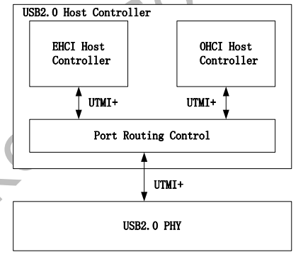
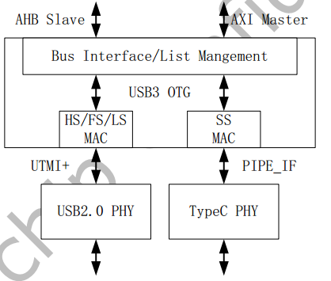
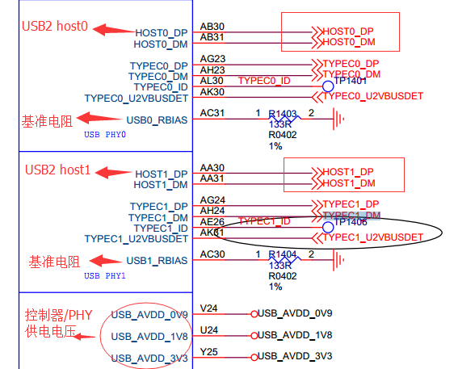
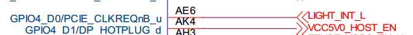
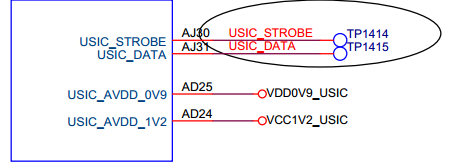
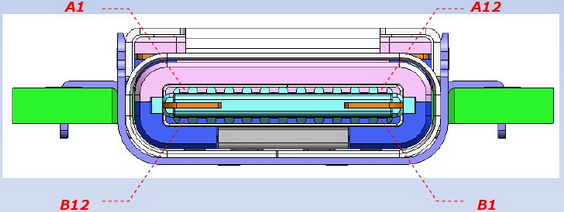
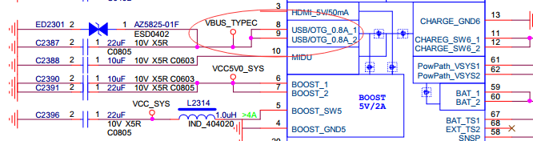
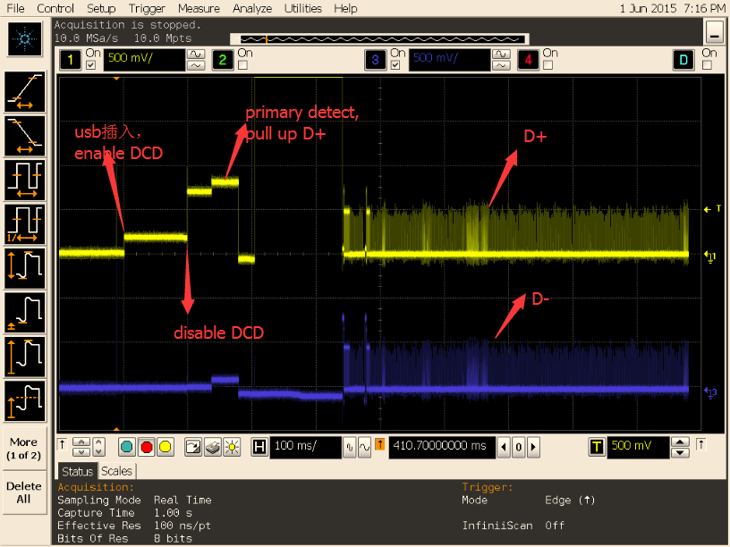

# **USB开发指南**

发布版本：1.0

作者邮箱：wulf@rock-chips.com、frank.wang@rock-chips.com、daniel.meng@rockchip.com

日期：2017.12

文档密级：公开资料

Copyright 2017 @Fuzhou Rockchip Electronics Co., Ltd.

---

**前言**

**概述**

**产品版本**

| **芯片名称**                                 | **内核版本** |
| :--------------------------------------- | :------: |
| RK3399、RK3368、RK3366、RK3328、RK3288、RK312X、RK3188、RK30XX | Linux4.4 |

**读者对象**

软件工程师，硬件工程师，FAE

**修订记录**

| **日期**     | **版本** | **作者**      | **修改说明** |
| ---------- | ------ | ----------- | -------- |
| 2017-12-22 | v1.0   | 吴良峰、王明成、孟东阳 |          |

---
[TOC]
---
## 1 概述

### 1.1 RK平台USB控制器方案

Rockchip SOC通常内置多个USB控制器，不同控制器互相独立，请在芯片TRM中获取详细信息。由于部分USB控制器有使用限制，所以请务必明确方案的需求及控制器限制后，再确定USB的使用方案。各芯片内置的USB控制器如表1-1所示：

表 1‑1 RK平台USB控制器列表

| **控制器芯片** | **USB2.0 HOST（EHCI&OHCI）** | **USB HSIC（EHCI）** | **USB2.0/3.0 OTG（DWC3/XHCI）** | **USB2.0 OTG （DWC2）** |
| :-------: | :------------------------: | :----------------: | :---------------------------: | :-------------------: |
|  RK3399   |             ×2             |         ×1         |              ×2               |           0           |
|  RK3368   |             ×1             |         ×1         |               0               |          ×1           |
|  RK3366   |             ×1             |         0          |              ×1               |          ×1           |
|  RK3328   |             ×1             |         0          |              ×1               |          ×1           |
|  RK3288   |             0              |         ×1         |               0               |     ×2（host+otg）    |
|  RK312X   |             ×1             |         0          |               0               |          ×1           |
|  RK3188   |             ×1             |         ×1         |               0               |          ×1           |
|  RK30XX   |             ×1             |         0          |               0               |          ×1           |

### 1.2 USB2.0 Host

- Compatible Specification


Universal Serial Bus Specification, Revision 2.0

Enhanced Host Controller Interface Specification(EHCI), Revision 1.0

Open Host Controller Interface Specification(OHCI), Revision 1.0a

- Features

Support high-speed(480Mbps), full-speed(12Mbps) andlow-speed(1.5Mbps)



​							图 1‑1 USB2.0 Host Controller Block Diagram

 				

​							图 1‑2USB2.0 USB2.0 PHY Block Diagram

### 1.3 USB2.0 OTG

- Compatible Specification


Universal Serial Bus Specification, Revision 2.0

- Features

Operates in High-Speed and Full-Speed mode

Support 9 channels in host mode

9 Device mode endpoints in addition to control endpoint 0, 4 in, 3 out and 2 IN/OUT

Built-in one 1024x35 bits FIFO

Internal DMA with scatter/gather function

Supports packet-based, dynamic FIFO memory allocation for endpoints for flexible, efficient use of RAM

Support dynamic FIFO sizing

Support Battery Charge in device role

Support Uart Bypass Mode


​							图 1‑3 USB2.0 OTG Block Diagram

### 1.4 USB2.0 PHY

Host Port: used for USB2.0 host controller

OTG Port: used for USB3.0 OTG controller with TypeC PHY to compriseas fully feature TypeC

### 1.5 USB OTG3.0

- Compatible Specification


Universal Serial Bus 3.0 Specification, Revision 1.0

Universal Serial Bus Specification, Revision 2.0

eXtensible Host Controller Interface for Universal Serial Bus(xHCI), Revision 1.1

- Features

DWC3 Features:

Support Control/Bulk(including stream)/Interrupt/IsochronousTransfer

Simultaneous IN and OUT transfer for USB3.0, up to 8Gbps bandwidth

Descriptor Caching and Data Pre-fetching

USB3.0 Device Features

Up to 7 IN endpoints, including control endpoint 0

Up to 6 OUT endpoints, including control endpoint 0

Up to 13 endpoint transfer resources, each one for each endpoint

Flexible endpoint configuration for multiple applications/USBset-configuration modes

Hardware handles ERDY and burst

Stream-based bulk endpoints with controller automatically initiatingdata movement

Isochronous endpoints with isochronous data in data buffers

Flexible Descriptor with rich set of features to support bufferinterrupt moderation, multiple transfers, isochronous, control, and scatteredbuffering support

USB 3.0 xHCI Host Features:

Support up to 64 devices

Support 1 interrupter

Support 1 USB2.0 port and 1 Super-Speed port

Concurrent USB3.0/USB2.0 traffic, up to 8.48Gbps bandwidth

Support standard or open-source xHCI and class driver

Support xHCI Debug Capability

USB 3.0 Dual-Role Device (DRD) Features

Static Device operation

Static Host operation

USB3.0/USB2.0 OTG A device and B device basing on ID

UFP/DFP and Data Role Swap Defined in USB TypeC Specification

Not support USB3.0/USB2.0 OTG session request protocol(SRP), hostnegotiation protocol(HNP) and Role Swap Protocol(RSP)



​								图 1‑4 USB3.0 OTG Block Diagram

### 1.6 TypeC PHY

Support USB3.0 (SuperSpeed only)

Support DisplayPort 1.3 (RBR, HBR and HBR2 data rates only)

Support DisplayPort AUX channel

Support USB TypeC and DisplayPort Alt Mode

Support DisplayPort Alt Mode on TypeC A, B, C, D, E and F pinassignments

Support Normal and Flipped orientation

​						 

​								图 1‑5 TypeC PHY Block Diagram

---

## 2 硬件电路及信号

### 2.1 USB HOST控制器硬件电路

USB Host控制器分别包含USB2.0 Host和HSIC，其硬件电路及信号分别说明如下：

#### 2.1.1 USB2.0 HOST控制器硬件电路

USB2.0的工作时钟高达480MHz，所以layout时需要特别注意，USB走线宽度为7-8MIL，做90Ω阻抗差分走线，最好在表层走线并有包地，边上无干扰源，正对的上下层不能有其他信号走线。

USB HSIC使用240MHz DDR信号，传输速率与USB2.0同为480Mbps，典型的走线阻抗为50Ω，建议最大走线长度不要超过10cm。

USB2.0HOST控制器硬件信号参考电路如图1-1和图1-2所示，完整的USB 2.0 HOST电路如图2-1 , 图2-3所示：



​								图 2‑1 USB2.0 HOST SoC信号引脚



​							图 2‑2 USB2.0 HOST VBUS GPIO控制脚

 

​									图 2‑3 HSIC控制器硬件电路

HSIC是具有与USB2.0相同的带宽（480Mbps）的2引脚芯片间互连接口，HSIC去除了为USB2.0设计的模拟收发器（PHY），供电电压为0.9V和1.2V， 信号传输的标准电压为1.2V，降低了系统的功耗，最大的走线长度为10cm（4英寸）。



​									图 2‑4 HSIC硬件电路

### 2.2 USB OTG控制器硬件电路

#### 2.2.1 USB 2.0 OTG控制器硬件电路

RK3399没有独立的USB2.0 OTG控制器，但有独立的USB3.0 OTG控制器，并且可以向下兼容USB2.0 OTG的完整功能，而RK3368、RK3366、RK3328、RK3288、RK312X、RK3188、RK30XX有独立的USB2.0 OTG控制器。

完整的 USB 2.0 OTG 参考电路如图2-5 ~ 图2-8所示：


​								图 2-5 USB 2.0 控制器硬件信号


​									图 2-6  OTG PORT 电路图


​									图 2-7  OTG DET 电路图


​									图 2-8  OTG DRV 电路图

OTG_VBUS：输入信号，用于 USB DEVICE 检测 VBUS 电平， 0：低电平约 0V， 1：高电平约 3V。默认无连接时电平为低，连接至 PC 或充电器时电平为高。

OTG_ID：输入信号，由 USB OTG 协议定义，用于识别 USB 口所接设备的默认角色(HOST or device)。 USB_ID 默认上拉，处于 device 状况，如果要控制器进入 HOST 状态，需外接 mini-A 口或 micro-A 口将 USB_ID 短接到地。

OTG_RKELVIN：参考电阻默认 43.2 欧到地，可通过调节该电阻阻值来调整 USB 信号质量。 不同芯片，该参考电阻的阻值不同， 具体请见相应的 SDK 参考设计原理图。

OTG_DRVVBUS：该信号由 USB OTG 控制器的 HOST 寄存器控制，硬件上通过该信号来控制HOST 所需 5V VBUS 输出。

OTG_DP/OTG_DM：即 Data+, Data-， USB 的两根差分信号线。

#### 2.2.2 USB 3.0 OTG控制器硬件电路

USB3.0 OTG具有USB3.0 OTG功能，且向下兼容USB2.0 OTG功能，最大传输速率为5Gbps，物理接口为Type-C，支持正反插。在传输线方面，USB3.0支持长达3米的四线差分信号线及11英寸PCB。5Gbps信号在长线缆上采用的是差分信号方式传输，从而避免信号被干扰及减少电磁干扰问题。

​		




 				

​										图 2‑5 Type-C 接口定义

 				

​							图 2‑6 USB3 OTG控制器 SoC信号引脚


​							图 2‑7 USB3OTG Type-C 接口

 				

​							图 2‑8 USB3Type-C pd/cc 电路（FUSB302）

 


​						图 2‑9 USB3 VBUS控制电路-1（GPIO控制电路输出5V）



​					图 2‑10 USB3 VBUS控制电路-2（RK818控制电路输出5V）

---
## 3 Kernel模块配置

USB模块的配置及保存和其它内核模块的配置方法一样：

导入默认配置：

```c
make ARCH=arm64 rockchip_defconfig
```


选择Kernel配置：
```c
make ARCH=arm64 menuconfig
```
保存default配置：
```c
make ARCH=arm64 savedefconfig
```
保存default配置，然后用defconfig替换rockchip_defconfig。

### 3.1 USB PHY相关配置

USB PHY模块的配置位于
```c
Device Drivers  --->
	PHY Subsystem  --->
		...
		<*>	Rockchip INNO USB2PHY Driver
		...
		<*>	Rockchip TYPEC PHY Driver
		...
		<*>	Rockchip INNO USB 3.0 PHY Driver
```
USB2.0 PHY使用的是Innosilicon IP，所以应选择“Rockchip INNO USB2PHY Driver”。

RK3399 RK3366 USB3.0PHY使用的是Type-C，所以应选择“Rockchip TYPEC PHY Driver”。

RK3328 USB3.0PHY 使用的是Innosilicon USB3.0 PHY，所以应选择“Rockchip INNO USB 3.0 PHY Driver”。

### 3.2 USB HOST相关配置

Makemenuconfig得到Kernel配置界面后，USB模块的配置位于
```c
Device Drivers  --->
	-*-	Support for Host-side USB
	[*] USB support  --->
		...
		<*>	xHCI HCD (USB 3.0) support
		-*-	Generic xHCI driver for a platform device
		...
		<*>	EHCI HCD (USB 2.0) support
		[ ]		Root Hub Transaction Translators
		[*]		Improved Transaction Translator scheduling
		<*>	Generic EHCI driver for a platform device
		...
		<*>	OHCI HCD (USB 1.1) support
		< >		OHCI support for PCI-bus USB controllers
		<*>		Generic OHCI driver for a platform device
```
必须选上USB Support项后才能支持USB模块并进行进一步的配置。

需要支持USB HOST，首先需要选上<*>Supportfor Host-side USB项，然后会现如下的HOST相关的配置，其中，HOST1.1 选择OHCI Driver 配置，HOST2.0 选择EHCI Driver 配置，HOST3.0选择XHCI Driver配置。 

### 3.3 USB OTG相关配置
```c
Device Drivers  --->
	-*-	Support for Host-side USB
	[*] USB support  --->
		...
		<*>	DesignWare USB2 DRD Core Support
				DWC2 Mode Selection (Dual Role mode)
		...
		<*>	DesignWare USB3 DRD Core Support
				DWC3 Mode Selection (Dual Role mode)
```
### 3.4 USB Gadget配置

Make menuconfig得到Kernel配置界面后，USB模块的配置位于

```c
DeviceDrivers  --->
	[*]USB support  --->
		[*] USB Gadget Support  --->
			...
			USBGadget Drivers (USB functions configurable through configfs)  --->
```

RK3399目前支持MTP、PTP、Accessory、ADB、MIDI、Audio等Gadget功能。

### 3.5 USB其它模块配置

#### 3.5.1 Mass Storage Class（MSC）

U盘属于SCSI设备，所以在配置USB模块之前需要配置SCSI选项（默认配置已经选上）。
```c
Device Drivers  --->
	SCSI device support  --->
		...
		<*> SCSI disk support
		...
```
SCSI 其他相关配置：

```c
Device Drivers --->
	SCSI device support --->
		<*> SCSI device support
		[ ] SCSI: use blk-mq I/O path by default
		[*] legacy /proc/scsi/ support
			*** SCSI support type (disk, tape, CD-ROM) ***
		<*> SCSI disk support
		< > SCSI tape support
		< > SCSI OnStream SC-x0 tape support
		< > SCSI CDROM support
		<*> SCSI generic support
		<*> SCSI media changer support
		[*] Verbose SCSI error reporting (kernel size +=75K)
		[*] SCSI logging facility
		[*] Asynchronous SCSI scanning
			SCSI Transports  --->
		[*] SCSI low-level drivers  --->
		[ ] PCMCIA SCSI adapter support  ----
		[ ] SCSI Device Handlers  ----
```

配置完SCSI Device Support后，可以在USB Support中找到如下选项，选上即可。

```c
Device Driver --->
	[*] USB support  --->
		<*> USB Mass Storage support
```

#### 3.5.2 USB Serial Converter

- 支持USB 3G Modem


USB 3G Modem使用的是USB转串口，使用时需要选上如下选项：

```c
Device Driver --->
	[*] USB support  --->
		...
		[*] USB driver for GSM and CDMA modems
		...
		<*> USB Serial Converter support  --->
			<*> USB Prolific 2303 Single Port Serial Driver
```

- 支持PL2303


如果要使用PL2303输出数据到串口，需要选择如下选项：

```c
Device Driver --->
	[*] USB support  --->
		...
		<*> USB Serial Converter support  --->
			<*> USB Prolific 2303 Single Port Serial Driver
```

- 支持USB GPS


如果要支持USB GPS，如u-blox 6 - GPS Receiver设备，需要选择如下选项：

 ```c
Device Drivers	--->
	[*]	USB support	--->
		[*] USB Modem (CDC ACM) support
 ```
#### 3.5.3 USB HID

USB键鼠的配置选项如下：
```c
Device Drivers	--->
	[*]	HID support
		[*] USB HID transport layer
		[ ] PID device support
		[*] /dev/hiddev raw HID device support
```
#### 3.5.4 USB Net

- USB Bluetooth


```c
[*] Networking support  --->
	...
	<*>	Bluetooth subsystem support  --->
		Bluetooth device drivers  --->
			...
			<*> HCI USB driver
			[*]   Broadcom protocol support (NEW)
			[*]   Realtek protocol support (NEW)
			...
```

- USB Wifi


通常直接使用Vendor提供的驱动和配置。

- USB Ethernet


```c
Device Driver --->
	[*] Network device support  --->
		<*>	USB Network Adapters  --->
			<*>	USB CATC NetMate-based Ethernet device support
			<*>	USB KLSI KL5USB101-based ethernet device support
			<*>	USB Pegasus/Pegasus-II based ethernet device support
			<*>	USB RTL8150 based ethernet device support
			<*>	Realtek RTL8152/RTL8153 Based USB Ethernet Adapters
			< >	Microchip LAN78XX Based USB Ethernet Adapters
			<*>	Multi-purpose USB Networking Framework
			<*>		ASIX AX88xxx Based USB 2.0 Ethernet Adapters
			<*>		ASIX AX88179/178A USB 3.0/2.0 to Gigabit Ethernet
			-*-	CDC Ethernet support (smart devices such as cable modems)
			<*>	CDC EEM support
			-*-	CDC NCM support
			< >	Huawei NCM embedded AT channel support
			<*>	CDC MBIM support
			<*>	Davicom DM96xx based USB 10/100 ethernet devices
			< >	CoreChip-sz SR9700 based USB 1.1 10/100 ethernet devices
			< >	CoreChip-sz SR9800 based USB 2.0 10/100 ethernet devices
			<*>	SMSC LAN75XX based USB 2.0 gigabit ethernet devices
			<*>	SMSC LAN95XX based USB 2.0 10/100 ethernet devices
			<*>	GeneSys GL620USB-A based cables
			<*>	NetChip 1080 based cables (Laplink, ...)
			<*>	Prolific PL-2301/2302/25A1/27A1 based cables
			<*>	MosChip MCS7830 based Ethernet adapters
			<*>	Host for RNDIS and ActiveSync devices
			<*>	Simple USB Network Links (CDC Ethernet subset)
			[*]		ALi M5632 based 'USB 2.0 Data Link' cables
			[*]		AnchorChips 2720 based cables (Xircom PGUNET, ...)
			[*]		eTEK based host-to-host cables (Advance, Belkin, ...)
			[*]		Embedded ARM Linux links (iPaq, ...)
			[*]		Epson 2888 based firmware (DEVELOPMENT)
			[*]		KT Technology KC2190 based cables (InstaNet)
			<*>	Sharp Zaurus (stock ROMs) and compatible
			<*>	Conexant CX82310 USB ethernet port
			<*>	Samsung Kalmia based LTE USB modem
			<*>	QMI WWAN driver for Qualcomm MSM based 3G and LTE modems
			<*>	Option USB High Speed Mobile Devices
			<*>	Intellon PLC based usb adapter
			<*>	Apple iPhone USB Ethernet driver
			<*>	USB-to-WWAN Driver for Sierra Wireless modems
			< >	LG VL600 modem dongle
			< >	QingHeng CH9200 USB ethernet support
```

#### 3.5.5 USB Camera
```c
Device Driver --->
	<*> Multimedia support  --->
		[*]   Media USB Adapters  --->
			*** Webcam devices ***
			<*>	USB Video Class (UVC)
			[*]	UVC input events device support
```

#### 3.5.6 USBAudio

```c
Device Driver --->
	<*> Sound card support	--->
		<*>	Advanced Linux Sound Architecture --->
			...
			[*]	USB sound devices	--->
				[*]	USB Audio /MIDI driver
```
#### 3.5.7 USBHUB

如果要支持USB HUB，请将“Disable external HUBs”配置选项去掉。

```c
Device Drivers --->
	[*]	USB support	--->
		-*-	Support for Host-side USB
		...
		[*]		Disable external hubs
```

#### 3.5.8 其他USB设备配置

其他有可能用到的USB设备还有很多，如GPS，Printer等，有可能需要Vendor定制的驱动，也有可能是标准的Class驱动，如需支持，可直接在网络上搜索Linux对该设备支持要做的工作，RK平台并无特殊要求，可直接参考。

---
## 4 Device Tree开发

ARM Linux内核在Linux-3.x内核取消了传统的设备文件而用设备树（DT）取代，因此，现在内核有关硬件描述的信息都需要放入DT中配置，下面对涉及到USB模块的DT开发做以详细说明。

### 4.1 USB PHY DTS

USB2.0 PHY的配置主要包括PHY的时钟、中断配置和VBUS Supply的配置。

USB3.0 PHY的配置主要包括PHY的时钟、中断配置、Reset和Type-CPHY状态寄存器地址。

#### 4.1.1 USB2.0 PHY DTS

USB2.0 PHY详细配置可参考内核Documentation/devicetree/bindings/phy目录文档说明。

Innosilicon PHY对应的文档为：

Documentation/devicetree/bindings/phy/phy-rockchip-inno-usb2.txt

具体分为DTSI和DTS两部分配置，下面以RK3399上一个Host Port的PHY为例说明。

下面所示为DTSI的配置，DTSI主要配置PHY的公有属性。

```c
grf: syscon@ff770000 {
	compatible = "rockchip,rk3399-grf", "syscon", "simple-mfd";
	reg = <0x0 0xff770000 0x0 0x10000>;
	#address-cells = <1>;
	#size-cells = <1>;

	u2phy0: usb2-phy@e450 {
		compatible = "rockchip,rk3399-usb2phy";
		reg = <0xe450 0x10>;
		clocks = <&cru SCLK_USB2PHY0_REF>;
		clock-names = "phyclk";
		#clock-cells = <0>;
		clock-output-names = "clk_usbphy0_480m";
		status = "disabled";

		u2phy0_host: host-port {
			#phy-cells = <0>;
			interrupts = <GIC_SPI 27 IRQ_TYPE_LEVEL_HIGH 0>;
			interrupt-names = "linestate";
			status = "disabled";
		};
};
```

首先，USB PHY Driver中都是在操作GRF，所以USB PHY的节点必须作为GRF的一个子节点。

其次，USB PHY节点中包括USB PHY的硬件属性和PHY port的硬件属性，其中PHY的属性为所有port的共有属性，比如Input时钟；port属性主要包括各个port所拥有的中断，比如Linestate中断、otg-id中断，otg-bvalid等。

最后，需要注意的是port的名称，HOST对应的port要求命名为“host-port”，OTG对应的命名为“otg-port”，因为Driver中根据这两个名称做不同port的初始化。下面所示为DTS的配置。

```c
u2phy0_host: host-port {
	phy-supply = <&vcc5v0_host>;
	status = "okay";
};
```

DTS的配置，主要根据不同的产品形态，配置PHY的私有属性。目前SDK-DTS的配置，主要包括phy-port的Enable以及phy-Supply即Vbus Supply的配置。

vbus supply的配置有两种方式，一种是配置成GPIO形式，直接在驱动中控制GPIO，进而控制的供给；另外一种是目前内核比较通用的Regulator配置。

下面以Host Vbus的配置，详细讲述regulator的配置方法。其主要分为Regulator及pinctrl两个节点的配置。

```c
vcc5v0_host: vcc5v0-host-regulator {
	compatible = "regulator-fixed";
	enable-active-high;
	gpio = <&gpio4 25 GPIO_ACTIVE_HIGH>;
	pinctrl-names = "default";
	pinctrl-0 = <&host_vbus_drv>;
	regulator-name = "vcc5v0_host";
	regulator-always-on;
};
```

如上面所示，这是一个vbus-host-regulator的配置实例，“enable-active-high”属性标识GPIO拉高使能；“pinctrl-0 = <&host_vbus_drv>;”Property代表这个regulator所引用的Pinctrl中节点的名称，具体regulator的配置可参考LinuxKernel相关regulator的文档。通过对于USB模块而言，vbus-regulator应该在DTS中（而不是DTSI中）做配置。

```c
usb2 {
	host_vbus_drv: host-vbus-drv {
		rockchip,pins =
				<4 25 RK_FUNC_GPIO &pcfg_pull_none>;
	};
};
```

如上面所示，这是hostvbus-drv的pinctrl属性，rockchip,pins属性即GPIO信息，需要从硬件原理图获知。这个节点作为Pinctrl的子节点，通过在DTSI（而不是DTS中）做配置。

#### 4.1.2 USB3.0 PHY DTS

USB3.0 PHY为Type-C PHY，详细的配置说明请查看：

Documentation/devicetree/bindings/phy/phy-rockchip-typec.txt

Example：

```c
tcphy0: phy@ff7c0000 {
	compatible = "rockchip,rk3399-typec-phy";
	reg = <0x0 0xff7c0000 0x0 0x40000>;
	rockchip,grf = <&grf>;
	#phy-cells = <1>;
	clocks = <&cru SCLK_UPHY0_TCPDCORE>,
			 <&cru SCLK_UPHY0_TCPDPHY_REF>;
	clock-names = "tcpdcore", "tcpdphy-ref";
	assigned-clocks = <&cru SCLK_UPHY0_TCPDCORE>;
	assigned-clock-rates = <50000000>;
	power-domains = <&power RK3399_PD_TCPD0>;
	resets = <&cru SRST_UPHY0>,
			 <&cru SRST_UPHY0_PIPE_L00>,
			 <&cru SRST_P_UPHY0_TCPHY>;
	reset-names = "uphy", "uphy-pipe", "uphy-tcphy";
	rockchip,typec-conn-dir = <0xe580 0 16>;
	rockchip,usb3tousb2-en = <0xe580 3 19>;
	rockchip,usb3-host-disable = <0x2434 0 16>;
	rockchip,usb3-host-port = <0x2434 12 28>;
	rockchip,external-psm = <0xe588 14 30>;
	rockchip,pipe-status = <0xe5c0 0 0>;
	rockchip,uphy-dp-sel = <0x6268 19 19>;
	status = "disabled";

	tcphy0_dp: dp-port {
		#phy-cells = <0>;
	};

	tcphy0_usb3: usb3-port {
		#phy-cells = <0>;
	};
};
```

### 4.2 USB2.0 Controller DTS

USB2.0控制器主要包括EHCI、OHCI、OTG。其中EHCI和OHCI Rockchip采用Linux 内核Generic驱动，一般开发时只需要对DT作相应配置，即可正常工作。

#### 4.2.1 USB2.0 HOST Controller DTS

下面所示为一个EHCI控制器的典型配置，主要包括register、interrupts、clocks的配置。需要注意，EHCI相关的时钟，通常需要配置EHCI控制器和EHCI/OHCI仲裁器两个时钟。此外，phys直接配置对应phy-port的名称即可。

```c
usb_host0_ehci: usb@fe380000 {
	compatible = "generic-ehci";
 	reg = <0x0 0xfe380000 0x0 0x20000>;
	interrupts = <GIC_SPI 26 IRQ_TYPE_LEVEL_HIGH 0>;
	clocks = <&cru HCLK_HOST0>, <&cru HCLK_HOST0_ARB>,
			 <&cru SCLK_USBPHY0_480M_SRC>;
	clock-names = "hclk_host0", "hclk_host0_arb", "usbphy0_480m";
	phys = <&u2phy0_host>;
	phy-names = "usb";
	power-domains = <&power RK3399_PD_PERIHP>;
	status = "disabled";
};
```

下面所示为一个OHCI控制器的配置，其内容基本跟EHCI相同。

```c
usb_host0_ohci: usb@fe3a0000 {
	compatible = "generic-ohci";
	reg = <0x0 0xfe3a0000 0x0 0x20000>;
	interrupts = <GIC_SPI 28 IRQ_TYPE_LEVEL_HIGH 0>;
	clocks = <&cru HCLK_HOST0>, <&cru HCLK_HOST0_ARB>,
			 <&cru SCLK_USBPHY0_480M_SRC>;
	clock-names = "hclk_host0", "hclk_host0_arb", "usbphy0_480m";
	phys = <&u2phy0_host>;
	phy-names = "usb";
	power-domains = <&power RK3399_PD_PERIHP>;
	status = "disabled";
};
```

#### 4.2.2 USB2.0 otg Controller DTS

如下所示，为一个DWC2控制器的典型配置，主要包括register、interrupts、clocks的配置。需要注意，DWC2相关的时钟，通常需要配置HCLK和PMUCLK两个时钟。此外，phys直接配置对应phy-port的名称即可。

详细的配置说明请查看：

Documentation/devicetree/bindings/usb/dwc2.txt

```c
usb20_otg: usb@ff580000 {
	compatible = "rockchip,rk3328-usb", "rockchip,rk3066-usb",
			     "snps,dwc2";
	reg = <0x0 0xff580000 0x0 0x40000>;
	interrupts = <GIC_SPI 23 IRQ_TYPE_LEVEL_HIGH>;
	clocks = <&cru HCLK_OTG>, <&cru HCLK_OTG_PMU>;
	clock-names = "otg", "otg_pmu";
	dr_mode = "otg";
	g-np-tx-fifo-size = <16>;
	g-rx-fifo-size = <275>;
	g-tx-fifo-size = <256 128 128 64 64 32>;
	g-use-dma;
	phys = <&u2phy_otg>;
	phy-names = "usb2-phy";
	status = "disabled";
};
```

### 4.3 USB3.0 Controller DTS
#### 4.3.1 USB3.0 HOST Controller DTS

USB3.0 HOST控制器为XHCI，集成于DWC3 OTG IP中，所以不用单独配置dts，只需要配置DWC3，并且设置DWC3的dr_mode属性为dr_mode = "otg"或者dr_mode = "host"，即可以enable XHCI控制器。

#### 4.3.2 USB3.0 OTG Controller DTS

USB3.0 OTG的详细配置方法，请查看：

Documentation/devicetree/bindings/usb/dwc3-rockchip.txt

Example：

```c
usbdrd3: usb@ff600000 {
	compatible = "rockchip,rk3328-dwc3";
	clocks = <&cru SCLK_USB3OTG_REF>, <&cru SCLK_USB3OTG_SUSPEND>,
			 <&cru ACLK_USB3OTG>;
	clock-names = "ref_clk", "suspend_clk",
			      "bus_clk";
	#address-cells = <2>;
	#size-cells = <2>;
	ranges;
	status = "disabled";

	usbdrd_dwc3: dwc3@ff600000 {
		compatible = "snps,dwc3";
		reg = <0x0 0xff600000 0x0 0x100000>;
		interrupts = <GIC_SPI 67 IRQ_TYPE_LEVEL_HIGH>;
		dr_mode = "host";
		phys = <&u3phy_utmi>, <&u3phy_pipe>;
		phy-names = "usb2-phy", "usb3-phy";
		phy_type = "utmi_wide";
		snps,dis_enblslpm_quirk;
		snps,dis-u2-freeclk-exists-quirk;
		snps,dis_u2_susphy_quirk;
		snps,dis-u3-autosuspend-quirk;
		snps,dis_u3_susphy_quirk;
		snps,dis-del-phy-power-chg-quirk;
		snps,tx-ipgap-linecheck-dis-quirk;
		status = "disabled";
	};
};
```

## 5 驱动开发

目前，EHCI、OHCI、DWC3均采用Linux Upstream的代码，因此驱动本身修改的可能性很少，只需要对DT做正确配置即可；DWC2使用内部版和Upstream 版两个版本，内部版使用的时间较久，稳定性相对较好，Upstream版主要和Upstream同步更新；USB2.0PHY的驱动也已经upstream，后续开发仅需对芯片做适配即可。

### 5.1 USB PHY drivers

#### 5.1.1 USB2.0 PHY driver

Driver代码路径：

drivers/phy/phy-rockchip-inno-usb2.c

USB2.0PHY采用Innosilicon IP，SoC上有两个USB2.0的PHY，每个PHY有两个port，一个port用于支持USB2.0 HOST控制器，另一个port用于支持USB2.0 OTG控制器。

对于Innosilicon IP USB2.0 PHY特性，目前已开发并upstream了相应的PHY驱动代码，针对host-port，主要涉及到suspend/resume、sm_work相关的配置；具体register说明可参考代码（drivers/phy/phy-rockchip-inno-usb2.c）中注释。

NOTE：请参照代码阅读以下内容。

对于新功能的开发，首先应清楚该功能是针对phy还是phy-port，然后对应操作struct rockchip_usb2phy和struct rockchip_usb2phy_port两个数据结构，第一个用于管理phy的成员属性；第二个用于管理phy-port的成员属性。

同时，配合上面两个数据结构，还有struct rockchip_usb2phy_cfg 和struct rockchip_usb2phy_port_cfg两个用于配置的数据结构。如下是一个典型的USB2.0 host port的配置。

```c
static const struct rockchip_usb2phy_cfg rk3399_phy_cfgs[] = {
	{
		.reg		= 0xe450,
		.num_ports	= 2,
		.phy_tuning	= rk3399_usb2phy_tuning,
		.clkout_ctl	= { 0xe450, 4, 4, 1, 0 },
		.port_cfgs	= {
			[USB2PHY_PORT_HOST] = {
				.phy_sus	= { 0xe458, 1, 0, 0x2, 0x1 },
				.ls_det_en	= { 0xe3c0, 6, 6, 0, 1 },
				.ls_det_st	= { 0xe3e0, 6, 6, 0, 1 },
				.ls_det_clr	= { 0xe3d0, 6, 6, 0, 1 },
				.utmi_ls	= { 0xe2ac, 22, 21, 0, 1 },
				.utmi_hstdet	= { 0xe2ac, 23, 23, 0, 1 }
			}
		},
```

下面是USB2.0 otg-port phy配置参考，port_cfgs主要用于插拔和otg mode 检测，chg_det主要用于充电类型检测：

```c
static const struct rockchip_usb2phy_cfg rk3399_phy_cfgs[] = {
	{
		.reg		= 0xe450,
		.num_ports	= 2,
		.phy_tuning	= rk3399_usb2phy_tuning,
		.clkout_ctl	= { 0xe450, 4, 4, 1, 0 },
		.port_cfgs	= {
			[USB2PHY_PORT_OTG] = {
				.phy_sus = { 0xe454, 8, 0, 0x052, 0x1d1 },
				.bvalid_det_en	= { 0xe3c0, 3, 3, 0, 1 },
				.bvalid_det_st	= { 0xe3e0, 3, 3, 0, 1 },
				.bvalid_det_clr	= { 0xe3d0, 3, 3, 0, 1 },
				.bypass_dm_en	= { 0xe450, 2, 2, 0, 1 },
				.bypass_sel	= { 0xe450, 3, 3, 0, 1 },
				.idfall_det_en	= { 0xe3c0, 5, 5, 0, 1 },
				.idfall_det_st	= { 0xe3e0, 5, 5, 0, 1 },
				.idfall_det_clr	= { 0xe3d0, 5, 5, 0, 1 },
				.idrise_det_en	= { 0xe3c0, 4, 4, 0, 1 },
				.idrise_det_st	= { 0xe3e0, 4, 4, 0, 1 },
				.idrise_det_clr	= { 0xe3d0, 4, 4, 0, 1 },
				.ls_det_en	= { 0xe3c0, 2, 2, 0, 1 },
				.ls_det_st	= { 0xe3e0, 2, 2, 0, 1 },
				.ls_det_clr	= { 0xe3d0, 2, 2, 0, 1 },
				.utmi_avalid	= { 0xe2ac, 7, 7, 0, 1 },
				.utmi_bvalid	= { 0xe2ac, 12, 12, 0, 1 },
				.utmi_iddig	= { 0xe2ac, 8, 8, 0, 1 },
				.utmi_ls	= { 0xe2ac, 14, 13, 0, 1 },
				.vbus_det_en    = { 0x449c, 15, 15, 1, 0 },
			},
		},
		.chg_det = {
			.opmode		= { 0xe454, 3, 0, 5, 1 },
			.cp_det		= { 0xe2ac, 2, 2, 0, 1 },
			.dcp_det	= { 0xe2ac, 1, 1, 0, 1 },
			.dp_det		= { 0xe2ac, 0, 0, 0, 1 },
			.idm_sink_en	= { 0xe450, 8, 8, 0, 1 },
			.idp_sink_en	= { 0xe450, 7, 7, 0, 1 },
			.idp_src_en	= { 0xe450, 9, 9, 0, 1 },
			.rdm_pdwn_en	= { 0xe450, 10, 10, 0, 1 },
			.vdm_src_en	= { 0xe450, 12, 12, 0, 1 },
			.vdp_src_en	= { 0xe450, 11, 11, 0, 1 },
		},
	},
```

#### 5.1.2 USB3.0 PHY driver

Driver代码有两个版本，3228H、3328的USB3.0 PHY使用Innosilicon IP。

代码路径：

drivers/phy/rockchip/phy-rockchip-inno-usb3.c

Innosilicon IP 只包含一个USB3.0 PHY 端口，支持USB3.0 底层数据传输、LFPS通信和物理信号检测等功能。

对于Innosilicon IP USB3.0 PHY特性，目前已开发了相应的PHY驱动代码，暂时还未upstream，对端口的控制，主要涉及suspend/resume、power和detective等，具体register说明可参考代码（drivers/phy/phy-rockchip-inno-usb3.c）中注释。

NOTE：请参照代码阅读以下内容。

对于新功能的开发，主要操作struct rockchip_u3phy和struct rockchip_u3phy_port两个数据结构，第一个用于管理phy的成员属性；第二个用于管理phy-port的成员属性。

同时，配合上面两个数据结构，还有struct rockchip_u3phy_cfg 、struct rockchip_u3phy_grf_cfg和 struct rockchip_u3phy_apbcfg三个用于配置的数据结构。struct rockchip_u3phy_apbcfg主要用于保存USB物理信号tuning的相关参数，在tuning 函数中直接赋值给相关寄存器；struct rockchip_u3phy_cfg和struct rockchip_u2phy_grf_cfg则是用于USB底层协议相关的功能性相关属性配置，如下是一个典型的rockchip_u3phy_cfg的配置。

```c
static const struct rockchip_u3phy_cfg rk3328_u3phy_cfgs[] = {
	{
		.reg		= 0xff470000,
		.grfcfg		= {
			.um_suspend	= { 0x0004, 15, 0, 0x1452, 0x15d1 },
			.u2_only_ctrl	= { 0x0020, 15, 15, 0, 1 },
			.um_ls		= { 0x0030, 5, 4, 0, 1 },
			.um_hstdct	= { 0x0030, 7, 7, 0, 1 },
			.ls_det_en	= { 0x0040, 0, 0, 0, 1 },
			.ls_det_st	= { 0x0044, 0, 0, 0, 1 },
			.pp_pwr_st	= { 0x0034, 14, 13, 0, 0},
			.pp_pwr_en	= { {0x0020, 14, 0, 0x0014, 0x0005},
					    {0x0020, 14, 0, 0x0014, 0x000d},
					    {0x0020, 14, 0, 0x0014, 0x0015},
					    {0x0020, 14, 0, 0x0014, 0x001d} },
			.u3_disable	= { 0x04c4, 15, 0, 0x1100, 0x101},
		},
		.phy_pipe_power	= rk3328_u3phy_pipe_power,
		.phy_tuning	= rk3328_u3phy_tuning,
		.phy_cp_test	= rk322xh_u3phy_cp_test_enable,
	},
	{ /* sentinel */ }
};
```

其余芯片的USB3.0 PHY 为Cadence IP，

代码路径：

drivers/phy/rockchip/phy-rockchip-typec.c

Cadence IP 只有一个端口，支持USB3.1、DisplayPort1.3，可以工作在USB、DisplayPort、USB+DisplayPort三种模式，DisplayPort部分在显示部分的文档描述，这里我们只关心USB部分，Cadence IP同样支持USB3.0 底层数据传输、LFPS通信和物理信号检测等功能。

对于Cadence IP USB3.0 PHY特性，目前已开发并upstream了相应的PHY驱动代码，针对端口的控制，主要涉及到suspend/resume、power、DP USB模式切换等，具体register说明可参考代码（drivers/phy/rockchip/phy-rockchip-inno-usb3.c）中注释。

对于新功能的开发，主要操作struct rockchip_typec和stuct rockchip_usb3phy_port_cfg 两个数据结构，第一个用于管理phy的成员属性；第二个用于管理phy-port的成员属性。rockchip_usb3phy_port_cfg的配置参数在驱动初始化时通过DTS传入，运行过程中通过调用tcphy_get_mode获取实际连接状态进行实时配置。

除此之外驱动中新建了struct phy_reg usb3_pll_cfg用于保存PLL相关的寄存器配置，常见的配置参数如下：

```c
struct phy_reg usb3_pll_cfg[] = {
	{ 0xf0,		CMN_PLL0_VCOCAL_INIT },
	{ 0x18,		CMN_PLL0_VCOCAL_ITER },
	{ 0xd0,		CMN_PLL0_INTDIV },
	{ 0x4a4a,	CMN_PLL0_FRACDIV },
	{ 0x34,		CMN_PLL0_HIGH_THR },
	{ 0x1ee,	CMN_PLL0_SS_CTRL1 },
	{ 0x7f03,	CMN_PLL0_SS_CTRL2 },
	{ 0x20,		CMN_PLL0_DSM_DIAG },
	{ 0,		CMN_DIAG_PLL0_OVRD },
	{ 0,		CMN_DIAG_PLL0_FBH_OVRD },
	{ 0,		CMN_DIAG_PLL0_FBL_OVRD },
	{ 0x7,		CMN_DIAG_PLL0_V2I_TUNE },
	{ 0x45,		CMN_DIAG_PLL0_CP_TUNE },
	{ 0x8,		CMN_DIAG_PLL0_LF_PROG },
};
```

### 5.2 USB Controller drivers

#### 5.2.1 USB3.0 OTG drivers

Driver代码路径：
drivers/usb/dwc3/*
drivers/usb/host/xhci*

目前USB3.0 OTG使用Synopsys 方案，即XHCI扩展的DWC3控制器，Host功能在XHCI框架下实现，而Device功能由DWC3扩展部分实现。

USB3.0 OTG控制器核心驱动使用Upstream版 IP厂商开源代码，包括XHCI和DWC3两个部分，目前已经完善核心驱动，开发并upstream了核心驱动的引导代码，主要实现引导XHCI+DWC3_Gadget控制器初始化，OTG各种模式之间的切换、runtime suspend 相关的初始化等功能。具体实现可查看引导代码drivers/usb/dwc3/dwc3-rockchip.c 。

drivers/usb/dwc3 目录下的文件主要包括厂商引导驱动，Host Device通用DWC3控制器驱动和Device驱动，其中文件名带厂商名字的为产商引导驱动，RK驱动文件名为dwc3-rockchip.c，core.c是DWC3控制器核心驱动，负责加载XHCI驱动初始化XHCI控制器、加载Device驱动和初始化DWC3 Device控制器，gadget.c是DWC3 Device驱动文件，主要实现控制器相关的Device初始化、中断处理和数据传输等功能。

重要的接口实现函数：

```c
static const struct usb_gadget_ops dwc3_gadget_ops = {
	.get_frame		= dwc3_gadget_get_frame,
	.wakeup			= dwc3_gadget_wakeup,
	.set_selfpowered	= dwc3_gadget_set_selfpowered,
	.pullup			= dwc3_gadget_pullup,
	.udc_start		= dwc3_gadget_start,
	.udc_stop		= dwc3_gadget_stop,
};
```

DWC3 在sys/kernel/debug目录下增加了几个调试接口，主要针对device，debug接口如下：

```c
rk3399_box:/sys/kernel/debug/fe800000.dwc3 # ls
ep0in  ep1in  ep2in  ep3in  ep4in  ep5in  ep6in      mode    testmode
ep0out ep1out ep2out ep3out ep4out ep5out link_state regdump

rk3399_box:/sys/kernel/debug/fe800000.dwc3/ep0in # ls
descriptor_fetch_queue rx_info_queue    trb_ring
event_queue            rx_request_queue tx_fifo_queue
rx_fifo_queue          transfer_type    tx_request_queue
```

接口功能：

ep*in/out: Directory of EP debug files

mode: dr_mode read or store

link_state: Link state read or store

regdump: Dump registers of DWC3

descriptor_fetch_queue: Dump the available DescFetchQ space of EP

rx_info_queue: Dump the available RXInfoQ space of EP

trb_ring: Dump the TRB pool of EP

event_queue: Dump the avaliable EventQ space of EP

rx_request_queue: Dump the avaliable RxReqQ space of EP

tx_fifo_queue: Dump the avaliable TxFIFO space of EP

rx_fifo_queue: Dump the avaliable RxFIFO  space of EP

transfer_type: Print the Transfer Type of EP

tx_request_queue: Dump the abaliable TxReqQ space of EP

drivers/usb/host目录下文件名含有“xhci“的为XHCI控制器相关驱动，其中xhci-plat.c是注册驱动的初始化文件，xhci.c是控制器基础文件，实现USB core层HCD接口和USB传输控制的相关操作，xhci-ring.c是控制器数据结构TRB以及传输机制相关的文件，实现具体的传输功能，xhci-hub.c是控制器自带的USB3.0 root Hub驱动。

重要的接口实现函数：

```c
static const struct hc_driver xhci_hc_driver = {
	.description =		"xhci-hcd",
	.product_desc =		"xHCI Host Controller",
	.hcd_priv_size =	sizeof(struct xhci_hcd *),
	/*
	 * generic hardware linkage
	 */
	.irq =			xhci_irq,
	.flags =		HCD_MEMORY | HCD_USB3 | HCD_SHARED,
	/*
	 * basic lifecycle operations
	 */
	.reset =		NULL, /* set in xhci_init_driver() */
	.start =		xhci_run,
	.stop =			xhci_stop,
	.shutdown =		xhci_shutdown,
	/*
	 * managing i/o requests and associated device resources
	 */
	.urb_enqueue =		xhci_urb_enqueue,
	.urb_dequeue =		xhci_urb_dequeue,
	.alloc_dev =		xhci_alloc_dev,
	.free_dev =		xhci_free_dev,
	.alloc_streams =	xhci_alloc_streams,
	.free_streams =		xhci_free_streams,
	.add_endpoint =		xhci_add_endpoint,
	.drop_endpoint =	xhci_drop_endpoint,
	.endpoint_reset =	xhci_endpoint_reset,
	.check_bandwidth =	xhci_check_bandwidth,
	.reset_bandwidth =	xhci_reset_bandwidth,
	.address_device =	xhci_address_device,
	.enable_device =	xhci_enable_device,
	.update_hub_device =	xhci_update_hub_device,
	.reset_device =		xhci_discover_or_reset_device,
	/*
	 * scheduling support
	 */
	.get_frame_number =	xhci_get_frame,
	/*
	 * root hub support
	 */
	.hub_control =		xhci_hub_control,
	.hub_status_data =	xhci_hub_status_data,
	.bus_suspend =		xhci_bus_suspend,
	.bus_resume =		xhci_bus_resume,
	/*
	 * call back when device connected and addressed
	 */
	.update_device =        xhci_update_device,
	.set_usb2_hw_lpm =	xhci_set_usb2_hardware_lpm,
	.enable_usb3_lpm_timeout =	xhci_enable_usb3_lpm_timeout,
	.disable_usb3_lpm_timeout =	xhci_disable_usb3_lpm_timeout,
	.find_raw_port_number =	xhci_find_raw_port_number,
};
```

XHCI驱动没有文件系统下的debug接口，但是可以通过在内核编译的config文件中增加CONFIG_DYNAMIC_DEBUG，打开debug信息。

#### 5.2.2 USB2.0 OTG drivers

Driver 代码路径：

upstream 版：drivers/usb/dwc2/*

内部版：drivers/usb/dwc_otg_310/*

USB2.0 OTG使用的是Synopsys 方案，即使用DWC2控制器同时实现Host和Device功能，DWC2控制器通过检测OTG口上ID脚的电平判断切换为何种模式，ID脚的电平变化触发控制器ID脚中断，然后由软件切换到对应模式。

目前使用两种驱动版本，一个是upstream 版，驱动在dwc2目录下，主要从upstream开源项目更新代码，另一个是内部版，驱动在dwc_otg_310目录下，由RK内部自行维护，还未upstream。

drivers/usb/dwc2目录下的文件可以分成三类，一类是文件名包含“hcd”的Host相关驱动，负责Host初始化、Host中断处理和Host数据传输操作，一类是Device相关文件gadget.c，负责Device初始化、中断处理、数据传输的工作，其余的文件是控制器core层和引导驱动，包括通用接口、通用中断处理和控制器初始化等功能。

重要的接口实现函数：

```c
static struct hc_driver dwc2_hc_driver = {
	.description = "dwc2_hsotg",
	.product_desc = "DWC OTG Controller",
	.hcd_priv_size = sizeof(struct wrapper_priv_data),

	.irq = _dwc2_hcd_irq,
	.flags = HCD_MEMORY | HCD_USB2 | HCD_BH,

	.start = _dwc2_hcd_start,
	.stop = _dwc2_hcd_stop,
	.urb_enqueue = _dwc2_hcd_urb_enqueue,
	.urb_dequeue = _dwc2_hcd_urb_dequeue,
	.endpoint_disable = _dwc2_hcd_endpoint_disable,
	.endpoint_reset = _dwc2_hcd_endpoint_reset,
	.get_frame_number = _dwc2_hcd_get_frame_number,

	.hub_status_data = _dwc2_hcd_hub_status_data,
	.hub_control = _dwc2_hcd_hub_control,
	.clear_tt_buffer_complete = _dwc2_hcd_clear_tt_buffer_complete,

	.bus_suspend = _dwc2_hcd_suspend,
	.bus_resume = _dwc2_hcd_resume,

	.map_urb_for_dma	= dwc2_map_urb_for_dma,
	.unmap_urb_for_dma	= dwc2_unmap_urb_for_dma,
};

static const struct usb_gadget_ops dwc2_hsotg_gadget_ops = {
	.get_frame	= dwc2_hsotg_gadget_getframe,
	.udc_start		= dwc2_hsotg_udc_start,
	.udc_stop		= dwc2_hsotg_udc_stop,
	.pullup                 = dwc2_hsotg_pullup,
	.vbus_session		= dwc2_hsotg_vbus_session,
	.vbus_draw		= dwc2_hsotg_vbus_draw,
};
```

Upstream版DWC2驱动在sys/kernel/debug/目录下增加了debug接口：

```c
rk3328_box:/sys/kernel/debug/ff580000.usb # ls
ep0   ep2out ep4out ep6out ep8in  ep9in  fifo    state
ep1in ep3in  ep5in  ep7in  ep8out ep9out regdump testmode
```

接口功能：

ep*in/out: Shows the state of the given endpoint (one is registered for each available).

fifo: Show the FIFO information for the overall fifo and all the periodic transmission FIFOs.

state: shows the overall state of the hardware and some general information about each of the endpoints available to the system.

regdump: Gets register values of core.

testmode: Modify the current usb test mode.

drivers/usb/dwc_otg_310目录下有多个dwc_otg开头的文件，分成三类，一类是文件名包含“hcd”的host相关驱动文件，主要负责Host初始化、Host中断处理和Host数据传输相关操作，一类是文件名包含“pcd”的Device相关驱动，主要负责Device初始化、Device中断处理和Device数据传输相关操作，还有一类是Host Device通用驱动，主要包括通用属性配置、通用中断处理、通用控制器接口、控制器初始化以及“usbdev”开头的PHY相关的设置文件。

重要的接口实现函数：

```c
static struct hc_driver dwc_otg_hc_driver = {
	.description = dwc_otg_hcd_name,
	.product_desc = "DWC OTG Controller",
	.hcd_priv_size = sizeof(struct wrapper_priv_data),
	.irq = dwc_otg_hcd_irq,
	.flags = HCD_MEMORY | HCD_USB2,
	/* .reset = */
	.start = hcd_start,
	/* .suspend = */
	/* .resume = */
	.stop = hcd_stop,
	.urb_enqueue = urb_enqueue,
	.urb_dequeue = urb_dequeue,
	.endpoint_disable = endpoint_disable,
#if LINUX_VERSION_CODE >= KERNEL_VERSION(2, 6, 30)
	.endpoint_reset = endpoint_reset,
#endif
	.get_frame_number = get_frame_number,

	.hub_status_data = hub_status_data,
	.hub_control = hub_control,
	.bus_suspend = hcd_suspend,
	.bus_resume = hcd_resume,
};

static const struct dwc_otg_pcd_function_ops fops = {
	.complete = _complete,
#ifdef DWC_EN_ISOC
	.isoc_complete = _isoc_complete,
#endif
	.setup = _setup,
	.disconnect = _disconnect,
	.connect = _connect,
	.resume = _resume,
	.suspend = _suspend,
	.hnp_changed = _hnp_changed,
	.reset = _reset,
#ifdef DWC_UTE_CFI
	.cfi_setup = _cfi_setup,
#endif
#ifdef DWC_UTE_PER_IO
	.xisoc_complete = _xisoc_complete,
#endif
};
```

内部版的DWC2驱动在sys/devices/platform目录下实现了多个可配置属性，也可用于调试

```c
rk3328_box:/sys/devices/platform/ff580000.usb # ls
busconnected  fr_interval gsnpsid   modalias       regoffset     uevent
buspower      gadget      guid      mode           regvalue      usb5
bussuspend    ggpio       gusbcfg   mode_ch_tim_en remote_wakeup wr_reg_test
devspeed      gnptxfsiz   hcd_frrem pools          spramdump
disconnect_us gotgctl     hcddump   power          subsystem
driver        gpvndctl    hprt0     rd_reg_test    test_sq
enumspeed     grxfsiz     hptxfsiz  regdump        udc

rk3328_box:/sys/devices/platform/ff580000.usb/driver # ls
bind       dwc_otg_conn_en force_usb_mode uevent vbus_status
debuglevel ff580000.usb    op_state       unbind version
```

接口功能：

busconnected: Gets or sets the Core Control Status Register.

fr_interval: On read, shows the value of HFIR Frame Interval. On write, dynamically reload HFIR register during runtime. The application can write a value to this register only after the Port Enable bit of the Host Port Control and Status register (HPRT.PrtEnaPort) has been set.

gsnpsid: Gets the value of the Synopsys ID Regester.

regoffset: Sets the register offset for the next Register Access.

buspower:  Gets or sets the Power State of the bus (0 - Off or 1 - On).

guid: Gets or sets the value of the User ID Register.

regvalue: Gets or sets the value of the register at the offset in the regoffset attribute.

bussuspend: Suspends the USB bus.

ggpio: Gets the value in the lower 16-bits of the General Purpose IO Register or sets the upper 16 bits.

gusbcfg: Gets or sets the Core USB Configuration Register.

mode_ch_tim_en: This bit is used to enable or disable the host core to wait for 200 PHY clock cycles at the end of Resume to change the opmode signal to the PHY to 00 after Suspend or LPM. 

remote_wakeup: On read, shows the status of Remote Wakeup. On write, initiates a remote wakeup of the host. When bit 0 is 1 and Remote Wakeup is enabled, the Remote Wakeup signalling bit in the Device Control Register is set for 1 milli-second.

wr_reg_test: Displays the time required to write the GNPTXFSIZ register many times (the output shows the number of times the register is written).

devspeed: Gets or sets the device speed setting in the DCFG register.

gnptxfsiz: Gets or sets the non-periodic Transmit Size Register.

spramdump: Dumps the contents of core registers.

disconnect_us: On read, shows the status of disconnect_device_us. On write, sets disconnect_us which causes soft disconnect for 100us. Applicable only for device mode of operation.

gotgctl: Gets or sets the Core Control Status Register.

hcddump: Dumps the current HCD state.

gpvndctl: Gets or sets the PHY Vendor Control Register.

hprt0: Gets or sets the value in the Host Port Control and Status Register.

rd_reg_test: Displays the time required to read the GNPTXFSIZ register many times (the output shows the number of times the register is read).

test_sq: Gets or sets the usage of usb controler test_sq attribute.

enumspeed: Gets the device enumeration Speed.

grxfsiz: Gets or sets the Receive FIFO Size Register.

hptxfsiz: Gets the value of the Host Periodic Transmit FIFO.

regdump: Dumps the contents of core registers.

wc_otg_conn_en: Enable or disable connect to PC in device mode.

force_usb_mode: Force work mode of core (0 - Normal, 1 - Host, 2 - Device).

vbus_status: Gets the Voltage of VBUS.

debuglevel: Gets or sets the driver Debug Level.

op_state: Gets or sets the operational State, during transations (a_host>>a_peripherial and b_device=>b_host) this may not match the core but allows the software to determine transitions.

version: Gets the Driver Version.

#### 5.2.3 USB2.0 HOST drivers

Driver代码路径：

drivers/usb/host/ehci*

drivers/usb/host/ohci*

EHCI控制器使用的是Upstream 版驱动，host 目录下文件名包含“ehci”的为EHCI控制器相关文件，其中文件名包含厂商名字的为产商引导文件，目前RK没有使用厂商引导文件，而是使用通用引导文件ehci-platform.c进行驱动的加载与初始化。ehci-hcd.c负责控制整个控制器，实现USB core层HCD控制器接口，ehci-mem.c与ehci-sched.c是控制器数据传输结构与传输调度的相关代码，ehci-hub.c是EHCI控制器root hub驱动代码。

重要的接口实现函数：

```c
static const struct hc_driver ehci_hc_driver = {
	.description =		hcd_name,
	.product_desc =		"EHCI Host Controller",
	.hcd_priv_size =	sizeof(struct ehci_hcd),
	/*
	 * generic hardware linkage
	 */
	.irq =			ehci_irq,
	.flags =		HCD_MEMORY | HCD_USB2 | HCD_BH,
	/*
	 * basic lifecycle operations
	 */
	.reset =		ehci_setup,
	.start =		ehci_run,
	.stop =			ehci_stop,
	.shutdown =		ehci_shutdown,
	/*
	 * managing i/o requests and associated device resources
	 */
	.urb_enqueue =		ehci_urb_enqueue,
	.urb_dequeue =		ehci_urb_dequeue,
	.endpoint_disable =	ehci_endpoint_disable,
	.endpoint_reset =	ehci_endpoint_reset,
	.clear_tt_buffer_complete =	ehci_clear_tt_buffer_complete,
	/*
	 * scheduling support
	 */
	.get_frame_number =	ehci_get_frame,
	/*
	 * root hub support
	 */
	.hub_status_data =	ehci_hub_status_data,
	.hub_control =		ehci_hub_control,
	.bus_suspend =		ehci_bus_suspend,
	.bus_resume =		ehci_bus_resume,
	.relinquish_port =	ehci_relinquish_port,
	.port_handed_over =	ehci_port_handed_over,
	/*
	 * device support
	 */
	.free_dev =		ehci_remove_device,
};
```

EHCI驱动在sys/kernel/debug目录下增加了几个debug接口（需要在内核编译的config文件中增加CONFIG_DYNAMIC_DEBUG），具体接口如下：

```c
rk3399_box:/sys/kernel/debug/fe380000.usb # ls
async bandwidth periodic registers
```

接口功能：

async: Dump a snapshot of the Async Schedule.

bandwidth: Dump the HS Bandwidth Table.

periodic: Dump a snapshot of the Periodic Schedule.

registers: Dump Capability Registers, Interrupt Params and Operational Registers.

OHCI控制器使用的也是Upstream版驱动，host目录下文件名包含“ohci”的是OHCI控制器相关文件，其中文件名包含厂商名字的为厂商引导文件，与EHCI一样，RK使用ohci-platform.c进行驱动加载和初始化。类似的，ohci-hcd.c实现USB core层的HCD控制器接口，ohci-mem.c和ohci-q.c是传输数据结构和传输调度相关代码，ohci-hub.c是OHCI控制器root hub驱动代码。

重要的接口实现函数：

```c
static const struct hc_driver ohci_hc_driver = {
	.description =          hcd_name,
	.product_desc =         "OHCI Host Controller",
	.hcd_priv_size =        sizeof(struct ohci_hcd),
	/*
	 * generic hardware linkage
	*/
	.irq =                  ohci_irq,
	.flags =                HCD_MEMORY | HCD_USB11,
	/*
	* basic lifecycle operations
	*/
	.reset =                ohci_setup,
	.start =                ohci_start,
	.stop =                 ohci_stop,
	.shutdown =             ohci_shutdown,
	/*
	 * managing i/o requests and associated device resources
	*/
	.urb_enqueue =          ohci_urb_enqueue,
	.urb_dequeue =          ohci_urb_dequeue,
	.endpoint_disable =     ohci_endpoint_disable,
	/*
	* scheduling support
	*/
	.get_frame_number =     ohci_get_frame,
	/*
	* root hub support
	*/
	.hub_status_data =      ohci_hub_status_data,
	.hub_control =          ohci_hub_control,
#ifdef CONFIG_PM
	.bus_suspend =          ohci_bus_suspend,
	.bus_resume =           ohci_bus_resume,
#endif
	.start_port_reset =	ohci_start_port_reset,
};
```

OHCI驱动在sys/kernel/debug/usb/目录增加了几个debug接口，具体如下：

```c
rk3399_box:/sys/kernel/debug/usb/ohci/fe3a0000.usb # ls
async periodic registers
```

接口功能:

async: Display Control and Bulk Lists together, for simplicity

periodic: Dump a snapshot of the Periodic Schedule (and load)

registers: Dump driver info, then registers in Spec order and other registers mostly affect Frame Timings

---
## 6 Android Gadget配置

LinuxKernel4.0，Android5.0及其后版本，Gadget均采用ConfigFs配置，同时内核也删除了Gadget目录下android.c文件。因此Gadget与之前配置方式有所差异。

关于如何使能Android ConfigFs Gadgets功能，请参考Linaro官网的说明：

[https://wiki.linaro.org/LMG/Kernel/AndroidConfigFSGadgets](https://wiki.linaro.org/LMG/Kernel/AndroidConfigFSGadgets)

### 6.1 Gadget驱动配置

请参阅[3.4章节](#3.4 USB Gadget配置)

### 6.2 BOOT IMG配置

在Android boot.img中与USB相关的script主要有：

init.usb.rc

init.usb.configfs.rc

init.rk30board.usb.rc

fstab.rk30board.bootmode.emmc

1)   init.usb.rc、[init.usb.configfs.rc为Android标准rc文件，一般不需要改动。

2)   init.rk30board.usb.rc为我们平台Gadget功能的配置管理文件，其内容主要包括usb_gadget configfs的创建，Gadget描述符的定义（VID/PID）、Gadget function节点的定义等，如下所示：

```c
on boot
    mkdir /dev/usb-ffs 0770 shell shell
    mkdir /dev/usb-ffs/adb 0770 shell shell
    mount configfs none /config
    mkdir /config/usb_gadget/g1 0770 shell shell
    write /config/usb_gadget/g1/idVendor 0x2207
    write /config/usb_gadget/g1/bcdDevice 0x0310
    write /config/usb_gadget/g1/bcdUSB 0x0200
    mkdir /config/usb_gadget/g1/strings/0x409 0770
    write /config/usb_gadget/g1/strings/0x409/serialnumber ${ro.serialno}
    write /config/usb_gadget/g1/strings/0x409/manufacturer ${ro.product.manufacturer}
    write /config/usb_gadget/g1/strings/0x409/product ${ro.product.model}
    mkdir /config/usb_gadget/g1/functions/accessory.gs2
    mkdir /config/usb_gadget/g1/functions/audio_source.gs3
    mkdir /config/usb_gadget/g1/functions/ffs.adb
    mkdir /config/usb_gadget/g1/functions/mtp.gs0
    mkdir /config/usb_gadget/g1/functions/ptp.gs1
    mkdir /config/usb_gadget/g1/functions/rndis.gs4
    write /config/usb_gadget/g1/functions/rndis.gs4/wceis 1
    mkdir /config/usb_gadget/g1/functions/midi.gs5
    mkdir /config/usb_gadget/g1/configs/b.1 0770 shell shell
    mkdir /config/usb_gadget/g1/configs/b.1/strings/0x409 0770 shell shell
    write /config/usb_gadget/g1/os_desc/b_vendor_code 0x1
    write /config/usb_gadget/g1/os_desc/qw_sign "MSFT100"
    write /config/usb_gadget/g1/configs/b.1/MaxPower 500
    symlink /config/usb_gadget/g1/configs/b.1 /config/usb_gadget/g1/os_desc/b.1
    mount functionfs adb /dev/usb-ffs/adb uid=2000,gid=2000
    setprop sys.usb.configfs 1
    setprop sys.usb.controller "fe800000.dwc3"

on property:sys.usb.config=none && property:sys.usb.configfs=1
    write /config/usb_gadget/g1/os_desc/use 0
    setprop sys.usb.ffs.ready 0

on property:init.svc.adbd=stopped
    setprop sys.usb.ffs.ready 0

on property:sys.usb.config=mtp && property:sys.usb.configfs=1
    write /config/usb_gadget/g1/functions/mtp.gs0/os_desc/interface.MTP/compatible_id "MTP"
    write /config/usb_gadget/g1/os_desc/use 1
    write /config/usb_gadget/g1/idProduct 0x0001

on property:sys.usb.config=mtp,adb && property:sys.usb.configfs=1
    write /config/usb_gadget/g1/functions/mtp.gs0/os_desc/interface.MTP/compatible_id "MTP"
    write /config/usb_gadget/g1/os_desc/use 1
    write /config/usb_gadget/g1/idProduct 0x0011

```

其中，Serialnumber、manufacturer、product三个属性由Android配置。如果Serialnumber没有配置成功，可能会造成ADB无法使用。

setprop sys.usb.controller用来使能Gadget对应的USB控制器，RK3399有两个OTG控制器，都可以支持USB Gadget功能，但由于当前USB Gadget driver内核架构只支持一个USB控制器，所以需要根据实际的产品需求来配置使能对应的USB控制器，如RK3399 Android SDK，默认使能Type-C 0 port的USB Gadget功能：

setprop sys.usb.controller "fe800000.usb"

如果要使能Type-C 1 port的USB Gadget 功能，则修改为init.rk30board.usb.rc的sys.usb.controller为fe900000.usb，参考修改如下：

setprop sys.usb.controller "fe900000.usb"

内核提供了设备节点来查看USB Gadget的关键配置信息，在根目录如下：

root@rk3399:/ # cd config/usb_gadget/g1/
root@rk3399:/config/usb_gadget/g1 # ls

UDC

bDeviceClass

bDeviceProtocol

bDeviceSubClass

bMaxPacketSize0

bcdDevice

bcdUSB

configs

functions

idProduct

idVendor

os_desc

strings

大部分节点的功能，可以直观地看出来，这里就不再赘述。

“UDC”可以确认当前Gadget对应的usb controller, 也可以用于手动选择对应的usb controller。如默认使用Type-C 0 USB Controller，要切换为使用Type-C 1 USB Controller，则手动执行如下的命令：
```c
echo none > config/usb_gadget/g1/UDC
echo fe900000.dwc3 > config/usb_gadget/g1/UDC
```
3)   fstab.rk30board.bootmode.emmc为Android fstab文件，可以用于配置sdcard、usb的mount路径，RK3399平台的vold和kernel已经可以做到自动搜索和匹配usb mount路径，不需要再做修改。

\# for usb2.0
```c
/devices/platform/*.usb*         auto vfat defaults     voldmanaged=usb:auto
```
\# for usb3.0
```c
/devices/platform/usb@*/*.dwc3*    auto vfat defaults     voldmanaged=usb:auto
```
---

## 7 常见问题分析

### 7.1 设备枚举日志

#### 7.1.1 USB2.0 OTG正常开机日志

开机未连线，默认为device模式。

```c
[    8.764441]otg id chg last id -1 currentid 67108864
[    8.764925] PortPower off
[    8.866923] Using Buffer DMA mode
[    8.867280] Periodic Transfer Interrupt Enhancement- disabled
[    8.867787] Multiprocessor InterruptEnhancement - disabled
[    8.868294] OTG VER PARAM: 0, OTG VER FLAG: 0
[    8.868700] ^^^^^^^^^^^^^^^^^Device Mode
```

#### 7.1.2 USB2.0 Device连接
```c
[  133.368479] ***vbusdetect*
[ 133.500590] Using Buffer DMA mode
[  133.500886] Periodic Transfer InterruptEnhancement - disabled
[  133.501391] Multiprocessor InterruptEnhancement - disabled
[  133.501875] OTG VER PARAM: 0, OTG VER FLAG: 0
[  133.502255] ^^^^^^^^^^^^^^^^^Device Mode
[  133.502630] ***************softconnect!!!*******************
[  133.618581] USB RESET
[  133.710877] android_work: sent ueventUSB_STATE=CONNECTED
[  133.714269] USB RESET
[  133.947001] configfs-gadget gadget: high-speed config #1: b
[  133.947649] android_work: sent ueventUSB_STATE=CONFIGURED
[  133.995447] mtp_open
```
#### 7.1.3 USB2.0 Device断开连接
```c
[  187.085682] ********session end ,softdisconnect***********
[  187.086486] android_work: sent ueventUSB_STATE=DISCONNECTED
[  187.087217] mtp_release
```
#### 7.1.4 USB2.0 HOST-LS设备
```c
[  325.412454] usb 2-1: new low-speed USB device number 2 using ohci-platform
[  325.619507] usb 2-1: New USB device found,idVendor=046d, idProduct=c077
[  325.620116] usb 2-1: New USB device strings:Mfr=1, Product=2, SerialNumber=0
[  325.620809] usb 2-1: Product: USB OpticalMouse
[  325.621222] usb 2-1: Manufacturer: Logitech
```
#### 7.1.5 USB2.0 HOST-FS设备
```c
[  370.896519] usb 2-1: new full-speed USB device number 3 using ohci-platform
[  371.109574] usb 2-1: New USB device found,idVendor=1915, idProduct=0199
[  371.110183] usb 2-1: New USB device strings:Mfr=1, Product=2, SerialNumber=0
[  371.110832] usb 2-1: Product: Memsartcontroller
[  371.111251] usb 2-1: Manufacturer: Memsart
[  371.123172] input: Memsart Memsart controlleras /
```
#### 7.1.6 USB2.0 HOST-HS设备
```c
[  405.400521] usb 1-1: new high-speed USB device number 5 using ehci-platform
[  405.536569] usb 1-1: New USB device found,idVendor=0951, idProduct=1687
[  405.537178] usb 1-1: New USB device strings:Mfr=1, Product=2, SerialNumber=3
[  405.537815] usb 1-1: Product: DT R400
[  405.538151] usb 1-1: Manufacturer: Kingston
[  405.538533] usb 1-1: SerialNumber:0018F3D97D02BB91517E017D
[  405.541111] usb-storage 1-1:1.0: USB MassStorage device detected
[  405.542472] scsi host1: usb-storage 1-1:1.0
[  406.584573] scsi 1:0:0:0: Direct-AccessKingston DT R400 PMAP PQ: 0 ANSI: 0 CCS
[  406.586425] sd 1:0:0:0: Attached scsi genericsg0 type 0
[  408.171256] sd 1:0:0:0: [sda] 15646720512-byte logical blocks: (8.01 GB/7.46 GiB)
[  408.172788] sd 1:0:0:0: [sda] Write Protectis off
[  408.173970] sd 1:0:0:0: [sda] No Caching modepage found
[  408.174453] sd 1:0:0:0: [sda] Assuming drivecache: write through
[  408.223001] sda: sda1
[  408.229280] sd 1:0:0:0: [sda] Attached SCSIremovable disk
```
#### 7.1.7 USB2.0 HOST-LS/FS/HS设备断开log

```c
[  443.151067] usb 1-1: USB disconnect, devicenumber 3
```

#### 7.1.8 USB3.0 Device连接

```c
[   72.310531] android_work: sent ueventUSB_STATE=CONNECTED
[   72.689120] configfs-gadget gadget: super-speed config #1: b
[   72.690110] android_work: sent ueventUSB_STATE=CONFIGURED
[   72.767950] mtp_open
```

#### 7.1.9 USB3.0 HOST-SS设备

```c
[   26.715320] usb 8-1: new SuperSpeed USB device number 2 using xhci-hcd
[   26.732190] usb 8-1: New USB device found,idVendor=0bc2, idProduct=2320
[   26.732812] usb 8-1: New USB device strings:Mfr=2, Product=3, SerialNumber=1
[   26.733515] usb 8-1: Product: Expansion
[   26.733885] usb 8-1: Manufacturer: Seagate
[   26.734263] usb 8-1: SerialNumber: NA45HT1K
[   26.738410] usb-storage 8-1:1.0: USB MassStorage device detected
[   26.740446] scsi host0: usb-storage 8-1:1.0
[   27.745028] scsi 0:0:0:0: Direct-Access     Seagate Expansion        0608 PQ: 0 ANSI:6
[   27.753066] sd 0:0:0:0: [sda] 1953525167512-byte logical blocks: (1.00 TB/932 GiB)
[   27.754245] sd 0:0:0:0: [sda] Write Protectis off
[   27.754982] sd 0:0:0:0: Attached scsi genericsg0 type 0
[   27.755281] sd 0:0:0:0: [sda] Write cache:enabled, read cache: enabled, doesn't support DPO or FUA
[   27.783395] sda: sda1
[   27.791561] sd 0:0:0:0: [sda] Attached SCSIdisk
```

### 7.2 USB 常见问题分析

#### 7.2.1 软件配置

首先必须明确项目中USB控制器是如何分配的，并确保kernel的配置是正确的，请参考[第三章](#3 Kernel模块配置)配置说明，需要根据项目的实际使用情况进行配置。主要注意下面几点：

1、如果使用USB2.0 HOST控制器，请配置对EHCI/OHCI配置，否则不支持。

2、OTG // TODO:

#### 7.2.2 硬件电路

在同时使用多个控制器对应同一个USB口，或者一个控制器对应多个USB口时，可能会使用电子开关来切换USB信号及电源。需要确保不同控制器的电源控制是互相独立的，通过电子开关后，控制器与USB口之间的连接是有效的。

场景一:

1个硬件USB口同时支持host和device功能，使用USB2.0 HOST控制器作为host和USB2.0 OTG控制器作为device，通过硬件电子开关进行切换。

需要保证工作于host状态时，USB信号是切换到USB2.0 HOST控制器，而VBUS是由HOST供电电路提供，而不影响device的VBUS电平检测电路。工作于device状态时，USB信号是切换到USB2.0 OTG控制器，VBUS由PC通过USB线提供。

场景二:

使用一个USB2.0 OTG控制器，对应使用两个硬件USB口分别是host和device。通过电子开关进行信号切换。

工作于HOST状态时，USB2.0 OTG的DP/DM信号线是切换到HOST口，且HOST口VBUS提供5V 500MA的供电；工作于device状态时DP/DM信号是切换到device口，VBUS电平检测电路只检测PC提供的5V供电。

#### 7.2.3 Device功能异常分析

USB Device正常连接至PC的现象主要有：

1. 串口输出正常log见7.1.2 USB2.0 Device连接](#_6.1.2_Device连接)；
2. PC出现盘符，但默认不能访问；(Windows 7和MAC OS可能只出现在设备管理器)；
3. 设备UI状态栏出现”USB已连接”标识；
4. 打开USB已连接的提示窗口，默认为charger only模式，选择“MTP”或者“PTP”后，PC可以访问盘符。

**常见异常排查：**

1、 连接USB时串口完全没有log：

(1) USB硬件信号连接正确；
(2) USB控制器确保工作在device状态；
(3) 测量USB_DET信号电压，USB连接时应该由低到高。

2、 连接失败，PC显示不可识别设备，log一直重复打印：
```c
[36.682587] DWC_OTG: ********softconnect!!!*****************************************
[36.688603] DWC_OTG: USB SUSPEND
[36.807373] DWC_OTG: USB RESET
```
但是没有正常log中的后面几条信息。一般为USB硬件信号差，无法完成枚举。

3、 连接PC后，kernel log正常，并且设备为出现USB已连接”标识，但PC无法访问设备

驱动工作正常，请先确认是否有选择USB为“MTP”或“PTP”，如果已选择，则可能是Android层异常，请截取logcat内容，并请负责维护vold/mtpserver代码的Android工程师帮忙debug。

4、 连接PC正常，并能正常访问，拷贝文件过程中提示拷贝失败。

可能原因是：

(1) USB信号质量差。可测试下USB眼图，并使用USB分析仪抓取数据流后分析。

(2) Flash/SD卡读写超时，log一般为连接Window XP时约10S出现一次重新连接的log。

(3) Flash/SD磁盘分区出错，导致每次拷贝到同一个点时失败。可使用命令检查并修复磁盘分区。假设挂载的磁盘分区为E，则打开Windows命令提示符窗口，输入命令：chkdsk E: /f

5、 USB线拔掉后UI状态栏仍然显示“USB已连接”，或USB线拔掉时只有以下log：

```c
[25.330017] DWC_OTG: USB SUSPEND
```

而没有下面的log：

```c
[25.514407] DWC_OTG: session end intr, softdisconnect
```

VBUS异常，一直为高，会影响USB检测及系统休眠唤醒，请硬件工程师排查问题。

#### 7.2.4 Host功能异常分析

USB HOST正常工作情况如下：

1. 首先 HOST电路提供5V，至少500mA的供电；

2. 如果有USB设备连接进来，串口首先会打印HOST枚举USB设备的log(见[7.1.4](#_6.1.4_USB2.0_LS设备)至[7.1.7](#_USB2.0_HOST-LS/FS/HS设备断开log))，表明USB设备已经通过HOST的标准设备枚举；

常见异常及排查：

1. HOST口接入设备后，串口无任何打印：

   (1) 首先需要确认通过电子开关后的电路连接正确；

   (2) 确认控制器工作于HOST状态，并确认供电电路正常。

2. 串口有HOST枚举USB设备内容，但是没有出现class驱动的打印信息。

   Kernel没有加载class驱动，需要重新配置kernel，加入对应class驱动支持。

3. kernel打印信息完整(USB标准枚举信息及CLASS驱动信息)，已在Linux对应位置生成节点，但是Android层无法使用。

Android层支持不完善，如U盘在kernel挂载完成/dev/block/sda节点后，需要Android层vold程序将可存储介质挂载到/udisk提供媒体库，资源管理器等访问，同样鼠标键盘等HID设备也需要Android层程序支持。

U盘枚举出现/dev/block/sda后仍然无法使用，一般是vold.fstab中U盘的mount路径有问题，如果vold.fstab代码如下(系统起来后可直接cat/system/etc/vold.fstab 查看)：

```c
dev_mount udisk /mnt/udisk 1 /devices/platform/usb20_HOST/usb2
```

而实际的device路径可能是在usb20_OTG控制器下或者最后的字段为usb1.

如果设备属于这种情况的无法正常使用，需要联系Android工程师帮忙debug。

4. 串口一直打印如下提示字节没有对齐的类似log：

```c
DWC_OTG:dwc_otg_hcd_urb_enqueue urb->transfer_buffer address not align to 4-byte0xd6eab00a
DWC_OTG:dwc_otg_hcd_urb_enqueue urb->transfer_buffer address not align to 4-byte0xccf6140a
```

RK平台的USB驱动要求在提交URB传输请求时， URB的成员transfer_buffer地址必须为四字节对齐，否则会提示上述错误log。

如：函数usb_control_msg的data参数必须要四字节对齐。

5. OTG口作为host时，无法识别接入的设备

   (1) 检查Kernel的OTG配置是否正确；

   (2) 检查OTG电路的ID电平(作host，为低电平)和VBUS 5V供电是否正常；

   (3) 如果确认1和2都正常，仍无法识别设备，请提供设备插入后无法识别的错误log给我们。

#### 7.2.5 USB Camera异常分析

1. 使用Camera应用，无法打开USB camera

首先，检查/dev目录下是否存在camera设备节点video0或video1，如果不存在，请检查kernel的配置是否正确，如果存在节点，请确认USB camera是在系统开机前插入的，因为RK平台的SDK，默认是不支持USB camera热拔插的。如果要支持USB camera热拔插，请联系负责camera的工程师修改Android相关代码，USB驱动不需要做修改。
如果仍无法解决，请提供log给负责USB驱动工程师或者负责camera的工程师，进一步分析。

2. 出现概率性闪屏、无图像以及camera应用异常退出的问题

可能是USB驱动丢帧导致的。需要使用USB分析仪抓实际通信的数据进行分析，如果无法定位，请联系负责USB驱动的工程师。

#### 7.2.6 USB充电检测

USB2 PHY支持BC1.2标准的充电检测，代码实现请参考drivers/phy/rockchip/phy-rockchip-inno-usb2.c， 可以检测SDP/CDP/标准DCP(D+/D-短接)/非标准DCP(D+/D-未短接)四种充电类型。

l  SDP —— Standard Downstream Port

根据USB2.0规范，当USB外设处于未连接(un-connect)或休眠(suspend)的状态时，一个Standard Downstream Port可向该外设提供不超过2.5mA的平均电流;当外设处于已经连接并且未休眠的状态时，电流可以至最大100mA(USB3.0 150mA);而当外设已经配置(configured )并且未休眠时，最大可从VBUS获得500mA(USB3.0 900mA)电流。

l  CDP —— Charging Downstream Port

即兼容 USB2.0 规范，又针对 USB 充电作出了优化的下行USB 接口，提供最大1.5A的供电电流，满足大电流快速充电的需求。

l  DCP —— Dedicated Charging Port (USB Charger)

BC1.2 spec要求将USB Charger中的D+和D-进行短接，以配合USB外设的识别动作，但它不具备和USB设备通信的能力。

USB充电类型检测流程见下图所示：


​									图 7‑1 USB充电检测流程

典型的SDP 检测过程中，D+/D-波形如下图所示：



​									图 7‑2 SDP检测波形

典型的DCP 检测过程中，D+/D-波形如下图所示：

 

​									图 7‑3 DCP检测波形

如果连接USB充电器，发现充电慢，有可能是DCP被误检测为SDP，导致充电电流被设置为500mA。当USB线连接不稳定或者充电检测驱动出错，都可能会产生该问题。解决方法：

抓取USB充电器连接的log，通过log的提示判断检测的充电类型，正常应为DCP；

如果连接的是USB充电器，但log提示为SDP，则表示发生了误检测。请先更换USB线测试，并使用万用表确认D+/D-是否短接。如果仍无法解决，请将检测的log发给我们测试。同时，如果有条件，请使用示波器抓USB插入时的D+/D-波形，并连同log一起发送给我们分析和定位问题。

如果连接的是USB充电器，并且log提示为DCP，但充电仍然很慢，则表明软件检测正常，可能是充电IC或者电池的问题。

### 7.3 PC驱动问题

所有USB设备要在PC上正常工作都是需要驱动的，有些驱动是标准且通用的，而有些驱动是需要额外安装的。对于RK的设备连接到PC后，需要安装驱动的情况有两种的设备，需要分别选择对应的驱动。

1.  生成后未烧写的裸片或者进入升级模式后的RK设备，会以rockUSB的模式连接到PC，需要在PC端使用RK平台专门的驱动安装助手DriverAssitant（RK3399需要v4.4支持）安装驱动才能识别到USB设备；

2.  RK的设备正常运行时，在设置里面打开了USB debugging选项，连接时会以ADB的模式连接PC，同样需要在PC端使用RK平台专门的驱动安装助手DriverAssitant安装ADB驱动后，才能正常识别到ADB设备。

---

## 8 USB信号测试

[USB2.0/3.0信号测试方法及常见问题分析请参阅《RK USB Compliance Test NoteV1.2》
