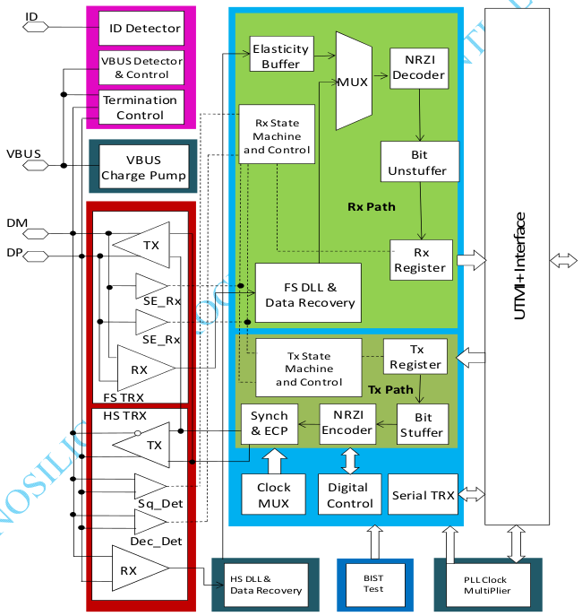
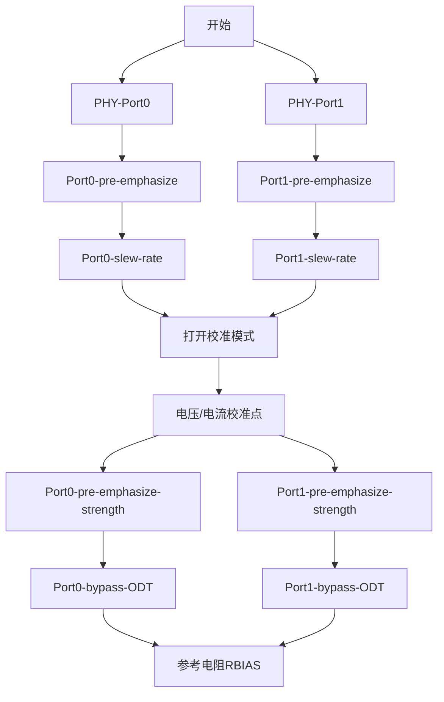
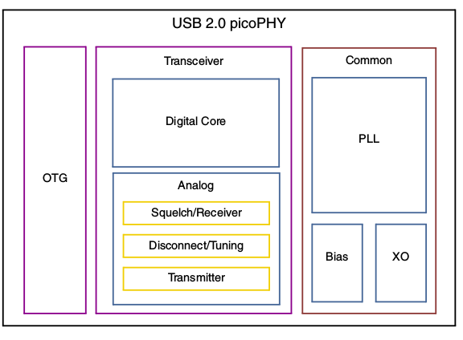
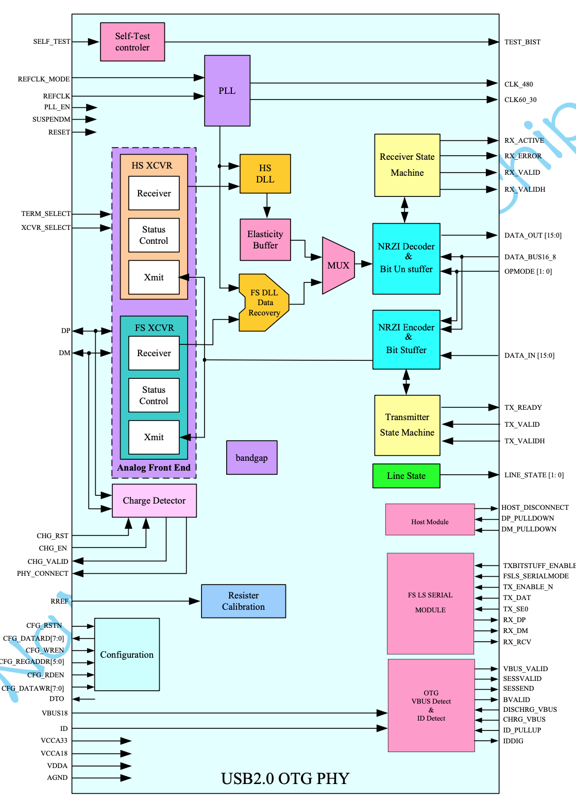
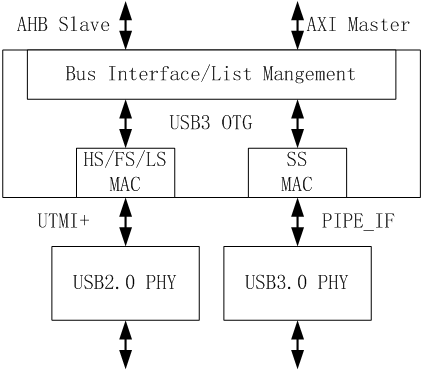
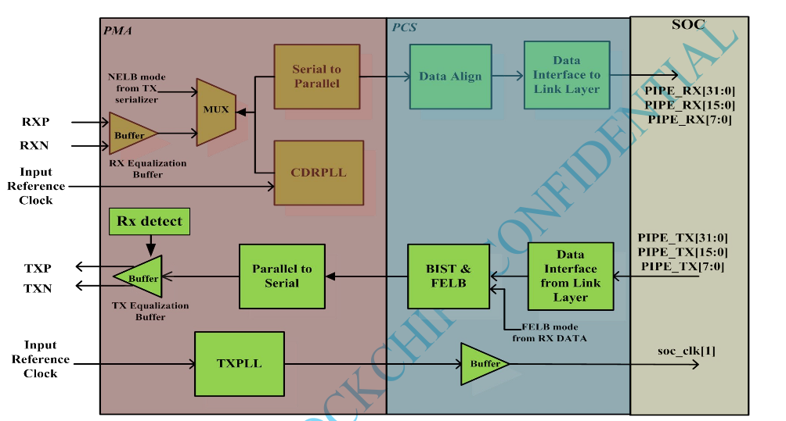
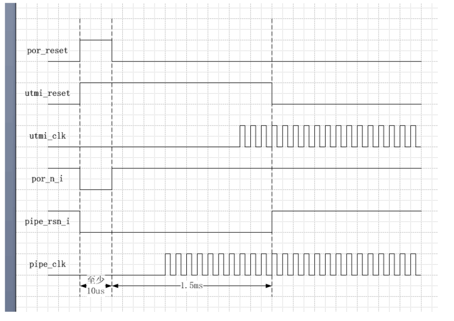
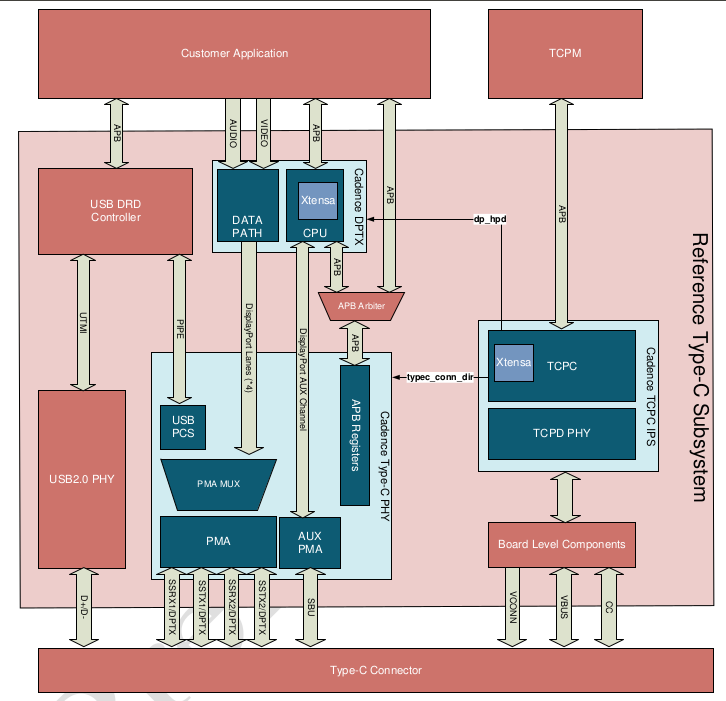
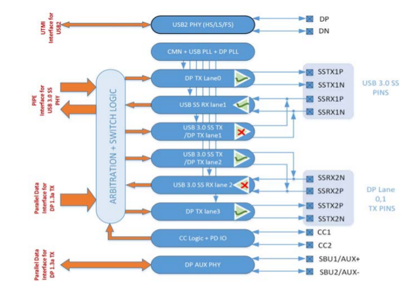
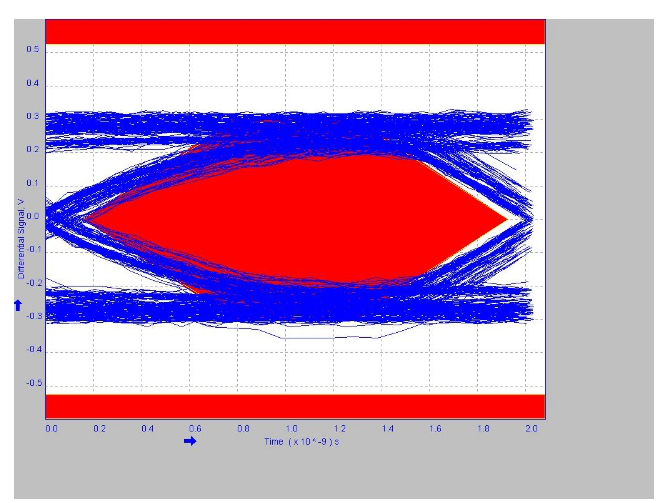

# Rockchip Developer Guide USB PHY

文件标识：RK-KF-YF-102

发布版本：V1.2.0

日期：2020-06-11

文件密级：□绝密   □秘密   ■内部资料   □公开

**免责声明**

本文档按“现状”提供，瑞芯微电子股份有限公司（“本公司”，下同）不对本文档的任何陈述、信息和内容的准确性、可靠性、完整性、适销性、特定目的性和非侵权性提供任何明示或暗示的声明或保证。本文档仅作为使用指导的参考。

由于产品版本升级或其他原因，本文档将可能在未经任何通知的情况下，不定期进行更新或修改。

**商标声明**

“Rockchip”、“瑞芯微”、“瑞芯”均为本公司的注册商标，归本公司所有。

本文档可能提及的其他所有注册商标或商标，由其各自拥有者所有。

**版权所有 © 2020 瑞芯微电子股份有限公司**

超越合理使用范畴，非经本公司书面许可，任何单位和个人不得擅自摘抄、复制本文档内容的部分或全部，并不得以任何形式传播。

瑞芯微电子股份有限公司

Rockchip Electronics Co., Ltd.

地址：     福建省福州市铜盘路软件园A区18号

网址：     [www.rock-chips.com](http://www.rock-chips.com)

客户服务电话： +86-4007-700-590

客户服务传真： +86-591-83951833

客户服务邮箱： [fae@rock-chips.com](mailto:fae@rock-chips.com)

---

**前言**

**概述**

本文档提供 Rockchip 平台 USB PHYs 的开发指南，通过该文档可以更加快速地了解 USB PHYs 的硬件设计框架、主要寄存器说明、PHY 的功耗管理、PHY 的 tuning 流程以及 PHY 的常见问题处理等。本文档可作为 USB PHYs 驱动开发的参考文档，但不能替代 PHY 的手册。

**产品版本**
| **芯片名称**                                                 | **内核版本** |
| ------------------------------------------------------------ | ------------ |
| 所有芯片(包括 29 系列、30 系列、31 系列、32 系列、33 系列、PX 系列、1108、1126/1109) | 所有内核版本 |

**读者对象**
本文档（本指南）主要适用于以下工程师：

软件工程师
硬件工程师
技术支持工程师

**修订记录**
| **日期**   | **版本** | **作者**           | **修改说明**                                       |
| ---------- | -------- | ------------------ | -------------------------------------------------- |
| 2018-05-21 | V1.0     | 吴良峰             | 初始版本                                           |
| 2019-01-09 | V1.1     | 吴良峰             | 使用 markdownlint 修订格式                         |
| 2020-02-19 | V1.11    | 吴良峰             | 增加免责声明，商标声明，以及版权声明，修改文档规范 |
| 2020-06-10 | V1.2.0   | 任家宁 吴良峰 | 增加2.3章节 NaNeng USB2.0 PHY                      |

---
[TOC]
---

## USB PHY 支持列表

Rockchip 采用的 USB PHY 主要有如下四种：

- USB2.0 PHY [Vendor: Innosilicon]
- USB3.0 PHY [Vendor: Innosilicon]
- USB2.0 PHY [Vendor: Synopsys]
- Type-C PHY [Vendor: Cadence]

如下表 1-1 为各芯片采用的 USB PHY，其中 [1 × port] 表示一个 PHY 支持一个 USB port，[2 × ports] 表示一个 PHY 支持两个 USB port。

表 1-1 Rockchip 平台 USB PHY 支持列表

| 芯片/PHY                                                     |  USB2 PHY [Inno]   | USB3 PHY [Inno] | USB2 PHY [Synopsys] | USB2 PHY [NaNeng]  | Type-C PHY [Cadence] |
| :----------------------------------------------------------- | :----------------: | :-------------: | :-----------------: | :----------------: | :------------------: |
| RK3066 RK3188 RK3288                               |         N          |        N        |  Y [1 × port]  |         N          |          N           |
| RK302X                                                  | Y [1 × port]  |        N        |          N          |         N          |          N           |
| RK303X RK312X RK322X RK3308 RK3326 RK3368 PX30 | Y [2 × ports] |        N        |          N          |         N          |          N           |
| RK3228H RK3328                                     |         Y          |        Y        |          N          |         N          |          N           |
| RK3399                                                       |         Y          |        N        |          N          |         N          |          Y           |
| RV1126 RV1109                                           |         N          |        N        |          N          | Y [1 × ports] |          N           |

---
## USB2.0 PHY

### Innosilicon USB2.0 PHY

#### PHY 的硬件框架

Innosilicon USB2.0 PHY 的硬件框架如下图 2-1 所示，主要包括五个子模块：Transceiver block，PLL clock multiplier，digital UTMI+ core，automatic test functionality，OTG Circuitry（optional）。

图 2-1 Block Diagram of Inno USB 2.0 PHY

#### 主要寄存器说明

表 2-1 Inno USB2.0 PHY Port0 主要寄存器

|   Bit    | Reset Value  | Description                                                  |
| :------: | :----------: | ------------------------------------------------------------ |
|   2:0    |    3'b000    | HS eye diagram adjust, open HS pre-emphasize function to increase HS slew rate, only used when large cap loading is attached. 001:open pre-emphasize in sof or eop state 010: open pre-emphasize in chirp state 100: open pre-emphasize in non-chirp state 111: always open pre-emphasize 该寄存器用于 HS 眼图预加重的调整，**建议设置为 3'b100** **see Note2** |
| 115, 4:3 |    3’b011    | Hs slew rate tuning bits, more one represents larger slew rate , 111 the maximum and 001 the minimum, 000 will shut down the high speed driver output 该寄存器用于 HS 眼图的 slew rate 调整。但**作用很小**。 |
|  16:13   |   4'b1100    | A port squelch trigger point configure 4b’0000 : 112.5mv 4b’0001 : 150mv 4b’0010 : 87.5mv 4b’0011 : 162.5mv 4b’0100 : 100mv 4b’0101 : 137.5mv 4b’0110 : 75mv 4b’0111 : 150mv 4b’1000 : 125mv 4b’1001 : 162.5mv 4b’1010 : 100mv 4b’1011 : 175mv 4b’1100 : 150mv(default) 4b’1101 : 187.5mv 4b’1110 : 125mv 4b’1111 : 200mv 该寄存器用于噪声阈值调整，建议用默认值 150mv。通过调整噪声阈值，可以解决 USB 外设异常断开的问题，参考：[4.2 通过调整噪声阈值解决 USB HS 设备枚举失败的问题](#4.2 通过调整噪声阈值解决 USB HS 设备枚举失败的问题) |
|  36:29   | 8'b0011_1111 | HS eye height tuning ,more zeros represent bigger eye, more ones represent smaller eye 该寄存器用于调整 HS 眼图的高度。只有在 bit[43:42] = 2’b11，即进入 bypass 状态后，才能生效。该寄存器可以调节的范围很大，但因为 bypass 状态下，USB PHY 会失去自动调整的能力，容易引起兼容性的问题。**所以，不建议设置该寄存器。** |
|  41:37   |   5'b10111   | HS/FS driver strength tuning 该寄存器用于调整 HS 眼图的驱动强度。 只有在 [42] = 1'b1，并且  [57] = 1'b0 时，即 bypass ODT，才能生效。默认值为 5b’10111, 最高位必须为 1，[41],[40],[39],[38],[37] 权重分别为 16,8,4,2,1。权重越大，驱动强度越小， 5b’11111 对应的驱动强度最小，5b’10000 对应的驱动强度最大。因为 bypass ODT 可能引起兼容性问题，所以，**建议尽量不要设置该寄存器**。 **see Note3** |
|  43:42   |    2'b00     | auto compensation bypass , “11” will bypass current and ODT compensation, customers can set the driver strength and current manually. For larger HS eye height, customer can give more “0” for bit [36:29] ; For larger HS/FS/LS slew rate, give more “1” for bit[41:37]. 该寄存器用于 bypass 电流和电阻的自动调节电路，可明显提高 USB 眼图的软件 tuning 范围。但 bypass 后，USB PHY 会失去自动调节的能力，可能引起兼容性问题，所以，不建议设置该寄存器。如果确实需要 bypass，**建议设置 [43:42] = 2’b01，[57] = 1b'0 即 bypass comp 电路中的电阻自动调节电路，保留电流自动调节电路，在该配置下，可以设置 [41:37]，不能设置 [36:29]** |
|  49:47   |    3'b000    | ODT Compensation voltage reference 3’b000 : 268mV(default) 3’b001 : 262mV 3’b010 : 250mV 3’b011 : 237.5mV 3’b100 : 275mV 3’b101 : 281mV 3’b110 : 293mV 3’b111 : 300mV 调高电阻校准点，可以提高 USB 眼图的幅度（推荐优先尝试 100/101, 最大为 3b’111）。 **see Note4** |
|  52:50   |    3'b000    | bias current tuning reference 3’b000 : 200mV(default) 3’b001 : 212.5mV 3’b010 : 225mV 3’b011 : 237.5mV 3’b100 : 250mV 3’b101 : 187.5mV 3’b110 : 175mV 3’b111 : 162.5mV 内部 current buffer 参考点，对眼图的影响很小，建议用默认值即可。 |
|  55:53   |    3'b000    | compensation current tuning reference 3’b000 : 400mV(default) 3’b001 : 362.5mV 3’b010 : 375mV 3’b011 : 387.5mV 3’b100 : 412.5mV 3’b101 : 425mV 3’b110 : 437.5mV 3’b111 : 450mV 调高电流校准点，可以提高 USB 眼图的幅度（推荐优先尝试 100/101，最大为 3b’111） **see Note4** |
|    57    |     1'b1     | A port ODT auto refresh bypass, active low 该寄存器只有在 [42] = 1’b1 时，才有效。在 bypass ODT 的模式下，才可以设置 [41:37]，调整眼图的驱动强度。 |
|    98    |     1'b1     | Turn off differential receiver in suspend mode to save power, active low. 该寄存器用于 PHY 的低功耗控制。参考[2.1.4.2 PHY 的功耗管理](#2.1.4.2 PHY 的功耗管理) |
|   100    |     1'b0     | force output B_sessionvalid asserted, active high 该寄存器可以设置 B_sessionvalid 为高，解决芯片端 otg_det pin 没有连接到 USB 接口的 VBUS pin，导致 VBUS 检测失效的问题。 |
| 108:106  |    3'b000    | B_sessionvalid reference tuning 该寄存器用于调整 B_sessionvalid 的参考阈值，参考 [4.4 通过 B_sessionvalid reference tuning 解决 ADB 连接问题](#4.4 通过 B_sessionvalid reference tuning 解决 ADB 连接问题) |
| 126:123  |   4'b1101    | HOST disconnect detection trigger point configure, only used in HOST mode 0000 : 575mV 0001 :  600mV 1001 : 625mV 1101 : 650mV(default) 该寄存器用于调整 Host mode 的断开检测阈值，参考 [4.3 通过调整断开检测阈值解决 USB 异常断开的问题](#4.3 通过调整断开检测阈值解决 USB 异常断开的问题) |
|   127    |     1'b0     | vbus voltage level detection function power down 该寄存器用于使能 Device mode 的 vbus detect，只有使能该 bit 位，GRF（USB_GRF）寄存器中的 bvalid 状态检测才有效果。 |

- Note1：表 1-2 只给出了 Inno USB2 PHY Port0 的主要寄存器说明。Port1 的寄存器与 Port0 基本一致，只是 Bit 位置不同，请参考 PHY 的手册即可。

- Note2：bit0 为 SOF 和 EOP 的预加重，应该慎用，如果同时设置 bit[0] 和 [41:37] = 5'b10000，容易导致 disconnect 误判。此外，bit1 为 chrip state 预加重，也要慎用，可能会导致 high-speed 握手失败。

- Note3：如果通过调整 bit[2:0]，bit[115]，bit[4:3]，bit[55:53]，bit[49:47] 这些寄存器，USB 眼图指标测试仍无法 PASS，可以考虑设置 bit[41:37]。设置方法是：首先，设置 [42] =1'b1，[57] = 1'b0，bypass comp 电路中的电阻自动调节电路，但仍然保留电流自动调节电路（避免引起兼容性问题）。然后，再根据 USB 眼图的测试结果，动态调整 [41:37] ，找到最佳的配置。更详细的设置方法，请参考 [2.1.6 PHY tuning 流程](#2.1.6 PHY tuning 流程)

- Note4：[49:47] 和 [55:53] 需要在打开校准模式后，才能生效，并且**对同一个 PHY 的 port0 和 port1 同时生效**。不同的 PHY 版本，校准模式的控制寄存器可能不同，比如 :

  RK3399 打开校准模式为 [199] = 1'b1

  RK3328/RK3228H/PX30/RK3326/RK3308/RV1108 打开校准模式为:

  [186:184] = 3b’000（以默认的电流校准方式）

  [186:184] = 3b’100（以 Port0 的电流校准方式）

  [186:184] = 3b’101（以 Port1 的电流校准方式）

#### 参考电阻 USBRBIAS 说明

参考电阻 USBRBIAS 在 PHY 手册中规定为 135 Ω，实际电路中，一般采用 **133Ω  ± 10%** 的电阻。该阻值会影响 USB 信号的驱动强度，所以建议尽量不要随意改动。在特殊情况下，如 USB 电路的 DP/DM 阻抗由于硬件设计原因变大，导致 USB 信号幅度降低，并且通过软件 tuning 也无法提高幅度到标准值时，可以考虑修改该参考电阻的阻值。修改参考电阻 USBRBIAS 的阻值，应该遵循如下几个原则：

1. 阻值越小则输出强度越大，出来的波形整体放大，但对摆率（slew rate）没有影响；
2. 阻值允许的修改范围为 ±10%，超过该范围可能会存在兼容性问题；
3. 阻值会影响到同一个 PHY 的两个 port，所以修改阻值后，一定要重新测试 PHY 的两个 port 的眼图，避免因幅度过大而触发 disconnect 信号，造成 device 频繁 disconnect/reconnect；

#### PHY 的供电及功耗管理

##### PHY 的供电

PHY 的供电有三路 3.3V，1.8V 和 1.0V，如下表 2-2 所示。如果实际电路中，这三路电压值超过规定的最大值或者低于规定的最小值，都可能会导致 USB 连接异常。

表 2-2 Inno USB2.0 PHY power supplies

| Supply Voltage | Min  | Typ  | Max  | Unit |
| :------------: | :--: | :--: | :--: | :--: |
|  USB_AVDD_3V3  | 3.0  | 3.3  | 3.6  |  V   |
|  USB_AVDD_1V8  | 1.62 | 1.8  | 1.98 |  V   |
|  USB_AVDD_1V0  | 0.9  | 1.0  | 1.1  |  V   |

一个典型的出错现象是，VCCCORE1P0 的电压超过了规定的最大值 1.1V，导致 USB ADB 连接失败。解决方法请参考[4.4 通过 B_sessionvalid reference tuning 解决 ADB 连接问题](#4.4 通过 B_sessionvalid reference tuning 解决 ADB 连接问题)

##### PHY 的功耗管理

- **运行时的 PHY 功耗管理**

系统运行时，如果 USB2.0 port 没有工作，则可以通过 GRF（或 USB_GRF）寄存器中的 utmi_sel，utmi_suspend_n，utmi_opmode，utmi_xcvrselect，utmi_termselect，utmi_dppulldown 以及 utmi_dmpulldown 来控制 USB2.0 PHY 进入 suspend。当检测到有 USB 连接时，需要先 resume PHY，才能开始 USB 枚举。详细的控制流程可以参考 USB2.0 PHY 的驱动（drivers/phy/rockchip/phy-rockchip-inno-usb2.c）。

表 2-3 运行时的  Inno USB2.0 PHY 功耗管理寄存器

| Bit  | Reset Value | Suspend Value | Description                                                  |
| :--: | :---------: | ------------- | :----------------------------------------------------------- |
|  8   |    1'b0     | 1'b1          | utmi_dmpulldown 0 : DM 15 KOhm pull down disabled 1: DM 15 Kohm pull down enable |
|  7   |    1'b0     | 1'b1          | utmi_dppulldown 0 : DP 15 KOhm pull down disabled 1 : DP 15 Kohm pull down enable |
|  6   |    1'b1     | 1'b1          | utmi_termselect  GRF termination select between FS/HS speed 1 : Full-speed terminations are enabled. 0 : High-speed terminations are enabled. |
| 5:4  |    2'b01    | 2'b01         | utmi_xcvrselect  GRF transceiver select between FS/LS/HS speed 11 : Sends an LS packet on an FS bus or receives an LS packet. 10 : LS Transceiver 01 : FS Transceiver 00 : HS Transceiver |
| 3:2  |    2'b00    | 2'b00         | utmi_opmode  GRF operational mode selection 11 : Normal operation without SYNC or EOP generation. If the XCVRSEL bus is not set to 00 while OPMODE[1:0] is set to 11，USB PHY behavior is undefined. 10 : Disable bit stuffing and NRZI encoding. 01 : Non-Driving 00 : Normal |
|  1   |    1'b1     | 1'b0          | utmi_suspend_n  GRF suspend mode  1'b0 : suspend  1'b1 : normal |
|  0   |    1'b0     | 1'b1          | utmi_sel  1'b0 : select otg controller utmi interface to phy  1'b1 : select GRF utmi interface to phy |

- **待机时的 PHY 功耗管理**

待机时的 PHY 功耗管理有如下两种方法，**推荐使用方法 2**。

方法 1：关闭 PHY 的供电

关闭 PHY 的供电是最直接的节省功耗的方法，但有两个限制：

1. PHY 的三路供电 3.3V，1.8V ，1.0V 以及 VDD_logic 要同时关闭，否则会导致这四路电之间的漏电。
2. 关闭 PHY 的供电，则不支持 USB 唤醒系统（Remote wakeup）的功能。

方法 2：设置 PHY 进入低功耗模式

该方法是通过 GRF（USB_GRF）寄存器来控制 PHY 进入低功耗模式。

目前，PHY 驱动（`drivers/phy/rockchip/phy-rockchip-inno-usb2.c`）支持两级低功耗设置。默认开启一级低功耗配置，关闭二级低功耗配置。因为二级低功耗配置下，linestate 和 bvalid 中断都会失效。如果要开启二级低功耗配置，需要在 DTS 中 增加属性 “rockchip,low-power-mode”。

一级低功耗配置：

表 2-4  Inno USB2.0 PHY 一级低功耗寄存器配置

| Bit  | Reset Value | Suspend Value | Description                              |
| :--: | :---------: | :-----------: | ---------------------------------------- |
|  98  |    1'b1     |     1'b0      | Turn off differential receiver in suspend mode to save power，active low |

二级低功耗配置：

表 2-5  Inno USB2.0 PHY 二级低功耗寄存器配置

| Bit  | Reset Value | Suspend Value | Description                                                  |
| :--: | :---------: | :-----------: | ------------------------------------------------------------ |
|  46  |    1'b0     |     1'b1      | Battery charging related register                            |
| 127  |    1'b0     |     1'b1      | vbus voltage level detection function power down，active high |

**Note**：在二级低功耗的配置下，linestate 和 bvalid 中断都会失效，只有 id 中断起作用。

表 2-6  Inno USB2.0 PHY 低功耗数据 （以 PX30/RK3326 实测数据为例）

|   供电电源   | 运行时低功耗 | 待机一级低功耗 | 待机二级低功耗 |
| :----------: | :----------: | :------------: | :------------: |
| USB_AVDD_1V0 |   0.27 mA    |    0.27 mA     |    0.006 mA    |
| USB_AVDD_1V8 |   0.73 mA    |     0.1 mA     |    0.02 mA     |
| USB_AVDD_3V3 |     0 mA     |      0 mA      |      0 mA      |

#### PHY clk 管理

PHY 输出给 USB 控制器的时钟主要有 480 MHz clk 和 utmi clk，这两个时钟如果没有管理好，会导致 USB 控制器工作异常。对于这两个时钟的管理，需要注意以下两点：

- **480 MHz clk 的管理**

对于 Inno USB2.0 PHY 2 x ports，两个 ports 共同使用一个 480 MHz clk，由 GRF 寄存器的 suspend assert 和 COMMONONN 联合控制。控制方法如下：

两个 port 都进 suspend， 并且 COMMONONN 为 1，才会关闭 480 MHz clk。当 480 MHz clk 被关闭后，如果有其他 IP 需要使用该 clk，可以将 COMMONONN 重新设置为 0 即可，不需要重新 reset PHY，但需要等待 1 ms，clk 才能稳定。

两个 port，如果有一个没有进入 suspend，则不会关闭 480 MHz clk。两个 port，如果都进入 suspend，但 COMMONONN 为 0，也不会关闭 480 MHz clk。

- **utmi clk 的管理**

对于 Inno USB2.0 PHY 2 x ports，每个 port 有自己对应的 utmi clk，并且，只由 port 自己的 suspend assert 控制。当 port 进入 suspend，utmi clk 会被关闭。

当 port 退出 suspend，utmi clk 会被重新开启，但需要等待 **1.5 ~ 2ms**，utmi clk 才能稳定。

#### PHY tuning 流程

Inno USB2.0 PHY (2 x ports) tuning 的流程图如下:

以 RK3399 USB2.0 PHY HS tuning 为例（RK3399 具有两个 USB2.0 PHY，每个 PHY 有 2 个 port），tuning 流程如下 Stage1 ～ stage5。

**Stage1. Port0 & Port1 pre-emphasize & slew rate tuning**

Port0 tuning：

[2:0] = 3'b100;  (open Port0 pre-emphasize in non-chirp state)

{[115],[4:3]} = 3'b101 (设置 Port0 slew-rate 最大，注意：3'b101 强度最大，而不是 3'b111)

Port1 tuning：

[210:208] = 3'b100; (open Port1 pre-emphasize in non-chirp state)

{[323],[212:211]} = 3'b101; (设置 Port1 slew-rate 最大，注意：3'b101 强度最大，而不是 3'b111)

**Stage2. 打开校准模式，调整电压/电流校准点**

注意：如下寄存器的调整对 Port0 和 Port1 同时生效。

[199] = 1'b1;  (变换校准模式（这一位寄存器只存在于 port0 上，但对 port0 和 port1 同时有作用），这是一个备用的校准模式，通常是不开放的。在新的校准模式下，调节 [55:53]，[49:47]才能有效。)

如果通过 Stage1 的 tuning，眼图仍不能得到明显改善，可在此基础上尝试调高下面的电流校准点和电阻校准点：

[55:53] = 3'b101(default); (调高电流校准点(推荐优先尝试 100/101，最大为 3b’111)

[49:47] = 3'b101(default); (调高电阻校准点(推荐优先尝试 100/101, 最大为 3b’111)

此外，还可以调整[52:50] (内部 current buffer 参考点)，但作用比较小。

**Stage3. 调整预加重强度**

[194:192] = 3'b011; (调节 Port0 HS driver 预加重强度，“111”强度最大。其中[194]，[193]，[192]的权重依次为 1，2，4)

[402:400] = 3'b011;  (调节 Port1 HS driver 预加重强度，“111”强度最大)

**Stage4. Bypass ODT  & driver strength tuning**

如果通过 Stage1～stage3 的常规 PHY tuning 方法，眼图测试仍然无法 pass，可以考虑 bypass ODT，需要注意的是，Port0 和 Port1 可以分开 bypass ODT 和 调整驱动强度。

**Port0 bypass ODT & driver strength tuning：**

[42] = 1'b1;  (bypass comp 电路中的电阻自动调节电路，保留电流自动调节电路，当 Port1 对应的 [250] 没有置 1 时，该 bit 同时对 Port0 和 Port1 产生作用，也即设置 [41:37] 会同时影响 Port0 和 Port1。当 Port1 对应的 [250] 置 1 时，则该 bit 只会对 Port0 产生作用，也即 [41:37] 只控制 Port0，而 [249:245] 控制 Port1)

[57] = 1'b0; (Port0 ODT auto refresh bypass)

[41:37] = 5b' 10001 或 5'b10000 (Port0 驱动强度调整，默认值为 5b’10111，最高位必须为 1，[41]，[40]，[39]，[38]，[37] 权重分别为 16，8，4，2，1。权重越大，驱动强度越小，5b’11111 对应的驱动强度最小，5b’10000 对应的驱动强度最大）

**Port1 bypass ODT & driver strength tuning：**
[250] = 1’b1; (bypass comp 电路中的电阻自动调节电路，保留电流自动调节电路，只对 Port1 产生作用。当该 bit 置 1，则 [249:245] 可以并且只能控制 Port1，当该 bit 为 0，则 [249:245] 不能控制 Port1，而是由[41:37]来控制 Port1)

[265] = 1'b0; (Port1 ODT auto refresh bypass，类似 bit [57] 设置 Port0 的作用）

[249:245] (Port1 驱动强度调整，类似 bit [41:37] 设置 Port0 的作用)

**Stage5. 调整参考电阻 RBIAS 的阻值**

如果软件 tuning PHY，仍然无法保证眼图测试 pass，最后只能考虑调整参考电阻的方法，请参考 [2.1.3 参考电阻 USBRBIAS 说明](#2.1.3 参考电阻 USBRBIAS 说明)

### Synopsys USB2.0 PHY

考虑到 Synopsys USB2.0 PHY 只用于较早的几款芯片（RK3066/RK3188/RK3288），当前的主流芯片和后续的芯片 USB2.0 PHY 都是采用 Innosilicon 提供的 IP，所以本章节只作简单介绍。

#### PHY 的硬件框架

Synopsys USB2.0 PHY 的硬件框架如下图 2-2 所示，主要包括三个子模块：Common block，Transceiver block，OTG block。各模块的具体作用在 PHY 手册中有详细说明，这里不再赘述。

需要注意的是，Rockchip 平台的 Synopsys USB2.0 PHY 都是只支持一个 Port，不像 Inno USB2.0 PHY 可以支持两个 Ports。

图 2-2 Synopsys USB 2.0 picoPHY One-Port Functional Block Diagram

#### 主要寄存器说明

表 2-7 Synopsys USB2.0 PHY 主要寄存器

|        Signal        | I/O  | Description                                                  |
| :------------------: | :--: | ------------------------------------------------------------ |
|   COMPDISTUNE[2:0]   |  I   | Disconnect Threshold Adjustment Function: This bus adjusts the voltage level for the threshold used to detect a disconnect event at the host. 111: + 4.5% 110: + 3% 101: + 1.5% 100: Design default 011: – 1.5% 010: – 3% 001: – 4.5% 000: – 6% |
|     OTGTUNE[2:0]     |  I   | VBUS Valid Threshold Adjustment Function: This bus adjusts the voltage level for the VBUS Valid threshold. 111: + 9% 110: + 6% 101: + 3% 100: Design default 011: – 3% 010: – 6% 001: – 9% 000: – 12% |
|    SQRXTUNE[2:0]     |  I   | Squelch Threshold Adjustment Function: This bus adjusts the voltage level for the threshold used to detect valid high-speed data. 111: – 20% 110: – 15% 101: – 10% 100: – 5% 011: Design default 010: + 5% 001: + 10% |
|   TXFSLSTUNE[3:0]    |  I   | FS/LS Source Impedance Adjustment Function: This bus adjusts the low- and full-speed single-ended source impedance while driving high. The following adjustment values are based on nominal process, voltage, and temperature. 1111: – 5% 0111: – 2.5% 0011: Design default 0001: + 2.5% 0000: + 5% |
| TXPREEMPAMPTUNE[1:0] |  I   | HS Transmitter Pre-Emphasis Current Control Function: This signal controls the amount of current sourced to DP0 and DM0 after a J-to-K or K-to-J transition. The HS Transmitter pre-emphasis current is defined in terms of unit amounts. One unit amount is approximately 600 μA and is defined as 1X pre-emphasis current. 11: HS Transmitter pre-emphasis circuit sources 3X pre-emphasis current. 10: HS Transmitter pre-emphasis circuit sources 2X pre-emphasis current. 01 (design default): HS Transmitter pre-emphasis circuit sources 1X pre-emphasis current. 00: HS Transmitter pre-emphasis is disabled. |
|  TXPREEMPPULSETUNE   |  I   | HS Transmitter Pre-Emphasis Duration Control Function: This signal controls the duration for which the HS pre-emphasis current is sourced onto DP0 or DM0. The HS Transmitter pre-emphasis duration is defined in terms of unit amounts. One unit of pre-emphasis duration is approximately 580 ps and is defined as 1X pre-emphasis duration. This signal is valid only if either TXPREEMPAMPTUNE0[1] or TXPREEMPAMPTUNE0[0] is set to 1'b1. 1: 1X, short pre-emphasis current duration 0 (design default): 2X, long pre-emphasis current duration |
|   TXRISETUNE[1:0]    |  I   | HS Transmitter Rise/Fall Time Adjustment Function: This bus adjusts the rise/fall times of the high-speed waveform. 11: – 20% 10: – 15% 01: Design default 00: + 10% |
|   TXVREFTUNE[3:0]    |  I   | HS DC Voltage Level Adjustment Function: This bus adjusts the high-speed DC level voltage. |
|   TXHSXVTUNE[1:0]    |  I   | Transmitter High-Speed Crossover Adjustment Function: This bus adjusts the voltage at which the DP0 and DM0 signals cross while transmitting in HS mode. |
|    TXRESTUNE[1:0]    |  I   | USB Source Impedance Adjustment Function: In some applications, there can be significant series resistance on the D+ and D– paths between the transceiver and cable. This bus adjusts the driver source impedance to compensate for added series resistance on the USB. Note: Any setting other than the default can result in source impedance variation across process, voltage, and temperature conditions that does not meet USB 2.0 specification limits. 11: Source impedance is decreased by approximately 4 Ω. 10: Source impedance is decreased by approximately 2 Ω. 01: Design default 00: Source impedance is increased by approximately 1.5 Ω. |

#### 参考电阻 REXT 说明

根据 PHY 手册的设计要求，RK3066/RK3188/RK3288 的参考电阻 External resistor (REXT) 如下表 2-8，，在电路设计中，请严格按照参考阻值的要求进行设计。如果需要调整 DP/DM 的阻抗，可以调整 USB PHY 的寄存器 TXRESTUNE[1:0]，具体参考 [2.2.2 主要寄存器说明](#2.2.2 主要寄存器说明)

表 2-8 Synopsys USB2.0 PHY REXT

|     芯片      | 参考电阻 REXT |
| :-----------: | :-----------: |
| RK3066/RK3188 | 43.2 Ω (± 1%) |
|    RK3288     |     200 Ω     |

#### PHY 的供电及功耗管理

##### PHY 的供电

根据 PHY 手册的设计要求，RK3066/RK3188/RK3288 的供电如下表 2-9 所示。

表 2-9 Synopsys USB2.0 PHY power supplies

|     芯片      |             Analog power supplies             | Digital power supply |
| :-----------: | :-------------------------------------------: | :------------------: |
| RK3066/RK3188 | 3.3 V (+ 10%, – 7%)  2.5 V (+ 10%, – 7%) | 1.1 V (+ 10%, – 7%)  |
|    RK3288     |       3.3 V (± 10%) 1.8 V (± 10%)        |    1.0 V (± 10%)     |

##### PHY 的功耗管理

- **运行时的 PHY 功耗管理**

Synopsys USB2.0 PHY 的运行功耗管理与 Inno USB2.0 PHY 类似，也是通过 GRF（或 USB_GRF）寄存器中的 utmi_sel，utmi_suspend_n，utmi_opmode，utmi_xcvrselect，utmi_termselect，utmi_dppulldown 以及 utmi_dmpulldown 来控制 USB2.0 PHY 进入 suspend。寄存器的具体配置方法，请参考 [2.1.4.2 PHY 的功耗管理](#2.1.4.2 PHY 的功耗管理)章节。

- **待机时的 PHY 功耗管理**

Synopsys USB2.0 PHY 的待机功耗管理与 Inno USB2.0 PHY 有所不同。Synopsys USB2.0 PHY 可以通过控制 SIDDQ（通常在 GRF 寄存器中）来关闭 PHY 的模拟电路，从而让 PHY 进入低功耗模式。SIDDQ 的功能描述如下表 2-10 所示。

表 2-10 Synopsys USB2.0 PHY 待机低功耗配置

|  Bit  | Reset Value | Suspend Value | Description                                                  |
| :---: | :---------: | :-----------: | ------------------------------------------------------------ |
| SIDDQ |    1'b0     |     1'b1      | Function: This test signal enables you to perform IDDQ testing by powering down all analog blocks. Before asserting SIDDQ, ensure that VDATSRCENB0, VDATDETENB0, DCDENB0, BYPASSSEL0, ADPPRBENB0, and TESTBURNIN are set to 1'b0. 1: The analog blocks are powered down. 0: The analog blocks are powered up. Note：如果有使能 Bypass Uart 的功能，在待机时，需要关闭 Bypass 功能（BYPASSSEL0 = 1'b0），否则会增加 PHY 的功耗。 |

#### PHY clk 管理

Synopsys USB2.0 PHY 的 clk 管理与 Inno USB2.0 PHY 类似，也是通过 GRF 寄存器的 suspend assert 和 COMMONONN 联合控制。请参考 [2.1.5 PHY clk 管理](#2.1.5 PHY clk 管理)

#### PHY tuning 流程

Synopsys USB2.0 PHY 的兼容性比较好，所以一般不用 tuning PHY。如果因为硬件电路设计问题，需要进行 tuning，可以根据表 2-7 Synopsys USB2.0 PHY 主要寄存器的说明进行调整，tuning 的流程相比 Inno USB2.0 PHY 简单得多，主要调整眼图的预加重（TXPREEMPAMPTUNE[1:0]  ）和斜率（TXRISETUNE[1:0]）。

### NaNeng USB2.0 PHY

#### PHY 的硬件框架

NaNeng USB2.0 PHY的硬件框架如下图 2-3 所示

图 2-3 Block Diagram of NaNeng USB 2.0 PHY

- **Phase locked loop(PLL) and clock divider**

通过获取 12MHz 参考时钟输入并使用频率合成，PLL 模块生成一个 480MHz 高速时钟用于 USB 数据发送和接收。 同时，它产生不同的分频时钟，包括 CLK_480，以用于后续功能。

- **IO Transceiver (XCVR)**

USB IO 收发器包括 HS 收发器和 FS 收发器，用于根据实际应用支持高速或全速模式。 每个 IO 收发器包括三个模块，分别是接收器 IO（RCV），发送器 IO（XMIT）和控制模块。 该模块用于将来自发送器的数字数据流转换为符合 USB 电气规格的差分信号，反之亦然，将输入的差分 USB 信号转换为数据流并发送至 USB 接收器模块。

- **USB Transmitter**

根据 DATA_BUS16_8 的状态，USB 发送器将从 DATA_IN 中获取 16/8 位并行数据总线，并在经过必要的处理后将其转换为串行数据流，然后发送至 IO 收发器模块。USB 发送器处理数据并执行 SYNC 插入，EOP 插入，NRZI 编码和位填充等功能。 该模块还包含用于 UTIM 协议处理的 line-status 控制和传输状态机。

- **USB Receiver**

通过从 XCVR 获取数据流，USB 接收器将使用 CDR（Clock Data Recovery）从传入数据流中提取的恢复时钟来采样并锁存传入数据。 USB 接收器还负责数字数据处理功能，例如位去填充，NRZI 解码，SYNC 字段和 EOP 字段的删除和剥离。

同时，实现了接收器状态机，用于 UTMI 接收器协议处理，有关此状态机的详细信息，请参阅 UTMI 接口规范。

高速 DLL 和全速 DLL 分别用于 HS 和 FS 模式下的 CDR 时钟相位跟踪和相位调整。DLL 相位校准是自动执行的，不需要任何外部校准过程。

为了补偿高速模式下 USB 发送器和 USB 接收器之间的频率偏移，USB 接收器还实现了一个弹性缓冲器。 可以通过监视 UTMI 接口信号 RXERROR 来观察缓冲区的上溢或下溢状态。

- **Bandgap reference**

带隙模块是一个内部参考发生器，用于为 IP 上的所有电路提供参考电压/电流。 带隙模块在不同的工艺，电源电压和温度条件下变化很小，并且不需要任何外部组件即可完成工作。

- **Termination Resister Calibration**

校准模块使用外部电阻作为参考，以在任何 PVT 下获得准确的 45Ω 端接，校准将在加电并打开带隙参考后开始，耗时约 **300us**。

- **Charge Detector**

充电检测支持 BC1.2，当 USB 2.0 PHY 用作便携式设备时，它可以检测包括 CDP，DCP 和 SDP 的充电端口。 当 USB 2.0用作主机或 OTG 设备时，可以将其配置为 SDP 或 CDP。

#### 主要寄存器说明

表 2-11 NaNeng USB2.0 PHY 主要寄存器

|      Bit      |     Field Name     | Reset Value | Description                                                  |
| :-----------: | :----------------: | :---------: | ------------------------------------------------------------ |
|  FC_REG00[5]  |    cfg_hs_strg     |    1'b1     | HS TX strong power mode 正常使用时，该 bit 必须置 1。 特殊用法：在 chirp K 阶段设置该 bit 为 0，大约可以提高 chirp K 幅值 10mV |
|  FC_REG00[6]  |  cfg_sel_strength  |    1'b0     | HS TX stronger edge driver enable signal **该寄存器用于 HS 眼图的 Slew rate 调整** 置 1 可以改善眼图的 Slew rate，但无法提高幅值。 |
|  FC_REG00[7]  |     cfg_sel_pw     |    1’b0     | HS TX edge delay select signal Bypass signal of VDDA detect function:   0: normal mode 1: bypass mode, VDDA detect function is disable **该寄存器用于 HS 眼图的 Slew rate 调整** 置1 可以改善眼图的 Slew rate，但可能会导致眼图过冲。所以使用时，请务必测试眼图确认效果。 |
|  FC_REG02[2]  | cfg_rcal_sel_voff  |    1'b1     | Calibration code select signal, default value: 4’b1  0: select calibration code  1: select cfg_rcal_voff[3:0] 如果设置为 0 就会触发一次电阻校准 RV1126/RV1109 PHY 驱动在初始化阶段会触发一次电阻校准功能，并把校准值 rcal_out[3:0] 写入 cfg_rcal_voff[3:0] ，然后关闭电阻校准功能。 |
| FC_REG02[4:3] |   cfg_rref[1:0]    |    2'b00    | Reference resister select signal  00: 200 ohm  01: 390 ohm  10: 1K ohm  11: 2Kohm 默认使用 200 ohm 外部参考电阻 |
| FC_REG04[6:3] | cfg_rcal_voff[3:0] |   4'b0111   | Register code for termination resister **该寄存器用于 HS 眼图的幅值调整** 该寄存器只有在 FC_REG02[2] 为 1 时生效  理论上，cfg_rcal_voff 值越大，对应的内部 45Ω 电阻越小，对应的眼图幅值越大 设置为 4'b1111，内部 45Ω 电阻最小，对应眼图幅值最大 设置为 4'b0001，内部 45Ω 电阻最大，对应眼图幅值最小 设置为 4‘b0000，无效 |
|  FC_REG06[0]  |     LS_PAR_EN      |    1'b1     | LS mode with parallel enable 作 Host 时，为了识别低速设备必须将该 bit 位置 1 |
|  FC_REG08[4]  |   cfg_swcal_byps   |    1'b0     | Bypass signal of TX swing calibration function  0: normal mode  1: bypass mode 当PHY的供电电压不是标准的 0.8V，1.8V 和 3.3V时，触发电压自校准 电压校准只有在 chirp K 的前 500us 生效；如果已做过一次电压校准，即使 bypass tx 电压校准，校准过的电流源仍然会保持住；从 bypass 切换到 normal，可以强制触发一次电压校准，但最好是在 chirpk 前 500us 让 phy 自己去判断校准 |
|  FC_REG08[5]  |  cfg_byps_charge   |    1'b0     | Bypass signal of charge detection   0: normal mode  1: bypass mode 在系统进入待机时，通过 bypass 充电检测功能可以降低 phy 的休眠功耗 |
|  FC_REG0D[4]  |   rcal_trim_done   |     RO      | 电阻校准的状态（只读） 为 1 表示电阻校准完成 正常情况，电阻校准耗时约为 300us，也即 cfg_rcal_sel_voff 设置为 0 后 ，等待 200 - 300us 该bit 位会置 1，表示校准完成 更多信息，请参考 [2.3.3 参考电阻RREF电阻的说明](#2.3.3 参考电阻RREF电阻的说明) |
| FC_REG0D[3:0] |      rcal_out      |     RO      | 电阻自校准得到的电阻 Code，只有在 FC_REG02[2] cfg_rcal_sel_voff 设置为 0 时生效 理论上，外部参考电阻越小，对应的电阻 Code 值越大，眼图幅值也越大 |

#### 参考电阻RREF电阻的说明

参考电阻 RREF 在 PHY 手册中规定有四种阻值，由寄存器 FC_REG02[4:3] 控制，默认为 200Ω。具体参考 [2.3.2 主要寄存器说明](#2.3.2 主要寄存器说明)。

**改变参考电阻可以在一定程度上调整眼图的幅度，这种方法与改变 cfg_rcal_voff[3:0] 的方法效果一样，本质都是改变 PHY 内部的 45Ω 终端电阻。理论上，参考电阻越小，PHY 内部的 45Ω 电阻也越小，对应眼图幅度就越大**。

**Note:**

1. 参考电阻只有在 FC_REG02[2] cfg_rcal_sel_voff 为 0，才能生效。具体参考  [2.3.2 主要寄存器说明](#2.3.2 主要寄存器说明)；
2. 参考电阻的取值为标准值的 ±10%（45Ω 内部电阻的 PVT 偏差）；
3. 电阻校准期间 Rref 引脚会检测到持续 300us 的高电平，默认 200Ω 参考电阻下幅值为 400mV。参考电阻越大，电压越大，如果电压超过 2V 就会判断为参考电阻断开（高阻态），此时只会维持 3.5 us 就会将rcal_trim_done 置为 1；
4. RREF 200 Ω的电阻建议用 1% 的精密电阻，在 PCB 上放置离管脚越近越好；

#### PHY 的供电及功耗管理

##### PHY 的供电

PHY 的供电有三路 3.3V，1.8V 和 0.8V，如下表 2-12 所示。

表 2-12 NaNeng USB2.0 PHY power supplies

| Supply Voltage | Min  | Typ  | Max  | Unit |
| :------------: | :--: | :--: | :--: | :--: |
|    USB_VDDA    | 0.72 | 0.80 | 0.88 |  V   |
|   USB_VCCA18   | 1.62 | 1.80 | 1.98 |  V   |
|   USB_VCCA33   | 2.97 | 3.30 | 3.63 |  V   |

##### PHY 的功耗管理

- **运行时的 PHY 功耗管理**

NaNeng USB2.0 PHY 的运行功耗管理与 Inno USB2.0 PHY 类似，也是通过 GRF寄存器中的 utmi_sel，utmi_suspend_n，utmi_opmode，utmi_xcvrselect，utmi_termselect，utmi_dppulldown 以及 utmi_dmpulldown 来控制 USB2.0 PHY 进入 suspend。寄存器的具体配置方法，请参考 [2.1.4.2 PHY 的功耗管理](#2.1.4.2 PHY 的功耗管理)章节。

**Note: **与 Inno USB 2.0 PHY 不同的是，NaNeng USB2.0 PHY 在进入 suspend 时，需要将utmi_opmode 设置为2'b01 non-driving

- **待机时的 PHY 功耗管理**

待机时的 PHY 功耗管理有如下两种方法，**推荐使用方法 2**。

**方法 1：关闭 PHY 的供电**

关闭 PHY 的供电是最直接的节省功耗的方法，但有两个限制：

1. PHY 的三路供电 3.3V，1.8V ，0.8V 以及 VDD_logic 要同时关闭，否则会导致这四路电之间的漏电。
2. 关闭 PHY 的供电，则不支持 USB 唤醒系统（Remote wakeup）的功能。

**方法 2：设置 PHY 进入低功耗模式 （suspend mode）**

该方法是通过 GRF 寄存器来控制 PHY 进入低功耗模式。

NaNeng USB2.0 PHY 一共有三种功耗模式，分别为 normol mode，PLL-only mode 和 suspend mode。

USB2.0 PHY 驱动中，会根据 USB 实际的工作场景，动态切换三种功耗模式。

- normal mode

  High-speed operation: 设置 SUSPENDM = 1, OPMODE[1:0] = 00, XCVRSELECT = 0, TERMSELECT = 0

  Full-speed operation: 设置 SUSPENDM = 1, OPMODE[1:0] = 00, XCVRSELECT = 1, TERMSELECT = 1

  系统正常运行，并且 USB 正常工作时，PHY 进入 normal mode

- PLL-only mode

  设置 SUSPENDM = 0, PLL_EN = 1

  系统正常运行，并且 USB 不工作，只需保持 480 MHz clock给系统其它模块使用，PHY 进入PLL-only mode

- suspend mode

  设置 OPMODE[1:0] = 01, SUSPENDM = 0, PLL_EN = 0

  系统进入待机时，PHY 进入 suspend mode

表 2-13  NaNeng USB2.0 PHY 功耗数据 （以 RV1126 实测数据为例）

|   供电电源   | normol mode (hs) | PLL-only mode | suspend mode |
| :----------: | :--------------: | :-----------: | :----------: |
| USB_AVDD_0V8 |     5.65 mA      |   0.5436 mA   |   12.90 uA   |
| USB_AVCC_1V8 |     9.54 mA      |    1.75 mA    |  165.00 uA   |
| USB_AVCC_3V3 |     0.56 mA      |   0.1504 mA   |   10.85 uA   |

#### PHY clk 管理

以 RV1126/RV1109 为例，PHY 的 REFCLK 为 12MHz，有两路可以选择：

xin_osc0_usbphyref 和 clk_gpll_mux。默认选择 xin_osc0_usbphyref。

PHY 输出给 USB 控制器的时钟主要有 480 MHz clk 和 utmi clk，这两个时钟如果没有管理好，会导致 USB 控制器工作异常。对于这两个时钟的管理，需要注意以下两点：

- **480 MHz clk 的管理**

只受 GRF 寄存器的 PLL_EN 控制，当 PLL_EN 设置为 1 时，CLK480M 开启，要等待 200～500us 时钟才会稳定；反之当 PLL_EN 设置为 0 时，CLK480M 关闭。

- **utmi clk 的管理**

只受 SUSPENDM（对应 GRF 寄存器 suspend_n）控制，当 PHY 进入 suspend，utmi clk 会被关闭。

当 PHY 退出 suspend，utmi clk 会被重新开启，PHY手册上介绍需要等待 500us， utmi clk 才能稳定。但在 RV1126 / RV1109 实际测试中，只有延时不低于 **2.5ms** 后，PHY 才可以正常工作

#### PHY tuning 流程

NaNeng USB2.0 PHY 的兼容性比较好，所以一般不用 tuning PHY。如果因为硬件电路设计问题，需要进行 tuning，可以根据表 2-11 NaNeng USB2.0 PHY 主要寄存器的说明进行调整，tuning 的流程相比 Inno USB2.0 PHY 简单得多，主要调整眼图的预加重（FC_REG00[6] cfg_sel_strength）和内部电阻（FC_REG04[6:3]  cfg_rcal_voff[3:0]）。

NaNeng USB2.0 PHY 是通过 APB 总线读写内部寄存器，APB 读数据一定要在 PHY 获取数据稳定后，否则只能读到上一次的数据。所以需要设置 GRF prdy要比 rden 大，为了代码更容易理解，将这部分也放在了 tuning 函数中。

#### VBUS 输入电压的要求

VBUS18 是一个 1.8V 电源域的模拟输入管脚，能承受的电压范围就 1.8V ± 10%，折合到 1.62V～2.08V 这个范围。需要将输入的 VBUS 5V 通过一个分压网络，分压得到 1.8V 供给 VBUS18。**请注意，该管脚无法耐受到 3V 这样一个超额电压**。
建议该管脚上的分压电阻使用精度为 1% 的精密电阻，因为该管脚电压会影响到其他部分电路的功能。

#### OTG PHY 的联动控制

OTG PHY 是指 PHY 可以支持动态切换 Device/Host 的功能。

与其他 USB 2.0 PHY 不同的是，NaNeng OTG PHY 需要软件设置，才能支持动态切换 Device/Host 的功能。

PHY IP 设计时，通过 OTG_SUSPENDM、LS_PAR_EN、IDDIG 的联动机制，来实现 OTG PHY Device/Host 的动态切换，这三者的硬件关系如下：

1. OTG_SUSPENDM 受 IDDIG 控制。规则如下：

   当 IDDIG 为 1，则 OTG_SUSPENDM 为 0；
   当 IDDIG 为 0，则 OTG_SUSPENDM 为 1；

2. LS_PAR_EN 受 OTG_SUSPENDM 控制。规则如下：

   当 OTG 作 HOST 时，OTG_SUSPENDM 为 1，对应 LS_PAR_EN 也为 1，支持 HS/FS/LS;
   当 OTG 作 Device 时，OTG_SUSPENDM 为 0，对应 LS_PAR_EN 也为 0，仅支持 HS/FS，不支持 LS;

因此，在 PHY 驱动初始化时，需要通过配置 GRF 寄存器，设置 OTG_SUSPENDM 由 IDDIG 控制，设置 LS_PAR_EN 由 OTG_SUSPENDM 控制，并且，设置 IDDIG 由  PHY 的 ID_PULLUP 控制，同时，默认将 ID_PULLUP 置为 1，即 ID pin 为高电平, PHY 默认作 Device 功能。

当插入 OTG cable 时，cable 会将 ID pin 拉低到地，触发 PHY 内部的联动机制，硬件自动切换 PHY 作 Host 功能。

---
## USB3.0 PHY

### Innosilicon USB3.0 PHY

Inno USB3.0 PHY 只支持 Super-speed，没有向下兼容 High-Speed，所以需要和 Inno USB2.0 PHY 组成一个 Combo PHY。如下图 3-1 是一个典型的 USB3.0 OTG 架构图。

图 3-1 USB3.0 OTG Block Diagram

#### PHY 的硬件框架

Innosilicon USB3.0 PHY 的硬件框架如下图 3-2 所示，主要包括：Data serialization and de-serialization， 8b/10b encoding，analog buffers，elastic buffers and receiver detection。

图 3-2 Inno USB3.0 PHY Block Diagram

#### 主要寄存器说明

USB3 PHY 寄存器的说明，请参考 Inno USB3.0 PHY 手册 “Table 6.1 USB3.0 Registers”章节。一些重要的寄存器及配置说明，将再后续的章节中，分别介绍。

#### 参考电阻说明

根据 Inno USB3.0 PHY 手册的设计要求，PHY 的参考电阻 RBIAS 如下表 3-1，在电路设计中，请严格按照参考阻值的要求进行设计。

表 3-1  Inno USB3.0 PHY 参考电阻 RBIAS

|      芯片      |               参考电阻 RBIAS               |
| :------------: | :----------------------------------------: |
| RK3228H/RK3328 | 2K ± 1% external resistance bias to ground |

#### PHY 的供电及功耗管理

##### PHY 的供电

根据 Inno USB3.0 PHY 手册的设计要求，PHY 的供电如下表 3-2 所示。

表 3-2 Inno USB3.0 PHY power supplies

|      芯片      | Parameter |                            Notes                             | Min  | Typical | Max  |
| :------------: | :-------: | :----------------------------------------------------------: | :--: | :-----: | :--: |
| RK3228H/RK3328 |  VCCA1P8  |             1.8 V analog supply voltage for CDR              | 1.62 |   1.8   | 1.98 |
| RK3228H/RK3328 |  VCCD1P0  | 1.0 V analog supply voltage for PLL，CDR and clock tree power | 0.9  |   1.0   | 1.1  |

##### PHY 的功耗管理

表 3-3 是 Inno USB3.0 PHY 手册中提供的理论功耗和实际测试的功耗（基于 RK3228H EVB）的对比。可以看出，实际功耗比理论功耗大很多。同时**，因为 USB3.0 PHY 在 P3 state， link training 失败，导致无法识别外设，所以，目前运行时的低功耗，只能设置在 P2 state，运行时的功耗偏高**。

表 3-3  Inno USB3.0 PHY 功耗

| Power State | 理论功耗 |                 实际功耗（RK3228H）                 |
| :---------: | :------: | :-------------------------------------------------: |
|     P0      |  60 mW   | 120 mW VCCA1P8 ：47.9 mA VCCD1P0 ：35 mA  |
|     P1      |  40 mW   |                         N.A                         |
|     P2      |  20 mW   | 76 mW VCCA1P8 ：32.7 mA VCCD1P0 ：18.1 mA |
|     P3      |  1.1 mW  |                       < 1 mW                        |

**Note：**

理论功耗的测试条件是：VCCA1P8 = 1.8 V，VCCD1P0 = 1.0 V，VoltageSwing = 1000 mVdiffpp；

实际功耗的测试条件是：

P0 ：连接 USB3.0 Disk，并播放 Disk 中的视频；

P2 ：静态桌面，USB3.0 未连接外设；

P3 ：系统进入 deepsleep；

可以通过 GRF 寄存器强制设置 USB3.0 PHY 进入 P3 state，并且在 P3 state 下可以进一步配置 USB3.0 PHY 的寄存器：ldo power up，bg power on，tx bias enable，tx cm power up，tx obs enable 和 rx cm enable，以降低系统待机时的 USB3.0 PHY 功耗。表 3-4 给出了通过 USB3 GRF 控制 PHY 进入 P3 state 的寄存器说明，表 3-5 给出了在 P3 state 时，控制 PHY 寄存器进入低功耗的配置。

USB3 PHY P3 state 低功耗的控制流程，请参考驱动：

`drivers/phy/rockchip/phy-rockchip-inno-usb3.c`

表 3-4 P3 state 的 USB3 GRF 寄存器配置

|     Signal     | I/O  | Description                                                  |
| :------------: | :--: | ------------------------------------------------------------ |
| pipe_pd_i[1:0] |  I   | PIPE Power Up/Down Power states for USB 3.0 mode: 2’b00: P0 , normal operation 2’b01: P1 , low recovery time latency, power saving state 2’b10: P2 , longer recovery time latency, lower power state 2’b11: P3, lowest power state. |

表 3-5 P3 state 的 USB3 PHY 寄存器低功耗配置

| Offset | Bit  | Default | Suspend | Description                                 |
| :----: | :--: | :-----: | :-----: | ------------------------------------------- |
| 0x1a8  |  4   |  1'b 0  |  1'b 1  | ldo power down control                      |
|  0x44  |  4   |  1'b 0  |  1'b 1  | Band-gap power down control                 |
| 0x150  |  6   |  1'b 1  |  1'b 0  | tx bias enable                              |
|  0x80  |  2   |  1'b 0  |  1'b 1  | tx cm power down control                    |
|  0xc0  | 4:3  | 1'b 11  | 2'b 00  | bit3: tx obs enable bit4: rx cm enable |

**Note**：需要在进入 P3 state 后，才能关闭上述寄存器，进入 suspend 低功耗。在低功耗状态，USB3 PHY 不能检测任何事件。如果要打开这些寄存器，需要在退出 P3 state 的 **1μs** 之前，将这些寄存器全部打开，然后再设置 PHY 进入 P0 state。

#### PHY reset 和 recover 时序要求

##### PHY reset 时序

由于一个完整的 USB3.0 PHY，实际上是由 USB2.0 PHY 和 USB3.0 PHY 组成的 combo PHY，所以，reset 信号包括了 UTMI reset（USB2.0）和 PIPE reset（USB3.0）。表 3-6 是 RK3228H USB3.0 PHY reset 信号的说明。

表 3-6 Inno USB3.0 PHY reset（RK3228H）

| Reset Signal                       | Description         |
| ---------------------------------- | ------------------- |
| usb3phy_otg_psrstn_req             | UTMI APB reset      |
| usb3phy_pipe_psrstn_req            | PIPE APB reset      |
| usb3otg_utmi_srst_req (utmi_reset) | UTMI MAC reset      |
| usb3phy_pipe_srstn_req (pipe_rsn)  | PIPE MAC reset      |
| usb3phy_u2_srstn_req (por_reset)   | USB2 power on reset |
| usb3phy_u3_srstn_req (por_n)       | USB3 power on reset |

reset 的时序如下图 3-3 所示。

图 3-3 Inno USB3.0 PHY reset sequence

##### PHY recover 时序

表 3-6 Inno USB3.0 PHY recovery time

| Recovery time |  U1   |   U2   |   U3   |
| :-----------: | :---: | :----: | :----: |
| Entry from U0 | 25 ns | 2.5 μs |  6 μs  |
|  Exit to U0   | 25 ns |  2 μs  | 100 μs |

**Note:**

U0: normal operation
U1: low recovery time latency, power saving state
U2: longer recovery time (64us max) latency, lower power state
U3: lowest power state, internal clocks can be turned off. The PIPE interface is in asynchronous mode

#### PHY tuning 流程

由于一个完整的 USB3.0 PHY，实际上是由 USB2.0 PHY 和 USB3.0 PHY 组成的 combo PHY，所以 PHY 的 tuning 包括 USB2.0 PHY 和 USB3.0 PHY 两部分。其中，USB2.0 PHY tuning 流程，请参考 [2.1.6 PHY tuning 流程](#2.1.6 PHY tuning 流程) 。USB3 PHY 的 tuning，Inno 提供的文档中没有给出详细的调试方法，因此，目前只有 Rx tuning  for compliance RJTL test（可用于 Rx 信号一致性测试）和 bias current for the PHY（可用于调整信号幅度）的调整方法。参考驱动 `drivers/phy/rockchip/phy-rockchip-inno-usb3.c`的函数 `rk3328_u3phy_tuning` 。

### Cadence Type-C PHY

#### PHY 的硬件框架

Cadence Type-C PHY 的硬件框架如下图 3-4 所示，支持 USB SuperSpeed 和 DisplayPort through 4 lanes。Type-C PHY 各个子模块的详细说明，请参考文档《Cadence Type-C Subsystem Integration Guide》。

Type-C PHY 可以支持如下三种工作模式：

- 4-lane DisplayPort
- 2-lane DisplayPort + USB SuperSpeed (one port)
- USB Superspeed only (one port)

图 3-4 CDNS-TYPE-C Reference HW Architecture

Type-C PHY USB3.0 Tx/Rx 和 Lanes 的对应关系如下图 3-5 所示。

USB3.0 Tx1 --> Lane0

USB3.0 Rx1 --> Lane1

USB3.0 Rx2 --> Lane2

USB3.0 Tx2 --> Lane3

图 3-5 Type-C implementation configuration with straight cable

#### 主要寄存器说明

主要寄存器的说明，请参考文档《USB3-DP Driver Capability》，该文档提供了 USB3.0 和 DP tuning 的寄存器配置方法。对于 USB3.0 Tx，常用的寄存器是 TX_DIAG_TX_DRV 和 TX_TXCC_CAL_SCLR_MULT，这两个寄存器可以用于调整 Tx 的驱动强度和幅值，配置方法请参考补丁 RK3399 Chrome 平台的补丁 “CHROMIUM: phy: rockchip-typec: tuning phy for usb3 Rx flip” 和 “CHROMIUM: phy: rockchip-typec: tuning phy for usb3 Tx”。

Type-C PHY 的寄存器偏移地址计算方法比较复杂，需要遵循两个规则：

- 每条 lane 都有自己对应的寄存器偏移地址
- 通过查表得到的寄存器偏移地址为 16bit，需要再左移 2 bits，才是最终的偏移地址。

  以 lane3 (对应 USB3.0 Tx2)寄存器 TX_DIAG_TX_DRV 的偏移地址计算为例：

1. 通过查表，得到 TX_DIAG_TX_DRV 的寄存器地址为 01_m_nnnn : 1111 : 00001

   其中，m = multi-write，nnnn = lane number

   lane0 Tx1 nnnn = 0x0
   lane1 Rx1 nnnn = 0x1
   lane2 Rx2 nnnn = 0x2
   lane3 Tx2 nnnn = 0x3

2. 计算 lane3 TX_DIAG_TX_DRV 寄存器的偏移地址

   lane3-TX_DIAG_TX_DRV = 01_0_0011 : 1111 : 00001 = 0x47E1

3. 左移 2 bits，获得最终的偏移地址

   lane3-TX_DIAG_TX_DRV = 0x47E1 << 2 = 0x11F84

#### 参考电阻说明

根据文档《USB Type-C with DisplayPort Transmit PHY Specification》，Type-C 外部参考电阻如下表 3-7 所示。

表 3-7 Type-C PHY 参考电阻

|     Name     |  Min  | Typ  |  Max  | Unit | Descriptions                                                 |
| :----------: | :---: | :--: | :---: | :--: | ------------------------------------------------------------ |
|     rext     | 497.5 | 500  | 502.5 |  Ω   | There needs to be an external resistor component that needs to be connected at rext ball while internal resistor or current is getting calibrated. Package routing from rext ball to its respective bump should not contribute more than 0.05Ω. |
|  aux_pullup  |  __   | 100k |  __   |  Ω   | AUX port pull-up resistance                                  |
| aux_pulldown |  __   | 100k |  __   |  Ω   | AUX port pull-down resistance                                |

**Note**: RK3399 EVB 的 Type-C REXT 采用的电阻为 499 ± 1% Ω

#### PHY 的供电及功耗管理

##### PHY 的供电

根据文档《USB Type-C with DisplayPort Transmit PHY Specification》，Type-C PHY 的供电要求如下：

Analog Supply Voltage：0.9 V，1.8 V，and 3.3 V （± 10%）

Digital Supply Voltage：0.9 V （± 10%）

##### PHY 的功耗管理

Type-C PHY 的功耗控制可以通过两个途径：

1. Assert Type-C PHY 相关的 reset 信号；

2. 关闭 Type- C PHY 的 power domain；

#### PHY reset

RK3399 Type-C PHY 的 reset 信号有 3 个：phy reset，pipe reset 和 apb reset。

表 3-8 Type-C PHY reset （RK3399）

| Reset Signal              | Description        |
| ------------------------- | ------------------ |
| resetn_uphy1_req          | Type-C1 phy reset  |
| resetn_uphy1_pipe_l00_req | Type-C1 pipe reset |
| resetn_uphy1_tcphy_req    | Type-C1 apb reset  |
| resetn_uphy0_req          | Type-C0 phy reset  |
| resetn_uphy0_pipe_l00_req | Type-C0 pipe reset |
| resetn_uphy0_tcphy_req    | Type-C0 apb reset  |

根据 RK3399 datasheet “7.5.1 Start-up sequence”，reset 的时序要求如下：

**USB Start-up Sequence:**

- Select external PSM clock (see Chapter GRF)

- Set select Type-C PHY0 or Type-C PHY1 used for DPTX

- Reset whole Type-C PHY, assert apb_preset_n, pipe_reset_n and phy_reset_n (see Chapter

  CRU)

- Release apb_preset_n

- Configurate Type-C PHY normal or flipped orientation

- Configurate PHY and PMA for the selected mode of operation

- Release phy_reset_n

- Wait for CMN ready indication (assertion) by polling bit 0 of PHY_PMA_CNN_CTRL1 of PHY

- Release pipe_reset_n

- Wait for the de-assertion of pipe_phy_status, then Type-C PHY for USB operation is ready.

#### PHY tuning 流程

Type-C PHY 的 tuning，请参考文档《USB3-DP Driver Capability》，该文档提供了 USB3.0 和 DP tuning 的寄存器配置方法。对于 USB3.0 Tx tuning，常用的寄存器是 TX_DIAG_TX_DRV 和 TX_TXCC_CAL_SCLR_MULT，这两个寄存器可以用于调整 Tx 的驱动强度和幅值。对于 USB3.0 Rx tuning，常用的寄存器是 RX_DIAG_RXFE_TM2，TX_DIAG_TX_DRV 和 TX_TXCC_CAL_SCLR_MULT，配置方法请参考补丁 RK3399 Chrome 平台的补丁 “CHROMIUM: phy: rockchip-typec: tuning phy for usb3 Rx flip” 和 “CHROMIUM: phy: rockchip-typec: tuning phy for usb3 Tx”。

---
## PHY 常见问题总结

### 通过 tuning USB2.0 PHY 可以解决哪些问题

1. 调整 USB 眼图的幅度和斜率（slew rate），解决眼图指标测试失败的问题；

   比如 Inno USB2.0 PHY 的眼图 tuning，可参考 [2.1.6 PHY tuning 流程](#2.1.6 PHY tuning 流程)

2. 解决由于 USB 信号质量问题或者 PHY 供电压差问题引起的 USB 枚举失败、异常断开等问题；

### 通过调整噪声阈值解决 USB HS 设备枚举失败的问题

1. 现象：使用质量较差、阻抗较大的 USB cable 连接 HS 外设，无法枚举 HS 设备。使用这类 USB cable 来测试眼图，结果一般很差，幅度较低，如图 4-1 所示。

图 4-1 幅值低于噪声阈值的 USB 眼图

2. 原因：USB PHY 的噪声阈值默认设置为 150 mV，但当使用阻抗较大的 USB cable 时，USB 正常信号的幅值会衰减得很厉害，甚至低于 150 mV 的，因此正常信号会被当作噪声处理了。

3. 解决方法：根据 USB2.0 spec “Table 7-3. High-speed Signaling Levels (Continued)”，USB HS 的噪声阈值是可以低于 150mV 的。因此，可以降低 USB2 PHY 的噪声阈值至 125 mV 或者 112.5 mV。对于 Inno USB 2.0 PHY，请参考 [2.1.2 主要寄存器说明](#2.1.2 主要寄存器说明) 的寄存器[16:13]；对于 Synopsys USB2.0 PHY，请参考[2.2.2 主要寄存器说明](#2.2.2 主要寄存器说明)的寄存器 SQRXTUNE[2:0]。

### 通过调整断开检测阈值解决 USB 异常断开的问题

1. 现象：USB Host 连接外设，在使用过程中，外设异常 disconnect，没有其他报错信息。
2. 原因：可能是 USB 差分信号幅值太大，触发了 PHY 的 disconnect 阈值，导致 PHY 误检测到设备拔出。
3. 解决方法：对于 Inno USB 2.0 PHY，disconnect 阈值可以通过 PHY 的寄存器进行调整。参考 [2.1.2 主要寄存器说明](#2.1.2 主要寄存器说明)中的寄存器[126:123]，disconnect threshold 默认设置为 650 mV，如果改为 600 mV 以下，可能偏小，容易触发 disconnect 中断。对于 Synopsys USB2.0 PHY，请参考 [2.2.2 主要寄存器说明](#2.2.2 主要寄存器说明)的寄存器 COMPDISTUNE[2:0]。

### 通过 B_sessionvalid reference tuning 解决 ADB 连接问题

1. 现象：PC 无法识别 ADB，或者识别到 ADB 后又断开。
2. 原因：该问题经常出现在使用 Inno USB2.0 PHY 的 USB 接口。导致 ADB 连接失败的硬件问题主要有三种：1. Vbus 电压太低（一般低于 4.7V 容易出现问题）；2.  USB_AVDD_1V0 纹波太高，或者 USB_AVDD_1V0 被抬高到 1.2V，导致 PHY 检测不到 Bvalid 有效信号；3. Logic 电压纹波太高，导致 USB 控制器工作异常。
3. 解决方法：可以通过调整 Inno USB2.0 PHY 寄存器的 B_sessionvalid reference tuning 解决。参考  [2.1.2 主要寄存器说明](#2.1.2 主要寄存器说明)中的寄存器[108:106]，默认值为 3'b000，建议改为 3'b111 或 3'b101。

### Innosilicon LS/FS 信号问题

1. LS Rise/Fall time test fail 的原因是什么？为什么 Inno 没有提供 LS tuning 的 PHY 寄存器？

   [Inno reply]:

   LS/FS 属于早期 USB1.0/1.1 的范畴，信号 swing 为 3.3v，属于低速大信号逻辑电平。rise/ fall time 一方面和驱动能力相关，另一方面和负载电容相关，driver 本身很简单，就是大的 PMOS/NMOS 互补输出，除了实用性和 die size 考虑，rise/fall time 控制需要的 muti-stage delay cell  在 130nm 以下的节点上优化掉。driver 本身的 R 和 PCB 上的 C 决定了 Tr/Tf。

2. LS Rise/Fall time test fail 的解决方法

   [Inno reply]:

   建议软件根据目前 PHY 的工作速度，LS 单独配驱动强度，FS/HS 共享一组 ODT 设置。这样可以避免有眼图 fail 的情况，也无需硬件的改动，且无兼容性风险。因为 LS/FS 本身的速度只有 12M/1.5Mbps ，速度足够低，且在实际应用中绝大多数设备都是 USB2.0 以上的标准，HS 是标配。不会使用到 FS/LS 模式。

3. 如果软件无法 workaround，LS Rise/Fall time test fail 是否会影响 usb 实际使用的兼容性？

   [Inno reply]:

   目前在 USB2.0/3.0 的主流应用中已经不再是 critical 选项，SPEC 上 eye 也不再作为强制指标，在 function 上绝对无任何兼容性的问题，完全可以放心，从实际使用和软件完整性角度考虑，建议 LS rise/fall time  不作处理。以 HS/FS 指标优先。

### RK312x/RK3368 HS 握手失败问题

1. 现象：RK312x/RK3368 的 PHY 由于兼容性问题，无法识别个别型号的 U 盘（一般为 Kingston U 盘），表现的出错现象是，在 EHCI port 挂载速度变慢（识别为全速设备），在 OTG port 无法识别。但如果如外接 HUB，则正常识别 HS。
2. 原因：U 盘在高速握手时会发送异常的信号，位置在 chirp K 后面，host KJ 对前面。是一个类似脉冲的形式，展开后是有 sync EOP 的不完整的数据。该异常信号会导致 PHY 进入异常的状态，并且无法恢复。
3. 解决方法：软件强制控制器运行在 Full speed（参考补丁“0001-USB-dwc_otg_310-hcd-force-fs-if-phy-in-rx-active-sta.patch”），应用在这些无法识别的 U 盘，目前没有其它 workround 的办法，除非芯片硬件 ECO。Inno 已经在后续的 USB2.0 PHY 版本中解决该兼容性问题，所以该问题只存在于 RK312x/RK3368 的 USB2.0 PHY。

### RK3228H/RK3328 USB3.0 PHY 若干问题

1. 3238H USB IP 问题总结：

- USB3.0 Port U2 眼图中有 6 根离散的线；
- USB3.0 PHY 的 RX 指标测试 Fail，需要软件 tuning phy；
- USB3.0 PHY 的 1.0V VDD 在上电期间有 1A 以上的大电流；
- USB3.0 PHY 无法检测到外设拔出的 disconnect；
- USB3.0 PHY 在 P3 state， link training 失败，导致无法识别外设。目前运行时的低功耗，只能设置在 P2 state，功耗偏高。同时，在 P2 state 时，外接 hub 的 auto-suspend 和 remote-wakeup 有异常，需要 disable hub 的 auto-suspend 功能（在 P3 state 时，无该异常）。

2. 3238H MPW 改版 USB IP 修正：

- 修改 switch MOS 尺寸

  解决了 USB3.0 Port U2 的眼图中有 6 根离散的线，导致指标临界的问题。

- 增加寄存器调节范围，细化步长

  解决了 USB3.0 PHY 的 RX 指标测试和部分 U 盘不识别的问题；

  RX jitter tolerance 有一定的改善；

- 修改 clamp RC 常数

  解决了 USB3.0 PHY 的 1.0V VDD 上电期间的大电流问题。

- 修改逻辑，增加 back up 方案

  解决了当 USB3.0 的 device 拔出后，USB 控制器检测不到 disconnect。原因是 USB3 PHY 的检测电路中滤毛刺电路的 bug，导致 PHY 不能回到初始状态。

- 修改 USB2 host/otg combo PHY 的 ESD，解决 RK3228H 的版本 HMB ESD 指标测试 Fail 的问题

3. 3238H USB PHY 遗留问题

- USB3.0 PHY 在 P3 state， link training 失败，导致无法识别外设。
