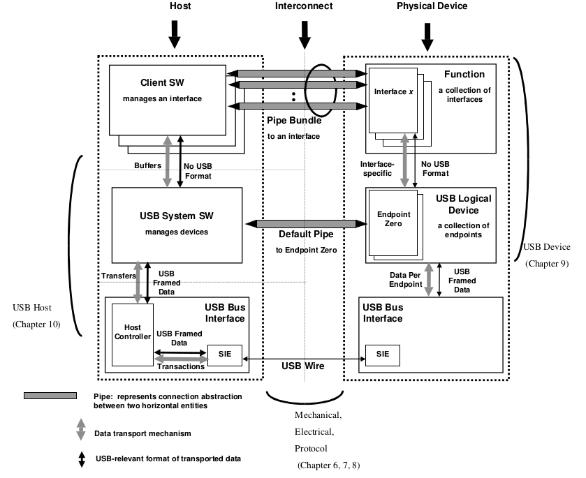
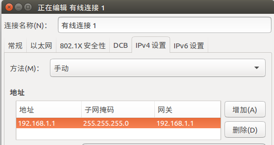
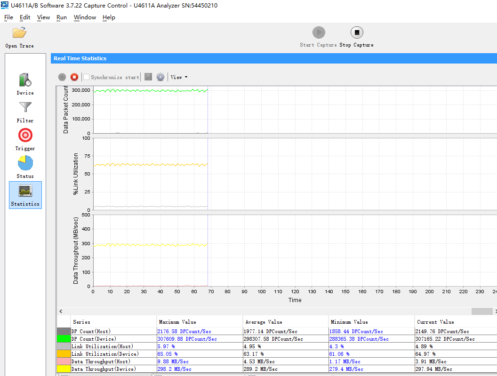

# Rockchip USB Performance Analysis Guide

文件标识：RK-KF-YF-100

发布版本：V1.1.1

日期：2020-02-19

文件密级：□绝密   □秘密   □内部资料   ■公开

---

**免责声明**

本文档按“现状”提供，福州瑞芯微电子股份有限公司（“本公司”，下同）不对本文档的任何陈述、信息和内容的准确性、可靠性、完整性、适销性、特定目的性和非侵权性提供任何明示或暗示的声明或保证。本文档仅作为使用指导的参考。

由于产品版本升级或其他原因，本文档将可能在未经任何通知的情况下，不定期进行更新或修改。

**商标声明**

“Rockchip”、“瑞芯微”、“瑞芯”均为本公司的注册商标，归本公司所有。

本文档可能提及的其他所有注册商标或商标，由其各自拥有者所有。

**版权所有** **© 2019** **福州瑞芯微电子股份有限公司**

超越合理使用范畴，非经本公司书面许可，任何单位和个人不得擅自摘抄、复制本文档内容的部分或全部，并不得以任何形式传播。

福州瑞芯微电子股份有限公司

Fuzhou Rockchip Electronics Co., Ltd.

地址：     福建省福州市铜盘路软件园A区18号

网址：     [www.rock-chips.com](http://www.rock-chips.com)

客户服务电话： +86-4007-700-590

客户服务传真： +86-591-83951833

客户服务邮箱： [fae@rock-chips.com](mailto:fae@rock-chips.com)

---

**前言**

**概述**

本文档提供 Rockchip 平台 USB 2.0/3.0 模块传输性能分析的方法以及支持的最大传输速率。

本文档将分别对 USB Host 和 USB Device(Peripheral)两部分进行介绍。其中，USB Host 将会介绍 USB Disk、USB Ethernet 以及 USB Camera 的传输性能分析。USB Device(Peripheral)将会介绍 USB MTP、USB MSC(Mass Storage Class)、USB Gadget Webcam、USB Rndis、USB Gadget HID 的传输性能分析。

**产品版本**
| **芯片名称**                              | **内核版本**           |
| ------------------------------------- | ------------------ |
| 30 系列、31 系列、32 系列、33 系列、PX 系列、Sofia、RV1108 | Linux3.10 和 Linux4.4 |

**读者对象**
本文档（本指南）主要适用于以下工程师：
硬件工程师
软件工程师
技术支持工程师

**修订记录**
| **日期**   | **版本** | **作者** | **修改说明**                       |
| ---------- | -------- | -------- | ---------------------------------- |
| 2017-12-25 | V1.0     | 吴良峰   | 初始版本                           |
| 2019-01-09 | V1.1     | 吴良峰   | 使用 markdownlint 修订格式         |
| 2020-02-19 | V1.1.1   | 吴良峰   | 增加免责声明，商标声明以及版权声明 |

---
[TOC]
---

## USB 理论传输速率分析

### USB Communication Flow

USB 的通信流模型如图 1-1 所示，采用分层的结构，一台主机与一个 USB 设备间的连接是由许多层上的连接组成 。USB 总线接口层提供了主机和设备之间的物理连接、发送和接收数据。USB 设备层对 USB 系统软件是可见的，系统软件基于它所见的设备层来完成对设备的一般的 USB 操作。USB 应用层可以通过与之相配合的客户软件向主机提供一些额外的功能。USB 设备层和应用层的通信是逻辑上的，对应于这些逻辑通信的实际物理通信由 USB 总线接口层来完成。



图 1-1 USB Communication Flow

### USB 物理层传输速率

USB 物理层的传输速率是指 USB 物理总线的传输速率。USB 总线目前支持 USB1.0、USB1.1、USB2.0、USB3.0（USB3.1 Gen1）、USB 3.1 Gen2 五种标准传输速率，如下表 1-1 所示。

表 1-1 USB 物理层最大传输速率

| USB 版本                 | 最大传输速率  | 速率称号               |
| --------------------- | ------- | ------------------ |
| USB 1.0               | 1.5Mbps | 低速（Low-Speed）      |
| USB 1.1               | 12Mbps  | 全速（Full-Speed）     |
| USB 2.0               | 480Mbps | 高速（High-Speed）     |
| USB 3.0（USB 3.1 Gen1） | 5Gbps   | 超速（Super-Speed）    |
| USB 3.1 Gen2          | 10Gbps  | 暂未定义（Super-Speed+） |

### USB 协议层传输速率

不同的 USB 设备类型，采用不同的 USB 设备类协议，比如：USB Disk 采用的是 USB Mass Storage Class 规范的子类规范（USB Mass Storage Class Bulk-Only Transport），USB Camera 采用的是 USB Video Class 规范，USB HID 采用的是 USB Human Interface Devices Class 规范，更多的规范，请在[USB-IF 官网](http://www.usb.org/developers/docs/devclass_docs/)查看。

不同的 USB 设备类协议，定义了不同的数据包格式，有些设备类协议还需要命令包和握手包，并且，不同的 USB 设备类协议采用了不同的 USB 传输类型，比如：USB Disk 采用批量传输类型（Bulk Transfers），USB Camera 采用同步传输类型（Isochronous Transfers），USB HID 采用中断传输类型（Interrupt Transfers）。

USB 体系支持四种传输类型：

- 控制传输（Control Transfers）

  主要用于在设备连接时对设备进行枚举以及其他因设备而异的特定操作；

- 中断传输（Interrupt Transfers）

  用于对延迟要求严格、小量数据的可靠传输，如键盘、游戏手柄等 HID 设备；

- 批量传输（Bulk Transfers）

  用于对延迟要求宽松，大量数据的可靠传输，如 U 盘、USB 以太网卡等；

- 同步传输（Isochronous Transfers）

  用于对可靠性要求不高的实时数据传输，如 USB Camera、USB Audio；

不同的 USB 传输类型，在 USB 物理总线上并没有太大的区别，只是在传输机制、主机安排传输任务、可占用 USB 带宽的限制以及最大包长度有一定的差异，如下表 1-2 所示。

表 1-2 USB 的四种传输类型

| 传输类型 | USB 2.0                                  | USB 3.0                                  |
| ---- | ---------------------------------------- | ---------------------------------------- |
| 控制传输 | Max Packet： 64Bytes<br />Burst：不支持 <br />仅支持 OUT 的流控制（PING） | Max Packet： 512Bytes<br />Burst：1<br />支持流控制（ERDY） |
| 中断传输 | Max Packet： 0 ～ 1024 ×3 Bytes<br />Max Transfer Speed：23.44MBps<br />Burst：不支持 <br />不支持流控制 | Max Packet： 0 ～ 1024 ×3 Bytes<br />Max Transfer Speed：23.44MBps<br />Burst：1 ~ 3 <br />支持流控制（ERDY） |
| 批量传输 | Max Packet： 512Bytes<br />Max Transfer Speed：53.25MBps<br />Burst：不支持 <br />仅支持 OUT 的流控制（PING） | Max Packet： 1024Bytes<br />Max Transfer Speed：400MBps？<br />Burst：1 ～ 16 <br />支持流控制（ERDY）） |
| 同步传输 | Max Packet： 0 ～ 1024 ×3 Bytes<br />Max Transfer Speed：23.44MBps<br />Burst：不支持 <br />不支持流控制 | Max Packet： 0 ～ 1024 ×16 × 3Bytes<br />Max Transfer Speed：375.04MBps<br />Burst：1 ~ 16<br />支持流控制（PING -> PING_RESPONSE） |

由表格 1-2 可以看出，不同的 USB 传输类型，最大的理论传输速率也是不同的。并且，由于受到 USB 传输类型的最大速率限制以及 USB 设备类协议的交互影响，USB 的实际传输速率远小于 USB 物理总线上的传输速率。

### 影响 USB 传输速率的主要因素

USB 的传输速率主要受如下几方面的影响：

1. **USB 信号质量**

   USB 信号质量可以通过测试 USB 眼图来评估，如果 USB 信号质量差，容易导致 USB 物理总线丢包、重传，影响 USB 传输的速率。

2. **USB 控制器的 AHB CLK 和 DMA Burst Length**

   更高的 AHB CLK 和更大的 DMA Burst Length，可以提高 USB 控制器的 DMA 传输效率。

3. **CPU 运行频率的影响**

   CPU 运行频率会影响代码的执行效率和数据拷贝 memcpy 的效率，所以提高 CPU 频率，可以提高 USB 驱动和应用层的执行效率，从而提高 USB 传输速率。

4. **USB 设备类驱动提交的 URB (USB Request Block)的 buffer 大小**

   提交的 URB buffer 大小，也即请求 USB 控制器一次传输的数据块大小。对于 USB MSC（Mass Storage Class）类设备，如 USB Disk，USB MTP，如果不考虑数据块大小对存储颗粒（EMMC 或 NAND）的读写性能的影响，可以尽量增加 buffer 的大小，以降低 USB 控制器传输的中断数量。Rockchip 的 USB DWC2 控制器支持一次最大传输 512KB，USB DWC3 控制器支持一次最大传输 16MB - 1 Bytes。

5. **存储介质读写性能的影响**

   如果是 USB MSC（Mass Storage Class）类设备，如 USB Disk 的读写速率，受 USB Host 端存储介质以及 U 盘本身存储介质的读写性能影响.

6. **文件系统格式的影响**

   U 盘拷贝速率容易受文件系统的影响，常见的文件系统格式包括：VFAT、EXT4 和 NTFS。对于 VFAT/EXT4 两种文件系统格式的传输机制，kernel 的 block 层会自动将小的数据块 merge 为 120K，再写入磁盘。而 NTFS 的写入磁盘操作是在用户空间，数据块不会由 block 层 merge。所以，如果应用层每次请求的数据块太小（如 4KB），NTFS 文件系统格式的 U 盘，拷贝速率一般会明显慢于 VFAT/EXT4 的文件系统格式。详细的分析，请参考[2.1 USB Disk 传输速率分析](#2.1 USB Disk 传输速率分析)

---
## USB Host 传输性能分析

### USB Disk 传输速率分析

**测试方法：**

假设 USB Disk 插入 USB Host 接口后，枚举的信息如下：

磁盘分区为：

`/dev/block/sda1`

挂载路径为：

`/mnt/media_rw/0E64-5F76/`

USB Host EMMC 文件存储路径：`/sdcard/.`

下面的方法，是基于上述的假设进行说明。

**Note:**

- **test 文件，应该足够大**。比如，在 3399 EVB 4G DDR 上测试，建议 test 文件为 2G，这样才能保证数据从缓存中刷入到磁盘，实测如果使用 1024MB 文件，速率是不准确的。原因是`proc/sys/vm/dirty_background_ratio`一般为 5%，也即 4G 内存，文件系统缓存脏页数量要达到 4G×5% = 204.8MB，系统才会将缓存的脏页异步地刷入存储介质。
- dd 命令，可以加**conv=fsync**，表示将缓存中的数据写入磁盘。

USB Disk 的传输速率测试，通常有以下两种方法：

- **方法 1：手动或者使用 cp 命令拷贝大文件（如电影），然后计时，统计速率；**

  step1. 使用 dd 命令创建一个 test 文件，用于 step2 的拷贝测试使用

  `busybox dd if=/dev/zero of=/mnt/media_rw/0E64-5F76/test bs=64K count=16K`

  step2. 使用 cp 命令统计拷贝时间

  `echo 3 > /proc/sys/vm/drop_caches`
  `time cp /mnt/media_rw/0E64-5F76/test /sdcard/.`

  上述方法，是测试 USB Disk 的读速率，如果需要测试 USB Disk 的写速率，只要修改读写路径即可。

- **方法 2：使用 dd 命令测试**

  **测试 USB Disk 的读速率方法：**

  step1. 使用 dd 命令创建一个 test 文件，用于后续的拷贝测试使用

  `busybox dd if=/dev/zero of=/mnt/media_rw/0E64-5F76/test bs=64K count=16K`

  step2.

  每次执行 dd 命令前，先清缓存

  `echo 3 > /proc/sys/vm/drop_caches`

  测试 4K 数据块的读速率

   `busybox dd if=/mnt/media_rw/0E64-5F76/test of=/dev/null bs=4K count=256K`

  step3.

  每次执行 dd 命令前，先清缓存

  `echo 3 > /proc/sys/vm/drop_caches`

  测试 64K 数据块的读速率

   `busybox dd if=/mnt/media_rw/0E64-5F76/test of=/dev/null bs=64K count=16K`

  step4.

  每次执行 dd 命令前，先清缓存

  `echo 3 > /proc/sys/vm/drop_caches`

  测试 128K 数据块的读速率

  `busybox dd if=/mnt/media_rw/0E64-5F76/test of=/dev/null bs=128K count=8K`

  step5.

  每次执行 dd 命令前，先清缓存

  `echo 3 > /proc/sys/vm/drop_caches`

  测试 512K 数据块的读速率

  `busybox dd if=/mnt/media_rw/0E64-5F76/test of=/dev/null bs=512K count=2K`

  **测试 USB Disk 的写速率方法：**

  step1.

  每次执行 dd 命令前，先清缓存

  `echo 3 > /proc/sys/vm/drop_caches`

  测试 4K 数据块的写速率

  `busybox dd if=/dev/zero of=/mnt/media_rw/0E64-5F76/test bs=4K count=256K`

  step2.

  `rm of=/mnt/media_rw/0E64-5F76/test`

  `sync`

  `echo 3 > /proc/sys/vm/drop_caches`

  测试 64K 数据块的写速率

  `busybox dd if=/dev/zero of=/mnt/media_rw/0E64-5F76/test bs=64K count=16K`

  step3.

  `rm of=/mnt/media_rw/0E64-5F76/test`

  `sync`

  `echo 3 > /proc/sys/vm/drop_caches`

  测试 128K 数据块的写速率

  `busybox dd if=/dev/zero of=/mnt/media_rw/0E64-5F76/test bs=128K count=8K`

  step4.

  `rm of=/mnt/media_rw/0E64-5F76/test`

  `sync`

  `echo 3 > /proc/sys/vm/drop_caches`

  测试 512K 数据块的写速率

  `busybox dd if=/dev/zero of=/mnt/media_rw/0E64-5F76/test bs=512K count=2K`

**Note：**

- 方法 1 可以统计 USB Disk 的实际数据读写速率，但测试结果同时受 Host 端存储介质、文件系统性能和 USB 控制器传输速率的影响，无法准确说明 USB 控制器的传输性能。

- 方法 2 可以排除 Host 端存储介质和文件系统的影响，准确统计 USB 控制器的读写 U 盘的传输性能。但需要注意的是，USB Disk（Device 端）的文件系统仍然会影响拷贝，如果要排除 USB Disk 文件系统的影响，需要直接读写/dev/路径下的 sd*分区节点，但同时会破坏 USB Disk 原有的数据，所以要慎用。
- dd 命令，可以加**conv=fsync**，表示将缓存中的数据写入磁盘，这样可以完全排除缓存的影响。当然，如果测试的文件足够大，缓存的影响也是比较小的。

- 测试时，建议两种方法都使用。先使用方法 1 测试，如果测试结果无法达到预期的传输速率，则进一步使用方法 2 分析是否传输瓶颈在 USB 控制器。详细的分析方法，将在”测试结果分析“章节中说明。

**测试结果：**

- **USB 2.0 Host**

  使用 dd 命令测试，Rockchip USB 2.0 Host 接口的 USB Disk 读写速率通常在 **25MBps ～ 35MBps**。

- **USB 3.0 Host**

  使用 dd 命令测试，Rockchip USB 3.0 Host 接口的 USB3 Disk（不支持 UAS）读写速率通常在 **60MBps ～ 100MBps**。 支持**UAS**的 USB3 Disk，最大读写速率约为**350MBps**。

**Note：**

- 不同的 USB3 Disk，读写性可能有明显差异，并且，有些 USB3 Disk 的读速率比写速率高 3～5 倍。所以，评估 USB 控制器的传输速率，应该尽量多测试几种不同型号的 USB3 Disk，并使用同样的测试方法，在 PC Ubuntu 测试同样 USB3 Disk 的读写速率，以作对比参考。

- UAS 的支持：RK3399/RK3328 USB3 控制器支持 UASP（USB Attached SCSI PROTOCOL），该功能可以大大提高 USB Disk 的读写速率。如果要使用 UAS 功能，首先，内核需要 enable CONFIG_USB_UAS（kernel3.10 和 kernel4.4 默认都已经 enable），其次，USB3 Disk 需要支持 UAS 功能。
- 可以从枚举的 log 中，确认是否使用 UAS 协议

```
[80373.513866] usb 4-1: new SuperSpeed USB device number 2 using xhci_hcd
[80373.534854] usb 4-1: New USB device found, idVendor=174c, idProduct=55aa
[80373.534871] usb 4-1: New USB device strings: Mfr=2, Product=3, SerialNumber=1
[80373.534873] usb 4-1: Product: CHIPFANCIER
[80373.534874] usb 4-1: Manufacturer: WINTOGO
[80373.534876] usb 4-1: SerialNumber: 000001485761816
[80373.537036] scsi host6: uas （说明将以UAS协议进行通信）
[80373.537648] scsi 6:0:0:0: Direct-Access    WINTOGO  CHIPFANCIER      0    PQ: 0 ANSI: 6
```

**测试结果分析与性能优化方向：**

**实例：**

本文档以 RK3399 EVB 读写 USB3 Disk 的典型应用场景作分析，其他应用场景可以参考下面的方法。

测试环境：RK3399 EVB （2G DDR + 16G EMMC）

USB3 Disk 型号为 SanDisk Type-C USB3.0 32G （NTFS 文件系统）

测试场景：测试从 USB3 Disk 拷贝大文件到 3399 EMMC 的速率

测试命令： cp，dd

假设 USB3 Disk 挂载路径：/mnt/media_rw/0E64-5F76/

EMMC 文件存储路径：/sdcard/.

**Note：**

如果测试机器的 DDR 为 4G，建议 test 文件为**2GB**，以避免缓存的影响。此外，dd 命令，可以加**conv=fsync**，表示将缓存中的数据写入磁盘，这样可以完全排除缓存的影响。当然，如果测试的文件足够大，缓存的影响也是比较小的。

**step1. 使用 dd 命令创建一个 test 文件（1GB 大小），用于后续的拷贝测试使用**

`busybox dd if=/dev/zero of=/mnt/media_rw/0E64-5F76/test bs=64K count=16K`

**step2. 使用 cp 命令测试测试从 USB3 Disk 拷贝大文件到 3399 EMMC 的速率**

`time cp /mnt/media_rw/0E64-5F76/test /sdcard/.`   (test 为 1GB 文件)

测试结果：
0m48.42s real     0m00.29s user     0m18.17s system

拷贝速率为：1024M/48 = 21MBps  该速率明显慢于 USB3 的正常拷贝速率

**step3. 直接从/dev/block/U 盘分区 拷贝到 EMMC，以排查 3399 文件系统的影响**

`time cp /dev/block/sda1 /sdcard/test` （该命令可以绕过文件系统直接拷贝）

拷贝速率约为： 20MBps

说明拷贝速率慢与 3399 文件系统本身没有关系。

**step4. 分别使用 dd 命令测试 U 盘和 3399 EMMC 的读写性能**

- **测试 USB3 Disk 读性能**

  每次执行 dd 命令前，先清缓存

  `echo 3 > /proc/sys/vm/drop_caches`

  测试 4K 数据块的读速率

   `busybox dd if=/mnt/media_rw/0E64-5F76/test of=/dev/null bs=4K count=256K`

  结果：1073741824 bytes (1.0GB) copied, 14.183164 seconds, 72.2MB/s

  每次执行 dd 命令前，先清缓存

  `echo 3 > /proc/sys/vm/drop_caches`

  测试 64K 数据块的读速率

   `busybox dd if=/mnt/media_rw/0E64-5F76/test of=/dev/null bs=64K count=16K`

  结果：1073741824 bytes (1.0GB) copied, 12.546069 seconds, 81.6MB/s

  每次执行 dd 命令前，先清缓存

  `echo 3 > /proc/sys/vm/drop_caches`

  测试 128K 数据块的读速率

  `busybox dd if=/mnt/media_rw/0E64-5F76/test of=/dev/null bs=128K count=8K`

  结果：1073741824 bytes (1.0GB) copied, 12.601817 seconds, 81.3MB/s

  每次执行 dd 命令前，先清缓存

  `echo 3 > /proc/sys/vm/drop_caches`

  测试 512K 数据块的读速率

  `busybox dd if=/mnt/media_rw/0E64-5F76/test of=/dev/null bs=512K count=2K`

  结果：1073741824 bytes (1.0GB) copied, 12.402147 seconds, 82.6MB/s

- **测试 3399 EMMC 写性能**

  每次执行 dd 命令前，先清缓存

  `echo 3 > /proc/sys/vm/drop_caches`

  测试 4K 数据块的写速率

  `busybox dd if=/dev/zero of=/sdcard/test bs=4K count=256K`

  结果：1073741824 bytes (1.0GB) copied, 39.525297 seconds, 25.9MB/s

  `rm of=/sdcard/test`

  `sync`

  `echo 3 > /proc/sys/vm/drop_caches`

  测试 64K 数据块的写速率

  `busybox dd if=/dev/zero of=/sdcard/test bs=64K count=16K`

  结果： 1073741824 bytes (1.0GB) copied, 37.505206 seconds, 27.3MB/s

  `rm of=/sdcard/test`

  `sync`

  `echo 3 > /proc/sys/vm/drop_caches`

  测试 128K 数据块的写速率

  `busybox dd if=/dev/zero of=/sdcard/test bs=128K count=8K`

  结果： 1073741824 bytes (1.0GB) copied, 37.461603 seconds, 27.3MB/s

  `rm of=/sdcard/test`

  `sync`

  `echo 3 > /proc/sys/vm/drop_caches`

  测试 512K 数据块的写速率

  `busybox dd if=/dev/zero of=/sdcard/test bs=512K count=2K`

  结果：1073741824 bytes (1.0GB) copied, 37.086531 seconds, 27.6MB/s

从上述的测试结果看，USB3 Disk 的读性能很好，小块和大块读性能都基本一致。而 EMMC 的写性能明显都很差。从 USB3 Disk 拷贝大文件到 3399 EMMC 的传输速率瓶颈在 3399 的 EMMC 颗粒。

上面分析的 EMMC 颗粒，是 4K，64K，128K，512K 数据块的写都比较慢，然而，在 Rockchip 平台上，大部分的 EMMC 颗粒可能只有 4K 的写速率比较慢（包括 USB3 Disk 也如此），所以，如果测试的 EMMC 写速率只有 4K 比较慢，那需要进一步分析是否与 4K 有关系。

**step5. 分析 cp 命令的行为和 block 层的行为**

分析工具： **strace**，**blktrace**

- **使用 strace 命令跟踪 cp 行为**

  `strace cp /mnt/media_rw/0E64-5F76/test /sdcard/.`

  结果表明：RK3399 平台的 cp 命令，读写的数据块都是 4KB

- **使用 blktrace 命令分析 block 层的 merge 行为**

  几个与拷贝相关的重要参数：

  `max_hw_sectors_kb`

  `max_sectors_kb`

  max_hw_sectors_kb 和 max_sectors_kb 控制的是 block 层执行 merge 操作后写入存储介质的数据块大小，U 盘一般是 120KB，EMMC 一般是 512KB。

  EMMC：

  ```
  /sys/block/mmcblk1/queue/max_hw_sectors_kb
  /sys/block/mmcblk1/queue/max_sectors_kb
  ```

   USB Disk：

  ```
  /sys/block/sda/queue/max_hw_sectors_kb
  /sys/block/sda/queue/max_sectors_kb
  ```

  其中，USB Disk 的 max_hw_sectors_kb 设置在代码：

  ```
  drivers/usb/storage/scsiglue.c
  /*limit the total size of a transfer to 120 KB */
  .max_sectors =  240, （单位为block512 bytes）
  ```

  该参数可以由上层配置，如 RK3399 Type-C1 口：

  `/sys/devices/platform/usb@fe900000/fe900000.dwc3/xhci-hcd.9.auto/usb4/4-1/4-1:1.0/host0/target0:0:0/0:0:0:0/max_sectors`

  查看 io 调度器：

  `rk3399:/data# cat /sys/block/mmcblk1/queue/scheduler`

  `noop [cfq]` （使用 cfq，表明理论上会执行 merge 行为，将小数据块进行 merge）

  blktrace 为 Android 自带的工具，但默认可能没有支持，需要先修改 blktrace 文件夹下的 mk 文件，并编译该工具，然后使用 adb push 到/system/bin。

  修改[Android.mk](http://Android.mk)文件：
  将文件第一行的`BUILD_BLKTRACE:= false`改为
  `BUILD_BLKTRACE:= true`

  要使用 blktrace，内核需要增加 CONFIG_BLK_DEV_IO_TRACE，如下：

  ```
  Kernel hacking  --->
      [*]Tracers  --->
          [*]  Support for tracing block IO actions
  ```

  blktrace 的使用方法参考：

  **抓 blktrace 的数据：**

  1. 创建文件夹用于保存数据

     `mkdir /dev/blktrace`

  2. 启动 blktrace，开始抓数据

     `blktrace -d /dev/block/mmcxxx -o /dev/blktrace/blktrace &`

     (其中，/dev/block/mmcxxx 为要分析的 block，如 3399 的 mmcblk1)

  3. 执行拷贝命令

     `busybox dd if=/dev/zero of=/data/test bs=4K count=256K` （执行拷贝）

  4. 停止 blktrace

     拷贝完成后，kill blktrace 的线程，blktrace 的数据就会自动保存在/dev/blktrace 路径下，也可以在 blktrace 后面加-w 参数，表示 trace 多少秒后，自动关闭 blktrace

  **分析 blktrace 的数据：**

  `blkparse –i /dev/blktrace/ blktrace.blktrace.0 –o  /dev/blktrace/blkparse.txt`

  根据 blktrace 的统计结果，cfq 会将 4k 的小块数据合并为 1024 个扇区，即 512K，才写到 EMMC，如下图 2-1 所示。


图 2-1 blktrace data

说明 3399 的 block 层的 merge 行为是没有问题的。

更详细的 blktrace 使用方法，请参考[blktrace 分析 IO](http://bean-li.github.io/blktrace-to-report/)

**step5. 分析 USB Disk 文件系统格式的影响**

USB Disk 常用的文件系统格式包括：VFAT、EXT4 和 NTFS。对于 VFAT/EXT4 两种文件系统格式的传输机制，kernel 的 block 层会自动将小的数据块 merge 为大数据块，再写入磁盘。而 NTFS 是基于 fuse，写入磁盘操作是在用户空间，并且会多了拷贝操作，所以，如果应用层每次请求的数据块太小（如 4KB），对于 NTFS 文件系统格式的 USB Disk，在 CPU 变频的情况下，拷贝速率可能会低于 VFAT/EXT4 文件系统格式。比如，在 RK3399 Android 平台，cp 命令每次请求的数据块就只有 4KB，所以，在 RK3399 Android 平台，NTFS 格式的 USB3 Disk 读写速率往往会比较差。

**优化方向：**

根据上面的分析，影响 USB Disk 拷贝的主要因素，有如下几个：

- USB Disk 的读写性能；
- USB Host 端的存储颗粒读写性能；
- USB Host 控制器传输性能；
- 文件系统格式；
- 应用层一次请求的数据块大小；
- CPU 运行频率；

可以参考本文档提供的方法，先定位传输瓶颈，再进行优化。

### USB Ethernet 传输速率分析

**测试方法：**

测试工具：iperf

**iperf 命令**是一个网络性能测试工具。iperf 可以测试 TCP 和 UDP 带宽质量。iperf 可以测量最大 TCP 带宽，具有多种参数和 UDP 特性。iperf 可以报告带宽，延迟抖动和数据包丢失。

- iperf 的官方网址：

  <https://iperf.fr/>

- iperf 下载地址：

  支持 Windows /Android/Ubuntu/macOS 等系统，下载地址

  <https://iperf.fr/iperf-download.php>

  此外，Ubuntu 系统可以直接使用如下命令安装 iperf

  `sudo apt install iperf`

  Andorid 系统可以安装 iperf.apk

- iperf 的使用方法：

  <https://iperf.fr/iperf-doc.php>

  <http://man.linuxde.net/iperf>

带宽测试通常采用**UDP 模式**，因为能测出极限带宽、时延抖动、丢包率。在进行测试时，首先以链路理论带宽作为数据发送速率进行测试，例如，从客户端到服务器之间的链路的理论带宽为 100Mbps，先用`-b 100M`进行测试，然后根据测试结果（包括实际带宽，时延抖动和丢包率），再以实际带宽作为数据发送速率进行测试，会发现时延抖动和丢包率比第一次好很多，重复测试几次，就能得出稳定的实际带宽。

**实例**

**UDP 模式**

PCUbuntu 作服务器端，RK3399 的 USB2/USB3 Host 接口连接 UGREEN USB3 Ethernet，然后通过以太网线连接到 PC 的以太网口，形成完整的测试链路。

PC Ubuntu 服务器端：

首先，配置 ipv4 地址、子网掩码和网关，如下图 2-2



图 2-2 PC Ubuntu ip 地址配置

然后，执行如下命令：

```
wlf@wlf-ubuntu:~$ iperf -u -s
------------------------------------------------------------
Server listening on UDP port 5001
Receiving 1470 byte datagrams
UDP buffer size:  208 KByte (default)
------------------------------------------------------------
```

3399 客户端：

首先，查看 USB 以太网卡的信息

```
eth1      Link encap:Ethernet  HWaddr 60:38:E0:E3:20:96
          inet6 addr: fe80::6238:e0ff:fee3:2096/64 Scope: Link
          UP BROADCAST MULTICAST  MTU:1500  Metric:1
          RX packets:0 errors:0 dropped:0 overruns:0 frame:0
          TX packets:2 errors:0 dropped:0 overruns:0 carrier:0
          collisions:0 txqueuelen:1000
          RX bytes:0 TX bytes:168
```

然后，配置 ip 地址

`ifconfig eth1 192.168.1.2 up`

再执行如下命令，开始测试带宽

```
iperf -u -c 192.168.1.1 -b 1000M -t 60
```

**Note：** -b 表示 UDP 模式使用的带宽，单位 bits/sec。如果是 USB2.0 网卡，建议设置为-b 100M，如果是 USB3.0 网卡，建议设置为-b 1000M。

**测试结果：**

使用 UGREEN USB3.0 Ethernet，实际的测试带宽如下：

```
------------------------------------------------------------
Client connecting to 192.168.1.2, UDP port 5001
Sending 1470 byte datagrams
UDP buffer size:  208 KByte (default)
------------------------------------------------------------
[  3] local 192.168.1.2 port 40116 connected with 192.168.1.1 port 5001
[ ID] Interval       Transfer     Bandwidth
[  3]  0.0-60.0 sec  5.61 GBytes   803 Mbits/sec
[  3] Sent 4096616 datagrams
```

使用同样的测试方法，测试 CISCO USB2.0 Ethernet 的带宽约为 95Mbits/sec

**测试结果分析：**

Rockchip 平台 USB Ethernet 的正常传输速率如下：

USB2.0 Host：上行和下行均为**95 ～ 100 Mbits/sec**

USB3.0 Host：上行和下行均为**750 ～ 800 Mbits/sec**

如果实际产品测试无法达到上述速率，请先使用 ifconfig 和 tcpdump 工具，排查是否误码率太高，如果误码率太高，请测试 USB 眼图，确认 USB 的信号质量是否符合要求。

### USB Camera 传输速率分析

**测试方法：**

使用系统自带的 Camera APK 进行图像预览，并通过串口执行 logcat，查看打印的实时帧率，如下：

`CameraHal: debugShowFPS(622): Camera 1312 Frames, 30.000 FPS`

uvc 驱动调试方法：

打印 uvc trace 信息

```
echo 0xffff > /sys/module/uvcvideo/parameters/trace
echo 8 > /proc/sysrq-trigger
```

关闭 uvc trace

`ehco 0 > /sys/module/uvcvideo/parameters/trace`

查看 uvc decode 统计信息

cat /d/usb/uvcvideo/*/stats

**测试结果：**

Rockchip 平台 USB Camera 支持的最大帧率如下：

表 2-1 Rockchip 平台 USB Camera 最大帧率

|         | YUYV 格式         | MJPEG 格式         | H264 格式           |
| ------- | -------------- | --------------- | ---------------- |
| USB 2.0 | 640×480 @30fps | 1280×720 @30fps | 1920×1080 @30fps |
| USB 3.0 | 640×480 @60fps | 1280×720 @60fps | 1920×1080 @60fps |

Note：上述帧率的测试前提条件是每个 USB 控制器只连接一个 USB Camera ，如果同时连接两个或多个 USB Camera，要以实测为准。

**测试结果分析与性能优化：**

大部分的 USB Camera 都是采用同步传输类型进行 USB 通信，USB2.0 的同步传输理论最大带宽是 23.44MBps，USB3.0 的同步传输理论最大带宽是 375.04MBps。USB Camera 的最大帧率一般受如下两个方面的影响：

a). USB Camera 实际能够输出的最大帧率；

b). USB Host 驱动的同步传输性能；

对于因素 a)，可以在 PC 上验证 USB Camera 的性能。对于因素 b)，可以考虑提高 USB QOS 的优先级、提高 USB 中断的响应速度、提高 USB 控制器的 AHB CLK 以及 DMA burst length。

---
## USB Device 传输性能分析

### USB MTP 传输速率分析

**测试方法：**

将待测设备连接到 PC，设置 USB 为 MTP 模式，然后手动拷贝大文件（如 1GB 以上的电影），用秒表计时，再计算平均传输速率。

测试时注意以下几点：

- 待测设备应保持在静态桌面，避免进休眠；

- 待测设备连接到 PC 后，需要等待媒体库扫描完成（可以观察 logcat 打印），再执行拷贝操作；

**测试结果：**

**实例**

测试平台：RK3399 BOX SDK Android N + Kernel 4.4

测试说明：

Read：RK3399 -> PC

Write:  PC -> RK3399

16K，64K，1M 表示 MTP 驱动的 Tx 和 Rx Buffer Length

测试时，RK3399 大核和小核都定为最高频率

表 3-1 RK3399 BOX SDK USB MTP 传输速率

|         | Read 16K  | Write 16K  | Read 64K  | Write 64K  | Read 1M   | Write 1M   |
| ------- | --------- | ---------- | --------- | ---------- | --------- | ---------- |
| USB 2.0 | 24.7 MBps | 22.8 MBps  | 22.8 MBps | 21.5 MBps  | 24.7 MBps | 25.6 MBps  |
| USB 3.0 | 65.6 MBps | 109.0 MBps | 71.3 MBps | 107.5 MBps | 87.3 MBps | 110.0 MBps |

测试平台：RK3126C 样机 Android O + Kernel4.4

表 3-2 RK3126C 样机 USB MTP 传输速率

|         | Read 16K   | Write 16K | Read 64K   | Write 64K |
| ------- | ---------- | --------- | ---------- | --------- |
| USB 2.0 | 14.85 MBps | 7.1 MBps  | 15.15 MBps | 7.8 MBps  |

**测试结果分析与性能优化方向：**

USB MTP 采用的是批量传输的类型，理论上，Rockchip 平台 USB2.0 控制器的批量传输速率约为 39MBps（每 125 微秒传 10 个 transaction，即 10 × 512 Bytes），USB3.0 控制器的批量传输速率达到 400MBps。但 MTP 的实际传输会受如下几个因素的影响，所以实际的速率会大大低于理论速率。

- CPU 的运行频率

  CPU 定为高频，MTP 的拷贝速率会明显高于 CPU 变频时的拷贝速率。

- 存储颗粒的读写性能

  如果存储颗粒的读写性能差，会严重影响 MTP 传输速率。评估存储颗粒的读写性能的方法，请参考[2.1 USB Disk 传输速率分析](#2.1 USB Disk 传输速率分析)

  Kernel4.4 提供了调试接口，打印 MTP 传输过程中，每次读写存储颗粒(vfs_read/vfs_write)的耗时，使用方法如下：

  查询命令：

  `cat /sys/kernel/debug/usb_mtp/status`

  reset 统计状态的命令：

  `echo 0 > /sys/kernel/debug/usb_mtp/status`

- USB 控制器的传输性能

  提高 USB2 控制器的 AHB CLK 至 150MHz，并且 DMA Burst 设置为最大，可以提高 USB 控制器的 DMA 传输性能，从而提高 USB 控制器的传输速率。

- MTP 驱动的 Tx/Rx buffer 大小

  USB2 控制器（DWC2）支持一次最大传输 512KB 的数据，USB3 控制器（DWC3）支持一次最大传输 16MB - 1B，所以，可以尽可能地提高 MTP 驱动的 Tx/Rx buffer 大小（当前 MTP 驱动默认设置为 64KB），以减少 USB 传输的中断数量。建议 USB2 控制器 Tx/Rx buffer 设置为 64KB，USB3 控制器 Tx/Rx buffer 设置为 1MB。

  Kernel4.4 的 MTP 驱动支持通过 module parameter 配置 Tx/Rx buffer，接口如下：

  `/sys/module/usb_f_mtp/parameters/mtp_tx_req_len` （Tx Buffer Length 单位：byte）

  `/sys/module/usb_f_mtp/parameters/mtp_tx_reqs`      （Tx Buffer 数量）

  `/sys/module/usb_f_mtp/parameters/mtp_rx_req_len` （Rx Buffer Length 单位：byte）

### USB MSC 传输速率分析

**测试方法：**

以 Linux-4.4 RK3399 EVB USB3.0 MSC 为分析实例

将 Mass storage 配置为 module

```
<*>   USB Gadget Support  --->
      <M>   USB Gadget Drivers
      <M>     Mass Storage Gadget
```

Kernel 增加如下补丁：

```
index f3c7f15..5418d06 100644
--- a/arch/arm64/boot/dts/rockchip/rk3399.dtsi
+++ b/arch/arm64/boot/dts/rockchip/rk3399.dtsi
@@ -404,7 +404,7 @@
                        compatible = "snps,dwc3";
                        reg = <0x0 0xfe800000 0x0 0x100000>;
                        interrupts = <GIC_SPI 105 IRQ_TYPE_LEVEL_HIGH 0>;
-                       dr_mode = "otg";
+                       dr_mode = "peripheral";
                        phys = <&u2phy0_otg>, <&tcphy0_usb3>;
                        phy-names = "usb2-phy", "usb3-phy";
                        phy_type = "utmi_wide";
```

编译内核

编译 Mass storage module

`make ARCH=arm64 modules SUBDIRS=drivers/usb/gadget`

生成如下 ko

`libcomposite.ko`

`usb_f_mass_storage.ko`

`g_mass_storage.ko`

在系统起来后，先使用 dd 命令在 data 目录下创建一个 lun0.img，然后加载 ko

```
insmod libcomposite.ko
insmod usb_f_mass_storage.ko
insmod g_mass_storage.ko  file=/data/lun0.img removable=1
```

连接 PC Ubuntu，格式化 lun0，然后在 PC 端就可以正常访问 Mass storage

使用如下脚本测试读速率

```
while true;
do time dd iflag=direct,nonblock if=/media/wlf/4625f014-95f3-419c-96c9-a38f91186eb2/test0 of=/dev/null bs=1024k count=400;
done
```

也可以使用 USB3.0 Agilent 分析仪测试传输速率，如下图 3-1 所示



图 3-1 USB3 Agilent 分析仪测试传输速率

**测试结果及分析：**

RK3399 变频：读速率 250MBps

RK3399 关闭小核，大核定频 1.8：读速率 300MBps

```
3399 关闭小核
echo 0 > /sys/devices/system/cpu/cpu0/online
echo 0 > /sys/devices/system/cpu/cpu1/online
echo 0 > /sys/devices/system/cpu/cpu2/online
echo 0 > /sys/devices/system/cpu/cpu3/online

3399 定频大核
echo userspace > /sys/devices/system/cpu/cpu4/cpufreq/scaling_governor
echo 1800000 >  /sys/devices/system/cpu/cpu4/cpufreq/scaling_setspeed
```

结论：USB MSC 的传输速率受 CPU 运行的频率影响比较明显，CPU 频率越高，读速率也越高。

### USB Gadget Webcam 传输速率分析

**测试方法：**

测试工具：

PC Windows： AMCAP 软件

PC Ubuntu： guvcview 软件 （安装方法：sudo apt install guvcview）

AMCAP 和 guvcview 两款软件都支持实时统计并显示帧率。

**测试结果及分析：**

如果要支持 USB Gadget Webcam，除了内核需要 enable UVC gadget 驱动，应用层也需要增加 UVC 的处理。目前，Rockchip 平台 Kernel-3.10 和 Kernel-4.4 均已经支持 usb gadget 驱动，应用层只有 RV1108 SDK 支持 UVC gadget，其他芯片平台，可以参考 RV1108 SDK 或者 GitHub 的[usb gadget uvc driver test application](https://github.com/lintwins/uvc-gadget)进行修改。

Kernel-3.10 UVC Gadget 驱动支持同步传输（Isochronous Transfer）和批量传输（Bulk Transfers）两种传输类型，默认使用同步传输方式，并且默认每个微帧（125 微秒）传输 1KB。

因此，Kernel-3.10 的 UVC Gadget 可以有 4 种不同的传输配置方式，不同的配置方式，USB 支持的最大带宽和帧率有所不同。

**UVC Gadget 传输配置方式 1：**

- 同步传输方式，每个微帧（125 微秒）传 1KB（默认配置方式）
- USB 支持最大带宽：**8000 KB，即 7.8MB**
- 支持的最大帧率如下表 3-3：

表 3-3 RV1108 USB Gadget Webcam 支持的最大帧率[配置 1]

|         | YUYV 格式         | MJPG 格式           | H264 格式           |
| ------- | -------------- | ---------------- | ---------------- |
| USB 2.0 | 648×480 @12fps | 1920×1080 @30fps | 1920×1080 @30fps |

**UVC Gadget 传输配置方式 2：**

- 同步传输方式，每个微帧（125 微秒）传 2KB。

  **Note：**需要更新如下补丁。同时，需要注意，提高传输带宽，可能会引起图像闪屏，如果出现该现象，可以考虑提高 USB QOS 优先级、提高 USB AHB CLK（aclk_peri 和 hclk_peri）到 150MHz 以上，以及其他可以提高 USB DMA 传输效率的方法。

```
diff --git a/drivers/usb/gadget/f_uvc.c b/drivers/usb/gadget/f_uvc.c
index 382536d..17eac12 100644
--- a/drivers/usb/gadget/f_uvc.c
+++ b/drivers/usb/gadget/f_uvc.c
@@ -37,7 +37,7 @@ static unsigned int streaming_interval = 1;
 module_param(streaming_interval, uint, S_IRUGO|S_IWUSR);
 MODULE_PARM_DESC(streaming_interval, "1 - 16");

-static unsigned int streaming_maxpacket = 1024;
+static unsigned int streaming_maxpacket = 2048;
```

- USB 支持最大带宽：**16000 KB，即 15.62MB**
- 支持的最大帧率如下表 3-4：

表 3-4 RV1108 USB Gadget Webcam 支持的最大帧率[配置 2]

|         | YUYV 格式         | MJPG 格式           | H264 格式           |
| ------- | -------------- | ---------------- | ---------------- |
| USB 2.0 | 648×480 @24fps | 1920×1080 @30fps | 1920×1080 @30fps |

**UVC Gadget 传输配置方式 3：**

- 同步传输方式，每个微帧（125 微秒）传 3KB

  **Note：**需要更新如下补丁。同时，需要注意，提高传输带宽，可能会引起图像闪屏，如果出现该现象，可以考虑提高 USB QOS 优先级、提高 USB AHB CLK（aclk_peri 和 hclk_peri）到 150MHz 以上，以及其他可以提高 USB DMA 传输效率的方法。

```
diff --git a/drivers/usb/gadget/f_uvc.c b/drivers/usb/gadget/f_uvc.c
index 382536d..17eac12 100644
--- a/drivers/usb/gadget/f_uvc.c
+++ b/drivers/usb/gadget/f_uvc.c
@@ -37,7 +37,7 @@ static unsigned int streaming_interval = 1;
 module_param(streaming_interval, uint, S_IRUGO|S_IWUSR);
 MODULE_PARM_DESC(streaming_interval, "1 - 16");

-static unsigned int streaming_maxpacket = 1024;
+static unsigned int streaming_maxpacket = 3072;
```

- USB 支持最大带宽：**24000 KB，即 23.43MB**
- 支持的最大帧率如下表 3-5：

表 3-5 RV1108 USB Gadget Webcam 支持的最大帧率[配置 3]

|         | UYV 格式          | MJPG 格式           | H264 格式           |
| ------- | -------------- | ---------------- | ---------------- |
| USB 2.0 | 648×480 @30fps | 1920×1080 @30fps | 1920×1080 @30fps |

**UVC Gadget 传输配置方式 4：**

- 批量传输方式

  **Note：**需要更新如下补丁。此外，批量传输方式，不支持分辨率的切换，如果要支持多种分辨率，不建议使用批量传输方式。

```
diff --git a/drivers/usb/gadget/f_uvc.c b/drivers/usb/gadget/f_uvc.c
index d146ce7..9eb7aad 100644
--- a/drivers/usb/gadget/f_uvc.c
+++ b/drivers/usb/gadget/f_uvc.c
@@ -45,7 +45,7 @@ static unsigned int streaming_maxburst;
 module_param(streaming_maxburst, uint, S_IRUGO|S_IWUSR);
 MODULE_PARM_DESC(streaming_maxburst, "0 - 15 (ss only)");

-static bool bulk_streaming_ep;
+static bool bulk_streaming_ep = true;
 module_param(bulk_streaming_ep, bool, S_IRUGO | S_IWUSR);
```

- USB 支持最大带宽：**35MB**
- 支持的最大帧率如下表 3-6：

表 3-6 RV1108 USB Gadget Webcam 支持的最大帧率[配置 4]

|         | UYV 格式           | MJPG 格式            | H264 格式            |
| ------- | --------------- | ----------------- | ----------------- |
| USB 2.0 | 648×480 > 30fps | 1920×1080 > 30fps | 1920×1080 > 30fps |

### USB Rndis 传输速率分析

USB Rndis 实际上就是 TCP/IPover USB，就是在 USB 设备上跑 TCP/IP，让 USB 设备看上去像一块网卡。

**测试方法：**

测试工具：**iperf**

iperf 工具的详细说明，请参考[2.2 USB Ethernet 传输速率分析](#2.2 USB Ethernet 传输速率分析)

**USB Rndis 的 kernel config 设置如下**：

- Linux-3.10 Android Gadget USB Rndis 配置方法：

```
Device Drivers  --->
   [*] USB support  --->
       <*>   USB Gadget Support  --->
           <*>   USB Gadget Drivers (Android Composite Gadget)  --->
                 Android Composite Gadget
```

对应设备节点：

/sys/class/android_usb/android0/f_rndis 目录下有一些节点可以用来配置网卡的方法和命令

- Linux-3.10 Ethernet Gadget USB Rndis 配置方法：

```
Device Drivers  --->
   [*] USB support  --->
       <*>   USB Gadget Support  --->
           <*>   USB Gadget Drivers (Ethernet Gadget (with CDC Ethernet support))  --->
                 Ethernet Gadget (with CDC Ethernet support)
```

- Linux-4.4 Configfs USB Rndis 配置方法：

```
Device Drivers  --->
   [*] USB support  --->
       <*>   USB Gadget Support  --->
           <*>   USB Gadget Drivers (USB functions configurable through configfs)  --->
                  [*]       RNDIS
```

**实例：**

以 Linux-3.10 Android Gadget USB Rndis 为实例进行分析

USB Rndis 的枚举 log 如下：

```
shell@android:/ # setprop sys.usb.config rndis
[ 2445.809337] rndis_function_bind_config MAC: 36:C8:78:69:C5:D3
[ 2445.809532] android_usb gadget: using random self ethernet address
[ 2445.809666] android_usb gadget: using random host ethernet address
[ 2445.812255] rndis0: MAC 0a:d4:f2:e3:c5:c7
[ 2445.812330] rndis0: HOST MAC ea:88:5c:93:9d:b5   如连接window，则对应windows以太网卡MAC
[ 2446.208233] DWC_OTG: ********soft connect!!!*****************************************
[ 2446.541253] android_usb gadget: high speed config #1: android
[ 2446.542681] android_work: sent uevent USB_STATE=CONFIGURED
```

设置 IP 并启动 rndis：

`ifconfig rndis0 192.168.1.2 up`

其中， IP 地址 192.168.1.2 要与 PC 的 IP 在同一个网段， 也即都在 192.168.XX.XX 网段。

更详细的配置和测试方法，请参考[2.2 USB Ethernet 传输速率分析](#2.2 USB Ethernet 传输速率分析)

**Note**：测试前，需要关闭 Windows 防火墙，否则可能导致 Rockchip 平台无法 pingWindows。

**测试结果：**

以下均为 High-speed 的测试结果，Super-Speed 暂时没有测试过。

Linux-3.10 Android Gadget USB Rndis：**上行 20Mbps，下行 40Mbps**

Linux-3.10 Ethernet Gadget USB Rndis：**上行和下行均为 100Mbps**

Linux-4.4 Configfs USB Rndis：**上行和下行均为 100Mbps**

**测试结果分析及优化方向：**

目前，已知的一个问题是 Linux-3.10 Android Gadget USB Rndis 上行和下行速率都偏低，需要进一步优化。

### USB Gadget HID 传输速率分析

**测试方法：**

测试工具：

PC Windows：HidTest.exe，PortHelper1.7.exe，或者下载[HID API](http://www.signal11.us/oss/hidapi/)

PC Ubuntu：Linux-3.10 Documentation/usb/gadget_hid.txt 中的 hid_gadget_test 测试脚本

或者下载[HID API](http://www.signal11.us/oss/hidapi/)

**测试结果：**

测试 rk3188 Gadget HID 传输速率，结果如下：

case1.  设置 report_length 为 512 bytes，间隔为 1ms，传输文件大小 10768KB，HID 为 high speed 设备

PC     -> 3188        速率：249 KBps
3188   -> PC          速率：125 KBps

case2.  设置 report_length 为 512 bytes，间隔为 125us，传输文件大小 10768KB，HID 为 high speed 设备

PC     -> 3188        速率：872 KBps
3188   -> PC          速率：2659 KBps

**测试结果分析：**

USB Gadget HID 的传输速率主要由 HID 描述符的**report_length**的长度和**中断传输间隔**决定。Linux USB Gadget HID 驱动源文件（drivers/usb/gadget/hid.c）中，没有提供 HID 描述符，需要开发者参考 Linux 文档 Documentation/usb/gadget_hid.txt 进行开发。如下给出 HID report_length 设置为 512bytes 的 HID 描述符参考代码。

```
index 79afa82..a05ad79 100644
--- a/drivers/usb/gadget/hid.c
+++ b/drivers/usb/gadget/hid.c
@@ -271,10 +272,93 @@ MODULE_DESCRIPTION(DRIVER_DESC);
 MODULE_AUTHOR("Fabien Chouteau, Peter Korsgaard");
 MODULE_LICENSE("GPL");

+static struct hidg_func_descriptor rk_hidg_desc = {
+	.subclass		= 0, /* No subclass */
+	.protocol		= 2, /* Keyboard */
+	.report_length		= 512,
+	.report_desc_length	= 38,
+	.report_desc		= {
+		0x06, 0x00, 0xFF,	 /*USAGE_PAGE (Vendor Defined Page 1)*/
+		0x09, 0x01,		/*USAGE (Vendor Usage 1)*/
+		0xA1, 0x01, 		/*COLLECTION (Application)*/
+		0x09, 0x02,		/*  USAGE (Vendor Usage 2)*/
+		0x09, 0x03,		/*USAGE (Vendor Usage 3)*/
+		0x15, 0x00, 		/*LOGICAL_MINIMUM (0)*/
+		0x26, 0xFF, 0x00, /*LOGICAL_MAXIMUM (255)*/
+		0x75, 0x10, 		/*REPORT_SIZE (16)*/
+		0x96, 0x00, 0x01, /* REPORT_COUNT (256)	*/
+		0x81, 0x02, 		/*INPUT (Data,Var,Abs)	*/
+		0x09, 0x04,		/*USAGE (Vendor Usage 4)*/
+		0x15, 0x00, 		/*LOGICAL_MINIMUM (0)	*/
+		0x26, 0xFF, 0x00, /*LOGICAL_MAXIMUM (255)	*/
+		0x75, 0x10, 		/*REPORT_SIZE (16)*/
+		0x96, 0x00, 0x01, 	/*REPORT_COUNT (256)*/
+		0x91, 0x02, 		/*OUTPUT (Data,Var,Abs)	*/
+		0xC0			/*END_COLLECTION*/
+	}
+};
```

如果要支持 report_length 为 1024bytes，可以改为

```
@@ -275,7 +275,7 @@ MODULE_LICENSE("GPL");
 static struct hidg_func_descriptor rk_hidg_desc = {
 	.subclass		= 0, /* No subclass */
 	.protocol		= 2, /* Keyboard */
-	.report_length		= 512,
+	.report_length		= 1024,
 	.report_desc_length	= 38,
 	.report_desc		= {
 		0x06, 0x00, 0xFF,	 /*USAGE_PAGE (Vendor Defined Page 1)*/
@@ -285,13 +285,13 @@ static struct hidg_func_descriptor rk_hidg_desc = {
 		0x09, 0x03,		/*USAGE (Vendor Usage 3)*/
 		0x15, 0x00, 		/*LOGICAL_MINIMUM (0)*/
 		0x26, 0xFF, 0x00, /*LOGICAL_MAXIMUM (255)*/
-		0x75, 0x10, 		/*REPORT_SIZE (16)*/
+		0x75, 0x20, 		/*REPORT_SIZE (32)*/
 		0x96, 0x00, 0x01, /* REPORT_COUNT (256)	*/
 		0x81, 0x02, 		/*INPUT (Data,Var,Abs)	*/
 		0x09, 0x04,		/*USAGE (Vendor Usage 4)*/
 		0x15, 0x00, 		/*LOGICAL_MINIMUM (0)	*/
 		0x26, 0xFF, 0x00, /*LOGICAL_MAXIMUM (255)	*/
-		0x75, 0x10, 		/*REPORT_SIZE (16)*/
+		0x75, 0x20, 		/*REPORT_SIZE (32)*/
 		0x96, 0x00, 0x01, 	/*REPORT_COUNT (256)*/
 		0x91, 0x02, 		/*OUTPUT (Data,Var,Abs)	*/
 		0xC0			/*END_COLLECTION*/
```

而 HID 的中断传输间隔，可以修改 drivers/usb/gadget/f_hid.c 文件里面的 hidg_hs_in_ep_desc 和 hidg_hs_out_ep_desc 结构体的成员 bInterval，原生是 4（1ms），最小可以改为 1（125us）。
