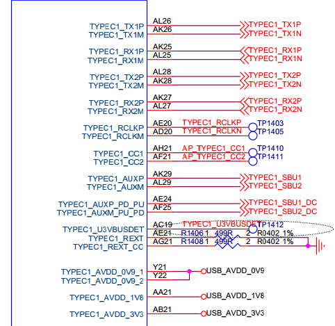
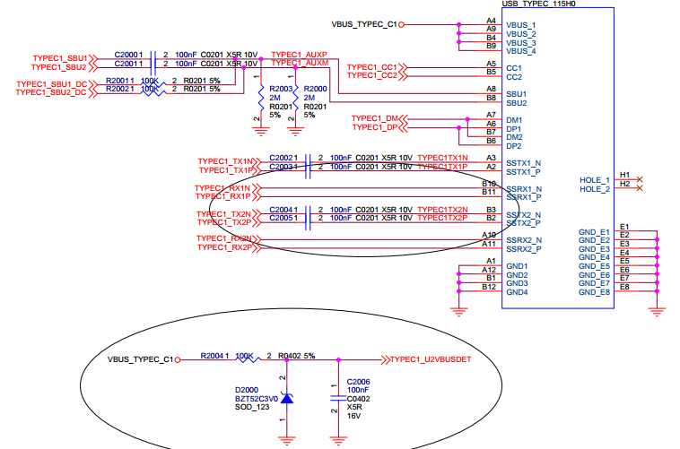
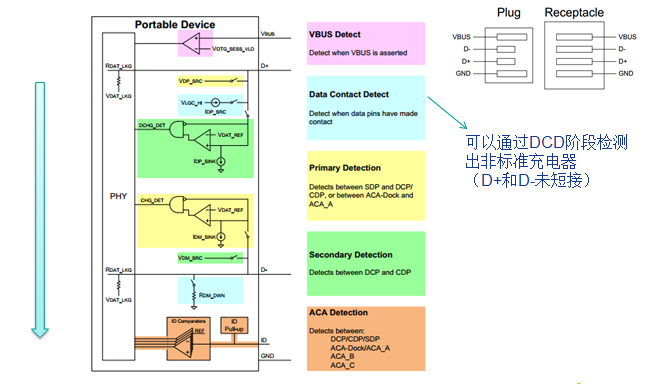

# Rockchip Linux USB 开发指南

文件标识：RK-KF-YF-096

发布版本：V1.3.1

日期：2020-02-20

文件密级：□绝密   □秘密   □内部资料   ■公开

---

**免责声明**

本文档按“现状”提供，福州瑞芯微电子股份有限公司（“本公司”，下同）不对本文档的任何陈述、信息和内容的准确性、可靠性、完整性、适销性、特定目的性和非侵权性提供任何明示或暗示的声明或保证。本文档仅作为使用指导的参考。

由于产品版本升级或其他原因，本文档将可能在未经任何通知的情况下，不定期进行更新或修改。

**商标声明**

“Rockchip”、“瑞芯微”、“瑞芯”均为本公司的注册商标，归本公司所有。

本文档可能提及的其他所有注册商标或商标，由其各自拥有者所有。

**版权所有© 2019福州瑞芯微电子股份有限公司**

超越合理使用范畴，非经本公司书面许可，任何单位和个人不得擅自摘抄、复制本文档内容的部分或全部，并不得以任何形式传播。

福州瑞芯微电子股份有限公司

Fuzhou Rockchip Electronics Co., Ltd.

地址：     福建省福州市铜盘路软件园A区18号

网址：     [www.rock-chips.com](http://www.rock-chips.com)

客户服务电话： +86-4007-700-590

客户服务传真： +86-591-83951833

客户服务邮箱： [fae@rock-chips.com](mailto:fae@rock-chips.com)

---

**前言**

**概述**

本文档主要说明 Rockchip 系列芯片 USB 3.0/2.0 控制器和物理层的特性、USB 硬件电路、Linux-4.4 及更新的内核版本中 USB 驱动模块的开发和调试方法。文档的最后，针对开发者关心的一些常见问题，提供了分析方法。希望读者通过阅读本文档，可以快速开发和调试 Rockchip 平台 USB 模块。

**产品版本**

| **芯片名称**                                                 |     **内核版本**      |
| :----------------------------------------------------------- | :-------------------: |
| RK3399Pro、RK3399、RK3368、RK3366、RK3328、RK3288、RK3228、RK312X、RK3188、RK30XX、RK3308、RK3326、RK1808、RK1108、PX30 | Linux-4.4、Linux-4.19 |

**读者对象**

本文档（本指南）主要适用于以下工程师：

技术支持工程师

软件开发工程师

硬件工程师

**修订记录**

| **日期**   | **版本** | **作者**       | **修改说明**                                                 |
| ---------- | -------- | -------------- | ------------------------------------------------------------ |
| 2017-12-22 | v1.0     | 吴良峰、王明成 | 初始版本                                                     |
| 2018-06-08 | v1.1     | 吴良峰         | support RK3308、RK3326、PX30<br />修正格式和错误             |
| 2019-01-09 | V1.2     | 吴良峰         | 使用 markdownlint 修订格式                                   |
| 2019-03-20 | V1.2.1   | 吴良峰         | 修正 USB OTG 控制器硬件电路说明<br />删除段首 Tab 空格符号   |
| 2019-11-12 | V1.2.2   | 吴良峰         | 修改文档名称，支持Linux-4.19                                 |
| 2020-02-19 | V1.3     | 吴良峰         | 修正大部分章节的内容，提高可读性<br />增加新的章节《USB 常用调试方法和调试命令》<br />增加常见问题分析 |
| 2020-02-20 | V1.3.1   | 吴良峰         | 增加新的章节《Linux USB 驱动架构》<br />修正第五章的章节编号 |

**目录**

---
[TOC]
---

## 1 概述

### 1.1 RK USB 控制器方案

Rockchip SOC 通常内置多个 USB 控制器，不同控制器互相独立，请在芯片 TRM 中获取详细信息。由于部分 USB 控制器有使用限制，所以请务必明确方案的需求及控制器限制后，再确定 USB 的使用方案。各芯片内置的 USB 控制器如表 1-1 所示：

表 1‑1 RK 平台 USB 控制器列表

| **控制器芯片** | **USB 2.0 HOST (EHCI/OHCI)** | **USB HSIC (EHCI)** | **USB 3.0/2.0 OTG (DWC3/xHCI)** | **USB 2.0 OTG (DWC2)** |
| :------------: | :--------------------------: | :-----------------: | :-----------------------------: | :--------------------: |
|   RK3399Pro    |              2               |          1          |                2                |           0            |
|     RK3399     |              2               |          1          |                2                |           0            |
|     RK3368     |              1               |          1          |                0                |           1            |
|     RK3366     |              1               |          0          |                1                |           1            |
|     RK3328     |              1               |          0          |                1                |           1            |
|     RK3288     |              1               |          1          |                0                |    2（OTG + Host）     |
|     RK3228     |              3               |          0          |                0                |           1            |
|     RK312X     |              1               |          0          |                0                |           1            |
|     RK3188     |              1               |          1          |                0                |           1            |
|     RK30XX     |              1               |          0          |                0                |           1            |
|     RK3308     |              1               |          0          |                0                |           1            |
|     RK3326     |              0               |          0          |                0                |           1            |
|     RK1808     |              1               |          0          |                1                |           0            |
|     RK1108     |              1               |          0          |                0                |           1            |
|      PX30      |              1               |          0          |                0                |           1            |

**Note：**

1. 表格中，数字 N 表示支持 N 个独立的 USB 控制器；
2. 表格中，“EHCI/OHCI” 表示该 USB 控制器集成了 EHCI 控制器和 OHCI 控制器；“DWC3/xHCI” 表示该 USB 控制器集成了 DWC3 控制器和 xHCI 控制器；
3. RK3288 支持两个独立的 DWC2 控制器，其中一个 DWC2 支持 OTG 功能，另外一个 DWC2 只支持 Host 功能；

### 1.2 USB 2.0 Host

- 兼容规范

1. Universal Serial Bus Specification, Revision 2.0
2. Enhanced Host Controller Interface Specification (EHCI), Revision 1.0
3. Open Host Controller Interface Specification (OHCI), Revision 1.0a

- 特性

1. 支持高速 (480Mbps)，全速 (12Mbps) 和低速 (1.5Mbps)，USB 2.0 Host 控制器的框图如下图 1-1 所示。


图 1‑1 USB 2.0 Host 控制器框图

### 1.3 USB 2.0 OTG

- 兼容规范

1. Universal Serial Bus Specification, Revision 2.0

- 特性

1. 支持 Host 模式和 Device 模式；
2. 支持 OTG ID检测，并通过 ID 电平自动切换 Host 模式和 Device 模式；
3. 不支持 ADP/SRP/HNP 协议；
4. Host 模式支持高速、全速和低速， Device 模式只支持高速和全速模式；
5. Host 模式支持 9 个 通道；
6. Device 模式支持 9 个端点（不包括端点0），其中，4 个 IN 端点，3 个 OUT 端点，2 个 IN/OUT 双向端点；
7. 支持 1024x35 bits 内部 FIFO；
8. 支持内部 DMA，并且支持 scatter/gather 功能；
9. 支持动态配置每个端点的 FIFO 大小；
10. Device 模式支持BCD (Battery Charging Detect)；
11. 支持 UART Bypass 模式；


图 1‑2 USB 2.0 OTG 框图

### 1.4 USB 3.0 OTG

- 兼容规范

1. Universal Serial Bus 3.0 Specification, Revision 1.0
2. Universal Serial Bus Specification, Revision 2.0
3. eXtensible Host Controller Interface for Universal Serial Bus(xHCI), Revision 1.1

- DWC3 特性

1. 支持 Control/Bulk(including stream)/Interrupt/Isochronous 传输方式；
2. USB 3.0 支持同时执行 IN 和 OUT 传输，带宽达到 8Gbps；
3. 支持描述符缓存 (Descriptor Caching) 和数据预取 (Data Pre-fetching)；
4. Device 模式支持的 IN 端点数量和 OUT 端点数量请参考芯片手册；
5. 支持硬件自动处理 ERDY 和 burst；
6. 支持端点批量流传输 (bulk stream)；
7. 支持 USB 3.0 DRD (Dual-Role Device) 特性；
8. 支持根据 OTG ID 状态切换 Device 和 Host 模式；
9. 对于支持 Type-C 的芯片，支持 UFP/DFP 角色交换；
10. 不支持 SRP (session request protocol)，HNP (hostnegotiation protocol) 和 RSP (Role Swap Protocol)；

- USB 3.0 xHCI Host 特性

1. 最多可以连接 64 个外设；
2. 支持一个中断器；
3. 支持一个 USB 2.0 端口和一个 USB 3.0 端口；
4. 支持 USB 3.0/USB 2.0 并发传输，带宽达到 8Gbps；
5. 支持标准和开源的 xHCI 驱动；
6. 部分芯片支持 xHCI Debug Capability；


图 1‑3 USB 3.0 OTG 框图

### 1.5 USB 2.0 PHY

USB 2.0 PHY 支持 1 个 port  和 2 个 port 两种设计，如下图 1-4 是支持 2 个 port 的框图。


图 1‑4 USB 2.0 PHY 框图

1. Host Port：通过 UTMI+ 连接到 USB 2.0 Host 控制器；
2. OTG Port：通过 UTMI+ 连接 USB 3.0 或者 USB 2.0 OTG 控制器的 USB 2.0 逻辑模块；

### 1.6 USB 3.0 Type-C PHY

目前只有 RK3399/RK3399Pro 芯片支持 Type-C PHY。

- 特性

1. 支持 USB 3.0 (Super-Speed only)；
2. 支持 DisplayPort 1.3 (RBR, HBR and HBR2 data rates only)；
3. 支持 DisplayPort AUX 通道；
4. 支持 USB Type-C and DisplayPort Alt Mode；
5. 支持 DisplayPort Alt Mode on TypeC A, B, C, D, E and F 管脚分配；
6. 支持正面和反面两个方向


图 1‑5 Type-C PHY 框图

---
## 2 USB 硬件电路

### 2.1 USB 2.0 Host 硬件电路

USB 2.0 Host 硬件电路有两种：USB 2.0 Host 和  USB 2.0 HSIC。虽然 USB 2.0 Host 和 HSIC 都使用 EHCI 控制器，但使用的 USB 2.0 PHY 不同，所以对应的硬件电路也不同。

#### 2.1.1 USB 2.0 Host 硬件电路

USB 2.0 的工作时钟高达 480MHz，所以 layout 时需要特别注意，USB 走线宽度为 7-8MIL，做 90Ω阻抗差分走线，最好在表层走线并有包地，边上无干扰源，正对的上下层不能有其他信号走线。

这里以 RK3399 芯片的 USB 2.0 Host 硬件电路设计为例。

1. USB 2.0 Host 控制器的芯片引脚如图 2-1 所示


图 2‑1 USB 2.0 Host 芯片引脚

2. USB 2.0 Host VBUS 的控制电路和接口电路如图 2-2 和图 2-3 所示


图 2‑2 USB 2.0 Host VBUS控制电路和接口电路


图 2‑3 USB 2.0 Host VBUS GPIO 控制脚

#### 2.1.2 USB 2.0 HSIC 硬件电路

USB 2.0 HSIC (High Speed Inter Chip) 是具有与 USB 2.0 相同的带宽（480Mbps）的芯片间互连接口，使用 240 MHz DDR 信号，典型的走线阻抗为 50Ω，建议最大走线长度不要超过 10cm。如图 2-4 所示，USIC_STROBE 为 240MHz DDR 信号线，USIC_DATA 为数据线，供电电压为 0.9V 和 1.2V， 信号传输的标准电压为 1.2V，降低了系统的功耗，最大的走线长度为 10cm（4 英寸）。

这里以 RK3399 芯片的 USB 2.0 HSIC 硬件电路设计为例。


图 2‑4 USB 2.0 HSIC 硬件电路

### 2.2 USB OTG 硬件电路

#### 2.2.1 USB 2.0 OTG 硬件电路

USB 2.0 OTG 相关的硬件信号：

- **OTG_DP/OTG_DM**：USB 差分信号 D+/D-，需要在每根信号线上串联 2.2Ω 的电阻。
- **USB_DET**：输入信号，当 OTG 作为 Peripheral mode 时，用于检测 USB 是否连接到 Host（如: PC Host）或者 USB 充电器。默认为低电平 0V。当连接到 Host 或者 USB 充电器时，为高电平 3.0 ～ 3.2 V。
- **USB_ID**：输入信号，用于判断切换为 Host mode 或者 Peripheral mode。默认为高电平 1.8V（芯片内部拉高），OTG 作为 Peripheral mode。当插入 OTG-Host 线缆时，USB_ID 会被拉低到地，USB 控制器会根据 USB_ID 电平变化，自动将 OTG 切换为 Host mode。
- **USB_RBIAS**：USB 2.0 PHY 的外部基准电阻。该电阻的阻值会影响 USB 信号的幅值，所以请严格按照 SDK 参考原理图的阻值设计。
- **VCC5V0_OTG**：当 OTG 工作于 Peripheral mode 时，VCC5V0_OTG 是 USB_DET 的输入源信号。当 OTG 工作于 Host mode 时，VCC5V0_OTG 输出 VBUS 5V 给 USB 外设。

USB 2.0 OTG PHY的供电电源：**USB_AVDD_1V0**，**USB_AVDD_1V8**，**USB_AVDD_3V3**。

USB 2.0 OTG 的硬件电路如图 2-5 ~ 图 2-8 所示：


图 2-5 USB 2.0 OTG 芯片引脚


图 2-6  USB 2.0 OTG 接口电路


图 2-7  USB 2.0 OTG VBUS DET 分压电路


图 2-8  USB 2.0 OTG VBUS DRV 电路

#### 2.2.2 USB 3.0 OTG 硬件电路

以 RK3399 USB 3.0 OTG Type-C 硬件电路设计为例。

RK3399 USB 3.0 OTG 具有 USB 3.0 OTG 功能，且向下兼容 USB 2.0 OTG 功能，最大传输速率为 5Gbps，物理接口为 Type-C，支持正反插。在传输线方面，USB 3.0 支持长达 3 米的四线差分信号线及 11 英寸 PCB。5Gbps 信号在长线缆上采用的是差分信号方式传输，从而避免信号被干扰及减少电磁干扰问题。


图 2‑9 Type-C 接口定义



图 2‑10 RK3399 USB 3.0 OTG 芯片引脚



图 2‑11 RK3399 USB 3.0 OTG Type-C 接口


图 2‑12 USB 3.0 Type-C FUSB302 电路


图 2‑13 USB 3.0 VBUS 控制电路-1（GPIO 控制电路输出 5V）


图 2‑14 USB 3.0 VBUS 控制电路-2（RK818 控制电路输出 5V）

---
## 3 内核 USB 配置

USB 模块的配置及保存和其它内核模块的配置方法一样，以 arm64 架构的芯片配置为例：

导入默认配置：

`make ARCH=arm64 rockchip_defconfig`

选择 Kernel 配置：

`make ARCH=arm64 menuconfig`

保存 default 配置：

`make ARCH=arm64 savedefconfig`

保存 default 配置，然后用 defconfig 替换 rockchip_defconfig。

### 3.1 USB PHY CONFIG

USB PHY 模块的配置位于

```makefile

Device Drivers  --->
	PHY Subsystem  --->
		...
		<*>	Rockchip INNO USB2PHY Driver
		...
		<*>	Rockchip TYPEC PHY Driver
		...
		<*>	Rockchip INNO USB 3.0 PHY Driver

```

USB 2.0 PHY 使用的是 Innosilicon IP，所以应选择“Rockchip INNO USB2PHY Driver”。

RK3399 RK3366 USB 3.0 PHY 使用的是 Type-C，所以应选择“Rockchip TYPEC PHY Driver”。

RK3328 USB 3.0 PHY 使用的是 Innosilicon USB 3.0 PHY，所以应选择：

“Rockchip INNO USB 3.0 PHY Driver”

### 3.2 USB Host CONFIG

USB Host 模块的配置位于

```makefile

Device Drivers  --->
	-*-	Support for Host-side USB
	[*] USB support  --->
		...
		<*>	xHCI HCD (USB 3.0) support
		-*-	Generic xHCI driver for a platform device
		...
		<*>	EHCI HCD (USB 2.0) support
		[ ]		Root Hub Transaction Translators
		[*]		Improved Transaction Translator scheduling
		<*>	Generic EHCI driver for a platform device
		...
		<*>	OHCI HCD (USB 1.1) support
		< >		OHCI support for PCI-bus USB controllers
		<*>		Generic OHCI driver for a platform device

```

必须选上 USB Support 项后才能支持 USB 模块并进行进一步的配置。

如果需要支持 USB Host，首先需要选上 **<*>Supportfor Host-side USB** 项，然后会现如下的 Host 相关的配置，其中，USB Host 1.1 选择 OHCI Driver 配置，USB Host 2.0 选择 EHCI Driver 配置，USB Host 3.0 选择 xHCI Driver 配置。

需要注意的是 RK3308 的 default config （rk3308_linux_defconfig）为了裁剪内核，默认是 disable USB Host，如果要支持 USB 2.0 Host 和相关 USB 外设，需要先手动 enable  EHCI Driver 配置，然后参考 [3.5 USB 其它模块配置](#3.5 USB 其它模块配置)，使能对应的 USB 外设驱动。

### 3.3 USB OTG CONFIG

```makefile

Device Drivers  --->
	-*-	Support for Host-side USB
	[*] USB support  --->
		...
		<*>	DesignWare USB2 DRD Core Support
				DWC2 Mode Selection (Dual Role mode)
		...
		<*>	DesignWare USB3 DRD Core Support
				DWC3 Mode Selection (Dual Role mode)

```

### 3.4 USB Gadget CONFIG

USB Gadget 模块的配置位于

```makefile

DeviceDrivers  --->
	[*]USB support  --->
		[*] USB Gadget Support  --->
			...
			USBGadget Drivers (USB functions configurable through configfs)  --->
  				[ ]       Generic serial bulk in/out
  				[*]       Abstract Control Model (CDC ACM)
  				[ ]       Object Exchange Model (CDC OBEX)
  				[ ]       Network Control Model (CDC NCM)
  				[ ]       Ethernet Control Model (CDC ECM)
  				[ ]       Ethernet Control Model (CDC ECM) subset
  				[*]       RNDIS
  				[ ]       Ethernet Emulation Model (EEM)
  				[*]       Mass storage
  				[ ]       Loopback and sourcesink function (for testing)
  				[*]       Function filesystem (FunctionFS)
  				[*]       MTP gadget
  				[*]         PTP gadget
  				[*]       Accessory gadget
  				[*]         Audio Source gadget
  				[*]       Uevent notification of Gadget state
  				[ ]       Audio Class 1.0
  				[ ]       Audio Class 2.0
  				[*]       MIDI function
  				[ ]       HID function
  				[ ]       USB Webcam function
  				[ ]       Printer function

```

Rockchip 平台默认支持 RNDIS、MTP、PTP、Accessory、ADB、MIDI、Audio 等 Gadget 功能。开发者可以根据实际产品需求，enable 更多的 USB Gadget 功能，但同时，需要修改 init 文件（init.rk30board.usb.rc 和 init.usb.configfs.rc）。

### 3.5 USB 外设 CONFIG

#### 3.5.1 Mass Storage Class CONFIG

U 盘属于 SCSI 设备，所以在配置 USB 模块之前需要配置 SCSI 选项。

```makefile

Device Drivers --->
	SCSI device support --->
		<*> SCSI device support
		[ ] SCSI: use blk-mq I/O path by default
		[*] legacy /proc/scsi/ support
			*** SCSI support type (disk, tape, CD-ROM) ***
		<*> SCSI disk support
		< > SCSI tape support
		< > SCSI OnStream SC-x0 tape support
		< > SCSI CDROM support
		<*> SCSI generic support
		<*> SCSI media changer support
		[*] Verbose SCSI error reporting (kernel size +=75K)
		[*] SCSI logging facility
		[*] Asynchronous SCSI scanning
			SCSI Transports  --->
		[*] SCSI low-level drivers  --->
		[ ] PCMCIA SCSI adapter support  ----
		[ ] SCSI Device Handlers  ----

```

配置完 SCSI Device Support 后，可以在 USB Support 中找到如下选项，选上即可。

```makefile

Device Driver --->
	[*] USB support  --->
		<*> USB Mass Storage support

```

#### 3.5.2 USB Serial Converter CONFIG

- 支持 USB 3G Modem

  USB 3G Modem 使用的是 USB 转串口，使用时需要选上如下选项：

```makefile

Device Driver --->
	[*] USB support  --->
		<*> USB Serial Converter support  --->
			<*>   USB driver for GSM and CDMA modems

```

此外，USB 3G Modem 还需要使能 PPP 拨号的相关配置项：

```makefile

Device Driver --->
	[*] Network device support  --->
		<*>   PPP (point-to-point protocol) support
			<*>     PPP BSD-Compress compression
			<*>     PPP Deflate compression
			[*]     PPP filtering
			<*>     PPP MPPE compression (encryption)
			[*]     PPP multilink support
			<*>     PPP over Ethernet
			<*>     PPP over L2TP
			<*>     PPP on L2TP Access Concentrator
			<*>     PPP on PPTP Network Server
			<*>     PPP support for async serial ports
			<*>     PPP support for sync tty ports

```

- 支持 PL2303

  如果要使用 PL2303 输出数据到串口，需要选择如下选项，同时需要 disable “USB driver for GSM and CDMA modems”，否则，PL2303 可能会被误识别为 USB 3G modem。

```makefile

Device Driver --->
	[*] USB support  --->
		<*> USB Serial Converter support  --->
			<*> USB Prolific 2303 Single Port Serial Driver

```

- 支持 USB GPS

  如果要支持 USB GPS，如 u-blox 6 - GPS Receiver 设备，需要选择如下选项：

```

Device Drivers	--->
	[*]	USB support	--->
		[*] USB Modem (CDC ACM) support

```

#### 3.5.3 USB HID CONFIG

USB键鼠的配置选项如下：

 ```makefile

Device Drivers	--->
	[*]	HID support
		[*] USB HID transport layer
		[ ] PID device support
		[*] /dev/hiddev raw HID device support

 ```

#### 3.5.4 USB Net CONFIG

- USB Bluetooth CONFIG

```makefile

[*] Networking support  --->
	...
	<*>	Bluetooth subsystem support  --->
		Bluetooth device drivers  --->
			...
			<*> HCI USB driver
			[*]   Broadcom protocol support (NEW)
			[*]   Realtek protocol support (NEW)
			...

```

- USB Wifi CONFIG

  通常直接使用 Vendor 提供的驱动和配置。

- USB Ethernet CONFIG

```makefile

Device Driver --->
	[*] Network device support  --->
		<*>	USB Network Adapters  --->
			<*>	USB CATC NetMate-based Ethernet device support
			<*>	USB KLSI KL5USB101-based ethernet device support
			<*>	USB Pegasus/Pegasus-II based ethernet device support
			<*>	USB RTL8150 based ethernet device support
			<*>	Realtek RTL8152/RTL8153 Based USB Ethernet Adapters
			< >	Microchip LAN78XX Based USB Ethernet Adapters
			<*>	Multi-purpose USB Networking Framework
			<*>		ASIX AX88xxx Based USB 2.0 Ethernet Adapters
			<*>		ASIX AX88179/178A USB 3.0/2.0 to Gigabit Ethernet
			-*-	CDC Ethernet support (smart devices such as cable modems)
			<*>	CDC EEM support
			-*-	CDC NCM support
			< >	Huawei NCM embedded AT channel support
			<*>	CDC MBIM support
			<*>	Davicom DM96xx based USB 10/100 ethernet devices
			< >	CoreChip-sz SR9700 based USB 1.1 10/100 ethernet devices
			< >	CoreChip-sz SR9800 based USB 2.0 10/100 ethernet devices
			<*>	SMSC LAN75XX based USB 2.0 gigabit ethernet devices
			<*>	SMSC LAN95XX based USB 2.0 10/100 ethernet devices
			<*>	GeneSys GL620USB-A based cables
			<*>	NetChip 1080 based cables (Laplink, ...)
			<*>	Prolific PL-2301/2302/25A1/27A1 based cables
			<*>	MosChip MCS7830 based Ethernet adapters
			<*>	Host for RNDIS and ActiveSync devices
			<*>	Simple USB Network Links (CDC Ethernet subset)
			[*]		ALi M5632 based 'USB 2.0 Data Link' cables
			[*]		AnchorChips 2720 based cables (Xircom PGUNET, ...)
			[*]		eTEK based host-to-host cables (Advance, Belkin, ...)
			[*]		Embedded ARM Linux links (iPaq, ...)
			[*]		Epson 2888 based firmware (DEVELOPMENT)
			[*]		KT Technology KC2190 based cables (InstaNet)
			<*>	Sharp Zaurus (stock ROMs) and compatible
			<*>	Conexant CX82310 USB ethernet port
			<*>	Samsung Kalmia based LTE USB modem
			<*>	QMI WWAN driver for Qualcomm MSM based 3G and LTE modems
			<*>	Option USB High Speed Mobile Devices
			<*>	Intellon PLC based usb adapter
			<*>	Apple iPhone USB Ethernet driver
			<*>	USB-to-WWAN Driver for Sierra Wireless modems
			< >	LG VL600 modem dongle
			< >	QingHeng CH9200 USB ethernet support

```

#### 3.5.5 USB Camera CONFIG

```makefile

Device Driver --->
	<*> Multimedia support  --->
		[*]   Media USB Adapters  --->
			*** Webcam devices ***
			<*>	USB Video Class (UVC)
			[*]	UVC input events device support

```

#### 3.5.6 USB Audio CONFIG

```makefile

Device Driver --->
	<*> Sound card support	--->
		<*>	Advanced Linux Sound Architecture --->
			...
			[*]	USB sound devices	--->
				[*]	USB Audio /MIDI driver

```

#### 3.5.7 USB HUB CONFIG

如果要支持 USB HUB，请将“Disable external HUBs”配置选项去掉。

```makefile

Device Drivers --->
	[*]	USB support	--->
		-*-	Support for Host-side USB
		...
		[*]		Disable external hubs

```

其他有可能用到的 USB 设备还有很多，如 GPS，Printer 等，有可能需要 Vendor 定制的驱动，也有可能是标准的 设备类驱动，如需支持这类设备，可直接在网络上搜索 Linux 对该设备支持要做的工作，RK 平台并无特殊要求，可直接参考。

---
## 4 USB DTS 配置说明

### 4.1 USB PHY DTS

USB PHY 分为 USB 2.0 PHY 和 USB 3.0 PHY 两种。这两种 PHY 是互相独立的，并且特性差异比较大，所以需要分别配置 DTS。

**Note：**RK3399 芯片的 USB PHY DTS 配置比较灵活且复杂，请参考文档：《Rockchip_RK3399_Developer_Guide_USB_DTS_CN》

#### 4.1.1 USB 2.0 PHY DTS

Rockchip 系列芯片，主要使用两种 USB 2.0 PHY IP：Innosilicon IP 和 Synopsis IP。这两种 IP 的硬件设计不同，所以对应的 PHY DTS 配置也不同。Rockchip 系列芯片 USB 2.0 PHY 大部分使用的是 Innosilicon IP。

1. **USB 2.0 PHY DTS 配置文档**

Innosilicon USB 2.0 PHY DTS 配置文档 (适用于除 RK3188/RK3288 之外的芯片)

`Documentation/devicetree/bindings/phy/phy-rockchip-inno-usb2.txt`

Synopsis USB 2.0 PHY DTS 配置文档 (适用于 RK3188/RK3288 芯片)

`Documentation/devicetree/bindings/phy/rockchip-usb-phy.txt`

2. **USB 2.0 PHY DTS 实例**

以 RK3399 USB 2.0 PHY0 DTS 为例。

- USB 2.0 PHY 父节点：RK3399 USB 2.0 PHY 寄存器位于 GRF 模块，所以使用 GRF 节点作为 USB 2.0 PHY 的父节点，在 PHY 驱动中，使用 GRF 地址作为 PHY 的基地址。

- USB 2.0 PHY 节点：RK3399 USB 2.0 PHY 是一个CombPhy，包含了一个 OTG port 和 一个 Host port，这两个 port 共享 PHY 参考时钟。同时，DTS 中需要配置 480 MHz 输出时钟，该时钟可以供给 USB 2. 0 Host 控制器或芯片中其他使用 480MHz 时钟的模块。

- USB 2.0 PHY 子节点：PHY 的 OTG port 和 一个 Host port 分别使用一个子节点。其中， “otg-port” 对应 OTG port，“host-port” 对应 Host port，每个 port 需要配置独立的中断源，这些中断主要用于 USB 的连接或断开检测。

```c

grf: syscon@ff770000 {
	compatible = "rockchip,rk3399-grf", "syscon", "simple-mfd";
	reg = <0x0 0xff770000 0x0 0x10000>;
	#address-cells = <1>;
	#size-cells = <1>;

	u2phy0: usb2-phy@e450 {
		compatible = "rockchip,rk3399-usb2phy";
		reg = <0xe450 0x10>;
		clocks = <&cru SCLK_USB2PHY0_REF>;
		clock-names = "phyclk";
		#clock-cells = <0>;
		clock-output-names = "clk_usbphy0_480m";
		status = "disabled";

		u2phy0_host: host-port {
			#phy-cells = <0>;
			interrupts = <GIC_SPI 27 IRQ_TYPE_LEVEL_HIGH 0>;
			interrupt-names = "linestate";
			status = "disabled";
		};

		u2phy0_otg: otg-port {
			#phy-cells = <0>;
			interrupts = <GIC_SPI 103 IRQ_TYPE_LEVEL_HIGH 0>,
						 <GIC_SPI 104 IRQ_TYPE_LEVEL_HIGH 0>,
						 <GIC_SPI 106 IRQ_TYPE_LEVEL_HIGH 0>;
			interrupt-names = "otg-bvalid", "otg-id",
							  "linestate";
			status = "disabled";
		};
	};
};

```

对于 Host port 和 OTG port Host 模式，需要为 USB 外设提供 5V 供电电源，所以我们要在 DTS 中配置 USB VBUS 5V。

下面以 RK3399 USB 2.0 Host VBUS regulator 的 DTS 配置为例。

RK3399 USB 2.0 Host VBUS 的控制方式是： GPIO 拉高，则使能 VBUS 5V 输出，GPIO 拉低，则关闭 VBUS 5V 输出。DTS 中使用 regulator 的方式，来配置 GPIO。其中，属性 "regulator-always-on" 表示，系统启动后，就拉高 GPIO 以使能 VBUS 5V 输出，直到系统关机。

```c

vcc5v0_host: vcc5v0-host-regulator {
	compatible = "regulator-fixed";
	enable-active-high;
	gpio = <&gpio4 25 GPIO_ACTIVE_HIGH>;
	pinctrl-names = "default";
	pinctrl-0 = <&host_vbus_drv>;
	regulator-name = "vcc5v0_host";
	regulator-always-on;
};

usb2 {
	host_vbus_drv: host-vbus-drv {
		rockchip,pins =
				<4 25 RK_FUNC_GPIO &pcfg_pull_none>;
	};
};

```

配置 “u2phy0_host” 节点的属性 “phy-supply” 为 “vcc5v0_host”，这样，PHY 框架的 Core 代码会就会自动解析该属性，并控制 USB VBUS 对应的 GPIO。

```c

u2phy0_host: host-port {
	phy-supply = <&vcc5v0_host>;
	status = "okay";
};

```

#### 4.1.2 USB 3.0 PHY DTS

Rockchip 系列芯片，主要使用三种 USB 3.0 PHY IP：Type-C PHY IP，Innosilicon USB 3.0 PHY IP 和  Innosilicon USB 3.0 CombPhy IP。这三种 IP 的硬件设计不同，所以对应的 PHY DTS 配置也不同。

1. **USB 3.0 PHY DTS 配置文档**

   Type-C PHY DTS 配置文档 (用于 RK3399/RK3399Pro 芯片)

   `Documentation/devicetree/bindings/phy/phy-rockchip-typec.txt`

   Innosilicon USB 3.0 PHY DTS 配置文档 (用于 RK3228H/RK3328 芯片)

   `Documentation/devicetree/bindings/phy/phy-rockchip-inno-usb3.txt`

   Innosilicon USB 3.0 CombPhy 配置文档 (用于 RK1808 芯片，USB 3.0 & PCIe CombPhy)

   `Documentation/devicetree/bindings/phy/phy-rockchip-inno-usb3.txt`

2. **USB 3.0 PHY DTS 实例**

以 RK3399 Type-C0 USB 3.0 PHY为例。

Type-C PHY 由一个 USB 3.0 SuperSpeed PHY 和一个 DisplayPort Transmit PHY 组成。因此，Type-C PHY 的主节点 “tcphy0 ” 下包含了两个子节点 “tcphy0_dp” 和 “tcphy0_usb3”，分别对应 DP PHY 和 USB 3.0 PHY。

主要 DTS 属性说明：

- rockchip,grf : phandle to the syscon managing the "general register files" .

- rockchip,typec-conn-dir : 控制 Type-C 正反向的寄存器配置；

- rockchip,usb3tousb2-en : 强制设置 USB 3.0 工作在 USB 2. 0 only 的寄存器配置；

- rockchip,external-psm : 控制 Type-C PHY 的外部 psm 时钟的寄存器配置；

- rockchip,pipe-status : 查询 Type-C PHY pipe 状态的寄存器配置；

- rockchip,uphy-dp-sel : 选择 Type-C PHY 支持 DP 的寄存器配置；

```c

tcphy0: phy@ff7c0000 {
	compatible = "rockchip,rk3399-typec-phy";
	reg = <0x0 0xff7c0000 0x0 0x40000>;
	rockchip,grf = <&grf>;
	#phy-cells = <1>;
	clocks = <&cru SCLK_UPHY0_TCPDCORE>,
			 <&cru SCLK_UPHY0_TCPDPHY_REF>;
	clock-names = "tcpdcore", "tcpdphy-ref";
	assigned-clocks = <&cru SCLK_UPHY0_TCPDCORE>;
	assigned-clock-rates = <50000000>;
	power-domains = <&power RK3399_PD_TCPD0>;
	resets = <&cru SRST_UPHY0>,
			 <&cru SRST_UPHY0_PIPE_L00>,
			 <&cru SRST_P_UPHY0_TCPHY>;
	reset-names = "uphy", "uphy-pipe", "uphy-tcphy";
	rockchip,typec-conn-dir = <0xe580 0 16>;
	rockchip,usb3tousb2-en = <0xe580 3 19>;
	rockchip,usb3-host-disable = <0x2434 0 16>;
	rockchip,usb3-host-port = <0x2434 12 28>;
	rockchip,external-psm = <0xe588 14 30>;
	rockchip,pipe-status = <0xe5c0 0 0>;
	rockchip,uphy-dp-sel = <0x6268 19 19>;
	status = "disabled";

	tcphy0_dp: dp-port {
		#phy-cells = <0>;
	};

	tcphy0_usb3: usb3-port {
		#phy-cells = <0>;
	};
};

```

**Note**：本文档只说明了 RK3399 USB 3.0 Type-C PHY 在 DTSI 中的配置，实际上，在 DTS 中还有一部分相关配置，包括：配置 Type-C PHY 的 extcon 属性，配置 CC 芯片 (FUSB302) 的硬件属性等。具体请参考文档：

《Rockchip_RK3399_Developer_Guide_USB_DTS_CN》

### 4.2 USB 2.0 控制器 DTS

Rockchip芯片使用了2种不同架构的 USB 2.0 控制器

- EHCI (Enhanced Host Controller Interfac, only support USB 2.0) 和 OHCI (Open Host Controller Interface, support USB 1.1 & 1.0)
- DWC2 (DesignWare Cores USB 2.0 Hi-Speed On-The-Go (OTG), support USB 2.0 & 1.1 & & 1.0)

下面分别对这两种不同架构的 USB 2.0 控制器DTS进行说明。

#### 4.2.1 USB 2.0 Host 控制器 DTS

1. **USB 2.0 Host 控制器 DTS 配置文档**

   `Documentation/devicetree/bindings/usb/usb-ehci.txt`

   `Documentation/devicetree/bindings/usb/usb-ohci.txt`

2. **USB 2.0 Host 控制器 DTS 实例**

以 RK3399 USB 2.0 Host0 控制器 (EHCI & OHCI) 的DTS为例。

其中，EHCI 控制器的 compatible 固定为 “generic-ehci”，OHCI 控制器的 compatible 固定为 “generic-ohci”。并且，EHCI 和 OHCI 复用同样的 clocks 和 phys。属性 “power-domains” 并不是每种芯片都需要配置，只有当芯片的 USB 2.0 Host 控制器支持 power-domains 功能时，才需要配置该属性。

```c

usb_host0_ehci: usb@fe380000 {
	compatible = "generic-ehci";
 	reg = <0x0 0xfe380000 0x0 0x20000>;
	interrupts = <GIC_SPI 26 IRQ_TYPE_LEVEL_HIGH 0>;
	clocks = <&cru HCLK_HOST0>, <&cru HCLK_HOST0_ARB>,
			 <&cru SCLK_USBPHY0_480M_SRC>;
	clock-names = "hclk_host0", "hclk_host0_arb", "usbphy0_480m";
	phys = <&u2phy0_host>;
	phy-names = "usb";
	power-domains = <&power RK3399_PD_PERIHP>;
	status = "disabled";
};

usb_host0_ohci: usb@fe3a0000 {
	compatible = "generic-ohci";
	reg = <0x0 0xfe3a0000 0x0 0x20000>;
	interrupts = <GIC_SPI 28 IRQ_TYPE_LEVEL_HIGH 0>;
	clocks = <&cru HCLK_HOST0>, <&cru HCLK_HOST0_ARB>,
			 <&cru SCLK_USBPHY0_480M_SRC>;
	clock-names = "hclk_host0", "hclk_host0_arb", "usbphy0_480m";
	phys = <&u2phy0_host>;
	phy-names = "usb";
	power-domains = <&power RK3399_PD_PERIHP>;
	status = "disabled";
};

```

#### 4.2.2 USB 2.0 OTG 控制器 DTS

1. **USB 2.0 OTG 控制器 DTS 配置文档**

USB 2.0 OTG 使用 DWC2 控制器，在 Linux-4.4 内核中，DWC2 控制器驱动有两个版本 (dwc2 驱动和dwc_otg_310 驱动)，其中，dwc_otg_310 驱动是旧版本的驱动，只有 RK3288/RK3368 芯片使用。而在 Linux-4.19 内核中，所有芯片的 DWC2 控制器驱动都使用 dwc2 驱动版本，不再兼容旧的 dwc_otg_310 驱动。

dwc2 驱动对应的 DTS 配置文档 (适用于 Linux-4.4 及更新的内核)

`Documentation/devicetree/bindings/usb/dwc2.txt`
`Documentation/devicetree/bindings/usb/generic.txt`

dwc_otg_310 驱动对应的  DTS 配置文档 (仅适用于 Linux-4.4 内核 RK3288/RK3368 芯片)

`Documentation/devicetree/bindings/usb/rockchip-usb.txt`

2. **USB 2.0 OTG 控制器 DTS 实例**

以 RK3328 USB 2.0 OTG DTS (适配 dwc2 驱动) 为例，主要属性如下：

- dr_mode：必须配置为  "host", "peripheral" 或者 "otg"；
- g-rx-fifo-size：配置 Gadget mode 的 rx fifo 大小；

- g-np-tx-fifo-size：配置 Gadget mode 的 non-periodic tx fifo 大小；
- g-tx-fifo-size：配置 Gadget mode 的每个 IN 端点的 tx fifo 大小（端点 0 除外）；
- g-use-dma：使能 Gadget 驱动使用 DMA 传输；
- phys：配置 PHY 节点；
- phy-names: 必须配置为 "usb2-phy".

其中，“g-np-tx-fifo-size” ，“g-rx-fifo-size” 和“g-tx-fifo-size” 用于 Device 模式下的 fifo 配置，可以根据产品实际的 USB Device 应用需求进行修改，具体说明如下：

1. “g-np-tx-fifo-size” 配置 Device 的端点 0 fifo，建议固定为 16 (单位：4Bytes)；

2. “g-rx-fifo-size” 配置 Device OUT 端点的接收 fifo，所有 OUT 端点共享一个接收 fifo，建议固定为275 (单位：4Bytes)；

3. “g-tx-fifo-size” 配置 Device IN 端点的发送 fifo，每个 IN 端点有一个专用的发送 fifo。可以根据实际使用的 IN 端点数量配置相应的 tx-fifo。配置 tx-fifo 时，有两个原则：

   1) tx-fifo 不能小于 EP max-packet；

   2) tx-fifo 越大，传输性能越好，所以如果 tx-fifo 足够大，建议配置为 EP max-packet 的 2 倍或者更大;

```c

usb20_otg: usb@ff580000 {
	compatible = "rockchip,rk3328-usb", "rockchip,rk3066-usb",
			     "snps,dwc2";
	reg = <0x0 0xff580000 0x0 0x40000>;
	interrupts = <GIC_SPI 23 IRQ_TYPE_LEVEL_HIGH>;
	clocks = <&cru HCLK_OTG>, <&cru HCLK_OTG_PMU>;
	clock-names = "otg", "otg_pmu";
	dr_mode = "otg";
	g-np-tx-fifo-size = <16>;
	g-rx-fifo-size = <275>;
	g-tx-fifo-size = <256 128 128 64 64 32>;
	g-use-dma;
	phys = <&u2phy_otg>;
	phy-names = "usb2-phy";
	status = "disabled";
};

```

### 4.3 USB 3.0 控制器 DTS

#### 4.3.1 USB 3.0 Host 控制器 DTS

USB 3.0 Host 控制器为 xHCI，集成于 DWC3 OTG IP 中，所以不用单独配置 dts，只需要配置 DWC3 节点，并且设置 DWC3 的 dr_mode 属性为 dr_mode = "otg"或者 dr_mode = "host"，就可以使能 xHCI 控制器。

#### 4.3.2 USB 3.0 OTG 控制器 DTS

1. **USB 3.0 OTG 控制器 DTS 配置文档**

USB 3.0 OTG 使用 DWC3 控制器，因为 Linux-4.19 USB DWC3 控制器驱动相比 Linux-4.4 进行了较大的升级 (具体的差异点，请参考 [5.3.1 USB 3.0 OTG 控制器驱动开发](#5.3.1 USB 3.0 OTG 控制器驱动开发))，所以 Linux-4.4 和 Linux-4.19 及更新的内核版本的 USB 3.0 OTG DTS 配置不同。

Linux-4.4 USB 3.0 OTG 控制器 DTS 配置文档

`Documentation/devicetree/bindings/usb/dwc3.txt` (DWC3 控制器的通用属性配置说明)
`Documentation/devicetree/bindings/usb/generic.txt` (USB 控制器的通用属性配置说明)
`Documentation/devicetree/bindings/usb/rockchip,dwc3.txt` (适用于 RK3399/RK1808)
`Documentation/devicetree/bindings/usb/rockchip-inno,dwc3.txt`  (专用于 RK3328/RK3228H)

Linux-4.19 及更新的内核 USB 3.0 OTG 控制器 DTS 配置文档

`Documentation/devicetree/bindings/usb/dwc3.txt` (DWC3 控制器的通用属性配置说明)
`Documentation/devicetree/bindings/usb/generic.txt` (USB 控制器的通用属性配置说明)
`Documentation/devicetree/bindings/usb/rockchip-inno,dwc3.txt`  (专用于 RK3328/RK3228H)

**Linux-4.4 与 4.19 USB 3.0 控制器 DTS 配置的差异点说明**

- DWC3 的 power-domains 属性，resets  属性，extcon 属性 引用位置不同。在 Linux-4.4 内核，这三个属性是放在 DWC3 控制器的父节点 (usbdrd3)，而在 Linux-4.19 内核，这三个属性移到了 DWC3 控制器的子节点(usbdrd_dwc3)；
- 在配置 Type-C to Type-A USB 2.0/3.0 OTG DTS 时，Linux-4.19 内核需要在 USB 控制器子节点(usbdrd_dwc3) 中增加 extcon 属性的配置，才能支持软件切换 OTG 模式，而 Linux-4.4 内核无此要求；

2. **USB 3.0 OTG 控制器 DTS 实例**

以 Linux-4.4 RK3399 USB 3.0 OTG DTS 为例。

USB 3.0 OTG DTS 包含了父节点 “usbdrd3_0” 和子节点 “usbdrd_dwc3_0”。其中，除了 RK3328/RK3228H 外，所有支持 DWC3 控制器的芯片，父节点的 compatible 都要加上 “rockchip,rk3399-dwc3”。所有芯片的子节点 compatible 都配置为 “snps,dwc3”。父节点的作用是，配置芯片级相关的属性，如：clocks，power-domains，reset。子节点的作用是，配置控制器相关的属性，其中的 quirk 属性，适用于所有芯片的 DWC3 控制器。

```c

usbdrd3_0: usb0 {
        compatible = "rockchip,rk3399-dwc3";
        clocks = <&cru SCLK_USB3OTG0_REF>, <&cru SCLK_USB3OTG0_SUSPEND>,
             <&cru ACLK_USB3OTG0>, <&cru ACLK_USB3_GRF>;
        clock-names = "ref_clk", "suspend_clk",
                  "bus_clk", "grf_clk";
        power-domains = <&power RK3399_PD_USB3>;
        resets = <&cru SRST_A_USB3_OTG0>;
        reset-names = "usb3-otg";
        #address-cells = <2>;
        #size-cells = <2>;
        ranges;
        status = "disabled";

        usbdrd_dwc3_0: dwc3@fe800000 {
            compatible = "snps,dwc3";
            reg = <0x0 0xfe800000 0x0 0x100000>;
            interrupts = <GIC_SPI 105 IRQ_TYPE_LEVEL_HIGH 0>;
            dr_mode = "otg";
            phys = <&u2phy0_otg>, <&tcphy0_usb3>;
            phy-names = "usb2-phy", "usb3-phy";
            phy_type = "utmi_wide";
            snps,dis_enblslpm_quirk;
            snps,dis-u2-freeclk-exists-quirk;
            snps,dis_u2_susphy_quirk;
            snps,dis-del-phy-power-chg-quirk;
            snps,tx-ipgap-linecheck-dis-quirk;
            snps,xhci-slow-suspend-quirk;
            snps,xhci-trb-ent-quirk;
            snps,usb3-warm-reset-on-resume-quirk;
            status = "disabled";
        };
    };

```

---
## 5 USB 驱动开发

### 5.1 Linux USB 驱动架构

Linux USB 协议栈是一个分层的架构，如下图 5-1 所示，左边是 USB Device 驱动，右边是 USB Host 驱动，最底层是 Rockchip 系列芯片不同 USB 控制器和 PHY 的驱动。


图 5-1 Linux USB 驱动架构

### 5.2 USB PHY 驱动开发

本章节，主要对 PHY 的驱动代码进行简要的说明，如果要了解更多的关于 PHY 的硬件框架、寄存器说明、信号调整等信息，请参考文档 《Rockchip_Developer_Guide_Linux_USB_PHY_CN》。

#### 5.2.1 USB 2.0 PHY 驱动开发

Rockchip 系列芯片，主要使用两种 USB 2.0 PHY IP：Innosilicon IP 和 Synopsis IP。这两种 IP 的硬件设计不同，所以需要独立的 USB PHY 驱动。同时，使用同一种 USB 2.0 PHY IP 的系列芯片，复用同一个 USB 2.0 PHY 驱动，而不是每种芯片都有一个专用的 USB 2.0 PHY 驱动。

1. **USB 2.0 PHY 驱动代码路径**

- Innosilicon USB 2.0 PHY 驱动代码

  `drivers/phy/phy-rockchip-inno-usb2.c`

- Synopsis USB 2.0 PHY 驱动代码 (用于 RK3188/RK3288)

  `drivers/phy/rockchip/phy-rockchip-usb.c`

考虑到目前大部分的 Rockchip SoC (除了 RK3188/RK3288外) 都使用  Innosilicon IP，所以本章节重点介绍 Innosilicon IP。

2. **Innosilicon USB 2.0 PHY IP 特性**

- 完全符合 USB 2.0 规范
- 支持 480Mbps/12Mbps/1.5Mbps 数据传输
- 支持 USB 2.0 规范定义的所有测试模式
- 支持 1 个 PHY 1 个 port，或者 1 个 PHY 2 个 ports （1 个 OTG port 和 1 个 Host port）
- OTG Port 支持 Device/Host 两种模式
- 支持 Battery Charge 1.2 规范

3. **USB 2.0 PHY 重要结构体**

USB 2.0 PHY 驱动中，有一个重要的结构体 rockchip_usb2phy_cfg，主要作用是操作 USB PHY 相关的寄存器，在添加一个新芯片的 Innosilicon  USB 2.0 PHY 的支持时，主要的工作就是增加芯片对应的 rkxxxx_phy_cfgs 结构体。

```c

struct rockchip_usb2phy_cfg {
        unsigned int    reg;
        unsigned int    num_ports;
        int (*phy_tuning)(struct rockchip_usb2phy *);
        struct usb2phy_reg      clkout_ctl;
        const struct rockchip_usb2phy_port_cfg  port_cfgs[USB2PHY_NUM_PORTS];
        const struct rockchip_chg_det_reg       chg_det;
};

```

rockchip_usb2phy_cfg  结构体成员说明如下：

- reg：USB PHY 位于 GRF 模块中的偏移地址，该地址与 DTS USB 2.0 PHY 对应的 reg 地址应一致，作用是匹配 DTS PHY 和 驱动中的 PHY 的配置；
- num_ports：定义 USB PHY 支持的 port 数量。比如，支持 OTG port 和 Host port，则 num_ports 为 2；
- phy_tuning：用于 USB PHY 信号的调整，比如：提高预加重，提高信号幅值等；
- clkout_ctl：控制 USB PHY 480MHz 的输出时钟；
- port_cfgs：USB PHY port 的寄存器配置；
- chg_det：充电检测相关的寄存器配置；

4. **USB 2.0 PHY 状态机**

USB 2.0 PHY 有三个 work，分别用于处理不同的状态机：

- rockchip_chg_detect_work：用于 OTG port Device mode 的充电检测功能；
- rockchip_usb2phy_otg_sm_work：用于 OTG port 的连接状态检测，以及控制 PHY 进入/退出 suspend；
- rockchip_usb2phy_sm_work：用于 Host port 的连接状态检测，以及控制 PHY 进入/退出 suspend；

驱动代码中，在关键的地方都有加了 dev_dbg log，可以方便查看设备连接和断开过程中的状态机轮转。

5. **USB 2.0 PHY 驱动开发实例**

以 RK3399 USB 2.0 PHY 驱动开发为例。

RK3399 支持两个独立的 USB 2.0 PHY。并且，每个 PHY 都包含两个 port：OTG port 和 Host port。其中，OTG port 用于 USB 3.0 OTG controller 的USB2 部分，与 Type-C USB 3.0 PHY 组成完整的 Type-C 功能。Host port 用于USB 2.0 Host 控制器。具体的 rk3399_phy_cfgs 结构体代码如下：

其中，port_cfgs 中的寄存器，主要用 PHY suspend mode 的控制、VBUS 电平状态的检测、OTG ID 电平状态的检测、DP/DM 线上电平状态的检测等。每个成员的具体功能说明，请参考驱动中结构体成员的注释。

```c

static const struct rockchip_usb2phy_cfg rk3399_phy_cfgs[] = {
        {
                .reg            = 0xe450,
                .num_ports      = 2,
                .phy_tuning     = rk3399_usb2phy_tuning,
                .clkout_ctl     = { 0xe450, 4, 4, 1, 0 },
                .port_cfgs      = {
                        [USB2PHY_PORT_OTG] = {
                                .phy_sus = { 0xe454, 8, 0, 0x052, 0x1d1 },
                                .bvalid_det_en  = { 0xe3c0, 3, 3, 0, 1 },
                                .bvalid_det_st  = { 0xe3e0, 3, 3, 0, 1 },
                                .bvalid_det_clr = { 0xe3d0, 3, 3, 0, 1 },
                                .bypass_dm_en   = { 0xe450, 2, 2, 0, 1 },
                                .bypass_sel     = { 0xe450, 3, 3, 0, 1 },
                                .idfall_det_en  = { 0xe3c0, 5, 5, 0, 1 },
                                .idfall_det_st  = { 0xe3e0, 5, 5, 0, 1 },
                                .idfall_det_clr = { 0xe3d0, 5, 5, 0, 1 },
                                .idrise_det_en  = { 0xe3c0, 4, 4, 0, 1 },
                                .idrise_det_st  = { 0xe3e0, 4, 4, 0, 1 },
                                .idrise_det_clr = { 0xe3d0, 4, 4, 0, 1 },
                                .ls_det_en      = { 0xe3c0, 2, 2, 0, 1 },
                                .ls_det_st      = { 0xe3e0, 2, 2, 0, 1 },
                                .ls_det_clr     = { 0xe3d0, 2, 2, 0, 1 },
                                .utmi_avalid    = { 0xe2ac, 7, 7, 0, 1 },
                                .utmi_bvalid    = { 0xe2ac, 12, 12, 0, 1 },
                                .utmi_iddig     = { 0xe2ac, 8, 8, 0, 1 },
                                .utmi_ls        = { 0xe2ac, 14, 13, 0, 1 },
                                .vbus_det_en    = { 0x449c, 15, 15, 1, 0 },
                        },
                        [USB2PHY_PORT_HOST] = {
                                .phy_sus        = { 0xe458, 1, 0, 0x2, 0x1 },
                                .ls_det_en      = { 0xe3c0, 6, 6, 0, 1 },
                                .ls_det_st      = { 0xe3e0, 6, 6, 0, 1 },
                                .ls_det_clr     = { 0xe3d0, 6, 6, 0, 1 },
                                .utmi_ls        = { 0xe2ac, 22, 21, 0, 1 },
                                .utmi_hstdet    = { 0xe2ac, 23, 23, 0, 1 }
                        }
                },
                .chg_det = {
                        .opmode         = { 0xe454, 3, 0, 5, 1 },
                        .cp_det         = { 0xe2ac, 2, 2, 0, 1 },
                        .dcp_det        = { 0xe2ac, 1, 1, 0, 1 },
                        .dp_det         = { 0xe2ac, 0, 0, 0, 1 },
                        .idm_sink_en    = { 0xe450, 8, 8, 0, 1 },
                        .idp_sink_en    = { 0xe450, 7, 7, 0, 1 },
                        .idp_src_en     = { 0xe450, 9, 9, 0, 1 },
                        .rdm_pdwn_en    = { 0xe450, 10, 10, 0, 1 },
                        .vdm_src_en     = { 0xe450, 12, 12, 0, 1 },
                        .vdp_src_en     = { 0xe450, 11, 11, 0, 1 },
                },
        },
        {
                .reg            = 0xe460,
                .num_ports      = 2,
                .phy_tuning     = rk3399_usb2phy_tuning,
                .clkout_ctl     = { 0xe460, 4, 4, 1, 0 },
                .port_cfgs      = {
                        [USB2PHY_PORT_OTG] = {
                                .phy_sus = { 0xe464, 8, 0, 0x052, 0x1d1 },
                                .bvalid_det_en  = { 0xe3c0, 8, 8, 0, 1 },
                                .bvalid_det_st  = { 0xe3e0, 8, 8, 0, 1 },
                                .bvalid_det_clr = { 0xe3d0, 8, 8, 0, 1 },
                                .idfall_det_en  = { 0xe3c0, 10, 10, 0, 1 },
                                .idfall_det_st  = { 0xe3e0, 10, 10, 0, 1 },
                                .idfall_det_clr = { 0xe3d0, 10, 10, 0, 1 },
                                .idrise_det_en  = { 0xe3c0, 9, 9, 0, 1 },
                                .idrise_det_st  = { 0xe3e0, 9, 9, 0, 1 },
                                .idrise_det_clr = { 0xe3d0, 9, 9, 0, 1 },
                                .ls_det_en      = { 0xe3c0, 7, 7, 0, 1 },
                                .ls_det_st      = { 0xe3e0, 7, 7, 0, 1 },
                                .ls_det_clr     = { 0xe3d0, 7, 7, 0, 1 },
                                .utmi_avalid    = { 0xe2ac, 10, 10, 0, 1 },
                                .utmi_bvalid    = { 0xe2ac, 16, 16, 0, 1 },
                                .utmi_iddig     = { 0xe2ac, 11, 11, 0, 1 },
                                .utmi_ls        = { 0xe2ac, 18, 17, 0, 1 },
                                .vbus_det_en    = { 0x451c, 15, 15, 1, 0 },
                        },
                        [USB2PHY_PORT_HOST] = {
                                .phy_sus        = { 0xe468, 1, 0, 0x2, 0x1 },
                                .ls_det_en      = { 0xe3c0, 11, 11, 0, 1 },
                                .ls_det_st      = { 0xe3e0, 11, 11, 0, 1 },
                                .ls_det_clr     = { 0xe3d0, 11, 11, 0, 1 },
                                .utmi_ls        = { 0xe2ac, 26, 25, 0, 1 },
                                .utmi_hstdet    = { 0xe2ac, 27, 27, 0, 1 }
                        }
                },
                .chg_det = {
                        .opmode         = { 0xe464, 3, 0, 5, 1 },
                        .cp_det         = { 0xe2ac, 5, 5, 0, 1 },
                        .dcp_det        = { 0xe2ac, 4, 4, 0, 1 },
                        .dp_det         = { 0xe2ac, 3, 3, 0, 1 },
                        .idm_sink_en    = { 0xe460, 8, 8, 0, 1 },
                        .idp_sink_en    = { 0xe460, 7, 7, 0, 1 },
                        .idp_src_en     = { 0xe460, 9, 9, 0, 1 },
                        .rdm_pdwn_en    = { 0xe460, 10, 10, 0, 1 },
                        .vdm_src_en     = { 0xe460, 12, 12, 0, 1 },
                        .vdp_src_en     = { 0xe460, 11, 11, 0, 1 },
                },
        },
        { /* sentinel */ }
};

```

6. **USB 2.0 PHY 调试接口**

```sh

/sys/devices/platform/[u2phy dev name] # ls
driver          extcon   of_node  phy   subsystem
driver_override modalias otg_mode power uevent

```

Note：USB 2.0 PHY 完整路径中 [u2phy dev name] 需要修改为芯片对应的具体 PHY 节点名称。

"**otg_mode**" 节点用于软件强制切换 OTG Device/Host 模式，并且不受 OTG ID 电平状态的影响。

举例：

- 强制切换为 Host 模式

  `echo host > /sys/devices/platform/[u2phy dev name]/otg_mode`

- 强制切换为 Device 模式

  `echo peripheral > /sys/devices/platform/[u2phy dev name]/otg_mode`

- 强制切换为 OTG 模式

  `echo otg > /sys/devices/platform/[u2phy dev name]/otg_mode`

同时，该节点仍然兼容 Linux-3.10 及更早以前的旧命令，即：

- 强制切换为 Host 模式

  `echo 1 > /sys/devices/platform/[u2phy dev name]/otg_mode`

- 强制切换为 Device 模式

  `echo 2 > /sys/devices/platform/[u2phy dev name]/otg_mode`

- 强制切换为 OTG 模式

  `echo 0 > /sys/devices/platform/[u2phy dev name]/otg_mode`

#### 5.2.2 USB 3.0 PHY 驱动开发

Rockchip 系列芯片，主要使用三种 USB 3.0 PHY IP：Type-C PHY IP，Innosilicon USB 3.0 PHY IP 和  Innosilicon USB 3.0 CombPhy IP。这三种 IP 的硬件设计不同，所以需要独立的 USB PHY 驱动。

需要注意的是，这三种 USB 3.0 PHY IP 都只支持 SuperSpeed，所以要与 USB 2.0 PHY (支持 HighSpeed/FullSpeed/LowSpeed) 一起配合使用，才能完整支持 USB 3.0 协议。

下面分别对这三种不同的 USB 3.0 PHY IP 驱动进行简要的描述。

1. **Type-C PHY 驱动开发**

- **Type-C USB 3.0 PHY 驱动代码路径**

`drivers/phy/rockchip/phy-rockchip-typec.c`

- **Type-C USB 3.0 PHY 驱动实例**

以 RK3399 Type-C PHY 为例。

RK3399 Type-C PHY 是一个CombPhy，包含一个 USB 3.0  SuperSpeed PHY 和一个 DisplayPort Transmit PHY。Type-C PHY 的特性，请参考[1.6 USB 3.0 Type-C PHY](#1.6 USB 3.0 Type-C PHY)

在 Type-C PHY 驱动的 probe 函数中，会分别创建 “dp-port” 的 rockchip_dp_phy_ops 和 “usb3-port” 的 rockchip_usb3_phy_ops，也即 USB 3.0 PHY 和 DP PHY 的操作函数 (如：power_on 和 power_off) 是独立的，互不影响。

Type-C PHY 驱动可以支持如下 4 种工作模式：

- USB 3.0 only：只工作在 USB 3.0 模式，比如连接 Type-C to Type-A USB 3.0 的转接线；
- DP only：只工作在 DP 模式，比如连接 DP 线缆；
- USB 3.0 + DP 2 lanes：同时支持  USB 3.0 和 DP 2 lanes 工作，比如连接 Type-C dongle；
- USB 2.0 + DP 4 lanes：同时支持 USB 2.0 和 DP 4 lanes 工作，比如连接 Type-C VR 头盔；

为了支持上述 4 种工作模式，Type-C PHY 需要结合 CC 芯片 (推荐使用 FUSB302 芯片) 来检测插入的 Type-C 线缆的类型。CC 芯片使用 extcon 通知机制发消息给 Type-C PHY。

重要函数：

- rockchip_usb3_phy_power_on()：获取 PHY 的工作模式，并初始化 PHY；
- rockchip_usb3_phy_power_off()：反初始化 PHY，设置 PHY 处于 reset 状态，并关闭时钟；
- tcphy_cfg_usb3_to_usb2_only()：关闭 USB 3.0 逻辑模块，强制工作在 USB 2.0 only 模式；
- tcphy_cfg_usb3_pll()：配置 USB 3.0 相关的 PLL；

2. **Innosilicon USB 3.0 PHY 驱动开发**

- **Innosilicon USB 3.0 PHY 驱动代码路径**

`drivers/phy/rockchip/phy-rockchip-inno-usb3.c`

- **Innosilicon USB 3.0 PHY 驱动实例**

以 RK3328 USB 3.0 PHY 为例。

RK33228 USB 3.0 PHY 由 USB 3.0 PHY 和 USB 2.0 PHY 两部分组成。

Innosilicon USB 3.0 PHY 硬件特性：

- 支持 5.0Gb/s 传输速率
- 支持 8位、16位或32位并行接口传输和接收USB超高速数据
- 允许集成高速组件 (USB 2.0 PHY) 作为独立的功能模块
- 从USB超高速总线上的串行流恢复数据和时钟
- 支持符合 USB 3.0 协议电气规范的 compliance test pattern
- 支持8b/10b 编解码及错误指示
- 无法检测外设断开的状态

Innosilicon USB 3.0 PHY 驱动有两个特别之处：

- 同时实现了 USB 2.0 PHY 和 USB 3.0 PHY 的操作函数（虽然从硬件原理上，这两个 PHY 是独立的），这与其他 USB 3.0 PHY 不同。驱动中，使用 “U3PHY_TYPE_UTMI” 和 “U3PHY_TYPE_PIPE” 分别作为 USB 2.0 PHY 和 USB 3.0 PHY的索引，具体请参考驱动代码中的如下函数：

  rockchip_u3phy_port_init()：对 USB 3.0 的 USB 2.0 port 和 USB 3.0 port 作初始化；

  rockchip_u3phy_power_on()：打开时钟，并且配置 USB 2.0 PHY 为 Normal mode，配置 USB 3.0 PHY 进入 P0 state；

  rockchip_u3phy_power_off()：配置 USB  2.0 PHY 为 Suspend mode，配置 USB 3.0 PHY 为 进入 P3 state，并且关闭时钟，以节省 PHY 的整体功耗。

- 为了解决 USB 3.0 PHY 无法检测外设断开的状态，增加了特殊的函数，这与其他 USB 3.0 PHY 不同。具体请参考驱动中的如下函数：

  rockchip_u3phy_on_disconnect()：当 USB HUB core 驱动通过检测 linkstate 状态的变化，判断外设已经断开时，会通过 PHY 注册的 notifier，调用该 disconnect 函数，从而完成soft disconnect的一系列操作；

  rockchip_u3phy_on_shutdown()：该函数提供给 DWC3 控制器驱动调用，作用是，在 soft disconnect 流程中，对 USB3 PHY 进行复位操作；

  rockchip_u3phy_on_init()：该函数提供给 DWC3 控制器驱动调用，作用是，在 soft disconnect 流程的最后，释放 USB 3.0 PHY 的复位信号；

Innosilicon USB 3.0 PHY 支持通过软件命令，强制 PHY 只工作于 USB 2.0 only的模式：

- 配置 USB 3.0 PHY 为 USB 2.0 only 模式的命令

`echo u2 > /sys/kernel/debug/[phy name]/u3phy_mode`

- 配置 USB 3.0 PHY 同时支持 USB 3.0/2.0 模式的命令 (驱动初始化后，默认支持)

`echo u3 > /sys/kernel/debug/[phy name]/u3phy_mode`

Note: [phy name] 需要修改为芯片对应的具体 PHY 节点名。

3. **Innosilicon USB 3.0 CombPhy 驱动开发**

- **Innosilicon USB 3.0 CombPhy 驱动代码路径**

`drivers/phy/rockchip/phy-rockchip-inno-combphy.c`

- **Innosilicon USB 3.0 CombPhy 驱动实例**

以 RK1808 USB 3.0 CombPhy 为例。

RK1808 USB 3.0 CombPhy 包含了 USB 3.0 SuperSpeed PHY 和 PCIe PHY，并且 USB 3.0 PHY 和 PCIe PHY无法同时工作。PHY 驱动中，会注册 PHY 的接口函数 rockchip_combphy_xlate()，提供给 USB 3.0 控制器驱动和 PCIe 驱动调用，以配置 USB 3.0 CombPHY 工作在控制器要求的类型。

如果要使用 USB 3.0，则配置 USB 3.0 控制器 DTS 的 phys 属性为

```c

phys = <&u2phy_otg>, <&combphy PHY_TYPE_USB3>;
phy-names = "usb2-phy", "usb3-phy";

```

如果要使用 PCIe，则配置 PCIe 控制器 DTS 的 phys 属性为

```

phys = <&combphy PHY_TYPE_PCIE>;
phy-names = "pcie-phy";

```

RK1808 USB 3.0 CombPhy 的 USB 3.0 SuperSpeed PHY 模块，只支持  SuperSpeed，它需要配合 USB 2.0 PHY OTG port (支持 HighSpeed/FullSpeed/LowSpeed) 一起使用，才能完整支持 USB 3.0/2.0/1.1/1.0 协议。

Innosilicon USB 3.0 CombPhy PHY 硬件特性：

- 支持 5.0Gb/s 传输速率
- 支持 8位、16位或32位并行接口传输和接收USB超高速数据
- 允许集成高速组件 (USB 2.0 PHY) 作为独立的功能模块
- 从USB超高速总线上的串行流恢复数据和时钟
- 支持符合 USB 3.0 协议电气规范的 compliance test pattern
- 支持8b/10b 编解码及错误指示

Innosilicon USB 3.0 CombPhy PHY 驱动代码中，USB 3.0 PHY 和 PCIe PHY 复用 phy_ops 函数：

rockchip_combphy_init()：打开 PHY 参考时钟，设置 PHY 类型，初始化 PHY 寄存器；

rockchip_combphy_exit()：关闭 PHY 参考时钟；

rockchip_combphy_power_on()：power on USB 3.0 PHY 的逻辑模块，并配置 PHY 进入 P0 state；

rockchip_combphy_power_off()：power off USB 3.0 PHY 的逻辑模块，并配置 PHY 进入 P3 state；

Innosilicon USB 3.0 CombPhy PHY 支持通过软件命令，强制 PHY 只工作于 USB 2.0 only的模式：

```c
1. Default is USB 3.0 OTG mode, config to USB 2.0 only mode
   echo u2 > /sys/devices/platform/[u3phy dev name]/u3phy_mode
   echo host > /sys/devices/platform/[u2phy dev name]/otg_mode

2. Default is USB 3.0 Host mode, config to USB 2.0 only mode
   echo otg > /sys/devices/platform/[u2phy dev name]/otg_mode
   echo u2 > /sys/devices/platform/[u3phy dev name]/u3phy_mode
   echo host > /sys/devices/platform/[u2phy dev name]/otg_mode

3. Default is USB 2.0 only Host mode, config to USB 3.0 mode
   echo otg > /sys/devices/platform/[u2phy dev name]/otg_mode
   echo u3 > /sys/devices/platform/[u3phy dev name]/u3phy_mode
   echo host > /sys/devices/platform/[u2phy dev name]/otg_mode
```

Note：

- [u3phy dev name] 和 [u2phy dev name] 需要修改为芯片对应的具体 PHY 节点名称；
- USB 的 default mode，由 DWC3 控制器 DTS 中的属性 “dr_mode” 决定；

- 在切换 USB 3.0 和 USB 2.0 only 工作模式时，需要设置 otg_mode 节点的原因是为了重新初始化 xHCI 控制器，否则切换 PHY 的工作模式，会导致控制器工作异常；

### 5.3 USB 控制器驱动开发

#### 5.3.1 USB 2.0 OTG 控制器驱动开发

##### 5.3.1.1 USB 2.0 OTG 控制器框架

USB 2.0 OTG 使用的是 DWC2 控制器，系统级框图如下图 5-2 所示，从图中可以看出，DWC2 控制器同时具备 AHB 主接口和 AHB 从接口，这是因为 DWC2 控制器具备内部 DMA 的能力，能够通过 AHB 总线在 USB FIFO 和 Memory 之间搬移数据。
同时，需要注意图中的绿框部分为硬件 IP 选配功能，Rockchip 芯片的 DWC2 控制器不支持外部 DMA 功能，不支持 endp_multi_proc_interrupt，与 USB PHY 通信的接口协议为 UTMI+。


图 5-2 DWC2 控制器系统级框图

如下图 5-3，说明了 DWC2 控制器的中断处理层级。由图中，可以看出，DWC2 支持 Device 中断/Host 中断/OTG中断，这三类中断还包含了子中断。所有的中断，通过一个总的中断信号连接到芯片的中断处理模块。


图 5-3 DWC2 控制器的中断层级

##### 5.3.1.2 USB 2.0 OTG 驱动说明

1. **USB 2.0 OTG 控制器驱动代码路径**

Rockchip 平台使用两套 DWC2 控制器驱动：dwc2 驱动和 dwc_otg_310 驱动

- dwc2 驱动代码 （适用于大部分的芯片）

`drivers/usb/dwc2`

- dwc_otg_310 驱动代码 （只适用于 Linux-4.4 RK3288/RK3368 芯片）

`drivers/usb/dwc_otg_310`

2. **USB 2.0 OTG 控制器驱动代码结构说明**

考虑到 Linux-4.19 以及更新的内核，所有芯片的 DWC2 控制器都已经使用 dwc2 驱动，不再使用旧的 dwc_otg_310 驱动，所以本文档重点介绍 dwc2 驱动。

dwc2 驱动代码结构如下：

```c

~/src/android_Q/kernel/drivers/usb/dwc2$ tree
.
├── core.c        (dwc2 core reset, 配置 core param等通用操作)
├── core.h
├── core_intr.c   (dwc2 通用中断事件，包括otg intr，id intr，wakeup intr等)
├── debugfs.c     (dwc2 调试接口，比如打印寄存器信息)
├── debug.h
├── gadget.c      (dwc2 gadget mode相关的所有任务，如 gadget 初始化，gadget 中断事件)
├── hcd.c         (dwc2 host mode相关任务以及core init，phy init，device/host mode切换)
├── hcd_ddma.c    (dwc2 descriptor DMA相关的任务)
├── hcd.h
├── hcd_intr.c    (dwc2 host mode的所有中断事件处理)
├── hcd_queue.c   (dwc2 host mode的传输队列处理)
├── hw.h
├── Kconfig
├── Makefile
├── pci.c         (pci 总线接口的初始化，Rockchip dwc2使用 AHB 总线)
└── platform.c    (实现dwc2 probe，根据不同芯片的core_params配置，初始化dwc2 lowlevel hw resources)

```

##### 5.3.1.3 USB 2.0 OTG 调试接口

- **dwc2 控制器驱动调试接口**

以 RK3328 SoC 为例：

```c

rk3328_box:/sys/kernel/debug/ff580000.usb # ls
ep0   ep2out ep4out ep6out ep8in  ep9in  fifo    state
ep1in ep3in  ep5in  ep7in  ep8out ep9out regdump testmode

```

**ep*in/out:** 用于查询 Device 模式下，每个端点的状态信息；

**fifo:** 用于查询 DWC2 硬件FIFO的配置，如 RXFIFO Size，NPTXFIFO Size，每个端点的 TXFIFO Size；

**state:** 用于查询 DWC2 控制器的中断 MASK寄存器，Device 模式的控制和配置寄存器信息；

**regdump:** 打印 DWC2 控制器的所有寄存器状态信息；

**testmode:** 设置 USB 进入测试模式，主要用于 USB 眼图测试；

- **dwc_otg_310 控制器驱动调试接口**

以 RK3288 SoC 为例：

```c

rk3288:/sys/devices/platform/ff580000.usb # ls
busconnected  fr_interval gsnpsid   modalias       regoffset     uevent
buspower      gadget      guid      mode           regvalue      usb5
bussuspend    ggpio       gusbcfg   mode_ch_tim_en remote_wakeup wr_reg_test
devspeed      gnptxfsiz   hcd_frrem pools          spramdump
disconnect_us gotgctl     hcddump   power          subsystem
driver        gpvndctl    hprt0     rd_reg_test    test_sq
enumspeed     grxfsiz     hptxfsiz  regdump        udc

rk3288:/sys/devices/platform/ff580000.usb/driver # ls
bind       dwc_otg_conn_en force_usb_mode uevent vbus_status
debuglevel ff580000.usb    op_state       unbind versio

```

常用的调试节点：

**hprt0:** 查询 Host 模式的 HPRT0 寄存器信息；

**enumspeed:** 查询 Device 模式的枚举速率；

**regdump:** 打印 DWC2 控制器的所有寄存器状态信息；

**force_usb_mode:** 切换 OTG Device/Host mode (0 - Normal, 1 - Host, 2 - Device)；

**vbus_status:** 获取 VBUS 的状态；

#### 5.3.2 USB 2.0 Host 控制器驱动开发

##### 5.3.2.1 USB 2.0 Host 控制器框架

USB 2.0 Host 控制器使用 USB 2.0 EHCI 控制器和 USB 1.1 OHCI 控制器。图 5-4 中的绿框部分为硬件 IP 选配功能，Rockchip 芯片的 USB 2.0 Host 控制器配置为一个 EHCI 控制器和一个 OHCI 控制器，并且使用 UTMI+ 接口与 USB PHY 进行通信。EHCI 和 OHCI 都使用内部 DMA 通过 AHB 总线访问系统内存。EHCI 负责处理 HighSpeed 传输事务，OHCI 负责处理 FullSpeed 和 LowSpeed 传输事务。


图 5-4 EHC&OHCI 控制器系统级框图

##### 5.3.2.2 USB 2.0 Host 驱动说明

1. **USB 2.0 Host 驱动代码路径**

`drivers/usb/host/ehci*` （USB 2.0 Host 驱动）

`drivers/usb/host/ohci*` （USB1.1/1.0 Host 驱动）

2. **USB 2.0 Host 驱动代码结构说明**

 ehci 驱动代码结构如下：

其它没有列出的 ehci 驱动文件是不同 Vendor 实现的 platform ehci driver，如 ehci-exynos.c。Rockchip 芯片的 EHCI 控制器设计，符合标准的 EHCI 控制器规范，所以使用通用的 platform ehci driver “ehci-platform.c”。

```c

~/src/android_Q/kernel/drivers/usb/host$ tree
├── ehci-dbg.c      (ehci debugfs调试接口，如打印 ehci 寄存器信息)
├── ehci.h
├── ehci-hcd.c      (ehci 控制器的初始化，中断事件处理，urb 队列的管理等)
├── ehci-hub.c      (ehci root hub 的控制和状态查询，bus suspend/resume)
├── ehci-mem.c      (ehci mem 的分配和初始化，qtd/qh资源的分配和初始化)
├── ehci-pci.c      (pci 总线接口的初始化，Rockchip ehci使用 AHB 总线，不使用该驱动)
├── ehci-platform.c (ehci 通用平台驱动，实现ehci probe，向usb bus注册ehci hcd，使能ehci控制器)
├── ehci-q.c        (ehci qtd/qh传输队列的处理)
├── ehci-sched.c    (ehci interrupt, iso, split iso的周期传输调度处理)
├── ehci-sysfs.c    (ehci sysfs调试接口，显示 companion 控制器，显示 uframe_periodic_max)
├── ehci-timer.c    (ehci timer相关的任务处理)

```

重要的结构体：

```c

static const struct hc_driver ehci_hc_driver = {
	.description =		hcd_name,
	.product_desc =		"EHCI Host Controller",
	.hcd_priv_size =	sizeof(struct ehci_hcd),
	/*
	 * generic hardware linkage
	 */
	.irq =			ehci_irq,
	.flags =		HCD_MEMORY | HCD_USB2 | HCD_BH,
	/*
	 * basic lifecycle operations
	 */
	.reset =		ehci_setup,
	.start =		ehci_run,
	.stop =			ehci_stop,
	.shutdown =		ehci_shutdown,
	/*
	 * managing i/o requests and associated device resources
	 */
	.urb_enqueue =		ehci_urb_enqueue,
	.urb_dequeue =		ehci_urb_dequeue,
	.endpoint_disable =	ehci_endpoint_disable,
	.endpoint_reset =	ehci_endpoint_reset,
	.clear_tt_buffer_complete =	ehci_clear_tt_buffer_complete,
	/*
	 * scheduling support
	 */
	.get_frame_number =	ehci_get_frame,
	/*
	 * root hub support
	 */
	.hub_status_data =	ehci_hub_status_data,
	.hub_control =		ehci_hub_control,
	.bus_suspend =		ehci_bus_suspend,
	.bus_resume =		ehci_bus_resume,
	.relinquish_port =	ehci_relinquish_port,
	.port_handed_over =	ehci_port_handed_over,
	/*
	 * device support
	 */
	.free_dev =		ehci_remove_device,
};

```

ochi 驱动代码结构如下：

其它没有列出的 ohci 驱动文件是不同 Vendor 实现的 platform ohci driver，如 ohci-exynos.c。Rockchip 芯片的OHCI 控制器设计，符合标准的 OHCI 控制器规范，所以使用通用的 platform ohci driver “ohci-platform.c”。

```c

~/src/android_Q/kernel/drivers/usb/host$ tree
├── ohci-dbg.c     (ohci debugfs调试接口，如打印 ohci 寄存器信息)
├── ohci.h
├── ohci-hcd.c     (ohci 控制器的初始化，中断事件处理，urb 队列的管理等)
├── ohci-hub.c     (ohci root hub 的控制和状态查询，bus suspend/resume)
├── ohci-mem.c     (ohci mem 的分配和初始化，td/ed资源的分配和初始化)
├── ohci-pci.c     (pci 总线接口的初始化，Rockchip ohci使用 AHB 总线，不使用该驱动文件)
├── ohci-platform.c(ohci 通用平台驱动，实现ohci probe，向usb bus注册ohci hcd，使能ohci控制器)
├── ohci-q.c       (ohci td/ed传输队列的处理)
```

重要的结构体：

```c

static const struct hc_driver ohci_hc_driver = {
	.description =          hcd_name,
	.product_desc =         "OHCI Host Controller",
	.hcd_priv_size =        sizeof(struct ohci_hcd),
	/*
	 * generic hardware linkage
	*/
	.irq =                  ohci_irq,
	.flags =                HCD_MEMORY | HCD_USB11,
	/*
	* basic lifecycle operations
	*/
	.reset =                ohci_setup,
	.start =                ohci_start,
	.stop =                 ohci_stop,
	.shutdown =             ohci_shutdown,
	/*
	 * managing i/o requests and associated device resources
	*/
	.urb_enqueue =          ohci_urb_enqueue,
	.urb_dequeue =          ohci_urb_dequeue,
	.endpoint_disable =     ohci_endpoint_disable,
	/*
	* scheduling support
	*/
	.get_frame_number =     ohci_get_frame,
	/*
	* root hub support
	*/
	.hub_status_data =      ohci_hub_status_data,
	.hub_control =          ohci_hub_control,
#ifdef CONFIG_PM
	.bus_suspend =          ohci_bus_suspend,
	.bus_resume =           ohci_bus_resume,
#endif
	.start_port_reset =	ohci_start_port_reset,
};

```

##### 5.3.2.3 USB 2.0 Host 调试接口

以RK3399 USB 2.0 Host EHCI/OHCI 为例。

- EHCI 驱动调试接口

(需要 enable CONFIG_DYNAMIC_DEBUG，Rockchip 平台默认为 disable)

```c

rk3399:/sys/kernel/debug/fe380000.usb # ls
async bandwidth periodic registers

rk3399:/sys/devices/platform/fe380000.usb # ls
companion driver_override of_node power     uevent              usb5
driver    modalias        pools   subsystem uframe_periodic_max usbmon

```

**async:** 打印异步调度的相关信息

**bandwidth:** 打印高速带宽使用情况

**periodic:** 打印周期调度的相关信息

**registers:** 打印 EHCI 控制器的寄存器状态

**companion**: 打印 EHCI 的 companion 控制器信息

**uframe_periodic_max**：显示 EHCI 周期传输最大可以使用的微帧带宽，默认为 100 (单位：微秒)，最大可以配置为 125 微秒

- OHCI 驱动调试接口

(需要 enable CONFIG_DYNAMIC_DEBUG，Rockchip 平台默认为 disable)

```C

rk3399:/sys/kernel/debug/usb/ohci/fe3a0000.usb # ls
async periodic registers

```

**async:** 打印异步传输的相关信息

**periodic:** 打印周期传输的相关信息

**registers:** 打印 OHCI 控制器的寄存器状态

#### 5.3.3 USB 3.0 OTG 控制器驱动开发

##### 5.3.3.1 USB 3.0 OTG 控制器框架

USB 3.0 OTG 控制器使用的是 DWC3 控制器，如下图 5-5 所示。


图 5-5 DWC3 控制器系统级框图

USB3.0 控制器的特点如下：

- 支持 USB 3.0/2.0/1.1/1.0 协议
- 集成 xHCI Host controller
- 只支持 DRD mode (dule role)，不支持 OTG mode
- Device 和 Host 功能不能同时使用
- Host 的 USB2.0 Port 和 USB3.0 Port 可以独立同时使用
- 只支持 DMA mode，不支持 Slave mode
- 需要使用 System Memory (Sram/Dram)
- xHCI 为标准 USB3.0 Host 控制器，同 PC USB 3.0接口。并且，可以支持 Force USB2.0 only mode。

##### 5.3.3.2 USB 3.0 OTG 驱动说明

1. **USB 3.0 OTG 控制器驱动代码路径**
   `drivers/usb/dwc3/*` （USB3.0 OTG Global  core 和 Peripheral 相关驱动）
   `drivers/usb/host/xhci*` （USB3.0 Host 相关驱动）

2. **USB 3.0 OTG 控制器驱动代码结构说明**

Linux-4.19 USB DWC3 控制器驱动相比 Linux-4.4 进行了较大的升级，但代码文件结构基本保持一致。差异点主要体现在：

- Linux-4.19 增加了 drd.c 驱动文件，用于实现 dule rote mode 的动态切换；
- Linux-4.19 删除了 **dwc3-rockchip.c** 文件，改为使用通用的驱动 dwc3-of-simple.c；
- Linux-4.19 仍然保留了 dwc3-rockchip-inno.c，专用于 RK3328/RK3228H 芯片；

Linux-4.19 DWC3 和 xHCI 驱动代码结构如下：

```c

~/src/kernel-4.19/drivers/usb/dwc3$ tree
.
├── core.c              (dwc3 core probe的实现，分配各种资源，初始化控制器，PM runtime 管理)
├── core.h
├── debugfs.c           (dwc3 debugfs调试接口的实现)
├── debug.h
├── drd.c               (dwc3 dule role mode/otg mode 动态切换的处理)
├── dwc3-of-simple.c    (dwc3 通用平台驱动，实现dwc3的第一级dwc3_of_simple_probe，并通过 of_platform_populate 调用dwc3 core的第二级dwc3_probe)
├── dwc3-pci.c          (pci 总线接口的初始化，Rockchip dwc3使用AXI总线，不使用该驱动文件)
├── dwc3-rockchip-inno.c(RK3328/RK3228H专用的glue layer，增加了disconnect work的实现)
├── ep0.c               (dwc3 gadget ep0的任务处理)
├── gadget.c            (dwc3 gadget 除ep0外的端点任务处理，中断的入口函数实现)
├── gadget.h
├── host.c              (dwc3 host资源分配，并通过platform_device_add调用xHCI的xhci_plat_probe)
├── io.h
├── Kconfig
├── Makefile
├── trace.c              (dwc3 trace的实现，基于linux的trace接口)
├── trace.h
└── ulpi.c               (ulpi phy接口的代码实现，Rockchip dwc3不使用ulpi)

~/src/kernel-4.19/drivers/usb/host$ tree
├── xhci.c               (初始化xhci_hc_driver，启动xHCI控制器，管理urb队列等)
├── xhci-dbg.c           (实现打印log的调试函数)
├── xhci-dbgcap.c        (xHCI 硬件模块 debug capability的功能实现，Rockchip 不支持)
├── xhci-dbgcap.h
├── xhci-debugfs.c       (xHCI debugfs调试接口)
├── xhci-debugfs.h
├── xhci-ext-caps.c      (xHCI extended capability的功能实现，Rockchip 不支持)
├── xhci-ext-caps.h
├── xhci.h
├── xhci-hub.c           (xHCI root hub 的控制和状态查询，bus suspend/resume)
├── xhci-mem.c           (xHCI mem 管理，包括分配，初始化，释放等操作)
├── xhci-pci.c           (pci 总线接口的初始化，Rockchip xHCI使用AXI总线，不使用该驱动文件)
├── xhci-plat.c          (xHCI 通用平台驱动，实现xhci_plat_probe，Rockchip 使用该驱动)
├── xhci-plat.h
├── xhci-ring.c          (xHCI transfer/command/event ring 的管理)
├── xhci-trace.c         (xHCI trace的实现，基于linux的trace接口)
└── xhci-trace.h

```

DWC3 驱动重要的结构体：

```c

static const struct usb_gadget_ops dwc3_gadget_ops = {
	.get_frame		= dwc3_gadget_get_frame,
	.wakeup			= dwc3_gadget_wakeup,
	.set_selfpowered	= dwc3_gadget_set_selfpowered,
	.pullup			= dwc3_gadget_pullup,
	.udc_start		= dwc3_gadget_start,
	.udc_stop		= dwc3_gadget_stop,
};

```

xHCI 驱动重要的结构体：

```c

static const struct hc_driver xhci_hc_driver = {
	.description =		"xhci-hcd",
	.product_desc =		"xHCI Host Controller",
	.hcd_priv_size =	sizeof(struct xhci_hcd *),
	/*
	 * generic hardware linkage
	 */
	.irq =			xhci_irq,
	.flags =		HCD_MEMORY | HCD_USB3 | HCD_SHARED,
	/*
	 * basic lifecycle operations
	 */
	.reset =		NULL, /* set in xhci_init_driver() */
	.start =		xhci_run,
	.stop =			xhci_stop,
	.shutdown =		xhci_shutdown,
	/*
	 * managing i/o requests and associated device resources
	 */
	.urb_enqueue =		xhci_urb_enqueue,
	.urb_dequeue =		xhci_urb_dequeue,
	.alloc_dev =		xhci_alloc_dev,
	.free_dev =		xhci_free_dev,
	.alloc_streams =	xhci_alloc_streams,
	.free_streams =		xhci_free_streams,
	.add_endpoint =		xhci_add_endpoint,
	.drop_endpoint =	xhci_drop_endpoint,
	.endpoint_reset =	xhci_endpoint_reset,
	.check_bandwidth =	xhci_check_bandwidth,
	.reset_bandwidth =	xhci_reset_bandwidth,
	.address_device =	xhci_address_device,
	.enable_device =	xhci_enable_device,
	.update_hub_device =	xhci_update_hub_device,
	.reset_device =		xhci_discover_or_reset_device,
	/*
	 * scheduling support
	 */
	.get_frame_number =	xhci_get_frame,
	/*
	 * root hub support
	 */
	.hub_control =		xhci_hub_control,
	.hub_status_data =	xhci_hub_status_data,
	.bus_suspend =		xhci_bus_suspend,
	.bus_resume =		xhci_bus_resume,
	/*
	 * call back when device connected and addressed
	 */
	.update_device =        xhci_update_device,
	.set_usb2_hw_lpm =	xhci_set_usb2_hardware_lpm,
	.enable_usb3_lpm_timeout =	xhci_enable_usb3_lpm_timeout,
	.disable_usb3_lpm_timeout =	xhci_disable_usb3_lpm_timeout,
	.find_raw_port_number =	xhci_find_raw_port_number,
};

```

##### 5.3.3.3 USB 3.0 OTG 调试接口

- **USB 3.0 OTG debugfs 调试接口**

以 Linux-4.19 RK3399 SoC USB 3.0 OTG0 为例:

```c

console:/sys/kernel/debug/fe800000.dwc3 # ls
ep0in  ep1in  ep2in  ep3in  ep4in  ep5in  ep6out     lsp_dump regdump
ep0out ep1out ep2out ep3out ep4out ep5out link_state mode     testmode

console:/sys/kernel/debug/usb/xhci/xhci-hcd.0.auto # ls
command-ring ports          reg-ext-legsup:00   reg-op
devices      reg-cap        reg-ext-protocol:00 reg-runtime
event-ring   reg-ext-dbc:00 reg-ext-protocol:01

```

常用的调试节点：

**regdump**：打印 DWC3 控制器的寄存器状态信息

**link_state**：打印 DWC3 的 链路状态

**mode**：打印 DWC3 的工作模式

**testmode**：设置 DWC3 进入HighSpeed的测试模式，用于眼图测试

**command-ring**：打印 xHCI command ring的状态信息

**event-ring**：打印 xHCI event ring的状态信息

**reg-op**：打印 xHCI 寄存器状态信息

- **USB 3.0 OTG tracepoint**

`sys/kernel/debug/tracing/events/xhci-hcd`
`sys/kernel/debug/tracing/events/dwc3`

具体使用方法，请参考：

`sys/kernel/debug/tracing/README`

- **USB 3.0 OTG 切换命令**

作用：通过软件方法，强制设置 OTG 工作于 Host mode 或者 Device mode，而不受 USB 硬件电路的影响。

**Linux-4.4 USB 3.0 OTG 切换命令**

Linux-4.4  旧的切换命令 (仅适用于 RK3399)：

```c

RK3399 Type-C0 USB OTG 切换命令
1.Force host mode
  echo host > sys/kernel/debug/usb@fe800000/rk_usb_force_mode
2.Force peripheral mode
  echo peripheral > sys/kernel/debug/usb@fe800000/rk_usb_force_mode

```

Linux-4.4  新的切换命令 (适用于 RK3399/RK1808)：

```c

RK3399 Type-C0 USB OTG 切换命令
1.Force host mode
  echo host > sys/devices/platform/usb0/dwc3_mode
2.Force peripheral mode
  echo peripheral > sys/devices/platform/usb0/dwc3_mode

RK1808 USB OTG 切换命令
1.Force host mode
  echo host > sys/devices/platform/usb/dwc3_mode
2.Force peripheral mode
  echo peripheral > sys/devices/platform/usb/dwc3_mode

```

**Linux-4.19 USB 3.0 OTG 切换命令** （适用于所有支持 DWC3 控制器的芯片）

```c

RK3399 Type-C0 USB OTG 切换命令
1.Force host mode
  echo host > sys/devices/platform/ff770000.syscon/ff770000.syscon:usb2-phy@e450/otg_mode
2.Force peripheral mode
  echo peripheral > sys/devices/platform/ff770000.syscon/ff770000.syscon:usb2-phy@e450/otg_mode

其他芯片，方法类似，只要在 sys/devices/platform 路径下，搜索 otg_mode 节点，然后设置该节点即可。

```

---
## 6 Android USB Gadget 功能

### 6.1 USB Gadget Configfs 框架

从Linux-3.11开始，USB Gadget 引入 Configfs 框架，同时删除了 Gadget 目录下 android.c 文件。支持 Configfs 框架的设备类驱动，统一移到内核的 `drivers/usb/gadget/function` 目录下。

关于如何使用 Android ConfigFS Gadgets 功能，请参考如下文档和资料：

```
Documentation/ABI/testing/configfs-usb-gadget-xxxx.txt
Documentation/filesystems/configfs/configfs.txt
Documentation/usb/gadget_configfs.txt
Documentation/usb/gadget-testing.txt
```

[Kernel USB Gadget Configfs Interface](https://events.static.linuxfound.org/sites/events/files/slides/USB%20Gadget%20Configfs%20API_0.pdf)

[TIZEN USB](https://wiki.tizen.org/Category:USB)

### 6.2 USB Gadget 配置文件

Android 中与 USB 相关的 script 主要有：

```c

init.usb.rc
init.usb.configfs.rc
init.rk30board.usb.rc
fstab.rk30board.bootmode.emmc

```

1. init.usb.rc

   为 Android 标准 rc 文件，一般不需要改动。

2. fstab.rk30board.bootmode.emmc

   为 Android fstab 文件，可以用于配置 sdcard、usb 的 mount 路径，Rockchip 平台的 vold 和 kernel 已经可以做到使用通配符来自动搜索和匹配 usb mount 路径，不需要再做修改

```c

# for USB 2.0
/devices/platform/*.usb*         auto vfat defaults     voldmanaged=usb:auto
# for USB 3.0
/devices/platform/usb@*/*.dwc3*    auto vfat defaults     voldmanaged=usb:auto

```

3. init.rk30board.usb.rc 和 init.usb.configfs.rc

   为 Rockchip 平台 Gadget 功能的配置管理文件，其内容主要包括 usb gadget configfs 的创建、描述符的定义（VID/PID）、Gadget function 的配置等，如下所示：

```shell

on boot
    mkdir /dev/usb-ffs 0770 shell shell
    mkdir /dev/usb-ffs/adb 0770 shell shell
    mount configfs none /config
    mkdir /config/usb_gadget/g1 0770 shell shell
    write /config/usb_gadget/g1/idVendor 0x2207
    write /config/usb_gadget/g1/bcdDevice 0x0310
    write /config/usb_gadget/g1/bcdUSB 0x0200
    mkdir /config/usb_gadget/g1/strings/0x409 0770
    write /config/usb_gadget/g1/strings/0x409/serialnumber ${ro.serialno}
    write /config/usb_gadget/g1/strings/0x409/manufacturer ${ro.product.manufacturer}
    write /config/usb_gadget/g1/strings/0x409/product ${ro.product.model}
    mkdir /config/usb_gadget/g1/functions/accessory.gs2
    mkdir /config/usb_gadget/g1/functions/audio_source.gs3
    mkdir /config/usb_gadget/g1/functions/ffs.adb
    mkdir /config/usb_gadget/g1/functions/mtp.gs0
    mkdir /config/usb_gadget/g1/functions/ptp.gs1
    mkdir /config/usb_gadget/g1/functions/rndis.gs4
    write /config/usb_gadget/g1/functions/rndis.gs4/wceis 1
    mkdir /config/usb_gadget/g1/functions/midi.gs5
    mkdir /config/usb_gadget/g1/configs/b.1 0770 shell shell
    mkdir /config/usb_gadget/g1/configs/b.1/strings/0x409 0770 shell shell
    write /config/usb_gadget/g1/os_desc/b_vendor_code 0x1
    write /config/usb_gadget/g1/os_desc/qw_sign "MSFT100"
    write /config/usb_gadget/g1/configs/b.1/MaxPower 500
    symlink /config/usb_gadget/g1/configs/b.1 /config/usb_gadget/g1/os_desc/b.1
    mount functionfs adb /dev/usb-ffs/adb uid=2000,gid=2000
    setprop sys.usb.configfs 1
    setprop sys.usb.controller "fe800000.dwc3"

on property:sys.usb.config=none && property:sys.usb.configfs=1
    write /config/usb_gadget/g1/os_desc/use 0
    setprop sys.usb.ffs.ready 0

on property:init.svc.adbd=stopped
    setprop sys.usb.ffs.ready 0

on property:sys.usb.config=mtp && property:sys.usb.configfs=1
    write /config/usb_gadget/g1/functions/mtp.gs0/os_desc/interface.MTP/compatible_id "MTP"
    write /config/usb_gadget/g1/os_desc/use 1
    write /config/usb_gadget/g1/idProduct 0x0001

on property:sys.usb.config=mtp,adb && property:sys.usb.configfs=1
    write /config/usb_gadget/g1/functions/mtp.gs0/os_desc/interface.MTP/compatible_id "MTP"
    write /config/usb_gadget/g1/os_desc/use 1
    write /config/usb_gadget/g1/idProduct 0x0011

```

其中，Serialnumber、manufacturer、product 三个属性由 Android 配置。如果 Serialnumber 没有配置成功，可能会造成 ADB 无法使用。

setprop sys.usb.controller 用来使能 Gadget 对应的 USB 控制器，RK3399 有两个 OTG 控制器，都可以支持 USB Gadget 功能，但由于当前 USB Gadget driver 内核架构只支持一个 USB 控制器，所以需要根据实际的产品需求来配置使能对应的 USB 控制器，如 RK3399 Android SDK，默认使能 Type-C 0 port 的 USB Gadget 功能：

```sh
setprop sys.usb.controller "fe800000.usb"
```

实际产品中，可以根据应用需求，配置 Type-C1 为 OTG mode，支持 USB Peripheral 功能，需要修改两个地方：

- 修改 DTS 的 “dr_mode” 属性
- 修改 init.rk30board.usb.rc 的 USB 控制器地址

```c

&usbdrd_dwc3_1 {
        status = "okay";
        dr_mode = "otg";  /* 配置Type-C1 USB控制器为OTG mode */
        extcon = <&fusb1>; /* 注意：extcon 属性要根据实际的硬件电路设计来配置 */
};

```

设置 USB 控制器的地址为 Type-C1 USB 控制器的基地址：

```
setprop sys.usb.controller "fe900000.usb"
```

### 6.3 USB VID 和 PID的配置说明

USB VID 和 PID 配置，需要遵循如下原则：

- VID 固定为 0x2207 （由 USB-IF 授权使用）
- PID 可以根据产品需求定义，但要求高 8 位必须为 0，避免与 Maskrom/Loader USB PID 冲突
- accessory 的 VID 和 PID 需要按照 Google 的定义配置
- USB-IF 规定 VID 为每个 Vendor 独有，同一个 VID 不能授权给不同的 Vendor 使用

Andorid 平台常用的 VID 和 PID 定义如下：

|   USB 功能    |  VID   |  PID   |
| :-----------: | :----: | :----: |
|      MTP      | 0x2207 | 0x0001 |
|      PTP      | 0x2207 | 0x0002 |
|     RNDIS     | 0x2207 | 0x0003 |
|     MIDI      | 0x2207 | 0x0004 |
|      UVC      | 0x2207 | 0x0005 |
|      ADB      | 0x2207 | 0x0006 |
|    MTP,ADB    | 0x2207 | 0x0011 |
|    PTP,ADB    | 0x2207 | 0x0012 |
|   RNDIS,ADB   | 0x2207 | 0x0013 |
|   MIDI,ADB    | 0x2207 | 0x0014 |
|    UVC,ADB    | 0x2207 | 0x0015 |
|   ACCESSORY   | 0x18d1 | 0x18d1 |
| ACCESSORY,ADB | 0x18d1 | 0x2d01 |

### 6.4 USB Gadget 调试接口

- **Configfs 配置接口**

内核提供了设备节点来查看 USB Gadget 的关键配置信息，如下：

```sh

root@rk3399:/config/usb_gadget/g1 # ls
UDC          bDeviceProtocol bMaxPacketSize0 bcdUSB  functions idVendor strings
bDeviceClass bDeviceSubClass bcdDevice       configs idProduct os_desc

```

大部分节点的功能，可以直观地看出来，这里就不再赘述。

“UDC”可以确认当前 Gadget 对应的 usb controller, 也可以用于手动选择对应的 usb controller。如默认使用 RK3399 Type-C0 USB Controller，要切换为使用 Type-C1 USB Controller，则手动执行如下的命令：

```c

echo none > config/usb_gadget/g1/UDC
echo fe900000.dwc3 > config/usb_gadget/g1/UDC

```

- **查看 USB 设备的连接状态**

```c

rk3399:/sys/class/udc/fe800000.dwc3 # ls
a_alt_hnp_support device          is_selfpowered srp
a_hnp_support     function        maximum_speed  state
b_hnp_enable      is_a_peripheral power          subsystem
current_speed     is_otg          soft_connect   uevent

rk3399:/sys/class/android_usb/android0 # ls
f_audio_source f_midi power state subsystem uevent

```

---
## 7 USB 常用调试方法和命令

### 7.1 USB 常用调试方法

1. **常用的 USB 调试仪器和软件工具**

- 万用表：用于简单的电压测试，如：USB VBUS，OTG_ID，USB PHY 供电
- 高带宽的示波器：用于测量 USB 眼图信号质量、USB 充电检测和握手信号、USB VBUS 电压塌陷等
- USB 协议分析仪：分析 USB 通信协议流程，定位是 Host 问题还是 Device 问题
- Windows 工具：BusHound 软件用于抓取 USB 总线数据包的工具；Usbview 软件用于查看 USB 设备的详细描述符信息
- Linux 工具：usbmon 用于抓取 USB 总线数据包的工具；vusb-analyzer 图形化工具用于解析 usbmon 所抓取的数据；lsusb 命令用于查看USB设备的详细描述符信息

更多的信息，请参考文档：

 `Documentation/usb/usbmon.txt`

[《USB Debugging and Profiling Techniques》](https://elinux.org/images/1/17/USB_Debugging_and_Profiling_Techniques.pdf)

2. **常用的内核 USB 调试接口**

- Sysfs entry in host：`/sys/bus/usb/*` (查看系统已支持的USB设备和驱动)

- Debugfs entry in host：

  `/sys/kernel/debug/usb/devices` (查看USB总线上的所有USB设备信息)

  `/sys/kernel/debug/*.dwc3` (DWC3控制器调试接口)

  `/sys/kernel/debug/usb/usbmon` (USBMon抓包工具)

  `/sys/kernel/debug/usb/xhci` (xHCI控制器调试接口)

  `/sys/kernel/debug/usb/uvcvideo`  (UVC设备调试接口)

- Debugfs for controllers：参考 [5.3.1.3 USB 2.0 OTG 调试接口](#5.3.1.3 USB 2.0 OTG 调试接口)，[5.3.2.3 USB 2.0 Host 调试接口](#5.3.2.3 USB 2.0 Host 调试接口)，[5.3.3.3 USB 3.0 OTG 调试接口](#5.3.3.3 USB 3.0 OTG 调试接口)

- trace for usb gadget/dwc3/xHCI：

  `/sys/kernel/debug/tracing/events/gadget` (trace Gadget Driver与 Device Controller Driver交互数据)

    `/sys/kernel/debug/tracing/events/dwc3` (trace DWC3 控制器传输流程)

    `/sys/kernel/debug/tracing/events/xhci-hcd` (trace xHCI 控制器传输流程)

- 打印 usb host uvc log：`echo 0xffff > /sys/module/uvcvideo/parameters/trace`

- 打印 usb devio 驱动 log：`echo 1 > /sys/module/usbcore/parameters/usbfs_snoop`

### 7.2 USB 常用命令

本章节主要说明 Rockchip 平台 USB 驱动特有的命令，即：USB 2.0 OTG 切换命令、USB 3.0 OTG 切换命令、USB 3.0 force USB 2.0 only 命令，以及USB 眼图测试命令。

- USB 2.0 OTG 切换命令

  作用：通过软件方法，强制设置 USB 2.0 OTG 切换到 Host mode 或者 Device mode，而不受 USB 硬件电路的 OTG ID 电平影响。

  USB 2.0 OTG 切换命令请参考 [5.2.1 USB 2.0 PHY 驱动开发](#5.2.1 USB 2.0 PHY 驱动开发) 中的 USB 2.0 PHY 调试接口说明。

- USB 3.0 OTG 切换命令

  作用：通过软件方法，强制设置 USB 3.0 OTG 切换到 Host mode 或者 Device mode，而不受 USB 硬件电路的 OTG ID 电平或者 Type-C 接口的影响。

  USB 3.0 OTG 切换命令请参考 [5.3.3.3 USB 3.0 OTG 调试接口](#5.3.3.3 USB 3.0 OTG 调试接口) 中的 USB 3.0 OTG 切换命令说明。

- USB 3.0 force USB 2.0 only 命令

  作用：强制 USB 3.0 Host 控制器和 PHY 工作于 USB 2.0 only 的模式。

  USB 3.0 force USB 2.0 only 命令请参考 [5.2.2 USB 3.0 PHY 驱动开发](#5.2.2 USB 3.0 PHY 驱动开发)

- USB 眼图测试命令

  作用：设置 USB 3.0/2.0 控制器进入测试模式。

   USB 眼图测试命令请参考文档《Rockchip_Developer_Guide_USB_SQ_Test_CN》

---
## 8 常见问题分析

### 8.1 设备枚举日志

#### 8.1.1 USB 2.0 OTG 正常开机

开机未连线，默认为 device 模式。

```c

[    8.764441]otg id chg last id -1 currentid 67108864
[    8.764925] PortPower off
[    8.866923] Using Buffer DMA mode
[    8.867280] Periodic Transfer Interrupt Enhancement- disabled
[    8.867787] Multiprocessor InterruptEnhancement - disabled
[    8.868294] OTG VER PARAM: 0, OTG VER FLAG: 0
[    8.868700] ^^^^^^^^^^^^^^^^^Device Mode

```

#### 8.1.2 USB 2.0 Device 连接

```c

[  133.368479] ***vbusdetect*
[ 133.500590] Using Buffer DMA mode
[  133.500886] Periodic Transfer InterruptEnhancement - disabled
[  133.501391] Multiprocessor InterruptEnhancement - disabled
[  133.501875] OTG VER PARAM: 0, OTG VER FLAG: 0
[  133.502255] ^^^^^^^^^^^^^^^^^Device Mode
[  133.502630] ***************softconnect!!!*******************
[  133.618581] USB RESET
[  133.710877] android_work: sent ueventUSB_STATE=CONNECTED
[  133.714269] USB RESET
[  133.947001] configfs-gadget gadget: high-speed config #1: b
[  133.947649] android_work: sent ueventUSB_STATE=CONFIGURED
[  133.995447] mtp_open

```

#### 8.1.3 USB 2.0 Device 断开连接

```c

[  187.085682] ********session end ,softdisconnect***********
[  187.086486] android_work: sent ueventUSB_STATE=DISCONNECTED
[  187.087217] mtp_release

```

#### 8.1.4 USB 2.0 Host-LS 设备

```c

[  325.412454] usb 2-1: new low-speed USB device number 2 using ohci-platform
[  325.619507] usb 2-1: New USB device found,idVendor=046d, idProduct=c077
[  325.620116] usb 2-1: New USB device strings:Mfr=1, Product=2, SerialNumber=0
[  325.620809] usb 2-1: Product: USB OpticalMouse
[  325.621222] usb 2-1: Manufacturer: Logitech

```

#### 8.1.5 USB 2.0 Host-FS 设备

```c

[  370.896519] usb 2-1: new full-speed USB device number 3 using ohci-platform
[  371.109574] usb 2-1: New USB device found,idVendor=1915, idProduct=0199
[  371.110183] usb 2-1: New USB device strings:Mfr=1, Product=2, SerialNumber=0
[  371.110832] usb 2-1: Product: Memsartcontroller
[  371.111251] usb 2-1: Manufacturer: Memsart
[  371.123172] input: Memsart Memsart controlleras /

```

#### 8.1.6 USB 2.0 Host-HS 设备

```c

[  405.400521] usb 1-1: new high-speed USB device number 5 using ehci-platform
[  405.536569] usb 1-1: New USB device found,idVendor=0951, idProduct=1687
[  405.537178] usb 1-1: New USB device strings:Mfr=1, Product=2, SerialNumber=3
[  405.537815] usb 1-1: Product: DT R400
[  405.538151] usb 1-1: Manufacturer: Kingston
[  405.538533] usb 1-1: SerialNumber:0018F3D97D02BB91517E017D
[  405.541111] usb-storage 1-1:1.0: USB MassStorage device detected
[  405.542472] scsi host1: usb-storage 1-1:1.0
[  406.584573] scsi 1:0:0:0: Direct-AccessKingston DT R400 PMAP PQ: 0 ANSI: 0 CCS
[  406.586425] sd 1:0:0:0: Attached scsi genericsg0 type 0
[  408.171256] sd 1:0:0:0: [sda] 15646720512-byte logical blocks: (8.01 GB/7.46 GiB)
[  408.172788] sd 1:0:0:0: [sda] Write Protectis off
[  408.173970] sd 1:0:0:0: [sda] No Caching modepage found
[  408.174453] sd 1:0:0:0: [sda] Assuming drivecache: write through
[  408.223001] sda: sda1
[  408.229280] sd 1:0:0:0: [sda] Attached SCSIremovable disk

```

#### 8.1.7 USB 2.0 Host-LS/FS/HS 设备断开

```c
[  443.151067] usb 1-1: USB disconnect, devicenumber 3
```

#### 8.1.8 USB 3.0 Device 连接

```c

[   72.310531] android_work: sent ueventUSB_STATE=CONNECTED
[   72.689120] configfs-gadget gadget: super-speed config #1: b
[   72.690110] android_work: sent ueventUSB_STATE=CONFIGURED
[   72.767950] mtp_open

```

#### 8.1.9 USB 3.0 Host-SS 设备

```c

[   26.715320] usb 8-1: new SuperSpeed USB device number 2 using xhci-hcd
[   26.732190] usb 8-1: New USB device found,idVendor=0bc2, idProduct=2320
[   26.732812] usb 8-1: New USB device strings:Mfr=2, Product=3, SerialNumber=1
[   26.733515] usb 8-1: Product: Expansion
[   26.733885] usb 8-1: Manufacturer: Seagate
[   26.734263] usb 8-1: SerialNumber: NA45HT1K
[   26.738410] usb-storage 8-1:1.0: USB MassStorage device detected
[   26.740446] scsi host0: usb-storage 8-1:1.0
[   27.745028] scsi 0:0:0:0: Direct-Access     Seagate Expansion        0608 PQ: 0 ANSI:6
[   27.753066] sd 0:0:0:0: [sda] 1953525167512-byte logical blocks: (1.00 TB/932 GiB)
[   27.754245] sd 0:0:0:0: [sda] Write Protectis off
[   27.754982] sd 0:0:0:0: Attached scsi genericsg0 type 0
[   27.755281] sd 0:0:0:0: [sda] Write cache:enabled, read cache: enabled, doesn't support DPO or FUA
[   27.783395] sda: sda1
[   27.791561] sd 0:0:0:0: [sda] Attached SCSIdisk

```

### 8.2 USB 常见问题分析

#### 8.2.1 硬件电路

在同时使用多个控制器对应同一个 USB 口，或者一个控制器对应多个 USB 口时，可能会使用电子开关来切换 USB 信号及电源。需要确保不同控制器的电源控制是互相独立的，通过电子开关后，控制器与 USB 口之间的连接是有效的。

场景一:

1 个硬件 USB 口同时支持 host 和 device 功能，使用 USB 2.0 Host 控制器作为 host 和 USB 2.0 OTG 控制器作为 device，通过硬件电子开关进行切换。

需要保证工作于 host 状态时，USB 信号是切换到 USB 2.0 Host 控制器，而 VBUS 是由 Host 供电电路提供，而不影响 device 的 VBUS 电平检测电路。工作于 device 状态时，USB 信号是切换到 USB 2.0 OTG 控制器，VBUS 由 PC 通过 USB 线提供。

场景二:

使用一个 USB 2.0 OTG 控制器，对应使用两个硬件 USB 口分别是 host 和 device。通过电子开关进行信号切换。

工作于 Host 状态时，USB 2.0 OTG 的 DP/DM 信号线是切换到 Host 口，且 Host 口 VBUS 提供 5V 500MA 的供电；工作于 device 状态时 DP/DM 信号是切换到 device 口，VBUS 电平检测电路只检测 PC 提供的 5V 供电。

#### 8.2.2 Device 功能异常分析

USB Device 正常连接至 PC 的现象主要有：

1. 串口输出正常 log，见[7.1.2 USB 2.0 Device 连接](#7.1.2 USB 2.0 Device 连接)；
2. PC 出现盘符，但默认不能访问；(Windows 7 和 MAC OS 可能只出现在设备管理器)；
3. 设备 UI 状态栏出现”USB 已连接”标识；
4. 打开 USB 已连接的提示窗口，默认为 charger only 模式，选择“MTP”或者“PTP”后，PC 可以访问盘符。

**USB Device 异常现象的排查方法：**

**异常 1：**连接 USB 时串口完全没有 log

排查方法：首先，通过调试接口，确认 USB 控制器是否工作在 device 状态；然后，检查 USB 硬件电路和信号；最后，测量 USB_DET 信号电压，USB 连接时应该由低到高。

**异常 2：**连接失败，PC 显示不可识别设备，log 一直重复打印：

```c

[36.682587] DWC_OTG: ********softconnect!!!*****************************************
[36.688603] DWC_OTG: USB SUSPEND
[36.807373] DWC_OTG: USB RESET

```

排查方法：没有正常 log 中的后面几条信息。一般为 USB 硬件信号差，无法完成枚举。

**异常 3：**连接 PC 后，kernel log 正常，并且设备为出现 USB 已连接”标识，但 PC 无法访问设备

排查方法：驱动工作正常，请先确认是否有选择 USB 为“MTP”或“PTP”，如果已选择，则可能是 Android 层异常，请截取 logcat 内容，并请负责维护 vold/mtpserver 代码的 Android 工程师帮忙 debug。

**异常 4：**连接 PC 正常，并能正常访问，拷贝文件过程中提示拷贝失败。

排查方法：首先，测试下 USB 眼图，并使用 USB 分析仪抓取数据流进行分析。其次，排查是否为 Flash/SD 卡读写超时，log 一般为连接 Window XP 时约 10S 出现一次重新连接的 log。最后，排斥是否为 Flash/SD 磁盘分区出错，导致每次拷贝到同一个点时失败。可使用命令检查并修复磁盘分区。假设挂载的磁盘分区为 E，则打开 Windows 命令提示符窗口，输入命令：chkdsk E: /f

**异常 5：**USB 线拔掉后 UI 状态栏仍然显示“USB 已连接”，或 USB 线拔掉时只有以下 log：

```c
[25.330017] DWC_OTG: USB SUSPEND
```

而没有下面的 log：

```c
[25.514407] DWC_OTG: session end intr, softdisconnect
```

排查方法：VBUS 异常，一直为高，会影响 USB 检测及系统休眠唤醒，请硬件工程师排查问题。

#### 8.2.3 Host 功能异常分析

USB Host 正常工作情况如下：

1. 首先 Host 电路提供 5V，至少 500mA 的供电；
2. 如果有 USB 设备连接进来，串口首先会打印 Host 枚举 USB 设备的 log(见[7.1.4](#_6.1.4_USB 2.0_LS 设备)至[7.1.7](#_USB 2.0_Host-LS/FS/HS 设备断开 log))，表明 USB 设备已经通过 Host 的标准设备枚举；

**USB Host 异常现象的排查方法：**

**异常 1：**Host 口接入设备后，串口无任何打印：

排查方法：首先需要确认通过电子开关后的电路连接正确；然后，确认控制器工作于 Host 状态，并确认供电电路正常。

**异常 2：**串口有 Host 枚举 USB 设备内容，但是没有出现 class 驱动的打印信息。

排查方法：Kernel 没有加载 class 驱动，需要重新配置 kernel，加入对应 class 驱动支持。

**异常 3**：kernel 打印信息完整(USB 标准枚举信息及 CLASS 驱动信息)，已在 Linux 对应位置生成节点，但是 Android 层无法使用。

排查方法：Android 层支持不完善，如 U 盘在 kernel 挂载完成/dev/block/sda 节点后，需要 Android 层 vold 程序将可存储介质挂载到/udisk 提供媒体库，资源管理器等访问，同样鼠标键盘等 HID 设备也需要 Android 层程序支持。

U 盘枚举出现/dev/block/sda 后仍然无法使用，一般是 vold.fstab 中 U 盘的 mount 路径有问题，如果 vold.fstab 代码如下(系统起来后可直接 cat/system/etc/vold.fstab 查看)：

```sh
dev_mount udisk /mnt/udisk 1 /devices/platform/usb20_Host/usb2
```

而实际的 device 路径可能是在 usb20_OTG 控制器下或者最后的字段为 usb1.

如果设备属于这种情况的无法正常使用，需要联系 Android 工程师帮忙 debug。

**异常 4：**串口一直打印如下提示字节没有对齐的类似 log：

```c

DWC_OTG:dwc_otg_hcd_urb_enqueue urb->transfer_buffer address not align to 4-byte0xd6eab00a
DWC_OTG:dwc_otg_hcd_urb_enqueue urb->transfer_buffer address not align to 4-byte0xccf6140a

```

排查方法：RK 平台的 USB 驱动要求在提交 URB 传输请求时， URB 的成员 transfer_buffer 地址必须为四字节对齐，否则会提示上述错误 log。

如：函数 usb_control_msg 的 data 参数必须要四字节对齐。

**异常 5：**OTG 口作为 host 时，无法识别接入的设备

排查方法：首先，检查 Kernel 的 OTG 配置是否正确；然后，检查 OTG 电路的 ID 电平(作 host，为低电平)和 VBUS 5V 供电是否正常；最后，如果确认 1 和 2 都正常，仍无法识别设备，请提供设备插入后无法识别的错误 log 给我们。

#### 8.2.4 USB Camera 异常分析

1. 使用 Camera 应用，无法打开 USB camera

   首先，检查/dev 目录下是否存在 camera 设备节点 video0 或 video1，如果不存在，请检查 kernel 的配置是否正确，如果存在节点，请确认 USB camera 是在系统开机前插入的，因为 RK 平台的 SDK，默认是不支持 USB camera 热拔插的。如果要支持 USB camera 热拔插，请联系负责 camera 的工程师修改 Android 相关代码，USB 驱动不需要做修改。
   如果仍无法解决，请提供 log 给负责 USB 驱动工程师或者负责 camera 的工程师，进一步分析。

2. 出现概率性闪屏、无图像以及 camera 应用异常退出的问题

   可能是 USB 驱动丢帧导致的。需要使用 USB 分析仪抓实际通信的数据进行分析，如果无法定位，请联系负责 USB 驱动的工程师。

#### 8.2.5 USB 充电检测

USB2 PHY 支持 BC1.2 标准的充电检测，代码实现请参考 drivers/phy/rockchip/phy-rockchip-inno-usb2.c， 可以检测 SDP/CDP/标准 DCP(D+/D-短接)/非标准 DCP(D+/D-未短接)四种充电类型。

- **SDP** —— Standard Downstream Port

根据 USB 2.0 规范，当 USB 外设处于未连接(un-connect)或休眠(suspend)的状态时，一个 Standard Downstream Port 可向该外设提供不超过 2.5mA 的平均电流;当外设处于已经连接并且未休眠的状态时，电流可以至最大 100mA(USB 3.0 150mA);而当外设已经配置(configured )并且未休眠时，最大可从 VBUS 获得 500mA(USB 3.0 900mA)电流。

- **CDP** —— Charging Downstream Port

即兼容 USB 2.0 规范，又针对 USB 充电作出了优化的下行 USB 接口，提供最大 1.5A 的供电电流，满足大电流快速充电的需求。

- **DCP** —— Dedicated Charging Port (USB Charger)

BC1.2 spec 要求将 USB Charger 中的 D+和 D-进行短接，以配合 USB 外设的识别动作，但它不具备和 USB 设备通信的能力。

USB 充电类型检测流程见下图所示：



图 8‑1 USB 充电检测流程

典型的 SDP 检测过程中，D+/D-波形如下图所示：


图 8‑2 SDP 检测波形

典型的 DCP 检测过程中，D+/D-波形如下图所示：

 

图 8‑3 DCP 检测波形

如果连接 USB 充电器，发现充电慢，有可能是 DCP 被误检测为 SDP，导致充电电流被设置为 500mA。当 USB 线连接不稳定或者充电检测驱动出错，都可能会产生该问题。解决方法：

抓取 USB 充电器连接的 log，通过 log 的提示判断检测的充电类型，正常应为 DCP；

如果连接的是 USB 充电器，但 log 提示为 SDP，则表示发生了误检测。请先更换 USB 线测试，并使用万用表确认 D+/D-是否短接。如果仍无法解决，请将检测的 log 发给我们测试。同时，如果有条件，请使用示波器抓 USB 插入时的 D+/D-波形，并连同 log 一起发送给我们分析和定位问题。

如果连接的是 USB 充电器，并且 log 提示为 DCP，但充电仍然很慢，则表明软件检测正常，可能是充电 IC 或者电池的问题。

#### 8.2.6 USB 传输速率低的问题分析

影响传输速率的主要因素：

- USB 信号质量
- USB 控制器总线频率
- CPU/DDR 运行频率
- 存储介质读写性能
- 存储设备的文件系统格式
- USB 设备类驱动

参考文档 《Rockchip_Developer_Guide_Linux_USB_Performance_Analysis_CN》进行分析

#### 8.2.7 如何确定 USB 的枚举速率

通过打印的 USB 枚举的关键 log 进行确认。log "high-speed" 表示识别为 USB 2. 0，log “super-speed” 表示识别为 USB 3.0。

#### 8.2.8 USB3.0 设备无识别的问题

USB3.0 设备插入后，没任何反应，如何排查？

分析：根据 USB3.0 的枚举流程定义，一般是卡在 USB 3.0 PHY 的 Link Training 流程，也即 USB PHY 信号的问题。可以使用 USB3.0 分析仪抓Link Training 流程，并结合 USB 3.0 Spec 描述的 LTSSM 状态机，进行分析。

#### 8.2.9 USB 3.0 盘拷贝失败的问题分析

- 确认 VBUS 供电电流是否满足要求？
- 在 PC 端，执行同样操作进行对比
- 使用 USB 3.0 分析仪抓通信协议
- 减少一次传输的数据块大小，更新 xHC I驱动，打开 xHCI debug log

#### 8.2.10 USB3.0 Camera 传输异常的问题分析

一般与USB访问DDR 总线的效率有关。

优化手段：

- ddr 定频800MHz；
- 提高 USB QOS；
- 优化uvc driver 中断处理效率，将memcpy操作放到下半部；
- urb buffer 使用 kmalloc 分配 替代默认的 dma_alloc_coherent方法；
- 如果RK平台是作UVC Gadget，可以动态分配TxFIFO，提高TxFIFO的大小；

### 8.3 PC 驱动问题

所有 USB 设备要在 PC 上正常工作都是需要驱动的，有些驱动是标准且通用的，而有些驱动是需要额外安装的。对于 RK 的设备连接到 PC 后，需要安装驱动的情况有两种的设备，需要分别选择对应的驱动。

- 生成后未烧写的裸片或者进入升级模式后的 RK 设备，会以 rockUSB 的模式连接到 PC，需要在 PC 端使用 RK 平台专门的驱动安装助手 DriverAssitant（RK3399 需要 v4.4 支持）安装驱动才能识别到 USB 设备；
- RK 的设备正常运行时，在设置里面打开了 USB debugging 选项，连接时会以 ADB 的模式连接 PC，同样需要在 PC 端使用 RK 平台专门的驱动安装助手 DriverAssitant 安装 ADB 驱动后，才能正常识别到 ADB 设备。

---
## 9 USB 信号测试

USB 2.0/3.0 信号测试方法及常见问题分析请参阅：

《Rockchip_Developer_Guide_USB_SQ_Test_CN》

